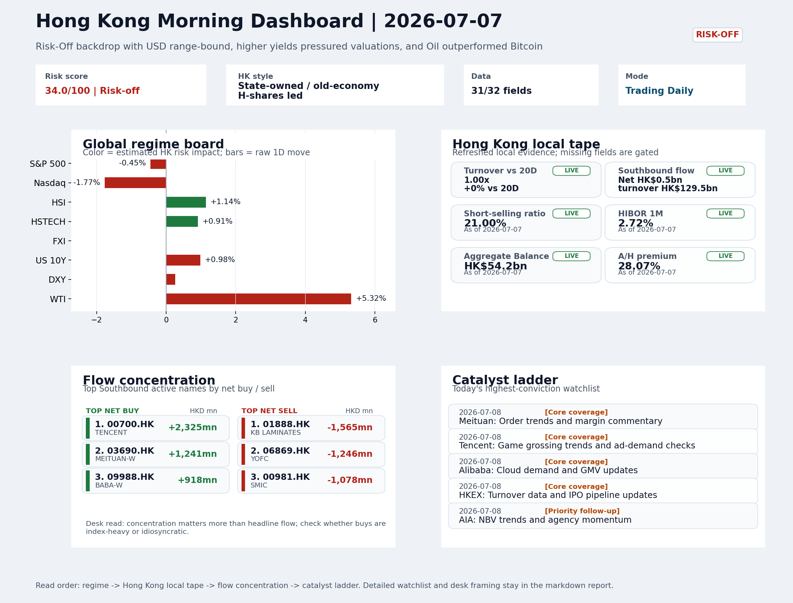

# Archived Professional Report | 2026-07-08

This is the GitHub landing page for the archived report dated `2026-07-08`.

- Report date: `2026-07-08`
- Report mode: `Trading Daily`
- Quality: `88.7/100`
- One-line pulse: Risk-Off overnight setup (Nasdaq -1.77%, 10Y +0.98%, VIX 16.13) and a 21% short-selling ratio argue for a soft Hong...
- Latest published entry: [latest/README.md](../../latest/README.md)
- Archive gallery: [archive/README.md](../README.md)
- Direct markdown file: [morning_briefing.md](./morning_briefing.md)
- Dashboard: [Open image](charts/dashboard_2026-07-08.png)
- Catalyst & Event Radar: N/A
- Daily One Chart: [Open image](charts/daily_one_chart_2026-07-08.png)
- Trend Pack: N/A
- Raw bundle: N/A
- Integrity manifest: [Verify SHA-256 payload](manifest.json)

## Dashboard Preview

## How to use this folder

1. Start with the dashboard preview for a quick visual read.
2. Open [morning_briefing.md](./morning_briefing.md) for the full report text.
3. Use `charts/` and `raw/` only when you need supporting assets or audit data.
