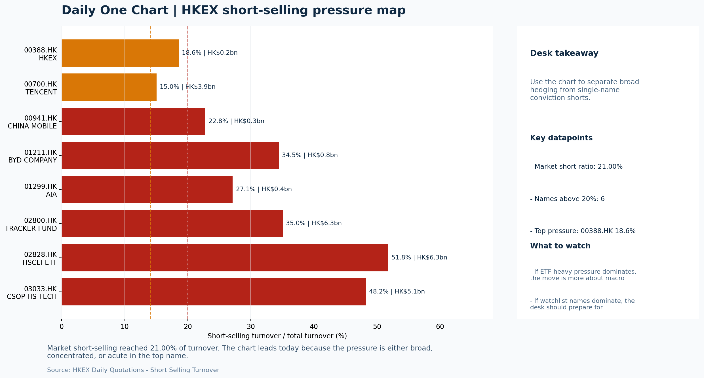

# Morning Research Workbench | 2026-07-08

> Designed for a Hong Kong sell-side commute: Layer 1 `Scan`, Layer 2 `Deep Read`, Layer 3 `Thinking`
> Mode: `Trading Daily` | Keep the report execution-oriented: what mattered in the completed session, what can move Hong Kong leadership, and what needs fast follow-up.
> Briefing date: `2026-07-08` | Review date: `2026-07-07` | Global request: `2026-07-07` | HK/China request: `2026-07-07` | Market effective date: `2026-07-07` | Generated at: `2026-07-08 06:10:56`

## Executive Summary

- **Market pulse:** Risk-Off overnight setup (Nasdaq -1.77%, 10Y +0.98%, VIX 16.13) and a 21% short-selling ratio argue for a soft Hong Kong open, with the key question being whether energy can hold as.
- **Hong Kong lens:** State-owned / old-economy H-shares led. Expect a soft open with HSTECH likely testing lower levels, mirroring Nasdaq weakness. Energy-linked sectors may offer relative resilience, but elevated short-selling and.
- **Top catalysts:** INTC -6.33%; Risk-Off backdrop with USD range-bound, higher yields pressured valuations, and Oil outperformed Bitcoin.

## Visual Dashboard

## Layer 1 | Scan (5-10 min)

### 1.1 One-Line Market Pulse
Risk-Off overnight setup (Nasdaq -1.77%, 10Y +0.98%, VIX 16.13) and a 21% short-selling ratio argue for a soft Hong Kong open, with the key question being whether energy can hold as a relative anchor while HSTECH tests Monday's underperformance.

### 1.2 Global Asset Price Dashboard

| Asset | Last | 1D move | Read |
| --- | --- | --- | --- |
| S&P 500 | 7,503.85 | -0.45% | US large-cap risk appetite |
| Nasdaq 100 | 29,173.02 | **-1.77%** | Growth and duration leadership |
| Hang Seng Index | 23,616.32 | +1.14% | Hong Kong broad beta |
| Hang Seng TECH | 4.4560 | +0.91% | Hong Kong growth / platform read-through |
| CSI 300 | 4,842.17 | +0.62% | Mainland large-cap tone |
| US 10Y | 4.5290 | +0.98% | Global discount-rate anchor |
| China 10Y | 1.74% | +0.3bp | China local rates anchor \| Live public \| Eastmoney \| 2026-07-07 |
| CN-US 10Y spread | -280.9bp | -6.7bp | Relative carry and macro-pressure gauge \| Live public \| Eastmoney \| 2026-07-07 |
| DXY | 101.11 | +0.26% | Dollar liquidity impulse |
| USD/CNH | 6.7710 | +0.00% | Offshore China risk appetite |
| USD/HKD | 7.8409 | -0.02% | Linked-exchange regime stress check |
| Brent crude | 75.86 | **+5.38%** | Energy / geopolitics |
| COMEX gold | 4,116.60 | -0.93% | Hedge demand / real yields |
| Copper | 6.1820 | +0.06% | Global growth proxy |
| VIX | 16.13 | **+3.60%** | US stress barometer |

### 1.3 Hong Kong Key Data Quick Check

| Check | Value | Status | Source / as of | Why it matters |
| --- | --- | --- | --- | --- |
| Main Board turnover vs 20D | 1.00x \| +0% vs 20D | Live local | HKEX \| 2026-07-07 | Trailing 20-session average turnover was HK$319.5bn. |
| Southbound / Northbound net flow | Southbound Net HK$0.5bn \| turnover HK$129.5bn \| Northbound Turnover HK$337.0bn \| net not reported | Live local | HKEX Connect \| 2026-07-07 | Southbound net buy is calculated from HKEX disclosed buy and sell turnover. |
| Short-selling ratio | 21.00% | Live local | HKEX \| 2026-07-07 | Official HKEX stock-level short-selling table, aggregated as a share of total market turnover. |
| AH premium index | 28.07% | Live public | Yahoo \| 2026-07-07 | Simple average across 18 A/H pairs; use dispersion rather than the average alone. |
| USD/HKD spot vs band | 7.8409 \| band 7.7500 to 7.8500 | Live quote + local | Yahoo \| 2026-07-07 | Inside the linked-exchange band without immediate boundary stress. Official Convertibility Undertakings define the linked-rate stress boundaries for USD/HKD. |
| HIBOR 1M | 2.72% | Live local | HKMA \| 2026-07-07 | 1M HIBOR is the cleanest quick read for Hong Kong funding conditions and equity-duration pressure. |
| Aggregate Balance | HK$54.2bn | Live local | HKMA \| 2026-07-07 | Aggregate Balance helps frame whether linked-rate liquidity conditions are tight or comfortable. |
| Hong Kong leadership | State-owned / old-economy H-shares led | Proxy | HSI / HSCEI / HSTECH relative perf \| 2026-07-07 | Use HSI / HSCEI / HSTECH relative moves as the opening style read. |

### 1.4 Risk Dashboard
**Composite risk score:** `34.0/100` | **Regime:** `Risk-off`

| Component | Score impact | Evidence |
| --- | --- | --- |
| US beta | -2.7 | S&P 500 -0.45% |
| HK growth | +4.5 | HSTECH +0.91% |
| Offshore China proxy | +0.0 | FXI +0.00% |
| Dollar pressure | -2.6 | DXY +0.26% |
| Volatility | -7.2 | VIX +3.60% |
| HK short-selling | -8 | Short-selling ratio 21.00% |

### 1.5 Morning Checklist
1. **INTC -6.33%**
 Mover attribution | Announcement / expectations | Guidance reset and margin pressure
2. **Risk-Off backdrop with USD range-bound, higher yields pressured valuations, and Oil outperformed Bitcoin**
 Overnight regime | Start by deciding whether the day is about Risk-Off conditions or a style pivot.
3. **CPI MoM (Released)**
 Macro / policy | Rates expectations, the dollar, and growth-equity valuation | Industries: Technology, Internet, Brokers
4. **[A] Alibaba-affiliate Ant Group rushes into humanoid robots with a dozen deals in 18 months**
 News / announcements | Capital allocation or shareholder-return events can trigger a valuation reset
5. **WTI crude +5.32%**
 High-frequency data | A strong crude move needs to be split between geopolitics and demand repair.

## Layer 2 | Deep Read (20-30 min)

### 2.1 Overnight Overseas Market Review
#### Market Setup
**Core tape.** US equities slipped overnight in a risk-off turn as higher yields pressured valuation-sensitive growth names, while crude oil surged on geopolitics.
**Main driver.** The Nasdaq 100 lagged materially, weighing on the global growth-style trade.
**HK relevance.** This backdrop keeps the focus on whether Hong Kong's previous session's gains can be sustained.

#### Key Drivers
- Higher US Treasury yields pressured long-duration growth, directly dragging Nasdaq 100 -1.77% and cooling appetite for Hong Kong tech.
- Crude oil spiked +5.32%, acting as a mixed factor.
- US growth-style transmission dampens overnight sentiment for HSTECH, with attribution scores confirming it as a notable drag on Hong Kong.
- Elevated short-selling in Hong Kong (21% ratio) signals that local rebounds require stronger breadth and flow confirmation before chasing.

#### Hong Kong Read-Through
**Desk lens.** State-owned / old-economy H-shares led.
**Opening implication.** Expect a soft open with HSTECH likely testing lower levels, mirroring Nasdaq weakness. Energy-linked sectors may offer relative resilience.
- **Cross-market read:** Hang Seng +1.14% / HSCEI +1.46% / HSTECH +0.91%.
- **Cross-market read:** Offshore China proxy FXI +0.00% and USD/CNH +0.00% frame cross-border risk appetite.
- **Cross-market read:** USD/HKD last traded around 7.8409, which keeps the Hong Kong funding lens in focus.

#### Watch Points
- USD composite moved higher by +0.11pct intraday, with a 0.23pct range.
- Main turning points appeared around 2026-07-07 08:05 trough / 2026-07-07 08:25 peak / 2026-07-07 08:40 trough, suggesting event-driven repricing.
- The biggest cross-asset divergence was Oil versus Bitcoin, a spread of 5.71pct.
- Gold moved -0.67pct intraday with a 1.93pct high-low range.

**Curated overnight stories**
1. **Alibaba-affiliate Ant Group leads $73.6M round in humanoid robotics startup Zeroth**
 Why it matters: Ant Group has completed 12 deals in humanoid robotics over 18 months, signalling a material capital allocation shift at the Alibaba affiliate.
 HK read-through: Direct read-through to Alibaba (9988 HK) and close China internet peers. Signals continued tech diversification thesis but also raises questions about capital return.
2. **Risk-Off regime with USD range-bound; higher yields pressuring valuations**
 Why it matters: This is the dominant overnight market regime. USD stability limits immediate EM/currency stress but higher yields are a structural headwind for Hong Kong-listed growth.
 HK read-through: Risk-Off framing tilts bias toward defensives and away from high-duration growth names on the HSI. Tech and internet indices most exposed to yield sensitivity.
3. **WTI crude +5.32%, Oil outperforms Bitcoin**
 Why it matters: A sharp crude bounce in a Risk-Off session splits between geopolitical premium and demand-repair optimism. Oil outperforming crypto signals classic risk-asset retreat.
 HK read-through: Mixed signal for Hong Kong. Positive for energy names (, ) but raises input cost concerns for China industrials and airlines. Margin pressure narrative re-emerges.
4. **Intel guides lower; INTC -6.33% premarket**
 Why it matters: Guidance reset and margin pressure at Intel. Score 108 mover attribution flags this as a significant overnight catalyst with sector-level implications.
 HK read-through: Global semi sentiment weakens. Flows through to Hong Kong-listed semiconductor names and EMS/tech manufacturing. Adds caution to China tech hardware names ahead of Wednesday.
5. **CPI MoM data released; BlackRock flags China AI as stock-specific, not regional trade**
 Why it matters: CPI release sets the tone for US rates expectations, USD direction, and global growth-equity positioning.
 HK read-through: Softer CPI supports rate-cut timing, which is constructive for HK growth sentiment over medium term. BlackRock view limits broad-based China tech rally potential.

### 2.2 Hong Kong / A-share Previous-Day Review
#### Local Tape Setup
**Local read.** Hong Kong's Monday session ended higher with HSCEI +1.46% leading HSTECH +0.91%, marking a value-led move driven by state-owned and old-economy names while growth lagged.
**Verification point.** The overnight risk-off turn (Nasdaq -1.77%, US 10Y yield +0.98%) directly challenges that growth underperformance, and a local short-selling ratio of 21% suggests the rebound lacks clean breadth and flow confirmation.
**Risk to watch.** Southbound net buying was marginal at HK$0.5bn with selective interest in Tencent and Meituan; Northbound net data is unavailable, leaving A-share flow conviction incomplete.

#### Style and Local Leadership
**Style leadership.** State-owned / old-economy H-shares led.
- **Cross-market read:** Hang Seng +1.14% / HSCEI +1.46% / HSTECH +0.91%.
- **Cross-market read:** Offshore China proxy FXI +0.00% and USD/CNH +0.00% frame cross-border risk appetite.
- **Cross-market read:** USD/HKD last traded around 7.8409, which keeps the Hong Kong funding lens in focus.

#### Flow Confirmation
Official Stock Connect evidence is available; use Section 2.3 to confirm whether local money supports the price action.

#### Follow-Through Checklist
**Follow-through check.** Watch whether HSTECH can reverse Monday's underperformance and hold above its session low.

### 2.3 Flow Tracker and Attribution
#### Cross-Asset Attribution v1

| Driver | Direction | Score | Evidence | HK implication |
| --- | --- | --- | --- | --- |
| Oil and geopolitics | mixed | 4.3 | Oil moved +5.38%. | Split the read between energy/cyclicals support and margin/geopolitical pressure. |
| Short-selling pressure | drag | 4.2 | HKEX short-selling ratio was 21.00%. | Elevated short activity argues for extra confirmation before chasing rebounds. |
| US growth-style transmission | drag | 2.48 | Nasdaq 100 moved -1.77%. | Hong Kong growth and platform names should be tested first at the open. |
| Rates impulse | drag | 1.18 | US 10Y yield proxy moved +0.98%. | Lower yields help long-duration growth; higher yields pressure valuation-sensitive |
| Dollar / CNH pressure | drag | 0.39 | DXY +0.26% / USD-CNH +0.00% | A stable or softer CNH makes Hong Kong follow-through more credible. |

#### Flow Tracker
##### Flow Takeaways
- Short-selling pressure is elevated, so local rebounds need cleaner breadth and flow confirmation.
- Stock Connect Southbound: net HK$0.5bn on turnover HK$129.5bn (as of 2026-07-07).
- Stock Connect Northbound: turnover RMB337.0bn; public file provides total turnover/top active names, not full net-buy.
- AH premium: simple covered-pair average +28.07%; widest premium: China Communications Construction 78.84%.

##### Stock Connect Southbound Active Names

| Rank | Ticker | Name | Buy | Sell | Net buy |
| --- | --- | --- | --- | --- | --- |
| 1 | 00700.HK | TENCENT | HK$7,983.5mn | HK$5,658.8mn | HK$2,324.8mn |
| 4 | 01888.HK | KB LAMINATES | HK$2,069.8mn | HK$3,634.6mn | HK$-1,564.8mn |
| 3 | 06869.HK | YOFC | HK$2,771.1mn | HK$4,017.5mn | HK$-1,246.4mn |
| 4 | 03690.HK | MEITUAN-W | HK$2,151.4mn | HK$910.7mn | HK$1,240.8mn |
| 2 | 00981.HK | SMIC | HK$3,861.7mn | HK$4,939.9mn | HK$-1,078.2mn |

##### AH Premium Dispersion

| Name | A ticker | H ticker | Premium | As of |
| --- | --- | --- | --- | --- |
| China Communications Construction | 601800.SS | 1800.HK | +78.84% | 2026-07-07 |
| China Life | 601628.SS | 2628.HK | +53.00% | 2026-07-07 |
| China Railway Construction | 601186.SS | 1186.HK | +49.09% | 2026-07-07 |
| China Railway | 601390.SS | 0390.HK | +48.28% | 2026-07-07 |
| China Construction Bank | 601939.SS | 0939.HK | +46.01% | 2026-07-07 |

##### HKEX Short-Selling Watch

| Ticker | Name | Short ratio | Short turnover | Total turnover |
| --- | --- | --- | --- | --- |
| 00388.HK | HKEX | 18.56% | HK$0.2bn | HK$1.0bn |
| 00700.HK | TENCENT | 15.03% | HK$3.9bn | HK$25.9bn |
| 00941.HK | CHINA MOBILE | 22.80% | HK$0.3bn | HK$1.1bn |
| 01211.HK | BYD COMPANY | 34.45% | HK$0.8bn | HK$2.2bn |
| 01299.HK | AIA | 27.13% | HK$0.4bn | HK$1.6bn |

- **Short-value leaders:** 07709.HK XL2CSOPHYNIX (HK$6.8bn); 02828.HK HSCEI ETF (HK$6.3bn); 02800.HK TRACKER FUND (HK$6.3bn); 03033.HK CSOP HS TECH (HK$5.1bn).

### 2.4 Macro and Policy Tracking
**Desk read.** The macro calendar today features a Risk-Off setup that warrants execution discipline.

**Market sensitivity.** US CPI MoM released at +0.3% (forecast +0.2%, prior +0.4%), a mild upside surprise that keeps pressure on duration assets and supports the hawkish Fed repricing already visible in the 10Y yield at 4.529% (+0.98%).

**HK implication.** Higher yields are compressing long-duration and growth valuations, consistent with the underperformance of Bitcoin (-0.97%) versus crude (+5.32%) as risk assets de-risk.

**Macro watchpoints**
- US 10Y yield trajectory after CPI confirmation and ahead of Powell.
- VIX level and whether 16.13 acts as a ceiling or floor for vol selling.
- HK growth proxies (HSI components) relative to energy and financials in early session.
- US Retail Sales actual versus 0.3% forecast and whether it reinforces or breaks the Risk-Off theme.

| Time | Region | Event | Status | Desk read |
| --- | --- | --- | --- | --- |
| 20:30 | US | CPI MoM | Released | Impact: Rates expectations, the dollar, and growth-equity valuation \| Attention: 5/5 \| Industries: Technology, Internet, Brokers |
| 09:30 | China | Trade Balance | Released | Impact: Watch whether it changes the day's core market narrative \| Attention: 3/5 \| Industries: Market-wide |
| 20:30 | US | Retail Sales MoM | Upcoming | Impact: Consumer resilience, growth expectations, and risk-asset pricing \| Attention: 5/5 \| Industries: Consumer, E-commerce, Consumer discretionary |
| 09:20 | China | Loan Prime Rate | Upcoming | Impact: Watch whether it changes the day's core market narrative \| Attention: 3/5 \| Industries: Market-wide |
| 22:00 | Federal Reserve | Jerome Powell: Economic outlook remarks | Central bank | Impact: Policy path, liquidity conditions, and cross-asset risk appetite \| Attention: 5/5 \| Industries: Technology, Financials, Gold |
| 10:00 | PBOC | Open Market Operations Desk: Daily liquidity operation window | Central bank | Impact: Policy path, liquidity conditions, and cross-asset risk appetite \| Attention: 3/5 \| Industries: Technology, Financials, Gold |

#### Positioning and Risk Backdrop
- Options activity centered on KWEB Call, with Vol/OI at 1.88x and a bullish bias.
- Put/Call structure shows equity 0.68 / index 1.15, implying Single-stock optimism with index hedging.
- Geopolitics: Middle East | Regional tension remains elevated | Impact: Oil, freight costs, and safe-haven demand
- Geopolitics: US-China | Technology export-control rhetoric remains active | Impact: China internet, semiconductors, and supply chains

### 2.5 Key Company and Sector Events

| Grade | Sector | Headline | Why it matters | Horizon |
| --- | --- | --- | --- | --- |
| A | China Internet | Alibaba-affiliate Ant Group rushes into humanoid robots with a dozen | Capital allocation or shareholder-return events can trigger a valuation | Medium-term trend |

#### HKEX Announcements

| Grade | Ticker | Type | Release time | Title |
| --- | --- | --- | --- | --- |
| A | 00196.HK | Profit warning | 2026-07-07 | Profit warning / alert announcement |
| A | 00255.HK | Profit warning | 2026-07-07 | Profit warning / alert announcement |
| A | 00268.HK | Profit warning | 2026-07-07 | Profit warning / alert announcement |
| A | 00301.HK | Profit warning | 2026-07-07 | Profit warning / alert announcement |
| A | 01385.HK | Profit warning | 2026-07-07 | Profit warning / alert announcement |
| A | 01729.HK | Profit warning | 2026-07-07 | Profit warning / alert announcement |
| A | 01989.HK | Profit warning | 2026-07-07 | Profit warning / alert announcement |
| A | 02327.HK | Profit warning | 2026-07-07 | Profit warning / alert announcement |

#### Earnings / Results Watch

| Ticker | Company | Timing | Expectation framing |
| --- | --- | --- | --- |
| 0700.HK | Tencent Holdings | After Market Close | EPS est. 4.15 HKD \| revenue est. 163.2bn HKD |
| 0388.HK | Hong Kong Exchanges and Clearing | Before Market Open | EPS est. 2.81 HKD \| revenue est. 6.0bn HKD |

#### Rating Changes
- **9988.HK** | Morgan Stanley | Upgrade | Equal Weight -> Overweight | PT 92 -> 105

#### IPO Watch
- IPO and grey-market monitoring is not yet part of the standard production pack.

### 2.6 Today's Core Names
#### Core coverage

| Name | Ticker | Last | 1D | Range position | Morning note |
| --- | --- | --- | --- | --- | --- |
| Meituan | 3690.HK | 78.35 | +4.54% | Mid-range | Short-term price strength is clear; fresh catalysts could trigger broader group follow-through. |
| Tencent | 0700.HK | 461.20 | +2.04% | Mid-range | Short-term price strength is clear; fresh catalysts could trigger broader group follow-through. |

**Recent headlines for Meituan:**
- [Smart glasses maker Even Realities hits $1B valuation with $150M funding led by Meituan, Tencent](https://finance.yahoo.com/technology/articles/smart-glasses-maker-even-realities-090000351.html) (TechCrunch)

#### Priority follow-up

| Name | Ticker | Last | 1D | Range position | Morning note |
| --- | --- | --- | --- | --- | --- |
| AIA | 1299.HK | 72.60 | -1.89% | Bottom of range | The name sits near the bottom of its recent range and is worth monitoring for a catalyst-led reversal. |
| BYD Company | 1211.HK | 83.45 | -0.42% | Mid-range | Positioning is neutral for now, so use it mainly to monitor marginal information changes. |

## Layer 3 | Thinking (10-15 min)

### 3.1 Rotating Theme Deep Dive

| Field | Read |
| --- | --- |
| Theme | Innovative Biotech and Out-Licensing |
| Angle for the day | Watch whether clinical data, approvals, and licensing momentum are still supporting the innovative-healthcare rerating story. |

**Theme desk read**
**Core thesis.** The innovative biotech and out-licensing theme lacks direct daily triggers in today's desk flow.
**Evidence.** Overnight signals were dominated by crude (+5.32%), higher VIX, and macro releases - none specific to the sector.
**What to test.** The two related names supplied, Meituan and AIA, do not sit in the innovative-healthcare space, and there are no clinical data points, approvals, or licensing headlines in the current news feed.

**Signals to keep in mind**
- WTI crude +5.32%: A strong crude move needs to be split between geopolitics and demand repair.
- VIX +3.60%: Higher volatility argues for tighter sizing and tighter stops.

**LLM watch items:**
- Check for upcoming clinical trial readouts or regulatory decisions from major HK-listed innovative biotech names.
- Monitor for out-licensing deal announcements or partnership news that would directly support the narrative.
- Watch whether the current risk-off backdrop amplifies duration sensitivity across the healthcare growth bucket.

**Related names to keep close:**

| Name | Ticker | Bucket | Morning read |
| --- | --- | --- | --- |
| Meituan | 3690.HK | Core coverage | Short-term price strength is clear; fresh catalysts could trigger broader group follow-through. |
| AIA | 1299.HK | Priority follow-up | The name sits near the bottom of its recent range and is worth monitoring for a catalyst-led reversal. |

### 3.2 Today Ahead and Trading Calendar
- Macro: CPI MoM is the first item to anchor the open and the rates/FX response.
- Corporate / event: Meituan: Order trends and margin commentary is the cleanest same-day catalyst to prepare for.

**Same-day macro docket**

| Time | Country | Event | Status | Detail |
| --- | --- | --- | --- | --- |
| 20:30 | US | CPI MoM | Released | Actual 0.3% / Forecast 0.2% / Prior 0.4% |
| 09:30 | China | Trade Balance | Released | Actual USD 85.2bn / Forecast USD 79.0bn / Prior USD 80.6bn |
| 20:30 | US | Retail Sales MoM | Upcoming | Forecast 0.3% / Prior 0.6% |
| 09:20 | China | Loan Prime Rate | Upcoming | Forecast 3.45% / Prior 3.45% |
| 22:00 | Federal Reserve | Jerome Powell: Economic outlook remarks | Central bank | speech |

**Same-day catalyst list**

| Date | Time | Category | Event | Importance |
| --- | --- | --- | --- | --- |
| 2026-07-08 | | Core coverage | Meituan: Order trends and margin commentary | 3 |
| 2026-07-08 | | Core coverage | Tencent: Game grossing trends and ad-demand checks | 3 |
| 2026-07-08 | | Core coverage | Alibaba: Cloud demand and GMV updates | 3 |
| 2026-07-08 | | Core coverage | HKEX: Turnover data and IPO pipeline updates | 3 |

**Next few sessions**

| Date | Category | Event | Impact |
| --- | --- | --- | --- |
| 2026-07-08 | Core coverage | Meituan: Order trends and margin commentary | High-frequency read on local services demand and platform competition |
| 2026-07-08 | Core coverage | Tencent: Game grossing trends and ad-demand checks | Core offshore China platform proxy for gaming, ads, and AI monetization |
| 2026-07-08 | Core coverage | Alibaba: Cloud demand and GMV updates | Key read-through for China consumption, cloud, and platform regulation |
| 2026-07-08 | Core coverage | HKEX: Turnover data and IPO pipeline updates | Direct proxy for Hong Kong market turnover, listings, and southbound |

### 3.3 Daily One Chart
**Daily One Chart | HKEX short-selling pressure map**

**Chart read.** Market short-selling reached 21.00% of turnover.
**Why it matters.** The chart leads today because the pressure is either broad, concentrated, or acute in the top name.

_Source: HKEX Daily Quotations - Short Selling Turnover_

## Traceable Appendix

### Report Metadata
> Date policy: Review date 2026-07-07 is treated as `Trading Daily`. | Global request date is 2026-07-07; adapter effective date is 2026-07-07 and summary date is 2026-07-07. | HK/China local data date is 2026-07-07; role: same-session local cash tape.
> Market data quality: Coverage: `31/32` | Stale items (>1d): `1` | Missing: `1`
> Report quality: `88.7/100` | Grade `B` | Status `production ready`

### Key Questions to Keep in Mind
- Is risk appetite rising or fading? The overnight tape reads closer to `Risk-Off`.
- Did rates expectations move? Focus on whether US 10Y, DXY, and growth style moved together.
- Were commodities the real story? Watch WTI and gold for geopolitics versus inflation signals.
- Is Hong Kong setup internet-led, SOE-led, or broad beta-led? Compare HSTECH, HSCEI, and HSI.
- Did offshore markets move China risk appetite? Focus on HSI, FXI, USD/CNH, and USD/HKD.

### Report Quality and Validation
- **Quality score:** 88.7/100 | **Grade:** B | **Status:** production ready
- **Run summary:** 7 healthy | 1 caveat | 0 failed
- **Release recommendation:** Send with caveats | The report is usable, but the advisory guidance should travel with it so readers understand the data gaps.

| Source | Status | Bucket |
| --- | --- | --- |
| Market data | ok | healthy |
| Sector and company news | ok | healthy |
| Movers and short selling | ok | healthy |
| Stock Connect | ok | healthy |
| A/H premium | ok | healthy |
| Hong Kong local package | ok | healthy |
| China rates | ok | healthy |
| Narrative overlay | partial | caveat |

**Desk-use guidance summary:** 0 blocking | 1 advisory

**Desk-use guidance**
- **Advisory:** Use deterministic sections as primary support; the narrative overlay was partial or unavailable on this run.

| Component | Score | Weight | Read |
| --- | --- | --- | --- |
| Market data coverage | 96.9 | 0.3 | 31/32 core market fields available. |
| Hong Kong local metrics | 82.3 | 0.25 | 8 live, 3 proxy, 0 unavailable local checks. |
| Key public adapters | 100.0 | 0.2 | 4/4 key adapters were available or partially available. |
| Narrative overlay health | 60.0 | 0.15 | 3/7 narrative overlay tasks succeeded or used validated cache; 1 error(s). |
| Fact-check guardrail | 100.0 | 0.1 | Checked 0 numeric claims; 0 numeric mismatch(es), 0 logic warning(s); 0 critical, 0 review. |

**Narrative fact-check guardrail**
- Checked 0 numeric claims; 0 numeric mismatch(es), 0 logic warning(s); 0 critical, 0 review.

**Adapter status**

| Adapter | Status |
| --- | --- |
| Stock Connect | ok |
| A/H premium | ok |
| HKEX announcements | ok |
| China rates | ok |

### Source Links
- [Alibaba-affiliate Ant Group rushes into humanoid robots with a dozen deals in 18 months](https://www.cnbc.com/2026/07/01/alibaba-affiliate-ant-group-enters-the-humanoid-robot-market-with-12-deals.html) (cnbc_markets)
- [Smart glasses maker Even Realities hits $1B valuation with $150M funding led by Meituan, Tencent](https://finance.yahoo.com/technology/articles/smart-glasses-maker-even-realities-090000351.html) (TechCrunch)
- [00196.HK Profit warning / alert announcement](http://www1.hkexnews.hk/listedco/listconews/sehk/2026/0707/2026070700818.pdf) (HKEXnews)
- [00255.HK Profit warning / alert announcement](http://www1.hkexnews.hk/listedco/listconews/sehk/2026/0707/2026070700480.docx) (HKEXnews)
- [00268.HK Profit warning / alert announcement](http://www1.hkexnews.hk/listedco/listconews/sehk/2026/0707/2026070700770.pdf) (HKEXnews)
- [00301.HK Profit warning / alert announcement](http://www1.hkexnews.hk/listedco/listconews/sehk/2026/0707/2026070701538.pdf) (HKEXnews)
- [01385.HK Profit warning / alert announcement](http://www1.hkexnews.hk/listedco/listconews/sehk/2026/0707/2026070701885.pdf) (HKEXnews)
- [01729.HK Profit warning / alert announcement](http://www1.hkexnews.hk/listedco/listconews/sehk/2026/0707/2026070701434.pdf) (HKEXnews)
- [01989.HK Profit warning / alert announcement](http://www1.hkexnews.hk/listedco/listconews/sehk/2026/0707/2026070701869.pdf) (HKEXnews)
- [02327.HK Profit warning / alert announcement](http://www1.hkexnews.hk/listedco/listconews/sehk/2026/0707/2026070701076.pdf) (HKEXnews)

## Supplementary Visual Appendix

This appendix is professional-path only. It keeps a traceable index of the report visuals and the deterministic chart cues used to frame the morning note, without injecting the legacy intraday chart pack.

### Visual Index

| Visual | Path | Role |
| --- | --- | --- |
| Visual Dashboard | `charts/dashboard_2026-07-08.png` | Cross-asset regime board and Hong Kong local tape snapshot. |
| Daily One Chart | `charts/daily_one_chart_2026-07-08.png` | Single highest-conviction visual story for the day. |

### Deterministic Chart Cues
- FX / liquidity: USD composite moved higher by +0.11pct intraday, with a 0.23pct range.
- FX / liquidity: Main turning points appeared around 2026-07-07 08:05 trough / 2026-07-07 08:25 peak / 2026-07-07 08:40 trough, suggesting event-driven repricing rather than a clean one-way USD move.
- Cross-asset: The biggest cross-asset divergence was Oil versus Bitcoin, a spread of 5.71pct.
- Cross-asset: Gold moved -0.67pct intraday with a 1.93pct high-low range.
- Cross-asset: Oil moved +4.71pct intraday with a 4.931pct high-low range.
- Cross-asset: Bitcoin moved -1.00pct intraday with a 2.252pct high-low range.

### Risk Dashboard Components

| Component | Score impact | Evidence |
| --- | --- | --- |
| US beta | -2.7 | S&P 500 -0.45% |
| HK growth | +4.5 | HSTECH +0.91% |
| Offshore China proxy | +0.0 | FXI +0.00% |
| Dollar pressure | -2.6 | DXY +0.26% |
| Volatility | -7.2 | VIX +3.60% |
| HK short-selling | -8 | Short-selling ratio 21.00% |
