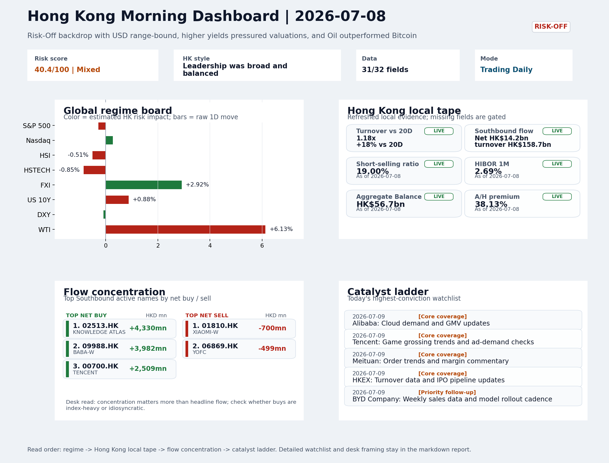
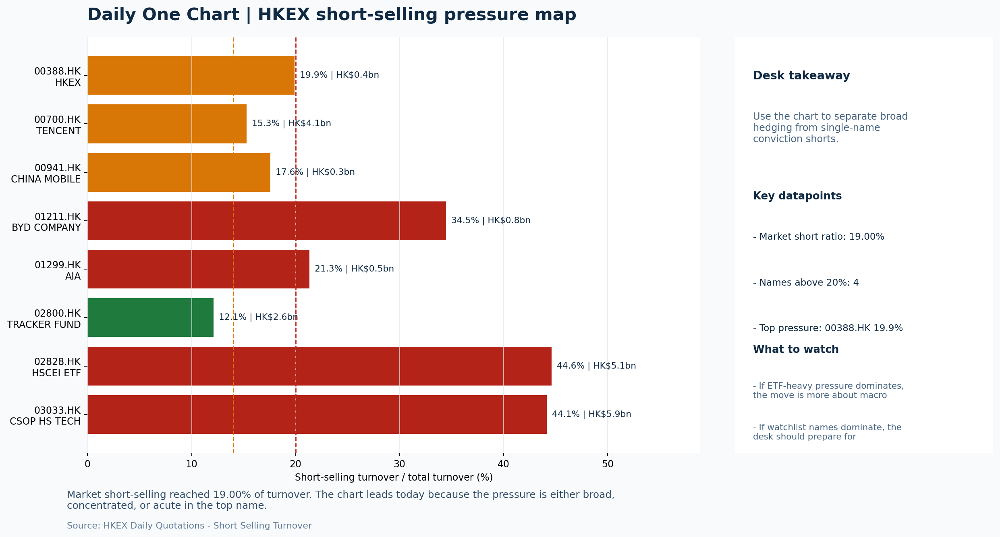

# Morning Research Workbench | 2026-07-09

> Designed for a Hong Kong sell-side commute: Layer 1 `Scan`, Layer 2 `Deep Read`, Layer 3 `Thinking`
> Mode: `Trading Daily` | Keep the report execution-oriented: what mattered in the completed session, what can move Hong Kong leadership, and what needs fast follow-up.
> Briefing date: `2026-07-09` | Review date: `2026-07-08` | Global request: `2026-07-08` | HK/China request: `2026-07-08` | Market effective date: `2026-07-08` | Generated at: `2026-07-09 06:04:19`

## Executive Summary

- **Market pulse:** Overnight Risk-Off conditions, with higher yields and oil strength, leave Hong Kong facing a mixed open: FXI outperformed but HSTECH lagged and short-selling stayed elevated, so cleaner.
- **Hong Kong lens:** China large-cap offshore led (FXI), with Hong Kong tech lagging; growth/glamour needs HSTECH to catch up to confirm breadth.. The HK open lacks clean momentum given HSTECH's underperformance and elevated short-selling, but FXI's relative strength sets a floor for China large-cap names if it holds.
- **Top catalysts:** INTC -6.33%; WTI crude +6.13%.

## Visual Dashboard

## Layer 1 | Scan (5-10 min)

### 1.1 One-Line Market Pulse
Overnight Risk-Off conditions, with higher yields and oil strength, leave Hong Kong facing a mixed open: FXI outperformed but HSTECH lagged and short-selling stayed elevated, so cleaner breadth confirmation is needed before trusting any local rebound.

### 1.2 Global Asset Price Dashboard

| Asset | Last | 1D move | Read |
| --- | --- | --- | --- |
| S&P 500 | 7,482.71 | -0.28% | US large-cap risk appetite |
| Nasdaq 100 | 29,252.56 | +0.27% | Growth and duration leadership |
| Hang Seng Index | 23,496.89 | -0.51% | Hong Kong broad beta |
| Hang Seng TECH | 4.4180 | -0.85% | Hong Kong growth / platform read-through |
| CSI 300 | 4,842.17 | +0.62% | Mainland large-cap tone |
| US 10Y | 4.5690 | +0.88% | Global discount-rate anchor |
| China 10Y | 1.74% | -0.2bp | China local rates anchor \| Live public \| Eastmoney \| 2026-07-08 |
| CN-US 10Y spread | -282.1bp | -1.2bp | Relative carry and macro-pressure gauge \| Live public \| Eastmoney \| 2026-07-08 |
| DXY | 101.05 | -0.09% | Dollar liquidity impulse |
| USD/CNH | 6.7755 | +0.00% | Offshore China risk appetite |
| USD/HKD | 7.8392 | -0.04% | Linked-exchange regime stress check |
| Brent crude | 79.25 | **+6.86%** | Energy / geopolitics |
| COMEX gold | 4,086.60 | -1.42% | Hedge demand / real yields |
| Copper | 6.1175 | -0.87% | Global growth proxy |
| VIX | 16.90 | **+4.77%** | US stress barometer |

### 1.3 Hong Kong Key Data Quick Check

| Check | Value | Status | Source / as of | Why it matters |
| --- | --- | --- | --- | --- |
| Main Board turnover vs 20D | 1.18x \| +18% vs 20D | Live local | HKEX \| 2026-07-08 | Trailing 20-session average turnover was HK$318.4bn. |
| Southbound / Northbound net flow | Southbound Net HK$14.2bn \| turnover HK$158.7bn \| Northbound Turnover HK$338.4bn \| net not reported | Live local | HKEX Connect \| 2026-07-08 | Southbound net buy is calculated from HKEX disclosed buy and sell turnover. |
| Short-selling ratio | 19.00% | Live local | HKEX \| 2026-07-08 | Official HKEX stock-level short-selling table, aggregated as a share of total market turnover. |
| AH premium index | 38.13% | Live public | Yahoo \| 2026-07-08 | Simple average across 16 A/H pairs; use dispersion rather than the average alone. |
| USD/HKD spot vs band | 7.8392 \| band 7.7500 to 7.8500 | Live quote + local | Yahoo \| 2026-07-08 | Inside the linked-exchange band without immediate boundary stress. Official Convertibility Undertakings define the linked-rate stress boundaries for USD/HKD. |
| HIBOR 1M | 2.69% | Live local | HKMA \| 2026-07-08 | 1M HIBOR is the cleanest quick read for Hong Kong funding conditions and equity-duration pressure. |
| Aggregate Balance | HK$56.7bn | Live local | HKMA \| 2026-07-08 | Aggregate Balance helps frame whether linked-rate liquidity conditions are tight or comfortable. |
| Hong Kong leadership | China large-cap offshore led (FXI), with Hong Kong tech lagging; growth/glamour needs HSTECH to catch up to confirm breadth. | Proxy | HSI / HSCEI / HSTECH relative perf \| 2026-07-08 | Use HSI / HSCEI / HSTECH relative moves as the opening style read. |

### 1.4 Risk Dashboard
**Composite risk score:** `40.4/100` | **Regime:** `Mixed`

| Component | Score impact | Evidence |
| --- | --- | --- |
| US beta | -1.7 | S&P 500 -0.28% |
| HK growth | -4.2 | HSTECH -0.85% |
| Offshore China proxy | +8 | FXI +2.92% |
| Dollar pressure | +0.9 | DXY -0.09% |
| Volatility | -9.5 | VIX +4.77% |
| HK short-selling | -8 | Short-selling ratio 19.00% |

### 1.5 Morning Checklist
1. **INTC -6.33%**
 Mover attribution | Announcement / expectations | Guidance reset and margin pressure
2. **WTI crude +6.13%**
 High-frequency data | A strong crude move needs to be split between geopolitics and demand repair.
3. **Risk-Off backdrop with USD range-bound, higher yields pressured valuations, and Oil outperformed Bitcoin**
 Overnight regime | Start by deciding whether the day is about Risk-Off conditions or a style pivot.
4. **CPI MoM (Released)**
 Macro / policy | Rates expectations, the dollar, and growth-equity valuation | Industries: Technology, Internet, Brokers
5. **Trade Balance (Released)**
 Macro / policy | Watch whether it changes the day's core market narrative | Industries: Market-wide

## Layer 2 | Deep Read (20-30 min)

### 2.1 Overnight Overseas Market Review
#### Market Setup
**Core tape.** Overnight markets settled into a Risk-Off pattern where Oil's sharp rally (+6.13%) collided with weakness across crypto, gold, and tech, reflecting a geopolitically-driven commodity surge rather than broad risk appetite.
**Main driver.** The Fed minutes showing internal division on rate direction kept the 10Y yield elevated (+0.88%), weighing on duration-sensitive sectors globally.
**HK relevance.** Euro Stoxx's larger decline (-1.22%) underscored that uncertainty is not just a US story.

#### Key Drivers
- WTI crude +6.13% on Strait of Hormuz disruption extending to 2027, splitting the market between energy/cyclicals and cost-pressured sectors.
- US 10Y yield +0.88% reflects Fed minutes showing division on rate direction, keeping higher-for-longer alive and pressuring long-duration.
- VIX +4.77% and Bitcoin -1.82% together confirm Risk-Off framing rather than a rotation within risk assets.
- Short-selling ratio held at 19%, indicating speculative positioning still adds drag to local Hong Kong rebounds.

#### Hong Kong Read-Through
**Desk lens.** Leadership was broad and balanced.
**Opening implication.** The HK open lacks clean momentum given HSTECH's underperformance and elevated short-selling.
- **Cross-market read:** Hang Seng -0.51% / HSCEI -0.54% / HSTECH -0.85%.
- **Cross-market read:** Offshore China proxy FXI +2.92% and USD/CNH +0.00% frame cross-border risk appetite.
- **Cross-market read:** USD/HKD last traded around 7.8392, which keeps the Hong Kong funding lens in focus.

#### Watch Points
- USD composite moved lower by -0.01pct intraday, with a 0.211pct range.
- Main turning points appeared around 2026-07-08 08:10 trough / 2026-07-08 08:25 peak / 2026-07-08 08:45 trough, suggesting event-driven repricing.
- The biggest cross-asset divergence was Oil versus Bitcoin, a spread of 5.281pct.
- Gold moved -1.24pct intraday with a 2.596pct high-low range.

**Curated overnight stories**
1. **Fed officials split on direction of interest rates at last meeting, minutes show**
 Why it matters: FOMC division suggests rates will stay higher for longer, keeping USD elevated and compressing growth/tech multiples globally.
 HK read-through: USD/HKD peg stability concerns resurface if USD strengthens further. Higher US rates pressure Hong Kong growth names, internet sector, and unprofitable tech.
2. **Strait of Hormuz traffic won't return to normal until 2027 after latest setback, Kalshi**
 Why it matters: Geopolitical supply constraint confirmed. WTI crude +6.13% reflects this structurally. Extends energy cost uncertainty well into 2026-2027, complicating inflation outlook.
 HK read-through: Mixed: supports Hong Kong and China energy names (CNOOC, PetroChina) but raises input cost headwinds for manufacturers, airlines, and transportation.
3. **BlackRock says the China AI play is stock-specific, not a regional trade**
 Why it matters: Institutional investor signals caution against broad China AI thematics. Reduces probability of large passive inflows into China tech/AI as a sector bucket.
 HK read-through: HK/China internet and AI names face stock-selection headwind from reduced thematic demand. Alibaba, Baidu, Tencent AI monetisation needs to be proven at company level, not.
4. **China warns about AI risks with Anthropic's Claude Code**
 Why it matters: China regulatory posture toward foreign AI tools hardening. Implies tighter control on AI development pathways, potentially slowing adoption of international AI standards.
 HK read-through: Adds friction to any China-tech-to-offshore AI integration narrative. Affects sentiment around Hong Kong-listed China tech names with AI ambitions tied to Western frameworks.
5. **INTC -6.33%: Announcement / expectations - Guidance reset and margin pressure**
 Why it matters: Semiconductor earnings miss/revision signals continued PC/data center demand uncertainty. Margin pressure reflects competitive dynamics, relevant for Asia semiconductor.
 HK read-through: Direct read-through to SMIC and other HK-listed chip names. May trigger risk-off in tech hardware and semis sub-sector if interpreted as demand weakness rather than.

### 2.2 Hong Kong / A-share Previous-Day Review
#### Local Tape Setup
**Local read.** The FXI-HSTECH divergence (+2.92% vs -0.85%) is the dominant local signal and deserves close attention today.
**Verification point.** FXI's outperformance suggests offshore China sentiment found a floor, but HSTECH's continued weakness means the local growth/glamour complex has not confirmed the same read.
**Risk to watch.** Southbound flows were constructive at HK$14.2bn net (driven by BABA +HK$3.98bn and TENCENT +HK$2.51bn), and ETF proxies show KWEB and FXI both attracting inflows.

#### Style and Local Leadership
**Style leadership.** China large-cap offshore led (FXI), with Hong Kong tech lagging; growth/glamour needs HSTECH to catch up to confirm breadth..
- **Cross-market read:** Hang Seng -0.51% / HSCEI -0.54% / HSTECH -0.85%.
- **Cross-market read:** Offshore China proxy FXI +2.92% and USD/CNH +0.00% frame cross-border risk appetite.
- **Cross-market read:** USD/HKD last traded around 7.8392, which keeps the Hong Kong funding lens in focus.

#### Flow Confirmation
Official Stock Connect evidence is available; use Section 2.3 to confirm whether local money supports the price action.

#### Follow-Through Checklist
**Follow-through check.** Confirm whether HSTECH closes the gap to FXI on the next session. If it does not, the offshore China proxy signal is likely a sector rotation within risk assets rather than a broad sentiment shift.

### 2.3 Flow Tracker and Attribution
#### Cross-Asset Attribution v1

| Driver | Direction | Score | Evidence | HK implication |
| --- | --- | --- | --- | --- |
| Oil and geopolitics | mixed | 5.49 | Oil moved +6.86%. | Split the read between energy/cyclicals support and margin/geopolitical pressure. |
| Short-selling pressure | drag | 2.8 | HKEX short-selling ratio was 19.00%. | Elevated short activity argues for extra confirmation before chasing rebounds. |
| Hong Kong participation | supportive | 1.81 | Main Board turnover was 1.18x the 20-session average. | Higher participation makes local price action more credible. |
| Rates impulse | drag | 1.06 | US 10Y yield proxy moved +0.88%. | Lower yields help long-duration growth; higher yields pressure valuation-sensitive |

#### Flow Tracker
##### Flow Takeaways
- Short-selling pressure is elevated, so local rebounds need cleaner breadth and flow confirmation.
- Stock Connect Southbound: net HK$14.2bn on turnover HK$158.7bn (as of 2026-07-08).
- Stock Connect Northbound: turnover RMB338.4bn; public file provides total turnover/top active names, not full net-buy.
- AH premium: simple covered-pair average +38.13%; widest premium: Chalco 186.05%.

##### Stock Connect Southbound Active Names

| Rank | Ticker | Name | Buy | Sell | Net buy |
| --- | --- | --- | --- | --- | --- |
| 4 | 02513.HK | KNOWLEDGE ATLAS | HK$6,437.8mn | HK$2,107.9mn | HK$4,329.9mn |
| 1 | 09988.HK | BABA-W | HK$10,592.5mn | HK$6,610.3mn | HK$3,982.2mn |
| 2 | 00700.HK | TENCENT | HK$8,935.5mn | HK$6,426.8mn | HK$2,508.7mn |
| 6 | 01810.HK | XIAOMI-W | HK$3,043.7mn | HK$3,743.6mn | HK$-699.9mn |
| 7 | 06869.HK | YOFC | HK$2,713.4mn | HK$3,212.6mn | HK$-499.1mn |

##### AH Premium Dispersion

| Name | A ticker | H ticker | Premium | As of |
| --- | --- | --- | --- | --- |
| Chalco | 601600.SS | 2600.HK | +186.05% | 2026-07-08 |
| China Railway Construction | 601186.SS | 1186.HK | +48.72% | 2026-07-08 |
| China Life | 601628.SS | 2628.HK | +48.50% | 2026-07-08 |
| China Railway | 601390.SS | 0390.HK | +47.92% | 2026-07-08 |
| China Communications Construction | 601800.SS | 1800.HK | +43.15% | 2026-07-08 |

##### HKEX Short-Selling Watch

| Ticker | Name | Short ratio | Short turnover | Total turnover |
| --- | --- | --- | --- | --- |
| 00388.HK | HKEX | 19.90% | HK$0.4bn | HK$1.9bn |
| 00700.HK | TENCENT | 15.28% | HK$4.1bn | HK$26.8bn |
| 00941.HK | CHINA MOBILE | 17.58% | HK$0.3bn | HK$1.5bn |
| 01211.HK | BYD COMPANY | 34.45% | HK$0.8bn | HK$2.3bn |
| 01299.HK | AIA | 21.34% | HK$0.5bn | HK$2.3bn |

- **Short-value leaders:** 07709.HK XL2CSOPHYNIX (HK$7.3bn); 03033.HK CSOP HS TECH (HK$5.9bn); 09988.HK BABA-W (HK$5.4bn); 02828.HK HSCEI ETF (HK$5.1bn).

### 2.4 Macro and Policy Tracking
**Desk read.** The completed session and tonight's data flow reinforce a Risk-Off backdrop with USD range-bound and higher yields pressuring valuations, while Oil (+6.1%) outperformed Bitcoin (-1.7%).

**Market sensitivity.** The key repricing catalyst tonight is US CPI, which printed 0.3% MoM against a 0.2% forecast - a hotter-than-expected read that immediately reprices rates expectations and supports the dollar near-term.

**HK implication.** For Hong Kong, this means the duration-sensitive tech and internet complex that opened under yield pressure may face additional downside if the market digests a more hawkish Fed path.

**Macro watchpoints**
- US 10Y yield and DXY reaction to the hot CPI print and tonight's Retail Sales
- HK tech and internet sector performance at open - if the hot CPI extends duration sell-off, expect further pressure on growth proxies
- Whether the strong China trade balance print (USD 85.2bn) can provide any floor for HSI/H-share sentiment or if Risk-Off dominates
- Powell's 22:00 remarks: any hawkish surprise could accelerate duration unwind and pressure HK growth equities

| Time | Region | Event | Status | Desk read |
| --- | --- | --- | --- | --- |
| 20:30 | US | CPI MoM | Released | Impact: Rates expectations, the dollar, and growth-equity valuation \| Attention: 5/5 \| Industries: Technology, Internet, Brokers |
| 09:30 | China | Trade Balance | Released | Impact: Watch whether it changes the day's core market narrative \| Attention: 3/5 \| Industries: Market-wide |
| 20:30 | US | Retail Sales MoM | Upcoming | Impact: Consumer resilience, growth expectations, and risk-asset pricing \| Attention: 5/5 \| Industries: Consumer, E-commerce, Consumer discretionary |
| 09:20 | China | Loan Prime Rate | Upcoming | Impact: Watch whether it changes the day's core market narrative \| Attention: 3/5 \| Industries: Market-wide |
| 22:00 | Federal Reserve | Jerome Powell: Economic outlook remarks | Central bank | Impact: Policy path, liquidity conditions, and cross-asset risk appetite \| Attention: 5/5 \| Industries: Technology, Financials, Gold |
| 10:00 | PBOC | Open Market Operations Desk: Daily liquidity operation window | Central bank | Impact: Policy path, liquidity conditions, and cross-asset risk appetite \| Attention: 3/5 \| Industries: Technology, Financials, Gold |

#### Positioning and Risk Backdrop
- Options activity centered on KWEB Call, with Vol/OI at 1.88x and a bullish bias.
- Put/Call structure shows equity 0.68 / index 1.15, implying Single-stock optimism with index hedging.
- Geopolitics: Middle East | Regional tension remains elevated | Impact: Oil, freight costs, and safe-haven demand
- Geopolitics: US-China | Technology export-control rhetoric remains active | Impact: China internet, semiconductors, and supply chains

### 2.5 Key Company and Sector Events
No high-conviction sector story cleared the main-report relevance gate for this run.

#### HKEX Announcements

| Grade | Ticker | Type | Release time | Title |
| --- | --- | --- | --- | --- |
| A | 00358.HK | Profit warning | 2026-07-08 | Profit warning / alert announcement |
| A | 03908.HK | Profit warning | 2026-07-08 | Profit warning / alert announcement |
| A | 06136.HK | Profit warning | 2026-07-08 | Profit warning / alert announcement |
| A | 00196.HK | Profit warning | 2026-07-07 | Profit warning / alert announcement |
| A | 00255.HK | Profit warning | 2026-07-07 | Profit warning / alert announcement |
| A | 00268.HK | Profit warning | 2026-07-07 | Profit warning / alert announcement |
| A | 00301.HK | Profit warning | 2026-07-07 | Profit warning / alert announcement |
| A | 01385.HK | Profit warning | 2026-07-07 | Profit warning / alert announcement |

#### Earnings / Results Watch

| Ticker | Company | Timing | Expectation framing |
| --- | --- | --- | --- |
| 0700.HK | Tencent Holdings | After Market Close | EPS est. 4.15 HKD \| revenue est. 163.2bn HKD |
| 0388.HK | Hong Kong Exchanges and Clearing | Before Market Open | EPS est. 2.81 HKD \| revenue est. 6.0bn HKD |

#### Rating Changes
- **9988.HK** | Morgan Stanley | Upgrade | Equal Weight -> Overweight | PT 92 -> 105

#### IPO Watch
- IPO and grey-market monitoring is not yet part of the standard production pack.

### 2.6 Today's Core Names
#### Core coverage

| Name | Ticker | Last | 1D | Range position | Morning note |
| --- | --- | --- | --- | --- | --- |
| Alibaba | 9988.HK | 107.50 | +12.21% | Mid-range | Short-term price strength is clear; fresh catalysts could trigger broader group follow-through. |
| Tencent | 0700.HK | 478.80 | +3.82% | Mid-range | Short-term price strength is clear; fresh catalysts could trigger broader group follow-through. |

**Recent headlines for Alibaba:**
- [Alibaba stock surges by the most since September 2025](https://finance.yahoo.com/video/alibaba-stock-surges-by-the-most-since-september-2025-144527836.html) (Yahoo Finance Video)
**Recent headlines for Tencent:**
- [Tencent Tests AI Agent for WeChat's 1.4 Billion Users](https://finance.yahoo.com/technology/ai/articles/tencent-tests-ai-agent-wechats-191718279.html) (GuruFocus.com)

#### Priority follow-up

| Name | Ticker | Last | 1D | Range position | Morning note |
| --- | --- | --- | --- | --- | --- |
| BYD Company | 1211.HK | 85.85 | +2.88% | Mid-range | Short-term price strength is clear; fresh catalysts could trigger broader group follow-through. |
| China Mobile | 0941.HK | 78.50 | +1.75% | Mid-range | Positioning is neutral for now, so use it mainly to monitor marginal information changes. |

## Layer 3 | Thinking (10-15 min)

### 3.1 Rotating Theme Deep Dive

| Field | Read |
| --- | --- |
| Theme | China Exports and Supply-Chain Relocation |
| Angle for the day | Track tariffs, trade policy, shipping, and manufacturing orders to see whether export resilience is still the cleaner China macro expression. |

**Theme desk read**
**Core thesis.** The China exports and supply-chain relocation theme gets a timely data check with the July trade balance beating expectations (USD 85.2bn vs 79.0bn), keeping export resilience as a potential cleaner macro expression even in.
**Evidence.** WTI crude's sharp +6.13% move needs to be split between geopolitics and demand repair, with the latter lending support to the export narrative.
**What to test.** Meanwhile, VIX +4.77% and higher yields argue for tighter sizing around positioning linked to this theme.

**Signals to keep in mind**
- WTI crude +6.13%: A strong crude move needs to be split between geopolitics and demand repair.
- VIX +4.77%: Higher volatility argues for tighter sizing and tighter stops.

**LLM watch items:**
- BYD weekly sales and model rollout (9 July) - confirm whether export mix and volume stay on track.
- China Mobile capex update - look for allocations hinting at relocation-driven infrastructure demand.
- Split WTI strength into demand-repair vs geopolitical components to assess signal quality for the export theme.

**Related names to keep close:**

| Name | Ticker | Bucket | Morning read |
| --- | --- | --- | --- |
| BYD Company | 1211.HK | Priority follow-up | Short-term price strength is clear; fresh catalysts could trigger broader group follow-through. |
| China Mobile | 0941.HK | Priority follow-up | Positioning is neutral for now, so use it mainly to monitor marginal information changes. |

**Upcoming catalysts tied to the theme:**
- 2026-07-09 | BYD Company: Weekly sales data and model rollout cadence | Hong Kong-listed proxy for EV volumes, export mix, and price competition
- 2026-07-09 | China Mobile: Capex updates and dividend policy signals | Defensive SOE benchmark for yield trade and domestic digital-infrastructure spend

### 3.2 Today Ahead and Trading Calendar
- Macro: CPI MoM is the first item to anchor the open and the rates/FX response.
- Corporate / event: Alibaba: Cloud demand and GMV updates is the cleanest same-day catalyst to prepare for.

**Same-day macro docket**

| Time | Country | Event | Status | Detail |
| --- | --- | --- | --- | --- |
| 20:30 | US | CPI MoM | Released | Actual 0.3% / Forecast 0.2% / Prior 0.4% |
| 09:30 | China | Trade Balance | Released | Actual USD 85.2bn / Forecast USD 79.0bn / Prior USD 80.6bn |
| 20:30 | US | Retail Sales MoM | Upcoming | Forecast 0.3% / Prior 0.6% |
| 09:20 | China | Loan Prime Rate | Upcoming | Forecast 3.45% / Prior 3.45% |
| 22:00 | Federal Reserve | Jerome Powell: Economic outlook remarks | Central bank | speech |

**Same-day catalyst list**

| Date | Time | Category | Event | Importance |
| --- | --- | --- | --- | --- |
| 2026-07-09 | | Core coverage | Alibaba: Cloud demand and GMV updates | 3 |
| 2026-07-09 | | Core coverage | Tencent: Game grossing trends and ad-demand checks | 3 |
| 2026-07-09 | | Core coverage | Meituan: Order trends and margin commentary | 3 |
| 2026-07-09 | | Core coverage | HKEX: Turnover data and IPO pipeline updates | 3 |

**Next few sessions**

| Date | Category | Event | Impact |
| --- | --- | --- | --- |
| 2026-07-09 | Core coverage | Alibaba: Cloud demand and GMV updates | Key read-through for China consumption, cloud, and platform regulation |
| 2026-07-09 | Core coverage | Tencent: Game grossing trends and ad-demand checks | Core offshore China platform proxy for gaming, ads, and AI monetization |
| 2026-07-09 | Core coverage | Meituan: Order trends and margin commentary | High-frequency read on local services demand and platform competition |
| 2026-07-09 | Core coverage | HKEX: Turnover data and IPO pipeline updates | Direct proxy for Hong Kong market turnover, listings, and southbound |

### 3.3 Daily One Chart
**Daily One Chart | HKEX short-selling pressure map**

**Chart read.** Market short-selling reached 19.00% of turnover.
**Why it matters.** The chart leads today because the pressure is either broad, concentrated, or acute in the top name.

_Source: HKEX Daily Quotations - Short Selling Turnover_

## Traceable Appendix

### Report Metadata
> Date policy: Review date 2026-07-08 is treated as `Trading Daily`. | Global request date is 2026-07-08; adapter effective date is 2026-07-08 and summary date is 2026-07-08. | HK/China local data date is 2026-07-08; role: same-session local cash tape.
> Market data quality: Coverage: `31/32` | Stale items (>1d): `1` | Missing: `1`
> Report quality: `87.4/100` | Grade `B` | Status `production ready`

### Key Questions to Keep in Mind
- Is risk appetite rising or fading? The overnight tape reads closer to `Risk-Off`.
- Did rates expectations move? Focus on whether US 10Y, DXY, and growth style moved together.
- Were commodities the real story? Watch WTI and gold for geopolitics versus inflation signals.
- Is Hong Kong setup internet-led, SOE-led, or broad beta-led? Compare HSTECH, HSCEI, and HSI.
- Did offshore markets move China risk appetite? Focus on HSI, FXI, USD/CNH, and USD/HKD.

### Report Quality and Validation
- **Quality score:** 87.4/100 | **Grade:** B | **Status:** production ready
- **Run summary:** 7 healthy | 1 caveat | 0 failed
- **Release recommendation:** Send with caveats | The report is usable, but the advisory guidance should travel with it so readers understand the data gaps.

| Source | Status | Bucket |
| --- | --- | --- |
| Market data | ok | healthy |
| Sector and company news | ok | healthy |
| Movers and short selling | ok | healthy |
| Stock Connect | ok | healthy |
| A/H premium | ok | healthy |
| Hong Kong local package | ok | healthy |
| China rates | ok | healthy |
| Narrative overlay | partial | caveat |

**Desk-use guidance summary:** 0 blocking | 1 advisory

**Desk-use guidance**
- **Advisory:** Use deterministic sections as primary support; the narrative overlay was partial or unavailable on this run.

| Component | Score | Weight | Read |
| --- | --- | --- | --- |
| Market data coverage | 96.9 | 0.3 | 31/32 core market fields available. |
| Hong Kong local metrics | 82.3 | 0.25 | 8 live, 3 proxy, 0 unavailable local checks. |
| Key public adapters | 100.0 | 0.2 | 4/4 key adapters were available or partially available. |
| Narrative overlay health | 51.4 | 0.15 | 2/7 narrative overlay tasks succeeded or used validated cache; 1 error(s). |
| Fact-check guardrail | 100.0 | 0.1 | Checked 2 numeric claims; 0 numeric mismatch(es), 0 logic warning(s); 0 critical, 0 review. |

**Quality warnings**
- Narrative overlay health is weak: 2/7 narrative overlay tasks succeeded or used validated cache; 1 error(s).

**Narrative fact-check guardrail**
- Checked 2 numeric claims; 0 numeric mismatch(es), 0 logic warning(s); 0 critical, 0 review.

**Adapter status**

| Adapter | Status |
| --- | --- |
| Stock Connect | ok |
| A/H premium | ok |
| HKEX announcements | ok |
| China rates | ok |

### Source Links
- [Alibaba stock surges by the most since September 2025](https://finance.yahoo.com/video/alibaba-stock-surges-by-the-most-since-september-2025-144527836.html) (Yahoo Finance Video)
- [Tencent Tests AI Agent for WeChat's 1.4 Billion Users](https://finance.yahoo.com/technology/ai/articles/tencent-tests-ai-agent-wechats-191718279.html) (GuruFocus.com)
- [00358.HK Profit warning / alert announcement](http://www1.hkexnews.hk/listedco/listconews/sehk/2026/0708/2026070801350.pdf) (HKEXnews)
- [03908.HK Profit warning / alert announcement](http://www1.hkexnews.hk/listedco/listconews/sehk/2026/0708/2026070800591.pdf) (HKEXnews)
- [06136.HK Profit warning / alert announcement](http://www1.hkexnews.hk/listedco/listconews/sehk/2026/0708/2026070800864.pdf) (HKEXnews)
- [00196.HK Profit warning / alert announcement](http://www1.hkexnews.hk/listedco/listconews/sehk/2026/0707/2026070700818.pdf) (HKEXnews)
- [00255.HK Profit warning / alert announcement](http://www1.hkexnews.hk/listedco/listconews/sehk/2026/0707/2026070700480.docx) (HKEXnews)
- [00268.HK Profit warning / alert announcement](http://www1.hkexnews.hk/listedco/listconews/sehk/2026/0707/2026070700770.pdf) (HKEXnews)
- [00301.HK Profit warning / alert announcement](http://www1.hkexnews.hk/listedco/listconews/sehk/2026/0707/2026070701538.pdf) (HKEXnews)
- [01385.HK Profit warning / alert announcement](http://www1.hkexnews.hk/listedco/listconews/sehk/2026/0707/2026070701885.pdf) (HKEXnews)

## Supplementary Visual Appendix

This appendix is professional-path only. It keeps a traceable index of the report visuals and the deterministic chart cues used to frame the morning note, without injecting the legacy intraday chart pack.

### Visual Index

| Visual | Path | Role |
| --- | --- | --- |
| Visual Dashboard | `charts/dashboard_2026-07-09.png` | Cross-asset regime board and Hong Kong local tape snapshot. |
| Daily One Chart | `charts/daily_one_chart_2026-07-09.png` | Single highest-conviction visual story for the day. |

### Deterministic Chart Cues
- FX / liquidity: USD composite moved lower by -0.01pct intraday, with a 0.211pct range.
- FX / liquidity: Main turning points appeared around 2026-07-08 08:10 trough / 2026-07-08 08:25 peak / 2026-07-08 08:45 trough, suggesting event-driven repricing rather than a clean one-way USD move.
- Cross-asset: The biggest cross-asset divergence was Oil versus Bitcoin, a spread of 5.281pct.
- Cross-asset: Gold moved -1.24pct intraday with a 2.596pct high-low range.
- Cross-asset: Oil moved +3.46pct intraday with a 5.66pct high-low range.
- Cross-asset: Bitcoin moved -1.82pct intraday with a 3.425pct high-low range.

### Risk Dashboard Components

| Component | Score impact | Evidence |
| --- | --- | --- |
| US beta | -1.7 | S&P 500 -0.28% |
| HK growth | -4.2 | HSTECH -0.85% |
| Offshore China proxy | +8 | FXI +2.92% |
| Dollar pressure | +0.9 | DXY -0.09% |
| Volatility | -9.5 | VIX +4.77% |
| HK short-selling | -8 | Short-selling ratio 19.00% |
