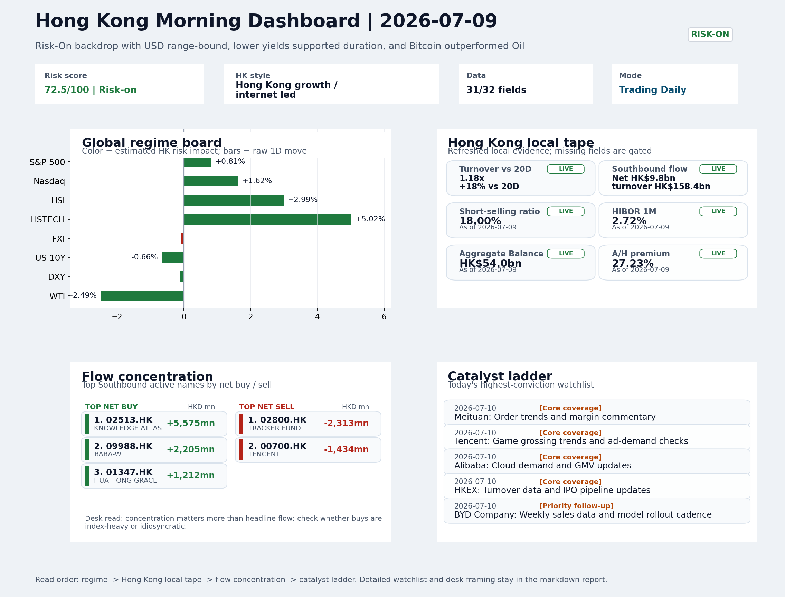
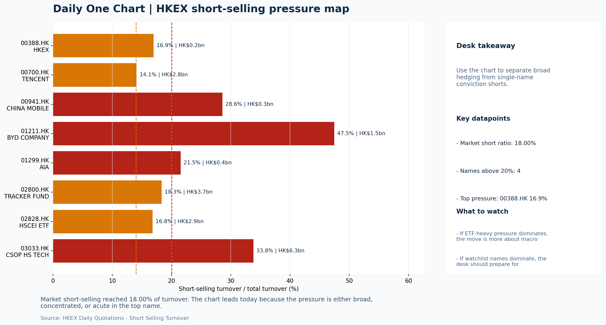

# Morning Research Workbench | 2026-07-10

> Designed for a Hong Kong sell-side commute: Layer 1 `Scan`, Layer 2 `Deep Read`, Layer 3 `Thinking`
> Mode: `Trading Daily` | Keep the report execution-oriented: what mattered in the completed session, what can move Hong Kong leadership, and what needs fast follow-up.
> Briefing date: `2026-07-10` | Review date: `2026-07-09` | Global request: `2026-07-09` | HK/China request: `2026-07-09` | Market effective date: `2026-07-09` | Generated at: `2026-07-10 06:20:33`

## Executive Summary

- **Market pulse:** The overnight risk-on setup - lower yields, declining VIX, and Nasdaq strength - collides with a hotter US CPI print, leaving Hong Kong's growth-led rally of July 9 dependent on whether local.
- **Hong Kong lens:** Hong Kong growth / internet led. Hong Kong growth names should test higher at the open given Nasdaq leadership (+1.62%) and lower US rates, but elevated short-selling (18%) argues for confirmation via cleaner.
- **Top catalysts:** INTC -6.33%; VIX -6.27%.

## Visual Dashboard

## Layer 1 | Scan (5-10 min)

### 1.1 One-Line Market Pulse
The overnight risk-on setup - lower yields, declining VIX, and Nasdaq strength - collides with a hotter US CPI print, leaving Hong Kong's growth-led rally of July 9 dependent on whether local breadth can withstand a potential rates repricing.

### 1.2 Global Asset Price Dashboard

| Asset | Last | 1D move | Read |
| --- | --- | --- | --- |
| S&P 500 | 7,543.64 | +0.81% | US large-cap risk appetite |
| Nasdaq 100 | 29,727.10 | **+1.62%** | Growth and duration leadership |
| Hang Seng Index | 24,199.46 | **+2.99%** | Hong Kong broad beta |
| Hang Seng TECH | 4.6400 | **+5.02%** | Hong Kong growth / platform read-through |
| CSI 300 | 4,842.17 | +0.62% | Mainland large-cap tone |
| US 10Y | 4.5390 | -0.66% | Global discount-rate anchor |
| China 10Y | 1.74% | -0.1bp | China local rates anchor \| Live public \| Eastmoney \| 2026-07-09 |
| CN-US 10Y spread | -280.2bp | +1.9bp | Relative carry and macro-pressure gauge \| Live public \| Eastmoney \| 2026-07-09 |
| DXY | 100.94 | -0.11% | Dollar liquidity impulse |
| USD/CNH | 6.7670 | +0.00% | Offshore China risk appetite |
| USD/HKD | 7.8356 | -0.08% | Linked-exchange regime stress check |
| Brent crude | 76.05 | **-2.52%** | Energy / geopolitics |
| COMEX gold | 4,132.50 | **+1.51%** | Hedge demand / real yields |
| Copper | 6.2470 | **+3.18%** | Global growth proxy |
| VIX | 15.84 | **-6.27%** | US stress barometer |

### 1.3 Hong Kong Key Data Quick Check

| Check | Value | Status | Source / as of | Why it matters |
| --- | --- | --- | --- | --- |
| Main Board turnover vs 20D | 1.18x \| +18% vs 20D | Live local | HKEX \| 2026-07-09 | Trailing 20-session average turnover was HK$318.9bn. |
| Southbound / Northbound net flow | Southbound Net HK$9.8bn \| turnover HK$158.4bn \| Northbound Turnover HK$400.8bn \| net not reported | Live local | HKEX Connect \| 2026-07-09 | Southbound net buy is calculated from HKEX disclosed buy and sell turnover. |
| Short-selling ratio | 18.00% | Live local | HKEX \| 2026-07-09 | Official HKEX stock-level short-selling table, aggregated as a share of total market turnover. |
| AH premium index | 27.23% | Live public | Yahoo \| 2026-07-09 | Simple average across 18 A/H pairs; use dispersion rather than the average alone. |
| USD/HKD spot vs band | 7.8356 \| band 7.7500 to 7.8500 | Live quote + local | Yahoo \| 2026-07-09 | Inside the linked-exchange band without immediate boundary stress. Official Convertibility Undertakings define the linked-rate stress boundaries for USD/HKD. |
| HIBOR 1M | 2.72% | Live local | HKMA \| 2026-07-09 | 1M HIBOR is the cleanest quick read for Hong Kong funding conditions and equity-duration pressure. |
| Aggregate Balance | HK$54.0bn | Live local | HKMA \| 2026-07-09 | Aggregate Balance helps frame whether linked-rate liquidity conditions are tight or comfortable. |
| Hong Kong leadership | Hong Kong growth / internet led | Proxy | HSI / HSCEI / HSTECH relative perf \| 2026-07-09 | Use HSI / HSCEI / HSTECH relative moves as the opening style read. |

### 1.4 Risk Dashboard
**Composite risk score:** `72.5/100` | **Regime:** `Risk-on`

| Component | Score impact | Evidence |
| --- | --- | --- |
| US beta | +4.9 | S&P 500 +0.81% |
| HK growth | +10 | HSTECH +5.02% |
| Offshore China proxy | -0.4 | FXI -0.09% |
| Dollar pressure | +1.1 | DXY -0.11% |
| Volatility | +10 | VIX -6.27% |
| HK short-selling | -8 | Short-selling ratio 18.00% |

### 1.5 Morning Checklist
1. **INTC -6.33%**
 Mover attribution | Announcement / expectations | Guidance reset and margin pressure
2. **VIX -6.27%**
 High-frequency data | Lower volatility signals easing stress in the tape.
3. **Risk-On backdrop with USD range-bound, lower yields supported duration, and Bitcoin outperformed Oil**
 Overnight regime | Start by deciding whether the day is about Risk-On conditions or a style pivot.
4. **CPI MoM (Released)**
 Macro / policy | Rates expectations, the dollar, and growth-equity valuation | Industries: Technology, Internet, Brokers
5. **Trade Balance (Released)**
 Macro / policy | Watch whether it changes the day's core market narrative | Industries: Market-wide

## Layer 2 | Deep Read (20-30 min)

### 2.1 Overnight Overseas Market Review
#### Market Setup
**Core tape.** US equities advanced with Nasdaq 100 leading at +1.62%, supported by a -0.66% decline in US 10Y yields that eased valuation pressure on duration-sensitive names.
**Main driver.** The VIX compressed -6.27% to 15.84, the largest single-day drop, signaling a broad unwinding of hedging demand rather than a sector-specific re-rating.
**HK relevance.** Euro Stoxx fell -1.82% despite the constructive global backdrop, creating an intra-day divergence that deserves monitoring if the transatlantic split widens.

#### Key Drivers
- US 10Y yield -0.66% reduced discount rate pressure on growth and internet equities, supporting Nasdaq outperformance.
- VIX -6.27% signaled a broad de-risking rather than tactical repositioning, which typically has more durable implications for risk appetite.
- Intel's guidance reset (-6.33%) reshapes semiconductor supply-chain expectations and carries direct read-through risk for SMIC and related.
- Oil -2.49% and Strait of Hormuz disruption projections (recovery not before 2027) split the read between energy-sector headwinds and.

#### Hong Kong Read-Through
**Desk lens.** Hong Kong growth / internet led.
**Opening implication.** Hong Kong growth names should test higher at the open given Nasdaq leadership (+1.62%) and lower US rates.
- **Cross-market read:** Hang Seng +2.99% / HSCEI +4.04% / HSTECH +5.02%.
- **Cross-market read:** Offshore China proxy FXI -0.09% and USD/CNH +0.00% frame cross-border risk appetite.
- **Cross-market read:** USD/HKD last traded around 7.8356, which keeps the Hong Kong funding lens in focus.

#### Watch Points
- USD composite moved lower by -0.07pct intraday, with a 0.134pct range.
- Main turning points appeared around 2026-07-09 08:10 trough / 2026-07-09 08:25 peak / 2026-07-09 08:50 peak, suggesting event-driven repricing.
- The biggest cross-asset divergence was Bitcoin versus Oil, a spread of 5.299pct.
- Gold moved +1.53pct intraday with a 1.936pct high-low range.

**Curated overnight stories**
1. **Fed officials were split on direction of interest rates at last meeting, minutes show**
 Why it matters: Divergence within the FOMC signals no clear consensus on near-term easing, which calibrates rate-cut expectations and affects USD direction.
 HK read-through: Most relevant for Hong Kong interest-rate-sensitive sectors: real estate, financials, and high-duration growth names.
2. **INTC -6.33% on guidance reset and margin pressure**
 Why it matters: Intel's sharp guidance cut reflects sustained competitive pressure in AI-era semiconductors. This reshapes market expectations for semiconductor supply chains.
 HK read-through: Direct read-through to Hong Kong-listed tech hardware and semiconductor names. May also affect sentiment around SMIC and other chip-related equities.
3. **Risk-On backdrop with USD range-bound, lower yields supported duration, and Bitcoin**
 Why it matters: The prevailing regime supports risk appetite. Range-bound USD reduces capital-flow pressure from currency hedging.
 HK read-through: Constructive for Hong Kong internet and growth equities. Bitcoin outperformance signals crypto-adjacent sentiment that often correlates with risk appetite in Hong Kong tech.
4. **VIX -6.27%, signaling easing stress in the tape**
 Why it matters: Declining volatility typically precedes improved risk appetite and can unlock positioning in growth equities that had been under defensive pressure.
 HK read-through: Positive read-through for Hong Kong growth and speculative names. Lower volatility reduces demand for hedging, freeing up capital for risk-taking.
5. **Strait of Hormuz traffic won't return to normal until 2027 after latest setback, Kalshi**
 Why it matters: Extended disruption in a critical global energy chokepoint could sustain elevated shipping costs and energy-price volatility, affecting input costs for Asia industrials.
 HK read-through: Relevant for Hong Kong-listed shipping, energy, and petrochemical names. Prolonged Hormuz disruption could also influence inflation expectations and regional trade costs.

### 2.2 Hong Kong / A-share Previous-Day Review
#### Local Tape Setup
**Local read.** Hong Kong's July 9 session was growth-led.
**Verification point.** Southbound net buying of HK$9.8bn concentrated in BABA, SMIC, Hua Hong Grace, and Knowledge Atlas, aligning local flows with the same growth beta.
**Risk to watch.** However, the 18% short-selling ratio and elevated ETF outflows from Tracker Fund and HSCEI ETF (volume ratios >1.2x) suggest the rebound was driven by positioning rather than broad foreign participation, requiring.

#### Style and Local Leadership
**Style leadership.** Hong Kong growth / internet led.
- **Cross-market read:** Hang Seng +2.99% / HSCEI +4.04% / HSTECH +5.02%.
- **Cross-market read:** Offshore China proxy FXI -0.09% and USD/CNH +0.00% frame cross-border risk appetite.
- **Cross-market read:** USD/HKD last traded around 7.8356, which keeps the Hong Kong funding lens in focus.

#### Flow Confirmation
Official Stock Connect evidence is available; use Section 2.3 to confirm whether local money supports the price action.

#### Follow-Through Checklist
**Follow-through check.** On July 10, watch whether HSTECH/HSCEI relative performance sustains above the open, Main Board turnover holds above the 20-day average.

### 2.3 Flow Tracker and Attribution
#### Cross-Asset Attribution v1

| Driver | Direction | Score | Evidence | HK implication |
| --- | --- | --- | --- | --- |
| US growth-style transmission | supportive | 2.27 | Nasdaq 100 moved +1.62%. | Hong Kong growth and platform names should be tested first at the open. |
| Short-selling pressure | drag | 2.1 | HKEX short-selling ratio was 18.00%. | Elevated short activity argues for extra confirmation before chasing rebounds. |
| Oil and geopolitics | supportive | 2.02 | Oil moved -2.52%. | Split the read between energy/cyclicals support and margin/geopolitical pressure. |
| Hong Kong participation | supportive | 1.83 | Main Board turnover was 1.18x the 20-session average. | Higher participation makes local price action more credible. |
| Global equity beta | supportive | 0.81 | S&P 500 moved +0.81%. | Broad beta matters if Hong Kong breadth confirms the overseas signal. |
| Rates impulse | supportive | 0.79 | US 10Y yield proxy moved -0.66%. | Lower yields help long-duration growth; higher yields pressure valuation-sensitive |

#### Flow Tracker
##### Flow Takeaways
- Short-selling pressure is elevated, so local rebounds need cleaner breadth and flow confirmation.
- Stock Connect Southbound: net HK$9.8bn on turnover HK$158.4bn (as of 2026-07-09).
- Stock Connect Northbound: turnover RMB400.8bn; public file provides total turnover/top active names, not full net-buy.
- AH premium: simple covered-pair average +27.23%; widest premium: China Communications Construction 78.0%.

##### Stock Connect Southbound Active Names

| Rank | Ticker | Name | Buy | Sell | Net buy |
| --- | --- | --- | --- | --- | --- |
| 2 | 02513.HK | KNOWLEDGE ATLAS | HK$8,702.1mn | HK$3,127.2mn | HK$5,575.0mn |
| 10 | 02800.HK | TRACKER FUND | HK$98.1mn | HK$2,411.2mn | HK$-2,313.1mn |
| 2 | 09988.HK | BABA-W | HK$6,355.8mn | HK$4,150.3mn | HK$2,205.5mn |
| 4 | 00700.HK | TENCENT | HK$4,290.3mn | HK$5,724.3mn | HK$-1,434.1mn |
| 3 | 01347.HK | HUA HONG GRACE | HK$5,152.4mn | HK$3,940.5mn | HK$1,212.0mn |

##### AH Premium Dispersion

| Name | A ticker | H ticker | Premium | As of |
| --- | --- | --- | --- | --- |
| China Communications Construction | 601800.SS | 1800.HK | +78.00% | 2026-07-09 |
| China Railway Construction | 601186.SS | 1186.HK | +49.35% | 2026-07-09 |
| China Life | 601628.SS | 2628.HK | +48.44% | 2026-07-09 |
| China Railway | 601390.SS | 0390.HK | +47.57% | 2026-07-09 |
| China Construction Bank | 601939.SS | 0939.HK | +41.33% | 2026-07-09 |

##### HKEX Short-Selling Watch

| Ticker | Name | Short ratio | Short turnover | Total turnover |
| --- | --- | --- | --- | --- |
| 00388.HK | HKEX | 16.95% | HK$0.2bn | HK$1.4bn |
| 00700.HK | TENCENT | 14.10% | HK$2.8bn | HK$20.1bn |
| 00941.HK | CHINA MOBILE | 28.58% | HK$0.3bn | HK$1.1bn |
| 01211.HK | BYD COMPANY | 47.47% | HK$1.5bn | HK$3.3bn |
| 01299.HK | AIA | 21.52% | HK$0.4bn | HK$1.8bn |

- **Short-value leaders:** 03033.HK CSOP HS TECH (HK$6.3bn); 07709.HK XL2CSOPHYNIX (HK$5.8bn); 09988.HK BABA-W (HK$4.4bn); 02800.HK TRACKER FUND (HK$3.7bn).

### 2.4 Macro and Policy Tracking
**Desk read.** The overnight risk-on backdrop - lower VIX, firmer crypto, and range-bound USD - faces an immediate credibility test from the just-released US CPI print.

**Market sensitivity.** At 0.3% m/m, the figure overshot the 0.2% consensus and may challenge the duration bid that supported Hong Kong growth leadership in the prior session.

**HK implication.** The concurrent China trade balance beat (USD 85.2bn vs. 79.0bn expected) provides a counterweight for China-linked sentiment.

**Macro watchpoints**
- US 2-year and 10-year yields post-CPI; sustained move above pre-release levels would signal a rates repricing.
- DXY and CNH fix - whether the yuan absorbs the trade surplus or follows USD strength.
- Hong Kong tech and broker indices - early price action will reveal how much of the risk premia are being withdrawn.
- PBOC open market operations - any shift in daily liquidity signals alongside the unchanged LPR.

| Time | Region | Event | Status | Desk read |
| --- | --- | --- | --- | --- |
| 20:30 | US | CPI MoM | Released | Impact: Rates expectations, the dollar, and growth-equity valuation \| Attention: 5/5 \| Industries: Technology, Internet, Brokers |
| 09:30 | China | Trade Balance | Released | Impact: Watch whether it changes the day's core market narrative \| Attention: 3/5 \| Industries: Market-wide |
| 20:30 | US | Retail Sales MoM | Upcoming | Impact: Consumer resilience, growth expectations, and risk-asset pricing \| Attention: 5/5 \| Industries: Consumer, E-commerce, Consumer discretionary |
| 09:20 | China | Loan Prime Rate | Upcoming | Impact: Watch whether it changes the day's core market narrative \| Attention: 3/5 \| Industries: Market-wide |
| 22:00 | Federal Reserve | Jerome Powell: Economic outlook remarks | Central bank | Impact: Policy path, liquidity conditions, and cross-asset risk appetite \| Attention: 5/5 \| Industries: Technology, Financials, Gold |
| 10:00 | PBOC | Open Market Operations Desk: Daily liquidity operation window | Central bank | Impact: Policy path, liquidity conditions, and cross-asset risk appetite \| Attention: 3/5 \| Industries: Technology, Financials, Gold |

#### Positioning and Risk Backdrop
- Options activity centered on KWEB Call, with Vol/OI at 1.88x and a bullish bias.
- Put/Call structure shows equity 0.68 / index 1.15, implying Single-stock optimism with index hedging.
- Geopolitics: Middle East | Regional tension remains elevated | Impact: Oil, freight costs, and safe-haven demand
- Geopolitics: US-China | Technology export-control rhetoric remains active | Impact: China internet, semiconductors, and supply chains

### 2.5 Key Company and Sector Events

| Grade | Sector | Headline | Why it matters | Horizon |
| --- | --- | --- | --- | --- |
| B | Semiconductors and AI | SK Hynix is about to hit the U.S. market. | Capital allocation or shareholder-return events can trigger a valuation | Medium-term trend |
| B | Semiconductors and AI | Meta's stock rebounds as agentic AI coding and custom chips ease | This is more about order visibility and product-cycle validation | Short-term catalyst |

#### HKEX Announcements

| Grade | Ticker | Type | Release time | Title |
| --- | --- | --- | --- | --- |
| A | 00189.HK | Profit warning | 2026-07-09 | Profit warning / alert announcement |
| A | 00666.HK | Profit warning | 2026-07-09 | Profit warning / alert announcement |
| A | 01070.HK | Profit warning | 2026-07-09 | Profit warning / alert announcement |
| A | 02259.HK | Profit warning | 2026-07-09 | Profit warning / alert announcement |
| A | 02603.HK | Profit warning | 2026-07-09 | Profit warning / alert announcement |
| A | 02899.HK | Profit warning | 2026-07-09 | Profit warning / alert announcement |
| A | 03200.HK | Profit warning | 2026-07-09 | Profit warning / alert announcement |
| A | 03696.HK | Profit warning | 2026-07-09 | Profit warning / alert announcement |

#### Earnings / Results Watch

| Ticker | Company | Timing | Expectation framing |
| --- | --- | --- | --- |
| 0700.HK | Tencent Holdings | After Market Close | EPS est. 4.15 HKD \| revenue est. 163.2bn HKD |
| 0388.HK | Hong Kong Exchanges and Clearing | Before Market Open | EPS est. 2.81 HKD \| revenue est. 6.0bn HKD |

#### Rating Changes
- **9988.HK** | Morgan Stanley | Upgrade | Equal Weight -> Overweight | PT 92 -> 105

#### IPO Watch
- IPO and grey-market monitoring is not yet part of the standard production pack.

### 2.6 Today's Core Names
#### Core coverage

| Name | Ticker | Last | 1D | Range position | Morning note |
| --- | --- | --- | --- | --- | --- |
| Meituan | 3690.HK | 78.50 | -2.97% | Mid-range | Short-term pressure is visible; check for a fundamental or regulatory reason. |
| Tencent | 0700.HK | 469.60 | -1.92% | Mid-range | Positioning is neutral for now, so use it mainly to monitor marginal information changes. |

**Recent headlines for Tencent:**
- [Google, McKinsey, Tencent invest in Indonesia carbon removal](https://www.esgdive.com/news/google-mckinsey-tencent-invest-in-nature-based-carbon-removal-in-indonesi/824850/) (ESG Dive)

#### Priority follow-up

| Name | Ticker | Last | 1D | Range position | Morning note |
| --- | --- | --- | --- | --- | --- |
| BYD Company | 1211.HK | 82.65 | -3.73% | Mid-range | Short-term pressure is visible; check for a fundamental or regulatory reason. |
| AIA | 1299.HK | 72.30 | -1.90% | Bottom of range | The name sits near the bottom of its recent range and is worth monitoring for a catalyst-led reversal. |

**Recent headlines for BYD Company:**
- [BYD (SEHK:1211) Launches 2nd Generation Blade Battery With FLASH Charging](https://finance.yahoo.com/technology/articles/byd-sehk-1211-launches-2nd-211421458.html) (Simply Wall St.)

## Layer 3 | Thinking (10-15 min)

### 3.1 Rotating Theme Deep Dive

| Field | Read |
| --- | --- |
| Theme | Hong Kong Market Structure and Flows |
| Angle for the day | Focus on turnover, Stock Connect, ETF flows, HKEX activity, and style leadership to understand whether Hong Kong is being driven by fundamentals or positioning. |

**Theme desk read**
**Core thesis.** The Hong Kong market structure lens remains relevant because the overnight risk-on environment - lower VIX, firmer copper, and bitcoin outperforming oil - typically preconditions higher turnover and southbound interest.
**Evidence.** The next test is whether that macro tone translates into actual local flow metrics: HKEX's turnover data due today may confirm if session liquidity improved.
**What to test.** The BYD selloff (-3.73%) despite a second-generation Blade Battery launch underscores that product news alone may not override the market's current focus on volume and pricing trends, making this morning's weekly sales data.

**Signals to keep in mind**
- VIX -6.27%: Lower volatility signals easing stress in the tape.
- Copper +3.18%: Keep tracking it to confirm whether the core daily narrative is holding.

**LLM watch items:**
- HKEX: Verify turnover and southbound flow data to see if risk-on backdrop lifted local activity.
- BYD: Check weekly China sales data and assess whether the -3.73% move reflects a volume/price concern beyond the battery announcement.
- Hang Seng TECH ETF: Monitor for AI narrative shifts or platform regulation headlines that could redirect growth positioning.
- HSCEI ETF: Watch for policy flow-through and financial/energy sector leadership to confirm style direction.
- US CPI (actual 0.3% vs 0.2% forecast): Note whether the tape continues to absorb the hotter print without derisking, as that would support the

**Related names to keep close:**

| Name | Ticker | Bucket | Morning read |
| --- | --- | --- | --- |
| HKEX | 0388.HK | Core coverage | Positioning is neutral for now, so use it mainly to monitor marginal information changes. |
| BYD Company | 1211.HK | Priority follow-up | Short-term pressure is visible; check for a fundamental or regulatory reason. |

**Upcoming catalysts tied to the theme:**
- 2026-07-10 | HKEX: Turnover data and IPO pipeline updates | Direct proxy for Hong Kong market turnover, listings, and southbound interest
- 2026-07-10 | BYD Company: Weekly sales data and model rollout cadence | Hong Kong-listed proxy for EV volumes, export mix, and price competition
- 2026-07-10 | Hang Seng TECH ETF: AI narrative shifts and China platform regulation headlines | Fast proxy for Hong Kong internet and growth leadership
- 2026-07-10 | HSCEI ETF: Policy flow-through and financial/energy leadership | Useful proxy for state-owned and old-economy H-share leadership

### 3.2 Today Ahead and Trading Calendar
- Macro: CPI MoM is the first item to anchor the open and the rates/FX response.
- Corporate / event: Meituan: Order trends and margin commentary is the cleanest same-day catalyst to prepare for.

**Same-day macro docket**

| Time | Country | Event | Status | Detail |
| --- | --- | --- | --- | --- |
| 20:30 | US | CPI MoM | Released | Actual 0.3% / Forecast 0.2% / Prior 0.4% |
| 09:30 | China | Trade Balance | Released | Actual USD 85.2bn / Forecast USD 79.0bn / Prior USD 80.6bn |
| 20:30 | US | Retail Sales MoM | Upcoming | Forecast 0.3% / Prior 0.6% |
| 09:20 | China | Loan Prime Rate | Upcoming | Forecast 3.45% / Prior 3.45% |
| 22:00 | Federal Reserve | Jerome Powell: Economic outlook remarks | Central bank | speech |

**Same-day catalyst list**

| Date | Time | Category | Event | Importance |
| --- | --- | --- | --- | --- |
| 2026-07-10 | | Core coverage | Meituan: Order trends and margin commentary | 3 |
| 2026-07-10 | | Core coverage | Tencent: Game grossing trends and ad-demand checks | 3 |
| 2026-07-10 | | Core coverage | Alibaba: Cloud demand and GMV updates | 3 |
| 2026-07-10 | | Core coverage | HKEX: Turnover data and IPO pipeline updates | 3 |

**Next few sessions**

| Date | Category | Event | Impact |
| --- | --- | --- | --- |
| 2026-07-10 | Core coverage | Meituan: Order trends and margin commentary | High-frequency read on local services demand and platform competition |
| 2026-07-10 | Core coverage | Tencent: Game grossing trends and ad-demand checks | Core offshore China platform proxy for gaming, ads, and AI monetization |
| 2026-07-10 | Core coverage | Alibaba: Cloud demand and GMV updates | Key read-through for China consumption, cloud, and platform regulation |
| 2026-07-10 | Core coverage | HKEX: Turnover data and IPO pipeline updates | Direct proxy for Hong Kong market turnover, listings, and southbound |

### 3.3 Daily One Chart
**Daily One Chart | HKEX short-selling pressure map**

**Chart read.** Market short-selling reached 18.00% of turnover.
**Why it matters.** The chart leads today because the pressure is either broad, concentrated, or acute in the top name.

_Source: HKEX Daily Quotations - Short Selling Turnover_

## Traceable Appendix

### Report Metadata
> Date policy: Review date 2026-07-09 is treated as `Trading Daily`. | Global request date is 2026-07-09; adapter effective date is 2026-07-09 and summary date is 2026-07-09. | HK/China local data date is 2026-07-09; role: same-session local cash tape.
> Market data quality: Coverage: `31/32` | Stale items (>1d): `1` | Missing: `1`
> Report quality: `90.0/100` | Grade `A` | Status `production ready`

### Key Questions to Keep in Mind
- Is risk appetite rising or fading? The overnight tape reads closer to `Risk-On`.
- Did rates expectations move? Focus on whether US 10Y, DXY, and growth style moved together.
- Were commodities the real story? Watch WTI and gold for geopolitics versus inflation signals.
- Is Hong Kong setup internet-led, SOE-led, or broad beta-led? Compare HSTECH, HSCEI, and HSI.
- Did offshore markets move China risk appetite? Focus on HSI, FXI, USD/CNH, and USD/HKD.

### Report Quality and Validation
- **Quality score:** 90.0/100 | **Grade:** A | **Status:** production ready
- **Run summary:** 7 healthy | 1 caveat | 0 failed
- **Release recommendation:** Send with caveats | The report is usable, but the advisory guidance should travel with it so readers understand the data gaps.

| Source | Status | Bucket |
| --- | --- | --- |
| Market data | ok | healthy |
| Sector and company news | ok | healthy |
| Movers and short selling | ok | healthy |
| Stock Connect | ok | healthy |
| A/H premium | ok | healthy |
| Hong Kong local package | ok | healthy |
| China rates | ok | healthy |
| Narrative overlay | partial | caveat |

**Desk-use guidance summary:** 0 blocking | 1 advisory

**Desk-use guidance**
- **Advisory:** Use deterministic sections as primary support; the narrative overlay was partial or unavailable on this run.

| Component | Score | Weight | Read |
| --- | --- | --- | --- |
| Market data coverage | 96.9 | 0.3 | 31/32 core market fields available. |
| Hong Kong local metrics | 82.3 | 0.25 | 8 live, 3 proxy, 0 unavailable local checks. |
| Key public adapters | 100.0 | 0.2 | 4/4 key adapters were available or partially available. |
| Narrative overlay health | 68.6 | 0.15 | 4/7 narrative overlay tasks succeeded or used validated cache; 1 error(s). |
| Fact-check guardrail | 100.0 | 0.1 | Checked 0 numeric claims; 0 numeric mismatch(es), 0 logic warning(s); 0 critical, 0 review. |

**Narrative fact-check guardrail**
- Checked 0 numeric claims; 0 numeric mismatch(es), 0 logic warning(s); 0 critical, 0 review.

**Adapter status**

| Adapter | Status |
| --- | --- |
| Stock Connect | ok |
| A/H premium | ok |
| HKEX announcements | ok |
| China rates | ok |

### Source Links
- [SK Hynix is about to hit the U.S. market. Here's what to know about the deal.](https://www.marketwatch.com/story/sk-hynix-is-about-to-hit-the-u-s-market-heres-what-to-know-about-the-deal-1c873fa4?mod=mw_rss_topstories) (wsj_markets)
- [Meta's stock rebounds as agentic AI coding and custom chips ease spending fears](https://www.marketwatch.com/story/metas-stock-rebounds-as-agentic-ai-coding-and-custom-chips-ease-spending-fears-16d1cb24?mod=mw_rss_topstories) (wsj_markets)
- [Google, McKinsey, Tencent invest in Indonesia carbon removal](https://www.esgdive.com/news/google-mckinsey-tencent-invest-in-nature-based-carbon-removal-in-indonesi/824850/) (ESG Dive)
- [BYD (SEHK:1211) Launches 2nd Generation Blade Battery With FLASH Charging](https://finance.yahoo.com/technology/articles/byd-sehk-1211-launches-2nd-211421458.html) (Simply Wall St.)
- [China Mobile (SEHK:941): A Closer Look at Valuation After Steady Share Price Gains This Year](https://finance.yahoo.com/news/china-mobile-sehk-941-closer-154022664.html) (Simply Wall St.)
- [00189.HK Profit warning / alert announcement](http://www1.hkexnews.hk/listedco/listconews/sehk/2026/0709/2026070901111.pdf) (HKEXnews)
- [00666.HK Profit warning / alert announcement](http://www1.hkexnews.hk/listedco/listconews/sehk/2026/0709/2026070901051.pdf) (HKEXnews)
- [01070.HK Profit warning / alert announcement](http://www1.hkexnews.hk/listedco/listconews/sehk/2026/0709/2026070900504.pdf) (HKEXnews)
- [02259.HK Profit warning / alert announcement](http://www1.hkexnews.hk/listedco/listconews/sehk/2026/0709/2026070900662.pdf) (HKEXnews)
- [02603.HK Profit warning / alert announcement](http://www1.hkexnews.hk/listedco/listconews/sehk/2026/0709/2026070901317.pdf) (HKEXnews)
- [02899.HK Profit warning / alert announcement](http://www1.hkexnews.hk/listedco/listconews/sehk/2026/0709/2026070901149.pdf) (HKEXnews)
- [03200.HK Profit warning / alert announcement](http://www1.hkexnews.hk/listedco/listconews/sehk/2026/0709/2026070901237.pdf) (HKEXnews)
- [03696.HK Profit warning / alert announcement](http://www1.hkexnews.hk/listedco/listconews/sehk/2026/0709/2026070900039.pdf) (HKEXnews)

## Supplementary Visual Appendix

This appendix is professional-path only. It keeps a traceable index of the report visuals and the deterministic chart cues used to frame the morning note, without injecting the legacy intraday chart pack.

### Visual Index

| Visual | Path | Role |
| --- | --- | --- |
| Visual Dashboard | `charts/dashboard_2026-07-10.png` | Cross-asset regime board and Hong Kong local tape snapshot. |
| Daily One Chart | `charts/daily_one_chart_2026-07-10.png` | Single highest-conviction visual story for the day. |

### Deterministic Chart Cues
- FX / liquidity: USD composite moved lower by -0.07pct intraday, with a 0.134pct range.
- FX / liquidity: Main turning points appeared around 2026-07-09 08:10 trough / 2026-07-09 08:25 peak / 2026-07-09 08:50 peak, suggesting event-driven repricing rather than a clean one-way USD move.
- Cross-asset: The biggest cross-asset divergence was Bitcoin versus Oil, a spread of 5.299pct.
- Cross-asset: Gold moved +1.53pct intraday with a 1.936pct high-low range.
- Cross-asset: Oil moved -3.49pct intraday with a 4.011pct high-low range.
- Cross-asset: Bitcoin moved +1.81pct intraday with a 2.691pct high-low range.

### Risk Dashboard Components

| Component | Score impact | Evidence |
| --- | --- | --- |
| US beta | +4.9 | S&P 500 +0.81% |
| HK growth | +10 | HSTECH +5.02% |
| Offshore China proxy | -0.4 | FXI -0.09% |
| Dollar pressure | +1.1 | DXY -0.11% |
| Volatility | +10 | VIX -6.27% |
| HK short-selling | -8 | Short-selling ratio 18.00% |
