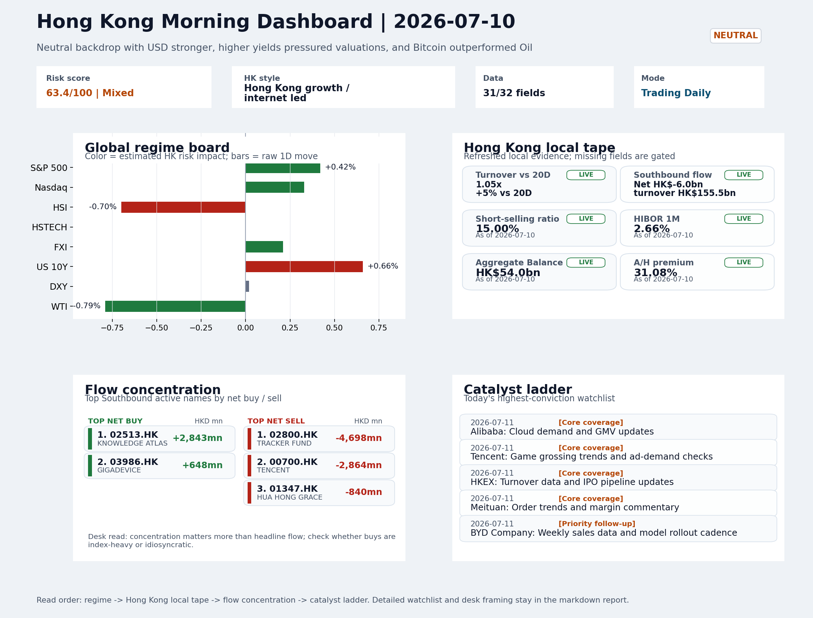

# Morning Research Workbench | 2026-07-11

> Designed for a Hong Kong sell-side commute: Layer 1 `Scan`, Layer 2 `Deep Read`, Layer 3 `Thinking`
> Mode: `Trading Daily` | Keep the report execution-oriented: what mattered in the completed session, what can move Hong Kong leadership, and what needs fast follow-up.
> Briefing date: `2026-07-11` | Review date: `2026-07-10` | Global request: `2026-07-10` | HK/China request: `2026-07-10` | Market effective date: `2026-07-10` | Generated at: `2026-07-11 06:00:11`

## Executive Summary

- **Market pulse:** Overnight CPI landed in line but sustained USD strength and higher yields kept the backdrop neutral and rates-sensitive, while Hong Kong's flat HSTECH and thin FXI offset do not yet.
- **Hong Kong lens:** Hong Kong growth / internet led. The neutral backdrop with USD strength and higher yields argues for a cautious open, with growth/internet names under most pressure.
- **Top catalysts:** INTC -6.33%; Neutral backdrop with USD stronger, higher yields pressured valuations, and Bitcoin outperformed Oil.

## Visual Dashboard

## Layer 1 | Scan (5-10 min)

### 1.1 One-Line Market Pulse
Overnight CPI landed in line but sustained USD strength and higher yields kept the backdrop neutral and rates-sensitive, while Hong Kong's flat HSTECH and thin FXI offset do not yet override cautious local flow signals.

### 1.2 Global Asset Price Dashboard

| Asset | Last | 1D move | Read |
| --- | --- | --- | --- |
| S&P 500 | 7,575.39 | +0.42% | US large-cap risk appetite |
| Nasdaq 100 | 29,825.11 | +0.33% | Growth and duration leadership |
| Hang Seng Index | 24,030.18 | -0.70% | Hong Kong broad beta |
| Hang Seng TECH | 4.6400 | +0.00% | Hong Kong growth / platform read-through |
| CSI 300 | 4,842.17 | +0.62% | Mainland large-cap tone |
| US 10Y | 4.5690 | +0.66% | Global discount-rate anchor |
| China 10Y | 1.74% | +0.2bp | China local rates anchor \| Live public \| Eastmoney \| 2026-07-10 |
| CN-US 10Y spread | -282.0bp | -1.8bp | Relative carry and macro-pressure gauge \| Live public \| Eastmoney \| 2026-07-10 |
| DXY | 100.97 | +0.02% | Dollar liquidity impulse |
| USD/CNH | 6.7535 | +0.00% | Offshore China risk appetite |
| USD/HKD | 7.8393 | +0.01% | Linked-exchange regime stress check |
| Brent crude | 76.00 | -0.39% | Energy / geopolitics |
| COMEX gold | 4,128.90 | -0.04% | Hedge demand / real yields |
| Copper | 6.2850 | +1.13% | Global growth proxy |
| VIX | 15.03 | **-5.11%** | US stress barometer |

### 1.3 Hong Kong Key Data Quick Check

| Check | Value | Status | Source / as of | Why it matters |
| --- | --- | --- | --- | --- |
| Main Board turnover vs 20D | 1.05x \| +5% vs 20D | Live local | HKEX \| 2026-07-10 | Trailing 20-session average turnover was HK$322.4bn. |
| Southbound / Northbound net flow | Southbound Net HK$-6.0bn \| turnover HK$155.5bn \| Northbound Turnover HK$449.3bn \| net not reported | Live local | HKEX Connect \| 2026-07-10 | Southbound net buy is calculated from HKEX disclosed buy and sell turnover. |
| Short-selling ratio | 15.00% | Live local | HKEX \| 2026-07-10 | Official HKEX stock-level short-selling table, aggregated as a share of total market turnover. |
| AH premium index | 31.08% | Live public | Yahoo \| 2026-07-10 | Simple average across 17 A/H pairs; use dispersion rather than the average alone. |
| USD/HKD spot vs band | 7.8393 \| band 7.7500 to 7.8500 | Live quote + local | Yahoo \| 2026-07-10 | Inside the linked-exchange band without immediate boundary stress. Official Convertibility Undertakings define the linked-rate stress boundaries for USD/HKD. |
| HIBOR 1M | 2.66% | Live local | HKMA \| 2026-07-10 | 1M HIBOR is the cleanest quick read for Hong Kong funding conditions and equity-duration pressure. |
| Aggregate Balance | HK$54.0bn | Live local | HKMA \| 2026-07-10 | Aggregate Balance helps frame whether linked-rate liquidity conditions are tight or comfortable. |
| Hong Kong leadership | Hong Kong growth / internet led | Proxy | HSI / HSCEI / HSTECH relative perf \| 2026-07-10 | Use HSI / HSCEI / HSTECH relative moves as the opening style read. |

### 1.4 Risk Dashboard
**Composite risk score:** `63.4/100` | **Regime:** `Mixed`

| Component | Score impact | Evidence |
| --- | --- | --- |
| US beta | +2.5 | S&P 500 +0.42% |
| HK growth | +0.0 | HSTECH +0.00% |
| Offshore China proxy | +1.1 | FXI +0.21% |
| Dollar pressure | -0.2 | DXY +0.02% |
| Volatility | +10 | VIX -5.11% |
| HK short-selling | +0 | Short-selling ratio 15.00% |

### 1.5 Morning Checklist
1. **INTC -6.33%**
 Mover attribution | Announcement / expectations | Guidance reset and margin pressure
2. **Neutral backdrop with USD stronger, higher yields pressured valuations, and Bitcoin outperformed Oil**
 Overnight regime | Start by deciding whether the day is about Neutral conditions or a style pivot.
3. **CPI MoM (Released)**
 Macro / policy | Rates expectations, the dollar, and growth-equity valuation | Industries: Technology, Internet, Brokers
4. **VIX -5.11%**
 High-frequency data | Lower volatility signals easing stress in the tape.
5. **Trade Balance (Released)**
 Macro / policy | Watch whether it changes the day's core market narrative | Industries: Market-wide

## Layer 2 | Deep Read (20-30 min)

### 2.1 Overnight Overseas Market Review
#### Market Setup
**Core tape.** US equities eked out modest gains as the CPI print met expectations, preventing an immediate rates shock, though higher yields capped the upside for valuation-sensitive sectors.
**Main driver.** The biggest cross-asset divergence was Bitcoin outperforming Oil by 2.46 percentage points, consistent with a neutral-but-cautious risk regime rather than a directional risk-on move.
**HK relevance.** Intel's guidance reset dragged the Nasdaq (+0.33%) while the S&P 500 (+0.42%) held better, suggesting breadth was selective rather than broad.

#### Key Drivers
- CPI in-line keeps Fed on hold but confirms sticky services inflation, leaving September cut as the next live catalyst.
- US 10Y yield +0.66% pressured long-duration and growth names, explaining why Nasdaq underperformed S&P 500.
- Intel guidance reset (-6.33%) signals semiconductor sector margin pressure with direct read-through to HK-listed SMIC and hardware supply.
- Bitcoin +1.21% versus WTI -0.79% reflects a risk-off-within-neutral regime rather than a risk-on conviction move.

#### Hong Kong Read-Through
**Desk lens.** Hong Kong growth / internet led.
**Opening implication.** The neutral backdrop with USD strength and higher yields argues for a cautious open, with growth/internet names under most pressure. FXI +0.21% provides a thin positive offset.
- **Cross-market read:** Hang Seng -0.70% / HSCEI -1.08% / HSTECH +0.00%.
- **Cross-market read:** Offshore China proxy FXI +0.21% and USD/CNH +0.00% frame cross-border risk appetite.
- **Cross-market read:** USD/HKD last traded around 7.8393, which keeps the Hong Kong funding lens in focus.

#### Watch Points
- USD composite moved higher by +0.16pct intraday, with a 0.443pct range.
- Main turning points appeared around 2026-07-10 08:10 peak / 2026-07-10 08:25 peak / 2026-07-10 09:15 trough, suggesting event-driven repricing.
- The biggest cross-asset divergence was Bitcoin versus Oil, a spread of 2.455pct.
- Gold moved -0.01pct intraday with a 0.828pct high-low range.

**Curated overnight stories**
1. **CPI MoM (Released) - In-line with expectations**
 Why it matters: Keeps Fed on hold trajectory; prevents an immediate rates shock but confirms sticky services inflation. Markets now calibrate whether September cut remains live.
 HK read-through: USD strength persists, maintaining HKD-peg stability but capping re-rating of HK/China growth equities.
2. **INTC -6.33% - Guidance reset and margin pressure**
 Why it matters: Chip sector margin compression signals broad tech hardware earnings risk. AI capex supercycle thesis faces scrutiny when legacy semiconductor names cut guidance.
 HK read-through: Direct read-through to SMIC and other HK-listed semiconductor names. Also weighs on tech supply chain sentiment including Foxconn (TW) and related hardware names.
3. **Neutral backdrop: USD stronger, yields higher, Bitcoin outperforms Oil**
 Why it matters: Confirms risk-off within a neutral regime. USD strength reflects relative growth differentials and Fed policy uncertainty.
 HK read-through: Most relevant for HK growth and China ADRs. Sustained USD strength could defer mainland capital return to HK equities. Watch HKD stability at 7.8 handle.
4. **VIX -5.11% - Volatility compression**
 Why it matters: Lower VIX signals tape stress easing. But compression after CPI and before next week's China activity data may prove fragile if macro surprises disappoint.
 HK read-through: Supports short-term risk appetite for HK small-caps and speculative names. However, directionless bounce without macro catalyst limits conviction.

### 2.2 Hong Kong / A-share Previous-Day Review
#### Local Tape Setup
**Local read.** Hong Kong's session ended with HSI -0.7%, but style divergence was muted: HSTECH was flat while HSCEI lost -1.08%, indicating growth held up marginally better.
**Verification point.** Southbound net selling of HK$-6.0bn and a 15% short-selling ratio suggest local flow is not yet aligning behind a style call.
**Risk to watch.** Overnight rates impulse is a drag, but USD/CNH stability and FXI +0.21% provide a thin offset.

#### Style and Local Leadership
**Style leadership.** Hong Kong growth / internet led.
- **Cross-market read:** Hang Seng -0.70% / HSCEI -1.08% / HSTECH +0.00%.
- **Cross-market read:** Offshore China proxy FXI +0.21% and USD/CNH +0.00% frame cross-border risk appetite.
- **Cross-market read:** USD/HKD last traded around 7.8393, which keeps the Hong Kong funding lens in focus.

#### Flow Confirmation
Official Stock Connect evidence is available; use Section 2.3 to confirm whether local money supports the price action.

#### Follow-Through Checklist
**Follow-through check.** Watch for HSTECH to extend outperformance vs HSCEI and for Southbound net purchases to turn positive in key internet names to confirm growth leadership.

### 2.3 Flow Tracker and Attribution
#### Cross-Asset Attribution v1

| Driver | Direction | Score | Evidence | HK implication |
| --- | --- | --- | --- | --- |
| Rates impulse | drag | 0.79 | US 10Y yield proxy moved +0.66%. | Lower yields help long-duration growth; higher yields pressure valuation-sensitive |

#### Flow Tracker
##### Flow Takeaways
- Local flow evidence is not yet strong enough to override the cross-asset setup.
- Stock Connect Southbound: net HK$-6.0bn on turnover HK$155.5bn (as of 2026-07-10).
- Stock Connect Northbound: turnover RMB449.3bn; public file provides total turnover/top active names, not full net-buy.
- AH premium: simple covered-pair average +31.08%; widest premium: China Communications Construction 80.65%.

##### Stock Connect Southbound Active Names

| Rank | Ticker | Name | Buy | Sell | Net buy |
| --- | --- | --- | --- | --- | --- |
| 9 | 02800.HK | TRACKER FUND | HK$0.7mn | HK$4,698.7mn | HK$-4,698.1mn |
| 2 | 00700.HK | TENCENT | HK$3,849.5mn | HK$6,713.4mn | HK$-2,863.8mn |
| 5 | 02513.HK | KNOWLEDGE ATLAS | HK$4,929.2mn | HK$2,086.1mn | HK$2,843.1mn |
| 3 | 01347.HK | HUA HONG GRACE | HK$4,060.1mn | HK$4,900.4mn | HK$-840.3mn |
| 4 | 06869.HK | YOFC | HK$3,395.0mn | HK$4,103.2mn | HK$-708.2mn |

##### AH Premium Dispersion

| Name | A ticker | H ticker | Premium | As of |
| --- | --- | --- | --- | --- |
| China Communications Construction | 601800.SS | 1800.HK | +80.65% | 2026-07-10 |
| China Life | 601628.SS | 2628.HK | +52.17% | 2026-07-10 |
| China Railway Construction | 601186.SS | 1186.HK | +49.49% | 2026-07-10 |
| China Railway | 601390.SS | 0390.HK | +46.78% | 2026-07-10 |
| China Construction Bank | 601939.SS | 0939.HK | +42.58% | 2026-07-10 |

##### HKEX Short-Selling Watch

| Ticker | Name | Short ratio | Short turnover | Total turnover |
| --- | --- | --- | --- | --- |
| 00388.HK | HKEX | 9.11% | HK$0.2bn | HK$2.5bn |
| 00700.HK | TENCENT | 15.76% | HK$3.0bn | HK$18.8bn |
| 00941.HK | CHINA MOBILE | 23.50% | HK$0.2bn | HK$0.7bn |
| 01211.HK | BYD COMPANY | 19.99% | HK$0.4bn | HK$2.0bn |
| 01299.HK | AIA | 14.58% | HK$0.3bn | HK$1.9bn |

- **Short-value leaders:** 07709.HK XL2CSOPHYNIX (HK$4.2bn); 00700.HK TENCENT (HK$3.0bn); 09988.HK BABA-W (HK$2.3bn); 00981.HK SMIC (HK$2.1bn).

### 2.4 Macro and Policy Tracking
**Desk read.** The key macro release today was the US CPI report, which printed at +0.3% MoM versus the +0.2% consensus, keeping core inflation elevated and sustaining the 'higher for longer' rate narrative into Friday's retail sales data.

**Market sensitivity.** This confirmed the session's prevailing theme of USD strength and higher yields pressuring valuations, a backdrop that has favored Bitcoin over Oil.

**HK implication.** The beat in China's trade balance (USD 85.2bn vs. USD 79.0bn expected) provides a marginal offset to the rates-driven risk-off tone, though it is too early to determine whether the market will reprice China growth optimism.

**Macro watchpoints**
- DXY reaction after the hot CPI print; watch whether it extends the USD strength theme or reverses on Powell comments.
- HKD Hibor and funding costs as higher US yields feed through to local rate differentials.
- Whether Hong Kong tech and financials (the CPI-sensitive sectors) hold or capitulate into Powell's remarks.
- US Retail Sales MoM (forecast +0.3%, prior +0.6%) - the second consumer signal after CPI to confirm or challenge growth resilience.

| Time | Region | Event | Status | Desk read |
| --- | --- | --- | --- | --- |
| 20:30 | US | CPI MoM | Released | Impact: Rates expectations, the dollar, and growth-equity valuation \| Attention: 5/5 \| Industries: Technology, Internet, Brokers |
| 09:30 | China | Trade Balance | Released | Impact: Watch whether it changes the day's core market narrative \| Attention: 3/5 \| Industries: Market-wide |
| 20:30 | US | Retail Sales MoM | Upcoming | Impact: Consumer resilience, growth expectations, and risk-asset pricing \| Attention: 5/5 \| Industries: Consumer, E-commerce, Consumer discretionary |
| 09:20 | China | Loan Prime Rate | Upcoming | Impact: Watch whether it changes the day's core market narrative \| Attention: 3/5 \| Industries: Market-wide |
| 22:00 | Federal Reserve | Jerome Powell: Economic outlook remarks | Central bank | Impact: Policy path, liquidity conditions, and cross-asset risk appetite \| Attention: 5/5 \| Industries: Technology, Financials, Gold |
| 10:00 | PBOC | Open Market Operations Desk: Daily liquidity operation window | Central bank | Impact: Policy path, liquidity conditions, and cross-asset risk appetite \| Attention: 3/5 \| Industries: Technology, Financials, Gold |

#### Positioning and Risk Backdrop
- Options activity centered on KWEB Call, with Vol/OI at 1.88x and a bullish bias.
- Put/Call structure shows equity 0.68 / index 1.15, implying Single-stock optimism with index hedging.
- Geopolitics: Middle East | Regional tension remains elevated | Impact: Oil, freight costs, and safe-haven demand
- Geopolitics: US-China | Technology export-control rhetoric remains active | Impact: China internet, semiconductors, and supply chains

### 2.5 Key Company and Sector Events
No high-conviction sector story cleared the main-report relevance gate for this run.

#### HKEX Announcements

| Grade | Ticker | Type | Release time | Title |
| --- | --- | --- | --- | --- |
| A | 00317.HK | Profit warning | 2026-07-10 | Profit warning / alert announcement |
| A | 00397.HK | Profit warning | 2026-07-10 | Profit warning / alert announcement |
| A | 01138.HK | Profit warning | 2026-07-10 | Profit warning / alert announcement |
| A | 01378.HK | Profit warning | 2026-07-10 | Profit warning / alert announcement |
| A | 01979.HK | Profit warning | 2026-07-10 | Profit warning / alert announcement |
| A | 02202.HK | Profit warning | 2026-07-10 | Profit warning / alert announcement |
| A | 02238.HK | Profit warning | 2026-07-10 | Profit warning / alert announcement |
| A | 02714.HK | Profit warning | 2026-07-10 | Profit warning / alert announcement |

#### Earnings / Results Watch

| Ticker | Company | Timing | Expectation framing |
| --- | --- | --- | --- |
| 0700.HK | Tencent Holdings | After Market Close | EPS est. 4.15 HKD \| revenue est. 163.2bn HKD |
| 0388.HK | Hong Kong Exchanges and Clearing | Before Market Open | EPS est. 2.81 HKD \| revenue est. 6.0bn HKD |

#### Rating Changes
- **9988.HK** | Morgan Stanley | Upgrade | Equal Weight -> Overweight | PT 92 -> 105

#### IPO Watch
- IPO and grey-market monitoring is not yet part of the standard production pack.

### 2.6 Today's Core Names
#### Core coverage

| Name | Ticker | Last | 1D | Range position | Morning note |
| --- | --- | --- | --- | --- | --- |
| Alibaba | 9988.HK | 110.20 | +2.04% | Mid-range | Short-term price strength is clear; fresh catalysts could trigger broader group follow-through. |
| Tencent | 0700.HK | 460.20 | -2.00% | Mid-range | Short-term pressure is visible; check for a fundamental or regulatory reason. |

**Recent headlines for Tencent:**
- [Tencent Eyes Largest Manus Stake After Meta's $2 Billion Deal Unravels](https://finance.yahoo.com/technology/ai/articles/tencent-eyes-largest-manus-stake-194943069.html) (GuruFocus.com)

#### Priority follow-up

| Name | Ticker | Last | 1D | Range position | Morning note |
| --- | --- | --- | --- | --- | --- |
| BYD Company | 1211.HK | 84.90 | +2.72% | Mid-range | Short-term price strength is clear; fresh catalysts could trigger broader group follow-through. |
| AIA | 1299.HK | 72.65 | +0.48% | Bottom of range | The name sits near the bottom of its recent range and is worth monitoring for a catalyst-led reversal. |

**Recent headlines for BYD Company:**
- [BYD (SEHK:1211) On June Sales And New Energy Vehicle Milestone Looks Modestly Undervalued](https://finance.yahoo.com/markets/stocks/articles/byd-sehk-1211-june-sales-061327320.html) (Simply Wall St.)

## Layer 3 | Thinking (10-15 min)

### 3.1 Rotating Theme Deep Dive

| Field | Read |
| --- | --- |
| Theme | AI and Compute Chain |
| Angle for the day | Track whether global AI capex, semis, cloud, and server demand are still carrying offshore China internet and hardware sentiment. |

**Theme desk read**
**Core thesis.** The weekly AI and Compute Chain theme remains the right lens for offshore China internet, even as the broader backdrop stays neutral with a stronger USD and higher US yields.
**Evidence.** On 10 July, the tape offered mixed signals within the group: Alibaba rallied 2%, while Tencent dropped 2% amid reports it could take the largest stake in AI agent firm Manus after Meta's deal was blocked.
**What to test.** That development is a direct test of whether local AI deal flow can sustain sentiment independently of US tech.

**Signals to keep in mind**
- VIX -5.11%: Lower volatility signals easing stress in the tape.
- Bitcoin +1.21%: Keep tracking it to confirm whether the core daily narrative is holding.

**LLM watch items:**
- Alibaba: Cloud demand and GMV updates (due 11 July) - confirm whether AI-related cloud growth is accelerating.
- Tencent: Game grossing trends and ad-demand checks - verify if AI-driven ad improvements are materialising.
- Tencent news flow: Any further detail on the Manus stake - watch for regulatory or deal structure remarks.
- US Retail Sales (11 July) - consumer resilience reading that could swing growth-equity correlations.
- China LPR (11 July) - if a surprise cut, it could lift rate-sensitive tech and internet names.

**Related names to keep close:**

| Name | Ticker | Bucket | Morning read |
| --- | --- | --- | --- |
| Alibaba | 9988.HK | Core coverage | Short-term price strength is clear; fresh catalysts could trigger broader group follow-through. |
| Tencent | 0700.HK | Core coverage | Short-term pressure is visible; check for a fundamental or regulatory reason. |
| HKEX | 0388.HK | Core coverage | Positioning is neutral for now, so use it mainly to monitor marginal information changes. |
| Meituan | 3690.HK | Core coverage | Positioning is neutral for now, so use it mainly to monitor marginal information changes. |

**Upcoming catalysts tied to the theme:**
- 2026-07-11 | Alibaba: Cloud demand and GMV updates | Key read-through for China consumption, cloud, and platform regulation
- 2026-07-11 | Tencent: Game grossing trends and ad-demand checks | Core offshore China platform proxy for gaming, ads, and AI monetization
- 2026-07-11 | AIA: NBV trends and agency momentum | Read-through for wealth demand, mainland visitor activity, and HK financial sentiment
- 2026-07-11 | Hang Seng TECH ETF: AI narrative shifts and China platform regulation headlines | Fast proxy for Hong Kong internet and growth leadership

### 3.2 Today Ahead and Trading Calendar
- Macro: CPI MoM is the first item to anchor the open and the rates/FX response.
- Corporate / event: Alibaba: Cloud demand and GMV updates is the cleanest same-day catalyst to prepare for.

**Same-day macro docket**

| Time | Country | Event | Status | Detail |
| --- | --- | --- | --- | --- |
| 20:30 | US | CPI MoM | Released | Actual 0.3% / Forecast 0.2% / Prior 0.4% |
| 09:30 | China | Trade Balance | Released | Actual USD 85.2bn / Forecast USD 79.0bn / Prior USD 80.6bn |
| 20:30 | US | Retail Sales MoM | Upcoming | Forecast 0.3% / Prior 0.6% |
| 09:20 | China | Loan Prime Rate | Upcoming | Forecast 3.45% / Prior 3.45% |
| 22:00 | Federal Reserve | Jerome Powell: Economic outlook remarks | Central bank | speech |

**Same-day catalyst list**

| Date | Time | Category | Event | Importance |
| --- | --- | --- | --- | --- |
| 2026-07-11 | | Core coverage | Alibaba: Cloud demand and GMV updates | 3 |
| 2026-07-11 | | Core coverage | Tencent: Game grossing trends and ad-demand checks | 3 |
| 2026-07-11 | | Core coverage | HKEX: Turnover data and IPO pipeline updates | 3 |
| 2026-07-11 | | Core coverage | Meituan: Order trends and margin commentary | 3 |

**Next few sessions**

| Date | Category | Event | Impact |
| --- | --- | --- | --- |
| 2026-07-11 | Core coverage | Alibaba: Cloud demand and GMV updates | Key read-through for China consumption, cloud, and platform regulation |
| 2026-07-11 | Core coverage | Tencent: Game grossing trends and ad-demand checks | Core offshore China platform proxy for gaming, ads, and AI monetization |
| 2026-07-11 | Core coverage | HKEX: Turnover data and IPO pipeline updates | Direct proxy for Hong Kong market turnover, listings, and southbound |
| 2026-07-11 | Core coverage | Meituan: Order trends and margin commentary | High-frequency read on local services demand and platform competition |

### 3.3 Daily One Chart
**Daily One Chart | Southbound active-name concentration**

**Chart read.** This chart shows where disclosed Southbound activity was actually concentrated, which matters more for Hong Kong morning framing than the headline net-flow number alone.

_Source: HKEX Stock Connect Historical Daily_

## Traceable Appendix

### Report Metadata
> Date policy: Review date 2026-07-10 is treated as `Trading Daily`. | Global request date is 2026-07-10; adapter effective date is 2026-07-10 and summary date is 2026-07-10. | HK/China local data date is 2026-07-10; role: same-session local cash tape.
> Market data quality: Coverage: `31/32` | Stale items (>1d): `1` | Missing: `1`
> Report quality: `88.7/100` | Grade `B` | Status `production ready`

### Key Questions to Keep in Mind
- Is risk appetite rising or fading? The overnight tape reads closer to `Neutral`.
- Did rates expectations move? Focus on whether US 10Y, DXY, and growth style moved together.
- Were commodities the real story? Watch WTI and gold for geopolitics versus inflation signals.
- Is Hong Kong setup internet-led, SOE-led, or broad beta-led? Compare HSTECH, HSCEI, and HSI.
- Did offshore markets move China risk appetite? Focus on HSI, FXI, USD/CNH, and USD/HKD.

### Report Quality and Validation
- **Quality score:** 88.7/100 | **Grade:** B | **Status:** production ready
- **Run summary:** 7 healthy | 1 caveat | 0 failed
- **Release recommendation:** Send with caveats | The report is usable, but the advisory guidance should travel with it so readers understand the data gaps.

| Source | Status | Bucket |
| --- | --- | --- |
| Market data | ok | healthy |
| Sector and company news | ok | healthy |
| Movers and short selling | ok | healthy |
| Stock Connect | ok | healthy |
| A/H premium | ok | healthy |
| Hong Kong local package | ok | healthy |
| China rates | ok | healthy |
| Narrative overlay | partial | caveat |

**Desk-use guidance summary:** 0 blocking | 1 advisory

**Desk-use guidance**
- **Advisory:** Use deterministic sections as primary support; the narrative overlay was partial or unavailable on this run.

| Component | Score | Weight | Read |
| --- | --- | --- | --- |
| Market data coverage | 96.9 | 0.3 | 31/32 core market fields available. |
| Hong Kong local metrics | 82.3 | 0.25 | 8 live, 3 proxy, 0 unavailable local checks. |
| Key public adapters | 100.0 | 0.2 | 4/4 key adapters were available or partially available. |
| Narrative overlay health | 60.0 | 0.15 | 3/7 narrative overlay tasks succeeded or used validated cache; 1 error(s). |
| Fact-check guardrail | 100.0 | 0.1 | Checked 0 numeric claims; 0 numeric mismatch(es), 0 logic warning(s); 0 critical, 0 review. |

**Narrative fact-check guardrail**
- Checked 0 numeric claims; 0 numeric mismatch(es), 0 logic warning(s); 0 critical, 0 review.

**Adapter status**

| Adapter | Status |
| --- | --- |
| Stock Connect | ok |
| A/H premium | ok |
| HKEX announcements | ok |
| China rates | ok |

### Source Links
- [Tencent Eyes Largest Manus Stake After Meta's $2 Billion Deal Unravels](https://finance.yahoo.com/technology/ai/articles/tencent-eyes-largest-manus-stake-194943069.html) (GuruFocus.com)
- [Meta Stock in Focus After $2 Billion AI Deal Falls Apart](https://finance.yahoo.com/technology/ai/articles/meta-stock-focus-2-billion-125047342.html) (GuruFocus.com)
- [Is Meituan (SEHK:3690) Pricey On Board Changes And A Rebound In Its Share Price?](https://finance.yahoo.com/markets/stocks/articles/meituan-sehk-3690-pricey-board-043242859.html) (Simply Wall St.)
- [Meituan (SEHK:3690) Stock Stays Cheap Following Its 73% Five Year Fall](https://finance.yahoo.com/markets/stocks/articles/meituan-sehk-3690-stock-stays-001907221.html) (Simply Wall St.)
- [BYD (SEHK:1211) On June Sales And New Energy Vehicle Milestone Looks Modestly Undervalued](https://finance.yahoo.com/markets/stocks/articles/byd-sehk-1211-june-sales-061327320.html) (Simply Wall St.)
- [China Mobile (SEHK:941): A Closer Look at Valuation After Steady Share Price Gains This Year](https://finance.yahoo.com/news/china-mobile-sehk-941-closer-154022664.html) (Simply Wall St.)
- [00317.HK Profit warning / alert announcement](http://www1.hkexnews.hk/listedco/listconews/sehk/2026/0710/2026071001277.pdf) (HKEXnews)
- [00397.HK Profit warning / alert announcement](http://www1.hkexnews.hk/listedco/listconews/sehk/2026/0710/2026071000706.pdf) (HKEXnews)
- [01138.HK Profit warning / alert announcement](http://www1.hkexnews.hk/listedco/listconews/sehk/2026/0710/2026071000612.pdf) (HKEXnews)
- [01378.HK Profit warning / alert announcement](http://www1.hkexnews.hk/listedco/listconews/sehk/2026/0710/2026071001039.pdf) (HKEXnews)
- [01979.HK Profit warning / alert announcement](http://www1.hkexnews.hk/listedco/listconews/sehk/2026/0710/2026071000750.pdf) (HKEXnews)
- [02202.HK Profit warning / alert announcement](http://www1.hkexnews.hk/listedco/listconews/sehk/2026/0710/2026071001165.pdf) (HKEXnews)
- [02238.HK Profit warning / alert announcement](http://www1.hkexnews.hk/listedco/listconews/sehk/2026/0710/2026071001295.pdf) (HKEXnews)
- [02714.HK Profit warning / alert announcement](http://www1.hkexnews.hk/listedco/listconews/sehk/2026/0710/2026071001011.pdf) (HKEXnews)

## Supplementary Visual Appendix

This appendix is professional-path only. It keeps a traceable index of the report visuals and the deterministic chart cues used to frame the morning note, without injecting the legacy intraday chart pack.

### Visual Index

| Visual | Path | Role |
| --- | --- | --- |
| Visual Dashboard | `charts/dashboard_2026-07-11.png` | Cross-asset regime board and Hong Kong local tape snapshot. |
| Daily One Chart | `charts/daily_one_chart_2026-07-11.png` | Single highest-conviction visual story for the day. |

### Deterministic Chart Cues
- FX / liquidity: USD composite moved higher by +0.16pct intraday, with a 0.443pct range.
- FX / liquidity: Main turning points appeared around 2026-07-10 08:10 peak / 2026-07-10 08:25 peak / 2026-07-10 09:15 trough, suggesting event-driven repricing rather than a clean one-way USD move.
- Cross-asset: The biggest cross-asset divergence was Bitcoin versus Oil, a spread of 2.455pct.
- Cross-asset: Gold moved -0.01pct intraday with a 0.828pct high-low range.
- Cross-asset: Oil moved -1.18pct intraday with a 2.626pct high-low range.
- Cross-asset: Bitcoin moved +1.28pct intraday with a 2.546pct high-low range.

### Risk Dashboard Components

| Component | Score impact | Evidence |
| --- | --- | --- |
| US beta | +2.5 | S&P 500 +0.42% |
| HK growth | +0.0 | HSTECH +0.00% |
| Offshore China proxy | +1.1 | FXI +0.21% |
| Dollar pressure | -0.2 | DXY +0.02% |
| Volatility | +10 | VIX -5.11% |
| HK short-selling | +0 | Short-selling ratio 15.00% |
