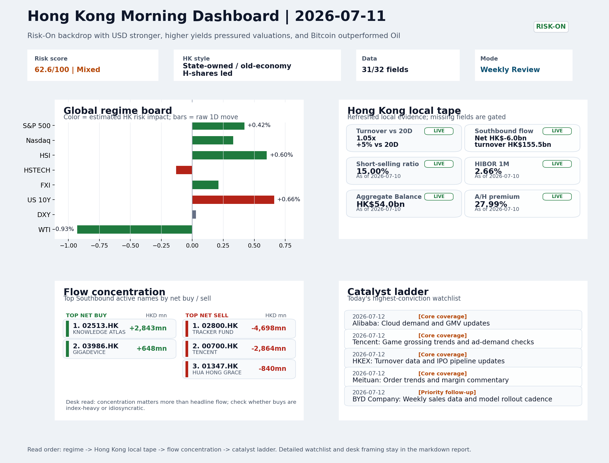
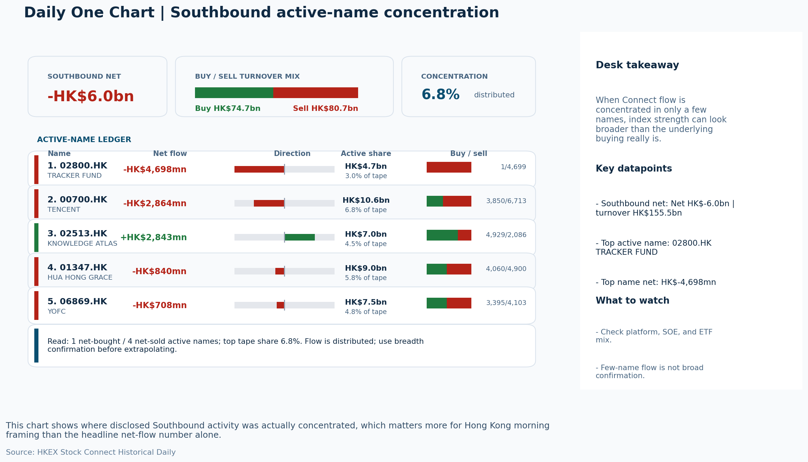
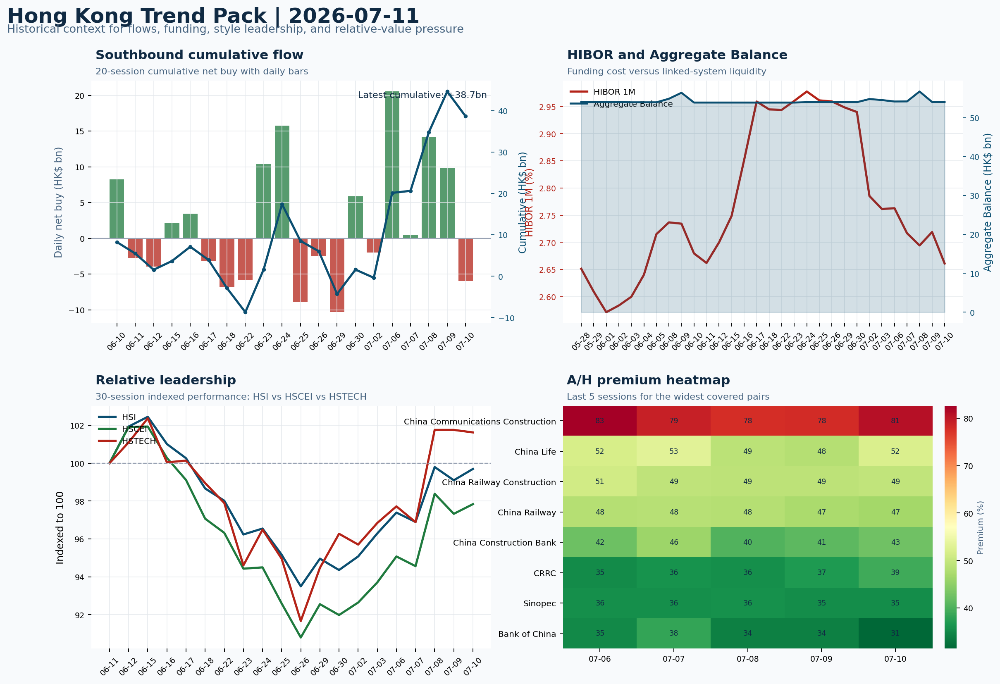

# Morning Research Workbench | 2026-07-12

> Designed for a Hong Kong sell-side commute: Layer 1 `Scan`, Layer 2 `Deep Read`, Layer 3 `Thinking`
> Mode: `Weekly Review` | Use Saturday's non-trading review date to synthesize the completed Hong Kong week and prepare next week's work plan.
> Briefing date: `2026-07-12` | Review date: `2026-07-11` | Global request: `2026-07-11` | HK/China request: `2026-07-10` | Market effective date: `2026-07-10` | Generated at: `2026-07-12 05:46:10`

## Executive Summary

- **Market pulse:** The week closed with Risk-On intact but local-flow quality uncertain - VIX compression and Bitcoin outperforming Oil support continued risk appetite, but Friday's Southbound reversal.
- **Hong Kong lens:** State-owned / old-economy H-shares led. The overnight backdrop is mixed for Monday's Hong Kong open: lower volatility supports risk appetite, but the yield move reinforces the late-week rotation out of HSTECH (-0.13%.
- **Top catalysts:** Risk-On backdrop with USD stronger, higher yields pressured valuations, and Bitcoin outperformed Oil; CPI MoM (Released).

## Visual Dashboard

## Layer 1 | Weekly Scan (5-10 min)

### 1.1 One-Line Market Pulse
The week closed with Risk-On intact but local-flow quality uncertain - VIX compression and Bitcoin outperforming Oil support continued risk appetite, but Friday's Southbound reversal and HSCEI-over-HSTECH leadership raise the question of whether the regime is broadening or rotating into a narrower SOE pocket heading into next week's Alibaba and Tencent catalysts.

### 1.2 Global Asset Price Dashboard

| Asset | Last | 1D move | Read |
| --- | --- | --- | --- |
| S&P 500 | 7,575.39 | +0.42% | US large-cap risk appetite |
| Nasdaq 100 | 29,825.11 | +0.33% | Growth and duration leadership |
| Hang Seng Index | 24,175.12 | +0.60% | Hong Kong broad beta |
| Hang Seng TECH | 4.6340 | -0.13% | Hong Kong growth / platform read-through |
| CSI 300 | 4,842.17 | +0.62% | Mainland large-cap tone |
| US 10Y | 4.5690 | +0.66% | Global discount-rate anchor |
| China 10Y | 1.74% | +0.2bp | China local rates anchor \| Live public \| Eastmoney \| 2026-07-10 |
| CN-US 10Y spread | -282.0bp | -1.8bp | Relative carry and macro-pressure gauge \| Live public \| Eastmoney \| 2026-07-10 |
| DXY | 100.97 | +0.03% | Dollar liquidity impulse |
| USD/CNH | 6.7535 | +0.00% | Offshore China risk appetite |
| USD/HKD | 7.8358 | -0.04% | Linked-exchange regime stress check |
| Brent crude | 76.01 | -0.38% | Energy / geopolitics |
| COMEX gold | 4,104.10 | -0.64% | Hedge demand / real yields |
| Copper | 6.2335 | +0.30% | Global growth proxy |
| VIX | 15.03 | **-5.11%** | US stress barometer |

### 1.3 Hong Kong Weekly Tape Quick Check

| Check | Value | Status | Source / as of | Why it matters |
| --- | --- | --- | --- | --- |
| Main Board turnover vs 20D | 1.05x \| +5% vs 20D | Live local | HKEX \| 2026-07-10 | Trailing 20-session average turnover was HK$322.4bn. |
| Southbound / Northbound net flow | Southbound Net HK$-6.0bn \| turnover HK$155.5bn \| Northbound Turnover HK$449.3bn \| net not reported | Live local | HKEX Connect \| 2026-07-10 | Southbound net buy is calculated from HKEX disclosed buy and sell turnover. |
| Short-selling ratio | 15.00% | Live local | HKEX \| 2026-07-10 | Official HKEX stock-level short-selling table, aggregated as a share of total market turnover. |
| AH premium index | 27.99% | Live public | Yahoo \| 2026-07-10 | Simple average across 18 A/H pairs; use dispersion rather than the average alone. |
| USD/HKD spot vs band | 7.8358 \| band 7.7500 to 7.8500 | Live quote + local | Yahoo \| 2026-07-10 | Inside the linked-exchange band without immediate boundary stress. Official Convertibility Undertakings define the linked-rate stress boundaries for USD/HKD. |
| HIBOR 1M | 2.66% | Live local | HKMA \| 2026-07-10 | 1M HIBOR is the cleanest quick read for Hong Kong funding conditions and equity-duration pressure. |
| Aggregate Balance | HK$54.0bn | Live local | HKMA \| 2026-07-10 | Aggregate Balance helps frame whether linked-rate liquidity conditions are tight or comfortable. |
| Hong Kong leadership | State-owned / old-economy H-shares led | Proxy | HSI / HSCEI / HSTECH relative perf \| 2026-07-10 | Use HSI / HSCEI / HSTECH relative moves as the opening style read. |

### 1.4 Risk Dashboard
**Composite risk score:** `62.6/100` | **Regime:** `Mixed`

| Component | Score impact | Evidence |
| --- | --- | --- |
| US beta | +2.5 | S&P 500 +0.42% |
| HK growth | -0.7 | HSTECH -0.13% |
| Offshore China proxy | +1.1 | FXI +0.21% |
| Dollar pressure | -0.3 | DXY +0.03% |
| Volatility | +10 | VIX -5.11% |
| HK short-selling | +0 | Short-selling ratio 15.00% |

### 1.5 Next Week Checklist
1. **Risk-On backdrop with USD stronger, higher yields pressured valuations, and Bitcoin outperformed Oil**
 Still-moving markets | No fresh Hong Kong cash session is assumed; use global active assets and policy/event flow to prepare the next open.
2. **CPI MoM (Released)**
 Macro / policy | Rates expectations, the dollar, and growth-equity valuation | Industries: Technology, Internet, Brokers
3. **VIX -5.11%**
 High-frequency data | Lower volatility signals easing stress in the tape.
4. **Trade Balance (Released)**
 Macro / policy | Watch whether it changes the day's core market narrative | Industries: Market-wide
5. **Retail Sales MoM (Upcoming)**
 Macro / policy | Consumer resilience, growth expectations, and risk-asset pricing | Industries: Consumer, E-commerce, Consumer discretionary

## Layer 2 | Deep Read (20-30 min)

### 2.1 Weekly Cross-Asset Review
> Weekly review mode: synthesize the completed Hong Kong week, retain the main cross-asset and policy lessons, and convert them into next-week preparation rather than treating Saturday as a fresh cash-market session.

#### Market Setup
**Core tape.** US equities closed the week modestly higher as sharply lower volatility supported risk appetite, but rising Treasury yields restrained growth and technology names.
**Main driver.** Bitcoin outperformed oil, extending a speculative rotation that fits the week's Risk-On frame, while the dollar was steady and offshore China FX was flat.

#### Key Drivers
- VIX dropped 5.11%, compressing risk premiums and supporting equity allocation.
- US 10Y yield rose 0.66%, raising the discount rate for long-duration sectors and capping Nasdaq 100 gains at 0.33%.
- Bitcoin gained 1.48% while WTI crude fell 0.93%, signaling risk-seeking behavior that historically correlates with broader equity breadth.
- DXY was nearly unchanged (+0.03%) and USD/CNH held flat, offering no new FX headwind for offshore China proxies.

#### Hong Kong Read-Through
**Desk lens.** State-owned / old-economy H-shares led.
**Opening implication.** The overnight backdrop is mixed for Monday's Hong Kong open: lower volatility supports risk appetite.
- **Cross-market read:** Hang Seng +0.60% / HSCEI +0.52% / HSTECH -0.13%.
- **Cross-market read:** Offshore China proxy FXI +0.21% and USD/CNH +0.00% frame cross-border risk appetite.
- **Cross-market read:** USD/HKD last traded around 7.8358, which keeps the Hong Kong funding lens in focus.

#### Watch Points
- USD composite moved higher by +0.16pct intraday, with a 0.443pct range.
- Main turning points appeared around 2026-07-10 08:10 peak / 2026-07-10 08:25 peak / 2026-07-10 09:15 trough, suggesting event-driven repricing.
- The biggest cross-asset divergence was Bitcoin versus Oil, a spread of 2.86pct.
- Gold moved -0.37pct intraday with a 0.828pct high-low range.

#### Weekly Review Map
- Weekly review window: 2026-07-06 to 2026-07-10. Core regime: Risk-On backdrop with USD stronger, higher yields pressured valuations, and Bitcoin outperformed Oil. Hong Kong leadership: State-owned / old-economy H-shares led.
- Method note: Trend summary uses the latest available five observations from the Hong Kong Trend Pack inputs.

**Cross-asset weekly dashboard**

| Asset | Latest move | Weekly read |
| --- | --- | --- |
| S&P 500 | +0.42% | Risk appetite |
| Nasdaq 100 | +0.33% | Growth style |
| Hang Seng Index | +0.60% | Hong Kong beta |
| Hang Seng TECH | -0.13% | Hong Kong growth / internet tone |
| DXY | +0.03% | Global liquidity |
| US 10Y | +0.66% | Rates path |
| Gold | -0.64% | Hedge / real yields |
| VIX | -5.11% | Volatility and hedging |

**Hong Kong / China weekly tape**

| Signal | Latest move | Read |
| --- | --- | --- |
| Hang Seng Index | +0.60% | Hong Kong beta |
| HSCEI | +0.52% | China SOE / H-share tone |
| Hang Seng TECH | -0.13% | Hong Kong growth / internet tone |
| China proxy (FXI) | +0.21% | China sentiment |
| USD/CNH | +0.00% | China FX sentiment |
| USD/HKD | -0.04% | Hong Kong funding lens |

**Five-session trend evidence**
_Window: 2026-07-06 to 2026-07-10_

| Signal | Five-session change | Latest | Desk read |
| --- | --- | --- | --- |
| Southbound flow | +39.1bn over 5 sessions | -6.0bn | 4/5 positive sessions; cumulative buying is the flow-confirmation test for next week. |
| HKD funding | HIBOR -10bp; Aggregate Balance -0.1bn | 2.66% / HK$54.0bn | Funding stress matters if HIBOR rises while Aggregate Balance contracts. |
| HK style leadership | HSTECH led (+3.9pp); HSI lagged (+2.3pp) | HSTECH leadership | Use HSI / HSCEI / HSTECH spread to separate broad beta from growth-led rerating. |
| A/H premium dispersion | -0.6pp average change | 47.2% average premium | Premium narrowing can support H-share relative demand |

**Flow and attribution clues**
- :

**Next-week desk questions**
- Did Southbound flow confirm the index move, or was the week mainly offshore beta without local money follow-through?
- Did HIBOR and Aggregate Balance point to benign funding, or should tighter HKD liquidity be part of next week's risk case?
- Was leadership broad enough beyond HSTECH / platform beta, or was the week concentrated in a narrow style pocket?
- Which dated macro, policy, earnings, or IPO catalyst can realistically change the next-week narrative?
- What single data point would invalidate the base-case market pulse by Monday or Tuesday morning?

**Key developments to retain**

| Bucket | Item | Why it matters |
| --- | --- | --- |
| B | Modi Courts Indo-Pacific Partners as China, US Reshape Region | Assess whether the story can propagate through the Other value chain |
| C | Your data built the AI boom - but Big Tech is pocketing 100% | Assess whether the story can propagate through the Financials value chain |
| Released | CPI MoM | Rates expectations, the dollar, and growth-equity valuation |
| Released | Trade Balance | Watch whether it changes the day's core market narrative |
| Upcoming | Retail Sales MoM | Consumer resilience, growth expectations, and risk-asset pricing |

**Next-week playbook**

| Date | Catalyst | Desk read |
| --- | --- | --- |
| 2026-07-12 | Alibaba: Cloud demand and GMV updates | Key read-through for China consumption, cloud, and platform regulation |
| 2026-07-12 | Tencent: Game grossing trends and ad-demand checks | Core offshore China platform proxy for gaming, ads, and AI monetization |
| 2026-07-12 | HKEX: Turnover data and IPO pipeline updates | Direct proxy for Hong Kong market turnover, listings, and southbound interest |
| 2026-07-12 | Meituan: Order trends and margin commentary | High-frequency read on local services demand and platform competition |
| 2026-07-12 | BYD Company: Weekly sales data and model rollout cadence | Hong Kong-listed proxy for EV volumes, export mix, and price competition |
| 2026-07-12 | AIA: NBV trends and agency momentum | Read-through for wealth demand, mainland visitor activity, and HK financial sentiment |
| 2026-07-12 | China Mobile: Capex updates and dividend policy signals | Defensive SOE benchmark for yield trade and domestic digital-infrastructure spend |
| 2026-07-12 | Tracker Fund of Hong Kong: Index-turnover shifts and ETF flows | Clean listed proxy for broad HSI positioning and passive flows |

**Curated overnight stories**
1. **Risk-On backdrop with USD stronger, higher yields pressured valuations, and Bitcoin**
 Why it matters: Sets the macro regime for the next HK trading session. USD strength typically signals offshore-China capital flow headwinds, while higher yields compress technology.
 HK read-through: Negative for HK high-duration growth names (internet, biotech, innovation). Positive for financials and energy-adjacent names.
2. **CPI MoM and Trade Balance Released (No shock to consensus)**
 Why it matters: Two macro anchors came in line with expectations. CPI did not reprice Fed rate-cut expectations aggressively, while Trade Balance provided no new catalyst to shift.
 HK read-through: Stale macro reference tape reduces tail-risk event probability for Monday. Risk assets can trade on flow and positioning rather than macro surprise.
3. **Retail Sales MoM Upcoming**
 Why it matters: Key consumer-resilience indicator due next week. Will test whether Risk-On growth narrative has fundamental support or is largely sentiment-driven.
 HK read-through: High importance for HK consumer, discretionary, and e-commerce names. A strong print reinforces Risk-On and supports growth-equity positioning.
4. **Stocks making moves: Delta, Vodafone, Intel, Micron, AstraZeneca, PepsiCo, Salesforce**
 Why it matters: Mixed sector moves with no clear China offshore theme. Intel and Micron reflect semiconductor cyclical recovery interest.
 HK read-through: Limited direct HK proxy. Monitor for spillover sentiment in technology and consumer sectors if US names gap Monday.

### 2.2 Hong Kong / A-share Weekly Review
> Weekly review mode: synthesize the completed Hong Kong week, retain the main cross-asset and policy lessons, and convert them into next-week preparation rather than treating Saturday as a fresh cash-market session.

#### Local Tape Setup
**Local read.** The week ended with an unusual within-Risk-On rotation: HSCEI led HSI while HSTECH lagged, breaking the growth-led setup that dominated earlier sessions.
**Verification point.** Southbound delivered net selling on Friday (HK$-6.0bn) after four consecutive positive sessions totaling +39.1bn.
**Risk to watch.** KWEB outflow (volume ratio 0.49x) alongside FXI inflow (0.58x) reinforces the style bifurcation.

#### Style and Local Leadership
**Style leadership.** State-owned / old-economy H-shares led.
- **Cross-market read:** Hang Seng +0.60% / HSCEI +0.52% / HSTECH -0.13%.
- **Cross-market read:** Offshore China proxy FXI +0.21% and USD/CNH +0.00% frame cross-border risk appetite.
- **Cross-market read:** USD/HKD last traded around 7.8358, which keeps the Hong Kong funding lens in focus.

#### Flow Confirmation
Official Stock Connect evidence is available; use Section 2.3 to confirm whether local money supports the price action.

#### Follow-Through Checklist
**Follow-through check.** Confirm whether Southbound resumes buying on Monday after Friday's net selling; if HSCEI continues outperforming HSTECH while FXI holds, the week's SOE rotation is structural rather than transient.

### 2.3 Flow Tracker and Attribution
#### Cross-Asset Attribution v1

| Driver | Direction | Score | Evidence | HK implication |
| --- | --- | --- | --- | --- |
| Rates impulse | drag | 0.79 | US 10Y yield proxy moved +0.66%. | Lower yields help long-duration growth; higher yields pressure valuation-sensitive |

#### Flow Tracker
##### Flow Takeaways
- Local flow evidence is not yet strong enough to override the cross-asset setup.
- Stock Connect Southbound: net HK$-6.0bn on turnover HK$155.5bn (as of 2026-07-10).
- Stock Connect Northbound: turnover RMB449.3bn; public file provides total turnover/top active names, not full net-buy.
- AH premium: simple covered-pair average +27.99%; widest premium: China Communications Construction 80.65%.

##### Stock Connect Southbound Active Names

| Rank | Ticker | Name | Buy | Sell | Net buy |
| --- | --- | --- | --- | --- | --- |
| 9 | 02800.HK | TRACKER FUND | HK$0.7mn | HK$4,698.7mn | HK$-4,698.1mn |
| 2 | 00700.HK | TENCENT | HK$3,849.5mn | HK$6,713.4mn | HK$-2,863.8mn |
| 5 | 02513.HK | KNOWLEDGE ATLAS | HK$4,929.2mn | HK$2,086.1mn | HK$2,843.1mn |
| 3 | 01347.HK | HUA HONG GRACE | HK$4,060.1mn | HK$4,900.4mn | HK$-840.3mn |
| 4 | 06869.HK | YOFC | HK$3,395.0mn | HK$4,103.2mn | HK$-708.2mn |

##### AH Premium Dispersion

| Name | A ticker | H ticker | Premium | As of |
| --- | --- | --- | --- | --- |
| China Communications Construction | 601800.SS | 1800.HK | +80.65% | 2026-07-10 |
| China Life | 601628.SS | 2628.HK | +52.17% | 2026-07-10 |
| China Railway Construction | 601186.SS | 1186.HK | +49.49% | 2026-07-10 |
| China Railway | 601390.SS | 0390.HK | +46.78% | 2026-07-10 |
| China Construction Bank | 601939.SS | 0939.HK | +42.58% | 2026-07-10 |

##### HKEX Short-Selling Watch

| Ticker | Name | Short ratio | Short turnover | Total turnover |
| --- | --- | --- | --- | --- |
| 00388.HK | HKEX | 9.11% | HK$0.2bn | HK$2.5bn |
| 00700.HK | TENCENT | 15.76% | HK$3.0bn | HK$18.8bn |
| 00941.HK | CHINA MOBILE | 23.50% | HK$0.2bn | HK$0.7bn |
| 01211.HK | BYD COMPANY | 19.99% | HK$0.4bn | HK$2.0bn |
| 01299.HK | AIA | 14.58% | HK$0.3bn | HK$1.9bn |

- **Short-value leaders:** 07709.HK XL2CSOPHYNIX (HK$4.2bn); 00700.HK TENCENT (HK$3.0bn); 09988.HK BABA-W (HK$2.3bn); 00981.HK SMIC (HK$2.1bn).

### 2.4 Macro and Policy Tracking
**Desk read.** Use the calendar table and released data below as the primary macro read.

| Time | Region | Event | Status | Desk read |
| --- | --- | --- | --- | --- |
| 20:30 | US | CPI MoM | Released | Impact: Rates expectations, the dollar, and growth-equity valuation \| Attention: 5/5 \| Industries: Technology, Internet, Brokers |
| 09:30 | China | Trade Balance | Released | Impact: Watch whether it changes the day's core market narrative \| Attention: 3/5 \| Industries: Market-wide |
| 20:30 | US | Retail Sales MoM | Upcoming | Impact: Consumer resilience, growth expectations, and risk-asset pricing \| Attention: 5/5 \| Industries: Consumer, E-commerce, Consumer discretionary |
| 09:20 | China | Loan Prime Rate | Upcoming | Impact: Watch whether it changes the day's core market narrative \| Attention: 3/5 \| Industries: Market-wide |
| 22:00 | Federal Reserve | Jerome Powell: Economic outlook remarks | Central bank | Impact: Policy path, liquidity conditions, and cross-asset risk appetite \| Attention: 5/5 \| Industries: Technology, Financials, Gold |
| 10:00 | PBOC | Open Market Operations Desk: Daily liquidity operation window | Central bank | Impact: Policy path, liquidity conditions, and cross-asset risk appetite \| Attention: 3/5 \| Industries: Technology, Financials, Gold |

#### Positioning and Risk Backdrop
- Options activity centered on KWEB Call, with Vol/OI at 1.88x and a bullish bias.
- Put/Call structure shows equity 0.68 / index 1.15, implying Single-stock optimism with index hedging.
- Geopolitics: Middle East | Regional tension remains elevated | Impact: Oil, freight costs, and safe-haven demand
- Geopolitics: US-China | Technology export-control rhetoric remains active | Impact: China internet, semiconductors, and supply chains

### 2.5 Key Company and Sector Events
No high-conviction sector story cleared the main-report relevance gate for this run.

#### HKEX Announcements

| Grade | Ticker | Type | Release time | Title |
| --- | --- | --- | --- | --- |
| A | 00317.HK | Profit warning | 2026-07-10 | Profit warning / alert announcement |
| A | 00397.HK | Profit warning | 2026-07-10 | Profit warning / alert announcement |
| A | 01138.HK | Profit warning | 2026-07-10 | Profit warning / alert announcement |
| A | 01378.HK | Profit warning | 2026-07-10 | Profit warning / alert announcement |
| A | 01979.HK | Profit warning | 2026-07-10 | Profit warning / alert announcement |
| A | 02202.HK | Profit warning | 2026-07-10 | Profit warning / alert announcement |
| A | 02238.HK | Profit warning | 2026-07-10 | Profit warning / alert announcement |
| A | 02714.HK | Profit warning | 2026-07-10 | Profit warning / alert announcement |

#### Earnings / Results Watch

| Ticker | Company | Timing | Expectation framing |
| --- | --- | --- | --- |
| 0700.HK | Tencent Holdings | After Market Close | EPS est. 4.15 HKD \| revenue est. 163.2bn HKD |
| 0388.HK | Hong Kong Exchanges and Clearing | Before Market Open | EPS est. 2.81 HKD \| revenue est. 6.0bn HKD |

#### Rating Changes
- **9988.HK** | Morgan Stanley | Upgrade | Equal Weight -> Overweight | PT 92 -> 105

#### IPO Watch
- IPO and grey-market monitoring is not yet part of the standard production pack.

### 2.6 Today's Core Names
#### Core coverage

| Name | Ticker | Last | 1D | Range position | Morning note |
| --- | --- | --- | --- | --- | --- |
| Alibaba | 9988.HK | 110.20 | +2.04% | Mid-range | Short-term price strength is clear; fresh catalysts could trigger broader group follow-through. |
| Tencent | 0700.HK | 460.20 | -2.00% | Mid-range | Short-term pressure is visible; check for a fundamental or regulatory reason. |

**Recent headlines for Alibaba:**
- [Google, OpenAI have been selling AI models to Chinese firms: FT](https://blockspace.media/short/google-openai-have-been-selling-ai-models-to-chinese-firms-ft/) (Blockspace)
**Recent headlines for Tencent:**
- [Google, OpenAI have been selling AI models to Chinese firms: FT](https://blockspace.media/short/google-openai-have-been-selling-ai-models-to-chinese-firms-ft/) (Blockspace)

#### Priority follow-up

| Name | Ticker | Last | 1D | Range position | Morning note |
| --- | --- | --- | --- | --- | --- |
| BYD Company | 1211.HK | 84.90 | +2.72% | Mid-range | Short-term price strength is clear; fresh catalysts could trigger broader group follow-through. |
| AIA | 1299.HK | 72.65 | +0.48% | Bottom of range | The name sits near the bottom of its recent range and is worth monitoring for a catalyst-led reversal. |

## Layer 3 | Thinking (10-15 min)

### 3.1 Rotating Theme Deep Dive

| Field | Read |
| --- | --- |
| Theme | AI and Compute Chain |
| Angle for the day | Track whether global AI capex, semis, cloud, and server demand are still carrying offshore China internet and hardware sentiment. |

**Theme desk read**
**Core thesis.** The AI and compute chain theme stayed relevant this week as HSTECH outperformed the broader market, with southbound flows providing a credible tailwind.
**Evidence.** A notable development was the FT report that Google and OpenAI have been supplying AI models to Chinese tech firms including Alibaba and Tencent.
**What to test.** Separately, Tencent's interest in acquiring a stake in AI firm Manus adds a stock-specific catalyst.

**Signals to keep in mind**
- Modi Courts Indo-Pacific Partners as China, US Reshape Region: Assess whether the story can propagate through the Other value chain
- Your data built the AI boom - but Big Tech is pocketing 100% of the equity: Assess whether the story can propagate through the Financials
- VIX -5.11%: Lower volatility signals easing stress in the tape.
- Bitcoin +1.48%: Keep tracking it to confirm whether the core daily narrative is holding.

**LLM watch items:**
- Southbound flow direction on Monday 13 Jul after strong weekly net buying
- Alibaba cloud demand and GMV update (catalyst date 12 Jul)
- Tencent game grossing trends and ad-demand checks (catalyst date 12 Jul)
- Tencent Manus stake acquisition progress and valuation implications
- US Retail Sales MoM (upcoming 12 Jul) for consumer spending signal

**Related names to keep close:**

| Name | Ticker | Bucket | Morning read |
| --- | --- | --- | --- |
| Alibaba | 9988.HK | Core coverage | Short-term price strength is clear; fresh catalysts could trigger broader group follow-through. |
| Tencent | 0700.HK | Core coverage | Short-term pressure is visible; check for a fundamental or regulatory reason. |
| HKEX | 0388.HK | Core coverage | Positioning is neutral for now, so use it mainly to monitor marginal information changes. |
| Meituan | 3690.HK | Core coverage | Positioning is neutral for now, so use it mainly to monitor marginal information changes. |

**Upcoming catalysts tied to the theme:**
- 2026-07-12 | Alibaba: Cloud demand and GMV updates | Key read-through for China consumption, cloud, and platform regulation
- 2026-07-12 | Tencent: Game grossing trends and ad-demand checks | Core offshore China platform proxy for gaming, ads, and AI monetization
- 2026-07-12 | AIA: NBV trends and agency momentum | Read-through for wealth demand, mainland visitor activity, and HK financial sentiment
- 2026-07-12 | Hang Seng TECH ETF: AI narrative shifts and China platform regulation headlines | Fast proxy for Hong Kong internet and growth leadership

**Relevant headlines:**
- [Modi Courts Indo-Pacific Partners as China, US Reshape Region](https://www.bloomberg.com/news/articles/2026-07-11/modi-courts-indo-pacific-partners-as-china-us-reshape-region)
- [Your data built the AI boom - but Big Tech is pocketing 100% of the equity](https://www.marketwatch.com/story/your-share-of-the-ai-wealth-is-a-right-not-a-handout-here-is-how-we-claw-back-our-money-7454b0e0?mod=mw_rss_topstories)

### 3.2 Next Week Calendar and Reopen Prep
- Non-trading review: use today's calendar to prepare the next Hong Kong open rather than treating the last cash tape as a fresh signal.
- Macro: CPI MoM is the first item to anchor the open and the rates/FX response.
- Corporate / event: Alibaba: Cloud demand and GMV updates is the cleanest same-day catalyst to prepare for.

**Same-day macro docket**

| Time | Country | Event | Status | Detail |
| --- | --- | --- | --- | --- |
| 20:30 | US | CPI MoM | Released | Actual 0.3% / Forecast 0.2% / Prior 0.4% |
| 09:30 | China | Trade Balance | Released | Actual USD 85.2bn / Forecast USD 79.0bn / Prior USD 80.6bn |
| 20:30 | US | Retail Sales MoM | Upcoming | Forecast 0.3% / Prior 0.6% |
| 09:20 | China | Loan Prime Rate | Upcoming | Forecast 3.45% / Prior 3.45% |
| 22:00 | Federal Reserve | Jerome Powell: Economic outlook remarks | Central bank | speech |

**Same-day catalyst list**

| Date | Time | Category | Event | Importance |
| --- | --- | --- | --- | --- |
| 2026-07-12 | | Core coverage | Alibaba: Cloud demand and GMV updates | 3 |
| 2026-07-12 | | Core coverage | Tencent: Game grossing trends and ad-demand checks | 3 |
| 2026-07-12 | | Core coverage | HKEX: Turnover data and IPO pipeline updates | 3 |
| 2026-07-12 | | Core coverage | Meituan: Order trends and margin commentary | 3 |

**Next few sessions**

| Date | Category | Event | Impact |
| --- | --- | --- | --- |
| 2026-07-12 | Core coverage | Alibaba: Cloud demand and GMV updates | Key read-through for China consumption, cloud, and platform regulation |
| 2026-07-12 | Core coverage | Tencent: Game grossing trends and ad-demand checks | Core offshore China platform proxy for gaming, ads, and AI monetization |
| 2026-07-12 | Core coverage | HKEX: Turnover data and IPO pipeline updates | Direct proxy for Hong Kong market turnover, listings, and southbound |
| 2026-07-12 | Core coverage | Meituan: Order trends and margin commentary | High-frequency read on local services demand and platform competition |

### 3.3 Daily One Chart
**Daily One Chart | Southbound active-name concentration**

**Chart read.** This chart shows where disclosed Southbound activity was actually concentrated, which matters more for Hong Kong morning framing than the headline net-flow number alone.

_Source: HKEX Stock Connect Historical Daily_

### 3.4 Hong Kong Trend Pack
**Hong Kong Trend Pack**

**Trend read.** Four historical lenses: Southbound cumulative flow, HKMA funding and liquidity, HSI/HSCEI/HSTECH relative leadership, and A/H premium dispersion.

_Source: HKEX Stock Connect, HKMA liquidity data, and public Yahoo Finance quotes_

## Traceable Appendix

### Report Metadata
> Date policy: Review date 2026-07-11 is treated as `Weekly Review`. | Global request date is 2026-07-11; adapter effective date is 2026-07-10 and summary date is 2026-07-10. | HK/China local data date is 2026-07-10; role: last completed HK/China cash-market reference tape.
> Market data quality: Coverage: `31/32` | Stale items (>1d): `2` | Missing: `1`
> Report quality: `84.1/100` | Grade `B` | Status `usable with caveats`

### Key Questions to Keep in Mind
- Is risk appetite rising or fading? The overnight tape reads closer to `Risk-On`.
- Did rates expectations move? Focus on whether US 10Y, DXY, and growth style moved together.
- Were commodities the real story? Watch WTI and gold for geopolitics versus inflation signals.
- Is Hong Kong setup internet-led, SOE-led, or broad beta-led? Compare HSTECH, HSCEI, and HSI.
- Did offshore markets move China risk appetite? Focus on HSI, FXI, USD/CNH, and USD/HKD.

### Report Quality and Validation
- **Quality score:** 84.1/100 | **Grade:** B | **Status:** usable with caveats
- **Run summary:** 7 healthy | 1 caveat | 0 failed
- **Release recommendation:** Send with caveats | The report is usable, but the advisory guidance should travel with it so readers understand the data gaps.

| Source | Status | Bucket |
| --- | --- | --- |
| Market data | ok | healthy |
| Sector and company news | ok | healthy |
| Movers and short selling | ok | healthy |
| Stock Connect | ok | healthy |
| A/H premium | ok | healthy |
| Hong Kong local package | ok | healthy |
| China rates | ok | healthy |
| Narrative overlay | partial | caveat |

**Desk-use guidance summary:** 0 blocking | 1 advisory

**Desk-use guidance**
- **Advisory:** Use deterministic sections as primary support; the narrative overlay was partial or unavailable on this run.

| Component | Score | Weight | Read |
| --- | --- | --- | --- |
| Market data coverage | 96.9 | 0.3 | 31/32 core market fields available. |
| Hong Kong local metrics | 82.3 | 0.25 | 8 live, 3 proxy, 0 unavailable local checks. |
| Key public adapters | 100.0 | 0.2 | 4/4 key adapters were available or partially available. |
| Narrative overlay health | 45.7 | 0.15 | 2/7 narrative overlay tasks succeeded or used validated cache; 2 error(s). |
| Fact-check guardrail | 75.0 | 0.1 | Checked 4 numeric claims; 1 numeric mismatch(es), 0 logic warning(s); 1 critical, 0 review. |

**Quality warnings**
- Narrative overlay health is weak: 2/7 narrative overlay tasks succeeded or used validated cache; 2 error(s).
- Narrative fact-check guardrail produced warnings; review the validation table before relying on narrative sections.

**Narrative fact-check guardrail**
- Checked 4 numeric claims; 1 numeric mismatch(es), 0 logic warning(s); 1 critical, 0 review.

| Severity | Field | Claim | Type | Claimed | Expected | Snippet |
| --- | --- | --- | --- | --- | --- | --- |
| critical | tasks.overnight_review.drivers[0] | VIX | change_pct | 5.11 | -5.11 | VIX dropped 5.11%, compressing risk premiums and supporting equity |

**Adapter status**

| Adapter | Status |
| --- | --- |
| Stock Connect | ok |
| A/H premium | ok |
| HKEX announcements | ok |
| China rates | ok |

### Source Links
- [Google, OpenAI have been selling AI models to Chinese firms: FT](https://blockspace.media/short/google-openai-have-been-selling-ai-models-to-chinese-firms-ft/) (Blockspace)
- [Tencent Eyes Largest Manus Stake After Meta's $2 Billion Deal Unravels](https://finance.yahoo.com/technology/ai/articles/tencent-eyes-largest-manus-stake-194943069.html) (GuruFocus.com)
- [Is Meituan (SEHK:3690) Pricey On Board Changes And A Rebound In Its Share Price?](https://finance.yahoo.com/markets/stocks/articles/meituan-sehk-3690-pricey-board-043242859.html) (Simply Wall St.)
- [Meituan (SEHK:3690) Stock Stays Cheap Following Its 73% Five Year Fall](https://finance.yahoo.com/markets/stocks/articles/meituan-sehk-3690-stock-stays-001907221.html) (Simply Wall St.)
- [China Mobile (SEHK:941): A Closer Look at Valuation After Steady Share Price Gains This Year](https://finance.yahoo.com/news/china-mobile-sehk-941-closer-154022664.html) (Simply Wall St.)
- [00317.HK Profit warning / alert announcement](http://www1.hkexnews.hk/listedco/listconews/sehk/2026/0710/2026071001277.pdf) (HKEXnews)
- [00397.HK Profit warning / alert announcement](http://www1.hkexnews.hk/listedco/listconews/sehk/2026/0710/2026071000706.pdf) (HKEXnews)
- [01138.HK Profit warning / alert announcement](http://www1.hkexnews.hk/listedco/listconews/sehk/2026/0710/2026071000612.pdf) (HKEXnews)
- [01378.HK Profit warning / alert announcement](http://www1.hkexnews.hk/listedco/listconews/sehk/2026/0710/2026071001039.pdf) (HKEXnews)
- [01979.HK Profit warning / alert announcement](http://www1.hkexnews.hk/listedco/listconews/sehk/2026/0710/2026071000750.pdf) (HKEXnews)
- [02202.HK Profit warning / alert announcement](http://www1.hkexnews.hk/listedco/listconews/sehk/2026/0710/2026071001165.pdf) (HKEXnews)
- [02238.HK Profit warning / alert announcement](http://www1.hkexnews.hk/listedco/listconews/sehk/2026/0710/2026071001295.pdf) (HKEXnews)
- [02714.HK Profit warning / alert announcement](http://www1.hkexnews.hk/listedco/listconews/sehk/2026/0710/2026071001011.pdf) (HKEXnews)

## Supplementary Visual Appendix

This appendix is professional-path only. It keeps a traceable index of the report visuals and the deterministic chart cues used to frame the morning note, without injecting the legacy intraday chart pack.

### Visual Index

| Visual | Path | Role |
| --- | --- | --- |
| Visual Dashboard | `charts/dashboard_2026-07-12.png` | Cross-asset regime board and Hong Kong local tape snapshot. |
| Daily One Chart | `charts/daily_one_chart_2026-07-12.png` | Single highest-conviction visual story for the day. |
| Hong Kong Trend Pack | `charts/hk_trend_pack_2026-07-12.png` | Historical context for flows, liquidity, leadership, and A/H dispersion. |

### Deterministic Chart Cues
- FX / liquidity: USD composite moved higher by +0.16pct intraday, with a 0.443pct range.
- FX / liquidity: Main turning points appeared around 2026-07-10 08:10 peak / 2026-07-10 08:25 peak / 2026-07-10 09:15 trough, suggesting event-driven repricing rather than a clean one-way USD move.
- Cross-asset: The biggest cross-asset divergence was Bitcoin versus Oil, a spread of 2.86pct.
- Cross-asset: Gold moved -0.37pct intraday with a 0.828pct high-low range.
- Cross-asset: Oil moved -1.31pct intraday with a 2.626pct high-low range.
- Cross-asset: Bitcoin moved +1.55pct intraday with a 2.554pct high-low range.

### Risk Dashboard Components

| Component | Score impact | Evidence |
| --- | --- | --- |
| US beta | +2.5 | S&P 500 +0.42% |
| HK growth | -0.7 | HSTECH -0.13% |
| Offshore China proxy | +1.1 | FXI +0.21% |
| Dollar pressure | -0.3 | DXY +0.03% |
| Volatility | +10 | VIX -5.11% |
| HK short-selling | +0 | Short-selling ratio 15.00% |
