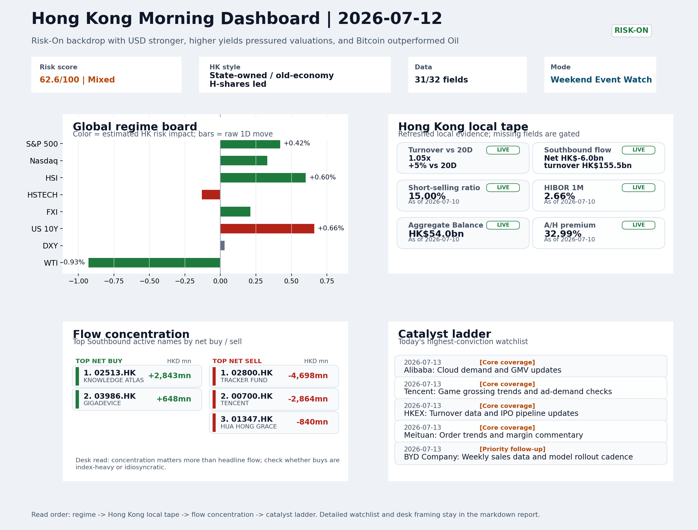

# Morning Research Workbench | 2026-07-13

> Designed for a Hong Kong sell-side commute: Layer 1 `Scan`, Layer 2 `Deep Read`, Layer 3 `Thinking`
> Mode: `Weekend Event Watch` | Track weekend policy, geopolitics, still-moving assets, and Monday open preparation rather than replaying stale cash-market tape.
> Briefing date: `2026-07-13` | Review date: `2026-07-12` | Global request: `2026-07-12` | HK/China request: `2026-07-10` | Market effective date: `2026-07-10` | Generated at: `2026-07-13 05:46:52`

## Executive Summary

- **Market pulse:** Weekend Risk-On signals are complicated by the US CPI beat driving a higher-rate repricing, leaving Monday's Hong Kong open tilted toward SOE/value leadership until HSTECH.
- **Hong Kong lens:** Hong Kong growth / internet led. A constructive open is likely, but the HSTECH underperformance versus state-owned H-shares last session suggests that higher yields may cap the initial upside for Hong Kong.
- **Top catalysts:** Risk-On backdrop with USD stronger, higher yields pressured valuations, and Bitcoin outperformed Oil; CPI MoM (Released).

## Visual Dashboard

## Layer 1 | Reset (5-10 min)

### 1.1 One-Line Market Pulse
Weekend Risk-On signals are complicated by the US CPI beat driving a higher-rate repricing, leaving Monday's Hong Kong open tilted toward SOE/value leadership until HSTECH can show relative resilience on volume.

### 1.2 Global Asset Price Dashboard

| Asset | Last | 1D move | Read |
| --- | --- | --- | --- |
| S&P 500 | 7,575.39 | +0.42% | US large-cap risk appetite |
| Nasdaq 100 | 29,825.11 | +0.33% | Growth and duration leadership |
| Hang Seng Index | 24,175.12 | +0.60% | Hong Kong broad beta |
| Hang Seng TECH | 4.6340 | -0.13% | Hong Kong growth / platform read-through |
| CSI 300 | 4,780.79 | **-1.96%** | Mainland large-cap tone |
| US 10Y | 4.5690 | +0.66% | Global discount-rate anchor |
| China 10Y | 1.74% | +0.2bp | China local rates anchor \| Live public \| Eastmoney \| 2026-07-10 |
| CN-US 10Y spread | -282.0bp | -1.8bp | Relative carry and macro-pressure gauge \| Live public \| Eastmoney \| 2026-07-10 |
| DXY | 100.97 | +0.03% | Dollar liquidity impulse |
| USD/CNH | 6.7535 | +0.00% | Offshore China risk appetite |
| USD/HKD | 7.8358 | -0.04% | Linked-exchange regime stress check |
| Brent crude | 76.01 | -0.38% | Energy / geopolitics |
| COMEX gold | 4,104.10 | -0.64% | Hedge demand / real yields |
| Copper | 6.2335 | +0.30% | Global growth proxy |
| VIX | 15.03 | **-5.11%** | US stress barometer |

### 1.3 Hong Kong Last Cash-Tape Quick Check (Reference)

| Check | Value | Status | Source / as of | Why it matters |
| --- | --- | --- | --- | --- |
| Main Board turnover vs 20D | 1.05x \| +5% vs 20D | Live local | HKEX \| 2026-07-10 | Trailing 20-session average turnover was HK$322.4bn. |
| Southbound / Northbound net flow | Southbound Net HK$-6.0bn \| turnover HK$155.5bn \| Northbound Turnover HK$449.3bn \| net not reported | Live local | HKEX Connect \| 2026-07-10 | Southbound net buy is calculated from HKEX disclosed buy and sell turnover. |
| Short-selling ratio | 15.00% | Live local | HKEX \| 2026-07-10 | Official HKEX stock-level short-selling table, aggregated as a share of total market turnover. |
| AH premium index | 32.99% | Live public | Yahoo \| 2026-07-10 | Simple average across 16 A/H pairs; use dispersion rather than the average alone. |
| USD/HKD spot vs band | 7.8358 \| band 7.7500 to 7.8500 | Live quote + local | Yahoo \| 2026-07-10 | Inside the linked-exchange band without immediate boundary stress. Official Convertibility Undertakings define the linked-rate stress boundaries for USD/HKD. |
| HIBOR 1M | 2.66% | Live local | HKMA \| 2026-07-10 | 1M HIBOR is the cleanest quick read for Hong Kong funding conditions and equity-duration pressure. |
| Aggregate Balance | HK$54.0bn | Live local | HKMA \| 2026-07-10 | Aggregate Balance helps frame whether linked-rate liquidity conditions are tight or comfortable. |
| Hong Kong leadership | Hong Kong growth / internet led | Proxy | HSI / HSCEI / HSTECH relative perf \| 2026-07-10 | Use HSI / HSCEI / HSTECH relative moves as the opening style read. |

### 1.4 Risk Dashboard
**Composite risk score:** `62.6/100` | **Regime:** `Mixed`

| Component | Score impact | Evidence |
| --- | --- | --- |
| US beta | +2.5 | S&P 500 +0.42% |
| HK growth | -0.7 | HSTECH -0.13% |
| Offshore China proxy | +1.1 | FXI +0.21% |
| Dollar pressure | -0.3 | DXY +0.03% |
| Volatility | +10 | VIX -5.11% |
| HK short-selling | +0 | Short-selling ratio 15.00% |

### 1.5 Next Open Checklist
1. **Risk-On backdrop with USD stronger, higher yields pressured valuations, and Bitcoin outperformed Oil**
 Still-moving markets | No fresh Hong Kong cash session is assumed; use global active assets and policy/event flow to prepare the next open.
2. **CPI MoM (Released)**
 Macro / policy | Rates expectations, the dollar, and growth-equity valuation | Industries: Technology, Internet, Brokers
3. **[A] Big Banks Set Up Strong Earnings Week**
 News / announcements | This can directly reshape earnings forecasts and the valuation framework
4. **VIX -5.11%**
 High-frequency data | Lower volatility signals easing stress in the tape.
5. **Trade Balance (Released)**
 Macro / policy | Watch whether it changes the day's core market narrative | Industries: Market-wide

## Layer 2 | Deep Read (20-30 min)

### 2.1 Still-Moving Global Financial Actions
> Non-trading mode: treat the cash-market tape below as last-available reference, not a fresh trading signal. Priority shifts to policy headlines, geopolitics, central-bank repricing, FX/commodities/crypto, corporate actions, and next-open preparation.

#### Market Setup
**Core tape.** The weekend risk backdrop is anchored by a firm USD, higher yields, and a significant drop in VIX, underscoring an overall Risk-On regime despite the drag from rates on growth valuations.
**Main driver.** Bitcoin's outperformance versus oil and gold's decline reinforce a speculative appetite rather than a defensive or inflation-hedge trade.
**HK relevance.** Weekend CPI and trade balance releases, combined with a strong US bank earnings setup, set a constructive tone for the Monday open, though USD strength and elevated yields remain a headwind for Hong Kong tech.

#### Key Drivers
- VIX fell 5.11%, signaling sharply lower equity stress and supporting risk appetite.
- US 10Y yield rose 0.66%, pressuring long-duration and growth valuations.
- Bitcoin +1.48% and WTI -0.93% divergence highlights speculative rotation away from commodities.
- Weekend CPI release feeds into Fed repricing; strong bank earnings expectations bolster financial sentiment.

#### Hong Kong Read-Through
**Desk lens.** State-owned / old-economy H-shares led.
**Opening implication.** A constructive open is likely, but the HSTECH underperformance versus state-owned H-shares last session suggests that higher yields may cap the initial upside for Hong Kong growth names.
- **Cross-market read:** Hang Seng +0.60% / HSCEI +0.52% / HSTECH -0.13%.
- **Cross-market read:** Offshore China proxy FXI +0.21% and USD/CNH +0.00% frame cross-border risk appetite.
- **Cross-market read:** USD/HKD last traded around 7.8358, which keeps the Hong Kong funding lens in focus.

#### Watch Points
- USD composite moved higher by +0.16pct intraday, with a 0.443pct range.
- Main turning points appeared around 2026-07-10 08:10 peak / 2026-07-10 08:25 peak / 2026-07-10 09:15 trough, suggesting event-driven repricing.
- The biggest cross-asset divergence was Bitcoin versus Oil, a spread of 2.86pct.
- Gold moved -0.37pct intraday with a 0.828pct high-low range.

#### Non-Trading Focus Map
- No fresh Hong Kong cash-market session is assumed for 2026-07-12; HK local tape is last completed HK/China cash-market reference tape from 2026-07-10.

| Monitor | Bucket | Last | Move | Why it matters |
| --- | --- | --- | --- | --- |
| VIX | Vol | 15.03 | -5.11% | Lower volatility signals easing stress in the tape. |
| Bitcoin | Crypto | 64,127.14 | +1.48% | Keep tracking it to confirm whether the core daily narrative is holding. |
| WTI crude | Commodities | 71.41 | -0.93% | Keep tracking it to confirm whether the core daily narrative is holding. |
| US 10Y | Rates | 4.5690 | +0.66% | Higher yields can pressure long-duration and growth valuations. |
| Gold | Commodities | 4,104.10 | -0.64% | Keep tracking it to confirm whether the core daily narrative is holding. |
| Copper | Commodities | 6.2335 | +0.30% | Keep tracking it to confirm whether the core daily narrative is holding. |

**Weekend / Holiday Event Docket**

| Channel | Signal | Why monitor | Next check |
| --- | --- | --- | --- |
| Vol | VIX -5.11% | Lower volatility signals easing stress in the tape. | Keep this as the bridge signal until the next Hong Kong cash close confirms or |
| Crypto | Bitcoin +1.48% | Keep tracking it to confirm whether the core daily narrative is holding. | Keep this as the bridge signal until the next Hong Kong cash close confirms or |
| Commodities | WTI crude -0.93% | Keep tracking it to confirm whether the core daily narrative is holding. | Keep this as the bridge signal until the next Hong Kong cash close confirms or |
| Rates | US 10Y +0.66% | Higher yields can pressure long-duration and growth valuations. | Keep this as the bridge signal until the next Hong Kong cash close confirms or |
| Released | CPI MoM | Rates expectations, the dollar, and growth-equity valuation | Check the rates, FX, and China-proxy reaction after release or official |
| Released | Trade Balance | Watch whether it changes the day's core market narrative | Check the rates, FX, and China-proxy reaction after release or official |
| Upcoming | Retail Sales MoM | Consumer resilience, growth expectations, and risk-asset pricing | Check the rates, FX, and China-proxy reaction after release or official |
| Geopolitics | Middle East: Regional tension remains elevated | Oil, freight costs, and safe-haven demand | Map any escalation first into oil, gold, USD, CNH, and HK growth-beta sensitivity. |

**Still-moving actions to track**
- **Geopolitics:** Middle East: Regional tension remains elevated | Oil, freight costs, and safe-haven demand
- **Geopolitics:** US-China: Technology export-control rhetoric remains active | China internet, semiconductors, and supply chains
- **Policy / company tape:** Big Banks Set Up Strong Earnings Week | This can directly reshape earnings forecasts and the valuation framework
- **Released:** CPI MoM | Rates expectations, the dollar, and growth-equity valuation
- **Released:** Trade Balance | Watch whether it changes the day's core market narrative

**Next-open preparation**
- First dated catalyst to prepare: 2026-07-13 | Alibaba: Cloud demand and GMV updates.
- Refresh HKEX turnover, Stock Connect, short-selling, and AH dispersion once the next HK cash session closes.
- Use USD/CNH, USD/HKD, DXY, oil, gold, and crypto as bridge signals before cash markets reopen.
- Prepare one base case and one risk case for the next Hong Kong open instead of over-reading stale cash-market moves.

**Curated overnight stories**
1. **Major US Banks Poised to Report Strong Q2 Earnings**
 Why it matters: US bank earnings set the tone for global financials. Bloomberg Intelligence flags trading, investment banking, and resilient lending as key drivers.
 HK read-through: Positive read-through for Hong Kong-listed banks and financial intermediaries. Strong US results support Risk-On and can lift regional banking sentiment heading into July 13.
2. **CPI MoM Data Released - Inflation Trajectory Still in Focus**
 Why it matters: CPI release reshapes Fed rate expectations, which in turn drives USD direction and global growth-equity multiples.
 HK read-through: USD path directly affects HK dollar stability and Chinese yuan direction. If CPI supports fewer cuts, USD strength persists - a continued headwind for HK growth stocks.
3. **Risk-On Backdrop: USD Firmer, Yields Higher, Bitcoin Outperforms Oil**
 Why it matters: The market theme summary flags USD strength and elevated yields pressuring valuations globally, while Bitcoin outperforming oil signals elevated risk appetite.
 HK read-through: Mixed signal: Bitcoin resilience supports crypto-adjacent names and risk sentiment, but USD firmness and higher yields remain structural headwinds for HK tech.
4. **VIX Down 5.11% - Volatility Stress Subdued**
 Why it matters: Declining VIX indicates easing market stress and lower risk premia. This correlates with the Risk-On regime and reduces tail-risk pricing for option markets.
 HK read-through: Lower implied volatility supports continued capital allocation into growth/sentiment-sensitive names in Hong Kong. Positive for Monday risk positioning.
5. **Goldman Sachs Highlights Favorite Chinese AI Models**
 Why it matters: Direct signal from a top-tier US investment bank on Chinese AI sector positioning. This can shape institutional allocation into HK/China tech names tied to AI development.
 HK read-through: Specific relevance for Hong Kong internet and AI-adjacent names. If Goldman is endorsing Chinese AI models, institutional interest in related HK-listed names.

### 2.2 Last Available Hong Kong / A-share Tape (Reference Only)
> Non-trading mode: treat the cash-market tape below as last-available reference, not a fresh trading signal. Priority shifts to policy headlines, geopolitics, central-bank repricing, FX/commodities/crypto, corporate actions, and next-open preparation.

#### Local Tape Setup
**Local read.** Weekend cross-asset signals lean Risk-On, but elevated US yields and the 15% HK short-selling ratio keep the balance tilted away from Hong Kong growth names.
**Verification point.** The last local session showed clear SOE/value leadership with HSTECH -0.13% against HSCEI +0.52%, while Southbound flow was net negative at HK$-6.0bn, stressing Tracker Fund sales.
**Risk to watch.** USD/CNH stability at 6.7535 provides a floor, yet the rates impulse remains the dominant drag for tech.

#### Style and Local Leadership
**Style leadership.** Hong Kong growth / internet led.
- **Cross-market read:** Hang Seng +0.60% / HSCEI +0.52% / HSTECH -0.13%.
- **Cross-market read:** Offshore China proxy FXI +0.21% and USD/CNH +0.00% frame cross-border risk appetite.
- **Cross-market read:** USD/HKD last traded around 7.8358, which keeps the Hong Kong funding lens in focus.

#### Flow Confirmation
Official Stock Connect evidence is available; use Section 2.3 to confirm whether local money supports the price action.

#### Follow-Through Checklist
**Follow-through check.** On Monday's open, confirm if HSTECH can reclaim relative strength when VIX stays low and US yields pause.

### 2.3 Flow Tracker and Attribution
#### Cross-Asset Attribution v1

| Driver | Direction | Score | Evidence | HK implication |
| --- | --- | --- | --- | --- |
| Rates impulse | drag | 0.79 | US 10Y yield proxy moved +0.66%. | Lower yields help long-duration growth; higher yields pressure valuation-sensitive |

#### Flow Tracker
##### Flow Takeaways
- Local flow evidence is not yet strong enough to override the cross-asset setup.
- Stock Connect Southbound: net HK$-6.0bn on turnover HK$155.5bn (as of 2026-07-10).
- Stock Connect Northbound: turnover RMB449.3bn; public file provides total turnover/top active names, not full net-buy.
- AH premium: simple covered-pair average +32.99%; widest premium: China Railway Construction 111.2%.

##### Stock Connect Southbound Active Names

| Rank | Ticker | Name | Buy | Sell | Net buy |
| --- | --- | --- | --- | --- | --- |
| 9 | 02800.HK | TRACKER FUND | HK$0.7mn | HK$4,698.7mn | HK$-4,698.1mn |
| 2 | 00700.HK | TENCENT | HK$3,849.5mn | HK$6,713.4mn | HK$-2,863.8mn |
| 5 | 02513.HK | KNOWLEDGE ATLAS | HK$4,929.2mn | HK$2,086.1mn | HK$2,843.1mn |
| 3 | 01347.HK | HUA HONG GRACE | HK$4,060.1mn | HK$4,900.4mn | HK$-840.3mn |
| 4 | 06869.HK | YOFC | HK$3,395.0mn | HK$4,103.2mn | HK$-708.2mn |

##### AH Premium Dispersion

| Name | A ticker | H ticker | Premium | As of |
| --- | --- | --- | --- | --- |
| China Railway Construction | 601186.SS | 1186.HK | +111.20% | 2026-07-10 |
| China Communications Construction | 601800.SS | 1800.HK | +80.32% | 2026-07-10 |
| China Life | 601628.SS | 2628.HK | +51.89% | 2026-07-10 |
| China Railway | 601390.SS | 0390.HK | +46.50% | 2026-07-10 |
| CRRC | 601766.SS | 1766.HK | +38.83% | 2026-07-10 |

##### HKEX Short-Selling Watch

| Ticker | Name | Short ratio | Short turnover | Total turnover |
| --- | --- | --- | --- | --- |
| 00388.HK | HKEX | 9.11% | HK$0.2bn | HK$2.5bn |
| 00700.HK | TENCENT | 15.76% | HK$3.0bn | HK$18.8bn |
| 00941.HK | CHINA MOBILE | 23.50% | HK$0.2bn | HK$0.7bn |
| 01211.HK | BYD COMPANY | 19.99% | HK$0.4bn | HK$2.0bn |
| 01299.HK | AIA | 14.58% | HK$0.3bn | HK$1.9bn |

- **Short-value leaders:** 07709.HK XL2CSOPHYNIX (HK$4.2bn); 00700.HK TENCENT (HK$3.0bn); 09988.HK BABA-W (HK$2.3bn); 00981.HK SMIC (HK$2.1bn).

### 2.4 Macro and Policy Tracking
**Desk read.** The weekend macro and policy agenda matters for Monday's Hong Kong open because the already-released June US CPI came in hotter than expected at 0.3% MoM (vs. 0.2% consensus), immediately repricing the rates‑and‑dollar complex.

**Market sensitivity.** That tightens the valuation lens for Hong Kong's growth and duration‑sensitive sectors just as traders also process a larger China trade surplus and await China's LPR fix, US retail sales, and Chair Powell's remarks.

**HK implication.** How these forces resolve over the weekend will shape whether Friday's Risk-On, lower‑volatility backdrop holds or gives way to renewed rate‑anxiety when the cash market reopens.

**Macro watchpoints**
- US 10Y yield and DXY after the CPI beat; whether they extend their move into the Asian cross.
- Monday morning China LPR fix: a cut versus a hold would sharply reprice property and financials.
- Powell speech (22:00 HKT): any shift from the June FOMC dot‑path or commentary on the hot CPI.
- US retail sales (20:30 HKT): an above‑consensus print would add to the rates‑up/risk‑off challenge.

| Time | Region | Event | Status | Desk read |
| --- | --- | --- | --- | --- |
| 20:30 | US | CPI MoM | Released | Impact: Rates expectations, the dollar, and growth-equity valuation \| Attention: 5/5 \| Industries: Technology, Internet, Brokers |
| 09:30 | China | Trade Balance | Released | Impact: Watch whether it changes the day's core market narrative \| Attention: 3/5 \| Industries: Market-wide |
| 20:30 | US | Retail Sales MoM | Upcoming | Impact: Consumer resilience, growth expectations, and risk-asset pricing \| Attention: 5/5 \| Industries: Consumer, E-commerce, Consumer discretionary |
| 09:20 | China | Loan Prime Rate | Upcoming | Impact: Watch whether it changes the day's core market narrative \| Attention: 3/5 \| Industries: Market-wide |
| 22:00 | Federal Reserve | Jerome Powell: Economic outlook remarks | Central bank | Impact: Policy path, liquidity conditions, and cross-asset risk appetite \| Attention: 5/5 \| Industries: Technology, Financials, Gold |
| 10:00 | PBOC | Open Market Operations Desk: Daily liquidity operation window | Central bank | Impact: Policy path, liquidity conditions, and cross-asset risk appetite \| Attention: 3/5 \| Industries: Technology, Financials, Gold |

#### Positioning and Risk Backdrop
- Options activity centered on KWEB Call, with Vol/OI at 1.88x and a bullish bias.
- Put/Call structure shows equity 0.68 / index 1.15, implying Single-stock optimism with index hedging.
- Geopolitics: Middle East | Regional tension remains elevated | Impact: Oil, freight costs, and safe-haven demand
- Geopolitics: US-China | Technology export-control rhetoric remains active | Impact: China internet, semiconductors, and supply chains

### 2.5 Key Company and Sector Events

| Grade | Sector | Headline | Why it matters | Horizon |
| --- | --- | --- | --- | --- |
| A | Financials | Big Banks Set Up Strong Earnings Week | This can directly reshape earnings forecasts and the valuation framework | Short-term catalyst |

#### HKEX Announcements

| Grade | Ticker | Type | Release time | Title |
| --- | --- | --- | --- | --- |
| A | 00317.HK | Profit warning | 2026-07-10 | Profit warning / alert announcement |
| A | 00397.HK | Profit warning | 2026-07-10 | Profit warning / alert announcement |
| A | 01138.HK | Profit warning | 2026-07-10 | Profit warning / alert announcement |
| A | 01378.HK | Profit warning | 2026-07-10 | Profit warning / alert announcement |
| A | 01979.HK | Profit warning | 2026-07-10 | Profit warning / alert announcement |
| A | 02202.HK | Profit warning | 2026-07-10 | Profit warning / alert announcement |
| A | 02238.HK | Profit warning | 2026-07-10 | Profit warning / alert announcement |
| A | 02714.HK | Profit warning | 2026-07-10 | Profit warning / alert announcement |

#### Earnings / Results Watch

| Ticker | Company | Timing | Expectation framing |
| --- | --- | --- | --- |
| 0700.HK | Tencent Holdings | After Market Close | EPS est. 4.15 HKD \| revenue est. 163.2bn HKD |
| 0388.HK | Hong Kong Exchanges and Clearing | Before Market Open | EPS est. 2.81 HKD \| revenue est. 6.0bn HKD |

#### Rating Changes
- **9988.HK** | Morgan Stanley | Upgrade | Equal Weight -> Overweight | PT 92 -> 105

#### IPO Watch
- IPO and grey-market monitoring is not yet part of the standard production pack.

### 2.6 Today's Core Names
#### Core coverage

| Name | Ticker | Last | 1D | Range position | Morning note |
| --- | --- | --- | --- | --- | --- |
| Alibaba | 9988.HK | 110.20 | +2.04% | Mid-range | Short-term price strength is clear; fresh catalysts could trigger broader group follow-through. |
| Tencent | 0700.HK | 460.20 | -2.00% | Mid-range | Short-term pressure is visible; check for a fundamental or regulatory reason. |

**Recent headlines for Alibaba:**
- [Google, OpenAI have been selling AI models to Chinese firms: FT](https://blockspace.media/short/google-openai-have-been-selling-ai-models-to-chinese-firms-ft/) (Blockspace)
**Recent headlines for Tencent:**
- [Meta (META) Faces $2 Billion AI Deal Reversal And EU App Design Probe](https://finance.yahoo.com/technology/ai/articles/meta-meta-faces-2-billion-210801965.html) (Simply Wall St.)

#### Priority follow-up

| Name | Ticker | Last | 1D | Range position | Morning note |
| --- | --- | --- | --- | --- | --- |
| BYD Company | 1211.HK | 84.90 | +2.72% | Mid-range | Short-term price strength is clear; fresh catalysts could trigger broader group follow-through. |
| AIA | 1299.HK | 72.65 | +0.48% | Bottom of range | The name sits near the bottom of its recent range and is worth monitoring for a catalyst-led reversal. |

## Layer 3 | Thinking (10-15 min)

### 3.1 Rotating Theme Deep Dive

| Field | Read |
| --- | --- |
| Theme | AI and Compute Chain |
| Angle for the day | Track whether global AI capex, semis, cloud, and server demand are still carrying offshore China internet and hardware sentiment. |

**Theme desk read**
**Core thesis.** The AI compute chain theme continues to offer a lens for offshore China internet names as the weekend's still-moving signals show easing stress (VIX -5.11%) and bitcoin resilience (+1.48%).
**Evidence.** Fresh cross-border AI news - the FT report of Google/OpenAI selling models to Alibaba/Baidu/Tencent subsidiaries, and the Meta/Manus deal reversal favouring Tencent - keeps the narrative flowing.
**What to test.** The first test arrives with Monday's catalysts: Alibaba's cloud demand and GMV updates, and Tencent's game/ads checks.

**Signals to keep in mind**
- VIX -5.11%: Lower volatility signals easing stress in the tape.
- Bitcoin +1.48%: Keep tracking it to confirm whether the core daily narrative is holding.

**LLM watch items:**
- US CPI fallout: monitor whether HK internet names open lower on yield-driven de-rating despite AI tailwinds.
- Alibaba cloud demand and GMV updates (Jul 13): check for AI-related service revenue traction.
- Tencent game grossing and ad-demand checks (Jul 13): confirm if AI monetization is showing in core business lines.
- US retail sales (Jul 13): a strong print could add yield pressure and shift Fed expectations further.
- VIX + Bitcoin as bridge signals: sustained risk appetite would soften the higher-yield headwind.

**Related names to keep close:**

| Name | Ticker | Bucket | Morning read |
| --- | --- | --- | --- |
| Alibaba | 9988.HK | Core coverage | Short-term price strength is clear; fresh catalysts could trigger broader group follow-through. |
| Tencent | 0700.HK | Core coverage | Short-term pressure is visible; check for a fundamental or regulatory reason. |
| HKEX | 0388.HK | Core coverage | Positioning is neutral for now, so use it mainly to monitor marginal information changes. |
| Meituan | 3690.HK | Core coverage | Positioning is neutral for now, so use it mainly to monitor marginal information changes. |

**Upcoming catalysts tied to the theme:**
- 2026-07-13 | Alibaba: Cloud demand and GMV updates | Key read-through for China consumption, cloud, and platform regulation
- 2026-07-13 | Tencent: Game grossing trends and ad-demand checks | Core offshore China platform proxy for gaming, ads, and AI monetization
- 2026-07-13 | AIA: NBV trends and agency momentum | Read-through for wealth demand, mainland visitor activity, and HK financial sentiment
- 2026-07-13 | Hang Seng TECH ETF: AI narrative shifts and China platform regulation headlines | Fast proxy for Hong Kong internet and growth leadership

### 3.2 Next Session Outlook and Calendar
- Non-trading review: use today's calendar to prepare the next Hong Kong open rather than treating the last cash tape as a fresh signal.
- Macro: CPI MoM is the first item to anchor the open and the rates/FX response.
- Corporate / event: Alibaba: Cloud demand and GMV updates is the cleanest same-day catalyst to prepare for.

**Same-day macro docket**

| Time | Country | Event | Status | Detail |
| --- | --- | --- | --- | --- |
| 20:30 | US | CPI MoM | Released | Actual 0.3% / Forecast 0.2% / Prior 0.4% |
| 09:30 | China | Trade Balance | Released | Actual USD 85.2bn / Forecast USD 79.0bn / Prior USD 80.6bn |
| 20:30 | US | Retail Sales MoM | Upcoming | Forecast 0.3% / Prior 0.6% |
| 09:20 | China | Loan Prime Rate | Upcoming | Forecast 3.45% / Prior 3.45% |
| 22:00 | Federal Reserve | Jerome Powell: Economic outlook remarks | Central bank | speech |

**Same-day catalyst list**

| Date | Time | Category | Event | Importance |
| --- | --- | --- | --- | --- |
| 2026-07-13 | | Core coverage | Alibaba: Cloud demand and GMV updates | 3 |
| 2026-07-13 | | Core coverage | Tencent: Game grossing trends and ad-demand checks | 3 |
| 2026-07-13 | | Core coverage | HKEX: Turnover data and IPO pipeline updates | 3 |
| 2026-07-13 | | Core coverage | Meituan: Order trends and margin commentary | 3 |

**Next few sessions**

| Date | Category | Event | Impact |
| --- | --- | --- | --- |
| 2026-07-13 | Core coverage | Alibaba: Cloud demand and GMV updates | Key read-through for China consumption, cloud, and platform regulation |
| 2026-07-13 | Core coverage | Tencent: Game grossing trends and ad-demand checks | Core offshore China platform proxy for gaming, ads, and AI monetization |
| 2026-07-13 | Core coverage | HKEX: Turnover data and IPO pipeline updates | Direct proxy for Hong Kong market turnover, listings, and southbound |
| 2026-07-13 | Core coverage | Meituan: Order trends and margin commentary | High-frequency read on local services demand and platform competition |

### 3.3 Daily One Chart
**Daily One Chart | Southbound active-name concentration**

**Chart read.** This chart shows where disclosed Southbound activity was actually concentrated, which matters more for Hong Kong morning framing than the headline net-flow number alone.

_Source: HKEX Stock Connect Historical Daily_

## Traceable Appendix

### Report Metadata
> Date policy: Review date 2026-07-12 is treated as `Weekend Event Watch`. | Global request date is 2026-07-12; adapter effective date is 2026-07-10 and summary date is 2026-07-10. | HK/China local data date is 2026-07-10; role: last completed HK/China cash-market reference tape.
> Market data quality: Coverage: `31/32` | Fallbacks used: `1` | Missing: `1`
> Report quality: `86.3/100` | Grade `B` | Status `production ready`

### Key Questions to Keep in Mind
- Is risk appetite rising or fading? The overnight tape reads closer to `Risk-On`.
- Did rates expectations move? Focus on whether US 10Y, DXY, and growth style moved together.
- Were commodities the real story? Watch WTI and gold for geopolitics versus inflation signals.
- Is Hong Kong setup internet-led, SOE-led, or broad beta-led? Compare HSTECH, HSCEI, and HSI.
- Did offshore markets move China risk appetite? Focus on HSI, FXI, USD/CNH, and USD/HKD.

### Report Quality and Validation
- **Quality score:** 86.3/100 | **Grade:** B | **Status:** production ready
- **Run summary:** 7 healthy | 1 caveat | 0 failed
- **Release recommendation:** Send with caveats | The report is usable, but the advisory guidance should travel with it so readers understand the data gaps.

| Source | Status | Bucket |
| --- | --- | --- |
| Market data | ok | healthy |
| Sector and company news | ok | healthy |
| Movers and short selling | ok | healthy |
| Stock Connect | ok | healthy |
| A/H premium | ok | healthy |
| Hong Kong local package | ok | healthy |
| China rates | ok | healthy |
| Narrative overlay | partial | caveat |

**Desk-use guidance summary:** 0 blocking | 1 advisory

**Desk-use guidance**
- **Advisory:** Use deterministic sections as primary support; the narrative overlay was partial or unavailable on this run.

| Component | Score | Weight | Read |
| --- | --- | --- | --- |
| Market data coverage | 96.9 | 0.3 | 31/32 core market fields available. |
| Hong Kong local metrics | 82.3 | 0.25 | 8 live, 3 proxy, 0 unavailable local checks. |
| Key public adapters | 100.0 | 0.2 | 4/4 key adapters were available or partially available. |
| Narrative overlay health | 77.1 | 0.15 | 5/7 narrative overlay tasks succeeded or used validated cache; 1 error(s). |
| Fact-check guardrail | 50.0 | 0.1 | Checked 6 numeric claims; 2 numeric mismatch(es), 0 logic warning(s); 2 critical, 0 review. |

**Quality warnings**
- Fact-check guardrail is weak: Checked 6 numeric claims; 2 numeric mismatch(es), 0 logic warning(s); 2 critical, 0 review.
- Narrative fact-check guardrail produced warnings; review the validation table before relying on narrative sections.

**Narrative fact-check guardrail**
- Checked 6 numeric claims; 2 numeric mismatch(es), 0 logic warning(s); 2 critical, 0 review.

| Severity | Field | Claim | Type | Claimed | Expected | Snippet |
| --- | --- | --- | --- | --- | --- | --- |
| critical | tasks.news_selection.selected_news[3].headline | VIX | change_pct | 5.11 | -5.11 | VIX Down 5.11% - Volatility Stress Subdued |
| critical | tasks.overnight_review.drivers[0] | VIX | change_pct | 5.11 | -5.11 | VIX fell 5.11%, signaling sharply lower equity stress and suppor |

**Adapter status**

| Adapter | Status |
| --- | --- |
| Stock Connect | ok |
| A/H premium | ok |
| HKEX announcements | ok |
| China rates | ok |

### Source Links
- [Big Banks Set Up Strong Earnings Week](https://www.bloomberg.com/news/videos/2026-07-12/big-banks-set-up-strong-earnings-week-video) (bloomberg_markets)
- [Google, OpenAI have been selling AI models to Chinese firms: FT](https://blockspace.media/short/google-openai-have-been-selling-ai-models-to-chinese-firms-ft/) (Blockspace)
- [Meta (META) Faces $2 Billion AI Deal Reversal And EU App Design Probe](https://finance.yahoo.com/technology/ai/articles/meta-meta-faces-2-billion-210801965.html) (Simply Wall St.)
- [Is Meituan (SEHK:3690) Pricey On Board Changes And A Rebound In Its Share Price?](https://finance.yahoo.com/markets/stocks/articles/meituan-sehk-3690-pricey-board-043242859.html) (Simply Wall St.)
- [Meituan (SEHK:3690) Stock Stays Cheap Following Its 73% Five Year Fall](https://finance.yahoo.com/markets/stocks/articles/meituan-sehk-3690-stock-stays-001907221.html) (Simply Wall St.)
- [China Mobile (SEHK:941): A Closer Look at Valuation After Steady Share Price Gains This Year](https://finance.yahoo.com/news/china-mobile-sehk-941-closer-154022664.html) (Simply Wall St.)
- [00317.HK Profit warning / alert announcement](http://www1.hkexnews.hk/listedco/listconews/sehk/2026/0710/2026071001277.pdf) (HKEXnews)
- [00397.HK Profit warning / alert announcement](http://www1.hkexnews.hk/listedco/listconews/sehk/2026/0710/2026071000706.pdf) (HKEXnews)
- [01138.HK Profit warning / alert announcement](http://www1.hkexnews.hk/listedco/listconews/sehk/2026/0710/2026071000612.pdf) (HKEXnews)
- [01378.HK Profit warning / alert announcement](http://www1.hkexnews.hk/listedco/listconews/sehk/2026/0710/2026071001039.pdf) (HKEXnews)
- [01979.HK Profit warning / alert announcement](http://www1.hkexnews.hk/listedco/listconews/sehk/2026/0710/2026071000750.pdf) (HKEXnews)
- [02202.HK Profit warning / alert announcement](http://www1.hkexnews.hk/listedco/listconews/sehk/2026/0710/2026071001165.pdf) (HKEXnews)
- [02238.HK Profit warning / alert announcement](http://www1.hkexnews.hk/listedco/listconews/sehk/2026/0710/2026071001295.pdf) (HKEXnews)
- [02714.HK Profit warning / alert announcement](http://www1.hkexnews.hk/listedco/listconews/sehk/2026/0710/2026071001011.pdf) (HKEXnews)

## Supplementary Visual Appendix

This appendix is professional-path only. It keeps a traceable index of the report visuals and the deterministic chart cues used to frame the morning note, without injecting the legacy intraday chart pack.

### Visual Index

| Visual | Path | Role |
| --- | --- | --- |
| Visual Dashboard | `charts/dashboard_2026-07-13.png` | Cross-asset regime board and Hong Kong local tape snapshot. |
| Daily One Chart | `charts/daily_one_chart_2026-07-13.png` | Single highest-conviction visual story for the day. |

### Deterministic Chart Cues
- FX / liquidity: USD composite moved higher by +0.16pct intraday, with a 0.443pct range.
- FX / liquidity: Main turning points appeared around 2026-07-10 08:10 peak / 2026-07-10 08:25 peak / 2026-07-10 09:15 trough, suggesting event-driven repricing rather than a clean one-way USD move.
- Cross-asset: The biggest cross-asset divergence was Bitcoin versus Oil, a spread of 2.86pct.
- Cross-asset: Gold moved -0.37pct intraday with a 0.828pct high-low range.
- Cross-asset: Oil moved -1.31pct intraday with a 2.626pct high-low range.
- Cross-asset: Bitcoin moved +1.55pct intraday with a 2.554pct high-low range.

### Risk Dashboard Components

| Component | Score impact | Evidence |
| --- | --- | --- |
| US beta | +2.5 | S&P 500 +0.42% |
| HK growth | -0.7 | HSTECH -0.13% |
| Offshore China proxy | +1.1 | FXI +0.21% |
| Dollar pressure | -0.3 | DXY +0.03% |
| Volatility | +10 | VIX -5.11% |
| HK short-selling | +0 | Short-selling ratio 15.00% |
