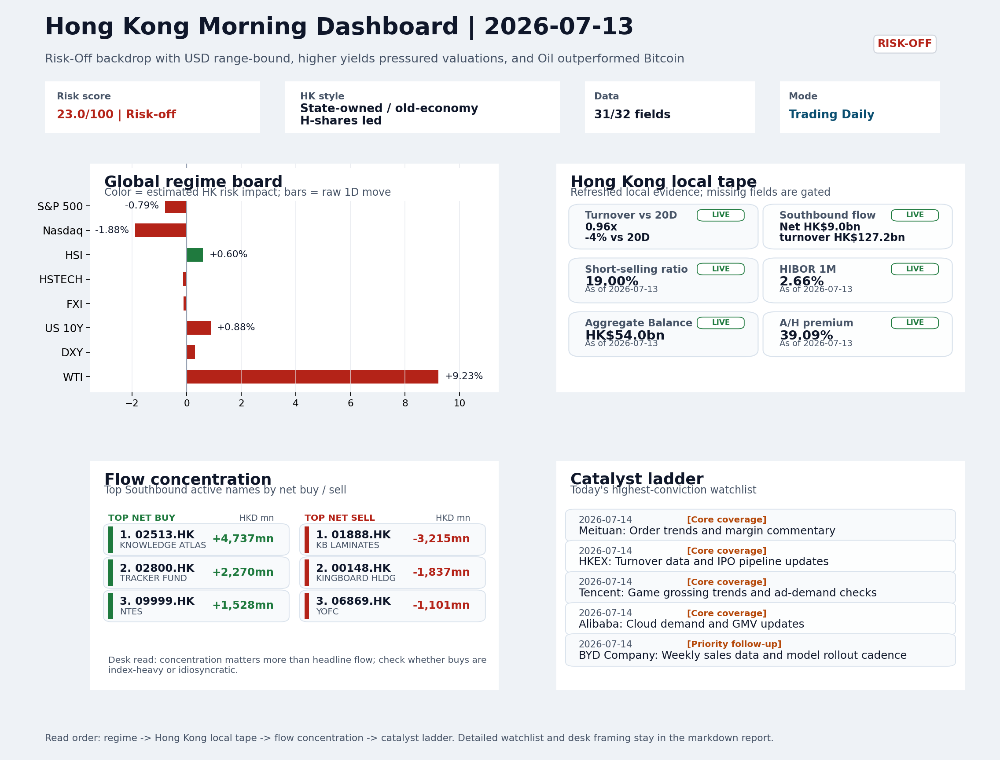
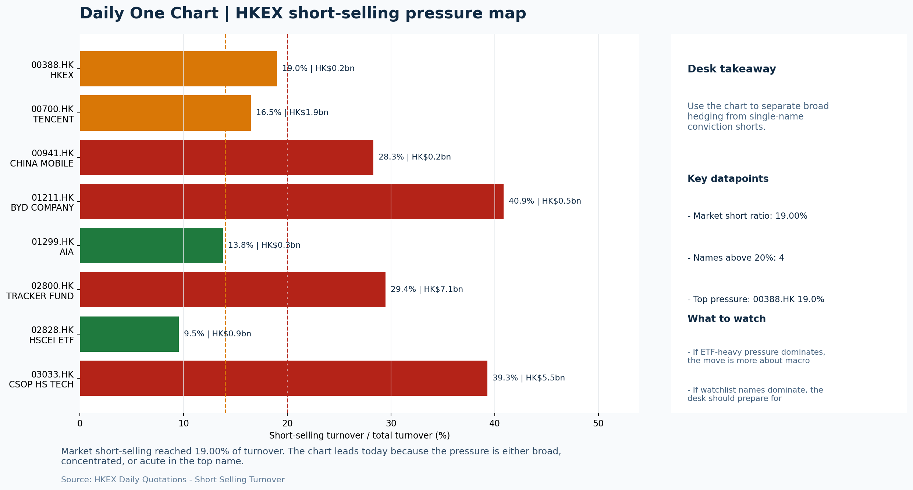

# Morning Research Workbench | 2026-07-14

> Designed for a Hong Kong sell-side commute: Layer 1 `Scan`, Layer 2 `Deep Read`, Layer 3 `Thinking`
> Mode: `Trading Daily` | Keep the report execution-oriented: what mattered in the completed session, what can move Hong Kong leadership, and what needs fast follow-up.
> Briefing date: `2026-07-14` | Review date: `2026-07-13` | Global request: `2026-07-13` | HK/China request: `2026-07-13` | Market effective date: `2026-07-13` | Generated at: `2026-07-14 05:54:35`

## Executive Summary

- **Market pulse:** The overnight risk-off shock from a VIX spike, higher US yields, and a hawkish Fed tilt leaves Hong Kong's open conditioned on whether local growth names can absorb the pressure without.
- **Hong Kong lens:** State-owned / old-economy H-shares led. Monday's HK open faces headwinds from the US Risk-Off transmission. State-owned and old-economy H-shares led the Friday session (HSCEI +0.52%), but growth and internet names.
- **Top catalysts:** VIX +14.17%; WTI crude +9.23%.

## Visual Dashboard

## Layer 1 | Scan (5-10 min)

### 1.1 One-Line Market Pulse
The overnight risk-off shock from a VIX spike, higher US yields, and a hawkish Fed tilt leaves Hong Kong's open conditioned on whether local growth names can absorb the pressure without a fresh short-selling surge.

### 1.2 Global Asset Price Dashboard

| Asset | Last | 1D move | Read |
| --- | --- | --- | --- |
| S&P 500 | 7,515.34 | -0.79% | US large-cap risk appetite |
| Nasdaq 100 | 29,264.10 | **-1.88%** | Growth and duration leadership |
| Hang Seng Index | 24,175.12 | +0.60% | Hong Kong broad beta |
| Hang Seng TECH | 4.6340 | -0.13% | Hong Kong growth / platform read-through |
| CSI 300 | 4,780.79 | **-1.96%** | Mainland large-cap tone |
| US 10Y | 4.6090 | +0.88% | Global discount-rate anchor |
| China 10Y | 1.74% | +0.4bp | China local rates anchor \| Live public \| Eastmoney \| 2026-07-13 |
| CN-US 10Y spread | -287.6bp | -5.6bp | Relative carry and macro-pressure gauge \| Live public \| Eastmoney \| 2026-07-13 |
| DXY | 101.27 | +0.30% | Dollar liquidity impulse |
| USD/CNH | 6.7570 | +0.00% | Offshore China risk appetite |
| USD/HKD | 7.8375 | +0.02% | Linked-exchange regime stress check |
| Brent crude | 83.18 | **+9.43%** | Energy / geopolitics |
| COMEX gold | 4,008.70 | **-2.32%** | Hedge demand / real yields |
| Copper | 6.2760 | +0.68% | Global growth proxy |
| VIX | 17.16 | **+14.17%** | US stress barometer |

### 1.3 Hong Kong Key Data Quick Check

| Check | Value | Status | Source / as of | Why it matters |
| --- | --- | --- | --- | --- |
| Main Board turnover vs 20D | 0.96x \| -4% vs 20D | Live local | HKEX \| 2026-07-13 | Trailing 20-session average turnover was HK$323.3bn. |
| Southbound / Northbound net flow | Southbound Net HK$9.0bn \| turnover HK$127.2bn \| Northbound Turnover HK$417.8bn \| net not reported | Live local | HKEX Connect \| 2026-07-13 | Southbound net buy is calculated from HKEX disclosed buy and sell turnover. |
| Short-selling ratio | 19.00% | Live local | HKEX \| 2026-07-13 | Official HKEX stock-level short-selling table, aggregated as a share of total market turnover. |
| AH premium index | 39.09% | Live public | Yahoo \| 2026-07-13 | Simple average across 18 A/H pairs; use dispersion rather than the average alone. |
| USD/HKD spot vs band | 7.8375 \| band 7.7500 to 7.8500 | Live quote + local | Yahoo \| 2026-07-13 | Inside the linked-exchange band without immediate boundary stress. Official Convertibility Undertakings define the linked-rate stress boundaries for USD/HKD. |
| HIBOR 1M | 2.66% | Live local | HKMA \| 2026-07-13 | 1M HIBOR is the cleanest quick read for Hong Kong funding conditions and equity-duration pressure. |
| Aggregate Balance | HK$54.0bn | Live local | HKMA \| 2026-07-13 | Aggregate Balance helps frame whether linked-rate liquidity conditions are tight or comfortable. |
| Hong Kong leadership | State-owned / old-economy H-shares led | Proxy | HSI / HSCEI / HSTECH relative perf \| 2026-07-13 | Use HSI / HSCEI / HSTECH relative moves as the opening style read. |

### 1.4 Risk Dashboard
**Composite risk score:** `23.0/100` | **Regime:** `Risk-off`

| Component | Score impact | Evidence |
| --- | --- | --- |
| US beta | -4.7 | S&P 500 -0.79% |
| HK growth | -0.7 | HSTECH -0.13% |
| Offshore China proxy | -0.6 | FXI -0.12% |
| Dollar pressure | -3.0 | DXY +0.30% |
| Volatility | -10 | VIX +14.17% |
| HK short-selling | -8 | Short-selling ratio 19.00% |

### 1.5 Morning Checklist
1. **VIX +14.17%**
 High-frequency data | Higher volatility argues for tighter sizing and tighter stops.
2. **WTI crude +9.23%**
 High-frequency data | A strong crude move needs to be split between geopolitics and demand repair.
3. **INTC -6.33%**
 Mover attribution | Announcement / expectations | Guidance reset and margin pressure
4. **Risk-Off backdrop with USD range-bound, higher yields pressured valuations, and Oil outperformed Bitcoin**
 Overnight regime | Start by deciding whether the day is about Risk-Off conditions or a style pivot.
5. **CPI MoM (Released)**
 Macro / policy | Rates expectations, the dollar, and growth-equity valuation | Industries: Technology, Internet, Brokers

## Layer 2 | Deep Read (20-30 min)

### 2.1 Overnight Overseas Market Review
#### Market Setup
**Core tape.** Overnight overseas markets registered a clear Risk-Off session as the VIX spiked +14.2% to 17.16, pressuring Nasdaq 100 down -1.88% and S&P 500 -0.79% on hawkish Fed commentary and a guidance reset from Intel (-6.33%).
**Main driver.** Higher US 10Y yields (+0.88% to 4.609) reinforced valuation pressure on duration-sensitive names, while DXY edged +0.30% to 101.27 as the dollar held range-bound.
**HK relevance.** The standout cross-asset divergence was WTI crude surging +9.23% versus Bitcoin -2.92%, splitting the read between geopolitical supply risk and risk-asset liquidation.

#### Key Drivers
- Fed's Waller maintained a hawkish tilt, saying hikes remain on the table and warning against 'fighting the last war' on inflation.
- VIX surged +14.2% intraday, reflecting acute risk-off repricing that typically forces systematic de-risking across EM and HK-exposed.
- Nasdaq 100 fell -1.88% as Intel guided lower on margin pressure, a negative signal for global chip sentiment relevant to HK-listed semis.
- US 10Y yield rose +0.88%, directly pressuring growth and duration-sensitive valuations domestically and for offshore proxies.

#### Hong Kong Read-Through
**Desk lens.** State-owned / old-economy H-shares led.
**Opening implication.** Monday's HK open faces headwinds from the US Risk-Off transmission. State-owned and old-economy H-shares led the Friday session (HSCEI +0.52%).
- **Cross-market read:** Hang Seng +0.60% / HSCEI +0.52% / HSTECH -0.13%.
- **Cross-market read:** Offshore China proxy FXI -0.12% and USD/CNH +0.00% frame cross-border risk appetite.
- **Cross-market read:** USD/HKD last traded around 7.8375, which keeps the Hong Kong funding lens in focus.

#### Watch Points
- USD composite moved higher by +0.15pct intraday, with a 0.298pct range.
- Main turning points appeared around 2026-07-13 08:05 peak / 2026-07-13 08:20 trough / 2026-07-13 08:40 peak, suggesting event-driven repricing.
- The biggest cross-asset divergence was Oil versus Bitcoin, a spread of 7.848pct.
- Gold moved -1.38pct intraday with a 2.254pct high-low range.

**Curated overnight stories**
1. **VIX spikes +14.17% intraday**
 Why it matters: A sharp VIX move signals acute risk-off repricing; higher implied volatility typically forces systematic de-risking and tighter position sizing across EM and HK-exposed funds.
 HK read-through: Direct. Elevated vol premiums hit Hong Kong growth and internet names hardest. Supports defensive positioning into Monday open.
2. **WTI crude surges +9.23%**
 Why it matters: A near-10% single-session oil move is material. Whether driven by Iran geopolitical risk or demand expectations, it reprices energy input costs and inflation expectations.
 HK read-through: Mixed. Supports energy names (Sinopec, CNOOC) but raises cost pressures for airlines (Cathay, Air China) and industrials. Adds to Risk-Off framing.
3. **Fed's Waller: hikes still possible, shouldn't 'fight the last war' on inflation**
 Why it matters: Reaffirms Fed's data-dependency but with a hawkish tilt. July rate hike odds are rising per fed funds futures. Any hike repricing strengthens USD and pressures EM liquidity.
 HK read-through: High for Hong Kong. USD strength directly impacts H-share earnings in HKD terms and cross-border capital flows. Bodes poorly for rate-sensitive HK growth stocks.
4. **INTC -6.33% on guidance reset and margin pressure**
 Why it matters: Intel's sharp guidance cut signals persistent semiconductor headwinds. The stock decline reflects demand uncertainty and competitive pressures, a negative signal for global.
 HK read-through: Relevant for HK-listed semis (SMIC, Hua Hong). If US semis de-rate on guidance cuts, HK chip names face contagion on Monday.
5. **Goldman Sachs picks favorite Chinese AI models: DeepSeek, Zhipu AI, ByteDance Doubao**
 Why it matters: Goldman's explicit buy-side endorsement of Chinese domestic AI models validates the domestic AI investment theme.
 HK read-through: Supports sentiment around Alibaba Cloud, Tencent, Baidu, and mainland AI ecosystem plays. Partially offsets the Risk-Off tone for tech.

### 2.2 Hong Kong / A-share Previous-Day Review
#### Local Tape Setup
**Local read.** Hong Kong closed with a value-led skew on Monday: HSI +0.6% and HSCEI +0.52% were driven by SOE and old-economy names, while HSTECH slipped -0.13% and failed to confirm any growth rotation.
**Verification point.** With overnight Nasdaq -1.88% and VIX +14.2%, the cross-market read is growth-negative, though Southbound net buying of HK$9.0bn - concentrated in Tracker Fund and SMIC - offers some local cushion.
**Risk to watch.** Elevated short-selling at 19% of turnover and outflows from FXI/KWEB suggest that any rebound will require cleaner breadth and a decisive style shift.

#### Style and Local Leadership
**Style leadership.** State-owned / old-economy H-shares led.
- **Cross-market read:** Hang Seng +0.60% / HSCEI +0.52% / HSTECH -0.13%.
- **Cross-market read:** Offshore China proxy FXI -0.12% and USD/CNH +0.00% frame cross-border risk appetite.
- **Cross-market read:** USD/HKD last traded around 7.8375, which keeps the Hong Kong funding lens in focus.

#### Flow Confirmation
Official Stock Connect evidence is available; use Section 2.3 to confirm whether local money supports the price action.

#### Follow-Through Checklist
**Follow-through check.** Watch whether HSTECH flips positive and the short-selling ratio retreats below 15%.

### 2.3 Flow Tracker and Attribution
#### Cross-Asset Attribution v1

| Driver | Direction | Score | Evidence | HK implication |
| --- | --- | --- | --- | --- |
| Oil and geopolitics | mixed | 7.54 | Oil moved +9.43%. | Split the read between energy/cyclicals support and margin/geopolitical pressure. |
| Short-selling pressure | drag | 2.8 | HKEX short-selling ratio was 19.00%. | Elevated short activity argues for extra confirmation before chasing rebounds. |
| US growth-style transmission | drag | 2.63 | Nasdaq 100 moved -1.88%. | Hong Kong growth and platform names should be tested first at the open. |
| Rates impulse | drag | 1.06 | US 10Y yield proxy moved +0.88%. | Lower yields help long-duration growth; higher yields pressure valuation-sensitive |
| Global equity beta | drag | 0.79 | S&P 500 moved -0.79%. | Broad beta matters if Hong Kong breadth confirms the overseas signal. |
| Dollar / CNH pressure | drag | 0.45 | DXY +0.30% / USD-CNH +0.00% | A stable or softer CNH makes Hong Kong follow-through more credible. |

#### Flow Tracker
##### Flow Takeaways
- Short-selling pressure is elevated, so local rebounds need cleaner breadth and flow confirmation.
- Stock Connect Southbound: net HK$9.0bn on turnover HK$127.2bn (as of 2026-07-13).
- Stock Connect Northbound: turnover RMB417.8bn; public file provides total turnover/top active names, not full net-buy.
- AH premium: simple covered-pair average +39.09%; widest premium: Chalco 94.13%.

##### Stock Connect Southbound Active Names

| Rank | Ticker | Name | Buy | Sell | Net buy |
| --- | --- | --- | --- | --- | --- |
| 1 | 02513.HK | KNOWLEDGE ATLAS | HK$7,111.3mn | HK$2,374.6mn | HK$4,736.7mn |
| 3 | 01888.HK | KB LAMINATES | HK$2,001.1mn | HK$5,215.6mn | HK$-3,214.5mn |
| 9 | 02800.HK | TRACKER FUND | HK$2,279.9mn | HK$9.8mn | HK$2,270.2mn |
| 7 | 00148.HK | KINGBOARD HLDG | HK$1,061.4mn | HK$2,898.2mn | HK$-1,836.8mn |
| 9 | 09999.HK | NTES | HK$1,553.5mn | HK$25.6mn | HK$1,527.8mn |

##### AH Premium Dispersion

| Name | A ticker | H ticker | Premium | As of |
| --- | --- | --- | --- | --- |
| Chalco | 601600.SS | 2600.HK | +94.13% | 2026-07-13 |
| China Communications Construction | 601800.SS | 1800.HK | +85.95% | 2026-07-13 |
| New China Life | 601336.SS | 1336.HK | +64.83% | 2026-07-13 |
| China Life | 601628.SS | 2628.HK | +58.31% | 2026-07-13 |
| China Railway Construction | 601186.SS | 1186.HK | +49.67% | 2026-07-13 |

##### HKEX Short-Selling Watch

| Ticker | Name | Short ratio | Short turnover | Total turnover |
| --- | --- | --- | --- | --- |
| 00388.HK | HKEX | 18.99% | HK$0.2bn | HK$1.1bn |
| 00700.HK | TENCENT | 16.48% | HK$1.9bn | HK$11.3bn |
| 00941.HK | CHINA MOBILE | 28.30% | HK$0.2bn | HK$0.8bn |
| 01211.HK | BYD COMPANY | 40.86% | HK$0.5bn | HK$1.3bn |
| 01299.HK | AIA | 13.78% | HK$0.3bn | HK$2.1bn |

- **Short-value leaders:** 07709.HK XL2CSOPHYNIX (HK$8.5bn); 02800.HK TRACKER FUND (HK$7.1bn); 03033.HK CSOP HS TECH (HK$5.5bn); 09988.HK BABA-W (HK$2.3bn).

### 2.4 Macro and Policy Tracking
**Desk read.** The macro calendar is dense with catalysts that can reprice the rates-and-dollar backdrop for Hong Kong.

**Market sensitivity.** US CPI for June printed 0.3% MoM, above the 0.2% consensus and below the prior 0.4% - a data point that keeps the 'higher for longer' narrative alive and will pressure duration assets and growth-multiple proxies in Hong Kong.

**HK implication.** China Trade Balance arrived at USD 85.2bn, beating the USD 79.0bn forecast, which may provide a marginal offset to risk-off sentiment but is unlikely to redirect the day's core narrative on its own.

**Macro watchpoints**
- US CPI reaction: 10-year Treasury yield and DXY trajectory after the data release.
- Hong Kong growth proxies (Tech, Internet) response to the hot CPI print and whether VIX-driven selling finds a floor.
- WTI crude at USD 78.0: whether the oil move continues to support energy names or starts crowding out other sector leadership.
- China Trade Balance (USD 85.2bn) and whether the beat provides any meaningful lift to Hang Seng or H-shares.

| Time | Region | Event | Status | Desk read |
| --- | --- | --- | --- | --- |
| 20:30 | US | CPI MoM | Released | Impact: Rates expectations, the dollar, and growth-equity valuation \| Attention: 5/5 \| Industries: Technology, Internet, Brokers |
| 09:30 | China | Trade Balance | Released | Impact: Watch whether it changes the day's core market narrative \| Attention: 3/5 \| Industries: Market-wide |
| 20:30 | US | Retail Sales MoM | Upcoming | Impact: Consumer resilience, growth expectations, and risk-asset pricing \| Attention: 5/5 \| Industries: Consumer, E-commerce, Consumer discretionary |
| 09:20 | China | Loan Prime Rate | Upcoming | Impact: Watch whether it changes the day's core market narrative \| Attention: 3/5 \| Industries: Market-wide |
| 22:00 | Federal Reserve | Jerome Powell: Economic outlook remarks | Central bank | Impact: Policy path, liquidity conditions, and cross-asset risk appetite \| Attention: 5/5 \| Industries: Technology, Financials, Gold |
| 10:00 | PBOC | Open Market Operations Desk: Daily liquidity operation window | Central bank | Impact: Policy path, liquidity conditions, and cross-asset risk appetite \| Attention: 3/5 \| Industries: Technology, Financials, Gold |

#### Positioning and Risk Backdrop
- Options activity centered on KWEB Call, with Vol/OI at 1.88x and a bullish bias.
- Put/Call structure shows equity 0.68 / index 1.15, implying Single-stock optimism with index hedging.
- Geopolitics: Middle East | Regional tension remains elevated | Impact: Oil, freight costs, and safe-haven demand
- Geopolitics: US-China | Technology export-control rhetoric remains active | Impact: China internet, semiconductors, and supply chains

### 2.5 Key Company and Sector Events
No high-conviction sector story cleared the main-report relevance gate for this run.

#### HKEX Announcements

| Grade | Ticker | Type | Release time | Title |
| --- | --- | --- | --- | --- |
| A | 00062.HK | Profit warning | 2026-07-13 | Profit warning / alert announcement |
| A | 00347.HK | Profit warning | 2026-07-13 | Profit warning / alert announcement |
| A | 00553.HK | Profit warning | 2026-07-13 | Profit warning / alert announcement |
| A | 00580.HK | Profit warning | 2026-07-13 | Profit warning / alert announcement |
| A | 01336.HK | Profit warning | 2026-07-13 | Profit warning / alert announcement |
| A | 01377.HK | Profit warning | 2026-07-13 | Profit warning / alert announcement |
| A | 02198.HK | Profit warning | 2026-07-13 | Profit warning / alert announcement |
| A | 02425.HK | Profit warning | 2026-07-13 | Profit warning / alert announcement |

#### Earnings / Results Watch

| Ticker | Company | Timing | Expectation framing |
| --- | --- | --- | --- |
| 0700.HK | Tencent Holdings | After Market Close | EPS est. 4.15 HKD \| revenue est. 163.2bn HKD |
| 0388.HK | Hong Kong Exchanges and Clearing | Before Market Open | EPS est. 2.81 HKD \| revenue est. 6.0bn HKD |

#### Rating Changes
- **9988.HK** | Morgan Stanley | Upgrade | Equal Weight -> Overweight | PT 92 -> 105

#### IPO Watch
- IPO and grey-market monitoring is not yet part of the standard production pack.

### 2.6 Today's Core Names
#### Core coverage

| Name | Ticker | Last | 1D | Range position | Morning note |
| --- | --- | --- | --- | --- | --- |
| Meituan | 3690.HK | 77.95 | -0.95% | Mid-range | Positioning is neutral for now, so use it mainly to monitor marginal information changes. |
| HKEX | 0388.HK | 387.60 | +0.68% | Mid-range | Positioning is neutral for now, so use it mainly to monitor marginal information changes. |

**Recent headlines for Meituan:**
- [Is Meituan (SEHK:3690) Pricey On Board Changes And A Rebound In Its Share Price?](https://finance.yahoo.com/markets/stocks/articles/meituan-sehk-3690-pricey-board-043242859.html) (Simply Wall St.)

#### Priority follow-up

| Name | Ticker | Last | 1D | Range position | Morning note |
| --- | --- | --- | --- | --- | --- |
| BYD Company | 1211.HK | 83.95 | -1.12% | Mid-range | Positioning is neutral for now, so use it mainly to monitor marginal information changes. |
| China Mobile | 0941.HK | 79.25 | +0.63% | Mid-range | Positioning is neutral for now, so use it mainly to monitor marginal information changes. |

**Recent headlines for China Mobile:**
- [China Mobile (SEHK:941): A Closer Look at Valuation After Steady Share Price Gains This Year](https://finance.yahoo.com/news/china-mobile-sehk-941-closer-154022664.html) (Simply Wall St.)

## Layer 3 | Thinking (10-15 min)

### 3.1 Rotating Theme Deep Dive

| Field | Read |
| --- | --- |
| Theme | China Consumption Recovery |
| Angle for the day | Focus on whether travel, retail, internet local services, and premium consumption data still support a demand-repair narrative. |

**Theme desk read**
**Core thesis.** The China consumption recovery theme is being tested by a risk-off session: the VIX jumped 14.17% and the US 10Y yield rose to 4.609%, pressuring growth and duration-sensitive names.
**Evidence.** WTI crude surged 9.23%, but the move must be split between geopolitics and genuine demand repair - if it is primarily supply-driven, it could act as a headwind for consumption margins.
**What to test.** Meituan (3690.HK, HK$77.95, -0.95%) is the closest high-frequency read on local services demand.

**Signals to keep in mind**
- VIX +14.17%: Higher volatility argues for tighter sizing and tighter stops.
- WTI crude +9.23%: A strong crude move needs to be split between geopolitics and demand repair.

**LLM watch items:**
- Meituan (3690.HK) order trends and margin commentary - validate local services demand signal
- US Retail Sales MoM (14 July, 20:30 HKT) - actual vs. 0.3% forecast to assess consumer resilience
- WTI crude sustained move - differentiate geopolitics from underlying demand repair
- VIX trajectory - sustained above 17 would argue for ongoing tight sizing on consumption longs
- China Loan Prime Rate (14 July) - unchanged forecast (3.45%) but any surprise could shift the macro narrative

**Related names to keep close:**

| Name | Ticker | Bucket | Morning read |
| --- | --- | --- | --- |
| Meituan | 3690.HK | Core coverage | Positioning is neutral for now, so use it mainly to monitor marginal information changes. |

**Upcoming catalysts tied to the theme:**
- 2026-07-14 | Meituan: Order trends and margin commentary | High-frequency read on local services demand and platform competition
- 2026-07-14 | Retail Sales MoM | Consumer resilience, growth expectations, and risk-asset pricing

### 3.2 Today Ahead and Trading Calendar
- Macro: CPI MoM is the first item to anchor the open and the rates/FX response.
- Corporate / event: Meituan: Order trends and margin commentary is the cleanest same-day catalyst to prepare for.

**Same-day macro docket**

| Time | Country | Event | Status | Detail |
| --- | --- | --- | --- | --- |
| 20:30 | US | CPI MoM | Released | Actual 0.3% / Forecast 0.2% / Prior 0.4% |
| 09:30 | China | Trade Balance | Released | Actual USD 85.2bn / Forecast USD 79.0bn / Prior USD 80.6bn |
| 20:30 | US | Retail Sales MoM | Upcoming | Forecast 0.3% / Prior 0.6% |
| 09:20 | China | Loan Prime Rate | Upcoming | Forecast 3.45% / Prior 3.45% |
| 22:00 | Federal Reserve | Jerome Powell: Economic outlook remarks | Central bank | speech |

**Same-day catalyst list**

| Date | Time | Category | Event | Importance |
| --- | --- | --- | --- | --- |
| 2026-07-14 | | Core coverage | Meituan: Order trends and margin commentary | 3 |
| 2026-07-14 | | Core coverage | HKEX: Turnover data and IPO pipeline updates | 3 |
| 2026-07-14 | | Core coverage | Tencent: Game grossing trends and ad-demand checks | 3 |
| 2026-07-14 | | Core coverage | Alibaba: Cloud demand and GMV updates | 3 |

**Next few sessions**

| Date | Category | Event | Impact |
| --- | --- | --- | --- |
| 2026-07-14 | Core coverage | Meituan: Order trends and margin commentary | High-frequency read on local services demand and platform competition |
| 2026-07-14 | Core coverage | HKEX: Turnover data and IPO pipeline updates | Direct proxy for Hong Kong market turnover, listings, and southbound |
| 2026-07-14 | Core coverage | Tencent: Game grossing trends and ad-demand checks | Core offshore China platform proxy for gaming, ads, and AI monetization |
| 2026-07-14 | Core coverage | Alibaba: Cloud demand and GMV updates | Key read-through for China consumption, cloud, and platform regulation |

### 3.3 Daily One Chart
**Daily One Chart | HKEX short-selling pressure map**

**Chart read.** Market short-selling reached 19.00% of turnover.
**Why it matters.** The chart leads today because the pressure is either broad, concentrated, or acute in the top name.

_Source: HKEX Daily Quotations - Short Selling Turnover_

## Traceable Appendix

### Report Metadata
> Date policy: Review date 2026-07-13 is treated as `Trading Daily`. | Global request date is 2026-07-13; adapter effective date is 2026-07-13 and summary date is 2026-07-13. | HK/China local data date is 2026-07-13; role: same-session local cash tape.
> Market data quality: Coverage: `31/32` | Stale items (>1d): `6` | Missing: `1`
> Report quality: `86.2/100` | Grade `B` | Status `production ready`

### Key Questions to Keep in Mind
- Is risk appetite rising or fading? The overnight tape reads closer to `Risk-Off`.
- Did rates expectations move? Focus on whether US 10Y, DXY, and growth style moved together.
- Were commodities the real story? Watch WTI and gold for geopolitics versus inflation signals.
- Is Hong Kong setup internet-led, SOE-led, or broad beta-led? Compare HSTECH, HSCEI, and HSI.
- Did offshore markets move China risk appetite? Focus on HSI, FXI, USD/CNH, and USD/HKD.

### Report Quality and Validation
- **Quality score:** 86.2/100 | **Grade:** B | **Status:** production ready
- **Run summary:** 7 healthy | 1 caveat | 0 failed
- **Release recommendation:** Send with caveats | The report is usable, but the advisory guidance should travel with it so readers understand the data gaps.

| Source | Status | Bucket |
| --- | --- | --- |
| Market data | ok | healthy |
| Sector and company news | ok | healthy |
| Movers and short selling | ok | healthy |
| Stock Connect | ok | healthy |
| A/H premium | ok | healthy |
| Hong Kong local package | ok | healthy |
| China rates | ok | healthy |
| Narrative overlay | partial | caveat |

**Desk-use guidance summary:** 0 blocking | 1 advisory

**Desk-use guidance**
- **Advisory:** Use deterministic sections as primary support; the narrative overlay was partial or unavailable on this run.

| Component | Score | Weight | Read |
| --- | --- | --- | --- |
| Market data coverage | 96.9 | 0.3 | 31/32 core market fields available. |
| Hong Kong local metrics | 82.3 | 0.25 | 8 live, 3 proxy, 0 unavailable local checks. |
| Key public adapters | 100.0 | 0.2 | 4/4 key adapters were available or partially available. |
| Narrative overlay health | 60.0 | 0.15 | 3/7 narrative overlay tasks succeeded or used validated cache; 1 error(s). |
| Fact-check guardrail | 75.0 | 0.1 | Checked 16 numeric claims; 1 numeric mismatch(es), 0 logic warning(s); 1 critical, 0 review. |

**Quality warnings**
- Narrative fact-check guardrail produced warnings; review the validation table before relying on narrative sections.

**Narrative fact-check guardrail**
- Checked 16 numeric claims; 1 numeric mismatch(es), 0 logic warning(s); 1 critical, 0 review.

| Severity | Field | Claim | Type | Claimed | Expected | Snippet |
| --- | --- | --- | --- | --- | --- | --- |
| critical | tasks.theme_deep_dive.paragraph | US 10Y | change_pct | 4.609 | 0.88 | a risk-off session: the VIX jumped 14.17% and the US 10Y yield rose to 4.609%, pressuring growth and duration-sensitive names. |

**Adapter status**

| Adapter | Status |
| --- | --- |
| Stock Connect | ok |
| A/H premium | ok |
| HKEX announcements | ok |
| China rates | ok |

### Source Links
- [Is Meituan (SEHK:3690) Pricey On Board Changes And A Rebound In Its Share Price?](https://finance.yahoo.com/markets/stocks/articles/meituan-sehk-3690-pricey-board-043242859.html) (Simply Wall St.)
- [Meituan (SEHK:3690) Stock Stays Cheap Following Its 73% Five Year Fall](https://finance.yahoo.com/markets/stocks/articles/meituan-sehk-3690-stock-stays-001907221.html) (Simply Wall St.)
- [Meta (META) Faces $2 Billion AI Deal Reversal And EU App Design Probe](https://finance.yahoo.com/technology/ai/articles/meta-meta-faces-2-billion-210801965.html) (Simply Wall St.)
- [China Mobile (SEHK:941): A Closer Look at Valuation After Steady Share Price Gains This Year](https://finance.yahoo.com/news/china-mobile-sehk-941-closer-154022664.html) (Simply Wall St.)
- [00062.HK Profit warning / alert announcement](http://www1.hkexnews.hk/listedco/listconews/sehk/2026/0713/2026071300362.pdf) (HKEXnews)
- [00347.HK Profit warning / alert announcement](http://www1.hkexnews.hk/listedco/listconews/sehk/2026/0713/2026071301063.pdf) (HKEXnews)
- [00553.HK Profit warning / alert announcement](http://www1.hkexnews.hk/listedco/listconews/sehk/2026/0713/2026071300310.pdf) (HKEXnews)
- [00580.HK Profit warning / alert announcement](http://www1.hkexnews.hk/listedco/listconews/sehk/2026/0713/2026071301095.pdf) (HKEXnews)
- [01336.HK Profit warning / alert announcement](http://www1.hkexnews.hk/listedco/listconews/sehk/2026/0713/2026071300668.pdf) (HKEXnews)
- [01377.HK Profit warning / alert announcement](http://www1.hkexnews.hk/listedco/listconews/sehk/2026/0713/2026071300935.pdf) (HKEXnews)
- [02198.HK Profit warning / alert announcement](http://www1.hkexnews.hk/listedco/listconews/sehk/2026/0713/2026071300863.pdf) (HKEXnews)
- [02425.HK Profit warning / alert announcement](http://www1.hkexnews.hk/listedco/listconews/sehk/2026/0713/2026071300612.pdf) (HKEXnews)

## Supplementary Visual Appendix

This appendix is professional-path only. It keeps a traceable index of the report visuals and the deterministic chart cues used to frame the morning note, without injecting the legacy intraday chart pack.

### Visual Index

| Visual | Path | Role |
| --- | --- | --- |
| Visual Dashboard | `charts/dashboard_2026-07-14.png` | Cross-asset regime board and Hong Kong local tape snapshot. |
| Daily One Chart | `charts/daily_one_chart_2026-07-14.png` | Single highest-conviction visual story for the day. |

### Deterministic Chart Cues
- FX / liquidity: USD composite moved higher by +0.15pct intraday, with a 0.298pct range.
- FX / liquidity: Main turning points appeared around 2026-07-13 08:05 peak / 2026-07-13 08:20 trough / 2026-07-13 08:40 peak, suggesting event-driven repricing rather than a clean one-way USD move.
- Cross-asset: The biggest cross-asset divergence was Oil versus Bitcoin, a spread of 7.848pct.
- Cross-asset: Gold moved -1.38pct intraday with a 2.254pct high-low range.
- Cross-asset: Oil moved +4.92pct intraday with a 7.789pct high-low range.
- Cross-asset: Bitcoin moved -2.92pct intraday with a 3.866pct high-low range.

### Risk Dashboard Components

| Component | Score impact | Evidence |
| --- | --- | --- |
| US beta | -4.7 | S&P 500 -0.79% |
| HK growth | -0.7 | HSTECH -0.13% |
| Offshore China proxy | -0.6 | FXI -0.12% |
| Dollar pressure | -3.0 | DXY +0.30% |
| Volatility | -10 | VIX +14.17% |
| HK short-selling | -8 | Short-selling ratio 19.00% |
