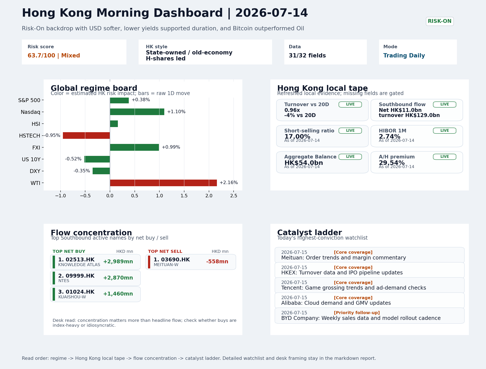
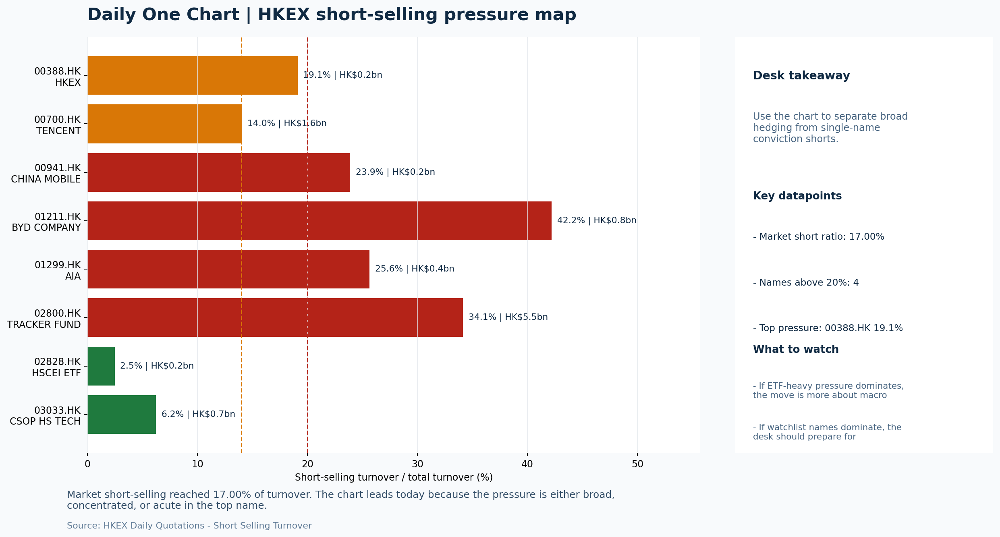

# Morning Research Workbench | 2026-07-15

> Designed for a Hong Kong sell-side commute: Layer 1 `Scan`, Layer 2 `Deep Read`, Layer 3 `Thinking`
> Mode: `Trading Daily` | Keep the report execution-oriented: what mattered in the completed session, what can move Hong Kong leadership, and what needs fast follow-up.
> Briefing date: `2026-07-15` | Review date: `2026-07-14` | Global request: `2026-07-14` | HK/China request: `2026-07-14` | Market effective date: `2026-07-14` | Generated at: `2026-07-15 05:56:30`

## Executive Summary

- **Market pulse:** Risk-On conditions with a softer dollar and lower yields created a constructive cross-asset backdrop on July 14, yet the Hong Kong session exposed an internal split.
- **Hong Kong lens:** State-owned / old-economy H-shares led. HSTECH's -0.95% vs FXI's +0.99% divergence is the first frame to test at the open; if HSTECH cannot recover alongside the Nasdaq futures lead, the Risk-On setup is incomplete.
- **Top catalysts:** INTC -6.33%; Risk-On backdrop with USD softer, lower yields supported duration, and Bitcoin outperformed Oil.

## Visual Dashboard

## Layer 1 | Scan (5-10 min)

### 1.1 One-Line Market Pulse
Risk-On conditions with a softer dollar and lower yields created a constructive cross-asset backdrop on July 14, yet the Hong Kong session exposed an internal split: FXI and HSCEI confirmed offshore China appetite while HSTECH fell 0.95% as Intel's guidance reset (score 108) pressured semiconductor supply-chain sentiment, leaving the setup conditional on whether local growth can absorb the shock at today's open.

### 1.2 Global Asset Price Dashboard

| Asset | Last | 1D move | Read |
| --- | --- | --- | --- |
| S&P 500 | 7,543.59 | +0.38% | US large-cap risk appetite |
| Nasdaq 100 | 29,586.29 | +1.10% | Growth and duration leadership |
| Hang Seng Index | 24,213.72 | +0.16% | Hong Kong broad beta |
| Hang Seng TECH | 4.5900 | -0.95% | Hong Kong growth / platform read-through |
| CSI 300 | 4,780.79 | **-1.96%** | Mainland large-cap tone |
| US 10Y | 4.5850 | -0.52% | Global discount-rate anchor |
| China 10Y | 1.74% | -0.4bp | China local rates anchor \| Live public \| Eastmoney \| 2026-07-14 |
| CN-US 10Y spread | -284.0bp | +3.6bp | Relative carry and macro-pressure gauge \| Live public \| Eastmoney \| 2026-07-14 |
| DXY | 100.93 | -0.35% | Dollar liquidity impulse |
| USD/CNH | 6.7460 | +0.00% | Offshore China risk appetite |
| USD/HKD | 7.8370 | -0.03% | Linked-exchange regime stress check |
| Brent crude | 85.34 | **+2.45%** | Energy / geopolitics |
| COMEX gold | 4,058.30 | **+1.53%** | Hedge demand / real yields |
| Copper | 6.3670 | **+2.15%** | Global growth proxy |
| VIX | 16.50 | **-3.85%** | US stress barometer |

### 1.3 Hong Kong Key Data Quick Check

| Check | Value | Status | Source / as of | Why it matters |
| --- | --- | --- | --- | --- |
| Main Board turnover vs 20D | 0.96x \| -4% vs 20D | Live local | HKEX \| 2026-07-14 | Trailing 20-session average turnover was HK$324.4bn. |
| Southbound / Northbound net flow | Southbound Net HK$11.0bn \| turnover HK$129.0bn \| Northbound Turnover HK$415.9bn \| net not reported | Live local | HKEX Connect \| 2026-07-14 | Southbound net buy is calculated from HKEX disclosed buy and sell turnover. |
| Short-selling ratio | 17.00% | Live local | HKEX \| 2026-07-14 | Official HKEX stock-level short-selling table, aggregated as a share of total market turnover. |
| AH premium index | 29.54% | Live public | Yahoo \| 2026-07-14 | Simple average across 17 A/H pairs; use dispersion rather than the average alone. |
| USD/HKD spot vs band | 7.8370 \| band 7.7500 to 7.8500 | Live quote + local | Yahoo \| 2026-07-14 | Inside the linked-exchange band without immediate boundary stress. Official Convertibility Undertakings define the linked-rate stress boundaries for USD/HKD. |
| HIBOR 1M | 2.74% | Live local | HKMA \| 2026-07-14 | 1M HIBOR is the cleanest quick read for Hong Kong funding conditions and equity-duration pressure. |
| Aggregate Balance | HK$54.0bn | Live local | HKMA \| 2026-07-14 | Aggregate Balance helps frame whether linked-rate liquidity conditions are tight or comfortable. |
| Hong Kong leadership | State-owned / old-economy H-shares led | Proxy | HSI / HSCEI / HSTECH relative perf \| 2026-07-14 | Use HSI / HSCEI / HSTECH relative moves as the opening style read. |

### 1.4 Risk Dashboard
**Composite risk score:** `63.7/100` | **Regime:** `Mixed`

| Component | Score impact | Evidence |
| --- | --- | --- |
| US beta | +2.3 | S&P 500 +0.38% |
| HK growth | -4.8 | HSTECH -0.95% |
| Offshore China proxy | +5.0 | FXI +0.99% |
| Dollar pressure | +3.5 | DXY -0.35% |
| Volatility | +7.7 | VIX -3.85% |
| HK short-selling | +0 | Short-selling ratio 17.00% |

### 1.5 Morning Checklist
1. **INTC -6.33%**
 Mover attribution | Announcement / expectations | Guidance reset and margin pressure
2. **Risk-On backdrop with USD softer, lower yields supported duration, and Bitcoin outperformed Oil**
 Overnight regime | Start by deciding whether the day is about Risk-On conditions or a style pivot.
3. **CPI MoM (Released)**
 Macro / policy | Rates expectations, the dollar, and growth-equity valuation | Industries: Technology, Internet, Brokers
4. **Trade Balance (Released)**
 Macro / policy | Watch whether it changes the day's core market narrative | Industries: Market-wide
5. **Retail Sales MoM (Upcoming)**
 Macro / policy | Consumer resilience, growth expectations, and risk-asset pricing | Industries: Consumer, E-commerce, Consumer discretionary

## Layer 2 | Deep Read (20-30 min)

### 2.1 Overnight Overseas Market Review
#### Market Setup
**Core tape.** Global markets closed Risk-On as USD softened and US yields declined, supporting duration-sensitive equities broadly, but the Hong Kong session exposed an important internal split.
**Main driver.** The Nasdaq's +1.10% rally reflects US mega-cap tech leadership rather than a rotation into HK growth proxies, leaving the durability of the Risk-On framing conditional on whether HSTECH can absorb the Intel shock or extends.

#### Key Drivers
- USD weakness (DXY -0.35%) and lower US 10Y yields (-0.52%) created a broad tailwind for duration and growth names globally.
- Intel's -6.33% guidance reset carried the highest single-name attribution score (108), mapping directly into HK-listed semiconductor.
- Offshore China proxy FXI (+0.99%) held firm, confirming cross-border risk appetite outside Hong Kong's local growth complex.
- Bitcoin (+3.81%) outperformed Oil (+2.16%) by 364bps, reinforcing the Risk-On read but also signaling speculative momentum that.

#### Hong Kong Read-Through
**Desk lens.** State-owned / old-economy H-shares led.
**Opening implication.** HSTECH's -0.95% vs FXI's +0.99% divergence is the first frame to test at the open.
- **Cross-market read:** Hang Seng +0.16% / HSCEI +0.33% / HSTECH -0.95%.
- **Cross-market read:** Offshore China proxy FXI +0.99% and USD/CNH +0.00% frame cross-border risk appetite.
- **Cross-market read:** USD/HKD last traded around 7.8370, which keeps the Hong Kong funding lens in focus.

#### Watch Points
- USD composite moved lower by -0.16pct intraday, with a 0.386pct range.
- Main turning points appeared around 2026-07-14 08:10 trough / 2026-07-14 08:25 trough / 2026-07-14 08:50 trough, suggesting event-driven repricing.
- The biggest cross-asset divergence was Bitcoin versus Oil, a spread of 3.564pct.
- Gold moved +0.87pct intraday with a 2.07pct high-low range.

**Curated overnight stories**
1. **Warsh pledges Fed policy 'regime change' to rid inflation 'tax' on American people**
 Why it matters: Kevin Warsh's testimony signals a potential Fed communication pivot. His framing of inflation as a 'tax' and talk of regime change suggests the board is considering a policy.
 HK read-through: Direct impact on USD direction and global risk appetite - USD softness overnight supported HK duration and growth equities.
2. **INTC -6.33% - Guidance reset and margin pressure**
 Why it matters: Intel registered the highest single-day mover attribution score (108) among overnight US names. The guidance reset reflects persistent competitive pressure in AI-era.
 HK read-through: Maps directly into HK-listed semiconductor and tech hardware names. If the HK tape shows similar earnings resets or supply chain concerns today, the humanoids/AI capex.
3. **CPI MoM released; A July rate hike from the Fed? The odds are rising**
 Why it matters: Released CPI data changes the baseline for rate expectations. Rising July hike odds overnight (per fed funds futures) reflect a less benign inflation trajectory than priced.
 HK read-through: High relevance for HK internet and growth equity valuation frameworks. Lower-than-expected inflation would have supported multiple expansion.
4. **'Listing is a must': Chinese humanoid startups are rushing to launch IPOs**
 Why it matters: LimX Dynamics and Unitree join a queue of Chinese humanoid robotics firms seeking capital market exits.
 HK read-through: Near-term catalyst for AI and robotics sentiment. Maps first into semiconductor and AI leaders with humanoid exposure, then broader China tech.
5. **Trade Balance released; Retail Sales MoM upcoming**
 Why it matters: Trade Balance data was released overnight and Retail Sales follows today. Trade data shapes the day's core macro narrative.
 HK read-through: HK export-linked names (logistics, manufacturers) and China trade-sensitive sectors watch Trade Balance.

### 2.2 Hong Kong / A-share Previous-Day Review
#### Local Tape Setup
**Local read.** Hong Kong's 14 July session exposed a growth vs value split: HSTECH declined 0.95% even as Nasdaq rose 1.10%, while HSCEI (+0.33%) and FXI (+0.99%) led on the back of a weaker USD and lower yields.
**Verification point.** Southbound net buying of HK$11.0bn provided support, but local ETF volume ratios pointed to outflows and short-selling at 17% of turnover left the growth recovery untested.
**Risk to watch.** USD/CNH was unchanged at 6.746, giving no immediate FX stress signal.

#### Style and Local Leadership
**Style leadership.** State-owned / old-economy H-shares led.
- **Cross-market read:** Hang Seng +0.16% / HSCEI +0.33% / HSTECH -0.95%.
- **Cross-market read:** Offshore China proxy FXI +0.99% and USD/CNH +0.00% frame cross-border risk appetite.
- **Cross-market read:** USD/HKD last traded around 7.8370, which keeps the Hong Kong funding lens in focus.

#### Flow Confirmation
Official Stock Connect evidence is available; use Section 2.3 to confirm whether local money supports the price action.

#### Follow-Through Checklist
**Follow-through check.** Watch whether HSTECH can open higher and narrow the gap versus Nasdaq futures.

### 2.3 Flow Tracker and Attribution
#### Cross-Asset Attribution v1

| Driver | Direction | Score | Evidence | HK implication |
| --- | --- | --- | --- | --- |
| Oil and geopolitics | mixed | 1.96 | Oil moved +2.45%. | Split the read between energy/cyclicals support and margin/geopolitical pressure. |
| US growth-style transmission | supportive | 1.54 | Nasdaq 100 moved +1.10%. | Hong Kong growth and platform names should be tested first at the open. |
| Rates impulse | supportive | 0.62 | US 10Y yield proxy moved -0.52%. | Lower yields help long-duration growth; higher yields pressure valuation-sensitive |
| Dollar / CNH pressure | supportive | 0.52 | DXY -0.35% / USD-CNH +0.00% | A stable or softer CNH makes Hong Kong follow-through more credible. |

#### Flow Tracker
##### Flow Takeaways
- Local flow evidence is not yet strong enough to override the cross-asset setup.
- Stock Connect Southbound: net HK$11.0bn on turnover HK$129.0bn (as of 2026-07-14).
- Stock Connect Northbound: turnover RMB415.9bn; public file provides total turnover/top active names, not full net-buy.
- AH premium: simple covered-pair average +29.54%; widest premium: China Life 56.41%.

##### Stock Connect Southbound Active Names

| Rank | Ticker | Name | Buy | Sell | Net buy |
| --- | --- | --- | --- | --- | --- |
| 2 | 02513.HK | KNOWLEDGE ATLAS | HK$5,679.3mn | HK$2,690.7mn | HK$2,988.6mn |
| 3 | 09999.HK | NTES | HK$2,901.6mn | HK$31.6mn | HK$2,870.0mn |
| 8 | 01024.HK | KUAISHOU-W | HK$1,636.9mn | HK$177.3mn | HK$1,459.7mn |
| 3 | 03986.HK | GIGADEVICE | HK$2,709.5mn | HK$1,899.4mn | HK$810.1mn |
| 5 | 06869.HK | YOFC | HK$2,936.7mn | HK$2,334.2mn | HK$602.5mn |

##### AH Premium Dispersion

| Name | A ticker | H ticker | Premium | As of |
| --- | --- | --- | --- | --- |
| China Life | 601628.SS | 2628.HK | +56.41% | 2026-07-14 |
| China Railway Construction | 601186.SS | 1186.HK | +51.56% | 2026-07-14 |
| China Railway | 601390.SS | 0390.HK | +48.10% | 2026-07-14 |
| China Communications Construction | 601800.SS | 1800.HK | +45.00% | 2026-07-14 |
| China Construction Bank | 601939.SS | 0939.HK | +41.90% | 2026-07-14 |

##### HKEX Short-Selling Watch

| Ticker | Name | Short ratio | Short turnover | Total turnover |
| --- | --- | --- | --- | --- |
| 00388.HK | HKEX | 19.10% | HK$0.2bn | HK$1.3bn |
| 00700.HK | TENCENT | 14.04% | HK$1.6bn | HK$11.6bn |
| 00941.HK | CHINA MOBILE | 23.88% | HK$0.2bn | HK$0.8bn |
| 01211.HK | BYD COMPANY | 42.20% | HK$0.8bn | HK$2.0bn |
| 01299.HK | AIA | 25.63% | HK$0.4bn | HK$1.7bn |

- **Short-value leaders:** 02800.HK TRACKER FUND (HK$5.5bn); 07709.HK XL2CSOPHYNIX (HK$4.0bn); 09988.HK BABA-W (HK$2.5bn); 01810.HK XIAOMI-W (HK$2.3bn).

### 2.4 Macro and Policy Tracking
**Desk read.** Yesterday's US CPI came in at 0.3% MoM, above the 0.2% consensus, yet the global session ended with a risk-on tilt: USD softer, yields lower, and Bitcoin outperforming oil.

**Market sensitivity.** For Hong Kong, the focus now shifts to tonight's US retail sales (forecast 0.3%) and Fed Chair Powell's economic remarks.

**HK implication.** A strong retail print or any hawkish nuance from Powell would challenge the duration trade, while a softer result or dovish tone could extend the rotation into Hong Kong tech and brokers that benefited from yesterday's tape.

**Macro watchpoints**
- US 10-year yield and DXY after the retail sales release and Powell speech.
- Whether Hong Kong technology and broker names can hold their opening tone if US rates back up.
- PBOC LPR fix (forecast unchanged at 3.45%) and daily OMO operation for any surprise liquidity signal.

| Time | Region | Event | Status | Desk read |
| --- | --- | --- | --- | --- |
| 20:30 | US | CPI MoM | Released | Impact: Rates expectations, the dollar, and growth-equity valuation \| Attention: 5/5 \| Industries: Technology, Internet, Brokers |
| 09:30 | China | Trade Balance | Released | Impact: Watch whether it changes the day's core market narrative \| Attention: 3/5 \| Industries: Market-wide |
| 20:30 | US | Retail Sales MoM | Upcoming | Impact: Consumer resilience, growth expectations, and risk-asset pricing \| Attention: 5/5 \| Industries: Consumer, E-commerce, Consumer discretionary |
| 09:20 | China | Loan Prime Rate | Upcoming | Impact: Watch whether it changes the day's core market narrative \| Attention: 3/5 \| Industries: Market-wide |
| 22:00 | Federal Reserve | Jerome Powell: Economic outlook remarks | Central bank | Impact: Policy path, liquidity conditions, and cross-asset risk appetite \| Attention: 5/5 \| Industries: Technology, Financials, Gold |
| 10:00 | PBOC | Open Market Operations Desk: Daily liquidity operation window | Central bank | Impact: Policy path, liquidity conditions, and cross-asset risk appetite \| Attention: 3/5 \| Industries: Technology, Financials, Gold |

#### Positioning and Risk Backdrop
- Options activity centered on KWEB Call, with Vol/OI at 1.88x and a bullish bias.
- Put/Call structure shows equity 0.68 / index 1.15, implying Single-stock optimism with index hedging.
- Geopolitics: Middle East | Regional tension remains elevated | Impact: Oil, freight costs, and safe-haven demand
- Geopolitics: US-China | Technology export-control rhetoric remains active | Impact: China internet, semiconductors, and supply chains

### 2.5 Key Company and Sector Events

| Grade | Sector | Headline | Why it matters | Horizon |
| --- | --- | --- | --- | --- |
| B | Semiconductors and AI | 'Listing is a must': Chinese humanoid startups are rushing to launch | This is more about order visibility and product-cycle validation | Short-term catalyst |

#### Company Event Takeaway
**Desk read.** Risk-on conditions with a softer USD and lower yields provided a constructive backdrop for HK equities on July 14.
**Why it matters.** The session was marked by a notable Morgan Stanley upgrade on Alibaba (9988.HK) to Overweight with a target raise to 105, which should offer a positive read-across to other China internet platforms.
**Follow-up.** Earnings flow is heavy: HKEX (0388.HK) reported before the open with estimates at EPS 2.81 HKD and revenue 6.0bn HKD.

#### LLM Quick Takes
- **9988.HK** | Morgan Stanley upgrade from Equal Weight to Overweight with target raised to 92->105. Material positive for China internet sentiment
- **0700.HK** | Reports after market close; EPS est. 4.15 HKD, revenue est. 163.2bn HKD. As the largest HK-listed internet name, any beat or miss will drive sector and index moves
- **0388.HK** | Reported before open; EPS est. 2.81 HKD, revenue est. 6.0bn HKD. Direct proxy for HK turnover and southbound flow; results set the tone for exchange-sector sentiment.
- **00753.HK** | Profit warning on July 14. Airline sector showing stress; confirms margin pressure from fuel costs and demand softness.
- **00670.HK** | Profit warning on July 14. Same airline sector read-through as AIR CHINA; both codes at bottom of range historically.
- **00323.HK** | Profit warning on July 14. Steel sector weakness; watch for read-across to other H-share materials names.

#### HKEX Announcements

| Grade | Ticker | Type | Release time | Title |
| --- | --- | --- | --- | --- |
| A | 00187.HK | Profit warning | 2026-07-14 | Profit warning / alert announcement |
| A | 00323.HK | Profit warning | 2026-07-14 | Profit warning / alert announcement |
| A | 00338.HK | Profit warning | 2026-07-14 | Profit warning / alert announcement |
| A | 00588.HK | Profit warning | 2026-07-14 | Profit warning / alert announcement |
| A | 00670.HK | Profit warning | 2026-07-14 | Profit warning / alert announcement |
| A | 00753.HK | Profit warning | 2026-07-14 | Profit warning / alert announcement |
| A | 00771.HK | Profit warning | 2026-07-14 | Profit warning / alert announcement |
| A | 00895.HK | Profit warning | 2026-07-14 | Profit warning / alert announcement |

#### Earnings / Results Watch

| Ticker | Company | Timing | Expectation framing |
| --- | --- | --- | --- |
| 0700.HK | Tencent Holdings | After Market Close | EPS est. 4.15 HKD \| revenue est. 163.2bn HKD |
| 0388.HK | Hong Kong Exchanges and Clearing | Before Market Open | EPS est. 2.81 HKD \| revenue est. 6.0bn HKD |

#### Rating Changes
- **9988.HK** | Morgan Stanley | Upgrade | Equal Weight -> Overweight | PT 92 -> 105

#### IPO Watch
- IPO and grey-market monitoring is not yet part of the standard production pack.

### 2.6 Today's Core Names
#### Core coverage

| Name | Ticker | Last | 1D | Range position | Morning note |
| --- | --- | --- | --- | --- | --- |
| Meituan | 3690.HK | 79.20 | +1.60% | Mid-range | Positioning is neutral for now, so use it mainly to monitor marginal information changes. |
| HKEX | 0388.HK | 389.00 | +0.36% | Mid-range | Positioning is neutral for now, so use it mainly to monitor marginal information changes. |

**Recent headlines for Meituan:**
- [Is Meituan (SEHK:3690) Pricey On Board Changes And A Rebound In Its Share Price?](https://finance.yahoo.com/markets/stocks/articles/meituan-sehk-3690-pricey-board-043242859.html) (Simply Wall St.)

#### Priority follow-up

| Name | Ticker | Last | 1D | Range position | Morning note |
| --- | --- | --- | --- | --- | --- |
| BYD Company | 1211.HK | 86.15 | +2.62% | Mid-range | Short-term price strength is clear; fresh catalysts could trigger broader group follow-through. |
| AIA | 1299.HK | 74.10 | +2.35% | Bottom of range | Short-term price strength is clear; fresh catalysts could trigger broader group follow-through. |

## Layer 3 | Thinking (10-15 min)

### 3.1 Rotating Theme Deep Dive

| Field | Read |
| --- | --- |
| Theme | Innovative Biotech and Out-Licensing |
| Angle for the day | Watch whether clinical data, approvals, and licensing momentum are still supporting the innovative-healthcare rerating story. |

**Theme desk read**
**Core thesis.** The rotating weekly theme shifts to Innovative Biotech and Out-Licensing, asking whether clinical data, approvals, and licensing momentum still support the innovative-healthcare rerating story.
**Evidence.** The overnight risk-on backdrop - lower VIX, softer USD, and strength in crypto - provides a constructive macro canvas for growth-biased sectors.
**What to test.** Yet today's core coverage list features Meituan and BYD rather than direct biotech proxies, which constrains immediate theme tradability.

**Signals to keep in mind**
- VIX -3.85%: Lower volatility signals easing stress in the tape.
- Bitcoin +3.81%: A strong crypto tape reinforces the risk-on read.

**LLM watch items:**
- Any out-licensing or clinical trial announcements from Hong Kong-listed biotech names that would concretely test the rerating theme.
- Meituan's order and margin updates as a near-term signal on local services demand and broader risk sentiment.
- BYD's weekly sales data and new model cadence to gauge EV momentum and potential rotation effects on growth positioning.

**Related names to keep close:**

| Name | Ticker | Bucket | Morning read |
| --- | --- | --- | --- |
| Meituan | 3690.HK | Core coverage | Positioning is neutral for now, so use it mainly to monitor marginal information changes. |
| BYD Company | 1211.HK | Priority follow-up | Short-term price strength is clear; fresh catalysts could trigger broader group follow-through. |

### 3.2 Today Ahead and Trading Calendar
- Macro: CPI MoM is the first item to anchor the open and the rates/FX response.
- Corporate / event: Meituan: Order trends and margin commentary is the cleanest same-day catalyst to prepare for.

**Same-day macro docket**

| Time | Country | Event | Status | Detail |
| --- | --- | --- | --- | --- |
| 20:30 | US | CPI MoM | Released | Actual 0.3% / Forecast 0.2% / Prior 0.4% |
| 09:30 | China | Trade Balance | Released | Actual USD 85.2bn / Forecast USD 79.0bn / Prior USD 80.6bn |
| 20:30 | US | Retail Sales MoM | Upcoming | Forecast 0.3% / Prior 0.6% |
| 09:20 | China | Loan Prime Rate | Upcoming | Forecast 3.45% / Prior 3.45% |
| 22:00 | Federal Reserve | Jerome Powell: Economic outlook remarks | Central bank | speech |

**Same-day catalyst list**

| Date | Time | Category | Event | Importance |
| --- | --- | --- | --- | --- |
| 2026-07-15 | | Core coverage | Meituan: Order trends and margin commentary | 3 |
| 2026-07-15 | | Core coverage | HKEX: Turnover data and IPO pipeline updates | 3 |
| 2026-07-15 | | Core coverage | Tencent: Game grossing trends and ad-demand checks | 3 |
| 2026-07-15 | | Core coverage | Alibaba: Cloud demand and GMV updates | 3 |

**Next few sessions**

| Date | Category | Event | Impact |
| --- | --- | --- | --- |
| 2026-07-15 | Core coverage | Meituan: Order trends and margin commentary | High-frequency read on local services demand and platform competition |
| 2026-07-15 | Core coverage | HKEX: Turnover data and IPO pipeline updates | Direct proxy for Hong Kong market turnover, listings, and southbound |
| 2026-07-15 | Core coverage | Tencent: Game grossing trends and ad-demand checks | Core offshore China platform proxy for gaming, ads, and AI monetization |
| 2026-07-15 | Core coverage | Alibaba: Cloud demand and GMV updates | Key read-through for China consumption, cloud, and platform regulation |

### 3.3 Daily One Chart
**Daily One Chart | HKEX short-selling pressure map**

**Chart read.** Market short-selling reached 17.00% of turnover.
**Why it matters.** The chart leads today because the pressure is either broad, concentrated, or acute in the top name.

_Source: HKEX Daily Quotations - Short Selling Turnover_

## Traceable Appendix

### Report Metadata
> Date policy: Review date 2026-07-14 is treated as `Trading Daily`. | Global request date is 2026-07-14; adapter effective date is 2026-07-14 and summary date is 2026-07-14. | HK/China local data date is 2026-07-14; role: same-session local cash tape.
> Market data quality: Coverage: `31/32` | Stale items (>1d): `1` | Missing: `1`
> Report quality: `87.1/100` | Grade `B` | Status `production ready`

### Key Questions to Keep in Mind
- Is risk appetite rising or fading? The overnight tape reads closer to `Risk-On`.
- Did rates expectations move? Focus on whether US 10Y, DXY, and growth style moved together.
- Were commodities the real story? Watch WTI and gold for geopolitics versus inflation signals.
- Is Hong Kong setup internet-led, SOE-led, or broad beta-led? Compare HSTECH, HSCEI, and HSI.
- Did offshore markets move China risk appetite? Focus on HSI, FXI, USD/CNH, and USD/HKD.

### Report Quality and Validation
- **Quality score:** 87.1/100 | **Grade:** B | **Status:** production ready
- **Run summary:** 8 healthy | 0 caveat | 0 failed
- **Release recommendation:** Send | All monitored sources were healthy, so the report is fit for normal distribution.

| Source | Status | Bucket |
| --- | --- | --- |
| Market data | ok | healthy |
| Sector and company news | ok | healthy |
| Movers and short selling | ok | healthy |
| Stock Connect | ok | healthy |
| A/H premium | ok | healthy |
| Hong Kong local package | ok | healthy |
| China rates | ok | healthy |
| Narrative overlay | ok | healthy |

**Desk-use guidance summary:** 0 blocking | 1 advisory

**Desk-use guidance**
- **Advisory:** All monitored sources were healthy for this run; the report can be used as a normal desk-starting point.

| Component | Score | Weight | Read |
| --- | --- | --- | --- |
| Market data coverage | 96.9 | 0.3 | 31/32 core market fields available. |
| Hong Kong local metrics | 82.3 | 0.25 | 8 live, 3 proxy, 0 unavailable local checks. |
| Key public adapters | 100.0 | 0.2 | 4/4 key adapters were available or partially available. |
| Narrative overlay health | 65.7 | 0.15 | 3/7 narrative overlay tasks succeeded or used validated cache; 0 error(s). |
| Fact-check guardrail | 75.0 | 0.1 | Checked 6 numeric claims; 1 numeric mismatch(es), 0 logic warning(s); 1 critical, 0 review. |

**Quality warnings**
- Narrative fact-check guardrail produced warnings; review the validation table before relying on narrative sections.

**Narrative fact-check guardrail**
- Checked 6 numeric claims; 1 numeric mismatch(es), 0 logic warning(s); 1 critical, 0 review.

| Severity | Field | Claim | Type | Claimed | Expected | Snippet |
| --- | --- | --- | --- | --- | --- | --- |
| critical | tasks.final_framing.one_line_market_pulse | Hang Seng TECH | change_pct | 0.95 | -0.95 | and HSCEI confirmed offshore China appetite while HSTECH fell 0.95% as Intel's guidance reset (score 108) pressured s |

**Adapter status**

| Adapter | Status |
| --- | --- |
| Stock Connect | ok |
| A/H premium | ok |
| HKEX announcements | ok |
| China rates | ok |

### Source Links
- ['Listing is a must': Chinese humanoid startups are rushing to launch IPOs](https://www.cnbc.com/2026/07/13/chinese-humanoid-startups-ipo-limx-unitree.html) (cnbc_markets)
- [Is Meituan (SEHK:3690) Pricey On Board Changes And A Rebound In Its Share Price?](https://finance.yahoo.com/markets/stocks/articles/meituan-sehk-3690-pricey-board-043242859.html) (Simply Wall St.)
- [Meituan (SEHK:3690) Stock Stays Cheap Following Its 73% Five Year Fall](https://finance.yahoo.com/markets/stocks/articles/meituan-sehk-3690-stock-stays-001907221.html) (Simply Wall St.)
- [China Mobile (SEHK:941): A Closer Look at Valuation After Steady Share Price Gains This Year](https://finance.yahoo.com/news/china-mobile-sehk-941-closer-154022664.html) (Simply Wall St.)
- [00187.HK Profit warning / alert announcement](http://www1.hkexnews.hk/listedco/listconews/sehk/2026/0714/2026071400481.pdf) (HKEXnews)
- [00323.HK Profit warning / alert announcement](http://www1.hkexnews.hk/listedco/listconews/sehk/2026/0714/2026071401004.pdf) (HKEXnews)
- [00338.HK Profit warning / alert announcement](http://www1.hkexnews.hk/listedco/listconews/sehk/2026/0714/2026071400940.pdf) (HKEXnews)
- [00588.HK Profit warning / alert announcement](http://www1.hkexnews.hk/listedco/listconews/sehk/2026/0714/2026071400976.pdf) (HKEXnews)
- [00670.HK Profit warning / alert announcement](http://www1.hkexnews.hk/listedco/listconews/sehk/2026/0714/2026071401124.pdf) (HKEXnews)
- [00753.HK Profit warning / alert announcement](http://www1.hkexnews.hk/listedco/listconews/sehk/2026/0714/2026071401316.pdf) (HKEXnews)
- [00771.HK Profit warning / alert announcement](http://www1.hkexnews.hk/listedco/listconews/sehk/2026/0714/2026071400323.pdf) (HKEXnews)
- [00895.HK Profit warning / alert announcement](http://www1.hkexnews.hk/listedco/listconews/sehk/2026/0714/2026071400880.pdf) (HKEXnews)

## Supplementary Visual Appendix

This appendix is professional-path only. It keeps a traceable index of the report visuals and the deterministic chart cues used to frame the morning note, without injecting the legacy intraday chart pack.

### Visual Index

| Visual | Path | Role |
| --- | --- | --- |
| Visual Dashboard | `charts/dashboard_2026-07-15.png` | Cross-asset regime board and Hong Kong local tape snapshot. |
| Daily One Chart | `charts/daily_one_chart_2026-07-15.png` | Single highest-conviction visual story for the day. |

### Deterministic Chart Cues
- FX / liquidity: USD composite moved lower by -0.16pct intraday, with a 0.386pct range.
- FX / liquidity: Main turning points appeared around 2026-07-14 08:10 trough / 2026-07-14 08:25 trough / 2026-07-14 08:50 trough, suggesting event-driven repricing rather than a clean one-way USD move.
- Cross-asset: The biggest cross-asset divergence was Bitcoin versus Oil, a spread of 3.564pct.
- Cross-asset: Gold moved +0.87pct intraday with a 2.07pct high-low range.
- Cross-asset: Oil moved +0.25pct intraday with a 3.818pct high-low range.
- Cross-asset: Bitcoin moved +3.81pct intraday with a 4.181pct high-low range.

### Risk Dashboard Components

| Component | Score impact | Evidence |
| --- | --- | --- |
| US beta | +2.3 | S&P 500 +0.38% |
| HK growth | -4.8 | HSTECH -0.95% |
| Offshore China proxy | +5.0 | FXI +0.99% |
| Dollar pressure | +3.5 | DXY -0.35% |
| Volatility | +7.7 | VIX -3.85% |
| HK short-selling | +0 | Short-selling ratio 17.00% |
