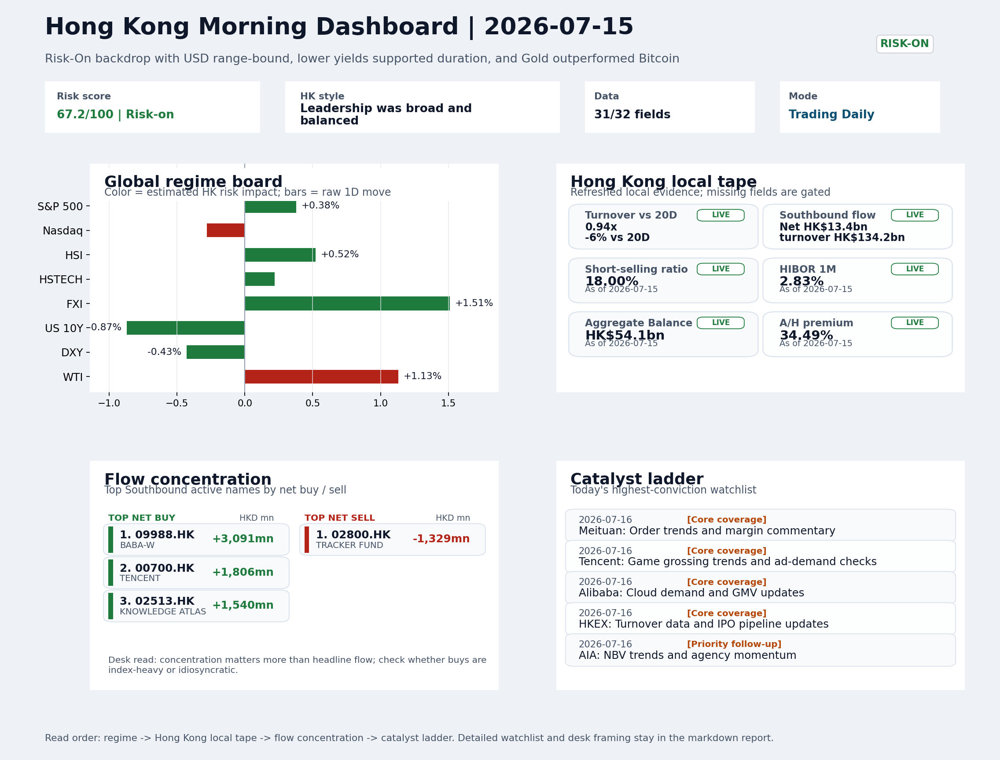
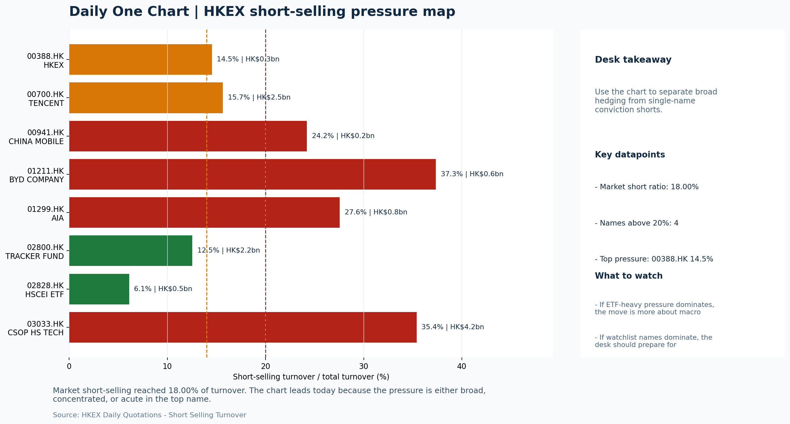

# Morning Research Workbench | 2026-07-16

> Designed for a Hong Kong sell-side commute: Layer 1 `Scan`, Layer 2 `Deep Read`, Layer 3 `Thinking`
> Mode: `Trading Daily` | Keep the report execution-oriented: what mattered in the completed session, what can move Hong Kong leadership, and what needs fast follow-up.
> Briefing date: `2026-07-16` | Review date: `2026-07-15` | Global request: `2026-07-15` | HK/China request: `2026-07-15` | Market effective date: `2026-07-15` | Generated at: `2026-07-16 05:58:28`

## Executive Summary

- **Market pulse:** A Risk-On overnight backdrop with softer yields and a declining dollar supports Hong Kong, but the FXI-led offshore China proxy leadership, elevated 18% short-selling ratio.
- **Hong Kong lens:** Hong Kong growth / internet led. A constructive Hong Kong open is supported by overnight risk-on signals and FXI's 1.51% gain, but the elevated short-selling ratio (18%) and Intel-induced tech drag call.
- **Top catalysts:** INTC -6.33%; Risk-On backdrop with USD range-bound, lower yields supported duration, and Gold outperformed Bitcoin.

## Visual Dashboard

## Layer 1 | Scan (5-10 min)

### 1.1 One-Line Market Pulse
A Risk-On overnight backdrop with softer yields and a declining dollar supports Hong Kong, but the FXI-led offshore China proxy leadership, elevated 18% short-selling ratio, and below-average turnover call for HSTECH confirmation before treating today's session as a fully confirmed growth rotation.

### 1.2 Global Asset Price Dashboard

| Asset | Last | 1D move | Read |
| --- | --- | --- | --- |
| S&P 500 | 7,572.40 | +0.38% | US large-cap risk appetite |
| Nasdaq 100 | 29,502.60 | -0.28% | Growth and duration leadership |
| Hang Seng Index | 24,340.73 | +0.52% | Hong Kong broad beta |
| Hang Seng TECH | 4.6000 | +0.22% | Hong Kong growth / platform read-through |
| CSI 300 | 4,780.79 | **-1.96%** | Mainland large-cap tone |
| US 10Y | 4.5450 | -0.87% | Global discount-rate anchor |
| China 10Y | 1.74% | +0.0bp | China local rates anchor \| Live public \| Eastmoney \| 2026-07-15 |
| CN-US 10Y spread | -280.9bp | +3.0bp | Relative carry and macro-pressure gauge \| Live public \| Eastmoney \| 2026-07-15 |
| DXY | 100.50 | -0.43% | Dollar liquidity impulse |
| USD/CNH | 6.7405 | +0.00% | Offshore China risk appetite |
| USD/HKD | 7.8380 | +0.01% | Linked-exchange regime stress check |
| Brent crude | 85.63 | +1.06% | Energy / geopolitics |
| COMEX gold | 4,066.90 | +0.14% | Hedge demand / real yields |
| Copper | 6.3830 | +0.84% | Global growth proxy |
| VIX | 15.67 | **-5.03%** | US stress barometer |

### 1.3 Hong Kong Key Data Quick Check

| Check | Value | Status | Source / as of | Why it matters |
| --- | --- | --- | --- | --- |
| Main Board turnover vs 20D | 0.94x \| -6% vs 20D | Live local | HKEX \| 2026-07-15 | Trailing 20-session average turnover was HK$324.2bn. |
| Southbound / Northbound net flow | Southbound Net HK$13.4bn \| turnover HK$134.2bn \| Northbound Turnover HK$361.5bn \| net not reported | Live local | HKEX Connect \| 2026-07-15 | Southbound net buy is calculated from HKEX disclosed buy and sell turnover. |
| Short-selling ratio | 18.00% | Live local | HKEX \| 2026-07-15 | Official HKEX stock-level short-selling table, aggregated as a share of total market turnover. |
| AH premium index | 34.49% | Live public | Yahoo \| 2026-07-15 | Simple average across 16 A/H pairs; use dispersion rather than the average alone. |
| USD/HKD spot vs band | 7.8380 \| band 7.7500 to 7.8500 | Live quote + local | Yahoo \| 2026-07-15 | Inside the linked-exchange band without immediate boundary stress. Official Convertibility Undertakings define the linked-rate stress boundaries for USD/HKD. |
| HIBOR 1M | 2.83% | Live local | HKMA \| 2026-07-15 | 1M HIBOR is the cleanest quick read for Hong Kong funding conditions and equity-duration pressure. |
| Aggregate Balance | HK$54.1bn | Live local | HKMA \| 2026-07-15 | Aggregate Balance helps frame whether linked-rate liquidity conditions are tight or comfortable. |
| Hong Kong leadership | Hong Kong growth / internet led | Proxy | HSI / HSCEI / HSTECH relative perf \| 2026-07-15 | Use HSI / HSCEI / HSTECH relative moves as the opening style read. |

### 1.4 Risk Dashboard
**Composite risk score:** `67.2/100` | **Regime:** `Risk-on`

| Component | Score impact | Evidence |
| --- | --- | --- |
| US beta | +2.3 | S&P 500 +0.38% |
| HK growth | +1.1 | HSTECH +0.22% |
| Offshore China proxy | +7.5 | FXI +1.51% |
| Dollar pressure | +4.3 | DXY -0.43% |
| Volatility | +10 | VIX -5.03% |
| HK short-selling | -8 | Short-selling ratio 18.00% |

### 1.5 Morning Checklist
1. **INTC -6.33%**
 Mover attribution | Announcement / expectations | Guidance reset and margin pressure
2. **Risk-On backdrop with USD range-bound, lower yields supported duration, and Gold outperformed Bitcoin**
 Overnight regime | Start by deciding whether the day is about Risk-On conditions or a style pivot.
3. **CPI MoM (Released)**
 Macro / policy | Rates expectations, the dollar, and growth-equity valuation | Industries: Technology, Internet, Brokers
4. **VIX -5.03%**
 High-frequency data | Lower volatility signals easing stress in the tape.
5. **Trade Balance (Released)**
 Macro / policy | Watch whether it changes the day's core market narrative | Industries: Market-wide

## Layer 2 | Deep Read (20-30 min)

### 2.1 Overnight Overseas Market Review
#### Market Setup
**Core tape.** Overnight US equities closed mixed as softer CPI data and dovish Fed speak reinforced rate-cut expectations, supporting the S&P 500, while Intel's guidance reset dragged the Nasdaq lower.
**Main driver.** Lower Treasury yields and a weaker dollar underpinned the broader risk-on tone, and the VIX compression confirmed easing stress.
**HK relevance.** Gold's outperformance over Bitcoin amid the risk appetite added a defensive hedging layer.

#### Key Drivers
- US 10Y yield declined 0.87% after CPI and Fed officials signaled inflation has peaked, aiding duration-sensitive sectors.
- DXY fell 0.43% to 100.50, easing global liquidity conditions and providing a tailwind for EM and risk assets.
- VIX dropped 5.03% to 15.67, confirming the risk-on regime and compressing volatility.
- Intel's -6.33% guidance reset weighed on semiconductor sentiment, causing the Nasdaq to underperform the S&P 500.

#### Hong Kong Read-Through
**Desk lens.** Leadership was broad and balanced.
**Opening implication.** A constructive Hong Kong open is supported by overnight risk-on signals and FXI's 1.51% gain.
- **Cross-market read:** Hang Seng +0.52% / HSCEI +0.46% / HSTECH +0.22%.
- **Cross-market read:** Offshore China proxy FXI +1.51% and USD/CNH +0.00% frame cross-border risk appetite.
- **Cross-market read:** USD/HKD last traded around 7.8380, which keeps the Hong Kong funding lens in focus.

#### Watch Points
- USD composite moved lower by -0.12pct intraday, with a 0.348pct range.
- Main turning points appeared around 2026-07-15 08:10 peak / 2026-07-15 08:25 trough / 2026-07-15 08:40 peak, suggesting event-driven repricing.
- The biggest cross-asset divergence was Gold versus Bitcoin, a spread of 0.987pct.
- Gold moved +0.73pct intraday with a 1.424pct high-low range.

**Curated overnight stories**
1. **INTC -6.33% on guidance reset and margin pressure**
 Why it matters: Intel cut full-year guidance citing competitive pressures in data center and AI chip markets. The miss raises questions about the cadence of enterprise upgrade cycles.
 HK read-through: Direct read-through to SMIC and other HK-listed semis names; could weigh on Hang Seng Tech sentiment if investors reprice sector earnings.
2. **CPI MoM data released; NY Fed President Williams says inflation has peaked**
 Why it matters: US inflation data and Williams' explicit comment that 'inflation has peaked' strengthen market expectations for Fed rate cuts.
 HK read-through: Positive for HK growth and internet sectors; a more accommodative Fed reduces pressure on USD and EM liquidity.
3. **VIX -5.03%; Risk-On regime confirmed with range-bound USD**
 Why it matters: Volatility compressed meaningfully, confirming the Risk-On backdrop noted in the previous session.
 HK read-through: Broadly supportive for HK cash equities and risk sentiment. Encourages momentum buyers in growth and tech names.
4. **Fed Chairman Kevin Warsh testimony to Senate banking committee**
 Why it matters: Warsh's comments on the economy and interest rates carry significant weight given his Fed leadership position.
 HK read-through: Any hawkish tilt could reverse the overnight rate-cut optimism and pressure HK tech and growth sentiment.
5. **Chinese humanoid startups accelerating IPO timelines**
 Why it matters: LimX Dynamics joins a growing list of Chinese humanoid robotics firms seeking capital market exits.
 HK read-through: Reinforces thematic interest in HK-listed AI and advanced manufacturing names. Could sustain sector momentum if follow-on news on orders or partnerships emerges.

### 2.2 Hong Kong / A-share Previous-Day Review
#### Local Tape Setup
**Local read.** Hong Kong closed higher on a Risk-On overnight setup, but style leadership tells a mixed story.
**Verification point.** FXI (+1.51%) significantly outperformed HSTECH (+0.22%), suggesting offshore China sentiment (likely infrastructure and SOE proxies) rather than domestic growth drove the session.
**Risk to watch.** Southbound flows were strong at HK$13.4bn net, concentrated in BABA-W, Tencent and Meituan, but this reflects demand for HK-listed tech rather than a broad A-share rotation.

#### Style and Local Leadership
**Style leadership.** Hong Kong growth / internet led.
- **Cross-market read:** Hang Seng +0.52% / HSCEI +0.46% / HSTECH +0.22%.
- **Cross-market read:** Offshore China proxy FXI +1.51% and USD/CNH +0.00% frame cross-border risk appetite.
- **Cross-market read:** USD/HKD last traded around 7.8380, which keeps the Hong Kong funding lens in focus.

#### Flow Confirmation
Official Stock Connect evidence is available; use Section 2.3 to confirm whether local money supports the price action.

#### Follow-Through Checklist
**Follow-through check.** Watch HSTECH vs HSCEI performance differential on 2026-07-16. If HSTECH/HSCEI ratio improves while turnover exceeds the 20-day HK$324.2bn average, the Risk-On read-through is more credible.

### 2.3 Flow Tracker and Attribution
#### Cross-Asset Attribution v1

| Driver | Direction | Score | Evidence | HK implication |
| --- | --- | --- | --- | --- |
| Short-selling pressure | drag | 2.1 | HKEX short-selling ratio was 18.00%. | Elevated short activity argues for extra confirmation before chasing rebounds. |
| Rates impulse | supportive | 1.04 | US 10Y yield proxy moved -0.87%. | Lower yields help long-duration growth; higher yields pressure valuation-sensitive |
| Dollar / CNH pressure | supportive | 0.65 | DXY -0.43% / USD-CNH +0.00% | A stable or softer CNH makes Hong Kong follow-through more credible. |

#### Flow Tracker
##### Flow Takeaways
- Short-selling pressure is elevated, so local rebounds need cleaner breadth and flow confirmation.
- Stock Connect Southbound: net HK$13.4bn on turnover HK$134.2bn (as of 2026-07-15).
- Stock Connect Northbound: turnover RMB361.5bn; public file provides total turnover/top active names, not full net-buy.
- AH premium: simple covered-pair average +34.49%; widest premium: China Communications Construction 85.9%.

##### Stock Connect Southbound Active Names

| Rank | Ticker | Name | Buy | Sell | Net buy |
| --- | --- | --- | --- | --- | --- |
| 2 | 09988.HK | BABA-W | HK$4,807.1mn | HK$1,716.4mn | HK$3,090.7mn |
| 1 | 00700.HK | TENCENT | HK$5,321.2mn | HK$3,515.3mn | HK$1,805.9mn |
| 2 | 02513.HK | KNOWLEDGE ATLAS | HK$4,981.5mn | HK$3,442.0mn | HK$1,539.5mn |
| 7 | 02800.HK | TRACKER FUND | HK$7.1mn | HK$1,335.6mn | HK$-1,328.6mn |
| 5 | 03690.HK | MEITUAN-W | HK$3,009.4mn | HK$1,723.3mn | HK$1,286.1mn |

##### AH Premium Dispersion

| Name | A ticker | H ticker | Premium | As of |
| --- | --- | --- | --- | --- |
| China Communications Construction | 601800.SS | 1800.HK | +85.90% | 2026-07-15 |
| China Life | 601628.SS | 2628.HK | +67.01% | 2026-07-15 |
| China Railway Construction | 601186.SS | 1186.HK | +49.55% | 2026-07-15 |
| China Railway | 601390.SS | 0390.HK | +48.79% | 2026-07-15 |
| China Construction Bank | 601939.SS | 0939.HK | +41.60% | 2026-07-15 |

##### HKEX Short-Selling Watch

| Ticker | Name | Short ratio | Short turnover | Total turnover |
| --- | --- | --- | --- | --- |
| 00388.HK | HKEX | 14.54% | HK$0.3bn | HK$2.0bn |
| 00700.HK | TENCENT | 15.66% | HK$2.5bn | HK$15.9bn |
| 00941.HK | CHINA MOBILE | 24.22% | HK$0.2bn | HK$0.7bn |
| 01211.HK | BYD COMPANY | 37.34% | HK$0.6bn | HK$1.6bn |
| 01299.HK | AIA | 27.55% | HK$0.8bn | HK$2.9bn |

- **Short-value leaders:** 03033.HK CSOP HS TECH (HK$4.2bn); 09988.HK BABA-W (HK$3.8bn); 00700.HK TENCENT (HK$2.5bn); 02800.HK TRACKER FUND (HK$2.2bn).

### 2.4 Macro and Policy Tracking
**Desk read.** The session is already shaped by a hotter-than-expected US CPI print (0.3% MoM vs 0.2% forecast), which challenges the lower-yields, Risk-On backdrop.

**Market sensitivity.** The handover to tonight's US retail sales and Fed Chair Powell's speech will decide whether rates and the dollar extend further, potentially reversing the opening tone in Hong Kong.

**HK implication.** China's stronger trade surplus provides a local offset, while the Loan Prime Rate decision is expected to be a non-event but warrants a check for any dovish surprise.

**Macro watchpoints**
- US 10Y yield and DXY reaction after the CPI and into the retail sales release.
- Powell's language on the policy path - any shift in tone after the inflation surprise.
- Whether Hong Kong growth proxies (tech, internet, brokers) hold gains or pivot lower.
- China LPR fix - deviation from the flat 3.45% forecast would quickly reprice onshore financials and property.

| Time | Region | Event | Status | Desk read |
| --- | --- | --- | --- | --- |
| 20:30 | US | CPI MoM | Released | Impact: Rates expectations, the dollar, and growth-equity valuation \| Attention: 5/5 \| Industries: Technology, Internet, Brokers |
| 09:30 | China | Trade Balance | Released | Impact: Watch whether it changes the day's core market narrative \| Attention: 3/5 \| Industries: Market-wide |
| 20:30 | US | Retail Sales MoM | Upcoming | Impact: Consumer resilience, growth expectations, and risk-asset pricing \| Attention: 5/5 \| Industries: Consumer, E-commerce, Consumer discretionary |
| 09:20 | China | Loan Prime Rate | Upcoming | Impact: Watch whether it changes the day's core market narrative \| Attention: 3/5 \| Industries: Market-wide |
| 22:00 | Federal Reserve | Jerome Powell: Economic outlook remarks | Central bank | Impact: Policy path, liquidity conditions, and cross-asset risk appetite \| Attention: 5/5 \| Industries: Technology, Financials, Gold |
| 10:00 | PBOC | Open Market Operations Desk: Daily liquidity operation window | Central bank | Impact: Policy path, liquidity conditions, and cross-asset risk appetite \| Attention: 3/5 \| Industries: Technology, Financials, Gold |

#### Positioning and Risk Backdrop
- Options activity centered on KWEB Call, with Vol/OI at 1.88x and a bullish bias.
- Put/Call structure shows equity 0.68 / index 1.15, implying Single-stock optimism with index hedging.
- Geopolitics: Middle East | Regional tension remains elevated | Impact: Oil, freight costs, and safe-haven demand
- Geopolitics: US-China | Technology export-control rhetoric remains active | Impact: China internet, semiconductors, and supply chains

### 2.5 Key Company and Sector Events

| Grade | Sector | Headline | Why it matters | Horizon |
| --- | --- | --- | --- | --- |
| B | Semiconductors and AI | 'Listing is a must': Chinese humanoid startups are rushing to launch | This is more about order visibility and product-cycle validation | Short-term catalyst |

#### Company Event Takeaway
**Desk read.** Risk-on session on July 15 showed broad-based strength in Hong Kong internet names, with Meituan (+5.3%) outperforming at the top of its 52-week range and Tencent (+3.9%) performing solidly ahead of after-market.
**Why it matters.** Morgan Stanley's upgrade of Alibaba (9988.HK) to Overweight with a target raised from 92 to 105 adds a constructive near-term catalyst for the internet group.
**Follow-up.** A wave of eight grade-A profit warnings from Hong Kong-listed companies (Cinda Intl, Zhongtai Futures, Dekon Agr, Marketingforce, Goldpac, Shuangdeng, Blue Moon Group, Jingcheng Mac) reflects ongoing earnings pressure.

#### LLM Quick Takes
- **3690.HK** | Up 5.3% and at top of 52-week range (82%), outperforming peers. Short-term momentum is clear; board changes and recent rebound momentum noted, but YTD decline of ~25%
- **0700.HK** | Up 3.9% to mid-range (59.4%), supported ahead of after-market earnings. Consensus estimates at EPS 4.15 HKD and revenue 163.2bn HKD.
- **9988.HK** | Morgan Stanley upgrade from Equal Weight to Overweight with target raised to 105 from 92. Material positive catalyst for internet sector sentiment and potential
- **0388.HK** | Results due before market open tomorrow. EPS estimate 2.81 HKD, revenue estimate 6.0bn HKD. Stock performance not listed but HKEX results will serve as barometer for
- **1299.HK** | Up 2.83% to mid-range (34.2%). Insurance sector showing modest strength. NBV trends and agency momentum remain key catalysts for tracking wealth demand and mainland
- **1211.HK** | Up 0.93% to mid-range (37.7%), lagging broader internet strength. Auto sector positioning neutral

#### HKEX Announcements

| Grade | Ticker | Type | Release time | Title |
| --- | --- | --- | --- | --- |
| A | 00111.HK | Profit warning | 2026-07-15 | Profit warning / alert announcement |
| A | 01461.HK | Profit warning | 2026-07-15 | Profit warning / alert announcement |
| A | 02419.HK | Profit warning | 2026-07-15 | Profit warning / alert announcement |
| A | 02556.HK | Profit warning | 2026-07-15 | Profit warning / alert announcement |
| A | 03315.HK | Profit warning | 2026-07-15 | Profit warning / alert announcement |
| A | 06960.HK | Profit warning | 2026-07-15 | Profit warning / alert announcement |
| A | 06993.HK | Profit warning | 2026-07-15 | Profit warning / alert announcement |
| A | 00187.HK | Profit warning | 2026-07-14 | Profit warning / alert announcement |

#### Earnings / Results Watch

| Ticker | Company | Timing | Expectation framing |
| --- | --- | --- | --- |
| 0700.HK | Tencent Holdings | After Market Close | EPS est. 4.15 HKD \| revenue est. 163.2bn HKD |
| 0388.HK | Hong Kong Exchanges and Clearing | Before Market Open | EPS est. 2.81 HKD \| revenue est. 6.0bn HKD |

#### Rating Changes
- **9988.HK** | Morgan Stanley | Upgrade | Equal Weight -> Overweight | PT 92 -> 105

#### IPO Watch
- IPO and grey-market monitoring is not yet part of the standard production pack.

### 2.6 Today's Core Names
#### Core coverage

| Name | Ticker | Last | 1D | Range position | Morning note |
| --- | --- | --- | --- | --- | --- |
| Meituan | 3690.HK | 83.40 | +5.30% | Top of range | Short-term price strength is clear; fresh catalysts could trigger broader group follow-through. |
| Tencent | 0700.HK | 474.00 | +3.90% | Mid-range | Short-term price strength is clear; fresh catalysts could trigger broader group follow-through. |

**Recent headlines for Meituan:**
- [Is Meituan (SEHK:3690) Pricey On Board Changes And A Rebound In Its Share Price?](https://finance.yahoo.com/markets/stocks/articles/meituan-sehk-3690-pricey-board-043242859.html) (Simply Wall St.)

#### Priority follow-up

| Name | Ticker | Last | 1D | Range position | Morning note |
| --- | --- | --- | --- | --- | --- |
| AIA | 1299.HK | 76.20 | +2.83% | Mid-range | Short-term price strength is clear; fresh catalysts could trigger broader group follow-through. |
| BYD Company | 1211.HK | 86.95 | +0.93% | Mid-range | Positioning is neutral for now, so use it mainly to monitor marginal information changes. |

## Layer 3 | Thinking (10-15 min)

### 3.1 Rotating Theme Deep Dive

| Field | Read |
| --- | --- |
| Theme | China Exports and Supply-Chain Relocation |
| Angle for the day | Track tariffs, trade policy, shipping, and manufacturing orders to see whether export resilience is still the cleaner China macro expression. |

**Theme desk read**
**Core thesis.** The weekly theme of China Exports and Supply-Chain Relocation receives direct validation from this morning's June trade balance, where the surplus of USD 85.2bn beat the USD 79.0bn consensus and the prior USD 80.6bn.
**Evidence.** The overnight risk-on backdrop - VIX down 5.03%, DXY easing 0.43%, and US 10Y yields declining 0.87% - lowers the funding and sentiment hurdles for export-oriented names.
**What to test.** Among Hong Kong-listed proxies, BYD (1211.HK) is the most direct play on EV exports and price competition.

**Signals to keep in mind**
- VIX -5.03%: Lower volatility signals easing stress in the tape.
- WTI crude +1.13%: A strong crude move needs to be split between geopolitics and demand repair.

**LLM watch items:**
- Confirm if BYD weekly sales data reflects the strong trade balance through export volume figures.
- Monitor the LPR fix (forecast unchanged at 3.45%) for any easing surprise that would bolster domestic demand alongside exports.
- Assess US retail sales (forecast 0.3% MoM) to gauge external consumption momentum and its read-through for China supply-chain orders.

**Related names to keep close:**

| Name | Ticker | Bucket | Morning read |
| --- | --- | --- | --- |
| BYD Company | 1211.HK | Priority follow-up | Positioning is neutral for now, so use it mainly to monitor marginal information changes. |
| China Mobile | 0941.HK | Priority follow-up | Positioning is neutral for now, so use it mainly to monitor marginal information changes. |

**Upcoming catalysts tied to the theme:**
- 2026-07-16 | BYD Company: Weekly sales data and model rollout cadence | Hong Kong-listed proxy for EV volumes, export mix, and price competition
- 2026-07-16 | China Mobile: Capex updates and dividend policy signals | Defensive SOE benchmark for yield trade and domestic digital-infrastructure spend

### 3.2 Today Ahead and Trading Calendar
- Macro: CPI MoM is the first item to anchor the open and the rates/FX response.
- Corporate / event: Meituan: Order trends and margin commentary is the cleanest same-day catalyst to prepare for.

**Same-day macro docket**

| Time | Country | Event | Status | Detail |
| --- | --- | --- | --- | --- |
| 20:30 | US | CPI MoM | Released | Actual 0.3% / Forecast 0.2% / Prior 0.4% |
| 09:30 | China | Trade Balance | Released | Actual USD 85.2bn / Forecast USD 79.0bn / Prior USD 80.6bn |
| 20:30 | US | Retail Sales MoM | Upcoming | Forecast 0.3% / Prior 0.6% |
| 09:20 | China | Loan Prime Rate | Upcoming | Forecast 3.45% / Prior 3.45% |
| 22:00 | Federal Reserve | Jerome Powell: Economic outlook remarks | Central bank | speech |

**Same-day catalyst list**

| Date | Time | Category | Event | Importance |
| --- | --- | --- | --- | --- |
| 2026-07-16 | | Core coverage | Meituan: Order trends and margin commentary | 3 |
| 2026-07-16 | | Core coverage | Tencent: Game grossing trends and ad-demand checks | 3 |
| 2026-07-16 | | Core coverage | Alibaba: Cloud demand and GMV updates | 3 |
| 2026-07-16 | | Core coverage | HKEX: Turnover data and IPO pipeline updates | 3 |

**Next few sessions**

| Date | Category | Event | Impact |
| --- | --- | --- | --- |
| 2026-07-16 | Core coverage | Meituan: Order trends and margin commentary | High-frequency read on local services demand and platform competition |
| 2026-07-16 | Core coverage | Tencent: Game grossing trends and ad-demand checks | Core offshore China platform proxy for gaming, ads, and AI monetization |
| 2026-07-16 | Core coverage | Alibaba: Cloud demand and GMV updates | Key read-through for China consumption, cloud, and platform regulation |
| 2026-07-16 | Core coverage | HKEX: Turnover data and IPO pipeline updates | Direct proxy for Hong Kong market turnover, listings, and southbound |

### 3.3 Daily One Chart
**Daily One Chart | HKEX short-selling pressure map**

**Chart read.** Market short-selling reached 18.00% of turnover.
**Why it matters.** The chart leads today because the pressure is either broad, concentrated, or acute in the top name.

_Source: HKEX Daily Quotations - Short Selling Turnover_

## Traceable Appendix

### Report Metadata
> Date policy: Review date 2026-07-15 is treated as `Trading Daily`. | Global request date is 2026-07-15; adapter effective date is 2026-07-15 and summary date is 2026-07-15. | HK/China local data date is 2026-07-15; role: same-session local cash tape.
> Market data quality: Coverage: `31/32` | Stale items (>1d): `1` | Missing: `1`
> Report quality: `82.1/100` | Grade `B` | Status `usable with caveats`

### Key Questions to Keep in Mind
- Is risk appetite rising or fading? The overnight tape reads closer to `Risk-On`.
- Did rates expectations move? Focus on whether US 10Y, DXY, and growth style moved together.
- Were commodities the real story? Watch WTI and gold for geopolitics versus inflation signals.
- Is Hong Kong setup internet-led, SOE-led, or broad beta-led? Compare HSTECH, HSCEI, and HSI.
- Did offshore markets move China risk appetite? Focus on HSI, FXI, USD/CNH, and USD/HKD.

### Report Quality and Validation
- **Quality score:** 82.1/100 | **Grade:** B | **Status:** usable with caveats
- **Run summary:** 8 healthy | 0 caveat | 0 failed
- **Release recommendation:** Send | All monitored sources were healthy, so the report is fit for normal distribution.

| Source | Status | Bucket |
| --- | --- | --- |
| Market data | ok | healthy |
| Sector and company news | ok | healthy |
| Movers and short selling | ok | healthy |
| Stock Connect | ok | healthy |
| A/H premium | ok | healthy |
| Hong Kong local package | ok | healthy |
| China rates | ok | healthy |
| Narrative overlay | ok | healthy |

**Desk-use guidance summary:** 0 blocking | 1 advisory

**Desk-use guidance**
- **Advisory:** All monitored sources were healthy for this run; the report can be used as a normal desk-starting point.

| Component | Score | Weight | Read |
| --- | --- | --- | --- |
| Market data coverage | 96.9 | 0.3 | 31/32 core market fields available. |
| Hong Kong local metrics | 82.3 | 0.25 | 8 live, 3 proxy, 0 unavailable local checks. |
| Key public adapters | 100.0 | 0.2 | 4/4 key adapters were available or partially available. |
| Narrative overlay health | 65.7 | 0.15 | 3/7 narrative overlay tasks succeeded or used validated cache; 0 error(s). |
| Fact-check guardrail | 25.0 | 0.1 | Checked 6 numeric claims; 3 numeric mismatch(es), 0 logic warning(s); 3 critical, 0 review. |

**Quality warnings**
- Fact-check guardrail is weak: Checked 6 numeric claims; 3 numeric mismatch(es), 0 logic warning(s); 3 critical, 0 review.
- Narrative fact-check guardrail produced warnings; review the validation table before relying on narrative sections.

**Narrative fact-check guardrail**
- Checked 6 numeric claims; 3 numeric mismatch(es), 0 logic warning(s); 3 critical, 0 review.

| Severity | Field | Claim | Type | Claimed | Expected | Snippet |
| --- | --- | --- | --- | --- | --- | --- |
| critical | tasks.overnight_review.drivers[1] | DXY | change_pct | 0.43 | -0.43 | DXY fell 0.43% to 100.50, easing global liquidity conditions and |
| critical | tasks.overnight_review.drivers[2] | VIX | change_pct | 5.03 | -5.03 | VIX dropped 5.03% to 15.67, confirming the risk-on regime and compr |
| critical | tasks.theme_deep_dive.paragraph | VIX | change_pct | 5.03 | -5.03 | macro expression. The overnight risk-on backdrop - VIX down 5.03%, DXY easing 0.43%, and US 10Y yields declining 0. |

**Adapter status**

| Adapter | Status |
| --- | --- |
| Stock Connect | ok |
| A/H premium | ok |
| HKEX announcements | ok |
| China rates | ok |

### Source Links
- ['Listing is a must': Chinese humanoid startups are rushing to launch IPOs](https://www.cnbc.com/2026/07/13/chinese-humanoid-startups-ipo-limx-unitree.html) (cnbc_markets)
- [Is Meituan (SEHK:3690) Pricey On Board Changes And A Rebound In Its Share Price?](https://finance.yahoo.com/markets/stocks/articles/meituan-sehk-3690-pricey-board-043242859.html) (Simply Wall St.)
- [Meituan (SEHK:3690) Stock Stays Cheap Following Its 73% Five Year Fall](https://finance.yahoo.com/markets/stocks/articles/meituan-sehk-3690-stock-stays-001907221.html) (Simply Wall St.)
- [Alibaba Stock Is Jumping -- Apple Picks Qwen AI for China iPhones](https://finance.yahoo.com/technology/ai/articles/alibaba-stock-jumping-apple-picks-184742265.html) (GuruFocus.com)
- [China Mobile (SEHK:941): A Closer Look at Valuation After Steady Share Price Gains This Year](https://finance.yahoo.com/news/china-mobile-sehk-941-closer-154022664.html) (Simply Wall St.)
- [00111.HK Profit warning / alert announcement](http://www1.hkexnews.hk/listedco/listconews/sehk/2026/0715/2026071500608.pdf) (HKEXnews)
- [01461.HK Profit warning / alert announcement](http://www1.hkexnews.hk/listedco/listconews/sehk/2026/0715/2026071501057.pdf) (HKEXnews)
- [02419.HK Profit warning / alert announcement](http://www1.hkexnews.hk/listedco/listconews/sehk/2026/0715/2026071501131.pdf) (HKEXnews)
- [02556.HK Profit warning / alert announcement](http://www1.hkexnews.hk/listedco/listconews/sehk/2026/0715/2026071501419.pdf) (HKEXnews)
- [03315.HK Profit warning / alert announcement](http://www1.hkexnews.hk/listedco/listconews/sehk/2026/0715/2026071500318.pdf) (HKEXnews)
- [06960.HK Profit warning / alert announcement](http://www1.hkexnews.hk/listedco/listconews/sehk/2026/0715/2026071501417.pdf) (HKEXnews)
- [06993.HK Profit warning / alert announcement](http://www1.hkexnews.hk/listedco/listconews/sehk/2026/0715/2026071500474.pdf) (HKEXnews)
- [00187.HK Profit warning / alert announcement](http://www1.hkexnews.hk/listedco/listconews/sehk/2026/0714/2026071400481.pdf) (HKEXnews)

## Supplementary Visual Appendix

This appendix is professional-path only. It keeps a traceable index of the report visuals and the deterministic chart cues used to frame the morning note, without injecting the legacy intraday chart pack.

### Visual Index

| Visual | Path | Role |
| --- | --- | --- |
| Visual Dashboard | `charts/dashboard_2026-07-16.png` | Cross-asset regime board and Hong Kong local tape snapshot. |
| Daily One Chart | `charts/daily_one_chart_2026-07-16.png` | Single highest-conviction visual story for the day. |

### Deterministic Chart Cues
- FX / liquidity: USD composite moved lower by -0.12pct intraday, with a 0.348pct range.
- FX / liquidity: Main turning points appeared around 2026-07-15 08:10 peak / 2026-07-15 08:25 trough / 2026-07-15 08:40 peak, suggesting event-driven repricing rather than a clean one-way USD move.
- Cross-asset: The biggest cross-asset divergence was Gold versus Bitcoin, a spread of 0.987pct.
- Cross-asset: Gold moved +0.73pct intraday with a 1.424pct high-low range.
- Cross-asset: Oil moved +0.26pct intraday with a 3.136pct high-low range.
- Cross-asset: Bitcoin moved -0.26pct intraday with a 1.596pct high-low range.

### Risk Dashboard Components

| Component | Score impact | Evidence |
| --- | --- | --- |
| US beta | +2.3 | S&P 500 +0.38% |
| HK growth | +1.1 | HSTECH +0.22% |
| Offshore China proxy | +7.5 | FXI +1.51% |
| Dollar pressure | +4.3 | DXY -0.43% |
| Volatility | +10 | VIX -5.03% |
| HK short-selling | -8 | Short-selling ratio 18.00% |
