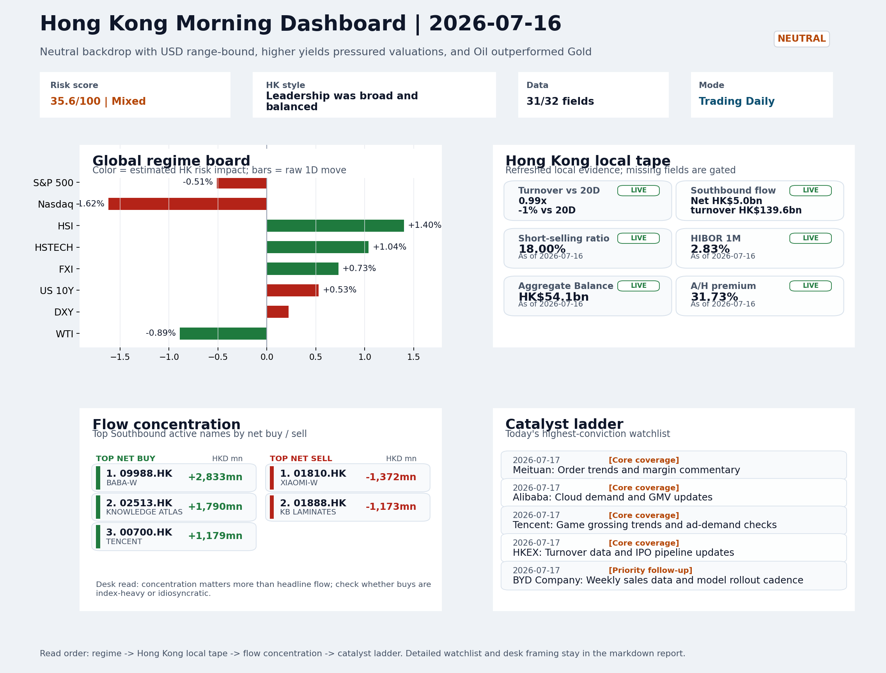
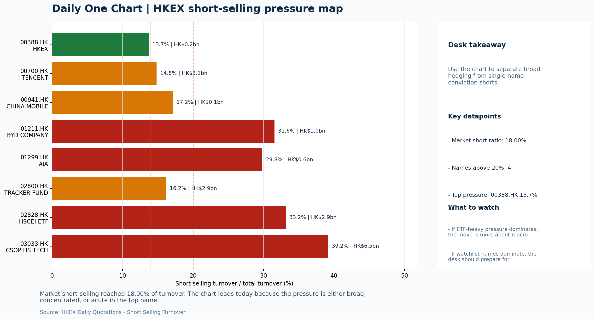

# Morning Research Workbench | 2026-07-17

> Designed for a Hong Kong sell-side commute: Layer 1 `Scan`, Layer 2 `Deep Read`, Layer 3 `Thinking`
> Mode: `Trading Daily` | Keep the report execution-oriented: what mattered in the completed session, what can move Hong Kong leadership, and what needs fast follow-up.
> Briefing date: `2026-07-17` | Review date: `2026-07-16` | Global request: `2026-07-16` | HK/China request: `2026-07-16` | Market effective date: `2026-07-16` | Generated at: `2026-07-17 06:02:27`

## Executive Summary

- **Market pulse:** Hong Kong staged a notable intraday divergence - HSI +1.4% against a Nasdaq -1.62% - but the 18% short-selling ratio and flat turnover argue that today's growth leadership needs confirmation.
- **Hong Kong lens:** Hong Kong growth / internet led. Hong Kong is set to open lower, with HSTECH and tech hardware names directly pressured by the Nasdaq-led selloff.
- **Top catalysts:** INTC -6.33%; VIX +6.76%.

## Visual Dashboard

## Layer 1 | Scan (5-10 min)

### 1.1 One-Line Market Pulse
Hong Kong staged a notable intraday divergence - HSI +1.4% against a Nasdaq -1.62% - but the 18% short-selling ratio and flat turnover argue that today's growth leadership needs confirmation before treating it as a durable shift rather than a session-specific flow event.

### 1.2 Global Asset Price Dashboard

| Asset | Last | 1D move | Read |
| --- | --- | --- | --- |
| S&P 500 | 7,533.77 | -0.51% | US large-cap risk appetite |
| Nasdaq 100 | 29,025.77 | **-1.62%** | Growth and duration leadership |
| Hang Seng Index | 24,681.10 | +1.40% | Hong Kong broad beta |
| Hang Seng TECH | 4.6480 | +1.04% | Hong Kong growth / platform read-through |
| CSI 300 | 4,780.79 | **-1.96%** | Mainland large-cap tone |
| US 10Y | 4.5690 | +0.53% | Global discount-rate anchor |
| China 10Y | 1.74% | +0.3bp | China local rates anchor \| Live public \| Eastmoney \| 2026-07-16 |
| CN-US 10Y spread | -282.6bp | -1.7bp | Relative carry and macro-pressure gauge \| Live public \| Eastmoney \| 2026-07-16 |
| DXY | 100.73 | +0.22% | Dollar liquidity impulse |
| USD/CNH | 6.7475 | +0.00% | Offshore China risk appetite |
| USD/HKD | 7.8394 | +0.02% | Linked-exchange regime stress check |
| Brent crude | 84.86 | -0.11% | Energy / geopolitics |
| COMEX gold | 3,979.90 | **-1.59%** | Hedge demand / real yields |
| Copper | 6.2830 | -0.17% | Global growth proxy |
| VIX | 16.73 | **+6.76%** | US stress barometer |

### 1.3 Hong Kong Key Data Quick Check

| Check | Value | Status | Source / as of | Why it matters |
| --- | --- | --- | --- | --- |
| Main Board turnover vs 20D | 0.99x \| -1% vs 20D | Live local | HKEX \| 2026-07-16 | Trailing 20-session average turnover was HK$325.2bn. |
| Southbound / Northbound net flow | Southbound Net HK$5.0bn \| turnover HK$139.6bn \| Northbound Turnover HK$355.9bn \| net not reported | Live local | HKEX Connect \| 2026-07-16 | Southbound net buy is calculated from HKEX disclosed buy and sell turnover. |
| Short-selling ratio | 18.00% | Live local | HKEX \| 2026-07-16 | Official HKEX stock-level short-selling table, aggregated as a share of total market turnover. |
| AH premium index | 31.73% | Live public | Yahoo \| 2026-07-16 | Simple average across 17 A/H pairs; use dispersion rather than the average alone. |
| USD/HKD spot vs band | 7.8394 \| band 7.7500 to 7.8500 | Live quote + local | Yahoo \| 2026-07-16 | Inside the linked-exchange band without immediate boundary stress. Official Convertibility Undertakings define the linked-rate stress boundaries for USD/HKD. |
| HIBOR 1M | 2.83% | Live local | HKMA \| 2026-07-16 | 1M HIBOR is the cleanest quick read for Hong Kong funding conditions and equity-duration pressure. |
| Aggregate Balance | HK$54.1bn | Live local | HKMA \| 2026-07-16 | Aggregate Balance helps frame whether linked-rate liquidity conditions are tight or comfortable. |
| Hong Kong leadership | Hong Kong growth / internet led | Proxy | HSI / HSCEI / HSTECH relative perf \| 2026-07-16 | Use HSI / HSCEI / HSTECH relative moves as the opening style read. |

### 1.4 Risk Dashboard
**Composite risk score:** `35.6/100` | **Regime:** `Mixed`

| Component | Score impact | Evidence |
| --- | --- | --- |
| US beta | -3.1 | S&P 500 -0.51% |
| HK growth | +5.2 | HSTECH +1.04% |
| Offshore China proxy | +3.6 | FXI +0.73% |
| Dollar pressure | -2.2 | DXY +0.22% |
| Volatility | -10 | VIX +6.76% |
| HK short-selling | -8 | Short-selling ratio 18.00% |

### 1.5 Morning Checklist
1. **INTC -6.33%**
 Mover attribution | Announcement / expectations | Guidance reset and margin pressure
2. **VIX +6.76%**
 High-frequency data | Higher volatility argues for tighter sizing and tighter stops.
3. **Neutral backdrop with USD range-bound, higher yields pressured valuations, and Oil outperformed Gold**
 Overnight regime | Start by deciding whether the day is about Neutral conditions or a style pivot.
4. **CPI MoM (Released)**
 Macro / policy | Rates expectations, the dollar, and growth-equity valuation | Industries: Technology, Internet, Brokers
5. **Trade Balance (Released)**
 Macro / policy | Watch whether it changes the day's core market narrative | Industries: Market-wide

## Layer 2 | Deep Read (20-30 min)

### 2.1 Overnight Overseas Market Review
#### Market Setup
**Core tape.** US equities fell overnight, with the Nasdaq 100 dropping 1.62% and the S&P 500 down 0.51%, as semiconductor weakness and Intel's guidance reset dragged growth names.
**Main driver.** Modestly higher Treasury yields and hawkish Fed commentary added pressure, while the VIX surged 6.76%, signaling elevated volatility.
**HK relevance.** European equities also edged lower, with the Euro Stoxx 50 off 0.23%.

#### Key Drivers
- Semiconductor selloff and Intel's guidance reset drove broad tech and growth weakness.
- Modestly higher US yields (10Y yield proxy +0.53%) added pressure on valuation-sensitive sectors.
- Hawkish Fed rhetoric (Logan calling for higher rates) reinforced 'higher for longer' rate expectations.
- VIX spike (+6.76%) signaled elevated near-term uncertainty, prompting risk reduction across markets.

#### Hong Kong Read-Through
**Desk lens.** Leadership was broad and balanced.
**Opening implication.** Hong Kong is set to open lower, with HSTECH and tech hardware names directly pressured by the Nasdaq-led selloff. Elevated local short-selling (18%) argues for extra confirmation before any dip-buying.
- **Cross-market read:** Hang Seng +1.40% / HSCEI +1.00% / HSTECH +1.04%.
- **Cross-market read:** Offshore China proxy FXI +0.73% and USD/CNH +0.00% frame cross-border risk appetite.
- **Cross-market read:** USD/HKD last traded around 7.8394, which keeps the Hong Kong funding lens in focus.

#### Watch Points
- USD composite moved higher by +0.13pct intraday, with a 0.235pct range.
- Main turning points appeared around 2026-07-16 08:15 trough / 2026-07-16 08:30 peak / 2026-07-16 08:50 peak, suggesting event-driven repricing.
- The biggest cross-asset divergence was Oil versus Gold, a spread of 0.601pct.
- Gold moved -1.47pct intraday with a 1.758pct high-low range.

**Curated overnight stories**
1. **INTC -6.33% on guidance reset and margin pressure**
 Why it matters: Intel's guidance reset signals persistent execution challenges in its core business, compounding existing semiconductor-sector concerns about AI spending returns.
 HK read-through: Direct read-through to Hong Kong-listed tech hardware and semiconductor supply chain names; also informs sentiment toward growth/PC-related ADRs with Hong Kong exposure.
2. **VIX +6.76%, signaling elevated volatility**
 Why it matters: A sharp VIX move after CPI release and amid chip-sector weakness suggests market is repricing risk faster.
 HK read-through: Relevant for H-share derivative pricing, sector rotation toward defensives, and risk management on Hong Kong long positions.
3. **Dallas Fed President Logan calls for 'modestly' higher interest rates**
 Why it matters: Login's hawkish comment joins a broader theme of Fed speakers cautioning on rates. Reinforces the 'higher for longer' narrative and keeps USD supported.
 HK read-through: USD strength underpins HKD peg stability but pressures Hong Kong growth equities and cross-border capital flows; directly relevant for H-share valuation multiples.
4. **CPI MoM data released; Trade Balance also released**
 Why it matters: CPI outcome shapes the day's Fed rate expectations and dollar trajectory. Trade Balance data adds context on U.S.
 HK read-through: Both data releases affect rates expectations, the dollar, and growth-equity valuation frameworks for Hong Kong internet and technology names.
5. **Chip stocks selloff amid AI spending anxiety and geopolitical risks**
 Why it matters: Broader chip sector weakness (TSMC, Micron movers noted) reflects market concern that massive AI capex may not generate near-term returns, with geopolitical overhang adding.
 HK read-through: Sector-level caution propagates through Hong Kong tech supply chains, Hua Hong, SMIC, and related ADR sentiment; watch for contagion to local hardware names.

### 2.2 Hong Kong / A-share Previous-Day Review
#### Local Tape Setup
**Local read.** Hong Kong staged a notable divergence on 2026-07-16: HSI closed +1.4% while Nasdaq fell 1.62%, suggesting local flow was partially decoupled from the overnight US tech selloff.
**Verification point.** HSTECH (+1.04%) led HSCEI (+1.0%) and FXI (+0.73%), consistent with a growth-led read, but the 18% short-selling ratio and US 10Y yield +0.53% argue that this leadership needs confirmation rather than assumption.
**Risk to watch.** Southbound net HK$5.0bn and KWEB inflow +1.78% on 1.38x volume provide directional support, but Northbound net buy remains unreported, leaving the cross-market attribution incomplete.

#### Style and Local Leadership
**Style leadership.** Hong Kong growth / internet led.
- **Cross-market read:** Hang Seng +1.40% / HSCEI +1.00% / HSTECH +1.04%.
- **Cross-market read:** Offshore China proxy FXI +0.73% and USD/CNH +0.00% frame cross-border risk appetite.
- **Cross-market read:** USD/HKD last traded around 7.8394, which keeps the Hong Kong funding lens in focus.

#### Flow Confirmation
Official Stock Connect evidence is available; use Section 2.3 to confirm whether local money supports the price action.

#### Follow-Through Checklist
**Follow-through check.** Confirm whether HSTECH retains its leadership premium at the 2026-07-17 open if Nasdaq futures stabilize; watch HIBOR 1M (2.83%) and short-selling ratio for any deterioration in funding or momentum signals.

### 2.3 Flow Tracker and Attribution
#### Cross-Asset Attribution v1

| Driver | Direction | Score | Evidence | HK implication |
| --- | --- | --- | --- | --- |
| US growth-style transmission | drag | 2.27 | Nasdaq 100 moved -1.62%. | Hong Kong growth and platform names should be tested first at the open. |
| Short-selling pressure | drag | 2.1 | HKEX short-selling ratio was 18.00%. | Elevated short activity argues for extra confirmation before chasing rebounds. |
| Rates impulse | drag | 0.64 | US 10Y yield proxy moved +0.53%. | Lower yields help long-duration growth; higher yields pressure valuation-sensitive |

#### Flow Tracker
##### Flow Takeaways
- Short-selling pressure is elevated, so local rebounds need cleaner breadth and flow confirmation.
- Stock Connect Southbound: net HK$5.0bn on turnover HK$139.6bn (as of 2026-07-16).
- Stock Connect Northbound: turnover RMB355.9bn; public file provides total turnover/top active names, not full net-buy.
- AH premium: simple covered-pair average +31.73%; widest premium: China Life 62.47%.

##### Stock Connect Southbound Active Names

| Rank | Ticker | Name | Buy | Sell | Net buy |
| --- | --- | --- | --- | --- | --- |
| 2 | 09988.HK | BABA-W | HK$6,751.0mn | HK$3,917.7mn | HK$2,833.3mn |
| 1 | 02513.HK | KNOWLEDGE ATLAS | HK$4,993.6mn | HK$3,203.3mn | HK$1,790.3mn |
| 5 | 01810.HK | XIAOMI-W | HK$1,905.0mn | HK$3,276.5mn | HK$-1,371.5mn |
| 1 | 00700.HK | TENCENT | HK$6,630.0mn | HK$5,450.8mn | HK$1,179.2mn |
| 6 | 01888.HK | KB LAMINATES | HK$1,607.8mn | HK$2,780.4mn | HK$-1,172.6mn |

##### AH Premium Dispersion

| Name | A ticker | H ticker | Premium | As of |
| --- | --- | --- | --- | --- |
| China Life | 601628.SS | 2628.HK | +62.47% | 2026-07-16 |
| New China Life | 601336.SS | 1336.HK | +58.92% | 2026-07-16 |
| China Railway | 601390.SS | 0390.HK | +48.38% | 2026-07-16 |
| China Railway Construction | 601186.SS | 1186.HK | +48.20% | 2026-07-16 |
| China Communications Construction | 601800.SS | 1800.HK | +41.69% | 2026-07-16 |

##### HKEX Short-Selling Watch

| Ticker | Name | Short ratio | Short turnover | Total turnover |
| --- | --- | --- | --- | --- |
| 00388.HK | HKEX | 13.70% | HK$0.2bn | HK$1.7bn |
| 00700.HK | TENCENT | 14.82% | HK$3.1bn | HK$20.8bn |
| 00941.HK | CHINA MOBILE | 17.16% | HK$0.1bn | HK$0.8bn |
| 01211.HK | BYD COMPANY | 31.56% | HK$1.0bn | HK$3.1bn |
| 01299.HK | AIA | 29.84% | HK$0.6bn | HK$2.2bn |

- **Short-value leaders:** 03033.HK CSOP HS TECH (HK$6.5bn); 09988.HK BABA-W (HK$4.4bn); 00700.HK TENCENT (HK$3.1bn); 02828.HK HSCEI ETF (HK$2.9bn).

### 2.4 Macro and Policy Tracking
**Desk read.** The released US CPI of 0.3% MoM, above consensus 0.2%, initially pushes back against near-term rate-cut expectations, which can extend the higher-yields pressure on growth-equity valuations visible in the prior session.

**Market sensitivity.** While China's trade surplus of USD 85.2bn beat forecasts, the dominant cross-asset signal for Hong Kong today is the rates-and-dollar response to the CPI, with upcoming retail sales and Powell remarks likely to reinforce.

**Macro watchpoints**
- US 10-year yield and DXY reaction to the CPI overshoot.
- Hong Kong Tech and Broker sectors as the first local proxies for rates sensitivity.
- Any shift in HKD spot or Hibor fix as a liquidity stress flag.
- Powell's 22:00 speech for forward guidance nuance, and US retail sales print at 20:30 to validate growth resilience.

| Time | Region | Event | Status | Desk read |
| --- | --- | --- | --- | --- |
| 20:30 | US | CPI MoM | Released | Impact: Rates expectations, the dollar, and growth-equity valuation \| Attention: 5/5 \| Industries: Technology, Internet, Brokers |
| 09:30 | China | Trade Balance | Released | Impact: Watch whether it changes the day's core market narrative \| Attention: 3/5 \| Industries: Market-wide |
| 20:30 | US | Retail Sales MoM | Upcoming | Impact: Consumer resilience, growth expectations, and risk-asset pricing \| Attention: 5/5 \| Industries: Consumer, E-commerce, Consumer discretionary |
| 09:20 | China | Loan Prime Rate | Upcoming | Impact: Watch whether it changes the day's core market narrative \| Attention: 3/5 \| Industries: Market-wide |
| 22:00 | Federal Reserve | Jerome Powell: Economic outlook remarks | Central bank | Impact: Policy path, liquidity conditions, and cross-asset risk appetite \| Attention: 5/5 \| Industries: Technology, Financials, Gold |
| 10:00 | PBOC | Open Market Operations Desk: Daily liquidity operation window | Central bank | Impact: Policy path, liquidity conditions, and cross-asset risk appetite \| Attention: 3/5 \| Industries: Technology, Financials, Gold |

#### Positioning and Risk Backdrop
- Options activity centered on KWEB Call, with Vol/OI at 1.88x and a bullish bias.
- Put/Call structure shows equity 0.68 / index 1.15, implying Single-stock optimism with index hedging.
- Geopolitics: Middle East | Regional tension remains elevated | Impact: Oil, freight costs, and safe-haven demand
- Geopolitics: US-China | Technology export-control rhetoric remains active | Impact: China internet, semiconductors, and supply chains

### 2.5 Key Company and Sector Events
No high-conviction sector story cleared the main-report relevance gate for this run.

#### HKEX Announcements

| Grade | Ticker | Type | Release time | Title |
| --- | --- | --- | --- | --- |
| A | 00128.HK | Profit warning | 2026-07-16 | Profit warning / alert announcement |
| A | 00267.HK | Profit warning | 2026-07-16 | Profit warning / alert announcement |
| A | 00468.HK | Profit warning | 2026-07-16 | Profit warning / alert announcement |
| A | 00560.HK | Profit warning | 2026-07-16 | Profit warning / alert announcement |
| A | 02285.HK | Profit warning | 2026-07-16 | Profit warning / alert announcement |
| A | 02381.HK | Profit warning | 2026-07-16 | Profit warning / alert announcement |
| A | 02549.HK | Profit warning | 2026-07-16 | Profit warning / alert announcement |
| A | 02559.HK | Profit warning | 2026-07-16 | Profit warning / alert announcement |

#### Earnings / Results Watch

| Ticker | Company | Timing | Expectation framing |
| --- | --- | --- | --- |
| 0700.HK | Tencent Holdings | After Market Close | EPS est. 4.15 HKD \| revenue est. 163.2bn HKD |
| 0388.HK | Hong Kong Exchanges and Clearing | Before Market Open | EPS est. 2.81 HKD \| revenue est. 6.0bn HKD |

#### Rating Changes
- **9988.HK** | Morgan Stanley | Upgrade | Equal Weight -> Overweight | PT 92 -> 105

#### IPO Watch
- IPO and grey-market monitoring is not yet part of the standard production pack.

### 2.6 Today's Core Names
#### Core coverage

| Name | Ticker | Last | 1D | Range position | Morning note |
| --- | --- | --- | --- | --- | --- |
| Meituan | 3690.HK | 87.20 | +4.56% | Top of range | Short-term price strength is clear; fresh catalysts could trigger broader group follow-through. |
| Alibaba | 9988.HK | 116.90 | +3.09% | Mid-range | Short-term price strength is clear; fresh catalysts could trigger broader group follow-through. |

**Recent headlines for Meituan:**
- [Uber bids $15 billion for Delivery Hero to form global takeout giant](https://finance.yahoo.com/video/uber-bids-15-billion-delivery-141845111.html) (Reuters Videos)
**Recent headlines for Alibaba:**
- [Alibaba Jumps 7.9% as Apple Intelligence Approval Revives China Tech Rally](https://finance.yahoo.com/technology/ai/articles/alibaba-jumps-7-9-apple-194120445.html) (GuruFocus.com)

#### Priority follow-up

| Name | Ticker | Last | 1D | Range position | Morning note |
| --- | --- | --- | --- | --- | --- |
| BYD Company | 1211.HK | 90.95 | +4.60% | Mid-range | Short-term price strength is clear; fresh catalysts could trigger broader group follow-through. |
| China Mobile | 0941.HK | 79.60 | +0.76% | Mid-range | Positioning is neutral for now, so use it mainly to monitor marginal information changes. |

**Recent headlines for BYD Company:**
- [BYD (SEHK:1211) Stock Could Be Stretched Following New Blade Battery Launch](https://finance.yahoo.com/markets/stocks/articles/byd-sehk-1211-stock-could-171324356.html) (Simply Wall St.)
**Recent headlines for China Mobile:**
- [China Mobile (SEHK:941): A Closer Look at Valuation After Steady Share Price Gains This Year](https://finance.yahoo.com/news/china-mobile-sehk-941-closer-154022664.html) (Simply Wall St.)

## Layer 3 | Thinking (10-15 min)

### 3.1 Rotating Theme Deep Dive

| Field | Read |
| --- | --- |
| Theme | Hong Kong Market Structure and Flows |
| Angle for the day | Focus on turnover, Stock Connect, ETF flows, HKEX activity, and style leadership to understand whether Hong Kong is being driven by fundamentals or positioning. |

**Theme desk read**
**Core thesis.** The weekly theme centres on whether Hong Kong's tape is being shaped by fundamentals or positioning flows.
**Evidence.** Today's session offered mixed evidence: BYD rallied 4.6% to HK$90.95 - despite a hotter US CPI print, rising yields.
**What to test.** In contrast, HKEX edged up only 0.71% to HK$396.2, staying mid-range amid turnover signals that have not yet confirmed a broadening shift.

**Signals to keep in mind**
- VIX +6.76%: Higher volatility argues for tighter sizing and tighter stops.
- Gold -1.59%: Keep tracking it to confirm whether the core daily narrative is holding.

**LLM watch items:**
- HKEX turnover data and IPO pipeline updates to see if market activity is broadening beyond EV names.
- BYD weekly sales figures and export mix; sustain the 4.6% move with volume confirmation.
- Hang Seng TECH ETF flows and the AI narrative; VIX spike raises the cost of chasing growth positioning.
- China LPR decision and US retail sales; macro surprises could either validate or disrupt the current style preference.

**Related names to keep close:**

| Name | Ticker | Bucket | Morning read |
| --- | --- | --- | --- |
| HKEX | 0388.HK | Core coverage | Positioning is neutral for now, so use it mainly to monitor marginal information changes. |
| BYD Company | 1211.HK | Priority follow-up | Short-term price strength is clear; fresh catalysts could trigger broader group follow-through. |

**Upcoming catalysts tied to the theme:**
- 2026-07-17 | HKEX: Turnover data and IPO pipeline updates | Direct proxy for Hong Kong market turnover, listings, and southbound interest
- 2026-07-17 | BYD Company: Weekly sales data and model rollout cadence | Hong Kong-listed proxy for EV volumes, export mix, and price competition
- 2026-07-17 | Tracker Fund of Hong Kong: Index-turnover shifts and ETF flows | Clean listed proxy for broad HSI positioning and passive flows
- 2026-07-17 | Hang Seng TECH ETF: AI narrative shifts and China platform regulation headlines | Fast proxy for Hong Kong internet and growth leadership

### 3.2 Today Ahead and Trading Calendar
- Macro: CPI MoM is the first item to anchor the open and the rates/FX response.
- Corporate / event: Meituan: Order trends and margin commentary is the cleanest same-day catalyst to prepare for.

**Same-day macro docket**

| Time | Country | Event | Status | Detail |
| --- | --- | --- | --- | --- |
| 20:30 | US | CPI MoM | Released | Actual 0.3% / Forecast 0.2% / Prior 0.4% |
| 09:30 | China | Trade Balance | Released | Actual USD 85.2bn / Forecast USD 79.0bn / Prior USD 80.6bn |
| 20:30 | US | Retail Sales MoM | Upcoming | Forecast 0.3% / Prior 0.6% |
| 09:20 | China | Loan Prime Rate | Upcoming | Forecast 3.45% / Prior 3.45% |
| 22:00 | Federal Reserve | Jerome Powell: Economic outlook remarks | Central bank | speech |

**Same-day catalyst list**

| Date | Time | Category | Event | Importance |
| --- | --- | --- | --- | --- |
| 2026-07-17 | | Core coverage | Meituan: Order trends and margin commentary | 3 |
| 2026-07-17 | | Core coverage | Alibaba: Cloud demand and GMV updates | 3 |
| 2026-07-17 | | Core coverage | Tencent: Game grossing trends and ad-demand checks | 3 |
| 2026-07-17 | | Core coverage | HKEX: Turnover data and IPO pipeline updates | 3 |

**Next few sessions**

| Date | Category | Event | Impact |
| --- | --- | --- | --- |
| 2026-07-17 | Core coverage | Meituan: Order trends and margin commentary | High-frequency read on local services demand and platform competition |
| 2026-07-17 | Core coverage | Alibaba: Cloud demand and GMV updates | Key read-through for China consumption, cloud, and platform regulation |
| 2026-07-17 | Core coverage | Tencent: Game grossing trends and ad-demand checks | Core offshore China platform proxy for gaming, ads, and AI monetization |
| 2026-07-17 | Core coverage | HKEX: Turnover data and IPO pipeline updates | Direct proxy for Hong Kong market turnover, listings, and southbound |

### 3.3 Daily One Chart
**Daily One Chart | HKEX short-selling pressure map**

**Chart read.** Market short-selling reached 18.00% of turnover.
**Why it matters.** The chart leads today because the pressure is either broad, concentrated, or acute in the top name.

_Source: HKEX Daily Quotations - Short Selling Turnover_

## Traceable Appendix

### Report Metadata
> Date policy: Review date 2026-07-16 is treated as `Trading Daily`. | Global request date is 2026-07-16; adapter effective date is 2026-07-16 and summary date is 2026-07-16. | HK/China local data date is 2026-07-16; role: same-session local cash tape.
> Market data quality: Coverage: `31/32` | Stale items (>1d): `1` | Missing: `1`
> Report quality: `83.7/100` | Grade `B` | Status `usable with caveats`

### Key Questions to Keep in Mind
- Is risk appetite rising or fading? The overnight tape reads closer to `Neutral`.
- Did rates expectations move? Focus on whether US 10Y, DXY, and growth style moved together.
- Were commodities the real story? Watch WTI and gold for geopolitics versus inflation signals.
- Is Hong Kong setup internet-led, SOE-led, or broad beta-led? Compare HSTECH, HSCEI, and HSI.
- Did offshore markets move China risk appetite? Focus on HSI, FXI, USD/CNH, and USD/HKD.

### Report Quality and Validation
- **Quality score:** 83.7/100 | **Grade:** B | **Status:** usable with caveats
- **Run summary:** 7 healthy | 1 caveat | 0 failed
- **Release recommendation:** Send with caveats | The report is usable, but the advisory guidance should travel with it so readers understand the data gaps.

| Source | Status | Bucket |
| --- | --- | --- |
| Market data | ok | healthy |
| Sector and company news | ok | healthy |
| Movers and short selling | ok | healthy |
| Stock Connect | ok | healthy |
| A/H premium | ok | healthy |
| Hong Kong local package | ok | healthy |
| China rates | ok | healthy |
| Narrative overlay | partial | caveat |

**Desk-use guidance summary:** 0 blocking | 1 advisory

**Desk-use guidance**
- **Advisory:** Use deterministic sections as primary support; the narrative overlay was partial or unavailable on this run.

| Component | Score | Weight | Read |
| --- | --- | --- | --- |
| Market data coverage | 96.9 | 0.3 | 31/32 core market fields available. |
| Hong Kong local metrics | 82.3 | 0.25 | 8 live, 3 proxy, 0 unavailable local checks. |
| Key public adapters | 100.0 | 0.2 | 4/4 key adapters were available or partially available. |
| Narrative overlay health | 60.0 | 0.15 | 3/7 narrative overlay tasks succeeded or used validated cache; 1 error(s). |
| Fact-check guardrail | 50.0 | 0.1 | Checked 4 numeric claims; 2 numeric mismatch(es), 0 logic warning(s); 2 critical, 0 review. |

**Quality warnings**
- Fact-check guardrail is weak: Checked 4 numeric claims; 2 numeric mismatch(es), 0 logic warning(s); 2 critical, 0 review.
- Narrative fact-check guardrail produced warnings; review the validation table before relying on narrative sections.

**Narrative fact-check guardrail**
- Checked 4 numeric claims; 2 numeric mismatch(es), 0 logic warning(s); 2 critical, 0 review.

| Severity | Field | Claim | Type | Claimed | Expected | Snippet |
| --- | --- | --- | --- | --- | --- | --- |
| critical | tasks.overnight_review.paragraph | S&P 500 | change_pct | 0.51 | -0.51 | night, with the Nasdaq 100 dropping 1.62% and the S&P 500 down 0.51%, as semiconductor weakness and Intel's guidance r |
| critical | tasks.hk_review.paragraph | Nasdaq 100 | change_pct | 1.62 | -1.62 | divergence on 2026-07-16: HSI closed +1.4% while Nasdaq fell 1.62%, suggesting local flow was partially decoupled fr |

**Adapter status**

| Adapter | Status |
| --- | --- |
| Stock Connect | ok |
| A/H premium | ok |
| HKEX announcements | ok |
| China rates | ok |

### Source Links
- [Uber bids $15 billion for Delivery Hero to form global takeout giant](https://finance.yahoo.com/video/uber-bids-15-billion-delivery-141845111.html) (Reuters Videos)
- [Hong Kong Stocks End Higher on Strength in Chinese Tech](https://www.barrons.com/livecoverage/stock-market-news-today-071626/card/hong-kong-stocks-end-higher-on-strength-in-chinese-tech-4LoVV5QijDwJSM07qvmb?siteid=yhoof2&yptr=yahoo) (Barrons.com)
- [Alibaba Jumps 7.9% as Apple Intelligence Approval Revives China Tech Rally](https://finance.yahoo.com/technology/ai/articles/alibaba-jumps-7-9-apple-194120445.html) (GuruFocus.com)
- [BYD (SEHK:1211) Stock Could Be Stretched Following New Blade Battery Launch](https://finance.yahoo.com/markets/stocks/articles/byd-sehk-1211-stock-could-171324356.html) (Simply Wall St.)
- [China Mobile (SEHK:941): A Closer Look at Valuation After Steady Share Price Gains This Year](https://finance.yahoo.com/news/china-mobile-sehk-941-closer-154022664.html) (Simply Wall St.)
- [00128.HK Profit warning / alert announcement](http://www1.hkexnews.hk/listedco/listconews/sehk/2026/0716/2026071601043.pdf) (HKEXnews)
- [00267.HK Profit warning / alert announcement](http://www1.hkexnews.hk/listedco/listconews/sehk/2026/0716/2026071600405.pdf) (HKEXnews)
- [00468.HK Profit warning / alert announcement](http://www1.hkexnews.hk/listedco/listconews/sehk/2026/0716/2026071600916.pdf) (HKEXnews)
- [00560.HK Profit warning / alert announcement](http://www1.hkexnews.hk/listedco/listconews/sehk/2026/0716/2026071600583.pdf) (HKEXnews)
- [02285.HK Profit warning / alert announcement](http://www1.hkexnews.hk/listedco/listconews/sehk/2026/0716/2026071600367.pdf) (HKEXnews)
- [02381.HK Profit warning / alert announcement](http://www1.hkexnews.hk/listedco/listconews/sehk/2026/0716/2026071601277.pdf) (HKEXnews)
- [02549.HK Profit warning / alert announcement](http://www1.hkexnews.hk/listedco/listconews/sehk/2026/0716/2026071601181.pdf) (HKEXnews)
- [02559.HK Profit warning / alert announcement](http://www1.hkexnews.hk/listedco/listconews/sehk/2026/0716/2026071601141.pdf) (HKEXnews)

## Supplementary Visual Appendix

This appendix is professional-path only. It keeps a traceable index of the report visuals and the deterministic chart cues used to frame the morning note, without injecting the legacy intraday chart pack.

### Visual Index

| Visual | Path | Role |
| --- | --- | --- |
| Visual Dashboard | `charts/dashboard_2026-07-17.png` | Cross-asset regime board and Hong Kong local tape snapshot. |
| Daily One Chart | `charts/daily_one_chart_2026-07-17.png` | Single highest-conviction visual story for the day. |

### Deterministic Chart Cues
- FX / liquidity: USD composite moved higher by +0.13pct intraday, with a 0.235pct range.
- FX / liquidity: Main turning points appeared around 2026-07-16 08:15 trough / 2026-07-16 08:30 peak / 2026-07-16 08:50 peak, suggesting event-driven repricing rather than a clean one-way USD move.
- Cross-asset: The biggest cross-asset divergence was Oil versus Gold, a spread of 0.601pct.
- Cross-asset: Gold moved -1.47pct intraday with a 1.758pct high-low range.
- Cross-asset: Oil moved -0.87pct intraday with a 3.267pct high-low range.
- Cross-asset: Bitcoin moved -0.91pct intraday with a 1.626pct high-low range.

### Risk Dashboard Components

| Component | Score impact | Evidence |
| --- | --- | --- |
| US beta | -3.1 | S&P 500 -0.51% |
| HK growth | +5.2 | HSTECH +1.04% |
| Offshore China proxy | +3.6 | FXI +0.73% |
| Dollar pressure | -2.2 | DXY +0.22% |
| Volatility | -10 | VIX +6.76% |
| HK short-selling | -8 | Short-selling ratio 18.00% |
