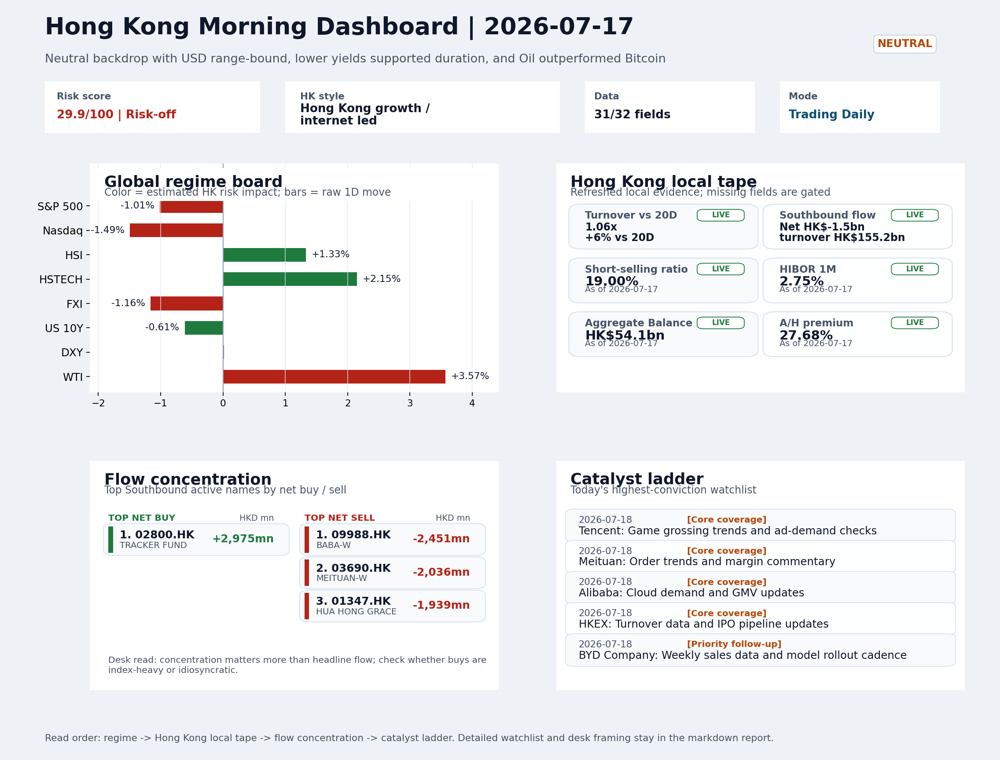
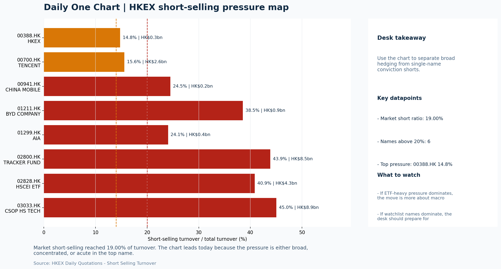

# Morning Research Workbench | 2026-07-18

> Designed for a Hong Kong sell-side commute: Layer 1 `Scan`, Layer 2 `Deep Read`, Layer 3 `Thinking`
> Mode: `Trading Daily` | Keep the report execution-oriented: what mattered in the completed session, what can move Hong Kong leadership, and what needs fast follow-up.
> Briefing date: `2026-07-18` | Review date: `2026-07-17` | Global request: `2026-07-17` | HK/China request: `2026-07-17` | Market effective date: `2026-07-17` | Generated at: `2026-07-18 05:51:03`

## Executive Summary

- **Market pulse:** Overnight US equity weakness and a VIX spike contrast with Hong Kong's prior-session HSTECH-led outperformance, but elevated local short-selling and a post-close FXI dip leave Monday's.
- **Hong Kong lens:** Hong Kong growth / internet led. A constructive open is more credible if HSTECH holds and FXI stabilizes rather than extending its offshore China proxy slide.
- **Top catalysts:** VIX +12.19%; INTC -6.33%.

## Visual Dashboard

## Layer 1 | Scan (5-10 min)

### 1.1 One-Line Market Pulse
Overnight US equity weakness and a VIX spike contrast with Hong Kong's prior-session HSTECH-led outperformance, but elevated local short-selling and a post-close FXI dip leave Monday's open conditional on flow confirmation.

### 1.2 Global Asset Price Dashboard

| Asset | Last | 1D move | Read |
| --- | --- | --- | --- |
| S&P 500 | 7,457.69 | -1.01% | US large-cap risk appetite |
| Nasdaq 100 | 28,592.66 | -1.49% | Growth and duration leadership |
| Hang Seng Index | 25,008.60 | +1.33% | Hong Kong broad beta |
| Hang Seng TECH | 4.7480 | **+2.15%** | Hong Kong growth / platform read-through |
| CSI 300 | 4,780.79 | **-1.96%** | Mainland large-cap tone |
| US 10Y | 4.5410 | -0.61% | Global discount-rate anchor |
| China 10Y | 1.74% | -0.3bp | China local rates anchor \| Live public \| Eastmoney \| 2026-07-17 |
| CN-US 10Y spread | -281.0bp | +1.7bp | Relative carry and macro-pressure gauge \| Live public \| Eastmoney \| 2026-07-17 |
| DXY | 100.75 | +0.02% | Dollar liquidity impulse |
| USD/CNH | 6.7525 | +0.00% | Offshore China risk appetite |
| USD/HKD | 7.8390 | +0.01% | Linked-exchange regime stress check |
| Brent crude | 88.09 | **+4.58%** | Energy / geopolitics |
| COMEX gold | 4,023.00 | +0.94% | Hedge demand / real yields |
| Copper | 6.2705 | -0.41% | Global growth proxy |
| VIX | 18.77 | **+12.19%** | US stress barometer |

### 1.3 Hong Kong Key Data Quick Check

| Check | Value | Status | Source / as of | Why it matters |
| --- | --- | --- | --- | --- |
| Main Board turnover vs 20D | 1.06x \| +6% vs 20D | Live local | HKEX \| 2026-07-17 | Trailing 20-session average turnover was HK$328.9bn. |
| Southbound / Northbound net flow | Southbound Net HK$-1.5bn \| turnover HK$155.2bn \| Northbound Turnover HK$393.5bn \| net not reported | Live local | HKEX Connect \| 2026-07-17 | Southbound net buy is calculated from HKEX disclosed buy and sell turnover. |
| Short-selling ratio | 19.00% | Live local | HKEX \| 2026-07-17 | Official HKEX stock-level short-selling table, aggregated as a share of total market turnover. |
| AH premium index | 27.68% | Live public | Yahoo \| 2026-07-17 | Simple average across 18 A/H pairs; use dispersion rather than the average alone. |
| USD/HKD spot vs band | 7.8390 \| band 7.7500 to 7.8500 | Live quote + local | Yahoo \| 2026-07-17 | Inside the linked-exchange band without immediate boundary stress. Official Convertibility Undertakings define the linked-rate stress boundaries for USD/HKD. |
| HIBOR 1M | 2.75% | Live local | HKMA \| 2026-07-17 | 1M HIBOR is the cleanest quick read for Hong Kong funding conditions and equity-duration pressure. |
| Aggregate Balance | HK$54.1bn | Live local | HKMA \| 2026-07-17 | Aggregate Balance helps frame whether linked-rate liquidity conditions are tight or comfortable. |
| Hong Kong leadership | Hong Kong growth / internet led | Proxy | HSI / HSCEI / HSTECH relative perf \| 2026-07-17 | Use HSI / HSCEI / HSTECH relative moves as the opening style read. |

### 1.4 Risk Dashboard
**Composite risk score:** `29.9/100` | **Regime:** `Risk-off`

| Component | Score impact | Evidence |
| --- | --- | --- |
| US beta | -6.1 | S&P 500 -1.01% |
| HK growth | +10 | HSTECH +2.15% |
| Offshore China proxy | -5.8 | FXI -1.16% |
| Dollar pressure | -0.2 | DXY +0.02% |
| Volatility | -10 | VIX +12.19% |
| HK short-selling | -8 | Short-selling ratio 19.00% |

### 1.5 Morning Checklist
1. **VIX +12.19%**
 High-frequency data | Higher volatility argues for tighter sizing and tighter stops.
2. **INTC -6.33%**
 Mover attribution | Announcement / expectations | Guidance reset and margin pressure
3. **Neutral backdrop with USD range-bound, lower yields supported duration, and Oil outperformed Bitcoin**
 Overnight regime | Start by deciding whether the day is about Neutral conditions or a style pivot.
4. **CPI MoM (Released)**
 Macro / policy | Rates expectations, the dollar, and growth-equity valuation | Industries: Technology, Internet, Brokers
5. **Trade Balance (Released)**
 Macro / policy | Watch whether it changes the day's core market narrative | Industries: Market-wide

## Layer 2 | Deep Read (20-30 min)

### 2.1 Overnight Overseas Market Review
#### Market Setup
**Core tape.** Overseas markets showed a bifurcated reaction: US equities sold off (S&P -1.01%, Nasdaq -1.49%) while Hong Kong outperformed on local growth and internet leadership (HSTECH +2.15%, HSCEI +1.63%).
**Main driver.** The VIX spike of +12.19% signals elevated risk aversion that argues for tighter stops, yet the USD was range-bound (DXY +0.02%) and US 10Y yields fell -0.61%, providing partial offset.
**HK relevance.** Oil's +3.57% outperformance versus Bitcoin's +0.43% and the attribution's 'neutral regime' framing suggest a defensive tilt rather than a clean risk-on shift.

#### Key Drivers
- VIX surged +12.19% to 18.77, indicating elevated risk aversion that typically requires tighter position sizing and stops on growth names.
- Dallas Fed President Logan's call for modestly higher rates reinforces the higher-for-longer narrative.
- Intel guidance reset (-6.33%) and semiconductor weakness have rippled through US tech, creating an initial headwind for HK-listed tech.
- Oil outperforming Bitcoin by a 2.835pct spread reflects a defensive rotation rather than directional risk appetite, splitting the read.

#### Hong Kong Read-Through
**Desk lens.** Hong Kong growth / internet led.
**Opening implication.** A constructive open is more credible if HSTECH holds and FXI stabilizes rather than extending its offshore China proxy slide; elevated 19% short-selling ratio means local rebounds need cleaner breadth and flow confirmation before adding risk.
- **Cross-market read:** Hang Seng +1.33% / HSCEI +1.63% / HSTECH +2.15%.
- **Cross-market read:** Offshore China proxy FXI -1.16% and USD/CNH +0.00% frame cross-border risk appetite.
- **Cross-market read:** USD/HKD last traded around 7.8390, which keeps the Hong Kong funding lens in focus.

#### Watch Points
- USD composite moved higher by +0.03pct intraday, with a 0.13pct range.
- Main turning points appeared around 2026-07-17 08:05 peak / 2026-07-17 08:30 peak / 2026-07-17 08:45 trough, suggesting event-driven repricing.
- The biggest cross-asset divergence was Oil versus Bitcoin, a spread of 2.835pct.
- Gold moved +0.76pct intraday with a 1.483pct high-low range.

**Curated overnight stories**
1. **VIX surges +12.19%, signaling elevated market volatility**
 Why it matters: A sharp VIX jump suggests risk aversion is rising. Higher volatility argues for tighter position sizing and tighter stops across Hong Kong-listed equities, particularly.
 HK read-through: Relevant for HK cash market risk management. First-order impact on volatility-linked products and second-order on broad sentiment for Hang Seng and H-share indices.
2. **Dallas Fed President Logan calls for 'modestly' higher interest rates**
 Why it matters: Another Fed official pushing back against rate cuts reinforces the higher-for-longer narrative. This keeps USD supported and pressures valuations for rate-sensitive.
 HK read-through: Most relevant for Hong Kong REITs, utilities, and interest-rate-sensitive financials. USD/HKD dynamics and cost of capital for HK-currency denominated earnings.
3. **CPI MoM data released overnight**
 Why it matters: Inflation print directly shapes rate expectations, the USD direction, and growth-equity valuation multiples. Markets will parse the data for Fed policy pivot signals.
 HK read-through: Market-wide impact on HK. Technology, internet, and brokers face valuation sensitivity to rates. USD trajectory affects HK-dollar-linked earnings for Mainland-exposed names.
4. **INTC down 6.33% on guidance reset and margin pressure**
 Why it matters: Intel's sharp decline and broader semiconductor weakness suggest AI capex justification is being questioned.
 HK read-through: Semiconductor supply chain and related AI names on HKEX face contagion from US sector weakness. SMIC, Hua Hong Semiconductor, and associated tech names could see pressure.

### 2.2 Hong Kong / A-share Previous-Day Review
#### Local Tape Setup
**Local read.** Hong Kong's session outperformed with HSTECH +2.15% leading HSCEI +1.63%, a growth-style leadership signal even as US tech sold off overnight.
**Verification point.** However, Southbound flow was a net sell of HK$-1.5bn and the short-selling ratio remained elevated at 19%, so the local rally lacks clean flow confirmation.
**Risk to watch.** Offshore China proxy FXI declined -1.16% after the Hong Kong close, adding a near-term headwind for Monday.

#### Style and Local Leadership
**Style leadership.** Hong Kong growth / internet led.
- **Cross-market read:** Hang Seng +1.33% / HSCEI +1.63% / HSTECH +2.15%.
- **Cross-market read:** Offshore China proxy FXI -1.16% and USD/CNH +0.00% frame cross-border risk appetite.
- **Cross-market read:** USD/HKD last traded around 7.8390, which keeps the Hong Kong funding lens in focus.

#### Flow Confirmation
Official Stock Connect evidence is available; use Section 2.3 to confirm whether local money supports the price action.

#### Follow-Through Checklist
**Follow-through check.** Watch whether HSTECH holds its gain on Monday and whether Southbound turns net buyer; FXI stability and CSI 300's open direction would confirm if growth leadership can withstand overnight US tech weakness.

### 2.3 Flow Tracker and Attribution
#### Cross-Asset Attribution v1

| Driver | Direction | Score | Evidence | HK implication |
| --- | --- | --- | --- | --- |
| Oil and geopolitics | mixed | 3.66 | Oil moved +4.58%. | Split the read between energy/cyclicals support and margin/geopolitical pressure. |
| Short-selling pressure | drag | 2.8 | HKEX short-selling ratio was 19.00%. | Elevated short activity argues for extra confirmation before chasing rebounds. |
| US growth-style transmission | drag | 2.09 | Nasdaq 100 moved -1.49%. | Hong Kong growth and platform names should be tested first at the open. |
| Global equity beta | drag | 1.01 | S&P 500 moved -1.01%. | Broad beta matters if Hong Kong breadth confirms the overseas signal. |
| Rates impulse | supportive | 0.73 | US 10Y yield proxy moved -0.61%. | Lower yields help long-duration growth; higher yields pressure valuation-sensitive |

#### Flow Tracker
##### Flow Takeaways
- Short-selling pressure is elevated, so local rebounds need cleaner breadth and flow confirmation.
- Stock Connect Southbound: net HK$-1.5bn on turnover HK$155.2bn (as of 2026-07-17).
- Stock Connect Northbound: turnover RMB393.5bn; public file provides total turnover/top active names, not full net-buy.
- AH premium: simple covered-pair average +27.68%; widest premium: China Communications Construction 87.52%.

##### Stock Connect Southbound Active Names

| Rank | Ticker | Name | Buy | Sell | Net buy |
| --- | --- | --- | --- | --- | --- |
| 6 | 02800.HK | TRACKER FUND | HK$2,976.5mn | HK$1.1mn | HK$2,975.4mn |
| 3 | 09988.HK | BABA-W | HK$3,119.1mn | HK$5,570.2mn | HK$-2,451.0mn |
| 7 | 03690.HK | MEITUAN-W | HK$1,366.6mn | HK$3,402.6mn | HK$-2,036.0mn |
| 5 | 01347.HK | HUA HONG GRACE | HK$2,423.7mn | HK$4,362.7mn | HK$-1,939.0mn |
| 6 | 01888.HK | KB LAMINATES | HK$2,033.0mn | HK$3,671.4mn | HK$-1,638.4mn |

##### AH Premium Dispersion

| Name | A ticker | H ticker | Premium | As of |
| --- | --- | --- | --- | --- |
| China Communications Construction | 601800.SS | 1800.HK | +87.52% | 2026-07-17 |
| China Life | 601628.SS | 2628.HK | +70.39% | 2026-07-17 |
| China Railway Construction | 601186.SS | 1186.HK | +49.08% | 2026-07-17 |
| China Railway | 601390.SS | 0390.HK | +47.50% | 2026-07-17 |
| China Construction Bank | 601939.SS | 0939.HK | +41.60% | 2026-07-17 |

##### HKEX Short-Selling Watch

| Ticker | Name | Short ratio | Short turnover | Total turnover |
| --- | --- | --- | --- | --- |
| 00388.HK | HKEX | 14.78% | HK$0.3bn | HK$2.3bn |
| 00700.HK | TENCENT | 15.60% | HK$2.6bn | HK$16.9bn |
| 00941.HK | CHINA MOBILE | 24.51% | HK$0.2bn | HK$0.9bn |
| 01211.HK | BYD COMPANY | 38.55% | HK$0.9bn | HK$2.3bn |
| 01299.HK | AIA | 24.06% | HK$0.4bn | HK$1.5bn |

- **Short-value leaders:** 03033.HK CSOP HS TECH (HK$8.9bn); 02800.HK TRACKER FUND (HK$8.5bn); 02828.HK HSCEI ETF (HK$4.3bn); 00700.HK TENCENT (HK$2.6bn).

### 2.4 Macro and Policy Tracking
**Desk read.** Today's session has already absorbed a hotter-than-expected US CPI (0.3% MoM vs. 0.2% consensus) and a solid China trade surplus (USD 85.2bn vs. 79.0bn forecast).

**Market sensitivity.** That puts the rates-and-dollar backdrop on a tentative footing, pressuring duration-sensitive sectors.

**HK implication.** The upcoming US retail sales print (forecast 0.3% MoM) and Chair Powell's remarks will test whether consumer resilience can offset inflation fears, directly influencing Hong Kong's consumer and e-commerce names.

**Macro watchpoints**
- US 10Y yield and DXY reaction to retail sales and Powell speech.
- Whether Hang Seng TECH and property indices hold morning levels after CPI beat.
- China LPR: any cut would favor financials and developers, a hold keeps pressure on.
- VIX at 18.77 - elevated vol argues for tighter stops across Hong Kong book.

| Time | Region | Event | Status | Desk read |
| --- | --- | --- | --- | --- |
| 20:30 | US | CPI MoM | Released | Impact: Rates expectations, the dollar, and growth-equity valuation \| Attention: 5/5 \| Industries: Technology, Internet, Brokers |
| 09:30 | China | Trade Balance | Released | Impact: Watch whether it changes the day's core market narrative \| Attention: 3/5 \| Industries: Market-wide |
| 20:30 | US | Retail Sales MoM | Upcoming | Impact: Consumer resilience, growth expectations, and risk-asset pricing \| Attention: 5/5 \| Industries: Consumer, E-commerce, Consumer discretionary |
| 09:20 | China | Loan Prime Rate | Upcoming | Impact: Watch whether it changes the day's core market narrative \| Attention: 3/5 \| Industries: Market-wide |
| 22:00 | Federal Reserve | Jerome Powell: Economic outlook remarks | Central bank | Impact: Policy path, liquidity conditions, and cross-asset risk appetite \| Attention: 5/5 \| Industries: Technology, Financials, Gold |
| 10:00 | PBOC | Open Market Operations Desk: Daily liquidity operation window | Central bank | Impact: Policy path, liquidity conditions, and cross-asset risk appetite \| Attention: 3/5 \| Industries: Technology, Financials, Gold |

#### Positioning and Risk Backdrop
- Options activity centered on KWEB Call, with Vol/OI at 1.88x and a bullish bias.
- Put/Call structure shows equity 0.68 / index 1.15, implying Single-stock optimism with index hedging.
- Geopolitics: Middle East | Regional tension remains elevated | Impact: Oil, freight costs, and safe-haven demand
- Geopolitics: US-China | Technology export-control rhetoric remains active | Impact: China internet, semiconductors, and supply chains

### 2.5 Key Company and Sector Events
No high-conviction sector story cleared the main-report relevance gate for this run.

#### HKEX Announcements

| Grade | Ticker | Type | Release time | Title |
| --- | --- | --- | --- | --- |
| A | 00123.HK | Profit warning | 2026-07-17 | Profit warning / alert announcement |
| A | 00570.HK | Profit warning | 2026-07-17 | Profit warning / alert announcement |
| A | 00613.HK | Profit warning | 2026-07-17 | Profit warning / alert announcement |
| A | 00743.HK | Profit warning | 2026-07-17 | Profit warning / alert announcement |
| A | 00966.HK | Profit warning | 2026-07-17 | Profit warning / alert announcement |
| A | 00968.HK | Profit warning | 2026-07-17 | Profit warning / alert announcement |
| A | 01061.HK | Profit warning | 2026-07-17 | Profit warning / alert announcement |
| A | 01313.HK | Profit warning | 2026-07-17 | Profit warning / alert announcement |

#### Earnings / Results Watch

| Ticker | Company | Timing | Expectation framing |
| --- | --- | --- | --- |
| 0700.HK | Tencent Holdings | After Market Close | EPS est. 4.15 HKD \| revenue est. 163.2bn HKD |
| 0388.HK | Hong Kong Exchanges and Clearing | Before Market Open | EPS est. 2.81 HKD \| revenue est. 6.0bn HKD |

#### Rating Changes
- **9988.HK** | Morgan Stanley | Upgrade | Equal Weight -> Overweight | PT 92 -> 105

#### IPO Watch
- IPO and grey-market monitoring is not yet part of the standard production pack.

### 2.6 Today's Core Names
#### Core coverage

| Name | Ticker | Last | 1D | Range position | Morning note |
| --- | --- | --- | --- | --- | --- |
| Tencent | 0700.HK | 461.60 | -4.63% | Mid-range | Short-term pressure is visible; check for a fundamental or regulatory reason. |
| Meituan | 3690.HK | 83.65 | -4.07% | Top of range | Short-term pressure is visible; check for a fundamental or regulatory reason. |

**Recent headlines for Tencent:**
- [How Investors Are Reacting To Tencent Holdings (SEHK:700) Expanding AI And Fintech Amid Tighter Regulations](https://finance.yahoo.com/markets/stocks/articles/investors-reacting-tencent-holdings-sehk-161010500.html) (Simply Wall St.)
**Recent headlines for Meituan:**
- [Uber bids $15 billion for Delivery Hero to form global takeout giant](https://finance.yahoo.com/video/uber-bids-15-billion-delivery-141845111.html) (Reuters Videos)

#### Priority follow-up

| Name | Ticker | Last | 1D | Range position | Morning note |
| --- | --- | --- | --- | --- | --- |
| BYD Company | 1211.HK | 88.70 | -2.47% | Mid-range | Short-term pressure is visible; check for a fundamental or regulatory reason. |
| AIA | 1299.HK | 75.55 | -0.72% | Mid-range | Positioning is neutral for now, so use it mainly to monitor marginal information changes. |

**Recent headlines for BYD Company:**
- [BYD (SEHK:1211) Stock Could Be Stretched Following New Blade Battery Launch](https://finance.yahoo.com/markets/stocks/articles/byd-sehk-1211-stock-could-171324356.html) (Simply Wall St.)

## Layer 3 | Thinking (10-15 min)

### 3.1 Rotating Theme Deep Dive

| Field | Read |
| --- | --- |
| Theme | AI and Compute Chain |
| Angle for the day | Track whether global AI capex, semis, cloud, and server demand are still carrying offshore China internet and hardware sentiment. |

**Theme desk read**
**Core thesis.** The AI and compute chain theme is under visible pressure after global chip stocks slid into a bear market on concerns that the AI spending spree is becoming harder to justify.
**Evidence.** The unwind is now being felt directly in Hong Kong's core internet names.
**What to test.** While lower US yields and a neutral overall regime provide some offset, the near-term question is whether the AI capex concerns are a transient sentiment shock or the start of a broader de-rating for offshore China.

**Signals to keep in mind**
- Chip Stocks Slide Into Bear Market in AI Unwind: Markets Wrap: Assess whether the story can propagate through the Semiconductors and AI
- VIX +12.19%: Higher volatility argues for tighter sizing and tighter stops.
- WTI crude +3.57%: A strong crude move needs to be split between geopolitics and demand repair.

**LLM watch items:**
- Verify whether the chip bear market story propagates further into HK internet positioning via southbound flows and ADR parity.
- Monitor Tencent game grossing trends and Alibaba cloud demand updates on July 18 for signs of AI-linked revenue resilience.

**Related names to keep close:**

| Name | Ticker | Bucket | Morning read |
| --- | --- | --- | --- |
| Tencent | 0700.HK | Core coverage | Short-term pressure is visible; check for a fundamental or regulatory reason. |
| Alibaba | 9988.HK | Core coverage | Short-term pressure is visible; check for a fundamental or regulatory reason. |
| HKEX | 0388.HK | Core coverage | Positioning is neutral for now, so use it mainly to monitor marginal information changes. |
| AIA | 1299.HK | Priority follow-up | Positioning is neutral for now, so use it mainly to monitor marginal information changes. |

**Upcoming catalysts tied to the theme:**
- 2026-07-18 | Tencent: Game grossing trends and ad-demand checks | Core offshore China platform proxy for gaming, ads, and AI monetization
- 2026-07-18 | Alibaba: Cloud demand and GMV updates | Key read-through for China consumption, cloud, and platform regulation
- 2026-07-18 | AIA: NBV trends and agency momentum | Read-through for wealth demand, mainland visitor activity, and HK financial sentiment
- 2026-07-18 | Hang Seng TECH ETF: AI narrative shifts and China platform regulation headlines | Fast proxy for Hong Kong internet and growth leadership

**Relevant headlines:**
- [Chip Stocks Slide Into Bear Market in AI Unwind: Markets Wrap](https://www.bloomberg.com/news/articles/2026-07-16/stock-market-today-dow-s-p-live-updates)

### 3.2 Today Ahead and Trading Calendar
- Macro: CPI MoM is the first item to anchor the open and the rates/FX response.
- Corporate / event: Tencent: Game grossing trends and ad-demand checks is the cleanest same-day catalyst to prepare for.

**Same-day macro docket**

| Time | Country | Event | Status | Detail |
| --- | --- | --- | --- | --- |
| 20:30 | US | CPI MoM | Released | Actual 0.3% / Forecast 0.2% / Prior 0.4% |
| 09:30 | China | Trade Balance | Released | Actual USD 85.2bn / Forecast USD 79.0bn / Prior USD 80.6bn |
| 20:30 | US | Retail Sales MoM | Upcoming | Forecast 0.3% / Prior 0.6% |
| 09:20 | China | Loan Prime Rate | Upcoming | Forecast 3.45% / Prior 3.45% |
| 22:00 | Federal Reserve | Jerome Powell: Economic outlook remarks | Central bank | speech |

**Same-day catalyst list**

| Date | Time | Category | Event | Importance |
| --- | --- | --- | --- | --- |
| 2026-07-18 | | Core coverage | Tencent: Game grossing trends and ad-demand checks | 3 |
| 2026-07-18 | | Core coverage | Meituan: Order trends and margin commentary | 3 |
| 2026-07-18 | | Core coverage | Alibaba: Cloud demand and GMV updates | 3 |
| 2026-07-18 | | Core coverage | HKEX: Turnover data and IPO pipeline updates | 3 |

**Next few sessions**

| Date | Category | Event | Impact |
| --- | --- | --- | --- |
| 2026-07-18 | Core coverage | Tencent: Game grossing trends and ad-demand checks | Core offshore China platform proxy for gaming, ads, and AI monetization |
| 2026-07-18 | Core coverage | Meituan: Order trends and margin commentary | High-frequency read on local services demand and platform competition |
| 2026-07-18 | Core coverage | Alibaba: Cloud demand and GMV updates | Key read-through for China consumption, cloud, and platform regulation |
| 2026-07-18 | Core coverage | HKEX: Turnover data and IPO pipeline updates | Direct proxy for Hong Kong market turnover, listings, and southbound |

### 3.3 Daily One Chart
**Daily One Chart | HKEX short-selling pressure map**

**Chart read.** Market short-selling reached 19.00% of turnover.
**Why it matters.** The chart leads today because the pressure is either broad, concentrated, or acute in the top name.

_Source: HKEX Daily Quotations - Short Selling Turnover_

## Traceable Appendix

### Report Metadata
> Date policy: Review date 2026-07-17 is treated as `Trading Daily`. | Global request date is 2026-07-17; adapter effective date is 2026-07-17 and summary date is 2026-07-17. | HK/China local data date is 2026-07-17; role: same-session local cash tape.
> Market data quality: Coverage: `31/32` | Stale items (>1d): `1` | Missing: `1`
> Report quality: `90.0/100` | Grade `A` | Status `production ready`

### Key Questions to Keep in Mind
- Is risk appetite rising or fading? The overnight tape reads closer to `Neutral`.
- Did rates expectations move? Focus on whether US 10Y, DXY, and growth style moved together.
- Were commodities the real story? Watch WTI and gold for geopolitics versus inflation signals.
- Is Hong Kong setup internet-led, SOE-led, or broad beta-led? Compare HSTECH, HSCEI, and HSI.
- Did offshore markets move China risk appetite? Focus on HSI, FXI, USD/CNH, and USD/HKD.

### Report Quality and Validation
- **Quality score:** 90.0/100 | **Grade:** A | **Status:** production ready
- **Run summary:** 7 healthy | 1 caveat | 0 failed
- **Release recommendation:** Send with caveats | The report is usable, but the advisory guidance should travel with it so readers understand the data gaps.

| Source | Status | Bucket |
| --- | --- | --- |
| Market data | ok | healthy |
| Sector and company news | ok | healthy |
| Movers and short selling | ok | healthy |
| Stock Connect | ok | healthy |
| A/H premium | ok | healthy |
| Hong Kong local package | ok | healthy |
| China rates | ok | healthy |
| Narrative overlay | partial | caveat |

**Desk-use guidance summary:** 0 blocking | 1 advisory

**Desk-use guidance**
- **Advisory:** Use deterministic sections as primary support; the narrative overlay was partial or unavailable on this run.

| Component | Score | Weight | Read |
| --- | --- | --- | --- |
| Market data coverage | 96.9 | 0.3 | 31/32 core market fields available. |
| Hong Kong local metrics | 82.3 | 0.25 | 8 live, 3 proxy, 0 unavailable local checks. |
| Key public adapters | 100.0 | 0.2 | 4/4 key adapters were available or partially available. |
| Narrative overlay health | 68.6 | 0.15 | 4/7 narrative overlay tasks succeeded or used validated cache; 1 error(s). |
| Fact-check guardrail | 100.0 | 0.1 | Checked 2 numeric claims; 0 numeric mismatch(es), 0 logic warning(s); 0 critical, 0 review. |

**Narrative fact-check guardrail**
- Checked 2 numeric claims; 0 numeric mismatch(es), 0 logic warning(s); 0 critical, 0 review.

**Adapter status**

| Adapter | Status |
| --- | --- |
| Stock Connect | ok |
| A/H premium | ok |
| HKEX announcements | ok |
| China rates | ok |

### Source Links
- [How Investors Are Reacting To Tencent Holdings (SEHK:700) Expanding AI And Fintech Amid Tighter Regulations](https://finance.yahoo.com/markets/stocks/articles/investors-reacting-tencent-holdings-sehk-161010500.html) (Simply Wall St.)
- [Uber bids $15 billion for Delivery Hero to form global takeout giant](https://finance.yahoo.com/video/uber-bids-15-billion-delivery-141845111.html) (Reuters Videos)
- [Hong Kong Stocks End Higher on Strength in Chinese Tech](https://www.barrons.com/livecoverage/stock-market-news-today-071626/card/hong-kong-stocks-end-higher-on-strength-in-chinese-tech-4LoVV5QijDwJSM07qvmb?siteid=yhoof2&yptr=yahoo) (Barrons.com)
- [BYD (SEHK:1211) Stock Could Be Stretched Following New Blade Battery Launch](https://finance.yahoo.com/markets/stocks/articles/byd-sehk-1211-stock-could-171324356.html) (Simply Wall St.)
- [China Mobile (SEHK:941): A Closer Look at Valuation After Steady Share Price Gains This Year](https://finance.yahoo.com/news/china-mobile-sehk-941-closer-154022664.html) (Simply Wall St.)
- [00123.HK Profit warning / alert announcement](http://www1.hkexnews.hk/listedco/listconews/sehk/2026/0717/2026071701515.pdf) (HKEXnews)
- [00570.HK Profit warning / alert announcement](http://www1.hkexnews.hk/listedco/listconews/sehk/2026/0717/2026071701453.pdf) (HKEXnews)
- [00613.HK Profit warning / alert announcement](http://www1.hkexnews.hk/listedco/listconews/sehk/2026/0717/2026071701171.pdf) (HKEXnews)
- [00743.HK Profit warning / alert announcement](http://www1.hkexnews.hk/listedco/listconews/sehk/2026/0717/2026071700360.pdf) (HKEXnews)
- [00966.HK Profit warning / alert announcement](http://www1.hkexnews.hk/listedco/listconews/sehk/2026/0717/2026071700338.pdf) (HKEXnews)
- [00968.HK Profit warning / alert announcement](http://www1.hkexnews.hk/listedco/listconews/sehk/2026/0717/2026071700957.pdf) (HKEXnews)
- [01061.HK Profit warning / alert announcement](http://www1.hkexnews.hk/listedco/listconews/sehk/2026/0717/2026071701001.pdf) (HKEXnews)
- [01313.HK Profit warning / alert announcement](http://www1.hkexnews.hk/listedco/listconews/sehk/2026/0717/2026071700596.pdf) (HKEXnews)

## Supplementary Visual Appendix

This appendix is professional-path only. It keeps a traceable index of the report visuals and the deterministic chart cues used to frame the morning note, without injecting the legacy intraday chart pack.

### Visual Index

| Visual | Path | Role |
| --- | --- | --- |
| Visual Dashboard | `charts/dashboard_2026-07-18.png` | Cross-asset regime board and Hong Kong local tape snapshot. |
| Daily One Chart | `charts/daily_one_chart_2026-07-18.png` | Single highest-conviction visual story for the day. |

### Deterministic Chart Cues
- FX / liquidity: USD composite moved higher by +0.03pct intraday, with a 0.13pct range.
- FX / liquidity: Main turning points appeared around 2026-07-17 08:05 peak / 2026-07-17 08:30 peak / 2026-07-17 08:45 trough, suggesting event-driven repricing rather than a clean one-way USD move.
- Cross-asset: The biggest cross-asset divergence was Oil versus Bitcoin, a spread of 2.835pct.
- Cross-asset: Gold moved +0.76pct intraday with a 1.483pct high-low range.
- Cross-asset: Oil moved +3.32pct intraday with a 5.054pct high-low range.
- Cross-asset: Bitcoin moved +0.49pct intraday with a 2.836pct high-low range.

### Risk Dashboard Components

| Component | Score impact | Evidence |
| --- | --- | --- |
| US beta | -6.1 | S&P 500 -1.01% |
| HK growth | +10 | HSTECH +2.15% |
| Offshore China proxy | -5.8 | FXI -1.16% |
| Dollar pressure | -0.2 | DXY +0.02% |
| Volatility | -10 | VIX +12.19% |
| HK short-selling | -8 | Short-selling ratio 19.00% |
