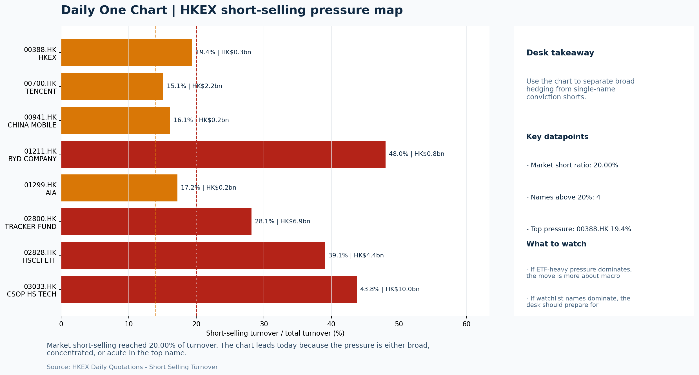

# Morning Research Workbench | 2026-07-21

> Designed for a Hong Kong sell-side commute: Layer 1 `Scan`, Layer 2 `Deep Read`, Layer 3 `Thinking`
> Mode: `Trading Daily` | Keep the report execution-oriented: what mattered in the completed session, what can move Hong Kong leadership, and what needs fast follow-up.
> Briefing date: `2026-07-21` | Review date: `2026-07-20` | Global request: `2026-07-20` | HK/China request: `2026-07-20` | Market effective date: `2026-07-20` | Generated at: `2026-07-21 05:59:41`

## Executive Summary

- **Market pulse:** Hot US CPI and a +1.26% rise in the 10Y yield reinforced the Risk-Off tone that drove HSTECH -4.51%, but FXI +2.67% and selective southbound buying in BABA and Meituan offer a tentative.
- **Hong Kong lens:** Hong Kong growth / internet led. Short-selling activity at 20% and HSTECH's 4.51% decline create a high-inertia negative tone for the July 21 open.
- **Top catalysts:** INTC -6.33%; Risk-Off backdrop with USD range-bound, higher yields pressured valuations, and Bitcoin outperformed Oil.

## Visual Dashboard

## Layer 1 | Scan (5-10 min)

### 1.1 One-Line Market Pulse
Hot US CPI and a +1.26% rise in the 10Y yield reinforced the Risk-Off tone that drove HSTECH -4.51%, but FXI +2.67% and selective southbound buying in BABA and Meituan offer a tentative anchor for today's Hong Kong open.

### 1.2 Global Asset Price Dashboard

| Asset | Last | 1D move | Read |
| --- | --- | --- | --- |
| S&P 500 | 7,443.28 | -0.19% | US large-cap risk appetite |
| Nasdaq 100 | 28,604.23 | +0.04% | Growth and duration leadership |
| Hang Seng Index | 24,562.24 | **-1.78%** | Hong Kong broad beta |
| Hang Seng TECH | 4.5340 | **-4.51%** | Hong Kong growth / platform read-through |
| CSI 300 | 4,529.10 | **-3.60%** | Mainland large-cap tone |
| US 10Y | 4.5980 | +1.26% | Global discount-rate anchor |
| China 10Y | 1.75% | +0.5bp | China local rates anchor \| Live public \| Eastmoney \| 2026-07-20 |
| CN-US 10Y spread | -285.5bp | -4.5bp | Relative carry and macro-pressure gauge \| Live public \| Eastmoney \| 2026-07-20 |
| DXY | 101.00 | +0.24% | Dollar liquidity impulse |
| USD/CNH | 6.7435 | +0.00% | Offshore China risk appetite |
| USD/HKD | 7.8406 | +0.00% | Linked-exchange regime stress check |
| Brent crude | 88.92 | +0.93% | Energy / geopolitics |
| COMEX gold | 4,011.80 | -0.02% | Hedge demand / real yields |
| Copper | 6.3405 | **+1.94%** | Global growth proxy |
| VIX | 18.65 | -0.64% | US stress barometer |

### 1.3 Hong Kong Key Data Quick Check

| Check | Value | Status | Source / as of | Why it matters |
| --- | --- | --- | --- | --- |
| Main Board turnover vs 20D | 0.92x \| -8% vs 20D | Live local | HKEX \| 2026-07-20 | Trailing 20-session average turnover was HK$332.7bn. |
| Southbound / Northbound net flow | Southbound Net HK$-6.0bn \| turnover HK$125.1bn \| Northbound Turnover HK$430.0bn \| net not reported | Live local | HKEX Connect \| 2026-07-20 | Southbound net buy is calculated from HKEX disclosed buy and sell turnover. |
| Short-selling ratio | 20.00% | Live local | HKEX \| 2026-07-20 | Official HKEX stock-level short-selling table, aggregated as a share of total market turnover. |
| AH premium index | 37.52% | Live public | Yahoo \| 2026-07-20 | Simple average across 18 A/H pairs; use dispersion rather than the average alone. |
| USD/HKD spot vs band | 7.8406 \| band 7.7500 to 7.8500 | Live quote + local | Yahoo \| 2026-07-20 | Inside the linked-exchange band without immediate boundary stress. Official Convertibility Undertakings define the linked-rate stress boundaries for USD/HKD. |
| HIBOR 1M | 2.75% | Live local | HKMA \| 2026-07-20 | 1M HIBOR is the cleanest quick read for Hong Kong funding conditions and equity-duration pressure. |
| Aggregate Balance | HK$54.5bn | Live local | HKMA \| 2026-07-20 | Aggregate Balance helps frame whether linked-rate liquidity conditions are tight or comfortable. |
| Hong Kong leadership | Hong Kong growth / internet led | Proxy | HSI / HSCEI / HSTECH relative perf \| 2026-07-20 | Use HSI / HSCEI / HSTECH relative moves as the opening style read. |

### 1.4 Risk Dashboard
**Composite risk score:** `37.7/100` | **Regime:** `Mixed`

| Component | Score impact | Evidence |
| --- | --- | --- |
| US beta | -1.1 | S&P 500 -0.19% |
| HK growth | -10 | HSTECH -4.51% |
| Offshore China proxy | +8 | FXI +2.67% |
| Dollar pressure | -2.4 | DXY +0.24% |
| Volatility | +1.3 | VIX -0.64% |
| HK short-selling | -8 | Short-selling ratio 20.00% |

### 1.5 Morning Checklist
1. **INTC -6.33%**
 Mover attribution | Announcement / expectations | Guidance reset and margin pressure
2. **Risk-Off backdrop with USD range-bound, higher yields pressured valuations, and Bitcoin outperformed Oil**
 Overnight regime | Start by deciding whether the day is about Risk-Off conditions or a style pivot.
3. **CPI MoM (Released)**
 Macro / policy | Rates expectations, the dollar, and growth-equity valuation | Industries: Technology, Internet, Brokers
4. **Trade Balance (Released)**
 Macro / policy | Watch whether it changes the day's core market narrative | Industries: Market-wide
5. **Retail Sales MoM (Upcoming)**
 Macro / policy | Consumer resilience, growth expectations, and risk-asset pricing | Industries: Consumer, E-commerce, Consumer discretionary

## Layer 2 | Deep Read (20-30 min)

### 2.1 Overnight Overseas Market Review
#### Market Setup
**Core tape.** Hong Kong equities sold off sharply on July 20 with the Hang Seng Index -1.78% and Hang Seng TECH -4.51%, driven by elevated short-selling (20% of turnover) and a +1.26% spike in US 10Y yields pressuring long-duration.
**Main driver.** The S&P 500 was essentially flat (-0.19%) while the Nasdaq eked out +0.04%, indicating the move was not US-led but rather local positioning driven by elevated short activity.
**HK relevance.** Bitcoin outperformed oil by 2.57 percentage points, a cross-asset divergence that aligns with the Risk-Off framing from attribution_v1, where the dominant drag factors were short-selling pressure (score 3.5) and the rates.

#### Key Drivers
- HKEX short-selling ratio of 20% argues for extra confirmation before chasing any intraday rebounds, as elevated short activity.
- US 10Y yield +1.26% to 4.598% directly pressured HSTECH (-4.51%), the most rate-sensitive sub-index, consistent with attribution_v1's.
- FXI +2.67% despite local weakness signals offshore demand for China exposure.
- China auto sales down 20% reinforces a downbeat consumer narrative and directly pressures auto-dealer and consumer-discretionary H-shares.

#### Hong Kong Read-Through
**Desk lens.** State-owned / old-economy H-shares led.
**Opening implication.** Short-selling activity at 20% and HSTECH's 4.51% decline create a high-inertia negative tone for the July 21 open.
- **Cross-market read:** Hang Seng -1.78% / HSCEI -2.18% / HSTECH -4.51%.
- **Cross-market read:** Offshore China proxy FXI +2.67% and USD/CNH +0.00% frame cross-border risk appetite.
- **Cross-market read:** USD/HKD last traded around 7.8406, which keeps the Hong Kong funding lens in focus.

#### Watch Points
- USD composite moved higher by +0.04pct intraday, with a 0.183pct range.
- Main turning points appeared around 2026-07-20 08:05 trough / 2026-07-20 08:25 trough / 2026-07-20 08:40 trough, suggesting event-driven repricing.
- The biggest cross-asset divergence was Bitcoin versus Oil, a spread of 2.571pct.
- Gold moved -0.46pct intraday with a 0.965pct high-low range.

**Curated overnight stories**
1. **Stocks making the biggest moves premarket: AMD, SpaceX, Domino's Pizza, Alibaba & more**
 Why it matters: Alibaba is a bellwether for China internet sentiment, and its inclusion in a broad premarket movers list can influence overnight ADR pricing and next-day positioning in Hong.
 HK read-through: Most relevant for Hong Kong internet and growth sentiment; may modestly support or stabilize the China Internet sector early in the session.
2. **China's car market heads for worst year since 2021 as sales plunge 20%**
 Why it matters: The 20% sales drop points to persistent consumer weakness and margin pressure in a sector with high fixed costs; it reinforces the downbeat consumer narrative.
 HK read-through: Directly affects China consumer and auto sector sentiment; carries less weight in Hong Kong's benchmark indices but can pressure auto-dealer and consumer-discretionary names.

### 2.2 Hong Kong / A-share Previous-Day Review
#### Local Tape Setup
**Local read.** Hang Seng TECH (-4.51%) led the decline on July 20 while HSCEI (-2.18%) underperformed HSI (-1.78%), confirming a growth-led sell-off in a Risk-Off session that was not US-driven given S&P 500 flat (-0.19%) and Nasdaq.
**Verification point.** The critical cross-market divergence is FXI +2.67% versus the broad HK decline.
**Risk to watch.** Short-selling at 20% of turnover with HSCEI ETF (2828.HK) short value of HK$4.37bn reinforces high-inertia downside; any rebound attempt requires cleaner breadth and southbound reversal from the HK$-6.0bn net sell.

#### Style and Local Leadership
**Style leadership.** Hong Kong growth / internet led.
- **Cross-market read:** Hang Seng -1.78% / HSCEI -2.18% / HSTECH -4.51%.
- **Cross-market read:** Offshore China proxy FXI +2.67% and USD/CNH +0.00% frame cross-border risk appetite.
- **Cross-market read:** USD/HKD last traded around 7.8406, which keeps the Hong Kong funding lens in focus.

#### Flow Confirmation
Official Stock Connect evidence is available; use Section 2.3 to confirm whether local money supports the price action.

#### Follow-Through Checklist
**Follow-through check.** Watch whether FXI +2.67% is validated by CSI 300 futures and whether HSTECH short-covering (vs FXI leadership) returns on July 21; also track southbound to see if the HK$-6.0bn net sell reverses above HK$-3.0bn, which would signal domestic positioning shift.

### 2.3 Flow Tracker and Attribution
#### Cross-Asset Attribution v1

| Driver | Direction | Score | Evidence | HK implication |
| --- | --- | --- | --- | --- |
| Short-selling pressure | drag | 3.5 | HKEX short-selling ratio was 20.00%. | Elevated short activity argues for extra confirmation before chasing rebounds. |
| Rates impulse | drag | 1.51 | US 10Y yield proxy moved +1.26%. | Lower yields help long-duration growth; higher yields pressure valuation-sensitive |

#### Flow Tracker
##### Flow Takeaways
- Short-selling pressure is elevated, so local rebounds need cleaner breadth and flow confirmation.
- Stock Connect Southbound: net HK$-6.0bn on turnover HK$125.1bn (as of 2026-07-20).
- Stock Connect Northbound: turnover RMB430.0bn; public file provides total turnover/top active names, not full net-buy.
- AH premium: simple covered-pair average +37.52%; widest premium: China Communications Construction 89.56%.

##### Stock Connect Southbound Active Names

| Rank | Ticker | Name | Buy | Sell | Net buy |
| --- | --- | --- | --- | --- | --- |
| 4 | 02800.HK | TRACKER FUND | HK$117.7mn | HK$5,305.2mn | HK$-5,187.5mn |
| 1 | 09988.HK | BABA-W | HK$5,157.4mn | HK$3,293.9mn | HK$1,863.5mn |
| 9 | 09999.HK | NTES | HK$1,411.6mn | HK$2.8mn | HK$1,408.7mn |
| 8 | 03033.HK | CSOP HS TECH | HK$242.3mn | HK$1,521.1mn | HK$-1,278.8mn |
| 2 | 00700.HK | TENCENT | HK$3,862.2mn | HK$4,442.6mn | HK$-580.4mn |

##### AH Premium Dispersion

| Name | A ticker | H ticker | Premium | As of |
| --- | --- | --- | --- | --- |
| China Communications Construction | 601800.SS | 1800.HK | +89.56% | 2026-07-20 |
| China Life | 601628.SS | 2628.HK | +72.25% | 2026-07-20 |
| China Railway Construction | 601186.SS | 1186.HK | +59.23% | 2026-07-20 |
| New China Life | 601336.SS | 1336.HK | +58.79% | 2026-07-20 |
| China Railway | 601390.SS | 0390.HK | +48.11% | 2026-07-20 |

##### HKEX Short-Selling Watch

| Ticker | Name | Short ratio | Short turnover | Total turnover |
| --- | --- | --- | --- | --- |
| 00388.HK | HKEX | 19.43% | HK$0.3bn | HK$1.4bn |
| 00700.HK | TENCENT | 15.13% | HK$2.2bn | HK$14.7bn |
| 00941.HK | CHINA MOBILE | 16.10% | HK$0.2bn | HK$1.0bn |
| 01211.HK | BYD COMPANY | 48.02% | HK$0.8bn | HK$1.7bn |
| 01299.HK | AIA | 17.20% | HK$0.2bn | HK$1.3bn |

- **Short-value leaders:** 03033.HK CSOP HS TECH (HK$10.0bn); 02800.HK TRACKER FUND (HK$6.9bn); 02828.HK HSCEI ETF (HK$4.4bn); 09988.HK BABA-W (HK$3.1bn).

### 2.4 Macro and Policy Tracking
**Desk read.** The completed session confirms a Risk-Off regime with USD range-bound and higher yields pressuring growth valuations.

**Market sensitivity.** US 10Y at 4.598% (+1.26%) is the clearest near-term risk for Hong Kong tech and long-duration proxies.

**HK implication.** The CPI release at 20:30 HKT on July 21 came in hot at 0.3% MoM versus 0.2% forecast, repricing rate expectations and strengthening the dollar.

**Macro watchpoints**
- US 10Y yield follow-through above 4.60% and its impact on HSI tech and growth proxies.
- DXY response to CPI and whether it extends the range-bound dollar pressure on HK assets.
- Whether China Trade Balance strength translates to H-shares leadership or remains a headline-only response.
- Powell tone at 22:00 HKT - hawkish lean after hot CPI could trigger early Asia session repricing.

| Time | Region | Event | Status | Desk read |
| --- | --- | --- | --- | --- |
| 20:30 | US | CPI MoM | Released | Impact: Rates expectations, the dollar, and growth-equity valuation \| Attention: 5/5 \| Industries: Technology, Internet, Brokers |
| 09:30 | China | Trade Balance | Released | Impact: Watch whether it changes the day's core market narrative \| Attention: 3/5 \| Industries: Market-wide |
| 20:30 | US | Retail Sales MoM | Upcoming | Impact: Consumer resilience, growth expectations, and risk-asset pricing \| Attention: 5/5 \| Industries: Consumer, E-commerce, Consumer discretionary |
| 09:20 | China | Loan Prime Rate | Upcoming | Impact: Watch whether it changes the day's core market narrative \| Attention: 3/5 \| Industries: Market-wide |
| 22:00 | Federal Reserve | Jerome Powell: Economic outlook remarks | Central bank | Impact: Policy path, liquidity conditions, and cross-asset risk appetite \| Attention: 5/5 \| Industries: Technology, Financials, Gold |
| 10:00 | PBOC | Open Market Operations Desk: Daily liquidity operation window | Central bank | Impact: Policy path, liquidity conditions, and cross-asset risk appetite \| Attention: 3/5 \| Industries: Technology, Financials, Gold |

#### Positioning and Risk Backdrop
- Options activity centered on KWEB Call, with Vol/OI at 1.88x and a bullish bias.
- Put/Call structure shows equity 0.68 / index 1.15, implying Single-stock optimism with index hedging.
- Geopolitics: Middle East | Regional tension remains elevated | Impact: Oil, freight costs, and safe-haven demand
- Geopolitics: US-China | Technology export-control rhetoric remains active | Impact: China internet, semiconductors, and supply chains

### 2.5 Key Company and Sector Events

| Grade | Sector | Headline | Why it matters | Horizon |
| --- | --- | --- | --- | --- |
| B | China Internet | Stocks making the biggest moves premarket | Assess whether the story can propagate through the China Internet value | Monitor |

#### HKEX Announcements

| Grade | Ticker | Type | Release time | Title |
| --- | --- | --- | --- | --- |
| A | 00408.HK | Profit warning | 2026-07-20 | Profit warning / alert announcement |
| A | 00694.HK | Profit warning | 2026-07-20 | Profit warning / alert announcement |
| A | 00842.HK | Profit warning | 2026-07-20 | Profit warning / alert announcement |
| A | 01133.HK | Profit warning | 2026-07-20 | Profit warning / alert announcement |
| A | 01825.HK | Profit warning | 2026-07-20 | Profit warning / alert announcement |
| A | 02131.HK | Profit warning | 2026-07-20 | Profit warning / alert announcement |
| A | 02166.HK | Profit warning | 2026-07-20 | Profit warning / alert announcement |
| A | 02197.HK | Profit warning | 2026-07-20 | Profit warning / alert announcement |

#### Earnings / Results Watch

| Ticker | Company | Timing | Expectation framing |
| --- | --- | --- | --- |
| 0700.HK | Tencent Holdings | After Market Close | EPS est. 4.15 HKD \| revenue est. 163.2bn HKD |
| 0388.HK | Hong Kong Exchanges and Clearing | Before Market Open | EPS est. 2.81 HKD \| revenue est. 6.0bn HKD |

#### Rating Changes
- **9988.HK** | Morgan Stanley | Upgrade | Equal Weight -> Overweight | PT 92 -> 105

#### IPO Watch
- IPO and grey-market monitoring is not yet part of the standard production pack.

### 2.6 Today's Core Names
#### Core coverage

| Name | Ticker | Last | 1D | Range position | Morning note |
| --- | --- | --- | --- | --- | --- |
| Alibaba | 9988.HK | 116.80 | +3.73% | Mid-range | Short-term price strength is clear; fresh catalysts could trigger broader group follow-through. |
| Tencent | 0700.HK | 477.80 | +3.51% | Top of range | Short-term price strength is clear; fresh catalysts could trigger broader group follow-through. |

**Recent headlines for Tencent:**
- [Chinese AI Sensation Moonshot's Gamble on Big Models Pays Off](https://finance.yahoo.com/technology/ai/articles/chinese-ai-sensation-moonshot-gamble-131433262.html) (Bloomberg)

#### Priority follow-up

| Name | Ticker | Last | 1D | Range position | Morning note |
| --- | --- | --- | --- | --- | --- |
| BYD Company | 1211.HK | 90.15 | +1.63% | Mid-range | Positioning is neutral for now, so use it mainly to monitor marginal information changes. |
| China Mobile | 0941.HK | 80.80 | +1.06% | Mid-range | Positioning is neutral for now, so use it mainly to monitor marginal information changes. |

**Recent headlines for China Mobile:**
- [China Mobile (SEHK:941): A Closer Look at Valuation After Steady Share Price Gains This Year](https://finance.yahoo.com/news/china-mobile-sehk-941-closer-154022664.html) (Simply Wall St.)

## Layer 3 | Thinking (10-15 min)

### 3.1 Rotating Theme Deep Dive

| Field | Read |
| --- | --- |
| Theme | China Consumption Recovery |
| Angle for the day | Focus on whether travel, retail, internet local services, and premium consumption data still support a demand-repair narrative. |

**Theme desk read**
**Core thesis.** The China Consumption Recovery theme faces a near-term credibility test.
**Evidence.** In a Risk‑Off backdrop where higher US yields pressure growth valuations, Meituan's +3.17% rise to the top of its range looks vulnerable to any miss on the catalyst.
**What to test.** The Uber/Delivery Hero deal highlights global consolidation but offers no direct read-across, leaving tomorrow's US Retail Sales data as the second key event that will either reinforce or challenge the consumption-repair.

**Signals to keep in mind**
- China's car market heads for worst year since 2021 as sales plunge 20%: Assess whether the story can propagate through the Consumer value
- Copper +1.94%: Keep tracking it to confirm whether the core daily narrative is holding.
- US 10Y +1.26%: Higher yields can pressure long-duration and growth valuations.

**LLM watch items:**
- Meituan order trends and margin commentary (2026-07-21)
- US Retail Sales MoM release (2026-07-21 20:30 HKT)
- Whether China car sales weakness propagates into other consumer sub-sectors
- US 10Y yield trajectory and its pressure on Hong Kong Internet valuations
- Copper price strength versus consumption softness as a cross-asset signal

**Related names to keep close:**

| Name | Ticker | Bucket | Morning read |
| --- | --- | --- | --- |
| Meituan | 3690.HK | Core coverage | Short-term price strength is clear; fresh catalysts could trigger broader group follow-through. |

**Upcoming catalysts tied to the theme:**
- 2026-07-21 | Meituan: Order trends and margin commentary | High-frequency read on local services demand and platform competition
- 2026-07-21 | Retail Sales MoM | Consumer resilience, growth expectations, and risk-asset pricing

**Relevant headlines:**
- [China's car market heads for worst year since 2021 as sales plunge 20%](https://www.cnbc.com/2026/07/20/china-automotive-car-worst-year-sales-fall-20percent.html)

### 3.2 Today Ahead and Trading Calendar
- Macro: CPI MoM is the first item to anchor the open and the rates/FX response.
- Corporate / event: Alibaba: Cloud demand and GMV updates is the cleanest same-day catalyst to prepare for.

**Same-day macro docket**

| Time | Country | Event | Status | Detail |
| --- | --- | --- | --- | --- |
| 20:30 | US | CPI MoM | Released | Actual 0.3% / Forecast 0.2% / Prior 0.4% |
| 09:30 | China | Trade Balance | Released | Actual USD 85.2bn / Forecast USD 79.0bn / Prior USD 80.6bn |
| 20:30 | US | Retail Sales MoM | Upcoming | Forecast 0.3% / Prior 0.6% |
| 09:20 | China | Loan Prime Rate | Upcoming | Forecast 3.45% / Prior 3.45% |
| 22:00 | Federal Reserve | Jerome Powell: Economic outlook remarks | Central bank | speech |

**Same-day catalyst list**

| Date | Time | Category | Event | Importance |
| --- | --- | --- | --- | --- |
| 2026-07-21 | | Core coverage | Alibaba: Cloud demand and GMV updates | 3 |
| 2026-07-21 | | Core coverage | Tencent: Game grossing trends and ad-demand checks | 3 |
| 2026-07-21 | | Core coverage | Meituan: Order trends and margin commentary | 3 |
| 2026-07-21 | | Core coverage | HKEX: Turnover data and IPO pipeline updates | 3 |

**Next few sessions**

| Date | Category | Event | Impact |
| --- | --- | --- | --- |
| 2026-07-21 | Core coverage | Alibaba: Cloud demand and GMV updates | Key read-through for China consumption, cloud, and platform regulation |
| 2026-07-21 | Core coverage | Tencent: Game grossing trends and ad-demand checks | Core offshore China platform proxy for gaming, ads, and AI monetization |
| 2026-07-21 | Core coverage | Meituan: Order trends and margin commentary | High-frequency read on local services demand and platform competition |
| 2026-07-21 | Core coverage | HKEX: Turnover data and IPO pipeline updates | Direct proxy for Hong Kong market turnover, listings, and southbound |

### 3.3 Daily One Chart
**Daily One Chart | HKEX short-selling pressure map**

**Chart read.** Market short-selling reached 20.00% of turnover.
**Why it matters.** The chart leads today because the pressure is either broad, concentrated, or acute in the top name.

_Source: HKEX Daily Quotations - Short Selling Turnover_

## Traceable Appendix

### Report Metadata
> Date policy: Review date 2026-07-20 is treated as `Trading Daily`. | Global request date is 2026-07-20; adapter effective date is 2026-07-20 and summary date is 2026-07-20. | HK/China local data date is 2026-07-20; role: same-session local cash tape.
> Market data quality: Coverage: `31/32` | Stale items (>1d): `6` | Missing: `1`
> Report quality: `88.7/100` | Grade `B` | Status `production ready`

### Key Questions to Keep in Mind
- Is risk appetite rising or fading? The overnight tape reads closer to `Risk-Off`.
- Did rates expectations move? Focus on whether US 10Y, DXY, and growth style moved together.
- Were commodities the real story? Watch WTI and gold for geopolitics versus inflation signals.
- Is Hong Kong setup internet-led, SOE-led, or broad beta-led? Compare HSTECH, HSCEI, and HSI.
- Did offshore markets move China risk appetite? Focus on HSI, FXI, USD/CNH, and USD/HKD.

### Report Quality and Validation
- **Quality score:** 88.7/100 | **Grade:** B | **Status:** production ready
- **Run summary:** 7 healthy | 1 caveat | 0 failed
- **Release recommendation:** Send with caveats | The report is usable, but the advisory guidance should travel with it so readers understand the data gaps.

| Source | Status | Bucket |
| --- | --- | --- |
| Market data | ok | healthy |
| Sector and company news | ok | healthy |
| Movers and short selling | ok | healthy |
| Stock Connect | ok | healthy |
| A/H premium | ok | healthy |
| Hong Kong local package | ok | healthy |
| China rates | ok | healthy |
| Narrative overlay | partial | caveat |

**Desk-use guidance summary:** 0 blocking | 1 advisory

**Desk-use guidance**
- **Advisory:** Use deterministic sections as primary support; the narrative overlay was partial or unavailable on this run.

| Component | Score | Weight | Read |
| --- | --- | --- | --- |
| Market data coverage | 96.9 | 0.3 | 31/32 core market fields available. |
| Hong Kong local metrics | 82.3 | 0.25 | 8 live, 3 proxy, 0 unavailable local checks. |
| Key public adapters | 100.0 | 0.2 | 4/4 key adapters were available or partially available. |
| Narrative overlay health | 60.0 | 0.15 | 3/7 narrative overlay tasks succeeded or used validated cache; 1 error(s). |
| Fact-check guardrail | 100.0 | 0.1 | Checked 2 numeric claims; 0 numeric mismatch(es), 0 logic warning(s); 0 critical, 0 review. |

**Narrative fact-check guardrail**
- Checked 2 numeric claims; 0 numeric mismatch(es), 0 logic warning(s); 0 critical, 0 review.

**Adapter status**

| Adapter | Status |
| --- | --- |
| Stock Connect | ok |
| A/H premium | ok |
| HKEX announcements | ok |
| China rates | ok |

### Source Links
- [Stocks making the biggest moves premarket: AMD, SpaceX, Domino's Pizza, Alibaba & more](https://www.cnbc.com/2026/07/20/stocks-making-the-biggest-moves-premarket-amd-spcx-dpz.html) (cnbc_markets)
- [Chinese AI Sensation Moonshot's Gamble on Big Models Pays Off](https://finance.yahoo.com/technology/ai/articles/chinese-ai-sensation-moonshot-gamble-131433262.html) (Bloomberg)
- [Uber bids $15 billion for Delivery Hero to form global takeout giant](https://finance.yahoo.com/video/uber-bids-15-billion-delivery-141845111.html) (Reuters Videos)
- [China Mobile (SEHK:941): A Closer Look at Valuation After Steady Share Price Gains This Year](https://finance.yahoo.com/news/china-mobile-sehk-941-closer-154022664.html) (Simply Wall St.)
- [00408.HK Profit warning / alert announcement](http://www1.hkexnews.hk/listedco/listconews/sehk/2026/0720/2026072000937.pdf) (HKEXnews)
- [00694.HK Profit warning / alert announcement](http://www1.hkexnews.hk/listedco/listconews/sehk/2026/0720/2026072000794.pdf) (HKEXnews)
- [00842.HK Profit warning / alert announcement](http://www1.hkexnews.hk/listedco/listconews/sehk/2026/0720/2026072000273.pdf) (HKEXnews)
- [01133.HK Profit warning / alert announcement](http://www1.hkexnews.hk/listedco/listconews/sehk/2026/0720/2026072001041.pdf) (HKEXnews)
- [01825.HK Profit warning / alert announcement](http://www1.hkexnews.hk/listedco/listconews/sehk/2026/0720/2026072000931.pdf) (HKEXnews)
- [02131.HK Profit warning / alert announcement](http://www1.hkexnews.hk/listedco/listconews/sehk/2026/0720/2026072001373.pdf) (HKEXnews)
- [02166.HK Profit warning / alert announcement](http://www1.hkexnews.hk/listedco/listconews/sehk/2026/0720/2026072000774.pdf) (HKEXnews)
- [02197.HK Profit warning / alert announcement](http://www1.hkexnews.hk/listedco/listconews/sehk/2026/0720/2026072000027.pdf) (HKEXnews)

## Supplementary Visual Appendix

This appendix is professional-path only. It keeps a traceable index of the report visuals and the deterministic chart cues used to frame the morning note, without injecting the legacy intraday chart pack.

### Visual Index

| Visual | Path | Role |
| --- | --- | --- |
| Visual Dashboard | `charts/dashboard_2026-07-21.png` | Cross-asset regime board and Hong Kong local tape snapshot. |
| Daily One Chart | `charts/daily_one_chart_2026-07-21.png` | Single highest-conviction visual story for the day. |

### Deterministic Chart Cues
- FX / liquidity: USD composite moved higher by +0.04pct intraday, with a 0.183pct range.
- FX / liquidity: Main turning points appeared around 2026-07-20 08:05 trough / 2026-07-20 08:25 trough / 2026-07-20 08:40 trough, suggesting event-driven repricing rather than a clean one-way USD move.
- Cross-asset: The biggest cross-asset divergence was Bitcoin versus Oil, a spread of 2.571pct.
- Cross-asset: Gold moved -0.46pct intraday with a 0.965pct high-low range.
- Cross-asset: Oil moved -1.55pct intraday with a 5.22pct high-low range.
- Cross-asset: Bitcoin moved +1.02pct intraday with a 2.99pct high-low range.

### Risk Dashboard Components

| Component | Score impact | Evidence |
| --- | --- | --- |
| US beta | -1.1 | S&P 500 -0.19% |
| HK growth | -10 | HSTECH -4.51% |
| Offshore China proxy | +8 | FXI +2.67% |
| Dollar pressure | -2.4 | DXY +0.24% |
| Volatility | +1.3 | VIX -0.64% |
| HK short-selling | -8 | Short-selling ratio 20.00% |
