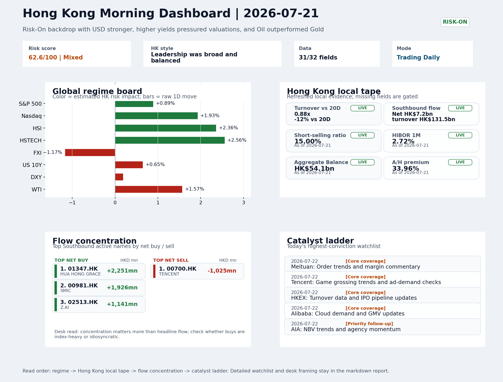
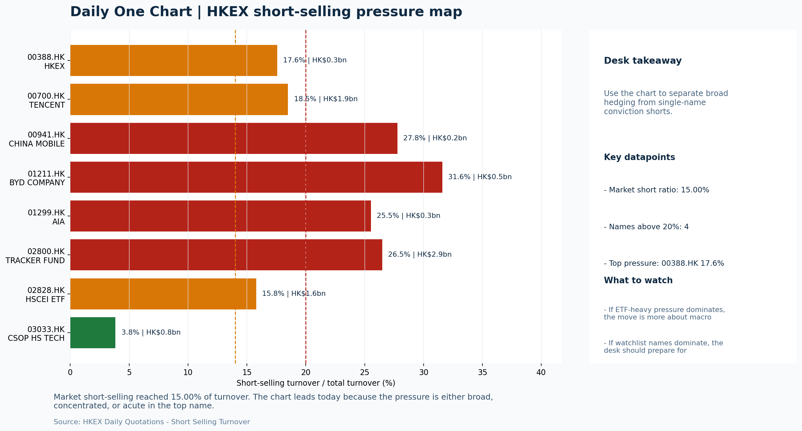

# Morning Research Workbench | 2026-07-22

> Designed for a Hong Kong sell-side commute: Layer 1 `Scan`, Layer 2 `Deep Read`, Layer 3 `Thinking`
> Mode: `Trading Daily` | Keep the report execution-oriented: what mattered in the completed session, what can move Hong Kong leadership, and what needs fast follow-up.
> Briefing date: `2026-07-22` | Review date: `2026-07-21` | Global request: `2026-07-21` | HK/China request: `2026-07-21` | Market effective date: `2026-07-21` | Generated at: `2026-07-22 06:03:30`

## Executive Summary

- **Market pulse:** Nasdaq gains and a VIX collapse set a constructive tone, but light Hong Kong turnover and FXI underperformance mean the HSI bounce tests low-conviction participation rather than durable.
- **Hong Kong lens:** Hong Kong growth / internet led. HSTECH +2.56% and the Nasdaq lead set up a constructive open for Hong Kong growth and internet names, but light turnover and FXI underperformance mean the move lacks conviction.
- **Top catalysts:** VIX -8.58%; INTC -6.33%.

## Visual Dashboard

## Layer 1 | Scan (5-10 min)

### 1.1 One-Line Market Pulse
Nasdaq gains and a VIX collapse set a constructive tone, but light Hong Kong turnover and FXI underperformance mean the HSI bounce tests low-conviction participation rather than durable risk appetite.

### 1.2 Global Asset Price Dashboard

| Asset | Last | 1D move | Read |
| --- | --- | --- | --- |
| S&P 500 | 7,509.20 | +0.89% | US large-cap risk appetite |
| Nasdaq 100 | 29,155.18 | **+1.93%** | Growth and duration leadership |
| Hang Seng Index | 25,143.05 | **+2.36%** | Hong Kong broad beta |
| Hang Seng TECH | 4.6500 | **+2.56%** | Hong Kong growth / platform read-through |
| CSI 300 | 4,529.10 | **-3.60%** | Mainland large-cap tone |
| US 10Y | 4.6280 | +0.65% | Global discount-rate anchor |
| China 10Y | 1.75% | -0.0bp | China local rates anchor \| Live public \| Eastmoney \| 2026-07-21 |
| CN-US 10Y spread | -288.5bp | -3.0bp | Relative carry and macro-pressure gauge \| Live public \| Eastmoney \| 2026-07-21 |
| DXY | 101.18 | +0.19% | Dollar liquidity impulse |
| USD/CNH | 6.7435 | +0.00% | Offshore China risk appetite |
| USD/HKD | 7.8406 | +0.01% | Linked-exchange regime stress check |
| Brent crude | 91.44 | **+2.49%** | Energy / geopolitics |
| COMEX gold | 4,082.20 | **+1.79%** | Hedge demand / real yields |
| Copper | 6.5295 | **+3.66%** | Global growth proxy |
| VIX | 17.05 | **-8.58%** | US stress barometer |

### 1.3 Hong Kong Key Data Quick Check

| Check | Value | Status | Source / as of | Why it matters |
| --- | --- | --- | --- | --- |
| Main Board turnover vs 20D | 0.88x \| -12% vs 20D | Live local | HKEX \| 2026-07-21 | Trailing 20-session average turnover was HK$330.1bn. |
| Southbound / Northbound net flow | Southbound Net HK$7.2bn \| turnover HK$131.5bn \| Northbound Turnover HK$439.4bn \| net not reported | Live local | HKEX Connect \| 2026-07-21 | Southbound net buy is calculated from HKEX disclosed buy and sell turnover. |
| Short-selling ratio | 15.00% | Live local | HKEX \| 2026-07-21 | Official HKEX stock-level short-selling table, aggregated as a share of total market turnover. |
| AH premium index | 33.96% | Live public | Yahoo \| 2026-07-21 | Simple average across 17 A/H pairs; use dispersion rather than the average alone. |
| USD/HKD spot vs band | 7.8406 \| band 7.7500 to 7.8500 | Live quote + local | Yahoo \| 2026-07-21 | Inside the linked-exchange band without immediate boundary stress. Official Convertibility Undertakings define the linked-rate stress boundaries for USD/HKD. |
| HIBOR 1M | 2.72% | Live local | HKMA \| 2026-07-21 | 1M HIBOR is the cleanest quick read for Hong Kong funding conditions and equity-duration pressure. |
| Aggregate Balance | HK$54.1bn | Live local | HKMA \| 2026-07-21 | Aggregate Balance helps frame whether linked-rate liquidity conditions are tight or comfortable. |
| Hong Kong leadership | Hong Kong growth / internet led | Proxy | HSI / HSCEI / HSTECH relative perf \| 2026-07-21 | Use HSI / HSCEI / HSTECH relative moves as the opening style read. |

### 1.4 Risk Dashboard
**Composite risk score:** `62.6/100` | **Regime:** `Mixed`

| Component | Score impact | Evidence |
| --- | --- | --- |
| US beta | +5.3 | S&P 500 +0.89% |
| HK growth | +10 | HSTECH +2.56% |
| Offshore China proxy | -5.8 | FXI -1.17% |
| Dollar pressure | -1.9 | DXY +0.19% |
| Volatility | +10 | VIX -8.58% |
| HK short-selling | +0 | Short-selling ratio 15.00% |

### 1.5 Morning Checklist
1. **VIX -8.58%**
 High-frequency data | Lower volatility signals easing stress in the tape.
2. **INTC -6.33%**
 Mover attribution | Announcement / expectations | Guidance reset and margin pressure
3. **Risk-On backdrop with USD stronger, higher yields pressured valuations, and Oil outperformed Gold**
 Overnight regime | Start by deciding whether the day is about Risk-On conditions or a style pivot.
4. **CPI MoM (Released)**
 Macro / policy | Rates expectations, the dollar, and growth-equity valuation | Industries: Technology, Internet, Brokers
5. **Trade Balance (Released)**
 Macro / policy | Watch whether it changes the day's core market narrative | Industries: Market-wide

## Layer 2 | Deep Read (20-30 min)

### 2.1 Overnight Overseas Market Review
#### Market Setup
**Core tape.** Risk-on sentiment drove Nasdaq +1.93% while S&P 500 gained +0.89%, though the VIX collapse (-8.58%) and a sharp copper rally (+3.66%) suggest this was more than a defensive bounce.
**Main driver.** US 10Y yields rose +0.65%, creating a tension between growth-style support and valuation headwinds that will test HK tech leadership at the open.
**HK relevance.** The offshore China proxy FXI (-1.17%) lagged the onshore proxies, and Hong Kong turnover was light at 0.88x the 20-session average.

#### Key Drivers
- Nasdaq 100 +1.93% and copper +3.66% signal demand-repair optimism rather than just defensive positioning.
- US 10Y yield +0.65% and DXY +0.19% kept the dollar stronger, which typically pressures EM and China growth valuations.
- VIX fell -8.58% to 17.05, reducing tail-risk hedging that could distort positioning into Wednesday.
- Intel guided down -6.33%, adding caution to semiconductor and tech supply chain names ahead of HK open.

#### Hong Kong Read-Through
**Desk lens.** Leadership was broad and balanced.
**Opening implication.** HSTECH +2.56% and the Nasdaq lead set up a constructive open for Hong Kong growth and internet names, but light turnover and FXI underperformance mean the move lacks conviction.
- **Cross-market read:** Hang Seng +2.36% / HSCEI +3.01% / HSTECH +2.56%.
- **Cross-market read:** Offshore China proxy FXI -1.17% and USD/CNH +0.00% frame cross-border risk appetite.
- **Cross-market read:** USD/HKD last traded around 7.8406, which keeps the Hong Kong funding lens in focus.

#### Watch Points
- USD composite moved higher by +0.20pct intraday, with a 0.239pct range.
- Main turning points appeared around 2026-07-21 08:05 peak / 2026-07-21 08:35 peak / 2026-07-21 08:55 peak, suggesting event-driven repricing rather.
- The biggest cross-asset divergence was Oil versus Gold, a spread of 2.297pct.
- Gold moved +0.72pct intraday with a 1.004pct high-low range.

**Curated overnight stories**
1. **INTC -6.33%: Guidance reset and margin pressure**
 Why it matters: Intel's guidance cut signals persistent competitive pressure in semis, which could propagate through tech supply chains and weigh on sentiment for technology and internet.
 HK read-through: Relevant for HK-listed tech names including semiconductor design houses and data center operators. Could add caution to growth/tech positioning heading into Wednesday.
2. **China's car market heads for worst year since 2021 as sales plunge 20%**
 Why it matters: A 20% sales collapse marks a material deterioration in Chinese consumer demand for autos. This follows record 2025 volumes, suggesting the pull-forward effect is reversing.
 HK read-through: Directly relevant for HK-listed EV and auto names (BYD, Li Auto, NIO). Also signals broader consumer sector stress that could affect retail and media platforms.
3. **VIX -8.58%: Lower volatility signals easing stress in the tape**
 Why it matters: A sharp VIX decline supports risk appetite and reduces tail-risk hedging that can distort positioning.
 HK read-through: Positive for HK growth and internet sentiment. Supports a risk-on tilt if sustained into the HK open.
4. **Stocks making the biggest moves premarket: AMD, SpaceX, Domino's Pizza, Alibaba & more**
 Why it matters: Alibaba appears among notable US premarket movers. While the move is not explained in this headline, Alibaba's HK listing (9988.HK) means any stateside catalyst - earnings.
 HK read-through: Most relevant for Alibaba (9988.HK) and broader HK internet sentiment. Traders should identify the specific driver before the HK open.
5. **CPI MoM and Trade Balance data released; Jamie Dimon warns markets underestimate risks**
 Why it matters: Released CPI and Trade Balance data now anchor Fed rate expectations. Dimon's explicit warning - that he would not buy stocks or Treasuries at current prices - adds a credible.
 HK read-through: Market-wide relevance. Stronger USD and higher yields from hawkish repricing would pressure HK equity valuations and China growth names disproportionately.

### 2.2 Hong Kong / A-share Previous-Day Review
#### Local Tape Setup
**Local read.** Hong Kong trading on July 21 showed HSCEI (+3.01%) outperforming HSTECH (+2.56%), meaning the index move was led by SOE and cyclical names rather than pure growth.
**Verification point.** Nasdaq 100's +1.93% translated into broad beta, but the offshore China proxy FXI fell -1.17%, pointing to weak dedicated China demand.
**Risk to watch.** Main Board turnover at 0.88x the 20-day average and a 15% short-selling ratio suggest the bounce lacks robust local conviction.

#### Style and Local Leadership
**Style leadership.** Hong Kong growth / internet led.
- **Cross-market read:** Hang Seng +2.36% / HSCEI +3.01% / HSTECH +2.56%.
- **Cross-market read:** Offshore China proxy FXI -1.17% and USD/CNH +0.00% frame cross-border risk appetite.
- **Cross-market read:** USD/HKD last traded around 7.8406, which keeps the Hong Kong funding lens in focus.

#### Flow Confirmation
Official Stock Connect evidence is available; use Section 2.3 to confirm whether local money supports the price action.

#### Follow-Through Checklist
**Follow-through check.** Watch whether HSTECH reclaims leadership on July 22 and whether Southbound net buying broadens to internet names (Tencent, Alibaba) to confirm the growth read. Also monitor USD/CNH stability; a rising CNH would pressure the SOE trade.

### 2.3 Flow Tracker and Attribution
#### Cross-Asset Attribution v1

| Driver | Direction | Score | Evidence | HK implication |
| --- | --- | --- | --- | --- |
| US growth-style transmission | supportive | 2.7 | Nasdaq 100 moved +1.93%. | Hong Kong growth and platform names should be tested first at the open. |
| Oil and geopolitics | mixed | 1.99 | Oil moved +2.49%. | Split the read between energy/cyclicals support and margin/geopolitical pressure. |
| Hong Kong participation | drag | 1.22 | Main Board turnover was 0.88x the 20-session average. | Thin turnover makes index moves easier to fade. |
| Global equity beta | supportive | 0.89 | S&P 500 moved +0.89%. | Broad beta matters if Hong Kong breadth confirms the overseas signal. |
| Rates impulse | drag | 0.78 | US 10Y yield proxy moved +0.65%. | Lower yields help long-duration growth; higher yields pressure valuation-sensitive |

#### Flow Tracker
##### Flow Takeaways
- Turnover is light versus the 20-session baseline, so local moves have weaker conviction.
- Stock Connect Southbound: net HK$7.2bn on turnover HK$131.5bn (as of 2026-07-21).
- Stock Connect Northbound: turnover RMB439.4bn; public file provides total turnover/top active names, not full net-buy.
- AH premium: simple covered-pair average +33.96%; widest premium: China Life 69.33%.

##### Stock Connect Southbound Active Names

| Rank | Ticker | Name | Buy | Sell | Net buy |
| --- | --- | --- | --- | --- | --- |
| 2 | 01347.HK | HUA HONG GRACE | HK$5,464.6mn | HK$3,213.7mn | HK$2,250.9mn |
| 1 | 00981.HK | SMIC | HK$6,879.0mn | HK$4,952.9mn | HK$1,926.1mn |
| 1 | 02513.HK | Z.AI | HK$6,295.8mn | HK$5,154.8mn | HK$1,141.0mn |
| 3 | 06869.HK | YOFC | HK$4,880.7mn | HK$3,836.5mn | HK$1,044.2mn |
| 6 | 00700.HK | TENCENT | HK$2,118.1mn | HK$3,143.6mn | HK$-1,025.5mn |

##### AH Premium Dispersion

| Name | A ticker | H ticker | Premium | As of |
| --- | --- | --- | --- | --- |
| China Life | 601628.SS | 2628.HK | +69.33% | 2026-07-21 |
| China Railway Construction | 601186.SS | 1186.HK | +58.18% | 2026-07-21 |
| New China Life | 601336.SS | 1336.HK | +55.23% | 2026-07-21 |
| China Communications Construction | 601800.SS | 1800.HK | +52.53% | 2026-07-21 |
| China Railway | 601390.SS | 0390.HK | +45.58% | 2026-07-21 |

##### HKEX Short-Selling Watch

| Ticker | Name | Short ratio | Short turnover | Total turnover |
| --- | --- | --- | --- | --- |
| 00388.HK | HKEX | 17.57% | HK$0.3bn | HK$1.7bn |
| 00700.HK | TENCENT | 18.49% | HK$1.9bn | HK$10.2bn |
| 00941.HK | CHINA MOBILE | 27.79% | HK$0.2bn | HK$0.6bn |
| 01211.HK | BYD COMPANY | 31.60% | HK$0.5bn | HK$1.4bn |
| 01299.HK | AIA | 25.52% | HK$0.3bn | HK$1.3bn |

- **Short-value leaders:** 02800.HK TRACKER FUND (HK$2.9bn); 07709.HK XL2CSOPHYNIX (HK$2.8bn); 09988.HK BABA-W (HK$2.7bn); 00981.HK SMIC (HK$2.0bn).

### 2.4 Macro and Policy Tracking
**Desk read.** The overnight US CPI beat (0.3% MoM vs 0.2% f/c) nudged yields higher and kept the dollar bid, but the broader risk-on tone held - VIX settled sharply lower at 17.05, copper rose, and both gold and bitcoin advanced.

**Market sensitivity.** For Hong Kong, this creates a tension between the supportive China trade surplus (USD 85.2bn, above forecast) and the lingering rate-sensitivity in growth sectors.

**HK implication.** The upcoming Retail Sales print and Powell's evening speech can quickly reprice the rate-and-dollar backdrop that is shaping today's opening setup.

**Macro watchpoints**
- US 10Y yield and DXY response to the CPI beat, as they set the funding-currency backdrop for HK liquidity.
- Whether Hong Kong Tech and Internet names hold their post-trade-data opening tone or fade on rate concerns.
- China Loan Prime Rate fix (f/c 3.45% unchanged) and PBOC liquidity operation for any easing signal.
- Powell's economic outlook remarks (22:00 HK) for forward policy clues that could shift the rate-path narrative.

| Time | Region | Event | Status | Desk read |
| --- | --- | --- | --- | --- |
| 20:30 | US | CPI MoM | Released | Impact: Rates expectations, the dollar, and growth-equity valuation \| Attention: 5/5 \| Industries: Technology, Internet, Brokers |
| 09:30 | China | Trade Balance | Released | Impact: Watch whether it changes the day's core market narrative \| Attention: 3/5 \| Industries: Market-wide |
| 20:30 | US | Retail Sales MoM | Upcoming | Impact: Consumer resilience, growth expectations, and risk-asset pricing \| Attention: 5/5 \| Industries: Consumer, E-commerce, Consumer discretionary |
| 09:20 | China | Loan Prime Rate | Upcoming | Impact: Watch whether it changes the day's core market narrative \| Attention: 3/5 \| Industries: Market-wide |
| 22:00 | Federal Reserve | Jerome Powell: Economic outlook remarks | Central bank | Impact: Policy path, liquidity conditions, and cross-asset risk appetite \| Attention: 5/5 \| Industries: Technology, Financials, Gold |
| 10:00 | PBOC | Open Market Operations Desk: Daily liquidity operation window | Central bank | Impact: Policy path, liquidity conditions, and cross-asset risk appetite \| Attention: 3/5 \| Industries: Technology, Financials, Gold |

#### Positioning and Risk Backdrop
- Options activity centered on KWEB Call, with Vol/OI at 1.88x and a bullish bias.
- Put/Call structure shows equity 0.68 / index 1.15, implying Single-stock optimism with index hedging.
- Geopolitics: Middle East | Regional tension remains elevated | Impact: Oil, freight costs, and safe-haven demand
- Geopolitics: US-China | Technology export-control rhetoric remains active | Impact: China internet, semiconductors, and supply chains

### 2.5 Key Company and Sector Events

| Grade | Sector | Headline | Why it matters | Horizon |
| --- | --- | --- | --- | --- |
| A | Autos and EV | Subprime Auto Dealer Goes From Covid-Era Rockstar to Near Demise | Capital allocation or shareholder-return events can trigger a valuation | Medium-term trend |
| B | China Internet | Stocks making the biggest moves premarket | Assess whether the story can propagate through the China Internet value | Monitor |

#### HKEX Announcements

| Grade | Ticker | Type | Release time | Title |
| --- | --- | --- | --- | --- |
| A | 00528.HK | Profit warning | 2026-07-21 | Profit warning / alert announcement |
| A | 00854.HK | Profit warning | 2026-07-21 | Profit warning / alert announcement |
| A | 00887.HK | Profit warning | 2026-07-21 | Profit warning / alert announcement |
| A | 01080.HK | Profit warning | 2026-07-21 | Profit warning / alert announcement |
| A | 01692.HK | Profit warning | 2026-07-21 | Profit warning / alert announcement |
| A | 01789.HK | Profit warning | 2026-07-21 | Profit warning / alert announcement |
| A | 01951.HK | Profit warning | 2026-07-21 | Profit warning / alert announcement |
| A | 02299.HK | Profit warning | 2026-07-21 | Profit warning / alert announcement |

#### Earnings / Results Watch

| Ticker | Company | Timing | Expectation framing |
| --- | --- | --- | --- |
| 0700.HK | Tencent Holdings | After Market Close | EPS est. 4.15 HKD \| revenue est. 163.2bn HKD |
| 0388.HK | Hong Kong Exchanges and Clearing | Before Market Open | EPS est. 2.81 HKD \| revenue est. 6.0bn HKD |

#### Rating Changes
- **9988.HK** | Morgan Stanley | Upgrade | Equal Weight -> Overweight | PT 92 -> 105

#### IPO Watch
- IPO and grey-market monitoring is not yet part of the standard production pack.

### 2.6 Today's Core Names
#### Core coverage

| Name | Ticker | Last | 1D | Range position | Morning note |
| --- | --- | --- | --- | --- | --- |
| Meituan | 3690.HK | 85.20 | -1.27% | Top of range | The name sits near the top of its recent range, so watch for profit-taking under high expectations. |
| Tencent | 0700.HK | 474.00 | -0.80% | Top of range | The name sits near the top of its recent range, so watch for profit-taking under high expectations. |

#### Priority follow-up

| Name | Ticker | Last | 1D | Range position | Morning note |
| --- | --- | --- | --- | --- | --- |
| AIA | 1299.HK | 76.95 | +1.58% | Mid-range | Positioning is neutral for now, so use it mainly to monitor marginal information changes. |
| BYD Company | 1211.HK | 89.80 | -0.39% | Mid-range | Positioning is neutral for now, so use it mainly to monitor marginal information changes. |

## Layer 3 | Thinking (10-15 min)

### 3.1 Rotating Theme Deep Dive

| Field | Read |
| --- | --- |
| Theme | Innovative Biotech and Out-Licensing |
| Angle for the day | Watch whether clinical data, approvals, and licensing momentum are still supporting the innovative-healthcare rerating story. |

**Theme desk read**
**Core thesis.** The innovative biotech and out-licensing theme sits within a constructive risk-on backdrop: VIX declined 8.58%, signaling easing stress, and copper rose 3.66%, reinforcing the pro-growth narrative.
**Evidence.** However, the weekly rotation lacks a dedicated catalyst calendar.
**What to test.** Upcoming macro triggers - US retail sales and China's Loan Prime Rate - will shape broad risk appetite.

**Signals to keep in mind**
- VIX -8.58%: Lower volatility signals easing stress in the tape.
- Copper +3.66%: Keep tracking it to confirm whether the core daily narrative is holding.

**LLM watch items:**
- VIX -8.58%: lower vol supports a permissive environment for growth/innovation sectors
- Copper +3.66%: confirm whether the risk-on narrative holds through the session
- US Retail Sales (Jul 22): consumer resilience and growth-equity valuation input
- China Loan Prime Rate (Jul 22): policy signal for domestic risk appetite
- Meituan (3690.HK): near top of range; profit-taking under high expectations could signal broader rotation

**Related names to keep close:**

| Name | Ticker | Bucket | Morning read |
| --- | --- | --- | --- |
| Meituan | 3690.HK | Core coverage | The name sits near the top of its recent range, so watch for profit-taking under high expectations. |
| AIA | 1299.HK | Priority follow-up | Positioning is neutral for now, so use it mainly to monitor marginal information changes. |

### 3.2 Today Ahead and Trading Calendar
- Macro: CPI MoM is the first item to anchor the open and the rates/FX response.
- Corporate / event: Meituan: Order trends and margin commentary is the cleanest same-day catalyst to prepare for.

**Same-day macro docket**

| Time | Country | Event | Status | Detail |
| --- | --- | --- | --- | --- |
| 20:30 | US | CPI MoM | Released | Actual 0.3% / Forecast 0.2% / Prior 0.4% |
| 09:30 | China | Trade Balance | Released | Actual USD 85.2bn / Forecast USD 79.0bn / Prior USD 80.6bn |
| 20:30 | US | Retail Sales MoM | Upcoming | Forecast 0.3% / Prior 0.6% |
| 09:20 | China | Loan Prime Rate | Upcoming | Forecast 3.45% / Prior 3.45% |
| 22:00 | Federal Reserve | Jerome Powell: Economic outlook remarks | Central bank | speech |

**Same-day catalyst list**

| Date | Time | Category | Event | Importance |
| --- | --- | --- | --- | --- |
| 2026-07-22 | | Core coverage | Meituan: Order trends and margin commentary | 3 |
| 2026-07-22 | | Core coverage | Tencent: Game grossing trends and ad-demand checks | 3 |
| 2026-07-22 | | Core coverage | HKEX: Turnover data and IPO pipeline updates | 3 |
| 2026-07-22 | | Core coverage | Alibaba: Cloud demand and GMV updates | 3 |

**Next few sessions**

| Date | Category | Event | Impact |
| --- | --- | --- | --- |
| 2026-07-22 | Core coverage | Meituan: Order trends and margin commentary | High-frequency read on local services demand and platform competition |
| 2026-07-22 | Core coverage | Tencent: Game grossing trends and ad-demand checks | Core offshore China platform proxy for gaming, ads, and AI monetization |
| 2026-07-22 | Core coverage | HKEX: Turnover data and IPO pipeline updates | Direct proxy for Hong Kong market turnover, listings, and southbound |
| 2026-07-22 | Core coverage | Alibaba: Cloud demand and GMV updates | Key read-through for China consumption, cloud, and platform regulation |

### 3.3 Daily One Chart
**Daily One Chart | HKEX short-selling pressure map**

**Chart read.** Market short-selling reached 15.00% of turnover.
**Why it matters.** The chart leads today because the pressure is either broad, concentrated, or acute in the top name.

_Source: HKEX Daily Quotations - Short Selling Turnover_

## Traceable Appendix

### Report Metadata
> Date policy: Review date 2026-07-21 is treated as `Trading Daily`. | Global request date is 2026-07-21; adapter effective date is 2026-07-21 and summary date is 2026-07-21. | HK/China local data date is 2026-07-21; role: same-session local cash tape.
> Market data quality: Coverage: `31/32` | Stale items (>1d): `2` | Missing: `1`
> Report quality: `90.0/100` | Grade `A` | Status `production ready`

### Key Questions to Keep in Mind
- Is risk appetite rising or fading? The overnight tape reads closer to `Risk-On`.
- Did rates expectations move? Focus on whether US 10Y, DXY, and growth style moved together.
- Were commodities the real story? Watch WTI and gold for geopolitics versus inflation signals.
- Is Hong Kong setup internet-led, SOE-led, or broad beta-led? Compare HSTECH, HSCEI, and HSI.
- Did offshore markets move China risk appetite? Focus on HSI, FXI, USD/CNH, and USD/HKD.

### Report Quality and Validation
- **Quality score:** 90.0/100 | **Grade:** A | **Status:** production ready
- **Run summary:** 7 healthy | 1 caveat | 0 failed
- **Release recommendation:** Send with caveats | The report is usable, but the advisory guidance should travel with it so readers understand the data gaps.

| Source | Status | Bucket |
| --- | --- | --- |
| Market data | ok | healthy |
| Sector and company news | ok | healthy |
| Movers and short selling | ok | healthy |
| Stock Connect | ok | healthy |
| A/H premium | ok | healthy |
| Hong Kong local package | ok | healthy |
| China rates | ok | healthy |
| Narrative overlay | partial | caveat |

**Desk-use guidance summary:** 0 blocking | 1 advisory

**Desk-use guidance**
- **Advisory:** Use deterministic sections as primary support; the narrative overlay was partial or unavailable on this run.

| Component | Score | Weight | Read |
| --- | --- | --- | --- |
| Market data coverage | 96.9 | 0.3 | 31/32 core market fields available. |
| Hong Kong local metrics | 82.3 | 0.25 | 8 live, 3 proxy, 0 unavailable local checks. |
| Key public adapters | 100.0 | 0.2 | 4/4 key adapters were available or partially available. |
| Narrative overlay health | 68.6 | 0.15 | 4/7 narrative overlay tasks succeeded or used validated cache; 1 error(s). |
| Fact-check guardrail | 100.0 | 0.1 | Checked 8 numeric claims; 0 numeric mismatch(es), 0 logic warning(s); 0 critical, 0 review. |

**Narrative fact-check guardrail**
- Checked 8 numeric claims; 0 numeric mismatch(es), 0 logic warning(s); 0 critical, 0 review.

**Adapter status**

| Adapter | Status |
| --- | --- |
| Stock Connect | ok |
| A/H premium | ok |
| HKEX announcements | ok |
| China rates | ok |

### Source Links
- [Subprime Auto Dealer Goes From Covid-Era Rockstar to Near Demise](https://www.bloomberg.com/news/articles/2026-07-21/subprime-auto-dealer-goes-from-covid-era-rockstar-to-near-demise) (bloomberg_markets)
- [Stocks making the biggest moves premarket: AMD, SpaceX, Domino's Pizza, Alibaba & more](https://www.cnbc.com/2026/07/20/stocks-making-the-biggest-moves-premarket-amd-spcx-dpz.html) (cnbc_markets)
- [Alibaba's Apple tie-up adds fuel to China's hottest ETF: Chart of the Day](https://finance.yahoo.com/markets/article/alibabas-apple-tie-up-adds-fuel-to-chinas-hottest-etf-chart-of-the-day-101500518.html) (Yahoo Finance)
- [Alibaba's Fintech Exposure Gets New Boost](https://finance.yahoo.com/markets/stocks/articles/alibabas-fintech-exposure-gets-boost-170249770.html) (GuruFocus.com)
- [00528.HK Profit warning / alert announcement](http://www1.hkexnews.hk/listedco/listconews/sehk/2026/0721/2026072100288.pdf) (HKEXnews)
- [00854.HK Profit warning / alert announcement](http://www1.hkexnews.hk/listedco/listconews/sehk/2026/0721/2026072100798.pdf) (HKEXnews)
- [00887.HK Profit warning / alert announcement](http://www1.hkexnews.hk/listedco/listconews/sehk/2026/0721/2026072100555.pdf) (HKEXnews)
- [01080.HK Profit warning / alert announcement](http://www1.hkexnews.hk/listedco/listconews/sehk/2026/0721/2026072100005.pdf) (HKEXnews)
- [01692.HK Profit warning / alert announcement](http://www1.hkexnews.hk/listedco/listconews/sehk/2026/0721/2026072101013.pdf) (HKEXnews)
- [01789.HK Profit warning / alert announcement](http://www1.hkexnews.hk/listedco/listconews/sehk/2026/0721/2026072101167.pdf) (HKEXnews)
- [01951.HK Profit warning / alert announcement](http://www1.hkexnews.hk/listedco/listconews/sehk/2026/0721/2026072101211.pdf) (HKEXnews)
- [02299.HK Profit warning / alert announcement](http://www1.hkexnews.hk/listedco/listconews/sehk/2026/0721/2026072100482.pdf) (HKEXnews)

## Supplementary Visual Appendix

This appendix is professional-path only. It keeps a traceable index of the report visuals and the deterministic chart cues used to frame the morning note, without injecting the legacy intraday chart pack.

### Visual Index

| Visual | Path | Role |
| --- | --- | --- |
| Visual Dashboard | `charts/dashboard_2026-07-22.png` | Cross-asset regime board and Hong Kong local tape snapshot. |
| Daily One Chart | `charts/daily_one_chart_2026-07-22.png` | Single highest-conviction visual story for the day. |

### Deterministic Chart Cues
- FX / liquidity: USD composite moved higher by +0.20pct intraday, with a 0.239pct range.
- FX / liquidity: Main turning points appeared around 2026-07-21 08:05 peak / 2026-07-21 08:35 peak / 2026-07-21 08:55 peak, suggesting event-driven repricing rather than a clean one-way USD move.
- Cross-asset: The biggest cross-asset divergence was Oil versus Gold, a spread of 2.297pct.
- Cross-asset: Gold moved +0.72pct intraday with a 1.004pct high-low range.
- Cross-asset: Oil moved +3.02pct intraday with a 4.143pct high-low range.
- Cross-asset: Bitcoin moved +1.69pct intraday with a 2.734pct high-low range.

### Risk Dashboard Components

| Component | Score impact | Evidence |
| --- | --- | --- |
| US beta | +5.3 | S&P 500 +0.89% |
| HK growth | +10 | HSTECH +2.56% |
| Offshore China proxy | -5.8 | FXI -1.17% |
| Dollar pressure | -1.9 | DXY +0.19% |
| Volatility | +10 | VIX -8.58% |
| HK short-selling | +0 | Short-selling ratio 15.00% |
