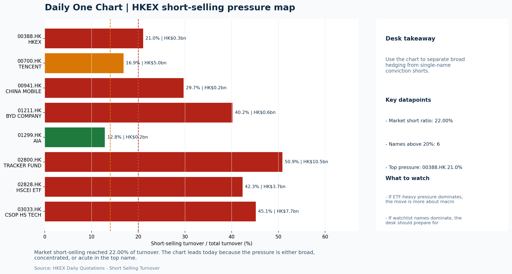

# Morning Research Workbench | 2026-07-23

> Designed for a Hong Kong sell-side commute: Layer 1 `Scan`, Layer 2 `Deep Read`, Layer 3 `Thinking`
> Mode: `Trading Daily` | Keep the report execution-oriented: what mattered in the completed session, what can move Hong Kong leadership, and what needs fast follow-up.
> Briefing date: `2026-07-23` | Review date: `2026-07-22` | Global request: `2026-07-22` | HK/China request: `2026-07-22` | Market effective date: `2026-07-22` | Generated at: `2026-07-23 06:03:47`

## Executive Summary

- **Market pulse:** HSTECH-led style rotation on thin volume and elevated short-selling lacks clean flow confirmation, leaving the Thursday open dependent on FXI follow-through and tonight's US data catalyst.
- **Hong Kong lens:** Hong Kong growth / internet led. A constructive open is more credible if HSTECH and FXI both confirm the move; elevated short-selling and Intel supply-chain risk argue for watching semiconductor proxies.
- **Top catalysts:** INTC -6.33%; Neutral backdrop with USD range-bound, higher yields pressured valuations, and Oil outperformed Bitcoin.

## Visual Dashboard

## Layer 1 | Scan (5-10 min)

### 1.1 One-Line Market Pulse
HSTECH-led style rotation on thin volume and elevated short-selling lacks clean flow confirmation, leaving the Thursday open dependent on FXI follow-through and tonight's US data catalyst.

### 1.2 Global Asset Price Dashboard

| Asset | Last | 1D move | Read |
| --- | --- | --- | --- |
| S&P 500 | 7,498.96 | -0.14% | US large-cap risk appetite |
| Nasdaq 100 | 28,998.10 | -0.54% | Growth and duration leadership |
| Hang Seng Index | 25,132.29 | -0.04% | Hong Kong broad beta |
| Hang Seng TECH | 4.7220 | **+1.55%** | Hong Kong growth / platform read-through |
| CSI 300 | 4,529.10 | **-3.60%** | Mainland large-cap tone |
| US 10Y | 4.6570 | +0.63% | Global discount-rate anchor |
| China 10Y | 1.73% | -1.5bp | China local rates anchor \| Live public \| Eastmoney \| 2026-07-22 |
| CN-US 10Y spread | -294.0bp | -5.5bp | Relative carry and macro-pressure gauge \| Live public \| Eastmoney \| 2026-07-22 |
| DXY | 101.14 | -0.04% | Dollar liquidity impulse |
| USD/CNH | 6.7500 | +0.00% | Offshore China risk appetite |
| USD/HKD | 7.8405 | -0.00% | Linked-exchange regime stress check |
| Brent crude | 93.88 | **+3.15%** | Energy / geopolitics |
| COMEX gold | 4,135.00 | **+1.57%** | Hedge demand / real yields |
| Copper | 6.4910 | -0.31% | Global growth proxy |
| VIX | 16.64 | **-2.40%** | US stress barometer |

### 1.3 Hong Kong Key Data Quick Check

| Check | Value | Status | Source / as of | Why it matters |
| --- | --- | --- | --- | --- |
| Main Board turnover vs 20D | 0.96x \| -4% vs 20D | Live local | HKEX \| 2026-07-22 | Trailing 20-session average turnover was HK$327.2bn. |
| Southbound / Northbound net flow | Southbound Net HK$7.5bn \| turnover HK$149.5bn \| Northbound Turnover HK$375.0bn \| net not reported | Live local | HKEX Connect \| 2026-07-22 | Southbound net buy is calculated from HKEX disclosed buy and sell turnover. |
| Short-selling ratio | 22.00% | Live local | HKEX \| 2026-07-22 | Official HKEX stock-level short-selling table, aggregated as a share of total market turnover. |
| AH premium index | 32.63% | Live public | Yahoo \| 2026-07-22 | Simple average across 17 A/H pairs; use dispersion rather than the average alone. |
| USD/HKD spot vs band | 7.8405 \| band 7.7500 to 7.8500 | Live quote + local | Yahoo \| 2026-07-22 | Inside the linked-exchange band without immediate boundary stress. Official Convertibility Undertakings define the linked-rate stress boundaries for USD/HKD. |
| HIBOR 1M | 2.68% | Live local | HKMA \| 2026-07-22 | 1M HIBOR is the cleanest quick read for Hong Kong funding conditions and equity-duration pressure. |
| Aggregate Balance | HK$53.9bn | Live local | HKMA \| 2026-07-22 | Aggregate Balance helps frame whether linked-rate liquidity conditions are tight or comfortable. |
| Hong Kong leadership | Hong Kong growth / internet led | Proxy | HSI / HSCEI / HSTECH relative perf \| 2026-07-22 | Use HSI / HSCEI / HSTECH relative moves as the opening style read. |

### 1.4 Risk Dashboard
**Composite risk score:** `51.2/100` | **Regime:** `Mixed`

| Component | Score impact | Evidence |
| --- | --- | --- |
| US beta | -0.8 | S&P 500 -0.14% |
| HK growth | +7.8 | HSTECH +1.55% |
| Offshore China proxy | -2.9 | FXI -0.58% |
| Dollar pressure | +0.4 | DXY -0.04% |
| Volatility | +4.8 | VIX -2.40% |
| HK short-selling | -8 | Short-selling ratio 22.00% |

### 1.5 Morning Checklist
1. **INTC -6.33%**
 Mover attribution | Announcement / expectations | Guidance reset and margin pressure
2. **Neutral backdrop with USD range-bound, higher yields pressured valuations, and Oil outperformed Bitcoin**
 Overnight regime | Start by deciding whether the day is about Neutral conditions or a style pivot.
3. **CPI MoM (Released)**
 Macro / policy | Rates expectations, the dollar, and growth-equity valuation | Industries: Technology, Internet, Brokers
4. **Trade Balance (Released)**
 Macro / policy | Watch whether it changes the day's core market narrative | Industries: Market-wide
5. **Retail Sales MoM (Upcoming)**
 Macro / policy | Consumer resilience, growth expectations, and risk-asset pricing | Industries: Consumer, E-commerce, Consumer discretionary

## Layer 2 | Deep Read (20-30 min)

### 2.1 Overnight Overseas Market Review
#### Market Setup
**Core tape.** Overnight risk appetite turned cautious as a neutral macro backdrop with range-bound USD and higher yields weighed on valuations.
**Main driver.** Intel's guidance reset (-6.33%) was the highest-scoring mover and raises semiconductor supply-chain risk for HK-listed chip and hardware names.
**HK relevance.** The divergence between HK growth/tech (HSTECH +1.55%) and offshore China proxies (FXI -0.58%) signals selective domestic positioning rather than a clean risk-on impulse, which needs confirmation before the Thursday open.

#### Key Drivers
- Higher US 10Y yields (+0.63%) created valuation headwinds for duration-sensitive sectors including HK internet and growth names.
- Oil outperformed Bitcoin by 2.3% as geopolitical risk (U.S.-Iran tensions) drove defensive rotation into energy at the expense of risk.
- Intel's guidance reset (-6.33%) signals semiconductor sector earnings reset risk that can propagate to Asian tech supply chains including.
- Jamie Dimon's warning that he would not buy stocks or Treasuries at current prices added a layer of macro uncertainty heading into the HK.

#### Hong Kong Read-Through
**Desk lens.** Hong Kong growth / internet led.
**Opening implication.** A constructive open is more credible if HSTECH and FXI both confirm the move.
- **Cross-market read:** Hang Seng -0.04% / HSCEI -0.25% / HSTECH +1.55%.
- **Cross-market read:** Offshore China proxy FXI -0.58% and USD/CNH +0.00% frame cross-border risk appetite.
- **Cross-market read:** USD/HKD last traded around 7.8405, which keeps the Hong Kong funding lens in focus.

#### Watch Points
- USD composite moved lower by -0.02pct intraday, with a 0.084pct range.
- Main turning points appeared around 2026-07-22 08:05 peak / 2026-07-22 08:20 peak / 2026-07-22 08:50 peak, suggesting event-driven repricing rather.
- The biggest cross-asset divergence was Oil versus Bitcoin, a spread of 2.336pct.
- Gold moved +0.05pct intraday with a 1.333pct high-low range.

**Curated overnight stories**
1. **INTC -6.33%: Guidance reset and margin pressure**
 Why it matters: Intel cut forward guidance with margin deterioration. This is the highest-scoring overnight mover (score 108) and signals semiconductor sector earnings reset risk that.
 HK read-through: Relevant for HK tech hardware, semiconductor manufacturing, and broader risk appetite in growth names. Could weigh on SMIC and tech supply chain proxies.
2. **CPI MoM released; Trade Balance released**
 Why it matters: Both macro data prints were released overnight. CPI shapes rates expectations and the dollar; Trade Balance influences market narrative.
 HK read-through: Higher yields pressuring valuations align with the neutral regime (USD range-bound, yield-driven headwinds). Critical for HK internet, growth-equity, and brokers.
3. **U.S.-Iran tensions escalate; parts of stock market and economy could be affected**
 Why it matters: Geopolitical risk escalated overnight. Oil outperformed Bitcoin as investors rotated into energy hedges.
 HK read-through: Oil-linked HK names (e.g., Sinopec, CNOOC) may outperform if energy prices stay elevated. However, broader geopolitical risk could pressure risk appetite and consumer-facing.
4. **China car market headed for worst year since 2021; sales plunge 20%**
 Why it matters: Domestic consumption weakness in autos is confirmed with a 20% sales decline. The graded news (C-grade) indicates propagation risk through the consumer value chain.
 HK read-through: Relevant for HK-listed auto OEMs, EV supply chain, and consumer discretionary. The 2025 record-high comparison (23.7 million units) makes the reversal structurally notable.

### 2.2 Hong Kong / A-share Previous-Day Review
#### Local Tape Setup
**Local read.** Hong Kong's session was led by growth/tech (HSTECH +1.55%) while HSCEI slipped (−0.25%) and the Hang Seng Index was nearly flat, signaling style rotation rather than broad beta.
**Verification point.** However, the elevated short‑selling ratio (22.00%), below‑average turnover (0.96× 20D), and weakness in the offshore China proxy FXI (−0.58%) argue that the move lacks clean confirmation.
**Risk to watch.** Southbound net buying was positive at HK$7.5bn, but it was concentrated in the Tracker Fund (2800.HK) rather than in the mega‑cap internet names that drove the style leadership, which tempers the conviction read.

#### Style and Local Leadership
**Style leadership.** Hong Kong growth / internet led.
- **Cross-market read:** Hang Seng -0.04% / HSCEI -0.25% / HSTECH +1.55%.
- **Cross-market read:** Offshore China proxy FXI -0.58% and USD/CNH +0.00% frame cross-border risk appetite.
- **Cross-market read:** USD/HKD last traded around 7.8405, which keeps the Hong Kong funding lens in focus.

#### Flow Confirmation
Official Stock Connect evidence is available; use Section 2.3 to confirm whether local money supports the price action.

#### Follow-Through Checklist
**Follow-through check.** Watch whether CSI 300 and offshore China proxies (FXI) confirm the HSTECH move on the next session.

### 2.3 Flow Tracker and Attribution
#### Cross-Asset Attribution v1

| Driver | Direction | Score | Evidence | HK implication |
| --- | --- | --- | --- | --- |
| Short-selling pressure | drag | 4.9 | HKEX short-selling ratio was 22.00%. | Elevated short activity argues for extra confirmation before chasing rebounds. |
| Oil and geopolitics | mixed | 2.52 | Oil moved +3.15%. | Split the read between energy/cyclicals support and margin/geopolitical pressure. |
| Rates impulse | drag | 0.76 | US 10Y yield proxy moved +0.63%. | Lower yields help long-duration growth; higher yields pressure valuation-sensitive |

#### Flow Tracker
##### Flow Takeaways
- Short-selling pressure is elevated, so local rebounds need cleaner breadth and flow confirmation.
- Stock Connect Southbound: net HK$7.5bn on turnover HK$149.5bn (as of 2026-07-22).
- Stock Connect Northbound: turnover RMB375.0bn; public file provides total turnover/top active names, not full net-buy.
- AH premium: simple covered-pair average +32.63%; widest premium: China Communications Construction 92.1%.

##### Stock Connect Southbound Active Names

| Rank | Ticker | Name | Buy | Sell | Net buy |
| --- | --- | --- | --- | --- | --- |
| 5 | 02800.HK | TRACKER FUND | HK$6,270.1mn | HK$87.3mn | HK$6,182.8mn |
| 1 | 00700.HK | TENCENT | HK$8,225.8mn | HK$10,990.8mn | HK$-2,765.0mn |
| 2 | 09988.HK | BABA-W | HK$2,345.0mn | HK$5,104.2mn | HK$-2,759.2mn |
| 6 | 01347.HK | HUA HONG GRACE | HK$3,354.0mn | HK$2,149.4mn | HK$1,204.6mn |
| 5 | 01888.HK | KB LAMINATES | HK$2,505.6mn | HK$3,325.2mn | HK$-819.6mn |

##### AH Premium Dispersion

| Name | A ticker | H ticker | Premium | As of |
| --- | --- | --- | --- | --- |
| China Communications Construction | 601800.SS | 1800.HK | +92.10% | 2026-07-22 |
| China Life | 601628.SS | 2628.HK | +70.53% | 2026-07-22 |
| China Railway Construction | 601186.SS | 1186.HK | +58.29% | 2026-07-22 |
| China Railway | 601390.SS | 0390.HK | +51.41% | 2026-07-22 |
| CRRC | 601766.SS | 1766.HK | +41.64% | 2026-07-22 |

##### HKEX Short-Selling Watch

| Ticker | Name | Short ratio | Short turnover | Total turnover |
| --- | --- | --- | --- | --- |
| 00388.HK | HKEX | 21.03% | HK$0.3bn | HK$1.5bn |
| 00700.HK | TENCENT | 16.85% | HK$5.0bn | HK$29.8bn |
| 00941.HK | CHINA MOBILE | 29.69% | HK$0.2bn | HK$0.7bn |
| 01211.HK | BYD COMPANY | 40.18% | HK$0.6bn | HK$1.4bn |
| 01299.HK | AIA | 12.85% | HK$0.2bn | HK$1.3bn |

- **Short-value leaders:** 02800.HK TRACKER FUND (HK$10.5bn); 03033.HK CSOP HS TECH (HK$7.7bn); 00700.HK TENCENT (HK$5.0bn); 02828.HK HSCEI ETF (HK$3.7bn).

### 2.4 Macro and Policy Tracking
**Desk read.** The completed global session (2026-07-22) establishes a mixed backdrop for the HK open on 2026-07-23.

**Market sensitivity.** US CPI for June came in hotter than expected at 0.3% MoM versus the 0.2% consensus, a development that reprices rate expectations and strengthens the dollar.

**HK implication.** China trade balance, released during the Asian session, printed at USD 85.2bn against a USD 79.0bn forecast - a modest positive that provides partial offset.

**Macro watchpoints**
- HKD-USD and USD index reaction immediately after the US CPI release, as hotter inflation reprices rate expectations.
- HK technology and internet sector leadership at open, given the rate sensitivity implied by the CPI beat.
- HK and China property names and rate-sensitive financials if the bond market sells off in response to CPI.
- US Retail Sales print at 20:30 HK time - a below-consensus result could partially offset the CPI-driven dollar strength.

| Time | Region | Event | Status | Desk read |
| --- | --- | --- | --- | --- |
| 20:30 | US | CPI MoM | Released | Impact: Rates expectations, the dollar, and growth-equity valuation \| Attention: 5/5 \| Industries: Technology, Internet, Brokers |
| 09:30 | China | Trade Balance | Released | Impact: Watch whether it changes the day's core market narrative \| Attention: 3/5 \| Industries: Market-wide |
| 20:30 | US | Retail Sales MoM | Upcoming | Impact: Consumer resilience, growth expectations, and risk-asset pricing \| Attention: 5/5 \| Industries: Consumer, E-commerce, Consumer discretionary |
| 09:20 | China | Loan Prime Rate | Upcoming | Impact: Watch whether it changes the day's core market narrative \| Attention: 3/5 \| Industries: Market-wide |
| 22:00 | Federal Reserve | Jerome Powell: Economic outlook remarks | Central bank | Impact: Policy path, liquidity conditions, and cross-asset risk appetite \| Attention: 5/5 \| Industries: Technology, Financials, Gold |
| 10:00 | PBOC | Open Market Operations Desk: Daily liquidity operation window | Central bank | Impact: Policy path, liquidity conditions, and cross-asset risk appetite \| Attention: 3/5 \| Industries: Technology, Financials, Gold |

#### Positioning and Risk Backdrop
- Options activity centered on KWEB Call, with Vol/OI at 1.88x and a bullish bias.
- Put/Call structure shows equity 0.68 / index 1.15, implying Single-stock optimism with index hedging.
- Geopolitics: Middle East | Regional tension remains elevated | Impact: Oil, freight costs, and safe-haven demand
- Geopolitics: US-China | Technology export-control rhetoric remains active | Impact: China internet, semiconductors, and supply chains

### 2.5 Key Company and Sector Events

| Grade | Sector | Headline | Why it matters | Horizon |
| --- | --- | --- | --- | --- |
| B | China Internet | Stocks making the biggest moves premarket | Assess whether the story can propagate through the China Internet value | Monitor |

#### HKEX Announcements

| Grade | Ticker | Type | Release time | Title |
| --- | --- | --- | --- | --- |
| A | 00236.HK | Profit warning | 2026-07-22 | Profit warning / alert announcement |
| A | 00293.HK | Profit warning | 2026-07-22 | Profit warning / alert announcement |
| A | 00622.HK | Profit warning | 2026-07-22 | Profit warning / alert announcement |
| A | 01775.HK | Profit warning | 2026-07-22 | Profit warning / alert announcement |
| A | 02182.HK | Profit warning | 2026-07-22 | Profit warning / alert announcement |
| A | 02252.HK | Profit warning | 2026-07-22 | Profit warning / alert announcement |
| A | 02613.HK | Profit warning | 2026-07-22 | Profit warning / alert announcement |
| A | 03839.HK | Profit warning | 2026-07-22 | Profit warning / alert announcement |

#### Earnings / Results Watch

| Ticker | Company | Timing | Expectation framing |
| --- | --- | --- | --- |
| 0700.HK | Tencent Holdings | After Market Close | EPS est. 4.15 HKD \| revenue est. 163.2bn HKD |
| 0388.HK | Hong Kong Exchanges and Clearing | Before Market Open | EPS est. 2.81 HKD \| revenue est. 6.0bn HKD |

#### Rating Changes
- **9988.HK** | Morgan Stanley | Upgrade | Equal Weight -> Overweight | PT 92 -> 105

#### IPO Watch
- IPO and grey-market monitoring is not yet part of the standard production pack.

### 2.6 Today's Core Names
#### Core coverage

| Name | Ticker | Last | 1D | Range position | Morning note |
| --- | --- | --- | --- | --- | --- |
| Tencent | 0700.HK | 440.60 | -7.05% | Mid-range | Short-term pressure is visible; check for a fundamental or regulatory reason. |
| Alibaba | 9988.HK | 113.60 | -2.91% | Mid-range | Short-term pressure is visible; check for a fundamental or regulatory reason. |

**Recent headlines for Tencent:**
- [Tencent Slides Most in Over a Year, Leading China Gaming Selloff](https://finance.yahoo.com/news/tencent-slides-most-over-leading-074015846.html) (Bloomberg)
**Recent headlines for Alibaba:**
- [How to Play BABA Stock as Alibaba Unveils New Qwen AI Model](https://www.barchart.com/story/news/3407002/how-to-play-baba-stock-as-alibaba-unveils-new-qwen-ai-model) (Barchart)

#### Priority follow-up

| Name | Ticker | Last | 1D | Range position | Morning note |
| --- | --- | --- | --- | --- | --- |
| BYD Company | 1211.HK | 87.85 | -2.17% | Mid-range | Short-term pressure is visible; check for a fundamental or regulatory reason. |
| China Mobile | 0941.HK | 80.55 | -0.19% | Mid-range | Positioning is neutral for now, so use it mainly to monitor marginal information changes. |

## Layer 3 | Thinking (10-15 min)

### 3.1 Rotating Theme Deep Dive

| Field | Read |
| --- | --- |
| Theme | China Exports and Supply-Chain Relocation |
| Angle for the day | Track tariffs, trade policy, shipping, and manufacturing orders to see whether export resilience is still the cleaner China macro expression. |

**Theme desk read**
**Core thesis.** The China export and supply-chain relocation theme receives a concrete data point this morning: the June trade balance came in at USD 85.2bn, comfortably ahead of the USD 79.0bn consensus.
**Evidence.** The beat reinforces the view that export resilience is still the cleaner macro expression, even as other parts of the China economy face headwinds.
**What to test.** On the rate side, US 10Y yields were slightly higher overnight (+0.63%), pressuring growth-equity valuations, which likely contributed to BYD's -2.17% move yesterday.

**Signals to keep in mind**
- VIX -2.40%: Lower volatility signals easing stress in the tape.
- WTI crude +1.85%: A strong crude move needs to be split between geopolitics and demand repair.

**LLM watch items:**
- BYD weekly sales data (model rollout cadence and export mix)
- China Loan Prime Rate decision (forecast 3.45%, to gauge domestic policy support for demand)
- US Retail Sales MoM (forecast 0.3%, consumer demand signal for China exports)
- China Mobile capex updates and dividend policy signals (yield-trade stability benchmark)

**Related names to keep close:**

| Name | Ticker | Bucket | Morning read |
| --- | --- | --- | --- |
| BYD Company | 1211.HK | Priority follow-up | Short-term pressure is visible; check for a fundamental or regulatory reason. |
| China Mobile | 0941.HK | Priority follow-up | Positioning is neutral for now, so use it mainly to monitor marginal information changes. |

**Upcoming catalysts tied to the theme:**
- 2026-07-23 | BYD Company: Weekly sales data and model rollout cadence | Hong Kong-listed proxy for EV volumes, export mix, and price competition
- 2026-07-23 | China Mobile: Capex updates and dividend policy signals | Defensive SOE benchmark for yield trade and domestic digital-infrastructure spend

### 3.2 Today Ahead and Trading Calendar
- Macro: CPI MoM is the first item to anchor the open and the rates/FX response.
- Corporate / event: Tencent: Game grossing trends and ad-demand checks is the cleanest same-day catalyst to prepare for.

**Same-day macro docket**

| Time | Country | Event | Status | Detail |
| --- | --- | --- | --- | --- |
| 20:30 | US | CPI MoM | Released | Actual 0.3% / Forecast 0.2% / Prior 0.4% |
| 09:30 | China | Trade Balance | Released | Actual USD 85.2bn / Forecast USD 79.0bn / Prior USD 80.6bn |
| 20:30 | US | Retail Sales MoM | Upcoming | Forecast 0.3% / Prior 0.6% |
| 09:20 | China | Loan Prime Rate | Upcoming | Forecast 3.45% / Prior 3.45% |
| 22:00 | Federal Reserve | Jerome Powell: Economic outlook remarks | Central bank | speech |

**Same-day catalyst list**

| Date | Time | Category | Event | Importance |
| --- | --- | --- | --- | --- |
| 2026-07-23 | | Core coverage | Tencent: Game grossing trends and ad-demand checks | 3 |
| 2026-07-23 | | Core coverage | Alibaba: Cloud demand and GMV updates | 3 |
| 2026-07-23 | | Core coverage | Meituan: Order trends and margin commentary | 3 |
| 2026-07-23 | | Core coverage | HKEX: Turnover data and IPO pipeline updates | 3 |

**Next few sessions**

| Date | Category | Event | Impact |
| --- | --- | --- | --- |
| 2026-07-23 | Core coverage | Tencent: Game grossing trends and ad-demand checks | Core offshore China platform proxy for gaming, ads, and AI monetization |
| 2026-07-23 | Core coverage | Alibaba: Cloud demand and GMV updates | Key read-through for China consumption, cloud, and platform regulation |
| 2026-07-23 | Core coverage | Meituan: Order trends and margin commentary | High-frequency read on local services demand and platform competition |
| 2026-07-23 | Core coverage | HKEX: Turnover data and IPO pipeline updates | Direct proxy for Hong Kong market turnover, listings, and southbound |

### 3.3 Daily One Chart
**Daily One Chart | HKEX short-selling pressure map**

**Chart read.** Market short-selling reached 22.00% of turnover.
**Why it matters.** The chart leads today because the pressure is either broad, concentrated, or acute in the top name.

_Source: HKEX Daily Quotations - Short Selling Turnover_

## Traceable Appendix

### Report Metadata
> Date policy: Review date 2026-07-22 is treated as `Trading Daily`. | Global request date is 2026-07-22; adapter effective date is 2026-07-22 and summary date is 2026-07-22. | HK/China local data date is 2026-07-22; role: same-session local cash tape.
> Market data quality: Coverage: `31/32` | Stale items (>1d): `1` | Missing: `1`
> Report quality: `87.4/100` | Grade `B` | Status `production ready`

### Key Questions to Keep in Mind
- Is risk appetite rising or fading? The overnight tape reads closer to `Neutral`.
- Did rates expectations move? Focus on whether US 10Y, DXY, and growth style moved together.
- Were commodities the real story? Watch WTI and gold for geopolitics versus inflation signals.
- Is Hong Kong setup internet-led, SOE-led, or broad beta-led? Compare HSTECH, HSCEI, and HSI.
- Did offshore markets move China risk appetite? Focus on HSI, FXI, USD/CNH, and USD/HKD.

### Report Quality and Validation
- **Quality score:** 87.4/100 | **Grade:** B | **Status:** production ready
- **Run summary:** 7 healthy | 1 caveat | 0 failed
- **Release recommendation:** Send with caveats | The report is usable, but the advisory guidance should travel with it so readers understand the data gaps.

| Source | Status | Bucket |
| --- | --- | --- |
| Market data | ok | healthy |
| Sector and company news | ok | healthy |
| Movers and short selling | ok | healthy |
| Stock Connect | ok | healthy |
| A/H premium | ok | healthy |
| Hong Kong local package | ok | healthy |
| China rates | ok | healthy |
| Narrative overlay | partial | caveat |

**Desk-use guidance summary:** 0 blocking | 1 advisory

**Desk-use guidance**
- **Advisory:** Use deterministic sections as primary support; the narrative overlay was partial or unavailable on this run.

| Component | Score | Weight | Read |
| --- | --- | --- | --- |
| Market data coverage | 96.9 | 0.3 | 31/32 core market fields available. |
| Hong Kong local metrics | 82.3 | 0.25 | 8 live, 3 proxy, 0 unavailable local checks. |
| Key public adapters | 100.0 | 0.2 | 4/4 key adapters were available or partially available. |
| Narrative overlay health | 51.4 | 0.15 | 2/7 narrative overlay tasks succeeded or used validated cache; 1 error(s). |
| Fact-check guardrail | 100.0 | 0.1 | Checked 2 numeric claims; 0 numeric mismatch(es), 0 logic warning(s); 0 critical, 0 review. |

**Quality warnings**
- Narrative overlay health is weak: 2/7 narrative overlay tasks succeeded or used validated cache; 1 error(s).

**Narrative fact-check guardrail**
- Checked 2 numeric claims; 0 numeric mismatch(es), 0 logic warning(s); 0 critical, 0 review.

**Adapter status**

| Adapter | Status |
| --- | --- |
| Stock Connect | ok |
| A/H premium | ok |
| HKEX announcements | ok |
| China rates | ok |

### Source Links
- [Stocks making the biggest moves premarket: AMD, SpaceX, Domino's Pizza, Alibaba & more](https://www.cnbc.com/2026/07/20/stocks-making-the-biggest-moves-premarket-amd-spcx-dpz.html) (cnbc_markets)
- [Tencent Slides Most in Over a Year, Leading China Gaming Selloff](https://finance.yahoo.com/news/tencent-slides-most-over-leading-074015846.html) (Bloomberg)
- [3 Hong Kong AI Stocks to Buy Now If You Want to Invest Like Michael Burry](https://www.barchart.com/story/news/3388991/3-hong-kong-ai-stocks-to-buy-now-if-you-want-to-invest-like-michael-burry) (Barchart)
- [How to Play BABA Stock as Alibaba Unveils New Qwen AI Model](https://www.barchart.com/story/news/3407002/how-to-play-baba-stock-as-alibaba-unveils-new-qwen-ai-model) (Barchart)
- [00236.HK Profit warning / alert announcement](http://www1.hkexnews.hk/listedco/listconews/sehk/2026/0722/2026072200690.pdf) (HKEXnews)
- [00293.HK Profit warning / alert announcement](http://www1.hkexnews.hk/listedco/listconews/sehk/2026/0722/2026072200195.pdf) (HKEXnews)
- [00622.HK Profit warning / alert announcement](http://www1.hkexnews.hk/listedco/listconews/sehk/2026/0722/2026072201307.pdf) (HKEXnews)
- [01775.HK Profit warning / alert announcement](http://www1.hkexnews.hk/listedco/listconews/sehk/2026/0722/2026072200867.pdf) (HKEXnews)
- [02182.HK Profit warning / alert announcement](http://www1.hkexnews.hk/listedco/listconews/sehk/2026/0722/2026072201159.pdf) (HKEXnews)
- [02252.HK Profit warning / alert announcement](http://www1.hkexnews.hk/listedco/listconews/sehk/2026/0722/2026072201359.pdf) (HKEXnews)
- [02613.HK Profit warning / alert announcement](http://www1.hkexnews.hk/listedco/listconews/sehk/2026/0722/2026072200628.pdf) (HKEXnews)
- [03839.HK Profit warning / alert announcement](http://www1.hkexnews.hk/listedco/listconews/sehk/2026/0722/2026072200889.pdf) (HKEXnews)

## Supplementary Visual Appendix

This appendix is professional-path only. It keeps a traceable index of the report visuals and the deterministic chart cues used to frame the morning note, without injecting the legacy intraday chart pack.

### Visual Index

| Visual | Path | Role |
| --- | --- | --- |
| Visual Dashboard | `charts/dashboard_2026-07-23.png` | Cross-asset regime board and Hong Kong local tape snapshot. |
| Daily One Chart | `charts/daily_one_chart_2026-07-23.png` | Single highest-conviction visual story for the day. |

### Deterministic Chart Cues
- FX / liquidity: USD composite moved lower by -0.02pct intraday, with a 0.084pct range.
- FX / liquidity: Main turning points appeared around 2026-07-22 08:05 peak / 2026-07-22 08:20 peak / 2026-07-22 08:50 peak, suggesting event-driven repricing rather than a clean one-way USD move.
- Cross-asset: The biggest cross-asset divergence was Oil versus Bitcoin, a spread of 2.336pct.
- Cross-asset: Gold moved +0.05pct intraday with a 1.333pct high-low range.
- Cross-asset: Oil moved +1.42pct intraday with a 4.058pct high-low range.
- Cross-asset: Bitcoin moved -0.92pct intraday with a 1.737pct high-low range.

### Risk Dashboard Components

| Component | Score impact | Evidence |
| --- | --- | --- |
| US beta | -0.8 | S&P 500 -0.14% |
| HK growth | +7.8 | HSTECH +1.55% |
| Offshore China proxy | -2.9 | FXI -0.58% |
| Dollar pressure | +0.4 | DXY -0.04% |
| Volatility | +4.8 | VIX -2.40% |
| HK short-selling | -8 | Short-selling ratio 22.00% |
