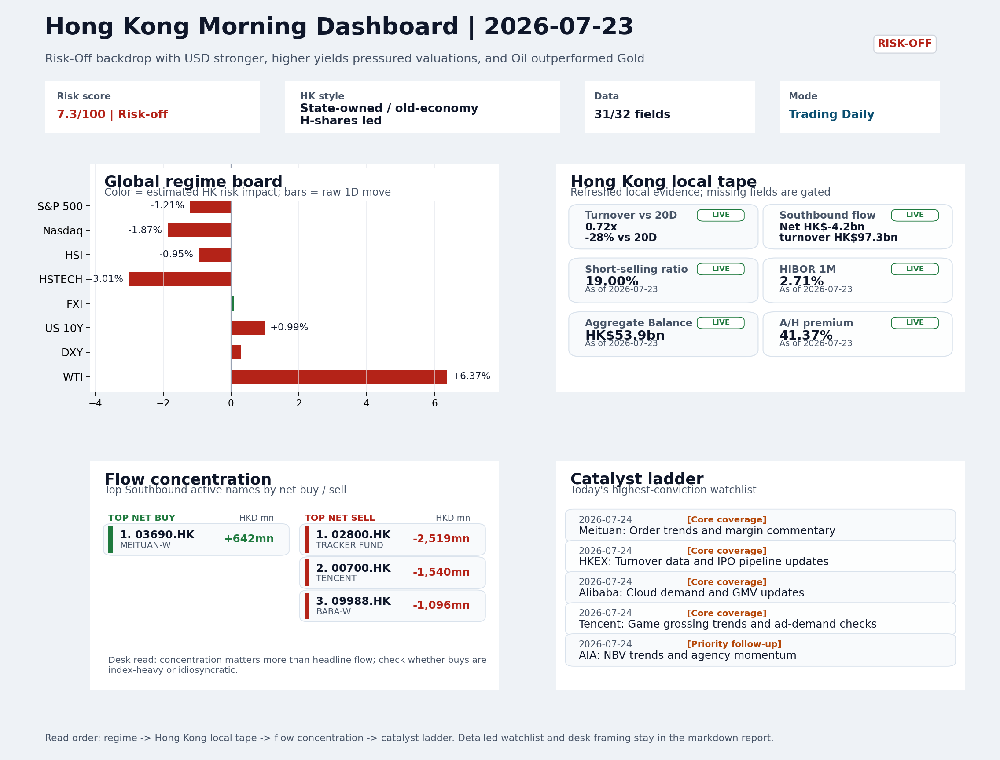
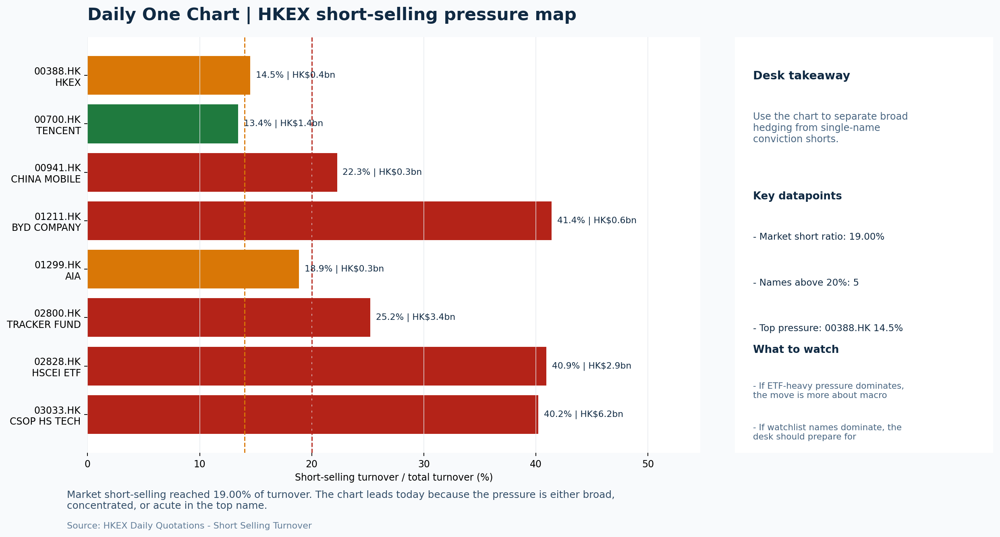

# Morning Research Workbench | 2026-07-24

> Designed for a Hong Kong sell-side commute: Layer 1 `Scan`, Layer 2 `Deep Read`, Layer 3 `Thinking`
> Mode: `Trading Daily` | Keep the report execution-oriented: what mattered in the completed session, what can move Hong Kong leadership, and what needs fast follow-up.
> Briefing date: `2026-07-24` | Review date: `2026-07-23` | Global request: `2026-07-23` | HK/China request: `2026-07-23` | Market effective date: `2026-07-23` | Generated at: `2026-07-24 06:03:54`

## Executive Summary

- **Market pulse:** A hotter-than-expected US CPI cemented Risk-Off into the close, with elevated short-selling (19%) and thin turnover (0.72x 20D) making Thursday's downside a low-conviction signal that.
- **Hong Kong lens:** Hong Kong growth / internet led. HSTECH's -3.01% underperformance versus FXI's +0.09% suggests growth names face more repricing risk at the open than state-owned proxies.
- **Top catalysts:** VIX +12.38%; INTC -6.33%.

## Visual Dashboard

## Layer 1 | Scan (5-10 min)

### 1.1 One-Line Market Pulse
A hotter-than-expected US CPI cemented Risk-Off into the close, with elevated short-selling (19%) and thin turnover (0.72x 20D) making Thursday's downside a low-conviction signal that needs flow confirmation before sizing any rebound into Friday.

### 1.2 Global Asset Price Dashboard

| Asset | Last | 1D move | Read |
| --- | --- | --- | --- |
| S&P 500 | 7,408.30 | -1.21% | US large-cap risk appetite |
| Nasdaq 100 | 28,454.81 | **-1.87%** | Growth and duration leadership |
| Hang Seng Index | 24,892.66 | -0.95% | Hong Kong broad beta |
| Hang Seng TECH | 4.5800 | **-3.01%** | Hong Kong growth / platform read-through |
| CSI 300 | 4,529.10 | **-3.60%** | Mainland large-cap tone |
| US 10Y | 4.7030 | +0.99% | Global discount-rate anchor |
| China 10Y | 1.73% | +0.3bp | China local rates anchor \| Live public \| Eastmoney \| 2026-07-23 |
| CN-US 10Y spread | -297.8bp | -3.7bp | Relative carry and macro-pressure gauge \| Live public \| Eastmoney \| 2026-07-23 |
| DXY | 101.43 | +0.29% | Dollar liquidity impulse |
| USD/CNH | 6.7550 | +0.00% | Offshore China risk appetite |
| USD/HKD | 7.8404 | -0.01% | Linked-exchange regime stress check |
| Brent crude | 100.55 | **+6.89%** | Energy / geopolitics |
| COMEX gold | 4,052.30 | **-2.28%** | Hedge demand / real yields |
| Copper | 6.3375 | **-1.76%** | Global growth proxy |
| VIX | 18.70 | **+12.38%** | US stress barometer |

### 1.3 Hong Kong Key Data Quick Check

| Check | Value | Status | Source / as of | Why it matters |
| --- | --- | --- | --- | --- |
| Main Board turnover vs 20D | 0.72x \| -28% vs 20D | Live local | HKEX \| 2026-07-23 | Trailing 20-session average turnover was HK$326.1bn. |
| Southbound / Northbound net flow | Southbound Net HK$-4.2bn \| turnover HK$97.3bn \| Northbound Turnover HK$307.5bn \| net not reported | Live local | HKEX Connect \| 2026-07-23 | Southbound net buy is calculated from HKEX disclosed buy and sell turnover. |
| Short-selling ratio | 19.00% | Live local | HKEX \| 2026-07-23 | Official HKEX stock-level short-selling table, aggregated as a share of total market turnover. |
| AH premium index | 41.37% | Live public | Yahoo \| 2026-07-23 | Simple average across 16 A/H pairs; use dispersion rather than the average alone. |
| USD/HKD spot vs band | 7.8404 \| band 7.7500 to 7.8500 | Live quote + local | Yahoo \| 2026-07-23 | Inside the linked-exchange band without immediate boundary stress. Official Convertibility Undertakings define the linked-rate stress boundaries for USD/HKD. |
| HIBOR 1M | 2.71% | Live local | HKMA \| 2026-07-23 | 1M HIBOR is the cleanest quick read for Hong Kong funding conditions and equity-duration pressure. |
| Aggregate Balance | HK$53.9bn | Live local | HKMA \| 2026-07-23 | Aggregate Balance helps frame whether linked-rate liquidity conditions are tight or comfortable. |
| Hong Kong leadership | Hong Kong growth / internet led | Proxy | HSI / HSCEI / HSTECH relative perf \| 2026-07-23 | Use HSI / HSCEI / HSTECH relative moves as the opening style read. |

### 1.4 Risk Dashboard
**Composite risk score:** `7.3/100` | **Regime:** `Risk-off`

| Component | Score impact | Evidence |
| --- | --- | --- |
| US beta | -7.3 | S&P 500 -1.21% |
| HK growth | -10 | HSTECH -3.01% |
| Offshore China proxy | +0.4 | FXI +0.09% |
| Dollar pressure | -2.9 | DXY +0.29% |
| Volatility | -10 | VIX +12.38% |
| HK short-selling | -8 | Short-selling ratio 19.00% |

### 1.5 Morning Checklist
1. **VIX +12.38%**
 High-frequency data | Higher volatility argues for tighter sizing and tighter stops.
2. **INTC -6.33%**
 Mover attribution | Announcement / expectations | Guidance reset and margin pressure
3. **WTI crude +6.37%**
 High-frequency data | A strong crude move needs to be split between geopolitics and demand repair.
4. **Risk-Off backdrop with USD stronger, higher yields pressured valuations, and Oil outperformed Gold**
 Overnight regime | Start by deciding whether the day is about Risk-Off conditions or a style pivot.
5. **CPI MoM (Released)**
 Macro / policy | Rates expectations, the dollar, and growth-equity valuation | Industries: Technology, Internet, Brokers

## Layer 2 | Deep Read (20-30 min)

### 2.1 Overnight Overseas Market Review
#### Market Setup
**Core tape.** Overnight markets confirmed a Risk-Off session as USD strength and rising US 10Y yields compressed equity valuations broadly.
**Main driver.** The VIX surged +12.38%, with Nasdaq 100 (-1.87%) underperforming S&P 500 (-1.21%), while Intel's -6.33% guidance reset added tech-sector headwinds.
**HK relevance.** Oil's sharp +6.37% move re-priced Fed rate-hike odds, reinforcing a higher-for-longer cost-of-capital narrative particularly punishing for Hong Kong growth and platform names.

#### Key Drivers
- Oil surged +6.37% to $92.36, lifting inflation expectations and re-pricing Fed rate-hike odds, which pressured duration-sensitive assets.
- USD strengthened (DXY +0.29%) with the 10Y yield rising +0.99%, creating cross-asset headwinds for H-share valuations.
- VIX spiked +12.38% to 18.7, confirming broad risk aversion and elevated uncertainty premium.
- Nasdaq 100 fell -1.87%, transmitting growth-style pressure to Hong Kong tech and internet proxies.

#### Hong Kong Read-Through
**Desk lens.** State-owned / old-economy H-shares led.
**Opening implication.** HSTECH's -3.01% underperformance versus FXI's +0.09% suggests growth names face more repricing risk at the open than state-owned proxies. Bounces need cleaner breadth and flow confirmation before sizing positions, given the 19% short-selling ratio and VIX.
- **Cross-market read:** Hang Seng -0.95% / HSCEI -1.31% / HSTECH -3.01%.
- **Cross-market read:** Offshore China proxy FXI +0.09% and USD/CNH +0.00% frame cross-border risk appetite.
- **Cross-market read:** USD/HKD last traded around 7.8404, which keeps the Hong Kong funding lens in focus.

#### Watch Points
- USD composite moved higher by +0.26pct intraday, with a 0.39pct range.
- Main turning points appeared around 2026-07-23 08:15 peak / 2026-07-23 08:40 trough / 2026-07-23 08:55 trough, suggesting event-driven repricing.
- The biggest cross-asset divergence was Oil versus Gold, a spread of 6.269pct.
- Gold moved -1.79pct intraday with a 2.169pct high-low range.

**Curated overnight stories**
1. **WTI crude +6.37%; Fed rate-hike odds surge as oil prices rip higher**
 Why it matters: A sharp crude move lifts inflation expectations and re-prices the Fed rate path, directly affecting cost-of-capital assumptions for risk assets.
 HK read-through: Most relevant for Hong Kong energy names, transportation, and broadly for any sector with input-cost sensitivity.
2. **VIX +12.38% - Risk-Off backdrop confirmed with USD stronger, higher yields pressured**
 Why it matters: The market is experiencing a broad risk-aversion episode. USD strength and higher yields compress valuation multiples, particularly for growth-oriented Hong Kong-listed.
 HK read-through: Cross-asset context: validates the session's Risk-Off setup. USD strength directly impacts Hong Kong dollar-linked assets and offshore-China names with USD-denominated.
3. **INTC -6.33% - Announcement / expectations: guidance reset and margin pressure**
 Why it matters: Intel's guidance reset signals ongoing competitive pressure and margin deterioration in semiconductors.
 HK read-through: Most relevant for Hong Kong internet and AI-adjacent sentiment. The semiconductor sector's earnings trajectory informs how global capital allocates to Asia tech.
4. **CPI MoM released - rates expectations, dollar, and growth-equity valuation under review**
 Why it matters: Core inflation data determines whether the Fed maintains its current path or pivots to further tightening.
 HK read-through: Industries most exposed: Technology, Internet, Brokers. The dollar and rate path directly affect H-share valuations and cost of capital for Hong Kong intermediaries.
5. **China car market heads for worst year since 2021 as sales plunge 20%**
 Why it matters: A 20% YoY sales decline in China's auto sector reflects demand weakness extending beyond cyclical factors.
 HK read-through: Directly relevant for Hong Kong-listed EV makers, auto parts, and consumer discretionary names. The scale of the decline signals structural demand headwinds that warrant.

### 2.2 Hong Kong / A-share Previous-Day Review
#### Local Tape Setup
**Local read.** On 23 July, Hong Kong's HSTECH slumped 3.01%, sharply underperforming the HSCEI (-1.31%) as overnight US growth pressure (Nasdaq 100 -1.87%) transmitted into local tech and internet names.
**Verification point.** Thin turnover (0.72x 20D) and elevated short-selling (19.0%) amplified the move, while Southbound net selling reached HK$-4.2bn.
**Risk to watch.** USD/CNH was unchanged at 6.755, containing FX stress for now.

#### Style and Local Leadership
**Style leadership.** Hong Kong growth / internet led.
- **Cross-market read:** Hang Seng -0.95% / HSCEI -1.31% / HSTECH -3.01%.
- **Cross-market read:** Offshore China proxy FXI +0.09% and USD/CNH +0.00% frame cross-border risk appetite.
- **Cross-market read:** USD/HKD last traded around 7.8404, which keeps the Hong Kong funding lens in focus.

#### Flow Confirmation
Official Stock Connect evidence is available; use Section 2.3 to confirm whether local money supports the price action.

#### Follow-Through Checklist
**Follow-through check.** Watch whether Hang Seng TECH stabilizes relative to HSCEI and whether the CSI 300's tech-heavy components confirm or reverse the growth drag. A decline in the short-selling ratio and a return of Southbound buying would add conviction to any bounce.

### 2.3 Flow Tracker and Attribution
#### Cross-Asset Attribution v1

| Driver | Direction | Score | Evidence | HK implication |
| --- | --- | --- | --- | --- |
| Oil and geopolitics | mixed | 5.51 | Oil moved +6.89%. | Split the read between energy/cyclicals support and margin/geopolitical pressure. |
| Hong Kong participation | drag | 2.84 | Main Board turnover was 0.72x the 20-session average. | Thin turnover makes index moves easier to fade. |
| Short-selling pressure | drag | 2.8 | HKEX short-selling ratio was 19.00%. | Elevated short activity argues for extra confirmation before chasing rebounds. |
| US growth-style transmission | drag | 2.62 | Nasdaq 100 moved -1.87%. | Hong Kong growth and platform names should be tested first at the open. |
| Global equity beta | drag | 1.21 | S&P 500 moved -1.21%. | Broad beta matters if Hong Kong breadth confirms the overseas signal. |
| Rates impulse | drag | 1.19 | US 10Y yield proxy moved +0.99%. | Lower yields help long-duration growth; higher yields pressure valuation-sensitive |

#### Flow Tracker
##### Flow Takeaways
- Short-selling pressure is elevated, so local rebounds need cleaner breadth and flow confirmation.
- Stock Connect Southbound: net HK$-4.2bn on turnover HK$97.3bn (as of 2026-07-23).
- Stock Connect Northbound: turnover RMB307.5bn; public file provides total turnover/top active names, not full net-buy.
- AH premium: simple covered-pair average +41.37%; widest premium: Chalco 135.49%.

##### Stock Connect Southbound Active Names

| Rank | Ticker | Name | Buy | Sell | Net buy |
| --- | --- | --- | --- | --- | --- |
| 7 | 02800.HK | TRACKER FUND | HK$137.3mn | HK$2,656.5mn | HK$-2,519.2mn |
| 1 | 00700.HK | TENCENT | HK$1,996.2mn | HK$3,536.4mn | HK$-1,540.1mn |
| 6 | 09988.HK | BABA-W | HK$843.3mn | HK$1,939.5mn | HK$-1,096.2mn |
| 2 | 00981.HK | SMIC | HK$2,330.5mn | HK$3,223.4mn | HK$-892.9mn |
| 4 | 03690.HK | MEITUAN-W | HK$1,385.7mn | HK$743.7mn | HK$641.9mn |

##### AH Premium Dispersion

| Name | A ticker | H ticker | Premium | As of |
| --- | --- | --- | --- | --- |
| Chalco | 601600.SS | 2600.HK | +135.49% | 2026-07-23 |
| China Communications Construction | 601800.SS | 1800.HK | +86.73% | 2026-07-23 |
| China Life | 601628.SS | 2628.HK | +68.64% | 2026-07-23 |
| China Railway Construction | 601186.SS | 1186.HK | +58.44% | 2026-07-23 |
| China Railway | 601390.SS | 0390.HK | +48.93% | 2026-07-23 |

##### HKEX Short-Selling Watch

| Ticker | Name | Short ratio | Short turnover | Total turnover |
| --- | --- | --- | --- | --- |
| 00388.HK | HKEX | 14.50% | HK$0.4bn | HK$2.6bn |
| 00700.HK | TENCENT | 13.44% | HK$1.4bn | HK$10.2bn |
| 00941.HK | CHINA MOBILE | 22.26% | HK$0.3bn | HK$1.2bn |
| 01211.HK | BYD COMPANY | 41.41% | HK$0.6bn | HK$1.4bn |
| 01299.HK | AIA | 18.86% | HK$0.3bn | HK$1.7bn |

- **Short-value leaders:** 03033.HK CSOP HS TECH (HK$6.2bn); 02800.HK TRACKER FUND (HK$3.4bn); 02828.HK HSCEI ETF (HK$2.9bn); 07709.HK XL2CSOPHYNIX (HK$1.4bn).

### 2.4 Macro and Policy Tracking
**Desk read.** The completed session ended in a risk-off posture with elevated VIX (18.7, +12.4%) and a stronger USD weighing on Hong Kong valuations.

**Market sensitivity.** The surprise on today's US CPI (actual 0.3% vs forecast 0.2%) is the dominant repricing event.

**HK implication.** This directly challenges technology and internet sectors that are most rate-sensitive.

**Macro watchpoints**
- US 10-year yield trajectory after the hot CPI print and whether it triggers a broader duration sell-off in Asia.
- DXY direction and HKD stability - USD strength is the clearest headwind to HK risk appetite today.
- Whether HK technology and internet names can hold relative to the rate-driven rotation, or if they underperform on open.
- Oil's sustainability above $92 - separate the geopolitical premium from the demand signal before positioning in energy.

| Time | Region | Event | Status | Desk read |
| --- | --- | --- | --- | --- |
| 20:30 | US | CPI MoM | Released | Impact: Rates expectations, the dollar, and growth-equity valuation \| Attention: 5/5 \| Industries: Technology, Internet, Brokers |
| 09:30 | China | Trade Balance | Released | Impact: Watch whether it changes the day's core market narrative \| Attention: 3/5 \| Industries: Market-wide |
| 20:30 | US | Retail Sales MoM | Upcoming | Impact: Consumer resilience, growth expectations, and risk-asset pricing \| Attention: 5/5 \| Industries: Consumer, E-commerce, Consumer discretionary |
| 09:20 | China | Loan Prime Rate | Upcoming | Impact: Watch whether it changes the day's core market narrative \| Attention: 3/5 \| Industries: Market-wide |
| 22:00 | Federal Reserve | Jerome Powell: Economic outlook remarks | Central bank | Impact: Policy path, liquidity conditions, and cross-asset risk appetite \| Attention: 5/5 \| Industries: Technology, Financials, Gold |
| 10:00 | PBOC | Open Market Operations Desk: Daily liquidity operation window | Central bank | Impact: Policy path, liquidity conditions, and cross-asset risk appetite \| Attention: 3/5 \| Industries: Technology, Financials, Gold |

#### Positioning and Risk Backdrop
- Options activity centered on KWEB Call, with Vol/OI at 1.88x and a bullish bias.
- Put/Call structure shows equity 0.68 / index 1.15, implying Single-stock optimism with index hedging.
- Geopolitics: Middle East | Regional tension remains elevated | Impact: Oil, freight costs, and safe-haven demand
- Geopolitics: US-China | Technology export-control rhetoric remains active | Impact: China internet, semiconductors, and supply chains

### 2.5 Key Company and Sector Events

| Grade | Sector | Headline | Why it matters | Horizon |
| --- | --- | --- | --- | --- |
| B | China Internet | Stocks making the biggest moves premarket | Assess whether the story can propagate through the China Internet value | Monitor |
| B | Semiconductors and AI | Goldman Offers Way to Trade AI Junk Bonds $250 Million at a Time | This is more about order visibility and product-cycle validation | Short-term catalyst |

#### Company Event Takeaway
**Desk read.** Risk-off conditions on July 23 featured USD strength and higher yields pressuring valuations broadly.
**Why it matters.** Oil outperformed Gold as defensive positioning dominated.
**Follow-up.** Against this backdrop, the Morgan Stanley upgrade of Alibaba (9988.HK) from Equal Weight to Overweight with target raised from 92 to 105 stands out as the clearest actionable signal - this move occurred during a session.

#### LLM Quick Takes
- **9988.HK** | Morgan Stanley upgrade to Overweight with target raised to 105 is the most significant rating change in the session.
- **0700.HK** | Reports after market close on July 23 with EPS estimate of 4.15 HKD and revenue of 163.2bn HKD. The AI monetization narrative will be key given risk-off conditions
- **0388.HK** | Reports before market open on July 24 with EPS estimate of 2.81 HKD and revenue of 6.0bn HKD. Results will be the first major Hong Kong market data point for the next
- **3690.HK** | Rose 4.36% to 98.7% of its range on July 23 despite risk-off conditions. This strength is notable and suggests selective platform demand remains.
- **1299.HK** | Rose 2.21% to 48% of range. Short-term strength is visible but positioning remains neutral; the stock lacks clear near-term catalysts beyond NBV trends and agency

#### HKEX Announcements

| Grade | Ticker | Type | Release time | Title |
| --- | --- | --- | --- | --- |
| A | 00243.HK | Profit warning | 2026-07-23 | Profit warning / alert announcement |
| A | 00622.HK | Profit warning | 2026-07-23 | Profit warning / alert announcement |
| A | 01117.HK | Profit warning | 2026-07-23 | Profit warning / alert announcement |
| A | 01626.HK | Profit warning | 2026-07-23 | Profit warning / alert announcement |
| A | 01797.HK | Profit warning | 2026-07-23 | Profit warning / alert announcement |
| A | 01986.HK | Profit warning | 2026-07-23 | Profit warning / alert announcement |
| A | 02407.HK | Profit warning | 2026-07-23 | Profit warning / alert announcement |
| A | 02726.HK | Profit warning | 2026-07-23 | Profit warning / alert announcement |

#### Earnings / Results Watch

| Ticker | Company | Timing | Expectation framing |
| --- | --- | --- | --- |
| 0700.HK | Tencent Holdings | After Market Close | EPS est. 4.15 HKD \| revenue est. 163.2bn HKD |
| 0388.HK | Hong Kong Exchanges and Clearing | Before Market Open | EPS est. 2.81 HKD \| revenue est. 6.0bn HKD |

#### Rating Changes
- **9988.HK** | Morgan Stanley | Upgrade | Equal Weight -> Overweight | PT 92 -> 105

#### IPO Watch
- IPO and grey-market monitoring is not yet part of the standard production pack.

### 2.6 Today's Core Names
#### Core coverage

| Name | Ticker | Last | 1D | Range position | Morning note |
| --- | --- | --- | --- | --- | --- |
| Meituan | 3690.HK | 87.30 | +4.36% | Top of range | Short-term price strength is clear; fresh catalysts could trigger broader group follow-through. |
| HKEX | 0388.HK | 406.20 | +1.40% | Mid-range | Positioning is neutral for now, so use it mainly to monitor marginal information changes. |

#### Priority follow-up

| Name | Ticker | Last | 1D | Range position | Morning note |
| --- | --- | --- | --- | --- | --- |
| AIA | 1299.HK | 78.60 | +2.21% | Mid-range | Short-term price strength is clear; fresh catalysts could trigger broader group follow-through. |
| China Mobile | 0941.HK | 81.40 | +1.06% | Mid-range | Positioning is neutral for now, so use it mainly to monitor marginal information changes. |

## Layer 3 | Thinking (10-15 min)

### 3.1 Rotating Theme Deep Dive

| Field | Read |
| --- | --- |
| Theme | Hong Kong Market Structure and Flows |
| Angle for the day | Focus on turnover, Stock Connect, ETF flows, HKEX activity, and style leadership to understand whether Hong Kong is being driven by fundamentals or positioning. |

**Theme desk read**
**Core thesis.** The weekly theme - whether Hong Kong is being driven by fundamentals or positioning - becomes more testable this morning.
**Evidence.** The risk-off backdrop, with VIX jumping 12.4% and WTI surging 6.4%, splits the tape: oil strength may favor state-owned energy-heavy HSCEI leadership.
**What to test.** The JPMorgan report of a dramatic jump in AI-themed ETFs despite a rough quarter adds to the positioning narrative, making it urgent to watch whether HKEX turnover data and Hang Seng TECH ETF flows confirm rotation.

**Signals to keep in mind**
- JPMorgan report finds dramatic jump in AI-themed ETFs - despite rough quarter
- VIX +12.38%: Higher volatility argues for tighter sizing and tighter stops.
- WTI crude +6.37%: A strong crude move needs to be split between geopolitics and demand repair.

**LLM watch items:**
- HKEX turnover data (2026-07-24): confirm or deny ETF-driven positioning.
- Hang Seng TECH ETF flows: growth leadership test amid risk-off.
- HSCEI ETF flows: energy/financial rotation signal.
- BYD Company weekly sales: EV volume resilience against risk-off backdrop.
- US Retail Sales MoM (2026-07-24): consumer demand signal for energy and tech flows.

**Related names to keep close:**

| Name | Ticker | Bucket | Morning read |
| --- | --- | --- | --- |
| HKEX | 0388.HK | Core coverage | Positioning is neutral for now, so use it mainly to monitor marginal information changes. |
| BYD Company | 1211.HK | Priority follow-up | Positioning is neutral for now, so use it mainly to monitor marginal information changes. |

**Upcoming catalysts tied to the theme:**
- 2026-07-24 | HKEX: Turnover data and IPO pipeline updates | Direct proxy for Hong Kong market turnover, listings, and southbound interest
- 2026-07-24 | BYD Company: Weekly sales data and model rollout cadence | Hong Kong-listed proxy for EV volumes, export mix, and price competition
- 2026-07-24 | Hang Seng TECH ETF: AI narrative shifts and China platform regulation headlines | Fast proxy for Hong Kong internet and growth leadership
- 2026-07-24 | HSCEI ETF: Policy flow-through and financial/energy leadership | Useful proxy for state-owned and old-economy H-share leadership

**Relevant headlines:**
- [JPMorgan report finds dramatic jump in AI-themed ETFs - despite rough quarter](https://www.cnbc.com/2026/07/23/jpmorgan-dramatic-jump-in-ai-etfs-despite-rough-quarter.html)

### 3.2 Today Ahead and Trading Calendar
- Macro: CPI MoM is the first item to anchor the open and the rates/FX response.
- Corporate / event: Meituan: Order trends and margin commentary is the cleanest same-day catalyst to prepare for.

**Same-day macro docket**

| Time | Country | Event | Status | Detail |
| --- | --- | --- | --- | --- |
| 20:30 | US | CPI MoM | Released | Actual 0.3% / Forecast 0.2% / Prior 0.4% |
| 09:30 | China | Trade Balance | Released | Actual USD 85.2bn / Forecast USD 79.0bn / Prior USD 80.6bn |
| 20:30 | US | Retail Sales MoM | Upcoming | Forecast 0.3% / Prior 0.6% |
| 09:20 | China | Loan Prime Rate | Upcoming | Forecast 3.45% / Prior 3.45% |
| 22:00 | Federal Reserve | Jerome Powell: Economic outlook remarks | Central bank | speech |

**Same-day catalyst list**

| Date | Time | Category | Event | Importance |
| --- | --- | --- | --- | --- |
| 2026-07-24 | | Core coverage | Meituan: Order trends and margin commentary | 3 |
| 2026-07-24 | | Core coverage | HKEX: Turnover data and IPO pipeline updates | 3 |
| 2026-07-24 | | Core coverage | Alibaba: Cloud demand and GMV updates | 3 |
| 2026-07-24 | | Core coverage | Tencent: Game grossing trends and ad-demand checks | 3 |

**Next few sessions**

| Date | Category | Event | Impact |
| --- | --- | --- | --- |
| 2026-07-24 | Core coverage | Meituan: Order trends and margin commentary | High-frequency read on local services demand and platform competition |
| 2026-07-24 | Core coverage | HKEX: Turnover data and IPO pipeline updates | Direct proxy for Hong Kong market turnover, listings, and southbound |
| 2026-07-24 | Core coverage | Alibaba: Cloud demand and GMV updates | Key read-through for China consumption, cloud, and platform regulation |
| 2026-07-24 | Core coverage | Tencent: Game grossing trends and ad-demand checks | Core offshore China platform proxy for gaming, ads, and AI monetization |

### 3.3 Daily One Chart
**Daily One Chart | HKEX short-selling pressure map**

**Chart read.** Market short-selling reached 19.00% of turnover.
**Why it matters.** The chart leads today because the pressure is either broad, concentrated, or acute in the top name.

_Source: HKEX Daily Quotations - Short Selling Turnover_

## Traceable Appendix

### Report Metadata
> Date policy: Review date 2026-07-23 is treated as `Trading Daily`. | Global request date is 2026-07-23; adapter effective date is 2026-07-23 and summary date is 2026-07-23. | HK/China local data date is 2026-07-23; role: same-session local cash tape.
> Market data quality: Coverage: `31/32` | Stale items (>1d): `1` | Missing: `1`
> Report quality: `83.3/100` | Grade `B` | Status `usable with caveats`

### Key Questions to Keep in Mind
- Is risk appetite rising or fading? The overnight tape reads closer to `Risk-Off`.
- Did rates expectations move? Focus on whether US 10Y, DXY, and growth style moved together.
- Were commodities the real story? Watch WTI and gold for geopolitics versus inflation signals.
- Is Hong Kong setup internet-led, SOE-led, or broad beta-led? Compare HSTECH, HSCEI, and HSI.
- Did offshore markets move China risk appetite? Focus on HSI, FXI, USD/CNH, and USD/HKD.

### Report Quality and Validation
- **Quality score:** 83.3/100 | **Grade:** B | **Status:** usable with caveats
- **Run summary:** 8 healthy | 0 caveat | 0 failed
- **Release recommendation:** Send | All monitored sources were healthy, so the report is fit for normal distribution.

| Source | Status | Bucket |
| --- | --- | --- |
| Market data | ok | healthy |
| Sector and company news | ok | healthy |
| Movers and short selling | ok | healthy |
| Stock Connect | ok | healthy |
| A/H premium | ok | healthy |
| Hong Kong local package | ok | healthy |
| China rates | ok | healthy |
| Narrative overlay | ok | healthy |

**Desk-use guidance summary:** 0 blocking | 1 advisory

**Desk-use guidance**
- **Advisory:** All monitored sources were healthy for this run; the report can be used as a normal desk-starting point.

| Component | Score | Weight | Read |
| --- | --- | --- | --- |
| Market data coverage | 96.9 | 0.3 | 31/32 core market fields available. |
| Hong Kong local metrics | 82.3 | 0.25 | 8 live, 3 proxy, 0 unavailable local checks. |
| Key public adapters | 100.0 | 0.2 | 4/4 key adapters were available or partially available. |
| Narrative overlay health | 57.1 | 0.15 | 2/7 narrative overlay tasks succeeded or used validated cache; 0 error(s). |
| Fact-check guardrail | 50.0 | 0.1 | Checked 8 numeric claims; 2 numeric mismatch(es), 0 logic warning(s); 2 critical, 0 review. |

**Quality warnings**
- Narrative overlay health is weak: 2/7 narrative overlay tasks succeeded or used validated cache; 0 error(s).
- Fact-check guardrail is weak: Checked 8 numeric claims; 2 numeric mismatch(es), 0 logic warning(s); 2 critical, 0 review.
- Narrative fact-check guardrail produced warnings; review the validation table before relying on narrative sections.

**Narrative fact-check guardrail**
- Checked 8 numeric claims; 2 numeric mismatch(es), 0 logic warning(s); 2 critical, 0 review.

| Severity | Field | Claim | Type | Claimed | Expected | Snippet |
| --- | --- | --- | --- | --- | --- | --- |
| critical | tasks.company_commentary.paragraph | Hang Seng Index | change_pct | 3.01 | -0.95 | gnal - this move occurred during a session when the Hang Seng TECH ETF fell 3.01% and the HSCEI ETF declined 1.33%, suggesting the |
| critical | tasks.company_commentary.paragraph | Hang Seng TECH | change_pct | 3.01 | -3.01 | gnal - this move occurred during a session when the Hang Seng TECH ETF fell 3.01% and the HSCEI ETF declined 1.33%, suggesting the |

**Adapter status**

| Adapter | Status |
| --- | --- |
| Stock Connect | ok |
| A/H premium | ok |
| HKEX announcements | ok |
| China rates | ok |

### Source Links
- [Stocks making the biggest moves premarket: AMD, SpaceX, Domino's Pizza, Alibaba & more](https://www.cnbc.com/2026/07/20/stocks-making-the-biggest-moves-premarket-amd-spcx-dpz.html) (cnbc_markets)
- [Goldman Offers Way to Trade AI Junk Bonds $250 Million at a Time](https://www.bloomberg.com/news/articles/2026-07-23/goldman-offers-way-to-trade-ai-junk-bonds-250-million-at-a-time) (bloomberg_markets)
- [Alibaba's Amap Upgrades Robot AI Platform](https://tech.yahoo.com/ai/meta-ai/articles/alibabas-amap-upgrades-robot-ai-124227778.html) (GuruFocus.com)
- [Tencent Holdings (SEHK:700) Slides On Gaming Worries As Fair Value Debate Sharpens](https://finance.yahoo.com/markets/stocks/articles/tencent-holdings-sehk-700-slides-160916703.html) (Simply Wall St.)
- [00243.HK Profit warning / alert announcement](http://www1.hkexnews.hk/listedco/listconews/sehk/2026/0723/2026072301408.pdf) (HKEXnews)
- [00622.HK Profit warning / alert announcement](http://www1.hkexnews.hk/listedco/listconews/sehk/2026/0723/2026072301474.pdf) (HKEXnews)
- [01117.HK Profit warning / alert announcement](http://www1.hkexnews.hk/listedco/listconews/sehk/2026/0723/2026072301208.pdf) (HKEXnews)
- [01626.HK Profit warning / alert announcement](http://www1.hkexnews.hk/listedco/listconews/sehk/2026/0723/2026072301424.pdf) (HKEXnews)
- [01797.HK Profit warning / alert announcement](http://www1.hkexnews.hk/listedco/listconews/sehk/2026/0723/2026072301454.pdf) (HKEXnews)
- [01986.HK Profit warning / alert announcement](http://www1.hkexnews.hk/listedco/listconews/sehk/2026/0723/2026072300173.pdf) (HKEXnews)
- [02407.HK Profit warning / alert announcement](http://www1.hkexnews.hk/listedco/listconews/sehk/2026/0723/2026072301406.pdf) (HKEXnews)
- [02726.HK Profit warning / alert announcement](http://www1.hkexnews.hk/listedco/listconews/sehk/2026/0723/2026072301324.pdf) (HKEXnews)

## Supplementary Visual Appendix

This appendix is professional-path only. It keeps a traceable index of the report visuals and the deterministic chart cues used to frame the morning note, without injecting the legacy intraday chart pack.

### Visual Index

| Visual | Path | Role |
| --- | --- | --- |
| Visual Dashboard | `charts/dashboard_2026-07-24.png` | Cross-asset regime board and Hong Kong local tape snapshot. |
| Daily One Chart | `charts/daily_one_chart_2026-07-24.png` | Single highest-conviction visual story for the day. |

### Deterministic Chart Cues
- FX / liquidity: USD composite moved higher by +0.26pct intraday, with a 0.39pct range.
- FX / liquidity: Main turning points appeared around 2026-07-23 08:15 peak / 2026-07-23 08:40 trough / 2026-07-23 08:55 trough, suggesting event-driven repricing rather than a clean one-way USD move.
- Cross-asset: The biggest cross-asset divergence was Oil versus Gold, a spread of 6.269pct.
- Cross-asset: Gold moved -1.79pct intraday with a 2.169pct high-low range.
- Cross-asset: Oil moved +4.48pct intraday with a 6.414pct high-low range.
- Cross-asset: Bitcoin moved -1.50pct intraday with a 2.458pct high-low range.

### Risk Dashboard Components

| Component | Score impact | Evidence |
| --- | --- | --- |
| US beta | -7.3 | S&P 500 -1.21% |
| HK growth | -10 | HSTECH -3.01% |
| Offshore China proxy | +0.4 | FXI +0.09% |
| Dollar pressure | -2.9 | DXY +0.29% |
| Volatility | -10 | VIX +12.38% |
| HK short-selling | -8 | Short-selling ratio 19.00% |
