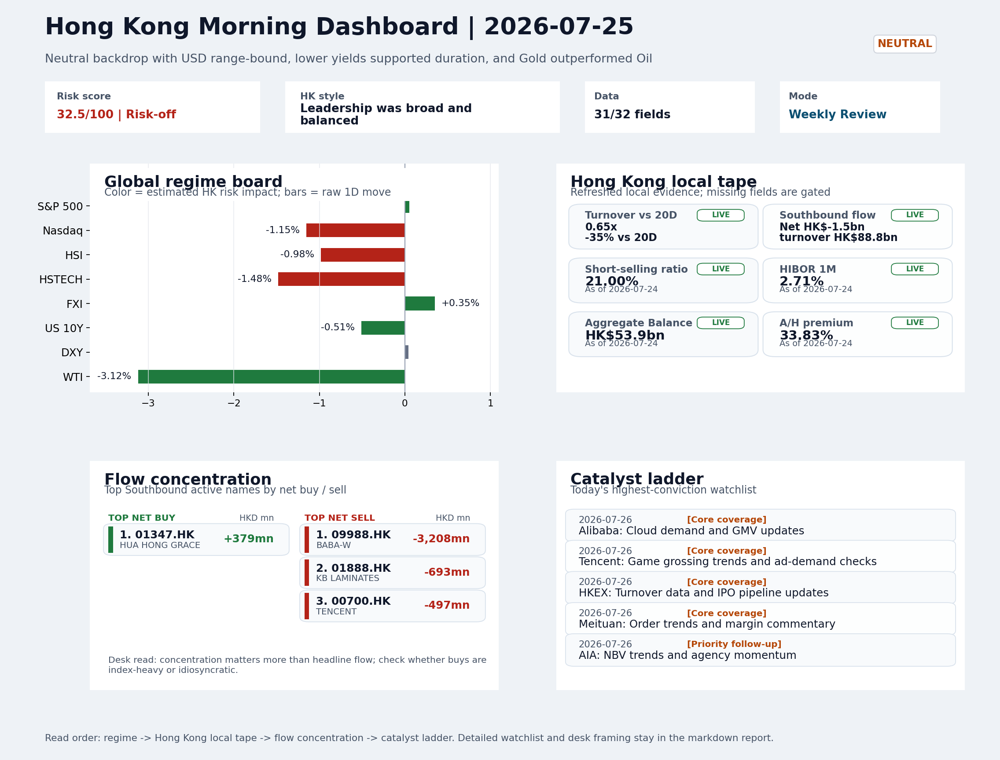
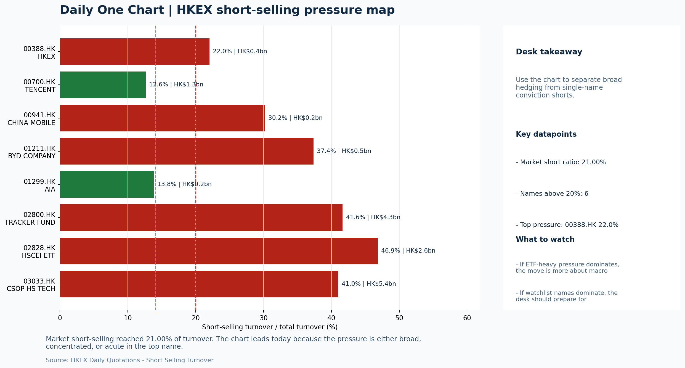
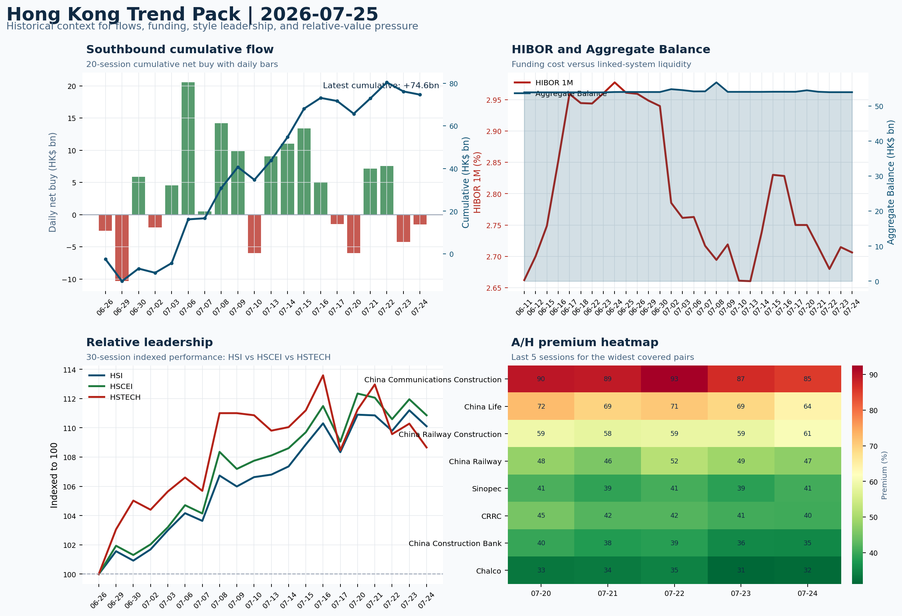

# Morning Research Workbench | 2026-07-26

> Designed for a Hong Kong sell-side commute: Layer 1 `Scan`, Layer 2 `Deep Read`, Layer 3 `Thinking`
> Mode: `Weekly Review` | Use Saturday's non-trading review date to synthesize the completed Hong Kong week and prepare next week's work plan.
> Briefing date: `2026-07-26` | Review date: `2026-07-25` | Global request: `2026-07-25` | HK/China request: `2026-07-24` | Market effective date: `2026-07-24` | Generated at: `2026-07-26 05:53:35`

## Executive Summary

- **Market pulse:** The week confirmed a Neutral backdrop with Gold outperforming Oil and lower yields supporting duration, but the combination of HSTECH underperformance (-1.48%), elevated short-selling.
- **Hong Kong lens:** Hong Kong growth / internet led. The Monday open is likely to face mixed signals: lower US yields and gold strength are constructive for duration, but rate-hike repricing, Moody's concern, and elevated.
- **Top catalysts:** Neutral backdrop with USD range-bound, lower yields supported duration, and Gold outperformed Oil; CPI MoM (Released).

## Visual Dashboard

## Layer 1 | Weekly Scan (5-10 min)

### 1.1 One-Line Market Pulse
The week confirmed a Neutral backdrop with Gold outperforming Oil and lower yields supporting duration, but the combination of HSTECH underperformance (-1.48%), elevated short-selling (21%), thin turnover (0.65x 20D), and the Friday southbound reversal (-HK$1.5bn) means the constructive setup needs clean confirmation before it becomes an investable thesis.

### 1.2 Global Asset Price Dashboard

| Asset | Last | 1D move | Read |
| --- | --- | --- | --- |
| S&P 500 | 7,411.98 | +0.05% | US large-cap risk appetite |
| Nasdaq 100 | 28,128.34 | -1.15% | Growth and duration leadership |
| Hang Seng Index | 24,963.23 | -0.98% | Hong Kong broad beta |
| Hang Seng TECH | 4.5420 | -1.48% | Hong Kong growth / platform read-through |
| CSI 300 | 4,529.10 | **-3.60%** | Mainland large-cap tone |
| US 10Y | 4.6790 | -0.51% | Global discount-rate anchor |
| China 10Y | 1.73% | -0.4bp | China local rates anchor \| Live public \| Eastmoney \| 2026-07-24 |
| CN-US 10Y spread | -296.2bp | +1.6bp | Relative carry and macro-pressure gauge \| Live public \| Eastmoney \| 2026-07-24 |
| DXY | 101.47 | +0.04% | Dollar liquidity impulse |
| USD/CNH | 6.7490 | +0.00% | Offshore China risk appetite |
| USD/HKD | 7.8414 | +0.02% | Linked-exchange regime stress check |
| Brent crude | 96.78 | **-3.88%** | Energy / geopolitics |
| COMEX gold | 4,067.60 | +0.52% | Hedge demand / real yields |
| Copper | 6.3200 | +0.24% | Global growth proxy |
| VIX | 18.58 | -0.64% | US stress barometer |

### 1.3 Hong Kong Weekly Tape Quick Check

| Check | Value | Status | Source / as of | Why it matters |
| --- | --- | --- | --- | --- |
| Main Board turnover vs 20D | 0.65x \| -35% vs 20D | Live local | HKEX \| 2026-07-24 | Trailing 20-session average turnover was HK$321.6bn. |
| Southbound / Northbound net flow | Southbound Net HK$-1.5bn \| turnover HK$88.8bn \| Northbound Turnover HK$283.8bn \| net not reported | Live local | HKEX Connect \| 2026-07-24 | Southbound net buy is calculated from HKEX disclosed buy and sell turnover. |
| Short-selling ratio | 21.00% | Live local | HKEX \| 2026-07-24 | Official HKEX stock-level short-selling table, aggregated as a share of total market turnover. |
| AH premium index | 33.83% | Live public | Yahoo \| 2026-07-24 | Simple average across 18 A/H pairs; use dispersion rather than the average alone. |
| USD/HKD spot vs band | 7.8414 \| band 7.7500 to 7.8500 | Live quote + local | Yahoo \| 2026-07-24 | Inside the linked-exchange band without immediate boundary stress. Official Convertibility Undertakings define the linked-rate stress boundaries for USD/HKD. |
| HIBOR 1M | 2.71% | Live local | HKMA \| 2026-07-24 | 1M HIBOR is the cleanest quick read for Hong Kong funding conditions and equity-duration pressure. |
| Aggregate Balance | HK$53.9bn | Live local | HKMA \| 2026-07-24 | Aggregate Balance helps frame whether linked-rate liquidity conditions are tight or comfortable. |
| Hong Kong leadership | Hong Kong growth / internet led | Proxy | HSI / HSCEI / HSTECH relative perf \| 2026-07-24 | Use HSI / HSCEI / HSTECH relative moves as the opening style read. |

### 1.4 Risk Dashboard
**Composite risk score:** `32.5/100` | **Regime:** `Risk-off`

| Component | Score impact | Evidence |
| --- | --- | --- |
| US beta | +0.3 | S&P 500 +0.05% |
| HK growth | -7.4 | HSTECH -1.48% |
| Offshore China proxy | +1.8 | FXI +0.35% |
| Dollar pressure | -0.4 | DXY +0.04% |
| Volatility | +1.3 | VIX -0.64% |
| HK short-selling | -8 | Short-selling ratio 21.00% |

### 1.5 Next Week Checklist
1. **Neutral backdrop with USD range-bound, lower yields supported duration, and Gold outperformed Oil**
 Still-moving markets | No fresh Hong Kong cash session is assumed; use global active assets and policy/event flow to prepare the next open.
2. **CPI MoM (Released)**
 Macro / policy | Rates expectations, the dollar, and growth-equity valuation | Industries: Technology, Internet, Brokers
3. **Trade Balance (Released)**
 Macro / policy | Watch whether it changes the day's core market narrative | Industries: Market-wide
4. **Retail Sales MoM (Upcoming)**
 Macro / policy | Consumer resilience, growth expectations, and risk-asset pricing | Industries: Consumer, E-commerce, Consumer discretionary
5. **Loan Prime Rate (Upcoming)**
 Macro / policy | Watch whether it changes the day's core market narrative | Industries: Market-wide

## Layer 2 | Deep Read (20-30 min)

### 2.1 Weekly Cross-Asset Review
> Weekly review mode: synthesize the completed Hong Kong week, retain the main cross-asset and policy lessons, and convert them into next-week preparation rather than treating Saturday as a fresh cash-market session.

#### Market Setup
**Core tape.** Overnight news reinforced the neutral regime established during the week: Fed rate-hike repricing tied to oil strength adds a near-term headwind for growth-equity multiples.
**Main driver.** Gold's outperformance relative to oil and the lower US 10Y yield support the duration bias, but these tailwinds are being tested by Nasdaq's -1.15% decline and the elevated 21% short-selling ratio on Hong Kong.
**HK relevance.** The FXI +0.35% gain against HSI -0.98% signals some offshore China divergence that requires confirmation at the Monday open.

#### Key Drivers
- Fed rate-hike repricing from oil strength directly compresses growth-equity multiples and adds USD upside risk.
- Moody's AI capex credit-quality concern hits mega-cap tech sentiment and by extension Hang Seng TECH.
- Elevated HK short-selling (21%) and thin turnover (0.65x 20D) make rebounds easier to fade.
- US 10Y -0.51% and gold outperformance support duration, but this is being overridden by growth-style pressure from Nasdaq.

#### Hong Kong Read-Through
**Desk lens.** Leadership was broad and balanced.
**Opening implication.** The Monday open is likely to face mixed signals: lower US yields and gold strength are constructive for duration, but rate-hike repricing, Moody's concern.
- **Cross-market read:** Hang Seng -0.98% / HSCEI -0.98% / HSTECH -1.48%.
- **Cross-market read:** Offshore China proxy FXI +0.35% and USD/CNH +0.00% frame cross-border risk appetite.
- **Cross-market read:** USD/HKD last traded around 7.8414, which keeps the Hong Kong funding lens in focus.

#### Watch Points
- USD composite moved higher by +0.01pct intraday, with a 0.132pct range.
- Main turning points appeared around 2026-07-24 08:05 trough / 2026-07-24 08:20 trough / 2026-07-24 08:40 peak, suggesting event-driven repricing.
- The biggest cross-asset divergence was Gold versus Oil, a spread of 3.774pct.
- Gold moved +0.98pct intraday with a 1.387pct high-low range.

#### Weekly Review Map
- Weekly review window: 2026-07-20 to 2026-07-24. Core regime: Neutral backdrop with USD range-bound, lower yields supported duration, and Gold outperformed Oil. Hong Kong leadership: Leadership was broad and balanced.
- Method note: Trend summary uses the latest available five observations from the Hong Kong Trend Pack inputs.

**Cross-asset weekly dashboard**

| Asset | Latest move | Weekly read |
| --- | --- | --- |
| S&P 500 | +0.05% | Risk appetite |
| Nasdaq 100 | -1.15% | Growth style |
| Hang Seng Index | -0.98% | Hong Kong beta |
| Hang Seng TECH | -1.48% | Hong Kong growth / internet tone |
| DXY | +0.04% | Global liquidity |
| US 10Y | -0.51% | Rates path |
| Gold | +0.52% | Hedge / real yields |
| VIX | -0.64% | Volatility and hedging |

**Hong Kong / China weekly tape**

| Signal | Latest move | Read |
| --- | --- | --- |
| Hang Seng Index | -0.98% | Hong Kong beta |
| HSCEI | -0.98% | China SOE / H-share tone |
| Hang Seng TECH | -1.48% | Hong Kong growth / internet tone |
| China proxy (FXI) | +0.35% | China sentiment |
| USD/CNH | +0.00% | China FX sentiment |
| USD/HKD | +0.02% | Hong Kong funding lens |

**Five-session trend evidence**
_Window: 2026-07-20 to 2026-07-24_

| Signal | Five-session change | Latest | Desk read |
| --- | --- | --- | --- |
| Southbound flow | +3.0bn over 5 sessions | -1.5bn | 2/5 positive sessions; cumulative buying is the flow-confirmation test for next week. |
| HKD funding | HIBOR -4bp; Aggregate Balance -0.5bn | 2.71% / HK$53.9bn | Funding stress matters if HIBOR rises while Aggregate Balance contracts. |
| HK style leadership | HSI led (-0.8pp); HSTECH lagged (-2.6pp) | HSI leadership | Use HSI / HSCEI / HSTECH spread to separate broad beta from growth-led rerating. |
| A/H premium dispersion | -2.8pp average change | 50.7% average premium | Premium narrowing can support H-share relative demand |

**Flow and attribution clues**
- :
- :
- :

**Next-week desk questions**
- Did Southbound flow confirm the index move, or was the week mainly offshore beta without local money follow-through?
- Did HIBOR and Aggregate Balance point to benign funding, or should tighter HKD liquidity be part of next week's risk case?
- Was leadership broad enough beyond HSTECH / platform beta, or was the week concentrated in a narrow style pocket?
- Which dated macro, policy, earnings, or IPO catalyst can realistically change the next-week narrative?
- What single data point would invalidate the base-case market pulse by Monday or Tuesday morning?

**Key developments to retain**

| Bucket | Item | Why it matters |
| --- | --- | --- |
| B | Saudi Arabia-Bound Supertanker U-Turns Before Houthi Chokepoint | This is more about order visibility and product-cycle validation |
| C | Big Tech Debt Flood Is Taking Over Risk In Market: Credit Weekly | Assess whether the story can propagate through the Semiconductors and AI value chain |
| C | JPMorgan report finds dramatic jump in AI-themed ETFs - | Assess whether the story can propagate through the Financials value chain |
| Released | CPI MoM | Rates expectations, the dollar, and growth-equity valuation |
| Released | Trade Balance | Watch whether it changes the day's core market narrative |
| Upcoming | Retail Sales MoM | Consumer resilience, growth expectations, and risk-asset pricing |

**Next-week playbook**

| Date | Catalyst | Desk read |
| --- | --- | --- |
| 2026-07-26 | Alibaba: Cloud demand and GMV updates | Key read-through for China consumption, cloud, and platform regulation |
| 2026-07-26 | Tencent: Game grossing trends and ad-demand checks | Core offshore China platform proxy for gaming, ads, and AI monetization |
| 2026-07-26 | HKEX: Turnover data and IPO pipeline updates | Direct proxy for Hong Kong market turnover, listings, and southbound interest |
| 2026-07-26 | Meituan: Order trends and margin commentary | High-frequency read on local services demand and platform competition |
| 2026-07-26 | AIA: NBV trends and agency momentum | Read-through for wealth demand, mainland visitor activity, and HK financial sentiment |
| 2026-07-26 | China Mobile: Capex updates and dividend policy signals | Defensive SOE benchmark for yield trade and domestic digital-infrastructure spend |
| 2026-07-26 | BYD Company: Weekly sales data and model rollout cadence | Hong Kong-listed proxy for EV volumes, export mix, and price competition |
| 2026-07-26 | Hang Seng TECH ETF: AI narrative shifts and China platform | Fast proxy for Hong Kong internet and growth leadership |

**Curated overnight stories**
1. **Odds of Federal Reserve rate hike surge as oil prices rip higher**
 Why it matters: Higher oil sustaining inflation expectations could delay Fed easing, compressing growth-equity multiples and strengthening USD.
 HK read-through: Direct hit to Hong Kong growth and rate-sensitive sectors (real estate, financials, consumer discretionary).
2. **Moody's says 'unprecedented' AI spending threatens credit quality of Amazon, Meta**
 Why it matters: Raises concern that AI capex may not translate to earnings expansion if returns do not materialize.
 HK read-through: Most relevant for Hong Kong internet and AI-adjacent names, which often trade relative to US peers.
3. **John Paulson says we are in the early stages of a long-term bull market for gold**
 Why it matters: Corroborates the must-watch theme that Gold outperformed Oil this week. Continued gold strength signals demand for safe-haven and inflation hedge, consistent with.
 HK read-through: Positive for Hong Kong-listed gold miners and precious-metals plays. Also supports duration bias noted in the market theme, indirectly favoring high-quality defensive names.
4. **U.S., other nations back open-source AI with 'strong security' at China summit**
 Why it matters: Open-source AI development may lower barriers for China-based firms to access advanced models, potentially narrowing the technology gap.
 HK read-through: Mildly constructive for China tech sentiment if interpreted as multilateral engagement rather than containment.
5. **Saudi Arabia-Bound Supertanker U-Turns Before Houthi Chokepoint**
 Why it matters: Red Sea disruption affecting energy logistics could sustain shipping costs and oil-product tightness.
 HK read-through: Secondary relevance for Hong Kong shipping and energy names, but does not materially alter the market theme established during the week. Monitor for escalation.

### 2.2 Hong Kong / A-share Weekly Review
> Weekly review mode: synthesize the completed Hong Kong week, retain the main cross-asset and policy lessons, and convert them into next-week preparation rather than treating Saturday as a fresh cash-market session.

#### Local Tape Setup
**Local read.** The week ended with Hong Kong markets declining modestly (HSI -0.98%, HSCEI -0.98%) while growth underperformed (HSTECH -1.48%).
**Verification point.** Style leadership was tilted toward value: HSI and HSCEI moved in line, but HSTECH lagged by roughly 50bp.
**Risk to watch.** The notable divergence was FXI (+0.35%) outperforming the HSI by over 130bp, suggesting some offshore China proxy buying that requires confirmation through the week ahead.

#### Style and Local Leadership
**Style leadership.** Hong Kong growth / internet led.
- **Cross-market read:** Hang Seng -0.98% / HSCEI -0.98% / HSTECH -1.48%.
- **Cross-market read:** Offshore China proxy FXI +0.35% and USD/CNH +0.00% frame cross-border risk appetite.
- **Cross-market read:** USD/HKD last traded around 7.8414, which keeps the Hong Kong funding lens in focus.

#### Flow Confirmation
Official Stock Connect evidence is available; use Section 2.3 to confirm whether local money supports the price action.

#### Follow-Through Checklist
**Follow-through check.** Watch whether turnover recovers above the 0.65x 20D average and whether short-selling ratio falls from 21% at Monday open; if not, the week's index-level moves remain vulnerable to fade.

### 2.3 Flow Tracker and Attribution
#### Cross-Asset Attribution v1

| Driver | Direction | Score | Evidence | HK implication |
| --- | --- | --- | --- | --- |
| Short-selling pressure | drag | 4.2 | HKEX short-selling ratio was 21.00%. | Elevated short activity argues for extra confirmation before chasing rebounds. |
| Hong Kong participation | drag | 3.47 | Main Board turnover was 0.65x the 20-session average. | Thin turnover makes index moves easier to fade. |
| Oil and geopolitics | supportive | 3.1 | Oil moved -3.88%. | Split the read between energy/cyclicals support and margin/geopolitical pressure. |
| US growth-style transmission | drag | 1.61 | Nasdaq 100 moved -1.15%. | Hong Kong growth and platform names should be tested first at the open. |
| Rates impulse | supportive | 0.61 | US 10Y yield proxy moved -0.51%. | Lower yields help long-duration growth; higher yields pressure valuation-sensitive |

#### Flow Tracker
##### Flow Takeaways
- Short-selling pressure is elevated, so local rebounds need cleaner breadth and flow confirmation.
- Stock Connect Southbound: net HK$-1.5bn on turnover HK$88.8bn (as of 2026-07-24).
- Stock Connect Northbound: turnover RMB283.8bn; public file provides total turnover/top active names, not full net-buy.
- AH premium: simple covered-pair average +33.83%; widest premium: China Communications Construction 98.89%.

##### Stock Connect Southbound Active Names

| Rank | Ticker | Name | Buy | Sell | Net buy |
| --- | --- | --- | --- | --- | --- |
| 2 | 09988.HK | BABA-W | HK$1,582.2mn | HK$4,790.2mn | HK$-3,208.0mn |
| 7 | 01888.HK | KB LAMINATES | HK$800.1mn | HK$1,493.0mn | HK$-692.9mn |
| 3 | 00700.HK | TENCENT | HK$2,413.9mn | HK$2,910.8mn | HK$-496.8mn |
| 5 | 01347.HK | HUA HONG GRACE | HK$1,796.0mn | HK$1,417.4mn | HK$378.6mn |
| 6 | 03690.HK | MEITUAN-W | HK$351.8mn | HK$691.4mn | HK$-339.6mn |

##### AH Premium Dispersion

| Name | A ticker | H ticker | Premium | As of |
| --- | --- | --- | --- | --- |
| China Communications Construction | 601800.SS | 1800.HK | +98.89% | 2026-07-24 |
| China Life | 601628.SS | 2628.HK | +64.06% | 2026-07-24 |
| China Railway Construction | 601186.SS | 1186.HK | +61.11% | 2026-07-24 |
| China Railway | 601390.SS | 0390.HK | +47.38% | 2026-07-24 |
| Sinopec | 600028.SS | 0386.HK | +40.69% | 2026-07-24 |

##### HKEX Short-Selling Watch

| Ticker | Name | Short ratio | Short turnover | Total turnover |
| --- | --- | --- | --- | --- |
| 00388.HK | HKEX | 22.02% | HK$0.4bn | HK$1.8bn |
| 00700.HK | TENCENT | 12.63% | HK$1.3bn | HK$10.0bn |
| 00941.HK | CHINA MOBILE | 30.20% | HK$0.2bn | HK$0.8bn |
| 01211.HK | BYD COMPANY | 37.36% | HK$0.5bn | HK$1.2bn |
| 01299.HK | AIA | 13.84% | HK$0.2bn | HK$1.8bn |

- **Short-value leaders:** 03033.HK CSOP HS TECH (HK$5.4bn); 02800.HK TRACKER FUND (HK$4.3bn); 02828.HK HSCEI ETF (HK$2.6bn); 07709.HK XL2CSOPHYNIX (HK$2.6bn).

### 2.4 Macro and Policy Tracking
**Desk read.** Use the calendar table and released data below as the primary macro read.

| Time | Region | Event | Status | Desk read |
| --- | --- | --- | --- | --- |
| 20:30 | US | CPI MoM | Released | Impact: Rates expectations, the dollar, and growth-equity valuation \| Attention: 5/5 \| Industries: Technology, Internet, Brokers |
| 09:30 | China | Trade Balance | Released | Impact: Watch whether it changes the day's core market narrative \| Attention: 3/5 \| Industries: Market-wide |
| 20:30 | US | Retail Sales MoM | Upcoming | Impact: Consumer resilience, growth expectations, and risk-asset pricing \| Attention: 5/5 \| Industries: Consumer, E-commerce, Consumer discretionary |
| 09:20 | China | Loan Prime Rate | Upcoming | Impact: Watch whether it changes the day's core market narrative \| Attention: 3/5 \| Industries: Market-wide |
| 22:00 | Federal Reserve | Jerome Powell: Economic outlook remarks | Central bank | Impact: Policy path, liquidity conditions, and cross-asset risk appetite \| Attention: 5/5 \| Industries: Technology, Financials, Gold |
| 10:00 | PBOC | Open Market Operations Desk: Daily liquidity operation window | Central bank | Impact: Policy path, liquidity conditions, and cross-asset risk appetite \| Attention: 3/5 \| Industries: Technology, Financials, Gold |

#### Positioning and Risk Backdrop
- Options activity centered on KWEB Call, with Vol/OI at 1.88x and a bullish bias.
- Put/Call structure shows equity 0.68 / index 1.15, implying Single-stock optimism with index hedging.
- Geopolitics: Middle East | Regional tension remains elevated | Impact: Oil, freight costs, and safe-haven demand
- Geopolitics: US-China | Technology export-control rhetoric remains active | Impact: China internet, semiconductors, and supply chains

### 2.5 Key Company and Sector Events
No high-conviction sector story cleared the main-report relevance gate for this run.

#### HKEX Announcements

| Grade | Ticker | Type | Release time | Title |
| --- | --- | --- | --- | --- |
| A | 00157.HK | Profit warning | 2026-07-24 | Profit warning / alert announcement |
| A | 00551.HK | Profit warning | 2026-07-24 | Profit warning / alert announcement |
| A | 00587.HK | Profit warning | 2026-07-24 | Profit warning / alert announcement |
| A | 00613.HK | Profit warning | 2026-07-24 | Profit warning / alert announcement |
| A | 00911.HK | Profit warning | 2026-07-24 | Profit warning / alert announcement |
| A | 01203.HK | Profit warning | 2026-07-24 | Profit warning / alert announcement |
| A | 01583.HK | Profit warning | 2026-07-24 | Profit warning / alert announcement |
| A | 01610.HK | Profit warning | 2026-07-24 | Profit warning / alert announcement |

#### Earnings / Results Watch

| Ticker | Company | Timing | Expectation framing |
| --- | --- | --- | --- |
| 0700.HK | Tencent Holdings | After Market Close | EPS est. 4.15 HKD \| revenue est. 163.2bn HKD |
| 0388.HK | Hong Kong Exchanges and Clearing | Before Market Open | EPS est. 2.81 HKD \| revenue est. 6.0bn HKD |

#### Rating Changes
- **9988.HK** | Morgan Stanley | Upgrade | Equal Weight -> Overweight | PT 92 -> 105

#### IPO Watch
- IPO and grey-market monitoring is not yet part of the standard production pack.

### 2.6 Today's Core Names
#### Core coverage

| Name | Ticker | Last | 1D | Range position | Morning note |
| --- | --- | --- | --- | --- | --- |
| Alibaba | 9988.HK | 110.00 | -4.26% | Mid-range | Short-term pressure is visible; check for a fundamental or regulatory reason. |
| Tencent | 0700.HK | 434.60 | -2.38% | Mid-range | Short-term pressure is visible; check for a fundamental or regulatory reason. |

**Recent headlines for Alibaba:**
- [BABA's International Commerce Narrows Losses: Can It Sustain Momentum?](https://finance.yahoo.com/markets/stocks/articles/babas-international-commerce-narrows-losses-144200501.html) (Zacks)

#### Priority follow-up

| Name | Ticker | Last | 1D | Range position | Morning note |
| --- | --- | --- | --- | --- | --- |
| AIA | 1299.HK | 78.10 | -0.64% | Mid-range | Positioning is neutral for now, so use it mainly to monitor marginal information changes. |
| China Mobile | 0941.HK | 81.75 | +0.43% | Mid-range | Positioning is neutral for now, so use it mainly to monitor marginal information changes. |

## Layer 3 | Thinking (10-15 min)

### 3.1 Rotating Theme Deep Dive

| Field | Read |
| --- | --- |
| Theme | AI and Compute Chain |
| Angle for the day | Track whether global AI capex, semis, cloud, and server demand are still carrying offshore China internet and hardware sentiment. |

**Theme desk read**
**Core thesis.** The week ending 2026-07-24 confirmed a Neutral backdrop: USD range-bound, lower yields supporting duration, and Gold outperforming Oil.
**Evidence.** Leadership was broad but HSI led (-0.8pp) while HSTECH lagged (-2.6pp), suggesting the index move was not purely growth-led.
**What to test.** Southbound flow accumulated +3.0bn over five sessions but the latest session showed -1.5bn with only 2/5 positive days - the critical question is whether cumulative buying was confirmed by local money or reflects offshore.

**Signals to keep in mind**
- Big Tech Debt Flood Is Taking Over Risk In Market: Credit Weekly: Assess whether the story can propagate through the Semiconductors and AI
- JPMorgan report finds dramatic jump in AI-themed ETFs - despite rough quarter
- WTI crude -3.12%: Softer oil argues for a more cautious cyclical-growth read.
- Bitcoin -1.45%: Keep tracking it to confirm whether the core daily narrative is holding.

**LLM watch items:**
- Southbound flow on 2026-07-27 - did it confirm the weekly accumulation or was the -1.5bn session a turn?
- Alibaba (9988.HK) Cloud demand and GMV update on 2026-07-26 - any fundamental signal to explain the -4.26% weekly close?
- Tencent (0700.HK) game grossing trends and ad-demand checks - confirms whether the platform-proxy holds for AI monetization narrative.
- HKEX (0388.HK) turnover data - verifies whether the broad leadership week had actual volume follow-through.
- AIA (1299.HK) NBV and agency momentum - reads through to wealth demand and HK financial sentiment ahead of potential rate catalysts.

**Related names to keep close:**

| Name | Ticker | Bucket | Morning read |
| --- | --- | --- | --- |
| Alibaba | 9988.HK | Core coverage | Short-term pressure is visible; check for a fundamental or regulatory reason. |
| Tencent | 0700.HK | Core coverage | Short-term pressure is visible; check for a fundamental or regulatory reason. |
| HKEX | 0388.HK | Core coverage | Positioning is neutral for now, so use it mainly to monitor marginal information changes. |
| AIA | 1299.HK | Priority follow-up | Positioning is neutral for now, so use it mainly to monitor marginal information changes. |

**Upcoming catalysts tied to the theme:**
- 2026-07-26 | Alibaba: Cloud demand and GMV updates | Key read-through for China consumption, cloud, and platform regulation
- 2026-07-26 | Tencent: Game grossing trends and ad-demand checks | Core offshore China platform proxy for gaming, ads, and AI monetization
- 2026-07-26 | AIA: NBV trends and agency momentum | Read-through for wealth demand, mainland visitor activity, and HK financial sentiment
- 2026-07-26 | Hang Seng TECH ETF: AI narrative shifts and China platform regulation headlines | Fast proxy for Hong Kong internet and growth leadership

**Relevant headlines:**
- [Big Tech Debt Flood Is Taking Over Risk In Market: Credit Weekly](https://www.bloomberg.com/news/articles/2026-07-25/big-tech-debt-flood-is-taking-over-risk-in-market-credit-weekly)
- [JPMorgan report finds dramatic jump in AI-themed ETFs - despite rough quarter](https://www.cnbc.com/2026/07/23/jpmorgan-dramatic-jump-in-ai-etfs-despite-rough-quarter.html)

### 3.2 Next Week Calendar and Reopen Prep
- Non-trading review: use today's calendar to prepare the next Hong Kong open rather than treating the last cash tape as a fresh signal.
- Macro: CPI MoM is the first item to anchor the open and the rates/FX response.
- Corporate / event: Alibaba: Cloud demand and GMV updates is the cleanest same-day catalyst to prepare for.

**Same-day macro docket**

| Time | Country | Event | Status | Detail |
| --- | --- | --- | --- | --- |
| 20:30 | US | CPI MoM | Released | Actual 0.3% / Forecast 0.2% / Prior 0.4% |
| 09:30 | China | Trade Balance | Released | Actual USD 85.2bn / Forecast USD 79.0bn / Prior USD 80.6bn |
| 20:30 | US | Retail Sales MoM | Upcoming | Forecast 0.3% / Prior 0.6% |
| 09:20 | China | Loan Prime Rate | Upcoming | Forecast 3.45% / Prior 3.45% |
| 22:00 | Federal Reserve | Jerome Powell: Economic outlook remarks | Central bank | speech |

**Same-day catalyst list**

| Date | Time | Category | Event | Importance |
| --- | --- | --- | --- | --- |
| 2026-07-26 | | Core coverage | Alibaba: Cloud demand and GMV updates | 3 |
| 2026-07-26 | | Core coverage | Tencent: Game grossing trends and ad-demand checks | 3 |
| 2026-07-26 | | Core coverage | HKEX: Turnover data and IPO pipeline updates | 3 |
| 2026-07-26 | | Core coverage | Meituan: Order trends and margin commentary | 3 |

**Next few sessions**

| Date | Category | Event | Impact |
| --- | --- | --- | --- |
| 2026-07-26 | Core coverage | Alibaba: Cloud demand and GMV updates | Key read-through for China consumption, cloud, and platform regulation |
| 2026-07-26 | Core coverage | Tencent: Game grossing trends and ad-demand checks | Core offshore China platform proxy for gaming, ads, and AI monetization |
| 2026-07-26 | Core coverage | HKEX: Turnover data and IPO pipeline updates | Direct proxy for Hong Kong market turnover, listings, and southbound |
| 2026-07-26 | Core coverage | Meituan: Order trends and margin commentary | High-frequency read on local services demand and platform competition |

### 3.3 Daily One Chart
**Daily One Chart | HKEX short-selling pressure map**

**Chart read.** Market short-selling reached 21.00% of turnover.
**Why it matters.** The chart leads today because the pressure is either broad, concentrated, or acute in the top name.

_Source: HKEX Daily Quotations - Short Selling Turnover_

### 3.4 Hong Kong Trend Pack
**Hong Kong Trend Pack**

**Trend read.** Four historical lenses: Southbound cumulative flow, HKMA funding and liquidity, HSI/HSCEI/HSTECH relative leadership, and A/H premium dispersion.

_Source: HKEX Stock Connect, HKMA liquidity data, and public Yahoo Finance quotes_

## Traceable Appendix

### Report Metadata
> Date policy: Review date 2026-07-25 is treated as `Weekly Review`. | Global request date is 2026-07-25; adapter effective date is 2026-07-24 and summary date is 2026-07-24. | HK/China local data date is 2026-07-24; role: last completed HK/China cash-market reference tape.
> Market data quality: Coverage: `31/32` | Stale items (>1d): `2` | Missing: `1`
> Report quality: `84.0/100` | Grade `B` | Status `usable with caveats`

### Key Questions to Keep in Mind
- Is risk appetite rising or fading? The overnight tape reads closer to `Neutral`.
- Did rates expectations move? Focus on whether US 10Y, DXY, and growth style moved together.
- Were commodities the real story? Watch WTI and gold for geopolitics versus inflation signals.
- Is Hong Kong setup internet-led, SOE-led, or broad beta-led? Compare HSTECH, HSCEI, and HSI.
- Did offshore markets move China risk appetite? Focus on HSI, FXI, USD/CNH, and USD/HKD.

### Report Quality and Validation
- **Quality score:** 84.0/100 | **Grade:** B | **Status:** usable with caveats
- **Run summary:** 7 healthy | 1 caveat | 0 failed
- **Release recommendation:** Send with caveats | The report is usable, but the advisory guidance should travel with it so readers understand the data gaps.

| Source | Status | Bucket |
| --- | --- | --- |
| Market data | ok | healthy |
| Sector and company news | ok | healthy |
| Movers and short selling | ok | healthy |
| Stock Connect | ok | healthy |
| A/H premium | ok | healthy |
| Hong Kong local package | ok | healthy |
| China rates | ok | healthy |
| Narrative overlay | partial | caveat |

**Desk-use guidance summary:** 0 blocking | 1 advisory

**Desk-use guidance**
- **Advisory:** Use deterministic sections as primary support; the narrative overlay was partial or unavailable on this run.

| Component | Score | Weight | Read |
| --- | --- | --- | --- |
| Market data coverage | 96.9 | 0.3 | 31/32 core market fields available. |
| Hong Kong local metrics | 82.3 | 0.25 | 8 live, 3 proxy, 0 unavailable local checks. |
| Key public adapters | 100.0 | 0.2 | 4/4 key adapters were available or partially available. |
| Narrative overlay health | 28.6 | 0.15 | 0/7 narrative overlay tasks succeeded or used validated cache; 2 error(s). |
| Fact-check guardrail | 100.0 | 0.1 | Checked 0 numeric claims; 0 numeric mismatch(es), 0 logic warning(s); 0 critical, 0 review. |

**Quality warnings**
- Narrative overlay health is weak: 0/7 narrative overlay tasks succeeded or used validated cache; 2 error(s).

**Narrative fact-check guardrail**
- Checked 0 numeric claims; 0 numeric mismatch(es), 0 logic warning(s); 0 critical, 0 review.

**Adapter status**

| Adapter | Status |
| --- | --- |
| Stock Connect | ok |
| A/H premium | ok |
| HKEX announcements | ok |
| China rates | ok |

### Source Links
- [BABA's International Commerce Narrows Losses: Can It Sustain Momentum?](https://finance.yahoo.com/markets/stocks/articles/babas-international-commerce-narrows-losses-144200501.html) (Zacks)
- [00157.HK Profit warning / alert announcement](http://www1.hkexnews.hk/listedco/listconews/sehk/2026/0724/2026072401154.pdf) (HKEXnews)
- [00551.HK Profit warning / alert announcement](http://www1.hkexnews.hk/listedco/listconews/sehk/2026/0724/2026072400384.pdf) (HKEXnews)
- [00587.HK Profit warning / alert announcement](http://www1.hkexnews.hk/listedco/listconews/sehk/2026/0724/2026072401702.pdf) (HKEXnews)
- [00613.HK Profit warning / alert announcement](http://www1.hkexnews.hk/listedco/listconews/sehk/2026/0724/2026072400722.pdf) (HKEXnews)
- [00911.HK Profit warning / alert announcement](http://www1.hkexnews.hk/listedco/listconews/sehk/2026/0724/2026072400840.pdf) (HKEXnews)
- [01203.HK Profit warning / alert announcement](http://www1.hkexnews.hk/listedco/listconews/sehk/2026/0724/2026072401140.pdf) (HKEXnews)
- [01583.HK Profit warning / alert announcement](http://www1.hkexnews.hk/listedco/listconews/sehk/2026/0724/2026072400316.pdf) (HKEXnews)
- [01610.HK Profit warning / alert announcement](http://www1.hkexnews.hk/listedco/listconews/sehk/2026/0724/2026072401384.pdf) (HKEXnews)

## Supplementary Visual Appendix

This appendix is professional-path only. It keeps a traceable index of the report visuals and the deterministic chart cues used to frame the morning note, without injecting the legacy intraday chart pack.

### Visual Index

| Visual | Path | Role |
| --- | --- | --- |
| Visual Dashboard | `charts/dashboard_2026-07-26.png` | Cross-asset regime board and Hong Kong local tape snapshot. |
| Daily One Chart | `charts/daily_one_chart_2026-07-26.png` | Single highest-conviction visual story for the day. |
| Hong Kong Trend Pack | `charts/hk_trend_pack_2026-07-26.png` | Historical context for flows, liquidity, leadership, and A/H dispersion. |

### Deterministic Chart Cues
- FX / liquidity: USD composite moved higher by +0.01pct intraday, with a 0.132pct range.
- FX / liquidity: Main turning points appeared around 2026-07-24 08:05 trough / 2026-07-24 08:20 trough / 2026-07-24 08:40 peak, suggesting event-driven repricing rather than a clean one-way USD move.
- Cross-asset: The biggest cross-asset divergence was Gold versus Oil, a spread of 3.774pct.
- Cross-asset: Gold moved +0.98pct intraday with a 1.387pct high-low range.
- Cross-asset: Oil moved -2.80pct intraday with a 4.288pct high-low range.
- Cross-asset: Bitcoin moved -1.38pct intraday with a 3.085pct high-low range.

### Risk Dashboard Components

| Component | Score impact | Evidence |
| --- | --- | --- |
| US beta | +0.3 | S&P 500 +0.05% |
| HK growth | -7.4 | HSTECH -1.48% |
| Offshore China proxy | +1.8 | FXI +0.35% |
| Dollar pressure | -0.4 | DXY +0.04% |
| Volatility | +1.3 | VIX -0.64% |
| HK short-selling | -8 | Short-selling ratio 21.00% |
