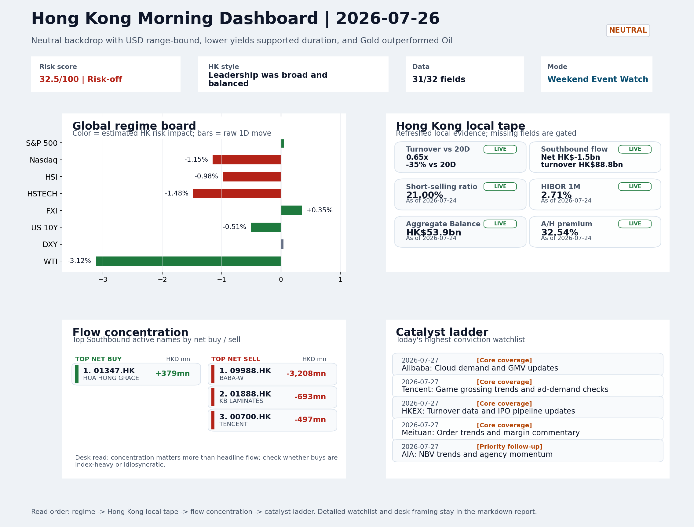

# Morning Research Workbench | 2026-07-27

> Designed for a Hong Kong sell-side commute: Layer 1 `Scan`, Layer 2 `Deep Read`, Layer 3 `Thinking`
> Mode: `Weekend Event Watch` | Track weekend policy, geopolitics, still-moving assets, and Monday open preparation rather than replaying stale cash-market tape.
> Briefing date: `2026-07-27` | Review date: `2026-07-26` | Global request: `2026-07-26` | HK/China request: `2026-07-24` | Market effective date: `2026-07-24` | Generated at: `2026-07-27 05:57:38`

## Executive Summary

- **Market pulse:** Weekend still-moving signals - lower oil, lower yields, and defensive gold demand - leave the Monday setup for Hong Kong growth names conditional rather than directional, with Alibaba's cloud.
- **Hong Kong lens:** Hong Kong growth / internet led. The Monday open lacks a clean directional anchor - oil's pullback is constructive for rate-sensitive Hong Kong growth names only if it holds, while gold's rise and short-selling.
- **Top catalysts:** Neutral backdrop with USD range-bound, lower yields supported duration, and Gold outperformed Oil; CPI MoM (Released).

## Visual Dashboard

## Layer 1 | Reset (5-10 min)

### 1.1 One-Line Market Pulse
Weekend still-moving signals - lower oil, lower yields, and defensive gold demand - leave the Monday setup for Hong Kong growth names conditional rather than directional, with Alibaba's cloud update the first clean catalyst.

### 1.2 Global Asset Price Dashboard

| Asset | Last | 1D move | Read |
| --- | --- | --- | --- |
| S&P 500 | 7,411.98 | +0.05% | US large-cap risk appetite |
| Nasdaq 100 | 28,128.34 | -1.15% | Growth and duration leadership |
| Hang Seng Index | 24,963.23 | -0.98% | Hong Kong broad beta |
| Hang Seng TECH | 4.5420 | -1.48% | Hong Kong growth / platform read-through |
| CSI 300 | 4,529.10 | **-3.60%** | Mainland large-cap tone |
| US 10Y | 4.6790 | -0.51% | Global discount-rate anchor |
| China 10Y | 1.73% | -0.4bp | China local rates anchor \| Live public \| Eastmoney \| 2026-07-24 |
| CN-US 10Y spread | -296.2bp | +1.6bp | Relative carry and macro-pressure gauge \| Live public \| Eastmoney \| 2026-07-24 |
| DXY | 101.47 | +0.04% | Dollar liquidity impulse |
| USD/CNH | 6.7490 | +0.00% | Offshore China risk appetite |
| USD/HKD | 7.8411 | +0.02% | Linked-exchange regime stress check |
| Brent crude | 96.78 | **-3.88%** | Energy / geopolitics |
| COMEX gold | 4,067.60 | +0.52% | Hedge demand / real yields |
| Copper | 6.3200 | +0.24% | Global growth proxy |
| VIX | 18.58 | -0.64% | US stress barometer |

### 1.3 Hong Kong Last Cash-Tape Quick Check (Reference)

| Check | Value | Status | Source / as of | Why it matters |
| --- | --- | --- | --- | --- |
| Main Board turnover vs 20D | 0.65x \| -35% vs 20D | Live local | HKEX \| 2026-07-24 | Trailing 20-session average turnover was HK$321.6bn. |
| Southbound / Northbound net flow | Southbound Net HK$-1.5bn \| turnover HK$88.8bn \| Northbound Turnover HK$283.8bn \| net not reported | Live local | HKEX Connect \| 2026-07-24 | Southbound net buy is calculated from HKEX disclosed buy and sell turnover. |
| Short-selling ratio | 21.00% | Live local | HKEX \| 2026-07-24 | Official HKEX stock-level short-selling table, aggregated as a share of total market turnover. |
| AH premium index | 32.54% | Live public | Yahoo \| 2026-07-24 | Simple average across 16 A/H pairs; use dispersion rather than the average alone. |
| USD/HKD spot vs band | 7.8411 \| band 7.7500 to 7.8500 | Live quote + local | Yahoo \| 2026-07-24 | Inside the linked-exchange band without immediate boundary stress. Official Convertibility Undertakings define the linked-rate stress boundaries for USD/HKD. |
| HIBOR 1M | 2.71% | Live local | HKMA \| 2026-07-24 | 1M HIBOR is the cleanest quick read for Hong Kong funding conditions and equity-duration pressure. |
| Aggregate Balance | HK$53.9bn | Live local | HKMA \| 2026-07-24 | Aggregate Balance helps frame whether linked-rate liquidity conditions are tight or comfortable. |
| Hong Kong leadership | Hong Kong growth / internet led | Proxy | HSI / HSCEI / HSTECH relative perf \| 2026-07-24 | Use HSI / HSCEI / HSTECH relative moves as the opening style read. |

### 1.4 Risk Dashboard
**Composite risk score:** `32.5/100` | **Regime:** `Risk-off`

| Component | Score impact | Evidence |
| --- | --- | --- |
| US beta | +0.3 | S&P 500 +0.05% |
| HK growth | -7.4 | HSTECH -1.48% |
| Offshore China proxy | +1.8 | FXI +0.35% |
| Dollar pressure | -0.4 | DXY +0.04% |
| Volatility | +1.3 | VIX -0.64% |
| HK short-selling | -8 | Short-selling ratio 21.00% |

### 1.5 Next Open Checklist
1. **Neutral backdrop with USD range-bound, lower yields supported duration, and Gold outperformed Oil**
 Still-moving markets | No fresh Hong Kong cash session is assumed; use global active assets and policy/event flow to prepare the next open.
2. **CPI MoM (Released)**
 Macro / policy | Rates expectations, the dollar, and growth-equity valuation | Industries: Technology, Internet, Brokers
3. **Trade Balance (Released)**
 Macro / policy | Watch whether it changes the day's core market narrative | Industries: Market-wide
4. **Retail Sales MoM (Upcoming)**
 Macro / policy | Consumer resilience, growth expectations, and risk-asset pricing | Industries: Consumer, E-commerce, Consumer discretionary
5. **Loan Prime Rate (Upcoming)**
 Macro / policy | Watch whether it changes the day's core market narrative | Industries: Market-wide

## Layer 2 | Deep Read (20-30 min)

### 2.1 Still-Moving Global Financial Actions
> Non-trading mode: treat the cash-market tape below as last-available reference, not a fresh trading signal. Priority shifts to policy headlines, geopolitics, central-bank repricing, FX/commodities/crypto, corporate actions, and next-open preparation.

#### Market Setup
**Core tape.** The dominant weekend signal is oil's sharp reversal (-3.12% intraday).
**Main driver.** Gold's concurrent rise (+0.52%) with a flat dollar suggests geopolitical or hedge demand rather than clean risk-on, keeping the cross-asset backdrop ambiguous.
**HK relevance.** Short-selling at 21% of Hong Kong turnover and below-average participation (0.65x the 20-session average) mean any rebound attempt faces thin market depth.

#### Key Drivers
- Oil reversed sharply from recent highs (-3.12%), potentially easing the energy-driven inflation narrative that had repriced Fed rate-hike.
- Gold rising (+0.52%) alongside a range-bound dollar signals safe-haven or geopolitical hedge demand rather than broad risk-on
- Hong Kong short-selling elevated at 21% and turnover 35% below the 20-day average creates fragile market depth for any bounce
- US mega-cap growth style remained under pressure (Nasdaq -1.15% on last tape), with Moody's warning on AI capex adding a credit-quality.

#### Hong Kong Read-Through
**Desk lens.** Leadership was broad and balanced.
**Opening implication.** The Monday open lacks a clean directional anchor - oil's pullback is constructive for rate-sensitive Hong Kong growth names only if it holds.
- **Cross-market read:** Hang Seng -0.98% / HSCEI -0.98% / HSTECH -1.48%.
- **Cross-market read:** Offshore China proxy FXI +0.35% and USD/CNH +0.00% frame cross-border risk appetite.
- **Cross-market read:** USD/HKD last traded around 7.8411, which keeps the Hong Kong funding lens in focus.

#### Watch Points
- USD composite moved higher by +0.01pct intraday, with a 0.132pct range.
- Main turning points appeared around 2026-07-24 08:05 trough / 2026-07-24 08:20 trough / 2026-07-24 08:40 peak, suggesting event-driven repricing.
- The biggest cross-asset divergence was Gold versus Oil, a spread of 3.774pct.
- Gold moved +0.98pct intraday with a 1.387pct high-low range.

#### Non-Trading Focus Map
- No fresh Hong Kong cash-market session is assumed for 2026-07-26; HK local tape is last completed HK/China cash-market reference tape from 2026-07-24.

| Monitor | Bucket | Last | Move | Why it matters |
| --- | --- | --- | --- | --- |
| WTI crude | Commodities | 89.31 | -3.12% | Softer oil argues for a more cautious cyclical-growth read. |
| Bitcoin | Crypto | 64,098.50 | -1.45% | Keep tracking it to confirm whether the core daily narrative is holding. |
| VIX | Vol | 18.58 | -0.64% | Keep tracking it to confirm whether the core daily narrative is holding. |
| Gold | Commodities | 4,067.60 | +0.52% | Gold rising with the dollar looks more like geopolitical or pure hedge demand. |
| US 10Y | Rates | 4.6790 | -0.51% | Lower yields tend to support growth style and gold. |
| Copper | Commodities | 6.3200 | +0.24% | Keep tracking it to confirm whether the core daily narrative is holding. |

**Weekend / Holiday Event Docket**

| Channel | Signal | Why monitor | Next check |
| --- | --- | --- | --- |
| Commodities | WTI crude -3.12% | Softer oil argues for a more cautious cyclical-growth read. | Keep this as the bridge signal until the next Hong Kong cash close confirms or |
| Crypto | Bitcoin -1.45% | Keep tracking it to confirm whether the core daily narrative is holding. | Keep this as the bridge signal until the next Hong Kong cash close confirms or |
| Vol | VIX -0.64% | Keep tracking it to confirm whether the core daily narrative is holding. | Keep this as the bridge signal until the next Hong Kong cash close confirms or |
| Commodities | Gold +0.52% | Gold rising with the dollar looks more like geopolitical or pure hedge demand. | Keep this as the bridge signal until the next Hong Kong cash close confirms or |
| Released | CPI MoM | Rates expectations, the dollar, and growth-equity valuation | Check the rates, FX, and China-proxy reaction after release or official |
| Released | Trade Balance | Watch whether it changes the day's core market narrative | Check the rates, FX, and China-proxy reaction after release or official |
| Upcoming | Retail Sales MoM | Consumer resilience, growth expectations, and risk-asset pricing | Check the rates, FX, and China-proxy reaction after release or official |
| Geopolitics | Middle East: Regional tension remains elevated | Oil, freight costs, and safe-haven demand | Map any escalation first into oil, gold, USD, CNH, and HK growth-beta sensitivity. |

**Still-moving actions to track**
- **Geopolitics:** Middle East: Regional tension remains elevated | Oil, freight costs, and safe-haven demand
- **Geopolitics:** US-China: Technology export-control rhetoric remains active | China internet, semiconductors, and supply chains
- **Released:** CPI MoM | Rates expectations, the dollar, and growth-equity valuation
- **Released:** Trade Balance | Watch whether it changes the day's core market narrative
- **Upcoming:** Retail Sales MoM | Consumer resilience, growth expectations, and risk-asset pricing

**Next-open preparation**
- First dated catalyst to prepare: 2026-07-27 | Alibaba: Cloud demand and GMV updates.
- Refresh HKEX turnover, Stock Connect, short-selling, and AH dispersion once the next HK cash session closes.
- Use USD/CNH, USD/HKD, DXY, oil, gold, and crypto as bridge signals before cash markets reopen.
- Prepare one base case and one risk case for the next Hong Kong open instead of over-reading stale cash-market moves.

**Curated overnight stories**
1. **Odds of Federal Reserve rate hike surge as oil prices rip higher**
 Why it matters: Energy-driven inflation re-acceleration could force the Fed to delay cuts or hike, repricing the rate path that underpins growth-asset valuations globally.
 HK read-through: Elevated rate expectations are a direct headwind for Hong Kong growth equities and EM-focused positioning heading into Monday.
2. **Gold outperformed Oil - Neutral backdrop with USD range-bound, lower yields supported**
 Why it matters: The divergence signals safe-haven demand and defensive positioning in still-active markets, which could compress risk appetite at Monday's open.
 HK read-through: Relevant for HK gold miners and commodity-linked names; more broadly reflects the risk-off undertone that could weigh on sentiment-heavy sectors like tech and consumer.
3. **U.S., other nations back open-source AI with 'strong security' at China summit**
 Why it matters: Policy signal that open-source AI development is gaining geopolitical legitimacy, which could reshape the competitive landscape for Chinese and US tech companies in AI.
 HK read-through: Most relevant for Hong Kong-listed internet and AI-adjacent names (Alibaba, Tencent, Baidu). The framing around 'strong security' may offer a narrow constructive narrative.
4. **Moody's says 'unprecedented' AI spending threatens credit quality of Amazon, Meta**
 Why it matters: A credit-quality warning on mega-cap tech raises questions about the sustainability of AI capex cycles, with second-order implications for supply chains and semiconductor.
 HK read-through: Relevant for HK-listed AI beneficiaries and semiconductor names. If US hyperscaler credit concerns grow, it could weigh on related Hong Kong tech sentiment and capital.
5. **Shortsighted stock market can no longer brush off war: 'It's too hard to ignore $100 oil'**
 Why it matters: Energy-price escalation tied to geopolitical risk is being re-priced by market participants, suggesting the era of dismissing supply disruptions may be ending.
 HK read-through: Elevated oil sustains input-cost pressure for energy-importing economies and sectors. Hong Kong aviation, shipping, and energy-consuming industrials face margin risk.

### 2.2 Last Available Hong Kong / A-share Tape (Reference Only)
> Non-trading mode: treat the cash-market tape below as last-available reference, not a fresh trading signal. Priority shifts to policy headlines, geopolitics, central-bank repricing, FX/commodities/crypto, corporate actions, and next-open preparation.

#### Local Tape Setup
**Local read.** Last HK cash tape (24 July) showed HSTECH down 1.48% while HSCEI fell 0.98%, underscoring persistent growth-style underperformance.
**Verification point.** Weekend still-moving assets offered mixed signals: a sharp oil decline (-3.12%) could soften rate-hike repricing, but gold's concurrent rise suggests defensive hedging rather than clean risk-on.
**Risk to watch.** With Southbound net outflows (HK$-1.5bn), elevated short-selling (21%), and turnover at only 0.65x the 20-day average, any Monday bounce faces thin market depth.

#### Style and Local Leadership
**Style leadership.** Hong Kong growth / internet led.
- **Cross-market read:** Hang Seng -0.98% / HSCEI -0.98% / HSTECH -1.48%.
- **Cross-market read:** Offshore China proxy FXI +0.35% and USD/CNH +0.00% frame cross-border risk appetite.
- **Cross-market read:** USD/HKD last traded around 7.8411, which keeps the Hong Kong funding lens in focus.

#### Flow Confirmation
Official Stock Connect evidence is available; use Section 2.3 to confirm whether local money supports the price action.

#### Follow-Through Checklist
**Follow-through check.** Watch whether HSTECH can outperform HSCEI on expanding turnover and whether Southbound shifts from net selling to buying in platform names; a narrow semis-led bounce without broader tech buying would lack durability.

### 2.3 Flow Tracker and Attribution
#### Cross-Asset Attribution v1

| Driver | Direction | Score | Evidence | HK implication |
| --- | --- | --- | --- | --- |
| Short-selling pressure | drag | 4.2 | HKEX short-selling ratio was 21.00%. | Elevated short activity argues for extra confirmation before chasing rebounds. |
| Hong Kong participation | drag | 3.47 | Main Board turnover was 0.65x the 20-session average. | Thin turnover makes index moves easier to fade. |
| Oil and geopolitics | supportive | 3.1 | Oil moved -3.88%. | Split the read between energy/cyclicals support and margin/geopolitical pressure. |
| US growth-style transmission | drag | 1.61 | Nasdaq 100 moved -1.15%. | Hong Kong growth and platform names should be tested first at the open. |
| Rates impulse | supportive | 0.61 | US 10Y yield proxy moved -0.51%. | Lower yields help long-duration growth; higher yields pressure valuation-sensitive |

#### Flow Tracker
##### Flow Takeaways
- Short-selling pressure is elevated, so local rebounds need cleaner breadth and flow confirmation.
- Stock Connect Southbound: net HK$-1.5bn on turnover HK$88.8bn (as of 2026-07-24).
- Stock Connect Northbound: turnover RMB283.8bn; public file provides total turnover/top active names, not full net-buy.
- AH premium: simple covered-pair average +32.54%; widest premium: China Life 64.08%.

##### Stock Connect Southbound Active Names

| Rank | Ticker | Name | Buy | Sell | Net buy |
| --- | --- | --- | --- | --- | --- |
| 2 | 09988.HK | BABA-W | HK$1,582.2mn | HK$4,790.2mn | HK$-3,208.0mn |
| 7 | 01888.HK | KB LAMINATES | HK$800.1mn | HK$1,493.0mn | HK$-692.9mn |
| 3 | 00700.HK | TENCENT | HK$2,413.9mn | HK$2,910.8mn | HK$-496.8mn |
| 5 | 01347.HK | HUA HONG GRACE | HK$1,796.0mn | HK$1,417.4mn | HK$378.6mn |
| 6 | 03690.HK | MEITUAN-W | HK$351.8mn | HK$691.4mn | HK$-339.6mn |

##### AH Premium Dispersion

| Name | A ticker | H ticker | Premium | As of |
| --- | --- | --- | --- | --- |
| China Life | 601628.SS | 2628.HK | +64.08% | 2026-07-24 |
| China Railway Construction | 601186.SS | 1186.HK | +61.13% | 2026-07-24 |
| China Communications Construction | 601800.SS | 1800.HK | +51.21% | 2026-07-24 |
| China Railway | 601390.SS | 0390.HK | +47.39% | 2026-07-24 |
| Sinopec | 600028.SS | 0386.HK | +40.70% | 2026-07-24 |

##### HKEX Short-Selling Watch

| Ticker | Name | Short ratio | Short turnover | Total turnover |
| --- | --- | --- | --- | --- |
| 00388.HK | HKEX | 22.02% | HK$0.4bn | HK$1.8bn |
| 00700.HK | TENCENT | 12.63% | HK$1.3bn | HK$10.0bn |
| 00941.HK | CHINA MOBILE | 30.20% | HK$0.2bn | HK$0.8bn |
| 01211.HK | BYD COMPANY | 37.36% | HK$0.5bn | HK$1.2bn |
| 01299.HK | AIA | 13.84% | HK$0.2bn | HK$1.8bn |

- **Short-value leaders:** 03033.HK CSOP HS TECH (HK$5.4bn); 02800.HK TRACKER FUND (HK$4.3bn); 02828.HK HSCEI ETF (HK$2.6bn); 07709.HK XL2CSOPHYNIX (HK$2.6bn).

### 2.4 Macro and Policy Tracking
**Desk read.** The weekend's two released prints set up a mixed Monday backdrop.

**Market sensitivity.** US CPI for July came in at 0.3% MoM, ahead of the 0.2% forecast and down from 0.4% prior - hot enough to keep Fed rate-cut expectations under pressure but not at a level that forces an immediate repricing of the policy path.

**HK implication.** China trade balance, meanwhile, printed USD 85.2bn versus the USD 79.0bn consensus, a meaningful beat that may anchor the yuan and provide some floor for China-linked equities heading into the open.

**Macro watchpoints**
- DXY and USD/CNH reaction after Powell's remarks at 22:00 HKT on Monday.
- US 10Y yield direction post-Powell; a hawkish surprise would pressure duration and growth proxies.
- US Retail Sales MoM (forecast 0.3%, prior 0.6%) - a below-forecast print would reinforce the cautious cyclical tone from oil.
- WTI crude level and whether the 3.12% decline holds as a bridge signal for Monday's China cyclical and energy names.

| Time | Region | Event | Status | Desk read |
| --- | --- | --- | --- | --- |
| 20:30 | US | CPI MoM | Released | Impact: Rates expectations, the dollar, and growth-equity valuation \| Attention: 5/5 \| Industries: Technology, Internet, Brokers |
| 09:30 | China | Trade Balance | Released | Impact: Watch whether it changes the day's core market narrative \| Attention: 3/5 \| Industries: Market-wide |
| 20:30 | US | Retail Sales MoM | Upcoming | Impact: Consumer resilience, growth expectations, and risk-asset pricing \| Attention: 5/5 \| Industries: Consumer, E-commerce, Consumer discretionary |
| 09:20 | China | Loan Prime Rate | Upcoming | Impact: Watch whether it changes the day's core market narrative \| Attention: 3/5 \| Industries: Market-wide |
| 22:00 | Federal Reserve | Jerome Powell: Economic outlook remarks | Central bank | Impact: Policy path, liquidity conditions, and cross-asset risk appetite \| Attention: 5/5 \| Industries: Technology, Financials, Gold |
| 10:00 | PBOC | Open Market Operations Desk: Daily liquidity operation window | Central bank | Impact: Policy path, liquidity conditions, and cross-asset risk appetite \| Attention: 3/5 \| Industries: Technology, Financials, Gold |

#### Positioning and Risk Backdrop
- Options activity centered on KWEB Call, with Vol/OI at 1.88x and a bullish bias.
- Put/Call structure shows equity 0.68 / index 1.15, implying Single-stock optimism with index hedging.
- Geopolitics: Middle East | Regional tension remains elevated | Impact: Oil, freight costs, and safe-haven demand
- Geopolitics: US-China | Technology export-control rhetoric remains active | Impact: China internet, semiconductors, and supply chains

### 2.5 Key Company and Sector Events
No high-conviction sector story cleared the main-report relevance gate for this run.

#### HKEX Announcements

| Grade | Ticker | Type | Release time | Title |
| --- | --- | --- | --- | --- |
| A | 00157.HK | Profit warning | 2026-07-24 | Profit warning / alert announcement |
| A | 00551.HK | Profit warning | 2026-07-24 | Profit warning / alert announcement |
| A | 00587.HK | Profit warning | 2026-07-24 | Profit warning / alert announcement |
| A | 00613.HK | Profit warning | 2026-07-24 | Profit warning / alert announcement |
| A | 00911.HK | Profit warning | 2026-07-24 | Profit warning / alert announcement |
| A | 01203.HK | Profit warning | 2026-07-24 | Profit warning / alert announcement |
| A | 01583.HK | Profit warning | 2026-07-24 | Profit warning / alert announcement |
| A | 01610.HK | Profit warning | 2026-07-24 | Profit warning / alert announcement |

#### Earnings / Results Watch

| Ticker | Company | Timing | Expectation framing |
| --- | --- | --- | --- |
| 0700.HK | Tencent Holdings | After Market Close | EPS est. 4.15 HKD \| revenue est. 163.2bn HKD |
| 0388.HK | Hong Kong Exchanges and Clearing | Before Market Open | EPS est. 2.81 HKD \| revenue est. 6.0bn HKD |

#### Rating Changes
- **9988.HK** | Morgan Stanley | Upgrade | Equal Weight -> Overweight | PT 92 -> 105

#### IPO Watch
- IPO and grey-market monitoring is not yet part of the standard production pack.

### 2.6 Today's Core Names
#### Core coverage

| Name | Ticker | Last | 1D | Range position | Morning note |
| --- | --- | --- | --- | --- | --- |
| Alibaba | 9988.HK | 110.00 | -4.26% | Mid-range | Short-term pressure is visible; check for a fundamental or regulatory reason. |
| Tencent | 0700.HK | 434.60 | -2.38% | Mid-range | Short-term pressure is visible; check for a fundamental or regulatory reason. |

**Recent headlines for Alibaba:**
- [Morgan Stanley Cuts Its Alibaba Stock Price Target](https://beincrypto.com/morgan-stanley-alibaba-price-target-earnings/) (BeInCrypto)

#### Priority follow-up

| Name | Ticker | Last | 1D | Range position | Morning note |
| --- | --- | --- | --- | --- | --- |
| AIA | 1299.HK | 78.10 | -0.64% | Mid-range | Positioning is neutral for now, so use it mainly to monitor marginal information changes. |
| China Mobile | 0941.HK | 81.75 | +0.43% | Mid-range | Positioning is neutral for now, so use it mainly to monitor marginal information changes. |

## Layer 3 | Thinking (10-15 min)

### 3.1 Rotating Theme Deep Dive

| Field | Read |
| --- | --- |
| Theme | AI and Compute Chain |
| Angle for the day | Track whether global AI capex, semis, cloud, and server demand are still carrying offshore China internet and hardware sentiment. |

**Theme desk read**
**Core thesis.** The AI and compute-chain theme enters Monday's session needing confirmation rather than fresh conviction.
**Evidence.** Last week's offshore China internet tape (Alibaba -4.26%, Tencent -2.38% as of the 24 July HK close) coincided with soft consumption reads - Barrons highlighted e-commerce fatigue and price-war fatigue - and a Morgan Stanley.
**What to test.** Still-moving weekend assets offer a divided signal: WTI crude -3.12% suggests a cautious cyclical-growth view, while gold +0.52% and the US 10Y yield -0.51% support duration-sensitive growth names.

**Signals to keep in mind**
- WTI crude -3.12%: Softer oil argues for a more cautious cyclical-growth read.
- Bitcoin -1.45%: Keep tracking it to confirm whether the core daily narrative is holding.

**LLM watch items:**
- Alibaba: Cloud demand and GMV updates (27 July)
- Tencent: Game grossing trends and ad-demand checks (27 July)
- US CPI release: check rates, DXY, and China-proxy reaction
- WTI crude: whether the -3.12% move extends as a cyclical signal
- US-China technology export-control headlines and rhetoric

**Related names to keep close:**

| Name | Ticker | Bucket | Morning read |
| --- | --- | --- | --- |
| Alibaba | 9988.HK | Core coverage | Short-term pressure is visible; check for a fundamental or regulatory reason. |
| Tencent | 0700.HK | Core coverage | Short-term pressure is visible; check for a fundamental or regulatory reason. |
| HKEX | 0388.HK | Core coverage | Positioning is neutral for now, so use it mainly to monitor marginal information changes. |
| AIA | 1299.HK | Priority follow-up | Positioning is neutral for now, so use it mainly to monitor marginal information changes. |

**Upcoming catalysts tied to the theme:**
- 2026-07-27 | Alibaba: Cloud demand and GMV updates | Key read-through for China consumption, cloud, and platform regulation
- 2026-07-27 | Tencent: Game grossing trends and ad-demand checks | Core offshore China platform proxy for gaming, ads, and AI monetization
- 2026-07-27 | AIA: NBV trends and agency momentum | Read-through for wealth demand, mainland visitor activity, and HK financial sentiment
- 2026-07-27 | Hang Seng TECH ETF: AI narrative shifts and China platform regulation headlines | Fast proxy for Hong Kong internet and growth leadership

### 3.2 Next Session Outlook and Calendar
- Non-trading review: use today's calendar to prepare the next Hong Kong open rather than treating the last cash tape as a fresh signal.
- Macro: CPI MoM is the first item to anchor the open and the rates/FX response.
- Corporate / event: Alibaba: Cloud demand and GMV updates is the cleanest same-day catalyst to prepare for.

**Same-day macro docket**

| Time | Country | Event | Status | Detail |
| --- | --- | --- | --- | --- |
| 20:30 | US | CPI MoM | Released | Actual 0.3% / Forecast 0.2% / Prior 0.4% |
| 09:30 | China | Trade Balance | Released | Actual USD 85.2bn / Forecast USD 79.0bn / Prior USD 80.6bn |
| 20:30 | US | Retail Sales MoM | Upcoming | Forecast 0.3% / Prior 0.6% |
| 09:20 | China | Loan Prime Rate | Upcoming | Forecast 3.45% / Prior 3.45% |
| 22:00 | Federal Reserve | Jerome Powell: Economic outlook remarks | Central bank | speech |

**Same-day catalyst list**

| Date | Time | Category | Event | Importance |
| --- | --- | --- | --- | --- |
| 2026-07-27 | | Core coverage | Alibaba: Cloud demand and GMV updates | 3 |
| 2026-07-27 | | Core coverage | Tencent: Game grossing trends and ad-demand checks | 3 |
| 2026-07-27 | | Core coverage | HKEX: Turnover data and IPO pipeline updates | 3 |
| 2026-07-27 | | Core coverage | Meituan: Order trends and margin commentary | 3 |

**Next few sessions**

| Date | Category | Event | Impact |
| --- | --- | --- | --- |
| 2026-07-27 | Core coverage | Alibaba: Cloud demand and GMV updates | Key read-through for China consumption, cloud, and platform regulation |
| 2026-07-27 | Core coverage | Tencent: Game grossing trends and ad-demand checks | Core offshore China platform proxy for gaming, ads, and AI monetization |
| 2026-07-27 | Core coverage | HKEX: Turnover data and IPO pipeline updates | Direct proxy for Hong Kong market turnover, listings, and southbound |
| 2026-07-27 | Core coverage | Meituan: Order trends and margin commentary | High-frequency read on local services demand and platform competition |

### 3.3 Daily One Chart
**Daily One Chart | HKEX short-selling pressure map**

**Chart read.** Market short-selling reached 21.00% of turnover.
**Why it matters.** The chart leads today because the pressure is either broad, concentrated, or acute in the top name.

_Source: HKEX Daily Quotations - Short Selling Turnover_

## Traceable Appendix

### Report Metadata
> Date policy: Review date 2026-07-26 is treated as `Weekend Event Watch`. | Global request date is 2026-07-26; adapter effective date is 2026-07-24 and summary date is 2026-07-24. | HK/China local data date is 2026-07-24; role: last completed HK/China cash-market reference tape.
> Market data quality: Coverage: `31/32` | Fallbacks used: `1` | Stale items (>1d): `2` | Missing: `1`
> Report quality: `86.2/100` | Grade `B` | Status `production ready`

### Key Questions to Keep in Mind
- Is risk appetite rising or fading? The overnight tape reads closer to `Neutral`.
- Did rates expectations move? Focus on whether US 10Y, DXY, and growth style moved together.
- Were commodities the real story? Watch WTI and gold for geopolitics versus inflation signals.
- Is Hong Kong setup internet-led, SOE-led, or broad beta-led? Compare HSTECH, HSCEI, and HSI.
- Did offshore markets move China risk appetite? Focus on HSI, FXI, USD/CNH, and USD/HKD.

### Report Quality and Validation
- **Quality score:** 86.2/100 | **Grade:** B | **Status:** production ready
- **Run summary:** 7 healthy | 1 caveat | 0 failed
- **Release recommendation:** Send with caveats | The report is usable, but the advisory guidance should travel with it so readers understand the data gaps.

| Source | Status | Bucket |
| --- | --- | --- |
| Market data | ok | healthy |
| Sector and company news | ok | healthy |
| Movers and short selling | ok | healthy |
| Stock Connect | ok | healthy |
| A/H premium | ok | healthy |
| Hong Kong local package | ok | healthy |
| China rates | ok | healthy |
| Narrative overlay | partial | caveat |

**Desk-use guidance summary:** 0 blocking | 1 advisory

**Desk-use guidance**
- **Advisory:** Use deterministic sections as primary support; the narrative overlay was partial or unavailable on this run.

| Component | Score | Weight | Read |
| --- | --- | --- | --- |
| Market data coverage | 96.9 | 0.3 | 31/32 core market fields available. |
| Hong Kong local metrics | 82.3 | 0.25 | 8 live, 3 proxy, 0 unavailable local checks. |
| Key public adapters | 100.0 | 0.2 | 4/4 key adapters were available or partially available. |
| Narrative overlay health | 60.0 | 0.15 | 3/7 narrative overlay tasks succeeded or used validated cache; 1 error(s). |
| Fact-check guardrail | 75.0 | 0.1 | Checked 4 numeric claims; 1 numeric mismatch(es), 0 logic warning(s); 1 critical, 0 review. |

**Quality warnings**
- Narrative fact-check guardrail produced warnings; review the validation table before relying on narrative sections.

**Narrative fact-check guardrail**
- Checked 4 numeric claims; 1 numeric mismatch(es), 0 logic warning(s); 1 critical, 0 review.

| Severity | Field | Claim | Type | Claimed | Expected | Snippet |
| --- | --- | --- | --- | --- | --- | --- |
| critical | tasks.hk_review.paragraph | Hang Seng TECH | change_pct | 1.48 | -1.48 | Last HK cash tape (24 July) showed HSTECH down 1.48% while HSCEI fell 0.98%, underscoring persistent g |

**Adapter status**

| Adapter | Status |
| --- | --- |
| Stock Connect | ok |
| A/H premium | ok |
| HKEX announcements | ok |
| China rates | ok |

### Source Links
- [Morgan Stanley Cuts Its Alibaba Stock Price Target](https://beincrypto.com/morgan-stanley-alibaba-price-target-earnings/) (BeInCrypto)
- [China's Online Sales Used to Be a Big Deal. Alibaba and Others Try to Lure Shoppers Back.](https://www.barrons.com/articles/china-online-sales-alibaba-ecommerce-shoppers-46918fdc?siteid=yhoof2&yptr=yahoo) (Barrons.com)
- [00157.HK Profit warning / alert announcement](http://www1.hkexnews.hk/listedco/listconews/sehk/2026/0724/2026072401154.pdf) (HKEXnews)
- [00551.HK Profit warning / alert announcement](http://www1.hkexnews.hk/listedco/listconews/sehk/2026/0724/2026072400384.pdf) (HKEXnews)
- [00587.HK Profit warning / alert announcement](http://www1.hkexnews.hk/listedco/listconews/sehk/2026/0724/2026072401702.pdf) (HKEXnews)
- [00613.HK Profit warning / alert announcement](http://www1.hkexnews.hk/listedco/listconews/sehk/2026/0724/2026072400722.pdf) (HKEXnews)
- [00911.HK Profit warning / alert announcement](http://www1.hkexnews.hk/listedco/listconews/sehk/2026/0724/2026072400840.pdf) (HKEXnews)
- [01203.HK Profit warning / alert announcement](http://www1.hkexnews.hk/listedco/listconews/sehk/2026/0724/2026072401140.pdf) (HKEXnews)
- [01583.HK Profit warning / alert announcement](http://www1.hkexnews.hk/listedco/listconews/sehk/2026/0724/2026072400316.pdf) (HKEXnews)
- [01610.HK Profit warning / alert announcement](http://www1.hkexnews.hk/listedco/listconews/sehk/2026/0724/2026072401384.pdf) (HKEXnews)

## Supplementary Visual Appendix

This appendix is professional-path only. It keeps a traceable index of the report visuals and the deterministic chart cues used to frame the morning note, without injecting the legacy intraday chart pack.

### Visual Index

| Visual | Path | Role |
| --- | --- | --- |
| Visual Dashboard | `charts/dashboard_2026-07-27.png` | Cross-asset regime board and Hong Kong local tape snapshot. |
| Daily One Chart | `charts/daily_one_chart_2026-07-27.png` | Single highest-conviction visual story for the day. |

### Deterministic Chart Cues
- FX / liquidity: USD composite moved higher by +0.01pct intraday, with a 0.132pct range.
- FX / liquidity: Main turning points appeared around 2026-07-24 08:05 trough / 2026-07-24 08:20 trough / 2026-07-24 08:40 peak, suggesting event-driven repricing rather than a clean one-way USD move.
- Cross-asset: The biggest cross-asset divergence was Gold versus Oil, a spread of 3.774pct.
- Cross-asset: Gold moved +0.98pct intraday with a 1.387pct high-low range.
- Cross-asset: Oil moved -2.80pct intraday with a 4.288pct high-low range.
- Cross-asset: Bitcoin moved -1.38pct intraday with a 3.085pct high-low range.

### Risk Dashboard Components

| Component | Score impact | Evidence |
| --- | --- | --- |
| US beta | +0.3 | S&P 500 +0.05% |
| HK growth | -7.4 | HSTECH -1.48% |
| Offshore China proxy | +1.8 | FXI +0.35% |
| Dollar pressure | -0.4 | DXY +0.04% |
| Volatility | +1.3 | VIX -0.64% |
| HK short-selling | -8 | Short-selling ratio 21.00% |
