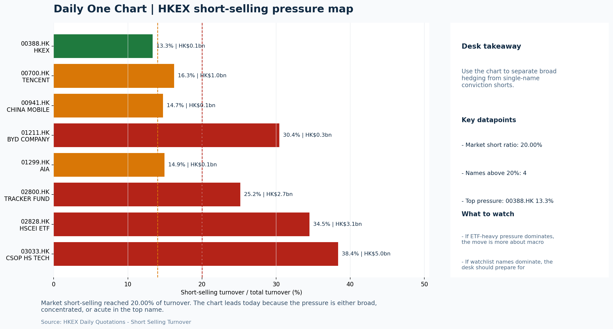

# Morning Research Workbench | 2026-07-28

> Designed for a Hong Kong sell-side commute: Layer 1 `Scan`, Layer 2 `Deep Read`, Layer 3 `Thinking`
> Mode: `Trading Daily` | Keep the report execution-oriented: what mattered in the completed session, what can move Hong Kong leadership, and what needs fast follow-up.
> Briefing date: `2026-07-28` | Review date: `2026-07-27` | Global request: `2026-07-27` | HK/China request: `2026-07-27` | Market effective date: `2026-07-27` | Generated at: `2026-07-28 06:05:01`

## Executive Summary

- **Market pulse:** Hong Kong's completed session split along style lines - HSI +1.28% and HSCEI +1.23% on value/SOE rotation while HSTECH fell 1.48% - and thin turnover (0.67x 20D) with 20% short-selling warn.
- **Hong Kong lens:** State-owned / old-economy H-shares led. Offshore China proxy FXI +2.38% provides a constructive anchor for Hong Kong, but HSTECH -1.48% and the INTC-driven semiconductor caution argue for confirming breadth before.
- **Top catalysts:** WTI crude -8.29%; INTC -6.33%.

## Visual Dashboard

## Layer 1 | Scan (5-10 min)

### 1.1 One-Line Market Pulse
Hong Kong's completed session split along style lines - HSI +1.28% and HSCEI +1.23% on value/SOE rotation while HSTECH fell 1.48% - and thin turnover (0.67x 20D) with 20% short-selling warn against extrapolating the 2.38% overnight FXI advance without local breadth confirmation.

### 1.2 Global Asset Price Dashboard

| Asset | Last | 1D move | Read |
| --- | --- | --- | --- |
| S&P 500 | 7,413.18 | +0.07% | US large-cap risk appetite |
| Nasdaq 100 | 28,039.21 | -1.46% | Growth and duration leadership |
| Hang Seng Index | 25,210.81 | +1.28% | Hong Kong broad beta |
| Hang Seng TECH | 4.5420 | -1.48% | Hong Kong growth / platform read-through |
| CSI 300 | 4,529.10 | **-3.60%** | Mainland large-cap tone |
| US 10Y | 4.6410 | -1.32% | Global discount-rate anchor |
| China 10Y | 1.73% | +0.6bp | China local rates anchor \| Live public \| Eastmoney \| 2026-07-27 |
| CN-US 10Y spread | -291.6bp | +4.5bp | Relative carry and macro-pressure gauge \| Live public \| Eastmoney \| 2026-07-27 |
| DXY | 101.50 | +0.07% | Dollar liquidity impulse |
| USD/CNH | 6.7425 | +0.00% | Offshore China risk appetite |
| USD/HKD | 7.8412 | +0.00% | Linked-exchange regime stress check |
| Brent crude | 87.68 | **-9.40%** | Energy / geopolitics |
| COMEX gold | 4,078.60 | +0.27% | Hedge demand / real yields |
| Copper | 6.3965 | +1.21% | Global growth proxy |
| VIX | 18.67 | -0.16% | US stress barometer |

### 1.3 Hong Kong Key Data Quick Check

| Check | Value | Status | Source / as of | Why it matters |
| --- | --- | --- | --- | --- |
| Main Board turnover vs 20D | 0.67x \| -33% vs 20D | Live local | HKEX \| 2026-07-27 | Trailing 20-session average turnover was HK$315.8bn. |
| Southbound / Northbound net flow | Southbound Net HK$-1.6bn \| turnover HK$82.8bn \| Northbound Turnover HK$276.9bn \| net not reported | Live local | HKEX Connect \| 2026-07-27 | Southbound net buy is calculated from HKEX disclosed buy and sell turnover. |
| Short-selling ratio | 20.00% | Live local | HKEX \| 2026-07-27 | Official HKEX stock-level short-selling table, aggregated as a share of total market turnover. |
| AH premium index | 32.71% | Live public | Yahoo \| 2026-07-27 | Simple average across 17 A/H pairs; use dispersion rather than the average alone. |
| USD/HKD spot vs band | 7.8412 \| band 7.7500 to 7.8500 | Live quote + local | Yahoo \| 2026-07-27 | Inside the linked-exchange band without immediate boundary stress. Official Convertibility Undertakings define the linked-rate stress boundaries for USD/HKD. |
| HIBOR 1M | 2.72% | Live local | HKMA \| 2026-07-27 | 1M HIBOR is the cleanest quick read for Hong Kong funding conditions and equity-duration pressure. |
| Aggregate Balance | HK$53.9bn | Live local | HKMA \| 2026-07-27 | Aggregate Balance helps frame whether linked-rate liquidity conditions are tight or comfortable. |
| Hong Kong leadership | State-owned / old-economy H-shares led | Proxy | HSI / HSCEI / HSTECH relative perf \| 2026-07-27 | Use HSI / HSCEI / HSTECH relative moves as the opening style read. |

### 1.4 Risk Dashboard
**Composite risk score:** `37.6/100` | **Regime:** `Mixed`

| Component | Score impact | Evidence |
| --- | --- | --- |
| US beta | +0.4 | S&P 500 +0.07% |
| HK growth | -7.4 | HSTECH -1.48% |
| Offshore China proxy | +8 | FXI +2.38% |
| Dollar pressure | -0.7 | DXY +0.07% |
| Volatility | +0.3 | VIX -0.16% |
| HK short-selling | -8 | Short-selling ratio 20.00% |

### 1.5 Morning Checklist
1. **WTI crude -8.29%**
 High-frequency data | Softer oil argues for a more cautious cyclical-growth read.
2. **INTC -6.33%**
 Mover attribution | Announcement / expectations | Guidance reset and margin pressure
3. **Neutral backdrop with USD range-bound, lower yields supported duration, and Gold outperformed Oil**
 Overnight regime | Start by deciding whether the day is about Neutral conditions or a style pivot.
4. **CPI MoM (Released)**
 Macro / policy | Rates expectations, the dollar, and growth-equity valuation | Industries: Technology, Internet, Brokers
5. **Trade Balance (Released)**
 Macro / policy | Watch whether it changes the day's core market narrative | Industries: Market-wide

## Layer 2 | Deep Read (20-30 min)

### 2.1 Overnight Overseas Market Review
#### Market Setup
**Core tape.** Overseas markets showed a bifurcated session on July 27, with S&P 500 flat (+0.07%) while Nasdaq 100 fell -1.46% as Intel's -6.33% guidance reset weighed on semiconductor sentiment; Euro Stoxx 50 dropped -1.69% in sympathy.
**Main driver.** The dominant cross-asset signal was the sharp divergence between Gold (+0.27%) and Oil (-8.29%), where the WTI crude collapse directly contradicts some overnight headlines citing rising oil prices - the decline eases.
**HK relevance.** USD was range-bound with DXY +0.07%, while US 10Y yields fell -1.32%, supporting duration-sensitive assets; Moody's caution on AI capex intensity for mega-cap tech added a tone of caution to the growth narrative.

#### Key Drivers
- WTI crude -8.29% contradicts 'rising oil' narrative cited in some headlines.
- Intel guidance reset -6.33% triggered semiconductor sell-off, dragging Nasdaq and signaling ongoing competitive pressure in legacy chip.
- US 10Y -1.32% provides a supportive duration impulse for growth names, but Nasdaq's decline shows this tailwind is sector-selective.
- USD range-bound (DXY +0.07%) keeps cross-border funding conditions stable, while USD/CNH flat at 6.7425 reflects no acute China FX stress.

#### Hong Kong Read-Through
**Desk lens.** State-owned / old-economy H-shares led.
**Opening implication.** Offshore China proxy FXI +2.38% provides a constructive anchor for Hong Kong.
- **Cross-market read:** Hang Seng +1.28% / HSCEI +1.23% / HSTECH -1.48%.
- **Cross-market read:** Offshore China proxy FXI +2.38% and USD/CNH +0.00% frame cross-border risk appetite.
- **Cross-market read:** USD/HKD last traded around 7.8412, which keeps the Hong Kong funding lens in focus.

#### Watch Points
- USD composite moved higher by +0.12pct intraday, with a 0.244pct range.
- Main turning points appeared around 2026-07-27 08:05 peak / 2026-07-27 08:30 trough / 2026-07-27 08:50 peak, suggesting event-driven repricing.
- The biggest cross-asset divergence was Gold versus Oil, a spread of 3.227pct.
- Gold moved -0.35pct intraday with a 0.899pct high-low range.

**Curated overnight stories**
1. **WTI crude -8.29%**
 Why it matters: The sharp oil decline eases near-term inflation concerns and directly contradicts the narrative of 'oil prices rip higher' cited in some overnight headlines.
 HK read-through: Most relevant for China/HK energy majors (, ), shipping (), and aviation names. Also supports consumer discretionary sentiment by reducing cost-input pressures.
2. **INTC -6.33% (Guidance reset and margin pressure)**
 Why it matters: Intel's guidance reset and margin concerns signal ongoing competitive pressure in the semiconductor space.
 HK read-through: Relevant for HK-listed semiconductor and hardware plays. May weigh on tech hardware sentiment in the near term, though China-specific chip plays remain driven by domestic.
3. **CPI MoM (Released)**
 Why it matters: Inflation data released anchors Fed rate expectations and drives USD dynamics. The market was watching for any upside surprise that could re-price rate-cut odds.
 HK read-through: Critical for H-share valuation framework. Lower-than-expected CPI would support the 'lower yields supported duration' theme, benefiting growth and internet names in Hong Kong.
4. **Neutral backdrop with USD range-bound, lower yields supported duration, Gold**
 Why it matters: The regime framing confirms the overnight session was risk-neutral rather than risk-on or risk-off.
 HK read-through: Sets a baseline where individual stock-level news (e.g., INTC) matters more than macro regime shifts. Favors internet and growth sectors over defensives for the session.
5. **Moody's says 'unprecedented' AI spending threatens credit quality of Amazon, Meta**
 Why it matters: Rating agency commentary on AI capex intensity raises questions about returns-on-investment for mega-cap tech.
 HK read-through: Affects sentiment for HK internet and AI-adjacent names indirectly. The AI theme remains structural for Hong Kong tech, but elevated capex scrutiny.

### 2.2 Hong Kong / A-share Previous-Day Review
#### Local Tape Setup
**Local read.** Hong Kong's July 27 session split sharply by style, with HSI (+1.28%) and HSCEI (+1.23%) advancing while HSTECH fell -1.48%, reflecting a value/SOE rotation as the -8.3% WTI decline supported energy names but Nasdaq.
**Verification point.** Local participation was thin (turnover 0.67x 20D), short-selling remained elevated at 20%, and Southbound registered net outflows of HK$1.6bn, though selective internet buying (Meituan +3%) offered pockets of demand.
**Risk to watch.** The constructive offshore China proxy (FXI +2.38%) cannot be read as broad risk-on until the HSTECH - HSCEI gap closes.

#### Style and Local Leadership
**Style leadership.** State-owned / old-economy H-shares led.
- **Cross-market read:** Hang Seng +1.28% / HSCEI +1.23% / HSTECH -1.48%.
- **Cross-market read:** Offshore China proxy FXI +2.38% and USD/CNH +0.00% frame cross-border risk appetite.
- **Cross-market read:** USD/HKD last traded around 7.8412, which keeps the Hong Kong funding lens in focus.

#### Flow Confirmation
Official Stock Connect evidence is available; use Section 2.3 to confirm whether local money supports the price action.

#### Follow-Through Checklist
**Follow-through check.** Confirm by HSTECH turning positive and the short-selling ratio declining below 16% on rising turnover; failure would signal persistent value rotation and leave tech longs vulnerable.

### 2.3 Flow Tracker and Attribution
#### Cross-Asset Attribution v1

| Driver | Direction | Score | Evidence | HK implication |
| --- | --- | --- | --- | --- |
| Oil and geopolitics | supportive | 7.52 | Oil moved -9.40%. | Split the read between energy/cyclicals support and margin/geopolitical pressure. |
| Short-selling pressure | drag | 3.5 | HKEX short-selling ratio was 20.00%. | Elevated short activity argues for extra confirmation before chasing rebounds. |
| Hong Kong participation | drag | 3.34 | Main Board turnover was 0.67x the 20-session average. | Thin turnover makes index moves easier to fade. |
| US growth-style transmission | drag | 2.04 | Nasdaq 100 moved -1.46%. | Hong Kong growth and platform names should be tested first at the open. |
| Rates impulse | supportive | 1.58 | US 10Y yield proxy moved -1.32%. | Lower yields help long-duration growth; higher yields pressure valuation-sensitive |

#### Flow Tracker
##### Flow Takeaways
- Short-selling pressure is elevated, so local rebounds need cleaner breadth and flow confirmation.
- Stock Connect Southbound: net HK$-1.6bn on turnover HK$82.8bn (as of 2026-07-27).
- Stock Connect Northbound: turnover RMB276.9bn; public file provides total turnover/top active names, not full net-buy.
- AH premium: simple covered-pair average +32.71%; widest premium: China Communications Construction 86.99%.

##### Stock Connect Southbound Active Names

| Rank | Ticker | Name | Buy | Sell | Net buy |
| --- | --- | --- | --- | --- | --- |
| 2 | 01810.HK | XIAOMI-W | HK$1,401.7mn | HK$2,633.7mn | HK$-1,232.0mn |
| 1 | 03690.HK | MEITUAN-W | HK$1,713.3mn | HK$496.7mn | HK$1,216.6mn |
| 2 | 00981.HK | SMIC | HK$1,852.3mn | HK$2,550.6mn | HK$-698.4mn |
| 6 | 09988.HK | BABA-W | HK$1,125.0mn | HK$1,800.3mn | HK$-675.4mn |
| 1 | 02513.HK | Z.AI | HK$2,660.6mn | HK$2,044.6mn | HK$616.0mn |

##### AH Premium Dispersion

| Name | A ticker | H ticker | Premium | As of |
| --- | --- | --- | --- | --- |
| China Communications Construction | 601800.SS | 1800.HK | +86.99% | 2026-07-27 |
| China Railway Construction | 601186.SS | 1186.HK | +60.59% | 2026-07-27 |
| China Life | 601628.SS | 2628.HK | +60.53% | 2026-07-27 |
| China Railway | 601390.SS | 0390.HK | +45.80% | 2026-07-27 |
| CRRC | 601766.SS | 1766.HK | +39.62% | 2026-07-27 |

##### HKEX Short-Selling Watch

| Ticker | Name | Short ratio | Short turnover | Total turnover |
| --- | --- | --- | --- | --- |
| 00388.HK | HKEX | 13.34% | HK$0.1bn | HK$1.0bn |
| 00700.HK | TENCENT | 16.26% | HK$1.0bn | HK$6.4bn |
| 00941.HK | CHINA MOBILE | 14.73% | HK$0.1bn | HK$0.8bn |
| 01211.HK | BYD COMPANY | 30.44% | HK$0.3bn | HK$1.1bn |
| 01299.HK | AIA | 14.94% | HK$0.1bn | HK$0.8bn |

- **Short-value leaders:** 03033.HK CSOP HS TECH (HK$5.0bn); 02828.HK HSCEI ETF (HK$3.1bn); 02800.HK TRACKER FUND (HK$2.7bn); 07709.HK XL2CSOPHYNIX (HK$2.5bn).

### 2.4 Macro and Policy Tracking
**Desk read.** The completed session (2026-07-27) established a neutral backdrop with range-bound USD and lower yields supporting duration.

**Market sensitivity.** Gold outperforming Oil (WTI -8.29%) signals a defensive rotation that typically supports growth-oriented sectors.

**HK implication.** The US CPI release at 20:30 on 2026-07-28 came in hot at +0.3% versus +0.2% expected, though below the prior +0.4%, creating a mixed signal for rate expectations.

**Macro watchpoints**
- US 10Y yield trajectory after CPI release and ahead of Retail Sales
- HK tech and growth proxies response to lower yields combined with hot CPI
- CNY/HKD stability following China Trade Balance beat
- Whether WTI's 8.29% decline triggers further rotation out of energy and into defensives

| Time | Region | Event | Status | Desk read |
| --- | --- | --- | --- | --- |
| 20:30 | US | CPI MoM | Released | Impact: Rates expectations, the dollar, and growth-equity valuation \| Attention: 5/5 \| Industries: Technology, Internet, Brokers |
| 09:30 | China | Trade Balance | Released | Impact: Watch whether it changes the day's core market narrative \| Attention: 3/5 \| Industries: Market-wide |
| 20:30 | US | Retail Sales MoM | Upcoming | Impact: Consumer resilience, growth expectations, and risk-asset pricing \| Attention: 5/5 \| Industries: Consumer, E-commerce, Consumer discretionary |
| 09:20 | China | Loan Prime Rate | Upcoming | Impact: Watch whether it changes the day's core market narrative \| Attention: 3/5 \| Industries: Market-wide |
| 22:00 | Federal Reserve | Jerome Powell: Economic outlook remarks | Central bank | Impact: Policy path, liquidity conditions, and cross-asset risk appetite \| Attention: 5/5 \| Industries: Technology, Financials, Gold |
| 10:00 | PBOC | Open Market Operations Desk: Daily liquidity operation window | Central bank | Impact: Policy path, liquidity conditions, and cross-asset risk appetite \| Attention: 3/5 \| Industries: Technology, Financials, Gold |

#### Positioning and Risk Backdrop
- Options activity centered on KWEB Call, with Vol/OI at 1.88x and a bullish bias.
- Put/Call structure shows equity 0.68 / index 1.15, implying Single-stock optimism with index hedging.
- Geopolitics: Middle East | Regional tension remains elevated | Impact: Oil, freight costs, and safe-haven demand
- Geopolitics: US-China | Technology export-control rhetoric remains active | Impact: China internet, semiconductors, and supply chains

### 2.5 Key Company and Sector Events
No high-conviction sector story cleared the main-report relevance gate for this run.

#### Company Event Takeaway
**Desk read.** The session's standout event is Morgan Stanley upgrading Alibaba (9988.HK) to Overweight with a target raise to HKD 105, which may support other China internet names if it sparks re-rating expectations.
**Why it matters.** Tencent (0700.HK) reports after-market; consensus sits at EPS HKD 4.15 and revenue HKD 163.2bn.
**Follow-up.** HKEX (0388.HK) reports before the open with estimates at EPS HKD 2.81 and revenue HKD 6.0bn - a miss would be a negative read-through for market turnover and HK financial sentiment.

#### LLM Quick Takes
- **9988.HK** | Morgan Stanley upgrade from Equal Weight to Overweight, target HKD 92 to 105. The move may shift sentiment toward China internet leaders if it triggers broader
- **0700.HK** | AMC results tonight. EPS consensus HKD 4.15, revenue HKD 163.2bn. Positioned mid-range; any beat or miss will be the dominant near-term driver for HK internet sector
- **0388.HK** | Reports before market open. EPS est. HKD 2.81, revenue HKD 6.0bn. A miss would be a negative read-through for market turnover and broader HK financials.
- **01093.HK** | Grade-A profit warning on 2026-07-27. Among the largest names in the batch; watch for sector contagion to other pharma names or read-through to domestic healthcare
- **00934.HK** | Grade-A profit warning. Sinopec Kantons is an energy/logistics name; the warning may reflect commodity or cost pressures in that segment.
- **3690.HK** | Closed +3.0% at top of range. Near-term price strength is clear; Tencent's results tonight could either reinforce or cap this momentum.

#### HKEX Announcements

| Grade | Ticker | Type | Release time | Title |
| --- | --- | --- | --- | --- |
| A | 00460.HK | Profit warning | 2026-07-27 | Profit warning / alert announcement |
| A | 00934.HK | Profit warning | 2026-07-27 | Profit warning / alert announcement |
| A | 01093.HK | Profit warning | 2026-07-27 | Profit warning / alert announcement |
| A | 01104.HK | Profit warning | 2026-07-27 | Profit warning / alert announcement |
| A | 01274.HK | Profit warning | 2026-07-27 | Profit warning / alert announcement |
| A | 02130.HK | Profit warning | 2026-07-27 | Profit warning / alert announcement |
| A | 02236.HK | Profit warning | 2026-07-27 | Profit warning / alert announcement |
| A | 02272.HK | Profit warning | 2026-07-27 | Profit warning / alert announcement |

#### Earnings / Results Watch

| Ticker | Company | Timing | Expectation framing |
| --- | --- | --- | --- |
| 0700.HK | Tencent Holdings | After Market Close | EPS est. 4.15 HKD \| revenue est. 163.2bn HKD |
| 0388.HK | Hong Kong Exchanges and Clearing | Before Market Open | EPS est. 2.81 HKD \| revenue est. 6.0bn HKD |

#### Rating Changes
- **9988.HK** | Morgan Stanley | Upgrade | Equal Weight -> Overweight | PT 92 -> 105

#### IPO Watch
- IPO and grey-market monitoring is not yet part of the standard production pack.

### 2.6 Today's Core Names
#### Core coverage

| Name | Ticker | Last | 1D | Range position | Morning note |
| --- | --- | --- | --- | --- | --- |
| Meituan | 3690.HK | 89.30 | +3.00% | Top of range | Short-term price strength is clear; fresh catalysts could trigger broader group follow-through. |
| Tencent | 0700.HK | 443.00 | +1.93% | Mid-range | Positioning is neutral for now, so use it mainly to monitor marginal information changes. |

#### Priority follow-up

| Name | Ticker | Last | 1D | Range position | Morning note |
| --- | --- | --- | --- | --- | --- |
| China Mobile | 0941.HK | 82.50 | +0.92% | Top of range | The name sits near the top of its recent range, so watch for profit-taking under high expectations. |
| AIA | 1299.HK | 77.95 | -0.19% | Mid-range | Positioning is neutral for now, so use it mainly to monitor marginal information changes. |

## Layer 3 | Thinking (10-15 min)

### 3.1 Rotating Theme Deep Dive

| Field | Read |
| --- | --- |
| Theme | China Consumption Recovery |
| Angle for the day | Focus on whether travel, retail, internet local services, and premium consumption data still support a demand-repair narrative. |

**Theme desk read**
**Core thesis.** The China consumption recovery narrative faces a mixed signal set today.
**Evidence.** The sharp 8.29% drop in WTI crude argues for a more cautious cyclical-demand read, while the 1.32% decline in US 10Y yields and mild gold bid lend support to growth-style duration.
**What to test.** Meituan's 3.0% advance to the top of its range suggests local services sentiment is holding for now, but conviction remains low ahead of clearer data.

**Signals to keep in mind**
- WTI crude -8.29%: Softer oil argues for a more cautious cyclical-growth read.
- US 10Y -1.32%: Lower yields tend to support growth style and gold.

**LLM watch items:**
- Meituan catalyst (2026-07-28): order trends and margin commentary for local services demand proxy.
- US Retail Sales MoM (2026-07-28 20:30): consumer resilience and risk-asset pricing implications.
- WTI crude stabilization: monitor whether -8.29% move extends, reinforcing a cautious cyclical-consumption read.
- US 10Y yield: confirm whether lower yields continue to support growth-style positioning in HK internet/consumer names.

**Related names to keep close:**

| Name | Ticker | Bucket | Morning read |
| --- | --- | --- | --- |
| Meituan | 3690.HK | Core coverage | Short-term price strength is clear; fresh catalysts could trigger broader group follow-through. |

**Upcoming catalysts tied to the theme:**
- 2026-07-28 | Meituan: Order trends and margin commentary | High-frequency read on local services demand and platform competition
- 2026-07-28 | Retail Sales MoM | Consumer resilience, growth expectations, and risk-asset pricing

### 3.2 Today Ahead and Trading Calendar
- Macro: CPI MoM is the first item to anchor the open and the rates/FX response.
- Corporate / event: Meituan: Order trends and margin commentary is the cleanest same-day catalyst to prepare for.

**Same-day macro docket**

| Time | Country | Event | Status | Detail |
| --- | --- | --- | --- | --- |
| 20:30 | US | CPI MoM | Released | Actual 0.3% / Forecast 0.2% / Prior 0.4% |
| 09:30 | China | Trade Balance | Released | Actual USD 85.2bn / Forecast USD 79.0bn / Prior USD 80.6bn |
| 20:30 | US | Retail Sales MoM | Upcoming | Forecast 0.3% / Prior 0.6% |
| 09:20 | China | Loan Prime Rate | Upcoming | Forecast 3.45% / Prior 3.45% |
| 22:00 | Federal Reserve | Jerome Powell: Economic outlook remarks | Central bank | speech |

**Same-day catalyst list**

| Date | Time | Category | Event | Importance |
| --- | --- | --- | --- | --- |
| 2026-07-28 | | Core coverage | Meituan: Order trends and margin commentary | 3 |
| 2026-07-28 | | Core coverage | Tencent: Game grossing trends and ad-demand checks | 3 |
| 2026-07-28 | | Core coverage | Alibaba: Cloud demand and GMV updates | 3 |
| 2026-07-28 | | Core coverage | HKEX: Turnover data and IPO pipeline updates | 3 |

**Next few sessions**

| Date | Category | Event | Impact |
| --- | --- | --- | --- |
| 2026-07-28 | Core coverage | Meituan: Order trends and margin commentary | High-frequency read on local services demand and platform competition |
| 2026-07-28 | Core coverage | Tencent: Game grossing trends and ad-demand checks | Core offshore China platform proxy for gaming, ads, and AI monetization |
| 2026-07-28 | Core coverage | Alibaba: Cloud demand and GMV updates | Key read-through for China consumption, cloud, and platform regulation |
| 2026-07-28 | Core coverage | HKEX: Turnover data and IPO pipeline updates | Direct proxy for Hong Kong market turnover, listings, and southbound |

### 3.3 Daily One Chart
**Daily One Chart | HKEX short-selling pressure map**

**Chart read.** Market short-selling reached 20.00% of turnover.
**Why it matters.** The chart leads today because the pressure is either broad, concentrated, or acute in the top name.

_Source: HKEX Daily Quotations - Short Selling Turnover_

## Traceable Appendix

### Report Metadata
> Date policy: Review date 2026-07-27 is treated as `Trading Daily`. | Global request date is 2026-07-27; adapter effective date is 2026-07-27 and summary date is 2026-07-27. | HK/China local data date is 2026-07-27; role: same-session local cash tape.
> Market data quality: Coverage: `31/32` | Stale items (>1d): `7` | Missing: `1`
> Report quality: `84.6/100` | Grade `B` | Status `usable with caveats`

### Key Questions to Keep in Mind
- Is risk appetite rising or fading? The overnight tape reads closer to `Neutral`.
- Did rates expectations move? Focus on whether US 10Y, DXY, and growth style moved together.
- Were commodities the real story? Watch WTI and gold for geopolitics versus inflation signals.
- Is Hong Kong setup internet-led, SOE-led, or broad beta-led? Compare HSTECH, HSCEI, and HSI.
- Did offshore markets move China risk appetite? Focus on HSI, FXI, USD/CNH, and USD/HKD.

### Report Quality and Validation
- **Quality score:** 84.6/100 | **Grade:** B | **Status:** usable with caveats
- **Run summary:** 8 healthy | 0 caveat | 0 failed
- **Release recommendation:** Send | All monitored sources were healthy, so the report is fit for normal distribution.

| Source | Status | Bucket |
| --- | --- | --- |
| Market data | ok | healthy |
| Sector and company news | ok | healthy |
| Movers and short selling | ok | healthy |
| Stock Connect | ok | healthy |
| A/H premium | ok | healthy |
| Hong Kong local package | ok | healthy |
| China rates | ok | healthy |
| Narrative overlay | ok | healthy |

**Desk-use guidance summary:** 0 blocking | 1 advisory

**Desk-use guidance**
- **Advisory:** All monitored sources were healthy for this run; the report can be used as a normal desk-starting point.

| Component | Score | Weight | Read |
| --- | --- | --- | --- |
| Market data coverage | 96.9 | 0.3 | 31/32 core market fields available. |
| Hong Kong local metrics | 82.3 | 0.25 | 8 live, 3 proxy, 0 unavailable local checks. |
| Key public adapters | 100.0 | 0.2 | 4/4 key adapters were available or partially available. |
| Narrative overlay health | 65.7 | 0.15 | 3/7 narrative overlay tasks succeeded or used validated cache; 0 error(s). |
| Fact-check guardrail | 50.0 | 0.1 | Checked 12 numeric claims; 2 numeric mismatch(es), 0 logic warning(s); 2 critical, 0 review. |

**Quality warnings**
- Fact-check guardrail is weak: Checked 12 numeric claims; 2 numeric mismatch(es), 0 logic warning(s); 2 critical, 0 review.
- Narrative fact-check guardrail produced warnings; review the validation table before relying on narrative sections.

**Narrative fact-check guardrail**
- Checked 12 numeric claims; 2 numeric mismatch(es), 0 logic warning(s); 2 critical, 0 review.

| Severity | Field | Claim | Type | Claimed | Expected | Snippet |
| --- | --- | --- | --- | --- | --- | --- |
| critical | tasks.final_framing.one_line_market_pulse | Hang Seng TECH | change_pct | 1.48 | -1.48 | .28% and HSCEI +1.23% on value/SOE rotation while HSTECH fell 1.48% - and thin turnover (0.67x 20D) with 20% short-sell |
| critical | tasks.final_framing.thinking_note | Short-selling ratio | level_pct | 16.0 | 20.0 | table, we would need HSTECH to turn positive, the short-selling ratio to fall below 16%, and turnover to rise above the 20-day average - ot |

**Adapter status**

| Adapter | Status |
| --- | --- |
| Stock Connect | ok |
| A/H premium | ok |
| HKEX announcements | ok |
| China rates | ok |

### Source Links
- [Beijing Just Aimed at Taiwan Semiconductor Manufacturing Company (NYSE:TSM). Here's Why the Bull Case Still Wins](https://finance.yahoo.com/markets/stocks/articles/beijing-just-aimed-taiwan-semiconductor-140827384.html) (Insider Monkey)
- [Investors Heavily Search Alibaba Group Holding Limited (BABA): Here is What You Need to Know](https://finance.yahoo.com/markets/stocks/articles/investors-heavily-search-alibaba-group-130004550.html) (Zacks)
- [00460.HK Profit warning / alert announcement](http://www1.hkexnews.hk/listedco/listconews/sehk/2026/0727/2026072700139.pdf) (HKEXnews)
- [00934.HK Profit warning / alert announcement](http://www1.hkexnews.hk/listedco/listconews/sehk/2026/0727/2026072700602.pdf) (HKEXnews)
- [01093.HK Profit warning / alert announcement](http://www1.hkexnews.hk/listedco/listconews/sehk/2026/0727/2026072700572.pdf) (HKEXnews)
- [01104.HK Profit warning / alert announcement](http://www1.hkexnews.hk/listedco/listconews/sehk/2026/0727/2026072700911.pdf) (HKEXnews)
- [01274.HK Profit warning / alert announcement](http://www1.hkexnews.hk/listedco/listconews/sehk/2026/0727/2026072700889.pdf) (HKEXnews)
- [02130.HK Profit warning / alert announcement](http://www1.hkexnews.hk/listedco/listconews/sehk/2026/0727/2026072700893.pdf) (HKEXnews)
- [02236.HK Profit warning / alert announcement](http://www1.hkexnews.hk/listedco/listconews/sehk/2026/0727/2026072700735.pdf) (HKEXnews)
- [02272.HK Profit warning / alert announcement](http://www1.hkexnews.hk/listedco/listconews/sehk/2026/0727/2026072701035.pdf) (HKEXnews)

## Supplementary Visual Appendix

This appendix is professional-path only. It keeps a traceable index of the report visuals and the deterministic chart cues used to frame the morning note, without injecting the legacy intraday chart pack.

### Visual Index

| Visual | Path | Role |
| --- | --- | --- |
| Visual Dashboard | `charts/dashboard_2026-07-28.png` | Cross-asset regime board and Hong Kong local tape snapshot. |
| Daily One Chart | `charts/daily_one_chart_2026-07-28.png` | Single highest-conviction visual story for the day. |

### Deterministic Chart Cues
- FX / liquidity: USD composite moved higher by +0.12pct intraday, with a 0.244pct range.
- FX / liquidity: Main turning points appeared around 2026-07-27 08:05 peak / 2026-07-27 08:30 trough / 2026-07-27 08:50 peak, suggesting event-driven repricing rather than a clean one-way USD move.
- Cross-asset: The biggest cross-asset divergence was Gold versus Oil, a spread of 3.227pct.
- Cross-asset: Gold moved -0.35pct intraday with a 0.899pct high-low range.
- Cross-asset: Oil moved -3.58pct intraday with a 3.943pct high-low range.
- Cross-asset: Bitcoin moved -0.88pct intraday with a 1.858pct high-low range.

### Risk Dashboard Components

| Component | Score impact | Evidence |
| --- | --- | --- |
| US beta | +0.4 | S&P 500 +0.07% |
| HK growth | -7.4 | HSTECH -1.48% |
| Offshore China proxy | +8 | FXI +2.38% |
| Dollar pressure | -0.7 | DXY +0.07% |
| Volatility | +0.3 | VIX -0.16% |
| HK short-selling | -8 | Short-selling ratio 20.00% |
