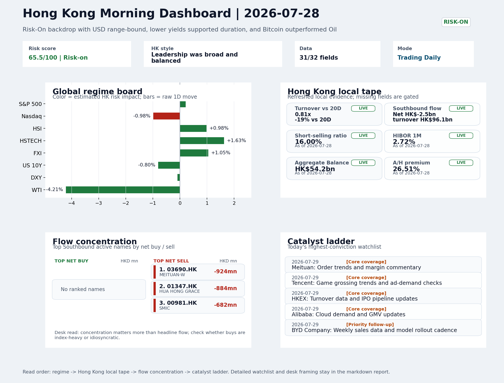
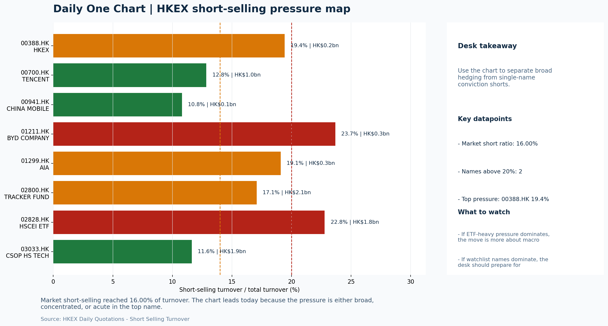

# Morning Research Workbench | 2026-07-29

> Designed for a Hong Kong sell-side commute: Layer 1 `Scan`, Layer 2 `Deep Read`, Layer 3 `Thinking`
> Mode: `Trading Daily` | Keep the report execution-oriented: what mattered in the completed session, what can move Hong Kong leadership, and what needs fast follow-up.
> Briefing date: `2026-07-29` | Review date: `2026-07-28` | Global request: `2026-07-28` | HK/China request: `2026-07-28` | Market effective date: `2026-07-28` | Generated at: `2026-07-29 06:02:03`

## Executive Summary

- **Market pulse:** A lower US yield and risk-on overnight backdrop provide a constructive starting tone, but Nasdaq weakness and Hong Kong's thin turnover leave the open as a conditional setup rather.
- **Hong Kong lens:** Hong Kong growth / internet led. Expect a cautious open with HSTECH likely to test support given Nasdaq weakness, while lower yields and softer oil provide a floor for broad risk appetite.
- **Top catalysts:** INTC -6.33%; Risk-On backdrop with USD range-bound, lower yields supported duration, and Bitcoin outperformed Oil.

## Visual Dashboard

## Layer 1 | Scan (5-10 min)

### 1.1 One-Line Market Pulse
A lower US yield and risk-on overnight backdrop provide a constructive starting tone, but Nasdaq weakness and Hong Kong's thin turnover leave the open as a conditional setup rather than an outright risk-on signal.

### 1.2 Global Asset Price Dashboard

| Asset | Last | 1D move | Read |
| --- | --- | --- | --- |
| S&P 500 | 7,428.78 | +0.21% | US large-cap risk appetite |
| Nasdaq 100 | 27,763.13 | -0.98% | Growth and duration leadership |
| Hang Seng Index | 25,207.18 | +0.98% | Hong Kong broad beta |
| Hang Seng TECH | 4.6160 | **+1.63%** | Hong Kong growth / platform read-through |
| CSI 300 | 4,529.10 | **-3.60%** | Mainland large-cap tone |
| US 10Y | 4.6040 | -0.80% | Global discount-rate anchor |
| China 10Y | 1.74% | +0.1bp | China local rates anchor \| Live public \| Eastmoney \| 2026-07-28 |
| CN-US 10Y spread | -287.5bp | +4.1bp | Relative carry and macro-pressure gauge \| Live public \| Eastmoney \| 2026-07-28 |
| DXY | 101.38 | -0.09% | Dollar liquidity impulse |
| USD/CNH | 6.7485 | +0.00% | Offshore China risk appetite |
| USD/HKD | 7.8417 | -0.00% | Linked-exchange regime stress check |
| Brent crude | 83.76 | **-5.21%** | Energy / geopolitics |
| COMEX gold | 4,028.80 | -1.12% | Hedge demand / real yields |
| Copper | 6.3360 | -0.05% | Global growth proxy |
| VIX | 18.21 | **-2.46%** | US stress barometer |

### 1.3 Hong Kong Key Data Quick Check

| Check | Value | Status | Source / as of | Why it matters |
| --- | --- | --- | --- | --- |
| Main Board turnover vs 20D | 0.81x \| -19% vs 20D | Live local | HKEX \| 2026-07-28 | Trailing 20-session average turnover was HK$309.3bn. |
| Southbound / Northbound net flow | Southbound Net HK$-2.5bn \| turnover HK$96.1bn \| Northbound Turnover HK$281.1bn \| net not reported | Live local | HKEX Connect \| 2026-07-28 | Southbound net buy is calculated from HKEX disclosed buy and sell turnover. |
| Short-selling ratio | 16.00% | Live local | HKEX \| 2026-07-28 | Official HKEX stock-level short-selling table, aggregated as a share of total market turnover. |
| AH premium index | 26.51% | Live public | Yahoo \| 2026-07-28 | Simple average across 19 A/H pairs; use dispersion rather than the average alone. |
| USD/HKD spot vs band | 7.8417 \| band 7.7500 to 7.8500 | Live quote + local | Yahoo \| 2026-07-28 | Inside the linked-exchange band without immediate boundary stress. Official Convertibility Undertakings define the linked-rate stress boundaries for USD/HKD. |
| HIBOR 1M | 2.72% | Live local | HKMA \| 2026-07-28 | 1M HIBOR is the cleanest quick read for Hong Kong funding conditions and equity-duration pressure. |
| Aggregate Balance | HK$54.2bn | Live local | HKMA \| 2026-07-28 | Aggregate Balance helps frame whether linked-rate liquidity conditions are tight or comfortable. |
| Hong Kong leadership | Hong Kong growth / internet led | Proxy | HSI / HSCEI / HSTECH relative perf \| 2026-07-28 | Use HSI / HSCEI / HSTECH relative moves as the opening style read. |

### 1.4 Risk Dashboard
**Composite risk score:** `65.5/100` | **Regime:** `Risk-on`

| Component | Score impact | Evidence |
| --- | --- | --- |
| US beta | +1.3 | S&P 500 +0.21% |
| HK growth | +8.1 | HSTECH +1.63% |
| Offshore China proxy | +5.2 | FXI +1.05% |
| Dollar pressure | +0.9 | DXY -0.09% |
| Volatility | +4.9 | VIX -2.46% |
| HK short-selling | +0 | Short-selling ratio 16.00% |

### 1.5 Morning Checklist
1. **INTC -6.33%**
 Mover attribution | Announcement / expectations | Guidance reset and margin pressure
2. **Risk-On backdrop with USD range-bound, lower yields supported duration, and Bitcoin outperformed Oil**
 Overnight regime | Start by deciding whether the day is about Risk-On conditions or a style pivot.
3. **CPI MoM (Released)**
 Macro / policy | Rates expectations, the dollar, and growth-equity valuation | Industries: Technology, Internet, Brokers
4. **Trade Balance (Released)**
 Macro / policy | Watch whether it changes the day's core market narrative | Industries: Market-wide
5. **Retail Sales MoM (Upcoming)**
 Macro / policy | Consumer resilience, growth expectations, and risk-asset pricing | Industries: Consumer, E-commerce, Consumer discretionary

## Layer 2 | Deep Read (20-30 min)

### 2.1 Overnight Overseas Market Review
#### Market Setup
**Core tape.** US equities closed mixed as the S&P 500 edged 0.21% higher but the Nasdaq 100 fell 0.98%, highlighting a sharp style divergence that weakened the global technology leadership signal.
**Main driver.** Oil slumped 4.21%, easing input cost fears while raising demand concerns, and the US 10-year yield dropped 0.80%, supporting duration-sensitive assets.
**HK relevance.** Softer US CPI data reinforced the lower-rate narrative, contributing to a risk-on backdrop with a range-bound USD.

#### Key Drivers
- Oil tumbled 4.21%, easing energy cost pressure for consumers but flagging demand uncertainty, per attribution.
- US 10-year yield fell 0.80% after CPI confirmed a softer inflation trajectory, supporting duration-sensitive sectors.
- Nasdaq 100 declined 0.98% on growth-style drag, signaling potential headwinds for Hong Kong internet and AI-related names.
- Hong Kong cash turnover was only 0.81x the 20-day average, implying thin participation and lower conviction behind local moves.

#### Hong Kong Read-Through
**Desk lens.** Leadership was broad and balanced.
**Opening implication.** Expect a cautious open with HSTECH likely to test support given Nasdaq weakness.
- **Cross-market read:** Hang Seng +0.98% / HSCEI +1.14% / HSTECH +1.63%.
- **Cross-market read:** Offshore China proxy FXI +1.05% and USD/CNH +0.00% frame cross-border risk appetite.
- **Cross-market read:** USD/HKD last traded around 7.8417, which keeps the Hong Kong funding lens in focus.

#### Watch Points
- USD composite moved lower by -0.07pct intraday, with a 0.199pct range.
- Main turning points appeared around 2026-07-28 08:25 trough / 2026-07-28 08:40 peak / 2026-07-28 09:05 trough, suggesting event-driven repricing.
- The biggest cross-asset divergence was Bitcoin versus Oil, a spread of 3.201pct.
- Gold moved -0.48pct intraday with a 0.862pct high-low range.

**Curated overnight stories**
1. **INTC -6.33%; guidance reset and margin pressure cited**
 Why it matters: Largest overnight mover by score (108). A guidance reset at a major semiconductor name signals continued margin pressure in the global chip sector, with direct implications.
 HK read-through: Relevant for HK tech hardware, semiconductor ETFs, and SK Hynix (indirect exposure through Korean ADRs). Could weigh on tech sentiment at open.
2. **CPI MoM released; confirms softer inflation trajectory**
 Why it matters: Score 95 must-watch. Validates lower-for-longer rate expectations. When combined with range-bound USD, this removes a near-term headwind for HK and offshore-China growth.
 HK read-through: Supports duration-sensitive HK growth names, internet sector, and reduces refinancing pressure for China-linked dollar bonds.
3. **Visa cuts 7% of employees in efficiency push as AI reshapes work**
 Why it matters: Concrete evidence of AI-driven workforce restructuring at a major global financial institution. Serves as a template for how payment networks and financial services globally.
 HK read-through: Indirectly relevant for HK fintech and payment names (e.g., Tencent Pay, Ant Group). Signals potential sector-wide efficiency themes ahead of HK earnings season.
4. **Steve Eisman starts having doubts about AI; sold a key tech stock**
 Why it matters: High-profile bear signal from a recognized macro investor adds a cautionary note ahead of mega-cap earnings (Meta preview noted separately).
 HK read-through: Relevant for HK internet and AI-adjacent names where sentiment has been extrapolating global AI tailwinds. Could cap multiple expansion if earnings disappoint.

### 2.2 Hong Kong / A-share Previous-Day Review
#### Local Tape Setup
**Local read.** Hong Kong's session ended with HSTECH (+1.63%) leading HSCEI (+1.14%) and HSI (+0.98%), pointing to a growth-led session, though Main Board turnover at 0.81x the 20-day average tempers conviction.
**Verification point.** Overnight, the Nasdaq 100 fell 0.98%, creating a potential drag on Hong Kong tech at the open, while the US 10-year yield decline and stable USD/CNH provide some offsetting support.
**Risk to watch.** Southbound flows turned net sell HK$2.5bn, and Northbound net-buy data is unavailable, leaving cross-market flow confirmation incomplete.

#### Style and Local Leadership
**Style leadership.** Hong Kong growth / internet led.
- **Cross-market read:** Hang Seng +0.98% / HSCEI +1.14% / HSTECH +1.63%.
- **Cross-market read:** Offshore China proxy FXI +1.05% and USD/CNH +0.00% frame cross-border risk appetite.
- **Cross-market read:** USD/HKD last traded around 7.8417, which keeps the Hong Kong funding lens in focus.

#### Flow Confirmation
Official Stock Connect evidence is available; use Section 2.3 to confirm whether local money supports the price action.

#### Follow-Through Checklist
**Follow-through check.** Watch whether HSTECH holds above its prior session's low in early trading and whether the CSI 300 and FXI confirm the same growth-style bias; persistent Southbound selling or a failure of HSTECH to stabilize would suggest the local growth move is fragile.

### 2.3 Flow Tracker and Attribution
#### Cross-Asset Attribution v1

| Driver | Direction | Score | Evidence | HK implication |
| --- | --- | --- | --- | --- |
| Oil and geopolitics | supportive | 4.17 | Oil moved -5.21%. | Split the read between energy/cyclicals support and margin/geopolitical pressure. |
| Hong Kong participation | drag | 1.9 | Main Board turnover was 0.81x the 20-session average. | Thin turnover makes index moves easier to fade. |
| US growth-style transmission | drag | 1.37 | Nasdaq 100 moved -0.98%. | Hong Kong growth and platform names should be tested first at the open. |
| Rates impulse | supportive | 0.96 | US 10Y yield proxy moved -0.80%. | Lower yields help long-duration growth; higher yields pressure valuation-sensitive |

#### Flow Tracker
##### Flow Takeaways
- Turnover is light versus the 20-session baseline, so local moves have weaker conviction.
- Stock Connect Southbound: net HK$-2.5bn on turnover HK$96.1bn (as of 2026-07-28).
- Stock Connect Northbound: turnover RMB281.1bn; public file provides total turnover/top active names, not full net-buy.
- AH premium: simple covered-pair average +26.51%; widest premium: China Communications Construction 85.82%.

##### Stock Connect Southbound Active Names

| Rank | Ticker | Name | Buy | Sell | Net buy |
| --- | --- | --- | --- | --- | --- |
| 4 | 03690.HK | MEITUAN-W | HK$716.4mn | HK$1,640.4mn | HK$-924.0mn |
| 5 | 01347.HK | HUA HONG GRACE | HK$1,640.4mn | HK$2,524.5mn | HK$-884.1mn |
| 1 | 00981.HK | SMIC | HK$2,878.2mn | HK$3,560.4mn | HK$-682.2mn |
| 3 | 06869.HK | YOFC | HK$1,270.2mn | HK$1,910.3mn | HK$-640.1mn |
| 3 | 00700.HK | TENCENT | HK$2,010.6mn | HK$2,524.5mn | HK$-513.8mn |

##### AH Premium Dispersion

| Name | A ticker | H ticker | Premium | As of |
| --- | --- | --- | --- | --- |
| China Communications Construction | 601800.SS | 1800.HK | +85.82% | 2026-07-28 |
| China Life | 601628.SS | 2628.HK | +66.44% | 2026-07-28 |
| China Railway Construction | 601186.SS | 1186.HK | +53.58% | 2026-07-28 |
| New China Life | 601336.SS | 1336.HK | +52.44% | 2026-07-28 |
| China Railway | 601390.SS | 0390.HK | +46.61% | 2026-07-28 |

##### HKEX Short-Selling Watch

| Ticker | Name | Short ratio | Short turnover | Total turnover |
| --- | --- | --- | --- | --- |
| 00388.HK | HKEX | 19.42% | HK$0.2bn | HK$1.1bn |
| 00700.HK | TENCENT | 12.85% | HK$1.0bn | HK$8.1bn |
| 00941.HK | CHINA MOBILE | 10.81% | HK$0.1bn | HK$0.9bn |
| 01211.HK | BYD COMPANY | 23.68% | HK$0.3bn | HK$1.4bn |
| 01299.HK | AIA | 19.09% | HK$0.3bn | HK$1.5bn |

- **Short-value leaders:** 07709.HK XL2CSOPHYNIX (HK$4.4bn); 02800.HK TRACKER FUND (HK$2.1bn); 01810.HK XIAOMI-W (HK$1.9bn); 03033.HK CSOP HS TECH (HK$1.9bn).

### 2.4 Macro and Policy Tracking
**Desk read.** The overnight risk-on setup is anchored by lower US 10Y yields (-8bps to 4.60%), a falling VIX (-2.5% to 18.21), and Bitcoin outperforming oil, which collectively support duration and growth-style positioning into today's HK open.

**Market sensitivity.** The China trade balance print at USD 85.2bn beat the USD 79.0bn forecast and prior USD 80.6bn, providing a modestly constructive external-demand signal.

**HK implication.** However, WTI crude's 4.2% decline to USD 79.13 signals softer cyclical energy reads that could cap commodity-linked sectors.

**Macro watchpoints**
- US 10Y yield and DXY trajectory after CPI release.
- HK growth proxies (Tech, Financials) performance relative to energy and commodity-linked names.
- Whether Powell's 22:00 remarks deliver hawkish pivot risk or reinforce current easing expectations.
- Retail Sales print and whether it breaks the risk-on theme or extends it.

| Time | Region | Event | Status | Desk read |
| --- | --- | --- | --- | --- |
| 20:30 | US | CPI MoM | Released | Impact: Rates expectations, the dollar, and growth-equity valuation \| Attention: 5/5 \| Industries: Technology, Internet, Brokers |
| 09:30 | China | Trade Balance | Released | Impact: Watch whether it changes the day's core market narrative \| Attention: 3/5 \| Industries: Market-wide |
| 20:30 | US | Retail Sales MoM | Upcoming | Impact: Consumer resilience, growth expectations, and risk-asset pricing \| Attention: 5/5 \| Industries: Consumer, E-commerce, Consumer discretionary |
| 09:20 | China | Loan Prime Rate | Upcoming | Impact: Watch whether it changes the day's core market narrative \| Attention: 3/5 \| Industries: Market-wide |
| 22:00 | Federal Reserve | Jerome Powell: Economic outlook remarks | Central bank | Impact: Policy path, liquidity conditions, and cross-asset risk appetite \| Attention: 5/5 \| Industries: Technology, Financials, Gold |
| 10:00 | PBOC | Open Market Operations Desk: Daily liquidity operation window | Central bank | Impact: Policy path, liquidity conditions, and cross-asset risk appetite \| Attention: 3/5 \| Industries: Technology, Financials, Gold |

#### Positioning and Risk Backdrop
- Options activity centered on KWEB Call, with Vol/OI at 1.88x and a bullish bias.
- Put/Call structure shows equity 0.68 / index 1.15, implying Single-stock optimism with index hedging.
- Geopolitics: Middle East | Regional tension remains elevated | Impact: Oil, freight costs, and safe-haven demand
- Geopolitics: US-China | Technology export-control rhetoric remains active | Impact: China internet, semiconductors, and supply chains

### 2.5 Key Company and Sector Events
No high-conviction sector story cleared the main-report relevance gate for this run.

#### HKEX Announcements

| Grade | Ticker | Type | Release time | Title |
| --- | --- | --- | --- | --- |
| A | 00438.HK | Profit warning | 2026-07-28 | Profit warning / alert announcement |
| A | 01958.HK | Profit warning | 2026-07-28 | Profit warning / alert announcement |
| A | 02159.HK | Profit warning | 2026-07-28 | Profit warning / alert announcement |
| A | 02283.HK | Profit warning | 2026-07-28 | Profit warning / alert announcement |
| A | 02451.HK | Profit warning | 2026-07-28 | Profit warning / alert announcement |
| A | 02535.HK | Profit warning | 2026-07-28 | Profit warning / alert announcement |
| A | 02583.HK | Profit warning | 2026-07-28 | Profit warning / alert announcement |
| A | 03888.HK | Profit warning | 2026-07-28 | Profit warning / alert announcement |

#### Earnings / Results Watch

| Ticker | Company | Timing | Expectation framing |
| --- | --- | --- | --- |
| 0700.HK | Tencent Holdings | After Market Close | EPS est. 4.15 HKD \| revenue est. 163.2bn HKD |
| 0388.HK | Hong Kong Exchanges and Clearing | Before Market Open | EPS est. 2.81 HKD \| revenue est. 6.0bn HKD |

#### Rating Changes
- **9988.HK** | Morgan Stanley | Upgrade | Equal Weight -> Overweight | PT 92 -> 105

#### IPO Watch
- IPO and grey-market monitoring is not yet part of the standard production pack.

### 2.6 Today's Core Names
#### Core coverage

| Name | Ticker | Last | 1D | Range position | Morning note |
| --- | --- | --- | --- | --- | --- |
| Meituan | 3690.HK | 90.30 | +1.12% | Top of range | The name sits near the top of its recent range, so watch for profit-taking under high expectations. |
| Tencent | 0700.HK | 447.20 | +0.95% | Mid-range | Positioning is neutral for now, so use it mainly to monitor marginal information changes. |

#### Priority follow-up

| Name | Ticker | Last | 1D | Range position | Morning note |
| --- | --- | --- | --- | --- | --- |
| BYD Company | 1211.HK | 89.80 | +1.41% | Mid-range | Positioning is neutral for now, so use it mainly to monitor marginal information changes. |
| China Mobile | 0941.HK | 83.25 | +0.91% | Top of range | The name sits near the top of its recent range, so watch for profit-taking under high expectations. |

**Recent headlines for BYD Company:**
- [Can BYD (SEHK:1211) Justify Its Valuation On The Smart Australia Leasing Deal?](https://finance.yahoo.com/markets/stocks/articles/byd-sehk-1211-justify-valuation-190929035.html) (Simply Wall St.)

## Layer 3 | Thinking (10-15 min)

### 3.1 Rotating Theme Deep Dive

| Field | Read |
| --- | --- |
| Theme | Innovative Biotech and Out-Licensing |
| Angle for the day | Watch whether clinical data, approvals, and licensing momentum are still supporting the innovative-healthcare rerating story. |

**Theme desk read**
**Core thesis.** The weekly innovative biotech and out-licensing theme stays on the radar because the overnight risk-on regime and a lower US 10Y yield (‑0.8%) offer a duration-friendly backdrop for growth-sensitive healthcare names.
**Evidence.** However, the supplied local coverage list contains no direct biotech tickers, so the theme works primarily as a sector-level watch item rather than an actionable position today.
**What to test.** The sharp drop in WTI crude (‑4.21%) reinforces a more cautious cyclical-growth read, which historically favours defensive-growth pockets.

**Signals to keep in mind**
- WTI crude -4.21%: Softer oil argues for a more cautious cyclical-growth read.
- VIX -2.46%: Lower volatility signals easing stress in the tape.

**LLM watch items:**
- US Retail Sales (29 Jul) - a strong print could pivot attention back to consumer cyclicals, potentially reducing near-term flow toward pure
- China Loan Prime Rate (29 Jul) - a steady print at 3.45% would maintain stable funding conditions, supportive of R&D-heavy biotech sentiment.
- Monitor Hang Seng Healthcare Index constituents for any clinical data or out-licensing deal announcements that would translate the theme into

**Related names to keep close:**

| Name | Ticker | Bucket | Morning read |
| --- | --- | --- | --- |
| Meituan | 3690.HK | Core coverage | The name sits near the top of its recent range, so watch for profit-taking under high expectations. |
| BYD Company | 1211.HK | Priority follow-up | Positioning is neutral for now, so use it mainly to monitor marginal information changes. |

### 3.2 Today Ahead and Trading Calendar
- Macro: CPI MoM is the first item to anchor the open and the rates/FX response.
- Corporate / event: Meituan: Order trends and margin commentary is the cleanest same-day catalyst to prepare for.

**Same-day macro docket**

| Time | Country | Event | Status | Detail |
| --- | --- | --- | --- | --- |
| 20:30 | US | CPI MoM | Released | Actual 0.3% / Forecast 0.2% / Prior 0.4% |
| 09:30 | China | Trade Balance | Released | Actual USD 85.2bn / Forecast USD 79.0bn / Prior USD 80.6bn |
| 20:30 | US | Retail Sales MoM | Upcoming | Forecast 0.3% / Prior 0.6% |
| 09:20 | China | Loan Prime Rate | Upcoming | Forecast 3.45% / Prior 3.45% |
| 22:00 | Federal Reserve | Jerome Powell: Economic outlook remarks | Central bank | speech |

**Same-day catalyst list**

| Date | Time | Category | Event | Importance |
| --- | --- | --- | --- | --- |
| 2026-07-29 | | Core coverage | Meituan: Order trends and margin commentary | 3 |
| 2026-07-29 | | Core coverage | Tencent: Game grossing trends and ad-demand checks | 3 |
| 2026-07-29 | | Core coverage | HKEX: Turnover data and IPO pipeline updates | 3 |
| 2026-07-29 | | Core coverage | Alibaba: Cloud demand and GMV updates | 3 |

**Next few sessions**

| Date | Category | Event | Impact |
| --- | --- | --- | --- |
| 2026-07-29 | Core coverage | Meituan: Order trends and margin commentary | High-frequency read on local services demand and platform competition |
| 2026-07-29 | Core coverage | Tencent: Game grossing trends and ad-demand checks | Core offshore China platform proxy for gaming, ads, and AI monetization |
| 2026-07-29 | Core coverage | HKEX: Turnover data and IPO pipeline updates | Direct proxy for Hong Kong market turnover, listings, and southbound |
| 2026-07-29 | Core coverage | Alibaba: Cloud demand and GMV updates | Key read-through for China consumption, cloud, and platform regulation |

### 3.3 Daily One Chart
**Daily One Chart | HKEX short-selling pressure map**

**Chart read.** Market short-selling reached 16.00% of turnover.
**Why it matters.** The chart leads today because the pressure is either broad, concentrated, or acute in the top name.

_Source: HKEX Daily Quotations - Short Selling Turnover_

## Traceable Appendix

### Report Metadata
> Date policy: Review date 2026-07-28 is treated as `Trading Daily`. | Global request date is 2026-07-28; adapter effective date is 2026-07-28 and summary date is 2026-07-28. | HK/China local data date is 2026-07-28; role: same-session local cash tape.
> Market data quality: Coverage: `31/32` | Stale items (>1d): `1` | Missing: `1`
> Report quality: `85.0/100` | Grade `B` | Status `production ready`

### Key Questions to Keep in Mind
- Is risk appetite rising or fading? The overnight tape reads closer to `Risk-On`.
- Did rates expectations move? Focus on whether US 10Y, DXY, and growth style moved together.
- Were commodities the real story? Watch WTI and gold for geopolitics versus inflation signals.
- Is Hong Kong setup internet-led, SOE-led, or broad beta-led? Compare HSTECH, HSCEI, and HSI.
- Did offshore markets move China risk appetite? Focus on HSI, FXI, USD/CNH, and USD/HKD.

### Report Quality and Validation
- **Quality score:** 85.0/100 | **Grade:** B | **Status:** production ready
- **Run summary:** 7 healthy | 1 caveat | 0 failed
- **Release recommendation:** Send with caveats | The report is usable, but the advisory guidance should travel with it so readers understand the data gaps.

| Source | Status | Bucket |
| --- | --- | --- |
| Market data | ok | healthy |
| Sector and company news | ok | healthy |
| Movers and short selling | ok | healthy |
| Stock Connect | ok | healthy |
| A/H premium | ok | healthy |
| Hong Kong local package | ok | healthy |
| China rates | ok | healthy |
| Narrative overlay | partial | caveat |

**Desk-use guidance summary:** 0 blocking | 1 advisory

**Desk-use guidance**
- **Advisory:** Use deterministic sections as primary support; the narrative overlay was partial or unavailable on this run.

| Component | Score | Weight | Read |
| --- | --- | --- | --- |
| Market data coverage | 96.9 | 0.3 | 31/32 core market fields available. |
| Hong Kong local metrics | 82.3 | 0.25 | 8 live, 3 proxy, 0 unavailable local checks. |
| Key public adapters | 100.0 | 0.2 | 4/4 key adapters were available or partially available. |
| Narrative overlay health | 68.6 | 0.15 | 4/7 narrative overlay tasks succeeded or used validated cache; 1 error(s). |
| Fact-check guardrail | 50.0 | 0.1 | Checked 8 numeric claims; 2 numeric mismatch(es), 0 logic warning(s); 2 critical, 0 review. |

**Quality warnings**
- Fact-check guardrail is weak: Checked 8 numeric claims; 2 numeric mismatch(es), 0 logic warning(s); 2 critical, 0 review.
- Narrative fact-check guardrail produced warnings; review the validation table before relying on narrative sections.

**Narrative fact-check guardrail**
- Checked 8 numeric claims; 2 numeric mismatch(es), 0 logic warning(s); 2 critical, 0 review.

| Severity | Field | Claim | Type | Claimed | Expected | Snippet |
| --- | --- | --- | --- | --- | --- | --- |
| critical | tasks.overnight_review.paragraph | Nasdaq 100 | change_pct | 0.98 | -0.98 | d mixed as the S&P 500 edged 0.21% higher but the Nasdaq 100 fell 0.98%, highlighting a sharp style divergence that weake |
| critical | tasks.hk_review.paragraph | Nasdaq 100 | change_pct | 0.98 | -0.98 | 20-day average tempers conviction. Overnight, the Nasdaq 100 fell 0.98%, creating a potential drag on Hong Kong tech at t |

**Adapter status**

| Adapter | Status |
| --- | --- |
| Stock Connect | ok |
| A/H premium | ok |
| HKEX announcements | ok |
| China rates | ok |

### Source Links
- [Oracle vs. Alibaba: Which Cloud & AI Giant Should You Buy Right Now?](https://finance.yahoo.com/technology/ai/articles/oracle-vs-alibaba-cloud-ai-164400680.html) (Zacks)
- [Can BYD (SEHK:1211) Justify Its Valuation On The Smart Australia Leasing Deal?](https://finance.yahoo.com/markets/stocks/articles/byd-sehk-1211-justify-valuation-190929035.html) (Simply Wall St.)
- [00438.HK Profit warning / alert announcement](http://www1.hkexnews.hk/listedco/listconews/sehk/2026/0728/2026072800262.pdf) (HKEXnews)
- [01958.HK Profit warning / alert announcement](http://www1.hkexnews.hk/listedco/listconews/sehk/2026/0728/2026072801367.pdf) (HKEXnews)
- [02159.HK Profit warning / alert announcement](http://www1.hkexnews.hk/listedco/listconews/sehk/2026/0728/2026072800569.pdf) (HKEXnews)
- [02283.HK Profit warning / alert announcement](http://www1.hkexnews.hk/listedco/listconews/sehk/2026/0728/2026072801289.pdf) (HKEXnews)
- [02451.HK Profit warning / alert announcement](http://www1.hkexnews.hk/listedco/listconews/sehk/2026/0728/2026072801149.pdf) (HKEXnews)
- [02535.HK Profit warning / alert announcement](http://www1.hkexnews.hk/listedco/listconews/sehk/2026/0728/2026072800298.pdf) (HKEXnews)
- [02583.HK Profit warning / alert announcement](http://www1.hkexnews.hk/listedco/listconews/sehk/2026/0728/2026072801363.pdf) (HKEXnews)
- [03888.HK Profit warning / alert announcement](http://www1.hkexnews.hk/listedco/listconews/sehk/2026/0728/2026072801443.pdf) (HKEXnews)

## Supplementary Visual Appendix

This appendix is professional-path only. It keeps a traceable index of the report visuals and the deterministic chart cues used to frame the morning note, without injecting the legacy intraday chart pack.

### Visual Index

| Visual | Path | Role |
| --- | --- | --- |
| Visual Dashboard | `charts/dashboard_2026-07-29.png` | Cross-asset regime board and Hong Kong local tape snapshot. |
| Daily One Chart | `charts/daily_one_chart_2026-07-29.png` | Single highest-conviction visual story for the day. |

### Deterministic Chart Cues
- FX / liquidity: USD composite moved lower by -0.07pct intraday, with a 0.199pct range.
- FX / liquidity: Main turning points appeared around 2026-07-28 08:25 trough / 2026-07-28 08:40 peak / 2026-07-28 09:05 trough, suggesting event-driven repricing rather than a clean one-way USD move.
- Cross-asset: The biggest cross-asset divergence was Bitcoin versus Oil, a spread of 3.201pct.
- Cross-asset: Gold moved -0.48pct intraday with a 0.862pct high-low range.
- Cross-asset: Oil moved -2.99pct intraday with a 5.725pct high-low range.
- Cross-asset: Bitcoin moved +0.21pct intraday with a 1.816pct high-low range.

### Risk Dashboard Components

| Component | Score impact | Evidence |
| --- | --- | --- |
| US beta | +1.3 | S&P 500 +0.21% |
| HK growth | +8.1 | HSTECH +1.63% |
| Offshore China proxy | +5.2 | FXI +1.05% |
| Dollar pressure | +0.9 | DXY -0.09% |
| Volatility | +4.9 | VIX -2.46% |
| HK short-selling | +0 | Short-selling ratio 16.00% |
