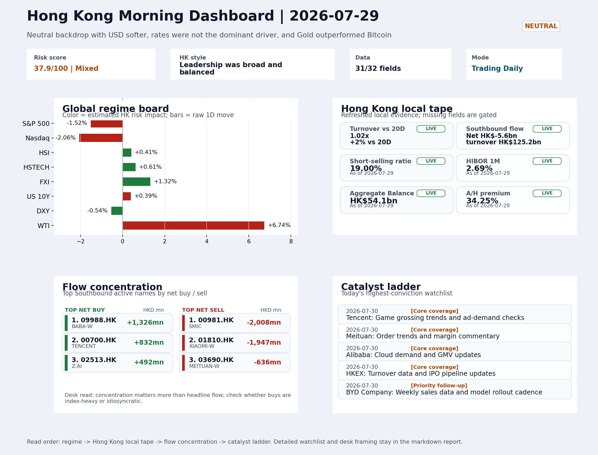
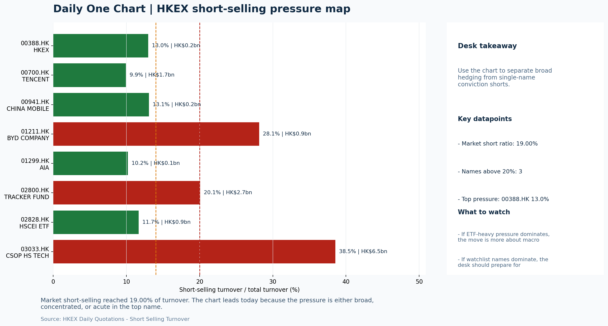

# Morning Research Workbench | 2026-07-30

> Designed for a Hong Kong sell-side commute: Layer 1 `Scan`, Layer 2 `Deep Read`, Layer 3 `Thinking`
> Mode: `Trading Daily` | Keep the report execution-oriented: what mattered in the completed session, what can move Hong Kong leadership, and what needs fast follow-up.
> Briefing date: `2026-07-30` | Review date: `2026-07-29` | Global request: `2026-07-29` | HK/China request: `2026-07-29` | Market effective date: `2026-07-29` | Generated at: `2026-07-30 05:59:05`

## Executive Summary

- **Market pulse:** A softer USD and resilient offshore China proxies (FXI +1.32%) produced a constructive overnight backdrop, but a 13.5% VIX surge and an elevated 19% short-selling ratio argue for tighter.
- **Hong Kong lens:** Hong Kong growth / internet led. The offshore China proxy FXI +1.32% and resilient HSCEI +0.85% frame a constructive base, but the VIX spike and Nasdaq drag create intraday friction.
- **Top catalysts:** VIX +13.45%; INTC -6.33%.

## Visual Dashboard

## Layer 1 | Scan (5-10 min)

### 1.1 One-Line Market Pulse
A softer USD and resilient offshore China proxies (FXI +1.32%) produced a constructive overnight backdrop, but a 13.5% VIX surge and an elevated 19% short-selling ratio argue for tighter risk sizing and require local breadth confirmation.

### 1.2 Global Asset Price Dashboard

| Asset | Last | 1D move | Read |
| --- | --- | --- | --- |
| S&P 500 | 7,316.15 | **-1.52%** | US large-cap risk appetite |
| Nasdaq 100 | 27,192.31 | **-2.06%** | Growth and duration leadership |
| Hang Seng Index | 25,310.85 | +0.41% | Hong Kong broad beta |
| Hang Seng TECH | 4.6440 | +0.61% | Hong Kong growth / platform read-through |
| CSI 300 | 4,529.10 | **-3.60%** | Mainland large-cap tone |
| US 10Y | 4.6220 | +0.39% | Global discount-rate anchor |
| China 10Y | 1.73% | -0.2bp | China local rates anchor \| Live public \| Eastmoney \| 2026-07-29 |
| CN-US 10Y spread | -293.7bp | -6.2bp | Relative carry and macro-pressure gauge \| Live public \| Eastmoney \| 2026-07-29 |
| DXY | 100.83 | -0.54% | Dollar liquidity impulse |
| USD/CNH | 6.7395 | +0.00% | Offshore China risk appetite |
| USD/HKD | 7.8414 | -0.00% | Linked-exchange regime stress check |
| Brent crude | 90.54 | **+7.67%** | Energy / geopolitics |
| COMEX gold | 4,126.00 | **+2.22%** | Hedge demand / real yields |
| Copper | 6.3465 | +0.39% | Global growth proxy |
| VIX | 20.66 | **+13.45%** | US stress barometer |

### 1.3 Hong Kong Key Data Quick Check

| Check | Value | Status | Source / as of | Why it matters |
| --- | --- | --- | --- | --- |
| Main Board turnover vs 20D | 1.02x \| +2% vs 20D | Live local | HKEX \| 2026-07-29 | Trailing 20-session average turnover was HK$306.0bn. |
| Southbound / Northbound net flow | Southbound Net HK$-5.6bn \| turnover HK$125.2bn \| Northbound Turnover HK$341.4bn \| net not reported | Live local | HKEX Connect \| 2026-07-29 | Southbound net buy is calculated from HKEX disclosed buy and sell turnover. |
| Short-selling ratio | 19.00% | Live local | HKEX \| 2026-07-29 | Official HKEX stock-level short-selling table, aggregated as a share of total market turnover. |
| AH premium index | 34.25% | Live public | Yahoo \| 2026-07-29 | Simple average across 18 A/H pairs; use dispersion rather than the average alone. |
| USD/HKD spot vs band | 7.8414 \| band 7.7500 to 7.8500 | Live quote + local | Yahoo \| 2026-07-29 | Inside the linked-exchange band without immediate boundary stress. Official Convertibility Undertakings define the linked-rate stress boundaries for USD/HKD. |
| HIBOR 1M | 2.69% | Live local | HKMA \| 2026-07-29 | 1M HIBOR is the cleanest quick read for Hong Kong funding conditions and equity-duration pressure. |
| Aggregate Balance | HK$54.1bn | Live local | HKMA \| 2026-07-29 | Aggregate Balance helps frame whether linked-rate liquidity conditions are tight or comfortable. |
| Hong Kong leadership | Hong Kong growth / internet led | Proxy | HSI / HSCEI / HSTECH relative perf \| 2026-07-29 | Use HSI / HSCEI / HSTECH relative moves as the opening style read. |

### 1.4 Risk Dashboard
**Composite risk score:** `37.9/100` | **Regime:** `Mixed`

| Component | Score impact | Evidence |
| --- | --- | --- |
| US beta | -9.1 | S&P 500 -1.52% |
| HK growth | +3.0 | HSTECH +0.61% |
| Offshore China proxy | +6.6 | FXI +1.32% |
| Dollar pressure | +5.4 | DXY -0.54% |
| Volatility | -10 | VIX +13.45% |
| HK short-selling | -8 | Short-selling ratio 19.00% |

### 1.5 Morning Checklist
1. **VIX +13.45%**
 High-frequency data | Higher volatility argues for tighter sizing and tighter stops.
2. **INTC -6.33%**
 Mover attribution | Announcement / expectations | Guidance reset and margin pressure
3. **WTI crude +6.74%**
 High-frequency data | A strong crude move needs to be split between geopolitics and demand repair.
4. **Neutral backdrop with USD softer, rates were not the dominant driver, and Gold outperformed Bitcoin**
 Overnight regime | Start by deciding whether the day is about Neutral conditions or a style pivot.
5. **CPI MoM (Released)**
 Macro / policy | Rates expectations, the dollar, and growth-equity valuation | Industries: Technology, Internet, Brokers

## Layer 2 | Deep Read (20-30 min)

### 2.1 Overnight Overseas Market Review
#### Market Setup
**Core tape.** Overnight US equities fell as a divided Fed with three hawkish dissents rattled rate expectations, while the VIX surged 13.45% to force systematic desk derisking across growth names.
**Main driver.** Oil's 6.74% spike split the narrative between geopolitical supply risk and demand-repair optimism, while Intel's -6.33% guidance reset added semiconductor sector headwinds that weighed on Nasdaq disproportionately.
**HK relevance.** Hong Kong held firm despite the offshore weakness, with the offshore China proxy FXI +1.32% leading the tape and a softer USD providing cross-border relief, though the 19% short-selling ratio warns against chasing momentum.

#### Key Drivers
- Divided Fed with three hawkish dissents shifted rate-cut expectations and created policy uncertainty, weighing on duration-sensitive.
- VIX surged 13.45%, forcing systematic and discretionary desks to tighten position sizing and hedging costs.
- Oil +6.74% split between geopolitical supply premium and demand-repair narrative, with the latter more supportive for risk appetite.
- Intel guidance reset dragged Nasdaq -2.06%, adding semiconductor sector headwinds with potential contagion to HK tech proxies.

#### Hong Kong Read-Through
**Desk lens.** Leadership was broad and balanced.
**Opening implication.** The offshore China proxy FXI +1.32% and resilient HSCEI +0.85% frame a constructive base.
- **Cross-market read:** Hang Seng +0.41% / HSCEI +0.85% / HSTECH +0.61%.
- **Cross-market read:** Offshore China proxy FXI +1.32% and USD/CNH +0.00% frame cross-border risk appetite.
- **Cross-market read:** USD/HKD last traded around 7.8414, which keeps the Hong Kong funding lens in focus.

#### Watch Points
- USD composite moved lower by -0.32pct intraday, with a 0.429pct range.
- Main turning points appeared around 2026-07-29 08:10 peak / 2026-07-29 08:25 trough / 2026-07-29 08:40 trough, suggesting event-driven repricing.
- The biggest cross-asset divergence was Gold versus Bitcoin, a spread of 3.042pct.
- Gold moved +2.63pct intraday with a 3.669pct high-low range.

**Curated overnight stories**
1. **VIX surges +13.45% intraday**
 Why it matters: Volatility spike forces systematic and discretionary desks to reassess position sizing and hedging costs.
 HK read-through: Relevant for HK options market, HSI constituent positioning, and any leveraged longs in growth/semiconductor names.
2. **Divided Fed holds rates steady; three members voted to hike**
 Why it matters: First Fed decision under Warsh shows internal dissent. Three hawkish dissents shift rate-cut expectations and create USD volatility tail risk, which directly affects.
 HK read-through: Most relevant for HK financial and rate-sensitive sectors. USD direction drives capital flow dynamics between HK and offshore China assets.
3. **CPI MoM released**
 Why it matters: Provides the macro anchor for Fed policy framing. The inflation print interacts with the divided Fed outcome to recalibrate rate expectations for 2H 2026.
 HK read-through: Impacts growth-equity valuation framework for HK internet and technology names. Influences dollar direction and EM risk premium.
4. **INTC down -6.33% on guidance reset and margin pressure**
 Why it matters: Intel's guidance reset reflects semiconductor sector headwinds. Given HK's exposure to chip-related names and technology supply chains, this provides a risk signal.
 HK read-through: Relevant for HK tech and semiconductor sentiment. Could pressure SMIC and other offshore China tech names via sector correlation.
5. **WTI crude up +6.74%**
 Why it matters: A sharp crude move carries dual risk: (1) demand repair narrative if growth-surprising, or (2) geopolitical risk premium if supply-driven.
 HK read-through: Mixed signal for HK energy names and consumer discretionary. Higher crude feeds into inflation expectations, complicating the Fed policy picture further.

### 2.2 Hong Kong / A-share Previous-Day Review
#### Local Tape Setup
**Local read.** Hong Kong equities closed higher on 29 July, with offshore proxies leading: FXI +1.32% and HSCEI +0.85% outperformed HSTECH +0.61%, consistent with a value/SOE tilt.
**Verification point.** Southbound flow was net -HK$5.6bn, but selective internet buying (Tencent, BABA, Z.AI) offset heavy selling in hardware (Xiaomi, SMIC), while the short-selling ratio remained elevated at 19.0%.
**Risk to watch.** The US equity drag (Nasdaq -2.06%) did not spill fully into HK tech, supported by a soft USD and stable CNH.

#### Style and Local Leadership
**Style leadership.** Hong Kong growth / internet led.
- **Cross-market read:** Hang Seng +0.41% / HSCEI +0.85% / HSTECH +0.61%.
- **Cross-market read:** Offshore China proxy FXI +1.32% and USD/CNH +0.00% frame cross-border risk appetite.
- **Cross-market read:** USD/HKD last traded around 7.8414, which keeps the Hong Kong funding lens in focus.

#### Flow Confirmation
Official Stock Connect evidence is available; use Section 2.3 to confirm whether local money supports the price action.

#### Follow-Through Checklist
**Follow-through check.** Watch whether HSTECH can reclaim leadership vs HSCEI and whether Southbound net sell reverses; a decline in the short-selling ratio below 19% and sustained turnover above 1.02x 20D would improve conviction in any growth-led rebound.

### 2.3 Flow Tracker and Attribution
#### Cross-Asset Attribution v1

| Driver | Direction | Score | Evidence | HK implication |
| --- | --- | --- | --- | --- |
| Oil and geopolitics | mixed | 6.14 | Oil moved +7.67%. | Split the read between energy/cyclicals support and margin/geopolitical pressure. |
| US growth-style transmission | drag | 2.88 | Nasdaq 100 moved -2.06%. | Hong Kong growth and platform names should be tested first at the open. |
| Short-selling pressure | drag | 2.8 | HKEX short-selling ratio was 19.00%. | Elevated short activity argues for extra confirmation before chasing rebounds. |
| Global equity beta | drag | 1.52 | S&P 500 moved -1.52%. | Broad beta matters if Hong Kong breadth confirms the overseas signal. |
| Dollar / CNH pressure | supportive | 0.81 | DXY -0.54% / USD-CNH +0.00% | A stable or softer CNH makes Hong Kong follow-through more credible. |

#### Flow Tracker
##### Flow Takeaways
- Short-selling pressure is elevated, so local rebounds need cleaner breadth and flow confirmation.
- Stock Connect Southbound: net HK$-5.6bn on turnover HK$125.2bn (as of 2026-07-29).
- Stock Connect Northbound: turnover RMB341.4bn; public file provides total turnover/top active names, not full net-buy.
- AH premium: simple covered-pair average +34.25%; widest premium: China Communications Construction 84.53%.

##### Stock Connect Southbound Active Names

| Rank | Ticker | Name | Buy | Sell | Net buy |
| --- | --- | --- | --- | --- | --- |
| 2 | 00981.HK | SMIC | HK$3,410.0mn | HK$5,417.8mn | HK$-2,007.7mn |
| 2 | 01810.HK | XIAOMI-W | HK$2,890.2mn | HK$4,837.1mn | HK$-1,946.9mn |
| 4 | 09988.HK | BABA-W | HK$3,385.1mn | HK$2,059.5mn | HK$1,325.6mn |
| 1 | 00700.HK | TENCENT | HK$4,938.6mn | HK$4,106.8mn | HK$831.8mn |
| 3 | 03690.HK | MEITUAN-W | HK$2,102.8mn | HK$2,738.5mn | HK$-635.7mn |

##### AH Premium Dispersion

| Name | A ticker | H ticker | Premium | As of |
| --- | --- | --- | --- | --- |
| China Communications Construction | 601800.SS | 1800.HK | +84.53% | 2026-07-29 |
| China Life | 601628.SS | 2628.HK | +61.04% | 2026-07-29 |
| China Railway Construction | 601186.SS | 1186.HK | +54.01% | 2026-07-29 |
| New China Life | 601336.SS | 1336.HK | +51.20% | 2026-07-29 |
| China Railway | 601390.SS | 0390.HK | +47.57% | 2026-07-29 |

##### HKEX Short-Selling Watch

| Ticker | Name | Short ratio | Short turnover | Total turnover |
| --- | --- | --- | --- | --- |
| 00388.HK | HKEX | 12.98% | HK$0.2bn | HK$1.6bn |
| 00700.HK | TENCENT | 9.94% | HK$1.7bn | HK$16.8bn |
| 00941.HK | CHINA MOBILE | 13.07% | HK$0.2bn | HK$1.7bn |
| 01211.HK | BYD COMPANY | 28.15% | HK$0.9bn | HK$3.3bn |
| 01299.HK | AIA | 10.21% | HK$0.1bn | HK$1.1bn |

- **Short-value leaders:** 07709.HK XL2CSOPHYNIX (HK$9.1bn); 03033.HK CSOP HS TECH (HK$6.5bn); 01810.HK XIAOMI-W (HK$3.9bn); 02800.HK TRACKER FUND (HK$2.7bn).

### 2.4 Macro and Policy Tracking
**Desk read.** The macro agenda for the upcoming session pivots on the already-released US CPI, which came in at 0.3% MoM versus a 0.2% forecast, alongside a China trade balance beat.

**Market sensitivity.** The hotter inflation reading could reprice rate expectations and pressure duration-heavy sectors such as Technology and Internet, yet the concurrent softer dollar and firm gold suggest hedging demand that may partly offset rate.

**HK implication.** The China trade surplus of USD 85.2 bn offers a marginal sentiment tailwind, but the core narrative will be shaped by tonight's US retail sales and Fed Chair Powell's remarks.

**Macro watchpoints**
- US 2-year and 10-year yields and DXY in the wake of the hot CPI print and ahead of retail sales.
- Whether Hong Kong growth proxies - internet, tech, brokers - hold their opening tone or fade on rate jitters.
- Powell's economic outlook remarks for any shift in the perceived pace of policy easing.
- PBOC daily liquidity operation and LPR fix for signals that could reinforce or offset the offshore rate dynamic.

| Time | Region | Event | Status | Desk read |
| --- | --- | --- | --- | --- |
| 20:30 | US | CPI MoM | Released | Impact: Rates expectations, the dollar, and growth-equity valuation \| Attention: 5/5 \| Industries: Technology, Internet, Brokers |
| 09:30 | China | Trade Balance | Released | Impact: Watch whether it changes the day's core market narrative \| Attention: 3/5 \| Industries: Market-wide |
| 20:30 | US | Retail Sales MoM | Upcoming | Impact: Consumer resilience, growth expectations, and risk-asset pricing \| Attention: 5/5 \| Industries: Consumer, E-commerce, Consumer discretionary |
| 09:20 | China | Loan Prime Rate | Upcoming | Impact: Watch whether it changes the day's core market narrative \| Attention: 3/5 \| Industries: Market-wide |
| 22:00 | Federal Reserve | Jerome Powell: Economic outlook remarks | Central bank | Impact: Policy path, liquidity conditions, and cross-asset risk appetite \| Attention: 5/5 \| Industries: Technology, Financials, Gold |
| 10:00 | PBOC | Open Market Operations Desk: Daily liquidity operation window | Central bank | Impact: Policy path, liquidity conditions, and cross-asset risk appetite \| Attention: 3/5 \| Industries: Technology, Financials, Gold |

#### Positioning and Risk Backdrop
- Options activity centered on KWEB Call, with Vol/OI at 1.88x and a bullish bias.
- Put/Call structure shows equity 0.68 / index 1.15, implying Single-stock optimism with index hedging.
- Geopolitics: Middle East | Regional tension remains elevated | Impact: Oil, freight costs, and safe-haven demand
- Geopolitics: US-China | Technology export-control rhetoric remains active | Impact: China internet, semiconductors, and supply chains

### 2.5 Key Company and Sector Events
No high-conviction sector story cleared the main-report relevance gate for this run.

#### Company Event Takeaway
**Desk read.** July 29 session was dominated by Tencent's strong positioning ahead of after-market results and Morgan Stanley's upgrade to Alibaba.
**Why it matters.** The upgrade to 9988.HK (target 92 to 105) signals improving sentiment toward China's platform sector and is relevant for internet group multiples.
**Follow-up.** Tencent reports against EPS est.

#### LLM Quick Takes
- **0700.HK** | Tencent ended +4.29% at HKD 466.4, 75.6% of its recent range. After-market results will be the key near-term catalyst
- **9988.HK** | Morgan Stanley upgraded Alibaba from Equal Weight to Overweight, raising target from 92 to 105.
- **0388.HK** | HKEX reports before market open on July 30. Consensus EPS est. 2.81 HKD, revenue 6.0bn HKD. Results will be tested against recent average daily turnover levels and IPO
- **3690.HK** | Meituan gained +2.21% to HKD 92.3, sitting at 100% of its range. The name is at the top of its recent band
- **1211.HK** | BYD closed +4.23% to HKD 93.6 on Australian leasing partnership news and confirmed 2025 final dividend.
- **0941.HK** | China Mobile added +1.02% to HKD 84.1, at 98.5% of range. The stock is near the top of its recent band.

#### HKEX Announcements

| Grade | Ticker | Type | Release time | Title |
| --- | --- | --- | --- | --- |
| A | 00656.HK | Profit warning | 2026-07-29 | Profit warning / alert announcement |
| A | 01202.HK | Profit warning | 2026-07-29 | Profit warning / alert announcement |
| A | 01471.HK | Profit warning | 2026-07-29 | Profit warning / alert announcement |
| A | 02279.HK | Profit warning | 2026-07-29 | Profit warning / alert announcement |
| A | 02361.HK | Profit warning | 2026-07-29 | Profit warning / alert announcement |
| A | 02392.HK | Profit warning | 2026-07-29 | Profit warning / alert announcement |
| A | 02581.HK | Profit warning | 2026-07-29 | Profit warning / alert announcement |
| A | 08021.HK | Profit warning | 2026-07-29 | Profit warning / alert announcement |

#### Earnings / Results Watch

| Ticker | Company | Timing | Expectation framing |
| --- | --- | --- | --- |
| 0700.HK | Tencent Holdings | After Market Close | EPS est. 4.15 HKD \| revenue est. 163.2bn HKD |
| 0388.HK | Hong Kong Exchanges and Clearing | Before Market Open | EPS est. 2.81 HKD \| revenue est. 6.0bn HKD |

#### Rating Changes
- **9988.HK** | Morgan Stanley | Upgrade | Equal Weight -> Overweight | PT 92 -> 105

#### IPO Watch
- IPO and grey-market monitoring is not yet part of the standard production pack.

### 2.6 Today's Core Names
#### Core coverage

| Name | Ticker | Last | 1D | Range position | Morning note |
| --- | --- | --- | --- | --- | --- |
| Tencent | 0700.HK | 466.40 | +4.29% | Top of range | Short-term price strength is clear; fresh catalysts could trigger broader group follow-through. |
| Meituan | 3690.HK | 92.30 | +2.21% | Top of range | Short-term price strength is clear; fresh catalysts could trigger broader group follow-through. |

**Recent headlines for Tencent:**
- [TSMC and Tencent break into the top 100 of the Fortune Global 500 list, as Asia rides the AI boom](https://finance.yahoo.com/technology/articles/tsmc-tencent-break-top-100-210000080.html) (Fortune)

#### Priority follow-up

| Name | Ticker | Last | 1D | Range position | Morning note |
| --- | --- | --- | --- | --- | --- |
| BYD Company | 1211.HK | 93.60 | +4.23% | Mid-range | Short-term price strength is clear; fresh catalysts could trigger broader group follow-through. |
| China Mobile | 0941.HK | 84.10 | +1.02% | Top of range | The name sits near the top of its recent range, so watch for profit-taking under high expectations. |

**Recent headlines for BYD Company:**
- [Can BYD (SEHK:1211) Justify Its Valuation On The Smart Australia Leasing Deal?](https://finance.yahoo.com/markets/stocks/articles/byd-sehk-1211-justify-valuation-190929035.html) (Simply Wall St.)

## Layer 3 | Thinking (10-15 min)

### 3.1 Rotating Theme Deep Dive

| Field | Read |
| --- | --- |
| Theme | China Exports and Supply-Chain Relocation |
| Angle for the day | Track tariffs, trade policy, shipping, and manufacturing orders to see whether export resilience is still the cleaner China macro expression. |

**Theme desk read**
**Core thesis.** The weekly theme of China exports and supply-chain relocation finds a concrete data point in this morning's trade balance release.
**Evidence.** Combined with BYD's ongoing export volume mix and its dividend catalyst, the name serves as a live proxy for that narrative.
**What to test.** The broader session's elevated VIX (+13.45%) and firm crude (+6.74%) argue for tighter sizing.

**Signals to keep in mind**
- VIX +13.45%: Higher volatility argues for tighter sizing and tighter stops.
- WTI crude +6.74%: A strong crude move needs to be split between geopolitics and demand repair.

**LLM watch items:**
- China trade balance beat: check for follow-through in export-oriented sectors and potential upward revisions to manufacturing order forecasts.
- BYD Company (1211.HK) weekly sales data and model rollout cadence - monitor whether the export mix continues to improve and supports the thesis.
- US Retail Sales (Jul 30) - the outcome will test end-demand assumptions that underpin the export resilience argument.

**Related names to keep close:**

| Name | Ticker | Bucket | Morning read |
| --- | --- | --- | --- |
| BYD Company | 1211.HK | Priority follow-up | Short-term price strength is clear; fresh catalysts could trigger broader group follow-through. |
| China Mobile | 0941.HK | Priority follow-up | The name sits near the top of its recent range, so watch for profit-taking under high expectations. |

**Upcoming catalysts tied to the theme:**
- 2026-07-30 | BYD Company: Weekly sales data and model rollout cadence | Hong Kong-listed proxy for EV volumes, export mix, and price competition
- 2026-07-30 | China Mobile: Capex updates and dividend policy signals | Defensive SOE benchmark for yield trade and domestic digital-infrastructure spend

### 3.2 Today Ahead and Trading Calendar
- Macro: CPI MoM is the first item to anchor the open and the rates/FX response.
- Corporate / event: Tencent: Game grossing trends and ad-demand checks is the cleanest same-day catalyst to prepare for.

**Same-day macro docket**

| Time | Country | Event | Status | Detail |
| --- | --- | --- | --- | --- |
| 20:30 | US | CPI MoM | Released | Actual 0.3% / Forecast 0.2% / Prior 0.4% |
| 09:30 | China | Trade Balance | Released | Actual USD 85.2bn / Forecast USD 79.0bn / Prior USD 80.6bn |
| 20:30 | US | Retail Sales MoM | Upcoming | Forecast 0.3% / Prior 0.6% |
| 09:20 | China | Loan Prime Rate | Upcoming | Forecast 3.45% / Prior 3.45% |
| 22:00 | Federal Reserve | Jerome Powell: Economic outlook remarks | Central bank | speech |

**Same-day catalyst list**

| Date | Time | Category | Event | Importance |
| --- | --- | --- | --- | --- |
| 2026-07-30 | | Core coverage | Tencent: Game grossing trends and ad-demand checks | 3 |
| 2026-07-30 | | Core coverage | Meituan: Order trends and margin commentary | 3 |
| 2026-07-30 | | Core coverage | Alibaba: Cloud demand and GMV updates | 3 |
| 2026-07-30 | | Core coverage | HKEX: Turnover data and IPO pipeline updates | 3 |

**Next few sessions**

| Date | Category | Event | Impact |
| --- | --- | --- | --- |
| 2026-07-30 | Core coverage | Tencent: Game grossing trends and ad-demand checks | Core offshore China platform proxy for gaming, ads, and AI monetization |
| 2026-07-30 | Core coverage | Meituan: Order trends and margin commentary | High-frequency read on local services demand and platform competition |
| 2026-07-30 | Core coverage | Alibaba: Cloud demand and GMV updates | Key read-through for China consumption, cloud, and platform regulation |
| 2026-07-30 | Core coverage | HKEX: Turnover data and IPO pipeline updates | Direct proxy for Hong Kong market turnover, listings, and southbound |

### 3.3 Daily One Chart
**Daily One Chart | HKEX short-selling pressure map**

**Chart read.** Market short-selling reached 19.00% of turnover.
**Why it matters.** The chart leads today because the pressure is either broad, concentrated, or acute in the top name.

_Source: HKEX Daily Quotations - Short Selling Turnover_

## Traceable Appendix

### Report Metadata
> Date policy: Review date 2026-07-29 is treated as `Trading Daily`. | Global request date is 2026-07-29; adapter effective date is 2026-07-29 and summary date is 2026-07-29. | HK/China local data date is 2026-07-29; role: same-session local cash tape.
> Market data quality: Coverage: `31/32` | Stale items (>1d): `1` | Missing: `1`
> Report quality: `90.8/100` | Grade `A` | Status `production ready`

### Key Questions to Keep in Mind
- Is risk appetite rising or fading? The overnight tape reads closer to `Neutral`.
- Did rates expectations move? Focus on whether US 10Y, DXY, and growth style moved together.
- Were commodities the real story? Watch WTI and gold for geopolitics versus inflation signals.
- Is Hong Kong setup internet-led, SOE-led, or broad beta-led? Compare HSTECH, HSCEI, and HSI.
- Did offshore markets move China risk appetite? Focus on HSI, FXI, USD/CNH, and USD/HKD.

### Report Quality and Validation
- **Quality score:** 90.8/100 | **Grade:** A | **Status:** production ready
- **Run summary:** 8 healthy | 0 caveat | 0 failed
- **Release recommendation:** Send | All monitored sources were healthy, so the report is fit for normal distribution.

| Source | Status | Bucket |
| --- | --- | --- |
| Market data | ok | healthy |
| Sector and company news | ok | healthy |
| Movers and short selling | ok | healthy |
| Stock Connect | ok | healthy |
| A/H premium | ok | healthy |
| Hong Kong local package | ok | healthy |
| China rates | ok | healthy |
| Narrative overlay | ok | healthy |

**Desk-use guidance summary:** 0 blocking | 1 advisory

**Desk-use guidance**
- **Advisory:** All monitored sources were healthy for this run; the report can be used as a normal desk-starting point.

| Component | Score | Weight | Read |
| --- | --- | --- | --- |
| Market data coverage | 96.9 | 0.3 | 31/32 core market fields available. |
| Hong Kong local metrics | 82.3 | 0.25 | 8 live, 3 proxy, 0 unavailable local checks. |
| Key public adapters | 100.0 | 0.2 | 4/4 key adapters were available or partially available. |
| Narrative overlay health | 74.3 | 0.15 | 4/7 narrative overlay tasks succeeded or used validated cache; 0 error(s). |
| Fact-check guardrail | 100.0 | 0.1 | Checked 0 numeric claims; 0 numeric mismatch(es), 0 logic warning(s); 0 critical, 0 review. |

**Narrative fact-check guardrail**
- Checked 0 numeric claims; 0 numeric mismatch(es), 0 logic warning(s); 0 critical, 0 review.

**Adapter status**

| Adapter | Status |
| --- | --- |
| Stock Connect | ok |
| A/H premium | ok |
| HKEX announcements | ok |
| China rates | ok |

### Source Links
- [TSMC and Tencent break into the top 100 of the Fortune Global 500 list, as Asia rides the AI boom](https://finance.yahoo.com/technology/articles/tsmc-tencent-break-top-100-210000080.html) (Fortune)
- [Will Alibaba's Cash Flow Weakness Hurt Its Long-Term Growth Potential?](https://finance.yahoo.com/markets/stocks/articles/alibabas-cash-flow-weakness-hurt-150000544.html) (Zacks)
- [Can BYD (SEHK:1211) Justify Its Valuation On The Smart Australia Leasing Deal?](https://finance.yahoo.com/markets/stocks/articles/byd-sehk-1211-justify-valuation-190929035.html) (Simply Wall St.)
- [00656.HK Profit warning / alert announcement](http://www1.hkexnews.hk/listedco/listconews/sehk/2026/0729/2026072900298.pdf) (HKEXnews)
- [01202.HK Profit warning / alert announcement](http://www1.hkexnews.hk/listedco/listconews/sehk/2026/0729/2026072901453.pdf) (HKEXnews)
- [01471.HK Profit warning / alert announcement](http://www1.hkexnews.hk/listedco/listconews/sehk/2026/0729/2026072901063.pdf) (HKEXnews)
- [02279.HK Profit warning / alert announcement](http://www1.hkexnews.hk/listedco/listconews/sehk/2026/0729/2026072900001.pdf) (HKEXnews)
- [02361.HK Profit warning / alert announcement](http://www1.hkexnews.hk/listedco/listconews/sehk/2026/0729/2026072901279.pdf) (HKEXnews)
- [02392.HK Profit warning / alert announcement](http://www1.hkexnews.hk/listedco/listconews/sehk/2026/0729/2026072900318.pdf) (HKEXnews)
- [02581.HK Profit warning / alert announcement](http://www1.hkexnews.hk/listedco/listconews/sehk/2026/0729/2026072901439.pdf) (HKEXnews)
- [08021.HK Profit warning / alert announcement](http://www1.hkexnews.hk/listedco/listconews/gem/2026/0729/2026072901423.pdf) (HKEXnews)

## Supplementary Visual Appendix

This appendix is professional-path only. It keeps a traceable index of the report visuals and the deterministic chart cues used to frame the morning note, without injecting the legacy intraday chart pack.

### Visual Index

| Visual | Path | Role |
| --- | --- | --- |
| Visual Dashboard | `charts/dashboard_2026-07-30.png` | Cross-asset regime board and Hong Kong local tape snapshot. |
| Daily One Chart | `charts/daily_one_chart_2026-07-30.png` | Single highest-conviction visual story for the day. |

### Deterministic Chart Cues
- FX / liquidity: USD composite moved lower by -0.32pct intraday, with a 0.429pct range.
- FX / liquidity: Main turning points appeared around 2026-07-29 08:10 peak / 2026-07-29 08:25 trough / 2026-07-29 08:40 trough, suggesting event-driven repricing rather than a clean one-way USD move.
- Cross-asset: The biggest cross-asset divergence was Gold versus Bitcoin, a spread of 3.042pct.
- Cross-asset: Gold moved +2.63pct intraday with a 3.669pct high-low range.
- Cross-asset: Oil moved +2.37pct intraday with a 4.526pct high-low range.
- Cross-asset: Bitcoin moved -0.41pct intraday with a 2.128pct high-low range.

### Risk Dashboard Components

| Component | Score impact | Evidence |
| --- | --- | --- |
| US beta | -9.1 | S&P 500 -1.52% |
| HK growth | +3.0 | HSTECH +0.61% |
| Offshore China proxy | +6.6 | FXI +1.32% |
| Dollar pressure | +5.4 | DXY -0.54% |
| Volatility | -10 | VIX +13.45% |
| HK short-selling | -8 | Short-selling ratio 19.00% |
