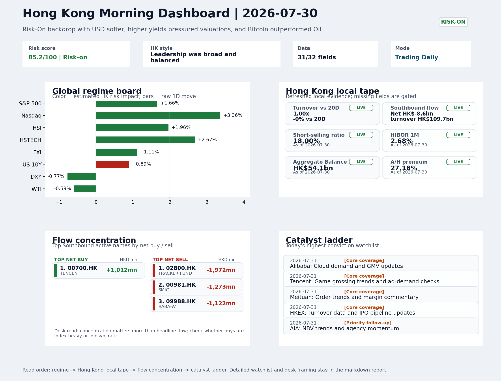
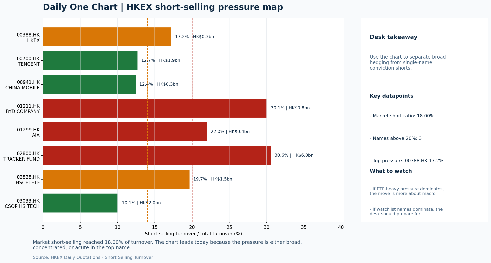

# Morning Research Workbench | 2026-07-31

> Designed for a Hong Kong sell-side commute: Layer 1 `Scan`, Layer 2 `Deep Read`, Layer 3 `Thinking`
> Mode: `Trading Daily` | Keep the report execution-oriented: what mattered in the completed session, what can move Hong Kong leadership, and what needs fast follow-up.
> Briefing date: `2026-07-31` | Review date: `2026-07-30` | Global request: `2026-07-30` | HK/China request: `2026-07-30` | Market effective date: `2026-07-30` | Generated at: `2026-07-31 06:04:48`

## Executive Summary

- **Market pulse:** A strong US tech-led rally and softer dollar set a constructive backdrop for Hong Kong, but flat turnover, elevated short-selling, and Southbound outflows kept the overnight signal.
- **Hong Kong lens:** Hong Kong growth / internet led. The Nasdaq lead and softer dollar constructively frame an open for HSTECH and internet platforms, but the US 10Y yield rise is a partial offset for valuation-sensitive names.
- **Top catalysts:** VIX -17.28%; INTC -6.33%.

## Visual Dashboard

## Layer 1 | Scan (5-10 min)

### 1.1 One-Line Market Pulse
A strong US tech-led rally and softer dollar set a constructive backdrop for Hong Kong, but flat turnover, elevated short-selling, and Southbound outflows kept the overnight signal from becoming investable.

### 1.2 Global Asset Price Dashboard

| Asset | Last | 1D move | Read |
| --- | --- | --- | --- |
| S&P 500 | 7,437.63 | **+1.66%** | US large-cap risk appetite |
| Nasdaq 100 | 28,106.35 | **+3.36%** | Growth and duration leadership |
| Hang Seng Index | 25,807.92 | **+1.96%** | Hong Kong broad beta |
| Hang Seng TECH | 4.7680 | **+2.67%** | Hong Kong growth / platform read-through |
| CSI 300 | 4,529.10 | **-3.60%** | Mainland large-cap tone |
| US 10Y | 4.6630 | +0.89% | Global discount-rate anchor |
| China 10Y | 1.72% | -1.3bp | China local rates anchor \| Live public \| Eastmoney \| 2026-07-30 |
| CN-US 10Y spread | -296.0bp | -2.3bp | Relative carry and macro-pressure gauge \| Live public \| Eastmoney \| 2026-07-30 |
| DXY | 100.02 | -0.77% | Dollar liquidity impulse |
| USD/CNH | 6.7280 | +0.00% | Offshore China risk appetite |
| USD/HKD | 7.8426 | +0.02% | Linked-exchange regime stress check |
| Brent crude | 89.45 | -1.42% | Energy / geopolitics |
| COMEX gold | 4,162.80 | **+3.17%** | Hedge demand / real yields |
| Copper | 6.5005 | **+3.62%** | Global growth proxy |
| VIX | 17.09 | **-17.28%** | US stress barometer |

### 1.3 Hong Kong Key Data Quick Check

| Check | Value | Status | Source / as of | Why it matters |
| --- | --- | --- | --- | --- |
| Main Board turnover vs 20D | 1.00x \| -0% vs 20D | Live local | HKEX \| 2026-07-30 | Trailing 20-session average turnover was HK$306.2bn. |
| Southbound / Northbound net flow | Southbound Net HK$-8.6bn \| turnover HK$109.7bn \| Northbound Turnover HK$363.5bn \| net not reported | Live local | HKEX Connect \| 2026-07-30 | Southbound net buy is calculated from HKEX disclosed buy and sell turnover. |
| Short-selling ratio | 18.00% | Live local | HKEX \| 2026-07-30 | Official HKEX stock-level short-selling table, aggregated as a share of total market turnover. |
| AH premium index | 27.18% | Live public | Yahoo \| 2026-07-30 | Simple average across 18 A/H pairs; use dispersion rather than the average alone. |
| USD/HKD spot vs band | 7.8426 \| band 7.7500 to 7.8500 | Live quote + local | Yahoo \| 2026-07-30 | Inside the linked-exchange band without immediate boundary stress. Official Convertibility Undertakings define the linked-rate stress boundaries for USD/HKD. |
| HIBOR 1M | 2.68% | Live local | HKMA \| 2026-07-30 | 1M HIBOR is the cleanest quick read for Hong Kong funding conditions and equity-duration pressure. |
| Aggregate Balance | HK$54.1bn | Live local | HKMA \| 2026-07-30 | Aggregate Balance helps frame whether linked-rate liquidity conditions are tight or comfortable. |
| Hong Kong leadership | Hong Kong growth / internet led | Proxy | HSI / HSCEI / HSTECH relative perf \| 2026-07-30 | Use HSI / HSCEI / HSTECH relative moves as the opening style read. |

### 1.4 Risk Dashboard
**Composite risk score:** `85.2/100` | **Regime:** `Risk-on`

| Component | Score impact | Evidence |
| --- | --- | --- |
| US beta | +10.0 | S&P 500 +1.66% |
| HK growth | +10 | HSTECH +2.67% |
| Offshore China proxy | +5.6 | FXI +1.11% |
| Dollar pressure | +7.7 | DXY -0.77% |
| Volatility | +10 | VIX -17.28% |
| HK short-selling | -8 | Short-selling ratio 18.00% |

### 1.5 Morning Checklist
1. **VIX -17.28%**
 High-frequency data | Lower volatility signals easing stress in the tape.
2. **INTC -6.33%**
 Mover attribution | Announcement / expectations | Guidance reset and margin pressure
3. **Risk-On backdrop with USD softer, higher yields pressured valuations, and Bitcoin outperformed Oil**
 Overnight regime | Start by deciding whether the day is about Risk-On conditions or a style pivot.
4. **CPI MoM (Released)**
 Macro / policy | Rates expectations, the dollar, and growth-equity valuation | Industries: Technology, Internet, Brokers
5. **Trade Balance (Released)**
 Macro / policy | Watch whether it changes the day's core market narrative | Industries: Market-wide

## Layer 2 | Deep Read (20-30 min)

### 2.1 Overnight Overseas Market Review
#### Market Setup
**Core tape.** Overnight markets extended the Risk-On tone as strong US mega-cap earnings - Microsoft's AI capex and Meta's results - drove the Nasdaq 100 up 3.36%, validating growth/tech sentiment globally.
**Main driver.** The DXY fell 0.77% to 100.02, easing offshore dollar pressure and supporting EM/HK proxies, while the VIX collapsed -17.28% to 17.09, signaling stress unwinding across the tape.
**HK relevance.** Gold rallied +3.17% and Copper +3.62%, but the US 10Y yield rose +0.89% to 4.663%, creating a partial headwind for long-duration valuations - a divergence that warrants watching rather than ignoring.

#### Key Drivers
- Nasdaq +3.36% on Microsoft/Meta earnings validates AI infrastructure capex thesis and supports HK tech/growth proxies.
- DXY -0.77% reduces offshore dollar funding pressure; USD/CNH held flat at 6.728, keeping CNH stability intact.
- VIX -17.28% signals risk-stress unwinding, which typically supports short-term momentum in HSI and reduces tail-risk hedging.
- US 10Y +0.89% to 4.663% introduces valuation sensitivity for duration-heavy sectors; creates a partial counter-force to growth momentum.

#### Hong Kong Read-Through
**Desk lens.** Leadership was broad and balanced.
**Opening implication.** The Nasdaq lead and softer dollar constructively frame an open for HSTECH and internet platforms.
- **Cross-market read:** Hang Seng +1.96% / HSCEI +2.22% / HSTECH +2.67%.
- **Cross-market read:** Offshore China proxy FXI +1.11% and USD/CNH +0.00% frame cross-border risk appetite.
- **Cross-market read:** USD/HKD last traded around 7.8426, which keeps the Hong Kong funding lens in focus.

#### Watch Points
- USD composite moved lower by -0.94pct intraday, with a 1.082pct range.
- Main turning points appeared around 2026-07-30 08:05 trough / 2026-07-30 08:25 peak / 2026-07-30 08:45 trough, suggesting event-driven repricing.
- The biggest cross-asset divergence was Bitcoin versus Oil, a spread of 0.938pct.
- Gold moved +1.19pct intraday with a 2.185pct high-low range.

**Curated overnight stories**
1. **Microsoft and Meta earnings drive semiconductor and AI stocks higher (Micron, Sandisk**
 Why it matters: Microsoft's heavy AI capex and Meta's results validate the AI infrastructure investment thesis. Grade A news that reshapes near-term earnings forecasts for semiconductor.
 HK read-through: Most relevant for Hong Kong tech and growth sentiment. HSI constituents with AI/semiconductor exposure (e.g., SMIC, CXMT) and internet platforms benefit from positive US.
2. **VIX collapses -17.28%, signaling easing stress in global tape**
 Why it matters: Sharp volatility decline confirms Risk-On regime. Lower fear premium typically supports risk assets and reduces demand for defensive positioning.
 HK read-through: Positive for Hong Kong equity demand. Supports short-term momentum in HSI and reduces tail-risk hedging activity.
3. **Fed meeting takeaways: Warsh's second statement shows inflation focus, Gundlach flags**
 Why it matters: New Fed chair Warsh is signaling inflation vigilance. Bond market is pricing this shift. This could constrain rate cut expectations and keep USD supported.
 HK read-through: USD dynamics remain key for HKD-linked system and Hong Kong rate-sensitive sectors. Sustained USD strength would offset some of the Risk-On benefit.
4. **INTC -6.33%: Guidance reset and margin pressure announced**
 Why it matters: Intel's guidance cut and margin concerns reflect competitive pressures in semiconductors. This creates mixed signals alongside the Micron/Sandisk rally.
 HK read-through: Intel weakness may cap gains for some China semiconductor plays if investors differentiate between US legacy chipmakers and AI-driven demand.
5. **China threatens retaliation against U.S. humanoid robot ban**
 Why it matters: Escalation in US-China tech tensions on a niche but symbolic technology. Direct retaliation language raises geopolitical risk premium for China tech.
 HK read-through: Modest negative for Hong Kong-listed China tech and robotics plays. However, the headline is specific enough that it should not broadly reprice China risk.

### 2.2 Hong Kong / A-share Previous-Day Review
#### Local Tape Setup
**Local read.** Hong Kong's session was growth-led, with HSTECH +2.67% outperforming HSCEI +2.22% on the back of the Nasdaq's 3.36% surge, but flow confirmation is incomplete.
**Verification point.** The overnight Risk-On signal from US tech earnings and a softer dollar is being read as supportive for AI/semiconductor names, yet the 18% short-selling ratio and turnover at only 1.00x the 20-day average argue.

#### Style and Local Leadership
**Style leadership.** Hong Kong growth / internet led.
- **Cross-market read:** Hang Seng +1.96% / HSCEI +2.22% / HSTECH +2.67%.
- **Cross-market read:** Offshore China proxy FXI +1.11% and USD/CNH +0.00% frame cross-border risk appetite.
- **Cross-market read:** USD/HKD last traded around 7.8426, which keeps the Hong Kong funding lens in focus.

#### Flow Confirmation
Official Stock Connect evidence is available; use Section 2.3 to confirm whether local money supports the price action.

#### Follow-Through Checklist
**Follow-through check.** Watch for a decline in the short-selling ratio below 15%, a shift to net southbound inflows.

### 2.3 Flow Tracker and Attribution
#### Cross-Asset Attribution v1

| Driver | Direction | Score | Evidence | HK implication |
| --- | --- | --- | --- | --- |
| US growth-style transmission | supportive | 4.7 | Nasdaq 100 moved +3.36%. | Hong Kong growth and platform names should be tested first at the open. |
| Short-selling pressure | drag | 2.1 | HKEX short-selling ratio was 18.00%. | Elevated short activity argues for extra confirmation before chasing rebounds. |
| Global equity beta | supportive | 1.66 | S&P 500 moved +1.66%. | Broad beta matters if Hong Kong breadth confirms the overseas signal. |
| Dollar / CNH pressure | supportive | 1.16 | DXY -0.77% / USD-CNH +0.00% | A stable or softer CNH makes Hong Kong follow-through more credible. |
| Rates impulse | drag | 1.07 | US 10Y yield proxy moved +0.89%. | Lower yields help long-duration growth; higher yields pressure valuation-sensitive |

#### Flow Tracker
##### Flow Takeaways
- Short-selling pressure is elevated, so local rebounds need cleaner breadth and flow confirmation.
- Stock Connect Southbound: net HK$-8.6bn on turnover HK$109.7bn (as of 2026-07-30).
- Stock Connect Northbound: turnover RMB363.5bn; public file provides total turnover/top active names, not full net-buy.
- AH premium: simple covered-pair average +27.18%; widest premium: China Life 59.52%.

##### Stock Connect Southbound Active Names

| Rank | Ticker | Name | Buy | Sell | Net buy |
| --- | --- | --- | --- | --- | --- |
| 8 | 02800.HK | TRACKER FUND | HK$4.8mn | HK$1,977.0mn | HK$-1,972.3mn |
| 1 | 00981.HK | SMIC | HK$3,085.7mn | HK$4,358.6mn | HK$-1,272.9mn |
| 3 | 09988.HK | BABA-W | HK$1,426.4mn | HK$2,548.0mn | HK$-1,121.6mn |
| 2 | 00700.HK | TENCENT | HK$4,355.6mn | HK$3,343.6mn | HK$1,012.0mn |
| 7 | 03690.HK | MEITUAN-W | HK$365.9mn | HK$952.7mn | HK$-586.9mn |

##### AH Premium Dispersion

| Name | A ticker | H ticker | Premium | As of |
| --- | --- | --- | --- | --- |
| China Life | 601628.SS | 2628.HK | +59.52% | 2026-07-30 |
| China Railway Construction | 601186.SS | 1186.HK | +54.84% | 2026-07-30 |
| New China Life | 601336.SS | 1336.HK | +49.88% | 2026-07-30 |
| China Railway | 601390.SS | 0390.HK | +49.06% | 2026-07-30 |
| CRRC | 601766.SS | 1766.HK | +37.78% | 2026-07-30 |

##### HKEX Short-Selling Watch

| Ticker | Name | Short ratio | Short turnover | Total turnover |
| --- | --- | --- | --- | --- |
| 00388.HK | HKEX | 17.22% | HK$0.3bn | HK$1.5bn |
| 00700.HK | TENCENT | 12.69% | HK$1.9bn | HK$14.9bn |
| 00941.HK | CHINA MOBILE | 12.43% | HK$0.3bn | HK$2.3bn |
| 01211.HK | BYD COMPANY | 30.07% | HK$0.8bn | HK$2.5bn |
| 01299.HK | AIA | 22.00% | HK$0.4bn | HK$1.6bn |

- **Short-value leaders:** 07709.HK XL2CSOPHYNIX (HK$8.1bn); 02800.HK TRACKER FUND (HK$6.0bn); 03033.HK CSOP HS TECH (HK$2.0bn); 00700.HK TENCENT (HK$1.9bn).

### 2.4 Macro and Policy Tracking
**Desk read.** The overnight US CPI surprise (0.3% MoM vs 0.2% f/c) risks re-pricing the rates-and-dollar backdrop that supported yesterday's Risk-On Hong Kong session.

**Market sensitivity.** Hotter inflation can steepen the US curve and firm the dollar, pressuring duration-sensitive sectors - Technology, Internet, Brokers - that led local gains.

**HK implication.** China's wider Trade Balance surplus (USD 85.2bn vs 79bn f/c) offers a modest offset for sentiment, but the main catalyst risk shifts to tonight's US Retail Sales and Powell's speech.

**Macro watchpoints**
- US 2y and 10y yields moving higher on CPI sting, and DXY response in Asian hours.
- Hang Seng TECH Index and HK broker stocks - watch for opening pressure or relative strength.
- China LPR fix at 09:20 - any surprise cut could briefly lift property but flatten financials.
- Ahead of Powell's remarks, whether gold holds its bid as a real-yield hedge.

| Time | Region | Event | Status | Desk read |
| --- | --- | --- | --- | --- |
| 20:30 | US | CPI MoM | Released | Impact: Rates expectations, the dollar, and growth-equity valuation \| Attention: 5/5 \| Industries: Technology, Internet, Brokers |
| 09:30 | China | Trade Balance | Released | Impact: Watch whether it changes the day's core market narrative \| Attention: 3/5 \| Industries: Market-wide |
| 20:30 | US | Retail Sales MoM | Upcoming | Impact: Consumer resilience, growth expectations, and risk-asset pricing \| Attention: 5/5 \| Industries: Consumer, E-commerce, Consumer discretionary |
| 09:20 | China | Loan Prime Rate | Upcoming | Impact: Watch whether it changes the day's core market narrative \| Attention: 3/5 \| Industries: Market-wide |
| 22:00 | Federal Reserve | Jerome Powell: Economic outlook remarks | Central bank | Impact: Policy path, liquidity conditions, and cross-asset risk appetite \| Attention: 5/5 \| Industries: Technology, Financials, Gold |
| 10:00 | PBOC | Open Market Operations Desk: Daily liquidity operation window | Central bank | Impact: Policy path, liquidity conditions, and cross-asset risk appetite \| Attention: 3/5 \| Industries: Technology, Financials, Gold |

#### Positioning and Risk Backdrop
- Options activity centered on KWEB Call, with Vol/OI at 1.88x and a bullish bias.
- Put/Call structure shows equity 0.68 / index 1.15, implying Single-stock optimism with index hedging.
- Geopolitics: Middle East | Regional tension remains elevated | Impact: Oil, freight costs, and safe-haven demand
- Geopolitics: US-China | Technology export-control rhetoric remains active | Impact: China internet, semiconductors, and supply chains

### 2.5 Key Company and Sector Events

| Grade | Sector | Headline | Why it matters | Horizon |
| --- | --- | --- | --- | --- |
| A | Semiconductors and AI | Micron, Sandisk and other chip stocks get major boosts in the wake | This can directly reshape earnings forecasts and the valuation framework | Short-term catalyst |

#### Company Event Takeaway
**Desk read.** Risk-on sentiment held into the close with USD softness and Bitcoin outpacing Oil, supporting HK internet and growth proxies.
**Why it matters.** The session's most immediate signal is Morgan Stanley upgrading Alibaba (9988.HK) from Equal Weight to Overweight with target raised to 105, implying ~15% upside from current levels.
**Follow-up.** This is a notable positive data point for China internet sentiment ahead of potential cloud demand and GMV catalysts.

#### LLM Quick Takes
- **9988.HK** | Morgan Stanley upgrade from Equal Weight to Overweight with target raised to 92 to 105 is the most direct rating signal for HK internet.
- **0700.HK** | Reports after market close with EPS est. 4.15 HKD and revenue est. 163.2bn HKD. Stock is at top of range (83.1%) and up 1.16% today, so expectations are elevated.
- **0388.HK** | Reports before market open with EPS est. 2.81 HKD and revenue est. 6.0bn HKD. Results are a direct read-through for HK financial sentiment and turnover expectations.
- **00148.HK** | Grade-A profit warning filed 2026-07-30. Materials sector exposure; the alert warrants follow-up on whether the profit cut reflects sector-specific cost pressures or
- **00165.HK** | Grade-A profit warning filed 2026-07-30. China exposure with unknown sub-sector details; watch for specifics in the full announcement to assess contagion risk to peers.
- **3033.HK** | Up 2.67% and at mid-range (64.3%), the Hang Seng TECH ETF is a useful fast proxy for group momentum.

#### HKEX Announcements

| Grade | Ticker | Type | Release time | Title |
| --- | --- | --- | --- | --- |
| A | 00148.HK | Profit warning | 2026-07-30 | Profit warning / alert announcement |
| A | 00165.HK | Profit warning | 2026-07-30 | Profit warning / alert announcement |
| A | 00532.HK | Profit warning | 2026-07-30 | Profit warning / alert announcement |
| A | 00543.HK | Profit warning | 2026-07-30 | Profit warning / alert announcement |
| A | 00861.HK | Profit warning | 2026-07-30 | Profit warning / alert announcement |
| A | 00909.HK | Profit warning | 2026-07-30 | Profit warning / alert announcement |
| A | 01046.HK | Profit warning | 2026-07-30 | Profit warning / alert announcement |
| A | 01328.HK | Profit warning | 2026-07-30 | Profit warning / alert announcement |

#### Earnings / Results Watch

| Ticker | Company | Timing | Expectation framing |
| --- | --- | --- | --- |
| 0700.HK | Tencent Holdings | After Market Close | EPS est. 4.15 HKD \| revenue est. 163.2bn HKD |
| 0388.HK | Hong Kong Exchanges and Clearing | Before Market Open | EPS est. 2.81 HKD \| revenue est. 6.0bn HKD |

#### Rating Changes
- **9988.HK** | Morgan Stanley | Upgrade | Equal Weight -> Overweight | PT 92 -> 105

#### IPO Watch
- IPO and grey-market monitoring is not yet part of the standard production pack.

### 2.6 Today's Core Names
#### Core coverage

| Name | Ticker | Last | 1D | Range position | Morning note |
| --- | --- | --- | --- | --- | --- |
| Alibaba | 9988.HK | 111.80 | -1.58% | Mid-range | Positioning is neutral for now, so use it mainly to monitor marginal information changes. |
| Tencent | 0700.HK | 471.80 | +1.16% | Top of range | The name sits near the top of its recent range, so watch for profit-taking under high expectations. |

**Recent headlines for Alibaba:**
- [Is Alibaba (BABA) a Buy as Wall Street Analysts Look Optimistic?](https://finance.yahoo.com/markets/stocks/articles/alibaba-baba-buy-wall-street-133004328.html) (Zacks)
**Recent headlines for Tencent:**
- [TSMC and Tencent break into the top 100 of the Fortune Global 500 list, as Asia rides the AI boom](https://finance.yahoo.com/technology/articles/tsmc-tencent-break-top-100-210000080.html) (Fortune)

#### Priority follow-up

| Name | Ticker | Last | 1D | Range position | Morning note |
| --- | --- | --- | --- | --- | --- |
| AIA | 1299.HK | 79.65 | +1.92% | Mid-range | Positioning is neutral for now, so use it mainly to monitor marginal information changes. |
| BYD Company | 1211.HK | 94.80 | +1.28% | Top of range | The name sits near the top of its recent range, so watch for profit-taking under high expectations. |

## Layer 3 | Thinking (10-15 min)

### 3.1 Rotating Theme Deep Dive

| Field | Read |
| --- | --- |
| Theme | Hong Kong Market Structure and Flows |
| Angle for the day | Focus on turnover, Stock Connect, ETF flows, HKEX activity, and style leadership to understand whether Hong Kong is being driven by fundamentals or positioning. |

**Theme desk read**
**Core thesis.** The weekly market-structure lens remains relevant because overnight risk-on signals - VIX down 17.28%, copper up 3.62%, and Bitcoin outperforming oil - suggest an easing stress backdrop.
**Evidence.** For Hong Kong, the immediate question is whether that risk-on mood translates into higher turnover, stronger southbound flows, and a decisive style shift.
**What to test.** HKEX (0388.HK) sits mid-range and trades flat, so today's turnover and IPO updates will test whether positioning is ready to re-rate.

**Signals to keep in mind**
- VIX -17.28%: Lower volatility signals easing stress in the tape.
- Copper +3.62%: Keep tracking it to confirm whether the core daily narrative is holding.

**LLM watch items:**
- Track HKEX turnover data and any IPO pipeline comments to confirm activity is responding to the lower-VIX environment.
- Verify BYD's weekly sales numbers and model rollout cadence: the stock is near its range top, so any miss could trigger profit-taking.
- Compare intraday flows into the Hang Seng TECH ETF versus the HSCEI ETF to see whether growth or value/style pivots are attracting marginal capital.
- Check if the hotter-than-expected US CPI print is affecting rate-sensitive Hong Kong names, particularly in technology and broker segments.
- Note the China LPR decision (forecast 3.45%, unchanged) and any shift that could alter the policy-flow-through narrative.

**Related names to keep close:**

| Name | Ticker | Bucket | Morning read |
| --- | --- | --- | --- |
| HKEX | 0388.HK | Core coverage | Positioning is neutral for now, so use it mainly to monitor marginal information changes. |
| BYD Company | 1211.HK | Priority follow-up | The name sits near the top of its recent range, so watch for profit-taking under high expectations. |

**Upcoming catalysts tied to the theme:**
- 2026-07-31 | HKEX: Turnover data and IPO pipeline updates | Direct proxy for Hong Kong market turnover, listings, and southbound interest
- 2026-07-31 | BYD Company: Weekly sales data and model rollout cadence | Hong Kong-listed proxy for EV volumes, export mix, and price competition
- 2026-07-31 | Hang Seng TECH ETF: AI narrative shifts and China platform regulation headlines | Fast proxy for Hong Kong internet and growth leadership
- 2026-07-31 | HSCEI ETF: Policy flow-through and financial/energy leadership | Useful proxy for state-owned and old-economy H-share leadership

### 3.2 Today Ahead and Trading Calendar
- Macro: CPI MoM is the first item to anchor the open and the rates/FX response.
- Corporate / event: Alibaba: Cloud demand and GMV updates is the cleanest same-day catalyst to prepare for.

**Same-day macro docket**

| Time | Country | Event | Status | Detail |
| --- | --- | --- | --- | --- |
| 20:30 | US | CPI MoM | Released | Actual 0.3% / Forecast 0.2% / Prior 0.4% |
| 09:30 | China | Trade Balance | Released | Actual USD 85.2bn / Forecast USD 79.0bn / Prior USD 80.6bn |
| 20:30 | US | Retail Sales MoM | Upcoming | Forecast 0.3% / Prior 0.6% |
| 09:20 | China | Loan Prime Rate | Upcoming | Forecast 3.45% / Prior 3.45% |
| 22:00 | Federal Reserve | Jerome Powell: Economic outlook remarks | Central bank | speech |

**Same-day catalyst list**

| Date | Time | Category | Event | Importance |
| --- | --- | --- | --- | --- |
| 2026-07-31 | | Core coverage | Alibaba: Cloud demand and GMV updates | 3 |
| 2026-07-31 | | Core coverage | Tencent: Game grossing trends and ad-demand checks | 3 |
| 2026-07-31 | | Core coverage | Meituan: Order trends and margin commentary | 3 |
| 2026-07-31 | | Core coverage | HKEX: Turnover data and IPO pipeline updates | 3 |

**Next few sessions**

| Date | Category | Event | Impact |
| --- | --- | --- | --- |
| 2026-07-31 | Core coverage | Alibaba: Cloud demand and GMV updates | Key read-through for China consumption, cloud, and platform regulation |
| 2026-07-31 | Core coverage | Tencent: Game grossing trends and ad-demand checks | Core offshore China platform proxy for gaming, ads, and AI monetization |
| 2026-07-31 | Core coverage | Meituan: Order trends and margin commentary | High-frequency read on local services demand and platform competition |
| 2026-07-31 | Core coverage | HKEX: Turnover data and IPO pipeline updates | Direct proxy for Hong Kong market turnover, listings, and southbound |

### 3.3 Daily One Chart
**Daily One Chart | HKEX short-selling pressure map**

**Chart read.** Market short-selling reached 18.00% of turnover.
**Why it matters.** The chart leads today because the pressure is either broad, concentrated, or acute in the top name.

_Source: HKEX Daily Quotations - Short Selling Turnover_

## Traceable Appendix

### Report Metadata
> Date policy: Review date 2026-07-30 is treated as `Trading Daily`. | Global request date is 2026-07-30; adapter effective date is 2026-07-30 and summary date is 2026-07-30. | HK/China local data date is 2026-07-30; role: same-session local cash tape.
> Market data quality: Coverage: `31/32` | Stale items (>1d): `1` | Missing: `1`
> Report quality: `85.8/100` | Grade `B` | Status `production ready`

### Key Questions to Keep in Mind
- Is risk appetite rising or fading? The overnight tape reads closer to `Risk-On`.
- Did rates expectations move? Focus on whether US 10Y, DXY, and growth style moved together.
- Were commodities the real story? Watch WTI and gold for geopolitics versus inflation signals.
- Is Hong Kong setup internet-led, SOE-led, or broad beta-led? Compare HSTECH, HSCEI, and HSI.
- Did offshore markets move China risk appetite? Focus on HSI, FXI, USD/CNH, and USD/HKD.

### Report Quality and Validation
- **Quality score:** 85.8/100 | **Grade:** B | **Status:** production ready
- **Run summary:** 8 healthy | 0 caveat | 0 failed
- **Release recommendation:** Send | All monitored sources were healthy, so the report is fit for normal distribution.

| Source | Status | Bucket |
| --- | --- | --- |
| Market data | ok | healthy |
| Sector and company news | ok | healthy |
| Movers and short selling | ok | healthy |
| Stock Connect | ok | healthy |
| A/H premium | ok | healthy |
| Hong Kong local package | ok | healthy |
| China rates | ok | healthy |
| Narrative overlay | ok | healthy |

**Desk-use guidance summary:** 0 blocking | 1 advisory

**Desk-use guidance**
- **Advisory:** All monitored sources were healthy for this run; the report can be used as a normal desk-starting point.

| Component | Score | Weight | Read |
| --- | --- | --- | --- |
| Market data coverage | 96.9 | 0.3 | 31/32 core market fields available. |
| Hong Kong local metrics | 82.3 | 0.25 | 8 live, 3 proxy, 0 unavailable local checks. |
| Key public adapters | 100.0 | 0.2 | 4/4 key adapters were available or partially available. |
| Narrative overlay health | 74.3 | 0.15 | 4/7 narrative overlay tasks succeeded or used validated cache; 0 error(s). |
| Fact-check guardrail | 50.0 | 0.1 | Checked 10 numeric claims; 2 numeric mismatch(es), 0 logic warning(s); 2 critical, 0 review. |

**Quality warnings**
- Fact-check guardrail is weak: Checked 10 numeric claims; 2 numeric mismatch(es), 0 logic warning(s); 2 critical, 0 review.
- Narrative fact-check guardrail produced warnings; review the validation table before relying on narrative sections.

**Narrative fact-check guardrail**
- Checked 10 numeric claims; 2 numeric mismatch(es), 0 logic warning(s); 2 critical, 0 review.

| Severity | Field | Claim | Type | Claimed | Expected | Snippet |
| --- | --- | --- | --- | --- | --- | --- |
| critical | tasks.overnight_review.paragraph | DXY | change_pct | 0.77 | -0.77 | %, validating growth/tech sentiment globally. The DXY fell 0.77% to 100.02, easing offshore dollar pressure and su |
| critical | tasks.theme_deep_dive.paragraph | VIX | change_pct | 17.28 | -17.28 | emains relevant because overnight risk-on signals - VIX down 17.28%, copper up 3.62%, and Bitcoin outperforming oil - s |

**Adapter status**

| Adapter | Status |
| --- | --- |
| Stock Connect | ok |
| A/H premium | ok |
| HKEX announcements | ok |
| China rates | ok |

### Source Links
- [Micron, Sandisk and other chip stocks get major boosts in the wake of Microsoft's earnings](https://www.marketwatch.com/story/micron-sandisk-and-other-chip-stocks-get-major-boosts-in-the-wake-of-microsofts-earnings-25460e61?mod=mw_rss_topstories) (wsj_markets)
- [Is Alibaba (BABA) a Buy as Wall Street Analysts Look Optimistic?](https://finance.yahoo.com/markets/stocks/articles/alibaba-baba-buy-wall-street-133004328.html) (Zacks)
- [TSMC and Tencent break into the top 100 of the Fortune Global 500 list, as Asia rides the AI boom](https://finance.yahoo.com/technology/articles/tsmc-tencent-break-top-100-210000080.html) (Fortune)
- [00148.HK Profit warning / alert announcement](http://www1.hkexnews.hk/listedco/listconews/sehk/2026/0730/2026073001715.pdf) (HKEXnews)
- [00165.HK Profit warning / alert announcement](http://www1.hkexnews.hk/listedco/listconews/sehk/2026/0730/2026073001307.pdf) (HKEXnews)
- [00532.HK Profit warning / alert announcement](http://www1.hkexnews.hk/listedco/listconews/sehk/2026/0730/2026073001132.pdf) (HKEXnews)
- [00543.HK Profit warning / alert announcement](http://www1.hkexnews.hk/listedco/listconews/sehk/2026/0730/2026073000640.pdf) (HKEXnews)
- [00861.HK Profit warning / alert announcement](http://www1.hkexnews.hk/listedco/listconews/sehk/2026/0730/2026073001257.pdf) (HKEXnews)
- [00909.HK Profit warning / alert announcement](http://www1.hkexnews.hk/listedco/listconews/sehk/2026/0730/2026073000434.pdf) (HKEXnews)
- [01046.HK Profit warning / alert announcement](http://www1.hkexnews.hk/listedco/listconews/sehk/2026/0730/2026073000828.pdf) (HKEXnews)
- [01328.HK Profit warning / alert announcement](http://www1.hkexnews.hk/listedco/listconews/sehk/2026/0730/2026073001104.pdf) (HKEXnews)

## Supplementary Visual Appendix

This appendix is professional-path only. It keeps a traceable index of the report visuals and the deterministic chart cues used to frame the morning note, without injecting the legacy intraday chart pack.

### Visual Index

| Visual | Path | Role |
| --- | --- | --- |
| Visual Dashboard | `charts/dashboard_2026-07-31.png` | Cross-asset regime board and Hong Kong local tape snapshot. |
| Daily One Chart | `charts/daily_one_chart_2026-07-31.png` | Single highest-conviction visual story for the day. |

### Deterministic Chart Cues
- FX / liquidity: USD composite moved lower by -0.94pct intraday, with a 1.082pct range.
- FX / liquidity: Main turning points appeared around 2026-07-30 08:05 trough / 2026-07-30 08:25 peak / 2026-07-30 08:45 trough, suggesting event-driven repricing rather than a clean one-way USD move.
- Cross-asset: The biggest cross-asset divergence was Bitcoin versus Oil, a spread of 0.938pct.
- Cross-asset: Gold moved +1.19pct intraday with a 2.185pct high-low range.
- Cross-asset: Oil moved +0.36pct intraday with a 3.371pct high-low range.
- Cross-asset: Bitcoin moved +1.30pct intraday with a 2.402pct high-low range.

### Risk Dashboard Components

| Component | Score impact | Evidence |
| --- | --- | --- |
| US beta | +10.0 | S&P 500 +1.66% |
| HK growth | +10 | HSTECH +2.67% |
| Offshore China proxy | +5.6 | FXI +1.11% |
| Dollar pressure | +7.7 | DXY -0.77% |
| Volatility | +10 | VIX -17.28% |
| HK short-selling | -8 | Short-selling ratio 18.00% |
