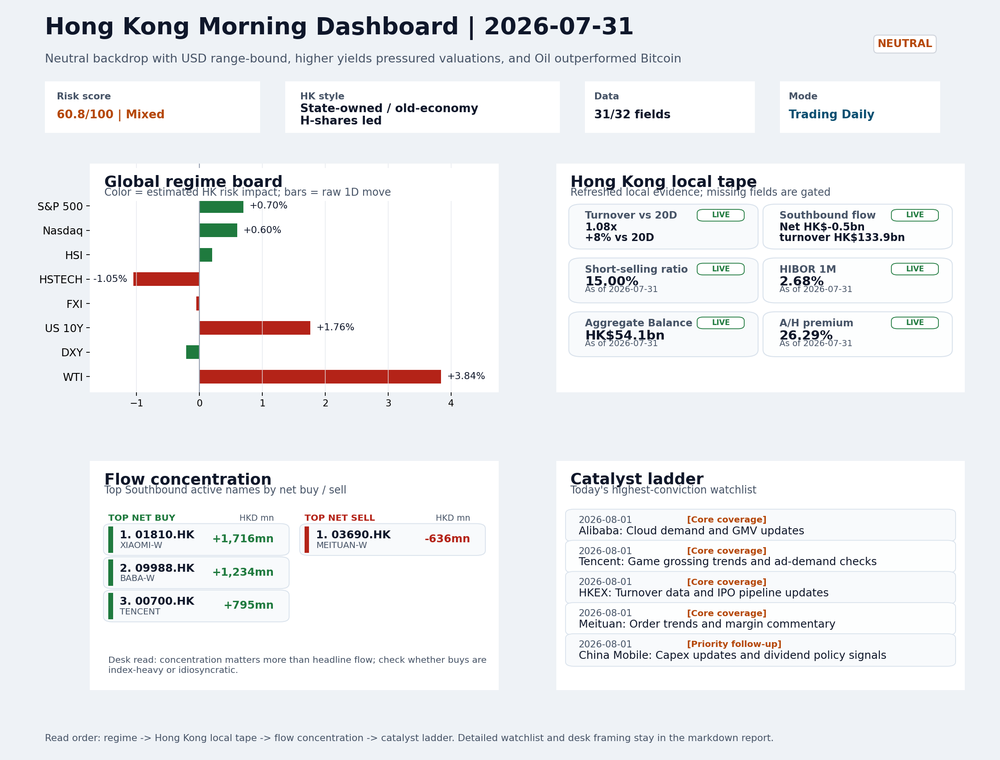

# Morning Research Workbench | 2026-08-01

> Designed for a Hong Kong sell-side commute: Layer 1 `Scan`, Layer 2 `Deep Read`, Layer 3 `Thinking`
> Mode: `Trading Daily` | Keep the report execution-oriented: what mattered in the completed session, what can move Hong Kong leadership, and what needs fast follow-up.
> Briefing date: `2026-08-01` | Review date: `2026-07-31` | Global request: `2026-07-31` | HK/China request: `2026-07-31` | Market effective date: `2026-07-31` | Generated at: `2026-08-01 06:02:58`

## Executive Summary

- **Market pulse:** Softer CPI and VIX compression supported global equities, but the 1.76% rise in the US 10-year yield kept pressure on long-duration growth, so Hong Kong's next open likely favors.
- **Hong Kong lens:** Hong Kong growth / internet led. A constructive open is possible if HSI breadth confirms the overseas equity signal, but the combination of higher yields and HSTECH's recent underperformance suggests the move.
- **Top catalysts:** INTC -6.33%; VIX -6.44%.

## Visual Dashboard

## Layer 1 | Scan (5-10 min)

### 1.1 One-Line Market Pulse
Softer CPI and VIX compression supported global equities, but the 1.76% rise in the US 10-year yield kept pressure on long-duration growth, so Hong Kong's next open likely favors financials and energy over internet names.

### 1.2 Global Asset Price Dashboard

| Asset | Last | 1D move | Read |
| --- | --- | --- | --- |
| S&P 500 | 7,489.72 | +0.70% | US large-cap risk appetite |
| Nasdaq 100 | 28,274.20 | +0.60% | Growth and duration leadership |
| Hang Seng Index | 25,858.88 | +0.20% | Hong Kong broad beta |
| Hang Seng TECH | 4.7180 | -1.05% | Hong Kong growth / platform read-through |
| CSI 300 | 4,529.10 | +0.00% | Mainland large-cap tone |
| US 10Y | 4.7450 | **+1.76%** | Global discount-rate anchor |
| China 10Y | 1.71% | -0.6bp | China local rates anchor \| Live public \| Eastmoney \| 2026-07-31 |
| CN-US 10Y spread | -303.6bp | -7.5bp | Relative carry and macro-pressure gauge \| Live public \| Eastmoney \| 2026-07-31 |
| DXY | 99.80 | -0.21% | Dollar liquidity impulse |
| USD/CNH | 6.7320 | +0.00% | Offshore China risk appetite |
| USD/HKD | 7.8428 | +0.01% | Linked-exchange regime stress check |
| Brent crude | 90.12 | +1.22% | Energy / geopolitics |
| COMEX gold | 4,098.60 | -0.04% | Hedge demand / real yields |
| Copper | 6.5075 | +0.98% | Global growth proxy |
| VIX | 15.99 | **-6.44%** | US stress barometer |

### 1.3 Hong Kong Key Data Quick Check

| Check | Value | Status | Source / as of | Why it matters |
| --- | --- | --- | --- | --- |
| Main Board turnover vs 20D | 1.08x \| +8% vs 20D | Live local | HKEX \| 2026-07-31 | Trailing 20-session average turnover was HK$303.0bn. |
| Southbound / Northbound net flow | Southbound Net HK$-0.5bn \| turnover HK$133.9bn \| Northbound Turnover HK$354.1bn \| net not reported | Live local | HKEX Connect \| 2026-07-31 | Southbound net buy is calculated from HKEX disclosed buy and sell turnover. |
| Short-selling ratio | 15.00% | Live local | HKEX \| 2026-07-31 | Official HKEX stock-level short-selling table, aggregated as a share of total market turnover. |
| AH premium index | 26.29% | Live public | Yahoo \| 2026-07-31 | Simple average across 18 A/H pairs; use dispersion rather than the average alone. |
| USD/HKD spot vs band | 7.8428 \| band 7.7500 to 7.8500 | Live quote + local | Yahoo \| 2026-07-31 | Inside the linked-exchange band without immediate boundary stress. Official Convertibility Undertakings define the linked-rate stress boundaries for USD/HKD. |
| HIBOR 1M | 2.68% | Live local | HKMA \| 2026-07-31 | 1M HIBOR is the cleanest quick read for Hong Kong funding conditions and equity-duration pressure. |
| Aggregate Balance | HK$54.1bn | Live local | HKMA \| 2026-07-31 | Aggregate Balance helps frame whether linked-rate liquidity conditions are tight or comfortable. |
| Hong Kong leadership | Hong Kong growth / internet led | Proxy | HSI / HSCEI / HSTECH relative perf \| 2026-07-31 | Use HSI / HSCEI / HSTECH relative moves as the opening style read. |

### 1.4 Risk Dashboard
**Composite risk score:** `60.8/100` | **Regime:** `Mixed`

| Component | Score impact | Evidence |
| --- | --- | --- |
| US beta | +4.2 | S&P 500 +0.70% |
| HK growth | -5.2 | HSTECH -1.05% |
| Offshore China proxy | -0.2 | FXI -0.05% |
| Dollar pressure | +2.1 | DXY -0.21% |
| Volatility | +10 | VIX -6.44% |
| HK short-selling | +0 | Short-selling ratio 15.00% |

### 1.5 Morning Checklist
1. **INTC -6.33%**
 Mover attribution | Announcement / expectations | Guidance reset and margin pressure
2. **VIX -6.44%**
 High-frequency data | Lower volatility signals easing stress in the tape.
3. **Neutral backdrop with USD range-bound, higher yields pressured valuations, and Oil outperformed Bitcoin**
 Overnight regime | Start by deciding whether the day is about Neutral conditions or a style pivot.
4. **CPI MoM (Released)**
 Macro / policy | Rates expectations, the dollar, and growth-equity valuation | Industries: Technology, Internet, Brokers
5. **Trade Balance (Released)**
 Macro / policy | Watch whether it changes the day's core market narrative | Industries: Market-wide

## Layer 2 | Deep Read (20-30 min)

### 2.1 Overnight Overseas Market Review
#### Market Setup
**Core tape.** Overnight developed-market equities extended gains broadly, with S&P 500 +0.70% and Euro Stoxx 50 leading at +1.53%, as softer-than-expected CPI data and VIX compression (-6.44% to 15.99) reduced near-term rate-hike anxiety.
**Main driver.** However, the move was not uniform: the 10-year U.S. Treasury yield rose 1.76% to 4.745%, which weighed on duration-sensitive growth proxies, and HSTECH's -1.05% decline on July 31 already prefigured this sensitivity.
**HK relevance.** Oil surged +3.84% intraday with a 6.744% high-low range, the dominant cross-asset divergence versus Bitcoin (-3.03%).

#### Key Drivers
- Softer CPI reading eased immediate Fed rate-hike pressure, supporting the view that front-end rate expectations are stabilizing.
- VIX compression to 15.99 signals reduced near-term tail-risk anxiety.
- US 10Y yield +1.76% created valuation pressure on long-duration growth, explaining why HSTECH underperformed HSI/HSCEI despite the broad.
- Oil's +3.84% move with a 6.744% intraday range reflects either geopolitical premium or demand-repair expectations.

#### Hong Kong Read-Through
**Desk lens.** State-owned / old-economy H-shares led.
**Opening implication.** A constructive open is possible if HSI breadth confirms the overseas equity signal.
- **Cross-market read:** Hang Seng +0.20% / HSCEI +0.25% / HSTECH -1.05%.
- **Cross-market read:** Offshore China proxy FXI -0.05% and USD/CNH +0.00% frame cross-border risk appetite.
- **Cross-market read:** USD/HKD last traded around 7.8428, which keeps the Hong Kong funding lens in focus.

#### Watch Points
- USD composite moved lower by +0.00pct intraday, with a 0.762pct range.
- Main turning points appeared around 2026-07-31 08:05 peak / 2026-07-31 08:20 trough / 2026-07-31 08:45 peak, suggesting event-driven repricing.
- The biggest cross-asset divergence was Oil versus Bitcoin, a spread of 8.515pct.
- Gold moved -0.81pct intraday with a 1.575pct high-low range.

**Curated overnight stories**
1. **CPI MoM (Released) - softer than expected**
 Why it matters: Eases immediate pressure on Fed to hike rates again. Supports the view that front-end rate expectations are stabilizing, which historically benefits duration-sensitive Hong.
 HK read-through: Direct read-through to HSI constituent earnings estimates via USD and risk-asset pricing. Supports internet and tech names that outperformed into the July 31 close.
2. **VIX -6.44% - volatility compression**
 Why it matters: Signals easing stress in the global tape. When VIX falls alongside a neutral backdrop, institutional positioning tends to shift toward risk-on within the same session or.
 HK read-through: Reduces overnight tail-risk premium for Hong Kong. Supports intraday momentum in HSI components and ADR-heavy H-share names.
3. **INTC -6.33% - guidance reset and margin pressure**
 Why it matters: Intel's margin reset reflects persistent structural competition in semis. While not China-specific, it anchors the risk that 2H guidance across the semiconductor supply.
 HK read-through: Semiconductor and AI infrastructure names (including Hong Kong-listed peers in the supply chain) face indirect sentiment headwinds on Monday open.
4. **China's U.S.-bound shipments fall in July after brief recovery - PMI survey shows**
 Why it matters: Provides early high-frequency confirmation of trade flow softening. May feed into concerns about the durability of China's export recovery and the effectiveness of recent.
 HK read-through: Logistics, port operators, and export-linked industrials on H-share list face incremental scrutiny. Could cap upside for pro-cyclical names if confirmed in official data.
5. **Alibaba/Moonshot Nvidia H200 usage report - Bloomberg**
 Why it matters: Alibaba pushed back on the report, but the allegation that Chinese AI firms continue accessing advanced U.S.
 HK read-through: If confirmed, could prompt renewed scrutiny of China AI capex narratives and U.S.-China tech decoupling headlines that historically weigh on Hong Kong internet sentiment.

### 2.2 Hong Kong / A-share Previous-Day Review
#### Local Tape Setup
**Local read.** HSTECH's -1.05% decline versus HSI's +0.2% on July 31 confirms a value-over-growth read-through from the US session, where 10Y yield +1.76% created duration pressure on growth proxies.
**Verification point.** Short-selling concentration in ETFs (02823 iShares A50 58.72%, 02802 HSCEICC 62.78%) and equity put/call at 0.68x suggest locals hedging individual names rather than macro calls.
**Risk to watch.** Southbound flows show institutional preference for BABA-W (net HK$1.23bn) and XIAOMI-W (net HK$1.72bn) while MEITUAN saw SZSE-side net selling of HK$636m.

#### Style and Local Leadership
**Style leadership.** Hong Kong growth / internet led.
- **Cross-market read:** Hang Seng +0.20% / HSCEI +0.25% / HSTECH -1.05%.
- **Cross-market read:** Offshore China proxy FXI -0.05% and USD/CNH +0.00% frame cross-border risk appetite.
- **Cross-market read:** USD/HKD last traded around 7.8428, which keeps the Hong Kong funding lens in focus.

#### Flow Confirmation
Official Stock Connect evidence is available; use Section 2.3 to confirm whether local money supports the price action.

#### Follow-Through Checklist
**Follow-through check.** Confirm whether HSTECH (3033.HK) reverts positive on Aug 3 with KWEB call activity (Vol/OI 1.88x) and whether HIBOR 1M (2.68%) and Aggregate Balance (HK$54.1bn) hold funding conditions for a broader tech recovery, or whether the short-covering cycle in ETF.

### 2.3 Flow Tracker and Attribution
#### Cross-Asset Attribution v1

| Driver | Direction | Score | Evidence | HK implication |
| --- | --- | --- | --- | --- |
| Rates impulse | drag | 2.11 | US 10Y yield proxy moved +1.76%. | Lower yields help long-duration growth; higher yields pressure valuation-sensitive |
| Global equity beta | supportive | 0.7 | S&P 500 moved +0.70%. | Broad beta matters if Hong Kong breadth confirms the overseas signal. |

#### Flow Tracker
##### Flow Takeaways
- Local flow evidence is not yet strong enough to override the cross-asset setup.
- Stock Connect Southbound: net HK$-0.5bn on turnover HK$133.9bn (as of 2026-07-31).
- Stock Connect Northbound: turnover RMB354.1bn; public file provides total turnover/top active names, not full net-buy.
- AH premium: simple covered-pair average +26.29%; widest premium: China Communications Construction 86.32%.

##### Stock Connect Southbound Active Names

| Rank | Ticker | Name | Buy | Sell | Net buy |
| --- | --- | --- | --- | --- | --- |
| 5 | 01810.HK | XIAOMI-W | HK$4,207.2mn | HK$2,490.8mn | HK$1,716.4mn |
| 1 | 09988.HK | BABA-W | HK$5,310.0mn | HK$4,075.6mn | HK$1,234.3mn |
| 4 | 00700.HK | TENCENT | HK$3,673.5mn | HK$2,878.8mn | HK$794.7mn |
| 10 | 03690.HK | MEITUAN-W | HK$340.2mn | HK$975.9mn | HK$-635.7mn |
| 1 | 02513.HK | Z.AI | HK$5,853.6mn | HK$5,278.3mn | HK$575.3mn |

##### AH Premium Dispersion

| Name | A ticker | H ticker | Premium | As of |
| --- | --- | --- | --- | --- |
| China Communications Construction | 601800.SS | 1800.HK | +86.32% | 2026-07-31 |
| China Life | 601628.SS | 2628.HK | +56.96% | 2026-07-31 |
| China Railway Construction | 601186.SS | 1186.HK | +56.83% | 2026-07-31 |
| China Railway | 601390.SS | 0390.HK | +48.09% | 2026-07-31 |
| Sinopec | 600028.SS | 0386.HK | +37.70% | 2026-07-31 |

##### HKEX Short-Selling Watch

| Ticker | Name | Short ratio | Short turnover | Total turnover |
| --- | --- | --- | --- | --- |
| 00388.HK | HKEX | 11.35% | HK$0.1bn | HK$1.2bn |
| 00700.HK | TENCENT | 10.97% | HK$1.6bn | HK$14.7bn |
| 00941.HK | CHINA MOBILE | 6.60% | HK$0.1bn | HK$2.0bn |
| 01211.HK | BYD COMPANY | 41.45% | HK$1.1bn | HK$2.6bn |
| 01299.HK | AIA | 14.19% | HK$0.3bn | HK$2.1bn |

- **Short-value leaders:** 07709.HK XL2CSOPHYNIX (HK$4.5bn); 01810.HK XIAOMI-W (HK$4.4bn); 02800.HK TRACKER FUND (HK$4.3bn); 09988.HK BABA-W (HK$1.6bn).

### 2.4 Macro and Policy Tracking
**Desk read.** The completed session's primary repricing catalyst was a hotter-than-expected US CPI print (actual 0.3% versus 0.2% forecast).

**Market sensitivity.** The China trade balance release (USD 85.2bn versus USD 79.0bn forecast) provided a modest offset, though this did not fundamentally redirect the day's risk narrative.

**HK implication.** High-frequency signals show a bifurcated setup: a declining VIX (-6.44%) signals easing systemic stress.

**Macro watchpoints**
- US 10Y yield trajectory after the retail sales print and during Powell's speech.
- HK Tech and Internet sector performance relative to the 10Y yield move.
- DXY direction and whether USD strength extends into Asian hours.
- Whether oil's outperformance sustains and drives energy-sector leadership in HK.

| Time | Region | Event | Status | Desk read |
| --- | --- | --- | --- | --- |
| 20:30 | US | CPI MoM | Released | Impact: Rates expectations, the dollar, and growth-equity valuation \| Attention: 5/5 \| Industries: Technology, Internet, Brokers |
| 09:30 | China | Trade Balance | Released | Impact: Watch whether it changes the day's core market narrative \| Attention: 3/5 \| Industries: Market-wide |
| 20:30 | US | Retail Sales MoM | Upcoming | Impact: Consumer resilience, growth expectations, and risk-asset pricing \| Attention: 5/5 \| Industries: Consumer, E-commerce, Consumer discretionary |
| 09:20 | China | Loan Prime Rate | Upcoming | Impact: Watch whether it changes the day's core market narrative \| Attention: 3/5 \| Industries: Market-wide |
| 22:00 | Federal Reserve | Jerome Powell: Economic outlook remarks | Central bank | Impact: Policy path, liquidity conditions, and cross-asset risk appetite \| Attention: 5/5 \| Industries: Technology, Financials, Gold |
| 10:00 | PBOC | Open Market Operations Desk: Daily liquidity operation window | Central bank | Impact: Policy path, liquidity conditions, and cross-asset risk appetite \| Attention: 3/5 \| Industries: Technology, Financials, Gold |

#### Positioning and Risk Backdrop
- Options activity centered on KWEB Call, with Vol/OI at 1.88x and a bullish bias.
- Put/Call structure shows equity 0.68 / index 1.15, implying Single-stock optimism with index hedging.
- Geopolitics: Middle East | Regional tension remains elevated | Impact: Oil, freight costs, and safe-haven demand
- Geopolitics: US-China | Technology export-control rhetoric remains active | Impact: China internet, semiconductors, and supply chains

### 2.5 Key Company and Sector Events

| Grade | Sector | Headline | Why it matters | Horizon |
| --- | --- | --- | --- | --- |
| B | Semiconductors and AI | Supply-chain legend Tim Cook finally meets his match with Apple's | Capital allocation or shareholder-return events can trigger a valuation | Medium-term trend |
| B | China Internet | Did China build a top-tier AI model by itself? | Assess whether the story can propagate through the China Internet value | Monitor |

#### HKEX Announcements

| Grade | Ticker | Type | Release time | Title |
| --- | --- | --- | --- | --- |
| A | 00069.HK | Profit warning | 2026-07-31 | Profit warning / alert announcement |
| A | 00103.HK | Profit warning | 2026-07-31 | Profit warning / alert announcement |
| A | 00194.HK | Profit warning | 2026-07-31 | Profit warning / alert announcement |
| A | 00239.HK | Profit warning | 2026-07-31 | Profit warning / alert announcement |
| A | 00311.HK | Profit warning | 2026-07-31 | Profit warning / alert announcement |
| A | 00422.HK | Profit warning | 2026-07-31 | Profit warning / alert announcement |
| A | 00505.HK | Profit warning | 2026-07-31 | Profit warning / alert announcement |
| A | 00533.HK | Profit warning | 2026-07-31 | Profit warning / alert announcement |

#### Earnings / Results Watch

| Ticker | Company | Timing | Expectation framing |
| --- | --- | --- | --- |
| 0700.HK | Tencent Holdings | After Market Close | EPS est. 4.15 HKD \| revenue est. 163.2bn HKD |
| 0388.HK | Hong Kong Exchanges and Clearing | Before Market Open | EPS est. 2.81 HKD \| revenue est. 6.0bn HKD |

#### Rating Changes
- **9988.HK** | Morgan Stanley | Upgrade | Equal Weight -> Overweight | PT 92 -> 105

#### IPO Watch
- IPO and grey-market monitoring is not yet part of the standard production pack.

### 2.6 Today's Core Names
#### Core coverage

| Name | Ticker | Last | 1D | Range position | Morning note |
| --- | --- | --- | --- | --- | --- |
| Alibaba | 9988.HK | 117.00 | +4.65% | Mid-range | Short-term price strength is clear; fresh catalysts could trigger broader group follow-through. |
| Tencent | 0700.HK | 475.20 | +0.72% | Top of range | The name sits near the top of its recent range, so watch for profit-taking under high expectations. |

**Recent headlines for Alibaba:**
- [Alibaba's Biggest AI Customer Is Also Its Rival](https://finance.yahoo.com/technology/ai/articles/alibabas-biggest-ai-customer-rival-200750423.html) (GuruFocus.com)
**Recent headlines for Tencent:**
- [TSMC and Tencent break into the top 100 of the Fortune Global 500 list, as Asia rides the AI boom](https://finance.yahoo.com/technology/articles/tsmc-tencent-break-top-100-210000080.html) (Fortune)

#### Priority follow-up

| Name | Ticker | Last | 1D | Range position | Morning note |
| --- | --- | --- | --- | --- | --- |
| China Mobile | 0941.HK | 83.65 | -1.36% | Top of range | The name sits near the top of its recent range, so watch for profit-taking under high expectations. |
| BYD Company | 1211.HK | 94.15 | -0.69% | Top of range | The name sits near the top of its recent range, so watch for profit-taking under high expectations. |

## Layer 3 | Thinking (10-15 min)

### 3.1 Rotating Theme Deep Dive

| Field | Read |
| --- | --- |
| Theme | AI and Compute Chain |
| Angle for the day | Track whether global AI capex, semis, cloud, and server demand are still carrying offshore China internet and hardware sentiment. |

**Theme desk read**
**Core thesis.** The AI and compute chain narrative continues to flow into offshore China internet, with Alibaba's 4.65% rally on reports of a 20,000-chip Moonshot deal providing a concrete local read-through of global AI demand.
**Evidence.** Simultaneously, the US CPI print came in slightly above forecast at 0.3%, pushing the 10-year yield to 4.745% and injecting valuation sensitivity for long-duration growth assets.
**What to test.** The combination of corporate AI capex signals and a modestly hawkish rates backdrop means near-term leadership likely depends on whether upcoming company-level catalysts can sustain momentum against macro friction.

**Signals to keep in mind**
- Supply-chain legend Tim Cook finally meets his match with Apple's memory crunch
- Did China build a top-tier AI model by itself? A new report suggests Nvidia chips played a role.
- VIX -6.44%: Lower volatility signals easing stress in the tape.
- WTI crude +3.84%: A strong crude move needs to be split between geopolitics and demand repair.

**LLM watch items:**
- Alibaba Cloud demand and GMV updates (2026-08-01) to confirm AI workload traction
- Tencent ad-demand checks as a proxy for AI-powered monetization progress
- Hang Seng TECH ETF reaction to assess whether AI sentiment translates to broad China internet buying
- Follow-through on the Moonshot - Alibaba chip arrangement and any official clarification, given pushback in media reports
- US 10-year yield and CPI absorption; sustained move above 4.75% would pressure growth equity multiples

**Related names to keep close:**

| Name | Ticker | Bucket | Morning read |
| --- | --- | --- | --- |
| Alibaba | 9988.HK | Core coverage | Short-term price strength is clear; fresh catalysts could trigger broader group follow-through. |
| Tencent | 0700.HK | Core coverage | The name sits near the top of its recent range, so watch for profit-taking under high expectations. |
| HKEX | 0388.HK | Core coverage | Positioning is neutral for now, so use it mainly to monitor marginal information changes. |
| AIA | 1299.HK | Priority follow-up | Positioning is neutral for now, so use it mainly to monitor marginal information changes. |

**Upcoming catalysts tied to the theme:**
- 2026-08-01 | Alibaba: Cloud demand and GMV updates | Key read-through for China consumption, cloud, and platform regulation
- 2026-08-01 | Tencent: Game grossing trends and ad-demand checks | Core offshore China platform proxy for gaming, ads, and AI monetization
- 2026-08-01 | AIA: NBV trends and agency momentum | Read-through for wealth demand, mainland visitor activity, and HK financial sentiment
- 2026-08-01 | Hang Seng TECH ETF: AI narrative shifts and China platform regulation headlines | Fast proxy for Hong Kong internet and growth leadership

**Relevant headlines:**
- [Supply-chain legend Tim Cook finally meets his match with Apple's memory crunch](https://www.marketwatch.com/story/supply-chain-legend-tim-cook-finally-meets-his-match-with-apples-memory-crunch-9bce0b11?mod=mw_rss_topstories)
- [Did China build a top-tier AI model by itself? A new report suggests Nvidia chips played a role.](https://www.marketwatch.com/story/did-china-build-a-top-tier-ai-model-by-itself-a-new-report-suggests-nvidia-chips-played-a-role-ad4644cd?mod=mw_rss_topstories)

### 3.2 Today Ahead and Trading Calendar
- Macro: CPI MoM is the first item to anchor the open and the rates/FX response.
- Corporate / event: Alibaba: Cloud demand and GMV updates is the cleanest same-day catalyst to prepare for.

**Same-day macro docket**

| Time | Country | Event | Status | Detail |
| --- | --- | --- | --- | --- |
| 20:30 | US | CPI MoM | Released | Actual 0.3% / Forecast 0.2% / Prior 0.4% |
| 09:30 | China | Trade Balance | Released | Actual USD 85.2bn / Forecast USD 79.0bn / Prior USD 80.6bn |
| 20:30 | US | Retail Sales MoM | Upcoming | Forecast 0.3% / Prior 0.6% |
| 09:20 | China | Loan Prime Rate | Upcoming | Forecast 3.45% / Prior 3.45% |
| 22:00 | Federal Reserve | Jerome Powell: Economic outlook remarks | Central bank | speech |

**Same-day catalyst list**

| Date | Time | Category | Event | Importance |
| --- | --- | --- | --- | --- |
| 2026-08-01 | | Core coverage | Alibaba: Cloud demand and GMV updates | 3 |
| 2026-08-01 | | Core coverage | Tencent: Game grossing trends and ad-demand checks | 3 |
| 2026-08-01 | | Core coverage | HKEX: Turnover data and IPO pipeline updates | 3 |
| 2026-08-01 | | Core coverage | Meituan: Order trends and margin commentary | 3 |

**Next few sessions**

| Date | Category | Event | Impact |
| --- | --- | --- | --- |
| 2026-08-01 | Core coverage | Alibaba: Cloud demand and GMV updates | Key read-through for China consumption, cloud, and platform regulation |
| 2026-08-01 | Core coverage | Tencent: Game grossing trends and ad-demand checks | Core offshore China platform proxy for gaming, ads, and AI monetization |
| 2026-08-01 | Core coverage | HKEX: Turnover data and IPO pipeline updates | Direct proxy for Hong Kong market turnover, listings, and southbound |
| 2026-08-01 | Core coverage | Meituan: Order trends and margin commentary | High-frequency read on local services demand and platform competition |

### 3.3 Daily One Chart
**Daily One Chart | HKEX short-selling pressure map**

**Chart read.** Market short-selling reached 15.00% of turnover.
**Why it matters.** The chart leads today because the pressure is either broad, concentrated, or acute in the top name.

_Source: HKEX Daily Quotations - Short Selling Turnover_

## Traceable Appendix

### Report Metadata
> Date policy: Review date 2026-07-31 is treated as `Trading Daily`. | Global request date is 2026-07-31; adapter effective date is 2026-07-31 and summary date is 2026-07-31. | HK/China local data date is 2026-07-31; role: same-session local cash tape.
> Market data quality: Coverage: `31/32` | Stale items (>1d): `1` | Missing: `1`
> Report quality: `87.4/100` | Grade `B` | Status `production ready`

### Key Questions to Keep in Mind
- Is risk appetite rising or fading? The overnight tape reads closer to `Neutral`.
- Did rates expectations move? Focus on whether US 10Y, DXY, and growth style moved together.
- Were commodities the real story? Watch WTI and gold for geopolitics versus inflation signals.
- Is Hong Kong setup internet-led, SOE-led, or broad beta-led? Compare HSTECH, HSCEI, and HSI.
- Did offshore markets move China risk appetite? Focus on HSI, FXI, USD/CNH, and USD/HKD.

### Report Quality and Validation
- **Quality score:** 87.4/100 | **Grade:** B | **Status:** production ready
- **Run summary:** 7 healthy | 1 caveat | 0 failed
- **Release recommendation:** Send with caveats | The report is usable, but the advisory guidance should travel with it so readers understand the data gaps.

| Source | Status | Bucket |
| --- | --- | --- |
| Market data | ok | healthy |
| Sector and company news | ok | healthy |
| Movers and short selling | ok | healthy |
| Stock Connect | ok | healthy |
| A/H premium | ok | healthy |
| Hong Kong local package | ok | healthy |
| China rates | ok | healthy |
| Narrative overlay | partial | caveat |

**Desk-use guidance summary:** 0 blocking | 1 advisory

**Desk-use guidance**
- **Advisory:** Use deterministic sections as primary support; the narrative overlay was partial or unavailable on this run.

| Component | Score | Weight | Read |
| --- | --- | --- | --- |
| Market data coverage | 96.9 | 0.3 | 31/32 core market fields available. |
| Hong Kong local metrics | 82.3 | 0.25 | 8 live, 3 proxy, 0 unavailable local checks. |
| Key public adapters | 100.0 | 0.2 | 4/4 key adapters were available or partially available. |
| Narrative overlay health | 51.4 | 0.15 | 2/7 narrative overlay tasks succeeded or used validated cache; 1 error(s). |
| Fact-check guardrail | 100.0 | 0.1 | Checked 2 numeric claims; 0 numeric mismatch(es), 0 logic warning(s); 0 critical, 0 review. |

**Quality warnings**
- Narrative overlay health is weak: 2/7 narrative overlay tasks succeeded or used validated cache; 1 error(s).

**Narrative fact-check guardrail**
- Checked 2 numeric claims; 0 numeric mismatch(es), 0 logic warning(s); 0 critical, 0 review.

**Adapter status**

| Adapter | Status |
| --- | --- |
| Stock Connect | ok |
| A/H premium | ok |
| HKEX announcements | ok |
| China rates | ok |

### Source Links
- [Supply-chain legend Tim Cook finally meets his match with Apple's memory crunch](https://www.marketwatch.com/story/supply-chain-legend-tim-cook-finally-meets-his-match-with-apples-memory-crunch-9bce0b11?mod=mw_rss_topstories) (wsj_markets)
- [Did China build a top-tier AI model by itself? A new report suggests Nvidia chips played a role.](https://www.marketwatch.com/story/did-china-build-a-top-tier-ai-model-by-itself-a-new-report-suggests-nvidia-chips-played-a-role-ad4644cd?mod=mw_rss_topstories) (wsj_markets)
- [Alibaba's Biggest AI Customer Is Also Its Rival](https://finance.yahoo.com/technology/ai/articles/alibabas-biggest-ai-customer-rival-200750423.html) (GuruFocus.com)
- [Alibaba shares rise on Moonshot's 20,000-chip AI deal](https://investorshub.advfn.com/market-news/article/33168/alibaba-shares-rise-on-moonshots-20000-chip-ai-deal) (InvestorsHub)
- [TSMC and Tencent break into the top 100 of the Fortune Global 500 list, as Asia rides the AI boom](https://finance.yahoo.com/technology/articles/tsmc-tencent-break-top-100-210000080.html) (Fortune)
- [00069.HK Profit warning / alert announcement](http://www1.hkexnews.hk/listedco/listconews/sehk/2026/0731/2026073101151.pdf) (HKEXnews)
- [00103.HK Profit warning / alert announcement](http://www1.hkexnews.hk/listedco/listconews/sehk/2026/0731/2026073100942.pdf) (HKEXnews)
- [00194.HK Profit warning / alert announcement](http://www1.hkexnews.hk/listedco/listconews/sehk/2026/0731/2026073101513.pdf) (HKEXnews)
- [00239.HK Profit warning / alert announcement](http://www1.hkexnews.hk/listedco/listconews/sehk/2026/0731/2026073100704.pdf) (HKEXnews)
- [00311.HK Profit warning / alert announcement](http://www1.hkexnews.hk/listedco/listconews/sehk/2026/0731/2026073100848.pdf) (HKEXnews)
- [00422.HK Profit warning / alert announcement](http://www1.hkexnews.hk/listedco/listconews/sehk/2026/0731/2026073100316.pdf) (HKEXnews)
- [00505.HK Profit warning / alert announcement](http://www1.hkexnews.hk/listedco/listconews/sehk/2026/0731/2026073100402.pdf) (HKEXnews)
- [00533.HK Profit warning / alert announcement](http://www1.hkexnews.hk/listedco/listconews/sehk/2026/0731/2026073100966.pdf) (HKEXnews)

## Supplementary Visual Appendix

This appendix is professional-path only. It keeps a traceable index of the report visuals and the deterministic chart cues used to frame the morning note, without injecting the legacy intraday chart pack.

### Visual Index

| Visual | Path | Role |
| --- | --- | --- |
| Visual Dashboard | `charts/dashboard_2026-08-01.png` | Cross-asset regime board and Hong Kong local tape snapshot. |
| Daily One Chart | `charts/daily_one_chart_2026-08-01.png` | Single highest-conviction visual story for the day. |

### Deterministic Chart Cues
- FX / liquidity: USD composite moved lower by +0.00pct intraday, with a 0.762pct range.
- FX / liquidity: Main turning points appeared around 2026-07-31 08:05 peak / 2026-07-31 08:20 trough / 2026-07-31 08:45 peak, suggesting event-driven repricing rather than a clean one-way USD move.
- Cross-asset: The biggest cross-asset divergence was Oil versus Bitcoin, a spread of 8.515pct.
- Cross-asset: Gold moved -0.81pct intraday with a 1.575pct high-low range.
- Cross-asset: Oil moved +5.48pct intraday with a 6.744pct high-low range.
- Cross-asset: Bitcoin moved -3.03pct intraday with a 4.397pct high-low range.

### Risk Dashboard Components

| Component | Score impact | Evidence |
| --- | --- | --- |
| US beta | +4.2 | S&P 500 +0.70% |
| HK growth | -5.2 | HSTECH -1.05% |
| Offshore China proxy | -0.2 | FXI -0.05% |
| Dollar pressure | +2.1 | DXY -0.21% |
| Volatility | +10 | VIX -6.44% |
| HK short-selling | +0 | Short-selling ratio 15.00% |
