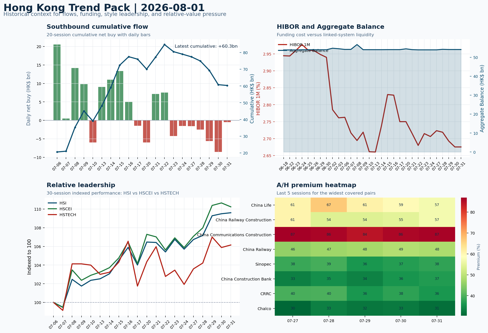

# Morning Research Workbench | 2026-08-02

> Designed for a Hong Kong sell-side commute: Layer 1 `Scan`, Layer 2 `Deep Read`, Layer 3 `Thinking`
> Mode: `Weekly Review` | Use Saturday's non-trading review date to synthesize the completed Hong Kong week and prepare next week's work plan.
> Briefing date: `2026-08-02` | Review date: `2026-08-01` | Global request: `2026-08-01` | HK/China request: `2026-07-31` | Market effective date: `2026-07-31` | Generated at: `2026-08-02 05:53:23`

## Executive Summary

- **Market pulse:** The week ended with a Risk-On US beta cushion but a hawkish rates impulse that left Hong Kong's SOE/H-share leadership intact while growth-facing indices struggled for local flow.
- **Hong Kong lens:** Hong Kong growth / internet led. The August 3 Hong Kong session inherits a supportive US beta pulse but a headwind from higher yields: HSTECH and FXI must show they can absorb the rates drag.
- **Top catalysts:** VIX -6.44%; Risk-On backdrop with USD range-bound, higher yields pressured valuations, and Oil outperformed Bitcoin.

## Visual Dashboard

## Layer 1 | Weekly Scan (5-10 min)

### 1.1 One-Line Market Pulse
The week ended with a Risk-On US beta cushion but a hawkish rates impulse that left Hong Kong's SOE/H-share leadership intact while growth-facing indices struggled for local flow confirmation, making next week's open conditional on southbound direction.

### 1.2 Global Asset Price Dashboard

| Asset | Last | 1D move | Read |
| --- | --- | --- | --- |
| S&P 500 | 7,489.72 | +0.70% | US large-cap risk appetite |
| Nasdaq 100 | 28,274.20 | +0.60% | Growth and duration leadership |
| Hang Seng Index | 25,884.43 | +0.10% | Hong Kong broad beta |
| Hang Seng TECH | 4.7300 | +0.25% | Hong Kong growth / platform read-through |
| CSI 300 | 4,529.10 | +0.00% | Mainland large-cap tone |
| US 10Y | 4.7450 | **+1.76%** | Global discount-rate anchor |
| China 10Y | 1.71% | -0.6bp | China local rates anchor \| Live public \| Eastmoney \| 2026-07-31 |
| CN-US 10Y spread | -303.6bp | -7.5bp | Relative carry and macro-pressure gauge \| Live public \| Eastmoney \| 2026-07-31 |
| DXY | 99.80 | -0.21% | Dollar liquidity impulse |
| USD/CNH | 6.7335 | +0.00% | Offshore China risk appetite |
| USD/HKD | 7.8428 | +0.01% | Linked-exchange regime stress check |
| Brent crude | 90.12 | +1.22% | Energy / geopolitics |
| COMEX gold | 4,049.10 | -1.24% | Hedge demand / real yields |
| Copper | 6.4360 | -0.13% | Global growth proxy |
| VIX | 15.99 | **-6.44%** | US stress barometer |

### 1.3 Hong Kong Weekly Tape Quick Check

| Check | Value | Status | Source / as of | Why it matters |
| --- | --- | --- | --- | --- |
| Main Board turnover vs 20D | 1.08x \| +8% vs 20D | Live local | HKEX \| 2026-07-31 | Trailing 20-session average turnover was HK$303.0bn. |
| Southbound / Northbound net flow | Southbound Net HK$-0.5bn \| turnover HK$133.9bn \| Northbound Turnover HK$354.1bn \| net not reported | Live local | HKEX Connect \| 2026-07-31 | Southbound net buy is calculated from HKEX disclosed buy and sell turnover. |
| Short-selling ratio | 15.00% | Live local | HKEX \| 2026-07-31 | Official HKEX stock-level short-selling table, aggregated as a share of total market turnover. |
| AH premium index | 28.33% | Live public | Yahoo \| 2026-07-31 | Simple average across 17 A/H pairs; use dispersion rather than the average alone. |
| USD/HKD spot vs band | 7.8428 \| band 7.7500 to 7.8500 | Live quote + local | Yahoo \| 2026-07-31 | Inside the linked-exchange band without immediate boundary stress. Official Convertibility Undertakings define the linked-rate stress boundaries for USD/HKD. |
| HIBOR 1M | 2.68% | Live local | HKMA \| 2026-07-31 | 1M HIBOR is the cleanest quick read for Hong Kong funding conditions and equity-duration pressure. |
| Aggregate Balance | HK$54.1bn | Live local | HKMA \| 2026-07-31 | Aggregate Balance helps frame whether linked-rate liquidity conditions are tight or comfortable. |
| Hong Kong leadership | Hong Kong growth / internet led | Proxy | HSI / HSCEI / HSTECH relative perf \| 2026-07-31 | Use HSI / HSCEI / HSTECH relative moves as the opening style read. |

### 1.4 Risk Dashboard
**Composite risk score:** `67.3/100` | **Regime:** `Risk-on`

| Component | Score impact | Evidence |
| --- | --- | --- |
| US beta | +4.2 | S&P 500 +0.70% |
| HK growth | +1.2 | HSTECH +0.25% |
| Offshore China proxy | -0.2 | FXI -0.05% |
| Dollar pressure | +2.1 | DXY -0.21% |
| Volatility | +10 | VIX -6.44% |
| HK short-selling | +0 | Short-selling ratio 15.00% |

### 1.5 Next Week Checklist
1. **VIX -6.44%**
 High-frequency data | Lower volatility signals easing stress in the tape.
2. **Risk-On backdrop with USD range-bound, higher yields pressured valuations, and Oil outperformed Bitcoin**
 Still-moving markets | No fresh Hong Kong cash session is assumed; use global active assets and policy/event flow to prepare the next open.
3. **CPI MoM (Released)**
 Macro / policy | Rates expectations, the dollar, and growth-equity valuation | Industries: Technology, Internet, Brokers
4. **Trade Balance (Released)**
 Macro / policy | Watch whether it changes the day's core market narrative | Industries: Market-wide
5. **Retail Sales MoM (Upcoming)**
 Macro / policy | Consumer resilience, growth expectations, and risk-asset pricing | Industries: Consumer, E-commerce, Consumer discretionary

## Layer 2 | Deep Read (20-30 min)

### 2.1 Weekly Cross-Asset Review
> Weekly review mode: synthesize the completed Hong Kong week, retain the main cross-asset and policy lessons, and convert them into next-week preparation rather than treating Saturday as a fresh cash-market session.

#### Market Setup
**Core tape.** US equities firmed on Friday with the S&P 500 up 0.70% and VIX compressing 6.44%, but the move sits against hawkish Fed commentary, a jump in the 10Y yield to 4.745%, and rotation into oil over Bitcoin.
**Main driver.** The risk-on tag holds, yet the rates impulse is clearly a drag on long-duration and growth valuations.

#### Key Drivers
- Rates impulse: Hawkish FOMC voter statements and a confirmatory CPI print pushed the US 10Y yield 1.76% higher, pressuring.
- Global equity beta: The S&P 500's 0.70% rise and a 6.44% VIX drop signal easing systemic stress, offering a broad risk-on cushion.
- Cross-asset rotation: WTI crude gained 1.29% while Bitcoin fell 2.95%, indicating a shift toward real-asset proxies without breaking.

#### Hong Kong Read-Through
**Desk lens.** Hong Kong growth / internet led.
**Opening implication.** The August 3 Hong Kong session inherits a supportive US beta pulse but a headwind from higher yields.
- **Cross-market read:** Hang Seng +0.10% / HSCEI -0.38% / HSTECH +0.25%.
- **Cross-market read:** Offshore China proxy FXI -0.05% and USD/CNH +0.00% frame cross-border risk appetite.
- **Cross-market read:** USD/HKD last traded around 7.8428, which keeps the Hong Kong funding lens in focus.

#### Watch Points
- USD composite moved lower by +0.00pct intraday, with a 0.762pct range.
- Main turning points appeared around 2026-07-31 08:05 peak / 2026-07-31 08:20 trough / 2026-07-31 08:45 peak, suggesting event-driven repricing.
- The biggest cross-asset divergence was Oil versus Bitcoin, a spread of 5.972pct.
- Gold moved -0.61pct intraday with a 1.575pct high-low range.

#### Weekly Review Map
- Weekly review window: 2026-07-27 to 2026-07-31. Core regime: Risk-On backdrop with USD range-bound, higher yields pressured valuations, and Oil outperformed Bitcoin. Hong Kong leadership: Hong Kong growth / internet led.
- Method note: Trend summary uses the latest available five observations from the Hong Kong Trend Pack inputs.

**Cross-asset weekly dashboard**

| Asset | Latest move | Weekly read |
| --- | --- | --- |
| S&P 500 | +0.70% | Risk appetite |
| Nasdaq 100 | +0.60% | Growth style |
| Hang Seng Index | +0.10% | Hong Kong beta |
| Hang Seng TECH | +0.25% | Hong Kong growth / internet tone |
| DXY | -0.21% | Global liquidity |
| US 10Y | +1.76% | Rates path |
| Gold | -1.24% | Hedge / real yields |
| VIX | -6.44% | Volatility and hedging |

**Hong Kong / China weekly tape**

| Signal | Latest move | Read |
| --- | --- | --- |
| Hang Seng Index | +0.10% | Hong Kong beta |
| HSCEI | -0.38% | China SOE / H-share tone |
| Hang Seng TECH | +0.25% | Hong Kong growth / internet tone |
| China proxy (FXI) | -0.05% | China sentiment |
| USD/CNH | +0.00% | China FX sentiment |
| USD/HKD | +0.01% | Hong Kong funding lens |

**Five-session trend evidence**
_Window: 2026-07-27 to 2026-07-31_

| Signal | Five-session change | Latest | Desk read |
| --- | --- | --- | --- |
| Southbound flow | -18.7bn over 5 sessions | -0.5bn | 0/5 positive sessions; cumulative buying is the flow-confirmation test for next week. |
| HKD funding | HIBOR -5bp; Aggregate Balance +0.2bn | 2.68% / HK$54.1bn | Funding stress matters if HIBOR rises while Aggregate Balance contracts. |
| HK style leadership | HSCEI led (+3.2pp); HSTECH lagged (+2.6pp) | HSCEI leadership | Use HSI / HSCEI / HSTECH spread to separate broad beta from growth-led rerating. |
| A/H premium dispersion | -0.6pp average change | 48.8% average premium | Premium narrowing can support H-share relative demand |

**Flow and attribution clues**
- :
- :

**Next-week desk questions**
- Did Southbound flow confirm the index move, or was the week mainly offshore beta without local money follow-through?
- Did HIBOR and Aggregate Balance point to benign funding, or should tighter HKD liquidity be part of next week's risk case?
- Was leadership broad enough beyond HSTECH / platform beta, or was the week concentrated in a narrow style pocket?
- Which dated macro, policy, earnings, or IPO catalyst can realistically change the next-week narrative?
- What single data point would invalidate the base-case market pulse by Monday or Tuesday morning?

**Key developments to retain**

| Bucket | Item | Why it matters |
| --- | --- | --- |
| Released | CPI MoM | Rates expectations, the dollar, and growth-equity valuation |
| Released | Trade Balance | Watch whether it changes the day's core market narrative |
| Upcoming | Retail Sales MoM | Consumer resilience, growth expectations, and risk-asset pricing |

**Next-week playbook**

| Date | Catalyst | Desk read |
| --- | --- | --- |
| 2026-08-02 | Alibaba: Cloud demand and GMV updates | Key read-through for China consumption, cloud, and platform regulation |
| 2026-08-02 | Tencent: Game grossing trends and ad-demand checks | Core offshore China platform proxy for gaming, ads, and AI monetization |
| 2026-08-02 | HKEX: Turnover data and IPO pipeline updates | Direct proxy for Hong Kong market turnover, listings, and southbound interest |
| 2026-08-02 | Meituan: Order trends and margin commentary | High-frequency read on local services demand and platform competition |
| 2026-08-02 | China Mobile: Capex updates and dividend policy signals | Defensive SOE benchmark for yield trade and domestic digital-infrastructure spend |
| 2026-08-02 | BYD Company: Weekly sales data and model rollout cadence | Hong Kong-listed proxy for EV volumes, export mix, and price competition |
| 2026-08-02 | AIA: NBV trends and agency momentum | Read-through for wealth demand, mainland visitor activity, and HK financial sentiment |
| 2026-08-02 | HSCEI ETF: Policy flow-through and financial/energy leadership | Useful proxy for state-owned and old-economy H-share leadership |

**Curated overnight stories**
1. **Fed officials who voted to hike rates say action is needed now against inflation**
 Why it matters: Explicit hawkish statements from voting FOMC members reprice near-term rate-cut expectations. This directly affects the risk-free rate anchoring global growth-equity.
 HK read-through: Higher US rates sustain dollar strength and compress Hong Kong/China growth-equity multiples. Offshore China (H-shares, ADRs) are most exposed given their sensitivity.
2. **CPI MoM data (released, US)**
 Why it matters: Confirmed the inflation backdrop that prompted Fed hawkishness. The data anchors the rates decision tree and sets the tone for how Fed officials will communicate at upcoming.
 HK read-through: Hotter-than-expected CPI supports the hawkish Fed narrative above. For Hong Kong investors, this narrows the window for a risk-asset relief rally and raises the hurdle for.
3. **VIX down 6.44%**
 Why it matters: Volatility compression signals reduced acute stress in global tape, which could support risk appetite if sustained into next week.
 HK read-through: Mild positive for Hong Kong sentiment at the open; lower fear premium typically supports intraday strength in growth-heavy indices.
4. **Retail Sales MoM (upcoming next week)**
 Why it matters: Consumer resilience data will test whether the hawkish Fed framing is consistent with real-economy strength. A strong print could entrench 'higher for longer'.
 HK read-through: High relevance for Hong Kong consumer, discretionary, and e-commerce names. A stronger-than-expected print compounds the hawkish pressure on growth equities.
5. **Oil outperformed Bitcoin**
 Why it matters: The relative performance shift reflects a rotation away from speculative digital assets and toward real-asset inflation proxies.
 HK read-through: Limited direct impact on Hong Kong equities but relevant for energy-sector positioning and as a sentiment cross-check.

### 2.2 Hong Kong / A-share Weekly Review
> Weekly review mode: synthesize the completed Hong Kong week, retain the main cross-asset and policy lessons, and convert them into next-week preparation rather than treating Saturday as a fresh cash-market session.

#### Local Tape Setup
**Local read.** The week ending July 31 confirmed a Risk-On regime but with a nuanced cross-asset read-through for Hong Kong.
**Verification point.** US equities (+0.70% S&P 500, VIX -6.44%) offered a supportive global backdrop, yet the 10Y yield +1.76% to 4.745% imposed a valuation headwind that partially offset the beta impulse.
**Risk to watch.** Hong Kong style leadership was SOE/H-share-led rather than growth-led - HSCEI outperformed HSTECH by +3.2pp over the five sessions - and this matters because the rates drag is most acute for duration-sensitive growth names.

#### Style and Local Leadership
**Style leadership.** Hong Kong growth / internet led.
- **Cross-market read:** Hang Seng +0.10% / HSCEI -0.38% / HSTECH +0.25%.
- **Cross-market read:** Offshore China proxy FXI -0.05% and USD/CNH +0.00% frame cross-border risk appetite.
- **Cross-market read:** USD/HKD last traded around 7.8428, which keeps the Hong Kong funding lens in focus.

#### Flow Confirmation
Official Stock Connect evidence is available; use Section 2.3 to confirm whether local money supports the price action.

#### Follow-Through Checklist
**Follow-through check.** Watch whether southbound flow turns positive on August 3-4 (cumulative -HK$18.7bn is the confirmation test) and whether HSTECH absorbs the 10Y yield headwind while FXI stabilizes - if not, the offshore beta signal is not confirmed as a durable local trade.

### 2.3 Flow Tracker and Attribution
#### Cross-Asset Attribution v1

| Driver | Direction | Score | Evidence | HK implication |
| --- | --- | --- | --- | --- |
| Rates impulse | drag | 2.11 | US 10Y yield proxy moved +1.76%. | Lower yields help long-duration growth; higher yields pressure valuation-sensitive |
| Global equity beta | supportive | 0.7 | S&P 500 moved +0.70%. | Broad beta matters if Hong Kong breadth confirms the overseas signal. |

#### Flow Tracker
##### Flow Takeaways
- Local flow evidence is not yet strong enough to override the cross-asset setup.
- Stock Connect Southbound: net HK$-0.5bn on turnover HK$133.9bn (as of 2026-07-31).
- Stock Connect Northbound: turnover RMB354.1bn; public file provides total turnover/top active names, not full net-buy.
- AH premium: simple covered-pair average +28.33%; widest premium: China Life 57.13%.

##### Stock Connect Southbound Active Names

| Rank | Ticker | Name | Buy | Sell | Net buy |
| --- | --- | --- | --- | --- | --- |
| 5 | 01810.HK | XIAOMI-W | HK$4,207.2mn | HK$2,490.8mn | HK$1,716.4mn |
| 1 | 09988.HK | BABA-W | HK$5,310.0mn | HK$4,075.6mn | HK$1,234.3mn |
| 4 | 00700.HK | TENCENT | HK$3,673.5mn | HK$2,878.8mn | HK$794.7mn |
| 10 | 03690.HK | MEITUAN-W | HK$340.2mn | HK$975.9mn | HK$-635.7mn |
| 1 | 02513.HK | Z.AI | HK$5,853.6mn | HK$5,278.3mn | HK$575.3mn |

##### AH Premium Dispersion

| Name | A ticker | H ticker | Premium | As of |
| --- | --- | --- | --- | --- |
| China Life | 601628.SS | 2628.HK | +57.13% | 2026-07-31 |
| China Railway Construction | 601186.SS | 1186.HK | +57.00% | 2026-07-31 |
| China Communications Construction | 601800.SS | 1800.HK | +55.04% | 2026-07-31 |
| China Railway | 601390.SS | 0390.HK | +48.25% | 2026-07-31 |
| Sinopec | 600028.SS | 0386.HK | +37.85% | 2026-07-31 |

##### HKEX Short-Selling Watch

| Ticker | Name | Short ratio | Short turnover | Total turnover |
| --- | --- | --- | --- | --- |
| 00388.HK | HKEX | 11.35% | HK$0.1bn | HK$1.2bn |
| 00700.HK | TENCENT | 10.97% | HK$1.6bn | HK$14.7bn |
| 00941.HK | CHINA MOBILE | 6.60% | HK$0.1bn | HK$2.0bn |
| 01211.HK | BYD COMPANY | 41.45% | HK$1.1bn | HK$2.6bn |
| 01299.HK | AIA | 14.19% | HK$0.3bn | HK$2.1bn |

- **Short-value leaders:** 07709.HK XL2CSOPHYNIX (HK$4.5bn); 01810.HK XIAOMI-W (HK$4.4bn); 02800.HK TRACKER FUND (HK$4.3bn); 09988.HK BABA-W (HK$1.6bn).

### 2.4 Macro and Policy Tracking
**Desk read.** Use the calendar table and released data below as the primary macro read.

| Time | Region | Event | Status | Desk read |
| --- | --- | --- | --- | --- |
| 20:30 | US | CPI MoM | Released | Impact: Rates expectations, the dollar, and growth-equity valuation \| Attention: 5/5 \| Industries: Technology, Internet, Brokers |
| 09:30 | China | Trade Balance | Released | Impact: Watch whether it changes the day's core market narrative \| Attention: 3/5 \| Industries: Market-wide |
| 20:30 | US | Retail Sales MoM | Upcoming | Impact: Consumer resilience, growth expectations, and risk-asset pricing \| Attention: 5/5 \| Industries: Consumer, E-commerce, Consumer discretionary |
| 09:20 | China | Loan Prime Rate | Upcoming | Impact: Watch whether it changes the day's core market narrative \| Attention: 3/5 \| Industries: Market-wide |
| 22:00 | Federal Reserve | Jerome Powell: Economic outlook remarks | Central bank | Impact: Policy path, liquidity conditions, and cross-asset risk appetite \| Attention: 5/5 \| Industries: Technology, Financials, Gold |
| 10:00 | PBOC | Open Market Operations Desk: Daily liquidity operation window | Central bank | Impact: Policy path, liquidity conditions, and cross-asset risk appetite \| Attention: 3/5 \| Industries: Technology, Financials, Gold |

#### Positioning and Risk Backdrop
- Options activity centered on KWEB Call, with Vol/OI at 1.88x and a bullish bias.
- Put/Call structure shows equity 0.68 / index 1.15, implying Single-stock optimism with index hedging.
- Geopolitics: Middle East | Regional tension remains elevated | Impact: Oil, freight costs, and safe-haven demand
- Geopolitics: US-China | Technology export-control rhetoric remains active | Impact: China internet, semiconductors, and supply chains

### 2.5 Key Company and Sector Events
No high-conviction sector story cleared the main-report relevance gate for this run.

#### HKEX Announcements

| Grade | Ticker | Type | Release time | Title |
| --- | --- | --- | --- | --- |
| A | 00069.HK | Profit warning | 2026-07-31 | Profit warning / alert announcement |
| A | 00103.HK | Profit warning | 2026-07-31 | Profit warning / alert announcement |
| A | 00194.HK | Profit warning | 2026-07-31 | Profit warning / alert announcement |
| A | 00239.HK | Profit warning | 2026-07-31 | Profit warning / alert announcement |
| A | 00311.HK | Profit warning | 2026-07-31 | Profit warning / alert announcement |
| A | 00422.HK | Profit warning | 2026-07-31 | Profit warning / alert announcement |
| A | 00505.HK | Profit warning | 2026-07-31 | Profit warning / alert announcement |
| A | 00533.HK | Profit warning | 2026-07-31 | Profit warning / alert announcement |

#### Earnings / Results Watch

| Ticker | Company | Timing | Expectation framing |
| --- | --- | --- | --- |
| 0700.HK | Tencent Holdings | After Market Close | EPS est. 4.15 HKD \| revenue est. 163.2bn HKD |
| 0388.HK | Hong Kong Exchanges and Clearing | Before Market Open | EPS est. 2.81 HKD \| revenue est. 6.0bn HKD |

#### Rating Changes
- **9988.HK** | Morgan Stanley | Upgrade | Equal Weight -> Overweight | PT 92 -> 105

#### IPO Watch
- IPO and grey-market monitoring is not yet part of the standard production pack.

### 2.6 Today's Core Names
#### Core coverage

| Name | Ticker | Last | 1D | Range position | Morning note |
| --- | --- | --- | --- | --- | --- |
| Alibaba | 9988.HK | 117.00 | +4.65% | Mid-range | Short-term price strength is clear; fresh catalysts could trigger broader group follow-through. |
| Tencent | 0700.HK | 475.20 | +0.72% | Top of range | The name sits near the top of its recent range, so watch for profit-taking under high expectations. |

**Recent headlines for Alibaba:**
- [Alibaba (NYSE:BABA) Is Supplying Moonshot With A Major Nvidia AI Cluster](https://finance.yahoo.com/technology/ai/articles/alibaba-nyse-baba-supplying-moonshot-010613054.html) (Simply Wall St.)
**Recent headlines for Tencent:**
- [TSMC and Tencent break into the top 100 of the Fortune Global 500 list, as Asia rides the AI boom](https://finance.yahoo.com/technology/articles/tsmc-tencent-break-top-100-210000080.html) (Fortune)

#### Priority follow-up

| Name | Ticker | Last | 1D | Range position | Morning note |
| --- | --- | --- | --- | --- | --- |
| China Mobile | 0941.HK | 83.65 | -1.36% | Top of range | The name sits near the top of its recent range, so watch for profit-taking under high expectations. |
| BYD Company | 1211.HK | 94.15 | -0.69% | Top of range | The name sits near the top of its recent range, so watch for profit-taking under high expectations. |

## Layer 3 | Thinking (10-15 min)

### 3.1 Rotating Theme Deep Dive

| Field | Read |
| --- | --- |
| Theme | AI and Compute Chain |
| Angle for the day | Track whether global AI capex, semis, cloud, and server demand are still carrying offshore China internet and hardware sentiment. |

**Theme desk read**
**Core thesis.** The AI and compute chain theme provided a narrative tailwind for Hong Kong internet names this week, but the evidence is mixed.
**Evidence.** Alibaba surged 4.65% on Friday, buoyed by news of its cloud deal supplying Moonshot with a major Nvidia AI cluster - a concrete link between China cloud demand and offshore internet sentiment.
**What to test.** Tencent added 0.72% and sits near the top of its range, though its AI monetisation path is less near-term.

**Signals to keep in mind**
- VIX -6.44%: Lower volatility signals easing stress in the tape.
- Bitcoin -2.95%: Keep tracking it to confirm whether the core daily narrative is holding.

**LLM watch items:**
- Alibaba cloud demand commentary and GMV update (2 Aug) - verify AI deal pipeline and consumer health.
- Tencent game grossing trends and ad-demand checks (2 Aug) - gauge AI monetisation read-through.
- Southbound flow - monitor if daily net buying turns positive to confirm local conviction.
- HSTECH vs HSCEI spread - track whether growth/internet regains leadership or rotation persists.
- US Retail Sales MoM (2 Aug) - consumer resilience signal for e-commerce and platform revenue expectations.

**Related names to keep close:**

| Name | Ticker | Bucket | Morning read |
| --- | --- | --- | --- |
| Alibaba | 9988.HK | Core coverage | Short-term price strength is clear; fresh catalysts could trigger broader group follow-through. |
| Tencent | 0700.HK | Core coverage | The name sits near the top of its recent range, so watch for profit-taking under high expectations. |
| HKEX | 0388.HK | Core coverage | Positioning is neutral for now, so use it mainly to monitor marginal information changes. |
| AIA | 1299.HK | Priority follow-up | Positioning is neutral for now, so use it mainly to monitor marginal information changes. |

**Upcoming catalysts tied to the theme:**
- 2026-08-02 | Alibaba: Cloud demand and GMV updates | Key read-through for China consumption, cloud, and platform regulation
- 2026-08-02 | Tencent: Game grossing trends and ad-demand checks | Core offshore China platform proxy for gaming, ads, and AI monetization
- 2026-08-02 | AIA: NBV trends and agency momentum | Read-through for wealth demand, mainland visitor activity, and HK financial sentiment
- 2026-08-02 | Hang Seng TECH ETF: AI narrative shifts and China platform regulation headlines | Fast proxy for Hong Kong internet and growth leadership

### 3.2 Next Week Calendar and Reopen Prep
- Non-trading review: use today's calendar to prepare the next Hong Kong open rather than treating the last cash tape as a fresh signal.
- Macro: CPI MoM is the first item to anchor the open and the rates/FX response.
- Corporate / event: Alibaba: Cloud demand and GMV updates is the cleanest same-day catalyst to prepare for.

**Same-day macro docket**

| Time | Country | Event | Status | Detail |
| --- | --- | --- | --- | --- |
| 20:30 | US | CPI MoM | Released | Actual 0.3% / Forecast 0.2% / Prior 0.4% |
| 09:30 | China | Trade Balance | Released | Actual USD 85.2bn / Forecast USD 79.0bn / Prior USD 80.6bn |
| 20:30 | US | Retail Sales MoM | Upcoming | Forecast 0.3% / Prior 0.6% |
| 09:20 | China | Loan Prime Rate | Upcoming | Forecast 3.45% / Prior 3.45% |
| 22:00 | Federal Reserve | Jerome Powell: Economic outlook remarks | Central bank | speech |

**Same-day catalyst list**

| Date | Time | Category | Event | Importance |
| --- | --- | --- | --- | --- |
| 2026-08-02 | | Core coverage | Alibaba: Cloud demand and GMV updates | 3 |
| 2026-08-02 | | Core coverage | Tencent: Game grossing trends and ad-demand checks | 3 |
| 2026-08-02 | | Core coverage | HKEX: Turnover data and IPO pipeline updates | 3 |
| 2026-08-02 | | Core coverage | Meituan: Order trends and margin commentary | 3 |

**Next few sessions**

| Date | Category | Event | Impact |
| --- | --- | --- | --- |
| 2026-08-02 | Core coverage | Alibaba: Cloud demand and GMV updates | Key read-through for China consumption, cloud, and platform regulation |
| 2026-08-02 | Core coverage | Tencent: Game grossing trends and ad-demand checks | Core offshore China platform proxy for gaming, ads, and AI monetization |
| 2026-08-02 | Core coverage | HKEX: Turnover data and IPO pipeline updates | Direct proxy for Hong Kong market turnover, listings, and southbound |
| 2026-08-02 | Core coverage | Meituan: Order trends and margin commentary | High-frequency read on local services demand and platform competition |

### 3.3 Daily One Chart
**Daily One Chart | HKEX short-selling pressure map**

**Chart read.** Market short-selling reached 15.00% of turnover.
**Why it matters.** The chart leads today because the pressure is either broad, concentrated, or acute in the top name.

_Source: HKEX Daily Quotations - Short Selling Turnover_

### 3.4 Hong Kong Trend Pack
**Hong Kong Trend Pack**

**Trend read.** Four historical lenses: Southbound cumulative flow, HKMA funding and liquidity, HSI/HSCEI/HSTECH relative leadership, and A/H premium dispersion.

_Source: HKEX Stock Connect, HKMA liquidity data, and public Yahoo Finance quotes_

## Traceable Appendix

### Report Metadata
> Date policy: Review date 2026-08-01 is treated as `Weekly Review`. | Global request date is 2026-08-01; adapter effective date is 2026-07-31 and summary date is 2026-07-31. | HK/China local data date is 2026-07-31; role: last completed HK/China cash-market reference tape.
> Market data quality: Coverage: `31/32` | Stale items (>1d): `2` | Missing: `1`
> Report quality: `85.3/100` | Grade `B` | Status `production ready`

### Key Questions to Keep in Mind
- Is risk appetite rising or fading? The overnight tape reads closer to `Risk-On`.
- Did rates expectations move? Focus on whether US 10Y, DXY, and growth style moved together.
- Were commodities the real story? Watch WTI and gold for geopolitics versus inflation signals.
- Is Hong Kong setup internet-led, SOE-led, or broad beta-led? Compare HSTECH, HSCEI, and HSI.
- Did offshore markets move China risk appetite? Focus on HSI, FXI, USD/CNH, and USD/HKD.

### Report Quality and Validation
- **Quality score:** 85.3/100 | **Grade:** B | **Status:** production ready
- **Run summary:** 7 healthy | 1 caveat | 0 failed
- **Release recommendation:** Send with caveats | The report is usable, but the advisory guidance should travel with it so readers understand the data gaps.

| Source | Status | Bucket |
| --- | --- | --- |
| Market data | ok | healthy |
| Sector and company news | ok | healthy |
| Movers and short selling | ok | healthy |
| Stock Connect | ok | healthy |
| A/H premium | ok | healthy |
| Hong Kong local package | ok | healthy |
| China rates | ok | healthy |
| Narrative overlay | partial | caveat |

**Desk-use guidance summary:** 0 blocking | 1 advisory

**Desk-use guidance**
- **Advisory:** Use deterministic sections as primary support; the narrative overlay was partial or unavailable on this run.

| Component | Score | Weight | Read |
| --- | --- | --- | --- |
| Market data coverage | 96.9 | 0.3 | 31/32 core market fields available. |
| Hong Kong local metrics | 82.3 | 0.25 | 8 live, 3 proxy, 0 unavailable local checks. |
| Key public adapters | 100.0 | 0.2 | 4/4 key adapters were available or partially available. |
| Narrative overlay health | 54.3 | 0.15 | 3/7 narrative overlay tasks succeeded or used validated cache; 2 error(s). |
| Fact-check guardrail | 75.0 | 0.1 | Checked 4 numeric claims; 1 numeric mismatch(es), 0 logic warning(s); 1 critical, 0 review. |

**Quality warnings**
- Narrative overlay health is weak: 3/7 narrative overlay tasks succeeded or used validated cache; 2 error(s).
- Narrative fact-check guardrail produced warnings; review the validation table before relying on narrative sections.

**Narrative fact-check guardrail**
- Checked 4 numeric claims; 1 numeric mismatch(es), 0 logic warning(s); 1 critical, 0 review.

| Severity | Field | Claim | Type | Claimed | Expected | Snippet |
| --- | --- | --- | --- | --- | --- | --- |
| critical | tasks.news_selection.selected_news[2].headline | VIX | change_pct | 6.44 | -6.44 | VIX down 6.44% |

**Adapter status**

| Adapter | Status |
| --- | --- |
| Stock Connect | ok |
| A/H premium | ok |
| HKEX announcements | ok |
| China rates | ok |

### Source Links
- [Alibaba (NYSE:BABA) Is Supplying Moonshot With A Major Nvidia AI Cluster](https://finance.yahoo.com/technology/ai/articles/alibaba-nyse-baba-supplying-moonshot-010613054.html) (Simply Wall St.)
- [TSMC and Tencent break into the top 100 of the Fortune Global 500 list, as Asia rides the AI boom](https://finance.yahoo.com/technology/articles/tsmc-tencent-break-top-100-210000080.html) (Fortune)
- [00069.HK Profit warning / alert announcement](http://www1.hkexnews.hk/listedco/listconews/sehk/2026/0731/2026073101151.pdf) (HKEXnews)
- [00103.HK Profit warning / alert announcement](http://www1.hkexnews.hk/listedco/listconews/sehk/2026/0731/2026073100942.pdf) (HKEXnews)
- [00194.HK Profit warning / alert announcement](http://www1.hkexnews.hk/listedco/listconews/sehk/2026/0731/2026073101513.pdf) (HKEXnews)
- [00239.HK Profit warning / alert announcement](http://www1.hkexnews.hk/listedco/listconews/sehk/2026/0731/2026073100704.pdf) (HKEXnews)
- [00311.HK Profit warning / alert announcement](http://www1.hkexnews.hk/listedco/listconews/sehk/2026/0731/2026073100848.pdf) (HKEXnews)
- [00422.HK Profit warning / alert announcement](http://www1.hkexnews.hk/listedco/listconews/sehk/2026/0731/2026073100316.pdf) (HKEXnews)
- [00505.HK Profit warning / alert announcement](http://www1.hkexnews.hk/listedco/listconews/sehk/2026/0731/2026073100402.pdf) (HKEXnews)
- [00533.HK Profit warning / alert announcement](http://www1.hkexnews.hk/listedco/listconews/sehk/2026/0731/2026073100966.pdf) (HKEXnews)

## Supplementary Visual Appendix

This appendix is professional-path only. It keeps a traceable index of the report visuals and the deterministic chart cues used to frame the morning note, without injecting the legacy intraday chart pack.

### Visual Index

| Visual | Path | Role |
| --- | --- | --- |
| Visual Dashboard | `charts/dashboard_2026-08-02.png` | Cross-asset regime board and Hong Kong local tape snapshot. |
| Daily One Chart | `charts/daily_one_chart_2026-08-02.png` | Single highest-conviction visual story for the day. |
| Hong Kong Trend Pack | `charts/hk_trend_pack_2026-08-02.png` | Historical context for flows, liquidity, leadership, and A/H dispersion. |

### Deterministic Chart Cues
- FX / liquidity: USD composite moved lower by +0.00pct intraday, with a 0.762pct range.
- FX / liquidity: Main turning points appeared around 2026-07-31 08:05 peak / 2026-07-31 08:20 trough / 2026-07-31 08:45 peak, suggesting event-driven repricing rather than a clean one-way USD move.
- Cross-asset: The biggest cross-asset divergence was Oil versus Bitcoin, a spread of 5.972pct.
- Cross-asset: Gold moved -0.61pct intraday with a 1.575pct high-low range.
- Cross-asset: Oil moved +2.89pct intraday with a 5.699pct high-low range.
- Cross-asset: Bitcoin moved -3.08pct intraday with a 4.396pct high-low range.

### Risk Dashboard Components

| Component | Score impact | Evidence |
| --- | --- | --- |
| US beta | +4.2 | S&P 500 +0.70% |
| HK growth | +1.2 | HSTECH +0.25% |
| Offshore China proxy | -0.2 | FXI -0.05% |
| Dollar pressure | +2.1 | DXY -0.21% |
| Volatility | +10 | VIX -6.44% |
| HK short-selling | +0 | Short-selling ratio 15.00% |
