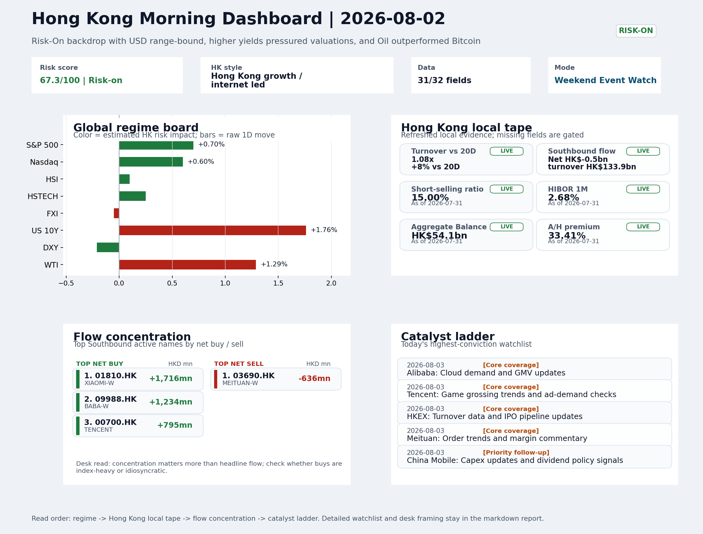
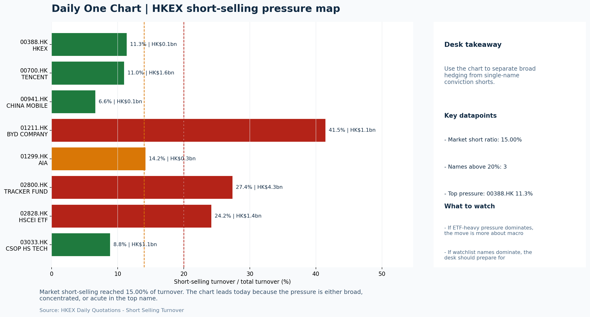

# Morning Research Workbench | 2026-08-03

> Designed for a Hong Kong sell-side commute: Layer 1 `Scan`, Layer 2 `Deep Read`, Layer 3 `Thinking`
> Mode: `Weekend Event Watch` | Track weekend policy, geopolitics, still-moving assets, and Monday open preparation rather than replaying stale cash-market tape.
> Briefing date: `2026-08-03` | Review date: `2026-08-02` | Global request: `2026-08-02` | HK/China request: `2026-07-31` | Market effective date: `2026-07-31` | Generated at: `2026-08-03 05:54:12`

## Executive Summary

- **Market pulse:** The Risk-On weekend backdrop - with VIX easing to 15.99 and USD range-bound - supports a constructive Monday open, but the US 10Y at 4.745% (+1.76%) and the China export miss offset that.
- **Hong Kong lens:** Hong Kong growth / internet led. A constructive open is possible if HSTECH holds despite higher yields, but follow-through hinges on whether Alibaba's cloud and GMV update offsets the export disappointment.
- **Top catalysts:** VIX -6.44%; Risk-On backdrop with USD range-bound, higher yields pressured valuations, and Oil outperformed Bitcoin.

## Visual Dashboard

## Layer 1 | Reset (5-10 min)

### 1.1 One-Line Market Pulse
The Risk-On weekend backdrop - with VIX easing to 15.99 and USD range-bound - supports a constructive Monday open, but the US 10Y at 4.745% (+1.76%) and the China export miss offset that momentum, leaving the setup finely balanced between easing stress and rate-driven valuation pressure for Hong Kong tech.

### 1.2 Global Asset Price Dashboard

| Asset | Last | 1D move | Read |
| --- | --- | --- | --- |
| S&P 500 | 7,489.72 | +0.70% | US large-cap risk appetite |
| Nasdaq 100 | 28,274.20 | +0.60% | Growth and duration leadership |
| Hang Seng Index | 25,884.43 | +0.10% | Hong Kong broad beta |
| Hang Seng TECH | 4.7300 | +0.25% | Hong Kong growth / platform read-through |
| CSI 300 | 4,529.10 | +0.00% | Mainland large-cap tone |
| US 10Y | 4.7450 | **+1.76%** | Global discount-rate anchor |
| China 10Y | 1.71% | -0.6bp | China local rates anchor \| Live public \| Eastmoney \| 2026-07-31 |
| CN-US 10Y spread | -303.6bp | -7.5bp | Relative carry and macro-pressure gauge \| Live public \| Eastmoney \| 2026-07-31 |
| DXY | 99.80 | -0.21% | Dollar liquidity impulse |
| USD/CNH | 6.7335 | +0.00% | Offshore China risk appetite |
| USD/HKD | 7.8428 | +0.01% | Linked-exchange regime stress check |
| Brent crude | 90.12 | +1.22% | Energy / geopolitics |
| COMEX gold | 4,049.10 | -1.24% | Hedge demand / real yields |
| Copper | 6.4360 | -0.13% | Global growth proxy |
| VIX | 15.99 | **-6.44%** | US stress barometer |

### 1.3 Hong Kong Last Cash-Tape Quick Check (Reference)

| Check | Value | Status | Source / as of | Why it matters |
| --- | --- | --- | --- | --- |
| Main Board turnover vs 20D | 1.08x \| +8% vs 20D | Live local | HKEX \| 2026-07-31 | Trailing 20-session average turnover was HK$303.0bn. |
| Southbound / Northbound net flow | Southbound Net HK$-0.5bn \| turnover HK$133.9bn \| Northbound Turnover HK$354.1bn \| net not reported | Live local | HKEX Connect \| 2026-07-31 | Southbound net buy is calculated from HKEX disclosed buy and sell turnover. |
| Short-selling ratio | 15.00% | Live local | HKEX \| 2026-07-31 | Official HKEX stock-level short-selling table, aggregated as a share of total market turnover. |
| AH premium index | 33.41% | Live public | Yahoo \| 2026-07-31 | Simple average across 16 A/H pairs; use dispersion rather than the average alone. |
| USD/HKD spot vs band | 7.8428 \| band 7.7500 to 7.8500 | Live quote + local | Yahoo \| 2026-07-31 | Inside the linked-exchange band without immediate boundary stress. Official Convertibility Undertakings define the linked-rate stress boundaries for USD/HKD. |
| HIBOR 1M | 2.68% | Live local | HKMA \| 2026-07-31 | 1M HIBOR is the cleanest quick read for Hong Kong funding conditions and equity-duration pressure. |
| Aggregate Balance | HK$54.1bn | Live local | HKMA \| 2026-07-31 | Aggregate Balance helps frame whether linked-rate liquidity conditions are tight or comfortable. |
| Hong Kong leadership | Hong Kong growth / internet led | Proxy | HSI / HSCEI / HSTECH relative perf \| 2026-07-31 | Use HSI / HSCEI / HSTECH relative moves as the opening style read. |

### 1.4 Risk Dashboard
**Composite risk score:** `67.3/100` | **Regime:** `Risk-on`

| Component | Score impact | Evidence |
| --- | --- | --- |
| US beta | +4.2 | S&P 500 +0.70% |
| HK growth | +1.2 | HSTECH +0.25% |
| Offshore China proxy | -0.2 | FXI -0.05% |
| Dollar pressure | +2.1 | DXY -0.21% |
| Volatility | +10 | VIX -6.44% |
| HK short-selling | +0 | Short-selling ratio 15.00% |

### 1.5 Next Open Checklist
1. **VIX -6.44%**
 High-frequency data | Lower volatility signals easing stress in the tape.
2. **Risk-On backdrop with USD range-bound, higher yields pressured valuations, and Oil outperformed Bitcoin**
 Still-moving markets | No fresh Hong Kong cash session is assumed; use global active assets and policy/event flow to prepare the next open.
3. **CPI MoM (Released)**
 Macro / policy | Rates expectations, the dollar, and growth-equity valuation | Industries: Technology, Internet, Brokers
4. **Trade Balance (Released)**
 Macro / policy | Watch whether it changes the day's core market narrative | Industries: Market-wide
5. **Retail Sales MoM (Upcoming)**
 Macro / policy | Consumer resilience, growth expectations, and risk-asset pricing | Industries: Consumer, E-commerce, Consumer discretionary

## Layer 2 | Deep Read (20-30 min)

### 2.1 Still-Moving Global Financial Actions
> Non-trading mode: treat the cash-market tape below as last-available reference, not a fresh trading signal. Priority shifts to policy headlines, geopolitics, central-bank repricing, FX/commodities/crypto, corporate actions, and next-open preparation.

#### Market Setup
**Core tape.** US equities posted broad gains on Friday, supported by easing volatility and a constructive risk appetite, but higher Treasury yields and hawkish Fed commentary capped upside for duration-sensitive growth sectors.
**Main driver.** Energy outperformed as WTI crude rallied on geopolitical supply concerns, while Bitcoin and gold declined, consistent with a risk-on rotation away from havens.
**HK relevance.** The mixed cross-asset signals leave Hong Kong's Monday open finely balanced between a benign volatility regime and rate-driven pressure on tech names.

#### Key Drivers
- S&P 500 +0.70%: easing stress (VIX -6.44%) and a moderately supportive global equity beta lifted risk assets.
- Rates impulse: US 10Y yield +1.76%, pressuring long-duration growth valuations after hawkish Fed commentary repriced the front-end rate.
- Oil outperformance: WTI crude +1.29% on elevated Middle East tension, adding cost-push concern for China manufacturers and benefiting.
- Risk-on rotation: Bitcoin -2.95% and gold -1.24% fell as capital rotated out of havens, confirming the risk-on regime.

#### Hong Kong Read-Through
**Desk lens.** Hong Kong growth / internet led.
**Opening implication.** A constructive open is possible if HSTECH holds despite higher yields, but follow-through hinges on whether Alibaba's cloud and GMV update offsets the export disappointment. Energy and commodity stocks will likely attract early bids.
- **Cross-market read:** Hang Seng +0.10% / HSCEI -0.38% / HSTECH +0.25%.
- **Cross-market read:** Offshore China proxy FXI -0.05% and USD/CNH +0.00% frame cross-border risk appetite.
- **Cross-market read:** USD/HKD last traded around 7.8428, which keeps the Hong Kong funding lens in focus.

#### Watch Points
- USD composite moved lower by +0.00pct intraday, with a 0.762pct range.
- Main turning points appeared around 2026-07-31 08:05 peak / 2026-07-31 08:20 trough / 2026-07-31 08:45 peak, suggesting event-driven repricing.
- The biggest cross-asset divergence was Oil versus Bitcoin, a spread of 5.972pct.
- Gold moved -0.61pct intraday with a 1.575pct high-low range.

#### Non-Trading Focus Map
- No fresh Hong Kong cash-market session is assumed for 2026-08-02; HK local tape is last completed HK/China cash-market reference tape from 2026-07-31.

| Monitor | Bucket | Last | Move | Why it matters |
| --- | --- | --- | --- | --- |
| VIX | Vol | 15.99 | -6.44% | Lower volatility signals easing stress in the tape. |
| Bitcoin | Crypto | 62,813.75 | -2.95% | Keep tracking it to confirm whether the core daily narrative is holding. |
| US 10Y | Rates | 4.7450 | +1.76% | Higher yields can pressure long-duration and growth valuations. |
| WTI crude | Commodities | 84.67 | +1.29% | A strong crude move needs to be split between geopolitics and demand repair. |
| Gold | Commodities | 4,049.10 | -1.24% | Keep tracking it to confirm whether the core daily narrative is holding. |
| DXY | FX | 99.80 | -0.21% | Keep tracking it to confirm whether the core daily narrative is holding. |

**Weekend / Holiday Event Docket**

| Channel | Signal | Why monitor | Next check |
| --- | --- | --- | --- |
| Vol | VIX -6.44% | Lower volatility signals easing stress in the tape. | Keep this as the bridge signal until the next Hong Kong cash close confirms or |
| Crypto | Bitcoin -2.95% | Keep tracking it to confirm whether the core daily narrative is holding. | Keep this as the bridge signal until the next Hong Kong cash close confirms or |
| Rates | US 10Y +1.76% | Higher yields can pressure long-duration and growth valuations. | Keep this as the bridge signal until the next Hong Kong cash close confirms or |
| Commodities | WTI crude +1.29% | A strong crude move needs to be split between geopolitics and demand repair. | Keep this as the bridge signal until the next Hong Kong cash close confirms or |
| Released | CPI MoM | Rates expectations, the dollar, and growth-equity valuation | Check the rates, FX, and China-proxy reaction after release or official |
| Released | Trade Balance | Watch whether it changes the day's core market narrative | Check the rates, FX, and China-proxy reaction after release or official |
| Upcoming | Retail Sales MoM | Consumer resilience, growth expectations, and risk-asset pricing | Check the rates, FX, and China-proxy reaction after release or official |
| Geopolitics | Middle East: Regional tension remains elevated | Oil, freight costs, and safe-haven demand | Map any escalation first into oil, gold, USD, CNH, and HK growth-beta sensitivity. |

**Still-moving actions to track**
- **Geopolitics:** Middle East: Regional tension remains elevated | Oil, freight costs, and safe-haven demand
- **Geopolitics:** US-China: Technology export-control rhetoric remains active | China internet, semiconductors, and supply chains
- **Policy / company tape:** The U.S. wants Asia to use its AI - but China dominates cheaper models | Assess whether the story can propagate through the Semiconductors and AI value chain
- **Policy / company tape:** China's U.S.-bound shipments fall in July after brief recovery, survey | Assess whether the story can propagate through the Other value chain
- **Released:** CPI MoM | Rates expectations, the dollar, and growth-equity valuation

**Next-open preparation**
- First dated catalyst to prepare: 2026-08-03 | Alibaba: Cloud demand and GMV updates.
- Refresh HKEX turnover, Stock Connect, short-selling, and AH dispersion once the next HK cash session closes.
- Use USD/CNH, USD/HKD, DXY, oil, gold, and crypto as bridge signals before cash markets reopen.
- Prepare one base case and one risk case for the next Hong Kong open instead of over-reading stale cash-market moves.

**Curated overnight stories**
1. **Fed officials who voted to hike rates say action is needed now against inflation**
 Why it matters: It directly reprices the front-end rate path and raises the risk of a more aggressive Fed, which would compress multiples for Hong Kong's large growth and tech complex.
 HK read-through: Pressure on Hang Seng TECH Index and rate-sensitive property stocks. USD strength could trigger modest HK$ outflows. Banks may benefit on net-interest-margin expectations.
2. **China's U.S.-bound shipments fall in July after brief recovery, survey shows**
 Why it matters: Weakness in China-U.S. trade volumes undercuts the export-led GDP support thesis and raises tariff/policy uncertainty ahead of the upcoming Retail Sales data.
 HK read-through: Direct drag on port, shipping, and export-oriented manufacturers listed in Hong Kong. Dampens cyclical recovery hopes that had supported a rotation into China industrials.
3. **Risk-On backdrop with USD range-bound, higher yields pressured valuations, and Oil**
 Why it matters: Confirms that weekend risk appetite remains constructive overall, but the yield move penalizes long-duration equity sectors.
 HK read-through: Two-speed impact: energy and commodity stocks get a bid; internet and EV names face margin compression fears.
4. **The U.S. wants Asia to use its AI - but China dominates cheaper models**
 Why it matters: Heightens the geopolitical lens on AI supply chains and may accelerate localisation demand for China-linked AI semiconductor alternatives.
 HK read-through: Selective positive for Hong Kong-listed AI software and self-sufficiency plays; neutral for contract manufacturers reliant on U.S. tech, as regulatory friction risk rises.

### 2.2 Last Available Hong Kong / A-share Tape (Reference Only)
> Non-trading mode: treat the cash-market tape below as last-available reference, not a fresh trading signal. Priority shifts to policy headlines, geopolitics, central-bank repricing, FX/commodities/crypto, corporate actions, and next-open preparation.

#### Local Tape Setup
**Local read.** Hong Kong and China markets prepare for Monday after a weekend event flow that kept the cross-asset backdrop Risk-On overall.
**Verification point.** Style leadership from the July 31 reference tape shows Hang Seng TECH (+0.25%) modestly outperforming HSCEI (-0.38%), yet local flow evidence remains inconclusive - Southbound net sold HK$0.5bn and HSCEI ETF saw outflows.
**Risk to watch.** The stable USD/CNH removes one immediate headwind, but the rates impulse and export disappointment keep the Monday open conditional.

#### Style and Local Leadership
**Style leadership.** Hong Kong growth / internet led.
- **Cross-market read:** Hang Seng +0.10% / HSCEI -0.38% / HSTECH +0.25%.
- **Cross-market read:** Offshore China proxy FXI -0.05% and USD/CNH +0.00% frame cross-border risk appetite.
- **Cross-market read:** USD/HKD last traded around 7.8428, which keeps the Hong Kong funding lens in focus.

#### Flow Confirmation
Official Stock Connect evidence is available; use Section 2.3 to confirm whether local money supports the price action.

#### Follow-Through Checklist
**Follow-through check.** Watch whether CSI 300 and offshore China proxy (FXI) confirm the growth-over-value read; southbound flow reversal and HSTECH ETF volume would strengthen conviction. Alibaba's cloud and GMV update, U.S. 10Y direction.

### 2.3 Flow Tracker and Attribution
#### Cross-Asset Attribution v1

| Driver | Direction | Score | Evidence | HK implication |
| --- | --- | --- | --- | --- |
| Rates impulse | drag | 2.11 | US 10Y yield proxy moved +1.76%. | Lower yields help long-duration growth; higher yields pressure valuation-sensitive |
| Global equity beta | supportive | 0.7 | S&P 500 moved +0.70%. | Broad beta matters if Hong Kong breadth confirms the overseas signal. |

#### Flow Tracker
##### Flow Takeaways
- Local flow evidence is not yet strong enough to override the cross-asset setup.
- Stock Connect Southbound: net HK$-0.5bn on turnover HK$133.9bn (as of 2026-07-31).
- Stock Connect Northbound: turnover RMB354.1bn; public file provides total turnover/top active names, not full net-buy.
- AH premium: simple covered-pair average +33.41%; widest premium: China Communications Construction 86.52%.

##### Stock Connect Southbound Active Names

| Rank | Ticker | Name | Buy | Sell | Net buy |
| --- | --- | --- | --- | --- | --- |
| 5 | 01810.HK | XIAOMI-W | HK$4,207.2mn | HK$2,490.8mn | HK$1,716.4mn |
| 1 | 09988.HK | BABA-W | HK$5,310.0mn | HK$4,075.6mn | HK$1,234.3mn |
| 4 | 00700.HK | TENCENT | HK$3,673.5mn | HK$2,878.8mn | HK$794.7mn |
| 10 | 03690.HK | MEITUAN-W | HK$340.2mn | HK$975.9mn | HK$-635.7mn |
| 1 | 02513.HK | Z.AI | HK$5,853.6mn | HK$5,278.3mn | HK$575.3mn |

##### AH Premium Dispersion

| Name | A ticker | H ticker | Premium | As of |
| --- | --- | --- | --- | --- |
| China Communications Construction | 601800.SS | 1800.HK | +86.52% | 2026-07-31 |
| China Life | 601628.SS | 2628.HK | +57.13% | 2026-07-31 |
| China Railway Construction | 601186.SS | 1186.HK | +57.00% | 2026-07-31 |
| China Railway | 601390.SS | 0390.HK | +48.25% | 2026-07-31 |
| Sinopec | 600028.SS | 0386.HK | +37.85% | 2026-07-31 |

##### HKEX Short-Selling Watch

| Ticker | Name | Short ratio | Short turnover | Total turnover |
| --- | --- | --- | --- | --- |
| 00388.HK | HKEX | 11.35% | HK$0.1bn | HK$1.2bn |
| 00700.HK | TENCENT | 10.97% | HK$1.6bn | HK$14.7bn |
| 00941.HK | CHINA MOBILE | 6.60% | HK$0.1bn | HK$2.0bn |
| 01211.HK | BYD COMPANY | 41.45% | HK$1.1bn | HK$2.6bn |
| 01299.HK | AIA | 14.19% | HK$0.3bn | HK$2.1bn |

- **Short-value leaders:** 07709.HK XL2CSOPHYNIX (HK$4.5bn); 01810.HK XIAOMI-W (HK$4.4bn); 02800.HK TRACKER FUND (HK$4.3bn); 09988.HK BABA-W (HK$1.6bn).

### 2.4 Macro and Policy Tracking
**Desk read.** Use the calendar table and released data below as the primary macro read.

| Time | Region | Event | Status | Desk read |
| --- | --- | --- | --- | --- |
| 20:30 | US | CPI MoM | Released | Impact: Rates expectations, the dollar, and growth-equity valuation \| Attention: 5/5 \| Industries: Technology, Internet, Brokers |
| 09:30 | China | Trade Balance | Released | Impact: Watch whether it changes the day's core market narrative \| Attention: 3/5 \| Industries: Market-wide |
| 20:30 | US | Retail Sales MoM | Upcoming | Impact: Consumer resilience, growth expectations, and risk-asset pricing \| Attention: 5/5 \| Industries: Consumer, E-commerce, Consumer discretionary |
| 09:20 | China | Loan Prime Rate | Upcoming | Impact: Watch whether it changes the day's core market narrative \| Attention: 3/5 \| Industries: Market-wide |
| 22:00 | Federal Reserve | Jerome Powell: Economic outlook remarks | Central bank | Impact: Policy path, liquidity conditions, and cross-asset risk appetite \| Attention: 5/5 \| Industries: Technology, Financials, Gold |
| 10:00 | PBOC | Open Market Operations Desk: Daily liquidity operation window | Central bank | Impact: Policy path, liquidity conditions, and cross-asset risk appetite \| Attention: 3/5 \| Industries: Technology, Financials, Gold |

#### Positioning and Risk Backdrop
- Options activity centered on KWEB Call, with Vol/OI at 1.88x and a bullish bias.
- Put/Call structure shows equity 0.68 / index 1.15, implying Single-stock optimism with index hedging.
- Geopolitics: Middle East | Regional tension remains elevated | Impact: Oil, freight costs, and safe-haven demand
- Geopolitics: US-China | Technology export-control rhetoric remains active | Impact: China internet, semiconductors, and supply chains

### 2.5 Key Company and Sector Events
No high-conviction sector story cleared the main-report relevance gate for this run.

#### Company Event Takeaway
**Desk read.** The weekend event watch centers on three corporate actions with direct read-throughs for Monday's open.
**Why it matters.** Morgan Stanley's upgrade of Alibaba (9988.HK) from Equal Weight to Overweight, raising the target from 92 to 105 HKD, is the most significant catalyst.
**Follow-up.** Tencent (0700.HK) reports earnings after market close on Monday with consensus EPS at 4.15 HKD and revenue at 163.2bn HKD - high expectations given the name sits at the top of its recent range (87.8%).

#### LLM Quick Takes
- **9988.HK** | Morgan Stanley upgrade (Equal Weight to Overweight, target 92→105 HKD) is the key event. The stock's 4.65% gain on 2026-07-31 suggests partial pricing-in, but the
- **0700.HK** | Reports after market close Monday with EPS consensus at 4.15 HKD and revenue at 163.2bn HKD. High bar set given 87.8% range position
- **0388.HK** | Reports before market open Monday with EPS consensus at 2.81 HKD and revenue at 6.0bn HKD. Sensitive to Hong Kong market volume trends and IPO pipeline.
- **00069.HK** | Profit warning released 2026-07-31 (grade A, score 4.5). Shangri-La Asia's warning reflects hospitality sector headwinds.
- **00103.HK** | Profit warning released 2026-07-31 (grade A, score 4.5). Shougang Cent operating in steel sector under cost and demand pressures.
- **00533.HK** | Profit warning released 2026-07-31 (grade A, score 4.5). Goldlion Hold in apparel/accessories segment. May reflect consumer spending sensitivity

#### HKEX Announcements

| Grade | Ticker | Type | Release time | Title |
| --- | --- | --- | --- | --- |
| A | 00069.HK | Profit warning | 2026-07-31 | Profit warning / alert announcement |
| A | 00103.HK | Profit warning | 2026-07-31 | Profit warning / alert announcement |
| A | 00194.HK | Profit warning | 2026-07-31 | Profit warning / alert announcement |
| A | 00239.HK | Profit warning | 2026-07-31 | Profit warning / alert announcement |
| A | 00311.HK | Profit warning | 2026-07-31 | Profit warning / alert announcement |
| A | 00422.HK | Profit warning | 2026-07-31 | Profit warning / alert announcement |
| A | 00505.HK | Profit warning | 2026-07-31 | Profit warning / alert announcement |
| A | 00533.HK | Profit warning | 2026-07-31 | Profit warning / alert announcement |

#### Earnings / Results Watch

| Ticker | Company | Timing | Expectation framing |
| --- | --- | --- | --- |
| 0700.HK | Tencent Holdings | After Market Close | EPS est. 4.15 HKD \| revenue est. 163.2bn HKD |
| 0388.HK | Hong Kong Exchanges and Clearing | Before Market Open | EPS est. 2.81 HKD \| revenue est. 6.0bn HKD |

#### Rating Changes
- **9988.HK** | Morgan Stanley | Upgrade | Equal Weight -> Overweight | PT 92 -> 105

#### IPO Watch
- IPO and grey-market monitoring is not yet part of the standard production pack.

### 2.6 Today's Core Names
#### Core coverage

| Name | Ticker | Last | 1D | Range position | Morning note |
| --- | --- | --- | --- | --- | --- |
| Alibaba | 9988.HK | 117.00 | +4.65% | Mid-range | Short-term price strength is clear; fresh catalysts could trigger broader group follow-through. |
| Tencent | 0700.HK | 475.20 | +0.72% | Top of range | The name sits near the top of its recent range, so watch for profit-taking under high expectations. |

**Recent headlines for Alibaba:**
- [Alibaba (NYSE:BABA) Is Supplying Moonshot With A Major Nvidia AI Cluster](https://finance.yahoo.com/technology/ai/articles/alibaba-nyse-baba-supplying-moonshot-010613054.html) (Simply Wall St.)
**Recent headlines for Tencent:**
- [TSMC and Tencent break into the top 100 of the Fortune Global 500 list, as Asia rides the AI boom](https://finance.yahoo.com/technology/articles/tsmc-tencent-break-top-100-210000080.html) (Fortune)

#### Priority follow-up

| Name | Ticker | Last | 1D | Range position | Morning note |
| --- | --- | --- | --- | --- | --- |
| China Mobile | 0941.HK | 83.65 | -1.36% | Top of range | The name sits near the top of its recent range, so watch for profit-taking under high expectations. |
| BYD Company | 1211.HK | 94.15 | -0.69% | Top of range | The name sits near the top of its recent range, so watch for profit-taking under high expectations. |

## Layer 3 | Thinking (10-15 min)

### 3.1 Rotating Theme Deep Dive

| Field | Read |
| --- | --- |
| Theme | AI and Compute Chain |
| Angle for the day | Track whether global AI capex, semis, cloud, and server demand are still carrying offshore China internet and hardware sentiment. |

**Theme desk read**
**Core thesis.** The AI and Compute Chain theme retains attention over the weekend after Alibaba disclosed a significant cloud infrastructure deal to supply a major Nvidia chip cluster for Chinese AI firm Moonshot, directly linking its.
**Evidence.** This event reinforces the angle that global AI capex and cloud demand are still flowing into offshore China internet names.
**What to test.** However, macro signals are split: the released US CPI MoM came in hot at 0.3% (vs. 0.2% forecast), driving the US 10Y yield up 1.76% and potentially pressuring long-duration growth valuations.

**Signals to keep in mind**
- The U.S. wants Asia to use its AI - but China dominates cheaper models: Assess whether the story can propagate through the Semiconductors
- China's U.S.-bound shipments fall in July after brief recovery, survey shows: Assess whether the story can propagate through the Other
- VIX -6.44%: Lower volatility signals easing stress in the tape.
- Bitcoin -2.95%: Keep tracking it to confirm whether the core daily narrative is holding.

**LLM watch items:**
- US 10Y yield and USD/CNH after hot CPI: assess whether long-duration pressure spills into China internet names at the open.
- Alibaba/Moonshot AI cluster deal: watch for any further details or follow-through buying on Aug 3.
- Tencent near top-of-range: monitor for profit-taking if high expectations meet macro caution.
- China LPR decision and US retail sales: these can shift the risk backdrop intraday on Aug 3.
- VIX and Bitcoin as live sentiment gauges: any reversal could signal a change in the risk-on mood before the cash session begins.

**Related names to keep close:**

| Name | Ticker | Bucket | Morning read |
| --- | --- | --- | --- |
| Alibaba | 9988.HK | Core coverage | Short-term price strength is clear; fresh catalysts could trigger broader group follow-through. |
| Tencent | 0700.HK | Core coverage | The name sits near the top of its recent range, so watch for profit-taking under high expectations. |
| HKEX | 0388.HK | Core coverage | Positioning is neutral for now, so use it mainly to monitor marginal information changes. |
| AIA | 1299.HK | Priority follow-up | Positioning is neutral for now, so use it mainly to monitor marginal information changes. |

**Upcoming catalysts tied to the theme:**
- 2026-08-03 | Alibaba: Cloud demand and GMV updates | Key read-through for China consumption, cloud, and platform regulation
- 2026-08-03 | Tencent: Game grossing trends and ad-demand checks | Core offshore China platform proxy for gaming, ads, and AI monetization
- 2026-08-03 | AIA: NBV trends and agency momentum | Read-through for wealth demand, mainland visitor activity, and HK financial sentiment
- 2026-08-03 | Hang Seng TECH ETF: AI narrative shifts and China platform regulation headlines | Fast proxy for Hong Kong internet and growth leadership

**Relevant headlines:**
- [The U.S. wants Asia to use its AI - but China dominates cheaper models](https://www.cnbc.com/2026/07/30/us-wants-asia-to-use-its-ai-but-china-dominates-cheaper-models.html)
- [China's U.S.-bound shipments fall in July after brief recovery, survey shows](https://www.cnbc.com/2026/07/30/china-us-exports-drop.html)

### 3.2 Next Session Outlook and Calendar
- Non-trading review: use today's calendar to prepare the next Hong Kong open rather than treating the last cash tape as a fresh signal.
- Macro: CPI MoM is the first item to anchor the open and the rates/FX response.
- Corporate / event: Alibaba: Cloud demand and GMV updates is the cleanest same-day catalyst to prepare for.

**Same-day macro docket**

| Time | Country | Event | Status | Detail |
| --- | --- | --- | --- | --- |
| 20:30 | US | CPI MoM | Released | Actual 0.3% / Forecast 0.2% / Prior 0.4% |
| 09:30 | China | Trade Balance | Released | Actual USD 85.2bn / Forecast USD 79.0bn / Prior USD 80.6bn |
| 20:30 | US | Retail Sales MoM | Upcoming | Forecast 0.3% / Prior 0.6% |
| 09:20 | China | Loan Prime Rate | Upcoming | Forecast 3.45% / Prior 3.45% |
| 22:00 | Federal Reserve | Jerome Powell: Economic outlook remarks | Central bank | speech |

**Same-day catalyst list**

| Date | Time | Category | Event | Importance |
| --- | --- | --- | --- | --- |
| 2026-08-03 | | Core coverage | Alibaba: Cloud demand and GMV updates | 3 |
| 2026-08-03 | | Core coverage | Tencent: Game grossing trends and ad-demand checks | 3 |
| 2026-08-03 | | Core coverage | HKEX: Turnover data and IPO pipeline updates | 3 |
| 2026-08-03 | | Core coverage | Meituan: Order trends and margin commentary | 3 |

**Next few sessions**

| Date | Category | Event | Impact |
| --- | --- | --- | --- |
| 2026-08-03 | Core coverage | Alibaba: Cloud demand and GMV updates | Key read-through for China consumption, cloud, and platform regulation |
| 2026-08-03 | Core coverage | Tencent: Game grossing trends and ad-demand checks | Core offshore China platform proxy for gaming, ads, and AI monetization |
| 2026-08-03 | Core coverage | HKEX: Turnover data and IPO pipeline updates | Direct proxy for Hong Kong market turnover, listings, and southbound |
| 2026-08-03 | Core coverage | Meituan: Order trends and margin commentary | High-frequency read on local services demand and platform competition |

### 3.3 Daily One Chart
**Daily One Chart | HKEX short-selling pressure map**

**Chart read.** Market short-selling reached 15.00% of turnover.
**Why it matters.** The chart leads today because the pressure is either broad, concentrated, or acute in the top name.

_Source: HKEX Daily Quotations - Short Selling Turnover_

## Traceable Appendix

### Report Metadata
> Date policy: Review date 2026-08-02 is treated as `Weekend Event Watch`. | Global request date is 2026-08-02; adapter effective date is 2026-07-31 and summary date is 2026-07-31. | HK/China local data date is 2026-07-31; role: last completed HK/China cash-market reference tape.
> Market data quality: Coverage: `31/32` | Fallbacks used: `1` | Stale items (>1d): `2` | Missing: `1`
> Report quality: `90.0/100` | Grade `A` | Status `production ready`

### Key Questions to Keep in Mind
- Is risk appetite rising or fading? The overnight tape reads closer to `Risk-On`.
- Did rates expectations move? Focus on whether US 10Y, DXY, and growth style moved together.
- Were commodities the real story? Watch WTI and gold for geopolitics versus inflation signals.
- Is Hong Kong setup internet-led, SOE-led, or broad beta-led? Compare HSTECH, HSCEI, and HSI.
- Did offshore markets move China risk appetite? Focus on HSI, FXI, USD/CNH, and USD/HKD.

### Report Quality and Validation
- **Quality score:** 90.0/100 | **Grade:** A | **Status:** production ready
- **Run summary:** 7 healthy | 1 caveat | 0 failed
- **Release recommendation:** Send with caveats | The report is usable, but the advisory guidance should travel with it so readers understand the data gaps.

| Source | Status | Bucket |
| --- | --- | --- |
| Market data | ok | healthy |
| Sector and company news | ok | healthy |
| Movers and short selling | ok | healthy |
| Stock Connect | ok | healthy |
| A/H premium | ok | healthy |
| Hong Kong local package | ok | healthy |
| China rates | ok | healthy |
| Narrative overlay | partial | caveat |

**Desk-use guidance summary:** 0 blocking | 1 advisory

**Desk-use guidance**
- **Advisory:** Use deterministic sections as primary support; the narrative overlay was partial or unavailable on this run.

| Component | Score | Weight | Read |
| --- | --- | --- | --- |
| Market data coverage | 96.9 | 0.3 | 31/32 core market fields available. |
| Hong Kong local metrics | 82.3 | 0.25 | 8 live, 3 proxy, 0 unavailable local checks. |
| Key public adapters | 100.0 | 0.2 | 4/4 key adapters were available or partially available. |
| Narrative overlay health | 68.6 | 0.15 | 4/7 narrative overlay tasks succeeded or used validated cache; 1 error(s). |
| Fact-check guardrail | 100.0 | 0.1 | Checked 4 numeric claims; 0 numeric mismatch(es), 0 logic warning(s); 0 critical, 0 review. |

**Narrative fact-check guardrail**
- Checked 4 numeric claims; 0 numeric mismatch(es), 0 logic warning(s); 0 critical, 0 review.

**Adapter status**

| Adapter | Status |
| --- | --- |
| Stock Connect | ok |
| A/H premium | ok |
| HKEX announcements | ok |
| China rates | ok |

### Source Links
- [Alibaba (NYSE:BABA) Is Supplying Moonshot With A Major Nvidia AI Cluster](https://finance.yahoo.com/technology/ai/articles/alibaba-nyse-baba-supplying-moonshot-010613054.html) (Simply Wall St.)
- [TSMC and Tencent break into the top 100 of the Fortune Global 500 list, as Asia rides the AI boom](https://finance.yahoo.com/technology/articles/tsmc-tencent-break-top-100-210000080.html) (Fortune)
- [00069.HK Profit warning / alert announcement](http://www1.hkexnews.hk/listedco/listconews/sehk/2026/0731/2026073101151.pdf) (HKEXnews)
- [00103.HK Profit warning / alert announcement](http://www1.hkexnews.hk/listedco/listconews/sehk/2026/0731/2026073100942.pdf) (HKEXnews)
- [00194.HK Profit warning / alert announcement](http://www1.hkexnews.hk/listedco/listconews/sehk/2026/0731/2026073101513.pdf) (HKEXnews)
- [00239.HK Profit warning / alert announcement](http://www1.hkexnews.hk/listedco/listconews/sehk/2026/0731/2026073100704.pdf) (HKEXnews)
- [00311.HK Profit warning / alert announcement](http://www1.hkexnews.hk/listedco/listconews/sehk/2026/0731/2026073100848.pdf) (HKEXnews)
- [00422.HK Profit warning / alert announcement](http://www1.hkexnews.hk/listedco/listconews/sehk/2026/0731/2026073100316.pdf) (HKEXnews)
- [00505.HK Profit warning / alert announcement](http://www1.hkexnews.hk/listedco/listconews/sehk/2026/0731/2026073100402.pdf) (HKEXnews)
- [00533.HK Profit warning / alert announcement](http://www1.hkexnews.hk/listedco/listconews/sehk/2026/0731/2026073100966.pdf) (HKEXnews)

## Supplementary Visual Appendix

This appendix is professional-path only. It keeps a traceable index of the report visuals and the deterministic chart cues used to frame the morning note, without injecting the legacy intraday chart pack.

### Visual Index

| Visual | Path | Role |
| --- | --- | --- |
| Visual Dashboard | `charts/dashboard_2026-08-03.png` | Cross-asset regime board and Hong Kong local tape snapshot. |
| Daily One Chart | `charts/daily_one_chart_2026-08-03.png` | Single highest-conviction visual story for the day. |

### Deterministic Chart Cues
- FX / liquidity: USD composite moved lower by +0.00pct intraday, with a 0.762pct range.
- FX / liquidity: Main turning points appeared around 2026-07-31 08:05 peak / 2026-07-31 08:20 trough / 2026-07-31 08:45 peak, suggesting event-driven repricing rather than a clean one-way USD move.
- Cross-asset: The biggest cross-asset divergence was Oil versus Bitcoin, a spread of 5.972pct.
- Cross-asset: Gold moved -0.61pct intraday with a 1.575pct high-low range.
- Cross-asset: Oil moved +2.89pct intraday with a 5.699pct high-low range.
- Cross-asset: Bitcoin moved -3.08pct intraday with a 4.396pct high-low range.

### Risk Dashboard Components

| Component | Score impact | Evidence |
| --- | --- | --- |
| US beta | +4.2 | S&P 500 +0.70% |
| HK growth | +1.2 | HSTECH +0.25% |
| Offshore China proxy | -0.2 | FXI -0.05% |
| Dollar pressure | +2.1 | DXY -0.21% |
| Volatility | +10 | VIX -6.44% |
| HK short-selling | +0 | Short-selling ratio 15.00% |
