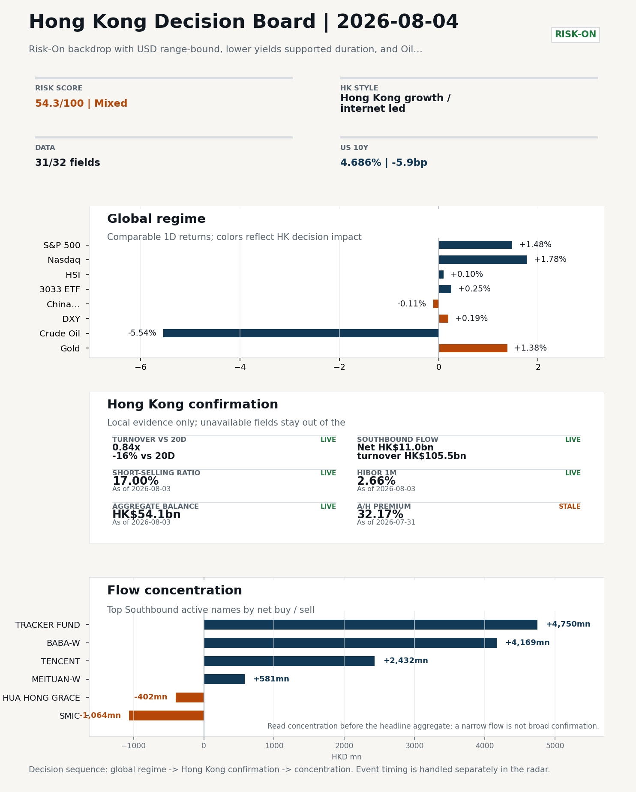
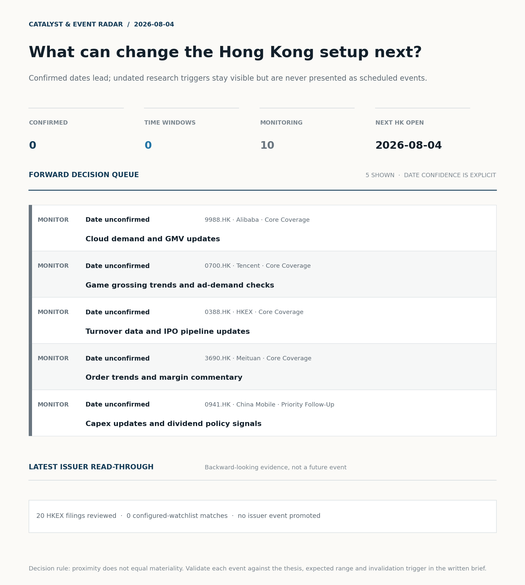
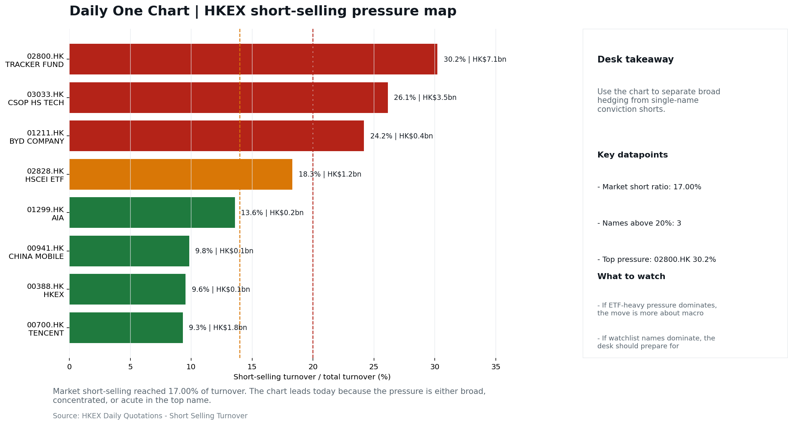
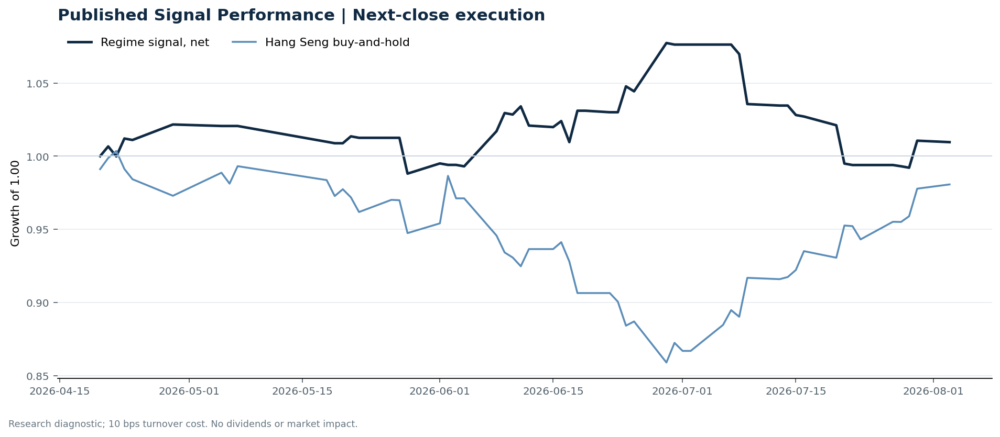

# Morning Research Workbench | 2026-08-04

> **Commute reading route:** `5-minute decision scan` → `25-30 minute deep read` → `10-15 minute optional appendix`
>
> Mode: `Trading Daily` | Keep the report execution-oriented: what mattered in the completed session, what can move Hong Kong leadership, and what needs fast follow-up.

_Data through: global `2026-08-03` | HK/China `2026-08-03` | Market effective `2026-08-03` | Generated `2026-08-04 06:18:19`_

## Executive Summary

- **Market pulse:** Risk-On backdrop with USD range-bound, lower yields supported duration, and Oil outperformed Gold
- **Hong Kong lens:** Hong Kong growth / internet led.
- **What would confirm it:** On the 2026-08-04 HK open, confirm (i) 3033.HK ETF closes above its prior day close with HSI unchanged-or-better and HSCEI flat, (ii) Southbound extends into BABA-W/0700.HK.

## Visual Dashboard

**Catalyst & Event Radar**

**Chart read:** No confirmed event date is populated; 10 undated research trigger(s) remain visible without invented timing.

_Source: Public calendars, issuer disclosures and configured research watchlists_
## Layer 1 | Scan (5 min)

### 1.2 Global Asset Price Dashboard
_Decision-useful subset: each row states the implication and the next test. Descriptive secondary monitors are kept out of the five-minute scan._

| Signal | Last / move | Interpretation | Confirmation / invalidation |
| --- | --- | --- | --- |
| S&P 500 | 7,600.50 / +1.48% | US beta improved, raising the global risk floor for Hong Kong. Falling volatility confirms lower near-term stress. | Confirm with Nasdaq breadth and a same-direction VIX move; invalidate if offshore-China proxies diverge. |
| Nasdaq 100 | 28,776.80 / **+1.78%** | Growth outperformed broad beta, a supportive style signal for Hong Kong internet and platform names. | Confirm through the 3033.HK ETF versus HSI leadership; higher US yields would weaken the read. |
| Hang Seng Index | 25,884.43 / +0.10% | Hong Kong broad beta strengthened, but local flow must confirm whether the move is investable. | Confirm with Southbound participation and breadth; invalidate if USD/CNH weakens while turnover fades. |
| Hang Seng TECH ETF (3033.HK) | 4.7300 / +0.25% | Hong Kong growth led broad beta, improving the platform/internet style signal. | Confirm with stable CNH, Southbound buying and lower yields; invalidate on growth underperformance with rising yields. |
| US 10Y | 4.6860% / -5.9bp | The yield proxy fell, easing the valuation headwind for duration-sensitive equities. | Confirm through Nasdaq and 3033.HK ETF relative performance; invalidate if growth leads despite the opposing rate move. |
| China 10Y | 1.72% / +0.3bp | Higher local yields may indicate firmer growth or tighter financial conditions; price action alone cannot distinguish them. | Use CSI 300, copper and official credit/activity data to separate growth optimism from demand weakness. |
| DXY | 99.99 / +0.19% | A firmer dollar tightens the external-liquidity backdrop and can pressure offshore-China risk appetite. | Confirm with USD/CNH moving in the same risk direction; divergence reduces conviction. |
| USD/CNH | 6.7390 / +0.00% | CNH was stable, removing an immediate FX impulse but not confirming equity direction. | Confirm with FXI, the 3033.HK ETF proxy and Southbound flow; invalidate if equities move opposite to FX with strong local participation. |
| VIX | 15.86 / -0.81% | Lower implied volatility reduces near-term stress, but is supportive only if equity breadth confirms. | Confirm with equity breadth and credit-sensitive assets; invalidate if lower VIX accompanies narrow or falling equities. |

_Secondary monitors retained in the source bundle: CSI 300, CN-US 10Y spread, USD/HKD, Brent crude, COMEX gold, Copper._

### 1.3 Hong Kong Key Data Quick Check

| Check | Value | Status | Source / as of | Why it matters |
| --- | --- | --- | --- | --- |
| Main Board turnover vs 20D | 0.84x \| -16% vs 20D | Live local | HKEX \| 2026-08-03 | Trailing 20-session average turnover was HK$304.1bn. |
| Southbound / Northbound net flow | Southbound Net HK$11.0bn \| turnover HK$105.5bn \| Northbound Turnover HK$297.7bn \| net not reported | Live local | HKEX Connect \| 2026-08-03 | Southbound net buy is calculated from HKEX disclosed buy and sell turnover. |
| Short-selling ratio | 17.00% | Live local | HKEX \| 2026-08-03 | Official HKEX stock-level short-selling table, aggregated as a share of total market turnover. |
| AH premium index | 32.17% | Stale public | Yahoo \| 2026-07-31 | Simple average across 17 A/H pairs; use dispersion rather than the average alone. |
| USD/HKD spot vs band | 7.8418 \| band 7.7500 to 7.8500 | Live quote + local | Yahoo \| 2026-08-03 | Inside the linked-exchange band without immediate boundary stress. Official Convertibility Undertakings define the linked-rate stress boundaries for USD/HKD. |
| HIBOR 1M | 2.66% | Live local | HKMA \| 2026-08-03 | 1M HIBOR is the cleanest quick read for Hong Kong funding conditions and equity-duration pressure. |
| Hong Kong leadership | Hong Kong growth / internet led | Proxy | HSI / HSCEI / 3033.HK ETF relative \| 2026-08-03 | Use HSI / HSCEI / 3033.HK ETF relative moves as the opening style read. |

### 1.4 Decision Board
**Composite risk score:** `54.3/100` | **Regime:** `Mixed`

| Component | Score impact | Evidence |
| --- | --- | --- |
| US beta | +8.9 | S&P 500 +1.48% |
| HK growth ETF proxy | +1.2 | 3033.HK ETF +0.25% |
| Offshore China proxy | -0.6 | FXI -0.11% |
| Dollar pressure | -1.9 | DXY +0.19% |

**Morning Checklist**

1. **Risk-On backdrop with USD range-bound, lower yields supported duration, and Oil outperformed Gold**
 Overnight regime | Start by deciding whether the day is about Risk-On conditions or a style pivot.
2. **WTI crude -5.54%**
 High-frequency data | Softer oil argues for a more cautious cyclical-growth read.
3. **Copper +1.61%**
 High-frequency data | Keep tracking it to confirm whether the core daily narrative is holding.
4. **Gold +1.38%**
 High-frequency data | Gold rising with the dollar looks more like geopolitical or pure hedge demand.

## Layer 2 | Deep Read (20-30 min)

### 2.1 Overnight Overseas Market Review
**Market Setup**
**Core tape.** Risk-On backdrop with USD range-bound, lower yields supported duration, and Oil outperformed Gold

**Hong Kong Read-Through**
**Desk lens.** Hong Kong growth / internet led.
- **Cross-market read:** Hang Seng +0.10% / HSCEI -0.38% / 3033.HK ETF +0.25%.
- **Cross-market read:** Offshore China proxy FXI -0.11% and USD/CNH +0.00% frame cross-border risk appetite.
- **Cross-market read:** USD/HKD last traded around 7.8418, which keeps the Hong Kong funding lens in focus.

**Watch Points**
- USD composite moved higher by +0.04pct intraday, with a 0.605pct range.
- Main turning points appeared around 2026-08-03 08:10 peak / 2026-08-03 08:40 trough / 2026-08-03 09:00 peak, suggesting event-driven repricing.
- The biggest cross-asset divergence was Oil versus Gold, a spread of 0.673pct.
- Gold moved -0.41pct intraday with a 1.087pct high-low range.

### 2.2 Hong Kong / A-share Previous-Day Review
**Local Tape Setup**
**Local read.** Overseas tape was growth-led (Nasdaq 100 +1.78%, S&P 500 +1.48%) with US 10Y -5.9bp supportive, but Hong Kong participation was muted: HSI +0.10%, HSCEI -0.38%.
**Verification point.** Local flow backdrop is thin (Main Board 0.84x 20D) but Southbound was a clear net buyer at HK$11.0bn on HK$105.5bn turnover, concentrated in BABA-W (+HK$4.17bn), TENCENT (+HK$2.43bn) and Tracker Fund (+HK$4.75bn).
**Risk to watch.** Cross-market read-through is mixed: US growth led, HK growth lagged, HSCEI dragged, and AH premium (+32.17%) is stale (as of 2026-07-31).

**Style and Local Leadership**
**Style leadership.** Hong Kong growth / internet led.
- **Cross-market read:** Hang Seng +0.10% / HSCEI -0.38% / 3033.HK ETF +0.25%.
- **Cross-market read:** Offshore China proxy FXI -0.11% and USD/CNH +0.00% frame cross-border risk appetite.
- **Cross-market read:** USD/HKD last traded around 7.8418, which keeps the Hong Kong funding lens in focus.

**Flow Confirmation**
Official Stock Connect evidence is available; use Section 2.3 to confirm whether local money supports the price action.

**Follow-Through Checklist**
**Follow-through check.** On the 2026-08-04 HK open, confirm (i) 3033.HK ETF closes above its prior day close with HSI unchanged-or-better and HSCEI flat, (ii) Southbound extends into BABA-W/0700.HK and 3033.HK on day t+1 rather than rotating to Tracker Fund/HSCEI ETF.

### 2.3 Flow Tracker and Attribution
**Cross-Asset Attribution**

| Driver | Direction | Score | Evidence | HK implication |
| --- | --- | --- | --- | --- |
| Oil and geopolitics | supportive | 5.81 | Oil moved -7.26%. | Split the read between energy/cyclicals support and margin/geopolitical pressure. |
| US growth-style transmission | supportive | 2.49 | Nasdaq 100 moved +1.78%. | Hong Kong growth and platform names should be tested first at the open. |
| Hong Kong participation | drag | 1.61 | Main Board turnover was 0.84x the 20-session average. | Thin turnover makes index moves easier to fade. |
| Global equity beta | supportive | 1.48 | S&P 500 moved +1.48%. | Broad beta matters if Hong Kong breadth confirms the overseas signal. |
| Rates impulse | supportive | 0.89 | US 10Y yield moved -5.9bp. | Lower yields help long-duration growth; higher yields pressure valuation-sensitive |

**Local Flow Tracker**

**Flow Takeaways**
- Turnover is light versus the 20-session baseline, so local moves have weaker conviction.
- Stock Connect Southbound: net HK$11.0bn on turnover HK$105.5bn (as of 2026-08-03).
- Stock Connect Northbound: turnover RMB297.7bn; public file provides total turnover/top active names, not full net-buy.
- AH premium: simple covered-pair average +32.17%; widest premium: China Communications Construction 86.27%.

**Stock Connect Southbound Active Names**

| Rank | Ticker | Name | Buy | Sell | Net buy |
| --- | --- | --- | --- | --- | --- |
| 3 | 02800.HK | TRACKER FUND | HK$4,751.9mn | HK$2.2mn | HK$4,749.7mn |
| 1 | 09988.HK | BABA-W | HK$8,436.1mn | HK$4,267.5mn | HK$4,168.6mn |
| 2 | 00700.HK | TENCENT | HK$6,772.6mn | HK$4,340.4mn | HK$2,432.1mn |
| 3 | 00981.HK | SMIC | HK$1,376.2mn | HK$2,439.8mn | HK$-1,063.6mn |
| 6 | 03690.HK | MEITUAN-W | HK$974.1mn | HK$393.5mn | HK$580.5mn |

**AH Premium Dispersion**

| Name | A ticker | H ticker | Premium | As of |
| --- | --- | --- | --- | --- |
| China Communications Construction | 601800.SS | 1800.HK | +86.27% | 2026-07-31 |
| China Life | 601628.SS | 2628.HK | +56.92% | 2026-07-31 |
| China Railway Construction | 601186.SS | 1186.HK | +56.79% | 2026-07-31 |
| China Railway | 601390.SS | 0390.HK | +48.06% | 2026-07-31 |
| Sinopec | 600028.SS | 0386.HK | +37.66% | 2026-07-31 |

**HKEX Short-Selling Watch**

| Ticker | Name | Short ratio | Short turnover | Total turnover |
| --- | --- | --- | --- | --- |
| 00388.HK | HKEX | 9.55% | HK$0.1bn | HK$1.0bn |
| 00700.HK | TENCENT | 9.31% | HK$1.8bn | HK$18.9bn |
| 00941.HK | CHINA MOBILE | 9.83% | HK$0.1bn | HK$1.0bn |
| 01211.HK | BYD COMPANY | 24.19% | HK$0.4bn | HK$1.7bn |
| 01299.HK | AIA | 13.59% | HK$0.2bn | HK$1.6bn |

- **Short-value leaders:** 02800.HK TRACKER FUND (HK$7.1bn); 03033.HK CSOP HS TECH (HK$3.5bn); 09988.HK BABA-W (HK$3.5bn); 01810.HK XIAOMI-W (HK$2.6bn).

### 2.4 Macro and Policy Tracking
**Desk read.** Use the calendar table and released data below as the primary macro read.

The macro calendar was light for this run.

**Positioning and Risk Backdrop**

- Detailed local flow evidence is covered in Section 2.3; keep this section focused on options, hedging, and macro-positioning risk.

### 2.5 Key Company and Sector Events

| Grade | Sector | Headline | Why it matters | Horizon |
| --- | --- | --- | --- | --- |
| B | China Internet | Stocks making the biggest moves premarket | Assess whether the story can propagate through the China Internet value | Monitor |

**HKEX Announcements**

| Grade | Ticker | Type | Release time | Title |
| --- | --- | --- | --- | --- |
| A | 00229.HK | Profit warning | 2026-08-03 | Profit warning / alert announcement |
| A | 00474.HK | Profit warning | 2026-08-03 | Profit warning / alert announcement |
| A | 00520.HK | Profit warning | 2026-08-03 | Profit warning / alert announcement |
| A | 00575.HK | Profit warning | 2026-08-03 | Profit warning / alert announcement |
| A | 00933.HK | Profit warning | 2026-08-03 | Profit warning / alert announcement |
| A | 00954.HK | Profit warning | 2026-08-03 | Profit warning / alert announcement |
| A | 01359.HK | Profit warning | 2026-08-03 | Profit warning / alert announcement |
| A | 01623.HK | Profit warning | 2026-08-03 | Profit warning / alert announcement |

**Earnings / Results Watch**
No earnings items were scheduled in the current window.

**Rating Changes**
- No rating-change items were highlighted in the current sell-side feed.

**IPO Watch**
- IPO and grey-market monitoring is not yet part of the standard production pack.

### 2.6 Today's Core Names
**Core coverage**

| Name | Ticker | Last | 1D | Range position | Morning note |
| --- | --- | --- | --- | --- | --- |
| Alibaba | 9988.HK | 117.00 | +4.65% | Mid-range | Short-term price strength is clear; fresh catalysts could trigger broader group follow-through. |
| Tencent | 0700.HK | 475.20 | +0.72% | Top of range | The name sits near the top of its recent range, so watch for profit-taking under high expectations. |

**Recent headlines for Alibaba:**
- [Stocks to Watch Recap: Bristol Myers Squibb, Alibaba, Palantir](https://www.wsj.com/livecoverage/stock-market-today-dow-sp-500-nasdaq-08-03-2026/card/stocks-to-watch-bristol-myers-squibb-alibaba-palantir-fvSpWFNjXCYPBIVpry9S?siteid=yhoof2&yptr=yahoo) (The Wall Street Journal)
**Recent headlines for Tencent:**
- [Tencent (SEHK:700) Stock May Be Undervalued Despite Fresh AI Spending Questions](https://finance.yahoo.com/markets/stocks/articles/tencent-sehk-700-stock-may-170839116.html) (Simply Wall St.)

**Priority follow-up**

| Name | Ticker | Last | 1D | Range position | Morning note |
| --- | --- | --- | --- | --- | --- |
| China Mobile | 0941.HK | 83.65 | -1.36% | Top of range | The name sits near the top of its recent range, so watch for profit-taking under high expectations. |
| BYD Company | 1211.HK | 94.15 | -0.69% | Top of range | The name sits near the top of its recent range, so watch for profit-taking under high expectations. |

## Layer 3 | Decision Deepening (10-15 min)

### 3.1 Rotating Theme Deep Dive

| Field | Read |
| --- | --- |
| Theme | China Consumption Recovery |
| Angle for the day | Focus on whether travel, retail, internet local services, and premium consumption data still support a demand-repair narrative. |

**Theme desk read**
**Core thesis.** The China Consumption Recovery theme stays the operating lens for HK today, with internet local services as the highest-frequency read on demand repair.
**Evidence.** Meituan (3690.HK) closed at HK$92.50 (-0.16%), sitting at the 99.5th percentile of its recent range; the supplied note flags profit-taking risk under elevated expectations.
**What to test.** Cross-currents are mixed rather than clean: WTI -5.54% argues for a more cautious cyclical-demand read, while US 10Y -5.9bp and Copper +1.61% lean supportive of duration and growth-style names.

**Signals to keep in mind**
- WTI crude -5.54%: Softer oil argues for a more cautious cyclical-growth read.
- Copper +1.61%: Keep tracking it to confirm whether the core daily narrative is holding.

**LLM watch items:**
- Confirm the date of the Meituan order trends and margin commentary catalyst; supplied data has no date.
- Whether Copper holds the +1.61% gain to validate the demand-repair narrative into the next session.
- Spillover from the US premarket Alibaba move into HK-listed China internet names.
- WTI follow-through: a further leg lower would weigh on cyclical-consumption reads beyond Meituan.
- VIX at 15.86 (-0.81%): a break higher would undermine the risk-on regime assumption underpinning the theme.

**Related names to keep close:**

| Name | Ticker | Bucket | Morning read |
| --- | --- | --- | --- |
| Meituan | 3690.HK | Core coverage | The name sits near the top of its recent range, so watch for profit-taking under high expectations. |

### 3.2 Today Ahead and Trading Calendar
- The calendar is relatively light, so the market may trade more off positioning and overnight headlines.

**Same-day macro docket**
No same-day macro items were scheduled.

**Same-day catalyst list**
No same-day catalysts were highlighted.

**Next few sessions**
No forward catalyst list was populated.

### 3.3 Daily One Chart
**Daily One Chart | HKEX short-selling pressure map**

**Chart read.** Market short-selling reached 17.00% of turnover.
**Why it matters.** The chart leads today because the pressure is either broad, concentrated, or acute in the top name.

_Source: HKEX Daily Quotations - Short Selling Turnover_

## Optional Appendix | Traceability and Performance (10-15 min)

### Report Metadata
> Date policy: Review date 2026-08-03 is treated as `Trading Daily`. | Global request date is 2026-08-03; adapter effective date is 2026-08-03 and summary date is 2026-08-03. | HK/China local data date is 2026-08-03; role: same-session local cash tape.
> Market data quality: Coverage: `31/32` | Missing: `1`
> Report quality: `85.8/100` | Grade `B` | Status `production ready`

### Key Questions to Keep in Mind
- Is risk appetite rising or fading? The overnight tape reads closer to `Risk-On`.
- Did rates expectations move? Focus on whether US 10Y, DXY, and growth style moved together.
- Were commodities the real story? Watch WTI and gold for geopolitics versus inflation signals.
- Is Hong Kong setup growth-led, SOE-led, or broad beta-led? Compare the 3033.HK ETF proxy, HSCEI, and HSI.
- Did offshore markets move China risk appetite? Focus on HSI, FXI, USD/CNH, and USD/HKD.

### Report Quality and Validation
- **Quality score:** 85.8/100 | **Grade:** B | **Status:** production ready
- **Run summary:** 7 healthy | 1 caveat | 2 failed
- **Release recommendation:** Send with caveats | The report is usable, but the advisory guidance should travel with it so readers understand the data gaps.

| Source | Status | Bucket |
| --- | --- | --- |
| Market data | ok | healthy |
| Sector and company news | ok | healthy |
| Movers and short selling | ok | healthy |
| Stock Connect | ok | healthy |
| A/H premium | ok | healthy |
| Hong Kong local package | ok | healthy |
| China rates | ok | healthy |
| Macro calendar | unavailable | failed |
| Risk and sentiment feed | unavailable | failed |
| Narrative overlay | partial | caveat |

**Desk-use guidance summary:** 0 blocking | 1 advisory

**Desk-use guidance**
- **Advisory:** Use deterministic sections as primary support; the narrative overlay was partial or unavailable on this run.

| Component | Score | Weight | Read |
| --- | --- | --- | --- |
| Market data coverage | 96.9 | 0.2 | 31/32 core market fields available. |
| Hong Kong local metrics | 79.5 | 0.2 | 7 live, 3 proxy, 0 unavailable local checks. |
| Key public adapters | 100.0 | 0.2 | 4/4 key adapters were available or partially available. |
| Narrative overlay health | 36.4 | 0.1 | 2/7 narrative overlay tasks succeeded or used validated cache; 4 error(s). |
| Fact-check guardrail | 100.0 | 0.15 | Checked 24 numeric claims; 0 numeric mismatch(es), 0 logic warning(s); 0 structured claims, 0 source/text warning(s). |
| Source provenance | 92.0 | 0.05 | 42 provenance record(s) validated; 2 unavailable source record(s). |
| Source health and freshness | 73.1 | 0.1 | 8 healthy, 0 degraded, 2 unavailable source group(s). |

**Quality warnings**
- Narrative overlay health is weak: 2/7 narrative overlay tasks succeeded or used validated cache; 4 error(s).

**Narrative fact-check guardrail**
- Checked 24 numeric claims; 0 numeric mismatch(es), 0 logic warning(s); 0 structured claims, 0 source/text warning(s); 0 critical, 0 review.

**Source provenance validation**
- Status: ok | records checked: 42 | unavailable: 2

**Source health and freshness**
- **Source health:** degraded | 8 healthy | 0 degraded | 2 unavailable

| Source | Critical | Status | Score | Fresh coverage | Age range | Policy |
| --- | --- | --- | --- | --- | --- | --- |
| hk_local | Yes | healthy | 98.5 | 1/1 | 1 - 1d | ≤4d / ≥100% |
| macro_calendar | No | unavailable | 0.0 | 0/0 | Unknown | ≤14d / ≥0% |
| market_data | Yes | healthy | 93.0 | 31/31 | 1 - 4d | ≤4d / ≥80% |
| risk_feed | No | unavailable | 0.0 | 0/0 | Unknown | ≤4d / ≥0% |

**Adapter status**

| Adapter | Status |
| --- | --- |
| Stock Connect | ok |
| A/H premium | ok |
| HKEX announcements | ok |
| China rates | ok |

### Historical Signal Performance
- **Readiness:** exploratory with caveats | 65 market observations | 71 active signal dates
- **Execution rule:** use only the next available close after publication; 10 bps turnover cost by default. Current-day signals never receive same-day returns.
- **Interpretation boundary:** results are exploratory until a benchmark reaches 252 sessions and 100 active-signal sessions.

| Benchmark | Sessions | Signal net | Buy & hold | Excess | Max drawdown | Hit rate |
| --- | --- | --- | --- | --- | --- | --- |
| Hang Seng Index | 56 | 1.0% | -1.9% | 2.9% | -7.9% | 48.1% |
| Hang Seng TECH ETF (3033.HK) | 55 | -2.1% | -5.3% | 3.1% | -13.3% | 48.1% |

**Hang Seng event-horizon diagnostics**

| Horizon | Resolved | Hit rate | Average net return |
| --- | --- | --- | --- |
| 1 sessions | 33 | 51.5% | 0.1% |
| 5 sessions | 30 | 56.7% | -0.0% |
| 20 sessions | 24 | 41.7% | -1.1% |

- **Data-quality caveat:** 17 conflicting historical price revision(s) and 6 weekend pseudo-session observation(s) were handled explicitly; inspect the ledger before relying on the result.
- **Use boundary:** this is a close-to-close research diagnostic, not an executable strategy or investment recommendation; dividends, financing, borrow and market impact are excluded.

### Source Links
- [Stocks making the biggest moves premarket: Alibaba, Bristol-Myers Squibb, eBay & more](https://www.cnbc.com/2026/08/03/stocks-making-the-biggest-moves-premarket-baba-azn-ebay-more.html) (cnbc_markets)
- [Stocks to Watch Recap: Bristol Myers Squibb, Alibaba, Palantir](https://www.wsj.com/livecoverage/stock-market-today-dow-sp-500-nasdaq-08-03-2026/card/stocks-to-watch-bristol-myers-squibb-alibaba-palantir-fvSpWFNjXCYPBIVpry9S?siteid=yhoof2&yptr=yahoo) (The Wall Street Journal)
- [Tencent (SEHK:700) Stock May Be Undervalued Despite Fresh AI Spending Questions](https://finance.yahoo.com/markets/stocks/articles/tencent-sehk-700-stock-may-170839116.html) (Simply Wall St.)
- [Tencent (SEHK:700) Launches Digital Jingdezhen To Bring Porcelain Heritage Into Gaming](https://finance.yahoo.com/technology/ai/articles/tencent-sehk-700-launches-digital-160958283.html) (Simply Wall St.)
- [00229.HK Profit warning / alert announcement](http://www1.hkexnews.hk/listedco/listconews/sehk/2026/0803/2026080303407.pdf) (HKEXnews)
- [00474.HK Profit warning / alert announcement](http://www1.hkexnews.hk/listedco/listconews/sehk/2026/0803/2026080303799.pdf) (HKEXnews)
- [00520.HK Profit warning / alert announcement](http://www1.hkexnews.hk/listedco/listconews/sehk/2026/0803/2026080302830.pdf) (HKEXnews)
- [00575.HK Profit warning / alert announcement](http://www1.hkexnews.hk/listedco/listconews/sehk/2026/0803/2026080302406.pdf) (HKEXnews)
- [00933.HK Profit warning / alert announcement](http://www1.hkexnews.hk/listedco/listconews/sehk/2026/0803/2026080303537.pdf) (HKEXnews)
- [00954.HK Profit warning / alert announcement](http://www1.hkexnews.hk/listedco/listconews/sehk/2026/0803/2026080301169.pdf) (HKEXnews)
- [01359.HK Profit warning / alert announcement](http://www1.hkexnews.hk/listedco/listconews/sehk/2026/0803/2026080301840.pdf) (HKEXnews)
- [01623.HK Profit warning / alert announcement](http://www1.hkexnews.hk/listedco/listconews/sehk/2026/0803/2026080303695.pdf) (HKEXnews)

## Supplementary Visual Appendix

This appendix is professional-path only. It keeps a traceable index of the report visuals and the deterministic chart cues used to frame the morning note, without injecting the legacy intraday chart pack.

### Visual Index

| Visual | Path | Role |
| --- | --- | --- |
| Visual Dashboard | `charts/dashboard_2026-08-04.png` | Cross-asset regime board and Hong Kong local tape snapshot. |
| Catalyst & Event Radar | `charts/catalyst_radar_2026-08-04.png` | Confirmed dates, time windows, undated monitors, and recent issuer read-through. |
| Daily One Chart | `charts/daily_one_chart_2026-08-04.png` | Single highest-conviction visual story for the day. |

### Deterministic Chart Cues
- FX / liquidity: USD composite moved higher by +0.04pct intraday, with a 0.605pct range.
- FX / liquidity: Main turning points appeared around 2026-08-03 08:10 peak / 2026-08-03 08:40 trough / 2026-08-03 09:00 peak, suggesting event-driven repricing rather than a clean one-way USD move.
- Cross-asset: The biggest cross-asset divergence was Oil versus Gold, a spread of 0.673pct.
- Cross-asset: Gold moved -0.41pct intraday with a 1.087pct high-low range.
- Cross-asset: Oil moved +0.26pct intraday with a 2.482pct high-low range.
- Cross-asset: Bitcoin moved +0.06pct intraday with a 2.813pct high-low range.

### Risk Dashboard Components

| Component | Score impact | Evidence |
| --- | --- | --- |
| US beta | +8.9 | S&P 500 +1.48% |
| HK growth ETF proxy | +1.2 | 3033.HK ETF +0.25% |
| Offshore China proxy | -0.6 | FXI -0.11% |
| Dollar pressure | -1.9 | DXY +0.19% |
| Volatility | +1.6 | VIX -0.81% |
| HK short-selling | +0 | Short-selling ratio 17.00% |
