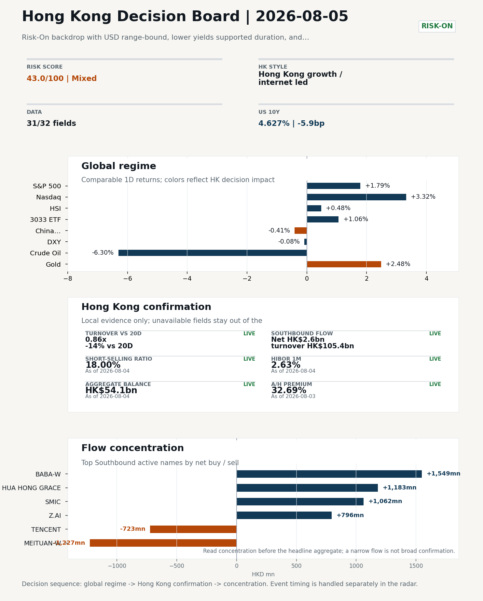
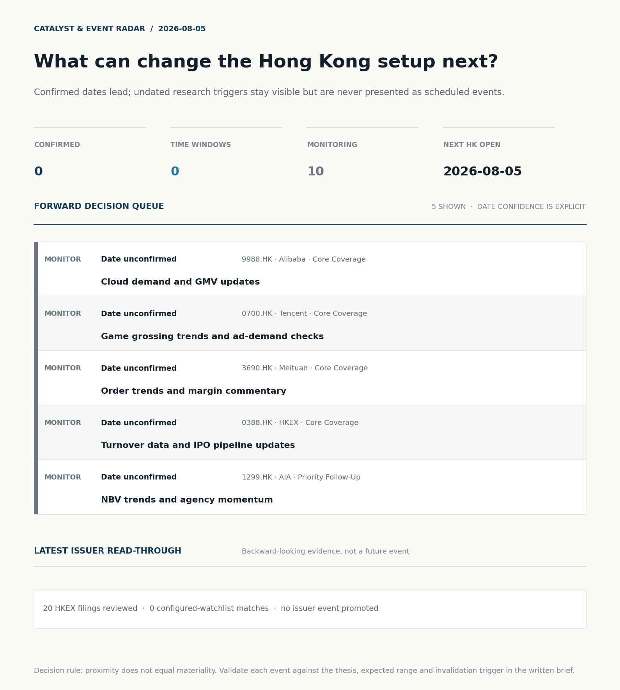
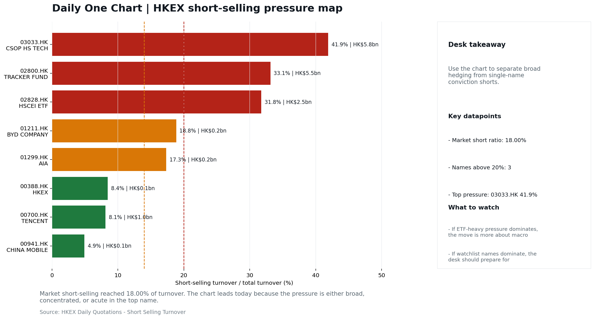
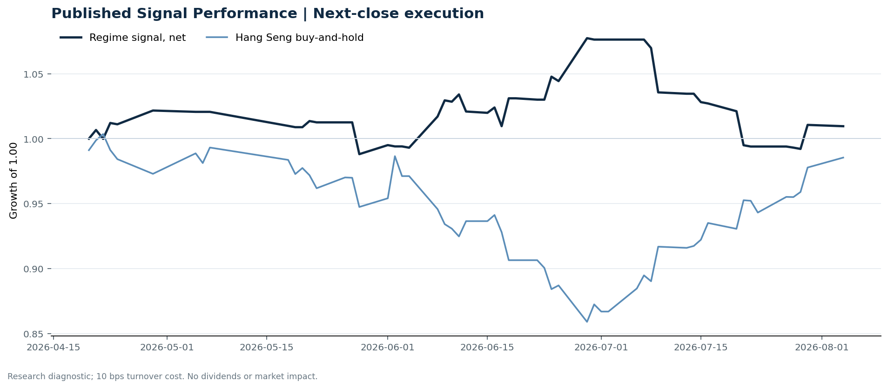

# Morning Research Workbench | 2026-08-05

> **Commute reading route:** `5-minute decision scan` → `25-30 minute deep read` → `10-15 minute optional appendix`
>
> Mode: `Trading Daily` | Keep the report execution-oriented: what mattered in the completed session, what can move Hong Kong leadership, and what needs fast follow-up.

_Data through: global `2026-08-04` | HK/China `2026-08-04` | Market effective `2026-08-04` | Generated `2026-08-05 06:22:47`_

## Executive Summary

- **Market pulse:** Overnight risk-on (Nasdaq 100 +3.32%, lower yields) meets a cautious Hong Kong tape with turnover at 0.86x the 20-day average and short-selling at 18%, so the open is constructive.
- **Hong Kong lens:** Hong Kong growth / internet led.
- **What would confirm it:** Watch whether CSI 300 and A-share tech indices align with the offshore growth rotation; confirm that the short-selling ratio retreats from 18% and that southbound net buying.
- **What could break it:** A reversal in US yields or the dollar, a failure of Hang Seng TECH leadership to broaden with volume, or a further rise in the short-selling ratio above 18%.

## Visual Dashboard

**Catalyst & Event Radar**

**Chart read:** No confirmed event date is populated; 10 undated research trigger(s) remain visible without invented timing.

_Source: Public calendars, issuer disclosures and configured research watchlists_
## Layer 1 | Scan (5 min)

### 1.2 Global Asset Price Dashboard
_Decision-useful subset: each row states the implication and the next test. Descriptive secondary monitors are kept out of the five-minute scan._

| Signal | Last / move | Interpretation | Confirmation / invalidation |
| --- | --- | --- | --- |
| S&P 500 | 7,736.52 / **+1.79%** | US beta improved, raising the global risk floor for Hong Kong. | Confirm with Nasdaq breadth and a same-direction VIX move; invalidate if offshore-China proxies diverge. |
| Nasdaq 100 | 29,733.16 / **+3.32%** | Growth outperformed broad beta, a supportive style signal for Hong Kong internet and platform names. | Confirm through the 3033.HK ETF versus HSI leadership; higher US yields would weaken the read. |
| Hang Seng Index | 26,009.40 / +0.48% | Hong Kong broad beta strengthened, but local flow must confirm whether the move is investable. | Confirm with Southbound participation and breadth; invalidate if USD/CNH weakens while turnover fades. |
| Hang Seng TECH ETF (3033.HK) | 4.7800 / +1.06% | Hong Kong growth led broad beta, improving the platform/internet style signal. | Confirm with stable CNH, Southbound buying and lower yields; invalidate on growth underperformance with rising yields. |
| US 10Y | 4.6270% / -5.9bp | The yield proxy fell, easing the valuation headwind for duration-sensitive equities. | Confirm through Nasdaq and 3033.HK ETF relative performance; invalidate if growth leads despite the opposing rate move. |
| China 10Y | 1.71% / -0.4bp | Lower local yields may reflect easing support or softer demand; the signal is ambiguous without growth confirmation. | Use CSI 300, copper and official credit/activity data to separate growth optimism from demand weakness. |
| DXY | 99.88 / -0.08% | A softer dollar eases an external-liquidity headwind for Hong Kong risk assets. CNH did not confirm the relief, so the liquidity signal is incomplete. | Confirm with USD/CNH moving in the same risk direction; divergence reduces conviction. |
| USD/CNH | 6.7285 / +0.00% | CNH was stable, removing an immediate FX impulse but not confirming equity direction. | Confirm with FXI, the 3033.HK ETF proxy and Southbound flow; invalidate if equities move opposite to FX with strong local participation. |
| VIX | 16.50 / **+4.04%** | Higher implied volatility raises the tail-risk premium and weakens risk-on conviction. | Confirm with equity breadth and credit-sensitive assets; invalidate if lower VIX accompanies narrow or falling equities. |

_Secondary monitors retained in the source bundle: CSI 300, CN-US 10Y spread, USD/HKD, Brent crude, COMEX gold, Copper._

### 1.3 Hong Kong Key Data Quick Check

| Check | Value | Status | Source / as of | Why it matters |
| --- | --- | --- | --- | --- |
| Main Board turnover vs 20D | 0.86x \| -14% vs 20D | Live local | HKEX \| 2026-08-04 | Trailing 20-session average turnover was HK$301.2bn. |
| Southbound / Northbound net flow | Southbound Net HK$2.6bn \| turnover HK$105.4bn \| Northbound Turnover HK$296.4bn \| net not reported | Live local | HKEX Connect \| 2026-08-04 | Southbound net buy is calculated from HKEX disclosed buy and sell turnover. |
| Short-selling ratio | 18.00% | Live local | HKEX \| 2026-08-04 | Official HKEX stock-level short-selling table, aggregated as a share of total market turnover. |
| AH premium index | 32.69% | Live public | Yahoo \| 2026-08-03 | Simple average across 17 A/H pairs; use dispersion rather than the average alone. |
| USD/HKD spot vs band | 7.8423 \| band 7.7500 to 7.8500 | Live quote + local | Yahoo \| 2026-08-04 | Inside the linked-exchange band without immediate boundary stress. Official Convertibility Undertakings define the linked-rate stress boundaries for USD/HKD. |
| HIBOR 1M | 2.63% | Live local | HKMA \| 2026-08-04 | 1M HIBOR is the cleanest quick read for Hong Kong funding conditions and equity-duration pressure. |
| Hong Kong leadership | Hong Kong growth / internet led | Proxy | HSI / HSCEI / 3033.HK ETF relative \| 2026-08-04 | Use HSI / HSCEI / 3033.HK ETF relative moves as the opening style read. |

### 1.4 Decision Board
**Composite risk score:** `43.0/100` | **Regime:** `Mixed`

| Component | Score impact | Evidence |
| --- | --- | --- |
| US beta | +10 | S&P 500 +1.79% |
| HK growth ETF proxy | +5.3 | 3033.HK ETF +1.06% |
| Offshore China proxy | -2.0 | FXI -0.41% |
| Dollar pressure | +0.8 | DXY -0.08% |

**Morning Checklist**

1. **WTI crude -6.30%**
 High-frequency data | Softer oil argues for a more cautious cyclical-growth read.
2. **Risk-On backdrop with USD range-bound, lower yields supported duration, and Bitcoin outperformed Oil**
 Overnight regime | Start by deciding whether the day is about Risk-On conditions or a style pivot.
3. **VIX +4.04%**
 High-frequency data | Higher volatility argues for tighter sizing and tighter stops.
4. **Gold +2.48%**
 High-frequency data | A firm gold price suggests hedge demand or lower real yields.

## Layer 2 | Deep Read (20-30 min)

### 2.1 Overnight Overseas Market Review
**Market Setup**
**Core tape.** Risk-On backdrop with USD range-bound, lower yields supported duration, and Bitcoin outperformed Oil

**Hong Kong Read-Through**
**Desk lens.** Hong Kong growth / internet led.
- **Cross-market read:** Hang Seng +0.48% / HSCEI +0.46% / 3033.HK ETF +1.06%.
- **Cross-market read:** Offshore China proxy FXI -0.41% and USD/CNH +0.00% frame cross-border risk appetite.
- **Cross-market read:** USD/HKD last traded around 7.8423, which keeps the Hong Kong funding lens in focus.

**Watch Points**
- USD composite moved lower by -0.00pct intraday, with a 0.177pct range.
- Main turning points appeared around 2026-08-04 08:05 trough / 2026-08-04 08:20 trough / 2026-08-04 08:35 trough, suggesting event-driven repricing.
- The biggest cross-asset divergence was Bitcoin versus Oil, a spread of 8.153pct.
- Gold moved +0.63pct intraday with a 1.368pct high-low range.

### 2.2 Hong Kong / A-share Previous-Day Review
**Local Tape Setup**
**Local read.** The overnight session signaled risk-on with the Nasdaq 100 +3.32%, yet the FXI China proxy slipped -0.41%, introducing a cross-market tension.
**Verification point.** Locally, the Hang Seng TECH ETF (3033.HK) rose 1.06% and outperformed the HSCEI (+0.46%) and HSI (+0.48%), suggesting a growth-led tone.
**Risk to watch.** Southbound Connect recorded net buying of HK$2.6bn, but it was concentrated in select names and Northbound net-buy data is not available, leaving the A-share flow picture incomplete.

**Style and Local Leadership**
**Style leadership.** Hong Kong growth / internet led.
- **Cross-market read:** Hang Seng +0.48% / HSCEI +0.46% / 3033.HK ETF +1.06%.
- **Cross-market read:** Offshore China proxy FXI -0.41% and USD/CNH +0.00% frame cross-border risk appetite.
- **Cross-market read:** USD/HKD last traded around 7.8423, which keeps the Hong Kong funding lens in focus.

**Flow Confirmation**
Official Stock Connect evidence is available; use Section 2.3 to confirm whether local money supports the price action.

**Follow-Through Checklist**
**Follow-through check.** Watch whether CSI 300 and A-share tech indices align with the offshore growth rotation; confirm that the short-selling ratio retreats from 18% and that southbound net buying broadens to larger-cap internet and consumption names.

### 2.3 Flow Tracker and Attribution
**Cross-Asset Attribution**

| Driver | Direction | Score | Evidence | HK implication |
| --- | --- | --- | --- | --- |
| Oil and geopolitics | supportive | 4.7 | Oil moved -5.87%. | Split the read between energy/cyclicals support and margin/geopolitical pressure. |
| US growth-style transmission | supportive | 4.65 | Nasdaq 100 moved +3.32%. | Hong Kong growth and platform names should be tested first at the open. |
| Short-selling pressure | drag | 2.1 | HKEX short-selling ratio was 18.00%. | Elevated short activity argues for extra confirmation before chasing rebounds. |
| Global equity beta | supportive | 1.79 | S&P 500 moved +1.79%. | Broad beta matters if Hong Kong breadth confirms the overseas signal. |
| Hong Kong participation | drag | 1.44 | Main Board turnover was 0.86x the 20-session average. | Thin turnover makes index moves easier to fade. |
| Rates impulse | supportive | 0.89 | US 10Y yield moved -5.9bp. | Lower yields help long-duration growth; higher yields pressure valuation-sensitive |

**Local Flow Tracker**

**Flow Takeaways**
- Short-selling pressure is elevated, so local rebounds need cleaner breadth and flow confirmation.
- Stock Connect Southbound: net HK$2.6bn on turnover HK$105.4bn (as of 2026-08-04).
- Stock Connect Northbound: turnover RMB296.4bn; public file provides total turnover/top active names, not full net-buy.
- AH premium: simple covered-pair average +32.69%; widest premium: China Communications Construction 88.01%.

**Stock Connect Southbound Active Names**

| Rank | Ticker | Name | Buy | Sell | Net buy |
| --- | --- | --- | --- | --- | --- |
| 1 | 09988.HK | BABA-W | HK$5,391.7mn | HK$3,842.5mn | HK$1,549.2mn |
| 7 | 03690.HK | MEITUAN-W | HK$713.3mn | HK$1,940.2mn | HK$-1,226.9mn |
| 5 | 01347.HK | HUA HONG GRACE | HK$2,438.7mn | HK$1,255.8mn | HK$1,182.9mn |
| 2 | 00981.HK | SMIC | HK$3,316.7mn | HK$2,255.0mn | HK$1,061.7mn |
| 3 | 02513.HK | Z.AI | HK$3,431.5mn | HK$2,635.9mn | HK$795.7mn |

**AH Premium Dispersion**

| Name | A ticker | H ticker | Premium | As of |
| --- | --- | --- | --- | --- |
| China Communications Construction | 601800.SS | 1800.HK | +88.01% | 2026-08-03 |
| China Railway Construction | 601186.SS | 1186.HK | +56.95% | 2026-08-03 |
| China Life | 601628.SS | 2628.HK | +54.12% | 2026-08-03 |
| China Railway | 601390.SS | 0390.HK | +51.58% | 2026-08-03 |
| Sinopec | 600028.SS | 0386.HK | +39.75% | 2026-08-03 |

**HKEX Short-Selling Watch**

| Ticker | Name | Short ratio | Short turnover | Total turnover |
| --- | --- | --- | --- | --- |
| 00388.HK | HKEX | 8.45% | HK$0.1bn | HK$1.5bn |
| 00700.HK | TENCENT | 8.12% | HK$1.0bn | HK$12.1bn |
| 00941.HK | CHINA MOBILE | 4.91% | HK$0.1bn | HK$1.3bn |
| 01211.HK | BYD COMPANY | 18.84% | HK$0.2bn | HK$1.3bn |
| 01299.HK | AIA | 17.33% | HK$0.2bn | HK$1.4bn |

- **Short-value leaders:** 03033.HK CSOP HS TECH (HK$5.8bn); 02800.HK TRACKER FUND (HK$5.5bn); 07709.HK XL2CSOPHYNIX (HK$4.8bn); 09988.HK BABA-W (HK$2.5bn).

### 2.4 Macro and Policy Tracking
**Desk read.** Use the calendar table and released data below as the primary macro read.

The macro calendar was light for this run.

**Positioning and Risk Backdrop**

- Detailed local flow evidence is covered in Section 2.3; keep this section focused on options, hedging, and macro-positioning risk.

### 2.5 Company Catalysts and Risk Monitor

| Grade | Sector | Headline | Why it matters | Horizon |
| --- | --- | --- | --- | --- |
| B | China Internet | Stocks making the biggest moves premarket | Assess whether the story can propagate through the China Internet value | Monitor |

**Company Event Takeaway**
**Desk read.** The 4 August session drove China Internet leadership higher in a risk-on tone.
**Why it matters.** No earnings beats/misses or rating changes broke during the day.
**Follow-up.** Multiple small/mid-cap profit warnings (CROCODILE, RAYMOND IND, SKYWORTH GROUP, etc.) were filed, but all remain headline-only with no parsed profit bridge, so no EPS impact can be deduced.

**LLM Quick Takes**
- **9988.HK** | Alibaba rallied +7.0% amid reports that DeepSeek's pricing undercuts global peers, sharpening BABA's AI price-competitiveness story.
- **0700.HK** | Tencent climbed +3.2% despite mixed AI spending commentary. Its recent digital heritage game launch and broader AI monetization narrative likely provided support.

Decision filter<h4>No immediate portfolio catalyst: 20 official filings were screened and the low-signal market set stays aggregated.</h4>
20 profit warnings

<strong>20</strong>Official filings

<strong>0</strong>Watchlist hits

<strong>0</strong>Actionable events

<strong>No event cleared the portfolio decision filter.</strong>

Broad-market filings remain traceable in the source appendix; they are not expanded here without a watchlist, estimate or liquidity read-through.

<strong>Coverage boundary.</strong> Earnings calendar, sell-side rating changes, IPO / grey-market monitor were not decision-grade in this run; their absence is not treated as confirmation that no event exists.

### 2.6 Today's Core Names
**Core coverage**

| Name | Ticker | Last | 1D | Range position | Morning note |
| --- | --- | --- | --- | --- | --- |
| Alibaba | 9988.HK | 125.20 | +7.01% | Mid-range | Short-term price strength is clear; fresh catalysts could trigger broader group follow-through. |
| Tencent | 0700.HK | 490.40 | +3.20% | Top of range | Short-term price strength is clear; fresh catalysts could trigger broader group follow-through. |

**Recent headlines for Alibaba:**
- [DeepSeek Matched Gemini 3.6 Flash at 3 Cents Per Benchmark Test. Alibaba (BABA) Is Turning Alphabet's (GOOGL) China Problem Into a Price War](https://finance.yahoo.com/technology/ai/articles/deepseek-matched-gemini-3-6-132651313.html) (Insider Monkey)
**Recent headlines for Tencent:**
- [Tencent (SEHK:700) Stock May Be Undervalued Despite Fresh AI Spending Questions](https://finance.yahoo.com/markets/stocks/articles/tencent-sehk-700-stock-may-170839116.html) (Simply Wall St.)

**Priority follow-up**

| Name | Ticker | Last | 1D | Range position | Morning note |
| --- | --- | --- | --- | --- | --- |
| AIA | 1299.HK | 78.55 | -0.88% | Mid-range | Positioning is neutral for now, so use it mainly to monitor marginal information changes. |
| BYD Company | 1211.HK | 94.90 | +0.80% | Top of range | The name sits near the top of its recent range, so watch for profit-taking under high expectations. |

## Layer 3 | Decision Deepening (10-15 min)

### 3.1 Rotating Theme Deep Dive

| Field | Read |
| --- | --- |
| Theme | Innovative Biotech and Out-Licensing |
| Angle for the day | Watch whether clinical data, approvals, and licensing momentum are still supporting the innovative-healthcare rerating story. |

**Theme desk read**
**Core thesis.** The Innovative Biotech and Out-Licensing theme remains a watchlist-versus-positioning question rather than an active trade today.
**Evidence.** The macro mix is mixed for the cohort: a Risk-On backdrop with USD range-bound and lower yields is mechanically supportive of long-duration biotech equities, while the same session printed WTI -6.30% and VIX +4.04%.
**What to test.** Gold +2.48% adds a faint hedge-bid flavor that can sit alongside biotech as a partial risk-offset within a barbell, but it is not a direct theme driver.

**Signals to keep in mind**
- WTI crude -6.30%: Softer oil argues for a more cautious cyclical-growth read.
- VIX +4.04%: Higher volatility argues for tighter sizing and tighter stops.

**LLM watch items:**
- Verify the desk's actual HK-listed innovative biotech and out-licensing coverage list, since the supplied related names (9988.HK, 1299.HK) do not
- Track whether the Risk-On, lower-yield tape persists into 2026-08-05; a yield backup would undercut the duration tailwind for biotech equities.
- Monitor VIX (closed +4.04%) for follow-through; a continued rise would justify the tighter sizing read across long-duration names.
- Watch for fresh licensing-deal announcements or clinical/regulatory catalysts specific to the innovative biotech cohort, as none are flagged in the
- Flag whether the WTI -6.30% move is energy-specific or a broader cyclical-growth warning

**Related names to keep close:**

| Name | Ticker | Bucket | Morning read |
| --- | --- | --- | --- |
| Alibaba | 9988.HK | Core coverage | Short-term price strength is clear; fresh catalysts could trigger broader group follow-through. |
| AIA | 1299.HK | Priority follow-up | Positioning is neutral for now, so use it mainly to monitor marginal information changes. |

### 3.2 Today Ahead and Trading Calendar
- The calendar is relatively light, so the market may trade more off positioning and overnight headlines.

**Same-day macro docket**
No same-day macro items were scheduled.

**Same-day catalyst list**
No same-day catalysts were highlighted.

**Next few sessions**
No forward catalyst list was populated.

### 3.3 Daily One Chart
**Daily One Chart | HKEX short-selling pressure map**

**Chart read.** Market short-selling reached 18.00% of turnover.
**Why it matters.** The chart leads today because the pressure is either broad, concentrated, or acute in the top name.

_Source: HKEX Daily Quotations - Short Selling Turnover_

## Optional Appendix | Traceability and Performance (10-15 min)

### Report Metadata
> Date policy: Review date 2026-08-04 is treated as `Trading Daily`. | Global request date is 2026-08-04; adapter effective date is 2026-08-04 and summary date is 2026-08-04. | HK/China local data date is 2026-08-04; role: same-session local cash tape.
> Market data quality: Coverage: `31/32` | Missing: `1`
> Report quality: `87.6/100` | Grade `B` | Status `production ready`

### Key Questions to Keep in Mind
- Is risk appetite rising or fading? The overnight tape reads closer to `Risk-On`.
- Did rates expectations move? Focus on whether US 10Y, DXY, and growth style moved together.
- Were commodities the real story? Watch WTI and gold for geopolitics versus inflation signals.
- Is Hong Kong setup growth-led, SOE-led, or broad beta-led? Compare the 3033.HK ETF proxy, HSCEI, and HSI.
- Did offshore markets move China risk appetite? Focus on HSI, FXI, USD/CNH, and USD/HKD.

### Report Quality and Validation
- **Quality score:** 87.6/100 | **Grade:** B | **Status:** production ready
- **Run summary:** 7 healthy | 1 caveat | 2 failed
- **Release recommendation:** Send with caveats | The report is usable, but the advisory guidance should travel with it so readers understand the data gaps.

| Source | Status | Bucket |
| --- | --- | --- |
| Market data | ok | healthy |
| Sector and company news | ok | healthy |
| Movers and short selling | ok | healthy |
| Stock Connect | ok | healthy |
| A/H premium | ok | healthy |
| Hong Kong local package | ok | healthy |
| China rates | ok | healthy |
| Macro calendar | unavailable | failed |
| Risk and sentiment feed | unavailable | failed |
| Narrative overlay | partial | caveat |

**Desk-use guidance summary:** 0 blocking | 1 advisory

**Desk-use guidance**
- **Advisory:** Use deterministic sections as primary support; the narrative overlay was partial or unavailable on this run.

| Component | Score | Weight | Read |
| --- | --- | --- | --- |
| Market data coverage | 96.9 | 0.2 | 31/32 core market fields available. |
| Hong Kong local metrics | 82.3 | 0.2 | 8 live, 3 proxy, 0 unavailable local checks. |
| Key public adapters | 100.0 | 0.2 | 4/4 key adapters were available or partially available. |
| Narrative overlay health | 47.9 | 0.1 | 2/7 narrative overlay tasks succeeded or used validated cache; 2 error(s). |
| Fact-check guardrail | 100.0 | 0.15 | Checked 19 numeric claims; 0 numeric mismatch(es), 0 logic warning(s); 0 structured claims, 0 source/text warning(s). |
| Source provenance | 92.0 | 0.05 | 42 provenance record(s) validated; 2 unavailable source record(s). |
| Source health and freshness | 73.1 | 0.1 | 8 healthy, 0 degraded, 2 unavailable source group(s). |

**Quality warnings**
- Narrative overlay health is weak: 2/7 narrative overlay tasks succeeded or used validated cache; 2 error(s).

**Narrative fact-check guardrail**
- Checked 19 numeric claims; 0 numeric mismatch(es), 0 logic warning(s); 0 structured claims, 0 source/text warning(s); 0 critical, 0 review.

**Source provenance validation**
- Status: ok | records checked: 42 | unavailable: 2

**Source health and freshness**
- **Source health:** degraded | 8 healthy | 0 degraded | 2 unavailable

| Source | Critical | Status | Score | Fresh coverage | Age range | Policy |
| --- | --- | --- | --- | --- | --- | --- |
| hk_local | Yes | healthy | 98.5 | 1/1 | 1 - 1d | ≤4d / ≥100% |
| macro_calendar | No | unavailable | 0.0 | 0/0 | Unknown | ≤14d / ≥0% |
| market_data | Yes | healthy | 93.0 | 31/31 | 1 - 2d | ≤4d / ≥80% |
| risk_feed | No | unavailable | 0.0 | 0/0 | Unknown | ≤4d / ≥0% |

**Adapter status**

| Adapter | Status |
| --- | --- |
| Stock Connect | ok |
| A/H premium | ok |
| HKEX announcements | ok |
| China rates | ok |

### Historical Signal Performance
- **Readiness:** exploratory with caveats | 65 market observations | 72 active signal dates
- **Execution rule:** use only the next available close after publication; 10 bps turnover cost by default. Current-day signals never receive same-day returns.
- **Interpretation boundary:** results are exploratory until a benchmark reaches 252 sessions and 100 active-signal sessions.

| Benchmark | Sessions | Signal net | Buy & hold | Excess | Max drawdown | Hit rate |
| --- | --- | --- | --- | --- | --- | --- |
| Hang Seng Index | 56 | 1.0% | -1.5% | 2.4% | -7.9% | 48.1% |
| Hang Seng TECH ETF (3033.HK) | 55 | -2.1% | -4.3% | 2.1% | -13.3% | 48.1% |

**Hang Seng event-horizon diagnostics**

| Horizon | Resolved | Hit rate | Average net return |
| --- | --- | --- | --- |
| 1 sessions | 33 | 51.5% | 0.1% |
| 5 sessions | 30 | 56.7% | -0.0% |
| 20 sessions | 24 | 41.7% | -1.1% |

- **Data-quality caveat:** 17 conflicting historical price revision(s) and 6 weekend pseudo-session observation(s) were handled explicitly; inspect the ledger before relying on the result.
- **Use boundary:** this is a close-to-close research diagnostic, not an executable strategy or investment recommendation; dividends, financing, borrow and market impact are excluded.

### Source Links
- [Stocks making the biggest moves premarket: Alibaba, Bristol-Myers Squibb, eBay & more](https://www.cnbc.com/2026/08/03/stocks-making-the-biggest-moves-premarket-baba-azn-ebay-more.html) (cnbc_markets)
- [DeepSeek Matched Gemini 3.6 Flash at 3 Cents Per Benchmark Test. Alibaba (BABA) Is Turning Alphabet's (GOOGL) China Problem Into a Price War](https://finance.yahoo.com/technology/ai/articles/deepseek-matched-gemini-3-6-132651313.html) (Insider Monkey)
- [Tencent (SEHK:700) Stock May Be Undervalued Despite Fresh AI Spending Questions](https://finance.yahoo.com/markets/stocks/articles/tencent-sehk-700-stock-may-170839116.html) (Simply Wall St.)
- [Tencent (SEHK:700) Launches Digital Jingdezhen To Bring Porcelain Heritage Into Gaming](https://finance.yahoo.com/technology/ai/articles/tencent-sehk-700-launches-digital-160958283.html) (Simply Wall St.)
- [00122.HK Profit warning / alert announcement](http://www1.hkexnews.hk/listedco/listconews/sehk/2026/0804/2026080401893.pdf) (HKEXnews)
- [00229.HK Profit warning / alert announcement](http://www1.hkexnews.hk/listedco/listconews/sehk/2026/0804/2026080303407.pdf) (HKEXnews)
- [00245.HK Profit warning / alert announcement](http://www1.hkexnews.hk/listedco/listconews/sehk/2026/0804/2026080401812.pdf) (HKEXnews)
- [00314.HK Profit warning / alert announcement](http://www1.hkexnews.hk/listedco/listconews/sehk/2026/0804/2026080402255.pdf) (HKEXnews)
- [00346.HK Profit warning / alert announcement](http://www1.hkexnews.hk/listedco/listconews/sehk/2026/0804/2026080401847.pdf) (HKEXnews)
- [00396.HK Profit warning / alert announcement](http://www1.hkexnews.hk/listedco/listconews/sehk/2026/0804/2026080401490.pdf) (HKEXnews)
- [00420.HK Profit warning / alert announcement](http://www1.hkexnews.hk/listedco/listconews/sehk/2026/0804/2026080400874.pdf) (HKEXnews)
- [00751.HK Profit warning / alert announcement](http://www1.hkexnews.hk/listedco/listconews/sehk/2026/0804/2026080401158.pdf) (HKEXnews)

## Supplementary Visual Appendix

This appendix is professional-path only. It keeps a traceable index of the report visuals and the deterministic chart cues used to frame the morning note, without injecting the legacy intraday chart pack.

### Visual Index

| Visual | Path | Role |
| --- | --- | --- |
| Visual Dashboard | `charts/dashboard_2026-08-05.png` | Cross-asset regime board and Hong Kong local tape snapshot. |
| Catalyst & Event Radar | `charts/catalyst_radar_2026-08-05.png` | Confirmed dates, time windows, undated monitors, and recent issuer read-through. |
| Daily One Chart | `charts/daily_one_chart_2026-08-05.png` | Single highest-conviction visual story for the day. |

### Deterministic Chart Cues
- FX / liquidity: USD composite moved lower by -0.00pct intraday, with a 0.177pct range.
- FX / liquidity: Main turning points appeared around 2026-08-04 08:05 trough / 2026-08-04 08:20 trough / 2026-08-04 08:35 trough, suggesting event-driven repricing rather than a clean one-way USD move.
- Cross-asset: The biggest cross-asset divergence was Bitcoin versus Oil, a spread of 8.153pct.
- Cross-asset: Gold moved +0.63pct intraday with a 1.368pct high-low range.
- Cross-asset: Oil moved -7.19pct intraday with a 8.778pct high-low range.
- Cross-asset: Bitcoin moved +0.96pct intraday with a 1.654pct high-low range.

### Risk Dashboard Components

| Component | Score impact | Evidence |
| --- | --- | --- |
| US beta | +10 | S&P 500 +1.79% |
| HK growth ETF proxy | +5.3 | 3033.HK ETF +1.06% |
| Offshore China proxy | -2.0 | FXI -0.41% |
| Dollar pressure | +0.8 | DXY -0.08% |
| Volatility | -8.1 | VIX +4.04% |
| HK short-selling | -8 | Short-selling ratio 18.00% |
