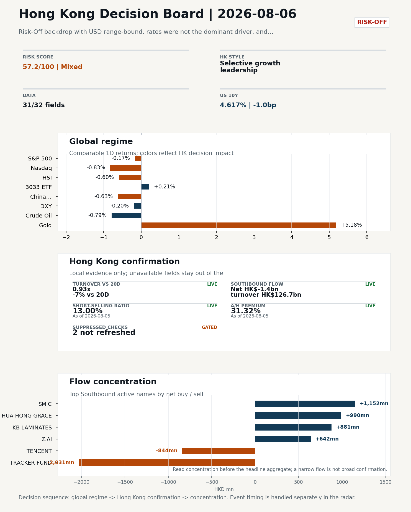
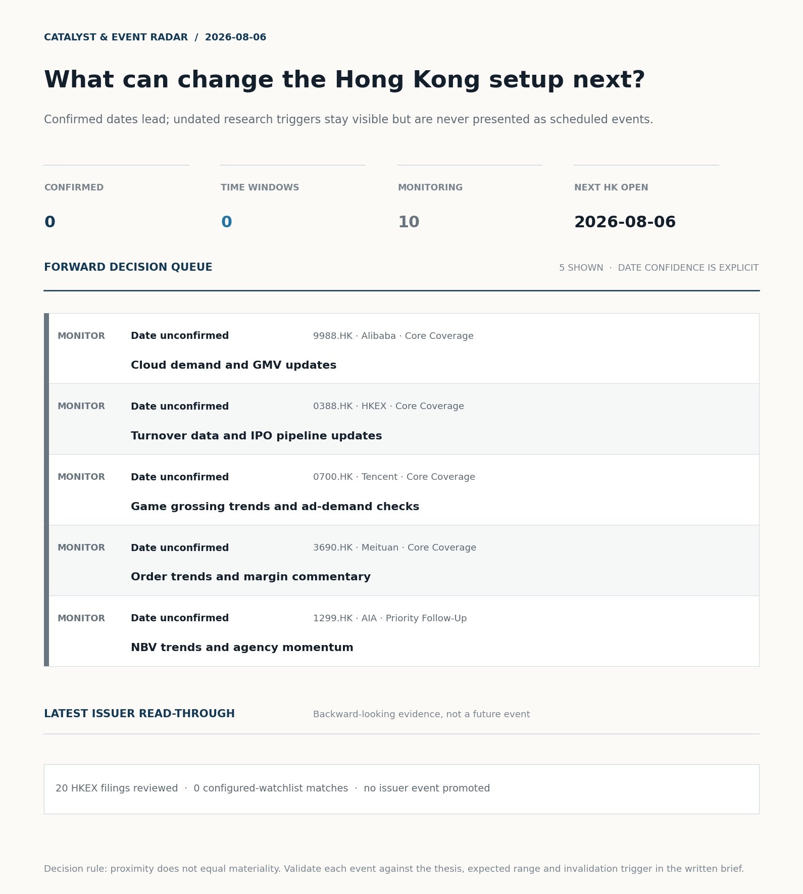
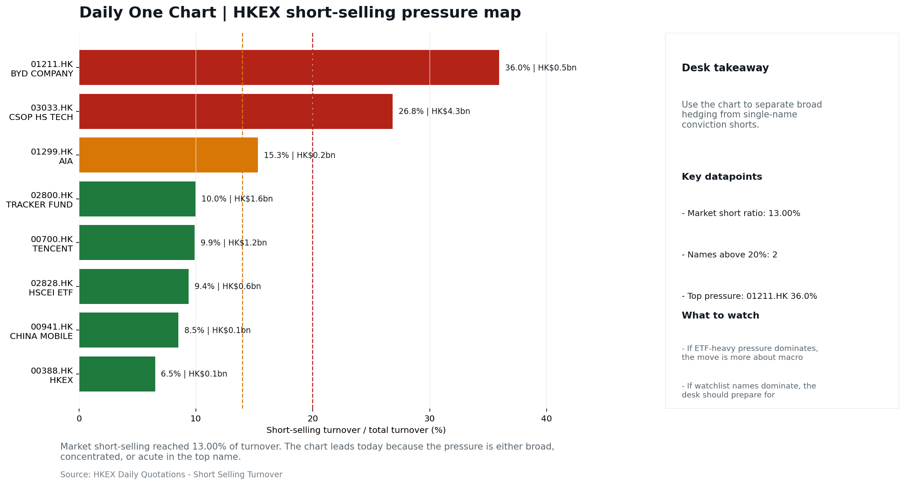
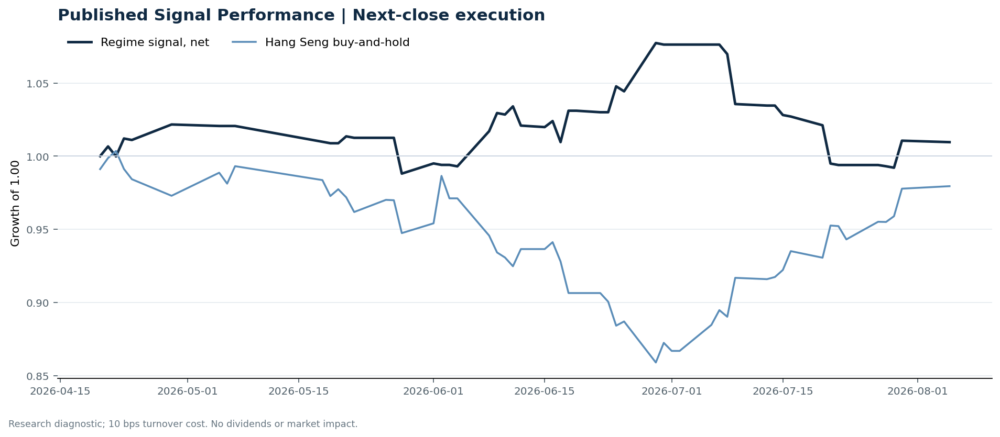

# Morning Research Workbench | 2026-08-06

> **Commute reading route:** `5-minute decision scan` → `25-30 minute deep read` → `10-15 minute optional appendix`
>
> Mode: `Trading Daily` | Keep the report execution-oriented: what mattered in the completed session, what can move Hong Kong leadership, and what needs fast follow-up.

_Data through: global `2026-08-05` | HK/China `2026-08-05` | Market effective `2026-08-05` | Generated `2026-08-06 06:21:33`_

## Executive Summary

- **Market pulse:** Risk-Off backdrop with USD range-bound, rates were not the dominant driver, and Gold outperformed Oil
- **Hong Kong lens:** Selective growth leadership: 3033.HK moved +0.21% and beat HSCEI by +1.11pp and HSI by +0.81pp. Conviction is limited because Southbound recorded -HK$1.4bn net selling. Favor relative strength in internet/platform names, but do not treat the move as broad China risk-on until participation confirms.
- **Opening implication:** Expect Hong Kong to open with the same selective-growth bias: favor relative strength in internet/platform names but do not read it as broad China risk-on.
- **What would confirm it:** Confirm if 3033.HK keeps outperforming HSCEI with at least normal turnover, broader Southbound buying, stable CNH, and easing short pressure.
- **What could break it:** Invalidate if 3033.HK loses its lead to HSCEI, or if weak turnover, rising shorts, and CNH depreciation persist together.

## Visual Dashboard

**Catalyst & Event Radar**

**Chart read:** No confirmed event date is populated; 10 undated research trigger(s) remain visible without invented timing.

_Source: Public calendars, issuer disclosures and configured research watchlists_
## Layer 1 | Scan (5 min)

### 1.2 Global Asset Price Dashboard
_Decision-useful subset: each row states the implication and the next test. Descriptive secondary monitors are kept out of the five-minute scan._

| Signal | Last / move | Interpretation | Confirmation / invalidation |
| --- | --- | --- | --- |
| S&P 500 | 7,723.55 / -0.17% | US beta weakened, reducing the external risk cushion for Hong Kong. | Confirm with Nasdaq breadth and a same-direction VIX move; invalidate if offshore-China proxies diverge. |
| Nasdaq 100 | 29,487.79 / -0.83% | Growth lagged broad beta, warning that headline risk-on may not transmit cleanly to the 3033.HK ETF proxy. | Confirm through the 3033.HK ETF versus HSI leadership; higher US yields would weaken the read. |
| Hang Seng Index | 25,852.92 / -0.60% | Hong Kong broad beta weakened and needs offshore or policy support to stabilize. | Confirm with Southbound participation and breadth; invalidate if USD/CNH weakens while turnover fades. |
| Hang Seng TECH ETF (3033.HK) | 4.7900 / +0.21% | Hong Kong growth led broad beta, improving the platform/internet style signal. | Confirm with stable CNH, Southbound buying and lower yields; invalidate on growth underperformance with rising yields. |
| US 10Y | 4.6170% / -1.0bp | The yield proxy fell, easing the valuation headwind for duration-sensitive equities. | Confirm through Nasdaq and 3033.HK ETF relative performance; invalidate if growth leads despite the opposing rate move. |
| China 10Y | 1.71% / +0.1bp | Higher local yields may indicate firmer growth or tighter financial conditions; price action alone cannot distinguish them. | Use CSI 300, copper and official credit/activity data to separate growth optimism from demand weakness. |
| DXY | 99.69 / -0.20% | A softer dollar eases an external-liquidity headwind for Hong Kong risk assets. CNH did not confirm the relief, so the liquidity signal is incomplete. | Confirm with USD/CNH moving in the same risk direction; divergence reduces conviction. |
| USD/CNH | 6.7295 / +0.00% | CNH was stable, removing an immediate FX impulse but not confirming equity direction. | Confirm with FXI, the 3033.HK ETF proxy and Southbound flow; invalidate if equities move opposite to FX with strong local participation. |
| VIX | 15.81 / **-4.18%** | Lower implied volatility reduces near-term stress, but is supportive only if equity breadth confirms. | Confirm with equity breadth and credit-sensitive assets; invalidate if lower VIX accompanies narrow or falling equities. |

_Secondary monitors retained in the source bundle: CSI 300, CN-US 10Y spread, USD/HKD, Brent crude, COMEX gold, Copper._

### 1.3 Hong Kong Key Data Quick Check
_Coverage gate: 1 unavailable local checks are suppressed here and retained in validation metadata._

| Check | Value | Status | Source / as of | Why it matters |
| --- | --- | --- | --- | --- |
| Main Board turnover vs 20D | 0.93x \| -7% vs 20D | Live local | HKEX \| 2026-08-05 | Trailing 20-session average turnover was HK$298.1bn. |
| Southbound / Northbound net flow | Southbound Net HK$-1.4bn \| turnover HK$126.7bn \| Northbound Turnover HK$351.7bn \| net not reported | Live local | HKEX Connect \| 2026-08-05 | Southbound net buy is calculated from HKEX disclosed buy and sell turnover. |
| Short-selling ratio | 13.00% | Live local | HKEX \| 2026-08-05 | Official HKEX stock-level short-selling table, aggregated as a share of total market turnover. |
| AH premium index | 31.32% | Live public | Yahoo \| 2026-08-05 | Simple average across 16 A/H pairs; use dispersion rather than the average alone. |
| USD/HKD spot vs band | 7.8436 | Live quote | Yahoo \| 2026-08-05 | Inside the linked-exchange band without immediate boundary stress. |
| Hong Kong leadership | Selective growth leadership | Proxy | HSI / HSCEI / 3033.HK ETF relative \| 2026-08-05 | Use HSI / HSCEI / 3033.HK ETF relative moves as the opening style read. |

### 1.4 Decision Board
**Composite risk score:** `57.2/100` | **Regime:** `Mixed`

| Component | Score impact | Evidence |
| --- | --- | --- |
| US beta | -1.0 | S&P 500 -0.17% |
| HK growth ETF proxy | +1.1 | 3033.HK ETF +0.21% |
| Offshore China proxy | -3.1 | FXI -0.63% |
| Dollar pressure | +2.0 | DXY -0.20% |

**Morning Checklist**

1. **Risk-Off backdrop with USD range-bound, rates were not the dominant driver, and Gold outperformed Oil**
 Overnight regime | Start by deciding whether the day is about Risk-Off conditions or a style pivot.
2. **Gold +5.18%**
 High-frequency data | A firm gold price suggests hedge demand or lower real yields.
3. **VIX -4.18%**
 High-frequency data | Lower volatility signals easing stress in the tape.
4. **Copper +1.93%**
 High-frequency data | Keep tracking it to confirm whether the core daily narrative is holding.

## Layer 2 | Deep Read (20-30 min)

### 2.1 Overnight Overseas Market Review
**Market Setup**
**Core tape.** Overseas session was a textbook risk-off tape with a US growth-style lead: Nasdaq 100 fell 0.83% while the S&P 500 was only modestly lower at -0.17%, and Euro Stoxx 50 diverged positively at +0.94%.
**Main driver.** Rates were not the driver (UST 10Y -1.0bp) and USD stayed range-bound (DXY -0.20%, USD/CNH flat), so the cross-asset story sat in commodities: Gold rallied +5.18% against Oil at -0.79%, a clear hedge/real-yield bid.
**HK relevance.** VIX fell -4.18% despite the equity drawdown, suggesting the move was orderly repositioning rather than stress.

**Key Drivers**
- US growth-style transmission was the dominant driver per attribution_v1, with Nasdaq 100 -0.83% pulling the tape while broader S&P 500 was.
- Rates were not the catalyst: UST 10Y eased only -1.0bp and the dollar stayed range-bound, removing the usual 'yields down, growth up'.
- Gold outperformed Oil by ~6pp (Gold +5.18% vs Oil -0.79%), pointing to hedge demand and easing real-yield pressure rather than.
- VIX -4.18% during an equity decline indicates orderly de-risking/rotation, not a panic bid - consistent with the 'Mixed' risk dashboard.

**Hong Kong Read-Through**
**Desk lens.** Selective growth leadership.
**Evidence.** 3033.HK moved +0.21% and beat HSCEI by +1.11pp and HSI by +0.81pp
**Investment read.** Favor relative strength in internet/platform names, but do not treat the move as broad China risk-on until participation confirms.
**Opening implication.** Expect Hong Kong to open with the same selective-growth bias.
- **Cross-market read:** Hang Seng -0.60% / HSCEI -0.90% / 3033.HK ETF +0.21%.
- **Cross-market read:** Offshore China proxy FXI -0.63% and USD/CNH +0.00% frame cross-border risk appetite.
- **Cross-market read:** USD/HKD last traded around 7.8436, which keeps the Hong Kong funding lens in focus.

**Watch Points**
- USD composite moved lower by -0.01pct intraday, with a 0.146pct range.
- Main turning points appeared around 2026-08-05 08:05 trough / 2026-08-05 08:20 trough / 2026-08-05 08:35 trough, suggesting event-driven repricing.
- The biggest cross-asset divergence was Gold versus Oil, a spread of 1.964pct.
- Gold moved +2.71pct intraday with a 3.177pct high-low range.

### 2.2 Hong Kong / A-share Previous-Day Review
**Style and Local Leadership**
**Style call.** Selective growth leadership.
- **Evidence:** 3033.HK moved +0.21% and beat HSCEI by +1.11pp and HSI by +0.81pp
- **Portfolio meaning:** Favor relative strength in internet/platform names, but do not treat the move as broad China risk-on until participation confirms.
- **Cross-market read:** Hang Seng -0.60% / HSCEI -0.90% / 3033.HK ETF +0.21%.
- **Cross-market read:** Offshore China proxy FXI -0.63% and USD/CNH +0.00% frame cross-border risk appetite.
- **Cross-market read:** USD/HKD last traded around 7.8436, which keeps the Hong Kong funding lens in focus.

**Flow Confirmation**
Official Stock Connect evidence is available; use Section 2.3 to confirm whether local money supports the price action.

**Follow-Through Checklist**
**Follow-through check.** Confirm if 3033.HK keeps outperforming HSCEI with at least normal turnover, broader Southbound buying, stable CNH, and easing short pressure.
**Failure condition.** Invalidate if 3033.HK loses its lead to HSCEI, or if weak turnover, rising shorts, and CNH depreciation persist together.

### 2.3 Flow Tracker and Attribution
**Cross-Asset Attribution**

| Driver | Direction | Score | Evidence | HK implication |
| --- | --- | --- | --- | --- |
| US growth-style transmission | drag | 1.16 | Nasdaq 100 moved -0.83%. | Hong Kong growth and platform names should be tested first at the open. |

**Local Flow Tracker**

**Flow Takeaways**
- Local flow evidence is not yet strong enough to override the cross-asset setup.
- Stock Connect Southbound: net HK$-1.4bn on turnover HK$126.7bn (as of 2026-08-05).
- Stock Connect Northbound: turnover RMB351.7bn; public file provides total turnover/top active names, not full net-buy.
- AH premium: simple covered-pair average +31.32%; widest premium: China Communications Construction 83.22%.

**Stock Connect Southbound Active Names**

| Rank | Ticker | Name | Buy | Sell | Net buy |
| --- | --- | --- | --- | --- | --- |
| 9 | 02800.HK | TRACKER FUND | HK$0.8mn | HK$2,032.0mn | HK$-2,031.3mn |
| 5 | 00981.HK | SMIC | HK$3,162.4mn | HK$2,010.3mn | HK$1,152.1mn |
| 6 | 01347.HK | HUA HONG GRACE | HK$2,609.9mn | HK$1,619.5mn | HK$990.4mn |
| 2 | 01888.HK | KB LAMINATES | HK$3,978.3mn | HK$3,097.2mn | HK$881.0mn |
| 1 | 00700.HK | TENCENT | HK$2,621.5mn | HK$3,465.6mn | HK$-844.2mn |

**AH Premium Dispersion**

| Name | A ticker | H ticker | Premium | As of |
| --- | --- | --- | --- | --- |
| China Communications Construction | 601800.SS | 1800.HK | +83.22% | 2026-08-05 |
| China Railway Construction | 601186.SS | 1186.HK | +54.36% | 2026-08-05 |
| China Life | 601628.SS | 2628.HK | +50.95% | 2026-08-05 |
| China Railway | 601390.SS | 0390.HK | +47.65% | 2026-08-05 |
| Sinopec | 600028.SS | 0386.HK | +33.66% | 2026-08-05 |

**HKEX Short-Selling Watch**

| Ticker | Name | Short ratio | Short turnover | Total turnover |
| --- | --- | --- | --- | --- |
| 00388.HK | HKEX | 6.50% | HK$0.1bn | HK$2.0bn |
| 00700.HK | TENCENT | 9.90% | HK$1.2bn | HK$12.6bn |
| 00941.HK | CHINA MOBILE | 8.50% | HK$0.1bn | HK$0.7bn |
| 01211.HK | BYD COMPANY | 35.96% | HK$0.5bn | HK$1.5bn |
| 01299.HK | AIA | 15.31% | HK$0.2bn | HK$1.4bn |

- **Short-value leaders:** 03033.HK CSOP HS TECH (HK$4.3bn); 07709.HK XL2CSOPHYNIX (HK$2.3bn); 09988.HK BABA-W (HK$2.0bn); 02800.HK TRACKER FUND (HK$1.6bn).

### 2.4 Macro and Policy Tracking
**Desk read.** Use the calendar table and released data below as the primary macro read.

The macro calendar was light for this run.

**Positioning and Risk Backdrop**

- Detailed local flow evidence is covered in Section 2.3; keep this section focused on options, hedging, and macro-positioning risk.

### 2.5 Company Catalysts and Risk Monitor

| Grade | Sector | Headline | Why it matters | Horizon |
| --- | --- | --- | --- | --- |
| B | China Internet | Stocks making the biggest moves premarket | Assess whether the story can propagate through the China Internet value | Monitor |

Decision filter<h4>No immediate portfolio catalyst: 20 official filings were screened and the low-signal market set stays aggregated.</h4>
20 profit warnings

<strong>20</strong>Official filings

<strong>0</strong>Watchlist hits

<strong>0</strong>Actionable events

<strong>No event cleared the portfolio decision filter.</strong>

Broad-market filings remain traceable in the source appendix; they are not expanded here without a watchlist, estimate or liquidity read-through.

<strong>Coverage boundary.</strong> Earnings calendar, sell-side rating changes, IPO / grey-market monitor were not decision-grade in this run; their absence is not treated as confirmation that no event exists.

### 2.6 Today's Core Names
**Core coverage**

| Name | Ticker | Last | 1D | Range position | Morning note |
| --- | --- | --- | --- | --- | --- |
| Alibaba | 9988.HK | 128.10 | +1.83% | Top of range | The name sits near the top of its recent range, so watch for profit-taking under high expectations. |
| HKEX | 0388.HK | 414.60 | +1.62% | Top of range | The name sits near the top of its recent range, so watch for profit-taking under high expectations. |

**Recent headlines for Alibaba:**
- [Qwen3.8-Max: The Capability War Begins - Alibaba Matches US Closed-Model Pricing on Eve of Open-Weights Drop](https://finance.yahoo.com/technology/ai/articles/qwen3-8-max-capability-war-162320284.html) (Forkast News)

**Priority follow-up**

| Name | Ticker | Last | 1D | Range position | Morning note |
| --- | --- | --- | --- | --- | --- |
| AIA | 1299.HK | 77.75 | -0.38% | Mid-range | Positioning is neutral for now, so use it mainly to monitor marginal information changes. |
| BYD Company | 1211.HK | 93.80 | +0.37% | Mid-range | Positioning is neutral for now, so use it mainly to monitor marginal information changes. |

## Layer 3 | Decision Deepening (10-15 min)

### 3.1 Rotating Theme Deep Dive

| Field | Read |
| --- | --- |
| Theme | China Exports and Supply-Chain Relocation |
| Angle for the day | Track tariffs, trade policy, shipping, and manufacturing orders to see whether export resilience is still the cleaner China macro expression. |

**Theme desk read**
**Core thesis.** The rotating weekly theme remains China Exports and Supply-Chain Relocation, where the working angle is whether tariffs, shipping, and manufacturing orders still make export resilience the cleaner China macro expression.
**Evidence.** Today's session is an awkward tape for that question: the Risk-Off backdrop arrived with USD range-bound and rates not the dominant driver.
**What to test.** Copper +1.93% and Bitcoin +0.92% lean modestly the other way, and WTI -0.79% kept Gold ahead of Oil on the session.

**Signals to keep in mind**
- Gold +5.18%: A firm gold price suggests hedge demand or lower real yields.
- VIX -4.18%: Lower volatility signals easing stress in the tape.

**LLM watch items:**
- Tariff, trade-policy, and shipping-rate headlines - not in the supplied set today, so first confirmation of the export-resilience angle has to come
- BYD (1211.HK) weekly sales and model-rollout cadence for marginal read on EV export mix; specific catalyst date not supplied.
- China Mobile (0941.HK) capex and dividend-policy signals given the top-of-range position; specific catalyst date not supplied.
- Whether Gold's +5.18% move holds into the next session - a reversal would undercut the hedge-demand read that is currently anchoring the Risk-Off
- Copper follow-through after +1.93% to test whether the commodities tape is consistent with the stated risk regime.

**Related names to keep close:**

| Name | Ticker | Bucket | Morning read |
| --- | --- | --- | --- |
| BYD Company | 1211.HK | Priority follow-up | Positioning is neutral for now, so use it mainly to monitor marginal information changes. |
| China Mobile | 0941.HK | Priority follow-up | The name sits near the top of its recent range, so watch for profit-taking under high expectations. |

### 3.2 Today Ahead and Trading Calendar
- The calendar is relatively light, so the market may trade more off positioning and overnight headlines.

**Same-day macro docket**
No same-day macro items were scheduled.

**Same-day catalyst list**
No same-day catalysts were highlighted.

**Next few sessions**
No forward catalyst list was populated.

### 3.3 Daily One Chart
**Daily One Chart | HKEX short-selling pressure map**

**Chart read.** Market short-selling reached 13.00% of turnover.
**Why it matters.** The chart leads today because the pressure is either broad, concentrated, or acute in the top name.

_Source: HKEX Daily Quotations - Short Selling Turnover_

## Optional Appendix | Traceability and Performance (10-15 min)

### Report Metadata
> Date policy: Review date 2026-08-05 is treated as `Trading Daily`. | Global request date is 2026-08-05; adapter effective date is 2026-08-05 and summary date is 2026-08-05. | HK/China local data date is 2026-08-05; role: same-session local cash tape.
> Market data quality: Coverage: `31/32` | Missing: `1`
> Report quality: `77.5/100` | Grade `C` | Status `manual review`

### Key Questions to Keep in Mind
- Is risk appetite rising or fading? The overnight tape reads closer to `Risk-Off`.
- Did rates expectations move? Focus on whether US 10Y, DXY, and growth style moved together.
- Were commodities the real story? Watch WTI and gold for geopolitics versus inflation signals.
- Is Hong Kong setup growth-led, SOE-led, or broad beta-led? Compare the 3033.HK ETF proxy, HSCEI, and HSI.
- Did offshore markets move China risk appetite? Focus on HSI, FXI, USD/CNH, and USD/HKD.

### Report Quality and Validation
- **Quality score:** 77.5/100 | **Grade:** C | **Status:** manual review
- **Run summary:** 7 healthy | 1 caveat | 2 failed
- **Release recommendation:** Manual review | Fact validation produced a release-blocking error; automatic distribution is blocked.

| Source | Status | Bucket |
| --- | --- | --- |
| Market data | ok | healthy |
| Sector and company news | ok | healthy |
| Movers and short selling | ok | healthy |
| Stock Connect | ok | healthy |
| A/H premium | ok | healthy |
| Hong Kong local package | ok | healthy |
| China rates | ok | healthy |
| Macro calendar | unavailable | failed |
| Risk and sentiment feed | unavailable | failed |
| Narrative overlay | partial | caveat |

**Desk-use guidance summary:** 1 blocking | 1 advisory

**Desk-use guidance**
- **Blocking:** Fact validation has a release-blocking finding; review it before distribution.
- **Advisory:** Use deterministic sections as primary support; the narrative overlay was partial or unavailable on this run.

| Component | Score | Weight | Read |
| --- | --- | --- | --- |
| Market data coverage | 96.9 | 0.2 | 31/32 core market fields available. |
| Hong Kong local metrics | 54.1 | 0.2 | 5 live, 3 proxy, 3 unavailable local checks. |
| Key public adapters | 100.0 | 0.2 | 4/4 key adapters were available or partially available. |
| Narrative overlay health | 42.1 | 0.1 | 2/7 narrative overlay tasks succeeded or used validated cache; 3 error(s). |
| Fact-check guardrail | 75.0 | 0.15 | Checked 22 numeric claims; 1 numeric mismatch(es), 0 logic warning(s); 0 structured claims, 0 source/text warning(s). |
| Source provenance | 92.0 | 0.05 | 42 provenance record(s) validated; 2 unavailable source record(s). |
| Source health and freshness | 73.1 | 0.1 | 8 healthy, 0 degraded, 2 unavailable source group(s). |

**Quality warnings**
- Hong Kong local metrics is weak: 5 live, 3 proxy, 3 unavailable local checks.
- Narrative overlay health is weak: 2/7 narrative overlay tasks succeeded or used validated cache; 3 error(s).
- Narrative fact-check guardrail produced warnings; review the validation table before relying on narrative sections.

**Narrative fact-check guardrail**
- Checked 22 numeric claims; 1 numeric mismatch(es), 0 logic warning(s); 0 structured claims, 0 source/text warning(s); 1 critical, 0 review.
- **Deterministic fallback fields:** one_line_market_pulse, tasks.final_framing.one_line_market_pulse, tasks.overnight_review.paragraph

| Severity | Field | Claim | Type | Claimed | Expected | Snippet |
| --- | --- | --- | --- | --- | --- | --- |
| critical | deep_read_setup | Nasdaq 100 | change_pct | 0.83 | -0.83 | xtbook risk-off tape with a US growth-style lead: Nasdaq 100 fell 0.83% while the S&P 500 was only modestly lower at -0.1 |

**Source provenance validation**
- Status: ok | records checked: 42 | unavailable: 2

**Source health and freshness**
- **Source health:** degraded | 8 healthy | 0 degraded | 2 unavailable

| Source | Critical | Status | Score | Fresh coverage | Age range | Policy |
| --- | --- | --- | --- | --- | --- | --- |
| hk_local | Yes | healthy | 98.5 | 1/1 | 1 - 1d | ≤4d / ≥100% |
| macro_calendar | No | unavailable | 0.0 | 0/0 | Unknown | ≤14d / ≥0% |
| market_data | Yes | healthy | 93.0 | 31/31 | 1 - 2d | ≤4d / ≥80% |
| risk_feed | No | unavailable | 0.0 | 0/0 | Unknown | ≤4d / ≥0% |

**Adapter status**

| Adapter | Status |
| --- | --- |
| Stock Connect | ok |
| A/H premium | ok |
| HKEX announcements | ok |
| China rates | ok |

### Historical Signal Performance
- **Readiness:** exploratory with caveats | 65 market observations | 73 active signal dates
- **Execution rule:** use only the next available close after publication; 10 bps turnover cost by default. Current-day signals never receive same-day returns.
- **Interpretation boundary:** results are exploratory until a benchmark reaches 252 sessions and 100 active-signal sessions.

| Benchmark | Sessions | Signal net | Buy & hold | Excess | Max drawdown | Hit rate |
| --- | --- | --- | --- | --- | --- | --- |
| Hang Seng Index | 56 | 1.0% | -2.1% | 3.0% | -7.9% | 48.1% |
| Hang Seng TECH ETF (3033.HK) | 55 | -2.1% | -4.1% | 1.9% | -13.3% | 48.1% |

**Hang Seng event-horizon diagnostics**

| Horizon | Resolved | Hit rate | Average net return |
| --- | --- | --- | --- |
| 1 sessions | 33 | 51.5% | 0.1% |
| 5 sessions | 30 | 56.7% | -0.0% |
| 20 sessions | 24 | 41.7% | -1.1% |

- **Data-quality caveat:** 17 conflicting historical price revision(s) and 6 weekend pseudo-session observation(s) were handled explicitly; inspect the ledger before relying on the result.
- **Use boundary:** this is a close-to-close research diagnostic, not an executable strategy or investment recommendation; dividends, financing, borrow and market impact are excluded.

### Source Links
- [Stocks making the biggest moves premarket: Alibaba, Bristol-Myers Squibb, eBay & more](https://www.cnbc.com/2026/08/03/stocks-making-the-biggest-moves-premarket-baba-azn-ebay-more.html) (cnbc_markets)
- [Qwen3.8-Max: The Capability War Begins - Alibaba Matches US Closed-Model Pricing on Eve of Open-Weights Drop](https://finance.yahoo.com/technology/ai/articles/qwen3-8-max-capability-war-162320284.html) (Forkast News)
- [What New Tesla Vehicle Tests Mean for Alibaba Stock](https://www.barchart.com/story/news/3667871/what-new-tesla-vehicle-tests-mean-for-alibaba-stock) (Barchart)
- [Tencent (SEHK:700) Stock May Be Undervalued Despite Fresh AI Spending Questions](https://finance.yahoo.com/markets/stocks/articles/tencent-sehk-700-stock-may-170839116.html) (Simply Wall St.)
- [Tencent (SEHK:700) Launches Digital Jingdezhen To Bring Porcelain Heritage Into Gaming](https://finance.yahoo.com/technology/ai/articles/tencent-sehk-700-launches-digital-160958283.html) (Simply Wall St.)
- [00032.HK Profit warning / alert announcement](http://www1.hkexnews.hk/listedco/listconews/sehk/2026/0805/2026080501368.pdf) (HKEXnews)
- [00289.HK Profit warning / alert announcement](http://www1.hkexnews.hk/listedco/listconews/sehk/2026/0805/2026080500409.pdf) (HKEXnews)
- [00662.HK Profit warning / alert announcement](http://www1.hkexnews.hk/listedco/listconews/sehk/2026/0805/2026080501442.pdf) (HKEXnews)
- [00701.HK Profit warning / alert announcement](http://www1.hkexnews.hk/listedco/listconews/sehk/2026/0805/2026080500632.pdf) (HKEXnews)
- [00810.HK Profit warning / alert announcement](http://www1.hkexnews.hk/listedco/listconews/sehk/2026/0805/2026080500225.pdf) (HKEXnews)
- [00983.HK Profit warning / alert announcement](http://www1.hkexnews.hk/listedco/listconews/sehk/2026/0805/2026080501380.pdf) (HKEXnews)
- [01114.HK Profit warning / alert announcement](http://www1.hkexnews.hk/listedco/listconews/sehk/2026/0805/2026080500564.pdf) (HKEXnews)
- [01432.HK Profit warning / alert announcement](http://www1.hkexnews.hk/listedco/listconews/sehk/2026/0805/2026080501042.pdf) (HKEXnews)

## Supplementary Visual Appendix

This appendix is professional-path only. It keeps a traceable index of the report visuals and the deterministic chart cues used to frame the morning note, without injecting the legacy intraday chart pack.

### Visual Index

| Visual | Path | Role |
| --- | --- | --- |
| Visual Dashboard | `charts/dashboard_2026-08-06.png` | Cross-asset regime board and Hong Kong local tape snapshot. |
| Catalyst & Event Radar | `charts/catalyst_radar_2026-08-06.png` | Confirmed dates, time windows, undated monitors, and recent issuer read-through. |
| Daily One Chart | `charts/daily_one_chart_2026-08-06.png` | Single highest-conviction visual story for the day. |

### Deterministic Chart Cues
- FX / liquidity: USD composite moved lower by -0.01pct intraday, with a 0.146pct range.
- FX / liquidity: Main turning points appeared around 2026-08-05 08:05 trough / 2026-08-05 08:20 trough / 2026-08-05 08:35 trough, suggesting event-driven repricing rather than a clean one-way USD move.
- Cross-asset: The biggest cross-asset divergence was Gold versus Oil, a spread of 1.964pct.
- Cross-asset: Gold moved +2.71pct intraday with a 3.177pct high-low range.
- Cross-asset: Oil moved +0.75pct intraday with a 2.948pct high-low range.
- Cross-asset: Bitcoin moved +0.97pct intraday with a 1.678pct high-low range.

### Risk Dashboard Components

| Component | Score impact | Evidence |
| --- | --- | --- |
| US beta | -1.0 | S&P 500 -0.17% |
| HK growth ETF proxy | +1.1 | 3033.HK ETF +0.21% |
| Offshore China proxy | -3.1 | FXI -0.63% |
| Dollar pressure | +2.0 | DXY -0.20% |
| Volatility | +8.4 | VIX -4.18% |
| HK short-selling | +0 | Short-selling ratio 13.00% |
