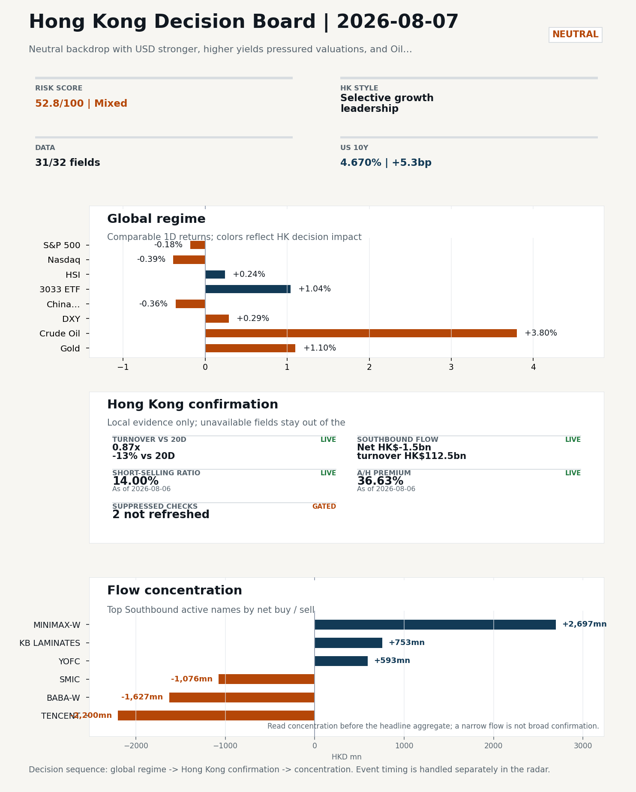
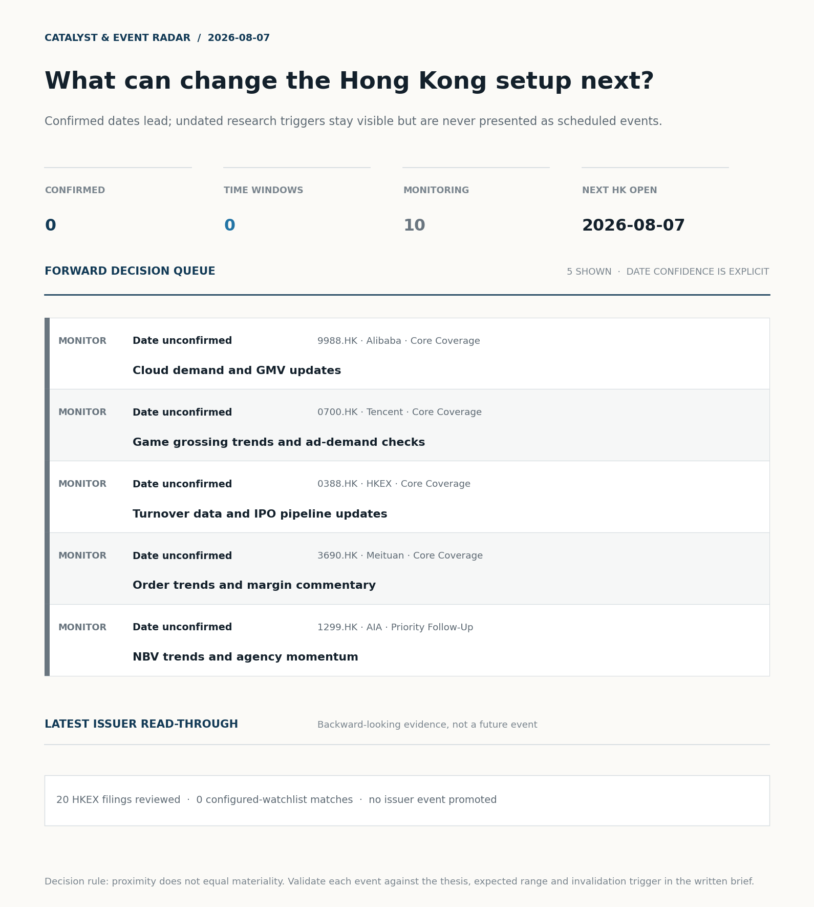
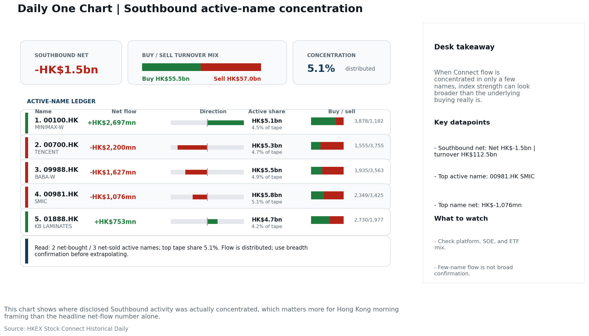
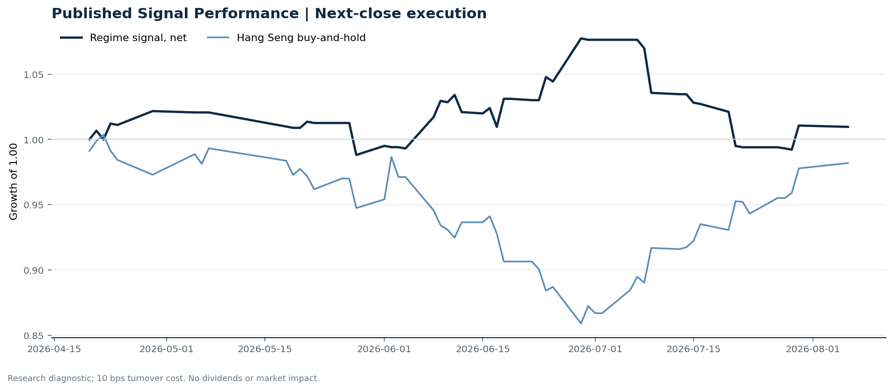

# Morning Research Workbench | 2026-08-07

> **Commute reading route:** `5-minute decision scan` → `25-30 minute deep read` → `10-15 minute optional appendix`
>
> Mode: `Trading Daily` | Keep the report execution-oriented: what mattered in the completed session, what can move Hong Kong leadership, and what needs fast follow-up.

_Data through: global `2026-08-06` | HK/China `2026-08-06` | Market effective `2026-08-06` | Generated `2026-08-07 09:04:02`_

## Executive Summary

- **Market pulse:** Overnight higher US yields and a hawkish Fed signal pressure Hong Kong growth leadership into a thin-volume session with net Southbound selling, making the open a test of conviction rather.
- **Hong Kong lens:** Selective growth leadership: 3033.HK moved +1.04% and beat HSCEI by +0.70pp and HSI by +0.80pp. Conviction is limited because turnover was only 0.87x its 20-day average; Southbound recorded -HK$1.5bn net selling; FXI (-0.36%) lagged HSI (+0.24%). Favor relative strength in internet/platform names, but do not treat the move as broad China risk-on until participation confirms.
- **What would confirm it:** Watch whether CSI 300 and A‑share growth stocks can hold overnight losses and if 3033.HK can extend gains on higher volume, confirming style persistence rather than a one‑day rotation.
- **What could break it:** Invalidate if 3033.HK loses its lead to HSCEI, or if weak turnover, rising shorts, and CNH depreciation persist together.

## Visual Dashboard

**Catalyst & Event Radar**

**Chart read:** No confirmed event date is populated; 10 undated research trigger(s) remain visible without invented timing.

_Source: Public calendars, issuer disclosures and configured research watchlists_
## Layer 1 | Scan (5 min)

### 1.2 Global Asset Price Dashboard
_Decision-useful subset: each row states the implication and the next test. Descriptive secondary monitors are kept out of the five-minute scan._

| Signal | Last / move | Interpretation | Confirmation / invalidation |
| --- | --- | --- | --- |
| S&P 500 | 7,709.96 / -0.18% | US beta weakened, reducing the external risk cushion for Hong Kong. | Confirm with Nasdaq breadth and a same-direction VIX move; invalidate if offshore-China proxies diverge. |
| Nasdaq 100 | 29,373.33 / -0.39% | Growth lagged broad beta, warning that headline risk-on may not transmit cleanly to the 3033.HK ETF proxy. | Confirm through the 3033.HK ETF versus HSI leadership; higher US yields would weaken the read. |
| Hang Seng Index | 25,915.82 / +0.24% | Hong Kong broad beta strengthened, but local flow must confirm whether the move is investable. | Confirm with Southbound participation and breadth; invalidate if USD/CNH weakens while turnover fades. |
| Hang Seng TECH ETF (3033.HK) | 4.8400 / +1.04% | Hong Kong growth led broad beta, improving the platform/internet style signal. | Confirm with stable CNH, Southbound buying and lower yields; invalidate on growth underperformance with rising yields. |
| US 10Y | 4.6700% / +5.3bp | The yield proxy rose, tightening the discount-rate backdrop for long-duration Hong Kong growth. | Confirm through Nasdaq and 3033.HK ETF relative performance; invalidate if growth leads despite the opposing rate move. |
| China 10Y | 1.71% / +0.1bp | Higher local yields may indicate firmer growth or tighter financial conditions; price action alone cannot distinguish them. | Use CSI 300, copper and official credit/activity data to separate growth optimism from demand weakness. |
| DXY | 99.98 / +0.29% | A firmer dollar tightens the external-liquidity backdrop and can pressure offshore-China risk appetite. | Confirm with USD/CNH moving in the same risk direction; divergence reduces conviction. |
| USD/CNH | 6.7310 / +0.00% | CNH was stable, removing an immediate FX impulse but not confirming equity direction. | Confirm with FXI, the 3033.HK ETF proxy and Southbound flow; invalidate if equities move opposite to FX with strong local participation. |
| VIX | 15.15 / **-4.17%** | Lower implied volatility reduces near-term stress, but is supportive only if equity breadth confirms. | Confirm with equity breadth and credit-sensitive assets; invalidate if lower VIX accompanies narrow or falling equities. |

_Secondary monitors retained in the source bundle: CSI 300, CN-US 10Y spread, USD/HKD, Brent crude, COMEX gold, Copper._

### 1.3 Hong Kong Key Data Quick Check
_Coverage gate: 1 unavailable local checks are suppressed here and retained in validation metadata._

| Check | Value | Status | Source / as of | Why it matters |
| --- | --- | --- | --- | --- |
| Main Board turnover vs 20D | 0.87x \| -13% vs 20D | Live local | HKEX \| 2026-08-06 | Trailing 20-session average turnover was HK$293.2bn. |
| Southbound / Northbound net flow | Southbound Net HK$-1.5bn \| turnover HK$112.5bn \| Northbound Turnover HK$326.2bn \| net not reported | Live local | HKEX Connect \| 2026-08-06 | Southbound net buy is calculated from HKEX disclosed buy and sell turnover. |
| Short-selling ratio | 14.00% | Live local | HKEX \| 2026-08-06 | Official HKEX stock-level short-selling table, aggregated as a share of total market turnover. |
| AH premium index | 36.63% | Live public | Yahoo \| 2026-08-06 | Simple average across 17 A/H pairs; use dispersion rather than the average alone. |
| USD/HKD spot vs band | 7.8433 | Live quote | Yahoo \| 2026-08-06 | Inside the linked-exchange band without immediate boundary stress. |
| Hong Kong leadership | Selective growth leadership | Proxy | HSI / HSCEI / 3033.HK ETF relative \| 2026-08-06 | Use HSI / HSCEI / 3033.HK ETF relative moves as the opening style read. |

### 1.4 Decision Board
**Composite risk score:** `52.8/100` | **Regime:** `Mixed`

| Component | Score impact | Evidence |
| --- | --- | --- |
| US beta | -1.1 | S&P 500 -0.18% |
| HK growth ETF proxy | +5.2 | 3033.HK ETF +1.04% |
| Offshore China proxy | -1.8 | FXI -0.36% |
| Dollar pressure | -2.9 | DXY +0.29% |

**Morning Checklist**

1. **Neutral backdrop with USD stronger, higher yields pressured valuations, and Oil outperformed Gold**
 Overnight regime | Start by deciding whether the day is about Neutral conditions or a style pivot.
2. **VIX -4.17%**
 High-frequency data | Lower volatility signals easing stress in the tape.
3. **WTI crude +3.80%**
 High-frequency data | A strong crude move needs to be split between geopolitics and demand repair.
4. **Gold +1.10%**
 High-frequency data | Gold rising with the dollar looks more like geopolitical or pure hedge demand.

## Layer 2 | Deep Read (20-30 min)

### 2.1 Overnight Overseas Market Review
**Market Setup**
**Core tape.** Neutral backdrop with USD stronger, higher yields pressured valuations, and Oil outperformed Gold

**Hong Kong Read-Through**
**Desk lens.** Selective growth leadership.
**Evidence.** 3033.HK moved +1.04% and beat HSCEI by +0.70pp and HSI by +0.80pp
**Investment read.** Favor relative strength in internet/platform names, but do not treat the move as broad China risk-on until participation confirms.
- **Cross-market read:** Hang Seng +0.24% / HSCEI +0.34% / 3033.HK ETF +1.04%.
- **Cross-market read:** Offshore China proxy FXI -0.36% and USD/CNH +0.00% frame cross-border risk appetite.
- **Cross-market read:** USD/HKD last traded around 7.8433, which keeps the Hong Kong funding lens in focus.

**Watch Points**
- USD composite moved higher by +0.23pct intraday, with a 0.259pct range.
- Main turning points appeared around 2026-08-06 08:15 peak / 2026-08-06 08:35 trough / 2026-08-06 08:50 trough, suggesting event-driven repricing.
- The biggest cross-asset divergence was Oil versus Gold, a spread of 4.528pct.
- Gold moved -0.30pct intraday with a 1.397pct high-low range.

**Curated overnight stories**
1. **Fed Governor Cook says she's 'prepared to act' on rate hike to address inflation**
 Why it matters: An on-the-record willingness to hike, not just hold, raises the upper tail of the Fed distribution and pressures the USD/yields complex.
 HK read-through: Direct read-through to HK rates, USD/HKD, and offshore-China equity multiples; growth/tech and high-duration names most exposed.
2. **Copper jumps to its highest level ever. What the metal is telling us**
 Why it matters: Record copper is a real-economy signal often read as a proxy for Chinese industrial demand and electrification capex.
 HK read-through: Supports HK-listed materials, miners, and EV/grid supply chain names; reinforces the 'oil/commodities outperform gold' theme flagged for today.
3. **Situational Awareness hedge fund meltdown was a warning shot for leveraged markets, BofA**
 Why it matters: Senior banker commentary flagging crowded/leveraged positioning argues for caution on pro-risk trades despite a -4% VIX tape.
 HK read-through: Risk-management cue for HK fund managers running long/short or ADR-mirror books; supports a defensive tilt within an otherwise Neutral regime.
4. **Traders on Kalshi now think it's likely that the S&P 500 will hit 8,000 in 2026**
 Why it matters: Prediction-market-implied path sits well above current levels and reflects heavy speculative optimism that can act as a contrarian tell.
 HK read-through: Sets the tone for HK opens vs. US close; useful context for whether global risk appetite will carry through to Hong Kong names.

### 2.2 Hong Kong / A-share Previous-Day Review
**Local Tape Setup**
**Local read.** Hong Kong saw a growth-led session with the Hang Seng TECH ETF (3033.HK) up 1.04% while the HSCEI rose only 0.34% and the Hang Seng Index added 0.24%.
**Verification point.** However, local Main Board turnover was just 0.87x the 20‑day average and Southbound net selling reached HK$1.5bn, indicating low institutional conviction behind the move.
**Risk to watch.** Offshore China proxies weakened, with FXI down 0.36%, pointing to a cautious A‑share open.

**Style and Local Leadership**
**Style call.** Selective growth leadership.
- **Evidence:** 3033.HK moved +1.04% and beat HSCEI by +0.70pp and HSI by +0.80pp
- **Portfolio meaning:** Favor relative strength in internet/platform names, but do not treat the move as broad China risk-on until participation confirms.
- **Cross-market read:** Hang Seng +0.24% / HSCEI +0.34% / 3033.HK ETF +1.04%.
- **Cross-market read:** Offshore China proxy FXI -0.36% and USD/CNH +0.00% frame cross-border risk appetite.
- **Cross-market read:** USD/HKD last traded around 7.8433, which keeps the Hong Kong funding lens in focus.

**Flow Confirmation**
Official Stock Connect evidence is available; use Section 2.3 to confirm whether local money supports the price action.

**Follow-Through Checklist**
**Follow-through check.** Watch whether CSI 300 and A‑share growth stocks can hold overnight losses and if 3033.HK can extend gains on higher volume, confirming style persistence rather than a one‑day rotation.
**Failure condition.** Invalidate if 3033.HK loses its lead to HSCEI, or if weak turnover, rising shorts, and CNH depreciation persist together.

### 2.3 Flow Tracker and Attribution
**Cross-Asset Attribution**

| Driver | Direction | Score | Evidence | HK implication |
| --- | --- | --- | --- | --- |
| Hong Kong participation | drag | 1.29 | Main Board turnover was 0.87x the 20-session average. | Thin turnover makes index moves easier to fade. |
| Rates impulse | drag | 0.79 | US 10Y yield moved +5.3bp. | Lower yields help long-duration growth; higher yields pressure valuation-sensitive |
| Dollar / CNH pressure | drag | 0.43 | DXY +0.29% / USD-CNH +0.00% | A stable or softer CNH makes Hong Kong follow-through more credible. |

**Local Flow Tracker**

**Flow Takeaways**
- Turnover is light versus the 20-session baseline, so local moves have weaker conviction.
- Stock Connect Southbound: net HK$-1.5bn on turnover HK$112.5bn (as of 2026-08-06).
- Stock Connect Northbound: turnover RMB326.2bn; public file provides total turnover/top active names, not full net-buy.
- AH premium: simple covered-pair average +36.63%; widest premium: Chalco 140.91%.

**Stock Connect Southbound Active Names**

| Rank | Ticker | Name | Buy | Sell | Net buy |
| --- | --- | --- | --- | --- | --- |
| 2 | 00100.HK | MINIMAX-W | HK$3,878.5mn | HK$1,181.6mn | HK$2,696.9mn |
| 3 | 00700.HK | TENCENT | HK$1,554.8mn | HK$3,754.7mn | HK$-2,199.9mn |
| 2 | 09988.HK | BABA-W | HK$1,935.0mn | HK$3,562.5mn | HK$-1,627.5mn |
| 1 | 00981.HK | SMIC | HK$2,348.6mn | HK$3,424.8mn | HK$-1,076.3mn |
| 3 | 01888.HK | KB LAMINATES | HK$2,730.5mn | HK$1,977.2mn | HK$753.2mn |

**AH Premium Dispersion**

| Name | A ticker | H ticker | Premium | As of |
| --- | --- | --- | --- | --- |
| Chalco | 601600.SS | 2600.HK | +140.91% | 2026-08-06 |
| China Railway Construction | 601186.SS | 1186.HK | +55.43% | 2026-08-06 |
| China Communications Construction | 601800.SS | 1800.HK | +53.42% | 2026-08-06 |
| China Life | 601628.SS | 2628.HK | +52.64% | 2026-08-06 |
| China Railway | 601390.SS | 0390.HK | +48.42% | 2026-08-06 |

**HKEX Short-Selling Watch**

| Ticker | Name | Short ratio | Short turnover | Total turnover |
| --- | --- | --- | --- | --- |
| 00388.HK | HKEX | 9.88% | HK$0.2bn | HK$1.8bn |
| 00700.HK | TENCENT | 9.31% | HK$1.0bn | HK$10.5bn |
| 00941.HK | CHINA MOBILE | 8.30% | HK$0.0bn | HK$0.5bn |
| 01211.HK | BYD COMPANY | 24.82% | HK$0.5bn | HK$2.2bn |
| 01299.HK | AIA | 15.87% | HK$1.1bn | HK$7.0bn |

- **Short-value leaders:** 07709.HK XL2CSOPHYNIX (HK$4.0bn); 03750.HK CATL (HK$1.1bn); 01299.HK AIA (HK$1.1bn); 01810.HK XIAOMI-W (HK$1.1bn).

### 2.4 Macro and Policy Tracking
**Desk read.** Use the calendar table and released data below as the primary macro read.

The macro calendar was light for this run.

**Positioning and Risk Backdrop**

- Detailed local flow evidence is covered in Section 2.3; keep this section focused on options, hedging, and macro-positioning risk.

### 2.5 Company Catalysts and Risk Monitor
No high-conviction sector story cleared the main-report relevance gate for this run.

Decision filter<h4>No immediate portfolio catalyst: 20 official filings were screened and the low-signal market set stays aggregated.</h4>
20 profit warnings

<strong>20</strong>Official filings

<strong>0</strong>Watchlist hits

<strong>0</strong>Actionable events

<strong>No event cleared the portfolio decision filter.</strong>

Broad-market filings remain traceable in the source appendix; they are not expanded here without a watchlist, estimate or liquidity read-through.

<strong>Coverage boundary.</strong> Earnings calendar, sell-side rating changes, IPO / grey-market monitor were not decision-grade in this run; their absence is not treated as confirmation that no event exists.

### 2.6 Today's Core Names
**Core coverage**

| Name | Ticker | Last | 1D | Range position | Morning note |
| --- | --- | --- | --- | --- | --- |
| Alibaba | 9988.HK | 124.40 | -2.89% | Mid-range | Short-term pressure is visible; check for a fundamental or regulatory reason. |
| Tencent | 0700.HK | 479.20 | -2.64% | Top of range | Short-term pressure is visible; check for a fundamental or regulatory reason. |

**Recent headlines for Alibaba:**
- [Alibaba's Qwen3.8-Max Launch: What BABA vs. BIDU Means for Investors](https://finance.yahoo.com/technology/ai/articles/alibaba-qwen3-8-max-launch-215920332.html) (Insider Monkey)
**Recent headlines for Tencent:**
- [Tencent (SEHK:700) Stock May Be Undervalued Despite Fresh AI Spending Questions](https://finance.yahoo.com/markets/stocks/articles/tencent-sehk-700-stock-may-170839116.html) (Simply Wall St.)

**Priority follow-up**

| Name | Ticker | Last | 1D | Range position | Morning note |
| --- | --- | --- | --- | --- | --- |
| AIA | 1299.HK | 73.15 | -5.92% | Bottom of range | Short-term pressure is visible; check for a fundamental or regulatory reason. |
| BYD Company | 1211.HK | 89.85 | -4.21% | Mid-range | Short-term pressure is visible; check for a fundamental or regulatory reason. |

## Layer 3 | Decision Deepening (10-15 min)

### 3.1 Rotating Theme Deep Dive

| Field | Read |
| --- | --- |
| Theme | Hong Kong Market Structure and Flows |
| Angle for the day | Focus on turnover, Stock Connect, ETF flows, HKEX activity, and style leadership to understand whether Hong Kong is being driven by fundamentals or positioning. |

**Theme desk read**
**Core thesis.** The Hong Kong Market Structure and Flows lens stays relevant today because the overnight tape is split, not clean: VIX down 4.17% argues for easing stress and a friendlier tape for turnover-sensitive names.
**Evidence.** In that mixed backdrop, the cleanest read comes from the market-structure proxies themselves.
**What to test.** HKEX (0388.HK) closed at 410.0, -1.11%, and sits at the 77.6% range position, so a pullback near the top of the recent range is consistent with profit-taking rather than flow deterioration.

**Signals to keep in mind**
- VIX -4.17%: Lower volatility signals easing stress in the tape.
- WTI crude +3.80%: A strong crude move needs to be split between geopolitics and demand repair.

**LLM watch items:**
- HKEX turnover composition split (southbound vs local retail vs IPO-related) to test whether the -1.11% pullback at 77.6% range position is
- US 10Y direction after +5.3bp to 4.67%: any further grind pressures long-duration and growth names on the Hong Kong list, while a fade would relieve
- Decompose the WTI +3.80% move into geopolitics vs demand repair to interpret correctly for HK energy/transport sensitivity versus a generic risk-off
- BYD weekly sales data and any model rollout news to determine whether -4.21% on the day is name-specific, regulatory, or sector-wide
- Gold +1.10% alongside a stronger USD - confirm whether this is hedging/geopolitical demand or the start of a regime shift, since the former tends to

**Related names to keep close:**

| Name | Ticker | Bucket | Morning read |
| --- | --- | --- | --- |
| HKEX | 0388.HK | Core coverage | The name sits near the top of its recent range, so watch for profit-taking under high expectations. |
| BYD Company | 1211.HK | Priority follow-up | Short-term pressure is visible; check for a fundamental or regulatory reason. |

### 3.2 Today Ahead and Trading Calendar
- The calendar is relatively light, so the market may trade more off positioning and overnight headlines.

**Same-day macro docket**
No same-day macro items were scheduled.

**Same-day catalyst list**
No same-day catalysts were highlighted.

**Next few sessions**
No forward catalyst list was populated.

### 3.3 Daily One Chart
**Daily One Chart | Southbound active-name concentration**

**Chart read.** This chart shows where disclosed Southbound activity was actually concentrated, which matters more for Hong Kong morning framing than the headline net-flow number alone.

_Source: HKEX Stock Connect Historical Daily_

## Optional Appendix | Traceability and Performance (10-15 min)

### Report Metadata
> Date policy: Review date 2026-08-06 is treated as `Trading Daily`. | Global request date is 2026-08-06; adapter effective date is 2026-08-06 and summary date is 2026-08-06. | HK/China local data date is 2026-08-06; role: same-session local cash tape.
> Market data quality: Coverage: `31/32` | Missing: `1`
> Report quality: `74.3/100` | Grade `C` | Status `manual review`

### Key Questions to Keep in Mind
- Is risk appetite rising or fading? The overnight tape reads closer to `Neutral`.
- Did rates expectations move? Focus on whether US 10Y, DXY, and growth style moved together.
- Were commodities the real story? Watch WTI and gold for geopolitics versus inflation signals.
- Is Hong Kong setup growth-led, SOE-led, or broad beta-led? Compare the 3033.HK ETF proxy, HSCEI, and HSI.
- Did offshore markets move China risk appetite? Focus on HSI, FXI, USD/CNH, and USD/HKD.

### Report Quality and Validation
- **Quality score:** 74.3/100 | **Grade:** C | **Status:** manual review
- **Run summary:** 7 healthy | 1 caveat | 2 failed
- **Release recommendation:** Manual review | Fact validation produced a release-blocking error; automatic distribution is blocked.

| Source | Status | Bucket |
| --- | --- | --- |
| Market data | ok | healthy |
| Sector and company news | ok | healthy |
| Movers and short selling | ok | healthy |
| Stock Connect | ok | healthy |
| A/H premium | ok | healthy |
| Hong Kong local package | ok | healthy |
| China rates | ok | healthy |
| Macro calendar | unavailable | failed |
| Risk and sentiment feed | unavailable | failed |
| Narrative overlay | partial | caveat |

**Desk-use guidance summary:** 1 blocking | 1 advisory

**Desk-use guidance**
- **Blocking:** Fact validation has a release-blocking finding; review it before distribution.
- **Advisory:** Use deterministic sections as primary support; the narrative overlay was partial or unavailable on this run.

| Component | Score | Weight | Read |
| --- | --- | --- | --- |
| Market data coverage | 96.9 | 0.2 | 31/32 core market fields available. |
| Hong Kong local metrics | 54.1 | 0.2 | 5 live, 3 proxy, 3 unavailable local checks. |
| Key public adapters | 100.0 | 0.2 | 4/4 key adapters were available or partially available. |
| Narrative overlay health | 47.1 | 0.1 | 1/7 narrative overlay tasks succeeded or used validated cache; 1 error(s). |
| Fact-check guardrail | 50.0 | 0.15 | Checked 19 numeric claims; 2 numeric mismatch(es), 0 logic warning(s); 0 structured claims, 0 source/text warning(s). |
| Source provenance | 92.0 | 0.05 | 42 provenance record(s) validated; 2 unavailable source record(s). |
| Source health and freshness | 73.1 | 0.1 | 8 healthy, 0 degraded, 2 unavailable source group(s). |

**Quality warnings**
- Hong Kong local metrics is weak: 5 live, 3 proxy, 3 unavailable local checks.
- Narrative overlay health is weak: 1/7 narrative overlay tasks succeeded or used validated cache; 1 error(s).
- Fact-check guardrail is weak: Checked 19 numeric claims; 2 numeric mismatch(es), 0 logic warning(s); 0 structured claims, 0 source/text warning(s); 2 critical, 0 review.
- Narrative fact-check guardrail produced warnings; review the validation table before relying on narrative sections.

**Narrative fact-check guardrail**
- Checked 19 numeric claims; 2 numeric mismatch(es), 0 logic warning(s); 0 structured claims, 0 source/text warning(s); 2 critical, 0 review.
- **Deterministic fallback fields:** tasks.hk_review.paragraph, tasks.theme_deep_dive.paragraph

| Severity | Field | Claim | Type | Claimed | Expected | Snippet |
| --- | --- | --- | --- | --- | --- | --- |
| critical | hk_review_setup | FXI | change_pct | 0.36 | -0.36 | d the move. Offshore China proxies weakened, with FXI down 0.36%, pointing to a cautious A‑share open. |
| critical | theme_paragraph | VIX | change_pct | 4.17 | -4.17 | y because the overnight tape is split, not clean: VIX down 4.17% argues for easing stress and a friendlier tape fo |

**Source provenance validation**
- Status: ok | records checked: 42 | unavailable: 2

**Source health and freshness**
- **Source health:** degraded | 8 healthy | 0 degraded | 2 unavailable

| Source | Critical | Status | Score | Fresh coverage | Age range | Policy |
| --- | --- | --- | --- | --- | --- | --- |
| hk_local | Yes | healthy | 98.5 | 1/1 | 1 - 1d | ≤4d / ≥100% |
| macro_calendar | No | unavailable | 0.0 | 0/0 | Unknown | ≤14d / ≥0% |
| market_data | Yes | healthy | 93.0 | 31/31 | 1 - 2d | ≤4d / ≥80% |
| risk_feed | No | unavailable | 0.0 | 0/0 | Unknown | ≤4d / ≥0% |

**Adapter status**

| Adapter | Status |
| --- | --- |
| Stock Connect | ok |
| A/H premium | ok |
| HKEX announcements | ok |
| China rates | ok |

### Historical Signal Performance
- **Readiness:** exploratory with caveats | 65 market observations | 74 active signal dates
- **Execution rule:** use only the next available close after publication; 10 bps turnover cost by default. Current-day signals never receive same-day returns.
- **Interpretation boundary:** results are exploratory until a benchmark reaches 252 sessions and 100 active-signal sessions.

| Benchmark | Sessions | Signal net | Buy & hold | Excess | Max drawdown | Hit rate |
| --- | --- | --- | --- | --- | --- | --- |
| Hang Seng Index | 56 | 1.0% | -1.8% | 2.8% | -7.9% | 48.1% |
| Hang Seng TECH ETF (3033.HK) | 55 | -2.1% | -3.1% | 0.9% | -13.3% | 48.1% |

**Hang Seng event-horizon diagnostics**

| Horizon | Resolved | Hit rate | Average net return |
| --- | --- | --- | --- |
| 1 sessions | 33 | 51.5% | 0.1% |
| 5 sessions | 30 | 56.7% | -0.0% |
| 20 sessions | 24 | 41.7% | -1.1% |

- **Data-quality caveat:** 17 conflicting historical price revision(s) and 6 weekend pseudo-session observation(s) were handled explicitly; inspect the ledger before relying on the result.
- **Use boundary:** this is a close-to-close research diagnostic, not an executable strategy or investment recommendation; dividends, financing, borrow and market impact are excluded.

### Source Links
- [Alibaba's Qwen3.8-Max Launch: What BABA vs. BIDU Means for Investors](https://finance.yahoo.com/technology/ai/articles/alibaba-qwen3-8-max-launch-215920332.html) (Insider Monkey)
- [Here's Why Alibaba (BABA) Fell More Than Broader Market](https://finance.yahoo.com/markets/stocks/articles/heres-why-alibaba-baba-fell-214501653.html) (Zacks)
- [Tencent (SEHK:700) Stock May Be Undervalued Despite Fresh AI Spending Questions](https://finance.yahoo.com/markets/stocks/articles/tencent-sehk-700-stock-may-170839116.html) (Simply Wall St.)
- [Tencent (SEHK:700) Launches Digital Jingdezhen To Bring Porcelain Heritage Into Gaming](https://finance.yahoo.com/technology/ai/articles/tencent-sehk-700-launches-digital-160958283.html) (Simply Wall St.)
- [00258.HK Profit warning / alert announcement](http://www1.hkexnews.hk/listedco/listconews/sehk/2026/0806/2026080600606.pdf) (HKEXnews)
- [00623.HK Profit warning / alert announcement](http://www1.hkexnews.hk/listedco/listconews/sehk/2026/0806/2026080601641.pdf) (HKEXnews)
- [00905.HK Profit warning / alert announcement](http://www1.hkexnews.hk/listedco/listconews/sehk/2026/0806/2026080601473.pdf) (HKEXnews)
- [00975.HK Profit warning / alert announcement](http://www1.hkexnews.hk/listedco/listconews/sehk/2026/0806/2026080600612.pdf) (HKEXnews)
- [01224.HK Profit warning / alert announcement](http://www1.hkexnews.hk/listedco/listconews/sehk/2026/0806/2026080600906.pdf) (HKEXnews)
- [01418.HK Profit warning / alert announcement](http://www1.hkexnews.hk/listedco/listconews/sehk/2026/0806/2026080600464.pdf) (HKEXnews)
- [01432.HK Profit warning / alert announcement](http://www1.hkexnews.hk/listedco/listconews/sehk/2026/0806/2026080601357.pdf) (HKEXnews)
- [01906.HK Profit warning / alert announcement](http://www1.hkexnews.hk/listedco/listconews/sehk/2026/0806/2026080601098.pdf) (HKEXnews)

## Supplementary Visual Appendix

This appendix is professional-path only. It keeps a traceable index of the report visuals and the deterministic chart cues used to frame the morning note, without injecting the legacy intraday chart pack.

### Visual Index

| Visual | Path | Role |
| --- | --- | --- |
| Visual Dashboard | `charts/dashboard_2026-08-07.png` | Cross-asset regime board and Hong Kong local tape snapshot. |
| Catalyst & Event Radar | `charts/catalyst_radar_2026-08-07.png` | Confirmed dates, time windows, undated monitors, and recent issuer read-through. |
| Daily One Chart | `charts/daily_one_chart_2026-08-07.png` | Single highest-conviction visual story for the day. |

### Deterministic Chart Cues
- FX / liquidity: USD composite moved higher by +0.23pct intraday, with a 0.259pct range.
- FX / liquidity: Main turning points appeared around 2026-08-06 08:15 peak / 2026-08-06 08:35 trough / 2026-08-06 08:50 trough, suggesting event-driven repricing rather than a clean one-way USD move.
- Cross-asset: The biggest cross-asset divergence was Oil versus Gold, a spread of 4.528pct.
- Cross-asset: Gold moved -0.30pct intraday with a 1.397pct high-low range.
- Cross-asset: Oil moved +4.22pct intraday with a 4.931pct high-low range.
- Cross-asset: Bitcoin moved -0.24pct intraday with a 1.222pct high-low range.

### Risk Dashboard Components

| Component | Score impact | Evidence |
| --- | --- | --- |
| US beta | -1.1 | S&P 500 -0.18% |
| HK growth ETF proxy | +5.2 | 3033.HK ETF +1.04% |
| Offshore China proxy | -1.8 | FXI -0.36% |
| Dollar pressure | -2.9 | DXY +0.29% |
| Volatility | +8.3 | VIX -4.17% |
| HK short-selling | +0 | Short-selling ratio 14.00% |
