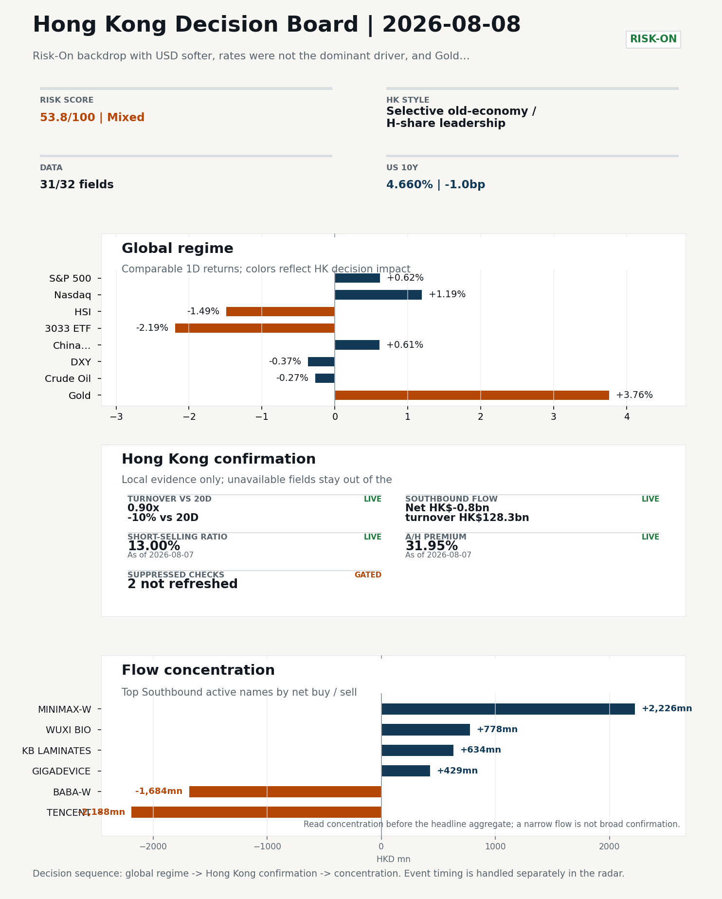
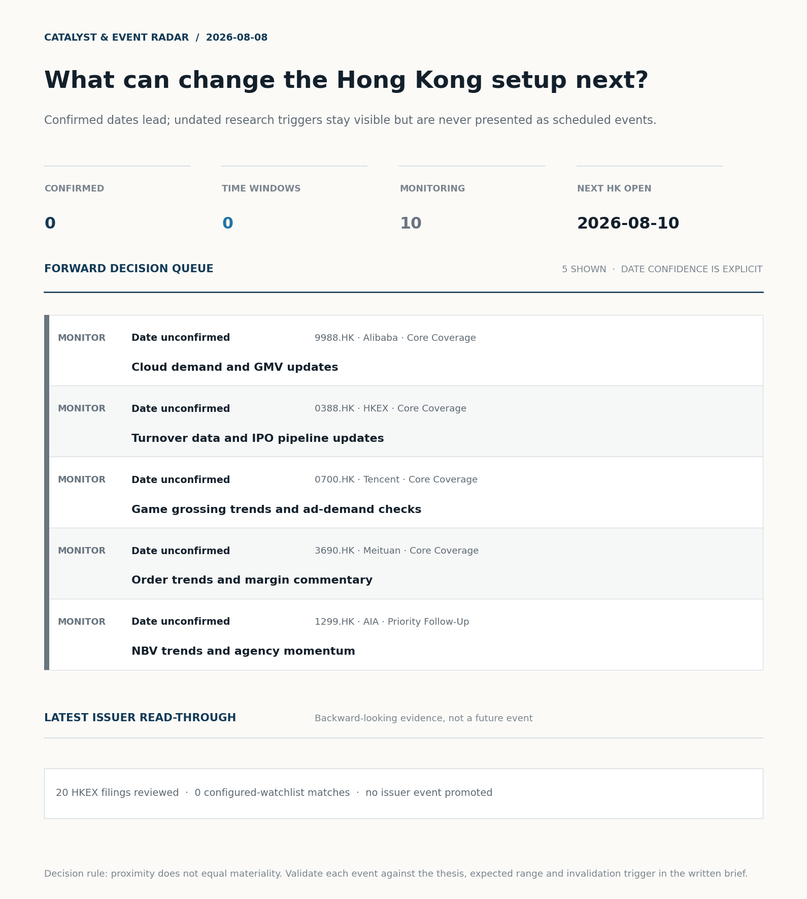
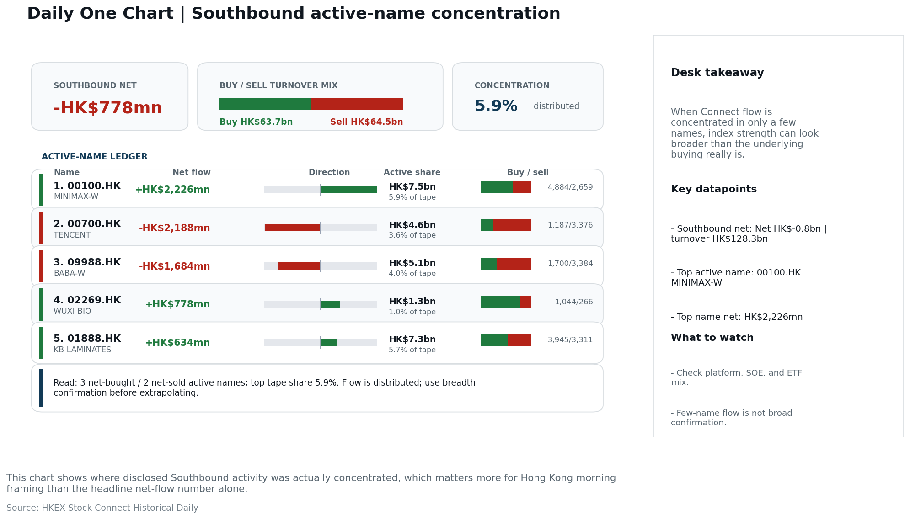
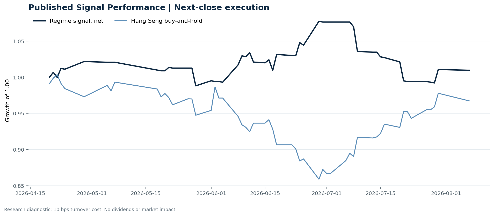

# Morning Research Workbench | 2026-08-08

> **Commute reading route:** `5-minute decision scan` → `25-30 minute deep read` → `10-15 minute optional appendix`
>
> Mode: `Trading Daily` | Keep the report execution-oriented: what mattered in the completed session, what can move Hong Kong leadership, and what needs fast follow-up.

_Data through: global `2026-08-07` | HK/China `2026-08-07` | Market effective `2026-08-07` | Generated `2026-08-08 05:56:10`_

## Executive Summary

- **Market pulse:** Nasdaq 100's +1.19% and a softer DXY (-0.37%) set a constructive overnight tone, but Hong Kong opens against Friday's weak local flow where the Hang Seng TECH ETF sank 2.19% and Southbound.
- **Hong Kong lens:** Selective old-economy / H-share leadership: HSCEI beat 3033.HK by 0.97pp (-1.22% versus -2.19%). Conviction is limited because Southbound recorded -HK$0.8bn net selling. Partial support came from FXI (+0.61%) outperformed HSI (-1.49%). Treat banks, energy, telecoms, and SOE yield as the cleaner relative expression; growth beta still needs proof.
- **What would confirm it:** Watch whether 3033.HK opens above 4.73 and the gap versus HSCEI turns positive; confirm via Southbound flow flipping to net buying in Tencent (0700.HK) and Alibaba (9988.HK) after Friday's heavy sell orders.
- **What could break it:** Invalidate if 3033.HK retakes leadership while CNH firms and local participation broadens.

## Visual Dashboard

**Catalyst & Event Radar**

**Chart read:** No confirmed event date is populated; 10 undated research trigger(s) remain visible without invented timing.

_Source: Public calendars, issuer disclosures and configured research watchlists_
## Layer 1 | Scan (5 min)

### 1.2 Global Asset Price Dashboard
_Decision-useful subset: each row states the implication and the next test. Descriptive secondary monitors are kept out of the five-minute scan._

| Signal | Last / move | Interpretation | Confirmation / invalidation |
| --- | --- | --- | --- |
| S&P 500 | 7,757.64 / +0.62% | US beta improved, raising the global risk floor for Hong Kong. Falling volatility confirms lower near-term stress. | Confirm with Nasdaq breadth and a same-direction VIX move; invalidate if offshore-China proxies diverge. |
| Nasdaq 100 | 29,722.30 / +1.19% | Growth outperformed broad beta, a supportive style signal for Hong Kong internet and platform names. | Confirm through the 3033.HK ETF versus HSI leadership; higher US yields would weaken the read. |
| Hang Seng Index | 25,530.28 / -1.49% | Hong Kong broad beta weakened and needs offshore or policy support to stabilize. | Confirm with Southbound participation and breadth; invalidate if USD/CNH weakens while turnover fades. |
| Hang Seng TECH ETF (3033.HK) | 4.7340 / **-2.19%** | Hong Kong growth lagged, so broad-index strength is not yet a duration signal. | Confirm with stable CNH, Southbound buying and lower yields; invalidate on growth underperformance with rising yields. |
| US 10Y | 4.6600% / -1.0bp | The yield proxy fell, easing the valuation headwind for duration-sensitive equities. | Confirm through Nasdaq and 3033.HK ETF relative performance; invalidate if growth leads despite the opposing rate move. |
| China 10Y | 1.71% / -0.3bp | Lower local yields may reflect easing support or softer demand; the signal is ambiguous without growth confirmation. | Use CSI 300, copper and official credit/activity data to separate growth optimism from demand weakness. |
| DXY | 99.60 / -0.37% | A softer dollar eases an external-liquidity headwind for Hong Kong risk assets. CNH did not confirm the relief, so the liquidity signal is incomplete. | Confirm with USD/CNH moving in the same risk direction; divergence reduces conviction. |
| USD/CNH | 6.7275 / +0.00% | CNH was stable, removing an immediate FX impulse but not confirming equity direction. | Confirm with FXI, the 3033.HK ETF proxy and Southbound flow; invalidate if equities move opposite to FX with strong local participation. |
| VIX | 14.90 / **-1.65%** | Lower implied volatility reduces near-term stress, but is supportive only if equity breadth confirms. | Confirm with equity breadth and credit-sensitive assets; invalidate if lower VIX accompanies narrow or falling equities. |

_Secondary monitors retained in the source bundle: CSI 300, CN-US 10Y spread, USD/HKD, Brent crude, COMEX gold, Copper._

### 1.3 Hong Kong Key Data Quick Check
_Coverage gate: 1 unavailable local checks are suppressed here and retained in validation metadata._

| Check | Value | Status | Source / as of | Why it matters |
| --- | --- | --- | --- | --- |
| Main Board turnover vs 20D | 0.90x \| -10% vs 20D | Live local | HKEX \| 2026-08-07 | Trailing 20-session average turnover was HK$287.1bn. |
| Southbound / Northbound net flow | Southbound Net HK$-0.8bn \| turnover HK$128.3bn \| Northbound Turnover HK$345.2bn \| net not reported | Live local | HKEX Connect \| 2026-08-07 | Southbound net buy is calculated from HKEX disclosed buy and sell turnover. |
| Short-selling ratio | 13.00% | Live local | HKEX \| 2026-08-07 | Official HKEX stock-level short-selling table, aggregated as a share of total market turnover. |
| AH premium index | 31.95% | Live public | Yahoo \| 2026-08-07 | Simple average across 16 A/H pairs; use dispersion rather than the average alone. |
| USD/HKD spot vs band | 7.8439 | Live quote | Yahoo \| 2026-08-07 | Inside the linked-exchange band without immediate boundary stress. |
| Hong Kong leadership | Selective old-economy / H-share leadership | Proxy | HSI / HSCEI / 3033.HK ETF relative \| 2026-08-07 | Use HSI / HSCEI / 3033.HK ETF relative moves as the opening style read. |

### 1.4 Decision Board
**Composite risk score:** `53.8/100` | **Regime:** `Mixed`

| Component | Score impact | Evidence |
| --- | --- | --- |
| US beta | +3.7 | S&P 500 +0.62% |
| HK growth ETF proxy | -10 | 3033.HK ETF -2.19% |
| Offshore China proxy | +3.0 | FXI +0.61% |
| Dollar pressure | +3.7 | DXY -0.37% |

**Morning Checklist**

1. **Risk-On backdrop with USD softer, rates were not the dominant driver, and Gold outperformed Oil**
 Overnight regime | Start by deciding whether the day is about Risk-On conditions or a style pivot.
2. **Gold +3.76%**
 High-frequency data | A firm gold price suggests hedge demand or lower real yields.
3. **VIX -1.65%**
 High-frequency data | Keep tracking it to confirm whether the core daily narrative is holding.
4. **Copper -1.53%**
 High-frequency data | Weak copper argues for more caution on cyclical growth.

## Layer 2 | Deep Read (20-30 min)

### 2.1 Overnight Overseas Market Review
**Market Setup**
**Core tape.** Risk-On backdrop with USD softer, rates were not the dominant driver, and Gold outperformed Oil

**Hong Kong Read-Through**
**Desk lens.** Selective old-economy / H-share leadership.
**Evidence.** HSCEI beat 3033.HK by 0.97pp (-1.22% versus -2.19%)
**Investment read.** Treat banks, energy, telecoms, and SOE yield as the cleaner relative expression; growth beta still needs proof.
- **Cross-market read:** Hang Seng -1.49% / HSCEI -1.22% / 3033.HK ETF -2.19%.
- **Cross-market read:** Offshore China proxy FXI +0.61% and USD/CNH +0.00% frame cross-border risk appetite.
- **Cross-market read:** USD/HKD last traded around 7.8439, which keeps the Hong Kong funding lens in focus.

**Watch Points**
- USD composite moved lower by -0.31pct intraday, with a 0.443pct range.
- Main turning points appeared around 2026-08-07 08:05 trough / 2026-08-07 08:20 trough / 2026-08-07 08:35 trough, suggesting event-driven repricing.
- The biggest cross-asset divergence was Gold versus Oil, a spread of 3.057pct.
- Gold moved +1.78pct intraday with a 2.484pct high-low range.

### 2.2 Hong Kong / A-share Previous-Day Review
**Local Tape Setup**
**Local read.** The global session delivered a clear growth-style bid with Nasdaq 100 rising 1.19% while DXY softened 0.37% and USD/CNH remained flat.
**Verification point.** That backdrop contrasts with Friday's local sell-off where the Hang Seng TECH ETF (3033.HK) dropped 2.19% and Southbound turned net negative HK$0.8bn.
**Risk to watch.** The question for the open is whether the US tech tone can override the weak local flow evidence and lift Hong Kong growth names.

**Style and Local Leadership**
**Style call.** Selective old-economy / H-share leadership.
- **Evidence:** HSCEI beat 3033.HK by 0.97pp (-1.22% versus -2.19%)
- **Portfolio meaning:** Treat banks, energy, telecoms, and SOE yield as the cleaner relative expression; growth beta still needs proof.
- **Cross-market read:** Hang Seng -1.49% / HSCEI -1.22% / 3033.HK ETF -2.19%.
- **Cross-market read:** Offshore China proxy FXI +0.61% and USD/CNH +0.00% frame cross-border risk appetite.
- **Cross-market read:** USD/HKD last traded around 7.8439, which keeps the Hong Kong funding lens in focus.

**Flow Confirmation**
Official Stock Connect evidence is available; use Section 2.3 to confirm whether local money supports the price action.

**Follow-Through Checklist**
**Follow-through check.** Watch whether 3033.HK opens above 4.73 and the gap versus HSCEI turns positive; confirm via Southbound flow flipping to net buying in Tencent (0700.HK) and Alibaba (9988.HK) after Friday's heavy sell orders.
**Failure condition.** Invalidate if 3033.HK retakes leadership while CNH firms and local participation broadens.

### 2.3 Flow Tracker and Attribution
**Cross-Asset Attribution**

| Driver | Direction | Score | Evidence | HK implication |
| --- | --- | --- | --- | --- |
| US growth-style transmission | supportive | 1.67 | Nasdaq 100 moved +1.19%. | Hong Kong growth and platform names should be tested first at the open. |
| Dollar / CNH pressure | supportive | 0.55 | DXY -0.37% / USD-CNH +0.00% | A stable or softer CNH makes Hong Kong follow-through more credible. |

**Local Flow Tracker**

**Flow Takeaways**
- Local flow evidence is not yet strong enough to override the cross-asset setup.
- Stock Connect Southbound: net HK$-0.8bn on turnover HK$128.3bn (as of 2026-08-07).
- Stock Connect Northbound: turnover RMB345.2bn; public file provides total turnover/top active names, not full net-buy.
- AH premium: simple covered-pair average +31.95%; widest premium: China Communications Construction 86.69%.

**Stock Connect Southbound Active Names**

| Rank | Ticker | Name | Buy | Sell | Net buy |
| --- | --- | --- | --- | --- | --- |
| 2 | 00100.HK | MINIMAX-W | HK$4,884.5mn | HK$2,658.9mn | HK$2,225.5mn |
| 4 | 00700.HK | TENCENT | HK$1,187.4mn | HK$3,375.8mn | HK$-2,188.4mn |
| 5 | 09988.HK | BABA-W | HK$1,699.9mn | HK$3,384.0mn | HK$-1,684.2mn |
| 8 | 02269.HK | WUXI BIO | HK$1,043.6mn | HK$265.9mn | HK$777.7mn |
| 2 | 01888.HK | KB LAMINATES | HK$3,944.6mn | HK$3,311.0mn | HK$633.6mn |

**AH Premium Dispersion**

| Name | A ticker | H ticker | Premium | As of |
| --- | --- | --- | --- | --- |
| China Communications Construction | 601800.SS | 1800.HK | +86.69% | 2026-08-07 |
| China Railway Construction | 601186.SS | 1186.HK | +55.70% | 2026-08-07 |
| China Life | 601628.SS | 2628.HK | +55.54% | 2026-08-07 |
| China Railway | 601390.SS | 0390.HK | +46.77% | 2026-08-07 |
| CRRC | 601766.SS | 1766.HK | +35.90% | 2026-08-07 |

**HKEX Short-Selling Watch**

| Ticker | Name | Short ratio | Short turnover | Total turnover |
| --- | --- | --- | --- | --- |
| 00388.HK | HKEX | 10.58% | HK$0.1bn | HK$1.2bn |
| 00700.HK | TENCENT | 7.73% | HK$0.6bn | HK$7.8bn |
| 00941.HK | CHINA MOBILE | 3.12% | HK$0.0bn | HK$1.0bn |
| 01211.HK | BYD COMPANY | 24.67% | HK$0.3bn | HK$1.3bn |
| 01299.HK | AIA | 12.21% | HK$0.4bn | HK$3.3bn |

- **Short-value leaders:** 07709.HK XL2CSOPHYNIX (HK$5.1bn); 03033.HK CSOP HS TECH (HK$2.7bn); 00100.HK MINIMAX-W (HK$1.5bn); 02800.HK TRACKER FUND (HK$1.3bn).

### 2.4 Macro and Policy Tracking
**Desk read.** Use the calendar table and released data below as the primary macro read.

The macro calendar was light for this run.

**Positioning and Risk Backdrop**

- Detailed local flow evidence is covered in Section 2.3; keep this section focused on options, hedging, and macro-positioning risk.

### 2.5 Company Catalysts and Risk Monitor
No high-conviction sector story cleared the main-report relevance gate for this run.

Decision filter<h4>No immediate portfolio catalyst: 20 official filings were screened and the low-signal market set stays aggregated.</h4>
20 profit warnings

<strong>20</strong>Official filings

<strong>0</strong>Watchlist hits

<strong>0</strong>Actionable events

<strong>No event cleared the portfolio decision filter.</strong>

Broad-market filings remain traceable in the source appendix; they are not expanded here without a watchlist, estimate or liquidity read-through.

<strong>Coverage boundary.</strong> Earnings calendar, sell-side rating changes, IPO / grey-market monitor were not decision-grade in this run; their absence is not treated as confirmation that no event exists.

### 2.6 Today's Core Names
**Core coverage**

| Name | Ticker | Last | 1D | Range position | Morning note |
| --- | --- | --- | --- | --- | --- |
| Alibaba | 9988.HK | 123.80 | -0.48% | Mid-range | Positioning is neutral for now, so use it mainly to monitor marginal information changes. |
| HKEX | 0388.HK | 411.60 | +0.39% | Top of range | The name sits near the top of its recent range, so watch for profit-taking under high expectations. |

**Recent headlines for Alibaba:**
- [Alibaba plans revenue sharing for next open-source Qwen AI model](https://qz.com/alibaba-qwen-open-source-revenue-sharing-080726) (Quartz)

**Priority follow-up**

| Name | Ticker | Last | 1D | Range position | Morning note |
| --- | --- | --- | --- | --- | --- |
| AIA | 1299.HK | 74.15 | +1.37% | Bottom of range | The name sits near the bottom of its recent range and is worth monitoring for a catalyst-led reversal. |
| China Mobile | 0941.HK | 81.85 | -0.67% | Mid-range | Positioning is neutral for now, so use it mainly to monitor marginal information changes. |

## Layer 3 | Decision Deepening (10-15 min)

### 3.1 Rotating Theme Deep Dive

| Field | Read |
| --- | --- |
| Theme | AI and Compute Chain |
| Angle for the day | Track whether global AI capex, semis, cloud, and server demand are still carrying offshore China internet and hardware sentiment. |

**Theme desk read**
**Core thesis.** The AI and Compute Chain angle still belongs at the center of the offshore China conversation, but the 7 Aug tape is sending a mixed rather than clean confirmation.
**Evidence.** Gold +3.76% against a softer DXY (-0.37%) and VIX -1.65% is consistent with a Risk-On backdrop, yet Copper -1.53% is a caution flag on cyclical demand that the AI capex story typically rests on.
**What to test.** Within coverage, the most direct AI read-through is Alibaba's plan to revenue-share on the next open-source Qwen release, reported today.

**Signals to keep in mind**
- Gold +3.76%: A firm gold price suggests hedge demand or lower real yields.
- VIX -1.65%: Keep tracking it to confirm whether the core daily narrative is holding.

**LLM watch items:**
- Alibaba Qwen3.8-Max revenue-share reception from large commercial users; tests whether open-source AI can monetize without slowing adoption.
- Tencent risk of pullback given 83% range position and fresh AI-spending headlines; watch for any follow-up on cloud or ad commentary.
- Copper follow-through after -1.53%; a second weak leg would undermine the global AI capex bridge to China hardware sentiment.
- AIA at the bottom of its range (+1.37% on the day) as a sentiment proxy for HK risk appetite; needs a catalyst read to confirm reversal.
- China Mobile for capex and dividend signals, given its role as a defensive SOE benchmark for domestic digital-infrastructure spend.

**Related names to keep close:**

| Name | Ticker | Bucket | Morning read |
| --- | --- | --- | --- |
| Alibaba | 9988.HK | Core coverage | Positioning is neutral for now, so use it mainly to monitor marginal information changes. |
| Tencent | 0700.HK | Core coverage | The name sits near the top of its recent range, so watch for profit-taking under high expectations. |
| AIA | 1299.HK | Priority follow-up | The name sits near the bottom of its recent range and is worth monitoring for a catalyst-led reversal. |
| China Mobile | 0941.HK | Priority follow-up | Positioning is neutral for now, so use it mainly to monitor marginal information changes. |

### 3.2 Today Ahead and Trading Calendar
- The calendar is relatively light, so the market may trade more off positioning and overnight headlines.

**Same-day macro docket**
No same-day macro items were scheduled.

**Same-day catalyst list**
No same-day catalysts were highlighted.

**Next few sessions**
No forward catalyst list was populated.

### 3.3 Daily One Chart
**Daily One Chart | Southbound active-name concentration**

**Chart read.** This chart shows where disclosed Southbound activity was actually concentrated, which matters more for Hong Kong morning framing than the headline net-flow number alone.

_Source: HKEX Stock Connect Historical Daily_

## Optional Appendix | Traceability and Performance (10-15 min)

### Report Metadata
> Date policy: Review date 2026-08-07 is treated as `Trading Daily`. | Global request date is 2026-08-07; adapter effective date is 2026-08-07 and summary date is 2026-08-07. | HK/China local data date is 2026-08-07; role: same-session local cash tape.
> Market data quality: Coverage: `31/32` | Missing: `1`
> Report quality: `81.2/100` | Grade `B` | Status `usable with caveats`

### Key Questions to Keep in Mind
- Is risk appetite rising or fading? The overnight tape reads closer to `Risk-On`.
- Did rates expectations move? Focus on whether US 10Y, DXY, and growth style moved together.
- Were commodities the real story? Watch WTI and gold for geopolitics versus inflation signals.
- Is Hong Kong setup growth-led, SOE-led, or broad beta-led? Compare the 3033.HK ETF proxy, HSCEI, and HSI.
- Did offshore markets move China risk appetite? Focus on HSI, FXI, USD/CNH, and USD/HKD.

### Report Quality and Validation
- **Quality score:** 81.2/100 | **Grade:** B | **Status:** usable with caveats
- **Run summary:** 7 healthy | 1 caveat | 2 failed
- **Release recommendation:** Send with caveats | The report is usable, but the advisory guidance should travel with it so readers understand the data gaps.

| Source | Status | Bucket |
| --- | --- | --- |
| Market data | ok | healthy |
| Sector and company news | ok | healthy |
| Movers and short selling | ok | healthy |
| Stock Connect | ok | healthy |
| A/H premium | ok | healthy |
| Hong Kong local package | ok | healthy |
| China rates | ok | healthy |
| Macro calendar | unavailable | failed |
| Risk and sentiment feed | unavailable | failed |
| Narrative overlay | partial | caveat |

**Desk-use guidance summary:** 0 blocking | 1 advisory

**Desk-use guidance**
- **Advisory:** Use deterministic sections as primary support; the narrative overlay was partial or unavailable on this run.

| Component | Score | Weight | Read |
| --- | --- | --- | --- |
| Market data coverage | 96.9 | 0.2 | 31/32 core market fields available. |
| Hong Kong local metrics | 54.1 | 0.2 | 5 live, 3 proxy, 3 unavailable local checks. |
| Key public adapters | 100.0 | 0.2 | 4/4 key adapters were available or partially available. |
| Narrative overlay health | 41.4 | 0.1 | 1/7 narrative overlay tasks succeeded or used validated cache; 2 error(s). |
| Fact-check guardrail | 100.0 | 0.15 | Checked 16 numeric claims; 0 numeric mismatch(es), 0 logic warning(s); 0 structured claims, 0 source/text warning(s). |
| Source provenance | 92.0 | 0.05 | 42 provenance record(s) validated; 2 unavailable source record(s). |
| Source health and freshness | 73.1 | 0.1 | 8 healthy, 0 degraded, 2 unavailable source group(s). |

**Quality warnings**
- Hong Kong local metrics is weak: 5 live, 3 proxy, 3 unavailable local checks.
- Narrative overlay health is weak: 1/7 narrative overlay tasks succeeded or used validated cache; 2 error(s).

**Narrative fact-check guardrail**
- Checked 16 numeric claims; 0 numeric mismatch(es), 0 logic warning(s); 0 structured claims, 0 source/text warning(s); 0 critical, 0 review.

**Source provenance validation**
- Status: ok | records checked: 42 | unavailable: 2

**Source health and freshness**
- **Source health:** degraded | 8 healthy | 0 degraded | 2 unavailable

| Source | Critical | Status | Score | Fresh coverage | Age range | Policy |
| --- | --- | --- | --- | --- | --- | --- |
| hk_local | Yes | healthy | 98.5 | 1/1 | 1 - 1d | ≤4d / ≥100% |
| macro_calendar | No | unavailable | 0.0 | 0/0 | Unknown | ≤14d / ≥0% |
| market_data | Yes | healthy | 93.0 | 31/31 | 1 - 2d | ≤4d / ≥80% |
| risk_feed | No | unavailable | 0.0 | 0/0 | Unknown | ≤4d / ≥0% |

**Adapter status**

| Adapter | Status |
| --- | --- |
| Stock Connect | ok |
| A/H premium | ok |
| HKEX announcements | ok |
| China rates | ok |

### Historical Signal Performance
- **Readiness:** exploratory with caveats | 65 market observations | 75 active signal dates
- **Execution rule:** use only the next available close after publication; 10 bps turnover cost by default. Current-day signals never receive same-day returns.
- **Interpretation boundary:** results are exploratory until a benchmark reaches 252 sessions and 100 active-signal sessions.

| Benchmark | Sessions | Signal net | Buy & hold | Excess | Max drawdown | Hit rate |
| --- | --- | --- | --- | --- | --- | --- |
| Hang Seng Index | 56 | 1.0% | -3.3% | 4.2% | -7.9% | 48.1% |
| Hang Seng TECH ETF (3033.HK) | 55 | -2.1% | -5.2% | 3.1% | -13.3% | 48.1% |

**Hang Seng event-horizon diagnostics**

| Horizon | Resolved | Hit rate | Average net return |
| --- | --- | --- | --- |
| 1 sessions | 33 | 51.5% | 0.1% |
| 5 sessions | 30 | 56.7% | -0.0% |
| 20 sessions | 24 | 41.7% | -1.1% |

- **Data-quality caveat:** 17 conflicting historical price revision(s) and 6 weekend pseudo-session observation(s) were handled explicitly; inspect the ledger before relying on the result.
- **Use boundary:** this is a close-to-close research diagnostic, not an executable strategy or investment recommendation; dividends, financing, borrow and market impact are excluded.

### Source Links
- [Alibaba plans revenue sharing for next open-source Qwen AI model](https://qz.com/alibaba-qwen-open-source-revenue-sharing-080726) (Quartz)
- [Tencent (SEHK:700) Stock May Be Undervalued Despite Fresh AI Spending Questions](https://finance.yahoo.com/markets/stocks/articles/tencent-sehk-700-stock-may-170839116.html) (Simply Wall St.)
- [Tencent (SEHK:700) Launches Digital Jingdezhen To Bring Porcelain Heritage Into Gaming](https://finance.yahoo.com/technology/ai/articles/tencent-sehk-700-launches-digital-160958283.html) (Simply Wall St.)
- [00094.HK Profit warning / alert announcement](http://www1.hkexnews.hk/listedco/listconews/sehk/2026/0807/2026080700358.pdf) (HKEXnews)
- [00152.HK Profit warning / alert announcement](http://www1.hkexnews.hk/listedco/listconews/sehk/2026/0807/2026080701215.pdf) (HKEXnews)
- [00167.HK Profit warning / alert announcement](http://www1.hkexnews.hk/listedco/listconews/sehk/2026/0807/2026080701219.pdf) (HKEXnews)
- [00232.HK Profit warning / alert announcement](http://www1.hkexnews.hk/listedco/listconews/sehk/2026/0807/2026080700985.pdf) (HKEXnews)
- [00383.HK Profit warning / alert announcement](http://www1.hkexnews.hk/listedco/listconews/sehk/2026/0807/2026080700726.pdf) (HKEXnews)
- [00585.HK Profit warning / alert announcement](http://www1.hkexnews.hk/listedco/listconews/sehk/2026/0807/2026080701465.pdf) (HKEXnews)
- [00639.HK Profit warning / alert announcement](http://www1.hkexnews.hk/listedco/listconews/sehk/2026/0807/2026080700672.pdf) (HKEXnews)
- [00686.HK Profit warning / alert announcement](http://www1.hkexnews.hk/listedco/listconews/sehk/2026/0807/2026080701045.pdf) (HKEXnews)

## Supplementary Visual Appendix

This appendix is professional-path only. It keeps a traceable index of the report visuals and the deterministic chart cues used to frame the morning note, without injecting the legacy intraday chart pack.

### Visual Index

| Visual | Path | Role |
| --- | --- | --- |
| Visual Dashboard | `charts/dashboard_2026-08-08.png` | Cross-asset regime board and Hong Kong local tape snapshot. |
| Catalyst & Event Radar | `charts/catalyst_radar_2026-08-08.png` | Confirmed dates, time windows, undated monitors, and recent issuer read-through. |
| Daily One Chart | `charts/daily_one_chart_2026-08-08.png` | Single highest-conviction visual story for the day. |

### Deterministic Chart Cues
- FX / liquidity: USD composite moved lower by -0.31pct intraday, with a 0.443pct range.
- FX / liquidity: Main turning points appeared around 2026-08-07 08:05 trough / 2026-08-07 08:20 trough / 2026-08-07 08:35 trough, suggesting event-driven repricing rather than a clean one-way USD move.
- Cross-asset: The biggest cross-asset divergence was Gold versus Oil, a spread of 3.057pct.
- Cross-asset: Gold moved +1.78pct intraday with a 2.484pct high-low range.
- Cross-asset: Oil moved -1.28pct intraday with a 2.574pct high-low range.
- Cross-asset: Bitcoin moved +0.96pct intraday with a 1.843pct high-low range.

### Risk Dashboard Components

| Component | Score impact | Evidence |
| --- | --- | --- |
| US beta | +3.7 | S&P 500 +0.62% |
| HK growth ETF proxy | -10 | 3033.HK ETF -2.19% |
| Offshore China proxy | +3.0 | FXI +0.61% |
| Dollar pressure | +3.7 | DXY -0.37% |
| Volatility | +3.3 | VIX -1.65% |
| HK short-selling | +0 | Short-selling ratio 13.00% |
