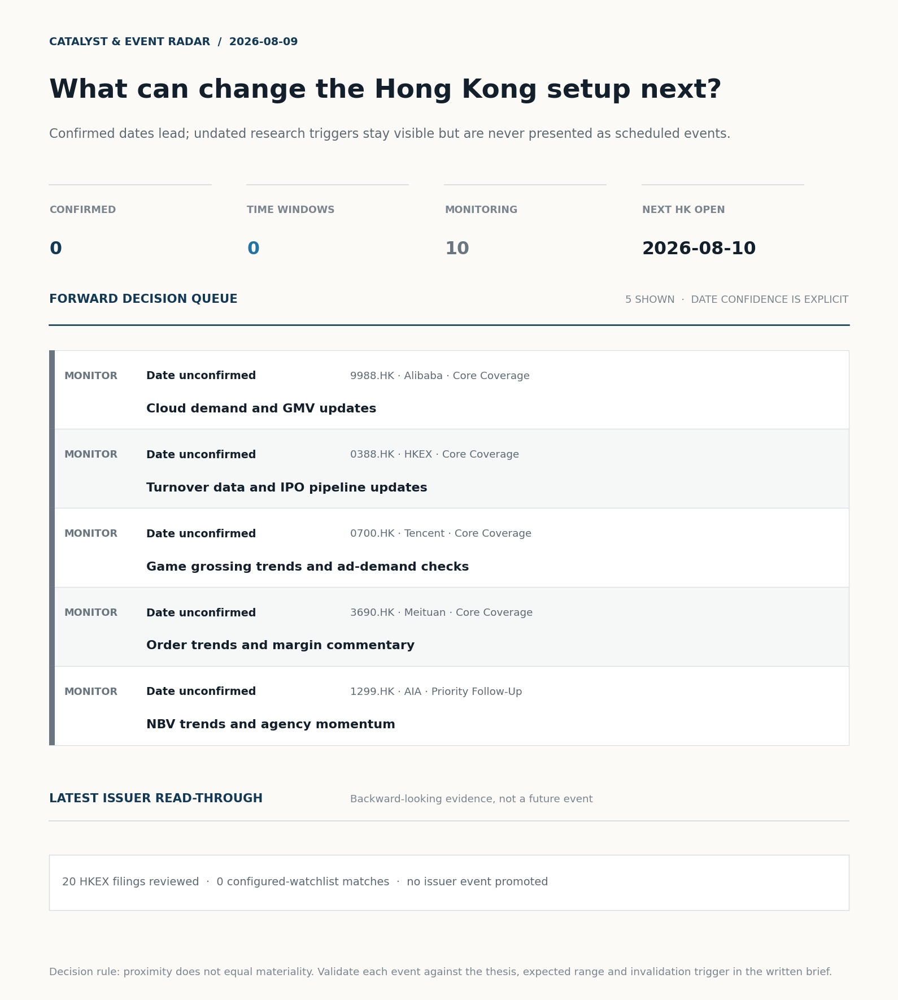
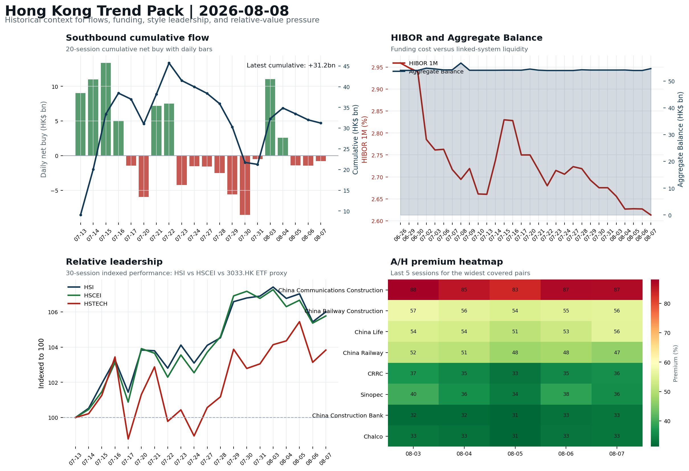
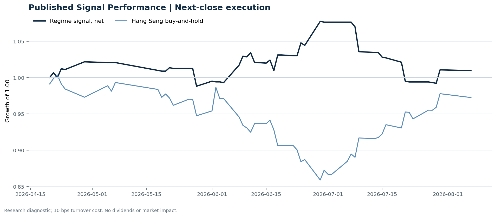

# Morning Research Workbench | 2026-08-09

> **Commute reading route:** `5-minute decision scan` → `25-30 minute deep read` → `10-15 minute optional appendix`
>
> Mode: `Weekly Review` | Use Saturday's non-trading review date to synthesize the completed Hong Kong week and prepare next week's work plan.

_Data through: global `2026-08-08` | HK/China `2026-08-07` | Market effective `2026-08-07` | Generated `2026-08-09 05:46:24`_

## Executive Summary

- **Market pulse:** Risk-On backdrop with USD softer, rates were not the dominant driver, and Gold outperformed Oil
- **Hong Kong lens:** Broad beta, with no decisive style winner: 3033.HK and HSCEI were separated by only 0.29pp (+0.68% versus +0.39%). Conviction is limited because Southbound recorded -HK$0.8bn net selling. Avoid forcing a growth-versus-value call; let volume, Southbound concentration, and the first-hour relative tape identify leadership.
- **Opening implication:** A constructive Hong Kong open on 10 Aug is likely, with growth and internet names set to be tested first given the Nasdaq 100 lead and stable CNH. The key checks.
- **What would confirm it:** Confirm a broad-beta session only if HSI breadth and turnover improve without a sharp 3033.HK-versus-HSCEI split.
- **What could break it:** Reclassify the tape when either 3033.HK or HSCEI opens a sustained 0.5pp relative lead with flow confirmation.

## Visual Dashboard

**Catalyst & Event Radar**

**Chart read:** No confirmed event date is populated; 10 undated research trigger(s) remain visible without invented timing.

_Source: Public calendars, issuer disclosures and configured research watchlists_
## Layer 1 | Weekly Scan (5 min)

### 1.2 Global Asset Price Dashboard
_Decision-useful subset: each row states the implication and the next test. Descriptive secondary monitors are kept out of the five-minute scan._

| Signal | Last / move | Interpretation | Confirmation / invalidation |
| --- | --- | --- | --- |
| S&P 500 | 7,757.64 / +0.62% | US beta improved, raising the global risk floor for Hong Kong. Falling volatility confirms lower near-term stress. | Confirm with Nasdaq breadth and a same-direction VIX move; invalidate if offshore-China proxies diverge. |
| Nasdaq 100 | 29,722.30 / +1.19% | Growth outperformed broad beta, a supportive style signal for Hong Kong internet and platform names. | Confirm through the 3033.HK ETF versus HSI leadership; higher US yields would weaken the read. |
| Hang Seng Index | 25,668.03 / +0.54% | Hong Kong broad beta strengthened, but local flow must confirm whether the move is investable. | Confirm with Southbound participation and breadth; invalidate if USD/CNH weakens while turnover fades. |
| Hang Seng TECH ETF (3033.HK) | 4.7660 / +0.68% | Hong Kong growth led broad beta, improving the platform/internet style signal. | Confirm with stable CNH, Southbound buying and lower yields; invalidate on growth underperformance with rising yields. |
| US 10Y | 4.6600% / -1.0bp | The yield proxy fell, easing the valuation headwind for duration-sensitive equities. | Confirm through Nasdaq and 3033.HK ETF relative performance; invalidate if growth leads despite the opposing rate move. |
| China 10Y | 1.71% / -0.3bp | Lower local yields may reflect easing support or softer demand; the signal is ambiguous without growth confirmation. | Use CSI 300, copper and official credit/activity data to separate growth optimism from demand weakness. |
| DXY | 99.60 / -0.37% | A softer dollar eases an external-liquidity headwind for Hong Kong risk assets. CNH did not confirm the relief, so the liquidity signal is incomplete. | Confirm with USD/CNH moving in the same risk direction; divergence reduces conviction. |
| USD/CNH | 6.7280 / +0.00% | CNH was stable, removing an immediate FX impulse but not confirming equity direction. | Confirm with FXI, the 3033.HK ETF proxy and Southbound flow; invalidate if equities move opposite to FX with strong local participation. |
| VIX | 14.90 / **-1.65%** | Lower implied volatility reduces near-term stress, but is supportive only if equity breadth confirms. | Confirm with equity breadth and credit-sensitive assets; invalidate if lower VIX accompanies narrow or falling equities. |

_Secondary monitors retained in the source bundle: CSI 300, CN-US 10Y spread, USD/HKD, Brent crude, COMEX gold, Copper._

### 1.3 Hong Kong Weekly Tape Quick Check

| Check | Value | Status | Source / as of | Why it matters |
| --- | --- | --- | --- | --- |
| Main Board turnover vs 20D | 0.90x \| -10% vs 20D | Live local | HKEX \| 2026-08-07 | Trailing 20-session average turnover was HK$287.1bn. |
| Southbound / Northbound net flow | Southbound Net HK$-0.8bn \| turnover HK$128.3bn \| Northbound Turnover HK$345.2bn \| net not reported | Live local | HKEX Connect \| 2026-08-07 | Southbound net buy is calculated from HKEX disclosed buy and sell turnover. |
| Short-selling ratio | 13.00% | Live local | HKEX \| 2026-08-07 | Official HKEX stock-level short-selling table, aggregated as a share of total market turnover. |
| AH premium index | 34.43% | Live public | Yahoo \| 2026-08-07 | Simple average across 15 A/H pairs; use dispersion rather than the average alone. |
| USD/HKD spot vs band | 7.8443 \| band 7.7500 to 7.8500 | Live quote + local | Yahoo \| 2026-08-07 | Inside the linked-exchange band without immediate boundary stress. Official Convertibility Undertakings define the linked-rate stress boundaries for USD/HKD. |
| HIBOR 1M | 2.61% | Live local | HKMA \| 2026-08-07 | 1M HIBOR is the cleanest quick read for Hong Kong funding conditions and equity-duration pressure. |
| Hong Kong leadership | Broad beta, with no decisive style winner | Proxy | HSI / HSCEI / 3033.HK ETF relative \| 2026-08-07 | Use HSI / HSCEI / 3033.HK ETF relative moves as the opening style read. |

### 1.4 Decision Board
**Composite risk score:** `67.2/100` | **Regime:** `Risk-on`

| Component | Score impact | Evidence |
| --- | --- | --- |
| US beta | +3.7 | S&P 500 +0.62% |
| HK growth ETF proxy | +3.4 | 3033.HK ETF +0.68% |
| Offshore China proxy | +3.0 | FXI +0.61% |
| Dollar pressure | +3.7 | DXY -0.37% |

**Next Week Checklist**

1. **Risk-On backdrop with USD softer, rates were not the dominant driver, and Gold outperformed Oil**
 Still-moving markets | No fresh Hong Kong cash session is assumed; use global active assets and policy/event flow to prepare the next open.
2. **Gold +2.33%**
 High-frequency data | A firm gold price suggests hedge demand or lower real yields.
3. **Copper -1.74%**
 High-frequency data | Weak copper argues for more caution on cyclical growth.
4. **VIX -1.65%**
 High-frequency data | Keep tracking it to confirm whether the core daily narrative is holding.

## Layer 2 | Deep Read (20-30 min)

### 2.1 Weekly Cross-Asset Review
> Weekly review mode: synthesize the completed Hong Kong week, retain the main cross-asset and policy lessons, and convert them into next-week preparation rather than treating Saturday as a fresh cash-market session.

**Market Setup**
**Core tape.** Overnight markets carried a risk-on tone into the weekend, with US equities rising and the dollar softening after a July payrolls miss sharply cut the probability of a September Fed rate hike.
**Main driver.** Nasdaq 100 outperformed (+1.19%), while gold surged +2.33% and the 10-year yield barely budged, confirming that a weaker USD - not a rates repricing - was the dominant driver.
**HK relevance.** The backdrop aligns with the completed Hong Kong week's broad-beta, balanced leadership and sets up a growth-style test for the 10 Aug open.

**Key Drivers**
- July US nonfarm payrolls missed consensus, causing implied odds of a September Fed hike to tumble and lowering rate pressure on growth.
- Nasdaq 100 led with +1.19%, transmitting US growth-style strength to Hong Kong's 3033.HK ETF (+0.68%) and FXI (+0.61%).
- Gold rallied +2.33% to an all-time high, outperforming oil (+1.15%) and copper (-1.74%), indicating real-yield compression rather than.

**Hong Kong Read-Through**
**Desk lens.** Broad beta, with no decisive style winner.
**Evidence.** 3033.HK and HSCEI were separated by only 0.29pp (+0.68% versus +0.39%)
**Investment read.** Avoid forcing a growth-versus-value call; let volume, Southbound concentration, and the first-hour relative tape identify leadership.
**Opening implication.** A constructive Hong Kong open on 10 Aug is likely, with growth and internet names set to be tested first given the Nasdaq 100 lead and stable CNH. The key checks: whether Southbound flow turns net buying after last week's mixed record.
- **Cross-market read:** Hang Seng +0.54% / HSCEI +0.39% / 3033.HK ETF +0.68%.
- **Cross-market read:** Offshore China proxy FXI +0.61% and USD/CNH +0.00% frame cross-border risk appetite.
- **Cross-market read:** USD/HKD last traded around 7.8443, which keeps the Hong Kong funding lens in focus.

**Watch Points**
- USD composite moved lower by -0.31pct intraday, with a 0.443pct range.
- Main turning points appeared around 2026-08-07 08:05 trough / 2026-08-07 08:20 trough / 2026-08-07 08:35 trough, suggesting event-driven repricing.
- The biggest cross-asset divergence was Gold versus Oil, a spread of 1.611pct.
- Gold moved +1.74pct intraday with a 2.484pct high-low range.

**Weekly Review Map**
- Weekly review window: 2026-08-03 to 2026-08-07. Core regime: Risk-On backdrop with USD softer, rates were not the dominant driver, and Gold outperformed Oil. Hong Kong leadership: Leadership was broad and balanced.
- Method note: Trend summary uses the latest available five observations from the Hong Kong Trend Pack inputs.

**Cross-asset weekly dashboard**

| Asset | Latest move | Weekly read |
| --- | --- | --- |
| S&P 500 | +0.62% | Risk appetite |
| Nasdaq 100 | +1.19% | Growth style |
| Hang Seng Index | +0.54% | Hong Kong beta |
| Hang Seng TECH ETF (3033.HK) | +0.68% | Hong Kong growth / internet proxy |
| DXY | -0.37% | Global liquidity |
| US 10Y Treasury Yield | -1.0bp | Rates path |
| Gold | +2.33% | Hedge / real yields |
| VIX | -1.65% | Volatility and hedging |

**Hong Kong / China weekly tape**

| Signal | Latest move | Read |
| --- | --- | --- |
| Hang Seng Index | +0.54% | Hong Kong beta |
| Hang Seng China Enterprises Index | +0.39% | China SOE / H-share tone |
| Hang Seng TECH ETF (3033.HK) | +0.68% | Hong Kong growth / internet proxy |
| China Large-Cap (FXI) | +0.61% | China sentiment |
| USD/CNH | +0.00% | China FX sentiment |
| USD/HKD | +0.01% | Hong Kong funding lens |

**Five-session trend evidence**
_Window: 2026-08-03 to 2026-08-07_

| Signal | Five-session change | Latest | Desk read |
| --- | --- | --- | --- |
| Southbound flow | +10.0bn over 5 sessions | -0.8bn | 2/5 positive sessions; cumulative buying is the flow-confirmation test for next week. |
| HKD funding | HIBOR -4bp; Aggregate Balance +0.5bn | 2.61% / HK$54.6bn | Funding stress matters if HIBOR rises while Aggregate Balance contracts. |
| HK style leadership | HSTECH led (-0.3pp); HSCEI lagged (-1.5pp) | HSTECH leadership | Use HSI / HSCEI / 3033.HK ETF spread to separate broad beta from growth-led rerating. |
| A/H premium dispersion | -1.3pp average change | 47.8% average premium | Premium narrowing can support H-share relative demand |

**Flow and attribution clues**
- :
- :

**Next-week desk questions**
- Did Southbound flow confirm the index move, or was the week mainly offshore beta without local money follow-through?
- Did HIBOR and Aggregate Balance point to benign funding, or should tighter HKD liquidity be part of next week's risk case?
- Was leadership broad enough beyond the 3033.HK ETF / platform beta proxy, or was the week concentrated in a narrow style pocket?
- Which dated macro, policy, earnings, or IPO catalyst can realistically change the next-week narrative?
- What single data point would invalidate the base-case market pulse by Monday or Tuesday morning?

**Key developments to retain**

| Bucket | Item | Why it matters |
| --- | --- | --- |
| C | Private Credit Squeezed By Bank Refinancings: Credit Weekly | Assess whether the story can propagate through the Financials value chain |
| C | China's AI Push Reshapes Its Economic Future | Assess whether the story can propagate through the Autos and EV value chain |

**Curated overnight stories**
1. **Fed Governor Cook says she is 'prepared to act' on a rate hike to address inflation**
 Why it matters: An on-the-record hawkish voice inside the FOMC partially offsets the dovish reaction to the jobs miss and keeps the next-meeting path two-sided.
 HK read-through: Limits the upside in HK rate-sensitive sectors from the jobs print; argues against a one-way USD-down trade heading into next week.
2. **China's AI push reshapes its economic future**
 Why it matters: Bloomberg This Weekend frames China as deploying AI in factories and export channels rather than treating it as a purely frontier-tech story, reinforcing.
 HK read-through: Most relevant for HK-listed internet, software, and AI-adjacent hardware names; complements the week's constructive China-tech tape.
3. **Copper jumps to its highest level ever, even as Friday's tape printed -1.74%**
 Why it matters: The structural tape remains bullish on copper while the latest session read was weak, suggesting cyclical demand optimism is intact but momentum cooled into the close.
 HK read-through: Mixed signal for HK materials and EV-supply-chain names: structural demand story supportive, but Friday's -1.74% warrants caution on chasing cyclical beta into the 10 Aug.

### 2.2 Hong Kong / A-share Weekly Review
> Weekly review mode: synthesize the completed Hong Kong week, retain the main cross-asset and policy lessons, and convert them into next-week preparation rather than treating Saturday as a fresh cash-market session.

**Style and Local Leadership**
**Style call.** Broad beta, with no decisive style winner.
- **Evidence:** 3033.HK and HSCEI were separated by only 0.29pp (+0.68% versus +0.39%)
- **Portfolio meaning:** Avoid forcing a growth-versus-value call; let volume, Southbound concentration, and the first-hour relative tape identify leadership.
- **Cross-market read:** Hang Seng +0.54% / HSCEI +0.39% / 3033.HK ETF +0.68%.
- **Cross-market read:** Offshore China proxy FXI +0.61% and USD/CNH +0.00% frame cross-border risk appetite.
- **Cross-market read:** USD/HKD last traded around 7.8443, which keeps the Hong Kong funding lens in focus.

**Flow Confirmation**
Official Stock Connect evidence is available; use Section 2.3 to confirm whether local money supports the price action.

**Follow-Through Checklist**
**Follow-through check.** Confirm a broad-beta session only if HSI breadth and turnover improve without a sharp 3033.HK-versus-HSCEI split.
**Failure condition.** Reclassify the tape when either 3033.HK or HSCEI opens a sustained 0.5pp relative lead with flow confirmation.

### 2.3 Flow Tracker and Attribution
**Cross-Asset Attribution**

| Driver | Direction | Score | Evidence | HK implication |
| --- | --- | --- | --- | --- |
| US growth-style transmission | supportive | 1.67 | Nasdaq 100 moved +1.19%. | Hong Kong growth and platform names should be tested first at the open. |
| Dollar / CNH pressure | supportive | 0.55 | DXY -0.37% / USD-CNH +0.00% | A stable or softer CNH makes Hong Kong follow-through more credible. |

**Local Flow Tracker**

**Flow Takeaways**
- Local flow evidence is not yet strong enough to override the cross-asset setup.
- Stock Connect Southbound: net HK$-0.8bn on turnover HK$128.3bn (as of 2026-08-07).
- Stock Connect Northbound: turnover RMB345.2bn; public file provides total turnover/top active names, not full net-buy.
- AH premium: simple covered-pair average +34.43%; widest premium: China Communications Construction 86.69%.

**Stock Connect Southbound Active Names**

| Rank | Ticker | Name | Buy | Sell | Net buy |
| --- | --- | --- | --- | --- | --- |
| 2 | 00100.HK | MINIMAX-W | HK$4,884.5mn | HK$2,658.9mn | HK$2,225.5mn |
| 4 | 00700.HK | TENCENT | HK$1,187.4mn | HK$3,375.8mn | HK$-2,188.4mn |
| 5 | 09988.HK | BABA-W | HK$1,699.9mn | HK$3,384.0mn | HK$-1,684.2mn |
| 8 | 02269.HK | WUXI BIO | HK$1,043.6mn | HK$265.9mn | HK$777.7mn |
| 2 | 01888.HK | KB LAMINATES | HK$3,944.6mn | HK$3,311.0mn | HK$633.6mn |

**AH Premium Dispersion**

| Name | A ticker | H ticker | Premium | As of |
| --- | --- | --- | --- | --- |
| China Communications Construction | 601800.SS | 1800.HK | +86.69% | 2026-08-07 |
| China Railway Construction | 601186.SS | 1186.HK | +55.70% | 2026-08-07 |
| China Life | 601628.SS | 2628.HK | +55.54% | 2026-08-07 |
| China Railway | 601390.SS | 0390.HK | +46.77% | 2026-08-07 |
| CRRC | 601766.SS | 1766.HK | +35.90% | 2026-08-07 |

**HKEX Short-Selling Watch**

| Ticker | Name | Short ratio | Short turnover | Total turnover |
| --- | --- | --- | --- | --- |
| 00388.HK | HKEX | 10.58% | HK$0.1bn | HK$1.2bn |
| 00700.HK | TENCENT | 7.73% | HK$0.6bn | HK$7.8bn |
| 00941.HK | CHINA MOBILE | 3.12% | HK$0.0bn | HK$1.0bn |
| 01211.HK | BYD COMPANY | 24.67% | HK$0.3bn | HK$1.3bn |
| 01299.HK | AIA | 12.21% | HK$0.4bn | HK$3.3bn |

- **Short-value leaders:** 07709.HK XL2CSOPHYNIX (HK$5.1bn); 03033.HK CSOP HS TECH (HK$2.7bn); 00100.HK MINIMAX-W (HK$1.5bn); 02800.HK TRACKER FUND (HK$1.3bn).

### 2.4 Macro and Policy Tracking
**Desk read.** Use the calendar table and released data below as the primary macro read.

The macro calendar was light for this run.

**Positioning and Risk Backdrop**

- Detailed local flow evidence is covered in Section 2.3; keep this section focused on options, hedging, and macro-positioning risk.

### 2.5 Company Catalysts and Risk Monitor
No high-conviction sector story cleared the main-report relevance gate for this run.

Decision filter<h4>No immediate portfolio catalyst: 20 official filings were screened and the low-signal market set stays aggregated.</h4>
20 profit warnings

<strong>20</strong>Official filings

<strong>0</strong>Watchlist hits

<strong>0</strong>Actionable events

<strong>No event cleared the portfolio decision filter.</strong>

Broad-market filings remain traceable in the source appendix; they are not expanded here without a watchlist, estimate or liquidity read-through.

<strong>Coverage boundary.</strong> Earnings calendar, sell-side rating changes, IPO / grey-market monitor were not decision-grade in this run; their absence is not treated as confirmation that no event exists.

### 2.6 Today's Core Names
**Core coverage**

| Name | Ticker | Last | 1D | Range position | Morning note |
| --- | --- | --- | --- | --- | --- |
| Alibaba | 9988.HK | 123.80 | -0.48% | Mid-range | Positioning is neutral for now, so use it mainly to monitor marginal information changes. |
| HKEX | 0388.HK | 411.60 | +0.39% | Top of range | The name sits near the top of its recent range, so watch for profit-taking under high expectations. |

**Recent headlines for Alibaba:**
- [Apple says Mac users in China can connect to Alibaba's Qwen AI service](https://finance.yahoo.com/technology/ai/articles/apple-says-mac-users-china-123458419.html) (Reuters)

**Priority follow-up**

| Name | Ticker | Last | 1D | Range position | Morning note |
| --- | --- | --- | --- | --- | --- |
| AIA | 1299.HK | 74.15 | +1.37% | Bottom of range | The name sits near the bottom of its recent range and is worth monitoring for a catalyst-led reversal. |
| China Mobile | 0941.HK | 81.85 | -0.67% | Mid-range | Positioning is neutral for now, so use it mainly to monitor marginal information changes. |

## Layer 3 | Decision Deepening (10-15 min)

### 3.1 Rotating Theme Deep Dive

| Field | Read |
| --- | --- |
| Theme | AI and Compute Chain |
| Angle for the day | Track whether global AI capex, semis, cloud, and server demand are still carrying offshore China internet and hardware sentiment. |

**Theme desk read**
**Core thesis.** Weekly review (2026-08-03 to 2026-08-07) leaves the AI and Compute Chain theme intact but narrowly held.
**Evidence.** Leadership was led by HSTECH (-0.3pp) while HSCEI lagged (-1.5pp), so the rerating read is still concentrated in the platform / growth pocket rather than broad China beta.
**What to test.** Within the coverage, Alibaba (9988.HK) prints the strongest AI read-throughs this week - Apple enabling Mac users in mainland China to connect to Qwen.

**Signals to keep in mind**
- Private Credit Squeezed By Bank Refinancings: Credit Weekly: Assess whether the story can propagate through the Financials value chain
- China's AI Push Reshapes Its Economic Future: Assess whether the story can propagate through the Autos and EV value chain
- Gold +2.33%: A firm gold price suggests hedge demand or lower real yields.
- Copper -1.74%: Weak copper argues for more caution on cyclical growth.

**LLM watch items:**
- Southbound follow-through on Monday (8/10): the +10.0bn weekly print is a stronger confirmation than the -0.8bn latest day, so the 8/10 flow tape is
- Alibaba (9988.HK) Qwen monetization pathway: pair the Apple Mac integration with the Qwen3.8 open-weight revenue-share announcement to test whether
- Tencent (0700.HK) at top of range: monitor for profit-taking given the AI-spend question, and watch game grossing / ad demand checks as the
- Gold vs Copper split (Gold +2.33% / Copper -1.74%): if Gold stays bid while Copper fails to recover, treat it as a soft cap on cyclical AI
- China Mobile (0941.HK) capex / dividend signaling: the next domestic digital-infrastructure data point that would validate or undermine the SOE

**Related names to keep close:**

| Name | Ticker | Bucket | Morning read |
| --- | --- | --- | --- |
| Alibaba | 9988.HK | Core coverage | Positioning is neutral for now, so use it mainly to monitor marginal information changes. |
| Tencent | 0700.HK | Core coverage | The name sits near the top of its recent range, so watch for profit-taking under high expectations. |
| AIA | 1299.HK | Priority follow-up | The name sits near the bottom of its recent range and is worth monitoring for a catalyst-led reversal. |
| China Mobile | 0941.HK | Priority follow-up | Positioning is neutral for now, so use it mainly to monitor marginal information changes. |

**Relevant headlines:**
- [Private Credit Squeezed By Bank Refinancings: Credit Weekly](https://www.bloomberg.com/news/articles/2026-08-08/private-credit-squeezed-by-bank-refinancings-credit-weekly)
- [China's AI Push Reshapes Its Economic Future](https://www.bloomberg.com/news/videos/2026-08-08/china-s-ai-push-reshapes-its-economic-future-video)

### 3.2 Next Week Calendar and Reopen Prep
- Non-trading review: use today's calendar to prepare the next Hong Kong open rather than treating the last cash tape as a fresh signal.

**Same-day macro docket**
No same-day macro items were scheduled.

**Same-day catalyst list**
No same-day catalysts were highlighted.

**Next few sessions**
No forward catalyst list was populated.

### 3.3 Daily One Chart
**Daily One Chart | Southbound active-name concentration**

**Chart read.** This chart shows where disclosed Southbound activity was actually concentrated, which matters more for Hong Kong morning framing than the headline net-flow number alone.

_Source: HKEX Stock Connect Historical Daily_

### 3.4 Hong Kong Trend Pack
**Hong Kong Trend Pack**

**Trend read.** Four historical lenses: Southbound cumulative flow, HKMA funding and liquidity, HSI/HSCEI/3033.HK ETF relative leadership, and A/H premium dispersion.

_Source: HKEX Stock Connect, HKMA liquidity data, and public Yahoo Finance quotes_

## Optional Appendix | Traceability and Performance (10-15 min)

### Report Metadata
> Date policy: Review date 2026-08-08 is treated as `Weekly Review`. | Global request date is 2026-08-08; adapter effective date is 2026-08-07 and summary date is 2026-08-07. | HK/China local data date is 2026-08-07; role: last completed HK/China cash-market reference tape.
> Market data quality: Coverage: `31/32` | Missing: `1`
> Report quality: `86.2/100` | Grade `B` | Status `production ready`

### Key Questions to Keep in Mind
- Is risk appetite rising or fading? The overnight tape reads closer to `Risk-On`.
- Did rates expectations move? Focus on whether US 10Y, DXY, and growth style moved together.
- Were commodities the real story? Watch WTI and gold for geopolitics versus inflation signals.
- Is Hong Kong setup growth-led, SOE-led, or broad beta-led? Compare the 3033.HK ETF proxy, HSCEI, and HSI.
- Did offshore markets move China risk appetite? Focus on HSI, FXI, USD/CNH, and USD/HKD.

### Report Quality and Validation
- **Quality score:** 86.2/100 | **Grade:** B | **Status:** production ready
- **Run summary:** 7 healthy | 1 caveat | 2 failed
- **Release recommendation:** Send with caveats | The report is usable, but the advisory guidance should travel with it so readers understand the data gaps.

| Source | Status | Bucket |
| --- | --- | --- |
| Market data | ok | healthy |
| Sector and company news | ok | healthy |
| Movers and short selling | ok | healthy |
| Stock Connect | ok | healthy |
| A/H premium | ok | healthy |
| Hong Kong local package | ok | healthy |
| China rates | ok | healthy |
| Macro calendar | unavailable | failed |
| Risk and sentiment feed | unavailable | failed |
| Narrative overlay | partial | caveat |

**Desk-use guidance summary:** 0 blocking | 2 advisory

**Desk-use guidance**
- **Advisory:** Questionable narrative fields were removed; use the deterministic fallback copy and review the audit trail.
- **Advisory:** Use deterministic sections as primary support; the narrative overlay was partial or unavailable on this run.

| Component | Score | Weight | Read |
| --- | --- | --- | --- |
| Market data coverage | 96.9 | 0.2 | 31/32 core market fields available. |
| Hong Kong local metrics | 82.3 | 0.2 | 8 live, 3 proxy, 0 unavailable local checks. |
| Key public adapters | 100.0 | 0.2 | 4/4 key adapters were available or partially available. |
| Narrative overlay health | 33.6 | 0.1 | 1/7 narrative overlay tasks succeeded or used validated cache; 3 error(s). |
| Fact-check guardrail | 100.0 | 0.15 | Checked 19 numeric claims; 0 numeric mismatch(es), 0 logic warning(s); 0 structured claims, 0 source/text warning(s). |
| Source provenance | 92.0 | 0.05 | 42 provenance record(s) validated; 2 unavailable source record(s). |
| Source health and freshness | 73.1 | 0.1 | 8 healthy, 0 degraded, 2 unavailable source group(s). |

**Quality warnings**
- Narrative overlay health is weak: 1/7 narrative overlay tasks succeeded or used validated cache; 3 error(s).
- Narrative fact-check guardrail produced warnings; review the validation table before relying on narrative sections.

**Narrative fact-check guardrail**
- Checked 19 numeric claims; 0 numeric mismatch(es), 0 logic warning(s); 0 structured claims, 0 source/text warning(s); 0 critical, 0 review. Replaced 3 unsafe narrative field(s) with deterministic fallback copy.
- **Deterministic fallback fields:** selected_news[0].hk_market_impact, tasks.news_selection.selected_news[0].hk_market_impact, tasks.overnight_review.drivers[1]

**Source provenance validation**
- Status: ok | records checked: 42 | unavailable: 2

**Source health and freshness**
- **Source health:** degraded | 8 healthy | 0 degraded | 2 unavailable

| Source | Critical | Status | Score | Fresh coverage | Age range | Policy |
| --- | --- | --- | --- | --- | --- | --- |
| hk_local | Yes | healthy | 98.5 | 1/1 | 2 - 2d | ≤4d / ≥100% |
| macro_calendar | No | unavailable | 0.0 | 0/0 | Unknown | ≤14d / ≥0% |
| market_data | Yes | healthy | 93.0 | 31/31 | 2 - 2d | ≤4d / ≥80% |
| risk_feed | No | unavailable | 0.0 | 0/0 | Unknown | ≤4d / ≥0% |

**Adapter status**

| Adapter | Status |
| --- | --- |
| Stock Connect | ok |
| A/H premium | ok |
| HKEX announcements | ok |
| China rates | ok |

### Historical Signal Performance
- **Readiness:** exploratory with caveats | 65 market observations | 75 active signal dates
- **Execution rule:** use only the next available close after publication; 10 bps turnover cost by default. Current-day signals never receive same-day returns.
- **Interpretation boundary:** results are exploratory until a benchmark reaches 252 sessions and 100 active-signal sessions.

| Benchmark | Sessions | Signal net | Buy & hold | Excess | Max drawdown | Hit rate |
| --- | --- | --- | --- | --- | --- | --- |
| Hang Seng Index | 56 | 1.0% | -2.8% | 3.7% | -7.9% | 48.1% |
| Hang Seng TECH ETF (3033.HK) | 55 | -2.1% | -4.6% | 2.4% | -13.3% | 48.1% |

**Hang Seng event-horizon diagnostics**

| Horizon | Resolved | Hit rate | Average net return |
| --- | --- | --- | --- |
| 1 sessions | 33 | 51.5% | 0.1% |
| 5 sessions | 30 | 56.7% | -0.0% |
| 20 sessions | 24 | 41.7% | -1.1% |

- **Data-quality caveat:** 17 conflicting historical price revision(s) and 6 weekend pseudo-session observation(s) were handled explicitly; inspect the ledger before relying on the result.
- **Use boundary:** this is a close-to-close research diagnostic, not an executable strategy or investment recommendation; dividends, financing, borrow and market impact are excluded.

### Source Links
- [Apple says Mac users in China can connect to Alibaba's Qwen AI service](https://finance.yahoo.com/technology/ai/articles/apple-says-mac-users-china-123458419.html) (Reuters)
- [Alibaba Pioneers Revenue Share on Open-Weight Models - the First Chinese Lab to Tax Deployment](https://finance.yahoo.com/technology/ai/articles/alibaba-pioneers-revenue-share-open-113214289.html) (Forkast News)
- [Tencent (SEHK:700) Stock May Be Undervalued Despite Fresh AI Spending Questions](https://finance.yahoo.com/markets/stocks/articles/tencent-sehk-700-stock-may-170839116.html) (Simply Wall St.)
- [Tencent (SEHK:700) Launches Digital Jingdezhen To Bring Porcelain Heritage Into Gaming](https://finance.yahoo.com/technology/ai/articles/tencent-sehk-700-launches-digital-160958283.html) (Simply Wall St.)
- [00094.HK Profit warning / alert announcement](http://www1.hkexnews.hk/listedco/listconews/sehk/2026/0807/2026080700358.pdf) (HKEXnews)
- [00152.HK Profit warning / alert announcement](http://www1.hkexnews.hk/listedco/listconews/sehk/2026/0807/2026080701215.pdf) (HKEXnews)
- [00167.HK Profit warning / alert announcement](http://www1.hkexnews.hk/listedco/listconews/sehk/2026/0807/2026080701219.pdf) (HKEXnews)
- [00232.HK Profit warning / alert announcement](http://www1.hkexnews.hk/listedco/listconews/sehk/2026/0807/2026080700985.pdf) (HKEXnews)
- [00383.HK Profit warning / alert announcement](http://www1.hkexnews.hk/listedco/listconews/sehk/2026/0807/2026080700726.pdf) (HKEXnews)
- [00585.HK Profit warning / alert announcement](http://www1.hkexnews.hk/listedco/listconews/sehk/2026/0807/2026080701465.pdf) (HKEXnews)
- [00639.HK Profit warning / alert announcement](http://www1.hkexnews.hk/listedco/listconews/sehk/2026/0807/2026080700672.pdf) (HKEXnews)
- [00686.HK Profit warning / alert announcement](http://www1.hkexnews.hk/listedco/listconews/sehk/2026/0807/2026080701045.pdf) (HKEXnews)

## Supplementary Visual Appendix

This appendix is professional-path only. It keeps a traceable index of the report visuals and the deterministic chart cues used to frame the morning note, without injecting the legacy intraday chart pack.

### Visual Index

| Visual | Path | Role |
| --- | --- | --- |
| Visual Dashboard | `charts/dashboard_2026-08-09.png` | Cross-asset regime board and Hong Kong local tape snapshot. |
| Catalyst & Event Radar | `charts/catalyst_radar_2026-08-09.png` | Confirmed dates, time windows, undated monitors, and recent issuer read-through. |
| Daily One Chart | `charts/daily_one_chart_2026-08-09.png` | Single highest-conviction visual story for the day. |
| Hong Kong Trend Pack | `charts/hk_trend_pack_2026-08-09.png` | Historical context for flows, liquidity, leadership, and A/H dispersion. |

### Deterministic Chart Cues
- FX / liquidity: USD composite moved lower by -0.31pct intraday, with a 0.443pct range.
- FX / liquidity: Main turning points appeared around 2026-08-07 08:05 trough / 2026-08-07 08:20 trough / 2026-08-07 08:35 trough, suggesting event-driven repricing rather than a clean one-way USD move.
- Cross-asset: The biggest cross-asset divergence was Gold versus Oil, a spread of 1.611pct.
- Cross-asset: Gold moved +1.74pct intraday with a 2.484pct high-low range.
- Cross-asset: Oil moved +0.13pct intraday with a 2.574pct high-low range.
- Cross-asset: Bitcoin moved +0.92pct intraday with a 1.843pct high-low range.

### Risk Dashboard Components

| Component | Score impact | Evidence |
| --- | --- | --- |
| US beta | +3.7 | S&P 500 +0.62% |
| HK growth ETF proxy | +3.4 | 3033.HK ETF +0.68% |
| Offshore China proxy | +3.0 | FXI +0.61% |
| Dollar pressure | +3.7 | DXY -0.37% |
| Volatility | +3.3 | VIX -1.65% |
| HK short-selling | +0 | Short-selling ratio 13.00% |
