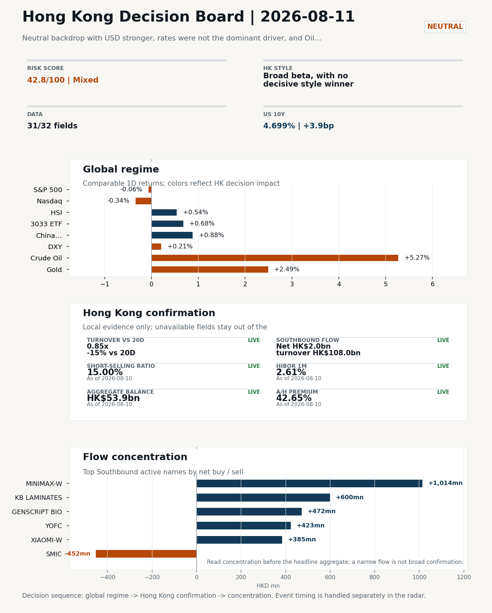
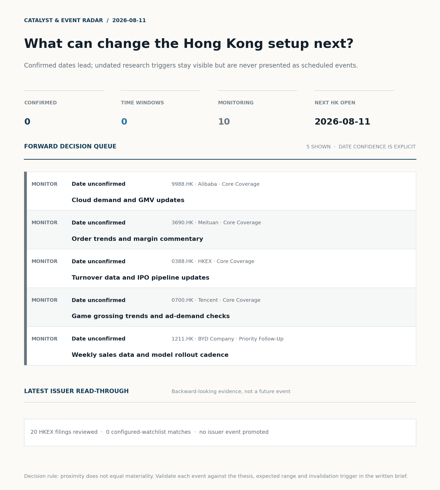
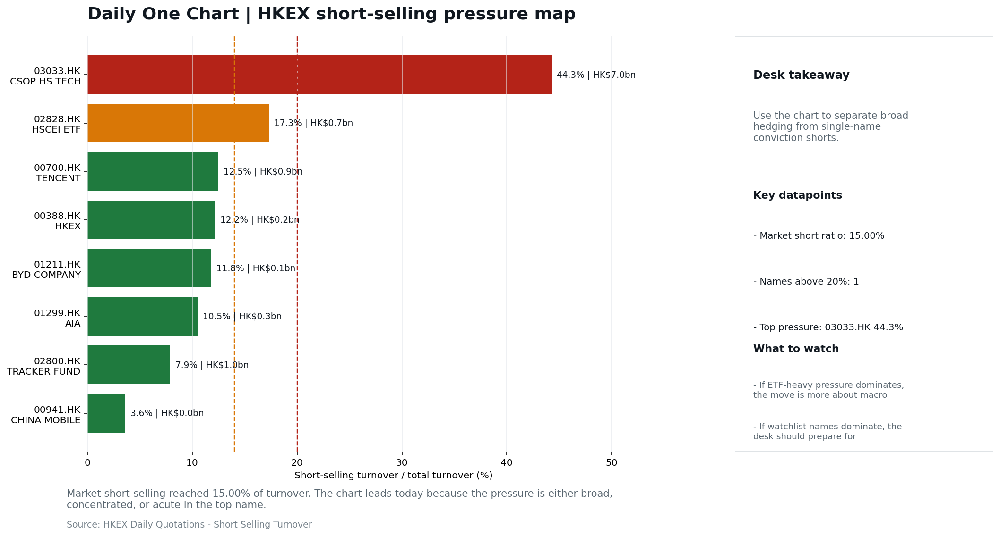
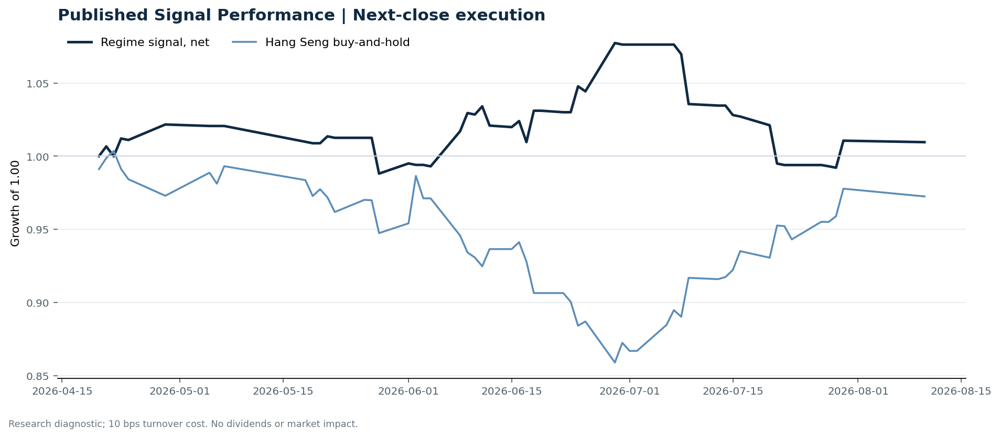

# Morning Research Workbench | 2026-08-11

> **Commute reading route:** `5-minute decision scan` → `25-30 minute deep read` → `10-15 minute optional appendix`
>
> Mode: `Trading Daily` | Keep the report execution-oriented: what mattered in the completed session, what can move Hong Kong leadership, and what needs fast follow-up.

_Data through: global `2026-08-10` | HK/China `2026-08-10` | Market effective `2026-08-10` | Generated `2026-08-11 05:58:24`_

## Executive Summary

- **Market pulse:** A softer US jobs print dragged Fed hike odds lower, but a +5.27% WTI move, a firmer dollar, and Hong Kong turnover at 0.85x the 20-day average leave the overnight constructive signal.
- **Hong Kong lens:** Broad beta, with no decisive style winner: 3033.HK and HSCEI were separated by only 0.29pp (+0.68% versus +0.39%). Conviction is limited because turnover was only 0.85x its 20-day average. Partial support came from Southbound recorded +HK$2.0bn net buying. Avoid forcing a growth-versus-value call; let volume, Southbound concentration, and the first-hour relative tape identify leadership.
- **What would confirm it:** Confirm growth leadership if Hang Seng TECH outperforms HSCEI through the morning session and onshore ETF volumes pick up.
- **What could break it:** Reclassify the tape when either 3033.HK or HSCEI opens a sustained 0.5pp relative lead with flow confirmation.

## Visual Dashboard

**Catalyst & Event Radar**

**Chart read:** No confirmed event date is populated; 10 undated research trigger(s) remain visible without invented timing.

_Source: Public calendars, issuer disclosures and configured research watchlists_
## Layer 1 | Scan (5 min)

### 1.2 Global Asset Price Dashboard
_Decision-useful subset: each row states the implication and the next test. Descriptive secondary monitors are kept out of the five-minute scan._

| Signal | Last / move | Interpretation | Confirmation / invalidation |
| --- | --- | --- | --- |
| S&P 500 | 7,753.11 / -0.06% | US beta weakened, reducing the external risk cushion for Hong Kong. | Confirm with Nasdaq breadth and a same-direction VIX move; invalidate if offshore-China proxies diverge. |
| Nasdaq 100 | 29,621.80 / -0.34% | Growth lagged broad beta, warning that headline risk-on may not transmit cleanly to the 3033.HK ETF proxy. | Confirm through the 3033.HK ETF versus HSI leadership; higher US yields would weaken the read. |
| Hang Seng Index | 25,668.03 / +0.54% | Hong Kong broad beta strengthened, but local flow must confirm whether the move is investable. | Confirm with Southbound participation and breadth; invalidate if USD/CNH weakens while turnover fades. |
| Hang Seng TECH ETF (3033.HK) | 4.7660 / +0.68% | Hong Kong growth led broad beta, improving the platform/internet style signal. | Confirm with stable CNH, Southbound buying and lower yields; invalidate on growth underperformance with rising yields. |
| US 10Y | 4.6990% / +3.9bp | The yield proxy rose, tightening the discount-rate backdrop for long-duration Hong Kong growth. | Confirm through Nasdaq and 3033.HK ETF relative performance; invalidate if growth leads despite the opposing rate move. |
| China 10Y | 1.71% / -0.4bp | Lower local yields may reflect easing support or softer demand; the signal is ambiguous without growth confirmation. | Use CSI 300, copper and official credit/activity data to separate growth optimism from demand weakness. |
| DXY | 99.81 / +0.21% | A firmer dollar tightens the external-liquidity backdrop and can pressure offshore-China risk appetite. | Confirm with USD/CNH moving in the same risk direction; divergence reduces conviction. |
| USD/CNH | 6.7310 / +0.00% | CNH was stable, removing an immediate FX impulse but not confirming equity direction. | Confirm with FXI, the 3033.HK ETF proxy and Southbound flow; invalidate if equities move opposite to FX with strong local participation. |
| VIX | 15.46 / **+3.76%** | Higher implied volatility raises the tail-risk premium and weakens risk-on conviction. | Confirm with equity breadth and credit-sensitive assets; invalidate if lower VIX accompanies narrow or falling equities. |

_Secondary monitors retained in the source bundle: CSI 300, CN-US 10Y spread, USD/HKD, Brent crude, COMEX gold, Copper._

### 1.3 Hong Kong Key Data Quick Check

| Check | Value | Status | Source / as of | Why it matters |
| --- | --- | --- | --- | --- |
| Main Board turnover vs 20D | 0.85x \| -15% vs 20D | Live local | HKEX \| 2026-08-10 | Trailing 20-session average turnover was HK$283.1bn. |
| Southbound / Northbound net flow | Southbound Net HK$2.0bn \| turnover HK$108.0bn \| Northbound Turnover HK$322.0bn \| net not reported | Live local | HKEX Connect \| 2026-08-10 | Southbound net buy is calculated from HKEX disclosed buy and sell turnover. |
| Short-selling ratio | 15.00% | Live local | HKEX \| 2026-08-10 | Official HKEX stock-level short-selling table, aggregated as a share of total market turnover. |
| AH premium index | 42.65% | Live public | Yahoo \| 2026-08-10 | Simple average across 17 A/H pairs; use dispersion rather than the average alone. |
| USD/HKD spot vs band | 7.8449 \| band 7.7500 to 7.8500 | Live quote + local | Yahoo \| 2026-08-10 | Inside the linked-exchange band without immediate boundary stress. Official Convertibility Undertakings define the linked-rate stress boundaries for USD/HKD. |
| HIBOR 1M | 2.61% | Live local | HKMA \| 2026-08-10 | 1M HIBOR is the cleanest quick read for Hong Kong funding conditions and equity-duration pressure. |
| Hong Kong leadership | Broad beta, with no decisive style winner | Proxy | HSI / HSCEI / 3033.HK ETF relative \| 2026-08-10 | Use HSI / HSCEI / 3033.HK ETF relative moves as the opening style read. |

### 1.4 Decision Board
**Composite risk score:** `42.8/100` | **Regime:** `Mixed`

| Component | Score impact | Evidence |
| --- | --- | --- |
| US beta | -0.4 | S&P 500 -0.06% |
| HK growth ETF proxy | +3.4 | 3033.HK ETF +0.68% |
| Offshore China proxy | +4.4 | FXI +0.88% |
| Dollar pressure | -2.1 | DXY +0.21% |

**Morning Checklist**

1. **Neutral backdrop with USD stronger, rates were not the dominant driver, and Oil outperformed Bitcoin**
 Overnight regime | Start by deciding whether the day is about Neutral conditions or a style pivot.
2. **WTI crude +5.27%**
 High-frequency data | A strong crude move needs to be split between geopolitics and demand repair.
3. **VIX +3.76%**
 High-frequency data | Higher volatility argues for tighter sizing and tighter stops.
4. **Gold +2.49%**
 High-frequency data | Gold rising with the dollar looks more like geopolitical or pure hedge demand.

## Layer 2 | Deep Read (20-30 min)

### 2.1 Overnight Overseas Market Review
**Market Setup**
**Core tape.** Neutral backdrop with USD stronger, rates were not the dominant driver, and Oil outperformed Bitcoin

**Hong Kong Read-Through**
**Desk lens.** Broad beta, with no decisive style winner.
**Evidence.** 3033.HK and HSCEI were separated by only 0.29pp (+0.68% versus +0.39%)
**Investment read.** Avoid forcing a growth-versus-value call; let volume, Southbound concentration, and the first-hour relative tape identify leadership.
- **Cross-market read:** Hang Seng +0.54% / HSCEI +0.39% / 3033.HK ETF +0.68%.
- **Cross-market read:** Offshore China proxy FXI +0.88% and USD/CNH +0.00% frame cross-border risk appetite.
- **Cross-market read:** USD/HKD last traded around 7.8449, which keeps the Hong Kong funding lens in focus.

**Watch Points**
- USD composite moved higher by +0.32pct intraday, with a 0.33pct range.
- Main turning points appeared around 2026-08-10 08:10 trough / 2026-08-10 08:30 peak / 2026-08-10 08:45 trough, suggesting event-driven repricing.
- The biggest cross-asset divergence was Oil versus Bitcoin, a spread of 5.805pct.
- Gold moved +1.42pct intraday with a 1.746pct high-low range.

**Curated overnight stories**
1. **Odds the Fed will hike in September tumble following big July jobs miss**
 Why it matters: A weaker-than-expected US July payrolls print materially repriced September Fed expectations, shifting the global rates/DXY framing overnight.
 HK read-through: Direct read-across for Hong Kong via lower US yields pressure on the DXY, liquidity tailwinds for growth/tech, and reduced discount-rate drag on rate-sensitive HK property.
2. **WTI crude +5.27% overnight**
 Why it matters: Oil was the standout asset move; per the supplied data, WTI rose 5.27% on the session, exceeding the moves in equities, gold, and Bitcoin.
 HK read-through: Most relevant for HK-listed energy (CNOOC, Sinopec, PetroChina) and transport cost lines (Cathay Pacific, airline proxies).
3. **Copper jumps to its highest level ever**
 Why it matters: Copper printed a fresh record, a signal often read as a real-activity / China-demand proxy at the margin.
 HK read-through: Relevant for HK-listed metals and miners and for the broader China-reopening / industrial-demand narrative that drives resources leadership in Hong Kong. The split vs.
4. **Nvidia lines up $500 billion in financing as CEO Jensen Huang tells CNBC his chips are**
 Why it matters: A large, named financing package around Nvidia, combined with explicit framing of AI chips as an asset class, lifts the AI/semis narrative into a new funding phase rather.
 HK read-through: Read-across to HK-listed semis, hardware and AI-exposed tech (SMIC, Lenovo, AAC, Sunny Optical) and to the broader Hang Seng Tech sentiment.

### 2.2 Hong Kong / A-share Previous-Day Review
**Local Tape Setup**
**Local read.** The overnight setup leans growth-led, with the Hang Seng TECH ETF proxy (3033.HK) advancing 0.68% while HSCEI added only 0.39%, and US-listed China internet (KWEB) gaining 1.61% on 1.36x volume.
**Verification point.** However, Main Board turnover was 0.85x the 20-day average, so the positive style signal carries weaker conviction.
**Risk to watch.** The stronger DXY (+0.21%) and an elevated VIX (+3.76%) add a note of caution for high-beta Hong Kong names.

**Style and Local Leadership**
**Style call.** Broad beta, with no decisive style winner.
- **Evidence:** 3033.HK and HSCEI were separated by only 0.29pp (+0.68% versus +0.39%)
- **Portfolio meaning:** Avoid forcing a growth-versus-value call; let volume, Southbound concentration, and the first-hour relative tape identify leadership.
- **Cross-market read:** Hang Seng +0.54% / HSCEI +0.39% / 3033.HK ETF +0.68%.
- **Cross-market read:** Offshore China proxy FXI +0.88% and USD/CNH +0.00% frame cross-border risk appetite.
- **Cross-market read:** USD/HKD last traded around 7.8449, which keeps the Hong Kong funding lens in focus.

**Flow Confirmation**
Official Stock Connect evidence is available; use Section 2.3 to confirm whether local money supports the price action.

**Follow-Through Checklist**
**Follow-through check.** Confirm growth leadership if Hang Seng TECH outperforms HSCEI through the morning session and onshore ETF volumes pick up; a rotation where HSCEI or FXI weakens while 3033.HK fades would argue for a defensive tilt.
**Failure condition.** Reclassify the tape when either 3033.HK or HSCEI opens a sustained 0.5pp relative lead with flow confirmation.

### 2.3 Flow Tracker and Attribution
**Cross-Asset Attribution**

| Driver | Direction | Score | Evidence | HK implication |
| --- | --- | --- | --- | --- |
| Oil and geopolitics | mixed | 4.12 | Oil moved +5.15%. | Split the read between energy/cyclicals support and margin/geopolitical pressure. |
| Hong Kong participation | drag | 1.51 | Main Board turnover was 0.85x the 20-session average. | Thin turnover makes index moves easier to fade. |

**Local Flow Tracker**

**Flow Takeaways**
- Turnover is light versus the 20-session baseline, so local moves have weaker conviction.
- Stock Connect Southbound: net HK$2.0bn on turnover HK$108.0bn (as of 2026-08-10).
- Stock Connect Northbound: turnover RMB322.0bn; public file provides total turnover/top active names, not full net-buy.
- AH premium: simple covered-pair average +42.65%; widest premium: China Pacific Insurance 169.52%.

**Stock Connect Southbound Active Names**

| Rank | Ticker | Name | Buy | Sell | Net buy |
| --- | --- | --- | --- | --- | --- |
| 3 | 00100.HK | MINIMAX-W | HK$2,646.4mn | HK$1,632.7mn | HK$1,013.7mn |
| 1 | 01888.HK | KB LAMINATES | HK$3,429.0mn | HK$2,829.4mn | HK$599.5mn |
| 7 | 01548.HK | GENSCRIPT BIO | HK$755.1mn | HK$282.7mn | HK$472.4mn |
| 7 | 00981.HK | SMIC | HK$1,081.9mn | HK$1,533.9mn | HK$-452.0mn |
| 5 | 06869.HK | YOFC | HK$1,802.0mn | HK$1,379.0mn | HK$422.9mn |

**AH Premium Dispersion**

| Name | A ticker | H ticker | Premium | As of |
| --- | --- | --- | --- | --- |
| China Pacific Insurance | 601601.SS | 2601.HK | +169.52% | 2026-08-10 |
| China Communications Construction | 601800.SS | 1800.HK | +87.82% | 2026-08-10 |
| China Life | 601628.SS | 2628.HK | +56.05% | 2026-08-10 |
| China Railway Construction | 601186.SS | 1186.HK | +55.62% | 2026-08-10 |
| New China Life | 601336.SS | 1336.HK | +48.42% | 2026-08-10 |

**HKEX Short-Selling Watch**

| Ticker | Name | Short ratio | Short turnover | Total turnover |
| --- | --- | --- | --- | --- |
| 00388.HK | HKEX | 12.17% | HK$0.2bn | HK$1.7bn |
| 00700.HK | TENCENT | 12.50% | HK$0.9bn | HK$7.4bn |
| 00941.HK | CHINA MOBILE | 3.62% | HK$0.0bn | HK$1.1bn |
| 01211.HK | BYD COMPANY | 11.82% | HK$0.1bn | HK$1.0bn |
| 01299.HK | AIA | 10.50% | HK$0.3bn | HK$3.0bn |

- **Short-value leaders:** 03033.HK CSOP HS TECH (HK$7.0bn); 07709.HK XL2CSOPHYNIX (HK$2.5bn); 01888.HK KB LAMINATES (HK$1.1bn); 02359.HK WUXI APPTEC (HK$1.1bn).

### 2.4 Macro and Policy Tracking
**Desk read.** Use the calendar table and released data below as the primary macro read.

The macro calendar was light for this run.

**Positioning and Risk Backdrop**

- Detailed local flow evidence is covered in Section 2.3; keep this section focused on options, hedging, and macro-positioning risk.

### 2.5 Company Catalysts and Risk Monitor
No high-conviction sector story cleared the main-report relevance gate for this run.

Decision filter<h4>No immediate portfolio catalyst: 20 official filings were screened and the low-signal market set stays aggregated.</h4>
20 profit warnings

<strong>20</strong>Official filings

<strong>0</strong>Watchlist hits

<strong>0</strong>Actionable events

<strong>No event cleared the portfolio decision filter.</strong>

Broad-market filings remain traceable in the source appendix; they are not expanded here without a watchlist, estimate or liquidity read-through.

<strong>Coverage boundary.</strong> Earnings calendar, sell-side rating changes, IPO / grey-market monitor were not decision-grade in this run; their absence is not treated as confirmation that no event exists.

### 2.6 Today's Core Names
**Core coverage**

| Name | Ticker | Last | 1D | Range position | Morning note |
| --- | --- | --- | --- | --- | --- |
| Alibaba | 9988.HK | 126.70 | +2.34% | Top of range | Short-term price strength is clear; fresh catalysts could trigger broader group follow-through. |
| Meituan | 3690.HK | 93.90 | +1.84% | Top of range | The name sits near the top of its recent range, so watch for profit-taking under high expectations. |

**Priority follow-up**

| Name | Ticker | Last | 1D | Range position | Morning note |
| --- | --- | --- | --- | --- | --- |
| BYD Company | 1211.HK | 92.30 | +2.38% | Top of range | Short-term price strength is clear; fresh catalysts could trigger broader group follow-through. |
| AIA | 1299.HK | 74.50 | +0.47% | Mid-range | Positioning is neutral for now, so use it mainly to monitor marginal information changes. |

## Layer 3 | Decision Deepening (10-15 min)

### 3.1 Rotating Theme Deep Dive

| Field | Read |
| --- | --- |
| Theme | China Consumption Recovery |
| Angle for the day | Focus on whether travel, retail, internet local services, and premium consumption data still support a demand-repair narrative. |

**Theme desk read**
**Core thesis.** The China Consumption Recovery theme is being tested against a Neutral regime with USD firmer, rates not the dominant driver, and oil (+5.27%) clearly outperforming Bitcoin (-1.40%).
**Evidence.** The crude move is the most relevant cross-asset signal for the theme: if the leg is demand-driven it underwrites the local-services and travel leg of the consumption thesis.
**What to test.** Gold (+2.49%) rising with a stronger dollar points to hedge or geopolitical demand rather than a risk-on impulse, which argues against treating today's tape as confirmation of a demand-repair narrative.

**Signals to keep in mind**
- WTI crude +5.27%: A strong crude move needs to be split between geopolitics and demand repair.
- VIX +3.76%: Higher volatility argues for tighter sizing and tighter stops.

**LLM watch items:**
- WTI crude follow-through: whether the +5.27% leg is corroborated by demand-style indicators rather than a geopolitics headline, since the first
- Meituan (3690.HK) price action at the top of range: given 100th-percentile range position, watch for either a clean breakout extension or a
- VIX sustainability near 15.46: the +3.76% move is modest in absolute terms but matters for HK consumer sizing
- Gold/USD divergence: a second day of gold up with USD firm would confirm hedge/geopolitical demand is the marginal driver and argues against reading
- Confirmation gap: news flow and macro agenda for the session are empty in the packet

**Related names to keep close:**

| Name | Ticker | Bucket | Morning read |
| --- | --- | --- | --- |
| Meituan | 3690.HK | Core coverage | The name sits near the top of its recent range, so watch for profit-taking under high expectations. |

### 3.2 Today Ahead and Trading Calendar
- The calendar is relatively light, so the market may trade more off positioning and overnight headlines.

**Same-day macro docket**
No same-day macro items were scheduled.

**Same-day catalyst list**
No same-day catalysts were highlighted.

**Next few sessions**
No forward catalyst list was populated.

### 3.3 Daily One Chart
**Daily One Chart | HKEX short-selling pressure map**

**Chart read.** Market short-selling reached 15.00% of turnover.
**Why it matters.** The chart leads today because the pressure is either broad, concentrated, or acute in the top name.

_Source: HKEX Daily Quotations - Short Selling Turnover_

## Optional Appendix | Traceability and Performance (10-15 min)

### Report Metadata
> Date policy: Review date 2026-08-10 is treated as `Trading Daily`. | Global request date is 2026-08-10; adapter effective date is 2026-08-10 and summary date is 2026-08-10. | HK/China local data date is 2026-08-10; role: same-session local cash tape.
> Market data quality: Coverage: `31/32` | Missing: `1`
> Report quality: `88.4/100` | Grade `B` | Status `production ready`

### Key Questions to Keep in Mind
- Is risk appetite rising or fading? The overnight tape reads closer to `Neutral`.
- Did rates expectations move? Focus on whether US 10Y, DXY, and growth style moved together.
- Were commodities the real story? Watch WTI and gold for geopolitics versus inflation signals.
- Is Hong Kong setup growth-led, SOE-led, or broad beta-led? Compare the 3033.HK ETF proxy, HSCEI, and HSI.
- Did offshore markets move China risk appetite? Focus on HSI, FXI, USD/CNH, and USD/HKD.

### Report Quality and Validation
- **Quality score:** 88.4/100 | **Grade:** B | **Status:** production ready
- **Run summary:** 7 healthy | 1 caveat | 2 failed
- **Release recommendation:** Send with caveats | The report is usable, but the advisory guidance should travel with it so readers understand the data gaps.

| Source | Status | Bucket |
| --- | --- | --- |
| Market data | ok | healthy |
| Sector and company news | ok | healthy |
| Movers and short selling | ok | healthy |
| Stock Connect | ok | healthy |
| A/H premium | ok | healthy |
| Hong Kong local package | ok | healthy |
| China rates | ok | healthy |
| Macro calendar | unavailable | failed |
| Risk and sentiment feed | unavailable | failed |
| Narrative overlay | partial | caveat |

**Desk-use guidance summary:** 0 blocking | 1 advisory

**Desk-use guidance**
- **Advisory:** Use deterministic sections as primary support; the narrative overlay was partial or unavailable on this run.

| Component | Score | Weight | Read |
| --- | --- | --- | --- |
| Market data coverage | 96.9 | 0.2 | 31/32 core market fields available. |
| Hong Kong local metrics | 82.3 | 0.2 | 8 live, 3 proxy, 0 unavailable local checks. |
| Key public adapters | 100.0 | 0.2 | 4/4 key adapters were available or partially available. |
| Narrative overlay health | 55.7 | 0.1 | 2/7 narrative overlay tasks succeeded or used validated cache; 1 error(s). |
| Fact-check guardrail | 100.0 | 0.15 | Checked 19 numeric claims; 0 numeric mismatch(es), 0 logic warning(s); 0 structured claims, 0 source/text warning(s). |
| Source provenance | 92.0 | 0.05 | 42 provenance record(s) validated; 2 unavailable source record(s). |
| Source health and freshness | 73.1 | 0.1 | 8 healthy, 0 degraded, 2 unavailable source group(s). |

**Quality warnings**
- Narrative overlay health is weak: 2/7 narrative overlay tasks succeeded or used validated cache; 1 error(s).

**Narrative fact-check guardrail**
- Checked 19 numeric claims; 0 numeric mismatch(es), 0 logic warning(s); 0 structured claims, 0 source/text warning(s); 0 critical, 0 review.

**Source provenance validation**
- Status: ok | records checked: 42 | unavailable: 2

**Source health and freshness**
- **Source health:** degraded | 8 healthy | 0 degraded | 2 unavailable

| Source | Critical | Status | Score | Fresh coverage | Age range | Policy |
| --- | --- | --- | --- | --- | --- | --- |
| hk_local | Yes | healthy | 98.5 | 1/1 | 1 - 1d | ≤4d / ≥100% |
| macro_calendar | No | unavailable | 0.0 | 0/0 | Unknown | ≤14d / ≥0% |
| market_data | Yes | healthy | 93.0 | 31/31 | 1 - 4d | ≤4d / ≥80% |
| risk_feed | No | unavailable | 0.0 | 0/0 | Unknown | ≤4d / ≥0% |

**Adapter status**

| Adapter | Status |
| --- | --- |
| Stock Connect | ok |
| A/H premium | ok |
| HKEX announcements | ok |
| China rates | ok |

### Historical Signal Performance
- **Readiness:** exploratory with caveats | 65 market observations | 76 active signal dates
- **Execution rule:** use only the next available close after publication; 10 bps turnover cost by default. Current-day signals never receive same-day returns.
- **Interpretation boundary:** results are exploratory until a benchmark reaches 252 sessions and 100 active-signal sessions.

| Benchmark | Sessions | Signal net | Buy & hold | Excess | Max drawdown | Hit rate |
| --- | --- | --- | --- | --- | --- | --- |
| Hang Seng Index | 56 | 1.0% | -2.8% | 3.7% | -7.9% | 48.1% |
| Hang Seng TECH ETF (3033.HK) | 55 | -2.1% | -4.6% | 2.4% | -13.3% | 48.1% |

**Hang Seng event-horizon diagnostics**

| Horizon | Resolved | Hit rate | Average net return |
| --- | --- | --- | --- |
| 1 sessions | 33 | 51.5% | 0.1% |
| 5 sessions | 30 | 56.7% | -0.0% |
| 20 sessions | 24 | 41.7% | -1.1% |

- **Data-quality caveat:** 17 conflicting historical price revision(s) and 6 weekend pseudo-session observation(s) were handled explicitly; inspect the ledger before relying on the result.
- **Use boundary:** this is a close-to-close research diagnostic, not an executable strategy or investment recommendation; dividends, financing, borrow and market impact are excluded.

### Source Links
- [Tencent AI Spending Key After Magnificent 7 Rout](https://finance.yahoo.com/technology/ai/articles/tencent-ai-spending-key-magnificent-004806894.html) (Bloomberg)
- [Tencent (SEHK:700) Stock May Be Undervalued Despite Fresh AI Spending Questions](https://finance.yahoo.com/markets/stocks/articles/tencent-sehk-700-stock-may-170839116.html) (Simply Wall St.)
- [00080.HK Profit warning / alert announcement](http://www1.hkexnews.hk/listedco/listconews/sehk/2026/0810/2026081000167.pdf) (HKEXnews)
- [00182.HK Profit warning / alert announcement](http://www1.hkexnews.hk/listedco/listconews/sehk/2026/0810/2026081000710.pdf) (HKEXnews)
- [00201.HK Profit warning / alert announcement](http://www1.hkexnews.hk/listedco/listconews/sehk/2026/0810/2026081000813.pdf) (HKEXnews)
- [00206.HK Profit warning / alert announcement](http://www1.hkexnews.hk/listedco/listconews/sehk/2026/0810/2026081000990.pdf) (HKEXnews)
- [00219.HK Profit warning / alert announcement](http://www1.hkexnews.hk/listedco/listconews/sehk/2026/0810/2026081000843.pdf) (HKEXnews)
- [00330.HK Profit warning / alert announcement](http://www1.hkexnews.hk/listedco/listconews/sehk/2026/0810/2026081001124.pdf) (HKEXnews)
- [00434.HK Profit warning / alert announcement](http://www1.hkexnews.hk/listedco/listconews/sehk/2026/0810/2026081001060.pdf) (HKEXnews)

## Supplementary Visual Appendix

This appendix is professional-path only. It keeps a traceable index of the report visuals and the deterministic chart cues used to frame the morning note, without injecting the legacy intraday chart pack.

### Visual Index

| Visual | Path | Role |
| --- | --- | --- |
| Visual Dashboard | `charts/dashboard_2026-08-11.png` | Cross-asset regime board and Hong Kong local tape snapshot. |
| Catalyst & Event Radar | `charts/catalyst_radar_2026-08-11.png` | Confirmed dates, time windows, undated monitors, and recent issuer read-through. |
| Daily One Chart | `charts/daily_one_chart_2026-08-11.png` | Single highest-conviction visual story for the day. |

### Deterministic Chart Cues
- FX / liquidity: USD composite moved higher by +0.32pct intraday, with a 0.33pct range.
- FX / liquidity: Main turning points appeared around 2026-08-10 08:10 trough / 2026-08-10 08:30 peak / 2026-08-10 08:45 trough, suggesting event-driven repricing rather than a clean one-way USD move.
- Cross-asset: The biggest cross-asset divergence was Oil versus Bitcoin, a spread of 5.805pct.
- Cross-asset: Gold moved +1.42pct intraday with a 1.746pct high-low range.
- Cross-asset: Oil moved +4.40pct intraday with a 5.747pct high-low range.
- Cross-asset: Bitcoin moved -1.40pct intraday with a 2.359pct high-low range.

### Risk Dashboard Components

| Component | Score impact | Evidence |
| --- | --- | --- |
| US beta | -0.4 | S&P 500 -0.06% |
| HK growth ETF proxy | +3.4 | 3033.HK ETF +0.68% |
| Offshore China proxy | +4.4 | FXI +0.88% |
| Dollar pressure | -2.1 | DXY +0.21% |
| Volatility | -7.5 | VIX +3.76% |
| HK short-selling | +0 | Short-selling ratio 15.00% |
