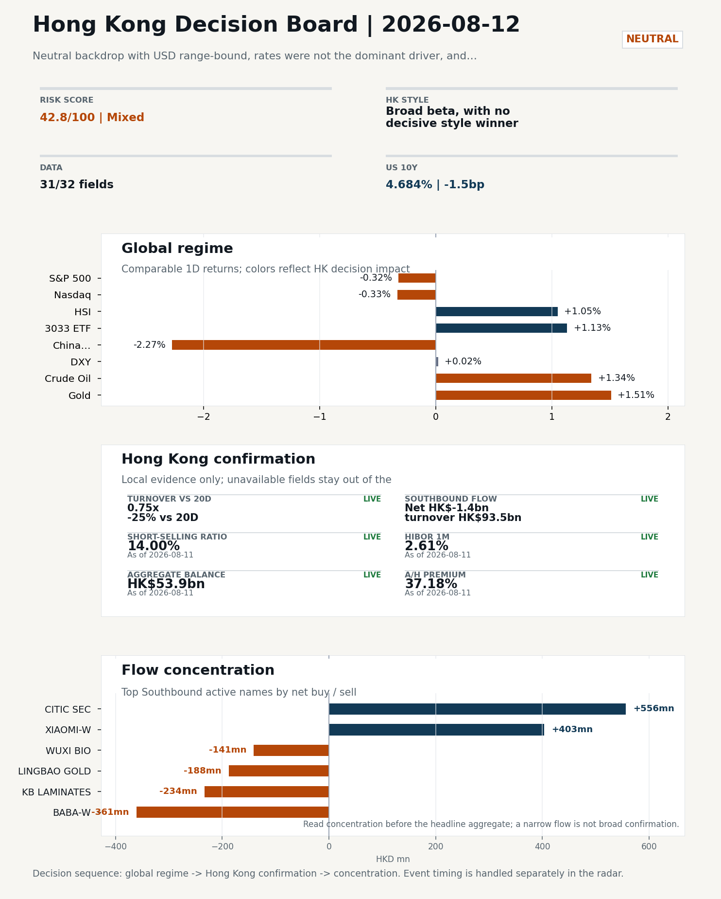
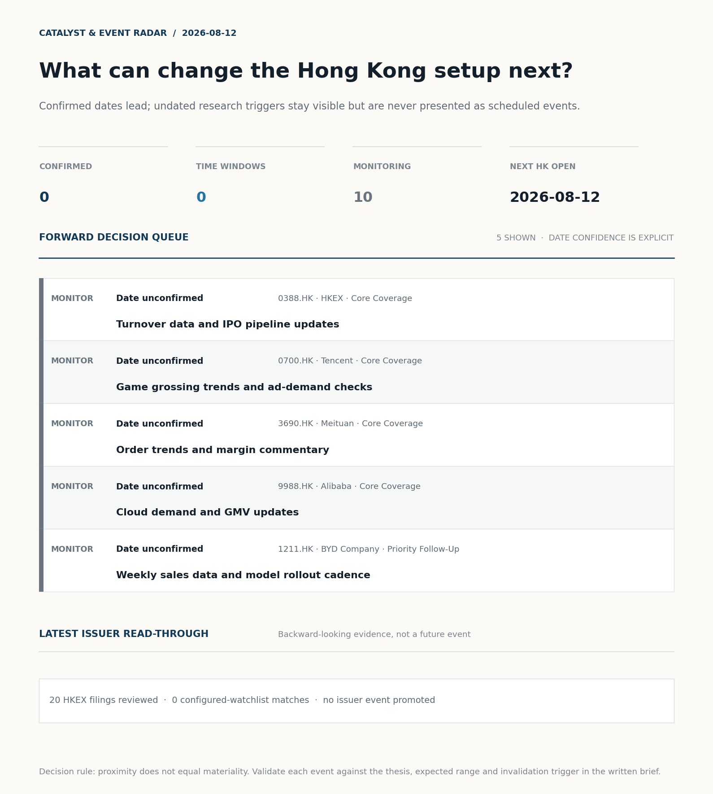
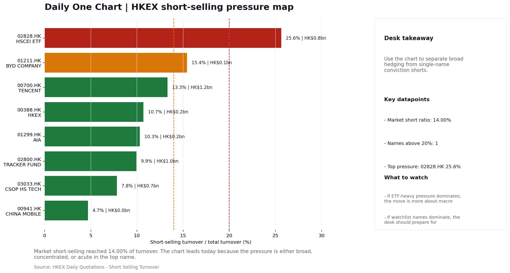
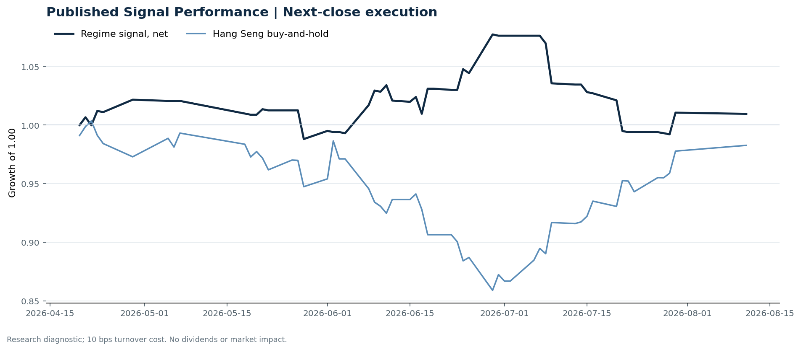

# Morning Research Workbench | 2026-08-12

> **Commute reading route:** `5-minute decision scan` → `25-30 minute deep read` → `10-15 minute optional appendix`
>
> Mode: `Trading Daily` | Keep the report execution-oriented: what mattered in the completed session, what can move Hong Kong leadership, and what needs fast follow-up.

_Data through: global `2026-08-11` | HK/China `2026-08-11` | Market effective `2026-08-11` | Generated `2026-08-12 06:04:37`_

## Executive Summary

- **Market pulse:** Hong Kong's growth-led advance (3033.HK +1.13% vs HSCEI +1.06%) arrived on thin turnover and Southbound net selling, while overnight US-traded China proxies fell sharply, leaving the open.
- **Hong Kong lens:** Broad beta, with no decisive style winner: 3033.HK and HSCEI were separated by only 0.07pp (+1.13% versus +1.06%). Conviction is limited because turnover was only 0.75x its 20-day average; Southbound recorded -HK$1.4bn net selling; FXI (-2.27%) lagged HSI (+1.05%). Avoid forcing a growth-versus-value call; let volume, Southbound concentration, and the first-hour relative tape identify leadership.
- **What would confirm it:** Watch whether the Hong Kong open can sustain 3033.HK outperformance and if Southbound turns net buy; failure to do so, coupled with the FXI/KWEB overnight decline, would raise the risk that local gains prove.
- **What could break it:** Reclassify the tape when either 3033.HK or HSCEI opens a sustained 0.5pp relative lead with flow confirmation.

## Visual Dashboard

**Catalyst & Event Radar**

**Chart read:** No confirmed event date is populated; 10 undated research trigger(s) remain visible without invented timing.

_Source: Public calendars, issuer disclosures and configured research watchlists_
## Layer 1 | Scan (5 min)

### 1.2 Global Asset Price Dashboard
_Decision-useful subset: each row states the implication and the next test. Descriptive secondary monitors are kept out of the five-minute scan._

| Signal | Last / move | Interpretation | Confirmation / invalidation |
| --- | --- | --- | --- |
| S&P 500 | 7,728.20 / -0.32% | US beta weakened, reducing the external risk cushion for Hong Kong. | Confirm with Nasdaq breadth and a same-direction VIX move; invalidate if offshore-China proxies diverge. |
| Nasdaq 100 | 29,525.48 / -0.33% | Growth tracked broad beta, so the move looks market-wide rather than duration-led. | Confirm through the 3033.HK ETF versus HSI leadership; higher US yields would weaken the read. |
| Hang Seng Index | 25,937.49 / +1.05% | Hong Kong broad beta strengthened, but local flow must confirm whether the move is investable. | Confirm with Southbound participation and breadth; invalidate if USD/CNH weakens while turnover fades. |
| Hang Seng TECH ETF (3033.HK) | 4.8200 / +1.13% | Growth and broad beta moved together; there is no decisive style rotation yet. | Confirm with stable CNH, Southbound buying and lower yields; invalidate on growth underperformance with rising yields. |
| US 10Y | 4.6840% / -1.5bp | The yield proxy fell, easing the valuation headwind for duration-sensitive equities. | Confirm through Nasdaq and 3033.HK ETF relative performance; invalidate if growth leads despite the opposing rate move. |
| China 10Y | 1.72% / +0.9bp | Higher local yields may indicate firmer growth or tighter financial conditions; price action alone cannot distinguish them. | Use CSI 300, copper and official credit/activity data to separate growth optimism from demand weakness. |
| DXY | 99.83 / +0.02% | The dollar was range-bound and adds little directional information. | Confirm with USD/CNH moving in the same risk direction; divergence reduces conviction. |
| USD/CNH | 6.7310 / +0.00% | CNH was stable, removing an immediate FX impulse but not confirming equity direction. | Confirm with FXI, the 3033.HK ETF proxy and Southbound flow; invalidate if equities move opposite to FX with strong local participation. |
| VIX | 15.28 / -1.16% | Lower implied volatility reduces near-term stress, but is supportive only if equity breadth confirms. | Confirm with equity breadth and credit-sensitive assets; invalidate if lower VIX accompanies narrow or falling equities. |

_Secondary monitors retained in the source bundle: CSI 300, CN-US 10Y spread, USD/HKD, Brent crude, COMEX gold, Copper._

### 1.3 Hong Kong Key Data Quick Check

| Check | Value | Status | Source / as of | Why it matters |
| --- | --- | --- | --- | --- |
| Main Board turnover vs 20D | 0.75x \| -25% vs 20D | Live local | HKEX \| 2026-08-11 | Trailing 20-session average turnover was HK$279.6bn. |
| Southbound / Northbound net flow | Southbound Net HK$-1.4bn \| turnover HK$93.5bn \| Northbound Turnover HK$296.7bn \| net not reported | Live local | HKEX Connect \| 2026-08-11 | Southbound net buy is calculated from HKEX disclosed buy and sell turnover. |
| Short-selling ratio | 14.00% | Live local | HKEX \| 2026-08-11 | Official HKEX stock-level short-selling table, aggregated as a share of total market turnover. |
| AH premium index | 37.18% | Live public | Yahoo \| 2026-08-11 | Simple average across 17 A/H pairs; use dispersion rather than the average alone. |
| USD/HKD spot vs band | 7.8460 \| band 7.7500 to 7.8500 | Live quote + local | Yahoo \| 2026-08-11 | Close to the weak-side Convertibility Undertaking; keep HKMA liquidity operations in focus. Official Convertibility Undertakings define the linked-rate stress boundaries for USD/HKD. |
| HIBOR 1M | 2.61% | Live local | HKMA \| 2026-08-11 | 1M HIBOR is the cleanest quick read for Hong Kong funding conditions and equity-duration pressure. |
| Hong Kong leadership | Broad beta, with no decisive style winner | Proxy | HSI / HSCEI / 3033.HK ETF relative \| 2026-08-11 | Use HSI / HSCEI / 3033.HK ETF relative moves as the opening style read. |

### 1.4 Decision Board
**Composite risk score:** `42.8/100` | **Regime:** `Mixed`

| Component | Score impact | Evidence |
| --- | --- | --- |
| US beta | -1.9 | S&P 500 -0.32% |
| HK growth ETF proxy | +5.6 | 3033.HK ETF +1.13% |
| Offshore China proxy | -8 | FXI -2.27% |
| Dollar pressure | -0.2 | DXY +0.02% |

**Morning Checklist**

1. **Neutral backdrop with USD range-bound, rates were not the dominant driver, and Oil outperformed Gold**
 Overnight regime | Start by deciding whether the day is about Neutral conditions or a style pivot.
2. **[B] AI computing power is becoming a tradable asset class as CME launches futures contracts**
 News / announcements | This is more about order visibility and product-cycle validation
3. **Gold +1.51%**
 High-frequency data | Gold rising with the dollar looks more like geopolitical or pure hedge demand.
4. **WTI crude +1.34%**
 High-frequency data | A strong crude move needs to be split between geopolitics and demand repair.

## Layer 2 | Deep Read (20-30 min)

### 2.1 Overnight Overseas Market Review
**Market Setup**
**Core tape.** Neutral backdrop with USD range-bound, rates were not the dominant driver, and Oil outperformed Gold

**Hong Kong Read-Through**
**Desk lens.** Broad beta, with no decisive style winner.
**Evidence.** 3033.HK and HSCEI were separated by only 0.07pp (+1.13% versus +1.06%)
**Investment read.** Avoid forcing a growth-versus-value call; let volume, Southbound concentration, and the first-hour relative tape identify leadership.
- **Cross-market read:** Hang Seng +1.05% / HSCEI +1.06% / 3033.HK ETF +1.13%.
- **Cross-market read:** Offshore China proxy FXI -2.27% and USD/CNH +0.00% frame cross-border risk appetite.
- **Cross-market read:** USD/HKD last traded around 7.8460, which keeps the Hong Kong funding lens in focus.

**Watch Points**
- USD composite moved higher by +0.05pct intraday, with a 0.118pct range.
- Main turning points appeared around 2026-08-11 08:05 peak / 2026-08-11 08:20 peak / 2026-08-11 08:40 trough, suggesting event-driven repricing.
- The biggest cross-asset divergence was Oil versus Gold, a spread of 2.512pct.
- Gold moved -1.10pct intraday with a 1.349pct high-low range.

**Curated overnight stories**
1. **Nvidia lines up $500 billion in financing as CEO Jensen Huang tells CNBC his chips are**
 Why it matters: Frames AI compute as an institutional asset class and reinforces the AI capex cycle; media reference to China as a risk factor is part of the same narrative.
 HK read-through: Direct read-through to HK-listed AI, semiconductor and cloud-exposed names (e.g. SMIC, Tencent, Alibaba, Lenovo) and to the broader HK AI-themed basket.
2. **AI computing power is becoming a tradable asset class as CME launches futures contracts**
 Why it matters: CME, partnering with Silicon Data, plans two compute futures for Oct. 5 launch subject to regulatory review.
 HK read-through: Useful framing for HK-listed AI infrastructure, server and cloud names; supports any narrative around AI as a recurring revenue line, but the HK impact is thematic until.
3. **VIX -1.16%; rates were not the dominant driver in the overnight session**
 Why it matters: Stable volatility and a non-event rate backdrop confirm a Neutral regime heading into the next HK session.
 HK read-through: Supports HK offshore-China risk appetite and reduces the need for FX or rates hedging; more relevant for positioning than for a directional trade.

### 2.2 Hong Kong / A-share Previous-Day Review
**Local Tape Setup**
**Local read.** Hong Kong equities advanced on 11 Aug with the TECH ETF (3033.HK +1.13%) edging out HSCEI (+1.06%), signaling growth-led leadership.
**Verification point.** Turnover was only 0.75x the 20-day average, and Southbound Connect registered a net sell of HK$1.4bn, undermining conviction.
**Risk to watch.** Northbound net-buy data is unavailable, leaving cross-market flow confirmation incomplete.

**Style and Local Leadership**
**Style call.** Broad beta, with no decisive style winner.
- **Evidence:** 3033.HK and HSCEI were separated by only 0.07pp (+1.13% versus +1.06%)
- **Portfolio meaning:** Avoid forcing a growth-versus-value call; let volume, Southbound concentration, and the first-hour relative tape identify leadership.
- **Cross-market read:** Hang Seng +1.05% / HSCEI +1.06% / 3033.HK ETF +1.13%.
- **Cross-market read:** Offshore China proxy FXI -2.27% and USD/CNH +0.00% frame cross-border risk appetite.
- **Cross-market read:** USD/HKD last traded around 7.8460, which keeps the Hong Kong funding lens in focus.

**Flow Confirmation**
Official Stock Connect evidence is available; use Section 2.3 to confirm whether local money supports the price action.

**Follow-Through Checklist**
**Follow-through check.** Watch whether the Hong Kong open can sustain 3033.HK outperformance and if Southbound turns net buy; failure to do so, coupled with the FXI/KWEB overnight decline, would raise the risk that local gains prove fragile.
**Failure condition.** Reclassify the tape when either 3033.HK or HSCEI opens a sustained 0.5pp relative lead with flow confirmation.

### 2.3 Flow Tracker and Attribution
**Cross-Asset Attribution**

| Driver | Direction | Score | Evidence | HK implication |
| --- | --- | --- | --- | --- |
| Hong Kong participation | drag | 2.46 | Main Board turnover was 0.75x the 20-session average. | Thin turnover makes index moves easier to fade. |

**Local Flow Tracker**

**Flow Takeaways**
- Turnover is light versus the 20-session baseline, so local moves have weaker conviction.
- Stock Connect Southbound: net HK$-1.4bn on turnover HK$93.5bn (as of 2026-08-11).
- Stock Connect Northbound: turnover RMB296.7bn; public file provides total turnover/top active names, not full net-buy.
- AH premium: simple covered-pair average +37.18%; widest premium: Chalco 148.83%.

**Stock Connect Southbound Active Names**

| Rank | Ticker | Name | Buy | Sell | Net buy |
| --- | --- | --- | --- | --- | --- |
| 9 | 06030.HK | CITIC SEC | HK$580.0mn | HK$24.0mn | HK$556.0mn |
| 9 | 01810.HK | XIAOMI-W | HK$809.9mn | HK$407.0mn | HK$402.9mn |
| 1 | 09988.HK | BABA-W | HK$1,868.3mn | HK$2,228.9mn | HK$-360.6mn |
| 2 | 01888.HK | KB LAMINATES | HK$1,836.2mn | HK$2,069.7mn | HK$-233.5mn |
| 5 | 03330.HK | LINGBAO GOLD | HK$342.3mn | HK$530.0mn | HK$-187.6mn |

**AH Premium Dispersion**

| Name | A ticker | H ticker | Premium | As of |
| --- | --- | --- | --- | --- |
| Chalco | 601600.SS | 2600.HK | +148.83% | 2026-08-11 |
| China Communications Construction | 601800.SS | 1800.HK | +87.63% | 2026-08-11 |
| China Life | 601628.SS | 2628.HK | +58.68% | 2026-08-11 |
| China Railway Construction | 601186.SS | 1186.HK | +55.08% | 2026-08-11 |
| China Railway | 601390.SS | 0390.HK | +49.66% | 2026-08-11 |

**HKEX Short-Selling Watch**

| Ticker | Name | Short ratio | Short turnover | Total turnover |
| --- | --- | --- | --- | --- |
| 00388.HK | HKEX | 10.69% | HK$0.2bn | HK$1.8bn |
| 00700.HK | TENCENT | 13.31% | HK$1.2bn | HK$9.3bn |
| 00941.HK | CHINA MOBILE | 4.69% | HK$0.0bn | HK$0.8bn |
| 01211.HK | BYD COMPANY | 15.43% | HK$0.1bn | HK$0.9bn |
| 01299.HK | AIA | 10.30% | HK$0.2bn | HK$2.4bn |

- **Short-value leaders:** 07709.HK XL2CSOPHYNIX (HK$2.1bn); 09988.HK BABA-W (HK$1.7bn); 00700.HK TENCENT (HK$1.2bn); 02800.HK TRACKER FUND (HK$1.0bn).

### 2.4 Macro and Policy Tracking
**Desk read.** Use the calendar table and released data below as the primary macro read.

The macro calendar was light for this run.

**Positioning and Risk Backdrop**

- Detailed local flow evidence is covered in Section 2.3; keep this section focused on options, hedging, and macro-positioning risk.

### 2.5 Company Catalysts and Risk Monitor

| Grade | Sector | Headline | Why it matters | Horizon |
| --- | --- | --- | --- | --- |
| B | Financials | AI computing power is becoming a tradable asset class as CME | This is more about order visibility and product-cycle validation | Short-term catalyst |

**Company Event Takeaway**
**Desk read.** The session delivered no estimate-changing corporate filings, rating actions, or granular earnings surprises.
**Why it matters.** A cluster of headline-only profit warnings from small/mid-cap names lacks magnitude, so no EPS impact should be inferred.
**Follow-up.** The one cross-market development worth flagging: CME Group announced plans to launch AI compute futures contracts (pending regulatory review).

**LLM Quick Takes**
- **0700.HK** | Fact: Tencent Music Entertainment (TME) shares fell after reporting slowing sequential revenue growth. Investor read
- **0388.HK** | Fact: CME Group is partnering with Silicon Data to launch AI compute futures contracts on Oct 5, pending regulatory review. Investor read

Decision filter<h4>No immediate portfolio catalyst: 20 official filings were screened and the low-signal market set stays aggregated.</h4>
20 profit warnings

<strong>20</strong>Official filings

<strong>0</strong>Watchlist hits

<strong>0</strong>Actionable events

<strong>No event cleared the portfolio decision filter.</strong>

Broad-market filings remain traceable in the source appendix; they are not expanded here without a watchlist, estimate or liquidity read-through.

<strong>Coverage boundary.</strong> Earnings calendar, sell-side rating changes, IPO / grey-market monitor were not decision-grade in this run; their absence is not treated as confirmation that no event exists.

### 2.6 Today's Core Names
**Core coverage**

| Name | Ticker | Last | 1D | Range position | Morning note |
| --- | --- | --- | --- | --- | --- |
| HKEX | 0388.HK | 405.40 | -2.74% | Top of range | Short-term pressure is visible; check for a fundamental or regulatory reason. |
| Tencent | 0700.HK | 470.80 | -2.20% | Mid-range | Short-term pressure is visible; check for a fundamental or regulatory reason. |

**Recent headlines for Tencent:**
- [Tencent's Second-Quarter Revenue Growth Slows Sequentially; Shares Slump](https://finance.yahoo.com/markets/stocks/articles/tencent-apos-second-quarter-revenue-143623898.html) (MT Newswires)

**Priority follow-up**

| Name | Ticker | Last | 1D | Range position | Morning note |
| --- | --- | --- | --- | --- | --- |
| BYD Company | 1211.HK | 89.70 | -2.82% | Mid-range | Short-term pressure is visible; check for a fundamental or regulatory reason. |
| AIA | 1299.HK | 72.85 | -2.21% | Bottom of range | Short-term pressure is visible; check for a fundamental or regulatory reason. |

## Layer 3 | Decision Deepening (10-15 min)

### 3.1 Rotating Theme Deep Dive

| Field | Read |
| --- | --- |
| Theme | Innovative Biotech and Out-Licensing |
| Angle for the day | Watch whether clinical data, approvals, and licensing momentum are still supporting the innovative-healthcare rerating story. |

**Theme desk read**
**Core thesis.** Today's tape is a neutral, rates-light backdrop with Gold +1.51% and WTI +1.34% doing the heavy lifting on the cross-asset screen.
**Evidence.** Against this, the rotating theme of Innovative Biotech and Out-Licensing asks whether clinical data, approvals, and licensing announcements are still doing the work of keeping the healthcare rerating story alive.
**What to test.** Two caveats from the supplied facts.

**Signals to keep in mind**
- Gold +1.51%: Gold rising with the dollar looks more like geopolitical or pure hedge demand.
- WTI crude +1.34%: A strong crude move needs to be split between geopolitics and demand repair.

**LLM watch items:**
- Confirm whether the Innovative Biotech and Out-Licensing theme has any direct Hong Kong-listed names on the desk - none were supplied in this pack
- Track the HKEX -2.74% move against range position 79.1% (top of range): the supplied note flags short-term pressure but does not provide a
- Decompose the WTI +1.34% print between geopolitics and demand repair; the split matters because an oil-led risk-off read would weigh on biotech risk
- Confirm whether Gold +1.51% alongside a range-bound USD is geopolitical hedge demand (risk-asset negative) or macro-stress demand
- Watch for clinical readouts, FDA/EMA actions, and out-licensing deal announcements under the theme - the supplied upcoming and news arrays are

**Related names to keep close:**

| Name | Ticker | Bucket | Morning read |
| --- | --- | --- | --- |
| HKEX | 0388.HK | Core coverage | Short-term pressure is visible; check for a fundamental or regulatory reason. |
| BYD Company | 1211.HK | Priority follow-up | Short-term pressure is visible; check for a fundamental or regulatory reason. |

### 3.2 Today Ahead and Trading Calendar
- The calendar is relatively light, so the market may trade more off positioning and overnight headlines.

**Same-day macro docket**
No same-day macro items were scheduled.

**Same-day catalyst list**
No same-day catalysts were highlighted.

**Next few sessions**
No forward catalyst list was populated.

### 3.3 Daily One Chart
**Daily One Chart | HKEX short-selling pressure map**

**Chart read.** Market short-selling reached 14.00% of turnover.
**Why it matters.** The chart leads today because the pressure is either broad, concentrated, or acute in the top name.

_Source: HKEX Daily Quotations - Short Selling Turnover_

## Optional Appendix | Traceability and Performance (10-15 min)

### Report Metadata
> Date policy: Review date 2026-08-11 is treated as `Trading Daily`. | Global request date is 2026-08-11; adapter effective date is 2026-08-11 and summary date is 2026-08-11. | HK/China local data date is 2026-08-11; role: same-session local cash tape.
> Market data quality: Coverage: `31/32` | Missing: `1`
> Report quality: `88.2/100` | Grade `B` | Status `production ready`

### Key Questions to Keep in Mind
- Is risk appetite rising or fading? The overnight tape reads closer to `Neutral`.
- Did rates expectations move? Focus on whether US 10Y, DXY, and growth style moved together.
- Were commodities the real story? Watch WTI and gold for geopolitics versus inflation signals.
- Is Hong Kong setup growth-led, SOE-led, or broad beta-led? Compare the 3033.HK ETF proxy, HSCEI, and HSI.
- Did offshore markets move China risk appetite? Focus on HSI, FXI, USD/CNH, and USD/HKD.

### Report Quality and Validation
- **Quality score:** 88.2/100 | **Grade:** B | **Status:** production ready
- **Run summary:** 7 healthy | 1 caveat | 2 failed
- **Release recommendation:** Send with caveats | The report is usable, but the advisory guidance should travel with it so readers understand the data gaps.

| Source | Status | Bucket |
| --- | --- | --- |
| Market data | ok | healthy |
| Sector and company news | ok | healthy |
| Movers and short selling | ok | healthy |
| Stock Connect | ok | healthy |
| A/H premium | ok | healthy |
| Hong Kong local package | ok | healthy |
| China rates | ok | healthy |
| Macro calendar | unavailable | failed |
| Risk and sentiment feed | unavailable | failed |
| Narrative overlay | partial | caveat |

**Desk-use guidance summary:** 0 blocking | 1 advisory

**Desk-use guidance**
- **Advisory:** Use deterministic sections as primary support; the narrative overlay was partial or unavailable on this run.

| Component | Score | Weight | Read |
| --- | --- | --- | --- |
| Market data coverage | 96.9 | 0.2 | 31/32 core market fields available. |
| Hong Kong local metrics | 82.3 | 0.2 | 8 live, 3 proxy, 0 unavailable local checks. |
| Key public adapters | 100.0 | 0.2 | 4/4 key adapters were available or partially available. |
| Narrative overlay health | 53.6 | 0.1 | 2/7 narrative overlay tasks succeeded or used validated cache; 1 error(s). |
| Fact-check guardrail | 100.0 | 0.15 | Checked 22 numeric claims; 0 numeric mismatch(es), 0 logic warning(s); 0 structured claims, 0 source/text warning(s). |
| Source provenance | 92.0 | 0.05 | 42 provenance record(s) validated; 2 unavailable source record(s). |
| Source health and freshness | 73.1 | 0.1 | 8 healthy, 0 degraded, 2 unavailable source group(s). |

**Quality warnings**
- Narrative overlay health is weak: 2/7 narrative overlay tasks succeeded or used validated cache; 1 error(s).

**Narrative fact-check guardrail**
- Checked 22 numeric claims; 0 numeric mismatch(es), 0 logic warning(s); 0 structured claims, 0 source/text warning(s); 0 critical, 0 review.

**Source provenance validation**
- Status: ok | records checked: 42 | unavailable: 2

**Source health and freshness**
- **Source health:** degraded | 8 healthy | 0 degraded | 2 unavailable

| Source | Critical | Status | Score | Fresh coverage | Age range | Policy |
| --- | --- | --- | --- | --- | --- | --- |
| hk_local | Yes | healthy | 98.5 | 1/1 | 1 - 1d | ≤4d / ≥100% |
| macro_calendar | No | unavailable | 0.0 | 0/0 | Unknown | ≤14d / ≥0% |
| market_data | Yes | healthy | 93.0 | 31/31 | 1 - 2d | ≤4d / ≥80% |
| risk_feed | No | unavailable | 0.0 | 0/0 | Unknown | ≤4d / ≥0% |

**Adapter status**

| Adapter | Status |
| --- | --- |
| Stock Connect | ok |
| A/H premium | ok |
| HKEX announcements | ok |
| China rates | ok |

### Historical Signal Performance
- **Readiness:** exploratory with caveats | 65 market observations | 77 active signal dates
- **Execution rule:** use only the next available close after publication; 10 bps turnover cost by default. Current-day signals never receive same-day returns.
- **Interpretation boundary:** results are exploratory until a benchmark reaches 252 sessions and 100 active-signal sessions.

| Benchmark | Sessions | Signal net | Buy & hold | Excess | Max drawdown | Hit rate |
| --- | --- | --- | --- | --- | --- | --- |
| Hang Seng Index | 56 | 1.0% | -1.7% | 2.7% | -7.9% | 48.1% |
| Hang Seng TECH ETF (3033.HK) | 55 | -2.1% | -3.5% | 1.3% | -13.3% | 48.1% |

**Hang Seng event-horizon diagnostics**

| Horizon | Resolved | Hit rate | Average net return |
| --- | --- | --- | --- |
| 1 sessions | 33 | 51.5% | 0.1% |
| 5 sessions | 30 | 56.7% | -0.0% |
| 20 sessions | 24 | 41.7% | -1.1% |

- **Data-quality caveat:** 17 conflicting historical price revision(s) and 6 weekend pseudo-session observation(s) were handled explicitly; inspect the ledger before relying on the result.
- **Use boundary:** this is a close-to-close research diagnostic, not an executable strategy or investment recommendation; dividends, financing, borrow and market impact are excluded.

### Source Links
- [AI computing power is becoming a tradable asset class as CME launches futures contracts](https://www.cnbc.com/2026/08/11/ai-computing-power-becomes-a-tradable-asset-class-as-cme-starts-futures.html) (cnbc_markets)
- [Tencent's Second-Quarter Revenue Growth Slows Sequentially; Shares Slump](https://finance.yahoo.com/markets/stocks/articles/tencent-apos-second-quarter-revenue-143623898.html) (MT Newswires)
- [JB Global Capital: Lessons from Lululemon's (LULU) Investment Case](https://finance.yahoo.com/markets/stocks/articles/jb-global-capital-lessons-lululemon-142709356.html) (Insider Monkey)
- [Flowers Foods (FLO) Cuts Dividend to Strengthen Financial Health](https://finance.yahoo.com/markets/stocks/articles/flowers-foods-flo-cuts-dividend-142459308.html) (Insider Monkey)
- [00379.HK Profit warning / alert announcement](http://www1.hkexnews.hk/listedco/listconews/sehk/2026/0811/2026081101180.pdf) (HKEXnews)
- [00496.HK Profit warning / alert announcement](http://www1.hkexnews.hk/listedco/listconews/sehk/2026/0811/2026081101234.pdf) (HKEXnews)
- [00611.HK Profit warning / alert announcement](http://www1.hkexnews.hk/listedco/listconews/sehk/2026/0811/2026081101104.pdf) (HKEXnews)
- [00864.HK Profit warning / alert announcement](http://www1.hkexnews.hk/listedco/listconews/sehk/2026/0811/2026081101264.pdf) (HKEXnews)
- [00866.HK Profit warning / alert announcement](http://www1.hkexnews.hk/listedco/listconews/sehk/2026/0811/2026081101240.pdf) (HKEXnews)
- [00889.HK Profit warning / alert announcement](http://www1.hkexnews.hk/listedco/listconews/sehk/2026/0811/2026081100371.pdf) (HKEXnews)
- [01073.HK Profit warning / alert announcement](http://www1.hkexnews.hk/listedco/listconews/sehk/2026/0811/2026081100565.pdf) (HKEXnews)
- [01134.HK Profit warning / alert announcement](http://www1.hkexnews.hk/listedco/listconews/sehk/2026/0811/2026081100297.pdf) (HKEXnews)

## Supplementary Visual Appendix

This appendix is professional-path only. It keeps a traceable index of the report visuals and the deterministic chart cues used to frame the morning note, without injecting the legacy intraday chart pack.

### Visual Index

| Visual | Path | Role |
| --- | --- | --- |
| Visual Dashboard | `charts/dashboard_2026-08-12.png` | Cross-asset regime board and Hong Kong local tape snapshot. |
| Catalyst & Event Radar | `charts/catalyst_radar_2026-08-12.png` | Confirmed dates, time windows, undated monitors, and recent issuer read-through. |
| Daily One Chart | `charts/daily_one_chart_2026-08-12.png` | Single highest-conviction visual story for the day. |

### Deterministic Chart Cues
- FX / liquidity: USD composite moved higher by +0.05pct intraday, with a 0.118pct range.
- FX / liquidity: Main turning points appeared around 2026-08-11 08:05 peak / 2026-08-11 08:20 peak / 2026-08-11 08:40 trough, suggesting event-driven repricing rather than a clean one-way USD move.
- Cross-asset: The biggest cross-asset divergence was Oil versus Gold, a spread of 2.512pct.
- Cross-asset: Gold moved -1.10pct intraday with a 1.349pct high-low range.
- Cross-asset: Oil moved +1.41pct intraday with a 3.899pct high-low range.
- Cross-asset: Bitcoin moved -0.28pct intraday with a 1.932pct high-low range.

### Risk Dashboard Components

| Component | Score impact | Evidence |
| --- | --- | --- |
| US beta | -1.9 | S&P 500 -0.32% |
| HK growth ETF proxy | +5.6 | 3033.HK ETF +1.13% |
| Offshore China proxy | -8 | FXI -2.27% |
| Dollar pressure | -0.2 | DXY +0.02% |
| Volatility | +2.3 | VIX -1.16% |
| HK short-selling | +0 | Short-selling ratio 14.00% |
