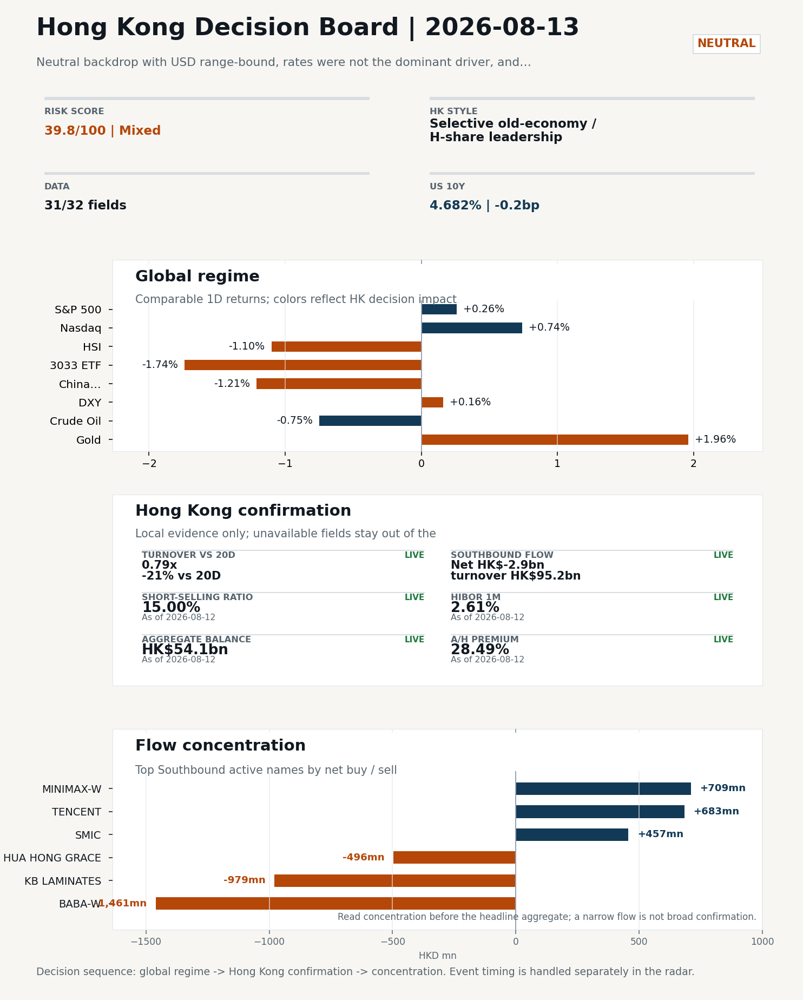
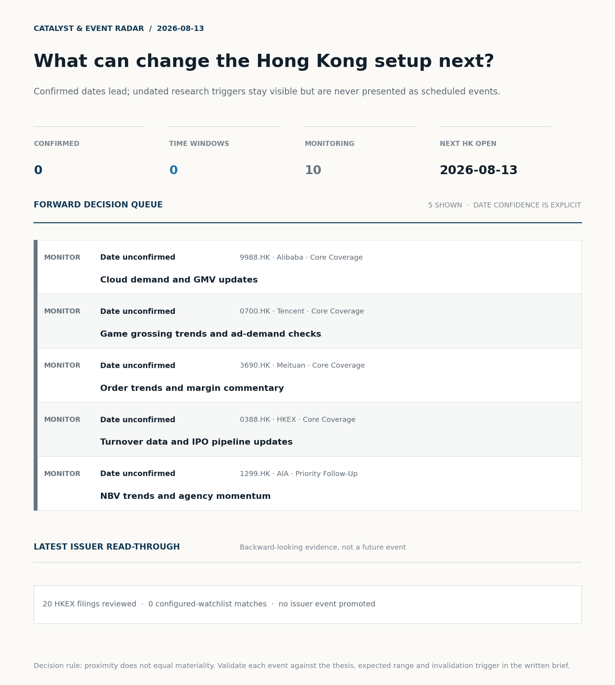
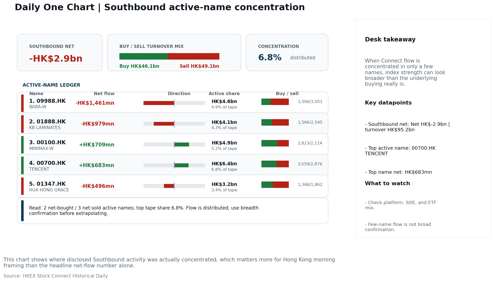
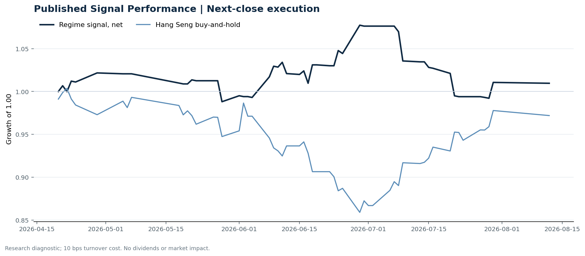

# Morning Research Workbench | 2026-08-13

> **Commute reading route:** `5-minute decision scan` → `25-30 minute deep read` → `10-15 minute optional appendix`
>
> Mode: `Trading Daily` | Keep the report execution-oriented: what mattered in the completed session, what can move Hong Kong leadership, and what needs fast follow-up.

_Data through: global `2026-08-12` | HK/China `2026-08-12` | Market effective `2026-08-12` | Generated `2026-08-13 06:02:10`_

## Executive Summary

- **Market pulse:** Neutral backdrop with USD range-bound, rates were not the dominant driver, and Gold outperformed Oil
- **Hong Kong lens:** Selective old-economy / H-share leadership: HSCEI beat 3033.HK by 0.65pp (-1.09% versus -1.74%). Conviction is limited because turnover was only 0.79x its 20-day average; Southbound recorded -HK$2.9bn net selling. Treat banks, energy, telecoms, and SOE yield as the cleaner relative expression; growth beta still needs proof.
- **What would confirm it:** Confirm if HSCEI keeps outperforming 3033.HK with healthy turnover and broad Southbound participation.
- **What could break it:** Invalidate if 3033.HK retakes leadership while CNH firms and local participation broadens.

## Visual Dashboard

**Catalyst & Event Radar**

**Chart read:** No confirmed event date is populated; 10 undated research trigger(s) remain visible without invented timing.

_Source: Public calendars, issuer disclosures and configured research watchlists_
## Layer 1 | Scan (5 min)

### 1.2 Global Asset Price Dashboard
_Decision-useful subset: each row states the implication and the next test. Descriptive secondary monitors are kept out of the five-minute scan._

| Signal | Last / move | Interpretation | Confirmation / invalidation |
| --- | --- | --- | --- |
| S&P 500 | 7,748.50 / +0.26% | US beta improved, raising the global risk floor for Hong Kong. Falling volatility confirms lower near-term stress. | Confirm with Nasdaq breadth and a same-direction VIX move; invalidate if offshore-China proxies diverge. |
| Nasdaq 100 | 29,742.60 / +0.74% | Growth outperformed broad beta, a supportive style signal for Hong Kong internet and platform names. | Confirm through the 3033.HK ETF versus HSI leadership; higher US yields would weaken the read. |
| Hang Seng Index | 25,652.82 / -1.10% | Hong Kong broad beta weakened and needs offshore or policy support to stabilize. | Confirm with Southbound participation and breadth; invalidate if USD/CNH weakens while turnover fades. |
| Hang Seng TECH ETF (3033.HK) | 4.7360 / **-1.74%** | Hong Kong growth lagged, so broad-index strength is not yet a duration signal. | Confirm with stable CNH, Southbound buying and lower yields; invalidate on growth underperformance with rising yields. |
| US 10Y | 4.6820% / -0.2bp | The yield proxy fell, easing the valuation headwind for duration-sensitive equities. | Confirm through Nasdaq and 3033.HK ETF relative performance; invalidate if growth leads despite the opposing rate move. |
| China 10Y | 1.71% / -0.2bp | Lower local yields may reflect easing support or softer demand; the signal is ambiguous without growth confirmation. | Use CSI 300, copper and official credit/activity data to separate growth optimism from demand weakness. |
| DXY | 99.98 / +0.16% | A firmer dollar tightens the external-liquidity backdrop and can pressure offshore-China risk appetite. | Confirm with USD/CNH moving in the same risk direction; divergence reduces conviction. |
| USD/CNH | 6.7305 / +0.00% | CNH was stable, removing an immediate FX impulse but not confirming equity direction. | Confirm with FXI, the 3033.HK ETF proxy and Southbound flow; invalidate if equities move opposite to FX with strong local participation. |
| VIX | 14.55 / **-4.78%** | Lower implied volatility reduces near-term stress, but is supportive only if equity breadth confirms. | Confirm with equity breadth and credit-sensitive assets; invalidate if lower VIX accompanies narrow or falling equities. |

_Secondary monitors retained in the source bundle: CSI 300, CN-US 10Y spread, USD/HKD, Brent crude, COMEX gold, Copper._

### 1.3 Hong Kong Key Data Quick Check

| Check | Value | Status | Source / as of | Why it matters |
| --- | --- | --- | --- | --- |
| Main Board turnover vs 20D | 0.79x \| -21% vs 20D | Live local | HKEX \| 2026-08-12 | Trailing 20-session average turnover was HK$274.5bn. |
| Southbound / Northbound net flow | Southbound Net HK$-2.9bn \| turnover HK$95.2bn \| Northbound Turnover HK$282.3bn \| net not reported | Live local | HKEX Connect \| 2026-08-12 | Southbound net buy is calculated from HKEX disclosed buy and sell turnover. |
| Short-selling ratio | 15.00% | Live local | HKEX \| 2026-08-12 | Official HKEX stock-level short-selling table, aggregated as a share of total market turnover. |
| AH premium index | 28.49% | Live public | Yahoo \| 2026-08-12 | Simple average across 17 A/H pairs; use dispersion rather than the average alone. |
| USD/HKD spot vs band | 7.8459 \| band 7.7500 to 7.8500 | Live quote + local | Yahoo \| 2026-08-12 | Close to the weak-side Convertibility Undertaking; keep HKMA liquidity operations in focus. Official Convertibility Undertakings define the linked-rate stress boundaries for USD/HKD. |
| HIBOR 1M | 2.61% | Live local | HKMA \| 2026-08-12 | 1M HIBOR is the cleanest quick read for Hong Kong funding conditions and equity-duration pressure. |
| Hong Kong leadership | Selective old-economy / H-share leadership | Proxy | HSI / HSCEI / 3033.HK ETF relative \| 2026-08-12 | Use HSI / HSCEI / 3033.HK ETF relative moves as the opening style read. |

### 1.4 Decision Board
**Composite risk score:** `39.8/100` | **Regime:** `Mixed`

| Component | Score impact | Evidence |
| --- | --- | --- |
| US beta | +1.6 | S&P 500 +0.26% |
| HK growth ETF proxy | -8.7 | 3033.HK ETF -1.74% |
| Offshore China proxy | -6.0 | FXI -1.21% |
| Dollar pressure | -1.6 | DXY +0.16% |

**Morning Checklist**

1. **Neutral backdrop with USD range-bound, rates were not the dominant driver, and Gold outperformed Oil**
 Overnight regime | Start by deciding whether the day is about Neutral conditions or a style pivot.
2. **VIX -4.78%**
 High-frequency data | Lower volatility signals easing stress in the tape.
3. **[B] Alphabet's stock slips as Nvidia's $500 billion financing deal threatens custom chips**
 News / announcements | Capital allocation or shareholder-return events can trigger a valuation reset
4. **[B] AI computing power is becoming a tradable asset class as CME launches futures contracts**
 News / announcements | This is more about order visibility and product-cycle validation

## Layer 2 | Deep Read (20-30 min)

### 2.1 Overnight Overseas Market Review
**Market Setup**
**Core tape.** Neutral backdrop with USD range-bound, rates were not the dominant driver, and Gold outperformed Oil

**Hong Kong Read-Through**
**Desk lens.** Selective old-economy / H-share leadership.
**Evidence.** HSCEI beat 3033.HK by 0.65pp (-1.09% versus -1.74%)
**Investment read.** Treat banks, energy, telecoms, and SOE yield as the cleaner relative expression; growth beta still needs proof.
- **Cross-market read:** Hang Seng -1.10% / HSCEI -1.09% / 3033.HK ETF -1.74%.
- **Cross-market read:** Offshore China proxy FXI -1.21% and USD/CNH +0.00% frame cross-border risk appetite.
- **Cross-market read:** USD/HKD last traded around 7.8459, which keeps the Hong Kong funding lens in focus.

**Watch Points**
- USD composite moved higher by +0.09pct intraday, with a 0.252pct range.
- Main turning points appeared around 2026-08-12 08:05 trough / 2026-08-12 08:50 peak / 2026-08-12 09:05 peak, suggesting event-driven repricing.
- The biggest cross-asset divergence was Gold versus Oil, a spread of 2.063pct.
- Gold moved +0.14pct intraday with a 1.181pct high-low range.

**Curated overnight stories**
1. **EVs dominate China's car market: 5 takeaways from the country's latest auto sales data**
 Why it matters: Direct read on China's passenger-vehicle mix; relevant for HK-listed auto OEMs, battery and EV supply chain names that anchor Hang Seng sector weight.
 HK read-through: Likely sets tone for HK autos/EV names (BYD, Geely, Li Auto, XPeng, Great Wall) and component peers at the open.
2. **Why Jensen Huang's $500 billion AI financing plan faces a big risk from China**
 Why it matters: Highlights China-related execution risk on the largest AI capex announcement of the cycle; feeds valuation debate for global AI infrastructure and its HK-listed exposures.
 HK read-through: Pressure point for HK AI/semiconductor proxies and China cloud-capex plays; reinforces the 'China exposure discount' theme that has weighed on select HK tech names.
3. **Alphabet's stock slips as Nvidia's $500 billion financing deal threatens custom chips**
 Why it matters: Signals capital-allocation pressure on custom-silicon programs and validates the scale of Nvidia-linked AI funding; relevant for the global AI compute value chain.
 HK read-through: Read-across to HK-listed AI/semi names and US-listed China ADRs in AI infrastructure; could re-rank order books and ASIC vs GPU narrative across the Asia tech complex.
4. **AI computing power is becoming a tradable asset class as CME launches futures contracts**
 Why it matters: First exchange-traded reference point for compute capacity; increases price discovery and transparency for AI capex assumptions used across the industry.
 HK read-through: Indirect but useful: provides a benchmark that HK sell-side can use to value data-center and cloud exposure in HK-listed tech and REIT names.
5. **VIX -4.78%**
 Why it matters: Sharp drop in US equity volatility with USD range-bound and Gold outperforming Oil points to easing stress and a defensive bid in gold, not a USD-liquidity event.
 HK read-through: Constructive backdrop for HK risk assets at the open; lowers the bar for risk-on positioning in HK growth/tech, but Gold leadership argues against a strong pro-cyclical.

### 2.2 Hong Kong / A-share Previous-Day Review
**Style and Local Leadership**
**Style call.** Selective old-economy / H-share leadership.
- **Evidence:** HSCEI beat 3033.HK by 0.65pp (-1.09% versus -1.74%)
- **Portfolio meaning:** Treat banks, energy, telecoms, and SOE yield as the cleaner relative expression; growth beta still needs proof.
- **Cross-market read:** Hang Seng -1.10% / HSCEI -1.09% / 3033.HK ETF -1.74%.
- **Cross-market read:** Offshore China proxy FXI -1.21% and USD/CNH +0.00% frame cross-border risk appetite.
- **Cross-market read:** USD/HKD last traded around 7.8459, which keeps the Hong Kong funding lens in focus.

**Flow Confirmation**
Official Stock Connect evidence is available; use Section 2.3 to confirm whether local money supports the price action.

**Follow-Through Checklist**
**Follow-through check.** Confirm if HSCEI keeps outperforming 3033.HK with healthy turnover and broad Southbound participation.
**Failure condition.** Invalidate if 3033.HK retakes leadership while CNH firms and local participation broadens.

### 2.3 Flow Tracker and Attribution
**Cross-Asset Attribution**

| Driver | Direction | Score | Evidence | HK implication |
| --- | --- | --- | --- | --- |
| Hong Kong participation | drag | 2.1 | Main Board turnover was 0.79x the 20-session average. | Thin turnover makes index moves easier to fade. |

**Local Flow Tracker**

**Flow Takeaways**
- Turnover is light versus the 20-session baseline, so local moves have weaker conviction.
- Stock Connect Southbound: net HK$-2.9bn on turnover HK$95.2bn (as of 2026-08-12).
- Stock Connect Northbound: turnover RMB282.3bn; public file provides total turnover/top active names, not full net-buy.
- AH premium: simple covered-pair average +28.49%; widest premium: China Life 60.29%.

**Stock Connect Southbound Active Names**

| Rank | Ticker | Name | Buy | Sell | Net buy |
| --- | --- | --- | --- | --- | --- |
| 2 | 09988.HK | BABA-W | HK$1,590.1mn | HK$3,050.6mn | HK$-1,460.5mn |
| 4 | 01888.HK | KB LAMINATES | HK$1,565.6mn | HK$2,544.6mn | HK$-979.1mn |
| 3 | 00100.HK | MINIMAX-W | HK$2,823.0mn | HK$2,113.7mn | HK$709.3mn |
| 1 | 00700.HK | TENCENT | HK$3,559.5mn | HK$2,876.2mn | HK$683.3mn |
| 6 | 01347.HK | HUA HONG GRACE | HK$1,366.3mn | HK$1,861.9mn | HK$-495.6mn |

**AH Premium Dispersion**

| Name | A ticker | H ticker | Premium | As of |
| --- | --- | --- | --- | --- |
| China Life | 601628.SS | 2628.HK | +60.29% | 2026-08-12 |
| China Railway Construction | 601186.SS | 1186.HK | +55.60% | 2026-08-12 |
| China Communications Construction | 601800.SS | 1800.HK | +53.56% | 2026-08-12 |
| China Railway | 601390.SS | 0390.HK | +49.65% | 2026-08-12 |
| CRRC | 601766.SS | 1766.HK | +39.85% | 2026-08-12 |

**HKEX Short-Selling Watch**

| Ticker | Name | Short ratio | Short turnover | Total turnover |
| --- | --- | --- | --- | --- |
| 00388.HK | HKEX | 17.08% | HK$0.2bn | HK$1.1bn |
| 00700.HK | TENCENT | 15.87% | HK$2.0bn | HK$12.7bn |
| 00941.HK | CHINA MOBILE | 7.81% | HK$0.1bn | HK$1.0bn |
| 01211.HK | BYD COMPANY | 17.20% | HK$0.2bn | HK$0.9bn |
| 01299.HK | AIA | 7.89% | HK$0.2bn | HK$2.3bn |

- **Short-value leaders:** 07709.HK XL2CSOPHYNIX (HK$3.2bn); 02800.HK TRACKER FUND (HK$2.4bn); 00700.HK TENCENT (HK$2.0bn); 01810.HK XIAOMI-W (HK$1.0bn).

### 2.4 Macro and Policy Tracking
**Desk read.** Use the calendar table and released data below as the primary macro read.

The macro calendar was light for this run.

**Positioning and Risk Backdrop**

- Detailed local flow evidence is covered in Section 2.3; keep this section focused on options, hedging, and macro-positioning risk.

### 2.5 Company Catalysts and Risk Monitor

| Grade | Sector | Headline | Why it matters | Horizon |
| --- | --- | --- | --- | --- |
| B | Semiconductors and AI | Alphabet's stock slips as Nvidia's $500 billion financing deal | Capital allocation or shareholder-return events can trigger a valuation | Medium-term trend |
| B | Financials | AI computing power is becoming a tradable asset class as CME | This is more about order visibility and product-cycle validation | Short-term catalyst |
| B | Autos and EV | Singer Vehicle Founder on Louis Vuitton Partnership | Assess whether the story can propagate through the Autos and EV value | Monitor |

Decision filter<h4>No immediate portfolio catalyst: 20 official filings were screened and the low-signal market set stays aggregated.</h4>
20 profit warnings

<strong>20</strong>Official filings

<strong>0</strong>Watchlist hits

<strong>0</strong>Actionable events

<strong>No event cleared the portfolio decision filter.</strong>

Broad-market filings remain traceable in the source appendix; they are not expanded here without a watchlist, estimate or liquidity read-through.

<strong>Coverage boundary.</strong> Earnings calendar, sell-side rating changes, IPO / grey-market monitor were not decision-grade in this run; their absence is not treated as confirmation that no event exists.

### 2.6 Today's Core Names
**Core coverage**

| Name | Ticker | Last | 1D | Range position | Morning note |
| --- | --- | --- | --- | --- | --- |
| Alibaba | 9988.HK | 122.60 | -3.01% | Top of range | Short-term pressure is visible; check for a fundamental or regulatory reason. |
| Tencent | 0700.HK | 461.60 | -1.95% | Mid-range | Positioning is neutral for now, so use it mainly to monitor marginal information changes. |

**Recent headlines for Alibaba:**
- [JB Global Capital: Lessons from Lululemon's (LULU) Investment Case](https://finance.yahoo.com/markets/stocks/articles/jb-global-capital-lessons-lululemon-142709356.html) (Insider Monkey)
**Recent headlines for Tencent:**
- [Tencent Stock Drops 4.3% as AI Capex Jumps 66%](https://finance.yahoo.com/markets/stocks/articles/tencent-stock-drops-4-3-171947375.html) (GuruFocus.com)

**Priority follow-up**

| Name | Ticker | Last | 1D | Range position | Morning note |
| --- | --- | --- | --- | --- | --- |
| AIA | 1299.HK | 72.65 | -0.27% | Bottom of range | The name sits near the bottom of its recent range and is worth monitoring for a catalyst-led reversal. |
| BYD Company | 1211.HK | 89.60 | -0.11% | Mid-range | Positioning is neutral for now, so use it mainly to monitor marginal information changes. |

## Layer 3 | Decision Deepening (10-15 min)

### 3.1 Rotating Theme Deep Dive

| Field | Read |
| --- | --- |
| Theme | China Exports and Supply-Chain Relocation |
| Angle for the day | Track tariffs, trade policy, shipping, and manufacturing orders to see whether export resilience is still the cleaner China macro expression. |

**Theme desk read**
**Core thesis.** The weekly theme - China Exports and Supply-Chain Relocation - is being tested in a low-stress tape rather than a directional one.
**Evidence.** With USD range-bound and rates not the dominant driver, the cleaner read is from real-economy proxies (shipping, manufacturing orders, export mix) rather than from financial conditions.
**What to test.** VIX -4.78% confirms easing stress, but that is a permissive backdrop, not a positive catalyst.

**Signals to keep in mind**
- VIX -4.78%: Lower volatility signals easing stress in the tape.
- Gold +1.96%: Gold rising with the dollar looks more like geopolitical or pure hedge demand.

**LLM watch items:**
- Tariff and trade-policy headlines: any escalation would re-rate the supply-chain relocation angle and likely lift gold versus oil.
- Shipping rates, container throughput, or manufacturing orders data: needed to confirm whether export resilience is still the cleaner China macro
- BYD (1211.HK) weekly sales and export mix: the most direct HK proxy in the supplied list
- Gold-versus-USD relationship: if gold keeps rising with a range-bound DXY, it points to geopolitical or trade-policy hedging rather than real-yield
- Macro agenda for 2026-08-13: not supplied in the context; desk should confirm whether any China activity or trade data is scheduled before the next

**Related names to keep close:**

| Name | Ticker | Bucket | Morning read |
| --- | --- | --- | --- |
| BYD Company | 1211.HK | Priority follow-up | Positioning is neutral for now, so use it mainly to monitor marginal information changes. |
| China Mobile | 0941.HK | Priority follow-up | Positioning is neutral for now, so use it mainly to monitor marginal information changes. |

### 3.2 Today Ahead and Trading Calendar
- The calendar is relatively light, so the market may trade more off positioning and overnight headlines.

**Same-day macro docket**
No same-day macro items were scheduled.

**Same-day catalyst list**
No same-day catalysts were highlighted.

**Next few sessions**
No forward catalyst list was populated.

### 3.3 Daily One Chart
**Daily One Chart | Southbound active-name concentration**

**Chart read.** This chart shows where disclosed Southbound activity was actually concentrated, which matters more for Hong Kong morning framing than the headline net-flow number alone.

_Source: HKEX Stock Connect Historical Daily_

## Optional Appendix | Traceability and Performance (10-15 min)

### Report Metadata
> Date policy: Review date 2026-08-12 is treated as `Trading Daily`. | Global request date is 2026-08-12; adapter effective date is 2026-08-12 and summary date is 2026-08-12. | HK/China local data date is 2026-08-12; role: same-session local cash tape.
> Market data quality: Coverage: `31/32` | Stale items (>1d): `1` | Missing: `1`
> Report quality: `85.6/100` | Grade `B` | Status `production ready`

### Key Questions to Keep in Mind
- Is risk appetite rising or fading? The overnight tape reads closer to `Neutral`.
- Did rates expectations move? Focus on whether US 10Y, DXY, and growth style moved together.
- Were commodities the real story? Watch WTI and gold for geopolitics versus inflation signals.
- Is Hong Kong setup growth-led, SOE-led, or broad beta-led? Compare the 3033.HK ETF proxy, HSCEI, and HSI.
- Did offshore markets move China risk appetite? Focus on HSI, FXI, USD/CNH, and USD/HKD.

### Report Quality and Validation
- **Quality score:** 85.6/100 | **Grade:** B | **Status:** production ready
- **Run summary:** 7 healthy | 1 caveat | 2 failed
- **Release recommendation:** Send with caveats | The report is usable, but the advisory guidance should travel with it so readers understand the data gaps.

| Source | Status | Bucket |
| --- | --- | --- |
| Market data | ok | healthy |
| Sector and company news | ok | healthy |
| Movers and short selling | ok | healthy |
| Stock Connect | ok | healthy |
| A/H premium | ok | healthy |
| Hong Kong local package | ok | healthy |
| China rates | ok | healthy |
| Macro calendar | unavailable | failed |
| Risk and sentiment feed | unavailable | failed |
| Narrative overlay | partial | caveat |

**Desk-use guidance summary:** 0 blocking | 1 advisory

**Desk-use guidance**
- **Advisory:** Use deterministic sections as primary support; the narrative overlay was partial or unavailable on this run.

| Component | Score | Weight | Read |
| --- | --- | --- | --- |
| Market data coverage | 96.9 | 0.2 | 31/32 core market fields available. |
| Hong Kong local metrics | 82.3 | 0.2 | 8 live, 3 proxy, 0 unavailable local checks. |
| Key public adapters | 100.0 | 0.2 | 4/4 key adapters were available or partially available. |
| Narrative overlay health | 27.9 | 0.1 | 1/7 narrative overlay tasks succeeded or used validated cache; 4 error(s). |
| Fact-check guardrail | 100.0 | 0.15 | Checked 17 numeric claims; 0 numeric mismatch(es), 0 logic warning(s); 0 structured claims, 0 source/text warning(s). |
| Source provenance | 92.0 | 0.05 | 42 provenance record(s) validated; 2 unavailable source record(s). |
| Source health and freshness | 73.0 | 0.1 | 8 healthy, 0 degraded, 2 unavailable source group(s). |

**Quality warnings**
- Narrative overlay health is weak: 1/7 narrative overlay tasks succeeded or used validated cache; 4 error(s).

**Narrative fact-check guardrail**
- Checked 17 numeric claims; 0 numeric mismatch(es), 0 logic warning(s); 0 structured claims, 0 source/text warning(s); 0 critical, 0 review.

**Source provenance validation**
- Status: ok | records checked: 42 | unavailable: 2

**Source health and freshness**
- **Source health:** degraded | 8 healthy | 0 degraded | 2 unavailable

| Source | Critical | Status | Score | Fresh coverage | Age range | Policy |
| --- | --- | --- | --- | --- | --- | --- |
| hk_local | Yes | healthy | 98.5 | 1/1 | 1 - 1d | ≤4d / ≥100% |
| macro_calendar | No | unavailable | 0.0 | 0/0 | Unknown | ≤14d / ≥0% |
| market_data | Yes | healthy | 92.4 | 31/31 | 1 - 3d | ≤4d / ≥80% |
| risk_feed | No | unavailable | 0.0 | 0/0 | Unknown | ≤4d / ≥0% |

**Adapter status**

| Adapter | Status |
| --- | --- |
| Stock Connect | ok |
| A/H premium | ok |
| HKEX announcements | ok |
| China rates | ok |

### Historical Signal Performance
- **Readiness:** exploratory with caveats | 65 market observations | 78 active signal dates
- **Execution rule:** use only the next available close after publication; 10 bps turnover cost by default. Current-day signals never receive same-day returns.
- **Interpretation boundary:** results are exploratory until a benchmark reaches 252 sessions and 100 active-signal sessions.

| Benchmark | Sessions | Signal net | Buy & hold | Excess | Max drawdown | Hit rate |
| --- | --- | --- | --- | --- | --- | --- |
| Hang Seng Index | 56 | 1.0% | -2.8% | 3.8% | -7.9% | 48.1% |
| Hang Seng TECH ETF (3033.HK) | 55 | -2.1% | -5.2% | 3.0% | -13.3% | 48.1% |

**Hang Seng event-horizon diagnostics**

| Horizon | Resolved | Hit rate | Average net return |
| --- | --- | --- | --- |
| 1 sessions | 33 | 51.5% | 0.1% |
| 5 sessions | 30 | 56.7% | -0.0% |
| 20 sessions | 24 | 41.7% | -1.1% |

- **Data-quality caveat:** 17 conflicting historical price revision(s) and 6 weekend pseudo-session observation(s) were handled explicitly; inspect the ledger before relying on the result.
- **Use boundary:** this is a close-to-close research diagnostic, not an executable strategy or investment recommendation; dividends, financing, borrow and market impact are excluded.

### Source Links
- [Alphabet's stock slips as Nvidia's $500 billion financing deal threatens custom chips](https://www.marketwatch.com/story/alphabets-stock-slips-as-nvidias-500-billion-financing-deal-threatens-custom-chips-c4166a59?mod=mw_rss_topstories) (wsj_markets)
- [AI computing power is becoming a tradable asset class as CME launches futures contracts](https://www.cnbc.com/2026/08/11/ai-computing-power-becomes-a-tradable-asset-class-as-cme-starts-futures.html) (cnbc_markets)
- [Singer Vehicle Founder on Louis Vuitton Partnership](https://www.bloomberg.com/news/videos/2026-08-12/singer-vehicle-founder-on-louis-vuitton-partnership-video) (bloomberg_markets)
- [JB Global Capital: Lessons from Lululemon's (LULU) Investment Case](https://finance.yahoo.com/markets/stocks/articles/jb-global-capital-lessons-lululemon-142709356.html) (Insider Monkey)
- [Tencent Stock Drops 4.3% as AI Capex Jumps 66%](https://finance.yahoo.com/markets/stocks/articles/tencent-stock-drops-4-3-171947375.html) (GuruFocus.com)
- [Tencent's AI Ads Are Starting to Pay Off](https://finance.yahoo.com/technology/ai/articles/tencents-ai-ads-starting-pay-171317187.html) (GuruFocus.com)
- [00271.HK Profit warning / alert announcement](http://www1.hkexnews.hk/listedco/listconews/sehk/2026/0812/2026081200854.pdf) (HKEXnews)
- [00430.HK Profit warning / alert announcement](http://www1.hkexnews.hk/listedco/listconews/sehk/2026/0812/2026081201053.pdf) (HKEXnews)
- [00472.HK Profit warning / alert announcement](http://www1.hkexnews.hk/listedco/listconews/sehk/2026/0812/2026081200864.pdf) (HKEXnews)
- [00524.HK Profit warning / alert announcement](http://www1.hkexnews.hk/listedco/listconews/sehk/2026/0812/2026081200642.pdf) (HKEXnews)
- [00687.HK Profit warning / alert announcement](http://www1.hkexnews.hk/listedco/listconews/sehk/2026/0812/2026081200986.pdf) (HKEXnews)
- [00853.HK Profit warning / alert announcement](http://www1.hkexnews.hk/listedco/listconews/sehk/2026/0812/2026081201333.pdf) (HKEXnews)
- [00898.HK Profit warning / alert announcement](http://www1.hkexnews.hk/listedco/listconews/sehk/2026/0812/2026081201029.pdf) (HKEXnews)
- [01002.HK Profit warning / alert announcement](http://www1.hkexnews.hk/listedco/listconews/sehk/2026/0812/2026081201139.pdf) (HKEXnews)

## Supplementary Visual Appendix

This appendix is professional-path only. It keeps a traceable index of the report visuals and the deterministic chart cues used to frame the morning note, without injecting the legacy intraday chart pack.

### Visual Index

| Visual | Path | Role |
| --- | --- | --- |
| Visual Dashboard | `charts/dashboard_2026-08-13.png` | Cross-asset regime board and Hong Kong local tape snapshot. |
| Catalyst & Event Radar | `charts/catalyst_radar_2026-08-13.png` | Confirmed dates, time windows, undated monitors, and recent issuer read-through. |
| Daily One Chart | `charts/daily_one_chart_2026-08-13.png` | Single highest-conviction visual story for the day. |

### Deterministic Chart Cues
- FX / liquidity: USD composite moved higher by +0.09pct intraday, with a 0.252pct range.
- FX / liquidity: Main turning points appeared around 2026-08-12 08:05 trough / 2026-08-12 08:50 peak / 2026-08-12 09:05 peak, suggesting event-driven repricing rather than a clean one-way USD move.
- Cross-asset: The biggest cross-asset divergence was Gold versus Oil, a spread of 2.063pct.
- Cross-asset: Gold moved +0.14pct intraday with a 1.181pct high-low range.
- Cross-asset: Oil moved -1.92pct intraday with a 2.019pct high-low range.
- Cross-asset: Bitcoin moved -0.15pct intraday with a 1.719pct high-low range.

### Risk Dashboard Components

| Component | Score impact | Evidence |
| --- | --- | --- |
| US beta | +1.6 | S&P 500 +0.26% |
| HK growth ETF proxy | -8.7 | 3033.HK ETF -1.74% |
| Offshore China proxy | -6.0 | FXI -1.21% |
| Dollar pressure | -1.6 | DXY +0.16% |
| Volatility | +9.6 | VIX -4.78% |
| HK short-selling | +0 | Short-selling ratio 15.00% |
