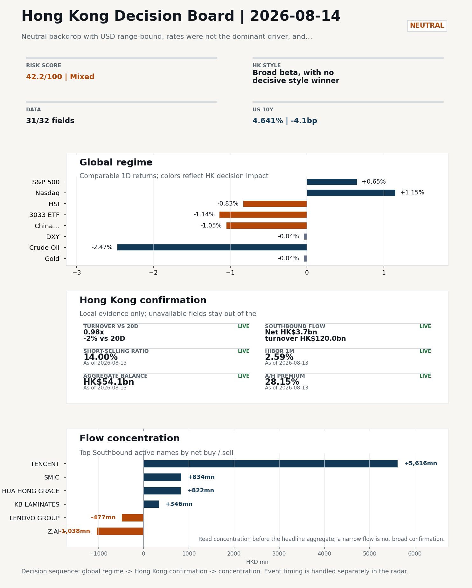
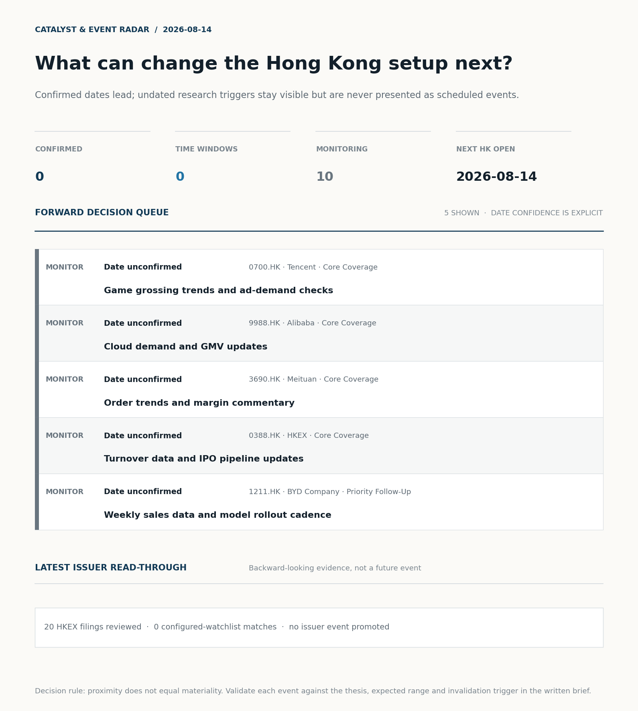
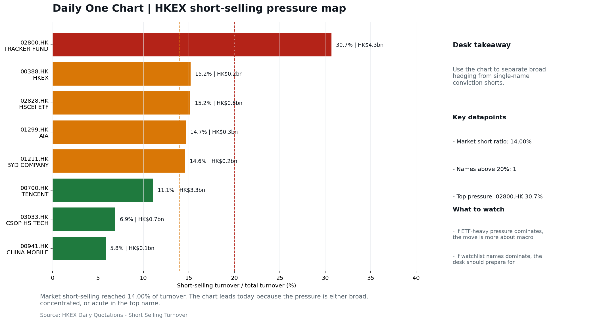
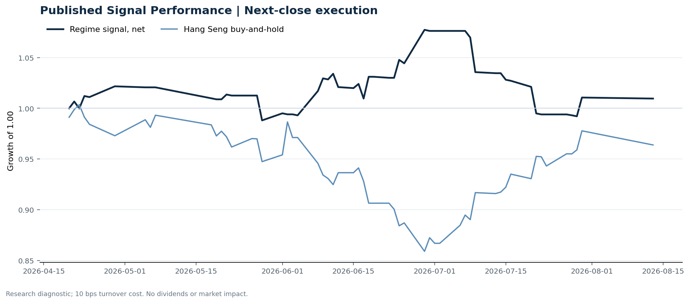

# Morning Research Workbench | 2026-08-14

> **Commute reading route:** `5-minute decision scan` → `25-30 minute deep read` → `10-15 minute optional appendix`
>
> Mode: `Trading Daily` | Keep the report execution-oriented: what mattered in the completed session, what can move Hong Kong leadership, and what needs fast follow-up.

_Data through: global `2026-08-13` | HK/China `2026-08-13` | Market effective `2026-08-13` | Generated `2026-08-14 06:02:56`_

## Executive Summary

- **Market pulse:** Neutral backdrop with USD range-bound, rates were not the dominant driver, and Bitcoin outperformed Oil
- **Hong Kong lens:** Broad beta, with no decisive style winner: 3033.HK and HSCEI were separated by only 0.18pp (-1.14% versus -0.96%). Conviction is improving because Southbound recorded +HK$3.7bn net buying. Avoid forcing a growth-versus-value call; let volume, Southbound concentration, and the first-hour relative tape identify leadership.
- **What would confirm it:** Confirm a broad-beta session only if HSI breadth and turnover improve without a sharp 3033.HK-versus-HSCEI split.
- **What could break it:** Reclassify the tape when either 3033.HK or HSCEI opens a sustained 0.5pp relative lead with flow confirmation.

## Visual Dashboard

**Catalyst & Event Radar**

**Chart read:** No confirmed event date is populated; 10 undated research trigger(s) remain visible without invented timing.

_Source: Public calendars, issuer disclosures and configured research watchlists_
## Layer 1 | Scan (5 min)

### 1.2 Global Asset Price Dashboard
_Decision-useful subset: each row states the implication and the next test. Descriptive secondary monitors are kept out of the five-minute scan._

| Signal | Last / move | Interpretation | Confirmation / invalidation |
| --- | --- | --- | --- |
| S&P 500 | 7,798.99 / +0.65% | US beta improved, raising the global risk floor for Hong Kong. | Confirm with Nasdaq breadth and a same-direction VIX move; invalidate if offshore-China proxies diverge. |
| Nasdaq 100 | 30,084.50 / +1.15% | Growth outperformed broad beta, a supportive style signal for Hong Kong internet and platform names. | Confirm through the 3033.HK ETF versus HSI leadership; higher US yields would weaken the read. |
| Hang Seng Index | 25,440.17 / -0.83% | Hong Kong broad beta weakened and needs offshore or policy support to stabilize. | Confirm with Southbound participation and breadth; invalidate if USD/CNH weakens while turnover fades. |
| Hang Seng TECH ETF (3033.HK) | 4.6820 / -1.14% | Hong Kong growth lagged, so broad-index strength is not yet a duration signal. | Confirm with stable CNH, Southbound buying and lower yields; invalidate on growth underperformance with rising yields. |
| US 10Y | 4.6410% / -4.1bp | The yield proxy fell, easing the valuation headwind for duration-sensitive equities. | Confirm through Nasdaq and 3033.HK ETF relative performance; invalidate if growth leads despite the opposing rate move. |
| China 10Y | 1.70% / -1.1bp | Lower local yields may reflect easing support or softer demand; the signal is ambiguous without growth confirmation. | Use CSI 300, copper and official credit/activity data to separate growth optimism from demand weakness. |
| DXY | 99.97 / -0.04% | The dollar was range-bound and adds little directional information. | Confirm with USD/CNH moving in the same risk direction; divergence reduces conviction. |
| USD/CNH | 6.7310 / +0.00% | CNH was stable, removing an immediate FX impulse but not confirming equity direction. | Confirm with FXI, the 3033.HK ETF proxy and Southbound flow; invalidate if equities move opposite to FX with strong local participation. |
| VIX | 14.63 / +0.55% | Higher implied volatility raises the tail-risk premium and weakens risk-on conviction. | Confirm with equity breadth and credit-sensitive assets; invalidate if lower VIX accompanies narrow or falling equities. |

_Secondary monitors retained in the source bundle: CSI 300, CN-US 10Y spread, USD/HKD, Brent crude, COMEX gold, Copper._

### 1.3 Hong Kong Key Data Quick Check

| Check | Value | Status | Source / as of | Why it matters |
| --- | --- | --- | --- | --- |
| Main Board turnover vs 20D | 0.98x \| -2% vs 20D | Live local | HKEX \| 2026-08-13 | Trailing 20-session average turnover was HK$270.2bn. |
| Southbound / Northbound net flow | Southbound Net HK$3.7bn \| turnover HK$120.0bn \| Northbound Turnover HK$314.8bn \| net not reported | Live local | HKEX Connect \| 2026-08-13 | Southbound net buy is calculated from HKEX disclosed buy and sell turnover. |
| Short-selling ratio | 14.00% | Live local | HKEX \| 2026-08-13 | Official HKEX stock-level short-selling table, aggregated as a share of total market turnover. |
| AH premium index | 28.15% | Live public | Yahoo \| 2026-08-13 | Simple average across 17 A/H pairs; use dispersion rather than the average alone. |
| USD/HKD spot vs band | 7.8467 \| band 7.7500 to 7.8500 | Live quote + local | Yahoo \| 2026-08-13 | Close to the weak-side Convertibility Undertaking; keep HKMA liquidity operations in focus. Official Convertibility Undertakings define the linked-rate stress boundaries for USD/HKD. |
| HIBOR 1M | 2.59% | Live local | HKMA \| 2026-08-13 | 1M HIBOR is the cleanest quick read for Hong Kong funding conditions and equity-duration pressure. |
| Hong Kong leadership | Broad beta, with no decisive style winner | Proxy | HSI / HSCEI / 3033.HK ETF relative \| 2026-08-13 | Use HSI / HSCEI / 3033.HK ETF relative moves as the opening style read. |

### 1.4 Decision Board
**Composite risk score:** `42.2/100` | **Regime:** `Mixed`

| Component | Score impact | Evidence |
| --- | --- | --- |
| US beta | +3.9 | S&P 500 +0.65% |
| HK growth ETF proxy | -5.7 | 3033.HK ETF -1.14% |
| Offshore China proxy | -5.2 | FXI -1.05% |
| Dollar pressure | +0.4 | DXY -0.04% |

**Morning Checklist**

1. **Neutral backdrop with USD range-bound, rates were not the dominant driver, and Bitcoin outperformed Oil**
 Overnight regime | Start by deciding whether the day is about Neutral conditions or a style pivot.
2. **WTI crude -2.47%**
 High-frequency data | Softer oil argues for a more cautious cyclical-growth read.
3. **[B] AI computing power is becoming a tradable asset class as CME launches futures contracts**
 News / announcements | This is more about order visibility and product-cycle validation
4. **VIX +0.55%**
 High-frequency data | Keep tracking it to confirm whether the core daily narrative is holding.

## Layer 2 | Deep Read (20-30 min)

### 2.1 Overnight Overseas Market Review
**Market Setup**
**Core tape.** Neutral backdrop with USD range-bound, rates were not the dominant driver, and Bitcoin outperformed Oil

**Hong Kong Read-Through**
**Desk lens.** Broad beta, with no decisive style winner.
**Evidence.** 3033.HK and HSCEI were separated by only 0.18pp (-1.14% versus -0.96%)
**Investment read.** Avoid forcing a growth-versus-value call; let volume, Southbound concentration, and the first-hour relative tape identify leadership.
- **Cross-market read:** Hang Seng -0.83% / HSCEI -0.96% / 3033.HK ETF -1.14%.
- **Cross-market read:** Offshore China proxy FXI -1.05% and USD/CNH +0.00% frame cross-border risk appetite.
- **Cross-market read:** USD/HKD last traded around 7.8467, which keeps the Hong Kong funding lens in focus.

**Watch Points**
- USD composite moved higher by +0.04pct intraday, with a 0.17pct range.
- Main turning points appeared around 2026-08-13 08:10 peak / 2026-08-13 08:40 trough / 2026-08-13 08:55 trough, suggesting event-driven repricing.
- The biggest cross-asset divergence was Bitcoin versus Oil, a spread of 1.968pct.
- Gold moved -1.05pct intraday with a 1.37pct high-low range.

**Curated overnight stories**
1. **Chinese firm has topped Micron and Kioxia in NAND memory chip shipments**
 Why it matters: Direct read on China's progress in memory semis; signals competitive shift away from incumbents that Hong Kong investors benchmark against.
 HK read-through: Most relevant for HK-listed memory, semis equipment, and China tech sentiment; may also frame read-throughs to local chip-design and packaging names.
2. **WTI crude -2.47% overnight**
 Why it matters: Material oil weakness shifts the cyclical/inflation read; reduces input-cost pressure on China industrials and transports.
 HK read-through: Mixed for HK: supportive for airlines and consumer-linked cyclicals, negative for oil-exposed China energy names; generally a softer commodity read for the region.
3. **US 10Y yield -4.1bp overnight**
 Why it matters: A modest rates tailwind reduces the discount-rate drag on long-duration assets and eases pressure on the USD.
 HK read-through: Marginally supportive for HK growth/tech and Hong Kong property sentiment; modest relief rather than a regime change given the small move.
4. **CME to launch AI compute futures on Oct. 5 with Silicon Data**
 Why it matters: Formal product validation of AI compute as an investable theme; increases price discovery for the AI capex cycle.
 HK read-through: Read-across to HK-listed AI-exposed names and China cloud/internet players that have positioned around compute demand; mostly a sentiment/data signal rather than direct P&L.
5. **'Big Short' investor flags Achilles' heel in the AI boom**
 Why it matters: Prominent skeptical voice raises risk of an AI capex or monetization gap; useful as a counter-narrative after recent AI-driven rallies.
 HK read-through: Reason to temper exuberance in HK AI and high-beta tech; likely to be cited if HK tech opens weaker, but lacks fresh data to drive a sharp move on its own.

### 2.2 Hong Kong / A-share Previous-Day Review
**Style and Local Leadership**
**Style call.** Broad beta, with no decisive style winner.
- **Evidence:** 3033.HK and HSCEI were separated by only 0.18pp (-1.14% versus -0.96%)
- **Portfolio meaning:** Avoid forcing a growth-versus-value call; let volume, Southbound concentration, and the first-hour relative tape identify leadership.
- **Cross-market read:** Hang Seng -0.83% / HSCEI -0.96% / 3033.HK ETF -1.14%.
- **Cross-market read:** Offshore China proxy FXI -1.05% and USD/CNH +0.00% frame cross-border risk appetite.
- **Cross-market read:** USD/HKD last traded around 7.8467, which keeps the Hong Kong funding lens in focus.

**Flow Confirmation**
Official Stock Connect evidence is available; use Section 2.3 to confirm whether local money supports the price action.

**Follow-Through Checklist**
**Follow-through check.** Confirm a broad-beta session only if HSI breadth and turnover improve without a sharp 3033.HK-versus-HSCEI split.
**Failure condition.** Reclassify the tape when either 3033.HK or HSCEI opens a sustained 0.5pp relative lead with flow confirmation.

### 2.3 Flow Tracker and Attribution
**Cross-Asset Attribution**

| Driver | Direction | Score | Evidence | HK implication |
| --- | --- | --- | --- | --- |
| Oil and geopolitics | supportive | 1.82 | Oil moved -2.27%. | Split the read between energy/cyclicals support and margin/geopolitical pressure. |
| US growth-style transmission | supportive | 1.61 | Nasdaq 100 moved +1.15%. | Hong Kong growth and platform names should be tested first at the open. |

**Local Flow Tracker**

**Flow Takeaways**
- Local flow evidence is not yet strong enough to override the cross-asset setup.
- Stock Connect Southbound: net HK$3.7bn on turnover HK$120.0bn (as of 2026-08-13).
- Stock Connect Northbound: turnover RMB314.8bn; public file provides total turnover/top active names, not full net-buy.
- AH premium: simple covered-pair average +28.15%; widest premium: China Communications Construction 89.23%.

**Stock Connect Southbound Active Names**

| Rank | Ticker | Name | Buy | Sell | Net buy |
| --- | --- | --- | --- | --- | --- |
| 1 | 00700.HK | TENCENT | HK$10,261.0mn | HK$4,644.6mn | HK$5,616.4mn |
| 2 | 02513.HK | Z.AI | HK$3,133.0mn | HK$4,171.3mn | HK$-1,038.3mn |
| 4 | 00981.HK | SMIC | HK$2,756.2mn | HK$1,921.8mn | HK$834.4mn |
| 6 | 01347.HK | HUA HONG GRACE | HK$2,530.5mn | HK$1,708.4mn | HK$822.2mn |
| 2 | 00992.HK | LENOVO GROUP | HK$1,954.4mn | HK$2,431.8mn | HK$-477.4mn |

**AH Premium Dispersion**

| Name | A ticker | H ticker | Premium | As of |
| --- | --- | --- | --- | --- |
| China Communications Construction | 601800.SS | 1800.HK | +89.23% | 2026-08-13 |
| China Life | 601628.SS | 2628.HK | +57.89% | 2026-08-13 |
| China Railway Construction | 601186.SS | 1186.HK | +56.39% | 2026-08-13 |
| China Railway | 601390.SS | 0390.HK | +49.98% | 2026-08-13 |
| CRRC | 601766.SS | 1766.HK | +38.80% | 2026-08-13 |

**HKEX Short-Selling Watch**

| Ticker | Name | Short ratio | Short turnover | Total turnover |
| --- | --- | --- | --- | --- |
| 00388.HK | HKEX | 15.18% | HK$0.2bn | HK$1.2bn |
| 00700.HK | TENCENT | 11.07% | HK$3.3bn | HK$29.5bn |
| 00941.HK | CHINA MOBILE | 5.83% | HK$0.1bn | HK$0.9bn |
| 01211.HK | BYD COMPANY | 14.58% | HK$0.2bn | HK$1.1bn |
| 01299.HK | AIA | 14.66% | HK$0.3bn | HK$2.0bn |

- **Short-value leaders:** 02800.HK TRACKER FUND (HK$4.3bn); 00700.HK TENCENT (HK$3.3bn); 07709.HK XL2CSOPHYNIX (HK$2.1bn); 00992.HK LENOVO GROUP (HK$2.0bn).

### 2.4 Macro and Policy Tracking
**Desk read.** Use the calendar table and released data below as the primary macro read.

The macro calendar was light for this run.

**Positioning and Risk Backdrop**

- Detailed local flow evidence is covered in Section 2.3; keep this section focused on options, hedging, and macro-positioning risk.

### 2.5 Company Catalysts and Risk Monitor

| Grade | Sector | Headline | Why it matters | Horizon |
| --- | --- | --- | --- | --- |
| B | Financials | AI computing power is becoming a tradable asset class as CME | This is more about order visibility and product-cycle validation | Short-term catalyst |

Decision filter<h4>No immediate portfolio catalyst: 20 official filings were screened and the low-signal market set stays aggregated.</h4>
20 profit warnings

<strong>20</strong>Official filings

<strong>0</strong>Watchlist hits

<strong>0</strong>Actionable events

<strong>No event cleared the portfolio decision filter.</strong>

Broad-market filings remain traceable in the source appendix; they are not expanded here without a watchlist, estimate or liquidity read-through.

<strong>Coverage boundary.</strong> Earnings calendar, sell-side rating changes, IPO / grey-market monitor were not decision-grade in this run; their absence is not treated as confirmation that no event exists.

### 2.6 Today's Core Names
**Core coverage**

| Name | Ticker | Last | 1D | Range position | Morning note |
| --- | --- | --- | --- | --- | --- |
| Tencent | 0700.HK | 441.00 | -4.46% | Mid-range | Short-term pressure is visible; check for a fundamental or regulatory reason. |
| Alibaba | 9988.HK | 121.90 | -0.57% | Mid-range | Positioning is neutral for now, so use it mainly to monitor marginal information changes. |

**Recent headlines for Alibaba:**
- [Alibaba (BABA) Stock May Be 37% Undervalued After Qwen Licensing Shift](https://finance.yahoo.com/markets/stocks/articles/alibaba-baba-stock-may-37-111241207.html) (Simply Wall St.)

**Priority follow-up**

| Name | Ticker | Last | 1D | Range position | Morning note |
| --- | --- | --- | --- | --- | --- |
| BYD Company | 1211.HK | 88.40 | -1.34% | Mid-range | Positioning is neutral for now, so use it mainly to monitor marginal information changes. |
| China Mobile | 0941.HK | 81.20 | -0.61% | Mid-range | Positioning is neutral for now, so use it mainly to monitor marginal information changes. |

## Layer 3 | Decision Deepening (10-15 min)

### 3.1 Rotating Theme Deep Dive

| Field | Read |
| --- | --- |
| Theme | Hong Kong Market Structure and Flows |
| Angle for the day | Focus on turnover, Stock Connect, ETF flows, HKEX activity, and style leadership to understand whether Hong Kong is being driven by fundamentals or positioning. |

**Theme desk read**
**Core thesis.** The rotating theme frames Hong Kong through structure and flows rather than fundamentals, which keeps the focus on whether leadership is being earned by tape signals or by positioning.
**Evidence.** Today's facts give only a partial read: turnover, Stock Connect splits, and ETF flow series are not in the supplied data, so any flow-based conclusion is bounded.
**What to test.** HKEX (0388.HK) closed at 408.2 (+0.39%) and sits at 84.2% of its recent range, i.e. top-of-range with elevated expectations, so the next turnover print and IPO pipeline update are the relevant catalysts.

**Signals to keep in mind**
- WTI crude -2.47%: Softer oil argues for a more cautious cyclical-growth read.
- VIX +0.55%: Keep tracking it to confirm whether the core daily narrative is holding.

**LLM watch items:**
- HKEX: whether 2026-08-14 turnover and any IPO pipeline headlines validate the 84.2% range position or trigger profit-taking.
- BYD: weekly sales cadence and any model rollout signals to read the EV margin and export mix.
- WTI crude follow-through after -2.47%; sustained softness would extend the cautious cyclical-growth read.
- VIX (14.63, +0.55%) and US 10Y (4.641%, -4.1bp) path into the next HK session to confirm the neutral regime is intact.
- Stock Connect southbound/northbound flows and HK ETF creation-redemption data, which are missing from today's facts and are the key missing inputs

**Related names to keep close:**

| Name | Ticker | Bucket | Morning read |
| --- | --- | --- | --- |
| HKEX | 0388.HK | Core coverage | The name sits near the top of its recent range, so watch for profit-taking under high expectations. |
| BYD Company | 1211.HK | Priority follow-up | Positioning is neutral for now, so use it mainly to monitor marginal information changes. |

### 3.2 Today Ahead and Trading Calendar
- The calendar is relatively light, so the market may trade more off positioning and overnight headlines.

**Same-day macro docket**
No same-day macro items were scheduled.

**Same-day catalyst list**
No same-day catalysts were highlighted.

**Next few sessions**
No forward catalyst list was populated.

### 3.3 Daily One Chart
**Daily One Chart | HKEX short-selling pressure map**

**Chart read.** Market short-selling reached 14.00% of turnover.
**Why it matters.** The chart leads today because the pressure is either broad, concentrated, or acute in the top name.

_Source: HKEX Daily Quotations - Short Selling Turnover_

## Optional Appendix | Traceability and Performance (10-15 min)

### Report Metadata
> Date policy: Review date 2026-08-13 is treated as `Trading Daily`. | Global request date is 2026-08-13; adapter effective date is 2026-08-13 and summary date is 2026-08-13. | HK/China local data date is 2026-08-13; role: same-session local cash tape.
> Market data quality: Coverage: `31/32` | Missing: `1`
> Report quality: `85.6/100` | Grade `B` | Status `production ready`

### Key Questions to Keep in Mind
- Is risk appetite rising or fading? The overnight tape reads closer to `Neutral`.
- Did rates expectations move? Focus on whether US 10Y, DXY, and growth style moved together.
- Were commodities the real story? Watch WTI and gold for geopolitics versus inflation signals.
- Is Hong Kong setup growth-led, SOE-led, or broad beta-led? Compare the 3033.HK ETF proxy, HSCEI, and HSI.
- Did offshore markets move China risk appetite? Focus on HSI, FXI, USD/CNH, and USD/HKD.

### Report Quality and Validation
- **Quality score:** 85.6/100 | **Grade:** B | **Status:** production ready
- **Run summary:** 7 healthy | 1 caveat | 2 failed
- **Release recommendation:** Send with caveats | The report is usable, but the advisory guidance should travel with it so readers understand the data gaps.

| Source | Status | Bucket |
| --- | --- | --- |
| Market data | ok | healthy |
| Sector and company news | ok | healthy |
| Movers and short selling | ok | healthy |
| Stock Connect | ok | healthy |
| A/H premium | ok | healthy |
| Hong Kong local package | ok | healthy |
| China rates | ok | healthy |
| Macro calendar | unavailable | failed |
| Risk and sentiment feed | unavailable | failed |
| Narrative overlay | partial | caveat |

**Desk-use guidance summary:** 0 blocking | 1 advisory

**Desk-use guidance**
- **Advisory:** Use deterministic sections as primary support; the narrative overlay was partial or unavailable on this run.

| Component | Score | Weight | Read |
| --- | --- | --- | --- |
| Market data coverage | 96.9 | 0.2 | 31/32 core market fields available. |
| Hong Kong local metrics | 82.3 | 0.2 | 8 live, 3 proxy, 0 unavailable local checks. |
| Key public adapters | 100.0 | 0.2 | 4/4 key adapters were available or partially available. |
| Narrative overlay health | 27.9 | 0.1 | 1/7 narrative overlay tasks succeeded or used validated cache; 4 error(s). |
| Fact-check guardrail | 100.0 | 0.15 | Checked 15 numeric claims; 0 numeric mismatch(es), 0 logic warning(s); 0 structured claims, 0 source/text warning(s). |
| Source provenance | 92.0 | 0.05 | 42 provenance record(s) validated; 2 unavailable source record(s). |
| Source health and freshness | 73.1 | 0.1 | 8 healthy, 0 degraded, 2 unavailable source group(s). |

**Quality warnings**
- Narrative overlay health is weak: 1/7 narrative overlay tasks succeeded or used validated cache; 4 error(s).

**Narrative fact-check guardrail**
- Checked 15 numeric claims; 0 numeric mismatch(es), 0 logic warning(s); 0 structured claims, 0 source/text warning(s); 0 critical, 0 review.

**Source provenance validation**
- Status: ok | records checked: 42 | unavailable: 2

**Source health and freshness**
- **Source health:** degraded | 8 healthy | 0 degraded | 2 unavailable

| Source | Critical | Status | Score | Fresh coverage | Age range | Policy |
| --- | --- | --- | --- | --- | --- | --- |
| hk_local | Yes | healthy | 98.5 | 1/1 | 1 - 1d | ≤4d / ≥100% |
| macro_calendar | No | unavailable | 0.0 | 0/0 | Unknown | ≤14d / ≥0% |
| market_data | Yes | healthy | 93.0 | 31/31 | 1 - 2d | ≤4d / ≥80% |
| risk_feed | No | unavailable | 0.0 | 0/0 | Unknown | ≤4d / ≥0% |

**Adapter status**

| Adapter | Status |
| --- | --- |
| Stock Connect | ok |
| A/H premium | ok |
| HKEX announcements | ok |
| China rates | ok |

### Historical Signal Performance
- **Readiness:** exploratory with caveats | 65 market observations | 79 active signal dates
- **Execution rule:** use only the next available close after publication; 10 bps turnover cost by default. Current-day signals never receive same-day returns.
- **Interpretation boundary:** results are exploratory until a benchmark reaches 252 sessions and 100 active-signal sessions.

| Benchmark | Sessions | Signal net | Buy & hold | Excess | Max drawdown | Hit rate |
| --- | --- | --- | --- | --- | --- | --- |
| Hang Seng Index | 56 | 1.0% | -3.6% | 4.6% | -7.9% | 48.1% |
| Hang Seng TECH ETF (3033.HK) | 55 | -2.1% | -6.2% | 4.1% | -13.3% | 48.1% |

**Hang Seng event-horizon diagnostics**

| Horizon | Resolved | Hit rate | Average net return |
| --- | --- | --- | --- |
| 1 sessions | 33 | 51.5% | 0.1% |
| 5 sessions | 30 | 56.7% | -0.0% |
| 20 sessions | 24 | 41.7% | -1.1% |

- **Data-quality caveat:** 17 conflicting historical price revision(s) and 6 weekend pseudo-session observation(s) were handled explicitly; inspect the ledger before relying on the result.
- **Use boundary:** this is a close-to-close research diagnostic, not an executable strategy or investment recommendation; dividends, financing, borrow and market impact are excluded.

### Source Links
- [AI computing power is becoming a tradable asset class as CME launches futures contracts](https://www.cnbc.com/2026/08/11/ai-computing-power-becomes-a-tradable-asset-class-as-cme-starts-futures.html) (cnbc_markets)
- [Alibaba (BABA) Stock May Be 37% Undervalued After Qwen Licensing Shift](https://finance.yahoo.com/markets/stocks/articles/alibaba-baba-stock-may-37-111241207.html) (Simply Wall St.)
- [JD.com Profit Beats Estimates After Food Delivery Fight Calms](https://finance.yahoo.com/markets/stocks/articles/jd-com-profit-beats-estimates-100519514.html) (Bloomberg)
- [00028.HK Profit warning / alert announcement](http://www1.hkexnews.hk/listedco/listconews/sehk/2026/0813/2026081300909.pdf) (HKEXnews)
- [00093.HK Profit warning / alert announcement](http://www1.hkexnews.hk/listedco/listconews/sehk/2026/0813/2026081301392.pdf) (HKEXnews)
- [00232.HK Profit warning / alert announcement](http://www1.hkexnews.hk/listedco/listconews/sehk/2026/0813/2026081300143.pdf) (HKEXnews)
- [00308.HK Profit warning / alert announcement](http://www1.hkexnews.hk/listedco/listconews/sehk/2026/0813/2026081300431.pdf) (HKEXnews)
- [00451.HK Profit warning / alert announcement](http://www1.hkexnews.hk/listedco/listconews/sehk/2026/0813/2026081301412.pdf) (HKEXnews)
- [01039.HK Profit warning / alert announcement](http://www1.hkexnews.hk/listedco/listconews/sehk/2026/0813/2026081300625.pdf) (HKEXnews)
- [01168.HK Profit warning / alert announcement](http://www1.hkexnews.hk/listedco/listconews/sehk/2026/0813/2026081301436.pdf) (HKEXnews)
- [01298.HK Profit warning / alert announcement](http://www1.hkexnews.hk/listedco/listconews/sehk/2026/0813/2026081300961.pdf) (HKEXnews)

## Supplementary Visual Appendix

This appendix is professional-path only. It keeps a traceable index of the report visuals and the deterministic chart cues used to frame the morning note, without injecting the legacy intraday chart pack.

### Visual Index

| Visual | Path | Role |
| --- | --- | --- |
| Visual Dashboard | `charts/dashboard_2026-08-14.png` | Cross-asset regime board and Hong Kong local tape snapshot. |
| Catalyst & Event Radar | `charts/catalyst_radar_2026-08-14.png` | Confirmed dates, time windows, undated monitors, and recent issuer read-through. |
| Daily One Chart | `charts/daily_one_chart_2026-08-14.png` | Single highest-conviction visual story for the day. |

### Deterministic Chart Cues
- FX / liquidity: USD composite moved higher by +0.04pct intraday, with a 0.17pct range.
- FX / liquidity: Main turning points appeared around 2026-08-13 08:10 peak / 2026-08-13 08:40 trough / 2026-08-13 08:55 trough, suggesting event-driven repricing rather than a clean one-way USD move.
- Cross-asset: The biggest cross-asset divergence was Bitcoin versus Oil, a spread of 1.968pct.
- Cross-asset: Gold moved -1.05pct intraday with a 1.37pct high-low range.
- Cross-asset: Oil moved -1.84pct intraday with a 3.808pct high-low range.
- Cross-asset: Bitcoin moved +0.13pct intraday with a 1.526pct high-low range.

### Risk Dashboard Components

| Component | Score impact | Evidence |
| --- | --- | --- |
| US beta | +3.9 | S&P 500 +0.65% |
| HK growth ETF proxy | -5.7 | 3033.HK ETF -1.14% |
| Offshore China proxy | -5.2 | FXI -1.05% |
| Dollar pressure | +0.4 | DXY -0.04% |
| Volatility | -1.1 | VIX +0.55% |
| HK short-selling | +0 | Short-selling ratio 14.00% |
