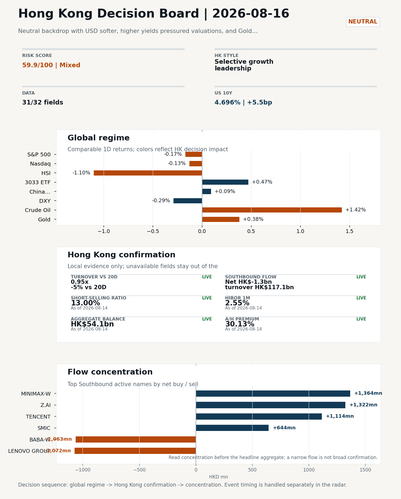
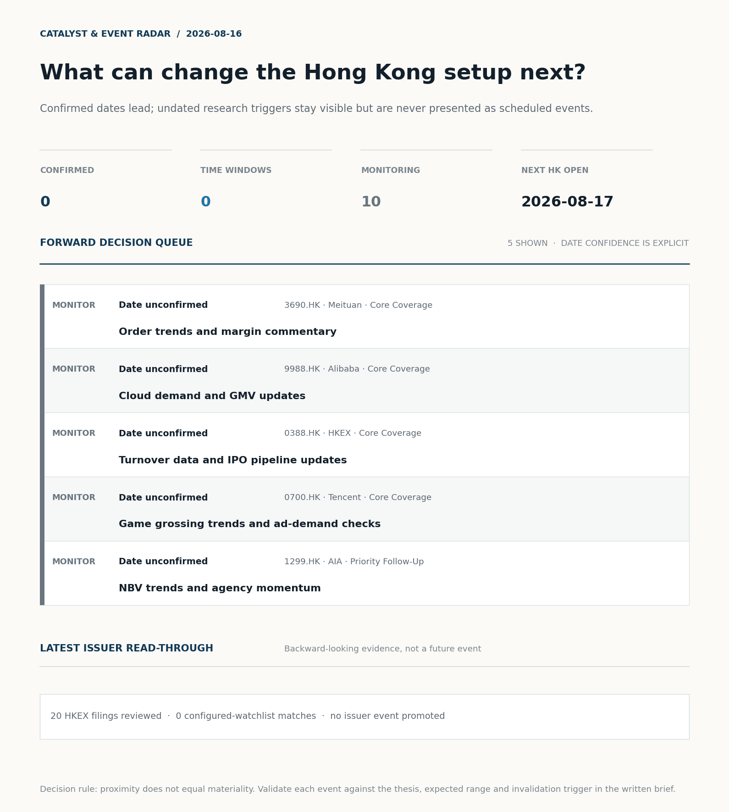
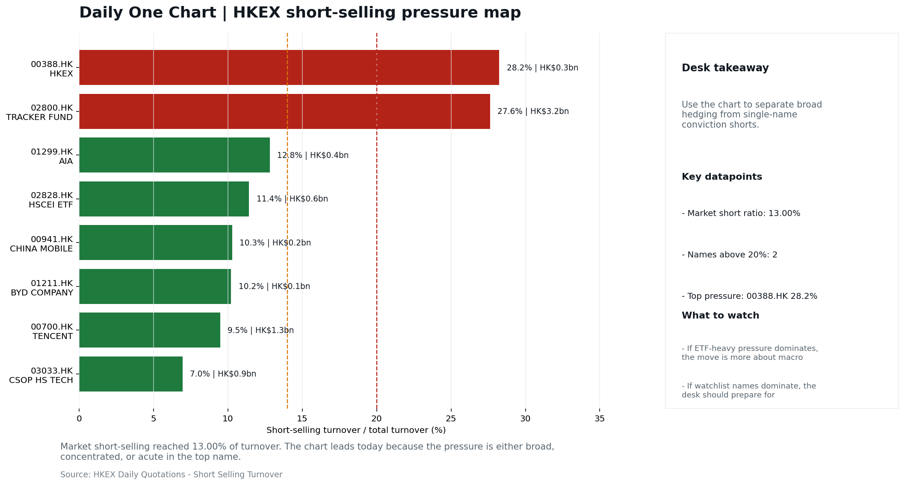
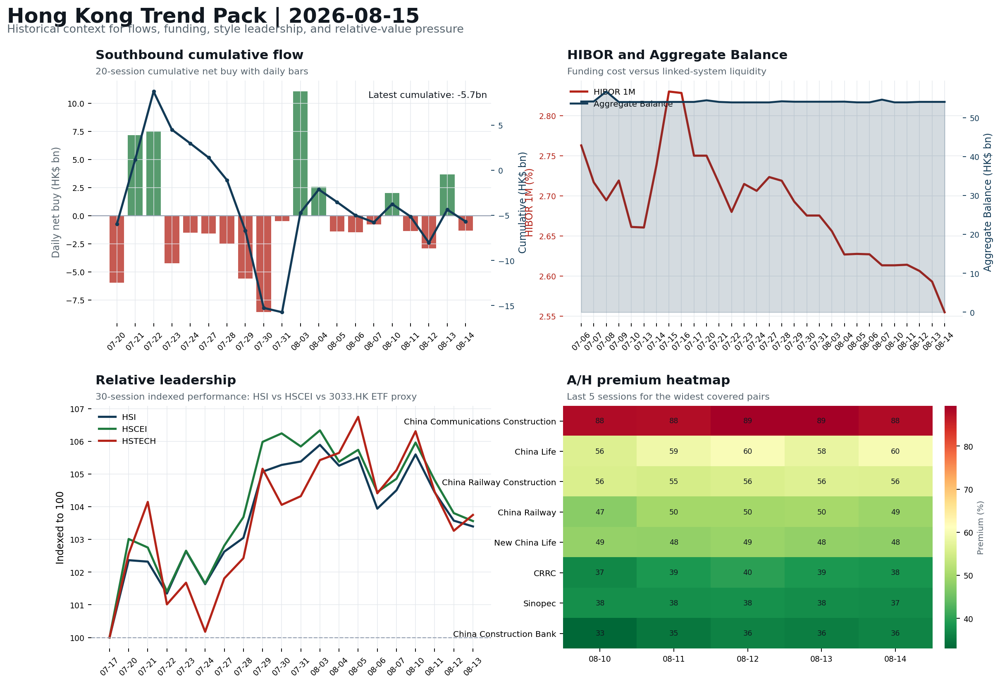
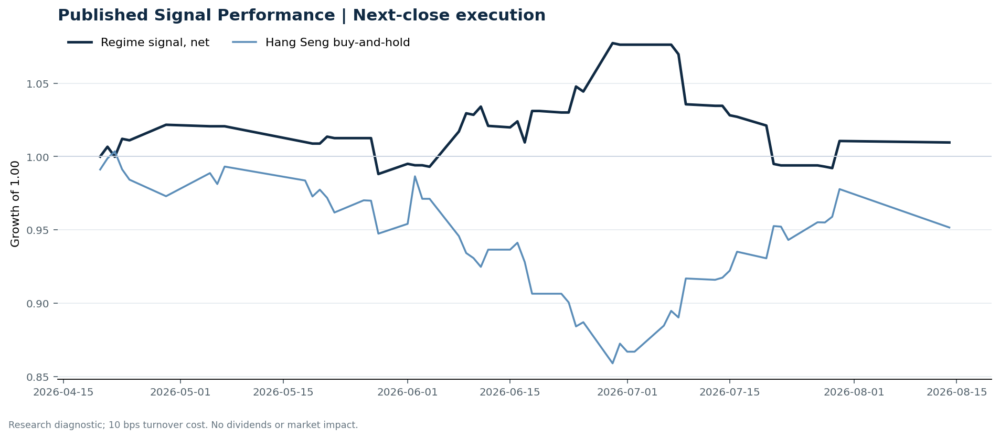

# Morning Research Workbench | 2026-08-16

> **Commute reading route:** `5-minute decision scan` → `25-30 minute deep read` → `10-15 minute optional appendix`
>
> Mode: `Weekly Review` | Use Saturday's non-trading review date to synthesize the completed Hong Kong week and prepare next week's work plan.

_Data through: global `2026-08-15` | HK/China `2026-08-14` | Market effective `2026-08-14` | Generated `2026-08-16 05:35:52`_

## Executive Summary

- **Market pulse:** Neutral backdrop with USD softer, higher yields pressured valuations, and Gold outperformed Bitcoin
- **Hong Kong lens:** Selective growth leadership: 3033.HK moved +0.47% and beat HSCEI by +1.49pp and HSI by +1.57pp. Conviction is limited because Southbound recorded -HK$1.3bn net selling. Partial support came from FXI (+0.09%) outperformed HSI (-1.10%). Favor relative strength in internet/platform names, but do not treat the move as broad China risk-on until participation confirms.
- **What would confirm it:** Confirm if 3033.HK keeps outperforming HSCEI with at least normal turnover, broader Southbound buying, stable CNH, and easing short pressure.
- **What could break it:** Invalidate if 3033.HK loses its lead to HSCEI, or if weak turnover, rising shorts, and CNH depreciation persist together.

## Visual Dashboard

**Catalyst & Event Radar**

**Chart read:** No confirmed event date is populated; 10 undated research trigger(s) remain visible without invented timing.

_Source: Public calendars, issuer disclosures and configured research watchlists_
## Layer 1 | Weekly Scan (5 min)

### 1.2 Global Asset Price Dashboard
_Decision-useful subset: each row states the implication and the next test. Descriptive secondary monitors are kept out of the five-minute scan._

| Signal | Last / move | Interpretation | Confirmation / invalidation |
| --- | --- | --- | --- |
| S&P 500 | 7,785.76 / -0.17% | US beta weakened, reducing the external risk cushion for Hong Kong. | Confirm with Nasdaq breadth and a same-direction VIX move; invalidate if offshore-China proxies diverge. |
| Nasdaq 100 | 30,046.14 / -0.13% | Growth tracked broad beta, so the move looks market-wide rather than duration-led. | Confirm through the 3033.HK ETF versus HSI leadership; higher US yields would weaken the read. |
| Hang Seng Index | 25,116.85 / -1.10% | Hong Kong broad beta weakened and needs offshore or policy support to stabilize. | Confirm with Southbound participation and breadth; invalidate if USD/CNH weakens while turnover fades. |
| Hang Seng TECH ETF (3033.HK) | 4.7040 / +0.47% | Hong Kong growth led broad beta, improving the platform/internet style signal. | Confirm with stable CNH, Southbound buying and lower yields; invalidate on growth underperformance with rising yields. |
| US 10Y | 4.6960% / +5.5bp | The yield proxy rose, tightening the discount-rate backdrop for long-duration Hong Kong growth. | Confirm through Nasdaq and 3033.HK ETF relative performance; invalidate if growth leads despite the opposing rate move. |
| China 10Y | 1.70% / -0.7bp | Lower local yields may reflect easing support or softer demand; the signal is ambiguous without growth confirmation. | Use CSI 300, copper and official credit/activity data to separate growth optimism from demand weakness. |
| DXY | 99.67 / -0.29% | A softer dollar eases an external-liquidity headwind for Hong Kong risk assets. CNH did not confirm the relief, so the liquidity signal is incomplete. | Confirm with USD/CNH moving in the same risk direction; divergence reduces conviction. |
| USD/CNH | 6.7310 / +0.00% | CNH was stable, removing an immediate FX impulse but not confirming equity direction. | Confirm with FXI, the 3033.HK ETF proxy and Southbound flow; invalidate if equities move opposite to FX with strong local participation. |
| VIX | 14.25 / **-2.60%** | Lower implied volatility reduces near-term stress, but is supportive only if equity breadth confirms. | Confirm with equity breadth and credit-sensitive assets; invalidate if lower VIX accompanies narrow or falling equities. |

_Secondary monitors retained in the source bundle: CSI 300, CN-US 10Y spread, USD/HKD, Brent crude, COMEX gold, Copper._

### 1.3 Hong Kong Weekly Tape Quick Check

| Check | Value | Status | Source / as of | Why it matters |
| --- | --- | --- | --- | --- |
| Main Board turnover vs 20D | 0.95x \| -5% vs 20D | Live local | HKEX \| 2026-08-14 | Trailing 20-session average turnover was HK$267.2bn. |
| Southbound / Northbound net flow | Southbound Net HK$-1.3bn \| turnover HK$117.1bn \| Northbound Turnover HK$274.5bn \| net not reported | Live local | HKEX Connect \| 2026-08-14 | Southbound net buy is calculated from HKEX disclosed buy and sell turnover. |
| Short-selling ratio | 13.00% | Live local | HKEX \| 2026-08-14 | Official HKEX stock-level short-selling table, aggregated as a share of total market turnover. |
| AH premium index | 30.13% | Live public | Yahoo \| 2026-08-14 | Simple average across 17 A/H pairs; use dispersion rather than the average alone. |
| USD/HKD spot vs band | 7.8472 \| band 7.7500 to 7.8500 | Live quote + local | Yahoo \| 2026-08-14 | Close to the weak-side Convertibility Undertaking; keep HKMA liquidity operations in focus. Official Convertibility Undertakings define the linked-rate stress boundaries for USD/HKD. |
| HIBOR 1M | 2.55% | Live local | HKMA \| 2026-08-14 | 1M HIBOR is the cleanest quick read for Hong Kong funding conditions and equity-duration pressure. |
| Hong Kong leadership | Selective growth leadership | Proxy | HSI / HSCEI / 3033.HK ETF relative \| 2026-08-14 | Use HSI / HSCEI / 3033.HK ETF relative moves as the opening style read. |

### 1.4 Decision Board
**Composite risk score:** `59.9/100` | **Regime:** `Mixed`

| Component | Score impact | Evidence |
| --- | --- | --- |
| US beta | -1.0 | S&P 500 -0.17% |
| HK growth ETF proxy | +2.3 | 3033.HK ETF +0.47% |
| Offshore China proxy | +0.4 | FXI +0.09% |
| Dollar pressure | +2.9 | DXY -0.29% |

**Next Week Checklist**

1. **Neutral backdrop with USD softer, higher yields pressured valuations, and Gold outperformed Bitcoin**
 Still-moving markets | No fresh Hong Kong cash session is assumed; use global active assets and policy/event flow to prepare the next open.
2. **VIX -2.60%**
 High-frequency data | Lower volatility signals easing stress in the tape.
3. **WTI crude +1.42%**
 High-frequency data | A strong crude move needs to be split between geopolitics and demand repair.
4. **Bitcoin -0.67%**
 High-frequency data | Keep tracking it to confirm whether the core daily narrative is holding.

## Layer 2 | Deep Read (20-30 min)

### 2.1 Weekly Cross-Asset Review
> Weekly review mode: synthesize the completed Hong Kong week, retain the main cross-asset and policy lessons, and convert them into next-week preparation rather than treating Saturday as a fresh cash-market session.

**Market Setup**
**Core tape.** Neutral backdrop with USD softer, higher yields pressured valuations, and Gold outperformed Bitcoin

**Hong Kong Read-Through**
**Desk lens.** Selective growth leadership.
**Evidence.** 3033.HK moved +0.47% and beat HSCEI by +1.49pp and HSI by +1.57pp
**Investment read.** Favor relative strength in internet/platform names, but do not treat the move as broad China risk-on until participation confirms.
- **Cross-market read:** Hang Seng -1.10% / HSCEI -1.02% / 3033.HK ETF +0.47%.
- **Cross-market read:** Offshore China proxy FXI +0.09% and USD/CNH +0.00% frame cross-border risk appetite.
- **Cross-market read:** USD/HKD last traded around 7.8472, which keeps the Hong Kong funding lens in focus.

**Watch Points**
- USD composite moved lower by -0.30pct intraday, with a 0.304pct range.
- Main turning points appeared around 2026-08-14 08:05 peak / 2026-08-14 08:30 trough / 2026-08-14 08:45 peak, suggesting event-driven repricing.
- The biggest cross-asset divergence was Gold versus Bitcoin, a spread of 2.036pct.
- Gold moved +1.34pct intraday with a 1.859pct high-low range.

**Weekly Review Map**
- Weekly review window: 2026-08-10 to 2026-08-14. Core regime: Neutral backdrop with USD softer, higher yields pressured valuations, and Gold outperformed Bitcoin. Hong Kong leadership: Hong Kong growth / internet led.
- Method note: Trend summary uses the latest available five observations from the Hong Kong Trend Pack inputs.

**Cross-asset weekly dashboard**

| Asset | Latest move | Weekly read |
| --- | --- | --- |
| S&P 500 | -0.17% | Risk appetite |
| Nasdaq 100 | -0.13% | Growth style |
| Hang Seng Index | -1.10% | Hong Kong beta |
| Hang Seng TECH ETF (3033.HK) | +0.47% | Hong Kong growth / internet proxy |
| DXY | -0.29% | Global liquidity |
| US 10Y Treasury Yield | +5.5bp | Rates path |
| Gold | +0.38% | Hedge / real yields |
| VIX | -2.60% | Volatility and hedging |

**Hong Kong / China weekly tape**

| Signal | Latest move | Read |
| --- | --- | --- |
| Hang Seng Index | -1.10% | Hong Kong beta |
| Hang Seng China Enterprises Index | -1.02% | China SOE / H-share tone |
| Hang Seng TECH ETF (3033.HK) | +0.47% | Hong Kong growth / internet proxy |
| China Large-Cap (FXI) | +0.09% | China sentiment |
| USD/CNH | +0.00% | China FX sentiment |
| USD/HKD | +0.01% | Hong Kong funding lens |

**Five-session trend evidence**
_Window: 2026-08-07 to 2026-08-14_

| Signal | Five-session change | Latest | Desk read |
| --- | --- | --- | --- |
| Southbound flow | +0.1bn over 5 sessions | -1.3bn | 2/5 positive sessions; cumulative buying is the flow-confirmation test for next week. |
| HKD funding | HIBOR -6bp; Aggregate Balance +0.1bn | 2.55% / HK$54.1bn | Funding stress matters if HIBOR rises while Aggregate Balance contracts. |
| HK style leadership | HSI led (-1.1pp); HSTECH lagged (-1.4pp) | HSI leadership | Use HSI / HSCEI / 3033.HK ETF spread to separate broad beta from growth-led rerating. |
| A/H premium dispersion | +1.2pp average change | 51.7% average premium | Premium narrowing can support H-share relative demand |

**Flow and attribution clues**
- :
- :
- :

**Next-week desk questions**
- Did Southbound flow confirm the index move, or was the week mainly offshore beta without local money follow-through?
- Did HIBOR and Aggregate Balance point to benign funding, or should tighter HKD liquidity be part of next week's risk case?
- Was leadership broad enough beyond the 3033.HK ETF / platform beta proxy, or was the week concentrated in a narrow style pocket?
- Which dated macro, policy, earnings, or IPO catalyst can realistically change the next-week narrative?
- What single data point would invalidate the base-case market pulse by Monday or Tuesday morning?

**Curated overnight stories**
1. **Uber partners with China's Pony.ai for 2,000 robotaxis in Europe**
 Why it matters: A scaled commercial robotaxi deployment by a Hong Kong/China-listed autonomous-driving name with a global ride-hailing partner is a direct cross-border catalyst, not.
 HK read-through: Most relevant for Hong Kong-listed Chinese ADAS/robotaxi plays, EV OEMs, and the broader smart-driving theme.
2. **Goldman's latest cash cow is all about funding the AI infrastructure boom**
 Why it matters: Wall Street financing depth for AI capex reframes the AI trade from a pure equity story into a credit/financing story, which changes how durable the capex cycle looks.
 HK read-through: Supports the AI capex narrative that underpins Hong Kong semiconductor, hardware, and cloud/infrastructure names.
3. **Berkshire Hathaway boosts Alphabet to a top three holding, ups Delta and housing bets**
 Why it matters: A high-profile, value-style anchor raising exposure to a US mega-cap tech name plus consumer/housing cyclicals is a sentiment marker for global allocators, not.
 HK read-through: Read-through to Hong Kong mega-cap internet/platform sentiment and to Hong Kong consumer-discretionary and property-linked names.
4. **These charts show why stocks keep rallying. Profit margins are the highest on record**
 Why it matters: Frames the bull case for global equities in macro terms and is the main offset to the Eisman/AI-debt caution narrative.
 HK read-through: Sets the global equity backdrop that Hong Kong index sentiment trades off; if US margin leadership is questioned, HK index/multiple risk is two-way, not one-way.
5. **'Big Short' investor Steve Eisman sees an Achilles' heel in the AI boom**
 Why it matters: A named bear case on AI funding/debt is the most cited counter-narrative to the capex and financing headlines above and is likely to be debated into next week.
 HK read-through: Directly conditions sentiment for Hong Kong AI/semis/internet cohort; pairs with the Goldman AI-financing item as the two-sided AI tape to monitor into the 2026-08-17 session.

### 2.2 Hong Kong / A-share Weekly Review
> Weekly review mode: synthesize the completed Hong Kong week, retain the main cross-asset and policy lessons, and convert them into next-week preparation rather than treating Saturday as a fresh cash-market session.

**Style and Local Leadership**
**Style call.** Selective growth leadership.
- **Evidence:** 3033.HK moved +0.47% and beat HSCEI by +1.49pp and HSI by +1.57pp
- **Portfolio meaning:** Favor relative strength in internet/platform names, but do not treat the move as broad China risk-on until participation confirms.
- **Cross-market read:** Hang Seng -1.10% / HSCEI -1.02% / 3033.HK ETF +0.47%.
- **Cross-market read:** Offshore China proxy FXI +0.09% and USD/CNH +0.00% frame cross-border risk appetite.
- **Cross-market read:** USD/HKD last traded around 7.8472, which keeps the Hong Kong funding lens in focus.

**Flow Confirmation**
Official Stock Connect evidence is available; use Section 2.3 to confirm whether local money supports the price action.

**Follow-Through Checklist**
**Follow-through check.** Confirm if 3033.HK keeps outperforming HSCEI with at least normal turnover, broader Southbound buying, stable CNH, and easing short pressure.
**Failure condition.** Invalidate if 3033.HK loses its lead to HSCEI, or if weak turnover, rising shorts, and CNH depreciation persist together.

### 2.3 Flow Tracker and Attribution
**Cross-Asset Attribution**

| Driver | Direction | Score | Evidence | HK implication |
| --- | --- | --- | --- | --- |
| Oil and geopolitics | mixed | 1.34 | Oil moved +1.67%. | Split the read between energy/cyclicals support and margin/geopolitical pressure. |
| Rates impulse | drag | 0.82 | US 10Y yield moved +5.5bp. | Lower yields help long-duration growth; higher yields pressure valuation-sensitive |
| Dollar / CNH pressure | supportive | 0.43 | DXY -0.29% / USD-CNH +0.00% | A stable or softer CNH makes Hong Kong follow-through more credible. |

**Local Flow Tracker**

**Flow Takeaways**
- Local flow evidence is not yet strong enough to override the cross-asset setup.
- Stock Connect Southbound: net HK$-1.3bn on turnover HK$117.1bn (as of 2026-08-14).
- Stock Connect Northbound: turnover RMB274.5bn; public file provides total turnover/top active names, not full net-buy.
- AH premium: simple covered-pair average +30.13%; widest premium: China Communications Construction 88.01%.

**Stock Connect Southbound Active Names**

| Rank | Ticker | Name | Buy | Sell | Net buy |
| --- | --- | --- | --- | --- | --- |
| 3 | 00100.HK | MINIMAX-W | HK$4,537.8mn | HK$3,173.5mn | HK$1,364.3mn |
| 1 | 02513.HK | Z.AI | HK$6,871.5mn | HK$5,549.8mn | HK$1,321.6mn |
| 3 | 00700.HK | TENCENT | HK$3,841.9mn | HK$2,727.4mn | HK$1,114.5mn |
| 8 | 00992.HK | LENOVO GROUP | HK$1,181.5mn | HK$2,253.7mn | HK$-1,072.2mn |
| 7 | 09988.HK | BABA-W | HK$1,397.5mn | HK$2,460.5mn | HK$-1,062.9mn |

**AH Premium Dispersion**

| Name | A ticker | H ticker | Premium | As of |
| --- | --- | --- | --- | --- |
| China Communications Construction | 601800.SS | 1800.HK | +88.01% | 2026-08-14 |
| China Life | 601628.SS | 2628.HK | +59.95% | 2026-08-14 |
| China Railway Construction | 601186.SS | 1186.HK | +56.26% | 2026-08-14 |
| China Railway | 601390.SS | 0390.HK | +49.21% | 2026-08-14 |
| New China Life | 601336.SS | 1336.HK | +48.02% | 2026-08-14 |

**HKEX Short-Selling Watch**

| Ticker | Name | Short ratio | Short turnover | Total turnover |
| --- | --- | --- | --- | --- |
| 00388.HK | HKEX | 28.24% | HK$0.3bn | HK$1.0bn |
| 00700.HK | TENCENT | 9.49% | HK$1.3bn | HK$13.5bn |
| 00941.HK | CHINA MOBILE | 10.29% | HK$0.2bn | HK$1.6bn |
| 01211.HK | BYD COMPANY | 10.21% | HK$0.1bn | HK$1.0bn |
| 01299.HK | AIA | 12.81% | HK$0.4bn | HK$2.8bn |

- **Short-value leaders:** 02800.HK TRACKER FUND (HK$3.2bn); 01347.HK HUA HONG GRACE (HK$1.8bn); 00700.HK TENCENT (HK$1.3bn); 03690.HK MEITUAN-W (HK$1.2bn).

### 2.4 Macro and Policy Tracking
**Desk read.** Use the calendar table and released data below as the primary macro read.

The macro calendar was light for this run.

**Positioning and Risk Backdrop**

- Detailed local flow evidence is covered in Section 2.3; keep this section focused on options, hedging, and macro-positioning risk.

### 2.5 Company Catalysts and Risk Monitor
No high-conviction sector story cleared the main-report relevance gate for this run.

Decision filter<h4>No immediate portfolio catalyst: 20 official filings were screened and the low-signal market set stays aggregated.</h4>
20 profit warnings

<strong>20</strong>Official filings

<strong>0</strong>Watchlist hits

<strong>0</strong>Actionable events

<strong>No event cleared the portfolio decision filter.</strong>

Broad-market filings remain traceable in the source appendix; they are not expanded here without a watchlist, estimate or liquidity read-through.

<strong>Coverage boundary.</strong> Earnings calendar, sell-side rating changes, IPO / grey-market monitor were not decision-grade in this run; their absence is not treated as confirmation that no event exists.

### 2.6 Today's Core Names
**Core coverage**

| Name | Ticker | Last | 1D | Range position | Morning note |
| --- | --- | --- | --- | --- | --- |
| Meituan | 3690.HK | 87.20 | -4.44% | Top of range | Short-term pressure is visible; check for a fundamental or regulatory reason. |
| Alibaba | 9988.HK | 119.90 | -1.64% | Mid-range | Positioning is neutral for now, so use it mainly to monitor marginal information changes. |

**Recent headlines for Meituan:**
- [JD.com Profit Beats Estimates After Food Delivery Fight Calms](https://finance.yahoo.com/markets/stocks/articles/jd-com-profit-beats-estimates-100519514.html) (Bloomberg)
**Recent headlines for Alibaba:**
- [Alibaba AI Models Hit 3 Billion Downloads, Passing Meta, Google](https://finance.yahoo.com/technology/ai/articles/alibaba-ai-models-hit-3-091606840.html) (Bloomberg)

**Priority follow-up**

| Name | Ticker | Last | 1D | Range position | Morning note |
| --- | --- | --- | --- | --- | --- |
| AIA | 1299.HK | 70.40 | -2.96% | Bottom of range | Short-term pressure is visible; check for a fundamental or regulatory reason. |
| China Mobile | 0941.HK | 82.05 | +1.05% | Mid-range | Positioning is neutral for now, so use it mainly to monitor marginal information changes. |

## Layer 3 | Decision Deepening (10-15 min)

### 3.1 Rotating Theme Deep Dive

| Field | Read |
| --- | --- |
| Theme | AI and Compute Chain |
| Angle for the day | Track whether global AI capex, semis, cloud, and server demand are still carrying offshore China internet and hardware sentiment. |

**Signals to keep in mind**
- VIX -2.60%: Lower volatility signals easing stress in the tape.
- WTI crude +1.42%: A strong crude move needs to be split between geopolitics and demand repair.

**Related names to keep close:**

| Name | Ticker | Bucket | Morning read |
| --- | --- | --- | --- |
| Alibaba | 9988.HK | Core coverage | Positioning is neutral for now, so use it mainly to monitor marginal information changes. |
| Tencent | 0700.HK | Core coverage | Positioning is neutral for now, so use it mainly to monitor marginal information changes. |
| AIA | 1299.HK | Priority follow-up | Short-term pressure is visible; check for a fundamental or regulatory reason. |
| China Mobile | 0941.HK | Priority follow-up | Positioning is neutral for now, so use it mainly to monitor marginal information changes. |

### 3.2 Next Week Calendar and Reopen Prep
- Non-trading review: use today's calendar to prepare the next Hong Kong open rather than treating the last cash tape as a fresh signal.

**Same-day macro docket**
No same-day macro items were scheduled.

**Same-day catalyst list**
No same-day catalysts were highlighted.

**Next few sessions**
No forward catalyst list was populated.

### 3.3 Daily One Chart
**Daily One Chart | HKEX short-selling pressure map**

**Chart read.** Market short-selling reached 13.00% of turnover.
**Why it matters.** The chart leads today because the pressure is either broad, concentrated, or acute in the top name.

_Source: HKEX Daily Quotations - Short Selling Turnover_

### 3.4 Hong Kong Trend Pack
**Hong Kong Trend Pack**

**Trend read.** Four historical lenses: Southbound cumulative flow, HKMA funding and liquidity, HSI/HSCEI/3033.HK ETF relative leadership, and A/H premium dispersion.

_Source: HKEX Stock Connect, HKMA liquidity data, and public Yahoo Finance quotes_

## Optional Appendix | Traceability and Performance (10-15 min)

### Report Metadata
> Date policy: Review date 2026-08-15 is treated as `Weekly Review`. | Global request date is 2026-08-15; adapter effective date is 2026-08-14 and summary date is 2026-08-14. | HK/China local data date is 2026-08-14; role: last completed HK/China cash-market reference tape.
> Market data quality: Coverage: `31/32` | Missing: `1`
> Report quality: `84.9/100` | Grade `B` | Status `usable with caveats`

### Key Questions to Keep in Mind
- Is risk appetite rising or fading? The overnight tape reads closer to `Neutral`.
- Did rates expectations move? Focus on whether US 10Y, DXY, and growth style moved together.
- Were commodities the real story? Watch WTI and gold for geopolitics versus inflation signals.
- Is Hong Kong setup growth-led, SOE-led, or broad beta-led? Compare the 3033.HK ETF proxy, HSCEI, and HSI.
- Did offshore markets move China risk appetite? Focus on HSI, FXI, USD/CNH, and USD/HKD.

### Report Quality and Validation
- **Quality score:** 84.9/100 | **Grade:** B | **Status:** usable with caveats
- **Run summary:** 7 healthy | 1 caveat | 2 failed
- **Release recommendation:** Send with caveats | The report is usable, but the advisory guidance should travel with it so readers understand the data gaps.

| Source | Status | Bucket |
| --- | --- | --- |
| Market data | ok | healthy |
| Sector and company news | ok | healthy |
| Movers and short selling | ok | healthy |
| Stock Connect | ok | healthy |
| A/H premium | ok | healthy |
| Hong Kong local package | ok | healthy |
| China rates | ok | healthy |
| Macro calendar | unavailable | failed |
| Risk and sentiment feed | unavailable | failed |
| Narrative overlay | partial | caveat |

**Desk-use guidance summary:** 0 blocking | 1 advisory

**Desk-use guidance**
- **Advisory:** Use deterministic sections as primary support; the narrative overlay was partial or unavailable on this run.

| Component | Score | Weight | Read |
| --- | --- | --- | --- |
| Market data coverage | 96.9 | 0.2 | 31/32 core market fields available. |
| Hong Kong local metrics | 82.3 | 0.2 | 8 live, 3 proxy, 0 unavailable local checks. |
| Key public adapters | 100.0 | 0.2 | 4/4 key adapters were available or partially available. |
| Narrative overlay health | 21.4 | 0.1 | 0/7 narrative overlay tasks succeeded or used validated cache; 4 error(s). |
| Fact-check guardrail | 100.0 | 0.15 | Checked 12 numeric claims; 0 numeric mismatch(es), 0 logic warning(s); 0 structured claims, 0 source/text warning(s). |
| Source provenance | 92.0 | 0.05 | 42 provenance record(s) validated; 2 unavailable source record(s). |
| Source health and freshness | 73.1 | 0.1 | 8 healthy, 0 degraded, 2 unavailable source group(s). |

**Quality warnings**
- Narrative overlay health is weak: 0/7 narrative overlay tasks succeeded or used validated cache; 4 error(s).

**Narrative fact-check guardrail**
- Checked 12 numeric claims; 0 numeric mismatch(es), 0 logic warning(s); 0 structured claims, 0 source/text warning(s); 0 critical, 0 review.

**Source provenance validation**
- Status: ok | records checked: 42 | unavailable: 2

**Source health and freshness**
- **Source health:** degraded | 8 healthy | 0 degraded | 2 unavailable

| Source | Critical | Status | Score | Fresh coverage | Age range | Policy |
| --- | --- | --- | --- | --- | --- | --- |
| hk_local | Yes | healthy | 98.5 | 1/1 | 2 - 2d | ≤4d / ≥100% |
| macro_calendar | No | unavailable | 0.0 | 0/0 | Unknown | ≤14d / ≥0% |
| market_data | Yes | healthy | 93.0 | 31/31 | 2 - 3d | ≤4d / ≥80% |
| risk_feed | No | unavailable | 0.0 | 0/0 | Unknown | ≤4d / ≥0% |

**Adapter status**

| Adapter | Status |
| --- | --- |
| Stock Connect | ok |
| A/H premium | ok |
| HKEX announcements | ok |
| China rates | ok |

### Historical Signal Performance
- **Readiness:** exploratory with caveats | 65 market observations | 80 active signal dates
- **Execution rule:** use only the next available close after publication; 10 bps turnover cost by default. Current-day signals never receive same-day returns.
- **Interpretation boundary:** results are exploratory until a benchmark reaches 252 sessions and 100 active-signal sessions.

| Benchmark | Sessions | Signal net | Buy & hold | Excess | Max drawdown | Hit rate |
| --- | --- | --- | --- | --- | --- | --- |
| Hang Seng Index | 56 | 1.0% | -4.8% | 5.8% | -7.9% | 48.1% |
| Hang Seng TECH ETF (3033.HK) | 55 | -2.1% | -5.8% | 3.7% | -13.3% | 48.1% |

**Hang Seng event-horizon diagnostics**

| Horizon | Resolved | Hit rate | Average net return |
| --- | --- | --- | --- |
| 1 sessions | 33 | 51.5% | 0.1% |
| 5 sessions | 30 | 56.7% | -0.0% |
| 20 sessions | 24 | 41.7% | -1.1% |

- **Data-quality caveat:** 17 conflicting historical price revision(s) and 6 weekend pseudo-session observation(s) were handled explicitly; inspect the ledger before relying on the result.
- **Use boundary:** this is a close-to-close research diagnostic, not an executable strategy or investment recommendation; dividends, financing, borrow and market impact are excluded.

### Source Links
- [JD.com Profit Beats Estimates After Food Delivery Fight Calms](https://finance.yahoo.com/markets/stocks/articles/jd-com-profit-beats-estimates-100519514.html) (Bloomberg)
- [Alibaba AI Models Hit 3 Billion Downloads, Passing Meta, Google](https://finance.yahoo.com/technology/ai/articles/alibaba-ai-models-hit-3-091606840.html) (Bloomberg)
- [Why Tencent Music Stock Sank This Week](https://www.fool.com/investing/2026/08/15/why-tencent-music-stock-sank-this-week/) (Motley Fool)
- [Tencent Holdings (SEHK:700) Backs AI Startup As Global AI Push Picks Up](https://finance.yahoo.com/technology/ai/articles/tencent-holdings-sehk-700-backs-231014467.html) (Simply Wall St.)
- [00256.HK Profit warning / alert announcement](http://www1.hkexnews.hk/listedco/listconews/sehk/2026/0814/2026081401229.pdf) (HKEXnews)
- [00295.HK Profit warning / alert announcement](http://www1.hkexnews.hk/listedco/listconews/sehk/2026/0814/2026081400304.pdf) (HKEXnews)
- [00419.HK Profit warning / alert announcement](http://www1.hkexnews.hk/listedco/listconews/sehk/2026/0814/2026081401134.pdf) (HKEXnews)
- [00493.HK Profit warning / alert announcement](http://www1.hkexnews.hk/listedco/listconews/sehk/2026/0814/2026081400450.pdf) (HKEXnews)
- [00540.HK Profit warning / alert announcement](http://www1.hkexnews.hk/listedco/listconews/sehk/2026/0814/2026081400583.pdf) (HKEXnews)
- [00550.HK Profit warning / alert announcement](http://www1.hkexnews.hk/listedco/listconews/sehk/2026/0814/2026081401337.pdf) (HKEXnews)
- [00655.HK Profit warning / alert announcement](http://www1.hkexnews.hk/listedco/listconews/sehk/2026/0814/2026081401995.pdf) (HKEXnews)
- [00679.HK Profit warning / alert announcement](http://www1.hkexnews.hk/listedco/listconews/sehk/2026/0814/2026081401919.pdf) (HKEXnews)

## Supplementary Visual Appendix

This appendix is professional-path only. It keeps a traceable index of the report visuals and the deterministic chart cues used to frame the morning note, without injecting the legacy intraday chart pack.

### Visual Index

| Visual | Path | Role |
| --- | --- | --- |
| Visual Dashboard | `charts/dashboard_2026-08-16.png` | Cross-asset regime board and Hong Kong local tape snapshot. |
| Catalyst & Event Radar | `charts/catalyst_radar_2026-08-16.png` | Confirmed dates, time windows, undated monitors, and recent issuer read-through. |
| Daily One Chart | `charts/daily_one_chart_2026-08-16.png` | Single highest-conviction visual story for the day. |
| Hong Kong Trend Pack | `charts/hk_trend_pack_2026-08-16.png` | Historical context for flows, liquidity, leadership, and A/H dispersion. |

### Deterministic Chart Cues
- FX / liquidity: USD composite moved lower by -0.30pct intraday, with a 0.304pct range.
- FX / liquidity: Main turning points appeared around 2026-08-14 08:05 peak / 2026-08-14 08:30 trough / 2026-08-14 08:45 peak, suggesting event-driven repricing rather than a clean one-way USD move.
- Cross-asset: The biggest cross-asset divergence was Gold versus Bitcoin, a spread of 2.036pct.
- Cross-asset: Gold moved +1.34pct intraday with a 1.859pct high-low range.
- Cross-asset: Oil moved +1.17pct intraday with a 2.627pct high-low range.
- Cross-asset: Bitcoin moved -0.69pct intraday with a 1.624pct high-low range.

### Risk Dashboard Components

| Component | Score impact | Evidence |
| --- | --- | --- |
| US beta | -1.0 | S&P 500 -0.17% |
| HK growth ETF proxy | +2.3 | 3033.HK ETF +0.47% |
| Offshore China proxy | +0.4 | FXI +0.09% |
| Dollar pressure | +2.9 | DXY -0.29% |
| Volatility | +5.2 | VIX -2.60% |
| HK short-selling | +0 | Short-selling ratio 13.00% |
