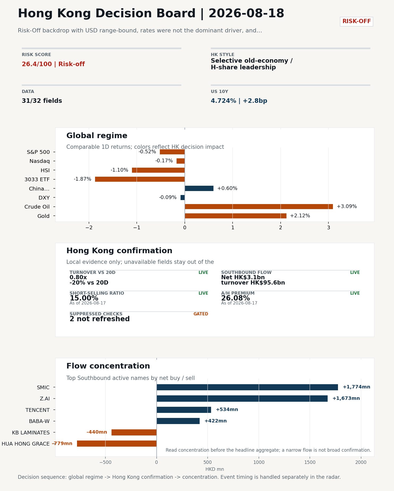
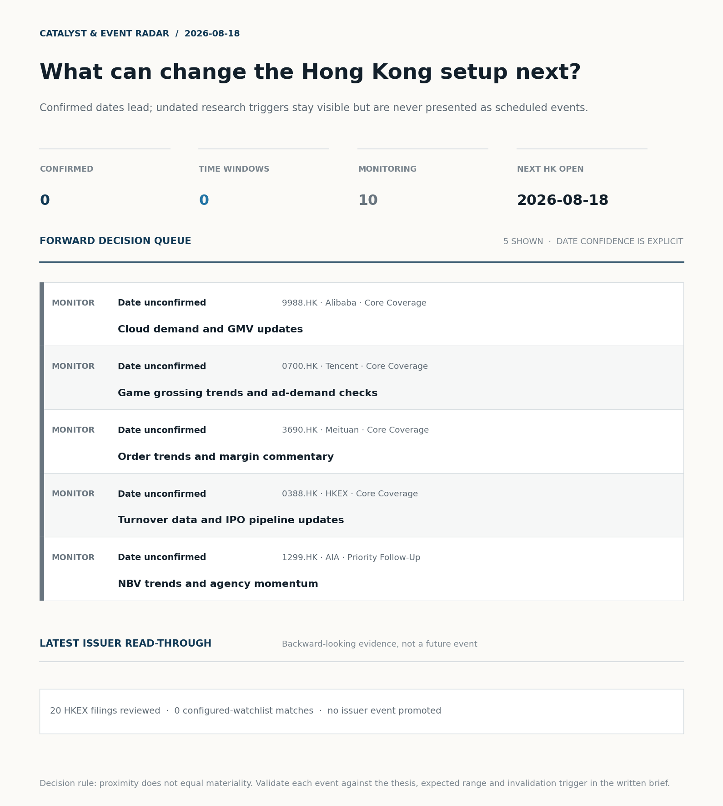
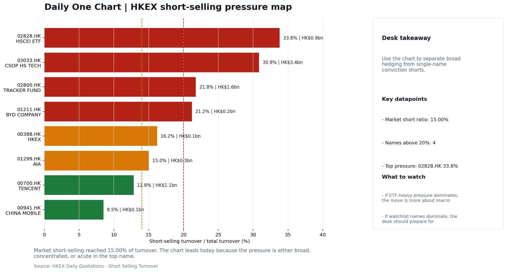
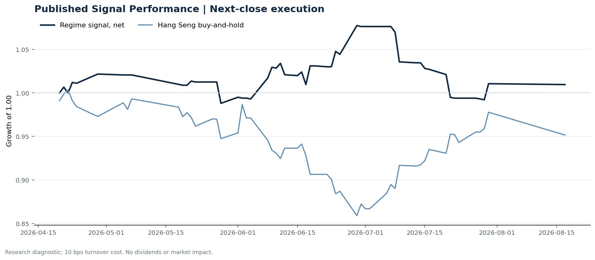

# Morning Research Workbench | 2026-08-18

> **Commute reading route:** `5-minute decision scan` → `25-30 minute deep read` → `10-15 minute optional appendix`
>
> Mode: `Trading Daily` | Keep the report execution-oriented: what mattered in the completed session, what can move Hong Kong leadership, and what needs fast follow-up.

_Data through: global `2026-08-17` | HK/China `2026-08-17` | Market effective `2026-08-17` | Generated `2026-08-18 05:40:36`_

## Executive Summary

- **Market pulse:** Overnight risk-off came with a range-bound dollar and a geopolitical oil bid, leaving Hong Kong's session a test of whether the HSCEI value tape can hold against thin turnover and a weaker.
- **Hong Kong lens:** Selective old-economy / H-share leadership: HSCEI beat 3033.HK by 0.85pp (-1.02% versus -1.87%). Conviction is limited because turnover was only 0.80x its 20-day average. Partial support came from Southbound recorded +HK$3.1bn net buying. Treat banks, energy, telecoms, and SOE yield as the cleaner relative expression; growth beta still needs proof.
- **Opening implication:** Today's Hong Kong open is more credible if HSCEI again holds the relative bid against 3033.HK and Southbound flow stays positive.
- **What would confirm it:** Confirm if HSCEI keeps outperforming 3033.HK with healthy turnover and broad Southbound participation.
- **What could break it:** Invalidate if 3033.HK retakes leadership while CNH firms and local participation broadens.

## Visual Dashboard

**Catalyst & Event Radar**

**Chart read:** No confirmed event date is populated; 10 undated research trigger(s) remain visible without invented timing.

_Source: Public calendars, issuer disclosures and configured research watchlists_
## Layer 1 | Scan (5 min)

### 1.2 Global Asset Price Dashboard
_Decision-useful subset: each row states the implication and the next test. Descriptive secondary monitors are kept out of the five-minute scan._

| Signal | Last / move | Interpretation | Confirmation / invalidation |
| --- | --- | --- | --- |
| S&P 500 | 7,745.06 / -0.52% | US beta weakened, reducing the external risk cushion for Hong Kong. | Confirm with Nasdaq breadth and a same-direction VIX move; invalidate if offshore-China proxies diverge. |
| Nasdaq 100 | 29,995.38 / -0.17% | Growth outperformed broad beta, a supportive style signal for Hong Kong internet and platform names. | Confirm through the 3033.HK ETF versus HSI leadership; higher US yields would weaken the read. |
| Hang Seng Index | 25,116.85 / -1.10% | Hong Kong broad beta weakened and needs offshore or policy support to stabilize. | Confirm with Southbound participation and breadth; invalidate if USD/CNH weakens while turnover fades. |
| Hang Seng TECH ETF (3033.HK) | 4.6160 / **-1.87%** | Hong Kong growth lagged, so broad-index strength is not yet a duration signal. | Confirm with stable CNH, Southbound buying and lower yields; invalidate on growth underperformance with rising yields. |
| US 10Y | 4.7240% / +2.8bp | The yield proxy rose, tightening the discount-rate backdrop for long-duration Hong Kong growth. | Confirm through Nasdaq and 3033.HK ETF relative performance; invalidate if growth leads despite the opposing rate move. |
| China 10Y | 1.69% / -0.4bp | Lower local yields may reflect easing support or softer demand; the signal is ambiguous without growth confirmation. | Use CSI 300, copper and official credit/activity data to separate growth optimism from demand weakness. |
| DXY | 99.58 / -0.09% | A softer dollar eases an external-liquidity headwind for Hong Kong risk assets. CNH did not confirm the relief, so the liquidity signal is incomplete. | Confirm with USD/CNH moving in the same risk direction; divergence reduces conviction. |
| USD/CNH | 6.7305 / +0.00% | CNH was stable, removing an immediate FX impulse but not confirming equity direction. | Confirm with FXI, the 3033.HK ETF proxy and Southbound flow; invalidate if equities move opposite to FX with strong local participation. |
| VIX | 15.19 / **+6.60%** | Higher implied volatility raises the tail-risk premium and weakens risk-on conviction. | Confirm with equity breadth and credit-sensitive assets; invalidate if lower VIX accompanies narrow or falling equities. |

_Secondary monitors retained in the source bundle: CSI 300, CN-US 10Y spread, USD/HKD, Brent crude, COMEX gold, Copper._

### 1.3 Hong Kong Key Data Quick Check
_Coverage gate: 1 unavailable local checks are suppressed here and retained in validation metadata._

| Check | Value | Status | Source / as of | Why it matters |
| --- | --- | --- | --- | --- |
| Main Board turnover vs 20D | 0.80x \| -20% vs 20D | Live local | HKEX \| 2026-08-17 | Trailing 20-session average turnover was HK$262.5bn. |
| Southbound / Northbound net flow | Southbound Net HK$3.1bn \| turnover HK$95.6bn \| Northbound Turnover HK$299.7bn \| net not reported | Live local | HKEX Connect \| 2026-08-17 | Southbound net buy is calculated from HKEX disclosed buy and sell turnover. |
| Short-selling ratio | 15.00% | Live local | HKEX \| 2026-08-17 | Official HKEX stock-level short-selling table, aggregated as a share of total market turnover. |
| AH premium index | 26.08% | Live public | Yahoo \| 2026-08-17 | Simple average across 19 A/H pairs; use dispersion rather than the average alone. |
| USD/HKD spot vs band | 7.8434 | Live quote | Yahoo \| 2026-08-17 | Inside the linked-exchange band without immediate boundary stress. |
| Hong Kong leadership | Selective old-economy / H-share leadership | Proxy | HSI / HSCEI / 3033.HK ETF relative \| 2026-08-17 | Use HSI / HSCEI / 3033.HK ETF relative moves as the opening style read. |

### 1.4 Decision Board
**Composite risk score:** `26.4/100` | **Regime:** `Risk-off`

| Component | Score impact | Evidence |
| --- | --- | --- |
| US beta | -3.1 | S&P 500 -0.52% |
| HK growth ETF proxy | -9.4 | 3033.HK ETF -1.87% |
| Offshore China proxy | +3.0 | FXI +0.60% |
| Dollar pressure | +0.9 | DXY -0.09% |

**Morning Checklist**

1. **VIX +6.60%**
 High-frequency data | Higher volatility argues for tighter sizing and tighter stops.
2. **Risk-Off backdrop with USD range-bound, rates were not the dominant driver, and Oil outperformed Gold**
 Overnight regime | Start by deciding whether the day is about Risk-Off conditions or a style pivot.
3. **WTI crude +3.09%**
 High-frequency data | A strong crude move needs to be split between geopolitics and demand repair.
4. **Bitcoin +2.34%**
 High-frequency data | A strong crypto tape reinforces the risk-on read.

## Layer 2 | Deep Read (20-30 min)

### 2.1 Overnight Overseas Market Review
**Market Setup**
**Core tape.** Overnight trade ran a Risk-Off tape with the dollar effectively range-bound and rates a secondary story.
**Main driver.** US 10Y added only +2.8bp to 4.724%, so the equity drawdown (S&P 500 -0.52%, Nasdaq 100 -0.17%) was not driven by a rates repricing.
**HK relevance.** The cleanest signal was in commodities.

**Key Drivers**
- Rates were not the main mover: US 10Y +2.8bp is too small to explain the equity drawdown, matching attribution_v1's read that rates were.
- Oil outperformed Gold (intraday spread ~3.16pp.
- USD was range-bound (DXY -0.09%, USD/CNH +0.00%, USD/HKD -0.05% to 7.8434), keeping the Hong Kong funding lens benign and removing.
- Hong Kong participation was thin: Main Board turnover at 0.80x the 20-day average (-20% vs 20D) per HKEX.

**Hong Kong Read-Through**
**Desk lens.** Selective old-economy / H-share leadership.
**Evidence.** HSCEI beat 3033.HK by 0.85pp (-1.02% versus -1.87%)
**Investment read.** Treat banks, energy, telecoms, and SOE yield as the cleaner relative expression; growth beta still needs proof.
**Opening implication.** Today's Hong Kong open is more credible if HSCEI again holds the relative bid against 3033.HK and Southbound flow stays positive.
- **Cross-market read:** Hang Seng -1.10% / HSCEI -1.02% / 3033.HK ETF -1.87%.
- **Cross-market read:** Offshore China proxy FXI +0.60% and USD/CNH +0.00% frame cross-border risk appetite.
- **Cross-market read:** USD/HKD last traded around 7.8434, which keeps the Hong Kong funding lens in focus.

**Watch Points**
- USD composite moved higher by +0.04pct intraday, with a 0.242pct range.
- Main turning points appeared around 2026-08-17 08:05 peak / 2026-08-17 08:20 trough / 2026-08-17 08:45 peak, suggesting event-driven repricing.
- The biggest cross-asset divergence was Oil versus Gold, a spread of 3.161pct.
- Gold moved +0.42pct intraday with a 1.132pct high-low range.

### 2.2 Hong Kong / A-share Previous-Day Review
**Style and Local Leadership**
**Style call.** Selective old-economy / H-share leadership.
- **Evidence:** HSCEI beat 3033.HK by 0.85pp (-1.02% versus -1.87%)
- **Portfolio meaning:** Treat banks, energy, telecoms, and SOE yield as the cleaner relative expression; growth beta still needs proof.
- **Cross-market read:** Hang Seng -1.10% / HSCEI -1.02% / 3033.HK ETF -1.87%.
- **Cross-market read:** Offshore China proxy FXI +0.60% and USD/CNH +0.00% frame cross-border risk appetite.
- **Cross-market read:** USD/HKD last traded around 7.8434, which keeps the Hong Kong funding lens in focus.

**Flow Confirmation**
Official Stock Connect evidence is available; use Section 2.3 to confirm whether local money supports the price action.

**Follow-Through Checklist**
**Follow-through check.** Confirm if HSCEI keeps outperforming 3033.HK with healthy turnover and broad Southbound participation.
**Failure condition.** Invalidate if 3033.HK retakes leadership while CNH firms and local participation broadens.

### 2.3 Flow Tracker and Attribution
**Cross-Asset Attribution**

| Driver | Direction | Score | Evidence | HK implication |
| --- | --- | --- | --- | --- |
| Oil and geopolitics | mixed | 2.33 | Oil moved +2.91%. | Split the read between energy/cyclicals support and margin/geopolitical pressure. |
| Hong Kong participation | drag | 1.97 | Main Board turnover was 0.80x the 20-session average. | Thin turnover makes index moves easier to fade. |

**Local Flow Tracker**

**Flow Takeaways**
- Turnover is light versus the 20-session baseline, so local moves have weaker conviction.
- Stock Connect Southbound: net HK$3.1bn on turnover HK$95.6bn (as of 2026-08-17).
- Stock Connect Northbound: turnover RMB299.7bn; public file provides total turnover/top active names, not full net-buy.
- AH premium: simple covered-pair average +26.08%; widest premium: China Communications Construction 86.44%.

**Stock Connect Southbound Active Names**

| Rank | Ticker | Name | Buy | Sell | Net buy |
| --- | --- | --- | --- | --- | --- |
| 1 | 00981.HK | SMIC | HK$5,209.7mn | HK$3,435.2mn | HK$1,774.5mn |
| 2 | 02513.HK | Z.AI | HK$3,977.1mn | HK$2,304.3mn | HK$1,672.8mn |
| 5 | 01347.HK | HUA HONG GRACE | HK$1,293.9mn | HK$2,072.6mn | HK$-778.7mn |
| 2 | 00700.HK | TENCENT | HK$2,530.7mn | HK$1,996.9mn | HK$533.8mn |
| 5 | 01888.HK | KB LAMINATES | HK$1,679.4mn | HK$2,119.4mn | HK$-440.0mn |

**AH Premium Dispersion**

| Name | A ticker | H ticker | Premium | As of |
| --- | --- | --- | --- | --- |
| China Communications Construction | 601800.SS | 1800.HK | +86.44% | 2026-08-17 |
| China Life | 601628.SS | 2628.HK | +56.22% | 2026-08-17 |
| China Railway Construction | 601186.SS | 1186.HK | +55.69% | 2026-08-17 |
| China Railway | 601390.SS | 0390.HK | +48.54% | 2026-08-17 |
| New China Life | 601336.SS | 1336.HK | +46.94% | 2026-08-17 |

**HKEX Short-Selling Watch**

| Ticker | Name | Short ratio | Short turnover | Total turnover |
| --- | --- | --- | --- | --- |
| 00388.HK | HKEX | 16.21% | HK$0.1bn | HK$0.9bn |
| 00700.HK | TENCENT | 12.84% | HK$1.1bn | HK$8.9bn |
| 00941.HK | CHINA MOBILE | 8.50% | HK$0.1bn | HK$1.1bn |
| 01211.HK | BYD COMPANY | 21.20% | HK$0.2bn | HK$1.2bn |
| 01299.HK | AIA | 15.04% | HK$0.3bn | HK$2.2bn |

- **Short-value leaders:** 03033.HK CSOP HS TECH (HK$3.4bn); 02800.HK TRACKER FUND (HK$1.6bn); 09988.HK BABA-W (HK$1.2bn); 00700.HK TENCENT (HK$1.1bn).

### 2.4 Macro and Policy Tracking
**Desk read.** Use the calendar table and released data below as the primary macro read.

The macro calendar was light for this run.

**Positioning and Risk Backdrop**

- Detailed local flow evidence is covered in Section 2.3; keep this section focused on options, hedging, and macro-positioning risk.

### 2.5 Company Catalysts and Risk Monitor

| Grade | Sector | Headline | Why it matters | Horizon |
| --- | --- | --- | --- | --- |
| B | China Internet | Stocks making the biggest moves premarket | Assess whether the story can propagate through the China Internet value | Monitor |

Decision filter<h4>No immediate portfolio catalyst: 20 official filings were screened and the low-signal market set stays aggregated.</h4>
20 profit warnings

<strong>20</strong>Official filings

<strong>0</strong>Watchlist hits

<strong>0</strong>Actionable events

<strong>No event cleared the portfolio decision filter.</strong>

Broad-market filings remain traceable in the source appendix; they are not expanded here without a watchlist, estimate or liquidity read-through.

<strong>Coverage boundary.</strong> Earnings calendar, sell-side rating changes, IPO / grey-market monitor were not decision-grade in this run; their absence is not treated as confirmation that no event exists.

### 2.6 Today's Core Names
**Core coverage**

| Name | Ticker | Last | 1D | Range position | Morning note |
| --- | --- | --- | --- | --- | --- |
| Alibaba | 9988.HK | 122.20 | +1.92% | Top of range | The name sits near the top of its recent range, so watch for profit-taking under high expectations. |
| Tencent | 0700.HK | 446.40 | +1.45% | Mid-range | Positioning is neutral for now, so use it mainly to monitor marginal information changes. |

**Recent headlines for Alibaba:**
- [Alibaba sells $1.5B game unit in AI pivot: AlphaSpace breakdown](https://finance.yahoo.com/video/alibaba-sells-15b-game-unit-in-ai-pivot-alphaspace-breakdown-173510736.html) (Yahoo Finance Video)

**Priority follow-up**

| Name | Ticker | Last | 1D | Range position | Morning note |
| --- | --- | --- | --- | --- | --- |
| AIA | 1299.HK | 73.40 | +4.26% | Bottom of range | Short-term price strength is clear; fresh catalysts could trigger broader group follow-through. |
| BYD Company | 1211.HK | 90.05 | +2.04% | Mid-range | Short-term price strength is clear; fresh catalysts could trigger broader group follow-through. |

## Layer 3 | Decision Deepening (10-15 min)

### 3.1 Rotating Theme Deep Dive

| Field | Read |
| --- | --- |
| Theme | China Consumption Recovery |
| Angle for the day | Focus on whether travel, retail, internet local services, and premium consumption data still support a demand-repair narrative. |

**Theme desk read**
**Core thesis.** The China Consumption Recovery angle asks whether travel, retail, internet local services, and premium consumption data still support a demand-repair narrative.
**Evidence.** The session is flagged Risk-Off with VIX +6.60% and US 10Y +2.8bp, which would normally temper local-services enthusiasm, yet WTI +3.09% and Bitcoin +2.34% introduce a split signal.
**What to test.** For Meituan (3690.HK), the immediate read is that the JD.com earnings beat on 2026-08-13, with the food-delivery fight between JD, Alibaba.

**Signals to keep in mind**
- VIX +6.60%: Higher volatility argues for tighter sizing and tighter stops.
- WTI crude +3.09%: A strong crude move needs to be split between geopolitics and demand repair.

**LLM watch items:**
- Decompose the WTI +3.09% move: confirm whether it is geopolitics or demand-repair, since the latter would directly support the China consumption
- Track VIX persistence above 15 after the +6.60% spike; sustained elevation would invalidate the partial risk-on read from Bitcoin and pressure HK
- Watch Meituan price action at the top of range; a failed breakout with negative breadth would confirm profit-taking risk noted in the model note.
- Follow JD.com beat spillover into Meituan's GMV and take-rate trajectory, specifically any update on food-delivery competition intensity following
- Monitor premium consumption and travel data releases; the theme remains data-dependent and no specific catalyst date is loaded in the context.

**Related names to keep close:**

| Name | Ticker | Bucket | Morning read |
| --- | --- | --- | --- |
| Meituan | 3690.HK | Core coverage | The name sits near the top of its recent range, so watch for profit-taking under high expectations. |

### 3.2 Today Ahead and Trading Calendar
- The calendar is relatively light, so the market may trade more off positioning and overnight headlines.

**Same-day macro docket**
No same-day macro items were scheduled.

**Same-day catalyst list**
No same-day catalysts were highlighted.

**Next few sessions**
No forward catalyst list was populated.

### 3.3 Daily One Chart
**Daily One Chart | HKEX short-selling pressure map**

**Chart read.** Market short-selling reached 15.00% of turnover.
**Why it matters.** The chart leads today because the pressure is either broad, concentrated, or acute in the top name.

_Source: HKEX Daily Quotations - Short Selling Turnover_

## Optional Appendix | Traceability and Performance (10-15 min)

### Report Metadata
> Date policy: Review date 2026-08-17 is treated as `Trading Daily`. | Global request date is 2026-08-17; adapter effective date is 2026-08-17 and summary date is 2026-08-17. | HK/China local data date is 2026-08-17; role: same-session local cash tape.
> Market data quality: Coverage: `31/32` | Missing: `1`
> Report quality: `81.3/100` | Grade `B` | Status `usable with caveats`

### Key Questions to Keep in Mind
- Is risk appetite rising or fading? The overnight tape reads closer to `Risk-Off`.
- Did rates expectations move? Focus on whether US 10Y, DXY, and growth style moved together.
- Were commodities the real story? Watch WTI and gold for geopolitics versus inflation signals.
- Is Hong Kong setup growth-led, SOE-led, or broad beta-led? Compare the 3033.HK ETF proxy, HSCEI, and HSI.
- Did offshore markets move China risk appetite? Focus on HSI, FXI, USD/CNH, and USD/HKD.

### Report Quality and Validation
- **Quality score:** 81.3/100 | **Grade:** B | **Status:** usable with caveats
- **Run summary:** 7 healthy | 1 caveat | 2 failed
- **Release recommendation:** Send with caveats | The report is usable, but the advisory guidance should travel with it so readers understand the data gaps.

| Source | Status | Bucket |
| --- | --- | --- |
| Market data | ok | healthy |
| Sector and company news | ok | healthy |
| Movers and short selling | ok | healthy |
| Stock Connect | ok | healthy |
| A/H premium | ok | healthy |
| Hong Kong local package | ok | healthy |
| China rates | ok | healthy |
| Macro calendar | unavailable | failed |
| Risk and sentiment feed | unavailable | failed |
| Narrative overlay | partial | caveat |

**Desk-use guidance summary:** 0 blocking | 2 advisory

**Desk-use guidance**
- **Advisory:** Questionable narrative fields were removed; use the deterministic fallback copy and review the audit trail.
- **Advisory:** Use deterministic sections as primary support; the narrative overlay was partial or unavailable on this run.

| Component | Score | Weight | Read |
| --- | --- | --- | --- |
| Market data coverage | 96.9 | 0.2 | 31/32 core market fields available. |
| Hong Kong local metrics | 54.1 | 0.2 | 5 live, 3 proxy, 3 unavailable local checks. |
| Key public adapters | 100.0 | 0.2 | 4/4 key adapters were available or partially available. |
| Narrative overlay health | 42.1 | 0.1 | 2/7 narrative overlay tasks succeeded or used validated cache; 3 error(s). |
| Fact-check guardrail | 100.0 | 0.15 | Checked 29 numeric claims; 0 numeric mismatch(es), 0 logic warning(s); 0 structured claims, 0 source/text warning(s). |
| Source provenance | 92.0 | 0.05 | 42 provenance record(s) validated; 2 unavailable source record(s). |
| Source health and freshness | 73.1 | 0.1 | 8 healthy, 0 degraded, 2 unavailable source group(s). |

**Quality warnings**
- Hong Kong local metrics is weak: 5 live, 3 proxy, 3 unavailable local checks.
- Narrative overlay health is weak: 2/7 narrative overlay tasks succeeded or used validated cache; 3 error(s).
- Narrative fact-check guardrail produced warnings; review the validation table before relying on narrative sections.

**Narrative fact-check guardrail**
- Checked 29 numeric claims; 0 numeric mismatch(es), 0 logic warning(s); 0 structured claims, 0 source/text warning(s); 0 critical, 0 review. Replaced 2 unsafe narrative field(s) with deterministic fallback copy.
- **Deterministic fallback fields:** interview_answer, tasks.final_framing.interview_answer

**Source provenance validation**
- Status: ok | records checked: 42 | unavailable: 2

**Source health and freshness**
- **Source health:** degraded | 8 healthy | 0 degraded | 2 unavailable

| Source | Critical | Status | Score | Fresh coverage | Age range | Policy |
| --- | --- | --- | --- | --- | --- | --- |
| hk_local | Yes | healthy | 98.5 | 1/1 | 1 - 1d | ≤4d / ≥100% |
| macro_calendar | No | unavailable | 0.0 | 0/0 | Unknown | ≤14d / ≥0% |
| market_data | Yes | healthy | 93.0 | 31/31 | 1 - 4d | ≤4d / ≥80% |
| risk_feed | No | unavailable | 0.0 | 0/0 | Unknown | ≤4d / ≥0% |

**Adapter status**

| Adapter | Status |
| --- | --- |
| Stock Connect | ok |
| A/H premium | ok |
| HKEX announcements | ok |
| China rates | ok |

### Historical Signal Performance
- **Readiness:** exploratory with caveats | 65 market observations | 81 active signal dates
- **Execution rule:** use only the next available close after publication; 10 bps turnover cost by default. Current-day signals never receive same-day returns.
- **Interpretation boundary:** results are exploratory until a benchmark reaches 252 sessions and 100 active-signal sessions.

| Benchmark | Sessions | Signal net | Buy & hold | Excess | Max drawdown | Hit rate |
| --- | --- | --- | --- | --- | --- | --- |
| Hang Seng Index | 56 | 1.0% | -4.8% | 5.8% | -7.9% | 48.1% |
| Hang Seng TECH ETF (3033.HK) | 55 | -2.1% | -7.6% | 5.4% | -13.3% | 48.1% |

**Hang Seng event-horizon diagnostics**

| Horizon | Resolved | Hit rate | Average net return |
| --- | --- | --- | --- |
| 1 sessions | 33 | 51.5% | 0.1% |
| 5 sessions | 30 | 56.7% | -0.0% |
| 20 sessions | 24 | 41.7% | -1.1% |

- **Data-quality caveat:** 17 conflicting historical price revision(s) and 6 weekend pseudo-session observation(s) were handled explicitly; inspect the ledger before relying on the result.
- **Use boundary:** this is a close-to-close research diagnostic, not an executable strategy or investment recommendation; dividends, financing, borrow and market impact are excluded.

### Source Links
- [Stocks making the biggest moves premarket: Alibaba, Intel, Sandisk & more](https://www.cnbc.com/2026/08/17/stocks-making-the-biggest-moves-premarket-baba-intc-sndk.html) (cnbc_markets)
- [Alibaba sells $1.5B game unit in AI pivot: AlphaSpace breakdown](https://finance.yahoo.com/video/alibaba-sells-15b-game-unit-in-ai-pivot-alphaspace-breakdown-173510736.html) (Yahoo Finance Video)
- [Stocks to Watch Recap: Alibaba, L3Harris, Diana Shipping, BHP](https://www.wsj.com/livecoverage/stock-market-today-dow-sp-500-nasdaq-08-17-2026/card/stocks-to-watch-alibaba-diana-shipping-bhp-xNrQSBdGgZVZiqNTks2N?siteid=yhoof2&yptr=yahoo) (The Wall Street Journal)
- [JD.com Profit Beats Estimates After Food Delivery Fight Calms](https://finance.yahoo.com/markets/stocks/articles/jd-com-profit-beats-estimates-100519514.html) (Bloomberg)
- [00036.HK Profit warning / alert announcement](http://www1.hkexnews.hk/listedco/listconews/sehk/2026/0817/2026081700634.pdf) (HKEXnews)
- [00079.HK Profit warning / alert announcement](http://www1.hkexnews.hk/listedco/listconews/sehk/2026/0817/2026081701261.pdf) (HKEXnews)
- [00089.HK Profit warning / alert announcement](http://www1.hkexnews.hk/listedco/listconews/sehk/2026/0817/2026081700646.pdf) (HKEXnews)
- [00116.HK Profit warning / alert announcement](http://www1.hkexnews.hk/listedco/listconews/sehk/2026/0817/2026081700999.pdf) (HKEXnews)
- [00138.HK Profit warning / alert announcement](http://www1.hkexnews.hk/listedco/listconews/sehk/2026/0817/2026081701351.pdf) (HKEXnews)
- [00487.HK Profit warning / alert announcement](http://www1.hkexnews.hk/listedco/listconews/sehk/2026/0817/2026081701005.pdf) (HKEXnews)
- [00604.HK Profit warning / alert announcement](http://www1.hkexnews.hk/listedco/listconews/sehk/2026/0817/2026081700890.pdf) (HKEXnews)
- [00664.HK Profit warning / alert announcement](http://www1.hkexnews.hk/listedco/listconews/sehk/2026/0817/2026081701577.pdf) (HKEXnews)

## Supplementary Visual Appendix

This appendix is professional-path only. It keeps a traceable index of the report visuals and the deterministic chart cues used to frame the morning note, without injecting the legacy intraday chart pack.

### Visual Index

| Visual | Path | Role |
| --- | --- | --- |
| Visual Dashboard | `charts/dashboard_2026-08-18.png` | Cross-asset regime board and Hong Kong local tape snapshot. |
| Catalyst & Event Radar | `charts/catalyst_radar_2026-08-18.png` | Confirmed dates, time windows, undated monitors, and recent issuer read-through. |
| Daily One Chart | `charts/daily_one_chart_2026-08-18.png` | Single highest-conviction visual story for the day. |

### Deterministic Chart Cues
- FX / liquidity: USD composite moved higher by +0.04pct intraday, with a 0.242pct range.
- FX / liquidity: Main turning points appeared around 2026-08-17 08:05 peak / 2026-08-17 08:20 trough / 2026-08-17 08:45 peak, suggesting event-driven repricing rather than a clean one-way USD move.
- Cross-asset: The biggest cross-asset divergence was Oil versus Gold, a spread of 3.161pct.
- Cross-asset: Gold moved +0.42pct intraday with a 1.132pct high-low range.
- Cross-asset: Oil moved +3.58pct intraday with a 4.085pct high-low range.
- Cross-asset: Bitcoin moved +2.28pct intraday with a 2.827pct high-low range.

### Risk Dashboard Components

| Component | Score impact | Evidence |
| --- | --- | --- |
| US beta | -3.1 | S&P 500 -0.52% |
| HK growth ETF proxy | -9.4 | 3033.HK ETF -1.87% |
| Offshore China proxy | +3.0 | FXI +0.60% |
| Dollar pressure | +0.9 | DXY -0.09% |
| Volatility | -10 | VIX +6.60% |
| HK short-selling | +0 | Short-selling ratio 15.00% |
