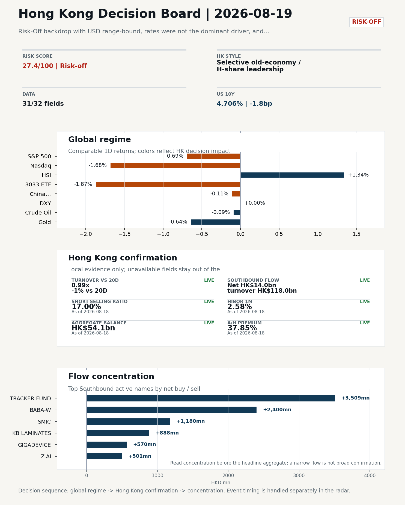
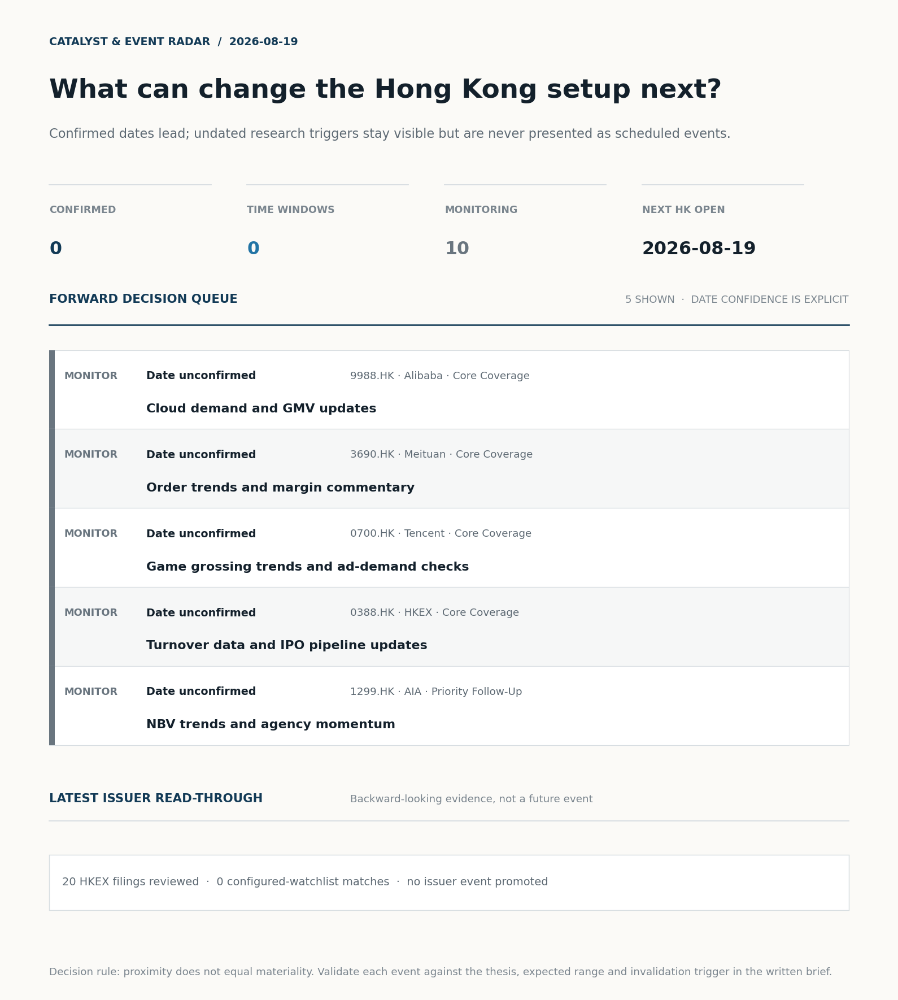
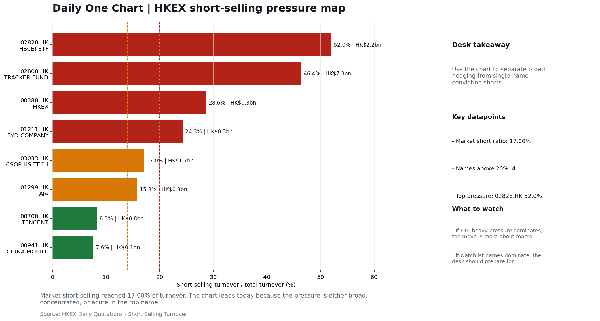
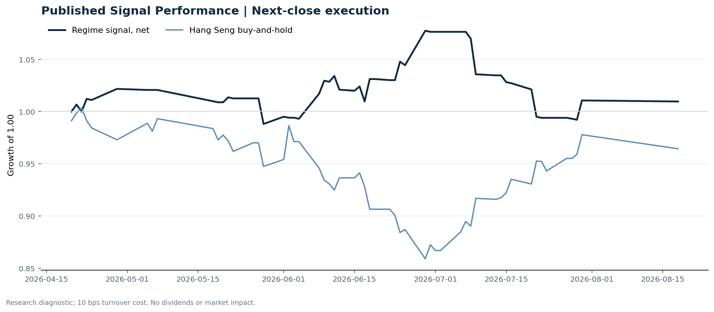

# Morning Research Workbench | 2026-08-19

> **Commute reading route:** `5-minute decision scan` → `25-30 minute deep read` → `10-15 minute optional appendix`
>
> Mode: `Trading Daily` | Keep the report execution-oriented: what mattered in the completed session, what can move Hong Kong leadership, and what needs fast follow-up.

_Data through: global `2026-08-18` | HK/China `2026-08-18` | Market effective `2026-08-18` | Generated `2026-08-19 05:38:04`_

## Executive Summary

- **Market pulse:** Risk-Off backdrop with USD range-bound, rates were not the dominant driver, and Bitcoin outperformed Gold
- **Hong Kong lens:** Selective old-economy / H-share leadership: HSCEI beat 3033.HK by 3.06pp (+1.19% versus -1.87%). Conviction is limited because short selling was elevated at 17.0%; FXI (-0.11%) lagged HSI (+1.34%). Partial support came from Southbound recorded +HK$14.0bn net buying. Treat banks, energy, telecoms, and SOE yield as the cleaner relative expression; growth beta still needs proof.
- **Opening implication:** For the 2026-08-19 HK open, the Nasdaq 100 sell-off is the cleanest warning that growth, platform, and consumer-internet names will be tested first, so the right lean is to keep.
- **What would confirm it:** Confirm if HSCEI keeps outperforming 3033.HK with healthy turnover and broad Southbound participation.
- **What could break it:** Invalidate if 3033.HK retakes leadership while CNH firms and local participation broadens.

## Visual Dashboard

**Catalyst & Event Radar**

**Chart read:** No confirmed event date is populated; 10 undated research trigger(s) remain visible without invented timing.

_Source: Public calendars, issuer disclosures and configured research watchlists_
## Layer 1 | Scan (5 min)

### 1.2 Global Asset Price Dashboard
_Decision-useful subset: each row states the implication and the next test. Descriptive secondary monitors are kept out of the five-minute scan._

| Signal | Last / move | Interpretation | Confirmation / invalidation |
| --- | --- | --- | --- |
| S&P 500 | 7,691.76 / -0.69% | US beta weakened, reducing the external risk cushion for Hong Kong. | Confirm with Nasdaq breadth and a same-direction VIX move; invalidate if offshore-China proxies diverge. |
| Nasdaq 100 | 29,490.96 / **-1.68%** | Growth lagged broad beta, warning that headline risk-on may not transmit cleanly to the 3033.HK ETF proxy. | Confirm through the 3033.HK ETF versus HSI leadership; higher US yields would weaken the read. |
| Hang Seng Index | 25,453.23 / +1.34% | Hong Kong broad beta strengthened, but local flow must confirm whether the move is investable. | Confirm with Southbound participation and breadth; invalidate if USD/CNH weakens while turnover fades. |
| Hang Seng TECH ETF (3033.HK) | 4.6160 / **-1.87%** | Hong Kong growth lagged, so broad-index strength is not yet a duration signal. | Confirm with stable CNH, Southbound buying and lower yields; invalidate on growth underperformance with rising yields. |
| US 10Y | 4.7060% / -1.8bp | The yield proxy fell, easing the valuation headwind for duration-sensitive equities. | Confirm through Nasdaq and 3033.HK ETF relative performance; invalidate if growth leads despite the opposing rate move. |
| China 10Y | 1.69% / -0.6bp | Lower local yields may reflect easing support or softer demand; the signal is ambiguous without growth confirmation. | Use CSI 300, copper and official credit/activity data to separate growth optimism from demand weakness. |
| DXY | 99.64 / -0.00% | The dollar was range-bound and adds little directional information. | Confirm with USD/CNH moving in the same risk direction; divergence reduces conviction. |
| USD/CNH | 6.7350 / +0.05% | CNH was stable, removing an immediate FX impulse but not confirming equity direction. | Confirm with FXI, the 3033.HK ETF proxy and Southbound flow; invalidate if equities move opposite to FX with strong local participation. |
| VIX | 15.84 / **+4.28%** | Higher implied volatility raises the tail-risk premium and weakens risk-on conviction. | Confirm with equity breadth and credit-sensitive assets; invalidate if lower VIX accompanies narrow or falling equities. |

_Secondary monitors retained in the source bundle: CSI 300, CN-US 10Y spread, USD/HKD, Brent crude, COMEX gold, Copper._

### 1.3 Hong Kong Key Data Quick Check

| Check | Value | Status | Source / as of | Why it matters |
| --- | --- | --- | --- | --- |
| Main Board turnover vs 20D | 0.99x \| -1% vs 20D | Live local | HKEX \| 2026-08-18 | Trailing 20-session average turnover was HK$257.8bn. |
| Southbound / Northbound net flow | Southbound Net HK$14.0bn \| turnover HK$118.0bn \| Northbound Turnover HK$307.6bn \| net not reported | Live local | HKEX Connect \| 2026-08-18 | Southbound net buy is calculated from HKEX disclosed buy and sell turnover. |
| Short-selling ratio | 17.00% | Live local | HKEX \| 2026-08-18 | Official HKEX stock-level short-selling table, aggregated as a share of total market turnover. |
| AH premium index | 37.85% | Live public | Yahoo \| 2026-08-18 | Simple average across 18 A/H pairs; use dispersion rather than the average alone. |
| USD/HKD spot vs band | 7.8431 \| band 7.7500 to 7.8500 | Live quote + local | Yahoo \| 2026-08-18 | Inside the linked-exchange band without immediate boundary stress. Official Convertibility Undertakings define the linked-rate stress boundaries for USD/HKD. |
| HIBOR 1M | 2.58% | Live local | HKMA \| 2026-08-18 | 1M HIBOR is the cleanest quick read for Hong Kong funding conditions and equity-duration pressure. |
| Hong Kong leadership | Selective old-economy / H-share leadership | Proxy | HSI / HSCEI / 3033.HK ETF relative \| 2026-08-18 | Use HSI / HSCEI / 3033.HK ETF relative moves as the opening style read. |

### 1.4 Decision Board
**Composite risk score:** `27.4/100` | **Regime:** `Risk-off`

| Component | Score impact | Evidence |
| --- | --- | --- |
| US beta | -4.1 | S&P 500 -0.69% |
| HK growth ETF proxy | -9.4 | 3033.HK ETF -1.87% |
| Offshore China proxy | -0.6 | FXI -0.11% |
| Dollar pressure | +0.0 | DXY -0.00% |

**Morning Checklist**

1. **Risk-Off backdrop with USD range-bound, rates were not the dominant driver, and Bitcoin outperformed Gold**
 Overnight regime | Start by deciding whether the day is about Risk-Off conditions or a style pivot.
2. **VIX +4.28%**
 High-frequency data | Higher volatility argues for tighter sizing and tighter stops.
3. **Copper -2.24%**
 High-frequency data | Weak copper argues for more caution on cyclical growth.
4. **[B] Stocks making the biggest moves premarket: Alibaba, Intel, Sandisk & more**
 News / announcements | Assess whether the story can propagate through the China Internet value chain

## Layer 2 | Deep Read (20-30 min)

### 2.1 Overnight Overseas Market Review
**Market Setup**
**Core tape.** Overnight, the US posted a risk-off session driven by growth-style transmission rather than rates: the Nasdaq 100 fell 1.68% versus the S&P 500's 0.69% decline.
**Main driver.** Volatility rose (VIX +4.28%) and copper fell 2.24%, suggesting cyclical demand caution rather than a clean duration move.
**HK relevance.** The chief cross-asset divergence was Bitcoin outperforming Gold, consistent with the attribution_v1 read that rates were not the dominant driver and the backdrop was risk-off inside a range-bound dollar.

**Key Drivers**
- Growth-style drag led the US tape: Nasdaq 100 -1.68% versus S&P 500 -0.69%, with US growth/internet transmission flagged as the dominant.
- Volatility and cyclicals confirmed the tone: VIX +4.28% and copper -2.24% argue for tighter sizing and caution on cyclical growth.
- USD stayed range-bound (DXY -0.00%) and oil was contained (WTI -0.09%), so liquidity stress and geopolitics were not the trigger.

**Hong Kong Read-Through**
**Desk lens.** Selective old-economy / H-share leadership.
**Evidence.** HSCEI beat 3033.HK by 3.06pp (+1.19% versus -1.87%)
**Investment read.** Treat banks, energy, telecoms, and SOE yield as the cleaner relative expression; growth beta still needs proof.
**Opening implication.** For the 2026-08-19 HK open, the Nasdaq 100 sell-off is the cleanest warning that growth, platform.
- **Cross-market read:** Hang Seng +1.34% / HSCEI +1.19% / 3033.HK ETF -1.87%.
- **Cross-market read:** Offshore China proxy FXI -0.11% and USD/CNH +0.05% frame cross-border risk appetite.
- **Cross-market read:** USD/HKD last traded around 7.8431, which keeps the Hong Kong funding lens in focus.

**Watch Points**
- USD composite moved higher by +0.06pct intraday, with a 0.1pct range.
- Main turning points appeared around 2026-08-18 08:30 peak / 2026-08-18 08:45 peak / 2026-08-18 09:00 peak, suggesting event-driven repricing rather.
- The biggest cross-asset divergence was Bitcoin versus Gold, a spread of 1.473pct.
- Gold moved -1.27pct intraday with a 1.642pct high-low range.

### 2.2 Hong Kong / A-share Previous-Day Review
**Style and Local Leadership**
**Style call.** Selective old-economy / H-share leadership.
- **Evidence:** HSCEI beat 3033.HK by 3.06pp (+1.19% versus -1.87%)
- **Portfolio meaning:** Treat banks, energy, telecoms, and SOE yield as the cleaner relative expression; growth beta still needs proof.
- **Cross-market read:** Hang Seng +1.34% / HSCEI +1.19% / 3033.HK ETF -1.87%.
- **Cross-market read:** Offshore China proxy FXI -0.11% and USD/CNH +0.05% frame cross-border risk appetite.
- **Cross-market read:** USD/HKD last traded around 7.8431, which keeps the Hong Kong funding lens in focus.

**Flow Confirmation**
Official Stock Connect evidence is available; use Section 2.3 to confirm whether local money supports the price action.

**Follow-Through Checklist**
**Follow-through check.** Confirm if HSCEI keeps outperforming 3033.HK with healthy turnover and broad Southbound participation.
**Failure condition.** Invalidate if 3033.HK retakes leadership while CNH firms and local participation broadens.

### 2.3 Flow Tracker and Attribution
**Cross-Asset Attribution**

| Driver | Direction | Score | Evidence | HK implication |
| --- | --- | --- | --- | --- |
| US growth-style transmission | drag | 2.35 | Nasdaq 100 moved -1.68%. | Hong Kong growth and platform names should be tested first at the open. |

**Local Flow Tracker**

**Flow Takeaways**
- Local flow evidence is not yet strong enough to override the cross-asset setup.
- Stock Connect Southbound: net HK$14.0bn on turnover HK$118.0bn (as of 2026-08-18).
- Stock Connect Northbound: turnover RMB307.6bn; public file provides total turnover/top active names, not full net-buy.
- AH premium: simple covered-pair average +37.85%; widest premium: CITIC Securities 97.64%.

**Stock Connect Southbound Active Names**

| Rank | Ticker | Name | Buy | Sell | Net buy |
| --- | --- | --- | --- | --- | --- |
| 7 | 02800.HK | TRACKER FUND | HK$3,512.5mn | HK$4.0mn | HK$3,508.5mn |
| 2 | 09988.HK | BABA-W | HK$5,064.6mn | HK$2,664.8mn | HK$2,399.8mn |
| 3 | 00981.HK | SMIC | HK$4,141.8mn | HK$2,961.6mn | HK$1,180.2mn |
| 9 | 01888.HK | KB LAMINATES | HK$2,164.6mn | HK$1,276.8mn | HK$887.9mn |
| 10 | 03986.HK | GIGADEVICE | HK$1,366.7mn | HK$797.2mn | HK$569.5mn |

**AH Premium Dispersion**

| Name | A ticker | H ticker | Premium | As of |
| --- | --- | --- | --- | --- |
| CITIC Securities | 600030.SS | 6030.HK | +97.64% | 2026-08-18 |
| China Communications Construction | 601800.SS | 1800.HK | +83.57% | 2026-08-18 |
| China Life | 601628.SS | 2628.HK | +59.70% | 2026-08-18 |
| China Railway Construction | 601186.SS | 1186.HK | +55.77% | 2026-08-17 |
| China Railway | 601390.SS | 0390.HK | +50.65% | 2026-08-17 |

**HKEX Short-Selling Watch**

| Ticker | Name | Short ratio | Short turnover | Total turnover |
| --- | --- | --- | --- | --- |
| 00388.HK | HKEX | 28.62% | HK$0.3bn | HK$1.2bn |
| 00700.HK | TENCENT | 8.28% | HK$0.8bn | HK$10.2bn |
| 00941.HK | CHINA MOBILE | 7.60% | HK$0.1bn | HK$1.2bn |
| 01211.HK | BYD COMPANY | 24.27% | HK$0.3bn | HK$1.1bn |
| 01299.HK | AIA | 15.78% | HK$0.3bn | HK$1.9bn |

- **Short-value leaders:** 02800.HK TRACKER FUND (HK$7.3bn); 09988.HK BABA-W (HK$3.4bn); 02828.HK HSCEI ETF (HK$2.2bn); 01810.HK XIAOMI-W (HK$1.7bn).

### 2.4 Macro and Policy Tracking
**Desk read.** Use the calendar table and released data below as the primary macro read.

The macro calendar was light for this run.

**Positioning and Risk Backdrop**

- Detailed local flow evidence is covered in Section 2.3; keep this section focused on options, hedging, and macro-positioning risk.

### 2.5 Company Catalysts and Risk Monitor

| Grade | Sector | Headline | Why it matters | Horizon |
| --- | --- | --- | --- | --- |
| B | China Internet | Stocks making the biggest moves premarket | Assess whether the story can propagate through the China Internet value | Monitor |

Decision filter<h4>No immediate portfolio catalyst: 20 official filings were screened and the low-signal market set stays aggregated.</h4>
20 profit warnings

<strong>20</strong>Official filings

<strong>0</strong>Watchlist hits

<strong>0</strong>Actionable events

<strong>No event cleared the portfolio decision filter.</strong>

Broad-market filings remain traceable in the source appendix; they are not expanded here without a watchlist, estimate or liquidity read-through.

<strong>Coverage boundary.</strong> Earnings calendar, sell-side rating changes, IPO / grey-market monitor were not decision-grade in this run; their absence is not treated as confirmation that no event exists.

### 2.6 Today's Core Names
**Core coverage**

| Name | Ticker | Last | 1D | Range position | Morning note |
| --- | --- | --- | --- | --- | --- |
| Alibaba | 9988.HK | 126.70 | +3.68% | Top of range | Short-term price strength is clear; fresh catalysts could trigger broader group follow-through. |
| Meituan | 3690.HK | 85.55 | -2.40% | Mid-range | Short-term pressure is visible; check for a fundamental or regulatory reason. |

**Recent headlines for Alibaba:**
- [Chinese Tech Giants Pivot Away From Gaming To Fuel Artificial Intelligence Race](https://stocktwits.com/news-articles/markets/equity/chinese-tech-giants-pivot-away-from-gaming-to-fuel-artificial-intelligence-race/cZYcZZsRJjH) (Stocktwits)
**Recent headlines for Meituan:**
- [JD.com Profit Beats Estimates After Food Delivery Fight Calms](https://finance.yahoo.com/markets/stocks/articles/jd-com-profit-beats-estimates-100519514.html) (Bloomberg)

**Priority follow-up**

| Name | Ticker | Last | 1D | Range position | Morning note |
| --- | --- | --- | --- | --- | --- |
| AIA | 1299.HK | 73.40 | +4.26% | Bottom of range | Short-term price strength is clear; fresh catalysts could trigger broader group follow-through. |
| China Mobile | 0941.HK | 82.10 | -0.36% | Mid-range | Positioning is neutral for now, so use it mainly to monitor marginal information changes. |

## Layer 3 | Decision Deepening (10-15 min)

### 3.1 Rotating Theme Deep Dive

| Field | Read |
| --- | --- |
| Theme | Innovative Biotech and Out-Licensing |
| Angle for the day | Watch whether clinical data, approvals, and licensing momentum are still supporting the innovative-healthcare rerating story. |

**Theme desk read**
**Core thesis.** The weekly Innovative Biotech and Out-Licensing angle remains a watchlist question rather than a confirmed rerating signal.
**Evidence.** The supplied dataset contains no clinical-data, approval, licensing, or biotech-related news.
**What to test.** The broader backdrop was Risk-Off: VIX rose 4.28% to 15.84 and copper fell 2.24% to 6.456, while rates were not the dominant driver and Bitcoin outperformed Gold.

**Signals to keep in mind**
- VIX +4.28%: Higher volatility argues for tighter sizing and tighter stops.
- Copper -2.24%: Weak copper argues for more caution on cyclical growth.

**LLM watch items:**
- Obtain and verify company-specific clinical-data, approval, and licensing updates; none are included in the supplied news or upcoming-catalyst data.
- Track whether VIX stays elevated and whether copper weakness persists; the reported changes were VIX +4.28% and copper -2.24%.
- Monitor Alibaba's cloud demand and GMV updates, and AIA's NBV trends and agency momentum; specific catalyst dates are missing.
-

**Related names to keep close:**

| Name | Ticker | Bucket | Morning read |
| --- | --- | --- | --- |
| Alibaba | 9988.HK | Core coverage | Short-term price strength is clear; fresh catalysts could trigger broader group follow-through. |
| AIA | 1299.HK | Priority follow-up | Short-term price strength is clear; fresh catalysts could trigger broader group follow-through. |

### 3.2 Today Ahead and Trading Calendar
- The calendar is relatively light, so the market may trade more off positioning and overnight headlines.

**Same-day macro docket**
No same-day macro items were scheduled.

**Same-day catalyst list**
No same-day catalysts were highlighted.

**Next few sessions**
No forward catalyst list was populated.

### 3.3 Daily One Chart
**Daily One Chart | HKEX short-selling pressure map**

**Chart read.** Market short-selling reached 17.00% of turnover.
**Why it matters.** The chart leads today because the pressure is either broad, concentrated, or acute in the top name.

_Source: HKEX Daily Quotations - Short Selling Turnover_

## Optional Appendix | Traceability and Performance (10-15 min)

### Report Metadata
> Date policy: Review date 2026-08-18 is treated as `Trading Daily`. | Global request date is 2026-08-18; adapter effective date is 2026-08-18 and summary date is 2026-08-18. | HK/China local data date is 2026-08-18; role: same-session local cash tape.
> Market data quality: Coverage: `31/32` | Stale items (>1d): `1` | Missing: `1`
> Report quality: `82.6/100` | Grade `B` | Status `manual review`

### Key Questions to Keep in Mind
- Is risk appetite rising or fading? The overnight tape reads closer to `Risk-Off`.
- Did rates expectations move? Focus on whether US 10Y, DXY, and growth style moved together.
- Were commodities the real story? Watch WTI and gold for geopolitics versus inflation signals.
- Is Hong Kong setup growth-led, SOE-led, or broad beta-led? Compare the 3033.HK ETF proxy, HSCEI, and HSI.
- Did offshore markets move China risk appetite? Focus on HSI, FXI, USD/CNH, and USD/HKD.

### Report Quality and Validation
- **Quality score:** 82.6/100 | **Grade:** B | **Status:** manual review
- **Run summary:** 7 healthy | 1 caveat | 2 failed
- **Release recommendation:** Manual review | Fact validation produced a release-blocking error; automatic distribution is blocked.

| Source | Status | Bucket |
| --- | --- | --- |
| Market data | ok | healthy |
| Sector and company news | ok | healthy |
| Movers and short selling | ok | healthy |
| Stock Connect | ok | healthy |
| A/H premium | ok | healthy |
| Hong Kong local package | ok | healthy |
| China rates | ok | healthy |
| Macro calendar | unavailable | failed |
| Risk and sentiment feed | unavailable | failed |
| Narrative overlay | partial | caveat |

**Desk-use guidance summary:** 1 blocking | 1 advisory

**Desk-use guidance**
- **Blocking:** Fact validation has a release-blocking finding; review it before distribution.
- **Advisory:** Use deterministic sections as primary support; the narrative overlay was partial or unavailable on this run.

| Component | Score | Weight | Read |
| --- | --- | --- | --- |
| Market data coverage | 96.9 | 0.2 | 31/32 core market fields available. |
| Hong Kong local metrics | 82.3 | 0.2 | 8 live, 3 proxy, 0 unavailable local checks. |
| Key public adapters | 100.0 | 0.2 | 4/4 key adapters were available or partially available. |
| Narrative overlay health | 36.4 | 0.1 | 2/7 narrative overlay tasks succeeded or used validated cache; 4 error(s). |
| Fact-check guardrail | 75.0 | 0.15 | Checked 24 numeric claims; 1 numeric mismatch(es), 0 logic warning(s); 0 structured claims, 0 source/text warning(s). |
| Source provenance | 92.0 | 0.05 | 42 provenance record(s) validated; 2 unavailable source record(s). |
| Source health and freshness | 73.0 | 0.1 | 8 healthy, 0 degraded, 2 unavailable source group(s). |

**Quality warnings**
- Narrative overlay health is weak: 2/7 narrative overlay tasks succeeded or used validated cache; 4 error(s).
- Narrative fact-check guardrail produced warnings; review the validation table before relying on narrative sections.

**Narrative fact-check guardrail**
- Checked 24 numeric claims; 1 numeric mismatch(es), 0 logic warning(s); 0 structured claims, 0 source/text warning(s); 1 critical, 0 review.
- **Deterministic fallback fields:** tasks.overnight_review.drivers[1], tasks.overnight_review.paragraph, tasks.theme_deep_dive.watch_items[3]

| Severity | Field | Claim | Type | Claimed | Expected | Snippet |
| --- | --- | --- | --- | --- | --- | --- |
| critical | deep_read_setup | Nasdaq 100 | change_pct | 1.68 | -1.68 | growth-style transmission rather than rates: the Nasdaq 100 fell 1.68% versus the S&P 500's 0.69% decline, while the US |

**Source provenance validation**
- Status: ok | records checked: 42 | unavailable: 2

**Source health and freshness**
- **Source health:** degraded | 8 healthy | 0 degraded | 2 unavailable

| Source | Critical | Status | Score | Fresh coverage | Age range | Policy |
| --- | --- | --- | --- | --- | --- | --- |
| hk_local | Yes | healthy | 98.5 | 1/1 | 1 - 1d | ≤4d / ≥100% |
| macro_calendar | No | unavailable | 0.0 | 0/0 | Unknown | ≤14d / ≥0% |
| market_data | Yes | healthy | 92.1 | 30/31 | 1 - 5d | ≤4d / ≥80% |
| risk_feed | No | unavailable | 0.0 | 0/0 | Unknown | ≤4d / ≥0% |

**Adapter status**

| Adapter | Status |
| --- | --- |
| Stock Connect | ok |
| A/H premium | ok |
| HKEX announcements | ok |
| China rates | ok |

### Historical Signal Performance
- **Readiness:** exploratory with caveats | 65 market observations | 82 active signal dates
- **Execution rule:** use only the next available close after publication; 10 bps turnover cost by default. Current-day signals never receive same-day returns.
- **Interpretation boundary:** results are exploratory until a benchmark reaches 252 sessions and 100 active-signal sessions.

| Benchmark | Sessions | Signal net | Buy & hold | Excess | Max drawdown | Hit rate |
| --- | --- | --- | --- | --- | --- | --- |
| Hang Seng Index | 56 | 1.0% | -3.6% | 4.5% | -7.9% | 48.1% |
| Hang Seng TECH ETF (3033.HK) | 55 | -2.1% | -7.6% | 5.4% | -13.3% | 48.1% |

**Hang Seng event-horizon diagnostics**

| Horizon | Resolved | Hit rate | Average net return |
| --- | --- | --- | --- |
| 1 sessions | 33 | 51.5% | 0.1% |
| 5 sessions | 30 | 56.7% | -0.0% |
| 20 sessions | 24 | 41.7% | -1.1% |

- **Data-quality caveat:** 17 conflicting historical price revision(s) and 6 weekend pseudo-session observation(s) were handled explicitly; inspect the ledger before relying on the result.
- **Use boundary:** this is a close-to-close research diagnostic, not an executable strategy or investment recommendation; dividends, financing, borrow and market impact are excluded.

### Source Links
- [Stocks making the biggest moves premarket: Alibaba, Intel, Sandisk & more](https://www.cnbc.com/2026/08/17/stocks-making-the-biggest-moves-premarket-baba-intc-sndk.html) (cnbc_markets)
- [Chinese Tech Giants Pivot Away From Gaming To Fuel Artificial Intelligence Race](https://stocktwits.com/news-articles/markets/equity/chinese-tech-giants-pivot-away-from-gaming-to-fuel-artificial-intelligence-race/cZYcZZsRJjH) (Stocktwits)
- [JD.com Profit Beats Estimates After Food Delivery Fight Calms](https://finance.yahoo.com/markets/stocks/articles/jd-com-profit-beats-estimates-100519514.html) (Bloomberg)
- [00055.HK Profit warning / alert announcement](http://www1.hkexnews.hk/listedco/listconews/sehk/2026/0818/2026081801827.pdf) (HKEXnews)
- [00117.HK Profit warning / alert announcement](http://www1.hkexnews.hk/listedco/listconews/sehk/2026/0818/2026081801062.pdf) (HKEXnews)
- [00222.HK Profit warning / alert announcement](http://www1.hkexnews.hk/listedco/listconews/sehk/2026/0818/2026081801233.pdf) (HKEXnews)
- [00261.HK Profit warning / alert announcement](http://www1.hkexnews.hk/listedco/listconews/sehk/2026/0818/2026081801357.pdf) (HKEXnews)
- [00305.HK Profit warning / alert announcement](http://www1.hkexnews.hk/listedco/listconews/sehk/2026/0818/2026081800716.pdf) (HKEXnews)
- [00373.HK Profit warning / alert announcement](http://www1.hkexnews.hk/listedco/listconews/sehk/2026/0818/2026081801241.pdf) (HKEXnews)
- [00451.HK Profit warning / alert announcement](http://www1.hkexnews.hk/listedco/listconews/sehk/2026/0818/2026081801138.pdf) (HKEXnews)
- [00538.HK Profit warning / alert announcement](http://www1.hkexnews.hk/listedco/listconews/sehk/2026/0818/2026081801899.pdf) (HKEXnews)

## Supplementary Visual Appendix

This appendix is professional-path only. It keeps a traceable index of the report visuals and the deterministic chart cues used to frame the morning note, without injecting the legacy intraday chart pack.

### Visual Index

| Visual | Path | Role |
| --- | --- | --- |
| Visual Dashboard | `charts/dashboard_2026-08-19.png` | Cross-asset regime board and Hong Kong local tape snapshot. |
| Catalyst & Event Radar | `charts/catalyst_radar_2026-08-19.png` | Confirmed dates, time windows, undated monitors, and recent issuer read-through. |
| Daily One Chart | `charts/daily_one_chart_2026-08-19.png` | Single highest-conviction visual story for the day. |

### Deterministic Chart Cues
- FX / liquidity: USD composite moved higher by +0.06pct intraday, with a 0.1pct range.
- FX / liquidity: Main turning points appeared around 2026-08-18 08:30 peak / 2026-08-18 08:45 peak / 2026-08-18 09:00 peak, suggesting event-driven repricing rather than a clean one-way USD move.
- Cross-asset: The biggest cross-asset divergence was Bitcoin versus Gold, a spread of 1.473pct.
- Cross-asset: Gold moved -1.27pct intraday with a 1.642pct high-low range.
- Cross-asset: Oil moved -1.01pct intraday with a 2.064pct high-low range.
- Cross-asset: Bitcoin moved +0.20pct intraday with a 1.46pct high-low range.

### Risk Dashboard Components

| Component | Score impact | Evidence |
| --- | --- | --- |
| US beta | -4.1 | S&P 500 -0.69% |
| HK growth ETF proxy | -9.4 | 3033.HK ETF -1.87% |
| Offshore China proxy | -0.6 | FXI -0.11% |
| Dollar pressure | +0.0 | DXY -0.00% |
| Volatility | -8.6 | VIX +4.28% |
| HK short-selling | +0 | Short-selling ratio 17.00% |
