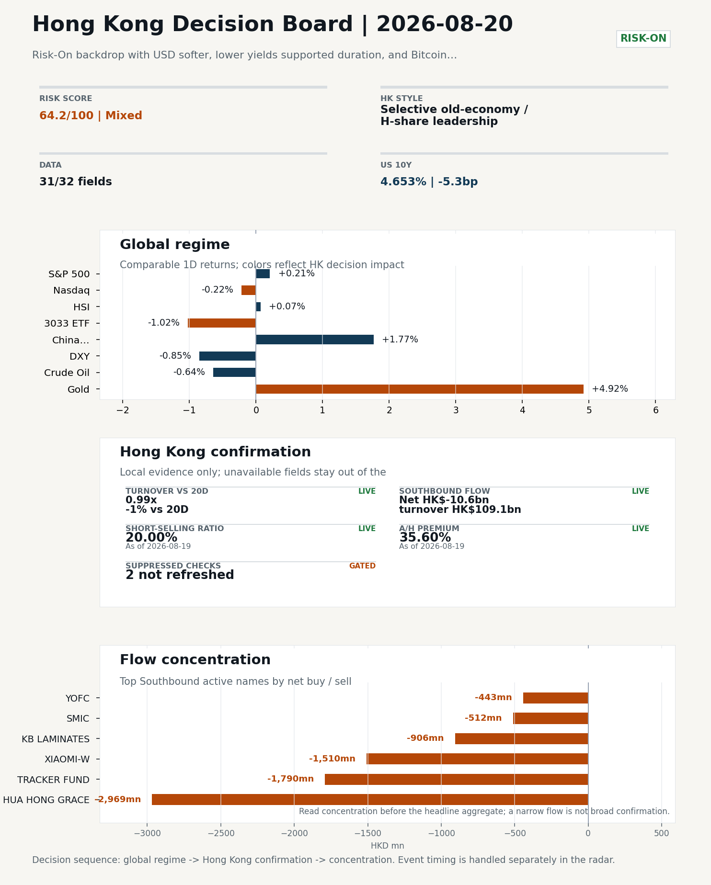
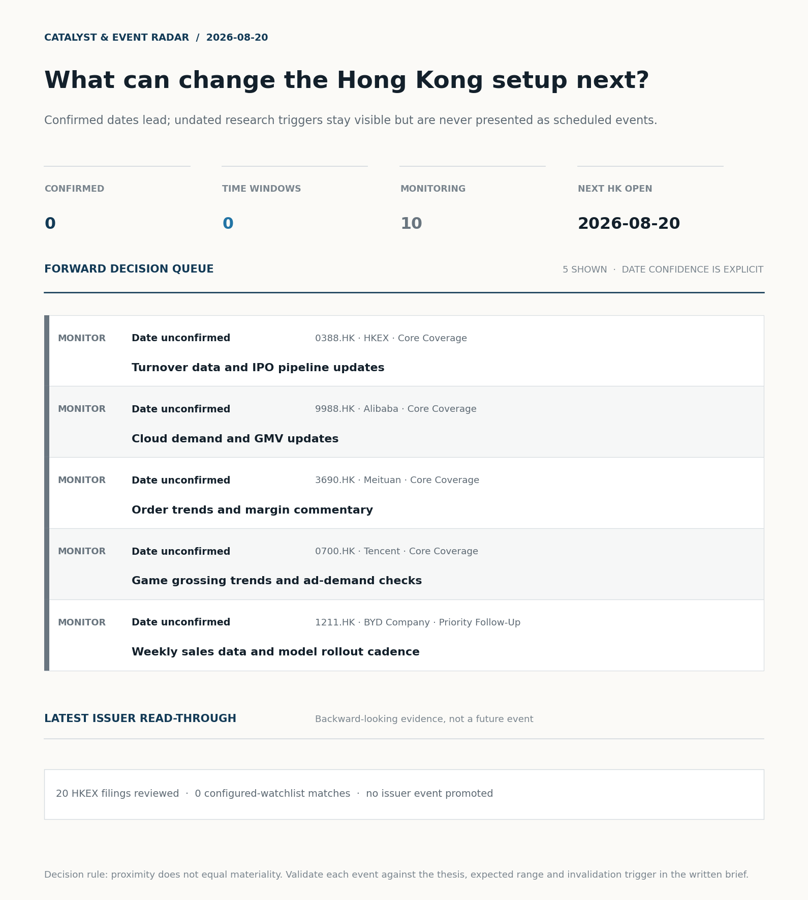
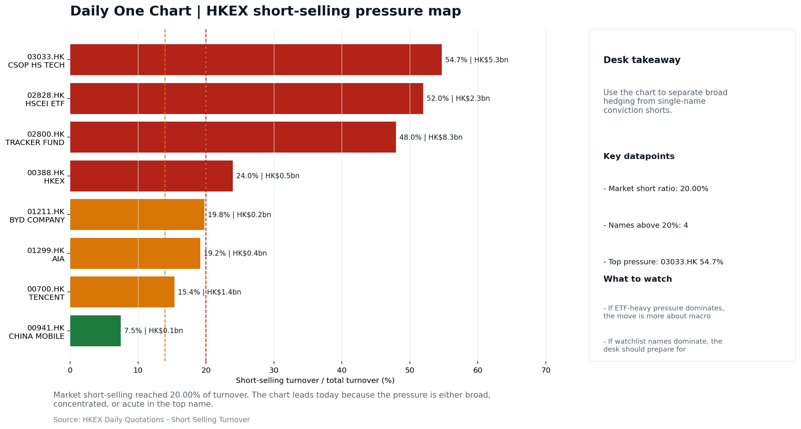
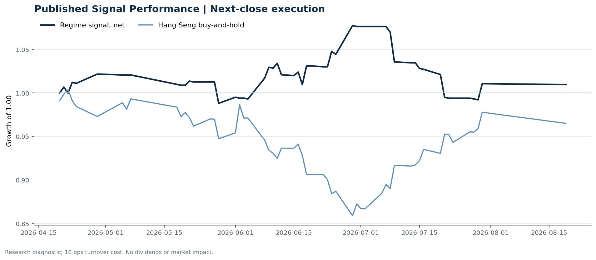

# Morning Research Workbench | 2026-08-20

> **Commute reading route:** `5-minute decision scan` → `25-30 minute deep read` → `10-15 minute optional appendix`
>
> Mode: `Trading Daily` | Keep the report execution-oriented: what mattered in the completed session, what can move Hong Kong leadership, and what needs fast follow-up.

_Data through: global `2026-08-19` | HK/China `2026-08-19` | Market effective `2026-08-19` | Generated `2026-08-20 05:40:20`_

## Executive Summary

- **Market pulse:** Overnight risk-on cross-asset moves (DXY -0.85%, VIX -6.00%, FXI +1.77%) set a constructive but unconfirmed tone for Hong Kong, while local flow remains mixed on 20% short-selling.
- **Hong Kong lens:** Selective old-economy / H-share leadership: HSCEI beat 3033.HK by 1.18pp (+0.16% versus -1.02%). Conviction is limited because short selling was elevated at 20.0%; Southbound recorded -HK$10.6bn net selling. Partial support came from FXI (+1.77%) outperformed HSI (+0.07%). Treat banks, energy, telecoms, and SOE yield as the cleaner relative expression; growth beta still needs proof.
- **What would confirm it:** Confirm if HSCEI keeps outperforming 3033.HK with healthy turnover and broad Southbound participation.
- **What could break it:** Invalidate if 3033.HK retakes leadership while CNH firms and local participation broadens.

## Visual Dashboard

**Catalyst & Event Radar**

**Chart read:** No confirmed event date is populated; 10 undated research trigger(s) remain visible without invented timing.

_Source: Public calendars, issuer disclosures and configured research watchlists_
## Layer 1 | Scan (5 min)

### 1.2 Global Asset Price Dashboard
_Decision-useful subset: each row states the implication and the next test. Descriptive secondary monitors are kept out of the five-minute scan._

| Signal | Last / move | Interpretation | Confirmation / invalidation |
| --- | --- | --- | --- |
| S&P 500 | 7,707.98 / +0.21% | US beta improved, raising the global risk floor for Hong Kong. Falling volatility confirms lower near-term stress. | Confirm with Nasdaq breadth and a same-direction VIX move; invalidate if offshore-China proxies diverge. |
| Nasdaq 100 | 29,426.02 / -0.22% | Growth lagged broad beta, warning that headline risk-on may not transmit cleanly to the 3033.HK ETF proxy. | Confirm through the 3033.HK ETF versus HSI leadership; higher US yields would weaken the read. |
| Hang Seng Index | 25,471.15 / +0.07% | Hong Kong broad beta strengthened, but local flow must confirm whether the move is investable. | Confirm with Southbound participation and breadth; invalidate if USD/CNH weakens while turnover fades. |
| Hang Seng TECH ETF (3033.HK) | 4.6520 / -1.02% | Hong Kong growth lagged, so broad-index strength is not yet a duration signal. | Confirm with stable CNH, Southbound buying and lower yields; invalidate on growth underperformance with rising yields. |
| US 10Y | 4.6530% / -5.3bp | The yield proxy fell, easing the valuation headwind for duration-sensitive equities. | Confirm through Nasdaq and 3033.HK ETF relative performance; invalidate if growth leads despite the opposing rate move. |
| China 10Y | 1.68% / -0.3bp | Lower local yields may reflect easing support or softer demand; the signal is ambiguous without growth confirmation. | Use CSI 300, copper and official credit/activity data to separate growth optimism from demand weakness. |
| DXY | 98.80 / -0.85% | A softer dollar eases an external-liquidity headwind for Hong Kong risk assets. | Confirm with USD/CNH moving in the same risk direction; divergence reduces conviction. |
| USD/CNH | 6.7185 / -0.25% | A stronger offshore renminbi supports the external-risk backdrop for Hong Kong equities. | Confirm with FXI, the 3033.HK ETF proxy and Southbound flow; invalidate if equities move opposite to FX with strong local participation. |
| VIX | 14.89 / **-6.00%** | Lower implied volatility reduces near-term stress, but is supportive only if equity breadth confirms. | Confirm with equity breadth and credit-sensitive assets; invalidate if lower VIX accompanies narrow or falling equities. |

_Secondary monitors retained in the source bundle: CSI 300, CN-US 10Y spread, USD/HKD, Brent crude, COMEX gold, Copper._

### 1.3 Hong Kong Key Data Quick Check
_Coverage gate: 1 unavailable local checks are suppressed here and retained in validation metadata._

| Check | Value | Status | Source / as of | Why it matters |
| --- | --- | --- | --- | --- |
| Main Board turnover vs 20D | 0.99x \| -1% vs 20D | Live local | HKEX \| 2026-08-19 | Trailing 20-session average turnover was HK$256.0bn. |
| Southbound / Northbound net flow | Southbound Net HK$-10.6bn \| turnover HK$109.1bn \| Northbound Turnover HK$328.5bn \| net not reported | Live local | HKEX Connect \| 2026-08-19 | Southbound net buy is calculated from HKEX disclosed buy and sell turnover. |
| Short-selling ratio | 20.00% | Live local | HKEX \| 2026-08-19 | Official HKEX stock-level short-selling table, aggregated as a share of total market turnover. |
| AH premium index | 35.60% | Live public | Yahoo \| 2026-08-19 | Simple average across 18 A/H pairs; use dispersion rather than the average alone. |
| USD/HKD spot vs band | 7.8404 | Live quote | Yahoo \| 2026-08-19 | Inside the linked-exchange band without immediate boundary stress. |
| Hong Kong leadership | Selective old-economy / H-share leadership | Proxy | HSI / HSCEI / 3033.HK ETF relative \| 2026-08-19 | Use HSI / HSCEI / 3033.HK ETF relative moves as the opening style read. |

### 1.4 Decision Board
**Composite risk score:** `64.2/100` | **Regime:** `Mixed`

| Component | Score impact | Evidence |
| --- | --- | --- |
| US beta | +1.3 | S&P 500 +0.21% |
| HK growth ETF proxy | -5.1 | 3033.HK ETF -1.02% |
| Offshore China proxy | +8 | FXI +1.77% |
| Dollar pressure | +8 | DXY -0.85% |

**Morning Checklist**

1. **Bitcoin +7.48%**
 High-frequency data | A strong crypto tape reinforces the risk-on read.
2. **VIX -6.00%**
 High-frequency data | Lower volatility signals easing stress in the tape.
3. **Risk-On backdrop with USD softer, lower yields supported duration, and Bitcoin outperformed Oil**
 Overnight regime | Start by deciding whether the day is about Risk-On conditions or a style pivot.
4. **Gold +4.92%**
 High-frequency data | A firm gold price suggests hedge demand or lower real yields.

## Layer 2 | Deep Read (20-30 min)

### 2.1 Overnight Overseas Market Review
**Market Setup**
**Core tape.** Risk-On backdrop with USD softer, lower yields supported duration, and Bitcoin outperformed Oil

**Hong Kong Read-Through**
**Desk lens.** Selective old-economy / H-share leadership.
**Evidence.** HSCEI beat 3033.HK by 1.18pp (+0.16% versus -1.02%)
**Investment read.** Treat banks, energy, telecoms, and SOE yield as the cleaner relative expression; growth beta still needs proof.
- **Cross-market read:** Hang Seng +0.07% / HSCEI +0.16% / 3033.HK ETF -1.02%.
- **Cross-market read:** Offshore China proxy FXI +1.77% and USD/CNH -0.25% frame cross-border risk appetite.
- **Cross-market read:** USD/HKD last traded around 7.8404, which keeps the Hong Kong funding lens in focus.

**Watch Points**
- USD composite moved lower by -0.86pct intraday, with a 0.876pct range.
- Main turning points appeared around 2026-08-19 08:10 trough / 2026-08-19 08:30 peak / 2026-08-19 08:50 trough, suggesting event-driven repricing.
- The biggest cross-asset divergence was Bitcoin versus Oil, a spread of 8.041pct.
- Gold moved +3.93pct intraday with a 4.39pct high-low range.

**Curated overnight stories**
1. **Fed officials saw need for rate hike if inflation doesn't cool, minutes show**
 Why it matters: Hawkish FOMC minutes raise the bar for a near-term US easing path and reset front-end US yields higher into the next session.
 HK read-through: Pressures HK property, REITs, and high-duration growth names (including China Internet); also tightens USD/HKD conditions at the margin even as the spot dollar softened.
2. **Stocks making the biggest moves premarket: Alibaba, Intel, Sandisk & more**
 Why it matters: Alibaba is a direct proxy for HK-listed China Internet and ADR/dual-list complex; its premarket tape often leads the HK open.
 HK read-through: First-order read for HK tech heavyweights (Tencent, Meituan, JD, Baidu) and the Hang Seng Tech index leadership into the 2026-08-20 cash session.
3. **What Chinese liquor maker Moutai's slump says about the country's economy**
 Why it matters: Moutai weakness is being framed by the sell-side as a read on China consumer demand and high-end spending, a theme that maps directly to HK-listed China consumer names.
 HK read-through: Watch-through to HK-listed consumer, F&B, and duty-free names; reinforces or challenges the China consumption-recovery narrative priced into HK.
4. **Risk-On backdrop with USD softer, lower yields supported duration, and Bitcoin**
 Why it matters: Defines the overnight regime: weaker USD and lower US yields are supportive of HK duration and offshore-China liquidity, even if Fed minutes muddy the policy path.
 HK read-through: Constructive framing for the HK open; supports southbound flows, growth tech, and HK property in the absence of fresh hawkish repricing.
5. **Goldman studied where AI is squeezing labor markets**
 Why it matters: Combined signal on AI capex sustainability and retail positioning around the AI complex; both feed the narrative around mega-cap tech multiples.
 HK read-through: Secondary read for HK AI-exposed names (Tencent, Alibaba, Baidu) and the broader Hang Seng Tech risk premium; not a day-one mover but worth tracking.

### 2.2 Hong Kong / A-share Previous-Day Review
**Style and Local Leadership**
**Style call.** Selective old-economy / H-share leadership.
- **Evidence:** HSCEI beat 3033.HK by 1.18pp (+0.16% versus -1.02%)
- **Portfolio meaning:** Treat banks, energy, telecoms, and SOE yield as the cleaner relative expression; growth beta still needs proof.
- **Cross-market read:** Hang Seng +0.07% / HSCEI +0.16% / 3033.HK ETF -1.02%.
- **Cross-market read:** Offshore China proxy FXI +1.77% and USD/CNH -0.25% frame cross-border risk appetite.
- **Cross-market read:** USD/HKD last traded around 7.8404, which keeps the Hong Kong funding lens in focus.

**Flow Confirmation**
Official Stock Connect evidence is available; use Section 2.3 to confirm whether local money supports the price action.

**Follow-Through Checklist**
**Follow-through check.** Confirm if HSCEI keeps outperforming 3033.HK with healthy turnover and broad Southbound participation.
**Failure condition.** Invalidate if 3033.HK retakes leadership while CNH firms and local participation broadens.

### 2.3 Flow Tracker and Attribution
**Cross-Asset Attribution**

| Driver | Direction | Score | Evidence | HK implication |
| --- | --- | --- | --- | --- |
| Short-selling pressure | drag | 3.5 | HKEX short-selling ratio was 20.00%. | Elevated short activity argues for extra confirmation before chasing rebounds. |
| Dollar / CNH pressure | supportive | 1.27 | DXY -0.85% / USD-CNH -0.25% | A stable or softer CNH makes Hong Kong follow-through more credible. |
| Rates impulse | supportive | 0.79 | US 10Y yield moved -5.3bp. | Lower yields help long-duration growth; higher yields pressure valuation-sensitive |

**Local Flow Tracker**

**Flow Takeaways**
- Short-selling pressure is elevated, so local rebounds need cleaner breadth and flow confirmation.
- Stock Connect Southbound: net HK$-10.6bn on turnover HK$109.1bn (as of 2026-08-19).
- Stock Connect Northbound: turnover RMB328.5bn; public file provides total turnover/top active names, not full net-buy.
- AH premium: simple covered-pair average +35.60%; widest premium: Bank of China 126.95%.

**Stock Connect Southbound Active Names**

| Rank | Ticker | Name | Buy | Sell | Net buy |
| --- | --- | --- | --- | --- | --- |
| 2 | 01347.HK | HUA HONG GRACE | HK$1,806.2mn | HK$4,774.9mn | HK$-2,968.7mn |
| 8 | 02800.HK | TRACKER FUND | HK$129.0mn | HK$1,919.5mn | HK$-1,790.5mn |
| 3 | 01810.HK | XIAOMI-W | HK$1,442.6mn | HK$2,952.2mn | HK$-1,509.6mn |
| 6 | 01888.HK | KB LAMINATES | HK$1,356.5mn | HK$2,262.8mn | HK$-906.2mn |
| 1 | 00981.HK | SMIC | HK$4,376.3mn | HK$4,888.3mn | HK$-512.0mn |

**AH Premium Dispersion**

| Name | A ticker | H ticker | Premium | As of |
| --- | --- | --- | --- | --- |
| Bank of China | 601988.SS | 3988.HK | +126.95% | 2026-08-19 |
| China Communications Construction | 601800.SS | 1800.HK | +86.14% | 2026-08-19 |
| China Life | 601628.SS | 2628.HK | +59.03% | 2026-08-19 |
| China Railway Construction | 601186.SS | 1186.HK | +56.13% | 2026-08-19 |
| CRRC | 601766.SS | 1766.HK | +37.89% | 2026-08-19 |

**HKEX Short-Selling Watch**

| Ticker | Name | Short ratio | Short turnover | Total turnover |
| --- | --- | --- | --- | --- |
| 00388.HK | HKEX | 23.96% | HK$0.5bn | HK$2.0bn |
| 00700.HK | TENCENT | 15.40% | HK$1.4bn | HK$8.8bn |
| 00941.HK | CHINA MOBILE | 7.48% | HK$0.1bn | HK$1.3bn |
| 01211.HK | BYD COMPANY | 19.75% | HK$0.2bn | HK$0.8bn |
| 01299.HK | AIA | 19.18% | HK$0.4bn | HK$1.9bn |

- **Short-value leaders:** 02800.HK TRACKER FUND (HK$8.3bn); 03033.HK CSOP HS TECH (HK$5.3bn); 07709.HK XL2CSOPHYNIX (HK$4.6bn); 02828.HK HSCEI ETF (HK$2.3bn).

### 2.4 Macro and Policy Tracking
**Desk read.** Use the calendar table and released data below as the primary macro read.

The macro calendar was light for this run.

**Positioning and Risk Backdrop**

- Detailed local flow evidence is covered in Section 2.3; keep this section focused on options, hedging, and macro-positioning risk.

### 2.5 Company Catalysts and Risk Monitor

| Grade | Sector | Headline | Why it matters | Horizon |
| --- | --- | --- | --- | --- |
| B | China Internet | Stocks making the biggest moves premarket | Assess whether the story can propagate through the China Internet value | Monitor |

Decision filter<h4>No immediate portfolio catalyst: 20 official filings were screened and the low-signal market set stays aggregated.</h4>
20 profit warnings

<strong>20</strong>Official filings

<strong>0</strong>Watchlist hits

<strong>0</strong>Actionable events

<strong>No event cleared the portfolio decision filter.</strong>

Broad-market filings remain traceable in the source appendix; they are not expanded here without a watchlist, estimate or liquidity read-through.

<strong>Coverage boundary.</strong> Earnings calendar, sell-side rating changes, IPO / grey-market monitor were not decision-grade in this run; their absence is not treated as confirmation that no event exists.

### 2.6 Today's Core Names
**Core coverage**

| Name | Ticker | Last | 1D | Range position | Morning note |
| --- | --- | --- | --- | --- | --- |
| HKEX | 0388.HK | 414.60 | +2.37% | Top of range | Short-term price strength is clear; fresh catalysts could trigger broader group follow-through. |
| Alibaba | 9988.HK | 124.20 | -1.97% | Top of range | The name sits near the top of its recent range, so watch for profit-taking under high expectations. |

**Recent headlines for Alibaba:**
- [Alibaba Earnings Will Test Whether the Stock Is Among China's AI Winners](https://www.barrons.com/articles/alibaba-earnings-stock-price-0f727edc?siteid=yhoof2&yptr=yahoo) (Barrons.com)

**Priority follow-up**

| Name | Ticker | Last | 1D | Range position | Morning note |
| --- | --- | --- | --- | --- | --- |
| BYD Company | 1211.HK | 89.40 | -0.67% | Mid-range | Positioning is neutral for now, so use it mainly to monitor marginal information changes. |
| AIA | 1299.HK | 73.00 | +0.62% | Bottom of range | The name sits near the bottom of its recent range and is worth monitoring for a catalyst-led reversal. |

## Layer 3 | Decision Deepening (10-15 min)

### 3.1 Rotating Theme Deep Dive

| Field | Read |
| --- | --- |
| Theme | China Exports and Supply-Chain Relocation |
| Angle for the day | Track tariffs, trade policy, shipping, and manufacturing orders to see whether export resilience is still the cleaner China macro expression. |

**Theme desk read**
**Core thesis.** The rotating theme on China exports and supply-chain relocation remains the cleaner lens for China macro expression.
**Evidence.** Softer USD (DXY -0.85%) and a sharp drop in VIX (-6.00%) eased risk conditions, while Bitcoin (+7.48%) and Gold (+4.92%) reinforced the move; none of these, however, speak to tariffs, shipping, or manufacturing orders.
**What to test.** Theme validation therefore has to come from related-name positioning and the next data cycle, not from today's tape.

**Signals to keep in mind**
- Bitcoin +7.48%: A strong crypto tape reinforces the risk-on read.
- VIX -6.00%: Lower volatility signals easing stress in the tape.

**LLM watch items:**
- Tariff, trade-policy, shipping-rate, and manufacturing-orders prints needed to validate the China export resilience angle
- BYD (1211.HK) weekly sales data and model rollout cadence as the cleanest HK export-proxy read.
- China Mobile (0941.HK) capex and dividend policy signals for a duration/yield cross-check against the lower-yields backdrop.
- Whether the Bitcoin +7.48% / VIX -6.00% risk-on impulse holds into the 2026-08-20 HK open or fades as a one-session move.
- Alibaba premarket story and whether it propagates through the China Internet value chain; treat as a separate sleeve from the export theme.

**Related names to keep close:**

| Name | Ticker | Bucket | Morning read |
| --- | --- | --- | --- |
| BYD Company | 1211.HK | Priority follow-up | Positioning is neutral for now, so use it mainly to monitor marginal information changes. |
| China Mobile | 0941.HK | Priority follow-up | Positioning is neutral for now, so use it mainly to monitor marginal information changes. |

### 3.2 Today Ahead and Trading Calendar
- The calendar is relatively light, so the market may trade more off positioning and overnight headlines.

**Same-day macro docket**
No same-day macro items were scheduled.

**Same-day catalyst list**
No same-day catalysts were highlighted.

**Next few sessions**
No forward catalyst list was populated.

### 3.3 Daily One Chart
**Daily One Chart | HKEX short-selling pressure map**

**Chart read.** Market short-selling reached 20.00% of turnover.
**Why it matters.** The chart leads today because the pressure is either broad, concentrated, or acute in the top name.

_Source: HKEX Daily Quotations - Short Selling Turnover_

## Optional Appendix | Traceability and Performance (10-15 min)

### Report Metadata
> Date policy: Review date 2026-08-19 is treated as `Trading Daily`. | Global request date is 2026-08-19; adapter effective date is 2026-08-19 and summary date is 2026-08-19. | HK/China local data date is 2026-08-19; role: same-session local cash tape.
> Market data quality: Coverage: `31/32` | Missing: `1`
> Report quality: `80.5/100` | Grade `B` | Status `usable with caveats`

### Key Questions to Keep in Mind
- Is risk appetite rising or fading? The overnight tape reads closer to `Risk-On`.
- Did rates expectations move? Focus on whether US 10Y, DXY, and growth style moved together.
- Were commodities the real story? Watch WTI and gold for geopolitics versus inflation signals.
- Is Hong Kong setup growth-led, SOE-led, or broad beta-led? Compare the 3033.HK ETF proxy, HSCEI, and HSI.
- Did offshore markets move China risk appetite? Focus on HSI, FXI, USD/CNH, and USD/HKD.

### Report Quality and Validation
- **Quality score:** 80.5/100 | **Grade:** B | **Status:** usable with caveats
- **Run summary:** 7 healthy | 1 caveat | 2 failed
- **Release recommendation:** Send with caveats | The report is usable, but the advisory guidance should travel with it so readers understand the data gaps.

| Source | Status | Bucket |
| --- | --- | --- |
| Market data | ok | healthy |
| Sector and company news | ok | healthy |
| Movers and short selling | ok | healthy |
| Stock Connect | ok | healthy |
| A/H premium | ok | healthy |
| Hong Kong local package | ok | healthy |
| China rates | ok | healthy |
| Macro calendar | unavailable | failed |
| Risk and sentiment feed | unavailable | failed |
| Narrative overlay | partial | caveat |

**Desk-use guidance summary:** 0 blocking | 1 advisory

**Desk-use guidance**
- **Advisory:** Use deterministic sections as primary support; the narrative overlay was partial or unavailable on this run.

| Component | Score | Weight | Read |
| --- | --- | --- | --- |
| Market data coverage | 96.9 | 0.2 | 31/32 core market fields available. |
| Hong Kong local metrics | 54.1 | 0.2 | 5 live, 3 proxy, 3 unavailable local checks. |
| Key public adapters | 100.0 | 0.2 | 4/4 key adapters were available or partially available. |
| Narrative overlay health | 33.6 | 0.1 | 1/7 narrative overlay tasks succeeded or used validated cache; 3 error(s). |
| Fact-check guardrail | 100.0 | 0.15 | Checked 24 numeric claims; 0 numeric mismatch(es), 0 logic warning(s); 0 structured claims, 0 source/text warning(s). |
| Source provenance | 92.0 | 0.05 | 42 provenance record(s) validated; 2 unavailable source record(s). |
| Source health and freshness | 73.1 | 0.1 | 8 healthy, 0 degraded, 2 unavailable source group(s). |

**Quality warnings**
- Hong Kong local metrics is weak: 5 live, 3 proxy, 3 unavailable local checks.
- Narrative overlay health is weak: 1/7 narrative overlay tasks succeeded or used validated cache; 3 error(s).

**Narrative fact-check guardrail**
- Checked 24 numeric claims; 0 numeric mismatch(es), 0 logic warning(s); 0 structured claims, 0 source/text warning(s); 0 critical, 0 review.

**Source provenance validation**
- Status: ok | records checked: 42 | unavailable: 2

**Source health and freshness**
- **Source health:** degraded | 8 healthy | 0 degraded | 2 unavailable

| Source | Critical | Status | Score | Fresh coverage | Age range | Policy |
| --- | --- | --- | --- | --- | --- | --- |
| hk_local | Yes | healthy | 98.5 | 1/1 | 1 - 1d | ≤4d / ≥100% |
| macro_calendar | No | unavailable | 0.0 | 0/0 | Unknown | ≤14d / ≥0% |
| market_data | Yes | healthy | 93.0 | 31/31 | 1 - 2d | ≤4d / ≥80% |
| risk_feed | No | unavailable | 0.0 | 0/0 | Unknown | ≤4d / ≥0% |

**Adapter status**

| Adapter | Status |
| --- | --- |
| Stock Connect | ok |
| A/H premium | ok |
| HKEX announcements | ok |
| China rates | ok |

### Historical Signal Performance
- **Readiness:** exploratory with caveats | 65 market observations | 83 active signal dates
- **Execution rule:** use only the next available close after publication; 10 bps turnover cost by default. Current-day signals never receive same-day returns.
- **Interpretation boundary:** results are exploratory until a benchmark reaches 252 sessions and 100 active-signal sessions.

| Benchmark | Sessions | Signal net | Buy & hold | Excess | Max drawdown | Hit rate |
| --- | --- | --- | --- | --- | --- | --- |
| Hang Seng Index | 56 | 1.0% | -3.5% | 4.5% | -7.9% | 48.1% |
| Hang Seng TECH ETF (3033.HK) | 55 | -2.1% | -6.8% | 4.7% | -13.3% | 48.1% |

**Hang Seng event-horizon diagnostics**

| Horizon | Resolved | Hit rate | Average net return |
| --- | --- | --- | --- |
| 1 sessions | 33 | 51.5% | 0.1% |
| 5 sessions | 30 | 56.7% | -0.0% |
| 20 sessions | 24 | 41.7% | -1.1% |

- **Data-quality caveat:** 17 conflicting historical price revision(s) and 6 weekend pseudo-session observation(s) were handled explicitly; inspect the ledger before relying on the result.
- **Use boundary:** this is a close-to-close research diagnostic, not an executable strategy or investment recommendation; dividends, financing, borrow and market impact are excluded.

### Source Links
- [Stocks making the biggest moves premarket: Alibaba, Intel, Sandisk & more](https://www.cnbc.com/2026/08/17/stocks-making-the-biggest-moves-premarket-baba-intc-sndk.html) (cnbc_markets)
- [Alibaba Earnings Will Test Whether the Stock Is Among China's AI Winners](https://www.barrons.com/articles/alibaba-earnings-stock-price-0f727edc?siteid=yhoof2&yptr=yahoo) (Barrons.com)
- [00031.HK Profit warning / alert announcement](http://www1.hkexnews.hk/listedco/listconews/sehk/2026/0819/2026081900550.pdf) (HKEXnews)
- [00082.HK Profit warning / alert announcement](http://www1.hkexnews.hk/listedco/listconews/sehk/2026/0819/2026081901327.pdf) (HKEXnews)
- [00305.HK Profit warning / alert announcement](http://www1.hkexnews.hk/listedco/listconews/sehk/2026/0819/2026081900630.pdf) (HKEXnews)
- [00330.HK Profit warning / alert announcement](http://www1.hkexnews.hk/listedco/listconews/sehk/2026/0819/2026081901227.pdf) (HKEXnews)
- [00385.HK Profit warning / alert announcement](http://www1.hkexnews.hk/listedco/listconews/sehk/2026/0819/2026081901439.pdf) (HKEXnews)
- [00601.HK Profit warning / alert announcement](http://www1.hkexnews.hk/listedco/listconews/sehk/2026/0819/2026081901451.pdf) (HKEXnews)
- [00720.HK Profit warning / alert announcement](http://www1.hkexnews.hk/listedco/listconews/sehk/2026/0819/2026081901491.pdf) (HKEXnews)
- [00828.HK Profit warning / alert announcement](http://www1.hkexnews.hk/listedco/listconews/sehk/2026/0819/2026081901403.pdf) (HKEXnews)

## Supplementary Visual Appendix

This appendix is professional-path only. It keeps a traceable index of the report visuals and the deterministic chart cues used to frame the morning note, without injecting the legacy intraday chart pack.

### Visual Index

| Visual | Path | Role |
| --- | --- | --- |
| Visual Dashboard | `charts/dashboard_2026-08-20.png` | Cross-asset regime board and Hong Kong local tape snapshot. |
| Catalyst & Event Radar | `charts/catalyst_radar_2026-08-20.png` | Confirmed dates, time windows, undated monitors, and recent issuer read-through. |
| Daily One Chart | `charts/daily_one_chart_2026-08-20.png` | Single highest-conviction visual story for the day. |

### Deterministic Chart Cues
- FX / liquidity: USD composite moved lower by -0.86pct intraday, with a 0.876pct range.
- FX / liquidity: Main turning points appeared around 2026-08-19 08:10 trough / 2026-08-19 08:30 peak / 2026-08-19 08:50 trough, suggesting event-driven repricing rather than a clean one-way USD move.
- Cross-asset: The biggest cross-asset divergence was Bitcoin versus Oil, a spread of 8.041pct.
- Cross-asset: Gold moved +3.93pct intraday with a 4.39pct high-low range.
- Cross-asset: Oil moved -0.40pct intraday with a 2.549pct high-low range.
- Cross-asset: Bitcoin moved +7.64pct intraday with a 8.744pct high-low range.

### Risk Dashboard Components

| Component | Score impact | Evidence |
| --- | --- | --- |
| US beta | +1.3 | S&P 500 +0.21% |
| HK growth ETF proxy | -5.1 | 3033.HK ETF -1.02% |
| Offshore China proxy | +8 | FXI +1.77% |
| Dollar pressure | +8 | DXY -0.85% |
| Volatility | +10 | VIX -6.00% |
| HK short-selling | -8 | Short-selling ratio 20.00% |
