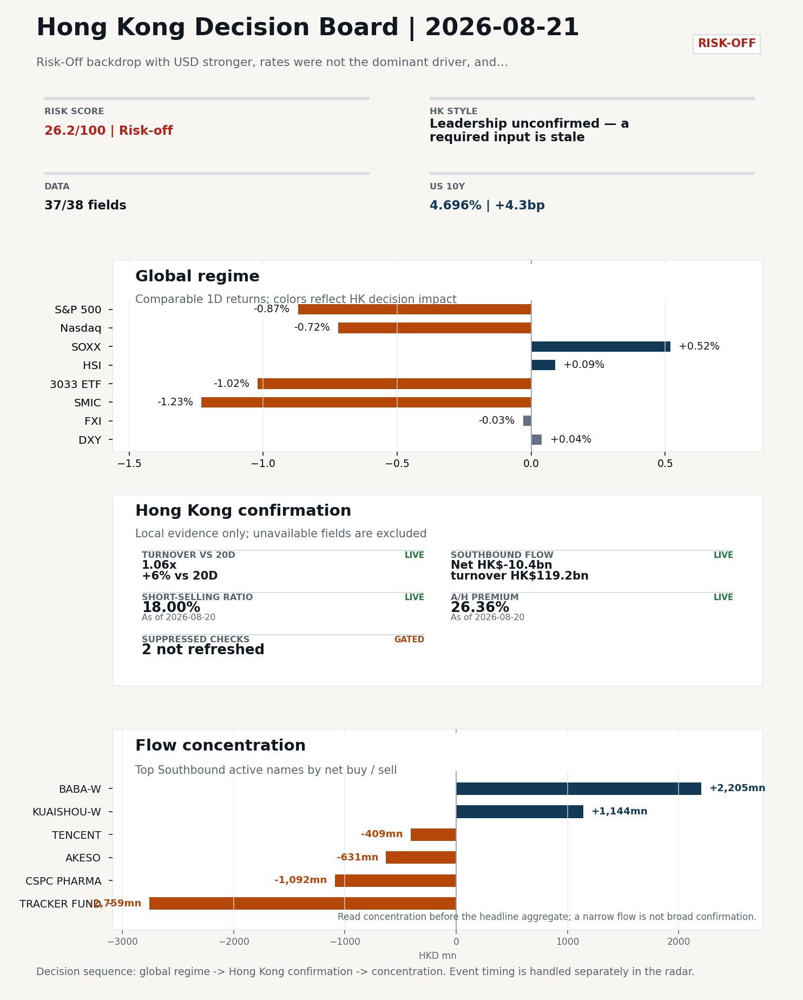
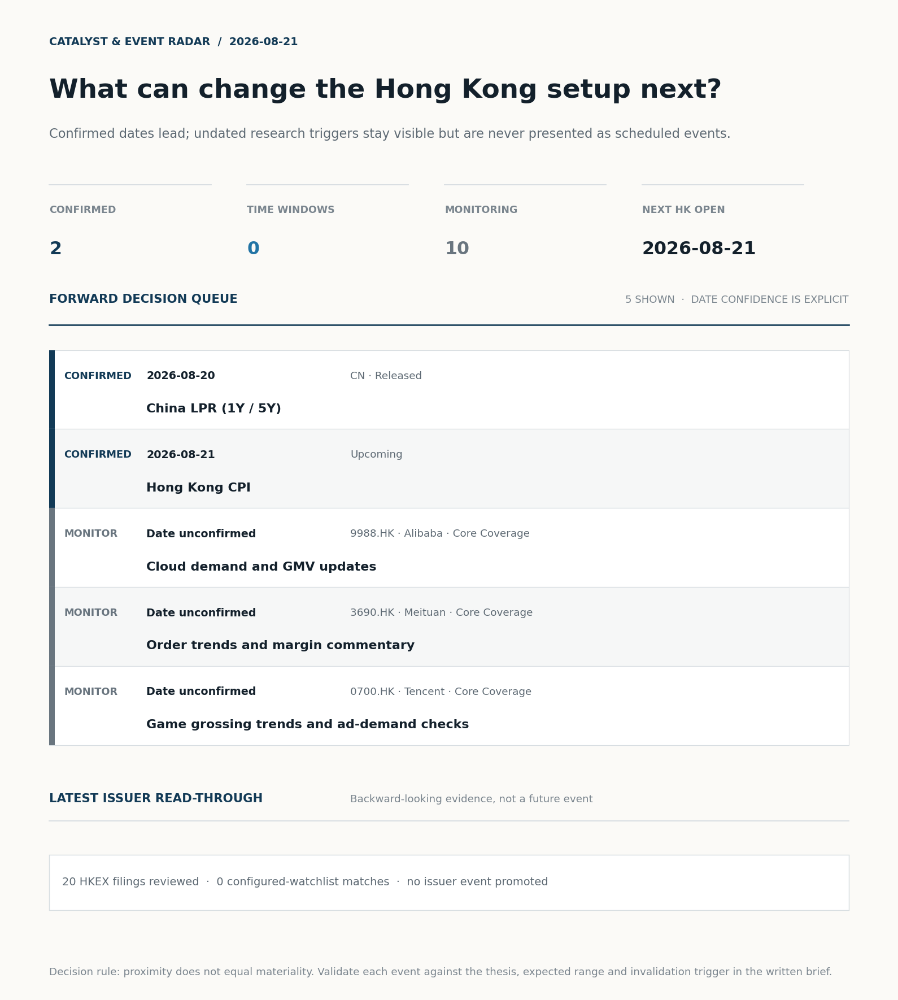
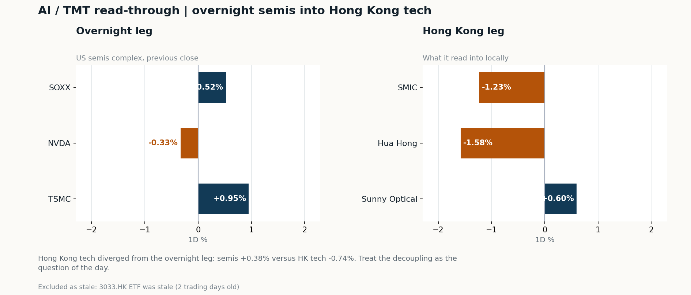
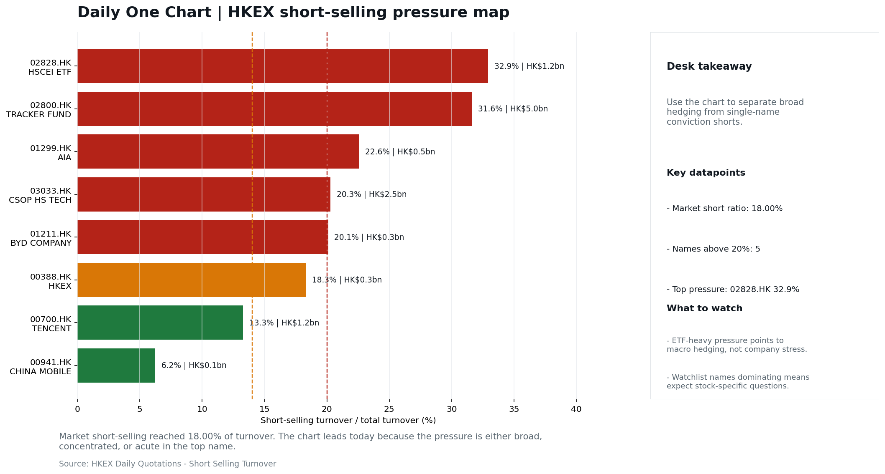

# Morning Research Workbench | 2026-08-21

> **Commute reading route:** `Layer 1 scan (5 min)` → `Layer 2 deep read` → `Layer 3 and appendix if time allows`
>
> Mode: `Trading Daily` | Keep the report execution-oriented: what mattered in the completed session, what can move Hong Kong leadership, and what needs fast follow-up.

_Data through: global `2026-08-20` | HK/China `2026-08-20` | Market effective `2026-08-20` | Generated `2026-08-21 05:43:50`_

## Executive Summary

- **Did yesterday's call work?** **UNRESOLVED** - Hang Seng Index moved +0.09%, inside the 0.25% noise band, so the call is neither confirmed nor broken.
- **What changed overnight?** Semis led higher: SOXX +0.52%, NVDA -0.33%, TSMC +0.95%.
- **What it means for AI/TMT** Style call withheld: 3033.HK ETF was stale (2 trading days old). The stale input is excluded from the risk score.
- **What to watch today** Hong Kong CPI (2026-08-21). Watch whether SMIC and Hua Hong trade with HSCEI rather than with the overnight semis leg.

## Visual Dashboard

**Catalyst & Event Radar**

**Chart read:** 2 dated event(s) lead the queue; 10 undated trigger(s) remain explicitly in monitoring.

_Source: Public calendars, issuer disclosures and configured research watchlists_
## Layer 1 | Scan (5 min)

### 1.1 Yesterday's Call
**Verdict: UNRESOLVED.** Hang Seng Index moved +0.09%, inside the 0.25% noise band, so the call is neither confirmed nor broken.

| Benchmark | From | To | Realised move |
| --- | --- | --- | --- |
| Hang Seng Index | 2026-08-19 | 2026-08-20 | +0.09% |
| Hang Seng TECH ETF (3033.HK) | 2026-08-19 | 2026-08-20 | +0.00% |

**Recent record.** 6 confirmed / 4 broken over the last 10 scoreable calls (60.0% hit rate). This is a directional close-to-close diagnostic, not a track record.

### 1.2 Global Asset Price Dashboard
_Decision-useful subset: each row states the implication and the next test. Descriptive secondary monitors are kept out of the five-minute scan._

| Signal | Last / move | Interpretation | Confirmation / invalidation |
| --- | --- | --- | --- |
| S&P 500 | 7,641.16 / -0.87% | US beta weakened, reducing the external risk cushion for Hong Kong. | Confirm with Nasdaq breadth and a same-direction VIX move; invalidate if offshore-China proxies diverge. |
| Nasdaq 100 | 29,213.16 / -0.72% | Growth outperformed broad beta, a supportive style signal for Hong Kong internet and platform names. | Confirm through the 3033.HK ETF versus HSI leadership; higher US yields would weaken the read. |
| Hang Seng Index | 25,495.07 / +0.09% | Hong Kong broad beta strengthened, but local flow must confirm whether the move is investable. | Confirm with Southbound participation and breadth; invalidate if USD/CNH weakens while turnover fades. |
| Hang Seng TECH ETF (3033.HK) | 4.6520 / -1.02% | Hong Kong growth lagged, so broad-index strength is not yet a duration signal. | Confirm with stable CNH, Southbound buying and lower yields; invalidate on growth underperformance with rising yields. |
| US 10Y | 4.6960% / +4.3bp | The yield proxy rose, tightening the discount-rate backdrop for long-duration Hong Kong growth. | Confirm through Nasdaq and 3033.HK ETF relative performance; invalidate if growth leads despite the opposing rate move. |
| China 10Y | 1.68% / +0.0bp | Local yields were stable and provide little incremental macro signal. | Use CSI 300, copper and official credit/activity data to separate growth optimism from demand weakness. |
| DXY | 98.87 / +0.04% | The dollar was range-bound and adds little directional information. | Confirm with USD/CNH moving in the same risk direction; divergence reduces conviction. |
| USD/CNH | 6.7150 / -0.06% | A stronger offshore renminbi supports the external-risk backdrop for Hong Kong equities. | Confirm with FXI, the 3033.HK ETF proxy and Southbound flow; invalidate if equities move opposite to FX with strong local participation. |
| VIX | 16.01 / **+7.52%** | Higher implied volatility raises the tail-risk premium and weakens risk-on conviction. | Confirm with equity breadth and credit-sensitive assets; invalidate if lower VIX accompanies narrow or falling equities. |

_Secondary monitors retained in the source bundle: CSI 300, CN-US 10Y spread, USD/HKD, Brent crude, COMEX gold, Copper._

### 1.3 Hong Kong Key Data Quick Check
_Coverage gate: 1 unavailable local checks are suppressed here and retained in validation metadata._

| Check | Value | Status | Source / as of | Why it matters |
| --- | --- | --- | --- | --- |
| Main Board turnover vs 20D | 1.06x \| +6% vs 20D | Live local | HKEX \| 2026-08-20 | Trailing 20-session average turnover was HK$253.1bn. |
| Southbound / Northbound net flow | Southbound Net HK$-10.4bn \| turnover HK$119.2bn \| Northbound Turnover HK$286.2bn \| net not reported | Live local | HKEX Connect \| 2026-08-20 | Southbound net buy is calculated from HKEX disclosed buy and sell turnover. |
| Short-selling ratio | 18.00% | Live local | HKEX \| 2026-08-20 | Official HKEX stock-level short-selling table, aggregated as a share of total market turnover. |
| AH premium index | 26.36% | Live public | Yahoo \| 2026-08-20 | Fixed 10-name basket, equal-weighted, both legs priced on the same date; comparable across dates. Covered-pair average was +32.52% across 18 pairs. |
| USD/HKD spot vs band | 7.8428 | Live quote | Yahoo \| 2026-08-20 | 72 pips from the weak-side CU (7.8500); monitor HKMA operations and the aggregate balance for a funding squeeze. |
| Hong Kong leadership | Leadership unconfirmed - a required input is stale | Proxy | HSI / HSCEI / 3033.HK ETF relative \| 2026-08-20 | Use HSI / HSCEI / 3033.HK ETF relative moves as the opening style read. |

### 1.4 Decision Board
**Composite risk score:** `26.2/100` | **Regime:** `Risk-off`

| Component | Score impact | Evidence |
| --- | --- | --- |
| US beta | -5.2 | S&P 500 -0.87% |
| Offshore China proxy | -0.1 | FXI -0.03% |
| Dollar pressure | -0.4 | DXY +0.04% |
| Volatility | -10 | VIX +7.52% |

**Morning Checklist**

1. **Risk-Off backdrop with USD stronger, rates were not the dominant driver, and Bitcoin outperformed Gold**
 Overnight regime | Start by deciding whether the day is about Risk-Off conditions or a style pivot.
2. **China LPR (1Y / 5Y) (Released)**
 Macro / policy | Watch whether it changes the day's core market narrative | Industries: Market-wide
3. **VIX +7.52%**
 High-frequency data | Higher volatility argues for tighter sizing and tighter stops. (second-order macro context)
4. **Hong Kong CPI (Upcoming)**
 Macro / policy | Rates expectations, the dollar, and growth-equity valuation | Industries: Technology, Internet, Brokers

## Layer 2 | Deep Read (20-30 min)

### 2.1 Overnight Overseas Market Review
**Market Setup**
**Core tape.** Overnight US equities closed lower (S&P 500 -0.87%, Nasdaq 100 -0.72%) within a Risk-Off tape where rates were not the dominant driver, the USD strengthened (+0.19%), and VIX rose 7.52%.
**Main driver.** The Fed minutes re-introduced a hawkish tail, but the cross-asset signal - Bitcoin +4.67% versus Gold +0.48% - argues the move was more about USD/real-yields than classic safe-haven demand.
**HK relevance.** For Hong Kong, the overseas set is a drag.

**Key Drivers**
- Fed minutes reintroduced a hawkish tail on US rates, pushing VIX +7.52% and weighing on US equity multiples despite no clean yield surge.
- USD composite +0.19% intraday (range 0.279%) compounded valuation pressure on risk assets and put USD/HKD at 7.8428, 72 pips from the weak-side CU.
- Oil +2.02% intraday (3.87% range) created a split tape.
- US semis tape was divergent (TSMC +0.95%, SOXX +0.52%, NVDA -0.33%), so it does not confirm a clean AI cycle tailwind for HK tech today.

**Hong Kong Read-Through**
**Opening implication.** Defensive bias with tighter sizing; wait for a refreshed 3033.HK, HSI/HSCEI relative move, and the LPR fix before committing to a style call. Watch Alibaba premarket for China Internet direction and monitor USD/HKD proximity to the 7.8500 weak-side CU for HKMA liquidity signals.
_Hong Kong style leadership, cross-market levels and flow confirmation are set out in Section 2.2._

**Watch Points**
- USD composite moved higher by +0.19pct intraday, with a 0.279pct range.
- Main turning points appeared around 2026-08-20 08:05 peak / 2026-08-20 08:25 peak / 2026-08-20 08:50 peak, suggesting event-driven repricing rather than a clean one-way USD move.
- The biggest cross-asset divergence was Bitcoin versus Gold, a spread of 4.19pct.
- Gold moved +0.48pct intraday with a 1.917pct high-low range.

**Curated overnight stories**
1. **China LPR (1Y / 5Y) released**
 Why it matters: Highest-priority must-watch macro item (score 95).
 HK read-through: Direct read-through to HK banks, mainland property developers listed in HK, insurers, and any China-revenue balance sheets sensitive to onshore rates.
2. **China is defying the global bond yield surge, boosting its diversification appeal**
 Why it matters: Frames China rates as a relative-value anchor versus a rising global yield complex. Relevant to cross-asset allocators who compare CNY/HKD duration to USTs.
 HK read-through: Supports a constructive bias on China duration proxies tradable from HK (e.g., H-share banks, China SOBM-listed names) and feeds the offshore RMB narrative.
3. **Fed officials saw need for rate hike if inflation doesn't cool, minutes show**
 Why it matters: Re-introduces a hawkish tail into US rates expectations.
 HK read-through: Headwind for HK growth/tech multiples and for HKD/USD-sensitive names. Stronger USD + Risk-Off regime noted in the daily theme compounds the drag.
4. **Stocks making the biggest moves premarket: Walmart, Coinbase, Moderna, Alibaba & more**
 Why it matters: China Internet tape signal (Alibaba is an HK-listed heavyweight and ADR). Graded B with explicit mapping to China Internet leaders and close peers.
 HK read-through: Direct read on the HK-listed China Internet cohort for 08-21 open, especially names with high beta to BABA ADR.
5. **VIX +7.52% within a Risk-Off backdrop; USD stronger, Bitcoin outperformed Gold**
 Why it matters: Regime signal: volatility is up and USD bid, which historically pressures HK equities and EM risk assets.
 HK read-through: Argues for tighter sizing on the HK open, defensive bias in selection, and watch on USD/HKD proximity to the convertibility band.

### 2.2 Hong Kong / A-share Previous-Day Review
**Local Tape Setup**
**Local read.** The local tape shows only mild index movement: HSI +0.09% and HSCEI +0.21%, while the Hang Seng TECH ETF proxy is stale by two sessions, so growth leadership cannot be verified.
**Verification point.** Attribution_v1 flags short-selling pressure at 18.00% of turnover as the dominant local drag, and Stock Connect Southbound posted a net -HK$10.4bn outflow.
**Risk to watch.** The overnight setup is risk-off with US equity beta lower, so the open should be judged on whether HSCEI/SOE stability holds or internet/tech gets fresh confirmation.

**Style and Local Leadership**
**Style call.** Leadership unconfirmed - a required input is stale.
- **Evidence:** No same-date 3033.HK-versus-HSCEI comparison was possible because 3033.HK ETF was stale (2 trading days old)
- **Portfolio meaning:** Do not infer Hong Kong style from the headline index alone; wait for relative price and local-flow evidence.
- **Cross-market read:** Hang Seng +0.09% / HSCEI +0.21% / 3033.HK ETF stale 2d.
- **Cross-market read:** Offshore China proxy FXI -0.03% and USD/CNH -0.06% frame cross-border risk appetite.
- **Cross-market read:** USD/HKD last traded around 7.8428, which keeps the Hong Kong funding lens in focus.

**Flow Confirmation**
Official Stock Connect evidence is available; use Section 2.3 to confirm whether local money supports the price action.

**Follow-Through Checklist**
**Follow-through check.** Confirmation test: watch whether a refreshed 3033.HK outperforms 2828.HK/HSCEI and whether Southbound net flow improves from -HK$10.4bn or the short-selling ratio drops below 18.00%. Northbound net-buy is not reported, so A-share flow confirmation remains incomplete.
**Failure condition.** Any style claim remains invalid while the required relative-performance fields are missing or stale.

### 2.3 AI / TMT Read-Through

**Overnight leg.** The overnight semis leg was flat (+0.38% average), so it does not set the direction for Hong Kong tech today.
**Hong Kong expression.** Let local flow and style leadership drive the tech read rather than the overnight tape.
**Observable test.** Watch whether SMIC and Hua Hong trade with HSCEI rather than with the overnight semis leg.

| Name | Role in the chain | 1D | Leg |
| --- | --- | --- | --- |
| SOXX | Semis complex | +0.52% | overnight |
| NVDA | AI capex narrative | -0.33% | overnight |
| TSMC | Foundry demand | +0.95% | overnight |
| SMIC | Leading-edge / domestic substitution | -1.23% | Hong Kong |
| Hua Hong | Mature-node pricing cycle | -1.58% | Hong Kong |
| Sunny Optical | Hardware and optics supply chain | +0.60% | Hong Kong |
| 3033.HK ETF | Broad HK tech beta | stale 2d | Hong Kong |

**Read with care.** Hong Kong tech diverged from the overnight leg: semis +0.38% versus HK tech -0.74%. Treat the decoupling as the question of the day.
**Coverage caveat.** 3033.HK ETF was stale (2 trading days old). Those names are excluded from the averages above.

### 2.4 Flow Tracker and Attribution
**Cross-Asset Attribution**

| Driver | Direction | Score | Evidence | HK implication |
| --- | --- | --- | --- | --- |
| Short-selling pressure | drag | 2.1 | HKEX short-selling ratio was 18.00%. | Elevated short activity argues for extra confirmation before chasing rebounds. |
| Oil and geopolitics | mixed | 1.34 | Oil moved +1.67%. | Split the read between energy/cyclicals support and margin/geopolitical pressure. |
| Global equity beta | drag | 0.87 | S&P 500 moved -0.87%. | Broad beta matters if Hong Kong breadth confirms the overseas signal. |

**Local Flow Tracker**

**Flow Takeaways**
- Short-selling pressure is elevated, so local rebounds need cleaner breadth and flow confirmation.
- Stock Connect Southbound: net HK$-10.4bn on turnover HK$119.2bn (as of 2026-08-20).
- Stock Connect Northbound: turnover RMB286.2bn; public file provides total turnover/top active names, not full net-buy.
- AH premium: fixed 10-name basket +26.36% (comparable across dates); covered-pair average +32.52% over 18 pairs; widest premium: China Communications Construction 89.0%.

**Stock Connect Southbound Active Names**

| # | Ticker | Name | Buy | Sell | Net buy | HKEX turnover rank |
| --- | --- | --- | --- | --- | --- | --- |
| 1 | 02800.HK | TRACKER FUND | HK$1.6mn | HK$2,760.2mn | HK$-2,758.7mn | 2 |
| 2 | 09988.HK | BABA-W | HK$4,212.4mn | HK$2,007.2mn | HK$2,205.2mn | 1 |
| 3 | 01024.HK | KUAISHOU-W | HK$2,575.5mn | HK$1,431.6mn | HK$1,143.9mn | 3 |
| 4 | 01093.HK | CSPC PHARMA | HK$252.6mn | HK$1,344.3mn | HK$-1,091.6mn | 3 |
| 5 | 09926.HK | AKESO | HK$120.2mn | HK$750.8mn | HK$-630.5mn | 10 |

**AH Premium Dispersion**

| Name | A ticker | H ticker | Premium | As of |
| --- | --- | --- | --- | --- |
| China Communications Construction | 601800.SS | 1800.HK | +89.00% | 2026-08-20 |
| China Life | 601628.SS | 2628.HK | +60.95% | 2026-08-20 |
| China Railway Construction | 601186.SS | 1186.HK | +57.48% | 2026-08-20 |
| China Railway | 601390.SS | 0390.HK | +52.98% | 2026-08-20 |
| Sinopec | 600028.SS | 0386.HK | +37.02% | 2026-08-20 |

**HKEX Short-Selling Watch**

| Ticker | Name | Short ratio | Short turnover | Total turnover |
| --- | --- | --- | --- | --- |
| 00388.HK | HKEX | 18.30% | HK$0.3bn | HK$1.9bn |
| 00700.HK | TENCENT | 13.29% | HK$1.2bn | HK$8.9bn |
| 00941.HK | CHINA MOBILE | 6.25% | HK$0.1bn | HK$1.2bn |
| 01211.HK | BYD COMPANY | 20.10% | HK$0.3bn | HK$1.4bn |
| 01299.HK | AIA | 22.58% | HK$0.5bn | HK$2.0bn |

- **Short-value leaders:** 02800.HK TRACKER FUND (HK$5.0bn); 07709.HK XL2CSOPHYNIX (HK$3.7bn); 03033.HK CSOP HS TECH (HK$2.5bn); 09988.HK BABA-W (HK$2.5bn).

### 2.5 Macro and Policy Tracking
**Desk read.** The macro agenda is light but frames today's HK tape around China policy and local funding conditions.

**Market sensitivity.** China's 1Y/5Y LPR was released and came in broadly inline, so by itself it does not force a new easing repricing; the focus is on second-order market reaction.

**HK implication.** Hong Kong CPI is due next, and under the peg its direct equity impact is limited, but it can still affect rates expectations and rate-sensitive leadership.

**Macro watchpoints**
- Whether the broadly inline China LPR produces any second-order shift in HK/China risk appetite or remains a neutral policy backdrop.
- US yields and DXY after the release, given the risk-off, stronger-USD session; further dollar strength would pressure HK risk appetite.
- Hong Kong CPI on 2026-08-21 and any repricing of rate-sensitive sectors: technology, internet, brokers.
- VIX +7.52% against mildly positive TSMC (+0.95%) and SOXX (+0.52%): whether HK tech holds its opening tone or trades tighter on volatility.

| Time | Region | Event | Status | Desk read |
| --- | --- | --- | --- | --- |
| | CN | China LPR (1Y / 5Y) | Released | Impact: Watch whether it changes the day's core market narrative \| Attention: 5/5 \| Industries: Market-wide |
| | HK | Hong Kong CPI | Upcoming | Impact: Rates expectations, the dollar, and growth-equity valuation \| Attention: 1/5 \| Industries: Technology, Internet, Brokers |

**Positioning and Risk Backdrop**

- Detailed local flow evidence is covered in Section 2.3; keep this section focused on options, hedging, and macro-positioning risk.

### 2.6 Company Catalysts and Risk Monitor

| Grade | Sector | Headline | Why it matters | Horizon |
| --- | --- | --- | --- | --- |
| B | China Internet | Stocks making the biggest moves premarket | Assess whether the story can propagate through the China Internet value | Monitor |
| B | China Internet | Stocks making the biggest moves premarket | Assess whether the story can propagate through the China Internet value | Monitor |

Decision filter<h4>No immediate portfolio catalyst: 20 official filings were screened and the low-signal market set stays aggregated.</h4>
20 profit warnings

<strong>20</strong>Official filings

<strong>0</strong>Watchlist hits

<strong>0</strong>Actionable events

<strong>No event cleared the portfolio decision filter.</strong>

Broad-market filings remain traceable in the source appendix; they are not expanded here without a watchlist, estimate or liquidity read-through.

<strong>Coverage boundary.</strong> Earnings calendar, sell-side rating changes, IPO / grey-market monitor were not decision-grade in this run; their absence is not treated as confirmation that no event exists.

### 2.7 Questions to Expect This Morning
**Q1. Why is there no style call today?**
- **Evidence:** 3033.HK ETF was stale (2 trading days old).
- **How to answer:** A required input was stale, so any relative-performance claim would have compared two different dates. The call is withheld rather than published on partial evidence, and the stale input is excluded from the risk score.

**Q2. Did the overnight semis move explain Hong Kong tech?**
- **Evidence:** Hong Kong tech diverged from the overnight leg: semis +0.38% versus HK tech -0.74%. Treat the decoupling as the question of the day.
- **How to answer:** Not on its own. Same direction is not the same as explained, so check single-name news, placements and index events before attributing the move to the global cycle.

### 2.8 Today's Core Names
**Core coverage**

| Name | Ticker | Last | 1D | Range position | Morning note |
| --- | --- | --- | --- | --- | --- |
| Alibaba | 9988.HK | 126.20 | +1.61% | Top of range | Marginally higher (+1.61%), in the top quartile of its 60-session range (89%). |
| Meituan | 3690.HK | 85.85 | -1.38% | Mid-range | Marginally lower (-1.38%), mid-range at 73% of its 60-session band. |

**Recent headlines for Alibaba:**
- [3 things investors need to know for Thursday, August 20](https://finance.yahoo.com/video/3-things-investors-know-thursday-120000672.html) (Yahoo Finance Video)

**Priority follow-up**

| Name | Ticker | Last | 1D | Range position | Morning note |
| --- | --- | --- | --- | --- | --- |
| BYD Company | 1211.HK | 91.80 | +2.68% | Top of range | Up 2.68% on the session, in the top quartile of its 60-session range (81%). |
| China Mobile | 0941.HK | 82.40 | +0.37% | Mid-range | Marginally higher (+0.37%), mid-range at 72% of its 60-session band. |

**Recent headlines for BYD Company:**
- [Is BYD (SEHK:1211) Fully Priced After Its EV Export Lead?](https://finance.yahoo.com/markets/stocks/articles/byd-sehk-1211-fully-priced-091152063.html) (Simply Wall St.)

## Layer 3 | Decision Deepening (10-15 min)

### 3.1 Rotating Theme Deep Dive

| Field | Read |
| --- | --- |
| Theme | Hong Kong Market Structure and Flows |
| Angle for the day | Focus on turnover, Stock Connect, ETF flows, HKEX activity, and style leadership to understand whether Hong Kong is being driven by fundamentals or positioning. |

**Theme desk read**
**Core thesis.** The Hong Kong market-structure theme still works best as a flow and positioning check rather than a direction call today.
**Evidence.** The overnight tape is risk-off with a stronger USD and VIX up 7.52%.
**What to test.** China LPR was released and described as broadly inline, so it does not appear to add a fresh easing impulse.

**Signals to keep in mind**
- VIX +7.52%: Higher volatility argues for tighter sizing and tighter stops.
- TSMC +0.95%: Keep tracking it to confirm whether the core daily narrative is holding.

**LLM watch items:**
- Verify HKEX turnover, IPO pipeline updates, and southbound flow direction after the top-of-range close.
- Monitor Hong Kong CPI on 2026-08-21 for rates/dollar implications for HK tech, internet, and brokers.
- Watch BYD weekly sales/model rollout and whether the +2.68% top-quartile move attracts profit-taking.
- Track VIX follow-through and TSMC/SOXX/NVDA to confirm whether the risk-off tape holds into HK leadership.

**Related names to keep close:**

| Name | Ticker | Bucket | Morning read |
| --- | --- | --- | --- |
| HKEX | 0388.HK | Core coverage | Marginally higher (+0.77%), in the top quartile of its 60-session range (100%). |
| BYD Company | 1211.HK | Priority follow-up | Up 2.68% on the session, in the top quartile of its 60-session range (81%). |

**Upcoming catalysts tied to the theme:**
- 2026-08-21 | Hong Kong CPI | Rates expectations, the dollar, and growth-equity valuation

### 3.2 Today Ahead and Trading Calendar
- Macro: Hong Kong CPI is the first item to anchor the open and the rates/FX response.
- Corporate / event: Hong Kong CPI is the cleanest same-day catalyst to prepare for.

**Same-day macro docket**

| Time | Country | Event | Status | Detail |
| --- | --- | --- | --- | --- |
| | HK | Hong Kong CPI | Upcoming | Hong Kong funding conditions \| Local inflation has limited |

**Same-day catalyst list**

| Date | Time | Category | Event | Importance |
| --- | --- | --- | --- | --- |
| 2026-08-21 | | Upcoming | Hong Kong CPI | 1 |

**Next few sessions**

| Date | Category | Event | Impact |
| --- | --- | --- | --- |
| 2026-08-21 | Upcoming | Hong Kong CPI | Rates expectations, the dollar, and growth-equity valuation |

### 3.3 Daily One Chart
**Daily One Chart | HKEX short-selling pressure map**

**Chart read.** Market short-selling reached 18.00% of turnover.
**Why it matters.** The chart leads today because the pressure is either broad, concentrated, or acute in the top name.

_Source: HKEX Daily Quotations - Short Selling Turnover_

## Optional Appendix | Traceability and Performance (10-15 min)

### Report Metadata
> Date policy: Review date 2026-08-20 is treated as `Trading Daily`. | Global request date is 2026-08-20; adapter effective date is 2026-08-20 and summary date is 2026-08-20. | HK/China local data date is 2026-08-20; role: same-session local cash tape.
> Market data quality: Coverage: `37/38` | Stale items (>1d): `1` | Missing: `1`
> Report quality: `74.5/100` | Grade `C` | Status `manual review`

### Key Questions to Keep in Mind
- Is risk appetite rising or fading? The overnight tape reads closer to `Risk-Off`.
- Did rates expectations move? Focus on whether US 10Y, DXY, and growth style moved together.
- Were commodities the real story? Watch WTI and gold for geopolitics versus inflation signals.
- Is Hong Kong setup growth-led, SOE-led, or broad beta-led? Compare the 3033.HK ETF proxy, HSCEI, and HSI.
- Did offshore markets move China risk appetite? Focus on HSI, FXI, USD/CNH, and USD/HKD.

### Report Quality and Validation
- **Quality score:** 74.5/100 | **Grade:** C | **Status:** manual review
- **Run summary:** 7 healthy | 3 caveat | 0 failed
- **Release recommendation:** Manual review | Fact validation produced a release-blocking error; automatic distribution is blocked.

| Source | Status | Bucket |
| --- | --- | --- |
| Macro calendar | partial | caveat |
| Risk and sentiment feed | partial | caveat |
| Narrative overlay | partial | caveat |

**Desk-use guidance summary:** 1 blocking | 1 advisory

**Desk-use guidance**
- **Advisory:** A core instrument quote is stale; the style call is downgraded and the stale leg is excluded from scoring.
- **Blocking:** Fact validation has a release-blocking finding; review it before distribution.
- **Advisory:** Use deterministic sections as primary support; the narrative overlay was partial or unavailable on this run.
- **Grade capped:** Stale core instrument(s): Hang Seng TECH ETF (2d)
- **Grade capped:** 4 prose defect(s) detected: 1 duplicate_line, 1 internal_identifier, 1 sentence_fragment, 1 severed_list.

| Weak component | Score | Read |
| --- | --- | --- |
| Hong Kong local metrics | 54.1 | 5 live, 3 proxy, 3 unavailable local checks. |
| Narrative overlay health | 54.3 | 3/7 narrative overlay tasks succeeded or used validated cache; 2 error(s). Dominant failure cause: truncated (2 of 2). |
| Report prose | 20.0 | 4 prose defect(s) detected: 1 duplicate_line, 1 internal_identifier, 1 sentence_fragment, 1 severed_list. |

**Quality warnings**
- Hong Kong local metrics is weak: 5 live, 3 proxy, 3 unavailable local checks.
- Narrative overlay health is weak: 3/7 narrative overlay tasks succeeded or used validated cache; 2 error(s). Dominant failure cause: truncated (2 of 2).
- Report prose is weak: 4 prose defect(s) detected: 1 duplicate_line, 1 internal_identifier, 1 sentence_fragment, 1 severed_list.
- Narrative fact-check guardrail produced warnings; review the validation table before relying on narrative sections.
- Core instrument quotes are stale, so the Hong Kong style call and risk score are degraded: Hang Seng TECH ETF (2d)

**Narrative fact-check guardrail**
- Checked 28 numeric claims; 1 numeric mismatch(es), 0 logic warning(s); 3 structured claims, 0 source/text warning(s); 1 critical, 0 review.
- **Deterministic fallback fields:** tasks.overnight_review.paragraph

| Severity | Field | Claim | Type | Claimed | Expected | Snippet |
| --- | --- | --- | --- | --- | --- | --- |
| critical | deep_read_setup | Gold | change_pct | 0.48 | 1.91 | ut the cross-asset signal - Bitcoin +4.67% versus Gold +0.48% - argues the move was more about USD/real-yields |

_Full component weights, per-source freshness, adapter status and provenance records are archived with this report under `audit/` rather than printed here._

### Historical Signal Performance
- **Readiness:** exploratory with caveats | 78 observations | 84 active signal dates | next-close entry, 10bps cost, no same-day returns.
- **Interpretation boundary:** exploratory until a benchmark reaches 252 sessions and 100 active-signal sessions.

| Benchmark | Sessions | Signal net | Buy & hold | Excess | Max drawdown | Hit rate |
| --- | --- | --- | --- | --- | --- | --- |
| Hang Seng Index | 67 | 0.1% | -3.4% | 3.5% | -7.9% | 48.5% |
| Hang Seng TECH ETF (3033.HK) | 66 | -0.1% | -6.8% | 6.7% | -13.3% | 51.5% |

- **Next-session diagnostic:** 52.5% hit rate over 40 resolved signals; 5- and 20-session horizons are in `audit/performance_summary.json`.

- **Data-quality caveat:** 21 conflicting historical price revision(s) and 6 weekend pseudo-session observation(s) were handled explicitly; inspect the ledger before relying on the result.
- **Use boundary:** this is a close-to-close research diagnostic, not an executable strategy or investment recommendation; dividends, financing, borrow and market impact are excluded.

### Source Links
- [Stocks making the biggest moves premarket: Walmart, Coinbase, Moderna, Alibaba & more](https://www.cnbc.com/2026/08/20/stocks-making-the-biggest-moves-premarket-.html) (cnbc_markets)
- [Stocks making the biggest moves premarket: Alibaba, Intel, Sandisk & more](https://www.cnbc.com/2026/08/17/stocks-making-the-biggest-moves-premarket-baba-intc-sndk.html) (cnbc_markets)
- [3 things investors need to know for Thursday, August 20](https://finance.yahoo.com/video/3-things-investors-know-thursday-120000672.html) (Yahoo Finance Video)
- [Is BYD (SEHK:1211) Fully Priced After Its EV Export Lead?](https://finance.yahoo.com/markets/stocks/articles/byd-sehk-1211-fully-priced-091152063.html) (Simply Wall St.)
- [00078.HK Profit warning / alert announcement](http://www1.hkexnews.hk/listedco/listconews/sehk/2026/0820/2026082001365.pdf) (HKEXnews)
- [00098.HK Profit warning / alert announcement](http://www1.hkexnews.hk/listedco/listconews/sehk/2026/0820/2026082001207.pdf) (HKEXnews)
- [00120.HK Profit warning / alert announcement](http://www1.hkexnews.hk/listedco/listconews/sehk/2026/0820/2026082001359.pdf) (HKEXnews)
- [00132.HK Profit warning / alert announcement](http://www1.hkexnews.hk/listedco/listconews/sehk/2026/0820/2026082000559.pdf) (HKEXnews)
- [00235.HK Profit warning / alert announcement](http://www1.hkexnews.hk/listedco/listconews/sehk/2026/0820/2026082000547.pdf) (HKEXnews)
- [00355.HK Profit warning / alert announcement](http://www1.hkexnews.hk/listedco/listconews/sehk/2026/0820/2026082001375.pdf) (HKEXnews)
- [00608.HK Profit warning / alert announcement](http://www1.hkexnews.hk/listedco/listconews/sehk/2026/0820/2026082000051.pdf) (HKEXnews)
- [00617.HK Profit warning / alert announcement](http://www1.hkexnews.hk/listedco/listconews/sehk/2026/0820/2026082001373.pdf) (HKEXnews)

## Supplementary Visual Appendix

This appendix is professional-path only. It keeps a traceable index of the report visuals and the deterministic chart cues used to frame the morning note, without injecting the legacy intraday chart pack.

### Visual Index

| Visual | Path | Role |
| --- | --- | --- |
| Visual Dashboard | `charts/dashboard_2026-08-21.png` | Cross-asset regime board and Hong Kong local tape snapshot. |
| Catalyst & Event Radar | `charts/catalyst_radar_2026-08-21.png` | Confirmed dates, time windows, undated monitors, and recent issuer read-through. |
| Daily One Chart | `charts/daily_one_chart_2026-08-21.png` | Single highest-conviction visual story for the day. |

### Deterministic Chart Cues
- FX / liquidity: USD composite moved higher by +0.19pct intraday, with a 0.279pct range.
- FX / liquidity: Main turning points appeared around 2026-08-20 08:05 peak / 2026-08-20 08:25 peak / 2026-08-20 08:50 peak, suggesting event-driven repricing rather than a clean one-way USD move.
- Cross-asset: The biggest cross-asset divergence was Bitcoin versus Gold, a spread of 4.19pct.
- Cross-asset: Gold moved +0.48pct intraday with a 1.917pct high-low range.
- Cross-asset: Oil moved +2.02pct intraday with a 3.87pct high-low range.
- Cross-asset: Bitcoin moved +4.67pct intraday with a 5.703pct high-low range.

### Risk Dashboard Components

| Component | Score impact | Evidence |
| --- | --- | --- |
| US beta | -5.2 | S&P 500 -0.87% |
| Offshore China proxy | -0.1 | FXI -0.03% |
| Dollar pressure | -0.4 | DXY +0.04% |
| Volatility | -10 | VIX +7.52% |
| HK short-selling | -8 | Short-selling ratio 18.00% |
| HK turnover | +0 | Turnover 1.06x 20D |
