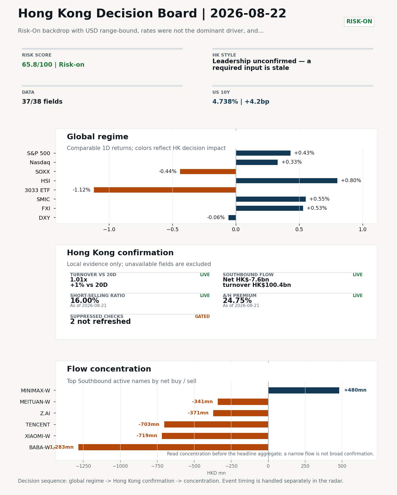
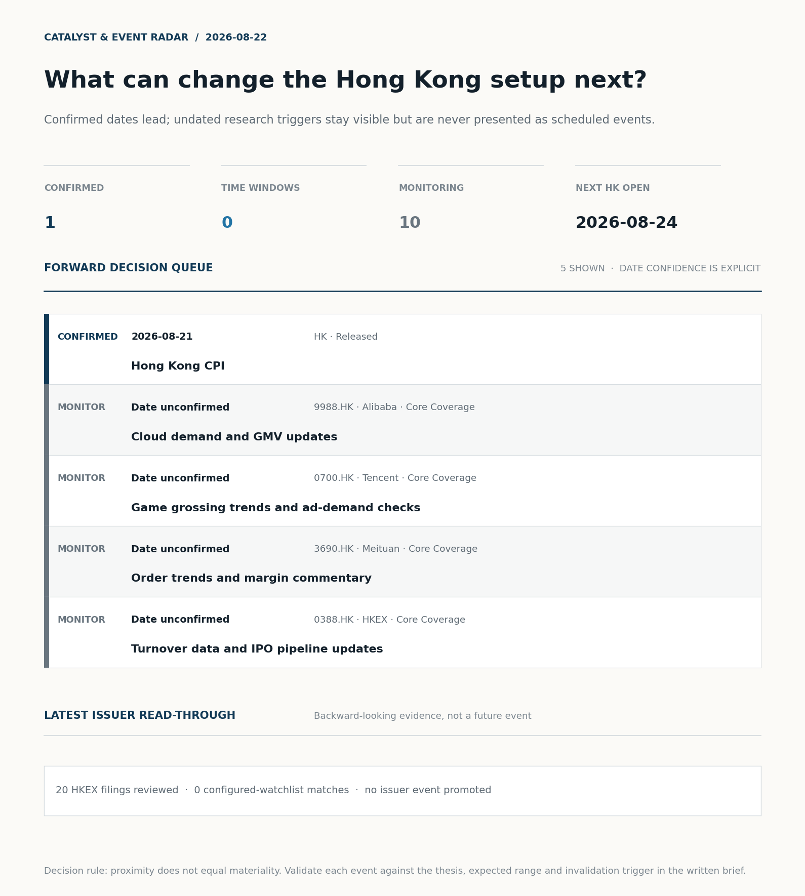
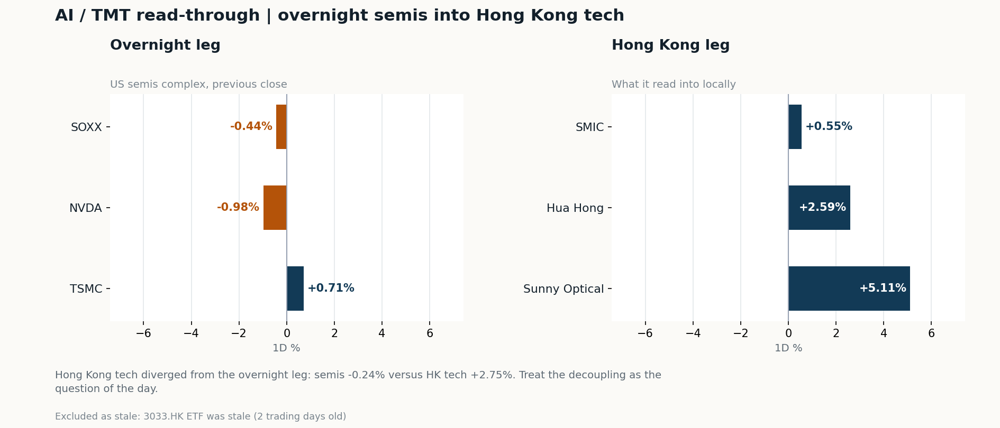
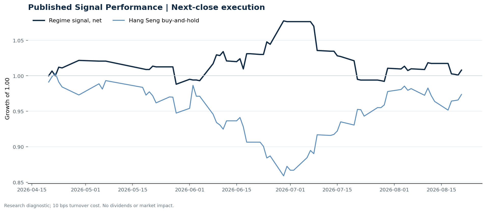

# Morning Research Workbench | 2026-08-22

> **Commute reading route:** `Layer 1 scan (5 min)` → `Layer 2 deep read` → `Layer 3 and appendix if time allows`
>
> Mode: `Trading Daily` | Keep the report execution-oriented: what mattered in the completed session, what can move Hong Kong leadership, and what needs fast follow-up.

_Data through: global `2026-08-21` | HK/China `2026-08-21` | Market effective `2026-08-21` | Generated `2026-08-22 05:38:50`_

## Executive Summary

- **Did yesterday's call work?** **NO CALL** - The 2026-08-21 report published no directional call because release was blocked on quality.
- **What changed overnight?** Semis led lower: SOXX -0.44%, NVDA -0.98%, TSMC +0.71%.
- **What it means for AI/TMT** Style call withheld: 3033.HK ETF was stale (2 trading days old). The stale input is excluded from the risk score.
- **What to watch today** Watch whether SMIC and Hua Hong trade with HSCEI rather than with the overnight semis leg.

## Visual Dashboard

**Catalyst & Event Radar**

**Chart read:** 1 dated event(s) lead the queue; 10 undated trigger(s) remain explicitly in monitoring.

_Source: Public calendars, issuer disclosures and configured research watchlists_
## Layer 1 | Scan (5 min)

### 1.1 Yesterday's Call
**Verdict: NO CALL.** The 2026-08-21 report published no directional call because release was blocked on quality.

**Recent record.** 6 confirmed / 4 broken over the last 10 scoreable calls (60.0% hit rate). This is a directional close-to-close diagnostic, not a track record.

### 1.2 Global Asset Price Dashboard
_Decision-useful subset: each row states the implication and the next test. Descriptive secondary monitors are kept out of the five-minute scan._

| Signal | Last / move | Interpretation | Confirmation / invalidation |
| --- | --- | --- | --- |
| S&P 500 | 7,674.37 / +0.43% | US beta improved, raising the global risk floor for Hong Kong. Falling volatility confirms lower near-term stress. | Confirm with Nasdaq breadth and a same-direction VIX move; invalidate if offshore-China proxies diverge. |
| Nasdaq 100 | 29,308.86 / +0.33% | Growth tracked broad beta, so the move looks market-wide rather than duration-led. Growth advanced despite higher yields, showing momentum resilience but also higher reversal sensitivity. | Confirm through the 3033.HK ETF versus HSI leadership; higher US yields would weaken the read. |
| Hang Seng Index | 25,698.49 / +0.80% | Hong Kong broad beta strengthened, but local flow must confirm whether the move is investable. | Confirm with Southbound participation and breadth; invalidate if USD/CNH weakens while turnover fades. |
| Hang Seng TECH ETF (3033.HK) | 4.6000 / -1.12% | Hong Kong growth lagged, so broad-index strength is not yet a duration signal. | Confirm with stable CNH, Southbound buying and lower yields; invalidate on growth underperformance with rising yields. |
| US 10Y | 4.7380% / +4.2bp | The yield proxy rose, tightening the discount-rate backdrop for long-duration Hong Kong growth. | Confirm through Nasdaq and 3033.HK ETF relative performance; invalidate if growth leads despite the opposing rate move. |
| China 10Y | 1.68% / +0.1bp | Higher local yields may indicate firmer growth or tighter financial conditions; price action alone cannot distinguish them. | Use CSI 300, copper and official credit/activity data to separate growth optimism from demand weakness. |
| DXY | 98.84 / -0.06% | A softer dollar eases an external-liquidity headwind for Hong Kong risk assets. | Confirm with USD/CNH moving in the same risk direction; divergence reduces conviction. |
| USD/CNH | 6.7110 / -0.07% | A stronger offshore renminbi supports the external-risk backdrop for Hong Kong equities. | Confirm with FXI, the 3033.HK ETF proxy and Southbound flow; invalidate if equities move opposite to FX with strong local participation. |
| VIX | 15.13 / **-5.50%** | Lower implied volatility reduces near-term stress, but is supportive only if equity breadth confirms. | Confirm with equity breadth and credit-sensitive assets; invalidate if lower VIX accompanies narrow or falling equities. |

_Secondary monitors retained in the source bundle: CSI 300, CN-US 10Y spread, USD/HKD, Brent crude, COMEX gold, Copper._

### 1.3 Hong Kong Key Data Quick Check
_Coverage gate: 1 unavailable local checks are suppressed here and retained in validation metadata._

| Check | Value | Status | Source / as of | Why it matters |
| --- | --- | --- | --- | --- |
| Main Board turnover vs 20D | 1.01x \| +1% vs 20D | Live local | HKEX \| 2026-08-21 | Trailing 20-session average turnover was HK$254.8bn. |
| Southbound / Northbound net flow | Southbound Net HK$-7.6bn \| turnover HK$100.4bn \| Northbound Turnover HK$268.1bn \| net not reported | Live local | HKEX Connect \| 2026-08-21 | Southbound net buy is calculated from HKEX disclosed buy and sell turnover. |
| Short-selling ratio | 16.00% | Live local | HKEX \| 2026-08-21 | Official HKEX stock-level short-selling table, aggregated as a share of total market turnover. |
| AH premium index | 24.75% | Live public | Yahoo \| 2026-08-21 | Fixed 10-name basket, equal-weighted, both legs priced on the same date; comparable across dates. Covered-pair average was +34.62% across 18 pairs. |
| USD/HKD spot vs band | 7.8396 | Live quote | Yahoo \| 2026-08-21 | Mid-band: 104 pips from the weak side and 896 pips from the strong side, so the peg is not an active constraint. |
| Hong Kong leadership | Leadership unconfirmed - a required input is stale | Proxy | HSI / HSCEI / 3033.HK ETF relative \| 2026-08-21 | Use HSI / HSCEI / 3033.HK ETF relative moves as the opening style read. |

### 1.4 Decision Board
**Composite risk score:** `65.8/100` | **Regime:** `Risk-on`

| Component | Score impact | Evidence |
| --- | --- | --- |
| US beta | +2.6 | S&P 500 +0.43% |
| Offshore China proxy | +2.7 | FXI +0.53% |
| Dollar pressure | +0.6 | DXY -0.06% |
| Volatility | +10 | VIX -5.50% |

**Morning Checklist**

1. **Risk-On backdrop with USD range-bound, rates were not the dominant driver, and Bitcoin outperformed Oil**
 Overnight regime | Start by deciding whether the day is about Risk-On conditions or a style pivot.
2. **Hong Kong CPI (Released)**
 Macro / policy | Rates expectations, the dollar, and growth-equity valuation | Industries: Technology, Internet, Brokers
3. **VIX -5.50%**
 High-frequency data | Lower volatility signals easing stress in the tape. (second-order macro context)
4. **[B] Stocks making the biggest moves premarket: Walmart, Coinbase, Moderna, Alibaba & more**
 News / announcements | Assess whether the story can propagate through the China Internet value chain

## Layer 2 | Deep Read (20-30 min)

### 2.1 Overnight Overseas Market Review
**Market Setup**
**Core tape.** Risk-On backdrop with USD range-bound, rates were not the dominant driver, and Bitcoin outperformed Oil

**Hong Kong Read-Through**
**Opening implication.** Carry the overnight tape into the Hong Kong open using the style and flow evidence in Section 2.2 rather than the headline index alone.
_Hong Kong style leadership, cross-market levels and flow confirmation are set out in Section 2.2._

**Watch Points**
- USD composite moved higher by +0.10pct intraday, with a 0.265pct range.
- Main turning points appeared around 2026-08-21 08:05 peak / 2026-08-21 08:45 peak / 2026-08-21 09:30 trough, suggesting event-driven repricing rather than a clean one-way USD move.
- The biggest cross-asset divergence was Bitcoin versus Oil, a spread of 6.636pct.
- Gold moved +1.46pct intraday with a 2.224pct high-low range.

**Curated overnight stories**
1. **Labubu maker Pop Mart shares fall as key ex-China sales data drop; Citi cuts price target**
 Why it matters: Pop Mart is HK-listed and is a high-profile consumer/IP name with significant overseas-revenue sensitivity.
 HK read-through: Direct hit to the HK-listed name and potential read-through to other China consumer/IP stocks with overseas exposure.
2. **Hong Kong CPI (released)**
 Why it matters: Local inflation print shapes HKD rate expectations and HKMA posture; relevant for HK property, banks, and utilities valuation.
 HK read-through: Direct input into domestic rate and growth framing for HK before the 24 Aug open; pairs with the 'rates were not the dominant driver' overnight regime.
3. **China is defying the global bond yield surge, boosting its diversification appeal**
 Why it matters: Highlights a divergence in CNY/CGB yields versus global rates, which is a structural flow story for offshore-China allocation and the HKD/USD-CNH cross.
 HK read-through: Most relevant as a backdrop for southbound/foreign flow into HK and as second-order support for China-duration assets.
4. **Stocks making the biggest moves premarket: Walmart, Coinbase, Moderna, Alibaba & more**
 Why it matters: Alibaba resurfacing in the US premarket tape keeps China Internet in the overnight narrative; relevant alongside the broader Risk-On / VIX -5.50% backdrop.
 HK read-through: Read-through to HK-listed China Internet leaders and dual-listeds; modest but useful for tone into the 24 Aug HK open.

### 2.2 Hong Kong / A-share Previous-Day Review
**Style and Local Leadership**
**Style call.** Leadership unconfirmed - a required input is stale.
- **Evidence:** No same-date 3033.HK-versus-HSCEI comparison was possible because 3033.HK ETF was stale (2 trading days old)
- **Portfolio meaning:** Do not infer Hong Kong style from the headline index alone; wait for relative price and local-flow evidence.
- **Cross-market read:** Hang Seng +0.80% / HSCEI +0.90% / 3033.HK ETF stale 2d.
- **Cross-market read:** Offshore China proxy FXI +0.53% and USD/CNH -0.07% frame cross-border risk appetite.
- **Cross-market read:** USD/HKD last traded around 7.8396, which keeps the Hong Kong funding lens in focus.

**Flow Confirmation**
Official Stock Connect evidence is available; use Section 2.3 to confirm whether local money supports the price action.

**Follow-Through Checklist**
**Follow-through check.** Confirm only after HSI, HSCEI, 3033.HK, turnover, and Southbound evidence refresh on a comparable date.
**Failure condition.** Any style claim remains invalid while the required relative-performance fields are missing or stale.

### 2.3 AI / TMT Read-Through

**Overnight leg.** The overnight semis leg was flat (-0.24% average), so it does not set the direction for Hong Kong tech today.
**Hong Kong expression.** Let local flow and style leadership drive the tech read rather than the overnight tape.
**Observable test.** Watch whether SMIC and Hua Hong trade with HSCEI rather than with the overnight semis leg.

| Name | Role in the chain | 1D | Leg |
| --- | --- | --- | --- |
| SOXX | Semis complex | -0.44% | overnight |
| NVDA | AI capex narrative | -0.98% | overnight |
| TSMC | Foundry demand | +0.71% | overnight |
| SMIC | Leading-edge / domestic substitution | +0.55% | Hong Kong |
| Hua Hong | Mature-node pricing cycle | +2.59% | Hong Kong |
| Sunny Optical | Hardware and optics supply chain | +5.11% | Hong Kong |
| 3033.HK ETF | Broad HK tech beta | stale 2d | Hong Kong |

**Read with care.** Hong Kong tech diverged from the overnight leg: semis -0.24% versus HK tech +2.75%. Treat the decoupling as the question of the day.
**Coverage caveat.** 3033.HK ETF was stale (2 trading days old). Those names are excluded from the averages above.

### 2.4 Flow Tracker and Attribution
**Cross-Asset Attribution**

- Cross-asset attribution did not surface a dominant driver set for this run.

**Local Flow Tracker**

**Flow Takeaways**
- Local flow evidence is not yet strong enough to override the cross-asset setup.
- Stock Connect Southbound: net HK$-7.6bn on turnover HK$100.4bn (as of 2026-08-21).
- Stock Connect Northbound: turnover RMB268.1bn; public file provides total turnover/top active names, not full net-buy.
- AH premium: fixed 10-name basket +24.75% (comparable across dates); covered-pair average +34.62% over 18 pairs; widest premium: China Railway Construction 107.13%.

**Stock Connect Southbound Active Names**

| # | Ticker | Name | Buy | Sell | Net buy | HKEX turnover rank |
| --- | --- | --- | --- | --- | --- | --- |
| 1 | 09988.HK | BABA-W | HK$3,220.5mn | HK$4,503.9mn | HK$-1,283.5mn | 1 |
| 2 | 01810.HK | XIAOMI-W | HK$968.3mn | HK$1,687.0mn | HK$-718.7mn | 7 |
| 3 | 00700.HK | TENCENT | HK$1,445.4mn | HK$2,148.5mn | HK$-703.0mn | 4 |
| 4 | 00100.HK | MINIMAX-W | HK$2,265.2mn | HK$1,785.2mn | HK$480.0mn | 4 |
| 5 | 02513.HK | Z.AI | HK$3,519.4mn | HK$3,890.8mn | HK$-371.5mn | 1 |

**AH Premium Dispersion**

| Name | A ticker | H ticker | Premium | As of |
| --- | --- | --- | --- | --- |
| China Railway Construction | 601186.SS | 1186.HK | +107.13% | 2026-08-21 |
| China Communications Construction | 601800.SS | 1800.HK | +86.54% | 2026-08-21 |
| China Life | 601628.SS | 2628.HK | +53.75% | 2026-08-21 |
| China Railway | 601390.SS | 0390.HK | +48.44% | 2026-08-21 |
| New China Life | 601336.SS | 1336.HK | +43.18% | 2026-08-21 |

**HKEX Short-Selling Watch**

| Ticker | Name | Short ratio | Short turnover | Total turnover |
| --- | --- | --- | --- | --- |
| 00388.HK | HKEX | 18.69% | HK$0.4bn | HK$2.2bn |
| 00700.HK | TENCENT | 14.60% | HK$1.5bn | HK$10.1bn |
| 00941.HK | CHINA MOBILE | 6.12% | HK$0.1bn | HK$1.4bn |
| 01211.HK | BYD COMPANY | 30.66% | HK$0.4bn | HK$1.3bn |
| 01299.HK | AIA | 22.85% | HK$0.6bn | HK$2.8bn |

- **Short-value leaders:** 09988.HK BABA-W (HK$4.5bn); 07709.HK XL2CSOPHYNIX (HK$2.1bn); 02800.HK TRACKER FUND (HK$1.7bn); 09992.HK POP MART (HK$1.7bn).

### 2.5 Macro and Policy Tracking
**Desk read.** Today's macro agenda is light: Hong Kong CPI was released and came in broadly inline, with limited direct equity impact under the linked exchange rate.

**Market sensitivity.** That likely keeps rates and FX as secondary drivers for the Hong Kong tape.

**HK implication.** The session's risk-on tone is carried mainly by lower VIX, strong Bitcoin, and firm copper; the main offset is NVDA's 0.98% decline, which has direct read-through to Hong Kong technology and internet leadership.

**Macro watchpoints**
- Whether NVDA stabilizes or extends lower, as a direct signal for HK tech and internet leadership.
- VIX follow-through after the 5.5% drop, as a check on the risk-on regime.
- Copper holding its 1.86% gain, as second-order confirmation of risk appetite.
- Any second-round reaction in Hong Kong funding conditions, though the CPI print was broadly inline.

| Time | Region | Event | Status | Desk read |
| --- | --- | --- | --- | --- |
| | HK | Hong Kong CPI | Released | Impact: Rates expectations, the dollar, and growth-equity valuation \| Attention: 1/5 \| Industries: Technology, Internet, Brokers |

**Positioning and Risk Backdrop**

- Detailed local flow evidence is covered in Section 2.3; keep this section focused on options, hedging, and macro-positioning risk.

### 2.6 Company Catalysts and Risk Monitor

| Grade | Sector | Headline | Why it matters | Horizon |
| --- | --- | --- | --- | --- |
| B | China Internet | Stocks making the biggest moves premarket | Assess whether the story can propagate through the China Internet value | Monitor |

Decision filter<h4>No immediate portfolio catalyst: 20 official filings were screened and the low-signal market set stays aggregated.</h4>
20 profit warnings

<strong>20</strong>Official filings

<strong>0</strong>Watchlist hits

<strong>0</strong>Actionable events

<strong>No event cleared the portfolio decision filter.</strong>

Broad-market filings remain traceable in the source appendix; they are not expanded here without a watchlist, estimate or liquidity read-through.

<strong>Coverage boundary.</strong> Earnings calendar, sell-side rating changes, IPO / grey-market monitor were not decision-grade in this run; their absence is not treated as confirmation that no event exists.

### 2.7 Questions to Expect This Morning
**Q1. Why is there no style call today?**
- **Evidence:** 3033.HK ETF was stale (2 trading days old).
- **How to answer:** A required input was stale, so any relative-performance claim would have compared two different dates. The call is withheld rather than published on partial evidence, and the stale input is excluded from the risk score.

**Q2. The index rose but Southbound sold - is the move real?**
- **Evidence:** HSI +0.80% against Southbound net -7.6bn HKD.
- **How to answer:** Treat it as unconfirmed. Price and mainland flow disagreed, so the rose was not driven by Southbound participation; it needs another session of confirmation before being read as a trend.

**Q3. Did the overnight semis move explain Hong Kong tech?**
- **Evidence:** Hong Kong tech diverged from the overnight leg: semis -0.24% versus HK tech +2.75%. Treat the decoupling as the question of the day.
- **How to answer:** Not on its own. Same direction is not the same as explained, so check single-name news, placements and index events before attributing the move to the global cycle.

### 2.8 Today's Core Names
**Core coverage**

| Name | Ticker | Last | 1D | Range position | Morning note |
| --- | --- | --- | --- | --- | --- |
| Alibaba | 9988.HK | 123.00 | -2.54% | Top of range | Down 2.54% on the session, in the top quartile of its 60-session range (81%). |
| Tencent | 0700.HK | 457.00 | +1.24% | Mid-range | Marginally higher (+1.24%), mid-range at 56% of its 60-session band. |

**Recent headlines for Alibaba:**
- [Alibaba Sinks 7% as a 75% Capex Surge Swallows 45% Cloud Growth; Baidu Ticks Up](https://247wallst.com/investing/2026/08/21/alibaba-sinks-7-as-a-75-capex-surge-swallows-45-cloud-growth-baidu-ticks-up/) (24/7 Wall St.)

**Priority follow-up**

| Name | Ticker | Last | 1D | Range position | Morning note |
| --- | --- | --- | --- | --- | --- |
| AIA | 1299.HK | 75.15 | +3.30% | Mid-range | Up 3.30% on the session, mid-range at 41% of its 60-session band. |
| BYD Company | 1211.HK | 93.15 | +1.47% | Top of range | Marginally higher (+1.47%), in the top quartile of its 60-session range (87%). |

**Recent headlines for BYD Company:**
- [Is BYD (SEHK:1211) Fully Priced After Its EV Export Lead?](https://finance.yahoo.com/markets/stocks/articles/byd-sehk-1211-fully-priced-091152063.html) (Simply Wall St.)

## Layer 3 | Decision Deepening (10-15 min)

### 3.1 Rotating Theme Deep Dive

| Field | Read |
| --- | --- |
| Theme | AI and Compute Chain |
| Angle for the day | Track whether global AI capex, semis, cloud, and server demand are still carrying offshore China internet and hardware sentiment. |

**Theme desk read**
**Core thesis.** The weekly AI and Compute Chain angle remains a useful filter for offshore China internet and hardware, but the 21 August tape added a clear tension to the story.
**Evidence.** Cross-asset signals lean risk-on (VIX -5.50%, Bitcoin +7.08%, TSMC +0.71%, Copper +1.86%) while NVDA closed only modestly lower at -0.98%, suggesting the global compute narrative is intact at the index level rather than accelerating.
**What to test.** Within the HK coverage, Tencent closed +1.24% at the mid-range (56%) and is best treated as a marginal information vehicle, while AIA (+3.30%, mid-range 41%) sits outside the theme but confirms broad HK bid tone.

**Signals to keep in mind**
- Stocks making the biggest moves premarket: Walmart, Coinbase, Moderna, Alibaba & more
- VIX -5.50%: Lower volatility signals easing stress in the tape.
- Bitcoin +7.08%: A strong crypto tape reinforces the risk-on read.

**LLM watch items:**
- Alibaba (9988.HK): whether the -2.54% session from a top-of-range 81% starting point is profit-taking or the first leg of a trend break
- Tencent (0700.HK): use as a marginal read on AI monetization and ad demand; needs to hold mid-range to confirm the platform leg of the compute theme
- NVDA and TSMC overnight tape: confirm whether the global compute narrative is still carrying or if it is flattening into the next HK session.
- Bidu read-through: if Baidu continues to benefit from a different capex posture, the differentiation within China internet on AI capex intensity
- Hong Kong CPI second-order reaction: broadly inline print keeps the peg/ rates channel neutral

**Related names to keep close:**

| Name | Ticker | Bucket | Morning read |
| --- | --- | --- | --- |
| Alibaba | 9988.HK | Core coverage | Down 2.54% on the session, in the top quartile of its 60-session range (81%). |
| Tencent | 0700.HK | Core coverage | Marginally higher (+1.24%), mid-range at 56% of its 60-session band. |
| AIA | 1299.HK | Priority follow-up | Up 3.30% on the session, mid-range at 41% of its 60-session band. |

**Relevant headlines:**
- [Stocks making the biggest moves premarket: Walmart, Coinbase, Moderna, Alibaba & more](https://www.cnbc.com/2026/08/20/stocks-making-the-biggest-moves-premarket-.html)

### 3.2 Today Ahead and Trading Calendar
- No same-day macro or catalyst items were supplied for this run, so the session has no scheduled anchor in this report; trade the overnight tape and positioning, and check an external calendar before assuming the day is genuinely quiet.

_The configured calendar and catalyst sources returned no same-day or forward events._

### 3.3 Daily One Chart
**Daily One Chart | HKEX short-selling pressure map**

**Chart read.** Market short-selling reached 16.00% of turnover.
**Why it matters.** The chart leads today because the pressure is either broad, concentrated, or acute in the top name.

_Source: HKEX Daily Quotations - Short Selling Turnover_

## Optional Appendix | Traceability and Performance (10-15 min)

### Report Metadata
> Date policy: Review date 2026-08-21 is treated as `Trading Daily`. | Global request date is 2026-08-21; adapter effective date is 2026-08-21 and summary date is 2026-08-21. | HK/China local data date is 2026-08-21; role: same-session local cash tape.
> Market data quality: Coverage: `37/38` | Stale items (>1d): `1` | Missing: `1`
> Report quality: `75.5/100` | Grade `C` | Status `usable with caveats`

### Key Questions to Keep in Mind
- Is risk appetite rising or fading? The overnight tape reads closer to `Risk-On`.
- Did rates expectations move? Focus on whether US 10Y, DXY, and growth style moved together.
- Were commodities the real story? Watch WTI and gold for geopolitics versus inflation signals.
- Is Hong Kong setup growth-led, SOE-led, or broad beta-led? Compare the 3033.HK ETF proxy, HSCEI, and HSI.
- Did offshore markets move China risk appetite? Focus on HSI, FXI, USD/CNH, and USD/HKD.

### Report Quality and Validation
- **Quality score:** 75.5/100 | **Grade:** C | **Status:** usable with caveats
- **Run summary:** 7 healthy | 3 caveat | 0 failed
- **Release recommendation:** Send with caveats | The report is usable, but the advisory guidance should travel with it so readers understand the data gaps.

| Source | Status | Bucket |
| --- | --- | --- |
| Macro calendar | partial | caveat |
| Risk and sentiment feed | partial | caveat |
| Narrative overlay | partial | caveat |

**Desk-use guidance summary:** 0 blocking | 1 advisory

**Desk-use guidance**
- **Advisory:** A core instrument quote is stale; the style call is downgraded and the stale leg is excluded from scoring.
- **Advisory:** Use deterministic sections as primary support; the narrative overlay was partial or unavailable on this run.
- **Grade capped:** Narrative overlay health is below 50% (1/7 narrative overlay tasks succeeded or used validated cache; 4 error(s). Dominant failure cause: truncated (4 of 4).)
- **Grade capped:** Stale core instrument(s): Hang Seng TECH ETF (2d)
- **Grade capped:** 1 prose defect(s) detected: 1 sentence_fragment.

| Weak component | Score | Read |
| --- | --- | --- |
| Hong Kong local metrics | 54.1 | 5 live, 3 proxy, 3 unavailable local checks. |
| Narrative overlay health | 25.7 | 1/7 narrative overlay tasks succeeded or used validated cache; 4 error(s). Dominant failure cause: truncated (4 of 4). |

**Quality warnings**
- Hong Kong local metrics is weak: 5 live, 3 proxy, 3 unavailable local checks.
- Narrative overlay health is weak: 1/7 narrative overlay tasks succeeded or used validated cache; 4 error(s). Dominant failure cause: truncated (4 of 4).
- Narrative overlay is failing on most tasks; the grade is capped until it recovers.
- Core instrument quotes are stale, so the Hong Kong style call and risk score are degraded: Hang Seng TECH ETF (2d)

**Narrative fact-check guardrail**
- Checked 17 numeric claims; 0 numeric mismatch(es), 0 logic warning(s); 1 structured claims, 0 source/text warning(s); 0 critical, 0 review.

_Full component weights, per-source freshness, adapter status and provenance records are archived with this report under `audit/` rather than printed here._

### Historical Signal Performance
- **Readiness:** exploratory with caveats | 79 observations | 85 active signal dates | next-close entry, 10bps cost, no same-day returns.
- **Interpretation boundary:** exploratory until a benchmark reaches 252 sessions and 100 active-signal sessions.

| Benchmark | Sessions | Signal net | Buy & hold | Excess | Max drawdown | Hit rate |
| --- | --- | --- | --- | --- | --- | --- |
| Hang Seng Index | 68 | 0.8% | -2.6% | 3.4% | -7.9% | 50.0% |
| Hang Seng TECH ETF (3033.HK) | 67 | -1.3% | -7.9% | 6.6% | -13.3% | 50.0% |

- **Next-session diagnostic:** 53.7% hit rate over 41 resolved signals; 5- and 20-session horizons are in `audit/performance_summary.json`.

- **Data-quality caveat:** 21 conflicting historical price revision(s) and 6 weekend pseudo-session observation(s) were handled explicitly; inspect the ledger before relying on the result.
- **Use boundary:** this is a close-to-close research diagnostic, not an executable strategy or investment recommendation; dividends, financing, borrow and market impact are excluded.

### Source Links
- [Stocks making the biggest moves premarket: Walmart, Coinbase, Moderna, Alibaba & more](https://www.cnbc.com/2026/08/20/stocks-making-the-biggest-moves-premarket-.html) (cnbc_markets)
- [Alibaba Sinks 7% as a 75% Capex Surge Swallows 45% Cloud Growth; Baidu Ticks Up](https://247wallst.com/investing/2026/08/21/alibaba-sinks-7-as-a-75-capex-surge-swallows-45-cloud-growth-baidu-ticks-up/) (24/7 Wall St.)
- [Is BYD (SEHK:1211) Fully Priced After Its EV Export Lead?](https://finance.yahoo.com/markets/stocks/articles/byd-sehk-1211-fully-priced-091152063.html) (Simply Wall St.)
- [00095.HK Profit warning / alert announcement](http://www1.hkexnews.hk/listedco/listconews/sehk/2026/0821/2026082100648.pdf) (HKEXnews)
- [00115.HK Profit warning / alert announcement](http://www1.hkexnews.hk/listedco/listconews/sehk/2026/0821/2026082102263.pdf) (HKEXnews)
- [00180.HK Profit warning / alert announcement](http://www1.hkexnews.hk/listedco/listconews/sehk/2026/0821/2026082100480.pdf) (HKEXnews)
- [00265.HK Profit warning / alert announcement](http://www1.hkexnews.hk/listedco/listconews/sehk/2026/0821/2026082101697.pdf) (HKEXnews)
- [00412.HK Profit warning / alert announcement](http://www1.hkexnews.hk/listedco/listconews/sehk/2026/0821/2026082101317.pdf) (HKEXnews)
- [00413.HK Profit warning / alert announcement](http://www1.hkexnews.hk/listedco/listconews/sehk/2026/0821/2026082100366.pdf) (HKEXnews)
- [00605.HK Profit warning / alert announcement](http://www1.hkexnews.hk/listedco/listconews/sehk/2026/0821/2026082101775.pdf) (HKEXnews)
- [00661.HK Profit warning / alert announcement](http://www1.hkexnews.hk/listedco/listconews/sehk/2026/0821/2026082101981.pdf) (HKEXnews)

## Supplementary Visual Appendix

This appendix is professional-path only. It keeps a traceable index of the report visuals and the deterministic chart cues used to frame the morning note, without injecting the legacy intraday chart pack.

### Visual Index

| Visual | Path | Role |
| --- | --- | --- |
| Visual Dashboard | `charts/dashboard_2026-08-22.png` | Cross-asset regime board and Hong Kong local tape snapshot. |
| Catalyst & Event Radar | `charts/catalyst_radar_2026-08-22.png` | Confirmed dates, time windows, undated monitors, and recent issuer read-through. |
| Daily One Chart | `charts/daily_one_chart_2026-08-22.png` | Single highest-conviction visual story for the day. |

### Deterministic Chart Cues
- FX / liquidity: USD composite moved higher by +0.10pct intraday, with a 0.265pct range.
- FX / liquidity: Main turning points appeared around 2026-08-21 08:05 peak / 2026-08-21 08:45 peak / 2026-08-21 09:30 trough, suggesting event-driven repricing rather than a clean one-way USD move.
- Cross-asset: The biggest cross-asset divergence was Bitcoin versus Oil, a spread of 6.636pct.
- Cross-asset: Gold moved +1.46pct intraday with a 2.224pct high-low range.
- Cross-asset: Oil moved +0.26pct intraday with a 1.724pct high-low range.
- Cross-asset: Bitcoin moved +6.89pct intraday with a 8.388pct high-low range.

### Risk Dashboard Components

| Component | Score impact | Evidence |
| --- | --- | --- |
| US beta | +2.6 | S&P 500 +0.43% |
| Offshore China proxy | +2.7 | FXI +0.53% |
| Dollar pressure | +0.6 | DXY -0.06% |
| Volatility | +10 | VIX -5.50% |
| HK short-selling | +0 | Short-selling ratio 16.00% |
| HK turnover | +0 | Turnover 1.01x 20D |
