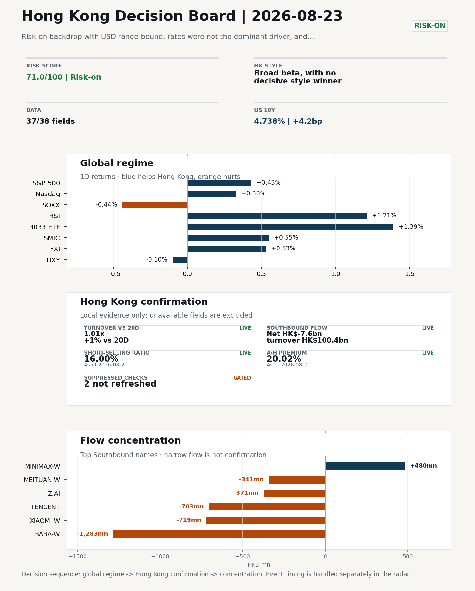
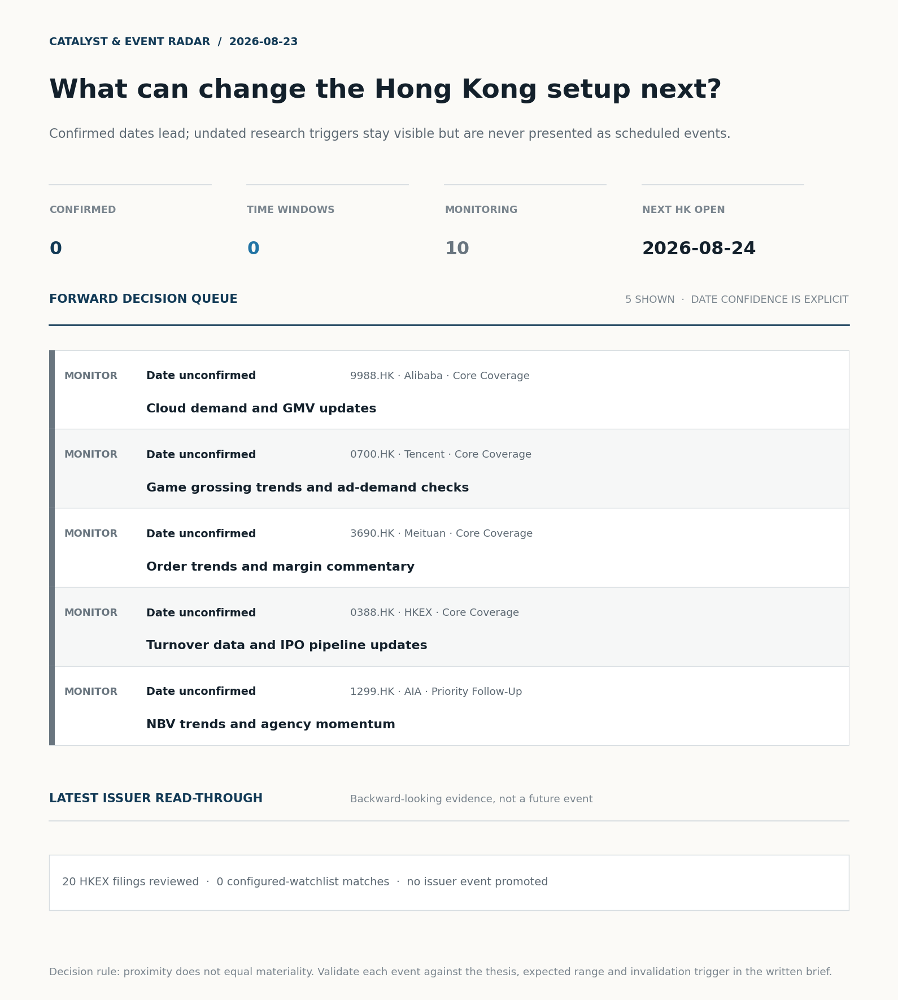
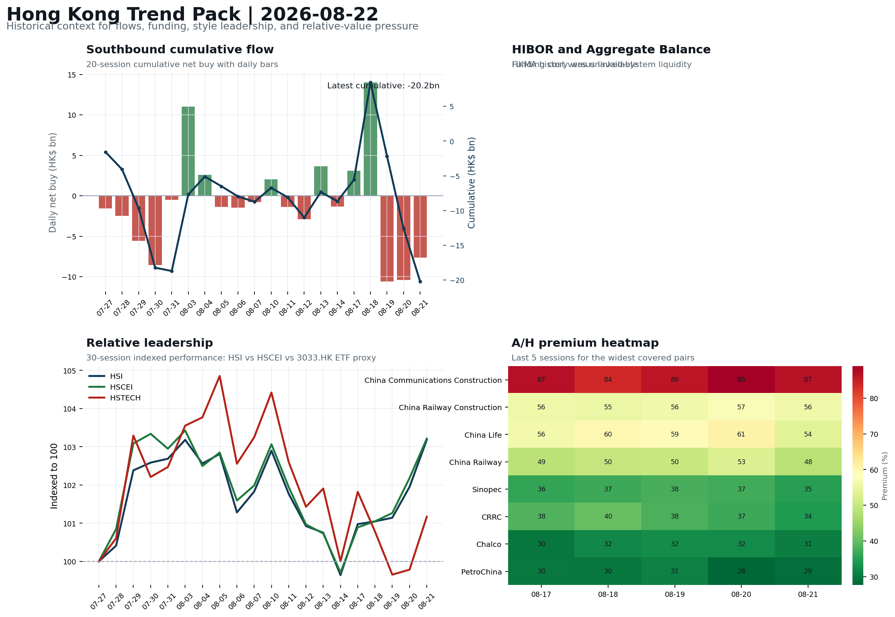
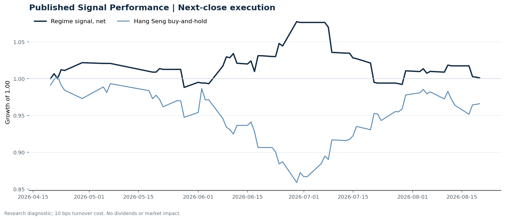

# Morning Research Workbench | 2026-08-23

> **Commute reading route:** `Layer 1 scan (5 min)` → `Layer 2 deep read` → `Layer 3 and appendix if time allows`
>
> Mode: `Weekly Review` | Use Saturday's non-trading review date to synthesize the completed Hong Kong week and prepare next week's work plan.

_Data through: global `2026-08-22` | HK/China `2026-08-21` | Market effective `2026-08-21` | Generated `2026-08-23 07:00:55`_

## Executive Summary

- **Did yesterday's call work?** UNRESOLVED - No comparable next close is available yet, so the call is still open.
- **What changed overnight?** Semis led lower: SOXX -0.44%, NVDA -0.98%, TSMC +0.71%. HSI +1.21% and 3033.HK +1.39%.
- **What it means for AI/TMT** No decisive style winner - Broad beta, with no decisive style winner, a 0.38pp spread. Hong Kong tech diverged from the overnight leg: semis -0.24% versus HK tech +2.41%. Treat the decoupling as the question of the day.
- **What to watch today** Watch whether SMIC and Hua Hong trade with HSCEI rather than with the overnight semis leg.

## Visual Dashboard

**Catalyst & Event Radar**

**Chart read:** No confirmed event date is populated; 10 undated research trigger(s) remain visible without invented timing.

_Source: Public calendars, issuer disclosures and configured research watchlists_
## Layer 1 | Weekly Scan (5 min)

### 1.1 Yesterday's Call
**Verdict: UNRESOLVED.** No comparable next close is available yet, so the call is still open.

**Recent record.** 6 confirmed / 4 broken over the last 10 scoreable calls (60.0% hit rate). This is a directional close-to-close diagnostic, not a track record.

### 1.2 Global Asset Price Dashboard
_Decision-useful subset: each row states the implication and the next test. Descriptive secondary monitors are kept out of the five-minute scan._

| Signal | Last / move | Interpretation | Confirmation / invalidation |
| --- | --- | --- | --- |
| S&P 500 | 7,674.37 / +0.43% | Broad US risk rose as volatility drained out of the tape, which sets the external floor Hong Kong opens against. Falling volatility confirms lower near-term stress. | Watch whether Nasdaq and offshore-China proxies move the same way. |
| Nasdaq 100 | 29,308.86 / +0.33% | Growth tracked broad beta, so the move looks market-wide rather than duration-led. Growth advanced despite higher yields, showing momentum resilience but also higher reversal sensitivity. | 3033.HK versus HSI leadership carries the read; rising yields would undo it. |
| Hang Seng Index | 26,009.46 / +1.21% | Broad beta rose with no single driver visible in today's fields. | Southbound participation decides whether this is investable or just a print. |
| Hang Seng TECH ETF (3033.HK) | 4.6700 / +1.39% | Hong Kong growth led broad beta, improving the platform/internet style signal. | Needs a stable CNH and Southbound buying to become a duration signal. |
| Semiconductors (SOXX) | 520.05 / -0.44% | Semis underperformed the Nasdaq by 0.77pp, so this is a cycle move rather than broad growth weakness. | SMIC and Hua Hong at the open show whether it transmits to Hong Kong. |
| SMIC (0981.HK) | 72.50 / +0.55% | The local expression of the overnight semis move; compare it with SOXX to separate the global cycle from single-name news. | A move far larger than SOXX points to company-specific news, not the cycle. |
| US 10Y | 4.7380% / +4.2bp | The yield proxy rose, tightening the discount-rate backdrop for long-duration Hong Kong growth. | Read it through 3033.HK relative performance, not the index level. |
| China 10Y | 1.68% / +0.1bp | Higher local yields may indicate firmer growth or tighter financial conditions; price action alone cannot distinguish them. | Use CSI 300, copper and official credit/activity data to separate growth optimism from demand weakness. |
| DXY | 98.80 / -0.10% | A softer dollar eases an external-liquidity headwind for Hong Kong risk assets. | Only meaningful if USD/CNH moves the same way; divergence cancels it. |
| USD/CNH | 6.7115 / -0.07% | A stronger offshore renminbi supports the external-risk backdrop for Hong Kong equities. | FXI and Southbound flow decide whether this reaches Hong Kong equities. |
| VIX | 15.13 / **-5.50%** | Lower implied volatility reduces near-term stress, but is supportive only if equity breadth confirms. | Falling volatility on narrowing breadth is a warning, not support. |

_Secondary monitors retained in the source bundle: CSI 300, CN-US 10Y spread, USD/HKD, Brent crude, COMEX gold, Copper._

### 1.3 Hong Kong Weekly Tape Quick Check
_Coverage gate: 1 unavailable local checks are suppressed here and retained in validation metadata._

| Check | Value | Status | Source / as of | Why it matters |
| --- | --- | --- | --- | --- |
| Main Board turnover vs 20D | 1.01x \| +1% vs 20D | Live local | HKEX \| 2026-08-21 | Trailing 20-session average turnover was HK$254.8bn. |
| Southbound / Northbound net flow | Southbound Net HK$-7.6bn \| turnover HK$100.4bn \| Northbound Turnover HK$268.1bn \| net not reported | Live local | HKEX Connect \| 2026-08-21 | Southbound net buy is calculated from HKEX disclosed buy and sell turnover. |
| Short-selling ratio | 16.00% | Live local | HKEX \| 2026-08-21 | Official HKEX stock-level short-selling table, aggregated as a share of total market turnover. |
| AH premium index | 20.02% | Live public | Yahoo \| 2026-08-21 | Fixed 10-name basket, equal-weighted, both legs priced on the same date; comparable across dates. Covered-pair average was +28.03% across 17 pairs. |
| USD/HKD spot vs band | 7.8435 | Live quote | Yahoo \| 2026-08-21 | 65 pips from the weak-side CU (7.8500); monitor HKMA operations and the aggregate balance for a funding squeeze. |
| Hong Kong leadership | Broad beta, with no decisive style winner | Proxy | HSI / HSCEI / 3033.HK ETF relative \| 2026-08-21 | Use HSI / HSCEI / 3033.HK ETF relative moves as the opening style read. |

### 1.4 Decision Board
**Composite risk score:** `71.0/100` | **Regime:** `Risk-on`

| Component | Score impact | Evidence |
| --- | --- | --- |
| US beta | +2.6 | S&P 500 +0.43% |
| HK growth ETF proxy | +6.9 | 3033.HK ETF +1.39% |
| Semis complex | -2.2 | SOXX -0.44% |
| Offshore China proxy | +2.7 | FXI +0.53% |
| Dollar pressure | +1.0 | DXY -0.10% |
| Volatility | +10 | VIX -5.50% |
| HK short-selling | +0 | Short-selling ratio 16.00% |
| HK turnover | +0 | Turnover 1.01x 20D |

_Base 50 plus the component deltas above. Semis complex entered the score on 2026-08-22; earlier scores in the ledger exclude it._

**Next Week Checklist**

1. **Risk-on backdrop with USD range-bound, rates were not the dominant driver, and 3033.HK outperformed FXI**
 Still-moving markets | No fresh Hong Kong cash session is assumed; use global active assets and policy/event flow to prepare the next open.
2. **VIX -5.50%**
 High-frequency data | Lower volatility signals easing stress in the tape. (second-order macro context)
3. **[B] Stocks making the biggest moves premarket: Walmart, Coinbase, Moderna, Alibaba & more**
 News / announcements | Assess whether the story can propagate through the China Internet value chain
4. **Bitcoin +7.26%**
 High-frequency data | A strong crypto tape reinforces the risk-on read. (weak HK linkage; context only)

## Layer 2 | Deep Read (20-30 min)

### 2.1 Weekly Cross-Asset Review
> Weekly review mode: synthesize the completed Hong Kong week, retain the main cross-asset and policy lessons, and convert them into next-week preparation rather than treating Saturday as a fresh cash-market session.

**Market Setup**
**Core tape.** Overseas markets closed the review week with a risk-on tone: S&P 500 +0.43%, Nasdaq 100 +0.33%, Euro Stoxx 50 +0.63%, and VIX -5.50%.
**Main driver.** Attribution_v1 frames the move as broad risk appetite with USD range-bound and rates not the dominant driver, while 3033.HK outperformed FXI.
**HK relevance.** The main offset was the semis complex, where SOXX -0.44% and NVDA -0.98% lagged, so leadership was not concentrated in AI hardware.

**Key Drivers**
- Risk appetite: VIX fell 5.50% and US/Europe equity indices rose, signaling lower stress rather than a single macro shock.
- USD and rates were not the main catalyst: USD was range-bound and rates were not dominant, limiting a macro-regime explanation.
- Semis lagged: SOXX -0.44% and NVDA -0.98%.

**Hong Kong Read-Through**
**Opening implication.** For the next Hong Kong session on 2026-08-24, a constructive start is plausible but the weekly evidence is not high-conviction. Southbound flow was -HK$11.6bn over five sessions with only 2/5 positive days, and the latest -HK$7.6bn shows local money did not confirm the index move. Next week's key test is whether cumulative Southbound buying resumes and whether the 3033.HK/HSCEI spread stays narrow; short-selling at 16.0% and turnover at 1.01x 20D argue for waiting on first-hour breadth and flow before adding risk.
_Hong Kong style leadership and flow confirmation are set out in the Hong Kong review below._

**Watch Points**
- USD composite moved lower by -0.03pct intraday, with a 0.214pct range.
- Main turning points appeared around 2026-08-21 08:05 peak / 2026-08-21 08:45 peak / 2026-08-21 09:30 trough, suggesting event-driven repricing rather than a clean one-way USD move.
- The biggest cross-asset divergence was 3033.HK versus FXI, a spread of 1.342pct.
- Gold moved +1.87pct intraday with a 2.226pct high-low range.

**Weekly Review Map**
- Weekly review window: 2026-08-17 to 2026-08-21. Core regime: Risk-on backdrop with USD range-bound, rates were not the dominant driver, and 3033.HK outperformed FXI. Hong Kong leadership: Leadership was broad and balanced.
- Method note: Trend summary uses the latest available five observations from the Hong Kong Trend Pack inputs.

**Cross-asset weekly dashboard**

| Asset | Latest move | Weekly read |
| --- | --- | --- |
| S&P 500 | +0.43% | Risk appetite |
| Nasdaq 100 | +0.33% | Growth style |
| Hang Seng Index | +1.21% | Hong Kong beta |
| Hang Seng TECH ETF (3033.HK) | +1.39% | Hong Kong growth / internet proxy |
| DXY | -0.10% | Global liquidity |
| US 10Y Treasury Yield | +4.2bp | Rates path |
| Gold | +2.39% | Hedge / real yields |
| VIX | -5.50% | Volatility and hedging |

**Hong Kong / China weekly tape**

| Signal | Latest move | Read |
| --- | --- | --- |
| Hang Seng Index | +1.21% | Hong Kong beta |
| Hang Seng China Enterprises Index | +1.01% | China SOE / H-share tone |
| Hang Seng TECH ETF (3033.HK) | +1.39% | Hong Kong growth / internet proxy |
| China Large-Cap (FXI) | +0.53% | China sentiment |
| USD/CNH | -0.07% | China FX sentiment |
| USD/HKD | +0.04% | Hong Kong funding lens |

**Five-session trend evidence**
_Window: 2026-08-17 to 2026-08-21_

| Signal | Five-session change | Latest | Desk read |
| --- | --- | --- | --- |
| Southbound flow | -11.6bn over 5 sessions | -7.6bn | 2/5 positive sessions; cumulative buying is the flow-confirmation test for next week. |
| HK style leadership | HSCEI led (+2.3pp); HSTECH lagged (-0.6pp) | HSCEI leadership | Use HSI / HSCEI / 3033.HK ETF spread to separate broad beta from growth-led rerating. |
| A/H premium dispersion | -1.0pp average change | 46.7% average premium | Premium narrowing can support H-share relative demand |

**Next-week desk questions**
- Did Southbound flow confirm the index move, or was the week mainly offshore beta without local money follow-through?
- Did HIBOR and Aggregate Balance point to benign funding, or should tighter HKD liquidity be part of next week's risk case?
- Was leadership broad enough beyond the 3033.HK ETF / platform beta proxy, or was the week concentrated in a narrow style pocket?
- Which dated macro, policy, earnings, or IPO catalyst can realistically change the next-week narrative?
- What single data point would invalidate the base-case market pulse by Monday or Tuesday morning?

**Key developments to retain**

| Bucket | Item | Why it matters |
| --- | --- | --- |
| B | Stocks making the biggest moves premarket | Assess whether the story can propagate through the China Internet value chain |

**Curated overnight stories**
1. **Labubu maker Pop Mart shares fall as key ex-China sales data drop, Citi cuts price target**
 Why it matters: It directly concerns a China consumer discretionary name and a sell-side price-target cut, potentially resetting growth expectations.
 HK read-through: Most relevant for Hong Kong consumer discretionary and China retail sentiment; watch for read-through to overseas demand assumptions.
2. **Stocks making the biggest moves premarket: Walmart, Coinbase, Moderna, Alibaba & more**
 Why it matters: The premarket mover list names Alibaba; if the move is company- or sector-specific, it can propagate through the China Internet value chain.
 HK read-through: Potentially important for Hong Kong internet leaders and close peers, but the exact driver is not supplied and needs confirmation.
3. **China is defying the global bond yield surge, boosting its diversification appeal**
 Why it matters: It suggests China fixed-income assets are diverging from global yield pressure, which can support the offshore-China diversification argument.
 HK read-through: Broad China/Hong Kong flow and rate sentiment; supportive macro context for China asset allocation.
4. **Samsung plans up to $80 billion in shareholder returns after SK Hynix buyback**
 Why it matters: It signals capital-return momentum in Asia memory/hardware, though the direct Hong Kong linkage is limited.
 HK read-through: Secondary read to Hong Kong tech hardware and regional risk sentiment; likely less direct than China Internet or consumer items.

### 2.2 Hong Kong / A-share Weekly Review
> Weekly review mode: synthesize the completed Hong Kong week, retain the main cross-asset and policy lessons, and convert them into next-week preparation rather than treating Saturday as a fresh cash-market session.

**Local Tape Setup**
**Local read.** Completed week 2026-08-17 to 2026-08-21 closed risk-on: HSI +1.21%, HSCEI +1.01%, 3033.HK ETF +1.39% and FXI +0.53%, while SOXX -0.44% and NVDA -0.98% showed AI hardware did not lead.
**Verification point.** The weekly trend summary points to HSCEI leadership over five sessions, but local flow confirmation was weak: Southbound was -HK$11.6bn over the week and -HK$7.6bn on 2026-08-21, with only 2/5 positive sessions.
**Risk to watch.** Short-selling at 16.0% and Main Board turnover at 1.01x 20D argue for treating next week's setup as broad beta until local money follows through.

**Style and Local Leadership**
**Style call.** Broad beta, with no decisive style winner.
- **Evidence:** 3033.HK and HSCEI were separated by only 0.38pp (+1.39% versus +1.01%)
- **Portfolio meaning:** Avoid forcing a growth-versus-value call; let volume, Southbound concentration, and the first-hour relative tape identify leadership.
- **Cross-market read:** Hang Seng +1.21% / HSCEI +1.01% / 3033.HK ETF +1.39%. Offshore China proxy FXI +0.53% and USD/CNH -0.07% frame cross-border risk appetite. USD/HKD last traded around 7.8435, which keeps the Hong Kong funding lens in focus.

**Flow Confirmation**
Official Stock Connect evidence is available; the Flow Tracker confirms whether local money supports the price action.

**Follow-Through Checklist**
**Follow-through check.** Confirmation test by 2026-08-24: 3033.HK should outperform HSCEI while Southbound net flow improves from -HK$7.6bn and Main Board turnover stays above 1.01x 20D. If Southbound remains negative and 3033.HK does not lead HSCEI, treat the move as offshore beta, not local accumulation. HIBOR and Aggregate Balance were unavailable, so funding/liquidity confirmation remains incomplete.
**Failure condition.** Reclassify the tape when either 3033.HK or HSCEI opens a sustained 0.5pp relative lead with flow confirmation.

### 2.3 AI / TMT Read-Through

**Overnight leg.** The overnight semis leg was flat (-0.24% average), so it does not set the direction for Hong Kong tech today.
**Hong Kong expression.** Let local flow and style leadership drive the tech read rather than the overnight tape.
**Observable test.** Watch whether SMIC and Hua Hong trade with HSCEI rather than with the overnight semis leg.

| Name | Role in the chain | 1D | Leg |
| --- | --- | --- | --- |
| SOXX | Semis complex | -0.44% | overnight |
| NVDA | AI capex narrative | -0.98% | overnight |
| TSMC | Foundry demand | +0.71% | overnight |
| SMIC | Leading-edge / domestic substitution | +0.55% | Hong Kong |
| Hua Hong | Mature-node pricing cycle | +2.59% | Hong Kong |
| Sunny Optical | Hardware and optics supply chain | +5.11% | Hong Kong |
| 3033.HK ETF | Broad HK tech beta | +1.39% | Hong Kong |

**Read with care.** Hong Kong tech diverged from the overnight leg: semis -0.24% versus HK tech +2.41%. Treat the decoupling as the question of the day.

### 2.4 Flow Tracker and Attribution
**Cross-Asset Attribution**

- Cross-asset attribution did not surface a dominant driver set for this run.

**Local Flow Tracker**

**Flow Takeaways**
- Local flow evidence is not yet strong enough to override the cross-asset setup.
- Stock Connect Southbound: net HK$-7.6bn on turnover HK$100.4bn (as of 2026-08-21).
- Stock Connect Northbound: turnover RMB268.1bn; public file provides total turnover/top active names, not full net-buy.
- AH premium: fixed 10-name basket +20.02% (comparable across dates); covered-pair average +28.03% over 17 pairs; widest premium: China Communications Construction 86.54%.

**Stock Connect Southbound Active Names**

| # | Ticker | Name | Buy | Sell | Net buy | HKEX turnover rank |
| --- | --- | --- | --- | --- | --- | --- |
| 1 | 09988.HK | BABA-W | HK$3,220.5mn | HK$4,503.9mn | HK$-1,283.5mn | 1 |
| 2 | 01810.HK | XIAOMI-W | HK$968.3mn | HK$1,687.0mn | HK$-718.7mn | 7 |
| 3 | 00700.HK | TENCENT | HK$1,445.4mn | HK$2,148.5mn | HK$-703.0mn | 4 |
| 4 | 00100.HK | MINIMAX-W | HK$2,265.2mn | HK$1,785.2mn | HK$480.0mn | 4 |
| 5 | 02513.HK | Z.AI | HK$3,519.4mn | HK$3,890.8mn | HK$-371.5mn | 1 |

**AH Premium Dispersion**

| Name | A ticker | H ticker | Premium | As of |
| --- | --- | --- | --- | --- |
| China Communications Construction | 601800.SS | 1800.HK | +86.54% | 2026-08-21 |
| China Railway Construction | 601186.SS | 1186.HK | +55.87% | 2026-08-21 |
| China Life | 601628.SS | 2628.HK | +53.75% | 2026-08-21 |
| China Railway | 601390.SS | 0390.HK | +48.44% | 2026-08-21 |
| Sinopec | 600028.SS | 0386.HK | +34.89% | 2026-08-21 |

**HKEX Short-Selling Watch**

| Ticker | Name | Short ratio | Short turnover | Total turnover |
| --- | --- | --- | --- | --- |
| 00388.HK | HKEX | 18.69% | HK$0.4bn | HK$2.2bn |
| 00700.HK | TENCENT | 14.60% | HK$1.5bn | HK$10.1bn |
| 00941.HK | CHINA MOBILE | 6.12% | HK$0.1bn | HK$1.4bn |
| 01211.HK | BYD COMPANY | 30.66% | HK$0.4bn | HK$1.3bn |
| 01299.HK | AIA | 22.85% | HK$0.6bn | HK$2.8bn |

- **Short-value leaders:** 09988.HK BABA-W (HK$4.5bn); 07709.HK XL2CSOPHYNIX (HK$2.1bn); 02800.HK TRACKER FUND (HK$1.7bn); 09992.HK POP MART (HK$1.7bn).

### 2.5 Macro and Policy Tracking
**Desk read.** Use the calendar table and released data below as the primary macro read.

No macro calendar source reported for this run, so this section is empty. That is an absence of data, not evidence that the calendar was quiet.

**Positioning and Risk Backdrop**

- Detailed local flow evidence is covered under Flow Tracker and Attribution; keep this section focused on options, hedging, and macro-positioning risk.

### 2.6 Company Catalysts and Risk Monitor

| Grade | Sector | Headline | Why it matters | Horizon |
| --- | --- | --- | --- | --- |
| B | China Internet | Stocks making the biggest moves premarket | Assess whether the story can propagate through the China Internet value | Monitor |

**Company Event Takeaway**
**Desk read.** Completed Hong Kong trading week 2026-08-17 to 2026-08-21 was risk-on, with USD range-bound and rates not the dominant driver; Hang Seng TECH ETF (3033.HK) outperformed FXI.
**Why it matters.** The main company event was Alibaba (9988.HK): Q1 earnings fell short of estimates while revenue rose Y/Y.
**Follow-up.** No rating changes were supplied, so no rating-change implications can be drawn.

**LLM Quick Takes**
- **9988.HK** | Fact: Q1 earnings missed estimates; revenue rose Y/Y, cloud grew 45%, but capex surged 75%, pressuring margins. Investor read
- **0700.HK** | Fact: no company-specific news attached; last session +1.24%, mid-range. Investor read: no direct fundamental signal this week
- **1299.HK** | Fact: last session +3.30%, mid-range, with no supplied company news. Investor read: directionally positive for HK financial sentiment, but no supplied fundamental
- **1211.HK** | Fact: +1.47%, top of range; media flagged a valuation debate after a 25.6% three-year gain and strong EV export positioning against intensifying competition and trade
- **3033.HK** | Fact: market theme notes 3033.HK outperformed FXI; last session +1.39%, mid-range. Investor read

Decision filter<h4>No immediate portfolio catalyst: 20 official filings were screened and the low-signal market set stays aggregated.</h4>
20 profit warnings

<strong>20</strong>Official filings

<strong>0</strong>Watchlist hits

<strong>0</strong>Actionable events

<strong>No event cleared the portfolio decision filter.</strong>

Broad-market filings remain traceable in the source appendix; they are not expanded here without a watchlist, estimate or liquidity read-through.

<strong>Coverage boundary.</strong> Earnings calendar, sell-side rating changes, IPO / grey-market monitor were not decision-grade in this run; their absence is not treated as confirmation that no event exists.

### 2.7 Questions to Expect This Morning
**Q1. The index rose but Southbound sold - is the move real?**
- **Evidence:** HSI +1.21% against Southbound net -7.6bn HKD.
- **How to answer:** Treat it as unconfirmed. Price and mainland flow disagreed, so the rose was not driven by Southbound participation; it needs another session of confirmation before being read as a trend.

**Q2. Did the overnight semis move explain Hong Kong tech?**
- **Evidence:** Hong Kong tech diverged from the overnight leg: semis -0.24% versus HK tech +2.41%. Treat the decoupling as the question of the day.
- **How to answer:** Not on its own. Same direction is not the same as explained, so check single-name news, placements and index events before attributing the move to the global cycle.

### 2.8 Today's Core Names
**Core coverage**

| Name | Ticker | Last | 1D | Range position | Morning note |
| --- | --- | --- | --- | --- | --- |
| Alibaba | 9988.HK | 123.00 | -2.54% | Top of range | Down 2.54% on the session, in the top quartile of its 60-session range (81%). |
| Tencent | 0700.HK | 457.00 | +1.24% | Mid-range | Marginally higher (+1.24%), mid-range at 56% of its 60-session band. |

**Recent headlines for Alibaba:**
- [Alibaba Sinks 7% as a 75% Capex Surge Swallows 45% Cloud Growth; Baidu Ticks Up](https://247wallst.com/investing/2026/08/21/alibaba-sinks-7-as-a-75-capex-surge-swallows-45-cloud-growth-baidu-ticks-up/) (24/7 Wall St.)

**Priority follow-up**

| Name | Ticker | Last | 1D | Range position | Morning note |
| --- | --- | --- | --- | --- | --- |
| AIA | 1299.HK | 75.15 | +3.30% | Mid-range | Up 3.30% on the session, mid-range at 41% of its 60-session band. |
| BYD Company | 1211.HK | 93.15 | +1.47% | Top of range | Marginally higher (+1.47%), in the top quartile of its 60-session range (87%). |

**Recent headlines for BYD Company:**
- [Is BYD (SEHK:1211) Fully Priced After Its EV Export Lead?](https://finance.yahoo.com/markets/stocks/articles/byd-sehk-1211-fully-priced-091152063.html) (Simply Wall St.)

## Layer 3 | Decision Deepening (10-15 min)

### 3.1 Rotating Theme Deep Dive

| Field | Read |
| --- | --- |
| Theme | AI and Compute Chain |
| Angle for the day | Track whether global AI capex, semis, cloud, and server demand are still carrying offshore China internet and hardware sentiment. |

**Theme desk read**
**Core thesis.** For the completed week ended 2026-08-21, the tape carried a risk-on backdrop with USD range-bound, rates not the dominant driver, and 3033.HK outperforming FXI.
**Evidence.** The AI and compute chain angle remained open rather than confirmed: global vol eased (VIX -5.50%) and crypto strengthened (Bitcoin +7.26%), but direct tech signals were mixed - NVDA -0.98% versus TSMC ADR +0.71%.
**What to test.** At the single-name level, Alibaba closed -2.54% at 123.0 and sat at the top of its 60-session range after Q1 earnings missed estimates and AI capex pressured margins despite cloud growth.

**Signals to keep in mind**
- Stocks making the biggest moves premarket: Walmart, Coinbase, Moderna, Alibaba & more
- VIX -5.50%: Lower volatility signals easing stress in the tape.
- Bitcoin +7.26%: A strong crypto tape reinforces the risk-on read.

**LLM watch items:**
- Confirm if Southbound flow turns cumulative positive after -11.6bn over five sessions; latest -7.6bn and only 2/5 positive sessions.
- Watch Alibaba cloud demand and GMV updates, and whether 9988.HK sustains its 60-session top-quartile range or breaks lower.
- Monitor HSCEI vs HSTECH and 3033.HK ETF spread; weekly HSCEI led +2.3pp while HSTECH lagged -0.6pp.
- Check Tencent game grossing and ad-demand checks, and AIA NBV/agency momentum, as secondary AI and risk read-throughs.
- Review HIBOR and Aggregate Balance for funding signals, and identify dated macro, policy, earnings or IPO catalysts that could shift the next-week

**Related names to keep close:**

| Name | Ticker | Bucket | Morning read |
| --- | --- | --- | --- |
| Alibaba | 9988.HK | Core coverage | Down 2.54% on the session, in the top quartile of its 60-session range (81%). |
| Tencent | 0700.HK | Core coverage | Marginally higher (+1.24%), mid-range at 56% of its 60-session band. |
| AIA | 1299.HK | Priority follow-up | Up 3.30% on the session, mid-range at 41% of its 60-session band. |

**Relevant headlines:**
- [Stocks making the biggest moves premarket: Walmart, Coinbase, Moderna, Alibaba & more](https://www.cnbc.com/2026/08/20/stocks-making-the-biggest-moves-premarket-.html)

### 3.2 Next Week Calendar and Reopen Prep
- Non-trading review: use today's calendar to prepare the next Hong Kong open rather than treating the last cash tape as a fresh signal.

_No macro calendar or catalyst source reported for this run, so no same-day or forward events can be listed. This is missing coverage, not confirmation that the calendar is empty._

### 3.3 Daily One Chart
**Daily One Chart | HKEX short-selling pressure map**

**Chart read.** Market short-selling reached 16.00% of turnover.
**Why it matters.** The chart leads today because the pressure is either broad, concentrated, or acute in the top name.

_Source: HKEX Daily Quotations - Short Selling Turnover_

### 3.4 Hong Kong Trend Pack
**Hong Kong Trend Pack**

**Trend read.** Four historical lenses: Southbound cumulative flow, HKMA funding and liquidity, HSI/HSCEI/3033.HK ETF relative leadership, and A/H premium dispersion.

_Source: HKEX Stock Connect, HKMA liquidity data, and public Yahoo Finance quotes_

## Optional Appendix | Traceability and Performance (10-15 min)

### Report Metadata
> Date policy: Review date 2026-08-22 is treated as `Weekly Review`. | Global request date is 2026-08-22; adapter effective date is 2026-08-21 and summary date is 2026-08-21. | HK/China local data date is 2026-08-21; role: last completed HK/China cash-market reference tape.
> Market data quality: Coverage: `37/38` | Missing: `1`
> Report quality: `86.1/100` | Grade `B` | Status `production ready`

### Key Questions to Keep in Mind
- Is risk appetite rising or fading? The overnight tape reads closer to `Risk-On`.
- Did rates expectations move? Focus on whether US 10Y, DXY, and growth style moved together.
- Were commodities the real story? Watch WTI and gold for geopolitics versus inflation signals.
- Is Hong Kong setup growth-led, SOE-led, or broad beta-led? Compare the 3033.HK ETF proxy, HSCEI, and HSI.
- Did offshore markets move China risk appetite? Focus on HSI, FXI, USD/CNH, and USD/HKD.

### Report Quality and Validation
- **Quality score:** 86.1/100 | **Grade:** B | **Status:** production ready
- **Run summary:** 8 healthy | 1 caveat | 1 failed
- **Release recommendation:** Send with caveats | The report is usable, but the advisory guidance should travel with it so readers understand the data gaps.

| Source | Status | Bucket |
| --- | --- | --- |
| Macro calendar | unavailable | failed |
| Risk and sentiment feed | partial | caveat |

**Desk-use guidance summary:** 0 blocking | 1 advisory

**Desk-use guidance**
- **Advisory:** Questionable narrative fields were removed; use the deterministic fallback copy and review the audit trail.
- **Grade capped:** 3 prose defect(s) detected: 1 internal_identifier, 2 severed_list.

| Weak component | Score | Read |
| --- | --- | --- |
| Hong Kong local metrics | 54.1 | 5 live, 3 proxy, 3 unavailable local checks. |
| Report prose | 40.0 | 3 prose defect(s) detected: 1 internal_identifier, 2 severed_list. |

**Quality warnings**
- Hong Kong local metrics is weak: 5 live, 3 proxy, 3 unavailable local checks.
- Report prose is weak: 3 prose defect(s) detected: 1 internal_identifier, 2 severed_list.
- Narrative fact-check guardrail produced warnings; review the validation table before relying on narrative sections.

**Narrative fact-check guardrail**
- Checked 35 numeric claims; 0 numeric mismatch(es), 0 logic warning(s); 0 structured claims, 0 source/text warning(s); 0 critical, 0 review. Replaced 1 unsafe narrative field(s) with deterministic fallback copy.
- **Deterministic fallback fields:** tasks.overnight_review.drivers[2]
- **Source health:** degraded | 9 healthy, 0 degraded, 1 unavailable.

_Full component weights, per-source freshness, adapter status and provenance records are archived with this report under `audit/` rather than printed here._

### Historical Signal Performance
- **Readiness:** exploratory with caveats | 79 observations | 85 active signal dates | next-close entry, 10bps cost, no same-day returns.
- **Interpretation boundary:** exploratory until a benchmark reaches 252 sessions and 100 active-signal sessions.

| Benchmark | Sessions | Signal net | Buy & hold | Excess | Max drawdown | Hit rate |
| --- | --- | --- | --- | --- | --- | --- |
| Hang Seng Index | 67 | 0.1% | -3.4% | 3.5% | -7.9% | 48.5% |
| Hang Seng TECH ETF (3033.HK) | 66 | -0.1% | -6.8% | 6.7% | -13.3% | 51.5% |

- **Next-session diagnostic:** 52.5% hit rate over 40 resolved signals; 5- and 20-session horizons are in `audit/performance_summary.json`.

- **Data-quality caveat:** 23 conflicting historical price revision(s) and 6 weekend pseudo-session observation(s) were handled explicitly; inspect the ledger before relying on the result.
- **Use boundary:** this is a close-to-close research diagnostic, not an executable strategy or investment recommendation; dividends, financing, borrow and market impact are excluded.

### Source Links
- [Stocks making the biggest moves premarket: Walmart, Coinbase, Moderna, Alibaba & more](https://www.cnbc.com/2026/08/20/stocks-making-the-biggest-moves-premarket-.html) (cnbc_markets)
- [Alibaba Sinks 7% as a 75% Capex Surge Swallows 45% Cloud Growth; Baidu Ticks Up](https://247wallst.com/investing/2026/08/21/alibaba-sinks-7-as-a-75-capex-surge-swallows-45-cloud-growth-baidu-ticks-up/) (24/7 Wall St.)
- [Alibaba Q1 Earnings Fall Short of Estimates, Revenues Rise Y/Y](https://finance.yahoo.com/markets/stocks/articles/alibaba-q1-earnings-fall-short-144600496.html) (Zacks)
- [Is BYD (SEHK:1211) Fully Priced After Its EV Export Lead?](https://finance.yahoo.com/markets/stocks/articles/byd-sehk-1211-fully-priced-091152063.html) (Simply Wall St.)
- [00095.HK Profit warning / alert announcement](http://www1.hkexnews.hk/listedco/listconews/sehk/2026/0821/2026082100648.pdf) (HKEXnews)
- [00115.HK Profit warning / alert announcement](http://www1.hkexnews.hk/listedco/listconews/sehk/2026/0821/2026082102263.pdf) (HKEXnews)
- [00180.HK Profit warning / alert announcement](http://www1.hkexnews.hk/listedco/listconews/sehk/2026/0821/2026082100480.pdf) (HKEXnews)
- [00265.HK Profit warning / alert announcement](http://www1.hkexnews.hk/listedco/listconews/sehk/2026/0821/2026082101697.pdf) (HKEXnews)
- [00412.HK Profit warning / alert announcement](http://www1.hkexnews.hk/listedco/listconews/sehk/2026/0821/2026082101317.pdf) (HKEXnews)
- [00413.HK Profit warning / alert announcement](http://www1.hkexnews.hk/listedco/listconews/sehk/2026/0821/2026082100366.pdf) (HKEXnews)
- [00605.HK Profit warning / alert announcement](http://www1.hkexnews.hk/listedco/listconews/sehk/2026/0821/2026082101775.pdf) (HKEXnews)
- [00661.HK Profit warning / alert announcement](http://www1.hkexnews.hk/listedco/listconews/sehk/2026/0821/2026082101981.pdf) (HKEXnews)

## Supplementary Visual Appendix

This appendix is professional-path only. It keeps a traceable index of the report visuals and the deterministic chart cues used to frame the morning note, without injecting the legacy intraday chart pack.

### Visual Index

| Visual | Path | Role |
| --- | --- | --- |
| Visual Dashboard | `charts/dashboard_2026-08-23.png` | Cross-asset regime board and Hong Kong local tape snapshot. |
| Catalyst & Event Radar | `charts/catalyst_radar_2026-08-23.png` | Confirmed dates, time windows, undated monitors, and recent issuer read-through. |
| Daily One Chart | `charts/daily_one_chart_2026-08-23.png` | Single highest-conviction visual story for the day. |
| Hong Kong Trend Pack | `charts/hk_trend_pack_2026-08-23.png` | Historical context for flows, liquidity, leadership, and A/H dispersion. |

### Deterministic Chart Cues
- FX / liquidity: USD composite moved lower by -0.03pct intraday, with a 0.214pct range.
- FX / liquidity: Main turning points appeared around 2026-08-21 08:05 peak / 2026-08-21 08:45 peak / 2026-08-21 09:30 trough, suggesting event-driven repricing rather than a clean one-way USD move.
- Cross-asset: The biggest cross-asset divergence was 3033.HK versus FXI, a spread of 1.342pct.
- Cross-asset: Gold moved +1.87pct intraday with a 2.226pct high-low range.
- Cross-asset: Oil moved +0.74pct intraday with a 1.724pct high-low range.
- Cross-asset: Bitcoin moved +7.16pct intraday with a 8.427pct high-low range.
