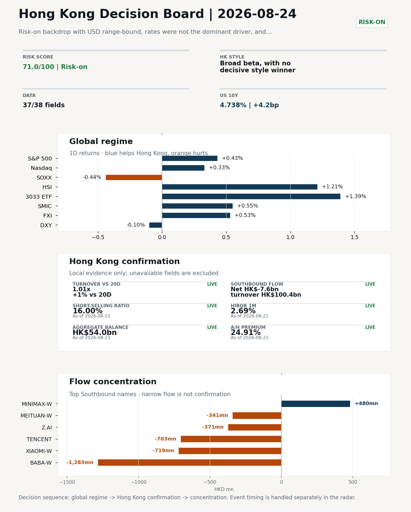
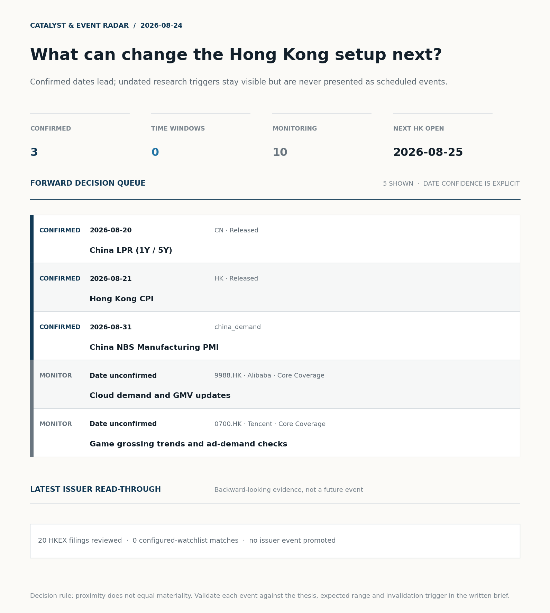
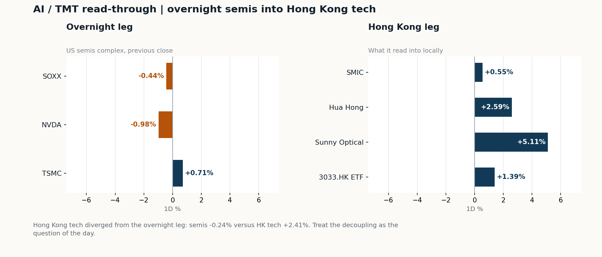
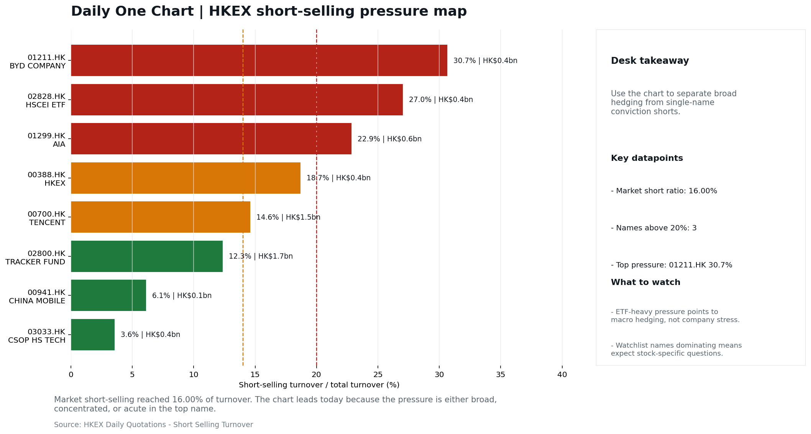
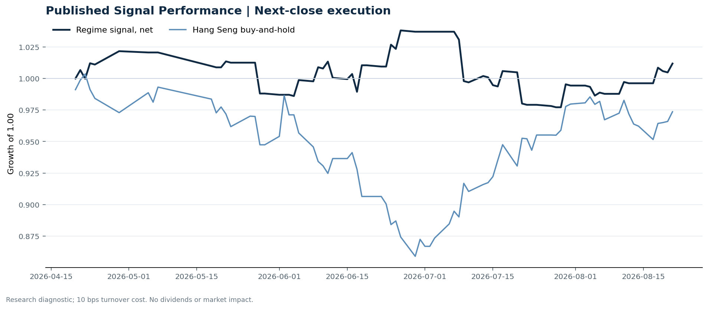

# Morning Research Workbench | 2026-08-24

> **Commute reading route:** `Layer 1 scan (5 min)` → `Layer 2 deep read` → `Layer 3 and appendix if time allows`
>
> Mode: `Week Ahead` | Use Friday's close as the baseline, lay out the week's calendar, and name the key things to watch.

_Data through: US/global `2026-08-21` | HK `2026-08-21` | A-share `2026-08-21` | Generated `2026-08-24 13:13:43`_

## Executive Summary

- **Did yesterday's call work?** UNRESOLVED - No comparable next close is available yet, so the call is still open.
- **What changed overnight?** Semis led lower: SOXX -0.44%, NVDA -0.98%, TSMC +0.71%. HSI +1.21% and 3033.HK +1.39%.
- **What it means for AI/TMT** No decisive style winner - Broad beta, with no decisive style winner, a 0.38pp spread. Hong Kong tech diverged from the overnight leg: semis -0.24% versus HK tech +2.41%. Treat the decoupling as the question of the day.
- **What to watch today** Watch whether SMIC and Hua Hong trade with HSCEI rather than with the overnight semis leg.

## Visual Dashboard

**Catalyst & Event Radar**

**Chart read:** 3 dated event(s) lead the queue; 10 undated trigger(s) remain explicitly in monitoring.

_Source: Public calendars, issuer disclosures and configured research watchlists_
## Layer 1 | Reset (5 min)

### 1.1 Last Session's Call
**Verdict: UNRESOLVED.** No comparable next close is available yet, so the call is still open.

**Recent record.** 5 confirmed / 5 broken over the last 10 scoreable calls (50.0% hit rate). This is a directional close-to-close diagnostic, not a track record.

### 1.2 Global Asset Price Dashboard
_Decision-useful subset: each row states the implication and the next test. Descriptive secondary monitors are kept out of the five-minute scan._

| Signal | Last / move | Interpretation | Confirmation / invalidation |
| --- | --- | --- | --- |
| S&P 500 | 7,674.37 / +0.43% | Broad US risk rose as volatility drained out of the tape, which sets the external floor Hong Kong opens against. Falling volatility confirms lower near-term stress. | Watch whether Nasdaq and offshore-China proxies move the same way. |
| Nasdaq 100 | 29,308.86 / +0.33% | Growth tracked broad beta, so the move looks market-wide rather than duration-led. Growth advanced despite higher yields, showing momentum resilience but also higher reversal sensitivity. | 3033.HK versus HSI leadership carries the read; rising yields would undo it. |
| Hang Seng Index | 26,009.46 / +1.21% | Broad beta rose with no single driver visible in today's fields. | Southbound participation decides whether this is investable or just a print. |
| Hang Seng TECH ETF (3033.HK) | 4.6700 / +1.39% | Hong Kong growth led broad beta, improving the platform/internet style signal. | Needs a stable CNH and Southbound buying to become a duration signal. |
| Semiconductors (SOXX) | 520.05 / -0.44% | Semis underperformed the Nasdaq by 0.77pp, so this is a cycle move rather than broad growth weakness. | SMIC and Hua Hong at the open show whether it transmits to Hong Kong. |
| SMIC (0981.HK) | 72.50 / +0.55% | The local expression of the overnight semis move; compare it with SOXX to separate the global cycle from single-name news. | A move far larger than SOXX points to company-specific news, not the cycle. |
| US 10Y | 4.7380% / +4.2bp | The yield proxy rose, tightening the discount-rate backdrop for long-duration Hong Kong growth. | Read it through 3033.HK relative performance, not the index level. |
| China 10Y | 1.68% / +0.1bp | Higher local yields may indicate firmer growth or tighter financial conditions; price action alone cannot distinguish them. | Use CSI 300, copper and official credit/activity data to separate growth optimism from demand weakness. |
| DXY | 98.80 / -0.10% | A softer dollar eases an external-liquidity headwind for Hong Kong risk assets. | Only meaningful if USD/CNH moves the same way; divergence cancels it. |
| USD/CNH | 6.7115 / -0.07% | A stronger offshore renminbi supports the external-risk backdrop for Hong Kong equities. | FXI and Southbound flow decide whether this reaches Hong Kong equities. |
| VIX | 15.13 / **-5.50%** | Lower implied volatility reduces near-term stress, but is supportive only if equity breadth confirms. | Falling volatility on narrowing breadth is a warning, not support. |

_Secondary monitors retained in the source bundle: CSI 300, CN-US 10Y spread, USD/HKD, Brent crude, COMEX gold, Copper._

### 1.3 Hong Kong Baseline Quick Check (Friday Close)

| Check | Value | Status | Source / as of | Why it matters |
| --- | --- | --- | --- | --- |
| Main Board turnover vs 20D | 1.01x \| +1% vs 20D | Live local | HKEX \| 2026-08-21 | Trailing 20-session average turnover was HK$254.8bn. |
| Southbound / Northbound net flow | Southbound Net HK$-7.6bn \| turnover HK$100.4bn \| Northbound Turnover RMB268.1bn \| net not reported | Live local | HKEX Connect \| 2026-08-21 | Southbound net buy is calculated from HKEX disclosed buy and sell turnover. |
| Short-selling ratio | 16.00% | Live local | HKEX \| 2026-08-21 | Official HKEX stock-level short-selling table, aggregated as a share of total market turnover. |
| AH premium index | 24.91% | Live public | Yahoo \| 2026-08-21 | Fixed 10-name basket, equal-weighted, both legs priced on the same date; comparable across dates. Covered-pair average was +31.26% across 17 pairs. |
| USD/HKD spot vs band | 7.8435 \| band 7.7500 to 7.8500 | Live quote + local | Yahoo \| 2026-08-21 | 65 pips from the weak-side CU (7.8500); monitor HKMA operations and the aggregate balance for a funding squeeze. Official Convertibility Undertakings define the linked-rate stress boundaries for USD/HKD. |
| HIBOR 1M | 2.69% | Live local | HKMA \| 2026-08-21 | 1M HIBOR is the cleanest quick read for Hong Kong funding conditions and equity-duration pressure. |
| Hong Kong leadership | Broad beta, with no decisive style winner | Proxy | HSI / HSCEI / 3033.HK ETF relative \| 2026-08-21 | Use HSI / HSCEI / 3033.HK ETF relative moves as the opening style read. |

### 1.4 Decision Board
**Composite risk score:** `71.0/100` | **Regime:** `Risk-on`

| Component | Score impact | Evidence |
| --- | --- | --- |
| US beta | +2.6 | S&P 500 +0.43% |
| HK growth ETF proxy | +6.9 | 3033.HK ETF +1.39% |
| Semis complex | -2.2 | SOXX -0.44% |
| Offshore China proxy | +2.7 | FXI +0.53% |
| Dollar pressure | +1.0 | DXY -0.10% |
| Volatility | +10 | VIX -5.50% |
| HK short-selling | +0 | Short-selling ratio 16.00% |
| HK turnover | +0 | Turnover 1.01x 20D |

_Base 50 plus the component deltas above. Semis complex entered the score on 2026-08-22; earlier scores in the ledger exclude it._

**This Week Checklist**

1. **[A] Alibaba plunges after announcing $10.2 billion share placement to fund AI push**
 News / announcements | Capital allocation or shareholder-return events can trigger a valuation reset
2. **Risk-on backdrop with USD range-bound, rates were not the dominant driver, and 3033.HK outperformed FXI**
 Still-moving markets | No fresh Hong Kong cash session is assumed; use global active assets and policy/event flow to prepare the next open.
3. **China LPR (1Y / 5Y) (Released)**
 Macro / policy | Watch whether it changes the day's core market narrative | Industries: Market-wide
4. **[A] Chinese Builder Logan Wins Court Approval for Debt Restructuring**
 News / announcements | Policy and regulation can reshape the Property and Construction industry logic

## Layer 2 | Deep Read (20-30 min)

### 2.1 Weekend Digest and Global Baseline
> Week-ahead mode: use Friday's close as the baseline, lay out the week's calendar, and name the key things to watch rather than replaying stale cash-market tape.

**Market Setup**
**Core tape.** Overseas risk assets closed Friday mostly firmer - S&P 500 +0.43%, Nasdaq 100 +0.33%, Euro Stoxx 50 +0.63% - in a risk-on tape where USD was range-bound and rates were not the dominant driver.
**Main driver.** The AI/semiconductor complex was mixed, with SOXX -0.44% and NVDA -0.98% against TSMC +0.71%, leaving Nvidia's upcoming earnings as the key event.
**HK relevance.** Weekend corporate-action headlines dominate China flow: Alibaba's $10.2bn placement and YMTC fundraising create supply/dilution overhang, while Logan's court-approved restructuring is a developer-specific positive.

**Key Drivers**
- US and European equities advanced in a risk-on backdrop.
- AI/semis diverged: SOXX -0.44% and NVDA -0.98% versus TSMC +0.71%, with Nvidia's Wednesday earnings seen as a short-term reset for AI supply-chain valuations.
- Alibaba announced a $10.2bn share placement to fund AI; combined with YMTC fundraising, this creates China tech dilution/supply overhang.
- Logan's Hong Kong court approval for debt restructuring offers a concrete positive precedent for China property credit workouts.

**Hong Kong Read-Through**
**Opening implication.** Hong Kong is closed until 25 August; Friday's tape - HSI +1.21%, HSCEI +1.01%, 3033.HK +1.39%, FXI +0.53% - is reference-only. For the reopen, the US/Europe risk-on tone is supportive.
_Hong Kong style leadership and flow confirmation are set out in the Hong Kong review below._

**Watch Points**
- USD composite moved lower by -0.03pct intraday, with a 0.214pct range.
- Main turning points appeared around 2026-08-21 08:05 peak / 2026-08-21 08:45 peak / 2026-08-21 09:30 trough, suggesting event-driven repricing rather than a clean one-way USD move.
- The biggest cross-asset divergence was 3033.HK versus FXI, a spread of 1.342pct.
- Gold moved +1.87pct intraday with a 2.224pct high-low range.

**Week Ahead Map**
- Week ahead (2026-08-24 to 2026-08-28) opens against a `Risk-on` backdrop, using Friday's close (2026-08-21) as the baseline.

**This Week's Calendar**

| Day | Dated catalysts |
| --- | --- |
| 2026-08-24 Mon | No dated catalyst |
| 2026-08-25 Tue | No dated catalyst |
| 2026-08-26 Wed | No dated catalyst |
| 2026-08-27 Thu | No dated catalyst |
| 2026-08-28 Fri | No dated catalyst |

**Base Case / Risk Case**
- **Base case:** Risk-on continuation: leadership stays with growth / platform names and the 3033.HK ETF proxy, supported by flows.
- **Risk case:** A hawkish macro surprise or a sharp USD/CNH leg higher unwinds the risk-on bias and rotates into defensives.

**What to Watch This Week**
- Open versus Friday's close (2026-08-21): whether the gap holds or fades is the first signal of the week.
- Southbound flow: confirm the index move with local money rather than offshore beta.
- HSI vs 3033.HK ETF leadership: growth-led or value-led decides the week's style.
- USD/CNH and USD/HKD: FX stability is the precondition for a clean risk-on extension.
- Turnover vs 20-day: thin participation makes any index move easier to fade.
- First dated catalyst: 2026-08-31 | China NBS Manufacturing PMI - the cleanest early test of the base case.

**Weekend Digest**

| Channel | Signal | Why |
| --- | --- | --- |
| Weekend news | Alibaba plunges after announcing $10.2 billion share placement to fund | Capital allocation or shareholder-return events can trigger a valuation reset |
| Weekend news | Chinese Builder Logan Wins Court Approval for Debt Restructuring | Policy and regulation can reshape the Property and Construction industry logic |
| Weekend news | Nvidia is the beating heart of the AI boom and the stock market - which | This can directly reshape earnings forecasts and the valuation framework |
| Vol | VIX -5.50% | Lower volatility signals easing stress in the tape. |
| Crypto | Bitcoin +7.26% | A strong crypto tape reinforces the risk-on read. |
| Commodities | Copper +1.85% | Keep tracking it to confirm whether the core daily narrative is holding. |
| Commodities | Gold +2.39% | A firm gold price suggests hedge demand or lower real yields. |

**Monday Morning Questions**
- Which single dated catalyst this week is most likely to change the base case?
- Does Southbound flow confirm or contradict the overnight cross-asset tone?
- Is the week likely to be beta-led or driven by a narrow style pocket?
- What data point would invalidate the base case by mid-week?

**Curated overnight stories**
1. **Alibaba plunges after announcing $10.2 billion share placement to fund AI push**
 Why it matters: A $10.2bn placement creates dilution and supply overhang for the largest China Internet name, and reframes AI investment as increasingly equity-funded.
 HK read-through: Direct gap risk for Alibaba HK and HSTECH; pressure likely extends to China Internet leaders and AI-capex names at the next open.
2. **Chinese Builder Logan Wins Court Approval for Debt Restructuring**
 Why it matters: Hong Kong court approval provides a concrete restructuring precedent for a defaulted Chinese developer, a positive signal for China property credit workout credibility.
 HK read-through: Supports distressed China property and credit-sensitive Hong Kong/offshore names; treat as medium-term positive but likely developer-specific.
3. **Nvidia is the beating heart of the AI boom and the stock market - which sets up a big test**
 Why it matters: Nvidia's Wednesday earnings is a short-term catalyst that can reset AI earnings and valuation assumptions across global and Asian supply chains.
 HK read-through: Key for Hong Kong/A-share semiconductor and AI hardware names; risk tone into the report may dominate tech trading at the next open.
4. **Alibaba, YMTC Fundraising Hits China Tech Stocks on Supply Woes**
 Why it matters: Combines Alibaba's placement with YMTC fundraising to show supply/dilution concerns spreading across the China tech complex.
 HK read-through: Broadens the China tech supply overhang beyond Alibaba; monitor whether selling pressure propagates through internet and semiconductor value chains.
5. **China LPR (1Y / 5Y) (Released)**
 Why it matters: Policy rate signal for property mortgages and corporate credit; actual rate detail was not supplied in the event feed.
 HK read-through: If the 5Y LPR moved, it would directly affect China property and credit-sensitive Hong Kong/offshore China positioning; otherwise treat as event watch.

### 2.2 Hong Kong / A-share Last Close Baseline
**Local Tape Setup**
**Local read.** Hong Kong and A-share follow-through should be judged through style leadership, not index direction alone.
**Verification point.** Friday's reference tape is risk-on and growth-tilted: 3033.HK +1.39% versus HSCEI +1.01% and FXI +0.53%, while SOXX -0.44% and NVDA -0.98% leave AI/semis leadership mixed.
**Risk to watch.** For the 25 August reopen, the live catalysts are Alibaba's $10.2bn placement/dilution overhang and Nvidia's earnings, so the setup is selective growth rather than broad beta.

**Style and Local Leadership**
**Style call.** Broad beta, with no decisive style winner.
- **Evidence:** 3033.HK and HSCEI were separated by only 0.38pp (+1.39% versus +1.01%)
- **Portfolio meaning:** Avoid forcing a growth-versus-value call; let volume, Southbound concentration, and the first-hour relative tape identify leadership.
- **Cross-market read:** Hang Seng +1.21% / HSCEI +1.01% / 3033.HK ETF +1.39%. Offshore China proxy FXI +0.53% and USD/CNH -0.07% frame cross-border risk appetite. USD/HKD last traded around 7.8435, which keeps the Hong Kong funding lens in focus.

**Flow Confirmation**
Official Stock Connect evidence is available; the Flow Tracker confirms whether local money supports the price action.

**Follow-Through Checklist**
**Follow-through check.** At the 25 August open, watch whether 3033.HK outperforms HSCEI with Main Board turnover near or above 1.0x the 20-session average and Southbound net selling does not deepen. If Alibaba-related supply drags HSTECH lower, treat the tape as placement-driven and wait for Nvidia earnings before adding growth beta.
**Failure condition.** Reclassify the tape when either 3033.HK or HSCEI opens a sustained 0.5pp relative lead with flow confirmation.

### 2.3 AI / TMT Read-Through

**Overnight leg.** The overnight semis leg was flat (-0.24% average), so it does not set the direction for Hong Kong tech today.
**Hong Kong expression.** Let local flow and style leadership drive the tech read rather than the overnight tape.
**Observable test.** Watch whether SMIC and Hua Hong trade with HSCEI rather than with the overnight semis leg.

| Name | Role in the chain | 1D | Leg |
| --- | --- | --- | --- |
| SOXX | Semis complex | -0.44% | overnight |
| NVDA | AI capex narrative | -0.98% | overnight |
| TSMC | Foundry demand | +0.71% | overnight |
| SMIC | Leading-edge / domestic substitution | +0.55% | Hong Kong |
| Hua Hong | Mature-node pricing cycle | +2.59% | Hong Kong |
| Sunny Optical | Hardware and optics supply chain | +5.11% | Hong Kong |
| 3033.HK ETF | Broad HK tech beta | +1.39% | Hong Kong |

**Read with care.** Hong Kong tech diverged from the overnight leg: semis -0.24% versus HK tech +2.41%. Treat the decoupling as the question of the day.

### 2.4 Flow Tracker and Attribution
**Cross-Asset Attribution**

- Cross-asset attribution did not surface a dominant driver set for this run.

**Local Flow Tracker**

**Flow Takeaways**
- Local flow evidence is not yet strong enough to override the cross-asset setup.
- Stock Connect Southbound: net HK$-7.6bn on turnover HK$100.4bn (as of 2026-08-21).
- Stock Connect Northbound: turnover RMB268.1bn; public file provides total turnover/top active names, not full net-buy.
- AH premium: fixed 10-name basket +24.91% (comparable across dates); covered-pair average +31.26% over 17 pairs; widest premium: China Communications Construction 86.78%.

**Stock Connect Southbound Active Names**

| # | Ticker | Name | Buy | Sell | Net buy | HKEX turnover rank |
| --- | --- | --- | --- | --- | --- | --- |
| 1 | 09988.HK | BABA-W | HK$3,220.5mn | HK$4,503.9mn | HK$-1,283.5mn | 1 |
| 2 | 01810.HK | XIAOMI-W | HK$968.3mn | HK$1,687.0mn | HK$-718.7mn | 7 |
| 3 | 00700.HK | TENCENT | HK$1,445.4mn | HK$2,148.5mn | HK$-703.0mn | 4 |
| 4 | 00100.HK | MINIMAX-W | HK$2,265.2mn | HK$1,785.2mn | HK$480.0mn | 4 |
| 5 | 02513.HK | Z.AI | HK$3,519.4mn | HK$3,890.8mn | HK$-371.5mn | 1 |

**AH Premium Dispersion**

| Name | A ticker | H ticker | Premium | As of |
| --- | --- | --- | --- | --- |
| China Communications Construction | 601800.SS | 1800.HK | +86.78% | 2026-08-21 |
| China Railway Construction | 601186.SS | 1186.HK | +56.06% | 2026-08-21 |
| China Life | 601628.SS | 2628.HK | +53.95% | 2026-08-21 |
| China Railway | 601390.SS | 0390.HK | +48.63% | 2026-08-21 |
| Sinopec | 600028.SS | 0386.HK | +35.06% | 2026-08-21 |

**HKEX Short-Selling Watch**

| Ticker | Name | Short ratio | Short turnover | Total turnover |
| --- | --- | --- | --- | --- |
| 00388.HK | HKEX | 18.69% | HK$0.4bn | HK$2.2bn |
| 00700.HK | TENCENT | 14.60% | HK$1.5bn | HK$10.1bn |
| 00941.HK | CHINA MOBILE | 6.12% | HK$0.1bn | HK$1.4bn |
| 01211.HK | BYD COMPANY | 30.66% | HK$0.4bn | HK$1.3bn |
| 01299.HK | AIA | 22.85% | HK$0.6bn | HK$2.8bn |

- **Short-value leaders:** 09988.HK BABA-W (HK$4.5bn); 07709.HK XL2CSOPHYNIX (HK$2.1bn); 02800.HK TRACKER FUND (HK$1.7bn); 09992.HK POP MART (HK$1.7bn).

### 2.5 Macro and Policy Tracking
**Desk read.** The supplied macro calendar contains no upcoming scheduled events; the only policy/data items are China LPR and Hong Kong CPI, both released and broadly inline.

**Market sensitivity.** They are therefore reference, not fresh catalysts.

**HK implication.** The still-moving signals are risk-on - VIX lower, Bitcoin and copper higher - while NVDA's modest decline is a direct watch for HK tech into 2026-08-25.

**Macro watchpoints**
- Whether the lower VIX / stronger Bitcoin and copper tape carries into the next Hong Kong open.
- NVDA follow-through as a direct read-through to HK tech and 3033.HK/FXI relative performance.
- Any shift in the USD range-bound backdrop or rate repricing that could alter risk appetite.
- Any fresh policy, regulatory, or geopolitical signal; no event watch is supplied.

| Time | Region | Event | Status | Desk read |
| --- | --- | --- | --- | --- |
| | CN | China LPR (1Y / 5Y) | Released | Impact: Watch whether it changes the day's core market narrative \| Attention: 5/5 \| Industries: Market-wide |
| | HK | Hong Kong CPI | Released | Impact: Local funding conditions, retail purchasing power, and HKD real rates \| Attention: 1/5 \| Industries: Property, Retail, Banks |

**Positioning and Risk Backdrop**

- Detailed local flow evidence is covered under Flow Tracker and Attribution; keep this section focused on options, hedging, and macro-positioning risk.

### 2.6 Company Catalysts and Risk Monitor

| Grade | Sector | Headline | Why it matters | Horizon |
| --- | --- | --- | --- | --- |
| A | China Internet | Alibaba plunges after announcing $10.2 billion share placement to | Capital allocation or shareholder-return events can trigger a valuation | Medium-term trend |
| A | Property and Construction | Chinese Builder Logan Wins Court Approval for Debt Restructuring | Policy and regulation can reshape the Property and Construction industry | Medium-term trend |
| A | Semiconductors and AI | Nvidia is the beating heart of the AI boom and the stock market - | This can directly reshape earnings forecasts and the valuation framework | Short-term catalyst |
| B | China Internet | Alibaba, YMTC Fundraising Hits China Tech Stocks on Supply Woes | Assess whether the story can propagate through the China Internet value | Monitor |
| B | China Internet | Stocks making the biggest moves premarket | Assess whether the story can propagate through the China Internet value | Monitor |

**Company Event Takeaway**
**Desk read.** Friday's HK/China cash tape is reference-only; next HK cash session is 25 Aug.
**Why it matters.** The main company events are: Alibaba's $10.2bn share placement to fund AI, a China Internet supply/capital-allocation event.
**Follow-up.** Eight HKEX profit warnings were headline-only, with no magnitude parsed, so no EPS impact should be inferred yet.

**LLM Quick Takes**
- **9988.HK** | Fact: $10.2bn share placement to fund AI; Friday reference last price 111.0, -9.76%. Investor read
- **0700.HK** | Fact: Friday reference tape fell 3.76% to 439.8. Investor read: treated as China Internet peer beta
- **3033.HK** | Fact: market theme states 3033.HK outperformed FXI despite a -3.73% Friday reference close. Investor read

Decision filter<h4>No immediate portfolio catalyst: 20 official filings were screened and the low-signal market set stays aggregated.</h4>
20 profit warnings

<strong>20</strong>Official filings

<strong>0</strong>Watchlist hits

<strong>0</strong>Actionable events

<strong>No event cleared the portfolio decision filter.</strong>

Broad-market filings remain traceable in the source appendix; they are not expanded here without a watchlist, estimate or liquidity read-through.

<strong>Coverage boundary.</strong> Earnings calendar, sell-side rating changes, IPO / grey-market monitor were not decision-grade in this run; their absence is not treated as confirmation that no event exists.

### 2.7 Questions to Expect This Morning
**Q1. The index rose but Southbound sold - is the move real?**
- **Evidence:** HSI +1.21% against Southbound net -7.6bn HKD.
- **How to answer:** Treat it as unconfirmed. Price and mainland flow disagreed, so the rose was not driven by Southbound participation; it needs another session of confirmation before being read as a trend.

**Q2. Did the overnight semis move explain Hong Kong tech?**
- **Evidence:** Hong Kong tech diverged from the overnight leg: semis -0.24% versus HK tech +2.41%. Treat the decoupling as the question of the day.
- **How to answer:** Not on its own. Same direction is not the same as explained, so check single-name news, placements and index events before attributing the move to the global cycle.

### 2.8 Core Names This Week
**Core coverage**

| Name | Ticker | Last | 1D | Range position | Morning note |
| --- | --- | --- | --- | --- | --- |
| Alibaba | 9988.HK | 111.00 | -9.76% | Mid-range | Down 9.76% on the session, mid-range at 52% of its 60-session band. |
| Tencent | 0700.HK | 439.80 | -3.76% | Mid-range | Down 3.76% on the session, mid-range at 35% of its 60-session band. |

**Recent headlines for Alibaba:**
- [Alibaba to Raise $10.20 Billion for AI Investment With Share Placement](https://www.wsj.com/tech/alibaba-to-bulk-up-ai-investment-via-10-20-billion-share-placement-72b9bdac?siteid=yhoof2&yptr=yahoo) (The Wall Street Journal)

**Priority follow-up**

| Name | Ticker | Last | 1D | Range position | Morning note |
| --- | --- | --- | --- | --- | --- |
| BYD Company | 1211.HK | 91.90 | -1.34% | Top of range | Marginally lower (-1.34%), in the top quartile of its 60-session range (82%). |
| AIA | 1299.HK | 74.70 | -0.60% | Mid-range | Marginally lower (-0.60%), mid-range at 37% of its 60-session band. |

**Recent headlines for BYD Company:**
- [Is BYD (SEHK:1211) Fully Priced After Its EV Export Lead?](https://finance.yahoo.com/markets/stocks/articles/byd-sehk-1211-fully-priced-091152063.html) (Simply Wall St.)

## Layer 3 | Decision Deepening (10-15 min)

### 3.1 Rotating Theme Deep Dive

| Field | Read |
| --- | --- |
| Theme | AI and Compute Chain |
| Angle for the day | Track whether global AI capex, semis, cloud, and server demand are still carrying offshore China internet and hardware sentiment. |

**Theme desk read**
**Core thesis.** The week-ahead AI and compute chain view still turns on whether global AI capex, semis, cloud, and server demand can keep carrying offshore China internet and hardware sentiment.
**Evidence.** Friday's Hong Kong tape is reference only: Alibaba closed down 9.76% to HK$111.0 and Tencent down 3.76% to HK$439.8, so these are last-available cash levels rather than a fresh session move.
**What to test.** The more current signals are a lower VIX (-5.50%) and stronger Bitcoin (+7.26%), which support the risk-on backdrop, while Nvidia's earnings due Wednesday remain the key valuation test for the AI complex.

**Signals to keep in mind**
- Alibaba plunges after announcing $10.2 billion share placement to fund AI push
- Nvidia is the beating heart of the AI boom and the stock market - which sets up a big test
- VIX -5.50%: Lower volatility signals easing stress in the tape.
- Bitcoin +7.26%: A strong crypto tape reinforces the risk-on read.

**LLM watch items:**
- Nvidia earnings and forward commentary due Wednesday as the week's main AI demand and valuation check.
- Alibaba placement pricing, dilution overhang, and any read-through to Tencent and broader China internet supply concerns.
- Whether 9988.HK stabilizes after Friday's -9.76% reference close and whether 0700.HK follows the supply narrative at the next open.
- VIX and Bitcoin as risk-regime checks; if risk-on fades, treat any HK tech bounce with lower conviction.

**Related names to keep close:**

| Name | Ticker | Bucket | Morning read |
| --- | --- | --- | --- |
| Alibaba | 9988.HK | Core coverage | Down 9.76% on the session, mid-range at 52% of its 60-session band. |
| Tencent | 0700.HK | Core coverage | Down 3.76% on the session, mid-range at 35% of its 60-session band. |
| AIA | 1299.HK | Priority follow-up | Marginally lower (-0.60%), mid-range at 37% of its 60-session band. |

**Relevant headlines:**
- [Alibaba plunges after announcing $10.2 billion share placement to fund AI push](https://www.cnbc.com/2026/08/24/alibaba-share-placement-drop-ai-hong-kong.html)
- [Nvidia is the beating heart of the AI boom and the stock market - which sets up a big test](https://www.marketwatch.com/story/nvidia-is-the-beating-heart-of-the-ai-boom-and-the-stock-market-which-sets-up-a-big-test-bed36f98?mod=mw_rss_topstories)
- [Alibaba, YMTC Fundraising Hits China Tech Stocks on Supply Woes](https://www.bloomberg.com/news/articles/2026-08-24/alibaba-ymtc-fundraising-hits-china-tech-stocks-on-supply-woes)

### 3.2 This Week Calendar and Trading Setup
- Non-trading review: use today's calendar to prepare the next Hong Kong open rather than treating the last cash tape as a fresh signal.

**Same-day macro docket**
No same-day macro items were scheduled.

**Next few sessions**

| Date | Category | Event | Impact |
| --- | --- | --- | --- |
| 2026-08-31 | china_demand | China NBS Manufacturing PMI | Watch whether it changes risk budgets or the theme-trading cadence |

### 3.3 Daily One Chart
**Daily One Chart | HKEX short-selling pressure map**

**Chart read.** Market short-selling reached 16.00% of turnover.
**Why it matters.** The chart leads today because the pressure is either broad, concentrated, or acute in the top name.

_Source: HKEX Daily Quotations - Short Selling Turnover_

## Optional Appendix | Traceability and Performance (10-15 min)

### Report Metadata
> Date policy: Review date 2026-08-23 is treated as `Week Ahead`. | Global (US/Europe) data date is 2026-08-21; adapter effective date is 2026-08-21 and summary date is 2026-08-21. | Hong Kong local data date is 2026-08-21; role: last completed HK/China cash-market reference tape.
> Market data quality: Coverage: `37/38` | Fallbacks used: `2` | Missing: `1`
> Report quality: `95.6/100` | Grade `A` | Status `production ready`

### Key Questions to Keep in Mind
- Is risk appetite rising or fading? The overnight tape reads closer to `Risk-On`.
- Did rates expectations move? Focus on whether US 10Y, DXY, and growth style moved together.
- Were commodities the real story? Watch WTI and gold for geopolitics versus inflation signals.
- Is Hong Kong setup growth-led, SOE-led, or broad beta-led? Compare the 3033.HK ETF proxy, HSCEI, and HSI.
- Did offshore markets move China risk appetite? Focus on HSI, FXI, USD/CNH, and USD/HKD.

### Report Quality and Validation
- **Quality score:** 95.6/100 | **Grade:** A | **Status:** production ready
- **Run summary:** 8 healthy | 2 caveat | 0 failed
- **Release recommendation:** Send with caveats | The report is usable, but the advisory guidance should travel with it so readers understand the data gaps.

| Source | Status | Bucket |
| --- | --- | --- |
| Macro calendar | partial | caveat |
| Risk and sentiment feed | partial | caveat |

**Narrative fact-check guardrail**
- Checked 21 numeric claims; 0 numeric mismatch(es), 0 logic warning(s); 3 structured claims, 0 source/text warning(s); 0 critical, 0 review.

_Full component weights, per-source freshness, adapter status and provenance records are archived with this report under `audit/` rather than printed here._

### Historical Signal Performance
- **Readiness:** exploratory with caveats | 79 observations | 85 active signal dates | next-close entry, 10bps cost, no same-day returns.
- **Interpretation boundary:** exploratory until a benchmark reaches 252 sessions and 100 active-signal sessions.

| Benchmark | Sessions | Signal net | Buy & hold | Excess | Max drawdown | Hit rate |
| --- | --- | --- | --- | --- | --- | --- |
| Hang Seng Index | 78 | 1.2% | -2.6% | 3.8% | -5.9% | 51.4% |
| Hang Seng TECH ETF (3033.HK) | 78 | 0.7% | -7.9% | 8.6% | -8.2% | 51.4% |

- **Next-session diagnostic:** 55.3% hit rate over 38 resolved signals; 5- and 20-session horizons are in `audit/performance_summary.json`.

- **Data-quality caveat:** 23 conflicting historical price revision(s) and 6 weekend pseudo-session observation(s) were handled explicitly; inspect the ledger before relying on the result.
- **Use boundary:** this is a close-to-close research diagnostic, not an executable strategy or investment recommendation; dividends, financing, borrow and market impact are excluded.

### Source Links
- [Alibaba plunges after announcing $10.2 billion share placement to fund AI push](https://www.cnbc.com/2026/08/24/alibaba-share-placement-drop-ai-hong-kong.html) (cnbc_markets)
- [Chinese Builder Logan Wins Court Approval for Debt Restructuring](https://www.bloomberg.com/news/articles/2026-08-24/chinese-builder-logan-wins-court-approval-for-debt-restructuring) (bloomberg_markets)
- [Nvidia is the beating heart of the AI boom and the stock market - which sets up a big test](https://www.marketwatch.com/story/nvidia-is-the-beating-heart-of-the-ai-boom-and-the-stock-market-which-sets-up-a-big-test-bed36f98?mod=mw_rss_topstories) (wsj_markets)
- [Alibaba, YMTC Fundraising Hits China Tech Stocks on Supply Woes](https://www.bloomberg.com/news/articles/2026-08-24/alibaba-ymtc-fundraising-hits-china-tech-stocks-on-supply-woes) (bloomberg_markets)
- [Stocks making the biggest moves premarket: Walmart, Coinbase, Moderna, Alibaba & more](https://www.cnbc.com/2026/08/20/stocks-making-the-biggest-moves-premarket-.html) (cnbc_markets)
- [Alibaba to Raise $10.20 Billion for AI Investment With Share Placement](https://www.wsj.com/tech/alibaba-to-bulk-up-ai-investment-via-10-20-billion-share-placement-72b9bdac?siteid=yhoof2&yptr=yahoo) (The Wall Street Journal)
- [Is BYD (SEHK:1211) Fully Priced After Its EV Export Lead?](https://finance.yahoo.com/markets/stocks/articles/byd-sehk-1211-fully-priced-091152063.html) (Simply Wall St.)
- [00095.HK Profit warning / alert announcement](http://www1.hkexnews.hk/listedco/listconews/sehk/2026/0821/2026082100648.pdf) (HKEXnews)
- [00115.HK Profit warning / alert announcement](http://www1.hkexnews.hk/listedco/listconews/sehk/2026/0821/2026082102263.pdf) (HKEXnews)
- [00180.HK Profit warning / alert announcement](http://www1.hkexnews.hk/listedco/listconews/sehk/2026/0821/2026082100480.pdf) (HKEXnews)
- [00265.HK Profit warning / alert announcement](http://www1.hkexnews.hk/listedco/listconews/sehk/2026/0821/2026082101697.pdf) (HKEXnews)
- [00412.HK Profit warning / alert announcement](http://www1.hkexnews.hk/listedco/listconews/sehk/2026/0821/2026082101317.pdf) (HKEXnews)
- [00413.HK Profit warning / alert announcement](http://www1.hkexnews.hk/listedco/listconews/sehk/2026/0821/2026082100366.pdf) (HKEXnews)
- [00605.HK Profit warning / alert announcement](http://www1.hkexnews.hk/listedco/listconews/sehk/2026/0821/2026082101775.pdf) (HKEXnews)
- [00661.HK Profit warning / alert announcement](http://www1.hkexnews.hk/listedco/listconews/sehk/2026/0821/2026082101981.pdf) (HKEXnews)

## Supplementary Visual Appendix

This appendix is professional-path only. It keeps a traceable index of the report visuals and the deterministic chart cues used to frame the morning note, without injecting the legacy intraday chart pack.

### Visual Index

| Visual | Path | Role |
| --- | --- | --- |
| Visual Dashboard | `charts/dashboard_2026-08-24.png` | Cross-asset regime board and Hong Kong local tape snapshot. |
| Catalyst & Event Radar | `charts/catalyst_radar_2026-08-24.png` | Confirmed dates, time windows, undated monitors, and recent issuer read-through. |
| Daily One Chart | `charts/daily_one_chart_2026-08-24.png` | Single highest-conviction visual story for the day. |

### Deterministic Chart Cues
- FX / liquidity: USD composite moved lower by -0.03pct intraday, with a 0.214pct range.
- FX / liquidity: Main turning points appeared around 2026-08-21 08:05 peak / 2026-08-21 08:45 peak / 2026-08-21 09:30 trough, suggesting event-driven repricing rather than a clean one-way USD move.
- Cross-asset: The biggest cross-asset divergence was 3033.HK versus FXI, a spread of 1.342pct.
- Cross-asset: Gold moved +1.87pct intraday with a 2.224pct high-low range.
- Cross-asset: Oil moved +0.74pct intraday with a 1.724pct high-low range.
- Cross-asset: Bitcoin moved +7.16pct intraday with a 8.388pct high-low range.
