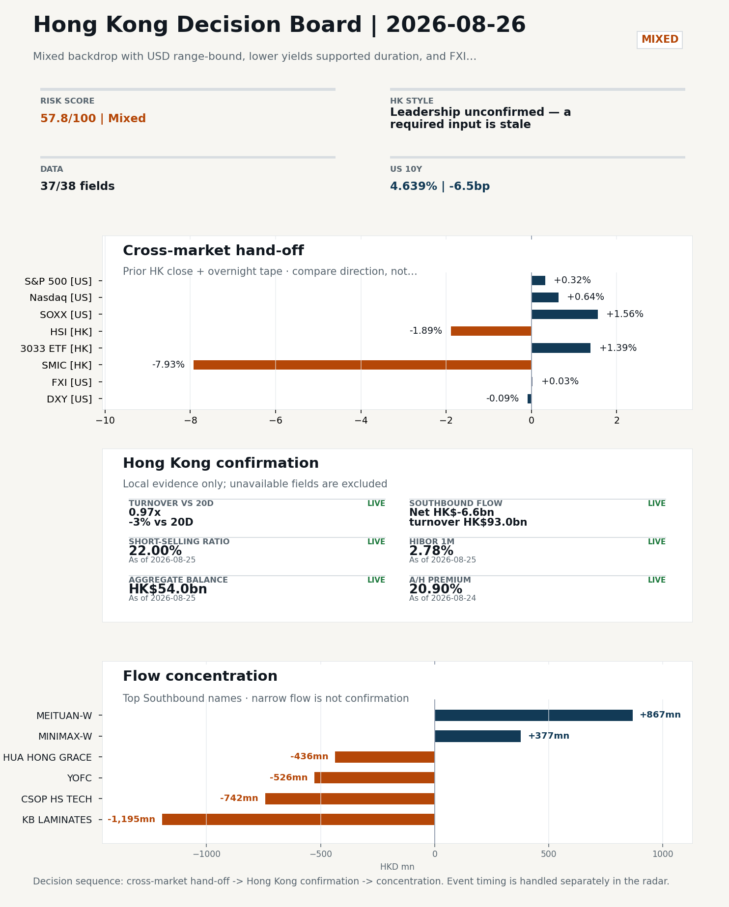
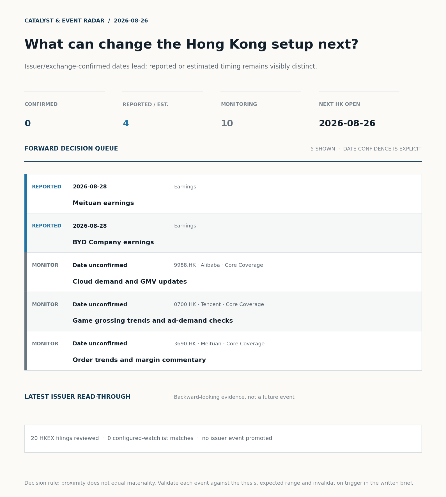
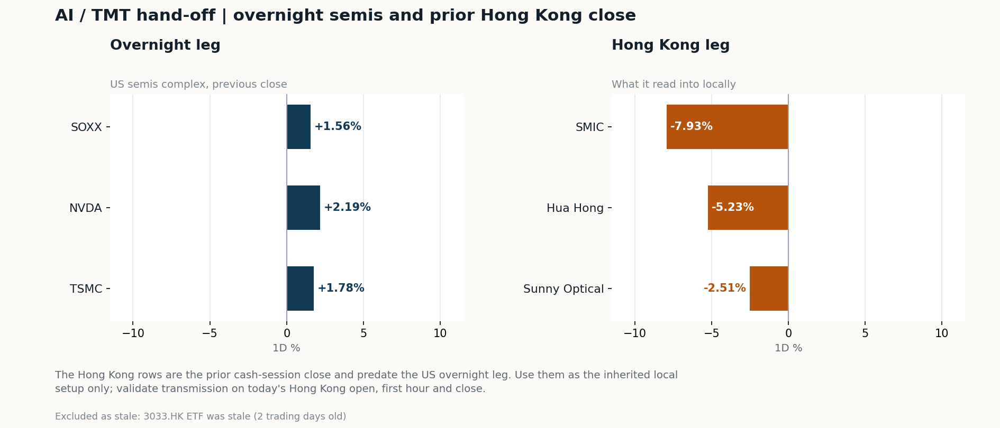
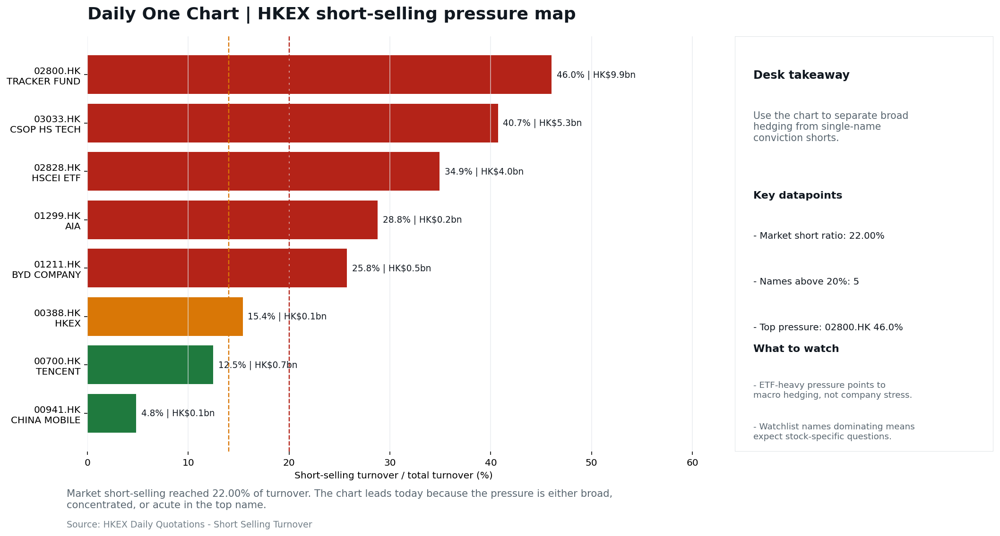

# Morning Research Workbench | 2026-08-26

> **Commute reading route:** `Layer 1 scan (5 min)` → `Layer 2 deep read` → `Layer 3 and appendix if time allows`
>
> Mode: `Trading Daily` | Keep the report execution-oriented: what mattered in the completed session, what can move Hong Kong leadership, and what needs fast follow-up.

_Data through: US/global `2026-08-25` | HK `2026-08-25` | A-share `2026-08-25` | Generated `2026-08-26 05:44:52`_

## Executive Summary

- **Did yesterday's call work?** UNRESOLVED - No comparable next close is available yet, so the call is still open.
- **What changed overnight?** Semis led higher: SOXX +1.56%, NVDA +2.19%, TSMC +1.78%.
- **What it means for AI/TMT** Style call withheld: 3033.HK ETF was stale (2 trading days old); 3033.HK ETF / HSCEI comparison blocked: effective dates differ (2026-08-21 vs 2026-08-24). The stale input is excluded from the risk score.
- **What to watch today** Next scheduled catalyst: China NBS Manufacturing PMI on 2026-08-31. Confirm if SMIC and Hua Hong open in the same direction as the overnight leg and hold it through the first hour; invalidate if they track HSCEI instead.

## Layer 1 | Scan (5 min)

### 1.1 Yesterday's Call
**Verdict: UNRESOLVED.** No comparable next close is available yet, so the call is still open.

**Recent record.** 6 confirmed / 4 broken over the last 10 scoreable calls (60.0% hit rate). This is a directional close-to-close diagnostic, not a track record.

### 1.2 Opening Decision Board

**Global-to-Hong Kong signals**

_Decision-useful subset: each row states the implication and the next test. Descriptive secondary monitors are kept out of the five-minute scan._

| Signal | Last / move | Interpretation | Confirmation / invalidation |
| --- | --- | --- | --- |
| S&P 500 | 7,677.28 / +0.32% | Broad US risk rose as volatility drained out of the tape, which sets the external floor Hong Kong opens against. Falling volatility confirms lower near-term stress. | Watch whether Nasdaq and offshore-China proxies move the same way. |
| Nasdaq 100 | 29,209.23 / +0.64% | Growth outperformed broad beta, a supportive style signal for Hong Kong internet and platform names. | 3033.HK versus HSI leadership carries the read; rising yields would undo it. |
| Hang Seng Index | 25,517.33 / **-1.89%** | The index was carried by growth and platform names, not by broad participation: 3033.HK differs by 3.28pp. | Southbound participation decides whether this is investable or just a print. |
| Hang Seng TECH ETF (3033.HK) | 4.6700 / +1.39% | Hong Kong growth led broad beta, improving the platform/internet style signal. | Needs a stable CNH and Southbound buying to become a duration signal. |
| Semiconductors (SOXX) | 514.06 / **+1.56%** | Semis led the Nasdaq by 0.92pp, putting the AI capex trade back in front. | SMIC and Hua Hong at the open show whether it transmits to Hong Kong. |
| US 10Y | 4.6390% / -6.5bp | The yield proxy fell, easing the valuation headwind for duration-sensitive equities. | Read it through 3033.HK relative performance, not the index level. |
| USD/CNH | 6.7075 / -0.09% | A stronger offshore renminbi supports the external-risk backdrop for Hong Kong equities. | FXI and Southbound flow decide whether this reaches Hong Kong equities. |
| VIX | 15.45 / **-2.52%** | Lower implied volatility reduces near-term stress, but is supportive only if equity breadth confirms. | Falling volatility on narrowing breadth is a warning, not support. |

_Secondary monitors retained in the source bundle: SMIC (0981.HK), CSI 300, China 10Y, CN-US 10Y spread, DXY, USD/HKD, Brent crude, COMEX gold, Copper._

**Hong Kong local confirmation**

| Check | Value | Status | Source / as of | Why it matters |
| --- | --- | --- | --- | --- |
| Main Board turnover vs 20D | 0.97x \| -3% vs 20D | Live local | HKEX \| 2026-08-25 | Trailing 20-session average turnover was HK$261.2bn. |
| Southbound / Northbound net flow | Southbound Net HK$-6.6bn \| turnover HK$93.0bn \| Northbound Turnover RMB267.4bn \| net not reported | Live local | HKEX Connect \| 2026-08-25 | Southbound net buy is calculated from HKEX disclosed buy and sell turnover. |
| Short-selling ratio | 22.00% | Live local | HKEX \| 2026-08-25 | Official HKEX stock-level short-selling table, aggregated as a share of total market turnover. |
| AH premium index | 20.90% | Live public | Yahoo \| 2026-08-24 | Fixed 10-name basket, equal-weighted, both legs priced on the same date; comparable across dates. Covered-pair average was +31.34% across 18 pairs. |
| USD/HKD spot vs band | 7.8374 \| band 7.7500 to 7.8500 | Live quote + local | Yahoo \| 2026-08-25 | Mid-band: 126 pips from the weak side and 874 pips from the strong side, so the peg is not an active constraint. Official Convertibility Undertakings define the linked-rate stress boundaries for USD/HKD. |
| HIBOR 1M | 2.78% | Live local | HKMA \| 2026-08-25 | 1M HIBOR is the cleanest quick read for Hong Kong funding conditions and equity-duration pressure. |
| Hong Kong leadership | Leadership unconfirmed - a required input is stale | Proxy | HSI / HSCEI / 3033.HK ETF relative \| 2026-08-25 | Use HSI / HSCEI / 3033.HK ETF relative moves as the opening style read. |

**Risk state and evidence**

**Composite risk score:** `57.8/100` | **Regime:** `Mixed`

| Component | Score impact | Evidence |
| --- | --- | --- |
| US beta | +1.9 | S&P 500 +0.32% |
| Semis complex | +7.8 | SOXX +1.56% |
| Offshore China proxy | +0.1 | FXI +0.03% |
| Dollar pressure | +0.9 | DXY -0.09% |
| Volatility | +5.0 | VIX -2.52% |
| HK short-selling | -8 | Short-selling ratio 22.00% |
| HK turnover | +0 | Turnover 0.97x 20D |
| Excluded (stale) | +0.0 | Not scored: 3033.HK ETF (stale 2d) |

_Base 50 plus the component deltas above. Semis complex entered the score on 2026-08-22; earlier scores in the ledger exclude it._

**Morning Checklist**

1. **[A] Alibaba plunges after announcing $10.2 billion share placement to fund AI push**
 News / announcements | Capital allocation or shareholder-return events can trigger a valuation reset
2. **Mixed backdrop with USD range-bound, lower yields supported duration, and FXI outperformed Nasdaq 100**
 Overnight regime | Start by deciding whether the day is about Mixed conditions or a style pivot.
3. **China NBS Manufacturing PMI (Upcoming)**
 Macro / policy | Growth direction, cyclicals, and manufacturing-chain pricing | Industries: Machinery, Building materials, Industrials
4. **Meituan earnings**
 Catalysts | Estimate comparison unavailable

## Visual Dashboard

**Catalyst & Event Radar**

**Chart read:** No issuer/exchange-confirmed event date is populated; 4 reported or estimated timing item(s) and 10 undated trigger(s) remain explicit.

_Source: Public calendars, issuer disclosures and configured research watchlists_
## Layer 2 | Core Research (20-30 min)

### 2.1 Global-to-Hong Kong Transmission
**Market Setup**
**Core tape.** Overnight US closed with a modest risk-on tilt: S&P 500 +0.32%, Nasdaq 100 +0.64%, and Euro Stoxx 50 +0.12%, while the largest cross-asset divergence was FXI outperforming Nasdaq 100 by 0.836ppt.
**Main driver.** The move was driven by lower US 10Y yields (-6.5bp) and a sharp oil drawdown (WTI -4.59%), not by a USD squeeze (DXY -0.09%, range-bound).
**HK relevance.** Prior-HK context is weak: HSI and HSCEI both fell 1.89% on 24 Aug, and 3033.HK is stale (2d), so today's open must be sized against a still-bearish local tape with very high short-selling (22.0%, 94th percentile) and -HK$6.6bn Southbound flow.

**Key Drivers**
- US 10Y yield -6.5bp supported duration-sensitive growth and internet names; Nasdaq 100 outperformed S&P 500.
- Semis cycle leadership held: SOXX +1.56%, TSM +1.78%, NVDA +2.19%, framing a constructive AI/semis tape into the HK open.
- VIX -2.52% signalled lower stress, consistent with the supportive rates/oil mix despite the FXI-Nasdaq 100 dispersion.

**Hong Kong Read-Through**
**Opening implication.** A constructive open for the 26 Aug HK session is possible but not high-conviction: the supportive US/yields/oil cocktail and semis leadership favour a relief bid in HK tech and duration-sensitive names.
_Hong Kong style leadership and flow confirmation are set out in the Hong Kong review below._

**Watch Points**
- USD composite moved higher by +0.01pct intraday, with a 0.156pct range.
- Main turning points appeared around 2026-08-25 08:10 trough / 2026-08-25 08:35 trough / 2026-08-25 09:00 peak, suggesting event-driven repricing rather than a clean one-way USD move.
- The biggest cross-asset divergence was FXI versus Nasdaq 100, a spread of 0.836pct.
- Gold moved +0.54pct intraday with a 1.36pct high-low range.

**Curated overnight stories**
1. **Alibaba plunges after announcing $10.2 billion share placement to fund AI push**
 Why it matters: A multi-billion-dollar equity raise tied explicitly to AI capex raises dilution and capital-allocation questions for a China Internet anchor.
 HK read-through: Direct read across to BABA ADR, Alibaba Hong Kong listing, and close China Internet peers (Tencent, Meituan, JD, Baidu).
2. ****
 Why it matters: A softer USD/rates backdrop combined with FXI outperforming Nasdaq 100 reframes the relative-attraction setup for Hong Kong and offshore China versus US tech ahead of the 26…
 HK read-through: Supports Hong Kong duration-sensitive sectors (REITs, utilities, insurers) and improves the tape for offshore China versus US mega-cap tech.
3. **China NBS Manufacturing PMI due (upcoming release)**
 Why it matters: First-tier China growth print. Direction versus consensus sets the cyclical/industrial pricing tone into the session.
 HK read-through: Map first to Hong Kong machinery, building materials, and industrials. Stronger print would also temper the China Internet bearish read by stabilising the broader China tape.
4. **Meituan earnings (scheduled)**
 Why it matters: Consumer-internet earnings event with direct read-across to China Internet sentiment already pressured by Alibaba's placement.
 HK read-through: Direct impact on Meituan; commentary on local services competition and margins will colour the China Internet complex alongside the Alibaba overhang.
5. **BYD Company earnings (scheduled)**
 Why it matters: EV/auto-sector earnings catalyst relevant to Hong Kong's new-economy and auto supply chains; estimate comparison is not available in the supplied facts.
 HK read-through: Direct read on BYD and auto-parts/NEV supply chain in Hong Kong; tone on demand/pricing feeds the cyclicals leg of the tape.

**AI / TMT hand-off**

**Overnight leg.** The overnight semis leg was risk-on at +1.84% average (SOXX +1.56%, NVDA +2.19%, TSMC +1.78%).
**Hong Kong expression.** SMIC, Hua Hong and Sunny Optical are best placed at the open, and 3033.HK should be tested before the Hang Seng Index.
**Observable test.** Confirm if SMIC and Hua Hong open in the same direction as the overnight leg and hold it through the first hour; invalidate if they track HSCEI instead, which would mean local flow is overriding the global cycle.

| Name | Role in the chain | 1D | Leg |
| --- | --- | --- | --- |
| SOXX | Semis complex | +1.56% | overnight |
| NVDA | AI capex narrative | +2.19% | overnight |
| TSMC | Foundry demand | +1.78% | overnight |
| SMIC | Leading-edge / domestic substitution | -7.93% | Hong Kong |
| Hua Hong | Mature-node pricing cycle | -5.23% | Hong Kong |
| Sunny Optical | Hardware and optics supply chain | -2.51% | Hong Kong |
| 3033.HK ETF | Broad HK tech beta | stale 2d | Hong Kong |

**Clock discipline.** The Hong Kong rows are the prior cash-session close and predate the US overnight leg. Use them as the inherited local setup only; validate transmission on today's Hong Kong open, first hour and close.
**Coverage caveat.** 3033.HK ETF was stale (2 trading days old). Those names are excluded from the averages above.

### 2.2 Hong Kong Local Tape and Flow
**Local Tape Setup**
**Local read.** Hong Kong opens into a mixed but constructive US tape (S&P 500 +0.32%, Nasdaq 100 +0.64%) with rates/oil supportive (US 10Y -6.5bp, oil -4.59%) yet FXI only +0.03%, signalling the cross-market read-through to China large-cap is muted.
**Verification point.** Local context remains bearish: HSI and HSCEI both fell 1.89% on 24 Aug, turnover is 0.97x the 20-day average, and the 22.00% short-selling ratio sits at the 94th percentile with 22.00% of HK$55.7bn short turnover concentrated in HS TECH-related ETFs (03067.HK 79.60%, 03032.HK 72.32%).
**Risk to watch.** Southbound was a net HK$-6.6bn seller on HK$93.0bn turnover with selling skew in HK growth names (03033.HK CSOP HS Tech -742.5m; 00981.HK SMIC -315m combined; 01347.HK Hua Hong -436m).

**Style and Local Leadership**
**Style call.** Leadership unconfirmed - a required input is stale.
- **Evidence:** No same-date 3033.HK-versus-HSCEI comparison was possible because 3033.HK ETF was stale (2 trading days old); 3033.HK ETF / HSCEI comparison blocked: effective dates differ (2026-08-21 vs 2026-08-24)
- **Portfolio meaning:** Do not infer Hong Kong style from the headline index alone; wait for relative price and local-flow evidence.
- **Cross-market read:** Hang Seng -1.89% / HSCEI -1.89% / 3033.HK ETF stale 2d. Offshore China proxy FXI +0.03% and USD/CNH -0.09% frame cross-border risk appetite. USD/HKD last traded around 7.8374, which keeps the Hong Kong funding lens in focus.

**Flow Confirmation**
Official Stock Connect evidence is available; the Flow Tracker confirms whether local money supports the price action.

**Follow-Through Checklist**
**Follow-through check.** Confirm at the 26 Aug open: (1) refreshed 3033.HK outperforming HSCEI in the first 30 minutes.
**Failure condition.** Any style claim remains invalid while the required relative-performance fields are missing or stale.

**Cross-asset attribution**

| Driver | Direction | Score | Evidence | HK implication |
| --- | --- | --- | --- | --- |
| Oil and geopolitics | supportive | 5.48 | Oil moved -6.85%. | Split the read between energy/cyclicals support and margin/geopolitical pressure. |
| Short-selling pressure | drag | 4.9 | HKEX short-selling ratio was 22.00%. | Elevated short activity argues for extra confirmation before chasing rebounds. |
| Rates impulse | supportive | 0.97 | US 10Y yield moved -6.5bp. | Lower yields help long-duration growth; higher yields pressure valuation-sensitive |

**Local flow evidence**

**Flow Takeaways**
- Short-selling pressure is elevated, so local rebounds need cleaner breadth and flow confirmation.
- Stock Connect Southbound: net HK$-6.6bn on turnover HK$93.0bn (as of 2026-08-25).
- Stock Connect Northbound: turnover RMB267.4bn; public file provides total turnover/top active names, not full net-buy.
- AH premium: fixed 10-name basket +20.90% (comparable across dates); covered-pair average +31.34% over 18 pairs; widest premium: China Communications Construction 87.87%.

**Stock Connect Southbound Active Names**

| # | Ticker | Name | Buy | Sell | Net buy | HKEX turnover rank |
| --- | --- | --- | --- | --- | --- | --- |
| 1 | 01888.HK | KB LAMINATES | HK$1,329.2mn | HK$2,523.9mn | HK$-1,194.8mn | 2 |
| 2 | 03690.HK | MEITUAN-W | HK$1,820.3mn | HK$953.1mn | HK$867.2mn | 2 |
| 3 | 03033.HK | CSOP HS TECH | HK$227.8mn | HK$970.3mn | HK$-742.5mn | 6 |
| 4 | 06869.HK | YOFC | HK$3,304.8mn | HK$3,830.8mn | HK$-526.0mn | 1 |
| 5 | 01347.HK | HUA HONG GRACE | HK$310.7mn | HK$746.9mn | HK$-436.2mn | 9 |

**AH Premium Dispersion**

| Name | A ticker | H ticker | Premium | As of |
| --- | --- | --- | --- | --- |
| China Communications Construction | 601800.SS | 1800.HK | +87.87% | 2026-08-24 |
| Everbright Bank | 601818.SS | 6818.HK | +69.18% | 2026-08-24 |
| China Railway Construction | 601186.SS | 1186.HK | +56.81% | 2026-08-24 |

**HKEX Short-Selling Watch**

| Ticker | Name | Short ratio | Short turnover | Total turnover |
| --- | --- | --- | --- | --- |
| 00388.HK | HKEX | 15.41% | HK$0.1bn | HK$0.8bn |
| 00700.HK | TENCENT | 12.47% | HK$0.7bn | HK$5.7bn |
| 00941.HK | CHINA MOBILE | 4.83% | HK$0.1bn | HK$1.6bn |

- **Short-value leaders:** 02800.HK TRACKER FUND (HK$9.9bn); 03033.HK CSOP HS TECH (HK$5.3bn); 09988.HK BABA-W (HK$4.3bn); 02828.HK HSCEI ETF (HK$4.0bn).

### 2.3 Macro Transmission
**Desk read.** Today's Hong Kong session opens against a mixed global tape: NVDA (+2.19%), TSMC ADR (+1.78%) and SOXX (+1.56%) all firmed, which historically transmits into HK tech and semis.

**Market sensitivity.** The supplied theme flags a range-bound USD with lower US yields supporting duration and FXI outperforming NDX, a combination that, if it holds into the Asia close, is constructive for HK rate-sensitive and yield proxies but ambiguous for energy and materials.

**HK implication.** The macro calendar for the target HK session (2026-08-26) is empty in the supplied data; the only scheduled mainland release of consequence is the China NBS Manufacturing PMI on 2026-08-31 (impact score 85, attention 5).

**Macro watchpoints**
- Whether NVDA, TSMC ADR and SOXX momentum is preserved at the Asia open, as that is the primary conduit into HK tech and semis leadership today.

| Time | Region | Event | Status | Desk read |
| --- | --- | --- | --- | --- |
| | CN | China NBS Manufacturing PMI | Upcoming | Impact: Growth direction, cyclicals, and manufacturing-chain pricing \| Attention: 5/5 \| Industries: Machinery, Building materials, Industrials |

**Positioning and risk backdrop**

- Detailed local flow evidence is covered under Flow Tracker and Attribution; keep this section focused on options, hedging, and macro-positioning risk.

### 2.4 Company Micro Research and Catalysts

| Grade | Sector | Headline | Why it matters | Horizon |
| --- | --- | --- | --- | --- |
| A | China Internet | Alibaba plunges after announcing $10.2 billion share placement to | Capital allocation or shareholder-return events can trigger a valuation | Medium-term trend |
| B | China Internet | Stocks making the biggest moves premarket | Assess whether the story can propagate through the China Internet value | Monitor |

**Company Event Takeaway**
**Desk read.** The only estimate-changing event from the completed session is Alibaba's (9988.HK) priced $10.2bn share placement to fund AI capex.
**Why it matters.** No ratings changes were supplied, so any thesis reset is execution-driven.
**Follow-up.** Earnings calendar is front-loaded: Meituan (3690.HK) and BYD (1211.HK) both report on 2026-08-28, two sessions away, with consensus comparison unavailable in the feed so model recalibration is the priority.

**LLM Quick Takes**
- **9988.HK** | Fact: priced $10.2bn share placement to fund AI investments; closed -8.54% at HKD 112.5, mid-range at 56% of 60-session band. Read…
- **0700.HK** | Fact: closed -3.72% at HKD 440.0, mid-range at 35% of 60-session band; next earnings 2026-11-12, comparison unavailable. Read…
- **3690.HK** | Fact: reports 2026-08-28, two HK sessions away, priority High, estimate comparison unavailable. Read: this is the next earnings catalyst for the watchlist; no read-through yet.…
- **1211.HK** | Fact: reports 2026-08-28 alongside Meituan, priority High, estimate comparison unavailable. Read: same-day cluster with Meituan raises HK tech/consumer beta risk. Next check…

Decision filter<h4>No watchlist filing hit; 2 market events cleared the decision filter.</h4>
20 profit warnings

<strong>20</strong>Official filings

<strong>0</strong>Watchlist hits

<strong>2</strong>Actionable events

<article class="event-card priority-high">

HighEarnings<time>2026-08-28</time>

<h5>Meituan · 3690.HK</h5>

Estimate comparison unavailable

Investor read
Calendar monitor only; no consensus comparison is available, so this is not yet an earnings view.

Next check
Prepare the KPI and valuation bridge before the release window.

<a class="event-source" href="https://finance.yahoo.com/quote/3690.HK">Yahoo Finance ticker calendar ↗</a>
</article>
<article class="event-card priority-high">

HighEarnings<time>2026-08-28</time>

<h5>BYD Company · 1211.HK</h5>

Estimate comparison unavailable

Investor read
Calendar monitor only; no consensus comparison is available, so this is not yet an earnings view.

Next check
Prepare the KPI and valuation bridge before the release window.

<a class="event-source" href="https://finance.yahoo.com/quote/1211.HK">Yahoo Finance ticker calendar ↗</a>
</article>

<strong>Coverage boundary.</strong> sell-side rating changes, IPO / grey-market monitor were not decision-grade in this run; their absence is not treated as confirmation that no event exists.

**Core coverage requiring follow-up**

**Core coverage**

| Name | Ticker | Last | 1D | Range position | Morning note |
| --- | --- | --- | --- | --- | --- |
| Alibaba | 9988.HK | 112.50 | -8.54% | Mid-range | Down 8.54% on the session, mid-range at 56% of its 60-session band. |
| Tencent | 0700.HK | 440.00 | -3.72% | Mid-range | Down 3.72% on the session, mid-range at 35% of its 60-session band. |

**Recent headlines for Alibaba:**
- [Alibaba makes another bold move after $10.2 billion AI funding deal](https://www.thestreet.com/investing/stocks/baba-alibaba-tsai-wu-buy-15-million-shares-after-10-billion-ai-funding-deal-burry-exit) (TheStreet)
**Recent headlines for Tencent:**
- [What Is Tencent Holdings (SEHK:700) Looking For In Humanoid Robotics?](https://finance.yahoo.com/technology/ai/articles/tencent-holdings-sehk-700-looking-070514779.html) (Simply Wall St.)

**Priority follow-up**

| Name | Ticker | Last | 1D | Range position | Morning note |
| --- | --- | --- | --- | --- | --- |
| AIA | 1299.HK | 74.60 | -0.73% | Mid-range | Marginally lower (-0.73%), mid-range at 36% of its 60-session band. |
| China Mobile | 0941.HK | 79.45 | -0.54% | Mid-range | Marginally lower (-0.54%), mid-range at 72% of its 60-session band. |

### 2.5 Morning Meeting Questions
**Q1. Why is there no style call today?**
- **Evidence:** 3033.HK ETF was stale (2 trading days old); 3033.HK ETF / HSCEI comparison blocked: effective dates differ (2026-08-21 vs 2026-08-24).
- **How to answer:** A required input was stale, so any relative-performance claim would have compared two different dates. The call is withheld rather than published on partial evidence, and the stale input is excluded from the risk score.

**Q2. Short selling was very high at 22.0% - who is positioned against this market?**
- **Evidence:** Short-selling ratio 22.0% (94th pct of the last 60 sessions, very high).
- **How to answer:** Check the concentration before reading it as bearish: ETF-heavy short turnover is macro hedging, while single-name pressure is company-specific. The HKEX short-selling table in this report separates the two.

## Layer 3 | Session Playbook (8-12 min)

### 3.1 Base Case and Scenario Map
**Starting posture.** Leadership unconfirmed - a required input is stale (unconfirmed); composite risk `57.8/100` (Mixed). Do not infer Hong Kong style from the headline index alone; wait for relative price and local-flow evidence.

**Scenario map**

| Scenario | Observable trigger | Interpretation | Research response |
| --- | --- | --- | --- |
| Selective growth confirms | First refresh 3033.HK and HSCEI on the same session and basis; then require a >0.5pp first-hour 3033.HK lead, stable CNH and firmer semis. | The style thesis becomes measurable only after the comparison is aligned. | Keep internet/platform leadership on watch; do not upgrade it from the stale comparison alone. |
| Broad beta confirms | HSI and HSCEI rise together with improving breadth and normal first-hour turnover. | A broad market move is observable even while the style spread remains unavailable. | Research financials, SOEs and index-heavy names alongside growth leaders. |
| Risk-off continuation | HSI and HSCEI weaken, semis lag and CNH depreciation accelerates. | Local risk appetite is deteriorating without a reliable style offset. | Treat rebounds as unconfirmed; focus on balance-sheet, catalyst and crowding risk. |

**Clocked validation scorecard**

| Window | Check | Prior evidence | Pass condition | What it decides |
| --- | --- | --- | --- | --- |
| 09:30-10:30 | 3033.HK vs HSCEI | Same-session style spread unavailable | Refresh both legs on one session/basis; only then test for a >0.5pp lead | Whether growth leadership survives the open |
| 09:30-10:30 | Semiconductor hand-off | SMIC -7.93%; Hua Hong Semiconductor -5.23% | Stabilise after the open; at least one stops underperforming HSCEI | Whether overnight semis pressure is contained locally |
| 09:30-10:30 | HSI price zone | 25,517 vs 25,500 / 26,000 reference grid | Hold above the lower grid or reclaim the upper grid with breadth | Whether broad beta is stabilising; grid is derived, not technical analysis |
| 09:30-10:30 | USD/CNH | 6.7075 \| -0.09% | No acceleration in CNH depreciation | Whether FX permits a clean Hong Kong risk extension |
| At close | Turnover | 0.97x \| -3% vs 20D | At least 1.0x the 20-session average | Whether the move had normal participation |
| At close | Southbound | Net HK$-6.6bn \| turnover HK$93.0bn | Net buying remains positive and broadens beyond one or two names | Whether mainland money confirms the price move |
| At close | Short pressure | 22.00% | Falls versus the prior verified reading (22.00%) | Whether rebound conviction improved |

**Upgrade rule.** Confirm only after HSI, HSCEI, 3033.HK, turnover, and Southbound evidence refresh on a comparable date.
**Kill switch.** Any style claim remains invalid while the required relative-performance fields are missing or stale.
**Clock discipline.** At 07:30, same-day Southbound, turnover and short-selling outcomes are not known. Use the first-hour price/FX checks provisionally and make the final classification only after the close.
**Event clock.** No same-day decision-grade item is populated; the nearest reported/estimated item is Meituan earnings on 2026-08-28. Verify the issuer or official calendar before relying on the date.

### 3.2 Daily One Chart
**Daily One Chart | HKEX short-selling pressure map**

**Chart read.** Market short-selling reached 22.00% of turnover.
**Why it matters.** The chart leads today because the pressure is either broad, concentrated, or acute in the top name.

_Source: HKEX Daily Quotations - Short Selling Turnover_

## Optional Appendix | Traceability and Performance (10-15 min)

### Report Metadata
> Date policy: Review date 2026-08-25 is treated as `Trading Daily`. | Global (US/Europe) data date is 2026-08-25; adapter effective date is 2026-08-25 and summary date is 2026-08-25. | Hong Kong local data date is 2026-08-25; role: same-session local cash tape.
> Market data quality: Coverage: `37/38` | Stale items (>1d): `1` | Missing: `1`
> Report quality: `94.6/100` | Grade `C` | Status `usable with caveats`

### Report Quality and Validation
- **Quality score:** 94.6/100 | **Grade:** C | **Status:** usable with caveats
- **Run summary:** 8 healthy | 2 caveat | 0 failed
- **Release recommendation:** Send with caveats | The report is usable, but the advisory guidance should travel with it so readers understand the data gaps.

| Source | Status | Bucket |
| --- | --- | --- |
| Macro calendar | partial | caveat |
| Risk and sentiment feed | partial | caveat |

**Desk-use guidance summary:** 0 blocking | 1 advisory

**Desk-use guidance**
- **Advisory:** A core instrument quote is stale; the style call is downgraded and the stale leg is excluded from scoring.
- **Advisory:** Questionable narrative fields were removed; use the deterministic fallback copy and review the audit trail.
- **Grade capped:** Stale core instrument(s): Hang Seng TECH ETF (2d)
- **Grade capped:** 1 prose defect(s) detected: 1 sentence_fragment.
- **Grade capped:** Hong Kong style comparison blocked: effective dates differ (2026-08-21 vs 2026-08-24)

**Quality warnings**
- Narrative fact-check guardrail produced warnings; review the validation table before relying on narrative sections.
- Core instrument quotes are stale, so the Hong Kong style call and risk score are degraded: Hang Seng TECH ETF (2d)
- Hong Kong style comparison was withheld because the input dates or bases were not aligned.

**Narrative fact-check guardrail**
- Checked 28 numeric claims; 0 numeric mismatch(es), 0 logic warning(s); 10 structured claims, 0 source/text warning(s); 0 critical, 0 review. Replaced 7 unsafe narrative field(s) with deterministic fallback copy.
- **Deterministic fallback fields:** interview_answer, one_line_market_pulse, selected_news[1].headline, tasks.final_framing.interview_answer, tasks.final_framing.one_line_market_pulse, tasks.news_selection.selected_news[1].headline, tasks.overnight_review.drivers[1]

_Full component weights, per-source freshness, adapter status and provenance records are archived with this report under `audit/` rather than printed here._

### Historical Signal Performance
- **Readiness:** exploratory with caveats | 69 observations | 86 active signal dates | next-close entry, 10bps cost, no same-day returns.
- **Interpretation boundary:** exploratory until a benchmark reaches 252 sessions and 100 active-signal sessions.
- **Data-quality caveat:** 23 conflicting price revision(s) and 6 non-session observation(s) remain in the research ledger.
- **Daily-use boundary:** cumulative return, Sharpe and the performance chart stay out of the daily commute edition until the sample and trading-calendar gates pass; use Yesterday's Call instead.

### Source Links
- [Alibaba plunges after announcing $10.2 billion share placement to fund AI push](https://www.cnbc.com/2026/08/24/alibaba-share-placement-drop-ai-hong-kong.html) (cnbc_markets)
- [Stocks making the biggest moves premarket: Alibaba, Marvell, Sandisk, Coinbase and more](https://www.cnbc.com/2026/08/24/stocks-making-the-biggest-moves-premarket-baba-mrvl-sndk-and-more.html) (cnbc_markets)
- [Stocks making the biggest moves premarket: Walmart, Coinbase, Moderna, Alibaba & more](https://www.cnbc.com/2026/08/20/stocks-making-the-biggest-moves-premarket-.html) (cnbc_markets)
- [Alibaba makes another bold move after $10.2 billion AI funding deal](https://www.thestreet.com/investing/stocks/baba-alibaba-tsai-wu-buy-15-million-shares-after-10-billion-ai-funding-deal-burry-exit) (TheStreet)
- [What Is Tencent Holdings (SEHK:700) Looking For In Humanoid Robotics?](https://finance.yahoo.com/technology/ai/articles/tencent-holdings-sehk-700-looking-070514779.html) (Simply Wall St.)
- [Is BYD (SEHK:1211) Fully Priced After Its EV Export Lead?](https://finance.yahoo.com/markets/stocks/articles/byd-sehk-1211-fully-priced-091152063.html) (Simply Wall St.)
- [00075.HK Profit warning / alert announcement](http://www1.hkexnews.hk/listedco/listconews/sehk/2026/0825/2026082501447.pdf) (HKEXnews)
- [00165.HK Profit warning / alert announcement](http://www1.hkexnews.hk/listedco/listconews/sehk/2026/0825/2026082501809.pdf) (HKEXnews)
- [00205.HK Profit warning / alert announcement](http://www1.hkexnews.hk/listedco/listconews/sehk/2026/0825/2026082502225.pdf) (HKEXnews)
- [00217.HK Profit warning / alert announcement](http://www1.hkexnews.hk/listedco/listconews/sehk/2026/0825/2026082501005.pdf) (HKEXnews)
- [00337.HK Profit warning / alert announcement](http://www1.hkexnews.hk/listedco/listconews/sehk/2026/0825/2026082501841.pdf) (HKEXnews)
- [00348.HK Profit warning / alert announcement](http://www1.hkexnews.hk/listedco/listconews/sehk/2026/0825/2026082500909.pdf) (HKEXnews)
- [00397.HK Profit warning / alert announcement](http://www1.hkexnews.hk/listedco/listconews/sehk/2026/0825/2026082500380.pdf) (HKEXnews)
- [00583.HK Profit warning / alert announcement](http://www1.hkexnews.hk/listedco/listconews/sehk/2026/0825/2026082501643.pdf) (HKEXnews)
