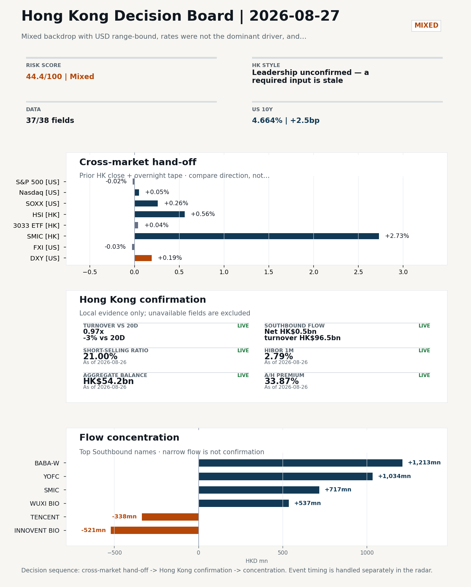
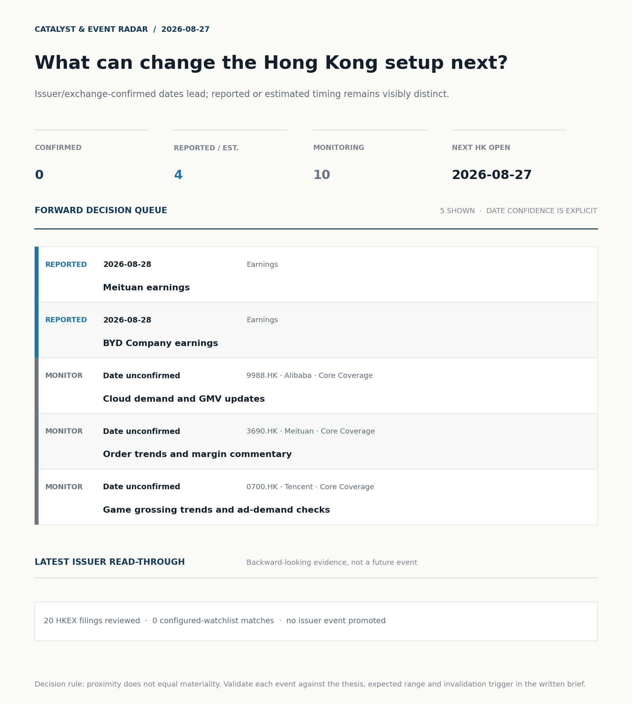
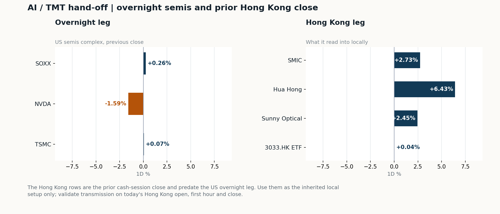
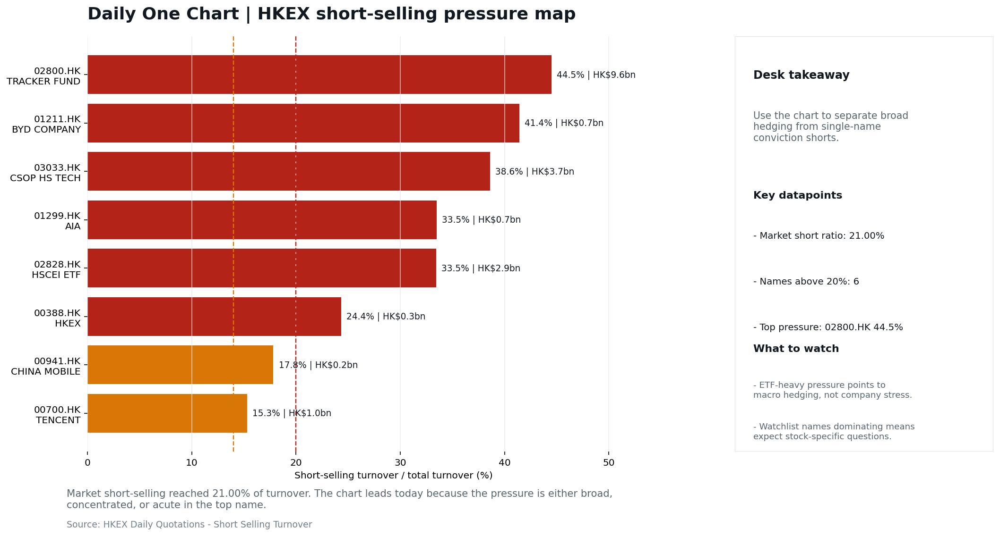

# Morning Research Workbench | 2026-08-27

> **Commute reading route:** `Layer 1 scan (5 min)` → `Layer 2 deep read` → `Layer 3 and appendix if time allows`
>
> Mode: `Trading Daily` | Keep the report execution-oriented: what mattered in the completed session, what can move Hong Kong leadership, and what needs fast follow-up.

_Data through: US/global `2026-08-26` | HK `2026-08-26` | A-share `2026-08-26` | Generated `2026-08-27 08:48:32`_

## Executive Summary

- **Did yesterday's call work?** NO CALL - The 2026-08-26 report published no directional call (neutral regime).
- **What changed overnight?** Semis led lower: SOXX +0.26%, NVDA -1.59%, TSMC +0.07%. HSI +0.56% and 3033.HK +0.04%.
- **What it means for AI/TMT** Style call withheld: 3033.HK ETF / HSCEI comparison blocked: effective dates differ (2026-08-25 vs 2026-08-26). The stale input is excluded from the risk score.
- **What to watch today** Next scheduled catalyst: China NBS Manufacturing PMI on 2026-08-31. Watch whether SMIC and Hua Hong trade with HSCEI rather than with the overnight semis leg.

## Layer 1 | Scan (5 min)

### 1.1 Yesterday's Call
**Verdict: NO CALL.** The 2026-08-26 report published no directional call (neutral regime).

**Recent record.** 6 confirmed / 4 broken over the last 10 scoreable calls (60.0% hit rate). This is a directional close-to-close diagnostic, not a track record.

### 1.2 Opening Decision Board

**Global-to-Hong Kong signals**

_Decision-useful subset: each row states the implication and the next test. Descriptive secondary monitors are kept out of the five-minute scan._

| Signal | Last / move | Interpretation | Confirmation / invalidation |
| --- | --- | --- | --- |
| S&P 500 | 7,675.70 / -0.02% | US beta was flat and offers little directional lead for Hong Kong. | Watch whether Nasdaq and offshore-China proxies move the same way. |
| Nasdaq 100 | 29,224.52 / +0.05% | Growth tracked broad beta, so the move looks market-wide rather than duration-led. | 3033.HK versus HSI leadership carries the read; rising yields would undo it. |
| Hang Seng Index | 25,652.97 / +0.56% | The index was carried by old-economy and H-share names, not by broad participation: 3033.HK differs by 0.52pp. | Southbound participation decides whether this is investable or just a print. |
| Hang Seng TECH ETF (3033.HK) | 4.4980 / +0.04% | Hong Kong growth lagged, so broad-index strength is not yet a duration signal. | Needs a stable CNH and Southbound buying to become a duration signal. |
| Semiconductors (SOXX) | 515.40 / +0.26% | Semis moved with the Nasdaq, so the tape is broad rather than cycle-specific. | SMIC and Hua Hong at the open show whether it transmits to Hong Kong. |
| US 10Y | 4.6640% / +2.5bp | The yield proxy rose, tightening the discount-rate backdrop for long-duration Hong Kong growth. | Read it through 3033.HK relative performance, not the index level. |
| USD/CNH | 6.7140 / +0.07% | A higher USD/CNH means a weaker offshore renminbi, a headwind for offshore-China sentiment. | FXI and Southbound flow decide whether this reaches Hong Kong equities. |
| VIX | 15.21 / **-1.55%** | Lower implied volatility reduces near-term stress, but is supportive only if equity breadth confirms. | Falling volatility on narrowing breadth is a warning, not support. |

_Secondary monitors retained in the source bundle: SMIC (0981.HK), CSI 300, China 10Y, CN-US 10Y spread, DXY, USD/HKD, Brent crude, COMEX gold, Copper._

**Hong Kong local confirmation**

| Check | Value | Status | Source / as of | Why it matters |
| --- | --- | --- | --- | --- |
| Main Board turnover vs 20D | 0.97x \| -3% vs 20D | Live local | HKEX \| 2026-08-26 | Trailing 20-session average turnover was HK$261.4bn. |
| Southbound / Northbound net flow | Southbound Net HK$0.5bn \| turnover HK$96.5bn \| Northbound Turnover RMB255.6bn \| net not reported | Live local | HKEX Connect \| 2026-08-26 | Southbound net buy is calculated from HKEX disclosed buy and sell turnover. |
| Short-selling ratio | 21.00% | Live local | HKEX \| 2026-08-26 | Official HKEX stock-level short-selling table, aggregated as a share of total market turnover. |
| AH premium index | 33.87% | Live public | Yahoo \| 2026-08-26 | Equal-weighted average across 17 A/H pairs that resolved today. Composition varies by day, so the level is not comparable with prior reports (fixed basket incomplete: missing Bank of China). [trimmed] |
| USD/HKD spot vs band | 7.8380 \| band 7.7500 to 7.8500 | Live quote + local | Yahoo \| 2026-08-26 | Mid-band: 120 pips from the weak side and 880 pips from the strong side, so the peg is not an active constraint. Official Convertibility Undertakings define the linked-rate stress boundaries for USD/HKD. |
| HIBOR 1M | 2.79% | Live local | HKMA \| 2026-08-26 | 1M HIBOR is the cleanest quick read for Hong Kong funding conditions and equity-duration pressure. |
| Hong Kong leadership | Leadership unconfirmed - a required input is stale | Proxy | HSI / HSCEI / 3033.HK ETF relative \| 2026-08-26 | Use HSI / HSCEI / 3033.HK ETF relative moves as the opening style read. |

**Risk state and evidence**

**Composite risk score:** `44.4/100` | **Regime:** `Mixed`

| Component | Score impact | Evidence |
| --- | --- | --- |
| US beta | -0.1 | S&P 500 -0.02% |
| HK growth ETF proxy | +0.2 | 3033.HK ETF +0.04% |
| Semis complex | +1.3 | SOXX +0.26% |
| Offshore China proxy | -0.1 | FXI -0.03% |
| Dollar pressure | -1.9 | DXY +0.19% |
| Volatility | +3.1 | VIX -1.55% |
| HK short-selling | -8 | Short-selling ratio 21.00% |
| HK turnover | +0 | Turnover 0.97x 20D |

_Base 50 plus the component deltas above. Semis complex entered the score on 2026-08-22; earlier scores in the ledger exclude it._

**Morning Checklist**

1. **[A] Alibaba plunges after announcing $10.2 billion share placement to fund AI push**
 News / announcements | Capital allocation or shareholder-return events can trigger a valuation reset
2. **Mixed backdrop with USD range-bound, rates were not the dominant driver, and Nasdaq 100 outperformed FXI**
 Overnight regime | Start by deciding whether the day is about Mixed conditions or a style pivot.
3. **China NBS Manufacturing PMI (Upcoming)**
 Macro / policy | Growth direction, cyclicals, and manufacturing-chain pricing | Industries: Machinery, Building materials, Industrials
4. **China Caixin Manufacturing PMI (Upcoming)**
 Macro / policy | Growth direction, cyclicals, and manufacturing-chain pricing | Industries: Machinery, Building materials, Industrials

## Visual Dashboard

**Catalyst & Event Radar**

**Chart read:** No issuer/exchange-confirmed event date is populated; 4 reported or estimated timing item(s) and 10 undated trigger(s) remain explicit.

_Source: Public calendars, issuer disclosures and configured research watchlists_
## Layer 2 | Core Research (20-30 min)

### 2.1 Global-to-Hong Kong Transmission
**Market Setup**
**Core tape.** Overnight US equities were effectively flat with an internal split: S&P 500 -0.02%, Nasdaq 100 +0.05%, while Nasdaq 100 outperformed FXI by 48bp, confirming US tech leadership rather than broad risk-on.
**Main driver.** The US 10Y rose 2.5bp to 4.664% and USD was range-bound with a +0.15% intraday move, so rates and FX were not the dominant driver.
**HK relevance.** The clearest overnight signal for Hong Kong was Alibaba's $10.2bn placement to fund AI, which reset the China Internet narrative and likely steers the HK open tone.

**Key Drivers**
- Alibaba's $10.2bn equity placement to fund AI capex reframes China Internet valuation and AI spending expectations, with direct read-across to 9988.HK and peers (Tencent, Meituan, JD, Baidu).
- NVDA -1.59% on the same day signals AI capex narrative softening at the US anchor.
- HK local tape was already positive into the overnight print (HSI +0.56%, HSCEI +1.05%, prior-HK session) but short-selling ratio at 21.0% (87th percentile) and Southbound only +HK$0.5bn argue against extending the rebound without cleaner breadth.
- Rates and USD were not dominant: US 10Y +2.5bp and USD +0.15% intraday, so the transmission to HK is via sentiment rather than the funding curve.

**Hong Kong Read-Through**
**Opening implication.** For the 27 Aug HK session, the Alibaba placement sets the first-order tone for China Internet and 9988.HK specifically.
_Hong Kong style leadership and flow confirmation are set out in the Hong Kong review below._

**Watch Points**
- USD composite moved higher by +0.15pct intraday, with a 0.214pct range.
- Main turning points appeared around 2026-08-26 08:05 peak / 2026-08-26 08:20 peak / 2026-08-26 08:35 peak, suggesting event-driven repricing rather than a clean one-way USD move.
- The biggest cross-asset divergence was Nasdaq 100 versus FXI, a spread of 0.484pct.
- Gold moved -0.48pct intraday with a 1.285pct high-low range.

**Curated overnight stories**
1. **Alibaba plunges after announcing $10.2 billion share placement to fund AI push**
 Why it matters: A >$10bn equity raise to fund AI capex is a capital-allocation event that can reset near-term valuation multiples and shifts the funding mix from buyback/dividend toward…
 HK read-through: Direct hit to HK-listed Alibaba (9988) and close China Internet peers (Tencent, Meituan, JD, Baidu) via sentiment and positioning.
2. **China needs U.S. dollars but is building a hedge against Washington's sanctions**
 Why it matters: Signals continued workarounds in China's dollar funding and FX-reserves hedging.
 HK read-through: Relevant for offshore-China liquidity conditions, CNH/USD band behaviour at the HK open, and any issuers with USD debt or M&A pipelines.
3. **Prediction market traders doubtful Bessent's bond interventions will push yields lower**
 Why it matters: Indicates skepticism that US Treasury supply pressure will be eased by intervention, keeping the long end of USTs better-anchored-to-richer than hoped and shaping the…
 HK read-through: If UST yields stay sticky, HK utility/REIT yield spreads and the HKD-USD curve framework are the main transmission channels.
4. **China's short-drama producers flood the market with cheap bets - and let audiences pick**
 Why it matters: Highlights a low-cost, interactive content export trend out of mainland China, relevant to platform engagement and ad/inventory monetisation models.
 HK read-through: Selective read-across to HK-listed China Internet platforms with short-video or interactive content exposure; more an industry-shape story than a near-term earnings driver.
5. **China NBS Manufacturing PMI (Upcoming) and China Caixin Manufacturing PMI (Upcoming)**
 Why it matters: The next domestic growth pulse for the onshore and export-oriented manufacturing complex; the NBS-Caixin gap also speaks to SOE vs. private activity mix.
 HK read-through: Primary catalyst for HK cyclicals (machinery, building materials, industrials), mainland-exposed banks, and any China reflation trade into the back half of the week.

**AI / TMT hand-off**

**Overnight leg.** The overnight semis leg was flat (-0.42% average), so it does not set the direction for Hong Kong tech today.
**Hong Kong expression.** Let local flow and style leadership drive the tech read rather than the overnight tape.
**Observable test.** Watch whether SMIC and Hua Hong trade with HSCEI rather than with the overnight semis leg.

| Name | Role in the chain | 1D | Leg |
| --- | --- | --- | --- |
| SOXX | Semis complex | +0.26% | overnight |
| NVDA | AI capex narrative | -1.59% | overnight |
| TSMC | Foundry demand | +0.07% | overnight |
| SMIC | Leading-edge / domestic substitution | +2.73% | Hong Kong |
| Hua Hong | Mature-node pricing cycle | +6.43% | Hong Kong |
| Sunny Optical | Hardware and optics supply chain | +2.45% | Hong Kong |
| 3033.HK ETF | Broad HK tech beta | +0.04% | Hong Kong |

**Clock discipline.** The Hong Kong rows are the prior cash-session close and predate the US overnight leg. Use them as the inherited local setup only; validate transmission on today's Hong Kong open, first hour and close.

### 2.2 Hong Kong Local Tape and Flow
**Local Tape Setup**
**Local read.** Hong Kong opens against a mixed backdrop where the prior session was already positive (HSI +0.56%, HSCEI +1.05%) but the 21.0% short-selling ratio flags fragile breadth.
**Verification point.** The overnight signal is split: Nasdaq 100 outperformed FXI by 48bp, while Alibaba's $10.2bn AI placement reframes the China Internet narrative but NVDA's -1.59% drag tempers the AI capex read.
**Risk to watch.** Southbound net was a thin HK$0.5bn on HK$96.5bn turnover, so the prior cash tape is not a clean flow-led bid.

**Style and Local Leadership**
**Style call.** Leadership unconfirmed - a required input is stale.
- **Evidence:** No same-date 3033.HK-versus-HSCEI comparison was possible because 3033.HK ETF / HSCEI comparison blocked: effective dates differ (2026-08-25 vs 2026-08-26)
- **Portfolio meaning:** Do not infer Hong Kong style from the headline index alone; wait for relative price and local-flow evidence.
- **Cross-market read:** Hang Seng +0.56% / HSCEI +1.05% / 3033.HK ETF +0.04%. Offshore China proxy FXI -0.03% and USD/CNH +0.07% frame cross-border risk appetite. USD/HKD last traded around 7.8380, which keeps the Hong Kong funding lens in focus.

**Flow Confirmation**
Official Stock Connect evidence is available; the Flow Tracker confirms whether local money supports the price action.

**Follow-Through Checklist**
**Follow-through check.** Watch whether 9988.HK opens in sympathy with the Alibaba placement while SMIC and Hua Hong extend, and whether 3033.HK closes the gap to HSCEI on a same-date print - that combination would confirm semis/AI-capex as the leadership bucket rather than just SOE breadth. Confirmation is incomplete if 3033.HK fails to refresh on a comparable date or if Southbound net fails to widen from the HK$0.5bn prior-day print. Northbound net-buy is unavailable in the current HKEX disclosure, so onshore flow confirmation must rely on turnover and AH-premium dispersion rather than headline net.
**Failure condition.** Any style claim remains invalid while the required relative-performance fields are missing or stale.

**Cross-asset attribution**

| Driver | Direction | Score | Evidence | HK implication |
| --- | --- | --- | --- | --- |
| Short-selling pressure | drag | 4.2 | HKEX short-selling ratio was 21.00%. | Elevated short activity argues for extra confirmation before chasing rebounds. |
| Oil and geopolitics | supportive | 2.06 | Oil moved -2.57%. | Split the read between energy/cyclicals support and margin/geopolitical pressure. |

**Local flow evidence**

**Flow Takeaways**
- Short-selling pressure is elevated, so local rebounds need cleaner breadth and flow confirmation.
- Stock Connect Southbound: net HK$0.5bn on turnover HK$96.5bn (as of 2026-08-26).
- Stock Connect Northbound: turnover RMB255.6bn; public file provides total turnover/top active names, not full net-buy.
- AH premium: covered-pair average +33.87% over 17 pairs. Composition varies by day, so this level is not comparable with prior reports; widest premium: China Communications Construction 103.5%.

**Stock Connect Southbound Active Names**

| # | Ticker | Name | Buy | Sell | Net buy | HKEX turnover rank |
| --- | --- | --- | --- | --- | --- | --- |
| 1 | 09988.HK | BABA-W | HK$2,468.1mn | HK$1,255.4mn | HK$1,212.7mn | 2 |
| 2 | 06869.HK | YOFC | HK$3,116.0mn | HK$2,081.8mn | HK$1,034.2mn | 1 |
| 3 | 00981.HK | SMIC | HK$2,247.8mn | HK$1,530.5mn | HK$717.2mn | 2 |
| 4 | 02269.HK | WUXI BIO | HK$1,775.5mn | HK$1,238.4mn | HK$537.1mn | 3 |
| 5 | 01801.HK | INNOVENT BIO | HK$222.6mn | HK$743.9mn | HK$-521.3mn | 6 |

**AH Premium Dispersion**

| Name | A ticker | H ticker | Premium | As of |
| --- | --- | --- | --- | --- |
| China Communications Construction | 601800.SS | 1800.HK | +103.50% | 2026-08-26 |
| China Railway Construction | 601186.SS | 1186.HK | +57.04% | 2026-08-26 |
| China Life | 601628.SS | 2628.HK | +54.08% | 2026-08-26 |

**HKEX Short-Selling Watch**

| Ticker | Name | Short ratio | Short turnover | Total turnover |
| --- | --- | --- | --- | --- |
| 00388.HK | HKEX | 24.35% | HK$0.3bn | HK$1.4bn |
| 00700.HK | TENCENT | 15.33% | HK$1.0bn | HK$6.5bn |
| 00941.HK | CHINA MOBILE | 17.83% | HK$0.2bn | HK$0.9bn |

- **Short-value leaders:** 02800.HK TRACKER FUND (HK$9.6bn); 03033.HK CSOP HS TECH (HK$3.7bn); 02828.HK HSCEI ETF (HK$2.9bn); 09988.HK BABA-W (HK$2.9bn).

### 2.3 Macro Transmission
**Desk read.** Overnight tape finished mixed: Nasdaq 100 outperformed FXI while USD stayed range-bound, and rates were not the dominant driver.

**Market sensitivity.** Within that backdrop, NVDA -1.59% is the most relevant single print for Hong Kong, because AI-capex sentiment is the cleanest cross-Pacific transmission channel into HK tech.

**HK implication.** SOXX was effectively flat (+0.26%), so the semis tape itself is not setting direction, which leaves NVDA-specific news flow as the swing variable.

**Macro watchpoints**
- NVDA and broader US tech sentiment into the HK open; a further leg weaker would pressure HK AI/tech leadership before any positive offset
- SOXX and HK-listed semis to confirm whether the overnight flatness holds or turns into a follow-through bid/ask into the cash session.
- USD direction and US yields: with rates flagged as non-dominant, any break of the USD range could shift HK risk appetite even without a data
- Run-up to China NBS PMI (2026-08-31) and Caixin PMI (2026-09-01): positioning in H-share cyclicals, machinery, building materials, and

| Time | Region | Event | Status | Desk read |
| --- | --- | --- | --- | --- |
| | CN | China NBS Manufacturing PMI | Upcoming | Impact: Growth direction, cyclicals, and manufacturing-chain pricing \| Attention: 5/5 \| Industries: Machinery, Building materials, Industrials |
| | CN | China Caixin Manufacturing PMI | Upcoming | Impact: Growth direction, cyclicals, and manufacturing-chain pricing \| Attention: 3/5 \| Industries: Machinery, Building materials, Industrials |

**Positioning and risk backdrop**

- Detailed local flow evidence is covered under Flow Tracker and Attribution; keep this section focused on options, hedging, and macro-positioning risk.

### 2.4 Company Micro Research and Catalysts

| Grade | Sector | Headline | Why it matters | Horizon |
| --- | --- | --- | --- | --- |
| A | China Internet | Alibaba plunges after announcing $10.2 billion share placement to | Capital allocation or shareholder-return events can trigger a valuation | Medium-term trend |
| B | China Internet | Stocks making the biggest moves premarket | Assess whether the story can propagate through the China Internet value | Monitor |

**Company Event Takeaway**
**Desk read.** Hong Kong-relevant events for the 27-Aug session are dominated by a China Internet capital-allocation reset.
**Why it matters.** The 24-Aug headlines around a US$10.2bn Alibaba share placement to fund AI capex are the only A-grade item, and they sit uneasily with the same-day Qwen model launch narrative.
**Follow-up.** Reading: AI capex is being financed outside operating cash flow, so dilution math and AI ROI framing matter more than the model story.

**LLM Quick Takes**
- **9988.HK** | Alibaba. Fact: CNBC reported a 24-Aug 24/25 share placement of US$10.2bn to fund AI investments, with shares ~10% lower on the print; 26-Aug coverage also cites a new Qwen model.…
- **3690.HK** | Meituan. Fact: results dated 28-Aug-2026 per the supplied calendar, flagged High priority. Estimate comparison and consensus deltas are unavailable in the supplied data, so no…
- **1211.HK** | BYD Company. Fact: results dated 28-Aug-2026 per the supplied calendar, flagged High priority. Estimate comparison unavailable, so we cannot frame beat vs. miss. Investor read…
- **0700.HK** | Tencent. Fact: results dated 12-Nov-2026 per the supplied calendar, priority Archive. No estimate or rating inputs provided. Investor read…

Decision filter<h4>No watchlist filing hit; 2 market events cleared the decision filter.</h4>
20 profit warnings

<strong>20</strong>Official filings

<strong>0</strong>Watchlist hits

<strong>2</strong>Actionable events

<article class="event-card priority-high">

HighEarnings<time>2026-08-28</time>

<h5>Meituan · 3690.HK</h5>

Estimate comparison unavailable

Investor read
Calendar monitor only; no consensus comparison is available, so this is not yet an earnings view.

Next check
Prepare the KPI and valuation bridge before the release window.

<a class="event-source" href="https://finance.yahoo.com/quote/3690.HK">Yahoo Finance ticker calendar ↗</a>
</article>
<article class="event-card priority-high">

HighEarnings<time>2026-08-28</time>

<h5>BYD Company · 1211.HK</h5>

Estimate comparison unavailable

Investor read
Calendar monitor only; no consensus comparison is available, so this is not yet an earnings view.

Next check
Prepare the KPI and valuation bridge before the release window.

<a class="event-source" href="https://finance.yahoo.com/quote/1211.HK">Yahoo Finance ticker calendar ↗</a>
</article>

<strong>Coverage boundary.</strong> sell-side rating changes, IPO / grey-market monitor were not decision-grade in this run; their absence is not treated as confirmation that no event exists.

**Core coverage requiring follow-up**

**Core coverage**

| Name | Ticker | Last | 1D | Range position | Morning note |
| --- | --- | --- | --- | --- | --- |
| Alibaba | 9988.HK | 116.60 | +2.10% | Mid-range | Up 2.10% on the session, mid-range at 66% of its 60-session band. |
| Meituan | 3690.HK | 78.05 | +1.10% | Mid-range | Marginally higher (+1.10%), mid-range at 46% of its 60-session band. |

**Recent headlines for Alibaba:**
- [Why Michael Burry Is Doubling Down on JD.com Stock](https://www.barchart.com/story/news/4126638/why-michael-burry-is-doubling-down-on-jd-com-stock) (Barchart)

**Priority follow-up**

| Name | Ticker | Last | 1D | Range position | Morning note |
| --- | --- | --- | --- | --- | --- |
| BYD Company | 1211.HK | 92.60 | -1.07% | Top of range | Marginally lower (-1.07%), in the top quartile of its 60-session range (84%). |
| AIA | 1299.HK | 74.20 | -0.20% | Mid-range | Marginally lower (-0.20%), mid-range at 33% of its 60-session band. |

### 2.5 Morning Meeting Questions
**Q1. Why is there no style call today?**
- **Evidence:** 3033.HK ETF / HSCEI comparison blocked: effective dates differ (2026-08-25 vs 2026-08-26).
- **How to answer:** A required input was stale, so any relative-performance claim would have compared two different dates. The call is withheld rather than published on partial evidence, and the stale input is excluded from the risk score.

## Layer 3 | Session Playbook (8-12 min)

### 3.1 Base Case and Scenario Map
**Starting posture.** Leadership unconfirmed - a required input is stale (unconfirmed); composite risk `44.4/100` (Mixed). Do not infer Hong Kong style from the headline index alone; wait for relative price and local-flow evidence.

**Scenario map**

| Scenario | Observable trigger | Interpretation | Research response |
| --- | --- | --- | --- |
| Selective growth confirms | First refresh 3033.HK and HSCEI on the same session and basis; then require a >0.5pp first-hour 3033.HK lead, stable CNH and firmer semis. | The style thesis becomes measurable only after the comparison is aligned. | Keep internet/platform leadership on watch; do not upgrade it from the stale comparison alone. |
| Broad beta confirms | HSI and HSCEI rise together with improving breadth and normal first-hour turnover. | A broad market move is observable even while the style spread remains unavailable. | Research financials, SOEs and index-heavy names alongside growth leaders. |
| Risk-off continuation | HSI and HSCEI weaken, semis lag and CNH depreciation accelerates. | Local risk appetite is deteriorating without a reliable style offset. | Treat rebounds as unconfirmed; focus on balance-sheet, catalyst and crowding risk. |

**Clocked validation scorecard**

| Window | Check | Prior evidence | Pass condition | What it decides |
| --- | --- | --- | --- | --- |
| 09:30-10:30 | 3033.HK vs HSCEI | Same-session style spread unavailable | Refresh both legs on one session/basis; only then test for a >0.5pp lead | Whether growth leadership survives the open |
| 09:30-10:30 | Semiconductor hand-off | SMIC +2.73%; Hua Hong Semiconductor +6.43% | Stabilise after the open; at least one stops underperforming HSCEI | Whether overnight semis pressure is contained locally |
| 09:30-10:30 | HSI price zone | 25,653 vs 25,500 / 26,000 reference grid | Hold above the lower grid or reclaim the upper grid with breadth | Whether broad beta is stabilising; grid is derived, not technical analysis |
| 09:30-10:30 | USD/CNH | 6.714 \| +0.07% | No acceleration in CNH depreciation | Whether FX permits a clean Hong Kong risk extension |
| At close | Turnover | 0.97x \| -3% vs 20D | At least 1.0x the 20-session average | Whether the move had normal participation |
| At close | Southbound | Net HK$0.5bn \| turnover HK$96.5bn | Net buying remains positive and broadens beyond one or two names | Whether mainland money confirms the price move |
| At close | Short pressure | 21.00% | Falls versus the prior verified reading (21.00%) | Whether rebound conviction improved |

**Upgrade rule.** Confirm only after HSI, HSCEI, 3033.HK, turnover, and Southbound evidence refresh on a comparable date.
**Kill switch.** Any style claim remains invalid while the required relative-performance fields are missing or stale.
**Clock discipline.** At 07:30, same-day Southbound, turnover and short-selling outcomes are not known. Use the first-hour price/FX checks provisionally and make the final classification only after the close.
**Event clock.** No same-day decision-grade item is populated; the nearest reported/estimated item is Meituan earnings on 2026-08-28. Verify the issuer or official calendar before relying on the date.

### 3.2 Conditional Theme Deep Dive

| Field | Read |
| --- | --- |
| Theme | China Exports and Supply-Chain Relocation |
| Angle for the day | Track tariffs, trade policy, shipping, and manufacturing orders to see whether export resilience is still the cleaner China macro expression. |

**Theme desk read**
**Core thesis.** The rotating China Exports and Supply-Chain Relocation theme remains the cleaner way to frame China macro within a mixed overnight regime.
**Evidence.** The fresh signals do not yet break the tape - NVDA -1.59% suggests the AI capex narrative is softening and will reach Hong Kong through sentiment rather than earnings.
**What to test.** SOXX was effectively flat at +0.26%, so semis are not setting direction for HK tech into the 27 August session.

**Signals to keep in mind**
- NVDA -1.59%: The AI capex narrative weakens; expect it to reach HK through sentiment before earnings.
- VIX -1.55%: Keep tracking it to confirm whether the core daily narrative is holding.

**LLM watch items:**
- China NBS Manufacturing PMI on 2026-08-31: first hard read on growth direction; drives cyclical and materials H-shares and tests the
- China Caixin Manufacturing PMI on 2026-09-01: smaller private-exporter skew; divergence from NBS would shift the supply-chain relocation angle.
- 1211.HK (BYD) price action at top of 60-session range: watch for break or hold to gauge whether marginal export and price-competition news is being
- Alibaba placement follow-through: monitor any sentiment or valuation reset spillover into HK-listed AI and China-internet names before earnings.
- NVDA and SOXX overnight tone into the 27 August HK open: confirms whether the AI capex narrative is softening further or stabilising for HK tech

**Related names to keep close:**

| Name | Ticker | Bucket | Morning read |
| --- | --- | --- | --- |
| BYD Company | 1211.HK | Priority follow-up | Marginally lower (-1.07%), in the top quartile of its 60-session range (84%). |
| China Mobile | 0941.HK | Priority follow-up | Marginally lower (-0.06%), in the top quartile of its 60-session range (80%). |

**Upcoming catalysts tied to the theme:**
- 2026-08-31 | China NBS Manufacturing PMI | Growth direction, cyclicals, and manufacturing-chain pricing
- 2026-09-01 | China Caixin Manufacturing PMI | Growth direction, cyclicals, and manufacturing-chain pricing

### 3.3 Daily One Chart
**Daily One Chart | HKEX short-selling pressure map**

**Chart read.** Market short-selling reached 21.00% of turnover.
**Why it matters.** The chart leads today because the pressure is either broad, concentrated, or acute in the top name.

_Source: HKEX Daily Quotations - Short Selling Turnover_

## Optional Appendix | Traceability and Performance (10-15 min)

### Report Metadata
> Date policy: Review date 2026-08-26 is treated as `Trading Daily`. | Global (US/Europe) data date is 2026-08-26; adapter effective date is 2026-08-26 and summary date is 2026-08-26. | Hong Kong local data date is 2026-08-26; role: same-session local cash tape.
> Market data quality: Coverage: `37/38` | Missing: `1`
> Report quality: `95.6/100` | Grade `B` | Status `usable with caveats`

### Report Quality and Validation
- **Quality score:** 95.6/100 | **Grade:** B | **Status:** usable with caveats
- **Run summary:** 8 healthy | 2 caveat | 0 failed
- **Release recommendation:** Send with caveats | The report is usable, but the advisory guidance should travel with it so readers understand the data gaps.

| Source | Status | Bucket |
| --- | --- | --- |
| Macro calendar | partial | caveat |
| Risk and sentiment feed | partial | caveat |

- **Grade capped:** Hong Kong style comparison blocked: effective dates differ (2026-08-25 vs 2026-08-26)

**Quality warnings**
- Hong Kong style comparison was withheld because the input dates or bases were not aligned.

**Narrative fact-check guardrail**
- Checked 28 numeric claims; 0 numeric mismatch(es), 0 logic warning(s); 12 structured claims, 0 source/text warning(s); 0 critical, 0 review.

_Full component weights, per-source freshness, adapter status and provenance records are archived with this report under `audit/` rather than printed here._

### Historical Signal Performance
- **Readiness:** exploratory with caveats | 69 observations | 87 active signal dates | next-close entry, 10bps cost, no same-day returns.
- **Interpretation boundary:** exploratory until a benchmark reaches 252 sessions and 100 active-signal sessions.
- **Data-quality caveat:** 23 conflicting price revision(s) and 6 non-session observation(s) remain in the research ledger.
- **Daily-use boundary:** cumulative return, Sharpe and the performance chart stay out of the daily commute edition until the sample and trading-calendar gates pass; use Yesterday's Call instead.

### Source Links
- [Alibaba plunges after announcing $10.2 billion share placement to fund AI push](https://www.cnbc.com/2026/08/24/alibaba-share-placement-drop-ai-hong-kong.html) (cnbc_markets)
- [Stocks making the biggest moves premarket: Alibaba, Marvell, Sandisk, Coinbase and more](https://www.cnbc.com/2026/08/24/stocks-making-the-biggest-moves-premarket-baba-mrvl-sndk-and-more.html) (cnbc_markets)
- [Why Michael Burry Is Doubling Down on JD.com Stock](https://www.barchart.com/story/news/4126638/why-michael-burry-is-doubling-down-on-jd-com-stock) (Barchart)
- [Alibaba Stock Rises After New Qwen AI Model Takes Aim at Costs](https://finance.yahoo.com/technology/ai/articles/alibaba-stock-rises-qwen-ai-172833207.html) (GuruFocus.com)
- [Nvidia Earnings Could Get a China Boost](https://www.barrons.com/livecoverage/nvidia-earnings-stock-price-jensen-huang-chips/card/nvidia-earnings-could-get-a-china-boost-3FtuG6ya7jajE93PXWky?siteid=yhoof2&yptr=yahoo) (Barrons.com)
- [Tencent Spends HK$300 Million Defending a HK$445 Stock](https://finance.yahoo.com/markets/stocks/articles/tencent-spends-hk-300-million-172025086.html) (GuruFocus.com)
- [00108.HK Profit warning / alert announcement](http://www1.hkexnews.hk/listedco/listconews/sehk/2026/0826/2026082600396.pdf) (HKEXnews)
- [00326.HK Profit warning / alert announcement](http://www1.hkexnews.hk/listedco/listconews/sehk/2026/0826/2026082601173.pdf) (HKEXnews)
- [00339.HK Profit warning / alert announcement](http://www1.hkexnews.hk/listedco/listconews/sehk/2026/0826/2026082601523.pdf) (HKEXnews)
- [00950.HK Profit warning / alert announcement](http://www1.hkexnews.hk/listedco/listconews/sehk/2026/0826/2026082601649.pdf) (HKEXnews)
- [01004.HK Profit warning / alert announcement](http://www1.hkexnews.hk/listedco/listconews/sehk/2026/0826/2026082600638.pdf) (HKEXnews)
- [01237.HK Profit warning / alert announcement](http://www1.hkexnews.hk/listedco/listconews/sehk/2026/0826/2026082601853.pdf) (HKEXnews)
- [01332.HK Profit warning / alert announcement](http://www1.hkexnews.hk/listedco/listconews/sehk/2026/0826/2026082600692.pdf) (HKEXnews)
- [01333.HK Profit warning / alert announcement](http://www1.hkexnews.hk/listedco/listconews/sehk/2026/0826/2026082600033.pdf) (HKEXnews)
