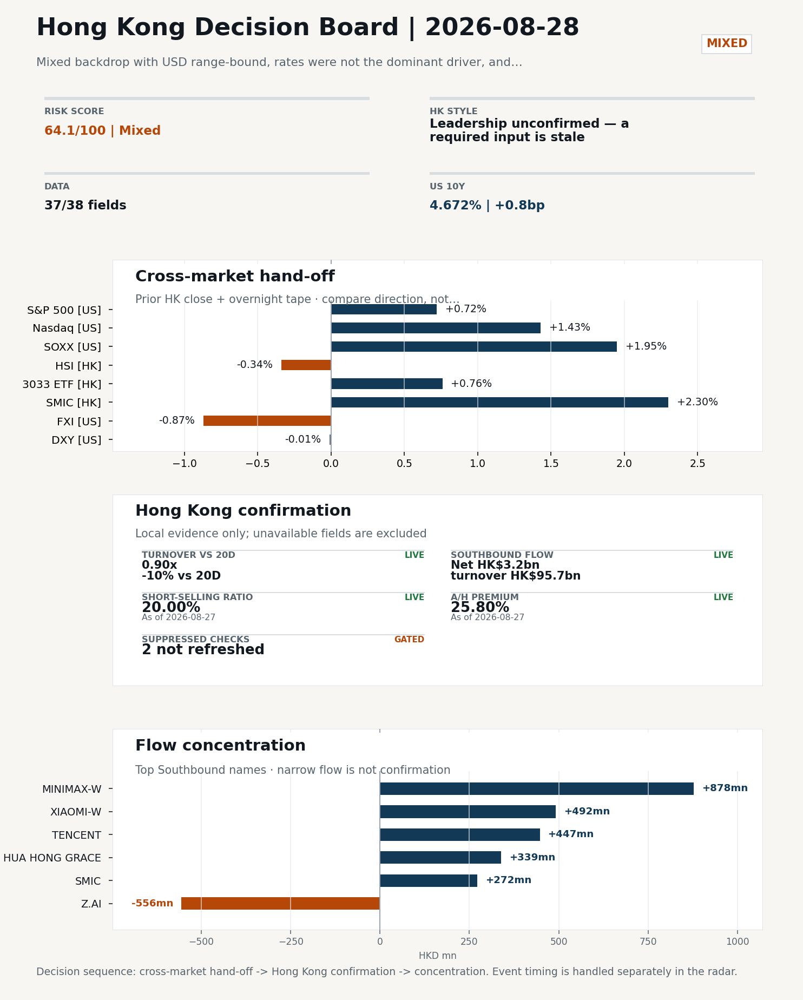
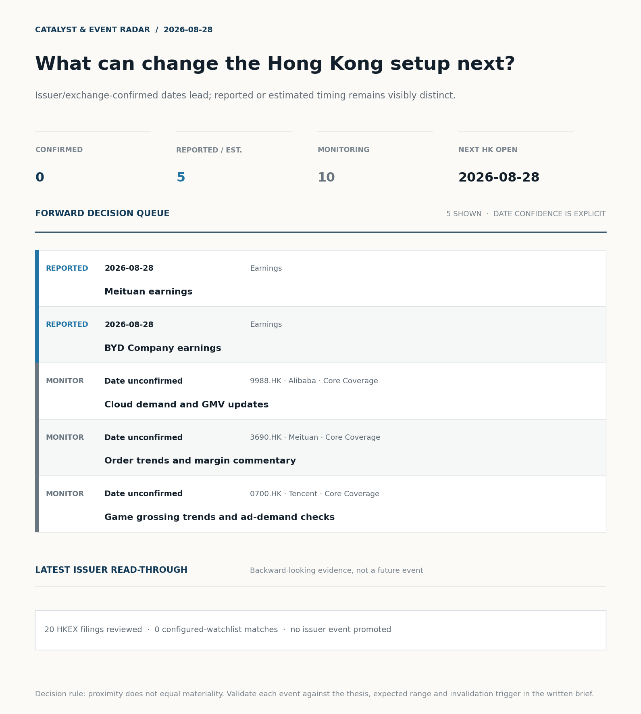
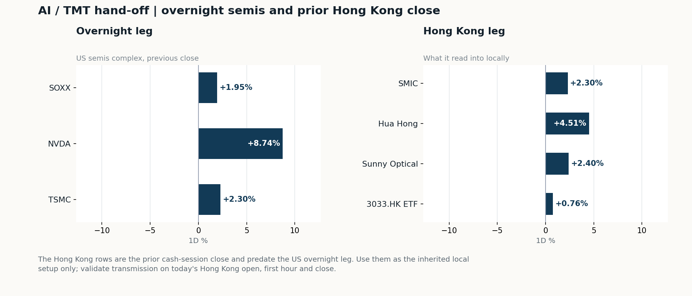
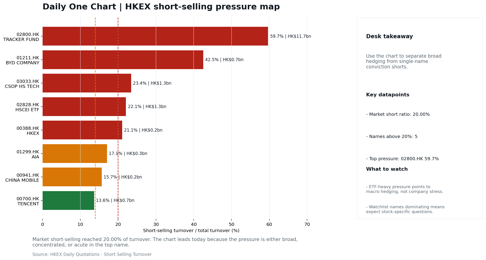

# Morning Research Workbench | 2026-08-28

> **Commute reading route:** `Layer 1 scan (5 min)` → `Layer 2 deep read` → `Layer 3 and appendix if time allows`
>
> Mode: `Trading Daily` | Keep the report execution-oriented: what mattered in the completed session, what can move Hong Kong leadership, and what needs fast follow-up.

_Data through: US/global `2026-08-27` | HK `2026-08-27` | A-share `2026-08-27` | Generated `2026-08-28 13:24:15`_

## Executive Summary

- **Did yesterday's call work?** NO CALL - The 2026-08-27 report published no directional call (neutral regime).
- **What changed overnight?** Semis led higher: SOXX +1.95%, NVDA +8.74%, TSMC +2.30%. HSI -0.34% but 3033.HK +0.76%.
- **What it means for AI/TMT** Style call withheld: 3033.HK ETF / HSCEI comparison blocked: effective dates differ (2026-08-26 vs 2026-08-27). The stale input is excluded from the risk score.
- **What to watch today** Next scheduled catalyst: China NBS Manufacturing PMI on 2026-08-31. Confirm if SMIC and Hua Hong open in the same direction as the overnight leg and hold it through the first hour; invalidate if they track HSCEI instead.

## Layer 1 | Scan (5 min)

### 1.1 Yesterday's Call
**Verdict: NO CALL.** The 2026-08-27 report published no directional call (neutral regime).

**Recent record.** 6 confirmed / 4 broken over the last 10 scoreable calls (60.0% hit rate). This is a directional close-to-close diagnostic, not a track record.

### 1.2 Opening Decision Board

**Global-to-Hong Kong signals**

_Decision-useful subset: each row states the implication and the next test. Descriptive secondary monitors are kept out of the five-minute scan._

| Signal | Last / move | Interpretation | Confirmation / invalidation |
| --- | --- | --- | --- |
| S&P 500 | 7,730.99 / +0.72% | Broad US risk rose as volatility drained out of the tape, which sets the external floor Hong Kong opens against. Falling volatility confirms lower near-term stress. | Watch whether Nasdaq and offshore-China proxies move the same way. |
| Nasdaq 100 | 29,641.56 / +1.43% | Growth outperformed broad beta, a supportive style signal for Hong Kong internet and platform names. Growth advanced despite higher yields, showing momentum resilience but also higher reversal sensitivity. | 3033.HK versus HSI leadership carries the read; rising yields would undo it. |
| Hang Seng Index | 25,565.74 / -0.34% | The index was carried by growth and platform names, not by broad participation: 3033.HK differs by 1.10pp. | Southbound participation decides whether this is investable or just a print. |
| Hang Seng TECH ETF (3033.HK) | 4.5320 / +0.76% | Hong Kong growth led broad beta, improving the platform/internet style signal. | Needs a stable CNH and Southbound buying to become a duration signal. |
| Semiconductors (SOXX) | 525.43 / **+1.95%** | Semis led the Nasdaq by 0.52pp, putting the AI capex trade back in front. | SMIC and Hua Hong at the open show whether it transmits to Hong Kong. |
| US 10Y | 4.6720% / +0.8bp | The yield proxy rose, tightening the discount-rate backdrop for long-duration Hong Kong growth. | Read it through 3033.HK relative performance, not the index level. |
| USD/CNH | 6.7130 / -0.03% | CNH was stable, removing an immediate FX impulse but not confirming equity direction. | FXI and Southbound flow decide whether this reaches Hong Kong equities. |
| VIX | 14.51 / **-4.60%** | Lower implied volatility reduces near-term stress, but is supportive only if equity breadth confirms. | Falling volatility on narrowing breadth is a warning, not support. |

_Secondary monitors retained in the source bundle: SMIC (0981.HK), CSI 300, China 10Y, CN-US 10Y spread, DXY, USD/HKD, Brent crude, COMEX gold, Copper._

**Hong Kong local confirmation**

_Coverage gate: 1 unavailable local checks are suppressed here and retained in validation metadata._

| Check | Value | Status | Source / as of | Why it matters |
| --- | --- | --- | --- | --- |
| Main Board turnover vs 20D | 0.90x \| -10% vs 20D | Live local | HKEX \| 2026-08-27 | Trailing 20-session average turnover was HK$258.5bn. |
| Southbound / Northbound net flow | Southbound Net HK$3.2bn \| turnover HK$95.7bn \| Northbound Turnover RMB284.9bn \| net not reported | Live local | HKEX Connect \| 2026-08-27 | Southbound net buy is calculated from HKEX disclosed buy and sell turnover. |
| Short-selling ratio | 20.00% | Live local | HKEX \| 2026-08-27 | Official HKEX stock-level short-selling table, aggregated as a share of total market turnover. |
| AH premium index | 25.80% | Live public | Yahoo \| 2026-08-27 | Fixed 10-name basket, equal-weighted, both legs priced on the same date; comparable across dates. Covered-pair average was +37.62% across 18 pairs. |
| USD/HKD spot vs band | 7.8388 | Live quote | Yahoo \| 2026-08-27 | Mid-band: 112 pips from the weak side and 888 pips from the strong side, so the peg is not an active constraint. |
| Hong Kong leadership | Leadership unconfirmed - a required input is stale | Proxy | HSI / HSCEI / 3033.HK ETF relative \| 2026-08-27 | Use HSI / HSCEI / 3033.HK ETF relative moves as the opening style read. |

**Risk state and evidence**

**Composite risk score:** `64.1/100` | **Regime:** `Mixed`

| Component | Score impact | Evidence |
| --- | --- | --- |
| US beta | +4.3 | S&P 500 +0.72% |
| HK growth ETF proxy | +3.8 | 3033.HK ETF +0.76% |
| Semis complex | +9 | SOXX +1.95% |
| Offshore China proxy | -4.3 | FXI -0.87% |
| Dollar pressure | +0.1 | DXY -0.01% |
| Volatility | +9.2 | VIX -4.60% |
| HK short-selling | -8 | Short-selling ratio 20.00% |
| HK turnover | +0 | Turnover 0.90x 20D |

_Base 50 plus the component deltas above. Semis complex entered the score on 2026-08-22; earlier scores in the ledger exclude it._

**Morning Checklist**

1. **NVDA +8.74%**
 High-frequency data | The AI capex narrative supports; expect it to reach HK through sentiment before earnings. (direct read-through to HK tech)
2. **[A] Alibaba plunges after announcing $10.2 billion share placement to fund AI push**
 News / announcements | Capital allocation or shareholder-return events can trigger a valuation reset
3. **Mixed backdrop with USD range-bound, rates were not the dominant driver, and Nasdaq 100 outperformed FXI**
 Overnight regime | Start by deciding whether the day is about Mixed conditions or a style pivot.
4. **[A] CanSino CEO Xuefeng Yu on Earnings, Pipeline**
 News / announcements | This can directly reshape earnings forecasts and the valuation framework

## Visual Dashboard

**Catalyst & Event Radar**

**Chart read:** No issuer/exchange-confirmed event date is populated; 5 reported or estimated timing item(s) and 10 undated trigger(s) remain explicit.

_Source: Public calendars, issuer disclosures and configured research watchlists_
## Layer 2 | Core Research (20-30 min)

### 2.1 Global-to-Hong Kong Transmission
**Market Setup**
**Core tape.** Overnight US tape was risk-on and growth-led rather than rates-led, with Nasdaq 100 +1.43% and S&P 500 +0.72% while USD was essentially flat and VIX fell 4.60%.
**Main driver.** The single-name engine was NVDA +8.74%, which reset the AI capex narrative and pulled SOXX +1.95% and TSM +2.30% higher, both clean read-throughs to Hong Kong semis and platform names.
**HK relevance.** Hong Kong closed before the US move (HSI -0.34%, HSCEI -0.51%, 3033.HK ETF +0.76% on 26 Aug) and the overnight offshore China proxy FXI -0.87%, so the cross-border signal is partial rather than confirmed.

**Key Drivers**
- NVDA +8.74% and the semis complex (SOXX +1.95%, TSM +2.30%) reset the AI capex narrative, with a direct sentiment channel to Hong Kong tech at the open.
- USD was range-bound and VIX fell 4.60%, so the move was growth-style and risk-on, not a rates or dollar story.
- Oil rose +1.58% intraday, a mixed signal: supportive for energy and cyclicals but a margin/geopolitical headwind for the rest of the tape.
- Prior-HK leadership was unconfirmed because 3033.HK ETF (26 Aug) and HSCEI (27 Aug) were not same-date, so no clean style read can be made from the local cash tape yet.

**Hong Kong Read-Through**
**Opening implication.** Open bias is constructive for Hong Kong semis and AI/platform beta via SMIC, Hua Hong and the broader tech complex, anchored by NVDA/SOXX/TSM overnight.
_Hong Kong style leadership and flow confirmation are set out in the Hong Kong review below._

**Watch Points**
- USD composite moved lower by -0.03pct intraday, with a 0.124pct range.
- Main turning points appeared around 2026-08-27 08:10 trough / 2026-08-27 08:30 trough / 2026-08-27 08:45 trough, suggesting event-driven repricing rather than a clean one-way USD move.
- The biggest cross-asset divergence was Nasdaq 100 versus FXI, a spread of 1.095pct.
- Gold moved -0.72pct intraday with a 1.196pct high-low range.

**Curated overnight stories**
1. **Alibaba plunges after announcing $10.2 billion share placement to fund AI push**
 Why it matters: A roughly $10bn follow-on at a 10% discount signals heavy dilution to fund AI capex, hitting a Hong Kong-listed China Internet bellwether with material index weight.
 HK read-through: Negative read-through to Alibaba (9988.HK) and sentiment spillover to other China Internet names.
2. **Z.ai shares surge 8% after releasing new AI model running only on Chinese chips**
 Why it matters: Confirms a working Chinese-stack AI inference path, supporting the domestic compute substitution narrative for Chinese semiconductor and AI names.
 HK read-through: Constructive for HK-listed Chinese AI and semiconductor names, and reinforces the 'China chips for China AI' thematic that has been lifting the sector.
3. **NVDA +8.74% (AI capex signal)**
 Why it matters: A large Nasdaq AI leader move resets the global AI capex narrative and is the cleanest same-day read-through to Hong Kong tech before any earnings prints.
 HK read-through: Likely supports HK tech sentiment at the open via the AI capex channel, though FXI underperforming Nasdaq flags that the read-through is partial.
4. **Fed Chairman Kevin Warsh delivers his key Jackson Hole speech Friday**
 Why it matters: This is the next macro inflection point for USD and global rates; tone on inflation restrictiveness versus cuts will set the offshore-China rate backdrop.
 HK read-through:

**AI / TMT hand-off**

**Overnight leg.** The overnight semis leg was risk-on at +4.33% average (SOXX +1.95%, NVDA +8.74%, TSMC +2.30%).
**Hong Kong expression.** SMIC, Hua Hong and Sunny Optical are best placed at the open, and 3033.HK should be tested before the Hang Seng Index.
**Observable test.** Confirm if SMIC and Hua Hong open in the same direction as the overnight leg and hold it through the first hour; invalidate if they track HSCEI instead, which would mean local flow is overriding the global cycle.

| Name | Role in the chain | 1D | Leg |
| --- | --- | --- | --- |
| SOXX | Semis complex | +1.95% | overnight |
| NVDA | AI capex narrative | +8.74% | overnight |
| TSMC | Foundry demand | +2.30% | overnight |
| SMIC | Leading-edge / domestic substitution | +2.30% | Hong Kong |
| Hua Hong | Mature-node pricing cycle | +4.51% | Hong Kong |
| Sunny Optical | Hardware and optics supply chain | +2.40% | Hong Kong |
| 3033.HK ETF | Broad HK tech beta | +0.76% | Hong Kong |

**Clock discipline.** The Hong Kong rows are the prior cash-session close and predate the US overnight leg. Use them as the inherited local setup only; validate transmission on today's Hong Kong open, first hour and close.

### 2.2 Hong Kong Local Tape and Flow
**Local Tape Setup**
**Local read.** The 2026-08-28 Hong Kong open is best framed as a growth-style test rather than an index-level beta call, because the prior local cash tape and overnight US tape are not same-date.
**Verification point.** HSI closed -0.34% and HSCEI -0.51% on 27 Aug, while the 3033.HK Hang Seng TECH ETF proxy printed +0.76% only on 26 Aug, so the intra-Hong Kong style read is still incomplete.
**Risk to watch.** Overnight risk-on signal came via Nasdaq 100 +1.43% and the semis complex (SOXX +1.95%, TSM +2.30%, NVDA +8.74%) on a flat DXY.

**Style and Local Leadership**
**Style call.** Leadership unconfirmed - a required input is stale.
- **Evidence:** No same-date 3033.HK-versus-HSCEI comparison was possible because 3033.HK ETF / HSCEI comparison blocked: effective dates differ (2026-08-26 vs 2026-08-27)
- **Portfolio meaning:** Do not infer Hong Kong style from the headline index alone; wait for relative price and local-flow evidence.
- **Cross-market read:** Hang Seng -0.34% / HSCEI -0.51% / 3033.HK ETF +0.76%. Offshore China proxy FXI -0.87% and USD/CNH -0.03% frame cross-border risk appetite. USD/HKD last traded around 7.8388, which keeps the Hong Kong funding lens in focus.

**Flow Confirmation**
Official Stock Connect evidence is available; the Flow Tracker confirms whether local money supports the price action.

**Follow-Through Checklist**
**Follow-through check.** Watch the 31 Aug Hong Kong session for same-date confirmation: (1) HSI, HSCEI and 3033.HK ETF need to print on a comparable date so a clean same-date style read can be made.
**Failure condition.** Any style claim remains invalid while the required relative-performance fields are missing or stale.

**Cross-asset attribution**

| Driver | Direction | Score | Evidence | HK implication |
| --- | --- | --- | --- | --- |
| Short-selling pressure | drag | 3.5 | HKEX short-selling ratio was 20.00%. | Elevated short activity argues for extra confirmation before chasing rebounds. |
| US growth-style transmission | supportive | 2.0 | Nasdaq 100 moved +1.43%. | Hong Kong growth and platform names should be tested first at the open. |
| Oil and geopolitics | mixed | 1.7 | Oil moved +2.12%. | Split the read between energy/cyclicals support and margin/geopolitical pressure. |
| Global equity beta | supportive | 0.72 | S&P 500 moved +0.72%. | Broad beta matters if Hong Kong breadth confirms the overseas signal. |

**Local flow evidence**

**Flow Takeaways**
- Short-selling pressure is elevated, so local rebounds need cleaner breadth and flow confirmation.
- Stock Connect Southbound: net HK$3.2bn on turnover HK$95.7bn (as of 2026-08-27).
- Stock Connect Northbound: turnover RMB284.9bn; public file provides total turnover/top active names, not full net-buy.
- AH premium: fixed 10-name basket +25.80% (comparable across dates); covered-pair average +37.62% over 18 pairs; widest premium: Chalco 148.38%.

**Stock Connect Southbound Active Names**

| # | Ticker | Name | Buy | Sell | Net buy | HKEX turnover rank |
| --- | --- | --- | --- | --- | --- | --- |
| 1 | 00100.HK | MINIMAX-W | HK$1,869.4mn | HK$991.5mn | HK$877.9mn | 3 |
| 2 | 02513.HK | Z.AI | HK$2,675.2mn | HK$3,230.9mn | HK$-555.7mn | 1 |
| 3 | 01810.HK | XIAOMI-W | HK$1,465.2mn | HK$973.3mn | HK$492.0mn | 5 |
| 4 | 00700.HK | TENCENT | HK$935.7mn | HK$488.6mn | HK$447.1mn | 3 |
| 5 | 01347.HK | HUA HONG GRACE | HK$1,270.3mn | HK$931.4mn | HK$339.0mn | 7 |

**AH Premium Dispersion**

| Name | A ticker | H ticker | Premium | As of |
| --- | --- | --- | --- | --- |
| Chalco | 601600.SS | 2600.HK | +148.38% | 2026-08-27 |
| China Railway Construction | 601186.SS | 1186.HK | +56.23% | 2026-08-27 |
| China Life | 601628.SS | 2628.HK | +53.54% | 2026-08-27 |

**HKEX Short-Selling Watch**

| Ticker | Name | Short ratio | Short turnover | Total turnover |
| --- | --- | --- | --- | --- |
| 00388.HK | HKEX | 21.07% | HK$0.2bn | HK$0.9bn |
| 00700.HK | TENCENT | 13.64% | HK$0.7bn | HK$5.2bn |
| 00941.HK | CHINA MOBILE | 15.66% | HK$0.2bn | HK$1.0bn |

- **Short-value leaders:** 02800.HK TRACKER FUND (HK$11.7bn); 07709.HK XL2CSOPHYNIX (HK$1.7bn); 09988.HK BABA-W (HK$1.4bn); 01810.HK XIAOMI-W (HK$1.3bn).

### 2.3 Macro Transmission
**Desk read.** The global session on 2026-08-27 closed with a mixed but risk-supportive backdrop.

**Market sensitivity.** For the 2026-08-28 HK open, that argues for a benign tech-led tone on the open rather than a macro-led re-rating, with platform and HK-listed semis (SMIC, Hua Hong) as the most direct transmission channels from the US tape.

**HK implication.** The forward macro agenda tilts decisively toward China demand: the NBS Manufacturing PMI on 2026-08-31 is the next hard catalyst, followed by the Caixin Manufacturing PMI on 2026-09-01.

**Macro watchpoints**
- HK tech and HK-listed semis (SMIC, Hua Hong) open vs. NVDA/TSMC ADR/SOXX closing tone
- USD range and US rates into the 2026-08-31 NBS PMI window; USD direction is the main FX channel for HK risk appetite into the data.
- Positioning and A/H spread ahead of the 2026-08-31 NBS Manufacturing PMI, which is the first hard read on the month just ended and drives
- NBS vs. Caixin PMI divergence risk on 2026-09-01: Caixin skews to smaller private exporters and can split from the NBS print, affecting HK

| Time | Region | Event | Status | Desk read |
| --- | --- | --- | --- | --- |
| | CN | China NBS Manufacturing PMI | Upcoming | Impact: Growth direction, cyclicals, and manufacturing-chain pricing \| Attention: 5/5 \| Industries: Machinery, Building materials, Industrials |
| | CN | China Caixin Manufacturing PMI | Upcoming | Impact: Growth direction, cyclicals, and manufacturing-chain pricing \| Attention: 3/5 \| Industries: Machinery, Building materials, Industrials |

**Positioning and risk backdrop**

- Detailed local flow evidence is covered under Flow Tracker and Attribution; keep this section focused on options, hedging, and macro-positioning risk.

### 2.4 Company Micro Research and Catalysts

| Grade | Sector | Headline | Why it matters | Horizon |
| --- | --- | --- | --- | --- |
| A | China Internet | Alibaba plunges after announcing $10.2 billion share placement to | Capital allocation or shareholder-return events can trigger a valuation | Medium-term trend |
| A | Other | CanSino CEO Xuefeng Yu on Earnings, Pipeline | This can directly reshape earnings forecasts and the valuation framework | Short-term catalyst |
| B | China Internet | Stocks making the biggest moves premarket | Assess whether the story can propagate through the China Internet value | Monitor |
| B | Semiconductors and AI | Z.ai shares surge 8% after releasing new AI model running only on | This is more about order visibility and product-cycle validation | Short-term catalyst |

**Company Event Takeaway**
**Desk read.** Two scheduled reports land on the 28 August HK session - Meituan (3690.HK) and BYD (1211.HK) - both flagged High priority.
**Why it matters.** The dominant tape-moving item from the prior session is the Alibaba (9988.HK) HK$80bn (US$10.2bn) follow-on placement to fund AI infrastructure.
**Follow-up.** The Z.ai Chinese-chip AI model release (semi/AI read-through) and the CanSino CEO interview are secondary catalysts that need pricing into HK biotech and AI peers.

**LLM Quick Takes**
- **3690.HK** | High-priority earnings event dated 2026-08-28 (days_to_event = 0). Estimate comparison is unavailable, so no pre-print beat/miss framing is possible. Investor read…
- **1211.HK** | High-priority earnings event dated 2026-08-28 (days_to_event = 0). Estimate comparison is unavailable, so pre-print framing is not possible. Investor read…
- **9988.HK** | Fact: Alibaba priced an HK$80bn (US$10.2bn) HKEX follow-on placement to fund AI infrastructure, prompting a ~10% drop in the share price per the CNBC report.…
- **0700.HK** | Earnings dated 2026-11-12 with no estimate comparison available. No fresh catalyst in the supplied set today…

Decision filter<h4>No watchlist filing hit; 2 market events cleared the decision filter.</h4>
20 profit warnings

<strong>20</strong>Official filings

<strong>0</strong>Watchlist hits

<strong>2</strong>Actionable events

<article class="event-card priority-high">

HighEarnings<time>2026-08-28</time>

<h5>Meituan · 3690.HK</h5>

Estimate comparison unavailable

Investor read
Calendar monitor only; no consensus comparison is available, so this is not yet an earnings view.

Next check
Prepare the KPI and valuation bridge before the release window.

<a class="event-source" href="https://finance.yahoo.com/quote/3690.HK">Yahoo Finance ticker calendar ↗</a>
</article>
<article class="event-card priority-high">

HighEarnings<time>2026-08-28</time>

<h5>BYD Company · 1211.HK</h5>

Estimate comparison unavailable

Investor read
Calendar monitor only; no consensus comparison is available, so this is not yet an earnings view.

Next check
Prepare the KPI and valuation bridge before the release window.

<a class="event-source" href="https://finance.yahoo.com/quote/1211.HK">Yahoo Finance ticker calendar ↗</a>
</article>

<strong>Coverage boundary.</strong> sell-side rating changes, IPO / grey-market monitor were not decision-grade in this run; their absence is not treated as confirmation that no event exists.

**Core coverage requiring follow-up**

**Core coverage**

| Name | Ticker | Last | 1D | Range position | Morning note |
| --- | --- | --- | --- | --- | --- |
| Alibaba | 9988.HK | 115.50 | -0.94% | Mid-range | Marginally lower (-0.94%), mid-range at 67% of its 60-session band. |
| Meituan | 3690.HK | 77.50 | -0.70% | Mid-range | Marginally lower (-0.70%), mid-range at 45% of its 60-session band. |

**Recent headlines for Alibaba:**
- [Alibaba (BABA) Q1 2027 Earnings Call Transcript](https://www.fool.com/earnings/call-transcripts/2026/08/27/alibaba-baba-q1-2027-earnings-call-transcript/) (Motley Fool)

**Priority follow-up**

| Name | Ticker | Last | 1D | Range position | Morning note |
| --- | --- | --- | --- | --- | --- |
| BYD Company | 1211.HK | 91.25 | -1.46% | Top of range | Marginally lower (-1.46%), in the top quartile of its 60-session range (84%). |
| China Mobile | 0941.HK | 79.45 | -0.81% | Mid-range | Marginally lower (-0.81%), mid-range at 72% of its 60-session band. |

### 2.5 Morning Meeting Questions
**Q1. Why is there no style call today?**
- **Evidence:** 3033.HK ETF / HSCEI comparison blocked: effective dates differ (2026-08-26 vs 2026-08-27).
- **How to answer:** A required input was stale, so any relative-performance claim would have compared two different dates. The call is withheld rather than published on partial evidence, and the stale input is excluded from the risk score.

**Q2. The index fell but Southbound bought - is the move real?**
- **Evidence:** HSI -0.34% against Southbound net +3.2bn HKD.
- **How to answer:** Treat it as unconfirmed. Price and mainland flow disagreed, so the price move was not driven by Southbound participation; it needs another session of confirmation before being read as a trend.

**Q3. The index was -0.34% but tech led at +0.76% - what drove the split?**
- **Evidence:** HSI -0.34% versus 3033.HK +0.76%, a 1.10pp spread.
- **How to answer:** Growth carried the session: the 1.10pp spread means the move was concentrated in platform and tech names rather than broad beta.

## Layer 3 | Session Playbook (8-12 min)

### 3.1 Base Case and Scenario Map
**Starting posture.** Leadership unconfirmed - a required input is stale (unconfirmed); composite risk `64.1/100` (Mixed). Do not infer Hong Kong style from the headline index alone; wait for relative price and local-flow evidence.

**Scenario map**

| Scenario | Observable trigger | Interpretation | Research response |
| --- | --- | --- | --- |
| Selective growth confirms | First refresh 3033.HK and HSCEI on the same session and basis; then require a >0.5pp first-hour 3033.HK lead, stable CNH and firmer semis. | The style thesis becomes measurable only after the comparison is aligned. | Keep internet/platform leadership on watch; do not upgrade it from the stale comparison alone. |
| Broad beta confirms | HSI and HSCEI rise together with improving breadth and normal first-hour turnover. | A broad market move is observable even while the style spread remains unavailable. | Research financials, SOEs and index-heavy names alongside growth leaders. |
| Risk-off continuation | HSI and HSCEI weaken, semis lag and CNH depreciation accelerates. | Local risk appetite is deteriorating without a reliable style offset. | Treat rebounds as unconfirmed; focus on balance-sheet, catalyst and crowding risk. |

**Clocked validation scorecard**

| Window | Check | Prior evidence | Pass condition | What it decides |
| --- | --- | --- | --- | --- |
| 09:30-10:30 | 3033.HK vs HSCEI | Same-session style spread unavailable | Refresh both legs on one session/basis; only then test for a >0.5pp lead | Whether growth leadership survives the open |
| 09:30-10:30 | Semiconductor hand-off | SMIC +2.30%; Hua Hong Semiconductor +4.51% | Stabilise after the open; at least one stops underperforming HSCEI | Whether overnight semis pressure is contained locally |
| 09:30-10:30 | HSI price zone | 25,566 vs 25,500 / 26,000 reference grid | Hold above the lower grid or reclaim the upper grid with breadth | Whether broad beta is stabilising; grid is derived, not technical analysis |
| 09:30-10:30 | USD/CNH | 6.713 \| -0.03% | No acceleration in CNH depreciation | Whether FX permits a clean Hong Kong risk extension |
| At close | Turnover | 0.90x \| -10% vs 20D | At least 1.0x the 20-session average | Whether the move had normal participation |
| At close | Southbound | Net HK$3.2bn \| turnover HK$95.7bn | Net buying remains positive and broadens beyond one or two names | Whether mainland money confirms the price move |
| At close | Short pressure | 20.00% | Falls versus the prior verified reading (20.00%) | Whether rebound conviction improved |

**Upgrade rule.** Confirm only after HSI, HSCEI, 3033.HK, turnover, and Southbound evidence refresh on a comparable date.
**Kill switch.** Any style claim remains invalid while the required relative-performance fields are missing or stale.
**Clock discipline.** At 07:30, same-day Southbound, turnover and short-selling outcomes are not known. Use the first-hour price/FX checks provisionally and make the final classification only after the close.
**Event clock.** Same-day decision items: Meituan earnings, BYD Company earnings.

### 3.2 Daily One Chart
**Daily One Chart | HKEX short-selling pressure map**

**Chart read.** Market short-selling reached 20.00% of turnover.
**Why it matters.** The chart leads today because the pressure is either broad, concentrated, or acute in the top name.

_Source: HKEX Daily Quotations - Short Selling Turnover_

## Optional Appendix | Traceability and Performance (10-15 min)

### Report Metadata
> Date policy: Review date 2026-08-27 is treated as `Trading Daily`. | Global (US/Europe) data date is 2026-08-27; adapter effective date is 2026-08-27 and summary date is 2026-08-27. | Hong Kong local data date is 2026-08-27; role: same-session local cash tape.
> Market data quality: Coverage: `37/38` | Fallbacks used: `2` | Missing: `1`
> Report quality: `91.4/100` | Grade `B` | Status `usable with caveats`

### Report Quality and Validation
- **Quality score:** 91.4/100 | **Grade:** B | **Status:** usable with caveats
- **Run summary:** 8 healthy | 2 caveat | 0 failed
- **Release recommendation:** Send with caveats | The report is usable, but the advisory guidance should travel with it so readers understand the data gaps.

| Source | Status | Bucket |
| --- | --- | --- |
| Macro calendar | partial | caveat |
| Risk and sentiment feed | partial | caveat |

**Desk-use guidance summary:** 0 blocking | 1 advisory

**Desk-use guidance**
- **Advisory:** Questionable narrative fields were removed; use the deterministic fallback copy and review the audit trail.
- **Grade capped:** Hong Kong style comparison blocked: effective dates differ (2026-08-26 vs 2026-08-27)

| Weak component | Score | Read |
| --- | --- | --- |
| Hong Kong local metrics | 54.1 | 5 live, 3 proxy, 3 unavailable local checks. |

**Quality warnings**
- Hong Kong local metrics is weak: 5 live, 3 proxy, 3 unavailable local checks.
- Narrative fact-check guardrail produced warnings; review the validation table before relying on narrative sections.
- Hong Kong style comparison was withheld because the input dates or bases were not aligned.

**Narrative fact-check guardrail**
- Checked 33 numeric claims; 0 numeric mismatch(es), 0 logic warning(s); 13 structured claims, 0 source/text warning(s); 0 critical, 0 review. Replaced 2 unsafe narrative field(s) with deterministic fallback copy.
- **Deterministic fallback fields:** selected_news[3].hk_market_impact, tasks.news_selection.selected_news[3].hk_market_impact

_Full component weights, per-source freshness, adapter status and provenance records are archived with this report under `audit/` rather than printed here._

### Historical Signal Performance
- **Readiness:** exploratory with caveats | 69 observations | 88 active signal dates | next-close entry, 10bps cost, no same-day returns.
- **Interpretation boundary:** exploratory until a benchmark reaches 252 sessions and 100 active-signal sessions.
- **Data-quality caveat:** 23 conflicting price revision(s) and 6 non-session observation(s) remain in the research ledger.
- **Daily-use boundary:** cumulative return, Sharpe and the performance chart stay out of the daily commute edition until the sample and trading-calendar gates pass; use Yesterday's Call instead.

### Source Links
- [Alibaba plunges after announcing $10.2 billion share placement to fund AI push](https://www.cnbc.com/2026/08/24/alibaba-share-placement-drop-ai-hong-kong.html) (cnbc_markets)
- [CanSino CEO Xuefeng Yu on Earnings, Pipeline](https://www.bloomberg.com/news/videos/2026-08-28/cansino-ceo-xuefeng-yu-on-earnings-pipeline-video) (bloomberg_markets)
- [Stocks making the biggest moves premarket: Alibaba, Marvell, Sandisk, Coinbase and more](https://www.cnbc.com/2026/08/24/stocks-making-the-biggest-moves-premarket-baba-mrvl-sndk-and-more.html) (cnbc_markets)
- [Z.ai shares surge 8% after releasing new AI model running only on Chinese chips](https://www.cnbc.com/2026/08/27/zai-shares-surge-new-ai-model-using-chinese-chips.html) (cnbc_markets)
- [Alibaba (BABA) Q1 2027 Earnings Call Transcript](https://www.fool.com/earnings/call-transcripts/2026/08/27/alibaba-baba-q1-2027-earnings-call-transcript/) (Motley Fool)
- [Alibaba Raises $10 Billion for AI - Why BofA Is Looking Past the Dilution](https://finance.yahoo.com/technology/ai/articles/alibaba-raises-10-billion-ai-204901400.html) (Insider Monkey)
- [Nvidia Earnings Could Get a China Boost](https://www.barrons.com/livecoverage/nvidia-earnings-stock-price-jensen-huang-chips/card/nvidia-earnings-could-get-a-china-boost-3FtuG6ya7jajE93PXWky?siteid=yhoof2&yptr=yahoo) (Barrons.com)
- [00428.HK Profit warning / alert announcement](http://www1.hkexnews.hk/listedco/listconews/sehk/2026/0827/2026082701453.pdf) (HKEXnews)
- [00627.HK Profit warning / alert announcement](http://www1.hkexnews.hk/listedco/listconews/sehk/2026/0827/2026082700882.pdf) (HKEXnews)
- [00632.HK Profit warning / alert announcement](http://www1.hkexnews.hk/listedco/listconews/sehk/2026/0827/2026082700268.pdf) (HKEXnews)
- [00871.HK Profit warning / alert announcement](http://www1.hkexnews.hk/listedco/listconews/sehk/2026/0827/2026082702355.pdf) (HKEXnews)
- [01255.HK Profit warning / alert announcement](http://www1.hkexnews.hk/listedco/listconews/sehk/2026/0827/2026082701719.pdf) (HKEXnews)
- [01680.HK Profit warning / alert announcement](http://www1.hkexnews.hk/listedco/listconews/sehk/2026/0827/2026082701949.pdf) (HKEXnews)
- [01759.HK Profit warning / alert announcement](http://www1.hkexnews.hk/listedco/listconews/sehk/2026/0827/2026082700756.pdf) (HKEXnews)
- [01938.HK Profit warning / alert announcement](http://www1.hkexnews.hk/listedco/listconews/sehk/2026/0827/2026082700734.pdf) (HKEXnews)
