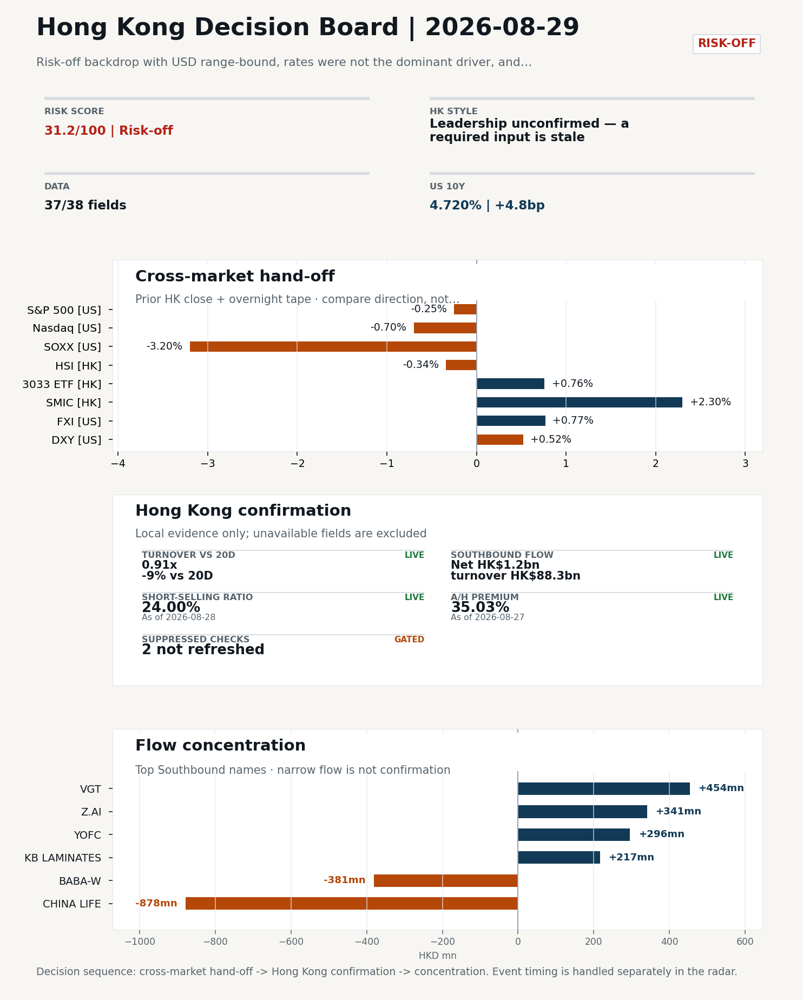
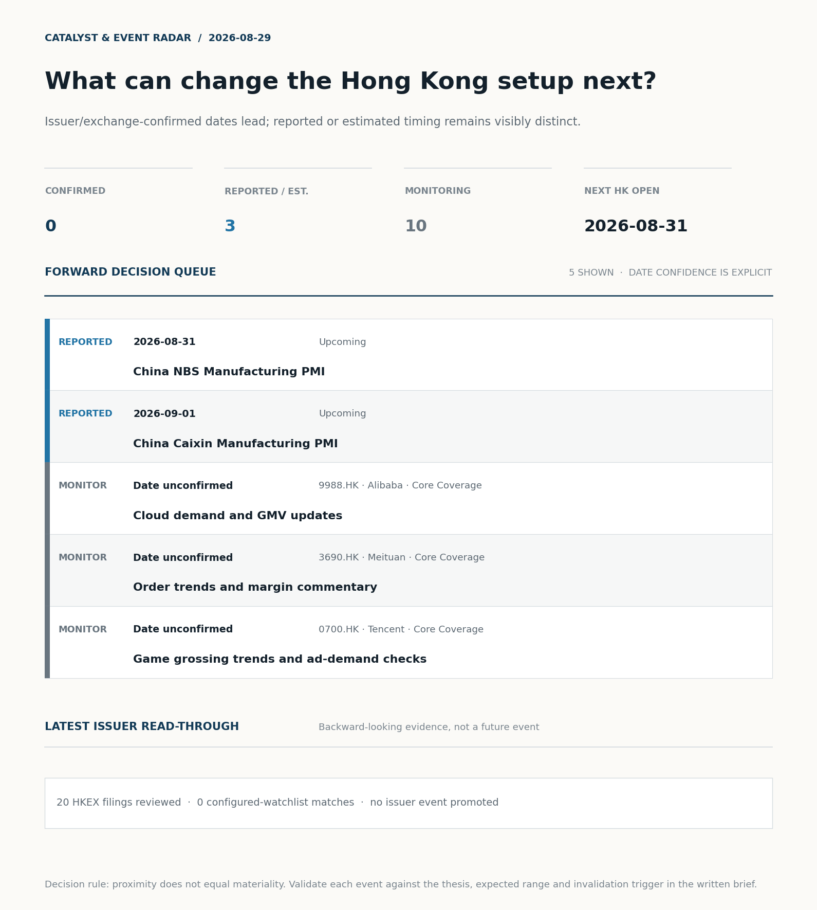
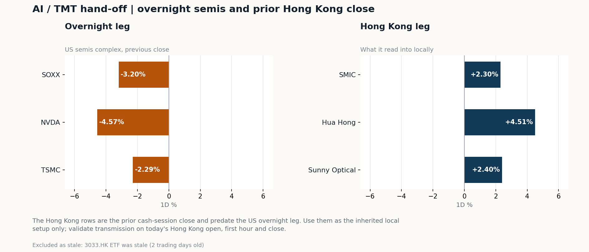

# Morning Research Workbench | 2026-08-29

> **Commute reading route:** `Layer 1 scan (5 min)` → `Layer 2 deep read` → `Layer 3 and appendix if time allows`
>
> Mode: `Trading Daily` | Review Friday's completed session; treat Saturday as a non-trading prep day.

_Data through: US/global `2026-08-28` | HK `2026-08-28` | A-share `2026-08-28` | Generated `2026-08-29 11:11:30`_

## Executive Summary

- **Did yesterday's call work?** NO CALL - The 2026-08-28 report published no directional call (neutral regime).
- **What changed overnight?** Semis led lower: SOXX -3.20%, NVDA -4.57%, TSMC -2.29%.
- **What it means for AI/TMT** Style call withheld: 3033.HK ETF was stale (2 trading days old); 3033.HK ETF / HSCEI comparison blocked: effective dates differ (2026-08-26 vs 2026-08-27). The stale input is excluded from the risk score.
- **What to watch today** Next scheduled catalyst: China NBS Manufacturing PMI on 2026-08-31. Confirm if SMIC and Hua Hong open in the same direction as the overnight leg and hold it through the first hour; invalidate if they track HSCEI instead.

## Layer 1 | Scan (5 min)

### 1.1 Yesterday's Call
**Verdict: NO CALL.** The 2026-08-28 report published no directional call (neutral regime).

**Recent record.** 6 confirmed / 4 broken over the last 10 scoreable calls (60.0% hit rate). This is a directional close-to-close diagnostic, not a track record.

### 1.2 Opening Decision Board

**Global-to-Hong Kong signals**

_Decision-useful subset: each row states the implication and the next test. Descriptive secondary monitors are kept out of the five-minute scan._

| Signal | Last / move | Interpretation | Confirmation / invalidation |
| --- | --- | --- | --- |
| S&P 500 | 7,711.76 / -0.25% | Broad US risk fell without a clear driver in today's fields; treat it as beta, not a signal. | Watch whether Nasdaq and offshore-China proxies move the same way. |
| Nasdaq 100 | 29,433.43 / -0.70% | Growth lagged broad beta, warning that headline risk-on may not transmit cleanly to the 3033.HK ETF proxy. | 3033.HK versus HSI leadership carries the read; rising yields would undo it. |
| Hang Seng Index | 25,565.74 / -0.34% | The index was carried by growth and platform names, not by broad participation: 3033.HK differs by 1.10pp. | Southbound participation decides whether this is investable or just a print. |
| Hang Seng TECH ETF (3033.HK) | 4.5320 / +0.76% | Hong Kong growth led broad beta, improving the platform/internet style signal. | Needs a stable CNH and Southbound buying to become a duration signal. |
| Semiconductors (SOXX) | 508.62 / **-3.20%** | Semis underperformed the Nasdaq by 2.50pp, so this is a cycle move rather than broad growth weakness. | SMIC and Hua Hong at the open show whether it transmits to Hong Kong. |
| US 10Y | 4.7200% / +4.8bp | The yield proxy rose, tightening the discount-rate backdrop for long-duration Hong Kong growth. | Read it through 3033.HK relative performance, not the index level. |
| USD/CNH | 6.7250 / +0.18% | A higher USD/CNH means a weaker offshore renminbi, a headwind for offshore-China sentiment. | FXI and Southbound flow decide whether this reaches Hong Kong equities. |
| VIX | 14.43 / -0.55% | Lower implied volatility reduces near-term stress, but is supportive only if equity breadth confirms. | Falling volatility on narrowing breadth is a warning, not support. |

_Secondary monitors retained in the source bundle: SMIC (0981.HK), CSI 300, China 10Y, CN-US 10Y spread, DXY, USD/HKD, Brent crude, COMEX gold, Copper._

**Hong Kong local confirmation**

_Coverage gate: 1 unavailable local checks are suppressed here and retained in validation metadata._

| Check | Value | Status | Source / as of | Why it matters |
| --- | --- | --- | --- | --- |
| Main Board turnover vs 20D | 0.91x \| -9% vs 20D | Live local | HKEX \| 2026-08-28 | Trailing 20-session average turnover was HK$255.0bn. |
| Southbound / Northbound net flow | Southbound Net HK$1.2bn \| turnover HK$88.3bn \| Northbound Turnover RMB278.1bn \| net not reported | Live local | HKEX Connect \| 2026-08-28 | Southbound net buy is calculated from HKEX disclosed buy and sell turnover. |
| Short-selling ratio | 24.00% | Live local | HKEX \| 2026-08-28 | Official HKEX stock-level short-selling table, aggregated as a share of total market turnover. |
| AH premium index | 35.03% | Live public | Yahoo \| 2026-08-27 | Equal-weighted average across 17 A/H pairs that resolved today. Composition varies by day, so the level is not comparable with prior reports (fixed basket incomplete: missing Agricultural Bank of China). [trimmed] |
| USD/HKD spot vs band | 7.8391 | Live quote | Yahoo \| 2026-08-28 | Mid-band: 109 pips from the weak side and 891 pips from the strong side, so the peg is not an active constraint. |
| Hong Kong leadership | Leadership unconfirmed - a required input is stale | Proxy | HSI / HSCEI / 3033.HK ETF relative \| 2026-08-28 | Use HSI / HSCEI / 3033.HK ETF relative moves as the opening style read. |

**Risk state and evidence**

**Composite risk score:** `31.2/100` | **Regime:** `Risk-off`

| Component | Score impact | Evidence |
| --- | --- | --- |
| US beta | -1.5 | S&P 500 -0.25% |
| Semis complex | -9 | SOXX -3.20% |
| Offshore China proxy | +3.9 | FXI +0.77% |
| Dollar pressure | -5.2 | DXY +0.52% |
| Volatility | +1.1 | VIX -0.55% |
| HK short-selling | -8 | Short-selling ratio 24.00% |
| HK turnover | +0 | Turnover 0.91x 20D |
| Excluded (stale) | +0.0 | Not scored: 3033.HK ETF (stale 2d) |

_Base 50 plus the component deltas above. Semis complex entered the score on 2026-08-22; earlier scores in the ledger exclude it._

**Morning Checklist**

1. **Risk-off backdrop with USD range-bound, rates were not the dominant driver, and FXI outperformed Nasdaq 100**
 Overnight regime | Start by deciding whether the day is about Risk-off conditions or a style pivot.
2. **China NBS Manufacturing PMI (Upcoming)**
 Macro / policy | Growth direction, cyclicals, and manufacturing-chain pricing | Industries: Machinery, Building materials, Industrials
3. **NVDA -4.57%**
 High-frequency data | The AI capex narrative weakens; expect it to reach HK through sentiment before earnings. (direct read-through to HK tech)
4. **China Caixin Manufacturing PMI (Upcoming)**
 Macro / policy | Growth direction, cyclicals, and manufacturing-chain pricing | Industries: Machinery, Building materials, Industrials

## Visual Dashboard

**Catalyst & Event Radar**

**Chart read:** No issuer/exchange-confirmed event date is populated; 3 reported or estimated timing item(s) and 10 undated trigger(s) remain explicit.

_Source: Public calendars, issuer disclosures and configured research watchlists_
## Layer 2 | Core Research (20-30 min)

### 2.1 Global-to-Hong Kong Transmission
**Market Setup**
**Core tape.** Overnight US risk-off was led by the AI/semis complex - NVDA -4.57%, SOXX -3.20%, TSM -2.29% - while the S&P 500 (-0.25%) and Nasdaq 100 (-0.70%) held up better on a breadth-adjusted basis.
**Main driver.** The notable cross-asset signal was FXI (+0.77%) outperforming the Nasdaq 100, an offshore-China bid that runs counter to the prior-day HSI/HSCEI weakness (-0.34%/-0.51%).
**HK relevance.** USD was effectively range-bound and rates were not the dominant driver, leaving US-China rhetoric and AI-capex nerves to set the tone.

**Key Drivers**
- AI capex softening: NVDA -4.57% dragged the semis complex (SOXX -3.20%, TSM -2.29%), pressuring the AI/semis sentiment channel into HK-listed proxies (SMIC, Hua Hong, Hang Seng TECH).
- Rates repricing into Monday: post-Warsh Jackson Hole read pushed September Fed odds toward a coin flip and lifted the US 10Y +4.8bp to 4.72%, a discount-rate headwind for growth and duration-sensitive names.
- US-China rhetorical escalation ahead of the Xi Washington visit raised headline-risk premia for offshore-China and HK tech/consumer names with US revenue exposure, supporting a defensive FXI-over-Nasdaq tape.
- Dollar/CNH pressure was modest (DXY +0.52%, USD/CNH +0.18%) and USD/HKD at 7.8391 sat mid-band, so the HKD peg was not an active constraint on the Hong Kong funding lens.

**Hong Kong Read-Through**
**Opening implication.** Monday's HK open (target session 2026-08-31) faces a split signal: an offshore-China bid from FXI argues for a softer open in headline indices.
_Hong Kong style leadership and flow confirmation are set out in the Hong Kong review below._

**Watch Points**
- USD composite moved higher by +0.01pct intraday, with a 0.383pct range.
- Main turning points appeared around 2026-08-28 08:15 peak / 2026-08-28 08:35 trough / 2026-08-28 08:55 peak, suggesting event-driven repricing rather than a clean one-way USD move.
- The biggest cross-asset divergence was FXI versus Nasdaq 100, a spread of 0.293pct.
- Gold moved -2.75pct intraday with a 3.554pct high-low range.

**Curated overnight stories**
1. **September Fed decision is now a coin flip as rate hike odds increase post Warsh**
 Why it matters: A meaningful repricing of the Fed path at Jackson Hole resets the global discount-rate anchor and risk budget.
 HK read-through: Direct read-through to HK rate-sensitive sectors (property, insurance, utilities) and to offshore CNY/HKD; growth stocks re-rated via the US 10Y channel.
2. **Trump ratchets up rhetoric against Beijing as U.S.-China officials meet for Xi's**
 Why it matters: Headline risk into a scheduled Xi visit raises the probability of tariff or export-control headlines during the HK session.
 HK read-through: Bears on offshore-China and HK-listed tech/consumer names with US revenue exposure; supports the FXI-over-Nasdaq tape if the rhetoric stays rhetorical.
3. **NVDA -4.57% (high-frequency read from must_watch)**
 Why it matters: A sharp single-name move in the AI capex bellwether signals a softer growth/AI-spend narrative into the weekend.
 HK read-through: Pressure on HK AI/semi proxies and the broader Hang Seng Tech complex; sentiment channel rather than direct earnings channel.
4. **Tariffs Could Bring Canada Auto "To Its Knees" (Trump 50% tariff threat on Canadian**
 Why it matters: Resurrects the auto-supply-chain tariff tail risk and reopens the auto-cost narrative for global OEMs.
 HK read-through: Indirect read-through to HK-listed EV/auto names and to global growth sentiment; secondary to the above three.
5. **Z.ai shares surge 8% after releasing new AI model running only on Chinese chips**
 Why it matters: Another data point for the China-domestic AI compute stack, with model launch already in stealth for a week before the public release.
 HK read-through: Constructive for HK-listed China AI/semi names as a sentiment catalyst, but model performance benchmarks are not provided, so the read-across is limited.

**AI / TMT hand-off**

**Overnight leg.** The overnight semis leg was risk-off at -3.35% average (SOXX -3.20%, NVDA -4.57%, TSMC -2.29%).
**Hong Kong expression.** SMIC, Hua Hong and Sunny Optical are under the most pressure at the open, and 3033.HK should be tested before the Hang Seng Index.
**Observable test.** Confirm if SMIC and Hua Hong open in the same direction as the overnight leg and hold it through the first hour; invalidate if they track HSCEI instead, which would mean local flow is overriding the global cycle.

| Name | Role in the chain | 1D | Leg |
| --- | --- | --- | --- |
| SOXX | Semis complex | -3.20% | overnight |
| NVDA | AI capex narrative | -4.57% | overnight |
| TSMC | Foundry demand | -2.29% | overnight |
| SMIC | Leading-edge / domestic substitution | +2.30% | Hong Kong |
| Hua Hong | Mature-node pricing cycle | +4.51% | Hong Kong |
| Sunny Optical | Hardware and optics supply chain | +2.40% | Hong Kong |
| 3033.HK ETF | Broad HK tech beta | stale 2d | Hong Kong |

**Clock discipline.** The Hong Kong rows are the prior cash-session close and predate the US overnight leg. Use them as the inherited local setup only; validate transmission on today's Hong Kong open, first hour and close.
**Coverage caveat.** 3033.HK ETF was stale (2 trading days old). Those names are excluded from the averages above.

### 2.2 Hong Kong Local Tape and Flow
**Local Tape Setup**
**Local read.** Hong Kong opens Monday (target 2026-08-31) into a split tape: an offshore-China bid (FXI +0.77% outpacing Nasdaq 100 -0.70%) argues for a softer headline-index open.
**Verification point.** Local flow evidence is already constructive on a Select-style basis - Southbound net buy HK$1.2bn with Tencent as the top name by turnover - but a 24.00% short-selling ratio and Main Board turnover at 0.91x of 20D mean any rebound needs cleaner breadth to be confirmed rather than chased.
**Risk to watch.** CCASS changes are not in the dataset, so any custody-level accumulation calls are deferred until that confirmation arrives.

**Style and Local Leadership**
**Style call.** Leadership unconfirmed - a required input is stale.
- **Evidence:** No same-date 3033.HK-versus-HSCEI comparison was possible because 3033.HK ETF was stale (2 trading days old); 3033.HK ETF / HSCEI comparison blocked: effective dates differ (2026-08-26 vs 2026-08-27)
- **Portfolio meaning:** Do not infer Hong Kong style from the headline index alone; wait for relative price and local-flow evidence.
- **Cross-market read:** Hang Seng -0.34% / HSCEI -0.51% / 3033.HK ETF stale 2d. Offshore China proxy FXI +0.77% and USD/CNH +0.18% frame cross-border risk appetite. USD/HKD last traded around 7.8391, which keeps the Hong Kong funding lens in focus.

**Flow Confirmation**
Official Stock Connect evidence is available; the Flow Tracker confirms whether local money supports the price action.

**Follow-Through Checklist**
**Follow-through check.** Actionable confirmation test for Monday: (1) 3033.HK prints a fresh same-session close and outperforms HSCEI on the day - if yes, the offshore-China/SOE defensive read reverses toward growth.
**Failure condition.** Any style claim remains invalid while the required relative-performance fields are missing or stale.

**Cross-asset attribution**

| Driver | Direction | Score | Evidence | HK implication |
| --- | --- | --- | --- | --- |
| Short-selling pressure | drag | 6.3 | HKEX short-selling ratio was 24.00%. | Elevated short activity argues for extra confirmation before chasing rebounds. |
| Oil and geopolitics | supportive | 1.26 | Oil moved -1.57%. | Split the read between energy/cyclicals support and margin/geopolitical pressure. |
| Dollar / CNH pressure | drag | 0.78 | DXY +0.52% / USD-CNH +0.18% | A stable or softer CNH makes Hong Kong follow-through more credible. |

**Local flow evidence**

**Flow Takeaways**
- Short-selling pressure is elevated, so local rebounds need cleaner breadth and flow confirmation.
- Stock Connect Southbound: net HK$1.2bn on turnover HK$88.3bn (as of 2026-08-28).
- Stock Connect Northbound: turnover RMB278.1bn; public file provides total turnover/top active names, not full net-buy.
- AH premium: covered-pair average +35.03% over 17 pairs. Composition varies by day, so this level is not comparable with prior reports; widest premium: China Railway Construction 105.29%.

**Stock Connect Southbound Active Names**

| # | Ticker | Name | Buy | Sell | Net buy | HKEX turnover rank |
| --- | --- | --- | --- | --- | --- | --- |
| 1 | 02628.HK | CHINA LIFE | HK$89.9mn | HK$968.4mn | HK$-878.5mn | 9 |
| 2 | 02476.HK | VGT | HK$1,204.6mn | HK$751.1mn | HK$453.5mn | 7 |
| 3 | 09988.HK | BABA-W | HK$1,290.5mn | HK$1,671.3mn | HK$-380.8mn | 2 |
| 4 | 02513.HK | Z.AI | HK$2,014.2mn | HK$1,672.8mn | HK$341.4mn | 2 |
| 5 | 06869.HK | YOFC | HK$1,731.3mn | HK$1,435.3mn | HK$295.9mn | 4 |

**AH Premium Dispersion**

| Name | A ticker | H ticker | Premium | As of |
| --- | --- | --- | --- | --- |
| China Railway Construction | 601186.SS | 1186.HK | +105.29% | 2026-08-27 |
| China Communications Construction | 601800.SS | 1800.HK | +101.23% | 2026-08-27 |
| China Life | 601628.SS | 2628.HK | +53.43% | 2026-08-27 |

**HKEX Short-Selling Watch**

| Ticker | Name | Short ratio | Short turnover | Total turnover |
| --- | --- | --- | --- | --- |
| 00388.HK | HKEX | 17.73% | HK$0.3bn | HK$1.8bn |
| 00700.HK | TENCENT | 11.62% | HK$1.5bn | HK$12.7bn |
| 00941.HK | CHINA MOBILE | 14.99% | HK$0.1bn | HK$0.9bn |

- **Short-value leaders:** 02800.HK TRACKER FUND (HK$18.1bn); 03033.HK CSOP HS TECH (HK$3.0bn); 07709.HK XL2CSOPHYNIX (HK$2.1bn); 02828.HK HSCEI ETF (HK$1.7bn).

### 2.3 Macro Transmission
**Desk read.** Today's note is a Saturday prep for Monday's 2026-08-31 HK session, not a live tape read.

**Market sensitivity.** The dominant macro signal is the China NBS Manufacturing PMI print on Monday, flagged as the highest-attention item (score 85) and the first hard read on the just-ended month.

**HK implication.** The Caixin Manufacturing PMI on 2026-09-01 is the secondary check, useful because it skews to smaller private exporters and can diverge from the NBS series.

**Macro watchpoints**
- China NBS Manufacturing PMI release Monday and the print vs. consensus; any sub-50 surprise would test the FXI-relative-strength narrative and
- Caixin Manufacturing PMI on 2026-09-01 for divergence vs. NBS, particularly for private-exporter names.
- Whether SMIC, Hua Hong, and 3033.HK hold Friday's levels given NVDA -4.57% and SOXX -3.20%
- USD trajectory: a break of Friday's range would matter more than rates, given the regime note that rates were not the dominant driver on

| Time | Region | Event | Status | Desk read |
| --- | --- | --- | --- | --- |
| | CN | China NBS Manufacturing PMI | Upcoming | Impact: Growth direction, cyclicals, and manufacturing-chain pricing \| Attention: 5/5 \| Industries: Machinery, Building materials, Industrials |
| | CN | China Caixin Manufacturing PMI | Upcoming | Impact: Growth direction, cyclicals, and manufacturing-chain pricing \| Attention: 3/5 \| Industries: Machinery, Building materials, Industrials |

**Positioning and risk backdrop**

- Detailed local flow evidence is covered under Flow Tracker and Attribution; keep this section focused on options, hedging, and macro-positioning risk.

### 2.4 Company Micro Research and Catalysts

| Grade | Sector | Headline | Why it matters | Horizon |
| --- | --- | --- | --- | --- |
| A | Autos and EV | Tariffs Could Bring Canada Auto "To Its Knees" | Assess whether the story can propagate through the Autos and EV value | Monitor |
| B | Semiconductors and AI | Z.ai shares surge 8% after releasing new AI model running only on | This is more about order visibility and product-cycle validation | Short-term catalyst |

**Company Event Takeaway**
**Desk read.** Reviewing 28 Aug: the calendar shows Meituan (3690.HK) and BYD (1211.HK) reported on the same session but beat/miss is not parsed yet, so treat both as headline-only.
**Why it matters.** Meituan news flow flags a return to profit and resumed growth in food delivery, which is a read-through for the HK internet cohort.
**Follow-up.** Alibaba (9988.HK) sits 67% up its 60-day band after fresh open-weight AI headlines; no estimate or rating change implied here.

**LLM Quick Takes**
- **3690.HK** | Meituan reported on 2026-08-28. Headlines point to revenue growth of ~14% YoY (Q2 2026) and a return to quarterly profit as food-delivery competition eased. Estimate vs.…
- **1211.HK** | BYD has a 2026-08-28 calendar marker; results or filing detail are not in the supplied dataset, so treat as headline-only.…
- **9988.HK** | Alibaba at HK$115.50, -0.94% on 28 Aug, sits mid-range (67% of 60-session band). Two fresh headlines rehash the 17 Aug Qwen3.8-Max open-weight release and the 20 Aug fiscal-Q1 print…
- **0388.HK** | HKEX earnings dated 2026-11-04 (67 days out); no fresh event in 28 Aug HKEX feed beyond small-cap profit warnings. Keep on calendar; no thesis change yet.

Decision filter<h4>No immediate portfolio catalyst: 20 official filings were screened and the low-signal market set stays aggregated.</h4>
20 profit warnings

<strong>20</strong>Official filings

<strong>0</strong>Watchlist hits

<strong>0</strong>Actionable events

<article class="event-card priority-review">

ReviewEarnings<time>2026-08-28</time>

<h5>Meituan · 3690.HK</h5>

Estimate comparison unavailable

Investor read
Calendar monitor only; no consensus comparison is available, so this is not yet an earnings view.

Next check
Confirm timing and obtain a consensus/KPI frame before promoting this event.

<a class="event-source" href="https://finance.yahoo.com/quote/3690.HK">Yahoo Finance ticker calendar ↗</a>
</article>
<article class="event-card priority-review">

ReviewEarnings<time>2026-08-28</time>

<h5>BYD Company · 1211.HK</h5>

Estimate comparison unavailable

Investor read
Calendar monitor only; no consensus comparison is available, so this is not yet an earnings view.

Next check
Confirm timing and obtain a consensus/KPI frame before promoting this event.

<a class="event-source" href="https://finance.yahoo.com/quote/1211.HK">Yahoo Finance ticker calendar ↗</a>
</article>

<strong>Coverage boundary.</strong> sell-side rating changes, IPO / grey-market monitor were not decision-grade in this run; their absence is not treated as confirmation that no event exists.

**Core coverage requiring follow-up**

**Core coverage**

| Name | Ticker | Last | 1D | Range position | Morning note |
| --- | --- | --- | --- | --- | --- |
| Alibaba | 9988.HK | 115.50 | -0.94% | Mid-range | Marginally lower (-0.94%), mid-range at 67% of its 60-session band. |
| Meituan | 3690.HK | 77.50 | -0.70% | Mid-range | Marginally lower (-0.70%), mid-range at 45% of its 60-session band. |

**Recent headlines for Alibaba:**
- [Alibaba (BABA) Just Answered Meta Platforms (META)'s Open-Weight AI Challenge. The Download Numbers Aren't Close](https://finance.yahoo.com/technology/ai/articles/alibaba-baba-just-answered-meta-165020500.html) (Insider Monkey)
**Recent headlines for Meituan:**
- [Meituan (MPNGF) (Q2 2026) Earnings Call Highlights: Record Revenue and Strategic AI Pivot Drive...](https://finance.yahoo.com/markets/stocks/articles/meituan-mpngf-q2-2026-earnings-190123345.html) (GuruFocus.com)

**Priority follow-up**

| Name | Ticker | Last | 1D | Range position | Morning note |
| --- | --- | --- | --- | --- | --- |
| BYD Company | 1211.HK | 91.25 | -1.46% | Top of range | Marginally lower (-1.46%), in the top quartile of its 60-session range (84%). |
| China Mobile | 0941.HK | 79.45 | -0.81% | Mid-range | Marginally lower (-0.81%), mid-range at 72% of its 60-session band. |

### 2.5 Morning Meeting Questions
**Q1. Why is there no style call today?**
- **Evidence:** 3033.HK ETF was stale (2 trading days old); 3033.HK ETF / HSCEI comparison blocked: effective dates differ (2026-08-26 vs 2026-08-27).
- **How to answer:** A required input was stale, so any relative-performance claim would have compared two different dates. The call is withheld rather than published on partial evidence, and the stale input is excluded from the risk score.

**Q2. The index fell but Southbound bought - is the move real?**
- **Evidence:** HSI -0.34% against Southbound net +1.2bn HKD.
- **How to answer:** Treat it as unconfirmed. Price and mainland flow disagreed, so the price move was not driven by Southbound participation; it needs another session of confirmation before being read as a trend.

**Q3. Short selling was very high at 24.0% - who is positioned against this market?**
- **Evidence:** Short-selling ratio 24.0% (100th pct of the last 60 sessions, very high).
- **How to answer:** Check the concentration before reading it as bearish: ETF-heavy short turnover is macro hedging, while single-name pressure is company-specific. The HKEX short-selling table in this report separates the two.

## Layer 3 | Session Playbook (8-12 min)

### 3.1 Base Case and Scenario Map
**Starting posture.** Leadership unconfirmed - a required input is stale (unconfirmed); composite risk `31.2/100` (Risk-off). Do not infer Hong Kong style from the headline index alone; wait for relative price and local-flow evidence.

**Scenario map**

| Scenario | Observable trigger | Interpretation | Research response |
| --- | --- | --- | --- |
| Selective growth confirms | First refresh 3033.HK and HSCEI on the same session and basis; then require a >0.5pp first-hour 3033.HK lead, stable CNH and firmer semis. | The style thesis becomes measurable only after the comparison is aligned. | Keep internet/platform leadership on watch; do not upgrade it from the stale comparison alone. |
| Broad beta confirms | HSI and HSCEI rise together with improving breadth and normal first-hour turnover. | A broad market move is observable even while the style spread remains unavailable. | Research financials, SOEs and index-heavy names alongside growth leaders. |
| Risk-off continuation | HSI and HSCEI weaken, semis lag and CNH depreciation accelerates. | Local risk appetite is deteriorating without a reliable style offset. | Treat rebounds as unconfirmed; focus on balance-sheet, catalyst and crowding risk. |

**Clocked validation scorecard**

| Window | Check | Prior evidence | Pass condition | What it decides |
| --- | --- | --- | --- | --- |
| 09:30-10:30 | 3033.HK vs HSCEI | Same-session style spread unavailable | Refresh both legs on one session/basis; only then test for a >0.5pp lead | Whether growth leadership survives the open |
| 09:30-10:30 | Semiconductor hand-off | SMIC +2.30%; Hua Hong Semiconductor +4.51% | Stabilise after the open; at least one stops underperforming HSCEI | Whether overnight semis pressure is contained locally |
| 09:30-10:30 | HSI price zone | 25,566 vs 25,500 / 26,000 reference grid | Hold above the lower grid or reclaim the upper grid with breadth | Whether broad beta is stabilising; grid is derived, not technical analysis |
| 09:30-10:30 | USD/CNH | 6.725 \| +0.18% | No acceleration in CNH depreciation | Whether FX permits a clean Hong Kong risk extension |
| At close | Turnover | 0.91x \| -9% vs 20D | At least 1.0x the 20-session average | Whether the move had normal participation |
| At close | Southbound | Net HK$1.2bn \| turnover HK$88.3bn | Net buying remains positive and broadens beyond one or two names | Whether mainland money confirms the price move |
| At close | Short pressure | 24.00% | Falls versus the prior verified reading (24.00%) | Whether rebound conviction improved |

**Upgrade rule.** Confirm only after HSI, HSCEI, 3033.HK, turnover, and Southbound evidence refresh on a comparable date.
**Kill switch.** Any style claim remains invalid while the required relative-performance fields are missing or stale.
**Clock discipline.** At 07:30, same-day Southbound, turnover and short-selling outcomes are not known. Use the first-hour price/FX checks provisionally and make the final classification only after the close.
**Event clock.** No same-day decision-grade item is populated; the nearest reported/estimated item is China NBS Manufacturing PMI on 2026-08-31. Verify the issuer or official calendar before relying on the date.

### 3.2 Conditional Theme Deep Dive

| Field | Read |
| --- | --- |
| Theme | AI and Compute Chain |
| Angle for the day | Track whether global AI capex, semis, cloud, and server demand are still carrying offshore China internet and hardware sentiment. |

**Theme desk read**
**Core thesis.** The AI and Compute Chain theme is being tested from the demand side.
**Evidence.** Overnight, NVDA fell 4.57% and SOXX fell 3.20% with TSMC ADR down 2.29%, which together flag a softer AI capex / foundry-demand read.
**What to test.** On the offsetting side, the Z.ai story on a new model running only on Chinese chips is being framed by the desk as order-visibility and product-cycle validation rather than a margin or earnings event.

**Signals to keep in mind**
- Tariffs Could Bring Canada Auto "To Its Knees": Assess whether the story can propagate through the Autos and EV value chain
- Z.ai shares surge 8% after releasing new AI model running only on Chinese chips
- NVDA -4.57%: The AI capex narrative weakens; expect it to reach HK through sentiment before earnings.
- SOXX -3.20%: Semis sold off, so SMIC, Hua Hong and 3033.HK are the first HK names to be tested.

**LLM watch items:**
- NVDA / SOXX / TSMC ADR follow-through into Asia open on 31 August and any knee-jerk reaction in SMIC, Hua Hong and 3033.HK as the first HK
- Alibaba (9988.HK) reaction function to fresh AI-model headlines: assess whether the Qwen3.8-Max open-weight story offsets the prior 1Q FY26 margin
- China NBS Manufacturing PMI on 31 August and Caixin Manufacturing PMI on 1 September as the principal catalyst window for cyclical / industrials

**Related names to keep close:**

| Name | Ticker | Bucket | Morning read |
| --- | --- | --- | --- |
| Alibaba | 9988.HK | Core coverage | Marginally lower (-0.94%), mid-range at 67% of its 60-session band. |
| Tencent | 0700.HK | Core coverage | Marginally higher (+0.54%), mid-range at 45% of its 60-session band. |
| AIA | 1299.HK | Priority follow-up | Marginally higher (+0.61%), mid-range at 37% of its 60-session band. |

**Upcoming catalysts tied to the theme:**
- 2026-08-31 | China NBS Manufacturing PMI | Growth direction, cyclicals, and manufacturing-chain pricing
- 2026-09-01 | China Caixin Manufacturing PMI | Growth direction, cyclicals, and manufacturing-chain pricing

**Relevant headlines:**
- [Tariffs Could Bring Canada Auto "To Its Knees"](https://www.bloomberg.com/news/videos/2026-08-28/tariffs-could-bring-canada-auto-to-its-knees-video)
- [Z.ai shares surge 8% after releasing new AI model running only on Chinese chips](https://www.cnbc.com/2026/08/27/zai-shares-surge-new-ai-model-using-chinese-chips.html)

### 3.3 Daily One Chart
**Daily One Chart | HKEX short-selling pressure map**

**Chart read.** Market short-selling reached 24.00% of turnover.
**Why it matters.** The chart leads today because the pressure is either broad, concentrated, or acute in the top name.

_Source: HKEX Daily Quotations - Short Selling Turnover_

## Optional Appendix | Traceability and Performance (10-15 min)

### Report Metadata
> Date policy: Review date 2026-08-28 is treated as `Trading Daily`. | Global (US/Europe) data date is 2026-08-28; adapter effective date is 2026-08-28 and summary date is 2026-08-28. | Hong Kong local data date is 2026-08-28; role: same-session local cash tape.
> Market data quality: Coverage: `37/38` | Stale items (>1d): `1` | Missing: `1`
> Report quality: `89.4/100` | Grade `C` | Status `usable with caveats`

### Report Quality and Validation
- **Quality score:** 89.4/100 | **Grade:** C | **Status:** usable with caveats
- **Run summary:** 8 healthy | 2 caveat | 0 failed
- **Release recommendation:** Send with caveats | The report is usable, but the advisory guidance should travel with it so readers understand the data gaps.

| Source | Status | Bucket |
| --- | --- | --- |
| Macro calendar | partial | caveat |
| Risk and sentiment feed | partial | caveat |

**Desk-use guidance summary:** 0 blocking | 0 advisory

**Desk-use guidance**
- **Advisory:** A core instrument quote is stale; the style call is downgraded and the stale leg is excluded from scoring.
- **Grade capped:** Stale core instrument(s): Hang Seng TECH ETF (2d)
- **Grade capped:** 2 prose defect(s) detected: 1 sentence_fragment, 1 unbalanced_bracket.
- **Grade capped:** Hong Kong style comparison blocked: effective dates differ (2026-08-26 vs 2026-08-27)

| Weak component | Score | Read |
| --- | --- | --- |
| Hong Kong local metrics | 54.1 | 5 live, 3 proxy, 3 unavailable local checks. |
| Report prose | 60.0 | 2 prose defect(s) detected: 1 sentence_fragment, 1 unbalanced_bracket. |

**Quality warnings**
- Hong Kong local metrics is weak: 5 live, 3 proxy, 3 unavailable local checks.
- Core instrument quotes are stale, so the Hong Kong style call and risk score are degraded: Hang Seng TECH ETF (2d)
- Hong Kong style comparison was withheld because the input dates or bases were not aligned.

**Narrative fact-check guardrail**
- Checked 27 numeric claims; 0 numeric mismatch(es), 0 logic warning(s); 11 structured claims, 0 source/text warning(s); 0 critical, 0 review.

_Full component weights, per-source freshness, adapter status and provenance records are archived with this report under `audit/` rather than printed here._

### Historical Signal Performance
- **Readiness:** exploratory with caveats | 69 observations | 89 active signal dates | next-close entry, 10bps cost, no same-day returns.
- **Interpretation boundary:** exploratory until a benchmark reaches 252 sessions and 100 active-signal sessions.
- **Data-quality caveat:** 23 conflicting price revision(s) and 6 non-session observation(s) remain in the research ledger.
- **Daily-use boundary:** cumulative return, Sharpe and the performance chart stay out of the daily commute edition until the sample and trading-calendar gates pass; use Yesterday's Call instead.

### Source Links
- [Tariffs Could Bring Canada Auto "To Its Knees"](https://www.bloomberg.com/news/videos/2026-08-28/tariffs-could-bring-canada-auto-to-its-knees-video) (bloomberg_markets)
- [Z.ai shares surge 8% after releasing new AI model running only on Chinese chips](https://www.cnbc.com/2026/08/27/zai-shares-surge-new-ai-model-using-chinese-chips.html) (cnbc_markets)
- [Alibaba (BABA) Just Answered Meta Platforms (META)'s Open-Weight AI Challenge. The Download Numbers Aren't Close](https://finance.yahoo.com/technology/ai/articles/alibaba-baba-just-answered-meta-165020500.html) (Insider Monkey)
- [Alibaba's (BABA) Big AI Bet Comes With A Big Price Tag](https://finance.yahoo.com/technology/ai/articles/alibaba-baba-big-ai-bet-141400449.html) (Insider Monkey)
- [Meituan (MPNGF) (Q2 2026) Earnings Call Highlights: Record Revenue and Strategic AI Pivot Drive...](https://finance.yahoo.com/markets/stocks/articles/meituan-mpngf-q2-2026-earnings-190123345.html) (GuruFocus.com)
- [Meituan Returns to Profit as Food-Delivery Competition Eases](https://www.wsj.com/business/earnings/meituan-returns-to-profit-as-food-delivery-competition-eases-1026a0e9?siteid=yhoof2&yptr=yahoo) (The Wall Street Journal)
- [Tencent Activates Just 6.4% of Its 770 Billion-Parameter AI](https://finance.yahoo.com/technology/ai/articles/tencent-activates-just-6-4-174027049.html) (GuruFocus.com)
- [00875.HK Profit warning / alert announcement](http://www1.hkexnews.hk/listedco/listconews/sehk/2026/0828/2026082801978.pdf) (HKEXnews)
- [01152.HK Profit warning / alert announcement](http://www1.hkexnews.hk/listedco/listconews/sehk/2026/0828/2026082800863.pdf) (HKEXnews)
- [01255.HK Profit warning / alert announcement](http://www1.hkexnews.hk/listedco/listconews/sehk/2026/0828/2026082802456.pdf) (HKEXnews)
- [01518.HK Profit warning / alert announcement](http://www1.hkexnews.hk/listedco/listconews/sehk/2026/0828/2026082804114.pdf) (HKEXnews)
- [01561.HK Profit warning / alert announcement](http://www1.hkexnews.hk/listedco/listconews/sehk/2026/0828/2026082802706.pdf) (HKEXnews)
- [08270.HK Profit warning / alert announcement](http://www1.hkexnews.hk/listedco/listconews/gem/2026/0828/2026082800571.pdf) (HKEXnews)
- [08370.HK Profit warning / alert announcement](http://www1.hkexnews.hk/listedco/listconews/gem/2026/0828/2026082800529.pdf) (HKEXnews)
- [00428.HK Profit warning / alert announcement](http://www1.hkexnews.hk/listedco/listconews/sehk/2026/0827/2026082701453.pdf) (HKEXnews)
