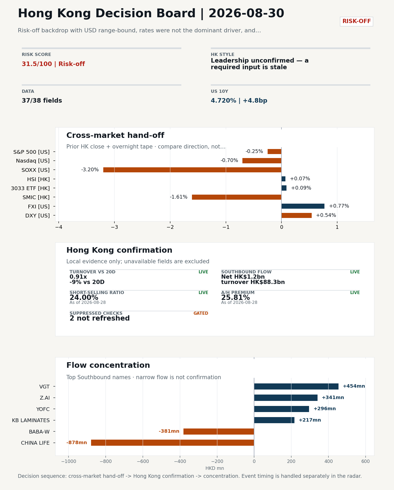
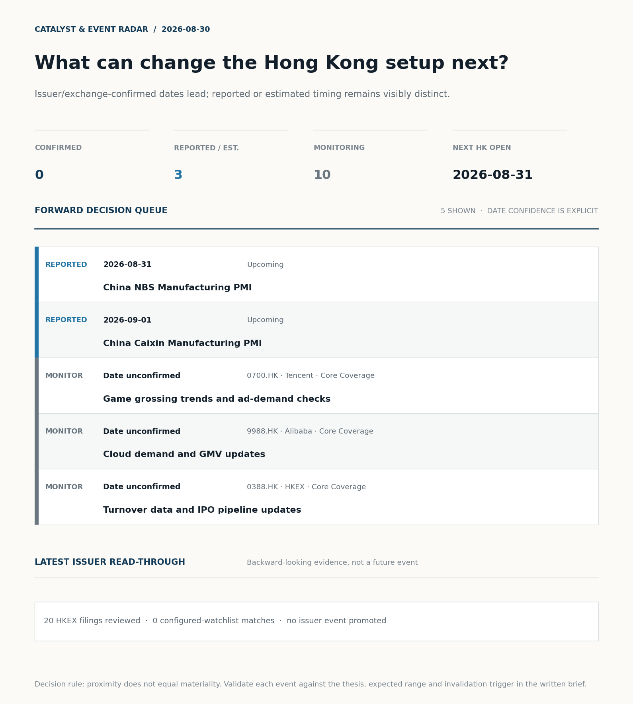
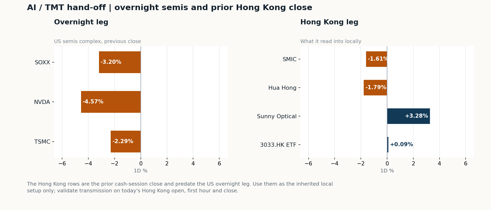
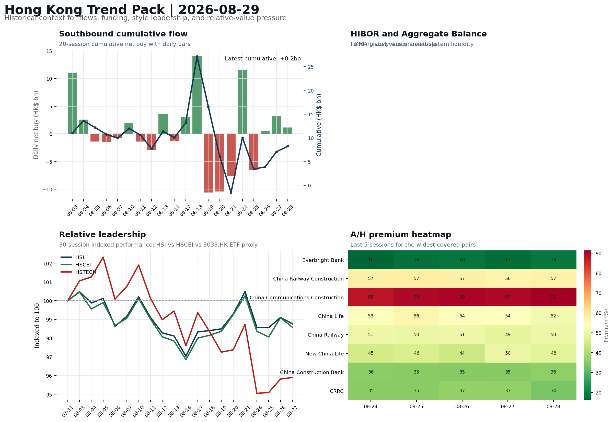

# Morning Research Workbench | 2026-08-30

> **Commute reading route:** `Layer 1 scan (5 min)` → `Layer 2 deep read` → `Layer 3 and appendix if time allows`
>
> Mode: `Weekly Review` | Synthesize the completed Hong Kong week into next-week preparation rather than treating Sunday as a fresh session.

_Data through: US/global `2026-08-28` | HK `2026-08-28` | A-share `2026-08-28` | Generated `2026-08-30 07:20:23`_

## Executive Summary

- **Did yesterday's call work?** UNRESOLVED - No comparable next close is available yet, so the call is still open.
- **What changed overnight?** Semis led lower: SOXX -3.20%, NVDA -4.57%, TSMC -2.29%. HSI +0.07% and 3033.HK +0.09%.
- **What it means for AI/TMT** Style call withheld: 3033.HK ETF / HSCEI comparison blocked: effective dates differ (2026-08-27 vs 2026-08-28). The stale input is excluded from the risk score.
- **What to watch today** Next scheduled catalyst: China NBS Manufacturing PMI on 2026-08-31. Confirm if SMIC and Hua Hong open in the same direction as the overnight leg and hold it through the first hour; invalidate if they track HSCEI instead.

## Layer 1 | Weekly Scan (5 min)

### 1.1 Last Week's Call
**Verdict: UNRESOLVED.** No comparable next close is available yet, so the call is still open.

**Recent record.** 6 confirmed / 4 broken over the last 10 scoreable calls (60.0% hit rate). This is a directional close-to-close diagnostic, not a track record.

### 1.2 Opening Decision Board

**Global-to-Hong Kong signals**

_Decision-useful subset: each row states the implication and the next test. Descriptive secondary monitors are kept out of the five-minute scan._

| Signal | Last / move | Interpretation | Confirmation / invalidation |
| --- | --- | --- | --- |
| S&P 500 | 7,711.76 / -0.25% | Broad US risk fell without a clear driver in today's fields; treat it as beta, not a signal. | Watch whether Nasdaq and offshore-China proxies move the same way. |
| Nasdaq 100 | 29,433.43 / -0.70% | Growth lagged broad beta, warning that headline risk-on may not transmit cleanly to the 3033.HK ETF proxy. | 3033.HK versus HSI leadership carries the read; rising yields would undo it. |
| Hang Seng Index | 25,584.79 / +0.07% | Broad beta rose with no single driver visible in today's fields. | Southbound participation decides whether this is investable or just a print. |
| Hang Seng TECH ETF (3033.HK) | 4.5360 / +0.09% | Growth and broad beta moved together; there is no decisive style rotation yet. | Needs a stable CNH and Southbound buying to become a duration signal. |
| Semiconductors (SOXX) | 508.62 / **-3.20%** | Semis underperformed the Nasdaq by 2.50pp, so this is a cycle move rather than broad growth weakness. | SMIC and Hua Hong at the open show whether it transmits to Hong Kong. |
| US 10Y | 4.7200% / +4.8bp | The yield proxy rose, tightening the discount-rate backdrop for long-duration Hong Kong growth. | Read it through 3033.HK relative performance, not the index level. |
| USD/CNH | 6.7130 / -0.03% | CNH was stable, removing an immediate FX impulse but not confirming equity direction. | FXI and Southbound flow decide whether this reaches Hong Kong equities. |
| VIX | 14.43 / -0.55% | Lower implied volatility reduces near-term stress, but is supportive only if equity breadth confirms. | Falling volatility on narrowing breadth is a warning, not support. |

_Secondary monitors retained in the source bundle: SMIC (0981.HK), CSI 300, China 10Y, CN-US 10Y spread, DXY, USD/HKD, Brent crude, COMEX gold, Copper._

**Hong Kong local confirmation**

_Coverage gate: 1 unavailable local checks are suppressed here and retained in validation metadata._

| Check | Value | Status | Source / as of | Why it matters |
| --- | --- | --- | --- | --- |
| Main Board turnover vs 20D | 0.91x \| -9% vs 20D | Live local | HKEX \| 2026-08-28 | Trailing 20-session average turnover was HK$255.0bn. |
| Southbound / Northbound net flow | Southbound Net HK$1.2bn \| turnover HK$88.3bn \| Northbound Turnover RMB278.1bn \| net not reported | Live local | HKEX Connect \| 2026-08-28 | Southbound net buy is calculated from HKEX disclosed buy and sell turnover. |
| Short-selling ratio | 24.00% | Live local | HKEX \| 2026-08-28 | Official HKEX stock-level short-selling table, aggregated as a share of total market turnover. |
| AH premium index | 25.81% | Live public | Yahoo \| 2026-08-28 | Fixed 10-name basket, equal-weighted, both legs priced on the same date; comparable across dates. Covered-pair average was +32.80% across 20 pairs. |
| USD/HKD spot vs band | 7.8391 | Live quote | Yahoo \| 2026-08-28 | Mid-band: 109 pips from the weak side and 891 pips from the strong side, so the peg is not an active constraint. |
| Hong Kong leadership | Leadership unconfirmed - a required input is stale | Proxy | HSI / HSCEI / 3033.HK ETF relative \| 2026-08-28 | Use HSI / HSCEI / 3033.HK ETF relative moves as the opening style read. |

**Risk state and evidence**

**Composite risk score:** `31.5/100` | **Regime:** `Risk-off`

| Component | Score impact | Evidence |
| --- | --- | --- |
| US beta | -1.5 | S&P 500 -0.25% |
| HK growth ETF proxy | +0.4 | 3033.HK ETF +0.09% |
| Semis complex | -9 | SOXX -3.20% |
| Offshore China proxy | +3.9 | FXI +0.77% |
| Dollar pressure | -5.4 | DXY +0.54% |
| Volatility | +1.1 | VIX -0.55% |
| HK short-selling | -8 | Short-selling ratio 24.00% |
| HK turnover | +0 | Turnover 0.91x 20D |

_Base 50 plus the component deltas above. Semis complex entered the score on 2026-08-22; earlier scores in the ledger exclude it._

**Next Week Checklist**

1. **Risk-off backdrop with USD range-bound, rates were not the dominant driver, and FXI outperformed Nasdaq 100**
 Still-moving markets | No fresh Hong Kong cash session is assumed; use global active assets and policy/event flow to prepare the next open.
2. **China NBS Manufacturing PMI (Upcoming)**
 Macro / policy | Growth direction, cyclicals, and manufacturing-chain pricing | Industries: Machinery, Building materials, Industrials
3. **US Non-Farm Payrolls (Upcoming)**
 Macro / policy | Watch whether it changes the day's core market narrative | Industries: Market-wide
4. **China Caixin Manufacturing PMI (Upcoming)**
 Macro / policy | Growth direction, cyclicals, and manufacturing-chain pricing | Industries: Machinery, Building materials, Industrials

## Visual Dashboard

**Catalyst & Event Radar**

**Chart read:** No issuer/exchange-confirmed event date is populated; 3 reported or estimated timing item(s) and 10 undated trigger(s) remain explicit.

_Source: Public calendars, issuer disclosures and configured research watchlists_
## Layer 2 | Core Research (20-30 min)

### 2.1 Global-to-Hong Kong Transmission
> Weekly review mode: synthesize the completed Hong Kong week, retain the main cross-asset and policy lessons, and convert them into next-week preparation rather than treating Saturday as a fresh cash-market session.

**Market Setup**
**Core tape.** Overnight US evidence (2026-08-28 close) shows a divided tape: S&P 500 -0.25% and Nasdaq 100 -0.70% with NVDA -4.57%, SOXX -3.20% and TSM -2.29% dragging AI and semis.
**Main driver.** USD stayed range-bound (DXY +0.54%, USD/CNH -0.03%), so rates were not the dominant driver; the 10Y +4.8bp move and WTI +1.58% reflect a stickier-rates and geopolitics overlay rather than a fresh USD leg.
**HK relevance.** The prior-HK tape (HSI +0.07%, HSCEI +0.00%, 3033.HK ETF +0.09%) was essentially flat, so the overnight US selloff is a new headwind rather than a confirmation of last week's move.

**Key Drivers**
- AI capex complex led the US downside.
- USD was range-bound and rates were not the dominant driver.
- Offshore-China tape outperformed: FXI +0.77% versus Nasdaq 100 -0.70% points to China-specific positioning, supported by Southbound +HK$1.2bn net buying last session and the weekly +9.8bn cumulative reading.
- Geopolitical and policy overlay: U.S.-China rhetorical flare-up ahead of Xi's Washington visit and a Warsh-pivot Fed setup keep the risk premium on HK risk assets even with stable CNH; short-selling ratio 24.0% (100th pct, 60-session) argues against chasing any rebound without breadth confirmation.

**Hong Kong Read-Through**
**Opening implication.** For the 2026-08-31 open, the base case is that the AI/semis selloff reaches HK through SMIC and Hua Hong before the broader index feels it, while any constructive open requires 3033.HK ETF and FXI to confirm offshore-China bid alongside cleaner breadth.
_Hong Kong style leadership and flow confirmation are set out in the Hong Kong review below._

**Watch Points**
- USD composite moved higher by +0.01pct intraday, with a 0.383pct range.
- Main turning points appeared around 2026-08-28 08:15 peak / 2026-08-28 08:35 trough / 2026-08-28 08:55 peak, suggesting event-driven repricing rather than a clean one-way USD move.
- The biggest cross-asset divergence was FXI versus Nasdaq 100, a spread of 0.293pct.
- Gold moved -2.75pct intraday with a 3.554pct high-low range.

**Weekly Review Map**
- Weekly review window: 2026-08-24 to 2026-08-28. Core regime: Risk-off backdrop with USD range-bound, rates were not the dominant driver, and FXI outperformed Nasdaq 100. Hong Kong leadership: Leadership could not be determined cleanly.
- Method note: Trend summary uses the latest available five observations from the Hong Kong Trend Pack inputs.

**Cross-asset weekly dashboard**

| Asset | Latest move | Weekly read |
| --- | --- | --- |
| S&P 500 | -0.25% | Risk appetite |
| Nasdaq 100 | -0.70% | Growth style |
| Hang Seng Index | +0.07% | Hong Kong beta |
| Hang Seng TECH ETF (3033.HK) | +0.09% | Hong Kong growth / internet proxy |
| DXY | +0.54% | Global liquidity |
| US 10Y Treasury Yield | +4.8bp | Rates path |
| Gold | +0.25% | Hedge / real yields |
| VIX | -0.55% | Volatility and hedging |

**Hong Kong / China weekly tape**

| Signal | Latest move | Read |
| --- | --- | --- |
| Hang Seng Index | +0.07% | Hong Kong beta |
| Hang Seng China Enterprises Index | +0.00% | China SOE / H-share tone |
| Hang Seng TECH ETF (3033.HK) | +0.09% | Hong Kong growth / internet proxy |
| China Large-Cap (FXI) | +0.77% | China sentiment |
| USD/CNH | -0.03% | China FX sentiment |
| USD/HKD | +0.00% | Hong Kong funding lens |

**Five-session trend evidence**
_Window: 2026-08-21 to 2026-08-28_

| Signal | Five-session change | Latest | Desk read |
| --- | --- | --- | --- |
| Southbound flow | +9.8bn over 5 sessions | +1.2bn | 4/5 positive sessions; cumulative buying is the flow-confirmation test for next week. |
| HK style leadership | HSCEI led (-1.7pp); HSTECH lagged (-2.8pp) | HSCEI leadership | Use HSI / HSCEI / 3033.HK ETF spread to separate broad beta from growth-led rerating. |
| A/H premium dispersion | +0.8pp average change | 48.4% average premium | Premium narrowing can support H-share relative demand |

**Flow and attribution clues**
- :
- :
- :

**Next-week desk questions**
- Did Southbound flow confirm the index move, or was the week mainly offshore beta without local money follow-through?
- Did HIBOR and Aggregate Balance point to benign funding, or should tighter HKD liquidity be part of next week's risk case?
- Was leadership broad enough beyond the 3033.HK ETF / platform beta proxy, or was the week concentrated in a narrow style pocket?
- Which dated macro, policy, earnings, or IPO catalyst can realistically change the next-week narrative?
- What single data point would invalidate the base-case market pulse by Monday or Tuesday morning?

**Key developments to retain**

| Bucket | Item | Why it matters |
| --- | --- | --- |
| B | HP inks deal with U.S.-blacklisted Huawei for licensing the | Capital allocation or shareholder-return events can trigger a valuation reset |
| B | Z.ai shares surge 8% after releasing new AI model running only | This is more about order visibility and product-cycle validation |
| C | Guggenheim Ties Weigh on Acrisure Debt, Dragging High-Yield | Assess whether the story can propagate through the Financials value chain |
| C | Supercars Fuel a New Hybrid Boom | Assess whether the story can propagate through the Autos and EV value chain |
| Upcoming | China NBS Manufacturing PMI | Growth direction, cyclicals, and manufacturing-chain pricing |
| Upcoming | US Non-Farm Payrolls | Watch whether it changes the day's core market narrative |

**Next-week playbook**

| Date | Catalyst | Desk read |
| --- | --- | --- |
| 2026-08-31 | China NBS Manufacturing PMI | Growth direction, cyclicals, and manufacturing-chain pricing |
| 2026-09-01 | China Caixin Manufacturing PMI | Growth direction, cyclicals, and manufacturing-chain pricing |
| 2026-09-04 | US Non-Farm Payrolls | Watch whether it changes the day's core market narrative |

**Curated overnight stories**
1. **Trump ratchets up rhetoric against Beijing as U.S.-China officials meet for Xi's**
 Why it matters: Headline-level U.S.-China tension overlapping an actual diplomatic track sets the geopolitical risk premium for offshore-China assets into the next HK session.
 HK read-through: Direct read-across to Hang Seng risk appetite and CNH; cyclicals, ADRs and policy-sensitive names (internet, semis, EV) most exposed.
2. **HP inks deal with U.S.-blacklisted Huawei for licensing the Chinese company's WiFi tech**
 Why it matters: A U.S. hardware major licensing tech from a blacklisted Chinese vendor is a notable signal on the practical limits of the entity-list regime and on Huawei's commercial…
 HK read-through: Maps to Hong Kong-listed China tech hardware, telecom equipment and Huawei-exposed supply chain names. Read-through is more valuation-and-thesis than a single-day catalyst.
3. **Z.ai shares surge 8% after releasing new AI model running only on Chinese chips**
 Why it matters: Confirms incremental validation of a China-domestic AI compute stack, the core debate for HK semis and AI names.
 HK read-through: Most relevant for Hong Kong-listed Chinese AI and semiconductor names, and for the AI-server supply chain. The 8% move is a sentiment pulse.
4. **September Fed decision now a coin flip as rate-hike odds increase post-Warsh**
 Why it matters: Warsh's Jackson Hole pivot to a less-dovish tone has narrowed the path of U.S. rates and keeps the USD range-bound setup that the weekly theme flags.
 HK read-through: Primary channel is via USD/CNH and the discount applied to Hong Kong growth names.
5. **China NBS and Caixin Manufacturing PMI (upcoming), with U.S. NFP the cross-check**
 Why it matters: First hard data check on Chinese manufacturing momentum after the week's risk-off tape and against the U.S. cyclical read.
 HK read-through: Direct read for Hong Kong cyclicals (machinery, building materials, industrials), China financials and resource names. We do not yet have the prints.

**AI / TMT hand-off**

**Overnight leg.** The overnight semis leg was risk-off at -3.35% average (SOXX -3.20%, NVDA -4.57%, TSMC -2.29%).
**Hong Kong expression.** SMIC, Hua Hong and Sunny Optical are under the most pressure at the open, and 3033.HK should be tested before the Hang Seng Index.
**Observable test.** Confirm if SMIC and Hua Hong open in the same direction as the overnight leg and hold it through the first hour; invalidate if they track HSCEI instead, which would mean local flow is overriding the global cycle.

| Name | Role in the chain | 1D | Leg |
| --- | --- | --- | --- |
| SOXX | Semis complex | -3.20% | overnight |
| NVDA | AI capex narrative | -4.57% | overnight |
| TSMC | Foundry demand | -2.29% | overnight |
| SMIC | Leading-edge / domestic substitution | -1.61% | Hong Kong |
| Hua Hong | Mature-node pricing cycle | -1.79% | Hong Kong |
| Sunny Optical | Hardware and optics supply chain | +3.28% | Hong Kong |
| 3033.HK ETF | Broad HK tech beta | +0.09% | Hong Kong |

**Clock discipline.** The Hong Kong rows are the prior cash-session close and predate the US overnight leg. Use them as the inherited local setup only; validate transmission on today's Hong Kong open, first hour and close.

### 2.2 Hong Kong Local Tape and Flow
**Local Tape Setup**
**Local read.** The completed 2026-08-24 to 2026-08-28 Hong Kong week ran into a risk-off backdrop with USD range-bound and FXI outperforming Nasdaq 100, suggesting China-specific positioning rather than USD rates did the work.
**Verification point.** Weekly trend_summary shows HSCEI leading HSTECH (-1.7pp versus -2.8pp) with the HSI/HSCEI/3033.HK spread still unconfirmed for leadership, and Southbound net buying of +HK$1.2bn on HK$88.3bn turnover extending a +HK$9.8bn five-session cumulative - the cleanest flow-confirmation test for next week.
**Risk to watch.** Local signals into Monday 2026-08-31 are mixed: short-selling at 24.0% (100th percentile, 60-session) and turnover at 0.91x 20D argue against chasing any rebound without breadth confirmation.

**Style and Local Leadership**
**Style call.** Leadership unconfirmed - a required input is stale.
- **Evidence:** No same-date 3033.HK-versus-HSCEI comparison was possible because 3033.HK ETF / HSCEI comparison blocked: effective dates differ (2026-08-27 vs 2026-08-28)
- **Portfolio meaning:** Do not infer Hong Kong style from the headline index alone; wait for relative price and local-flow evidence.
- **Cross-market read:** Hang Seng +0.07% / HSCEI +0.00% / 3033.HK ETF +0.09%. Offshore China proxy FXI +0.77% and USD/CNH -0.03% frame cross-border risk appetite. USD/HKD last traded around 7.8391, which keeps the Hong Kong funding lens in focus.

**Flow Confirmation**
Official Stock Connect evidence is available; the Flow Tracker confirms whether local money supports the price action.

**Follow-Through Checklist**
**Follow-through check.** Confirmation test for Monday 2026-08-31: 3033.HK ETF and SMIC must hold or improve versus HSCEI/2828.HK alongside a fresh Southbound net-buy print to validate a growth-led open.
**Failure condition.** Any style claim remains invalid while the required relative-performance fields are missing or stale.

**Cross-asset attribution**

| Driver | Direction | Score | Evidence | HK implication |
| --- | --- | --- | --- | --- |
| Short-selling pressure | drag | 6.3 | HKEX short-selling ratio was 24.00%. | Elevated short activity argues for extra confirmation before chasing rebounds. |
| Oil and geopolitics | mixed | 1.7 | Oil moved +2.12%. | Split the read between energy/cyclicals support and margin/geopolitical pressure. |
| Dollar / CNH pressure | drag | 0.81 | DXY +0.54% / USD-CNH -0.03% | A stable or softer CNH makes Hong Kong follow-through more credible. |

**Local flow evidence**

**Flow Takeaways**
- Short-selling pressure is elevated, so local rebounds need cleaner breadth and flow confirmation.
- Stock Connect Southbound: net HK$1.2bn on turnover HK$88.3bn (as of 2026-08-28).
- Stock Connect Northbound: turnover RMB278.1bn; public file provides total turnover/top active names, not full net-buy.
- AH premium: fixed 10-name basket +25.81% (comparable across dates); covered-pair average +32.80% over 20 pairs; widest premium: Everbright Bank 77.71%.

**Stock Connect Southbound Active Names**

| # | Ticker | Name | Buy | Sell | Net buy | HKEX turnover rank |
| --- | --- | --- | --- | --- | --- | --- |
| 1 | 02628.HK | CHINA LIFE | HK$89.9mn | HK$968.4mn | HK$-878.5mn | 9 |
| 2 | 02476.HK | VGT | HK$1,204.6mn | HK$751.1mn | HK$453.5mn | 7 |
| 3 | 09988.HK | BABA-W | HK$1,290.5mn | HK$1,671.3mn | HK$-380.8mn | 2 |
| 4 | 02513.HK | Z.AI | HK$2,014.2mn | HK$1,672.8mn | HK$341.4mn | 2 |
| 5 | 06869.HK | YOFC | HK$1,731.3mn | HK$1,435.3mn | HK$295.9mn | 4 |

**AH Premium Dispersion**

| Name | A ticker | H ticker | Premium | As of |
| --- | --- | --- | --- | --- |
| Everbright Bank | 601818.SS | 6818.HK | +77.71% | 2026-08-28 |
| China Railway Construction | 601186.SS | 1186.HK | +56.89% | 2026-08-28 |
| China Communications Construction | 601800.SS | 1800.HK | +53.80% | 2026-08-28 |

**HKEX Short-Selling Watch**

| Ticker | Name | Short ratio | Short turnover | Total turnover |
| --- | --- | --- | --- | --- |
| 00388.HK | HKEX | 17.73% | HK$0.3bn | HK$1.8bn |
| 00700.HK | TENCENT | 11.62% | HK$1.5bn | HK$12.7bn |
| 00941.HK | CHINA MOBILE | 14.99% | HK$0.1bn | HK$0.9bn |

- **Short-value leaders:** 02800.HK TRACKER FUND (HK$18.1bn); 03033.HK CSOP HS TECH (HK$3.0bn); 07709.HK XL2CSOPHYNIX (HK$2.1bn); 02828.HK HSCEI ETF (HK$1.7bn).

### 2.3 Macro Transmission
**Desk read.** The week that closed on 2026-08-28 ended in a risk-off tape where USD stayed range-bound, rates did not dominate, and FXI outperformed Nasdaq 100.

**Market sensitivity.** Hong Kong leadership could not be determined cleanly, and trend signals are mixed: Southbound flow was positive in four of five sessions with +9.8bn cumulative and +1.2bn on the latest day.

**HK implication.** The A/H premium widened by 0.8pp on the week to a 48.4% average, keeping valuation friction on H-shares.

**Macro watchpoints**
- Whether Southbound sustains into Monday: flow confirmation (the +9.8bn cumulative, +1.2bn latest) is the principal counterweight to the
- Whether the NBS Manufacturing PMI on 2026-08-31 is consistent with this week's risk-off, USD-range-bound tape, or forces a reset in H-share
-
- HIBOR and Aggregate Balance into 2026-09-04: any tightening in HKD liquidity changes the Fed-path transmission into HK equity duration ahead of

| Time | Region | Event | Status | Desk read |
| --- | --- | --- | --- | --- |
| | CN | China NBS Manufacturing PMI | Upcoming | Impact: Growth direction, cyclicals, and manufacturing-chain pricing \| Attention: 5/5 \| Industries: Machinery, Building materials, Industrials |
| | US | US Non-Farm Payrolls | Upcoming | Impact: Watch whether it changes the day's core market narrative \| Attention: 5/5 \| Industries: Market-wide |
| | CN | China Caixin Manufacturing PMI | Upcoming | Impact: Growth direction, cyclicals, and manufacturing-chain pricing \| Attention: 3/5 \| Industries: Machinery, Building materials, Industrials |

**Positioning and risk backdrop**

- Detailed local flow evidence is covered under Flow Tracker and Attribution; keep this section focused on options, hedging, and macro-positioning risk.

### 2.4 Company Micro Research and Catalysts

| Grade | Sector | Headline | Why it matters | Horizon |
| --- | --- | --- | --- | --- |
| B | Semiconductors and AI | Z.ai shares surge 8% after releasing new AI model running only on | This is more about order visibility and product-cycle validation | Short-term catalyst |

**Company Event Takeaway**
**Desk read.** Weekly review for Aug 24 - 28, 2026.
**Why it matters.** The completed HK cash session closed Friday, Aug 28.
**Follow-up.** The HKEX filings are a cluster of low-grade (C) profit warnings from small-cap issuers across agriculture, finance, healthcare, data services, energy, and apparel.

**LLM Quick Takes**
- **0700.HK** | Fact: closed mid-range (54% of 60-session band) on a +1.65% day; one headline notes Tencent activating only 6.4% of its 770B-parameter AI (Hy4). Interpretation (bounded)…
- **9988.HK** | Fact: priced ~HK$80bn (~$10.2bn) placement of 710m shares at HK$112.70 on Aug 24 to fund AI buildout; insider buying reported subsequently…
- **1211.HK** | Fact: closed at the top quartile (87%) of its 60-session band on a +0.77% session; Bloomberg notes a hybrid-supercar resurgence versus slower EV adoption. Interpretation (bounded)…
- **1299.HK** | Fact: closed mid-range at 56% on +1.14%; no news attached in the dataset. Interpretation (bounded): positioning alone does not support a thesis shift…

Decision filter<h4>No immediate portfolio catalyst: 20 official filings were screened and the low-signal market set stays aggregated.</h4>
20 profit warnings

<strong>20</strong>Official filings

<strong>0</strong>Watchlist hits

<strong>0</strong>Actionable events

<strong>No event cleared the portfolio decision filter.</strong>

Broad-market filings remain traceable in the source appendix; they are not expanded here without a watchlist, estimate or liquidity read-through.

<strong>Coverage boundary.</strong> sell-side rating changes, IPO / grey-market monitor were not decision-grade in this run; their absence is not treated as confirmation that no event exists.

**Core coverage requiring follow-up**

**Core coverage**

| Name | Ticker | Last | 1D | Range position | Morning note |
| --- | --- | --- | --- | --- | --- |
| Tencent | 0700.HK | 455.20 | +1.65% | Mid-range | Marginally higher (+1.65%), mid-range at 54% of its 60-session band. |
| Alibaba | 9988.HK | 113.90 | -1.39% | Mid-range | Marginally lower (-1.39%), mid-range at 63% of its 60-session band. |

**Recent headlines for Tencent:**
- [Tencent Activates Just 6.4% of Its 770 Billion-Parameter AI](https://finance.yahoo.com/technology/ai/articles/tencent-activates-just-6-4-174027049.html) (GuruFocus.com)
**Recent headlines for Alibaba:**
- [Thinking of Buying Alibaba Stock Now? Here's 1 Green Flag and 1 Red Flag.](https://www.fool.com/investing/2026/08/29/thinking-of-buying-alibaba-stock-now-heres-one-gre/) (Motley Fool)

**Priority follow-up**

| Name | Ticker | Last | 1D | Range position | Morning note |
| --- | --- | --- | --- | --- | --- |
| AIA | 1299.HK | 75.50 | +1.14% | Mid-range | Marginally higher (+1.14%), mid-range at 56% of its 60-session band. |
| BYD Company | 1211.HK | 91.95 | +0.77% | Top of range | Marginally higher (+0.77%), in the top quartile of its 60-session range (87%). |

### 2.5 Morning Meeting Questions
**Q1. Why is there no style call today?**
- **Evidence:** 3033.HK ETF / HSCEI comparison blocked: effective dates differ (2026-08-27 vs 2026-08-28).
- **How to answer:** A required input was stale, so any relative-performance claim would have compared two different dates. The call is withheld rather than published on partial evidence, and the stale input is excluded from the risk score.

**Q2. Short selling was very high at 24.0% - who is positioned against this market?**
- **Evidence:** Short-selling ratio 24.0% (100th pct of the last 60 sessions, very high).
- **How to answer:** Check the concentration before reading it as bearish: ETF-heavy short turnover is macro hedging, while single-name pressure is company-specific. The HKEX short-selling table in this report separates the two.

## Layer 3 | Session Playbook (8-12 min)

### 3.1 Base Case and Scenario Map
**Starting posture.** Leadership unconfirmed - a required input is stale (unconfirmed); composite risk `31.5/100` (Risk-off). Do not infer Hong Kong style from the headline index alone; wait for relative price and local-flow evidence.

**Scenario map**

| Scenario | Observable trigger | Interpretation | Research response |
| --- | --- | --- | --- |
| Selective growth confirms | First refresh 3033.HK and HSCEI on the same session and basis; then require a >0.5pp first-hour 3033.HK lead, stable CNH and firmer semis. | The style thesis becomes measurable only after the comparison is aligned. | Keep internet/platform leadership on watch; do not upgrade it from the stale comparison alone. |
| Broad beta confirms | HSI and HSCEI rise together with improving breadth and normal first-hour turnover. | A broad market move is observable even while the style spread remains unavailable. | Research financials, SOEs and index-heavy names alongside growth leaders. |
| Risk-off continuation | HSI and HSCEI weaken, semis lag and CNH depreciation accelerates. | Local risk appetite is deteriorating without a reliable style offset. | Treat rebounds as unconfirmed; focus on balance-sheet, catalyst and crowding risk. |

**Clocked validation scorecard**

| Window | Check | Prior evidence | Pass condition | What it decides |
| --- | --- | --- | --- | --- |
| 09:30-10:30 | 3033.HK vs HSCEI | Same-session style spread unavailable | Refresh both legs on one session/basis; only then test for a >0.5pp lead | Whether growth leadership survives the open |
| 09:30-10:30 | Semiconductor hand-off | SMIC -1.61%; Hua Hong Semiconductor -1.79% | Stabilise after the open; at least one stops underperforming HSCEI | Whether overnight semis pressure is contained locally |
| 09:30-10:30 | HSI price zone | 25,585 vs 25,500 / 26,000 reference grid | Hold above the lower grid or reclaim the upper grid with breadth | Whether broad beta is stabilising; grid is derived, not technical analysis |
| 09:30-10:30 | USD/CNH | 6.713 \| -0.03% | No acceleration in CNH depreciation | Whether FX permits a clean Hong Kong risk extension |
| At close | Turnover | 0.91x \| -9% vs 20D | At least 1.0x the 20-session average | Whether the move had normal participation |
| At close | Southbound | Net HK$1.2bn \| turnover HK$88.3bn | Net buying remains positive and broadens beyond one or two names | Whether mainland money confirms the price move |
| At close | Short pressure | 24.00% | Falls versus the prior verified reading (24.00%) | Whether rebound conviction improved |

**Upgrade rule.** Confirm only after HSI, HSCEI, 3033.HK, turnover, and Southbound evidence refresh on a comparable date.
**Kill switch.** Any style claim remains invalid while the required relative-performance fields are missing or stale.
**Clock discipline.** At 07:30, same-day Southbound, turnover and short-selling outcomes are not known. Use the first-hour price/FX checks provisionally and make the final classification only after the close.
**Event clock.** No same-day decision-grade item is populated; the nearest reported/estimated item is China NBS Manufacturing PMI on 2026-08-31. Verify the issuer or official calendar before relying on the date.

### 3.2 Conditional Theme Deep Dive

| Field | Read |
| --- | --- |
| Theme | AI and Compute Chain |
| Angle for the day | Track whether global AI capex, semis, cloud, and server demand are still carrying offshore China internet and hardware sentiment. |

**Theme desk read**
**Core thesis.** The AI and Compute Chain remains the right framing for the week ahead because the global evidence tilted negative before Friday's close.
**Evidence.** NVDA -4.57% and SOXX -3.20% weakened the AI capex narrative, and the read-through into Hong Kong is mechanical: SMIC, Hua Hong and the 3033.HK ETF are the first names to be tested on Monday's open.
**What to test.** The offsetting local signal is Z.ai's +8% on a Chinese-chip-only model launch, which is more a product-cycle and order-visibility datapoint than a re-rating event.

**Signals to keep in mind**
- Z.ai shares surge 8% after releasing new AI model running only on Chinese chips
- Guggenheim Ties Weigh on Acrisure Debt, Dragging High-Yield Credit Markets: Assess whether the story can propagate through the Financials
- NVDA -4.57%: The AI capex narrative weakens; expect it to reach HK through sentiment before earnings.
- SOXX -3.20%: Semis sold off, so SMIC, Hua Hong and 3033.HK are the first HK names to be tested.

**LLM watch items:**
- Monday open in SMIC, Hua Hong and 3033.HK ETF as the first HK expression of NVDA/SOXX weakness
- Tencent follow-through on the Hy4 efficiency story; treat any move as marginal information until external benchmarks confirm inference economics.
- Alibaba price action relative to the HK$112.70 placement level; insider buying is the key offset to dilution and should be tracked daily.
- Southbound flow on Monday: a fifth positive session would confirm the +9.8bn weekly print as accumulation
- A/H premium reaction to the PMIs; a narrowing premium supports H-share relative demand and would be the cleanest confirmation that the week was not

**Related names to keep close:**

| Name | Ticker | Bucket | Morning read |
| --- | --- | --- | --- |
| Tencent | 0700.HK | Core coverage | Marginally higher (+1.65%), mid-range at 54% of its 60-session band. |
| Alibaba | 9988.HK | Core coverage | Marginally lower (-1.39%), mid-range at 63% of its 60-session band. |
| AIA | 1299.HK | Priority follow-up | Marginally higher (+1.14%), mid-range at 56% of its 60-session band. |

**Upcoming catalysts tied to the theme:**
- 2026-08-31 | China NBS Manufacturing PMI | Growth direction, cyclicals, and manufacturing-chain pricing
- 2026-09-01 | China Caixin Manufacturing PMI | Growth direction, cyclicals, and manufacturing-chain pricing

**Relevant headlines:**
- [Z.ai shares surge 8% after releasing new AI model running only on Chinese chips](https://www.cnbc.com/2026/08/27/zai-shares-surge-new-ai-model-using-chinese-chips.html)
- [Guggenheim Ties Weigh on Acrisure Debt, Dragging High-Yield Credit Markets](https://www.bloomberg.com/news/articles/2026-08-29/guggenheim-stain-piles-onto-biggest-junk-laggard-credit-weekly)
- [Supercars Fuel a New Hybrid Boom](https://www.bloomberg.com/news/videos/2026-08-29/supercars-fuel-a-new-hybrid-boom-video)

### 3.3 Daily One Chart
**Daily One Chart | HKEX short-selling pressure map**

**Chart read.** Market short-selling reached 24.00% of turnover.
**Why it matters.** The chart leads today because the pressure is either broad, concentrated, or acute in the top name.

_Source: HKEX Daily Quotations - Short Selling Turnover_

### 3.4 Hong Kong Trend Pack
**Hong Kong Trend Pack**

**Trend read.** Four historical lenses: Southbound cumulative flow, HKMA funding and liquidity, HSI/HSCEI/3033.HK ETF relative leadership, and A/H premium dispersion.

_Source: HKEX Stock Connect, HKMA liquidity data, and public Yahoo Finance quotes_

## Optional Appendix | Traceability and Performance (10-15 min)

### Report Metadata
> Date policy: Review date 2026-08-29 is treated as `Weekly Review`. | Global (US/Europe) data date is 2026-08-28; adapter effective date is 2026-08-28 and summary date is 2026-08-28. | Hong Kong local data date is 2026-08-28; role: last completed HK/China cash-market reference tape.
> Market data quality: Coverage: `37/38` | Missing: `1`
> Report quality: `90.4/100` | Grade `B` | Status `usable with caveats`

### Report Quality and Validation
- **Quality score:** 90.4/100 | **Grade:** B | **Status:** usable with caveats
- **Run summary:** 8 healthy | 2 caveat | 0 failed
- **Release recommendation:** Send with caveats | The report is usable, but the advisory guidance should travel with it so readers understand the data gaps.

| Source | Status | Bucket |
| --- | --- | --- |
| Macro calendar | partial | caveat |
| Risk and sentiment feed | partial | caveat |

**Desk-use guidance summary:** 0 blocking | 1 advisory

**Desk-use guidance**
- **Advisory:** Questionable narrative fields were removed; use the deterministic fallback copy and review the audit trail.
- **Grade capped:** 1 prose defect(s) detected: 1 severed_list.
- **Grade capped:** Hong Kong style comparison blocked: effective dates differ (2026-08-27 vs 2026-08-28)

| Weak component | Score | Read |
| --- | --- | --- |
| Hong Kong local metrics | 54.1 | 5 live, 3 proxy, 3 unavailable local checks. |

**Quality warnings**
- Hong Kong local metrics is weak: 5 live, 3 proxy, 3 unavailable local checks.
- Narrative fact-check guardrail produced warnings; review the validation table before relying on narrative sections.
- Hong Kong style comparison was withheld because the input dates or bases were not aligned.

**Narrative fact-check guardrail**
- Checked 35 numeric claims; 0 numeric mismatch(es), 0 logic warning(s); 12 structured claims, 0 source/text warning(s); 0 critical, 0 review. Replaced 1 unsafe narrative field(s) with deterministic fallback copy.
- **Deterministic fallback fields:** tasks.macro_interpretation.watchpoints[2]

_Full component weights, per-source freshness, adapter status and provenance records are archived with this report under `audit/` rather than printed here._

### Historical Signal Performance
- **Readiness:** exploratory with caveats | 69 observations | 89 active signal dates | next-close entry, 10bps cost, no same-day returns.
- **Interpretation boundary:** exploratory until a benchmark reaches 252 sessions and 100 active-signal sessions.
- **Data-quality caveat:** 23 conflicting price revision(s) and 6 non-session observation(s) remain in the research ledger.
- **Daily-use boundary:** cumulative return, Sharpe and the performance chart stay out of the daily commute edition until the sample and trading-calendar gates pass; use Yesterday's Call instead.

### Source Links
- [Z.ai shares surge 8% after releasing new AI model running only on Chinese chips](https://www.cnbc.com/2026/08/27/zai-shares-surge-new-ai-model-using-chinese-chips.html) (cnbc_markets)
- [Tencent Activates Just 6.4% of Its 770 Billion-Parameter AI](https://finance.yahoo.com/technology/ai/articles/tencent-activates-just-6-4-174027049.html) (GuruFocus.com)
- [Thinking of Buying Alibaba Stock Now? Here's 1 Green Flag and 1 Red Flag.](https://www.fool.com/investing/2026/08/29/thinking-of-buying-alibaba-stock-now-heres-one-gre/) (Motley Fool)
- [Alibaba Shares Fell on a $10 Billion AI Raise. Insiders Saw a Buying Opportunity](https://finance.yahoo.com/markets/stocks/articles/alibaba-shares-fell-10-billion-035502952.html) (Insider Monkey)
- [Meituan (MPNGF) (Q2 2026) Earnings Call Highlights: Record Revenue and Strategic AI Pivot Drive...](https://finance.yahoo.com/markets/stocks/articles/meituan-mpngf-q2-2026-earnings-190123345.html) (GuruFocus.com)
- [Meituan Returns to Profit as Food-Delivery Competition Eases](https://www.wsj.com/business/earnings/meituan-returns-to-profit-as-food-delivery-competition-eases-1026a0e9?siteid=yhoof2&yptr=yahoo) (The Wall Street Journal)
- [00875.HK Profit warning / alert announcement](http://www1.hkexnews.hk/listedco/listconews/sehk/2026/0828/2026082801978.pdf) (HKEXnews)
- [01152.HK Profit warning / alert announcement](http://www1.hkexnews.hk/listedco/listconews/sehk/2026/0828/2026082800863.pdf) (HKEXnews)
- [01255.HK Profit warning / alert announcement](http://www1.hkexnews.hk/listedco/listconews/sehk/2026/0828/2026082802456.pdf) (HKEXnews)
- [01518.HK Profit warning / alert announcement](http://www1.hkexnews.hk/listedco/listconews/sehk/2026/0828/2026082804114.pdf) (HKEXnews)
- [01561.HK Profit warning / alert announcement](http://www1.hkexnews.hk/listedco/listconews/sehk/2026/0828/2026082802706.pdf) (HKEXnews)
- [08270.HK Profit warning / alert announcement](http://www1.hkexnews.hk/listedco/listconews/gem/2026/0828/2026082800571.pdf) (HKEXnews)
- [08370.HK Profit warning / alert announcement](http://www1.hkexnews.hk/listedco/listconews/gem/2026/0828/2026082800529.pdf) (HKEXnews)
- [00428.HK Profit warning / alert announcement](http://www1.hkexnews.hk/listedco/listconews/sehk/2026/0827/2026082701453.pdf) (HKEXnews)
