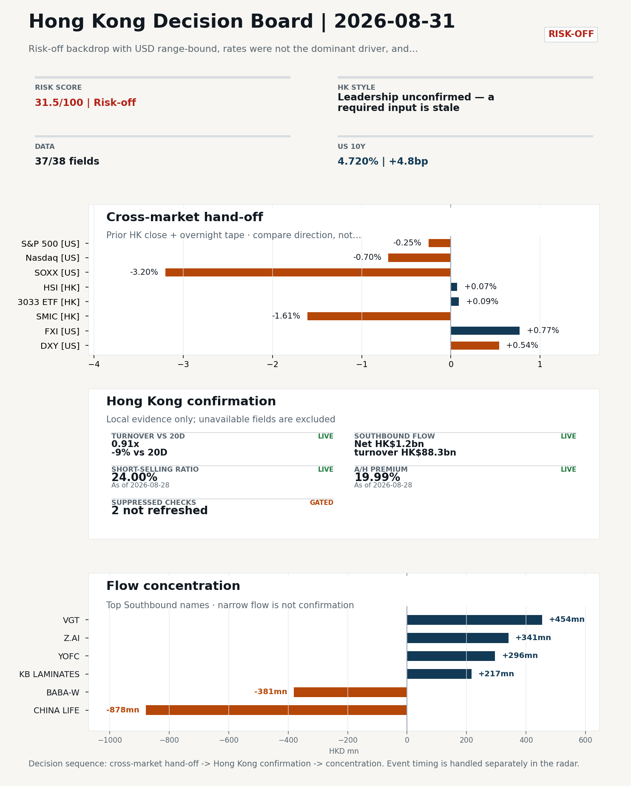
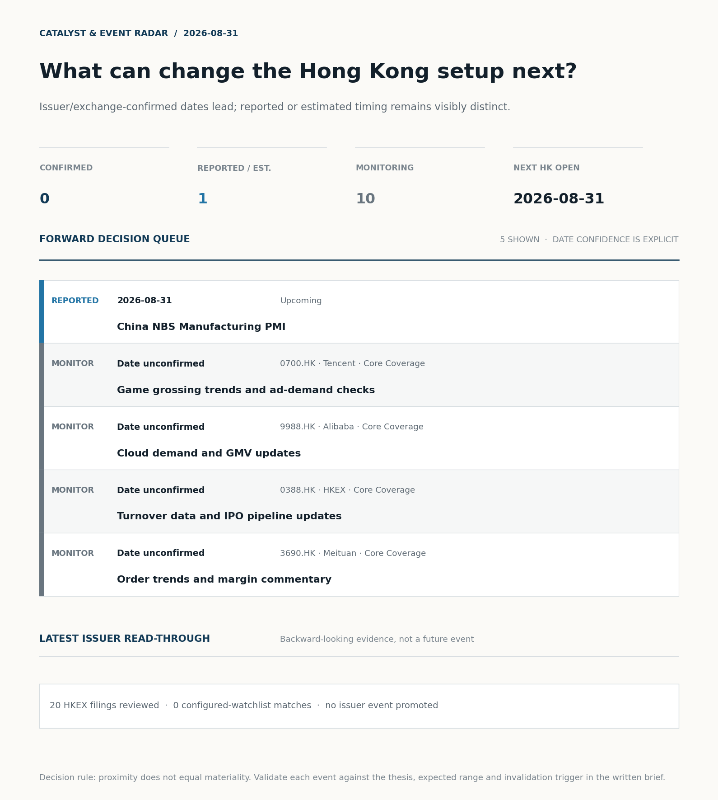
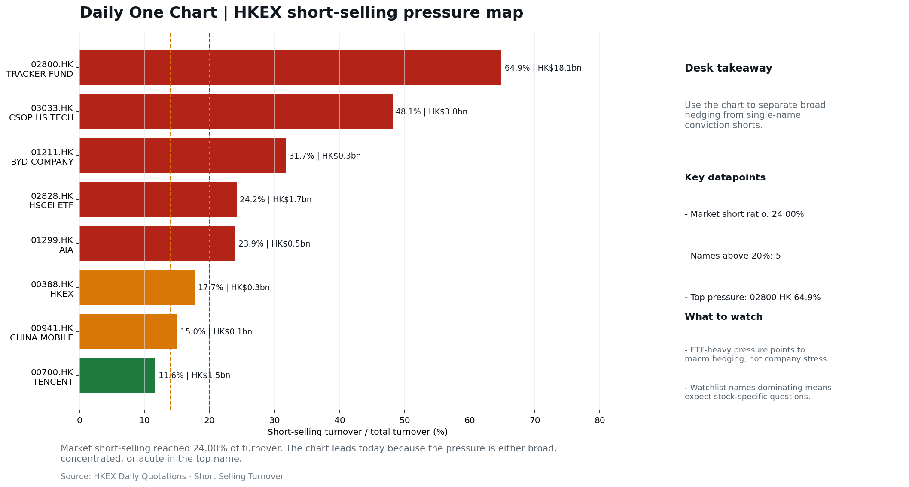

# Morning Research Workbench | 2026-08-31

> **Commute reading route:** `Layer 1 scan (5 min)` → `Layer 2 deep read` → `Layer 3 and appendix if time allows`
>
> Mode: `Week Ahead` | Use Friday's close as the baseline, lay out the week's calendar, and name the key things to watch.

_Data through: US/global `2026-08-28` | HK `2026-08-28` | A-share `2026-08-28` | Generated `2026-08-31 07:30:00`_

## Executive Summary

- **Did yesterday's call work?** UNRESOLVED - No comparable next close is available yet, so the call is still open.
- **What changed overnight?** Semis led lower: SOXX -3.20%, NVDA -4.57%, TSMC -2.29%. HSI +0.07% and 3033.HK +0.09%.
- **What it means for AI/TMT** Style call withheld: 3033.HK ETF / HSCEI comparison blocked: effective dates differ (2026-08-27 vs 2026-08-28). The stale input is excluded from the risk score.
- **What to watch today** China NBS Manufacturing PMI. Confirm if SMIC and Hua Hong open in the same direction as the overnight leg and hold it through the first hour; invalidate if they track HSCEI instead.

## Layer 1 | Reset (5 min)

### 1.1 Last Session's Call
**Verdict: UNRESOLVED.** No comparable next close is available yet, so the call is still open.

**Recent record.** 6 confirmed / 4 broken over the last 10 scoreable calls (60.0% hit rate). This is a directional close-to-close diagnostic, not a track record.

### 1.2 Opening Decision Board

**Global-to-Hong Kong signals**

_Decision-useful subset: each row states the implication and the next test. Descriptive secondary monitors are kept out of the five-minute scan._

| Signal | Last / move | Interpretation | Confirmation / invalidation |
| --- | --- | --- | --- |
| S&P 500 | 7,711.76 / -0.25% | Broad US risk fell without a clear driver in today's fields; treat it as beta, not a signal. | Watch whether Nasdaq and offshore-China proxies move the same way. |
| Nasdaq 100 | 29,433.43 / -0.70% | Growth lagged broad beta, warning that headline risk-on may not transmit cleanly to the 3033.HK ETF proxy. | 3033.HK versus HSI leadership carries the read; rising yields would undo it. |
| Hang Seng Index | 25,584.79 / +0.07% | Broad beta rose with no single driver visible in today's fields. | Southbound participation decides whether this is investable or just a print. |
| Hang Seng TECH ETF (3033.HK) | 4.5360 / +0.09% | Growth and broad beta moved together; there is no decisive style rotation yet. | Needs a stable CNH and Southbound buying to become a duration signal. |
| Semiconductors (SOXX) | 508.62 / **-3.20%** | Semis underperformed the Nasdaq by 2.50pp, so this is a cycle move rather than broad growth weakness. | SMIC and Hua Hong at the open show whether it transmits to Hong Kong. |
| US 10Y | 4.7200% / +4.8bp | The yield proxy rose, tightening the discount-rate backdrop for long-duration Hong Kong growth. | Read it through 3033.HK relative performance, not the index level. |
| USD/CNH | 6.7260 / +0.19% | A higher USD/CNH means a weaker offshore renminbi, a headwind for offshore-China sentiment. | FXI and Southbound flow decide whether this reaches Hong Kong equities. |
| VIX | 14.43 / -0.55% | Lower implied volatility reduces near-term stress, but is supportive only if equity breadth confirms. | Falling volatility on narrowing breadth is a warning, not support. |

_Secondary monitors retained in the source bundle: SMIC (0981.HK), CSI 300, China 10Y, CN-US 10Y spread, DXY, USD/HKD, Brent crude, COMEX gold, Copper._

**Hong Kong local confirmation**

_Coverage gate: 1 unavailable local checks are suppressed here and retained in validation metadata._

| Check | Value | Status | Source / as of | Why it matters |
| --- | --- | --- | --- | --- |
| Main Board turnover vs 20D | 0.91x \| -9% vs 20D | Live local | HKEX \| 2026-08-28 | Trailing 20-session average turnover was HK$255.0bn. |
| Southbound / Northbound net flow | Southbound Net HK$1.2bn \| turnover HK$88.3bn \| Northbound Turnover RMB278.1bn \| net not reported | Live local | HKEX Connect \| 2026-08-28 | Southbound net buy is calculated from HKEX disclosed buy and sell turnover. |
| Short-selling ratio | 24.00% | Live local | HKEX \| 2026-08-28 | Official HKEX stock-level short-selling table, aggregated as a share of total market turnover. |
| AH premium index | 19.99% | Live public | Yahoo \| 2026-08-28 | Fixed 10-name basket, equal-weighted, both legs priced on the same date; comparable across dates. Covered-pair average was +30.12% across 16 pairs. |
| USD/HKD spot vs band | 7.8385 | Live quote | Yahoo \| 2026-08-28 | Mid-band: 115 pips from the weak side and 885 pips from the strong side, so the peg is not an active constraint. |
| Hong Kong leadership | Leadership unconfirmed - a required input is stale | Proxy | HSI / HSCEI / 3033.HK ETF relative \| 2026-08-28 | Use HSI / HSCEI / 3033.HK ETF relative moves as the opening style read. |

**Risk state and evidence**

**Composite risk score:** `31.5/100` | **Regime:** `Risk-off`

| Component | Score impact | Evidence |
| --- | --- | --- |
| US beta | -1.5 | S&P 500 -0.25% |
| HK growth ETF proxy | +0.4 | 3033.HK ETF +0.09% |
| Semis complex | -9 | SOXX -3.20% |
| Offshore China proxy | +3.9 | FXI +0.77% |
| Dollar pressure | -5.4 | DXY +0.54% |
| Volatility | +1.1 | VIX -0.55% |
| HK short-selling | -8 | Short-selling ratio 24.00% |
| HK turnover | +0 | Turnover 0.91x 20D |

_Base 50 plus the component deltas above. Semis complex entered the score on 2026-08-22; earlier scores in the ledger exclude it._

**This Week Checklist**

1. **Risk-off backdrop with USD range-bound, rates were not the dominant driver, and FXI outperformed Nasdaq 100**
 Still-moving markets | No fresh Hong Kong cash session is assumed; use global active assets and policy/event flow to prepare the next open.
2. **China NBS Manufacturing PMI (Upcoming)**
 Macro / policy | Growth direction, cyclicals, and manufacturing-chain pricing | Industries: Machinery, Building materials, Industrials
3. **Bitcoin -3.02%**
 High-frequency data | Keep tracking it to confirm whether the core daily narrative is holding. (weak HK linkage; context only)
4. **Gold -2.85%**
 High-frequency data | Keep tracking it to confirm whether the core daily narrative is holding. (weak HK linkage; context only)

## Visual Dashboard

**Catalyst & Event Radar**

**Chart read:** No issuer/exchange-confirmed event date is populated; 1 reported or estimated timing item(s) and 10 undated trigger(s) remain explicit.

_Source: Public calendars, issuer disclosures and configured research watchlists_
## Layer 2 | Core Research (20-30 min)

### 2.1 This Week at a Glance
**Week Ahead Map**
- Week ahead (2026-08-31 to 2026-09-04) opens against a `Risk-off` backdrop, using Friday's close (2026-08-28) as the baseline.

**This Week's Key Events**

| Date | Type | Event | Why it matters |
| --- | --- | --- | --- |
| 2026-08-31 | Upcoming | China NBS Manufacturing PMI | Growth direction, cyclicals, and manufacturing-chain pricing |

**This Week's Calendar**
_Market open per day: HK ✓/✗, US ✓/✗, CN ✓/✗._

| Day | Markets open | Dated catalysts |
| --- | --- | --- |
| 2026-08-31 Mon | HK✓ US✓ CN✓ | China NBS Manufacturing PMI |
| 2026-09-01 Tue | HK✓ US✓ CN✓ | - |
| 2026-09-02 Wed | HK✓ US✓ CN✓ | - |
| 2026-09-03 Thu | HK✓ US✓ CN✓ | - |
| 2026-09-04 Fri | HK✓ US✓ CN✓ | - |

**Base Case / Risk Case**
- **Base case:** Cautious tape: defensives and yield proxies lead while growth re-rates; keep sizing small until breadth confirms.
- **Risk case:** A dovish policy surprise or strong Southbound buying forces a squeeze higher against the defensive positioning.

**What to Watch This Week**

| Watch | Why | Invalidation |
| --- | --- | --- |
| Open vs Friday's close (2026-08-28) | Whether the opening gap holds or fades is the first signal of the week. | The gap fades within the first session. |
| Southbound flow | Confirm the index move with local money, not offshore beta. | Southbound stays net-sell while HSI rallies. |
| HSI vs 3033.HK ETF leadership | Growth-led or value-led decides the week's style. | Any style claim remains invalid while the required relative-performance fields |
| USD/CNH and USD/HKD | FX stability is the precondition for a clean risk-on extension. | CNH breaks its recent range or USD/HKD tests the weak side. |
| Turnover vs 20-day | Thin participation makes any index move easier to fade. | The index move happens on turnover below 0.9x the 20-day average. |
| First catalyst: China NBS | Growth direction, cyclicals, and manufacturing-chain pricing | The catalyst resolves against the base case. |

**Weekend Digest**

| Channel | Signal | Why |
| --- | --- | --- |
| News | Z.ai shares surge 8% after releasing new AI model running only on | This is more about order visibility and product-cycle validation |
| Crypto | Bitcoin -3.02% | Keep tracking it to confirm whether the core daily narrative is holding. |
| Commodities | Gold -2.85% | Keep tracking it to confirm whether the core daily narrative is holding. |
| Rates | US 10Y +4.8bp | Keep tracking it to confirm whether the core daily narrative is holding. |
| Vol | VIX -0.55% | Keep tracking it to confirm whether the core daily narrative is holding. |

**Monday Morning Questions**
- Which single dated catalyst this week is most likely to change the base case?
- Does Southbound flow confirm or contradict the overnight cross-asset tone?
- Is the week likely to be beta-led or driven by a narrow style pocket?
- What data point would invalidate the base case by mid-week?

### 2.3 Macro Transmission
**Desk read.** The week ahead (2026-08-31 to 2026-09-04) opens against a Risk-off backdrop, using Friday's close (2026-08-28) as the baseline, with the only confirmed macro event being Monday's China NBS Manufacturing PMI.

**Market sensitivity.** Against this setup, the directional read is cautious: defensives and yield proxies should lead while growth re-rates, with sizing kept small until breadth confirms.

**HK implication.** The PMI is the first hard read on the just-ended month and is likely to set the tone for cyclical H-shares in machinery, building materials, and industrials.

**Macro watchpoints**
- Monday China NBS Manufacturing PMI print and the H-share cyclical response (machinery, building materials, industrials).
- Whether the Monday gap versus Friday's 2026-08-28 close holds or fades within the session.
- Southbound flow direction: net-buy would confirm any index lift, net-sell would undermine it.
- USD/CNH staying in range and USD/HKD staying away from the weak side as the FX precondition.

| Time | Region | Event | Status | Desk read |
| --- | --- | --- | --- | --- |
| | CN | China NBS Manufacturing PMI | Upcoming | Impact: Growth direction, cyclicals, and manufacturing-chain pricing \| Attention: 5/5 \| Industries: Machinery, Building materials, Industrials |

**Positioning and risk backdrop**

- Detailed local flow evidence is covered under Flow Tracker and Attribution; keep this section focused on options, hedging, and macro-positioning risk.

### 2.4 Company Micro Research and Catalysts

| Grade | Sector | Headline | Why it matters | Horizon |
| --- | --- | --- | --- | --- |
| B | Semiconductors and AI | Z.ai shares surge 8% after releasing new AI model running only on | This is more about order visibility and product-cycle validation | Short-term catalyst |

**Company Event Takeaway**
**Desk read.** Week-ahead framing (Mon 31 Aug → Fri 5 Sep): Friday's HK close (28 Aug) is the baseline under a risk-off tape where FXI outperformed Nasdaq 100 and USD was range-bound, i.e., rates are not the dominant driver.
**Why it matters.** Base case: HK benchmarks consolidate near recent highs (2828.HK and 2800.HK both in the top quartile of their 60-session bands) while AI/China-chip news continues to set marginal direction in the internet complex.
**Follow-up.** Key things to watch this week: (i) Mainland August PMIs and any follow-through on Z.ai's China-only-chip model release, which maps first to the Semiconductors/AI and Internet platforms.

**LLM Quick Takes**
- **0700.HK** | Fact: Friday close 455.20, +1.65%, mid-range (54% of 60-session band); one attached headline notes Tencent activated only ~6.4% of a ~770B-parameter AI model via the Hy4 architecture…
- **9988.HK** | Fact: Friday close 113.90, -1.39%, mid-range (63% of 60-session band); attached headlines flag a ~US$76.5m Jack Ma insider purchase on 30 Aug and a mixed AI-payoff vs.…
- **1299.HK** | Fact: Friday close 75.50, +1.14%, mid-range (56% of 60-session band); no attached headlines. Investor read: positioning is neutral with a slight positive tilt…
- **1211.HK** | Fact: Friday close 91.95, +0.77%, top-of-range (87% of 60-session band); no attached headlines. Investor read…

Decision filter<h4>No immediate portfolio catalyst: 20 official filings were screened and the low-signal market set stays aggregated.</h4>
20 profit warnings

<strong>20</strong>Official filings

<strong>0</strong>Watchlist hits

<strong>0</strong>Actionable events

<strong>No event cleared the portfolio decision filter.</strong>

Broad-market filings remain traceable in the source appendix; they are not expanded here without a watchlist, estimate or liquidity read-through.

<strong>Coverage boundary.</strong> sell-side rating changes, IPO / grey-market monitor were not decision-grade in this run; their absence is not treated as confirmation that no event exists.

**Core coverage requiring follow-up**

**Core coverage**

| Name | Ticker | Last | 1D | Range position | Morning note |
| --- | --- | --- | --- | --- | --- |
| Tencent | 0700.HK | 455.20 | +1.65% | Mid-range | Marginally higher (+1.65%), mid-range at 54% of its 60-session band. |
| Alibaba | 9988.HK | 113.90 | -1.39% | Mid-range | Marginally lower (-1.39%), mid-range at 63% of its 60-session band. |

**Recent headlines for Tencent:**
- [Tencent Activates Just 6.4% of Its 770 Billion-Parameter AI](https://finance.yahoo.com/technology/ai/articles/tencent-activates-just-6-4-174027049.html) (GuruFocus.com)
**Recent headlines for Alibaba:**
- [Why Billionaire Founder Jack Ma Just Bought $76.5 Million Worth of Alibaba Stock](https://www.barchart.com/story/news/4344863/why-billionaire-founder-jack-ma-just-bought-76-5-million-worth-of-alibaba-stock) (Barchart)

**Priority follow-up**

| Name | Ticker | Last | 1D | Range position | Morning note |
| --- | --- | --- | --- | --- | --- |
| AIA | 1299.HK | 75.50 | +1.14% | Mid-range | Marginally higher (+1.14%), mid-range at 56% of its 60-session band. |
| BYD Company | 1211.HK | 91.95 | +0.77% | Top of range | Marginally higher (+0.77%), in the top quartile of its 60-session range (87%). |

### 2.5 Morning Meeting Questions
**Q1. Why is there no style call today?**
- **Evidence:** 3033.HK ETF / HSCEI comparison blocked: effective dates differ (2026-08-27 vs 2026-08-28).
- **How to answer:** A required input was stale, so any relative-performance claim would have compared two different dates. The call is withheld rather than published on partial evidence, and the stale input is excluded from the risk score.

**Q2. Short selling was very high at 24.0% - who is positioned against this market?**
- **Evidence:** Short-selling ratio 24.0% (100th pct of the last 60 sessions, very high).
- **How to answer:** Check the concentration before reading it as bearish: ETF-heavy short turnover is macro hedging, while single-name pressure is company-specific. The HKEX short-selling table in this report separates the two.

## Layer 3 | Session Playbook (8-12 min)

### 3.1 Base Case and Scenario Map
**Starting posture.** Leadership unconfirmed - a required input is stale (unconfirmed); composite risk `31.5/100` (Risk-off). Do not infer Hong Kong style from the headline index alone; wait for relative price and local-flow evidence.

**Scenario map**

| Scenario | Observable trigger | Interpretation | Research response |
| --- | --- | --- | --- |
| Selective growth confirms | First refresh 3033.HK and HSCEI on the same session and basis; then require a >0.5pp first-hour 3033.HK lead, stable CNH and firmer semis. | The style thesis becomes measurable only after the comparison is aligned. | Keep internet/platform leadership on watch; do not upgrade it from the stale comparison alone. |
| Broad beta confirms | HSI and HSCEI rise together with improving breadth and normal first-hour turnover. | A broad market move is observable even while the style spread remains unavailable. | Research financials, SOEs and index-heavy names alongside growth leaders. |
| Risk-off continuation | HSI and HSCEI weaken, semis lag and CNH depreciation accelerates. | Local risk appetite is deteriorating without a reliable style offset. | Treat rebounds as unconfirmed; focus on balance-sheet, catalyst and crowding risk. |

**Clocked validation scorecard**

| Window | Check | Prior evidence | Pass condition | What it decides |
| --- | --- | --- | --- | --- |
| 09:30-10:30 | 3033.HK vs HSCEI | Same-session style spread unavailable | Refresh both legs on one session/basis; only then test for a >0.5pp lead | Whether growth leadership survives the open |
| 09:30-10:30 | Semiconductor hand-off | SMIC -1.61%; Hua Hong Semiconductor -1.79% | Stabilise after the open; at least one stops underperforming HSCEI | Whether overnight semis pressure is contained locally |
| 09:30-10:30 | HSI price zone | 25,585 vs 25,500 / 26,000 reference grid | Hold above the lower grid or reclaim the upper grid with breadth | Whether broad beta is stabilising; grid is derived, not technical analysis |
| 09:30-10:30 | USD/CNH | 6.726 \| +0.19% | No acceleration in CNH depreciation | Whether FX permits a clean Hong Kong risk extension |
| At close | Turnover | 0.91x \| -9% vs 20D | At least 1.0x the 20-session average | Whether the move had normal participation |
| At close | Southbound | Net HK$1.2bn \| turnover HK$88.3bn | Net buying remains positive and broadens beyond one or two names | Whether mainland money confirms the price move |
| At close | Short pressure | 24.00% | Falls versus the prior verified reading (24.00%) | Whether rebound conviction improved |

**Upgrade rule.** Confirm only after HSI, HSCEI, 3033.HK, turnover, and Southbound evidence refresh on a comparable date.
**Kill switch.** Any style claim remains invalid while the required relative-performance fields are missing or stale.
**Clock discipline.** At 07:30, same-day Southbound, turnover and short-selling outcomes are not known. Use the first-hour price/FX checks provisionally and make the final classification only after the close.
**Event clock.** Same-day decision items: China NBS Manufacturing PMI, China NBS Manufacturing PMI.

### 3.2 Conditional Theme Deep Dive

| Field | Read |
| --- | --- |
| Theme | AI and Compute Chain |
| Angle for the day | Track whether global AI capex, semis, cloud, and server demand are still carrying offshore China internet and hardware sentiment. |

**Theme desk read**
**Core thesis.** The AI and Compute Chain theme enters the week in a fragile state.
**Evidence.** Friday's overseas tape already took the air out of the global AI capex narrative: NVDA -4.57%, SOXX -3.20%, TSMC ADR -2.29%.
**What to test.** Using that close as the baseline, the first-order question for HK is whether the China-specific AI story, anchored by the Z.ai all-domestic-chip model launch, is strong enough to hold offshore China tech against a softer global tape, or whether sentiment will simply track US semis into the next open.

**Signals to keep in mind**
- Z.ai shares surge 8% after releasing new AI model running only on Chinese chips
- NVDA -4.57%: The AI capex narrative weakens; expect it to reach HK through sentiment before earnings.
- SOXX -3.20%: Semis sold off, so SMIC, Hua Hong and 3033.HK are the first HK names to be tested.

**LLM watch items:**
- China NBS Manufacturing PMI on 31 Aug: print vs consensus and sub-component detail on new orders
- NVDA / SOXX overnight follow-through into 1 Sep: confirms whether Friday's AI capex weakness was an isolated session or the start of a sentiment
- Z.ai all-domestic-chip model verification: any third-party benchmarks or hyperscaler/cloud commentary that validates whether the launch changes
- Tencent (0700.HK) marginal signals: game grossing trajectory and ad-demand checks, plus external verification of the Hy4 architecture, given the
- Alibaba (9988.HK) capex-vs-monetization read: market reaction to continued insider buying alongside analyst concern over AI spend intensity

**Related names to keep close:**

| Name | Ticker | Bucket | Morning read |
| --- | --- | --- | --- |
| Tencent | 0700.HK | Core coverage | Marginally higher (+1.65%), mid-range at 54% of its 60-session band. |
| Alibaba | 9988.HK | Core coverage | Marginally lower (-1.39%), mid-range at 63% of its 60-session band. |
| AIA | 1299.HK | Priority follow-up | Marginally higher (+1.14%), mid-range at 56% of its 60-session band. |

**Upcoming catalysts tied to the theme:**
- 2026-08-31 | China NBS Manufacturing PMI | Growth direction, cyclicals, and manufacturing-chain pricing

**Relevant headlines:**
- [Z.ai shares surge 8% after releasing new AI model running only on Chinese chips](https://www.cnbc.com/2026/08/27/zai-shares-surge-new-ai-model-using-chinese-chips.html)

### 3.3 Daily One Chart
**Daily One Chart | HKEX short-selling pressure map**

**Chart read.** Market short-selling reached 24.00% of turnover.
**Why it matters.** The chart leads today because the pressure is either broad, concentrated, or acute in the top name.

_Source: HKEX Daily Quotations - Short Selling Turnover_

## Optional Appendix | Traceability and Performance (10-15 min)

### Report Metadata
> Date policy: Review date 2026-08-30 is treated as `Week Ahead`. | Global (US/Europe) data date is 2026-08-28; adapter effective date is 2026-08-28 and summary date is 2026-08-28. | Hong Kong local data date is 2026-08-28; role: last completed HK/China cash-market reference tape.
> Market data quality: Coverage: `37/38` | Missing: `1`
> Report quality: `91.4/100` | Grade `B` | Status `usable with caveats`

### Report Quality and Validation
- **Quality score:** 91.4/100 | **Grade:** B | **Status:** usable with caveats
- **Run summary:** 8 healthy | 2 caveat | 0 failed
- **Release recommendation:** Send with caveats | The report is usable, but the advisory guidance should travel with it so readers understand the data gaps.

| Source | Status | Bucket |
| --- | --- | --- |
| Macro calendar | partial | caveat |
| Risk and sentiment feed | partial | caveat |

- **Grade capped:** Hong Kong style comparison blocked: effective dates differ (2026-08-27 vs 2026-08-28)

| Weak component | Score | Read |
| --- | --- | --- |
| Hong Kong local metrics | 54.1 | 5 live, 3 proxy, 3 unavailable local checks. |

**Quality warnings**
- Hong Kong local metrics is weak: 5 live, 3 proxy, 3 unavailable local checks.
- Hong Kong style comparison was withheld because the input dates or bases were not aligned.

**Narrative fact-check guardrail**
- Checked 55 numeric claims; 0 numeric mismatch(es), 0 logic warning(s); 8 structured claims, 0 source/text warning(s); 0 critical, 0 review.

_Full component weights, per-source freshness, adapter status and provenance records are archived with this report under `audit/` rather than printed here._

### Historical Signal Performance
- **Readiness:** exploratory with caveats | 69 observations | 89 active signal dates | next-close entry, 10bps cost, no same-day returns.
- **Interpretation boundary:** exploratory until a benchmark reaches 252 sessions and 100 active-signal sessions.
- **Data-quality caveat:** 23 conflicting price revision(s) and 6 non-session observation(s) remain in the research ledger.
- **Daily-use boundary:** cumulative return, Sharpe and the performance chart stay out of the daily commute edition until the sample and trading-calendar gates pass; use Yesterday's Call instead.

### Source Links
- [Z.ai shares surge 8% after releasing new AI model running only on Chinese chips](https://www.cnbc.com/2026/08/27/zai-shares-surge-new-ai-model-using-chinese-chips.html) (cnbc_markets)
- [Tencent Activates Just 6.4% of Its 770 Billion-Parameter AI](https://finance.yahoo.com/technology/ai/articles/tencent-activates-just-6-4-174027049.html) (GuruFocus.com)
- [Why Billionaire Founder Jack Ma Just Bought $76.5 Million Worth of Alibaba Stock](https://www.barchart.com/story/news/4344863/why-billionaire-founder-jack-ma-just-bought-76-5-million-worth-of-alibaba-stock) (Barchart)
- [Thinking of Buying Alibaba Stock Now? Here's 1 Green Flag and 1 Red Flag.](https://www.fool.com/investing/2026/08/29/thinking-of-buying-alibaba-stock-now-heres-one-gre/) (Motley Fool)
- [Meituan (MPNGF) (Q2 2026) Earnings Call Highlights: Record Revenue and Strategic AI Pivot Drive...](https://finance.yahoo.com/markets/stocks/articles/meituan-mpngf-q2-2026-earnings-190123345.html) (GuruFocus.com)
- [Meituan Returns to Profit as Food-Delivery Competition Eases](https://www.wsj.com/business/earnings/meituan-returns-to-profit-as-food-delivery-competition-eases-1026a0e9?siteid=yhoof2&yptr=yahoo) (The Wall Street Journal)
- [00875.HK Profit warning / alert announcement](http://www1.hkexnews.hk/listedco/listconews/sehk/2026/0828/2026082801978.pdf) (HKEXnews)
- [01152.HK Profit warning / alert announcement](http://www1.hkexnews.hk/listedco/listconews/sehk/2026/0828/2026082800863.pdf) (HKEXnews)
- [01255.HK Profit warning / alert announcement](http://www1.hkexnews.hk/listedco/listconews/sehk/2026/0828/2026082802456.pdf) (HKEXnews)
- [01518.HK Profit warning / alert announcement](http://www1.hkexnews.hk/listedco/listconews/sehk/2026/0828/2026082804114.pdf) (HKEXnews)
- [01561.HK Profit warning / alert announcement](http://www1.hkexnews.hk/listedco/listconews/sehk/2026/0828/2026082802706.pdf) (HKEXnews)
- [08270.HK Profit warning / alert announcement](http://www1.hkexnews.hk/listedco/listconews/gem/2026/0828/2026082800571.pdf) (HKEXnews)
- [08370.HK Profit warning / alert announcement](http://www1.hkexnews.hk/listedco/listconews/gem/2026/0828/2026082800529.pdf) (HKEXnews)
- [00428.HK Profit warning / alert announcement](http://www1.hkexnews.hk/listedco/listconews/sehk/2026/0827/2026082701453.pdf) (HKEXnews)
