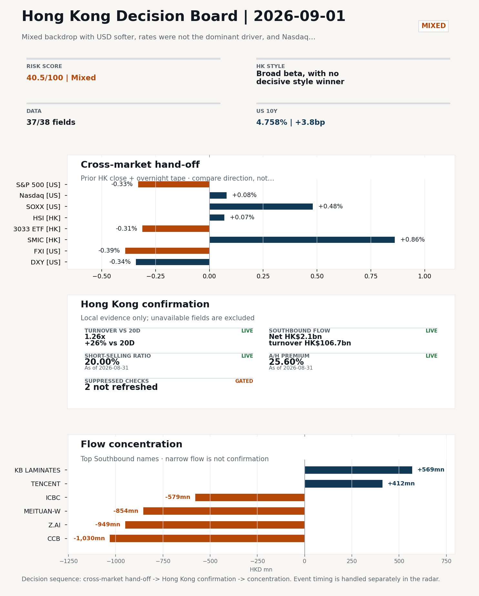
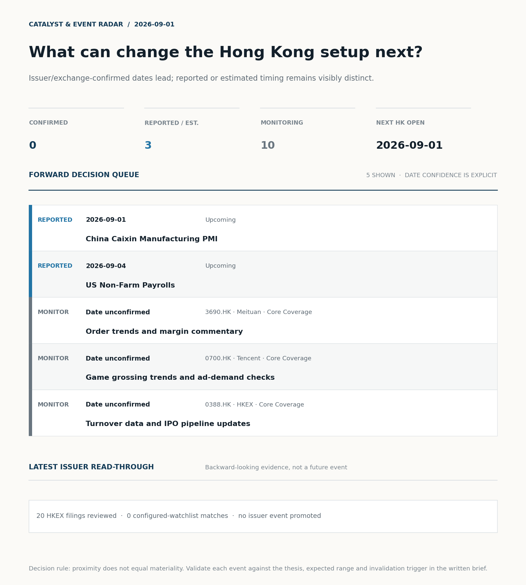
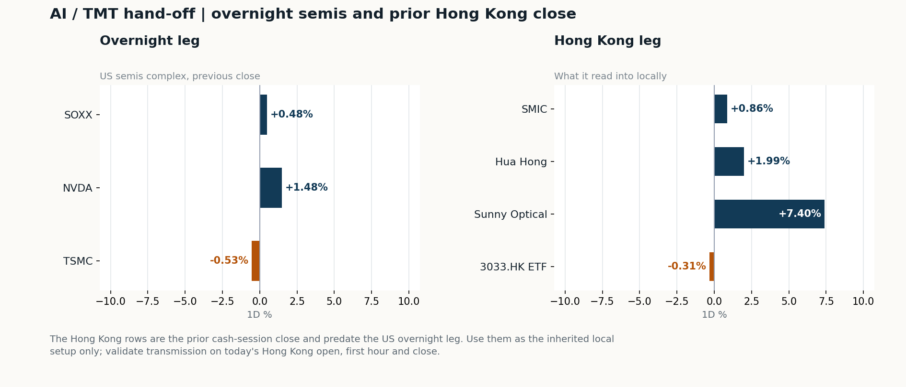
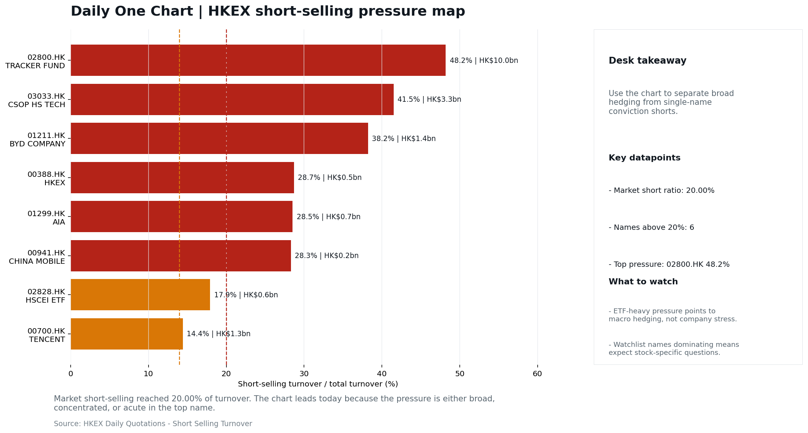

# Morning Research Workbench | 2026-09-01

> **Commute reading route:** `Layer 1 scan (5 min)` → `Layer 2 deep read` → `Layer 3 and appendix if time allows`
>
> Mode: `Trading Daily` | Keep the report execution-oriented: what mattered in the completed session, what can move Hong Kong leadership, and what needs fast follow-up.

_Data through: US/global `2026-08-31` | HK `2026-08-31` | A-share `2026-08-31` | Generated `2026-09-01 08:38:13`_

## Executive Summary

- **Did yesterday's call work?** UNRESOLVED - No comparable next close is available yet, so the call is still open.
- **What changed overnight?** Semis led higher: SOXX +0.48%, NVDA +1.48%, TSMC -0.53%. HSI +0.07% but 3033.HK -0.31%.
- **What it means for AI/TMT** No decisive style winner - Broad beta, with no decisive style winner, a 0.31pp spread. Avoid forcing a growth-versus-value call; let volume, Southbound concentration, and the first-hour relative tape identify leadership.
- **What to watch today** China Caixin Manufacturing PMI. Watch whether SMIC and Hua Hong trade with HSCEI rather than with the overnight semis leg.

## Layer 1 | Scan (5 min)

### 1.1 Yesterday's Call
**Verdict: UNRESOLVED.** No comparable next close is available yet, so the call is still open.

**Recent record.** 6 confirmed / 4 broken over the last 10 scoreable calls (60.0% hit rate). This is a directional close-to-close diagnostic, not a track record.

### 1.2 Opening Decision Board

**Global-to-Hong Kong signals**

_Decision-useful subset: each row states the implication and the next test. Descriptive secondary monitors are kept out of the five-minute scan._

| Signal | Last / move | Interpretation | Confirmation / invalidation |
| --- | --- | --- | --- |
| S&P 500 | 7,686.14 / -0.33% | Broad US risk fell without a clear driver in today's fields; treat it as beta, not a signal. | Watch whether Nasdaq and offshore-China proxies move the same way. |
| Nasdaq 100 | 29,456.97 / +0.08% | Growth outperformed broad beta, a supportive style signal for Hong Kong internet and platform names. Growth advanced despite higher yields, showing momentum resilience but also higher reversal sensitivity. | 3033.HK versus HSI leadership carries the read; rising yields would undo it. |
| Hang Seng Index | 25,584.79 / +0.07% | Broad beta rose helped by a firmer offshore renminbi, with growth and value moving together. | Southbound participation decides whether this is investable or just a print. |
| Hang Seng TECH ETF (3033.HK) | 4.5220 / -0.31% | Hong Kong growth lagged, so broad-index strength is not yet a duration signal. | Needs a stable CNH and Southbound buying to become a duration signal. |
| Semiconductors (SOXX) | 511.04 / +0.48% | Semis moved with the Nasdaq, so the tape is broad rather than cycle-specific. | SMIC and Hua Hong at the open show whether it transmits to Hong Kong. |
| US 10Y | 4.7580% / +3.8bp | The yield proxy rose, tightening the discount-rate backdrop for long-duration Hong Kong growth. | Read it through 3033.HK relative performance, not the index level. |
| USD/CNH | 6.7115 / -0.22% | A stronger offshore renminbi supports the external-risk backdrop for Hong Kong equities. | FXI and Southbound flow decide whether this reaches Hong Kong equities. |
| VIX | 14.92 / **+3.40%** | Higher implied volatility raises the tail-risk premium and weakens risk-on conviction. | Falling volatility on narrowing breadth is a warning, not support. |

_Secondary monitors retained in the source bundle: SMIC (0981.HK), CSI 300, China 10Y, CN-US 10Y spread, DXY, USD/HKD, Brent crude, COMEX gold, Copper._

**Hong Kong local confirmation**

_Coverage gate: 1 unavailable local checks are suppressed here and retained in validation metadata._

| Check | Value | Status | Source / as of | Why it matters |
| --- | --- | --- | --- | --- |
| Main Board turnover vs 20D | 1.26x \| +26% vs 20D | Live local | HKEX \| 2026-08-31 | Trailing 20-session average turnover was HK$250.1bn. |
| Southbound / Northbound net flow | Southbound Net HK$2.1bn \| turnover HK$106.7bn \| Northbound Turnover RMB326.0bn \| net not reported | Live local | HKEX Connect \| 2026-08-31 | Southbound net buy is calculated from HKEX disclosed buy and sell turnover. |
| Short-selling ratio | 20.00% | Live local | HKEX \| 2026-08-31 | Official HKEX stock-level short-selling table, aggregated as a share of total market turnover. |
| AH premium index | 25.60% | Live public | Yahoo \| 2026-08-31 | Fixed 10-name basket, equal-weighted, both legs priced on the same date; comparable across dates. Covered-pair average was +37.17% across 18 pairs. |
| USD/HKD spot vs band | 7.8397 | Live quote | Yahoo \| 2026-08-31 | Mid-band: 103 pips from the weak side and 897 pips from the strong side, so the peg is not an active constraint. |
| Hong Kong leadership | Broad beta, with no decisive style winner | Proxy | HSI / HSCEI / 3033.HK ETF relative \| 2026-08-31 | Use HSI / HSCEI / 3033.HK ETF relative moves as the opening style read. |

**Risk state and evidence**

**Composite risk score:** `40.5/100` | **Regime:** `Mixed`

| Component | Score impact | Evidence |
| --- | --- | --- |
| US beta | -2.0 | S&P 500 -0.33% |
| HK growth ETF proxy | -1.6 | 3033.HK ETF -0.31% |
| Semis complex | +2.4 | SOXX +0.48% |
| Offshore China proxy | -2.0 | FXI -0.39% |
| Dollar pressure | +3.4 | DXY -0.34% |
| Volatility | -6.8 | VIX +3.40% |
| HK short-selling | -8 | Short-selling ratio 20.00% |
| HK turnover | +5 | Turnover 1.26x 20D |

_Base 50 plus the component deltas above. Semis complex entered the score on 2026-08-22; earlier scores in the ledger exclude it._

**Morning Checklist**

1. **Mixed backdrop with USD softer, rates were not the dominant driver, and Nasdaq 100 outperformed FXI**
 Overnight regime | Start by deciding whether the day is about Mixed conditions or a style pivot.
2. **China NBS Manufacturing PMI (Past expected window (unverified))**
 Macro / policy | Growth direction, cyclicals, and manufacturing-chain pricing | Industries: Machinery, Building materials, Industrials
3. **US Non-Farm Payrolls (Upcoming)**
 Macro / policy | Watch whether it changes the day's core market narrative | Industries: Market-wide
4. **[A] Aon CEO says insurance broker seeks to build 'premiere middle market platform' with purchase of rival USI**
 News / announcements | Capital allocation or shareholder-return events can trigger a valuation reset

## Visual Dashboard

**Catalyst & Event Radar**

**Chart read:** No issuer/exchange-confirmed event date is populated; 3 reported or estimated timing item(s) and 10 undated trigger(s) remain explicit.

_Source: Public calendars, issuer disclosures and configured research watchlists_
## Layer 2 | Core Research (20-30 min)

### 2.1 Global-to-Hong Kong Transmission
**Market Setup**
**Core tape.** Overnight US action was mixed rather than directional.
**Main driver.** The prior-HK session (2026-08-28) was balanced and unconvincing, with 3033.HK -0.31% versus HSCEI flat and short-selling elevated at 20.0% (76th percentile), so today's open is best read as continuation of a mixed backdrop rather than a fresh catalyst.
**HK relevance.** For the 2026-09-01 HK session, leadership is more useful than index direction, and it will be set by HK semis versus Nasdaq leadership and by how CNH behaves after a -0.22% USD/CNH move overnight.

**Key Drivers**
- Elevated HK short-selling at 20.00% (76th percentile of 60 sessions) is the main drag flag.
- HK semis sent a constructive signal.
- WTI +3.86% and copper +2.32% are second-order.

**Hong Kong Read-Through**
**Opening implication.** Expect a flat-to-slightly-positive open with leadership concentrated in HK semis (SMIC, Hua Hong) if NVDA and SOXX hold their overnight gains into Asia trade. Confirm broad-beta only if HSI breadth improves and 3033.HK-versus-HSCEI spread stays inside 0.5pp.
_Hong Kong style leadership and flow confirmation are set out in the Hong Kong review below._

**Watch Points**
- USD composite moved lower by -0.17pct intraday, with a 0.187pct range.
- Main turning points appeared around 2026-08-31 08:05 trough / 2026-08-31 08:25 peak / 2026-08-31 08:40 peak, suggesting event-driven repricing rather than a clean one-way USD move.
- The biggest cross-asset divergence was Nasdaq 100 versus FXI, a spread of 0.824pct.
- Gold moved +0.74pct intraday with a 1.088pct high-low range.

**Curated overnight stories**
1. **Jackson Hole analyst roundup: Warsh's speech sends hike chances higher, may put Fed 'at**
 Why it matters: Shifts the US rate path debate toward a possible hike and flags potential friction between the Fed and the Treasury.
 HK read-through: Indirect but important for HK via USD direction, HKD-peg implied funding, and the cost-of-capital framing for Hong Kong growth and property names.
2. **China NBS Manufacturing PMI (past expected window, unverified) and upcoming Caixin**
 Why it matters: First-party read on China's manufacturing cycle, with implications for cyclicals, industrials, and pricing power across the supply chain.
 HK read-through: Direct read on China demand. Drives HK cyclicals (machinery, building materials, industrials), commodities-linked names, and mainland-exposed banks.
3. **Aon CEO says insurance broker seeks to build 'premiere middle market platform' with**
 Why it matters: Large insurance-broker M&A; capital-allocation/valuation-reset event for the global insurance and brokerage complex.
 HK read-through: Limited direct impact, but relevant for AIA, Ping An, and other HK-listed insurers if it reframes the middle-market brokerage thesis or valuation multiples in the sector.
4. **Z.ai shares surge 8% after releasing new AI model running only on Chinese chips**
 Why it matters: Product-cycle and order-validity signal for domestic AI compute stack; relevant to the China semis and AI hardware narrative.
 HK read-through: Sentiment cue for HK-listed China AI and semiconductor names (e.g., SMIC, Hygon, Cambricon-adjacent plays). Likely short-lived unless follow-up confirms production deployment.
5. **Corn and wheat prices jump to highest in more than three years**
 Why it matters: Sharp move in agricultural commodities with potential spillover into food inflation expectations globally.
 HK read-through: Indirect. Read-through to HK consumer staples with China food exposure (e.g., WH Group, China Mengniu, Uni-President China) if feed-cost pressure is sustained.

**AI / TMT hand-off**

**Overnight leg.** The overnight semis leg was flat (+0.48% average), so it does not set the direction for Hong Kong tech today.
**Hong Kong expression.** Let local flow and style leadership drive the tech read rather than the overnight tape.
**Observable test.** Watch whether SMIC and Hua Hong trade with HSCEI rather than with the overnight semis leg.

| Name | Role in the chain | 1D | Leg |
| --- | --- | --- | --- |
| SOXX | Semis complex | +0.48% | overnight |
| NVDA | AI capex narrative | +1.48% | overnight |
| TSMC | Foundry demand | -0.53% | overnight |
| SMIC | Leading-edge / domestic substitution | +0.86% | Hong Kong |
| Hua Hong | Mature-node pricing cycle | +1.99% | Hong Kong |
| Sunny Optical | Hardware and optics supply chain | +7.40% | Hong Kong |
| 3033.HK ETF | Broad HK tech beta | -0.31% | Hong Kong |

**Clock discipline.** The Hong Kong rows are the prior cash-session close and predate the US overnight leg. Use them as the inherited local setup only; validate transmission on today's Hong Kong open, first hour and close.
**Single-name outlier.** Sunny Optical +7.40% moved far outside the rest of the Hong Kong leg. Treat as company-specific until checked; do not read it as a cycle signal.

### 2.2 Hong Kong Local Tape and Flow
**Local Tape Setup**
**Local read.** Hong Kong and A-share follow-through on 2026-09-01 should be read as continuation of a mixed tape, not a fresh catalyst.
**Verification point.** Cross-asset, Nasdaq 100 +0.08% versus FXI -0.39% left a ~0.82pp Nasdaq-100-vs-FXI gap, so the overnight bid was US-tech specific rather than broad China risk-on.
**Risk to watch.** The constructive signal sits in HK semis: SMIC +0.86% and Hua Hong +1.99% held up despite TSMC ADR -0.53% and SOXX only +0.48%, which is the clearest local expression and the most defensible read into today's open.

**Style and Local Leadership**
**Style call.** Broad beta, with no decisive style winner.
- **Evidence:** 3033.HK and HSCEI were separated by only 0.31pp (-0.31% versus +0.00%)
- **Portfolio meaning:** Avoid forcing a growth-versus-value call; let volume, Southbound concentration, and the first-hour relative tape identify leadership.
- **Cross-market read:** Hang Seng +0.07% / HSCEI +0.00% / 3033.HK ETF -0.31%. Offshore China proxy FXI -0.39% and USD/CNH -0.22% frame cross-border risk appetite. USD/HKD last traded around 7.8397, which keeps the Hong Kong funding lens in focus.

**Flow Confirmation**
Official Stock Connect evidence is available; the Flow Tracker confirms whether local money supports the price action.

**Follow-Through Checklist**
**Follow-through check.** Confirmation test: (1) 3033.HK-versus-HSCEI spread holds inside 0.5pp on the open and SMIC/Hua Hong extend their prior-day gains with positive breadth.
**Failure condition.** Reclassify the tape when either 3033.HK or HSCEI opens a sustained 0.5pp relative lead with flow confirmation.

**Cross-asset attribution**

| Driver | Direction | Score | Evidence | HK implication |
| --- | --- | --- | --- | --- |
| Short-selling pressure | drag | 3.5 | HKEX short-selling ratio was 20.00%. | Elevated short activity argues for extra confirmation before chasing rebounds. |
| Hong Kong participation | supportive | 2.59 | Main Board turnover was 1.26x the 20-session average. | Higher participation makes local price action more credible. |
| Dollar / CNH pressure | supportive | 0.51 | DXY -0.34% / USD-CNH -0.22% | A stable or softer CNH makes Hong Kong follow-through more credible. |

**Local flow evidence**

**Flow Takeaways**
- Short-selling pressure is elevated, so local rebounds need cleaner breadth and flow confirmation.
- Stock Connect Southbound: net HK$2.1bn on turnover HK$106.7bn (as of 2026-08-31).
- Stock Connect Northbound: turnover RMB326.0bn; public file provides total turnover/top active names, not full net-buy.
- AH premium: fixed 10-name basket +25.60% (comparable across dates); covered-pair average +37.17% over 18 pairs; widest premium: China Railway Construction 105.34%.

**Stock Connect Southbound Active Names**

| # | Ticker | Name | Buy | Sell | Net buy | HKEX turnover rank |
| --- | --- | --- | --- | --- | --- | --- |
| 1 | 00939.HK | CCB | HK$275.3mn | HK$1,305.7mn | HK$-1,030.4mn | 5 |
| 2 | 02513.HK | Z.AI | HK$2,561.7mn | HK$3,511.1mn | HK$-949.4mn | 1 |
| 3 | 03690.HK | MEITUAN-W | HK$1,297.1mn | HK$2,151.3mn | HK$-854.2mn | 1 |
| 4 | 01398.HK | ICBC | HK$165.9mn | HK$744.7mn | HK$-578.8mn | 10 |
| 5 | 01888.HK | KB LAMINATES | HK$1,983.0mn | HK$1,413.7mn | HK$569.4mn | 3 |

**AH Premium Dispersion**

| Name | A ticker | H ticker | Premium | As of |
| --- | --- | --- | --- | --- |
| China Railway Construction | 601186.SS | 1186.HK | +105.34% | 2026-08-31 |
| China Communications Construction | 601800.SS | 1800.HK | +91.17% | 2026-08-31 |
| New China Life | 601336.SS | 1336.HK | +51.00% | 2026-08-31 |

**HKEX Short-Selling Watch**

| Ticker | Name | Short ratio | Short turnover | Total turnover |
| --- | --- | --- | --- | --- |
| 00388.HK | HKEX | 28.69% | HK$0.5bn | HK$1.7bn |
| 00700.HK | TENCENT | 14.41% | HK$1.3bn | HK$9.1bn |
| 00941.HK | CHINA MOBILE | 28.31% | HK$0.2bn | HK$0.8bn |

- **Short-value leaders:** 02800.HK TRACKER FUND (HK$10.0bn); 03033.HK CSOP HS TECH (HK$3.3bn); 07709.HK XL2CSOPHYNIX (HK$2.3bn); 01211.HK BYD COMPANY (HK$1.4bn).

### 2.3 Macro Transmission
**Desk read.** Today's Hong Kong session opens into a mixed global backdrop: USD was softer, rates were not the dominant driver, and Nasdaq 100 outperformed FXI.

**Market sensitivity.** That combination argues for selective Hong Kong leadership rather than a broad beta bid, with the relative Nasdaq-versus-FXI tilt keeping HK tech and China ADRs in a wait-and-see posture into today's cash open.

**HK implication.** The macro agenda is bookended by China activity surveys and a US labour print.

**Macro watchpoints**
- Verify the official 2026-08-31 China NBS Manufacturing PMI print and immediate reaction before sizing into HK cyclicals and materials.
- US 2y/10y yields and DXY into the Hong Kong open; softer USD and stable rates would extend the Nasdaq-outperforming-FXI tilt and favour HK tech
- VIX at 14.92 (+3.40%): keep sizing tighter and stops closer given rising option-implied volatility, even with the level still low in absolute
- WTI at 86.62 (+3.86%): separate the geopolitics share from any demand-repair share before extrapolating into HK energy and transport names.

| Time | Region | Event | Status | Desk read |
| --- | --- | --- | --- | --- |
| | CN | China NBS Manufacturing PMI | Past expected window (unverified) | Impact: Growth direction, cyclicals, and manufacturing-chain pricing \| Attention: 5/5 \| Industries: Machinery, Building materials, Industrials |
| | US | US Non-Farm Payrolls | Upcoming | Impact: Watch whether it changes the day's core market narrative \| Attention: 5/5 \| Industries: Market-wide |
| | CN | China Caixin Manufacturing PMI | Upcoming | Impact: Growth direction, cyclicals, and manufacturing-chain pricing \| Attention: 3/5 \| Industries: Machinery, Building materials, Industrials |

**Positioning and risk backdrop**

- Detailed local flow evidence is covered under Flow Tracker and Attribution; keep this section focused on options, hedging, and macro-positioning risk.

### 2.4 Company Micro Research and Catalysts

| Grade | Sector | Headline | Why it matters | Horizon |
| --- | --- | --- | --- | --- |
| A | Financials | Aon CEO says insurance broker seeks to build 'premiere middle market | Capital allocation or shareholder-return events can trigger a valuation | Medium-term trend |
| B | Semiconductors and AI | Z.ai shares surge 8% after releasing new AI model running only on | This is more about order visibility and product-cycle validation | Short-term catalyst |

**Company Event Takeaway**
**Desk read.** Session 2026-08-31 closed with a mixed global backdrop and no fresh ratings changes to act on.
**Why it matters.** The most actionable single-name move was BYD (1211.HK), down 5.17% on the day at HKD 87.20, sitting at 66% of its 60-session band.
**Follow-up.** No fresh profit-alert magnitude is available yet, so the nine HKEX profit warnings (00333.HK, 01496.HK, 00875.HK, 01152.HK, 01255.HK, 01518.HK, 01561.HK, 08270.HK, plus one more) should remain aggregated pending filings review.

**LLM Quick Takes**
- **1211.HK** | Fact: closed -5.17% at HKD 87.20, range position 65.7% (mid-range). Investor read: the move is large enough to check for a fundamental or regulatory trigger before the next session…
- **3690.HK** | Fact: closed +1.81% at HKD 78.90, range position 49.4%; Q2 2026 results showed 14.4% revenue growth and a return to profit, with Keeta international traction cited. Investor read…
- **0700.HK** | Fact: closed -0.48% at HKD 453.00, range position 51.2%; flow includes Enflame IPO priced at 62x sales (chip-strategy validation) and Tencent Cloud - Elastic AI tools update. Investor read…
- **1299.HK** | Fact: closed +0.99% at HKD 76.25, range position 63.8%; no fresh news attached. Investor read: marginal move…

Decision filter<h4>No immediate portfolio catalyst: 20 official filings were screened and the low-signal market set stays aggregated.</h4>
20 profit warnings

<strong>20</strong>Official filings

<strong>0</strong>Watchlist hits

<strong>0</strong>Actionable events

<strong>No event cleared the portfolio decision filter.</strong>

Broad-market filings remain traceable in the source appendix; they are not expanded here without a watchlist, estimate or liquidity read-through.

<strong>Coverage boundary.</strong> sell-side rating changes, IPO / grey-market monitor were not decision-grade in this run; their absence is not treated as confirmation that no event exists.

**Core coverage requiring follow-up**

**Core coverage**

| Name | Ticker | Last | 1D | Range position | Morning note |
| --- | --- | --- | --- | --- | --- |
| Meituan | 3690.HK | 78.90 | +1.81% | Mid-range | Marginally higher (+1.81%), mid-range at 49% of its 60-session band. |
| Tencent | 0700.HK | 453.00 | -0.48% | Mid-range | Marginally lower (-0.48%), mid-range at 51% of its 60-session band. |

**Recent headlines for Meituan:**
- [Meituan (MPNGF) (Q2 2026) Earnings Call Highlights: Record Revenue and Strategic AI Pivot Drive...](https://finance.yahoo.com/markets/stocks/articles/meituan-mpngf-q2-2026-earnings-190123345.html) (GuruFocus.com)
**Recent headlines for Tencent:**
- [What Is Tencent Holdings (SEHK:700) Building With Its New AI Cloud And Gaming Tools?](https://finance.yahoo.com/technology/ai/articles/tencent-holdings-sehk-700-building-210705313.html) (Simply Wall St.)

**Priority follow-up**

| Name | Ticker | Last | 1D | Range position | Morning note |
| --- | --- | --- | --- | --- | --- |
| BYD Company | 1211.HK | 87.20 | -5.17% | Mid-range | Down 5.17% on the session, mid-range at 66% of its 60-session band. |
| AIA | 1299.HK | 76.25 | +0.99% | Mid-range | Marginally higher (+0.99%), mid-range at 64% of its 60-session band. |

### 2.5 Morning Meeting Questions
No divergence, tail reading or coverage gap stood out today, so there is no obvious follow-up question beyond the base case above.

## Layer 3 | Session Playbook (8-12 min)

### 3.1 Base Case and Scenario Map
**Starting posture.** Broad beta, with no decisive style winner (medium confidence); composite risk `40.5/100` (Mixed). Avoid forcing a growth-versus-value call; let volume, Southbound concentration, and the first-hour relative tape identify leadership.

**Scenario map**

| Scenario | Observable trigger | Interpretation | Research response |
| --- | --- | --- | --- |
| Selective growth confirms | 3033.HK keeps a >0.5pp first-hour lead over HSCEI; SMIC and Hua Hong stop lagging broad beta; CNH is stable. | The prior style split has live price confirmation, but is not yet broad China risk-on. | Prioritize internet/platform relative strength; verify participation again at the close. |
| Broad beta takes over | HSI and HSCEI rise together, breadth improves and the 3033.HK lead narrows without turning negative. | Leadership is broadening from a style trade into market beta. | Expand the research set from growth leaders to financials, SOEs and index-heavy names. |
| Risk-off continuation | 3033.HK loses its lead, semis underperform HSCEI and CNH depreciation accelerates. | The prior divergence was a temporary pocket of strength rather than a durable hand-off. | Treat rebounds as unconfirmed; focus on balance-sheet, catalyst and crowding risk. |

**Clocked validation scorecard**

| Window | Check | Prior evidence | Pass condition | What it decides |
| --- | --- | --- | --- | --- |
| 09:30-10:30 | 3033.HK vs HSCEI | -0.31pp at the prior close | 3033.HK retains >0.5pp relative lead | Whether growth leadership survives the open |
| 09:30-10:30 | Semiconductor hand-off | SMIC +0.86%; Hua Hong Semiconductor +1.99% | Stabilise after the open; at least one stops underperforming HSCEI | Whether overnight semis pressure is contained locally |
| 09:30-10:30 | HSI price zone | 25,585 vs 25,500 / 26,000 reference grid | Hold above the lower grid or reclaim the upper grid with breadth | Whether broad beta is stabilising; grid is derived, not technical analysis |
| 09:30-10:30 | USD/CNH | 6.7115 \| -0.22% | No acceleration in CNH depreciation | Whether FX permits a clean Hong Kong risk extension |
| At close | Turnover | 1.26x \| +26% vs 20D | At least 1.0x the 20-session average | Whether the move had normal participation |
| At close | Southbound | Net HK$2.1bn \| turnover HK$106.7bn | Net buying remains positive and broadens beyond one or two names | Whether mainland money confirms the price move |
| At close | Short pressure | 20.00% | Falls versus the prior verified reading (20.00%) | Whether rebound conviction improved |

**Upgrade rule.** Confirm a broad-beta session only if HSI breadth and turnover improve without a sharp 3033.HK-versus-HSCEI split.
**Kill switch.** Reclassify the tape when either 3033.HK or HSCEI opens a sustained 0.5pp relative lead with flow confirmation.
**Clock discipline.** At 07:30, same-day Southbound, turnover and short-selling outcomes are not known. Use the first-hour price/FX checks provisionally and make the final classification only after the close.
**Event clock.** Same-day decision items: China Caixin Manufacturing PMI, China Caixin Manufacturing PMI.

### 3.2 Daily One Chart
**Daily One Chart | HKEX short-selling pressure map**

**Chart read.** Market short-selling reached 20.00% of turnover.
**Why it matters.** The chart leads today because the pressure is either broad, concentrated, or acute in the top name.

_Source: HKEX Daily Quotations - Short Selling Turnover_

## Optional Appendix | Traceability and Performance (10-15 min)

### Report Metadata
> Date policy: Review date 2026-08-31 is treated as `Trading Daily`. | Global (US/Europe) data date is 2026-08-31; adapter effective date is 2026-08-31 and summary date is 2026-08-31. | Hong Kong local data date is 2026-08-31; role: same-session local cash tape.
> Market data quality: Coverage: `37/38` | Missing: `1`
> Report quality: `91.4/100` | Grade `A` | Status `usable with caveats`

### Report Quality and Validation
- **Quality score:** 91.4/100 | **Grade:** A | **Status:** usable with caveats
- **Run summary:** 8 healthy | 2 caveat | 0 failed
- **Release recommendation:** Send with caveats | The report is usable, but the advisory guidance should travel with it so readers understand the data gaps.

| Source | Status | Bucket |
| --- | --- | --- |
| Macro calendar | partial | caveat |
| Risk and sentiment feed | partial | caveat |

**Desk-use guidance summary:** 0 blocking | 1 advisory

**Desk-use guidance**
- **Advisory:** Questionable narrative fields were removed; use the deterministic fallback copy and review the audit trail.

| Weak component | Score | Read |
| --- | --- | --- |
| Hong Kong local metrics | 54.1 | 5 live, 3 proxy, 3 unavailable local checks. |

**Quality warnings**
- Hong Kong local metrics is weak: 5 live, 3 proxy, 3 unavailable local checks.
- Narrative fact-check guardrail produced warnings; review the validation table before relying on narrative sections.

**Narrative fact-check guardrail**
- Checked 28 numeric claims; 0 numeric mismatch(es), 0 logic warning(s); 12 structured claims, 0 source/text warning(s); 0 critical, 0 review. Replaced 2 unsafe narrative field(s) with deterministic fallback copy.
- **Deterministic fallback fields:** overnight_drivers[0], tasks.overnight_review.drivers[0]

_Full component weights, per-source freshness, adapter status and provenance records are archived with this report under `audit/` rather than printed here._

### Historical Signal Performance
- **Readiness:** exploratory with caveats | 69 observations | 90 active signal dates | next-close entry, 10bps cost, no same-day returns.
- **Interpretation boundary:** exploratory until a benchmark reaches 252 sessions and 100 active-signal sessions.
- **Data-quality caveat:** 23 conflicting price revision(s) and 6 non-session observation(s) remain in the research ledger.
- **Daily-use boundary:** cumulative return, Sharpe and the performance chart stay out of the daily commute edition until the sample and trading-calendar gates pass; use Yesterday's Call instead.

### Source Links
- [Aon CEO says insurance broker seeks to build 'premiere middle market platform' with purchase of rival USI](https://www.cnbc.com/2026/08/31/aon-ceo-says-usi-deal-seeks-to-build-premiere-middle-market-insurance-platform.html) (cnbc_markets)
- [Z.ai shares surge 8% after releasing new AI model running only on Chinese chips](https://www.cnbc.com/2026/08/27/zai-shares-surge-new-ai-model-using-chinese-chips.html) (cnbc_markets)
- [Meituan (MPNGF) (Q2 2026) Earnings Call Highlights: Record Revenue and Strategic AI Pivot Drive...](https://finance.yahoo.com/markets/stocks/articles/meituan-mpngf-q2-2026-earnings-190123345.html) (GuruFocus.com)
- [Meituan Returns to Profit as Food-Delivery Competition Eases](https://www.wsj.com/business/earnings/meituan-returns-to-profit-as-food-delivery-competition-eases-1026a0e9?siteid=yhoof2&yptr=yahoo) (The Wall Street Journal)
- [What Is Tencent Holdings (SEHK:700) Building With Its New AI Cloud And Gaming Tools?](https://finance.yahoo.com/technology/ai/articles/tencent-holdings-sehk-700-building-210705313.html) (Simply Wall St.)
- [Tencent's Enflame IPO Prices Its AI Dependency at 62 Times Sales](https://finance.yahoo.com/technology/ai/articles/tencents-enflame-ipo-prices-ai-180238163.html) (GuruFocus.com)
- [Alibaba (BABA) Report Flags AI Data Center Bottlenecks Shaping Its Next Investment Phase](https://finance.yahoo.com/technology/ai/articles/alibaba-baba-report-flags-ai-161459552.html) (Simply Wall St.)
- [00333.HK Profit warning / alert announcement](http://www1.hkexnews.hk/listedco/listconews/sehk/2026/0831/2026083100934.pdf) (HKEXnews)
- [01496.HK Profit warning / alert announcement](http://www1.hkexnews.hk/listedco/listconews/sehk/2026/0831/2026083100716.pdf) (HKEXnews)
- [00875.HK Profit warning / alert announcement](http://www1.hkexnews.hk/listedco/listconews/sehk/2026/0828/2026082801978.pdf) (HKEXnews)
- [01152.HK Profit warning / alert announcement](http://www1.hkexnews.hk/listedco/listconews/sehk/2026/0828/2026082800863.pdf) (HKEXnews)
- [01255.HK Profit warning / alert announcement](http://www1.hkexnews.hk/listedco/listconews/sehk/2026/0828/2026082802456.pdf) (HKEXnews)
- [01518.HK Profit warning / alert announcement](http://www1.hkexnews.hk/listedco/listconews/sehk/2026/0828/2026082804114.pdf) (HKEXnews)
- [01561.HK Profit warning / alert announcement](http://www1.hkexnews.hk/listedco/listconews/sehk/2026/0828/2026082802706.pdf) (HKEXnews)
- [08270.HK Profit warning / alert announcement](http://www1.hkexnews.hk/listedco/listconews/gem/2026/0828/2026082800571.pdf) (HKEXnews)
